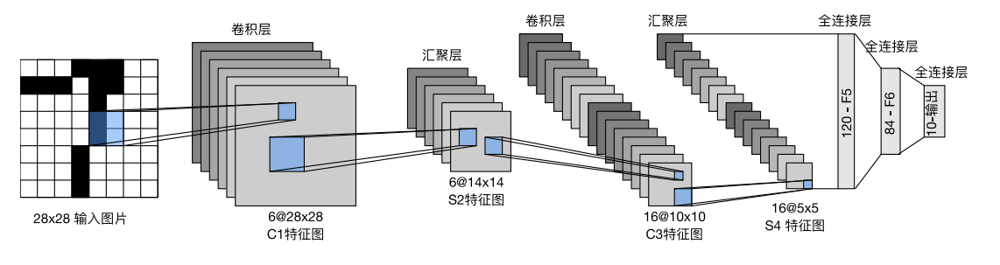
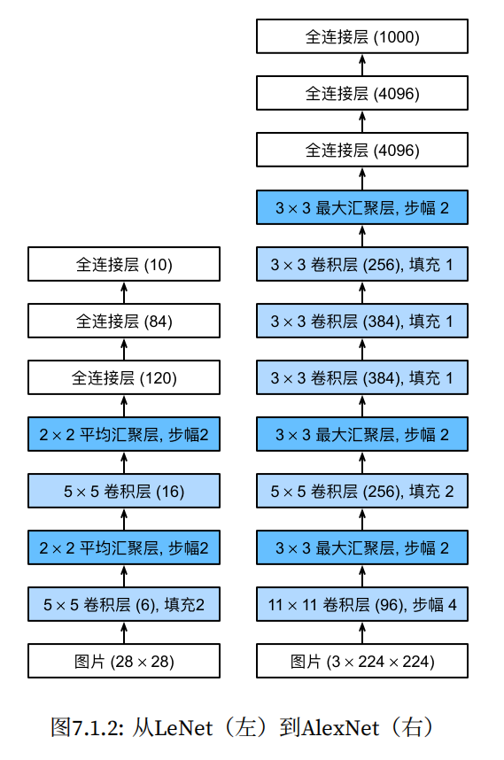
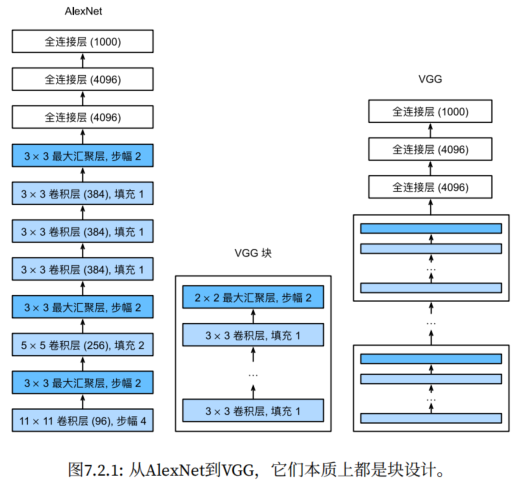
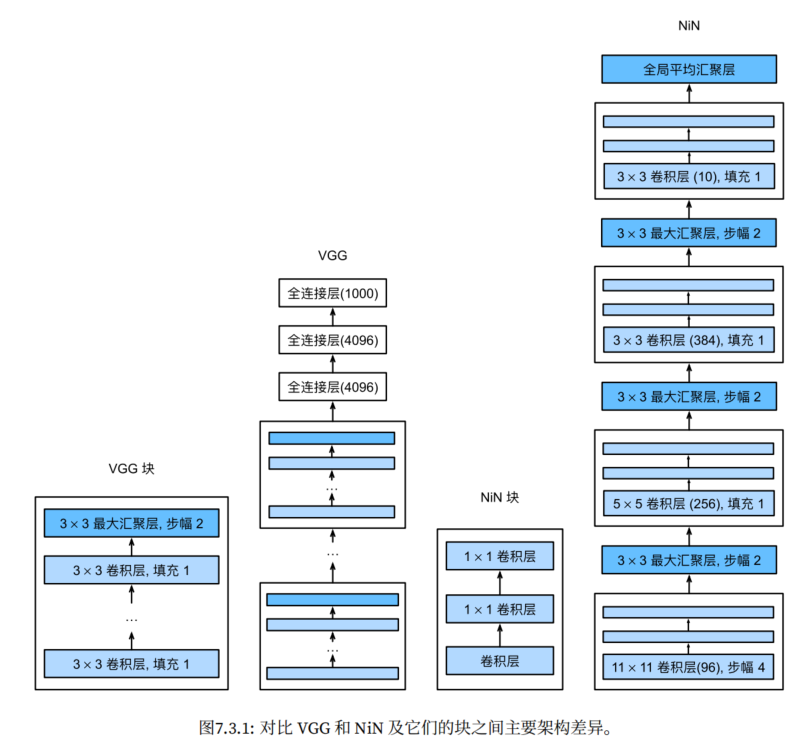
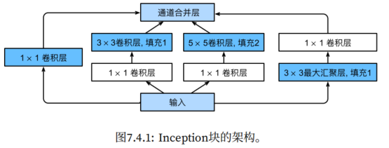
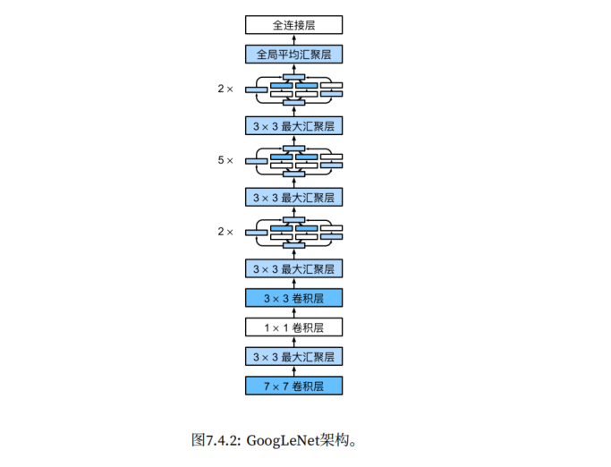
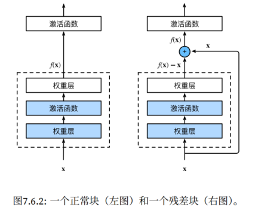
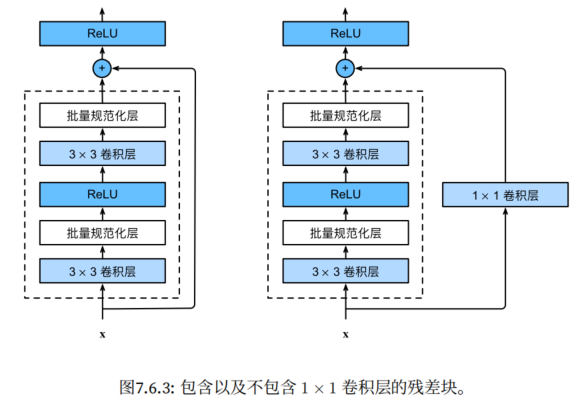
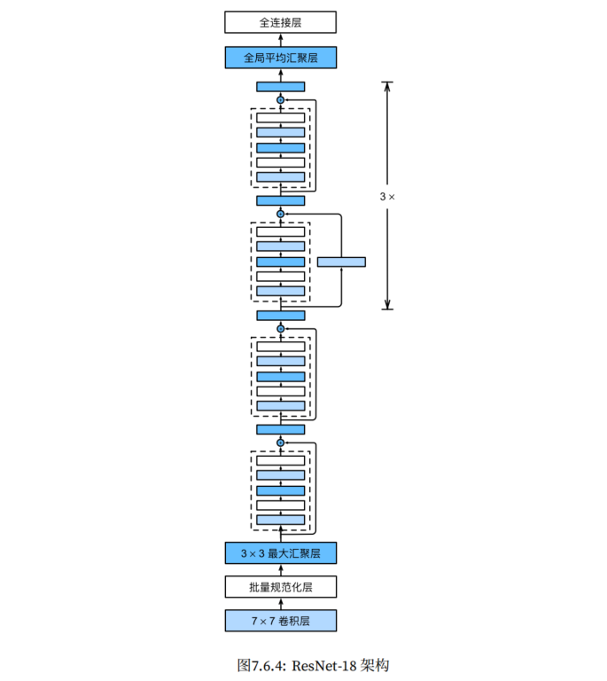
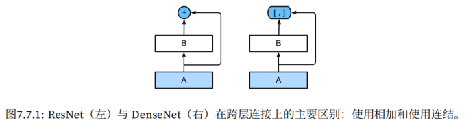

# 02 - 卷积神经网络

## 1. 卷积神经网络基础

### 1.1 背景

卷积层解决全连接层的两大问题：
- **平移不变性**：无论物体出现在图片哪个位置，识别结果一致
- **局部性**：每个神经元只需关注局部区域（局部感受野）

### 1.2 从零实现

卷积运算（互相关运算）：

```python
# 二维互相关运算
def corr2d(X, K):
    """X: 输入, K: 卷积核"""
    h, w = K.shape
    Y = torch.zeros((X.shape[0] - h + 1, X.shape[1] - w + 1))
    for i in range(Y.shape[0]):
        for j in range(Y.shape[1]):
            Y[i, j] = (X[i:i+h, j:j+w] * K).sum()
    return Y
```

卷积层：

```python
class Conv2D(nn.Module):
    def __init__(self, kernel_size):
        super().__init__()
        self.weight = nn.Parameter(torch.rand(kernel_size))
        self.bias = nn.Parameter(torch.zeros(1))

    def forward(self, X):
        return corr2d(X, self.weight) + self.bias
```

### 1.3 简洁实现

```python
# 二维卷积
nn.Conv2d(in_channels, out_channels, kernel_size, stride=1, padding=0, bias=True)
```

- `in_channels`：int，输入通道数
- `out_channels`：int，输出通道数
- `kernel_size`：int/tuple，卷积核大小。例如 `kernel_size=3`（高宽均为3）、`kernel_size=(3,5)`（高为3宽为5）
- `stride`：int/tuple，步幅，默认值为1
- `padding`：int/tuple，填充，默认值为0
- `bias`：bool，偏置，默认值为 True。如果后面接了 BatchNorm，通常要关闭偏置，手动设置 `bias=False`

### 1.4 核心概念 

#### 1.4.1 填充和步幅

**填充的主要作用**：防止累积丢失边缘像素

**步幅的主要作用**：为了高效计算或者缩减采样次数

**重要公式**：给定输入尺寸为 $n_h \times n_w$，卷积核 $k_h \times k_w$，填充 $p_h \times p_w$，步幅 $s_h \times s_w$：

$$\text{输出高度} = \left\lfloor \frac{n_h - k_h + 2p_h + s_h}{s_h} \right\rfloor$$

$$\text{输出宽度} = \left\lfloor \frac{n_w - k_w + 2p_w + s_w}{s_w} \right\rfloor$$

**两个常用场景**：

- 保持特征图大小不变：取 `padding = kernel_size // 2, stride = 1`，其中 kernel_size 为奇数
- 减半特征图大小：取 `padding = kernel_size // 2, stride = 2`

#### 1.4.2 多输入多输出通道

```python
# 输入通道 ci，输出通道 co
nn.Conv2d(ci, co, kernel_size=1)
```

注意：1×1 卷积是一种常用的卷积核，它的主要作用有：
- 调整通道数量（降维/升维通道数）
- 跨通道信息交互
- 以较低成本增加非线性（配合激活函数，能在不显著增加参数的前提下，为网络增加了一条额外的非线性路径）

#### 1.4.3 汇聚层（Pooling）

**汇聚层的主要作用**：降低卷积层对位置的敏感性，同时降低对空间降采样表示的敏感性。

**汇聚层特点**：

- **无**可学习参数
- 降低空间维度（缩减计算量）
- 提供一定的平移不变性
- **不改变通道数**

```python
# 最大汇聚
nn.MaxPool2d(kernel_size=3, stride=None, padding=0)
# stride 默认值等于 kernel_size
# padding 默认值 0

# 平均汇聚
nn.AvgPool2d(kernel_size=3, stride=None, padding=0)
# stride 默认值等于 kernel_size
# padding 默认值 0

# 全局平均汇聚（常用于替代全连接层）
nn.AdaptiveAvgPool2d((1, 1))  
# output_size：int/tuple，例如 output_size=1，等价于 output_size=(1, 1)
```

#### 1.4.4 批量规范化（Batch Normalization）

##### 原理

对每个 mini-batch 的进行归一化：$$BN(x) = \gamma \odot \frac{x - \mu_B}{\sqrt{\sigma_B^2 + \epsilon}} + \beta$$

- $\mu_B, \sigma_B^2$：当前 batch 的均值和方差
- $\gamma, \beta$：可学习的缩放和偏移参数
- $\epsilon$：防止除零的小常数

说明：

1. **训练时**用当前 batch 的统计量；**推理时**用训练过程中累计的全局均值/方差（移动平均）
2. **全连接层**的 BatchNorm（nn.BatchNorm1d）：输入形状 (batch, features)，会对每个特征维度，在整个 batch 上求均值/方差，所以一共统计 `features` 组均值&方差
3. **卷积层**的 BatchNorm（nn.BatchNorm2d）：输入形状 (batch, channels, H, W)，会对每个通道，在整个 batch × H × W 上求均值/方差，所以一共统计 `channels` 组均值&方差
4. BatchNorm 主流是**在全连接层/卷积层之后、激活函数之前**使用。不过对于极深层的 ResNet，采用 `BN层→激活层→卷积层` 的效果会更好。

##### 作用

- 加速深层网络的训练收敛
- 允许使用更大的学习率
- 减少对初始化的敏感度
- 有一定正则化效果（减少对 Dropout 的需求，但同样可以与 Dropout 一起使用）

##### 从零实现

```python
def batch_norm(X, gamma, beta, moving_mean, moving_var, eps, momentum):
    if not torch.is_grad_enabled():  # 推理模式
        X_hat = (X - moving_mean) / torch.sqrt(moving_var + eps)
    else:  # 训练模式
        assert len(X.shape) in (2, 4)  # 全连接: (B, C), 卷积: (B, C, H, W)
        if len(X.shape) == 2:
            mean = X.mean(dim=0)
            var = ((X - mean) ** 2).mean(dim=0)
        else:
            mean = X.mean(dim=(0, 2, 3), keepdim=True)
            var = ((X - mean) ** 2).mean(dim=(0, 2, 3), keepdim=True)
        X_hat = (X - mean) / torch.sqrt(var + eps)
        moving_mean = momentum * moving_mean + (1.0 - momentum) * mean
        moving_var = momentum * moving_var + (1.0 - momentum) * var
    Y = gamma * X_hat + beta
    return Y, moving_mean.data, moving_var.data
```

##### 简洁实现

```python
# 全连接层后（输入形状: [N, C]），num_features为特征数
nn.BatchNorm1d(num_features)   

# 卷积层后（输入形状: [N, C, H, W]），num_features为通道数
nn.BatchNorm2d(num_features)
```


## 2. 经典 CNN 架构


| 网络 | 年份 | 核心创新 | 关键组件 |
|------|------|----------|----------|
| LeNet | 1998 | CNN 鼻祖 | Conv → Pool → Conv → FC |
| AlexNet | 2012 | 深度学习突破 | ReLU + Dropout + 数据增强 |
| VGG | 2014 | 块设计 | 3×3 卷积块 → 2×2 pooling |
| NiN | 2014 | 1×1 卷积 | Conv + 1×1×2 + GlobalAvgPool |
| GoogLeNet | 2014 | 多分支并行 | Inception 块（1/3/5 conv + pool 并行） |
| ResNet | 2015 | 残差连接 | 残差连接 `y = F(x) + x` |
| DenseNet | 2017 | 密集连接 | 所有层互连，通道拼接 |

### 2.1 LeNet（1998）



特点：

- 核心为 5 层结构：2 个卷积层 + 3 个全连接层
- 早期激活函数仅有 sigmoid
- 早期汇聚层仅有平均汇聚

```python
net = nn.Sequential(
    nn.Conv2d(1, 6, kernel_size=5, padding=2), nn.Sigmoid(),
    nn.AvgPool2d(kernel_size=2, stride=2),
    nn.Conv2d(6, 16, kernel_size=5), nn.Sigmoid(),
    nn.AvgPool2d(kernel_size=2, stride=2),
    nn.Flatten(),
    nn.Linear(16 * 5 * 5, 120), nn.Sigmoid(),
    nn.Linear(120, 84), nn.Sigmoid(),
    nn.Linear(84, 10)
)
```

### 2.2 AlexNet（2012）



关键设计：
- 比 LeNet 更大更深，由 8 层组成：5 个卷积层 + 3 个全连接层。核心思想：图片高宽不断压缩，通道不断增加（语义信息空间）
- 激活函数使用 ReLU 激活函数
- 汇聚层使用最大汇聚
- 使用 Dropout 防止过拟合
- 数据增强（如翻转、随机裁剪、变色），更大的样本量有效地减少了过拟合

```python
net = nn.Sequential(
    nn.Conv2d(1, 96, kernel_size=11, stride=4), nn.ReLU(),
    nn.MaxPool2d(kernel_size=3, stride=2),
    nn.Conv2d(96, 256, kernel_size=5, padding=2), nn.ReLU(),
    nn.MaxPool2d(kernel_size=3, stride=2),
    nn.Conv2d(256, 384, kernel_size=3, padding=1), nn.ReLU(),
    nn.Conv2d(384, 384, kernel_size=3, padding=1), nn.ReLU(),
    nn.Conv2d(384, 256, kernel_size=3, padding=1), nn.ReLU(),
    nn.MaxPool2d(kernel_size=3, stride=2),
    nn.Flatten(),
    nn.Linear(6400, 4096), nn.ReLU(), nn.Dropout(0.5),
    nn.Linear(4096, 4096), nn.ReLU(), nn.Dropout(0.5),
    nn.Linear(4096, 10)
)
```

> Remark：
>
> 1. AlexNet 使用 ReLU 替代 Sigmoid/Tanh，是为了解决深层网络的梯度消失问题——Sigmoid 导数最大 0.25，多层连乘后梯度指数衰减，深层几乎无法更新；而 ReLU 正半区导数为 1，梯度无损回传。
> 2. AlexNet 中还使用了 Local Response Normalization，但现在看来它并没有什么效果，后续基本没人使用。
> 5. AlexNet 论文中切分模型以便在两个 GPU 上训练，这一工程化技术在随后的六七年里都没怎么被使用，因为绝大多数模型参数量并不大，单个 GPU 足够训练了。但直到最近 BERT、GPT 这种超大型模型出现后，这种切分模型以进行多 GPU 训练的工程化技术又被使用了。

### 2.3 VGG（2014）



关键设计：

- **采用块的设计**，整个 VGG 网络由多个 VGG 块 + 3 个全连接层构成
- **VGG 块** = 多个 3×3 卷积（padding=1）+ 2×2 最大汇聚

```python
def vgg_block(num_convs, in_channels, out_channels):
    layers = []
    for _ in range(num_convs):
        layers.append(nn.Conv2d(in_channels, out_channels, kernel_size=3, padding=1))
        layers.append(nn.ReLU())
        in_channels = out_channels
    layers.append(nn.MaxPool2d(kernel_size=2, stride=2))
    return nn.Sequential(*layers)

# VGG-11 架构（8个卷积层+3个全连接层）
conv_arch = ((1, 64), (1, 128), (2, 256), (2, 512), (2, 512))
def vgg(conv_arch):
    conv_blks = []
    in_channels = 1
    for (num_convs, out_channels) in conv_arch:
        conv_blks.append(vgg_block(num_convs, in_channels, out_channels))
        in_channels = out_channels
    return nn.Sequential(
        *conv_blks,
        nn.Flatten(),
        nn.Linear(out_channels * 7 * 7, 4096), nn.ReLU(), nn.Dropout(0.5),
        nn.Linear(4096, 4096), nn.ReLU(), nn.Dropout(0.5),
        nn.Linear(4096, 10)
    )
```

### 2.4 NiN（2014）



NiN 即网络中的网络，它是 1×1 卷积的典范。核心思想：用 **NiN 块** = 普通卷积 + 两个 1×1 卷积，最后用全局平均池化替代全连接。1×1 卷积实际相当于在每个像素位置上独立作用的全连接层，也就是将空间维度中的每个像素视为单个样本，将通道维度视为不同特征。

```python
def nin_block(in_channels, out_channels, kernel_size, strides, padding):
    return nn.Sequential(
        nn.Conv2d(in_channels, out_channels, kernel_size, strides, padding), nn.ReLU(),
        nn.Conv2d(out_channels, out_channels, kernel_size=1), nn.ReLU(),
        nn.Conv2d(out_channels, out_channels, kernel_size=1), nn.ReLU()
    )

# NiN 架构
net = nn.Sequential(
    nin_block(1, 96, kernel_size=11, strides=4, padding=0),
    nn.MaxPool2d(3, stride=2),
    nin_block(96, 256, kernel_size=5, strides=1, padding=2),
    nn.MaxPool2d(3, stride=2),
    nin_block(256, 384, kernel_size=3, strides=1, padding=1),
    nn.MaxPool2d(3, stride=2),
    nn.Dropout(0.5),
    nin_block(384, 10, kernel_size=3, strides=1, padding=1),
    nn.AdaptiveAvgPool2d((1, 1)),
    # 将四维的输出转成二维的输出，其形状为(批量大小,10)
    nn.Flatten())
```

### 2.5 GoogLeNet（2014）





核心思想：**多分支并行连接**，采用不同尺度的卷积核并行处理，最后沿通道拼接。GoogLeNet 中基本的卷积块被称为 Inception 块。

```python
class Inception(nn.Module):
    def __init__(self, in_channels, c1, c2, c3, c4):
        super().__init__()
        # 分支 1: 1x1 卷积
        self.p1_1 = nn.Conv2d(in_channels, c1, kernel_size=1)
        # 分支 2: 1x1 + 3x3 卷积
        self.p2_1 = nn.Conv2d(in_channels, c2[0], kernel_size=1)
        self.p2_2 = nn.Conv2d(c2[0], c2[1], kernel_size=3, padding=1)
        # 分支 3: 1x1 + 5x5 卷积
        self.p3_1 = nn.Conv2d(in_channels, c3[0], kernel_size=1)
        self.p3_2 = nn.Conv2d(c3[0], c3[1], kernel_size=5, padding=2)
        # 分支 4: 3x3 最大汇聚 + 1x1 卷积
        self.p4_1 = nn.MaxPool2d(kernel_size=3, stride=1, padding=1)
        self.p4_2 = nn.Conv2d(in_channels, c4, kernel_size=1)

    def forward(self, x):
        p1 = F.relu(self.p1_1(x))
        p2 = F.relu(self.p2_2(F.relu(self.p2_1(x))))
        p3 = F.relu(self.p3_2(F.relu(self.p3_1(x))))
        p4 = F.relu(self.p4_2(self.p4_1(x)))
        return torch.cat((p1, p2, p3, p4), dim=1)  # 沿通道拼接
```

### 2.6 ResNet

**核心思想**：假设我们希望学出的理想映射为 f(x)，于是让模型拟合出残差映射 f(x)-x，这通常更容易优化，所以最终还要加上 x，这被称为残差连接。残差连接的主要作用是解决深层网络**退化**问题（网络越深，训练误差反而不降）。



**残差块有两种**，有时会在残差连接时添加 1x1 卷积来调整通道和分辨率：



**ResNet-18 架构图**：



**ResNet-18 的实现**：

```python
class Residual(nn.Module):
    """残差块"""
    def __init__(self, input_channels, num_channels, use_1x1conv=False, strides=1):
        super().__init__()
        self.conv1 = nn.Conv2d(input_channels, num_channels, kernel_size=3, padding=1, stride=strides)
        self.conv2 = nn.Conv2d(num_channels, num_channels, kernel_size=3, padding=1)
        if use_1x1conv:
            self.conv3 = nn.Conv2d(input_channels, num_channels, kernel_size=1, stride=strides)
        else:
            self.conv3 = None
        self.bn1 = nn.BatchNorm2d(num_channels)
        self.bn2 = nn.BatchNorm2d(num_channels)

    def forward(self, X):
        Y = F.relu(self.bn1(self.conv1(X)))
        Y = self.bn2(self.conv2(Y))
        if self.conv3:
            X = self.conv3(X)
        Y += X
        return F.relu(Y)

# ResNet-18 示例
def resnet_block(input_channels, num_channels, num_residuals, first_block=False):
    blk = []
    for i in range(num_residuals):
        if i == 0 and not first_block:
            blk.append(Residual(input_channels, num_channels, use_1x1conv=True, strides=2))
        else:
            blk.append(Residual(num_channels, num_channels))
    return blk

b1 = nn.Sequential(nn.Conv2d(1, 64, kernel_size=7, stride=2, padding=3),
                   nn.BatchNorm2d(64), nn.ReLU(),
                   nn.MaxPool2d(kernel_size=3, stride=2, padding=1))
b2 = nn.Sequential(*resnet_block(64, 64, 2, first_block=True))
b3 = nn.Sequential(*resnet_block(64, 128, 2))
b4 = nn.Sequential(*resnet_block(128, 256, 2))
b5 = nn.Sequential(*resnet_block(256, 512, 2))

net = nn.Sequential(b1, b2, b3, b4, b5,
                    nn.AdaptiveAvgPool2d((1, 1)),
                    nn.Flatten(), nn.Linear(512, 10))
```

### 2.7 DenseNet



关键设计：

- DenseNet 是稠密连接网络，它与 ResNet 的关键区别在于，DenseNet 输出是连接、而不是如 ResNet 的简单相加。也就是说，每个层的输出作为**所有后续层的额外输入**：$$\mathbf{x}_l = H_l([\mathbf{x}_0, \mathbf{x}_1, ..., \mathbf{x}_{l-1}])$$
- DenseNet 主要由两部分构成：稠密块（dense block）和过渡层（transition layer）。前者定义如何连接输入和输出，而后者则控制通道数量，使其不会太复杂。

```python
def conv_block(input_channels, num_channels):
    return nn.Sequential(
        nn.BatchNorm2d(input_channels), nn.ReLU(),
        nn.Conv2d(input_channels, num_channels, kernel_size=3, padding=1)
    )

class DenseBlock(nn.Module):
    def __init__(self, num_convs, input_channels, num_channels):
        super().__init__()
        layer = []
        for i in range(num_convs):
            layer.append(conv_block(num_channels * i + input_channels, num_channels))
        self.net = nn.ModuleList(layer)

    def forward(self, X):
        for blk in self.net:
            Y = blk(X)
            X = torch.cat((X, Y), dim=1)  # 在通道维上连接
        return X
```


## 3. CNN 中的常用技巧

1. **数据增强**：随机裁剪、翻转、颜色抖动 → 提高泛化能力
2. **Batch Normalization**：加速训练，允许大学习率
3. **残差连接**：解决深层退化问题，允许训练上百层网络
4. **1×1 卷积**：通道变换
5. **全局平均池化**：替代全连接层，减少参数量
6. **学习率衰减**：训练后期降低学习率
7. **迁移学习（微调）**：加载预训练模型，修改最后一层重新训练
