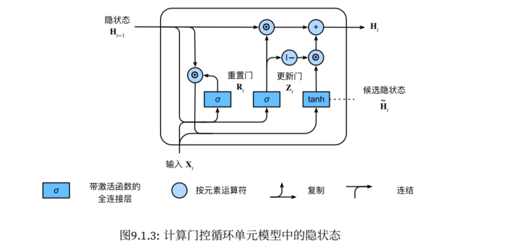
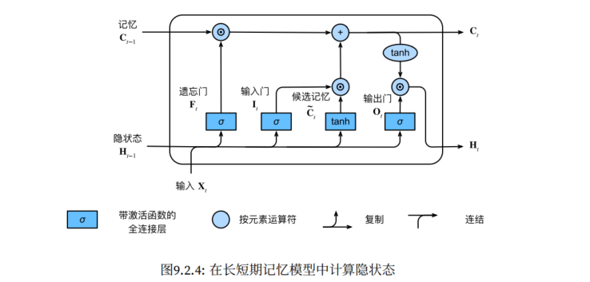
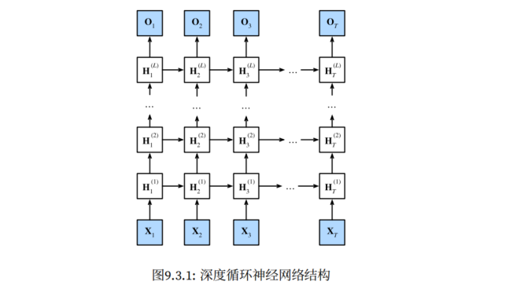
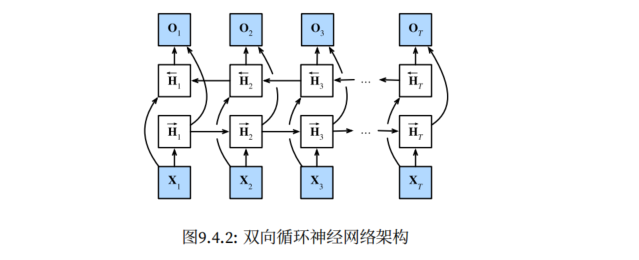

# 03 - 循环神经网络

> **主线**：之前处理的数据（表格、图像）都是**独立同分布**的——样本之间没有顺序依赖。但文本、语音、视频、股价等数据天然具有**时间/顺序依赖**，打乱顺序就丢失了意义。循环神经网络（RNN）的演进正是为了解决这一问题：**RNN → GRU/LSTM（解决梯度消失） → 编码器-解码器 + 注意力（解决信息瓶颈） → Transformer（抛弃 RNN，纯注意力并行计算）**。

## 1. 序列模型基础知识

### 1.1 背景：为什么要专门建模序列

对于之前的表格数据和图像数据，样本之间默认是**独立同分布**（i.i.d.）的——打乱顺序不影响训练。但序列数据不一样：

- "狗咬人" vs "人咬狗"——相同的词，不同的顺序，完全不同的含义
- 股价预测必须用到历史价格，而不是只靠当天数据
- 语音、视频、用户行为都有时间上的连续性

**序列模型的目标**：根据过去的观测预测未来。

### 1.2 自回归模型

给定序列 $x_1, x_2, \dots, x_{t-1}$，我们想预测 $x_t \sim P(x_t \mid x_{t-1}, x_{t-2}, \dots, x_1)$。问题在于：输入数量随 $t$ 增大而不断增长，因此需要一个近似方法来使这个计算变得容易处理。通常有两种策略：

1. 显式存最近 $\tau$ 个值（马尔可夫式），即  $\hat{x}_t = P(x_t \mid x_{t-1}, \dots, x_{t-\tau})$，其中 $\tau$ 是回顾的时间步数（固定窗口大小）
2. 用一个隐变量 $h_t$ 做压缩总结，不断更新，即 $h_t = g(h_{t-1}, x_{t-1})$，$\hat{x}_t = P(x_t \mid h_t)$。**RNN 的思想正是从这里来的**。

> 注意，这两种策略都是**自回归模型**（用自己过去的值预测当前的自己），区别在于怎么存"过去"。

对于第一种策略，我们用 $x_{t-1}, \dots, x_{t-\tau}$ 而不是 $x_{t-1}, \dots, x_{1}$ 来估计 $x_t$，如果这种估计是近似准确的，我们就称序列满足马尔可夫条件。特别地，如果 $\tau=1$，就得到一个一阶马尔可夫模型：$P(x_t \mid x_{t-1}, \dots, x_1) = P(x_t \mid x_{t-1})$。但是马尔可夫模型有一定局限性：**固定窗口、无法建模长依赖**。所以隐变量模型是一种更优的选择，它解决了这一问题。

除此之外，自回归模型还有一个关键问题：**多步预测中的误差累积**。单步预测（用真实历史值预测下一步）效果通常不错；但多步预测时用自己预测的值继续预测后续，误差会快速累积，几个时间步后结果就衰减为常数。RNN 主要靠 teacher forcing 让单步预测更准、累积起点更小。

### 1.3 文本预处理

将原始文本转换为模型可以处理的数字序列，这是所有 NLP 任务的第一步。通常包含以下步骤：

1. 将文本作为字符串加载到内存中；
2. 将字符串拆分为词元；
3. 建立一个词表，将拆分的词元映射到数字索引；
4. 将文本转换为数字索引序列，方便模型操作。

### 1.4 语言模型

#### 定义

语言模型估计文本序列的联合概率：$P(x_1, x_2, \dots, x_T) = \prod_{t=1}^T P(x_t \mid x_1, \dots, x_{t-1})$

一个好的语言模型不仅能判断"人咬狗"比"狗咬人"更不可能出现，还能自己生成自然文本。

#### 评价指标：困惑度（Perplexity）

$$\text{PPL} = \exp\left(-\frac{1}{n}\sum_{t=1}^n \log P(x_t \mid x_{t-1}, \dots)\right)$$

- 困惑度可以理解为"下一个词元实际选择数的调和平均"
- 困惑度 = 1，表示完美预测，模型总是完美地估计标签词元的概率为 1
- 困惑度 = 词表大小，表示均匀瞎猜（基线）
- 困厚度 = 正无穷大，表示模型总是预测标签词元的概率为 0，是最坏的情况
- 因此，困惑度越低越好，最低值为 1（完美预测）

#### 读取长序列数据

读取长序列数据，通常采用**顺序分区**的策略，也就是保证两个相邻的小批量中的子序列在原始序列上也是相邻的，从而可以跨 batch 保持隐状态，但需要 detach 分离梯度（为了降低计算量，使得隐状态的梯度计算总是限制在一个小批量数据的时间步内）。


## 2. 循环神经网络（RNN）

### 2.1 核心思想：用隐状态承载"记忆"

普通 MLP 每一层的输入只取决于当前样本——它没有"记忆"。RNN 的关键创新是引入了一个**隐状态** $H_t$，它在时间步之间传递，承载着序列到当前位置的所有历史信息。

在第 $t$ 个时间步时，会根据当前时间步的输入 $X_t$ 以及上一时间步的隐状态 $H_{t-1}$ 计算得到新的隐状态 $H_t$，从而根据这个新的隐状态得到当前时间步的输出 $O_t$


### 2.2 核心公式

$$\mathbf{H}_t = \phi(\mathbf{X}_t \mathbf{W}_{xh} + \mathbf{H}_{t-1} \mathbf{W}_{hh} + \mathbf{b}_h)$$
$$\mathbf{O}_t = \mathbf{H}_t \mathbf{W}_{hq} + \mathbf{b}_q$$

- $\phi$ 为激活函数（通常用 tanh，均值零中心化）
- $\mathbf{W}_{xh}$：输入到隐藏的权重
- $\mathbf{W}_{hh}$：**隐藏到隐藏的权重**——这是 RNN 和 MLP 唯一的不同，也是"循环"的来源
- $\mathbf{H}_t$ 作为"记忆"传给下一步

> **权重共享**：$\mathbf{W}_{xh}$ 和 $\mathbf{W}_{hh}$ 在所有时间步上是**同一组参数**——不管序列多长，参数量不变。这和卷积的参数共享思想一致：同一个模式应该识别在序列的任何位置。

### 2.3 从零实现

```python
# 参数初始化
def get_params(vocab_size, num_hiddens, device):
    num_inputs = num_outputs = vocab_size
    W_xh = nn.Parameter(torch.randn(num_inputs, num_hiddens, device=device) * 0.01)
    W_hh = nn.Parameter(torch.randn(num_hiddens, num_hiddens, device=device) * 0.01)
    b_h = nn.Parameter(torch.zeros(num_hiddens, device=device))
    W_hq = nn.Parameter(torch.randn(num_hiddens, num_outputs, device=device) * 0.01)
    b_q = nn.Parameter(torch.zeros(num_outputs, device=device))
    return nn.ParameterList([W_xh, W_hh, b_h, W_hq, b_q])

# 初始化隐状态（全零开始）
def init_rnn_state(batch_size, num_hiddens, device):
    return (torch.zeros((batch_size, num_hiddens), device=device),)

# RNN 前向传播：逐个时间步循环
def rnn(inputs, state, params):
    # inputs的形状：(时间步数量，批量大小，词表大小)
    W_xh, W_hh, b_h, W_hq, b_q = params
    H, = state
    outputs = []
    for X in inputs:   # 沿时间步循环，这是 RNN 的本质
        H = torch.tanh(torch.mm(X, W_xh) + torch.mm(H, W_hh) + b_h)
        Y = torch.mm(H, W_hq) + b_q
        outputs.append(Y)
    # 输出形状：(时间步数量×批量大小，词表大小)
    # 隐状态形状，保持不变：(批量大小，隐藏单元数)
    return torch.cat(outputs, dim=0), (H,)

# 完整模型
class RNNModelScratch:
    def __init__(self, vocab_size, num_hiddens, device, get_params, init_state, forward_fn):
        self.vocab_size, self.num_hiddens = vocab_size, num_hiddens
        self.params = get_params(vocab_size, num_hiddens, device)
        self.init_state, self.forward_fn = init_state, forward_fn

    def __call__(self, X, state):
        X = F.one_hot(X.T, self.vocab_size).type(torch.float32)
        return self.forward_fn(X, state, self.params)

    def begin_state(self, batch_size, device):
        return self.init_state(batch_size, self.num_hiddens, device)
```

### 2.4 简洁实现

```python
# 基本 RNN 隐藏层
rnn_layer = nn.RNN(input_size=vocab_size, hidden_size=num_hiddens)

class RNNModel(nn.Module):
    """循环神经网络模型（PyTorch 简洁实现）"""

    def __init__(self, rnn_layer, vocab_size, **kwargs):
        super().__init__(**kwargs)
        # 注意 nn.RNN 只包含隐藏的循环层，还需要创建一个单独的输出层
        self.rnn = rnn_layer
        self.vocab_size = vocab_size
        self.num_hiddens = self.rnn.hidden_size
        # 如果 RNN 是双向的，num_directions 应为 2，否则为 1
        if not self.rnn.bidirectional:
            self.num_directions = 1
            self.linear = nn.Linear(self.num_hiddens, self.vocab_size)
        else:
            self.num_directions = 2
            self.linear = nn.Linear(self.num_hiddens * 2, self.vocab_size)

    def forward(self, inputs, state):
        # inputs: (batch, num_steps) → one-hot → (num_steps, batch, vocab_size)
        X = F.one_hot(inputs.T.long(), self.vocab_size)
        X = X.to(torch.float32)
        # Y: (num_steps, batch, num_hiddens)，state: 最终隐状态
        Y, state = self.rnn(X, state)
        # 全连接层：首先将 Y 展平为 (num_steps * batch, num_hiddens)，
        # 输出形状为 (num_steps * batch, vocab_size)
        output = self.linear(Y.reshape((-1, Y.shape[-1])))
        return output, state

    def begin_state(self, device, batch_size=1):
        """初始化隐状态，形状是 (隐藏层数，批量大小，隐藏单元数)"""
        if not isinstance(self.rnn, nn.LSTM):
            # nn.RNN / nn.GRU 以张量作为隐状态
            return torch.zeros((self.num_directions * self.rnn.num_layers,
                                batch_size, self.num_hiddens), device=device)
        else:
            # nn.LSTM 以 (隐状态, 记忆元) 元组作为隐状态
            return (torch.zeros((self.num_directions * self.rnn.num_layers,
                                 batch_size, self.num_hiddens), device=device),
                    torch.zeros((self.num_directions * self.rnn.num_layers,
                                 batch_size, self.num_hiddens), device=device))
```

**注意**：`rnn_layer = nn.RNN(input_size=vocab_size, hidden_size=num_hiddens)` 是基本 RNN 隐藏层，输入和输出各有两个变量

- 输入 `input` 形状为 `(num_steps, batch_size, input_size)`
- 输入 `state_0` 是初始隐状态，形状为 `(num_layers * num_directions, batch_size, hidden_size)`
- 输出 `output` 是最后一层每个时间步的输出，形状为 `(num_steps, batch_size, num_directions * hidden_size)`
- 输出 `state_n` 是每一层的最终隐状态（最后一个时间步），形状为 `(num_layers * num_directions, batch_size, hidden_size)`

### 2.5 训练 RNN

#### 关键技巧一：梯度裁剪

RNN 存在一个核心问题：**梯度消失/爆炸**。回顾反向传播在 RNN 中的计算，对于长度为 T 的序列，我们在迭代中计算这 T 个时间步上的梯度，将会在反向传播过程中产生长度为 `O(T)` 的矩阵乘法链。也就是说，由于隐状态沿时间递归：`H_t = f(H_{t-1}, X_t)`，损失对早期时间步参数的梯度是**一系列矩阵的连乘**：$\frac{\partial L}{\partial \mathbf{W}_{hh}} \propto \sum_t \frac{\partial L}{\partial \mathbf{H}_t} \cdot \frac{\partial \mathbf{H}_t}{\partial \mathbf{H}_{t-1}} \cdots$

连乘中包含 $\mathbf{W}_{hh}$ 的重复相乘：如果 $\mathbf{W}_{hh}$ 的特征值 > 1 → **梯度爆炸**（参数更新过大，训练崩溃）；特征值 < 1 → **梯度消失**（早期时间步的参数几乎不更新）。因此，RNN 难以捕获长距离依赖——深层时间步的信息在回传中指数衰减。

**梯度裁剪**提供了一个快速修复梯度爆炸的方法，虽然它并不能完全解决问题，但它是众多有效的技术之一，是 RNN 训练必备的稳定技术。梯度裁剪就是通过将梯度 $\textbf{g}$ 投影回给定半径（例如 $\theta$）的球来裁剪梯度 $\textbf{g}$，如下式：

$$\textbf{g} \leftarrow \min\left(1, \frac{\theta}{\|\textbf{g}\|}\right) \textbf{g}$$

通过这样做，我们知道梯度范数永远不会超过 $\theta$，并且更新后的梯度完全与 $\textbf{g}$ 的原始方向对齐。它还能限制任何给定的小批量数据对参数向量的影响，赋予了模型一定程度的稳定性。

```python
def grad_clipping(net, theta):
    """梯度裁剪，保证所有参数的梯度合在一起的全局范数不超过 theta"""
    if isinstance(net, nn.Module):
        params = [p for p in net.parameters() if p.requires_grad]
    else:
        params = net.params
    norm = torch.sqrt(sum(torch.sum((p.grad ** 2)) for p in params))
    if norm > theta:
        for param in params:
            param.grad[:] *= theta / norm
```

#### 关键技巧二：截断时间步

反向传播应用在 RNN 上被称为 BPTT（通过时间反向传播）——将 RNN 沿时间展开成一个很深的计算图，然后对所有时间步的共享参数求导。但如果完全计算所有时间步，计算量巨大且数值不稳定。

在实际应用中会采用**截断时间步**的策略，也就是仅进行最近 $\tau$ 步的梯度计算，更早之前的时间步直接分离梯度`state.detach_()`。截断不仅是出于计算效率，更是一种**隐式的正则化**——它让模型更关注短期依赖，避免过度拟合长期模式。对于大多数实际问题，这并不是缺陷。

#### RNN 训练代码

```python
def train(net, train_iter, lr, num_epochs, device):
    loss = nn.CrossEntropyLoss()
    optimizer = torch.optim.SGD(net.parameters(), lr)
    net.to(device)

    for epoch in range(num_epochs):
        state = None
        for X, Y in train_iter:
            # 每个epoch的第一个batch，或者batch大小发生变化（通常是最后一个batch样本不足），则隐状态清零
            if state is None or state[0].shape[1] != X.shape[0]:
                state = net.begin_state(batch_size=X.shape[0], device=device)
            # 否则，沿用隐状态，但需要截断梯度，防止BPTT回溯到过多时间步
            else:
                state.detach_()
            X, Y = X.to(device), Y.to(device)
            y_hat, state = net(X, state)
            l = loss(y_hat, Y.T.reshape(-1))
            optimizer.zero_grad()
            l.backward()
            # 梯度裁剪，RNN 训练必备
            nn.utils.clip_grad_norm_(net.parameters(), max_norm=1.0)  
            optimizer.step()
```


## 3. 现代循环神经网络

### 3.1 门控循环单元（GRU）

#### 3.1.1 GRU 简介

梯度裁剪只能限制梯度不会爆炸，但 RNN 梯度消失的问题仍然存在，早期时间步收不到有效的更新信号，导致 RNN 难以学习长距离依赖。GRU 和 LSTM 的思路是：**让信息有选择地"跳过"时间步**——重要的信息直接透传到很远的时间步，不需经过层层变换。

GRU（gated recurrent units）于 2014 年提出，是 LSTM 一个稍微简化的变体，通常能够提供同等的效果，并且计算的速度明显更快。



GRU 用两个门（都是 sigmoid，输出 0~1 之间的值）来控制信息流：

- **重置门** $R_t$：控制**在计算候选隐状态时，保留多少旧状态**。当 $R_t \to 0$ 时，候选隐状态相当于只用当前输入计算——"忘记过去，重新开始"，适合捕获短期依赖
- **更新门** $Z_t$：控制**用多少旧状态、多少新候选状态来产生最终隐状态**。当 $Z_t \to 1$ 时，旧状态几乎完全保留——"跳过当前，保持原样"，适合捕获长期依赖

$$\mathbf{R}_t = \sigma(\mathbf{X}_t \mathbf{W}_{xr} + \mathbf{H}_{t-1} \mathbf{W}_{hr} + \mathbf{b}_r)$$
$$\mathbf{Z}_t = \sigma(\mathbf{X}_t \mathbf{W}_{xz} + \mathbf{H}_{t-1} \mathbf{W}_{hz} + \mathbf{b}_z)$$
$$\tilde{\mathbf{H}}_t = \tanh(\mathbf{X}_t \mathbf{W}_{xh} + (\mathbf{R}_t \odot \mathbf{H}_{t-1}) \mathbf{W}_{hh} + \mathbf{b}_h)$$
$$\mathbf{H}_t = \mathbf{Z}_t \odot \mathbf{H}_{t-1} + (1 - \mathbf{Z}_t) \odot \tilde{\mathbf{H}}_t$$

> 关键在最后一行：$\mathbf{Z}_t \odot \mathbf{H}_{t-1}$ 是"旧记忆保留"，$(1 - \mathbf{Z}_t) \odot \tilde{\mathbf{H}}_t$ 是"新信息写入"。这两个系数加起来等于 1（凸组合），天然保证了数值稳定。

#### 3.1.2 PyTorch 实现

```python
gru_layer = nn.GRU(input_size, hidden_size, num_layers)
output, state = gru_layer(X)
# output: (num_steps, batch_size, hidden_size)
# state: (num_layers, batch_size, hidden_size)
```

### 3.2 长短期记忆网络（LSTM）

#### 3.2.1 LSTM 简介



LSTM（long short-term memory）于 1997 年提出，比 GRU 早诞生了近 20 年，设计更复杂但也有更灵活的长期记忆能力。GRU 只有一个隐状态 $H_t$ 同时管理"记忆"和"当前输出"。LSTM 采用了更精细的设计——**双状态**：

- **记忆元** $C_t$：专门负责跨时间步传递长期信息
- **隐状态** $H_t$：$C_t$ 经过门控过滤后的版本，用于当前输出

三个门分别控制记忆元的**写**、**擦**、**读**：

| 门 | 作用 | 值域 | 含义 |
|----|------|------|------|
| **输入门** $I_t$ | 控制哪些新信息写入记忆 | (0, 1) | 1 = 全部写入 |
| **遗忘门** $F_t$ | 控制哪些旧信息从记忆中丢弃 | (0, 1) | 0 = 全部遗忘 |
| **输出门** $O_t$ | 控制从记忆中读出多少用于输出 | (0, 1) | 1 = 全部输出 |

$$\mathbf{I}_t = \sigma(\mathbf{X}_t \mathbf{W}_{xi} + \mathbf{H}_{t-1} \mathbf{W}_{hi} + \mathbf{b}_i)$$
$$\mathbf{F}_t = \sigma(\mathbf{X}_t \mathbf{W}_{xf} + \mathbf{H}_{t-1} \mathbf{W}_{hf} + \mathbf{b}_f)$$
$$\mathbf{O}_t = \sigma(\mathbf{X}_t \mathbf{W}_{xo} + \mathbf{H}_{t-1} \mathbf{W}_{ho} + \mathbf{b}_o)$$
$$\tilde{\mathbf{C}}_t = \tanh(\mathbf{X}_t \mathbf{W}_{xc} + \mathbf{H}_{t-1} \mathbf{W}_{hc} + \mathbf{b}_c)$$
$$\mathbf{C}_t = \mathbf{F}_t \odot \mathbf{C}_{t-1} + \mathbf{I}_t \odot \tilde{\mathbf{C}}_t$$
$$\mathbf{H}_t = \mathbf{O}_t \odot \tanh(\mathbf{C}_t)$$

> **理解记忆元 $\mathbf{C}_t$ 的关键**：它的更新没有经过 tanh 压缩（tanh 只在读取到 $\mathbf{H}_t$ 时才用）。这意味着 $\mathbf{C}_t$ 可以在时间步之间**线性传递**——遗忘门 1 输入门 0，记忆就不变地流过去。

#### 3.2.2 PyTorch 实现

```python
lstm_layer = nn.LSTM(input_size, hidden_size, num_layers)
output, (h_n, c_n) = lstm_layer(X)
# output: (num_steps, batch_size, hidden_size)
# h_n: (num_layers, batch_size, hidden_size)
# c_n: (num_layers, batch_size, hidden_size)   ← LSTM 多了一个记忆元
```

### 3.3 深度循环神经网络

多叠几层 RNN，让每层学习不同粒度的特征（例如底层学字词模式，高层学语义），就构成了深度循环神经网络。如下图是一个具有 L 个隐藏层的深度循环神经网络，每个隐状态都连续地传递到当前层的下一个时间步和下一层的当前时间步。



```python
# 多层 LSTM
rnn_layer = nn.LSTM(input_size, hidden_size,
                     num_layers=3,          # 3 层，每层输出作为下一层的输入
                     bidirectional=False,   # 单向
                     dropout=0.2)           # 层间 dropout（而非时间步间）
```

### 3.4 双向循环神经网络



适合**能看到完整序列**的任务（分类、标注、编码）——同时从前向后和从后向前扫描：

```python
# 双向 LSTM
birnn = nn.LSTM(input_size, hidden_size, bidirectional=True)
# 输出维度变为 hidden_size * 2（正向+反向拼接）
```

**注意**：双向 RNN **不能**用于语言模型（预测下一个词时不能"偷看"未来），主要用于**编码**任务（如情感分析——看完整个句子再判断情感）。


## 4. 序列到序列学习（seq2seq）

### 4.1 编码器-解码器架构

**编码器-解码器架构是 RNN → seq2seq → Transformer 的关键转折点**。编码器-解码器架构可以处理序列长度可变类型的输入和输出，它将任务拆成两步：

1. **编码器**：把变长输入序列压缩成一个**固定长度的上下文向量**（作为输入的摘要，或者说是状态）
2. **解码器**：从这个上下文向量中解码出变长输出序列

```python
# 编码器基类
class Encoder(nn.Module):
    def __init__(self, **kwargs):
        super(Encoder, self).__init__(**kwargs)

    def forward(self, X, *args):
        raise NotImplementedError

# 解码器基类
class Decoder(nn.Module):
    def __init__(self, **kwargs):
        super(Decoder, self).__init__(**kwargs)

    def init_state(self, enc_outputs, *args):
        """用于将编码器的输出转换为编码后的状态"""
        raise NotImplementedError

    def forward(self, X, state):
        raise NotImplementedError

# 整体架构
class EncoderDecoder(nn.Module):
    def __init__(self, encoder, decoder, **kwargs):
        super().__init__(**kwargs)
        self.encoder = encoder
        self.decoder = decoder

    def forward(self, enc_X, dec_X, *args):
        enc_outputs = self.encoder(enc_X, *args)
        dec_state = self.decoder.init_state(enc_outputs, *args)
        return self.decoder(dec_X, dec_state)
```

### 4.2 seq2seq 架构

原始 seq2seq 用两个 RNN 分别作为编码器和解码器：

- **编码器 RNN**：读取整个源序列，将最后一个时间步的隐状态作为"上下文向量"
- **解码器 RNN**：以上下文向量为初始隐状态，逐词生成目标序列

**核心瓶颈**：整个源序列的信息被压缩到一个固定长度的上下文向量里。长序列的信息被"挤"在一个向量中，早期时间步的信息很容易在编码过程中丢失——这是 seq2seq 的最大弱点。

```python
class Seq2SeqEncoder(nn.Module):
    def __init__(self, vocab_size, embed_size, num_hiddens, num_layers, dropout=0):
        super().__init__()
        self.embedding = nn.Embedding(vocab_size, embed_size)
        self.rnn = nn.GRU(embed_size, num_hiddens, num_layers, dropout=dropout)

    def forward(self, X, *args):
        # (batch, seq_len) → (seq_len, batch, embed)
        X = self.embedding(X).permute(1, 0, 2)
        output, state = self.rnn(X)
        # state 就是"上下文向量"
        return output, state


class Seq2SeqDecoder(nn.Module):
    def __init__(self, vocab_size, embed_size, num_hiddens, num_layers, dropout=0):
        super().__init__()
        self.embedding = nn.Embedding(vocab_size, embed_size)
        self.rnn = nn.GRU(embed_size + num_hiddens, num_hiddens, num_layers, dropout=dropout)
        self.dense = nn.Linear(num_hiddens, vocab_size)

    def init_state(self, enc_outputs, *args):
        # 编码器的最终隐藏状态作为初始状态
        return enc_outputs[1]

    def forward(self, X, state):
        X = self.embedding(X).permute(1, 0, 2)
        # 将上下文向量与输入在最后一维拼接（每次都"提醒"解码器上下文信息）
        context = state[-1].repeat(X.shape[0], 1, 1)
        X_and_context = torch.cat((X, context), 2)
        output, state = self.rnn(X_and_context, state)
        output = self.dense(output).permute(1, 0, 2)
        return output, state
```

### 4.3 seq2seq 训练

```python
def train_seq2seq(net, data_iter, lr, num_epochs, tgt_vocab, device):
    def xavier_init_weights(m):
        if isinstance(m, nn.Linear):
            nn.init.xavier_uniform_(m.weight)
        if isinstance(m, nn.GRU):
            for param in m._flat_weights_names:
                if "weight" in param:
                    nn.init.xavier_uniform_(m._parameters[param])

    net.apply(xavier_init_weights)
    net.to(device)
    optimizer = torch.optim.Adam(net.parameters(), lr=lr)
    loss = nn.CrossEntropyLoss(ignore_index=tgt_vocab['<pad>'])

    for epoch in range(num_epochs):
        for batch in data_iter:
            optimizer.zero_grad()
            X, X_valid_len, Y, Y_valid_len = [x.to(device) for x in batch]
            bos = torch.tensor([tgt_vocab['<bos>']] * Y.shape[0], device=device).reshape(-1, 1)
            # 强制教学
            dec_input = torch.cat([bos, Y[:, :-1]], 1)
            Y_hat, _ = net(X, dec_input)
            l = loss(Y_hat, Y)
            l.sum().backward()
            # 梯度裁剪
            nn.utils.clip_grad_norm_(net.parameters(), max_norm=1.0)
            optimizer.step()
```

几个技巧：

1. **强制教学（Teacher Forcing）**：**训练时**，解码器的输入不是上一步预测的词，而是**真实的**上一步目标词。这样训练更快更稳定——否则模型早期预测一旦出错，后面全错，梯度信号几乎无用。如上所示，Y 是标签（不以 `<bos>` 开头），于是在 Y 开头拼上一个 `<bos>` 并去掉最后一个 token，作为 decoder 的输入，这便是 Teacher Forcing。
2. **掩码损失函数**：不同句子长度不同，padding 的部分不应该贡献 loss，所以使用 `ignore_index=tgt_vocab['<pad>']` 来忽略 `<pad>` 提供的loss
3. **预测序列的评估**：BLEU 最先是用于评估机器翻译的结果，对于预测序列中的任意 n 元语法，BLEU 评估的是这个 n 元语法是否出现在标签序列中。不过 BLEU 评估与现代 LLM 的语义质量相关性弱，现在更常用 COMET 或 BERTScore。

### 4.4 束搜索（Beam Search）

seq2seq 推理时，需要逐词生成序列，有三种策略：

| 策略 | 做法 | 时间复杂度 | 质量 |
|------|------|:---:|:---:|
| **贪心搜索** | 每步选概率最大的词 | $O(V \cdot T)$ | 差（局部最优 ≠ 全局最优） |
| **穷举搜索** | 遍历所有可能序列 | $O(V^T)$ | 最优但计算量惊人，无法使用 |
| **束搜索** | 每步保留最好的 $k$ 个候选序列 | $O(kV \cdot T)$ | 平衡质量和效率 |

几点说明：

1. V 是输出序列词表的大小，T 是输出序列的长度
2. 贪心搜索的质量较差，是因为局部最优未必是全局最优。例如输出序列长度为 2，第一个时间步的词元的最高概率是 0.5，选取这个词元后，第二个时间步的词元的最高概率是 0.3，于是这个输出序列的条件概率就是 0.5×0.3=0.15；然而，如果第一个时间步的词元的第二高概率是 0.4，选取这个词元后，**第二个时间步推断出来的概率就可能发生变化**，于是可能第二个时间步的词元的最高概率变成了 0.4，所以这个输出序列的条件概率就是 0.4×0.4=0.16，显然是比贪心搜索更优的输出序列。
3. 束搜索的示例：假设束宽 $k=2$，词表大小为 4（分别为a、b、c、d），在第一个时间步，保留概率top2的候选词元（例如[a], [b]）；在第二个时间步，对每个候选展开所有可能的下一个词，一共得到 8 个序列 [a,a],[a,b],[a,c],[a,d],[b,a],[b,b],[b,c],[b,d]，同样保留得分top2的候选序列（例如[a,b],[a,d]）；以此类推。
4. 束搜索的思想：不是每一步选一个最好的词，而是维护 $k$ 个最好的**部分序列**。每一步对这 $k$ 个序列分别考虑 $V$ 个可能的下一个词 → 从 $kV$ 个候选中选出新的 $k$ 个最好的部分序列。
5. 注意：束搜索现在主要用于机器翻译、摘要生成；而 LLM 对话、创意生成等基本不用束搜索，而是用**采样（temperature）**。

