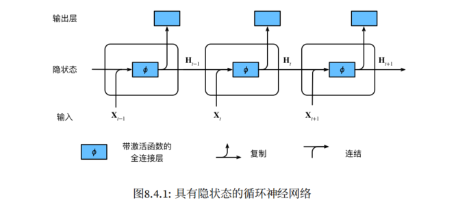
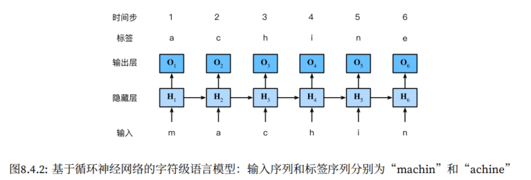

# 03 - 循环神经网络

> **主线**：之前处理的数据（表格、图像）都是**独立同分布**的——样本之间没有顺序依赖。但文本、语音、视频、股价等数据天然具有**时间/顺序依赖**，打乱顺序就丢失了意义。循环神经网络（RNN）的演进正是为了解决这一问题：**RNN → GRU/LSTM（解决梯度消失） → 编码器-解码器 + 注意力（解决信息瓶颈） → Transformer（抛弃 RNN，纯注意力并行计算）**。

---

## 1. 序列模型基础知识

### 1.1 背景：为什么要专门建模序列

对于之前的表格数据和图像数据，样本之间默认是**独立同分布**（i.i.d.）的——打乱顺序不影响训练。但序列数据不一样：

- "狗咬人" vs "人咬狗"——相同的词，不同的顺序，完全不同的含义
- 股价预测必须用到历史价格，而不是只靠当天数据
- 语音、视频、用户行为都有时间上的连续性

**序列模型的目标**：根据过去的观测预测未来。

### 1.2 自回归模型

给定序列 $x_1, x_2, \dots, x_{t-1}$，我们想预测 $x_t \sim P(x_t \mid x_{t-1}, x_{t-2}, \dots, x_1)$。问题在于：输入数量随 $t$ 增大而不断增长，因此需要一个近似方法来使这个计算变得容易处理。通常有两种策略：

1. 显式存最近 $\tau$ 个值（马尔可夫式），即  $\hat{x}_t = P(x_t \mid x_{t-1}, \dots, x_{t-\tau})$，其中 $\tau$ 是回顾的时间步数（固定窗口大小）
2. 用一个隐变量 $h_t$ 做压缩总结，不断更新，即 $h_t = g(h_{t-1}, x_{t-1})$，$\hat{x}_t = P(x_t \mid h_t)$。**RNN 的思想正是从这里来的**。

> 注意，这两种策略都是**自回归模型**（用自己过去的值预测当前的自己），区别在于怎么存"过去"。

对于第一种策略，我们用 $x_{t-1}, \dots, x_{t-\tau}$ 而不是 $x_{t-1}, \dots, x_{1}$ 来估计 $x_t$，如果这种估计是近似准确的，我们就称序列满足马尔可夫条件。特别地，如果 $\tau=1$，就得到一个一阶马尔可夫模型：$P(x_t \mid x_{t-1}, \dots, x_1) = P(x_t \mid x_{t-1})$。但是马尔可夫模型有一定局限性：**固定窗口、无法建模长依赖**。所以隐变量模型是一种更优的选择，它解决了这一问题。

除此之外，自回归模型还有一个关键问题：**多步预测中的误差累积**。单步预测（用真实历史值预测下一步）效果通常不错；但多步预测时用自己预测的值继续预测后续，误差会快速累积，几个时间步后结果就衰减为常数。RNN 主要靠 teacher forcing 让单步预测更准、累积起点更小。

### 1.3 文本预处理

将原始文本转换为模型可以处理的数字序列，这是所有 NLP 任务的第一步。通常包含以下步骤：

1. 将文本作为字符串加载到内存中；
2. 将字符串拆分为词元；
3. 建立一个词表，将拆分的词元映射到数字索引；
4. 将文本转换为数字索引序列，方便模型操作。

### 1.4 语言模型

#### 定义

语言模型估计文本序列的联合概率：$P(x_1, x_2, \dots, x_T) = \prod_{t=1}^T P(x_t \mid x_1, \dots, x_{t-1})$

一个好的语言模型不仅能判断"人咬狗"比"狗咬人"更不可能出现，还能自己生成自然文本。

#### 评价指标：困惑度（Perplexity）

$$\text{PPL} = \exp\left(-\frac{1}{n}\sum_{t=1}^n \log P(x_t \mid x_{t-1}, \dots)\right)$$

- 困惑度可以理解为"下一个词元实际选择数的调和平均"
- 困惑度 = 1，表示完美预测，模型总是完美地估计标签词元的概率为 1
- 困惑度 = 词表大小，表示均匀瞎猜（基线）
- 困厚度 = 正无穷大，表示模型总是预测标签词元的概率为 0，是最坏的情况
- 因此，困惑度越低越好，最低值为 1（完美预测）

#### 读取长序列数据

读取长序列数据，通常采用**顺序分区**的策略，也就是保证两个相邻的小批量中的子序列在原始序列上也是相邻的，从而可以跨 batch 保持隐状态，但需要 detach 分离梯度（为了降低计算量，使得隐状态的梯度计算总是限制在一个小批量数据的时间步内）。


## 2. 循环神经网络（RNN）

### 2.1 核心思想：用隐状态承载"记忆"

普通 MLP 每一层的输入只取决于当前样本——它没有"记忆"。RNN 的关键创新是引入了一个**隐状态** $H_t$，它在时间步之间传递，承载着序列到当前位置的所有历史信息。

在第 $t$ 个时间步时，会根据当前时间步的输入 $X_t$ 以及上一时间步的隐状态 $H_{t-1}$ 计算得到新的隐状态 $H_t$，从而根据这个新的隐状态得到当前时间步的输出 $O_t$





### 2.2 核心公式

$$\mathbf{H}_t = \phi(\mathbf{X}_t \mathbf{W}_{xh} + \mathbf{H}_{t-1} \mathbf{W}_{hh} + \mathbf{b}_h)$$
$$\mathbf{O}_t = \mathbf{H}_t \mathbf{W}_{hq} + \mathbf{b}_q$$

- $\phi$ 为激活函数（通常用 tanh，均值零中心化）
- $\mathbf{W}_{xh}$：输入到隐藏的权重
- $\mathbf{W}_{hh}$：**隐藏到隐藏的权重**——这是 RNN 和 MLP 唯一的不同，也是"循环"的来源
- $\mathbf{H}_t$ 作为"记忆"传给下一步

> **权重共享**：$\mathbf{W}_{xh}$ 和 $\mathbf{W}_{hh}$ 在所有时间步上是**同一组参数**——不管序列多长，参数量不变。这和卷积的参数共享思想一致：同一个模式应该识别在序列的任何位置。

### 2.3 从零实现

```python
# 参数初始化
def get_params(vocab_size, num_hiddens, device):
    num_inputs = num_outputs = vocab_size
    W_xh = nn.Parameter(torch.randn(num_inputs, num_hiddens, device=device) * 0.01)
    W_hh = nn.Parameter(torch.randn(num_hiddens, num_hiddens, device=device) * 0.01)
    b_h = nn.Parameter(torch.zeros(num_hiddens, device=device))
    W_hq = nn.Parameter(torch.randn(num_hiddens, num_outputs, device=device) * 0.01)
    b_q = nn.Parameter(torch.zeros(num_outputs, device=device))
    return nn.ParameterList([W_xh, W_hh, b_h, W_hq, b_q])

# 初始化隐状态（全零开始）
def init_rnn_state(batch_size, num_hiddens, device):
    return (torch.zeros((batch_size, num_hiddens), device=device),)

# RNN 前向传播：逐个时间步循环
def rnn(inputs, state, params):
    # inputs的形状：(时间步数量，批量大小，词表大小)
    W_xh, W_hh, b_h, W_hq, b_q = params
    H, = state
    outputs = []
    for X in inputs:   # 沿时间步循环，这是 RNN 的本质
        H = torch.tanh(torch.mm(X, W_xh) + torch.mm(H, W_hh) + b_h)
        Y = torch.mm(H, W_hq) + b_q
        outputs.append(Y)
    # 输出形状：(时间步数量×批量大小，词表大小)
    # 隐状态形状，保持不变：(批量大小，隐藏单元数)
    return torch.cat(outputs, dim=0), (H,)

# 完整模型
class RNNModelScratch:
    def __init__(self, vocab_size, num_hiddens, device, get_params, init_state, forward_fn):
        self.vocab_size, self.num_hiddens = vocab_size, num_hiddens
        self.params = get_params(vocab_size, num_hiddens, device)
        self.init_state, self.forward_fn = init_state, forward_fn

    def __call__(self, X, state):
        X = F.one_hot(X.T, self.vocab_size).type(torch.float32)
        return self.forward_fn(X, state, self.params)

    def begin_state(self, batch_size, device):
        return self.init_state(batch_size, self.num_hiddens, device)
```

### 2.4 RNN 的核心问题：梯度消失/爆炸

回顾反向传播在 RNN 中的计算，对于长度为 T 的序列，我们在迭代中计算这 T 个时间步上的梯度，将会在反向传播过程中产生长度为 `O(T)` 的矩阵乘法链。也就是说，由于隐状态沿时间递归：`H_t = f(H_{t-1}, X_t)`，损失对早期时间步参数的梯度是**一系列矩阵的连乘**：$\frac{\partial L}{\partial \mathbf{W}_{hh}} \propto \sum_t \frac{\partial L}{\partial \mathbf{H}_t} \cdot \frac{\partial \mathbf{H}_t}{\partial \mathbf{H}_{t-1}} \cdots$

连乘中包含 $\mathbf{W}_{hh}$ 的重复相乘：如果 $\mathbf{W}_{hh}$ 的特征值 > 1 → **梯度爆炸**（参数更新过大，训练崩溃）；特征值 < 1 → **梯度消失**（早期时间步的参数几乎不更新）。因此，RNN 难以捕获长距离依赖——深层时间步的信息在回传中指数衰减。

**梯度裁剪**提供了一个快速修复梯度爆炸的方法，虽然它并不能完全解决问题，但它是众多有效的技术之一，是 RNN 训练必备的稳定技术。梯度裁剪就是通过将梯度 $\textbf{g}$ 投影回给定半径（例如 $\theta$）的球来裁剪梯度 $\textbf{g}$，如下式：

$$\textbf{g} \leftarrow \min\left(1, \frac{\theta}{\|\textbf{g}\|}\right) \textbf{g}$$

通过这样做，我们知道梯度范数永远不会超过 $\theta$，并且更新后的梯度完全与 $\textbf{g}$ 的原始方向对齐。它还能限制任何给定的小批量数据对参数向量的影响，赋予了模型一定程度的稳定性。

```python
def grad_clipping(net, theta):
    """梯度裁剪，保证所有参数的梯度合在一起的全局范数不超过 theta"""
    if isinstance(net, nn.Module):
        params = [p for p in net.parameters() if p.requires_grad]
    else:
        params = net.params
    norm = torch.sqrt(sum(torch.sum((p.grad ** 2)) for p in params))
    if norm > theta:
        for param in params:
            param.grad[:] *= theta / norm
```

### 2.5 简洁实现


```python
from torch.nn import RNN, LSTM, GRU

# 基本 RNN
rnn_layer = nn.RNN(input_size=vocab_size, hidden_size=num_hiddens)

class RNNModel(nn.Module):
    def __init__(self, rnn_layer, vocab_size):
        super().__init__()
        self.rnn = rnn_layer
        self.vocab_size = vocab_size
        self.num_hiddens = self.rnn.hidden_size
        if not self.rnn.bidirectional:
            self.num_directions = 1
            self.linear = nn.Linear(self.num_hiddens, vocab_size)
        else:
            self.num_directions = 2
            self.linear = nn.Linear(self.num_hiddens * 2, vocab_size)

    def forward(self, inputs, state):
        X = F.one_hot(inputs.T.long(), self.vocab_size).to(torch.float32)
        Y, state = self.rnn(X, state)
        output = self.linear(Y.reshape((-1, Y.shape[-1])))
        return output, state

    def begin_state(self, device, batch_size=1):
        return torch.zeros((self.num_directions * self.rnn.num_layers,
                           batch_size, self.num_hiddens), device=device)
```

**注意**：`rnn_layer = nn.RNN(input_size=vocab_size, hidden_size=num_hiddens)` 是基本 RNN 隐藏层，输入和输出各有两个变量

- 输入 `input` 形状为 `(num_steps, batch_size, input_size)`
- 输入 `state_0` 是初始隐状态，形状为 `(num_layers * num_directions, batch_size, hidden_size)`
- 输出 `output` 是最后一层每个时间步的输出，形状为 `(num_steps, batch_size, num_directions * hidden_size)`
- 输出 `state_n` 是每一层的最终隐状态（最后一个时间步），形状为 `(num_layers * num_directions, batch_size, hidden_size)`


### 4.7 训练 RNN 语言模型

```python
def train(net, train_iter, vocab, lr, num_epochs, device):
    loss = nn.CrossEntropyLoss()
    optimizer = torch.optim.SGD(net.parameters(), lr)
    net.to(device)

    for epoch in range(num_epochs):
        state = None
        for X, Y in train_iter:
            if state is None or state[0].shape[1] != X.shape[0]:
                state = net.begin_state(batch_size=X.shape[0], device=device)
            else:
                # ⚠️ 关键：截断梯度，防止 BPTT 回溯到过多时间步
                state.detach_()
            X, Y = X.to(device), Y.to(device)
            y_hat, state = net(X, state)
            l = loss(y_hat, Y.T.reshape(-1))
            optimizer.zero_grad()
            l.backward()
            grad_clipping(net, 1)      # ⚠️ 梯度裁剪，RNN 训练必备
            optimizer.step()
```

> ⚠️ **两个关键技巧**：
> - `state.detach_()` —— 截断计算图，防止梯度无限回溯。相当于切断了"过去太久远"的时间步对当前更新的影响
> - **梯度裁剪** —— RNN 中梯度爆炸比梯度消失更容易直接杀训练（loss 变 NaN），裁剪是兜底手段

---

## 五、通过时间反向传播（BPTT）

BPTT 就是反向传播在 RNN 上的特定应用——将 RNN 沿时间展开成一个很深的计算图，然后对所有时间步的共享参数求导。

三种策略：

| 策略 | 做法 | 特点 |
|------|------|------|
| 完全计算 | 回传到序列起点 | 最精确但不可行（计算量 + 数值不稳定） |
| **截断时间步** | 固定步数后截断 | **实际最常用**——就是 `state.detach_()` |
| 随机截断 | 随机位置截断 | 理论优美但实践中不如固定截断 |

> 截断不仅是出于计算效率，更是一种**隐式的正则化**——它让模型更关注短期依赖，避免过度拟合长期模式。对于大多数实际问题，这并不是缺陷。

---

## 六、门控循环单元（GRU）

### 6.1 动机：RNN 的梯度消失怎么从根本上解决

梯度裁剪只是"治标"——限制梯度不要爆炸。但梯度消失（早期时间步收不到有效的更新信号）让 RNN 难以学习长距离依赖。GRU 和 LSTM 的思路是：**让信息有选择地"跳过"时间步**——重要的信息直接透传到很远的时间步，不需经过层层变换。

### 6.2 GRU 的两个门

GRU 用两个门（都是 sigmoid，输出 0~1 之间的值）来控制信息流：

- **重置门** $R_t$：控制**在计算候选隐状态时，忽略多少旧状态**。当 $R_t \to 0$ 时，候选隐状态相当于只用当前输入计算——"忘记过去，重新开始"，适合捕获短期依赖
- **更新门** $Z_t$：控制**用多少旧状态、多少新候选状态来产生最终隐状态**。当 $Z_t \to 1$ 时，旧状态几乎完全保留——"跳过当前，保持原样"，适合捕获长期依赖

$$\mathbf{R}_t = \sigma(\mathbf{X}_t \mathbf{W}_{xr} + \mathbf{H}_{t-1} \mathbf{W}_{hr} + \mathbf{b}_r)$$
$$\mathbf{Z}_t = \sigma(\mathbf{X}_t \mathbf{W}_{xz} + \mathbf{H}_{t-1} \mathbf{W}_{hz} + \mathbf{b}_z)$$
$$\tilde{\mathbf{H}}_t = \tanh(\mathbf{X}_t \mathbf{W}_{xh} + (\mathbf{R}_t \odot \mathbf{H}_{t-1}) \mathbf{W}_{hh} + \mathbf{b}_h)$$
$$\mathbf{H}_t = \mathbf{Z}_t \odot \mathbf{H}_{t-1} + (1 - \mathbf{Z}_t) \odot \tilde{\mathbf{H}}_t$$

> 关键在最后一行：$\mathbf{Z}_t \odot \mathbf{H}_{t-1}$ 是"旧记忆保留"，$(1 - \mathbf{Z}_t) \odot \tilde{\mathbf{H}}_t$ 是"新信息写入"。这两个系数加起来等于 1（凸组合），天然保证了数值稳定。

### 6.3 从零实现

```python
def gru(inputs, state, params):
    W_xz, W_hz, b_z, W_xr, W_hr, b_r, W_xh, W_hh, b_h, W_hq, b_q = params
    H, = state
    outputs = []
    for X in inputs:
        Z = torch.sigmoid(torch.mm(X, W_xz) + torch.mm(H, W_hz) + b_z)
        R = torch.sigmoid(torch.mm(X, W_xr) + torch.mm(H, W_hr) + b_r)
        H_tilda = torch.tanh(torch.mm(X, W_xh) + torch.mm(R * H, W_hh) + b_h)
        H = Z * H + (1 - Z) * H_tilda
        Y = torch.mm(H, W_hq) + b_q
        outputs.append(Y)
    return torch.cat(outputs, dim=0), (H,)
```

### 6.4 简洁实现

```python
gru_layer = nn.GRU(input_size, hidden_size, num_layers)
output, state = gru_layer(X)
# output: (seq_len, batch, hidden_size)
# state: (num_layers, batch, hidden_size)
```

---

## 七、长短期记忆网络（LSTM）

### 7.1 动机：把"记忆"和"输出"分开管理

GRU 只有一个隐状态 $H_t$ 同时管理"记忆"和"当前输出"。LSTM 采用了更精细的设计——**双状态**：

- **记忆元** $C_t$：专门负责跨时间步传递长期信息（类似数据的高速公路）
- **隐状态** $H_t$：$C_t$ 经过门控过滤后的版本，用于当前输出

三个门分别控制记忆元的**写**、**擦**、**读**：

| 门 | 作用 | 值域 | 含义 |
|----|------|------|------|
| **输入门** $I_t$ | 控制哪些新信息写入记忆 | (0, 1) | 1 = 全部写入 |
| **遗忘门** $F_t$ | 控制哪些旧信息从记忆中丢弃 | (0, 1) | 0 = 全部遗忘 |
| **输出门** $O_t$ | 控制从记忆中读出多少用于输出 | (0, 1) | 1 = 全部输出 |

$$\mathbf{I}_t = \sigma(\mathbf{X}_t \mathbf{W}_{xi} + \mathbf{H}_{t-1} \mathbf{W}_{hi} + \mathbf{b}_i)$$
$$\mathbf{F}_t = \sigma(\mathbf{X}_t \mathbf{W}_{xf} + \mathbf{H}_{t-1} \mathbf{W}_{hf} + \mathbf{b}_f)$$
$$\mathbf{O}_t = \sigma(\mathbf{X}_t \mathbf{W}_{xo} + \mathbf{H}_{t-1} \mathbf{W}_{ho} + \mathbf{b}_o)$$
$$\tilde{\mathbf{C}}_t = \tanh(\mathbf{X}_t \mathbf{W}_{xc} + \mathbf{H}_{t-1} \mathbf{W}_{hc} + \mathbf{b}_c)$$
$$\mathbf{C}_t = \mathbf{F}_t \odot \mathbf{C}_{t-1} + \mathbf{I}_t \odot \tilde{\mathbf{C}}_t$$
$$\mathbf{H}_t = \mathbf{O}_t \odot \tanh(\mathbf{C}_t)$$

> **理解记忆元 $\mathbf{C}_t$ 的关键**：它的更新没有经过 tanh 压缩（tanh 只在读取到 $\mathbf{H}_t$ 时才用）。这意味着 $\mathbf{C}_t$ 可以在时间步之间**线性传递**——遗忘门 1 输入门 0，记忆就不变地流过去。LSTM 比 GRU 早诞生 20 年，设计更复杂但也有更灵活的长期记忆能力。

### 7.2 从零实现

```python
def lstm(inputs, state, params):
    W_xi, W_hi, b_i, W_xf, W_hf, b_f, W_xo, W_ho, b_o, W_xc, W_hc, b_c, W_hq, b_q = params
    H, C = state
    outputs = []
    for X in inputs:
        I = torch.sigmoid(torch.mm(X, W_xi) + torch.mm(H, W_hi) + b_i)
        F = torch.sigmoid(torch.mm(X, W_xf) + torch.mm(H, W_hf) + b_f)
        O = torch.sigmoid(torch.mm(X, W_xo) + torch.mm(H, W_ho) + b_o)
        C_tilda = torch.tanh(torch.mm(X, W_xc) + torch.mm(H, W_hc) + b_c)
        C = F * C + I * C_tilda
        H = O * torch.tanh(C)
        Y = torch.mm(H, W_hq) + b_q
        outputs.append(Y)
    return torch.cat(outputs, dim=0), (H, C)
```

### 7.3 简洁实现

```python
lstm_layer = nn.LSTM(input_size, hidden_size, num_layers)
output, (h_n, c_n) = lstm_layer(X)
# output: (seq_len, batch, hidden_size)
# h_n: (num_layers, batch, hidden_size)
# c_n: (num_layers, batch, hidden_size)   ← LSTM 多了一个记忆元
```

### 7.4 GRU vs LSTM 对比

| 特性 | GRU | LSTM |
|------|-----|------|
| 门数量 | 2（重置+更新） | 3（输入+遗忘+输出） |
| 状态数量 | 1 个 $H_t$ | 2 个 $H_t + C_t$ |
| 参数量 | $3d(h+d+h)$ | $4d(h+d+h)$ |
| 速度 | 较快 | 较慢 |
| 选择建议 | 小数据/简单任务 | 大数据/复杂任务 |

> 实践中，两者差异不大——调参的影响往往超过选择 GRU 还是 LSTM。但在需要显式控制记忆的场合（如非常长的序列），LSTM 的遗忘门 + 记忆元设计更有优势。

---

## 八、深度循环神经网络

多叠几层 RNN，让每层学习不同粒度的特征（底层学字词模式，高层学语义）：

```python
# 多层 LSTM
rnn_layer = nn.LSTM(input_size, hidden_size,
                     num_layers=3,          # 3 层，每层输出作为下一层的输入
                     bidirectional=False,   # 单向
                     dropout=0.2)           # 层间 dropout（而非时间步间）
```

---

## 九、双向循环神经网络

适合**能看到完整序列**的任务（分类、标注、编码）——同时从前向后和从后向前扫描：

```python
# 双向 LSTM
birnn = nn.LSTM(input_size, hidden_size, bidirectional=True)
# 输出维度变为 hidden_size * 2（正向+反向拼接）
```

⚠️ **注意**：双向 RNN **不能**用于语言模型（预测下一个词时不能"偷看"未来），主要用于**编码**任务（如情感分析——看完整个句子再判断情感）。

---

## 十、编码器-解码器架构

**这是 RNN → seq2seq → Transformer 的关键转折点。**

### 10.1 问题：输入和输出长度不同

在此之前，我们处理的都是"输入一个序列、输出一个序列"（如语言模型：输入前 n 个词 → 输出第 n+1 个词，序列长度相同）。但现实中的任务（翻译、摘要、问答）输入和输出长度往往不同：

```
中文: "你好吗？"         → 3 个词
英文: "How are you?"      → 3 个词（加标点 4 个）

中文: "我很好，谢谢。"    → 4 个词
英文: "I'm fine, thanks." → 3 个词（加标点 4 个）
```

编码器-解码器架构把任务拆成两步：
1. **编码器**：把变长输入序列压缩成一个**固定长度的上下文向量**（作为输入的摘要）
2. **解码器**：从这个上下文向量中解码出变长输出序列

```python
# 编码器基类
class Encoder(nn.Module):
    def __init__(self, **kwargs):
        super(Encoder, self).__init__(**kwargs)

    def forward(self, X, *args):
        raise NotImplementedError

# 解码器基类
class Decoder(nn.Module):
    def __init__(self, **kwargs):
        super(Decoder, self).__init__(**kwargs)

    def init_state(self, enc_outputs, *args):
        raise NotImplementedError

    def forward(self, X, state):
        raise NotImplementedError

# 合并
class EncoderDecoder(nn.Module):
    def __init__(self, encoder, decoder, **kwargs):
        super().__init__(**kwargs)
        self.encoder = encoder
        self.decoder = decoder

    def forward(self, enc_X, dec_X, *args):
        enc_outputs = self.encoder(enc_X, *args)
        dec_state = self.decoder.init_state(enc_outputs, *args)
        return self.decoder(dec_X, dec_state)
```

---

## 十一、序列到序列（seq2seq）

### 11.1 架构：编码器-解码器的具体 RNN 实现

原始 seq2seq 用两个 RNN（通常是 LSTM）分别作为编码器和解码器：

- **编码器 RNN**：读取整个源序列，将最后一个时间步的隐状态作为"上下文向量"
- **解码器 RNN**：以上下文向量为初始隐状态，逐词生成目标序列

**核心瓶颈**：整个源序列的信息被压缩到一个固定长度的上下文向量里。长序列的信息被"挤"在一个向量中，早期时间步的信息很容易在编码过程中丢失——这是 seq2seq 的最大弱点。

```python
class Seq2SeqEncoder(nn.Module):
    def __init__(self, vocab_size, embed_size, num_hiddens, num_layers, dropout=0):
        super().__init__()
        self.embedding = nn.Embedding(vocab_size, embed_size)
        self.rnn = nn.GRU(embed_size, num_hiddens, num_layers, dropout=dropout)

    def forward(self, X, *args):
        X = self.embedding(X)              # (batch, seq_len) → (batch, seq_len, embed)
        X = X.permute(1, 0, 2)            # → (seq_len, batch, embed)
        output, state = self.rnn(X)
        return output, state               # state 就是"上下文向量"


class Seq2SeqDecoder(nn.Module):
    def __init__(self, vocab_size, embed_size, num_hiddens, num_layers, dropout=0):
        super().__init__()
        self.embedding = nn.Embedding(vocab_size, embed_size)
        self.rnn = nn.GRU(embed_size + num_hiddens, num_hiddens, num_layers, dropout=dropout)
        self.dense = nn.Linear(num_hiddens, vocab_size)

    def init_state(self, enc_outputs, *args):
        return enc_outputs[1]              # 编码器的最终隐藏状态作为初始状态

    def forward(self, X, state):
        X = self.embedding(X).permute(1, 0, 2)
        # 将上下文向量与输入在最后一维拼接（每次都"提醒"解码器上下文信息）
        context = state[-1].repeat(X.shape[0], 1, 1)
        X_and_context = torch.cat((X, context), 2)
        output, state = self.rnn(X_and_context, state)
        output = self.dense(output).permute(1, 0, 2)
        return output, state
```

### 11.2 教师强制（Teacher Forcing）

训练时，解码器的输入不是上一步预测的词，而是**真实的**上一步目标词。这样训练更快更稳定——否则模型早期预测一旦出错，后面全错，梯度信号几乎无用。

### 11.3 损失函数 — 遮罩填充符

不同句子长度不同，padding 的部分不应该贡献 loss：

```python
loss = nn.CrossEntropyLoss(ignore_index=tgt_vocab['<pad>'])
```

### 11.4 seq2seq 训练

```python
def train_seq2seq(net, data_iter, lr, num_epochs, tgt_vocab, device):
    def xavier_init_weights(m):
        if type(m) == nn.Linear:
            nn.init.xavier_uniform_(m.weight)
        if type(m) == nn.GRU:
            for param in m._flat_weights_names:
                if "weight" in param:
                    nn.init.xavier_uniform_(m._parameters[param])

    net.apply(xavier_init_weights)
    net.to(device)
    optimizer = torch.optim.Adam(net.parameters(), lr=lr)
    loss = nn.CrossEntropyLoss(ignore_index=tgt_vocab['<pad>'])

    for epoch in range(num_epochs):
        for batch in data_iter:
            optimizer.zero_grad()
            X, X_valid_len, Y, Y_valid_len = [x.to(device) for x in batch]
            bos = torch.tensor([tgt_vocab['<bos>']] * Y.shape[0],
                             device=device).reshape(-1, 1)
            dec_input = torch.cat([bos, Y[:, :-1]], 1)  # 教师强制
            Y_hat, _ = net(X, dec_input, X_valid_len)
            l = loss(Y_hat, Y)
            l.sum().backward()
            grad_clipping(net, 1)
            optimizer.step()
```

---

## 十二、束搜索（Beam Search）

seq2seq 推理时，需要逐词生成序列。三种策略：

| 策略 | 做法 | 时间复杂度 | 质量 |
|------|------|:---:|:---:|
| **贪心搜索** | 每步选概率最大的词 | $O(V \cdot T)$ | 差（局部最优 ≠ 全局最优） |
| **穷举搜索** | 遍历所有可能序列 | $O(V^T)$ | 最优但不可能 |
| **束搜索** | 每步保留最好的 $k$ 个候选 | $O(kV \cdot T)$ | 平衡质量和效率 |

> 束搜索的思想：不是每一步选一个最好的词，而是维护 $k$ 个最好的**部分序列**。每一步对这 $k$ 个序列分别考虑 $V$ 个可能的下一个词 → 从 $kV$ 个候选中选出新的 $k$ 个最好的部分序列。

---

## 十三、注意力机制 ⭐

**这是从 seq2seq → Transformer 的核心飞跃。**

### 13.1 动机：解决 seq2seq 的信息瓶颈

seq2seq 的问题在于**解码器只能看到编码器最后一个隐状态**。翻译 100 个词的句子时，第 1 个词和第 100 个词的信息被压缩到同一个向量里——解码器生成第一个目标词时，早已"忘记"了源句开头的信息。

**注意力机制**给出了一条不同的路：解码器在每个时间步**直接查看编码器的所有时间步输出**，自己决定"这一步我最该关注源序列的哪些位置"。

### 13.2 查询-键-值框架（QKV）

这个统一框架适用于所有注意力变体：

- **查询（Query, Q）**："我想知道什么"——解码器当前状态
- **键（Key, K）**："每个位置的标识"——编码器各位置的"索引"
- **值（Value, V）**："每个位置的实际信息"——编码器各位置的"内容"

注意力计算过程：**用 Q 和每个 K 算相似度 → softmax 归一化得到注意力权重 → 用权重对 V 加权求和**。

$$\text{Attention}(Q, K, V) = \sum_i \text{softmax}(\text{score}(Q, K_i)) \cdot V_i$$

- $\text{score}(Q, K)$：注意力评分函数

### 13.3 注意力评分函数

#### 加性注意力（Additive / Bahdanau）

**可学习参数最多**，适合查询和键维度不同时使用：

$$\alpha(\mathbf{q}, \mathbf{k}) = \mathbf{v}^\top \tanh(\mathbf{W}_q \mathbf{q} + \mathbf{W}_k \mathbf{k})$$

```python
class AdditiveAttention(nn.Module):
    def __init__(self, key_size, query_size, num_hiddens, dropout, **kwargs):
        super().__init__()
        self.W_k = nn.Linear(key_size, num_hiddens, bias=False)
        self.W_q = nn.Linear(query_size, num_hiddens, bias=False)
        self.w_v = nn.Linear(num_hiddens, 1, bias=False)
        self.dropout = nn.Dropout(dropout)

    def forward(self, queries, keys, values, valid_lens):
        queries, keys = self.W_q(queries), self.W_k(keys)
        # 广播求和：(B, n_queries, 1, H) + (B, 1, n_keys, H) → (B, n_queries, n_keys, H)
        features = queries.unsqueeze(2) + keys.unsqueeze(1)
        features = torch.tanh(features)
        scores = self.w_v(features).squeeze(-1)
        self.attention_weights = masked_softmax(scores, valid_lens)
        return torch.bmm(self.dropout(self.attention_weights), values)
```

#### 缩放点积注意力（Scaled Dot-Product）

**无额外参数，计算最快**，Transformer 的标准注意力：

$$\text{score}(\mathbf{q}, \mathbf{k}) = \frac{\mathbf{q}^\top \mathbf{k}}{\sqrt{d_k}}$$

```python
class DotProductAttention(nn.Module):
    def __init__(self, dropout, **kwargs):
        super().__init__()
        self.dropout = nn.Dropout(dropout)

    def forward(self, queries, keys, values, valid_lens=None):
        d = queries.shape[-1]
        scores = torch.bmm(queries, keys.transpose(1, 2)) / math.sqrt(d)
        self.attention_weights = masked_softmax(scores, valid_lens)
        return torch.bmm(self.dropout(self.attention_weights), values)
```

> ⚠️ **为什么除以 $\sqrt{d_k}$？** 当 $d_k$ 较大时，点积结果可能很大，softmax 进入饱和区（梯度接近 0）。除以 $\sqrt{d_k}$ 将方差拉回 1，保持 softmax 处于梯度丰富的区域。

### 13.4 Bahdanau 注意力（用于 seq2seq）

这是最早将注意力引入 seq2seq 的工作：解码器每生成一个词，都用上一个隐状态作为 query，去"查询"编码器所有时间步的输出，动态获取最相关的上下文。

---

## 十四、多头注意力（Multi-Head Attention）⭐

### 14.1 动机：一个注意力头不够

单个注意力头只能学到一种"关注模式"。但语言是复杂的——一个句子可能有主语-谓语关系、修饰关系、指代关系等多种依赖。多头注意力让模型**同时**从多个角度进行关注：

$$\text{MultiHead}(Q, K, V) = [\text{head}_1; \dots; \text{head}_h] \mathbf{W}_o$$
$$\text{head}_i = \text{Attention}(Q\mathbf{W}_i^Q, K\mathbf{W}_i^K, V\mathbf{W}_i^V)$$

每个头有自己的 $W^Q, W^K, W^V$ 投影矩阵 → 可以从不同子空间关注不同模式。

### 14.2 实现

```python
class MultiHeadAttention(nn.Module):
    def __init__(self, query_size, key_size, value_size,
                 num_hiddens, num_heads, dropout, bias=False):
        super().__init__()
        self.num_heads = num_heads
        self.attention = DotProductAttention(dropout)
        self.W_q = nn.Linear(query_size, num_hiddens, bias=bias)
        self.W_k = nn.Linear(key_size, num_hiddens, bias=bias)
        self.W_v = nn.Linear(value_size, num_hiddens, bias=bias)
        self.W_o = nn.Linear(num_hiddens, num_hiddens, bias=bias)

    def forward(self, queries, keys, values, valid_lens):
        queries = transpose_qkv(self.W_q(queries), self.num_heads)
        keys = transpose_qkv(self.W_k(keys), self.num_heads)
        values = transpose_qkv(self.W_v(values), self.num_heads)

        if valid_lens is not None:
            valid_lens = torch.repeat_interleave(
                valid_lens, repeats=self.num_heads, dim=0)

        output = self.attention(queries, keys, values, valid_lens)
        output_concat = transpose_output(output, self.num_heads)
        return self.W_o(output_concat)


def transpose_qkv(X, num_heads):
    """(B, N, C) → (B*heads, N, C/heads)"""
    X = X.reshape(X.shape[0], X.shape[1], num_heads, -1)
    X = X.permute(0, 2, 1, 3)
    return X.reshape(-1, X.shape[2], X.shape[3])


def transpose_output(X, num_heads):
    """逆操作：合并多头"""
    X = X.reshape(-1, num_heads, X.shape[1], X.shape[2])
    X = X.permute(0, 2, 1, 3)
    return X.reshape(X.shape[0], X.shape[1], -1)
```

---

## 十五、自注意力与位置编码

### 15.1 自注意力（Self-Attention）

之前的注意力是**跨序列**的（解码器 attend 编码器）。自注意力是一个序列**内部**的注意力——每个位置 attend 整个序列的其他所有位置：

$$Q = K = V = X$$

序列中任意两个位置之间只需一步就能建立连接——这就是 Transformer 能并行处理整个序列的关键。

### 15.2 CNN、RNN、自注意力对比

| 特性 | CNN | RNN | 自注意力 |
|------|-----|-----|----------|
| 计算复杂度 | $O(k \cdot n \cdot d^2)$ | $O(n \cdot d^2)$ | $O(n^2 \cdot d)$ |
| 并行计算 | ✅ 高 | ❌ 必须顺序执行 | ✅ 高（整个序列同时处理） |
| 最大路径长度 | $O(n/k)$ | $O(n)$ | **$O(1)$** |
| 长距离依赖 | 需多层 | 梯度有衰减 | **直接建模** |

> 最大路径长度 = 任意两个位置之间信息传输需要的最少层数。RNN 是 O(n)，意味着相距 100 步的两个词需要经过 100 步才能交互——很难学到。自注意力是 O(1)——任何两个位置都能直接交互。这是 Transformer 取代 RNN 的根本原因。

### 15.3 位置编码（Positional Encoding）

自注意力**没有顺序概念**——"狗咬人"和"人咬狗"在它看来一模一样。所以必须显式注入位置信息。原始 Transformer 使用三角函数编码：

$$\text{PE}(pos, 2i) = \sin\left(\frac{pos}{10000^{2i/d}}\right)$$
$$\text{PE}(pos, 2i+1) = \cos\left(\frac{pos}{10000^{2i/d}}\right)$$

> **为什么不用可学习的位置嵌入？** 三角函数位置编码有外推能力——训练时见过前 512 个位置，推理时 1000 个位置的编码也能算出来（sin/cos 是周期函数，可以外推）。可学习的 embedding 无法外推。

```python
class PositionalEncoding(nn.Module):
    def __init__(self, num_hiddens, dropout, max_len=1000):
        super().__init__()
        self.dropout = nn.Dropout(dropout)
        self.P = torch.zeros((1, max_len, num_hiddens))
        X = torch.arange(max_len, dtype=torch.float32).reshape(-1, 1) / \
            torch.pow(10000, torch.arange(0, num_hiddens, 2,
                     dtype=torch.float32) / num_hiddens)
        self.P[:, :, 0::2] = torch.sin(X)
        self.P[:, :, 1::2] = torch.cos(X)

    def forward(self, X):
        X = X + self.P[:, :X.shape[1], :].to(X.device)
        return self.dropout(X)
```

---

## 十六、Transformer ⭐⭐⭐

### 16.1 为什么 Transformer 是革命性的

RNN 有三个致命问题：
1. **必须顺序计算**——无法并行，训练慢
2. **长距离依赖难学**——相隔 100 步的词通过 100 层"中转"才能交互
3. **梯度衰减**——虽然 LSTM/GRU 缓解了，没有根治

Transformer 通过**纯注意力机制**一次性解决三者：整个序列同时处理（并行），任意两个位置直接交互（不需要中转）。

### 16.2 整体架构

```
编码器（×N 层）:
  Embedding + 位置编码
  → Multi-Head Self-Attention → Add & LayerNorm
  → Feed-Forward Network → Add & LayerNorm

解码器（×N 层）:
  Embedding + 位置编码
  → Masked Multi-Head Self-Attention → Add & LayerNorm
  → Cross-Attention（Q 来自解码器，K/V 来自编码器）→ Add & LayerNorm
  → Feed-Forward Network → Add & LayerNorm
  → Linear + Softmax
```

### 16.3 各组件的作用

- **多头自注意力**：对序列内部建模——每个词同时关注所有其他词
- **掩蔽多头注意力**（解码器自注意力）：防止在生成时"偷看"未来的词
- **交叉注意力**：解码器连接编码器——用当前解码状态查编码器的所有位置
- **位置前馈网络（FFN）**：位置独立的非线性变换，增加模型容量
- **Add & LayerNorm**：残差连接让深层梯度流通，LayerNorm 稳定训练

### 16.4 完整实现

```python
class TransformerEncoderBlock(nn.Module):
    """Transformer 编码器块"""
    def __init__(self, num_hiddens, ffn_num_hiddens, num_heads,
                 dropout, use_bias=False):
        super().__init__()
        self.attention = MultiHeadAttention(
            num_hiddens, num_hiddens, num_hiddens,
            num_hiddens, num_heads, dropout, use_bias)
        self.addnorm1 = AddNorm(num_hiddens, dropout)
        self.ffn = PositionWiseFFN(ffn_num_hiddens, num_hiddens)
        self.addnorm2 = AddNorm(num_hiddens, dropout)

    def forward(self, X, valid_lens):
        Y = self.addnorm1(X, self.attention(X, X, X, valid_lens))
        return self.addnorm2(Y, self.ffn(Y))


class PositionWiseFFN(nn.Module):
    """逐位置前馈网络 —— 两个全连接，中间一个 ReLU"""
    def __init__(self, ffn_num_hiddens, num_hiddens):
        super().__init__()
        self.dense1 = nn.Linear(num_hiddens, ffn_num_hiddens)
        self.relu = nn.ReLU()
        self.dense2 = nn.Linear(ffn_num_hiddens, num_hiddens)

    def forward(self, X):
        return self.dense2(self.relu(self.dense1(X)))


class AddNorm(nn.Module):
    """残差连接 + 层规范化"""
    def __init__(self, normalized_shape, dropout):
        super().__init__()
        self.dropout = nn.Dropout(dropout)
        self.ln = nn.LayerNorm(normalized_shape)

    def forward(self, X, Y):
        return self.ln(self.dropout(Y) + X)
```

### 16.5 Transformer 完整模型

```python
class TransformerEncoder(nn.Module):
    def __init__(self, vocab_size, num_hiddens, ffn_num_hiddens,
                 num_heads, num_layers, dropout):
        super().__init__()
        self.num_hiddens = num_hiddens
        self.embedding = nn.Embedding(vocab_size, num_hiddens)
        self.pos_encoding = PositionalEncoding(num_hiddens, dropout)
        self.blks = nn.Sequential(*[
            TransformerEncoderBlock(
                num_hiddens, ffn_num_hiddens, num_heads, dropout)
            for _ in range(num_layers)])

    def forward(self, X, valid_lens):
        X = self.pos_encoding(self.embedding(X) * math.sqrt(self.num_hiddens))
        for i, blk in enumerate(self.blks):
            X = blk(X, valid_lens)
        return X
```

### 16.6 PyTorch 内置 Transformer

```python
from torch.nn import Transformer

transformer = Transformer(
    d_model=512,
    nhead=8,
    num_encoder_layers=6,
    num_decoder_layers=6,
    dim_feedforward=2048,
    dropout=0.1
)

# 常用：单独的编码器层
encoder_layer = nn.TransformerEncoderLayer(d_model=512, nhead=8)
transformer_encoder = nn.TransformerEncoder(encoder_layer, num_layers=6)
```

### 16.7 Transformer 训练要点

- **学习率预热（warmup）**：初始阶段线性增长学习率，避免早期参数更新过猛
- **Label Smoothing**：在交叉熵目标中加入平滑（如 0.1），防止模型过度自信
- **编码器-解码器注意力中**，$Q$ 来自解码器，$K, V$ 来自编码器——这是 seq2seq 的"桥梁"

---

## 核心技术演进总结

从 RNN 到 Transformer 是一条清晰的演进路线，每一步解决前一步的核心问题：

| 技术 | 解决的问题 | 核心思想 |
|------|----------|----------|
| 梯度裁剪 | RNN 梯度爆炸 | 限制梯度范数上限 |
| `state.detach_()` | 梯度过深追踪 | 截断 BPTT 时间步 |
| GRU | 梯度消失 / 长期记忆 | 更新门 + 重置门，跳过不重要的时间步 |
| LSTM | 更精细的长期记忆控制 | 输入/遗忘/输出三门 + 独立记忆元 |
| 编码器-解码器 | 输入输出长度不同 | 编码器压缩为固定向量，解码器展开 |
| **注意力** | seq2seq 信息瓶颈 | 解码器直接查看所有编码器输出，动态加权 |
| 多头注意力 | 单一注意力模式不够 | 多个注意力头并行，从不同角度关注 |
| 位置编码 | 自注意力没有顺序感 | sin/cos 编码位置信息 |
| **Transformer** | RNN 的串行计算 + 长距离依赖 | 纯注意力，全并行，任意位置 O(1) 交互 |

---

## 常用 RNN/Transformer API 速查

```python
# RNN 系列
nn.RNN(input_size, hidden_size, num_layers, bidirectional, dropout)
nn.GRU(input_size, hidden_size, num_layers, bidirectional, dropout)
nn.LSTM(input_size, hidden_size, num_layers, bidirectional, dropout)

# 嵌入
nn.Embedding(vocab_size, embedding_dim)
nn.Embedding.from_pretrained(pretrained_vectors, freeze=True)

# 规范化
nn.LayerNorm(normalized_shape)     # Transformer 用
nn.BatchNorm1d(num_features)       # 全连接后
nn.BatchNorm2d(num_features)       # 卷积后

# Transformer（PyTorch 内置）
nn.TransformerEncoderLayer(d_model, nhead, dim_feedforward, dropout)
nn.TransformerDecoderLayer(d_model, nhead, dim_feedforward, dropout)
nn.Transformer(d_model, nhead, num_encoder_layers, num_decoder_layers)

# 损失函数
nn.CrossEntropyLoss(ignore_index=pad_idx)  # 忽略填充符
```
