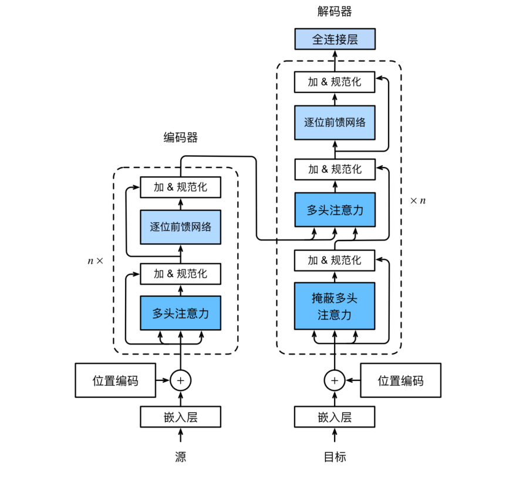

# 04 - 注意力机制

## 1. 注意力机制

### 1.1 背景

**注意力机制是从 seq2seq → Transformer 的核心飞跃**，它出现的动机是为了解决 seq2seq 的**信息瓶颈**。

seq2seq 的问题在于**解码器只能看到编码器最后一个隐状态**。翻译 100 个词的句子时，第 1 个词和第 100 个词的信息被压缩到同一个向量里——解码器生成第一个目标词时，可能早已"忘记"了源句开头的信息。

**注意力机制**给出了一条不同的路：解码器在每个时间步**直接查看编码器的所有时间步输出**，自己决定"这一步我最该关注源序列的哪些位置"。

### 1.2 QKV 框架

QKV 这个统一框架适用于所有注意力变体：

- **查询（Query, Q）**："我想知道什么"——解码器当前状态
- **键（Key, K）**："每个位置的标识"——编码器各位置的"索引"
- **值（Value, V）**："每个位置的实际信息"——编码器各位置的"内容"

注意力计算过程：**用 Q 和每个 K 算相似度 → softmax 归一化得到注意力权重 → 用权重对 V 加权求和**。假设有一个查询 $\mathbf{q}\in \mathbb R^q$ 和 $m$ 个键值对 $(\mathbf{k}_1,\mathbf{v}_1),\cdots,(\mathbf{k}_m,\mathbf{v}_m)$，其中 $\mathbf{k}_i\in\mathbb R^k, \mathbf{v}_i\in\mathbb R^v$，那么

$$\text{Attention}(\mathbf q, \mathbf k, \mathbf v) = \sum\limits_{i=1}^m \text{softmax}(\text{score}(\mathbf q, \mathbf k_i)) \cdot v_i \in \mathbb R^v,$$

其中 $\text{score}(\mathbf q, \mathbf k_i)$ 称为注意力评分函数。

### 1.3 注意力评分函数

常见有两种注意力评分函数：加性注意力、缩放点积注意力。

#### 1.3.1 加性注意力（Additive）

当查询和键是不同长度的矢量时，可以使用加性注意力作为评分函数，它的**可学习参数是最多的**。给定查询 $\mathbf{q}\in \mathbb R^q$ 和键 $\mathbf{k}\in \mathbb R^k$，则加性注意力的评分函数为：

$$\text{score}(\mathbf{q}, \mathbf{k}) = \mathbf{w}_v^\top \tanh(\mathbf{W}_q \mathbf{q} + \mathbf{W}_k \mathbf{k}) \in \mathbb R,$$

其中 $\mathbf{W}_q\in\mathbb R^{h\times q}、\mathbf{W}_k\in\mathbb R^{h\times k}、\mathbf{w}_v\in\mathbb R^{h}$ 是可学习的参数。

#### 1.3.2 缩放点积注意力（Scaled Dot-Product）

**点积运算效率最高，无额外参数，但是要求查询和键具有相同的长度 $d$**，缩放点积注意力是 Transformer 的标准注意力。给定查询 $\mathbf{q}\in \mathbb R^d$ 和键 $\mathbf{k}\in \mathbb R^d$，则缩放点积注意力的评分函数为：

$$\text{score}(\mathbf{q}, \mathbf{k}) = \frac{\mathbf{q}^\top \mathbf{k}}{\sqrt{d}} \in \mathbb R,$$

**说明**：

- **为什么除以 $\sqrt{d}$ ？** 当 $d$ 较大时，点积结果可能很大，softmax 进入饱和区（梯度接近 0），除以 $\sqrt{d}$ 将方差拉回 1，保持 softmax 处于梯度丰富的区域。
- 由于缩放点积注意力没有额外参数，所以在实际使用时通常会对输入输出进行投影，增加可学习参数。

### 1.4 Bahdanau

Bahdanau 是最早将注意力引入 seq2seq 的工作：它让解码器在生成每个目标词时，都用上一个隐状态作为 query，**去动态地查看编码器所有时间步的输出**，加权聚焦到源句的相关部分——而不是像原始 seq2seq 那样死盯一个固定的上下文向量。

原版 Bahdanau 采用 GRU + 加性注意力，是 QKV 概念在 seq2seq 上的第一次落地，现在已经不再单独使用，而是被 Transformer 取代。


## 2. Transformer

### 2.1 整体架构

RNN 有三个致命问题：

1. **必须顺序计算**——无法并行，训练慢
2. **长距离依赖难学**——相隔 100 步的词通过 100 层"中转"才能交互
3. **梯度衰减**——虽然 LSTM/GRU 缓解了，没有根治

Transformer 通过**纯注意力机制**一次性解决三者：整个序列同时处理（并行），任意两个位置直接交互（不需要中转）。Transformer 的编码器和解码器是基于自注意力的模块叠加而成的，源序列和目标序列的嵌入（embedding）表示将加上位置编码，再分别输入到编码器和解码器中。



### 2.2 Transformer 各组件

- **多头自注意力**：对序列内部建模——每个词同时关注所有其他词
- **掩蔽多头注意力**（解码器自注意力）：防止在生成时"偷看"未来的词
- **交叉注意力**：解码器连接编码器——用当前解码状态查编码器的所有位置
- **位置前馈网络（FFN）**：位置独立的非线性变换，增加模型容量
- **Add & LayerNorm**：残差连接让深层梯度流通，LayerNorm 稳定训练

#### 2.2.1 多头注意力（Multi-Head Attention）

在实践中，当给定相同的查询、键、值的集合时，我们希望模型可以基于相同的注意力机制学习到不同的行为，然后将不同的行为作为知识组合起来，捕获序列内各种范围的依赖关系。因此，允许注意力机制**组合使用查询、键、值的不同子空间表示**可能是有益的。

为此，与其只使用单独一个注意力汇聚，我们可以用独立学习得到的 h 组不同的线性投影来变换查询、键和值。然后，这 h 组变换后的查询、键和值将并行地送到注意力汇聚中。最后，将这 h 个注意力汇聚的输出拼接在一起，并且通过另一个可以学习的线性投影进行变换，以产生最终输出。这种设计被称为**多头注意力**。对于 h 个注意力汇聚输出，每一个注意力汇聚都被称作一个头（head）。

单个注意力头只能学到一种"关注模式"。但语言是复杂的——一个句子可能有主语-谓语关系、修饰关系、指代关系等多种依赖。多头注意力让模型**同时从多个角度进行关注**：

$$\text{MultiHead}(Q, K, V) = [\text{head}_1; \dots; \text{head}_h] \mathbf{W}_o$$
$$\text{head}_i = \text{Attention}(Q\mathbf{W}_i^Q, K\mathbf{W}_i^K, V\mathbf{W}_i^V)$$

其中每个头有自己的 $W^Q, W^K, W^V$ 投影矩阵 → 可以从不同子空间关注不同模式。除此之外，选取适当的投影维度，可以让我们**并行计算 h 个头**，提升计算效率。

#### 2.2.2 自注意力（Self-Attention）

之前提到的 Bahdanau 注意力是**跨序列**的（解码器去 attend 编码器的输出），而编码器内部对序列的编码依然采用的是 RNN。

自注意力则是一个**序列内部**的注意力，同一组词元同时充当查询、键、值，也就是同一序列的每个位置 attend 该序列的其他所有位置。所以我们可以使用自注意力来对序列进行编码，而无需再使用 RNN。RNN 编码必须每个时间步顺序计算，效率很低；而使用自注意力，序列中任意两个位置之间只需一步就能建立连接——这就是 Transformer 能并行处理整个序列的关键。

#### 2.2.3 位置编码（Positional Encoding）

在处理词元序列时，RNN 是逐个重复地处理词元的，而自注意力则因为并行计算而**放弃了顺序操作**。所以自注意力为了使用序列的顺序信息，必须在输入表示中添加**位置编码**来注入位置信息。原始 Transformer 使用三角函数的固定位置编码：

$$\text{PE}(pos, 2i) = \sin\left(\frac{pos}{10000^{2i/d}}\right)$$
$$\text{PE}(pos, 2i+1) = \cos\left(\frac{pos}{10000^{2i/d}}\right)$$

在 PE 矩阵中，行代表词元在序列中的位置，列代表位置编码的不同维度。

#### 2.2.4 基于位置的前馈网络（FFN）

基于位置的前馈网络对序列中的所有位置的表示进行变换时使用的是同一个多层感知机（MLP），这就是称前馈网络是基于位置的（positionwise）的原因。

FFN 是 Transformer 里"负责算"的部分：注意力把信息聚到一起后，FFN 在每个位置做非线性变换 + 存储知识，**是模型非线性和参数容量（约 2/3）的主要来源**。没有它，多层注意力堆叠就退化成线性混合，深度没有意义。

#### 2.2.5 残差连接

**残差连接**让梯度有一条"高速公路"直接回传，不经过注意力/FFN 的变换矩阵，解决深层网络的梯度消失问题，也允许信息无损地"穿过"某层。

#### 2.2.6 层规范化

**层规范化（LayerNorm）**是**对每个样本在它的特征维度上自己求均值方差**，把数据拉回标准正态分布（均值为 0、方差为 1），再用可学习的 γ、β 缩放平移。

**LayerNorm 举例**：

| 输入形状 | 统计量 | 统计量（μ, σ²）数量 |
|----------|---------------|-----|
| `(batch, D)` 全连接 | 每个样本的 D 个特征 | batch 组 |
| `(batch, seq, d_model)` Transformer | 每个 `(样本, 位置)` 的 d_model 维 | batch × seq 组 |
| `(batch, C, H, W)` 卷积 | 每个样本的全部 C×H×W | batch 组 |

**LayerNorm  和 BatchNorm 的根本区别：**

| | BatchNorm | LayerNorm |
|---|---|---|
| 在哪个维度归一化 | **batch 维**（跨样本，每个特征单独） | **特征维**（样本内部） |
| 是否依赖 batch 统计量 | ✅ 依赖，训练/推理行为不同 | ❌ 完全独立 |
| batch 大小影响 | 影响大（batch 太小统计不准） | 不影响（一个样本也能算） |
| 推理时 | 用训练累积的 running_mean/var | 和训练完全一致，没有额外状态 |
| 适合 | CNN | RNN / Transformer |

**PyTorch API：**

```python
# normalized_shape = 要对哪些维度归一化（最后一维，或后几维）
nn.LayerNorm(d_model)          # Transformer: 对 (batch, seq, d_model) 的最后一维
nn.LayerNorm([C, H, W])        # 对后三维整体归一化
```

**Post-Norm vs Pre-Norm：**

```python
# Post-Norm（原始 Transformer）：先注意力/FFN，再加残差，最后 LN
x = LN(x + Attn(x))      # 原始 GPT-1、BERT

# Pre-Norm（现代主流）：先 LN，再做子层，再加残差
x = x + Attn(LN(x))      # GPT-2、Llama
```

**总结**：

1. 对于序列长度可变的 RNN/Transformer，padding 位置会让 BN 的统计量被"空位置"污染，而 LN 按每个位置独立算、不受影响。所以 LN 是 RNN/Transformer 的标配；而 BN 则用在 CNN 的领域。
2. Pre-Norm 训练更稳（梯度流不被 LN 压缩），所以现代模型几乎全用 Pre-Norm，而不是原始 Transformer 中所使用的 Post-Norm。

### 2.3 从零实现

完整代码见 `code/transformer_implement.py`

### 2.4 简洁实现

```python
from torch.nn import Transformer

transformer = Transformer(
    d_model=512,
    nhead=8,
    num_encoder_layers=6,
    num_decoder_layers=6,
    dim_feedforward=2048,
    dropout=0.1
)

# 常用：单独的编码器层
encoder_layer = nn.TransformerEncoderLayer(d_model=512, nhead=8)
transformer_encoder = nn.TransformerEncoder(encoder_layer, num_layers=6)
```

**输入形状约定（最容易踩坑）：** `nn.Transformer` 系 API 默认 **`batch_first=False`**——序列维度在前，和 `nn.Linear`/`nn.Embedding` 的 `(batch, seq)` 约定相反：

```python
src = torch.randn(10, 32, 512)   # (src_len, batch, d_model)，不是 (batch, ...)！
tgt = torch.randn(8, 32, 512)    # (tgt_len, batch, d_model)
out = transformer(src, tgt)      # 输出也是 (tgt_len, batch, d_model)

# 不习惯可以打开 batch_first=True，改用 (batch, seq, d_model)
nn.Transformer(d_model=512, nhead=8, batch_first=True)
```

**三个类的关系：**

| 类 | 是什么 |
|----|--------|
| `nn.Transformer` | 完整 encoder + decoder |
| `nn.TransformerEncoder` | 只用 encoder（堆 N 层 EncoderLayer） |
| `nn.TransformerEncoderLayer` | 单层 encoder：Self-Attn → Add&Norm → FFN → Add&Norm |

注意：`nn.TransformerEncoderLayer` 内部**没有 cross-attention**（那是 decoder 的事）；`nn.TransformerDecoderLayer` 才有 self-attn + cross-attn。

**nn.Transformer 不会自动做的事（最容易被忽略）：** 它期望输入**已经是 `(seq, batch, d_model)` 的向量**。Embedding、位置编码、掩码**全部要自己加**：

```python
src = self.embedding(src_idx) * math.sqrt(d_model)   # ① embedding（原始 Transformer 会乘以 √d_model）
src = self.pos_encoding(src)                          # ② 位置编码
out = transformer(src, tgt, tgt_mask=causal_mask)    # ③ 掩码
```

**`norm_first`：现代模型都在用的参数**

```python
# 默认 norm_first=False → Post-Norm（原始 Transformer）
# norm_first=True → Pre-Norm（GPT-2/Llama 主流）
nn.TransformerEncoderLayer(d_model=512, nhead=8, norm_first=True)
```

**掩码：不传 = 不是自回归**

```python
# 解码器要防"偷看未来"，必须自己生成因果掩码
causal_mask = torch.nn.Transformer.generate_square_subsequent_mask(tgt_len)
out = transformer(src, tgt, tgt_mask=causal_mask)
```

不传 `tgt_mask` 的话，解码器能看到完整目标序列——训练出来不是自回归模型。

**它不做自动回归解码：** `nn.Transformer` 一次前向处理**整个目标序列**（训练时的 teacher forcing 形态）。真正的"逐个生成词"（推理时的自回归循环）**要自己写循环**——每步把已生成的词喂进去，取最后一步输出。

**现在的大模型（GPT 系）怎么用：** 它们是 **decoder-only**，没有 cross-attention。PyTorch 里常用 `TransformerEncoderLayer` 模拟：

```python
# GPT 结构 ≈ TransformerEncoderLayer + 因果掩码 + norm_first
layer = nn.TransformerEncoderLayer(
    d_model=512, nhead=8, dim_feedforward=2048, norm_first=True, batch_first=True)
gpt = nn.TransformerEncoder(layer, num_layers=6)
```

或者用 `nn.TransformerDecoderLayer`（它的 cross-attn 接一个空 source）。
