# 第01章_基本介绍

## 1. 简介

数据分析的完整流程：

1. 数据收集
2. 数据清洗（典型的问题有缺失值、错误数据、格式混乱等）
3. 数据分析（统计平均值、最大值，分组对比等）
4. 数据可视化（折线图描述趋势、柱状图进行对比、散点图描述相关性）

数据分析的核心工具：

1. **Numpy**：高性能数值计算（矩阵、向量）
2. **Pandas**：表格数据处理
3. **Matplotlib**：数据可视化（绘图库）

## 2. 环境搭建

### 2.1 Anaconda

#### 1、特点

- 方便安装：就像安装一个应用程序一样简单，它为您预先安装好了许多常用的工具，无需单独配置
- 包管理器：包含一个名为 Conda 的包管理器，用于安装、更新和管理软件包
- 环境管理：可以轻松地创建和管理多个独立的 Python 环境，比如可以安装 python2 和 python3 环境，实现自由切换
- 集成工具和库：捆绑了许多用于数据科学、机器学习和科学计算的重要工具和库，如 NumPy、Pandas、Matplotlib、SciPy、Scikit-learn 等
- 跨平台性：可在 Windows、macOS 和 Linux 等操作系统上运行，使其成为一个跨平台的解决方案

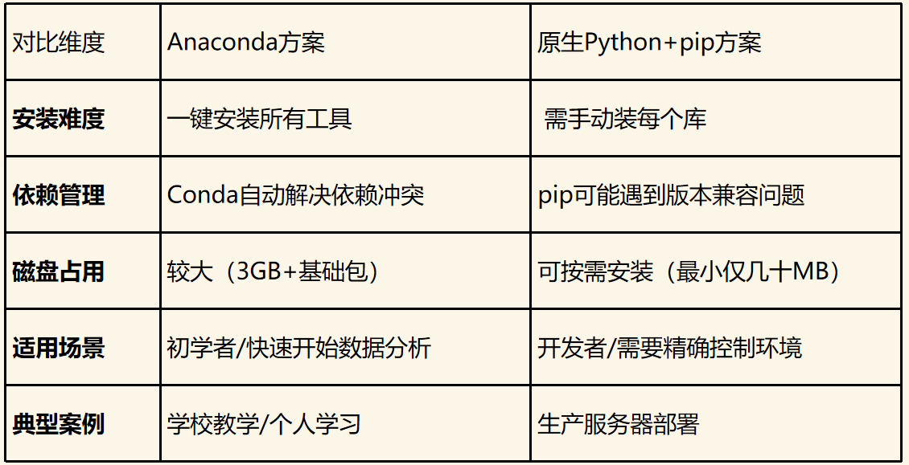

#### 2、安装步骤

（1）前往 https://www.anaconda.com/download/success 点击 Download 进行下载并安装

（2）我们以 2022.05 版本的 Anaconda3 为例，安装过程中勾选如下选项


（3）修改镜像源

- 首先打开 Anaconda Prompt 后执行下述命令

  ```shell
  conda config --set show_channel_urls yes
  ```

- 然后打开 `C:\Users\<YourUserName>\.condarc` 文件并修改成以下内容：

  ```txt
  channels:
    - defaults
  show_channel_urls: true
  default_channels:
    - https://mirrors.tuna.tsinghua.edu.cn/anaconda/pkgs/main
    - https://mirrors.tuna.tsinghua.edu.cn/anaconda/pkgs/r
    - https://mirrors.tuna.tsinghua.edu.cn/anaconda/pkgs/msys2
  custom_channels:
    conda-forge: https://mirrors.tuna.tsinghua.edu.cn/anaconda/cloud
    pytorch: https://mirrors.tuna.tsinghua.edu.cn/anaconda/cloud
  ```

> 说明：如果已经修改好镜像源，用 conda 安装包时仍出现网络连接异常，可能是 WiFi 的原因，可以尝试使用手机热点进行安装。

（4）PyCharm 中指定 Conda 及环境，只需在右下角添加 Python 解释器：


#### 3、常用命令

> 需要打开 Anaconda Prompt 后执行下述命令

**管理 Conda 自身命令**：

```shell
# 查看 conda 版本
conda --version
# 查看基本信息
conda info
```

**虚拟环境管理**：

```shell
# 创建虚拟环境并指定 python 版本
conda create -n env_name python=3.8
# 查看所有环境
conda env list
# 激活某一环境
conda activate env_name
# 克隆环境
conda create --name new_env --clone old_env
# 删除指定环境
conda remove -n env_name --all
```

**包管理**：

```shell
# 在当前环境安装指定版本的包
conda install package_name=1.2.3

# 查看已经安装的包
conda list

# 清理缓存（删除下载的临时包）
conda clean --all
```

其他更多命令可以参考 https://blog.csdn.net/qq_55106902/article/details/147308606

### 2.2 Jupyter

Jupyter 是一个开源的交互式计算环境，广泛应用于数据科学、机器学习、科学研究等领域，主要组件有 Jupyter Notebook 和 Jupyter Lab。在 PyCharm 中已经集成了 Jupyter。

> 说明：Jupyter 是 Anaconda 发行版的一部分，默认随 Anaconda 一起安装。

**在 PyCharm 中配置 Jupyter 的步骤如下**：

1. `工具->添加Jupyter连接`，外部服务器中服务器 URL 填写 `http://localhost:8888`，密码填写你所设置的 Jupyter Notebook 服务器密码（设置密码只需在终端输入 `jupyter notebook password` 后即可设置）
2. 在 PyCharm 中使用 Jupyter，始终需要我们启动 Jupyter Notebook 服务器，即在终端输入 `jupyter notebook` 即可
3. 在 PyCharm 中创建一个 Jupyter Notebook 文件即可进行编写

**Jupyter 快捷键如下**：

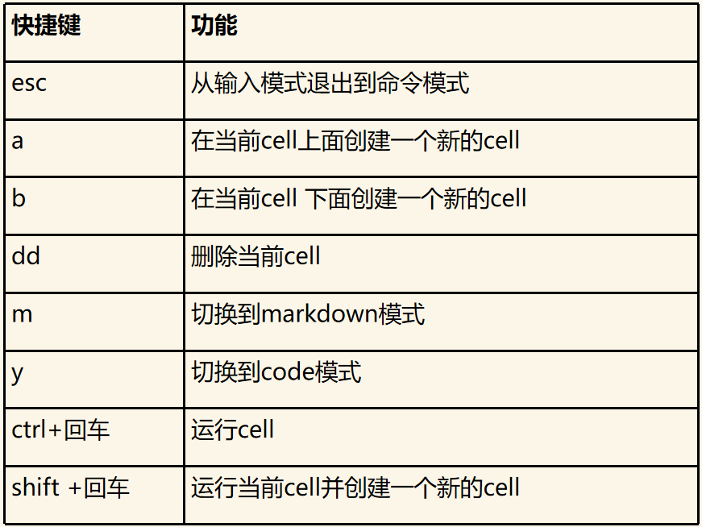


# 第02章_Numpy

numpy 是 Python 中科学计算的基础包。它是一个 Python 库，提供多维数组对象、各种派生对象（例如掩码数组和矩阵）以及用于对数组进行快速操作的各种方法，包括数学、逻辑、形状操作、排序、选择、I/O 、离散傅里叶变换、基本线性代数、基本统计运算、随机模拟等等。

numpy 的部分功能如下：

- ndarray，一个具有矢量算术运算和复杂广播能力的快速且节省空间的多维数组。
- 用于对整组数据进行快速运算的标准数学函数（无需编写循环）。
- 用于读写磁盘数据的工具以及用于操作内存映射文件的工具。
- 线性代数、随机数生成以及傅里叶变换功能。
- 用于集成由 C、C++、Fortran 等语言编写的代码的 API。

## 1. ndarray

numpy 数组（ndarray）的核心特性：

- 多维性：支持 0 维（标量）、1 维（向量）、2 维（矩阵）及更高维（张量）数组。
- 同质性：所有元素类型必须一致（通过 dtype 指定）。
- 高效性：基于连续内存块存储，支持向量化运算。

### 1.1 ndarray的属性

| 属性名称 | 说明                                       |
| -------- | ------------------------------------------ |
| shape    | 数组的形状：行数和列数（或更高维度的尺寸） |
| ndim     | 维度数量：数组是几维的（0维、1维、2维等）  |
| size     | 总元素个数                                 |
| dtype    | 元素类型                                   |
| T        | 转置                                       |
| itemsize | 单个元素占用的内存字节数                   |
| nbytes   | 数组总内存占用量                           |
| flags    | 内存存储方式：是否连续存储（高级优化）     |

示例（ndarray 的基本创建）：

```python
# 导入 numpy
import numpy as np

# 创建 0 维 ndarray 数组
arr = np.array(5)
print(arr)
print("arr的维度为：", arr.ndim)
"""
5
arr的维度为： 0
"""

# 创建 1 维 ndarray 数组
arr = np.array([1, 2, 3])
print(arr)
print("arr的维度为：", arr.ndim)
"""
[1 2 3]
arr的维度为： 1
"""

# 创建 2 维 ndarray 数组
arr = np.array([[1, 2, 3], [4, 5, 6]])
print(arr)
print("arr的维度为：", arr.ndim)
"""
[[1 2 3]
 [4 5 6]]
arr的维度为： 2
"""

# 同质性（不同的数据类型会被强制转换成相同的数据类型）
arr = np.array([1, "hello"])
print(arr)  # ['1' 'hello']
arr = np.array([1, 2.5])
print(arr)  # [1.  2.5]
```

示例（ndarray 的常用属性）：

```python
arr = np.array([[1, 2, 3], [4, 5, 6]])
print(arr)
print(arr.shape)     # (2, 3)
print(arr.ndim)      # 2
print(arr.size)      # 6
print(arr.dtype)     # int64
print(arr.T)         # [[1 4][2 5][3 6]]
print(arr.itemsize)  # 8
print(arr.nbytes)    # 48
print(arr.flags)
```

### 1.2 ndarray元素的数据类型

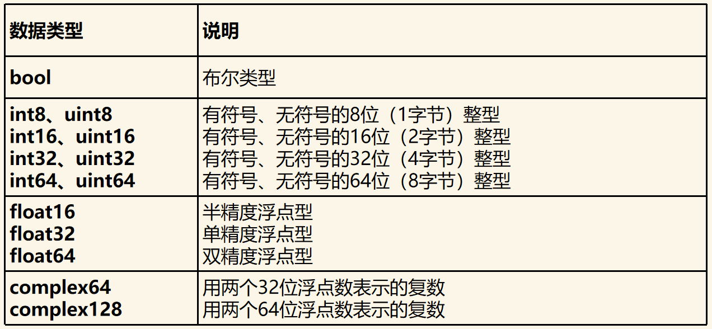

### 1.3 ndarray的详细创建方式

```python
# 1. 指定数据类型为浮点数
arr = np.array([[1, 2, 3], [4, 5, 6]], dtype=np.float64)

# 2. 深拷贝
arr1 = np.copy(arr)

# 3. 预定义形状填充
## 元素值全0
arr = np.zeros((4, 3))
arr = np.zeros_like(arr1)
## 元素值全1
arr = np.ones((4, 3))
arr = np.ones_like(arr1)
## 空ndarray（其元素值是不确定的，取决于那块内存中的内容）
arr = np.empty((4, 3))
arr = np.empty_like(arr1)
## 自定义填充值为5
arr = np.full((4, 3), 5)
arr = np.full_like(arr1, 5)

# 4. 基于数值范围生成数组
## 等差数列  np.arange(start, end, step)
arr = np.arange(2, 10, 2)  # [2 4 6 8]
## 等间隔数列  np.linspace(start, end, num)
arr = np.linspace(0, 10, 5)  # [ 0.  2.5  5.  7.5  10.]
## 等对数间隔数列  np.logspace(start, end, num, base)
arr = np.logspace(0, 4, 3, base=2)  # [ 1.  4.  16.]

# 5. 生成特殊矩阵
## 单位矩阵（3阶）
arr = np.eye(3)
## 对角矩阵
arr = np.diag([1, 2, 3, 4])

# 6. 生成随机数组
## 设置随机数种子
np.random.seed(42)
## [0,1)之间随机浮点数（均匀分布）
arr = np.random.rand(2, 3)
## [3,6)之间随机浮点数（均匀分布）
arr = np.random.uniform(3, 6, (2, 3))
## [3,6)之间随机整数（均匀分布）
arr = np.random.randint(3, 6, (2, 3))
## 随机浮点数（正态分布）
arr = np.random.randn(2, 3)
```

### 1.4 索引与切片

#### 一维数组

```python
np.random.seed(42)
arr = np.random.randint(0, 100, 20)
print(arr)  # [51 92 14 71 60 20 82 86 74 74 87 99 23  2 21 52  1 87 29 37]

# 1. 索引指定元素
print(arr[2])  # 14

# 2. 切片
print(arr[2:5])  # [14 71 60]
## 也可以使用 slice 函数
print(arr[slice(2, 5)])  # [14 71 60]

# 3. 布尔索引（例如，筛选所有大于50小于75的值，注意支持的逻辑运算符为 &、| ）
print(arr[(50 < arr) & (arr < 75)])  # [51 71 60 74 74 52]
```

#### 二维数组

```python
np.random.seed(42)
arr = np.random.randint(0, 100, (6, 8))
print(arr)

# 1. 索引指定元素（第2行第3列的元素）
print(arr[2, 3])  # 37

# 2. 切片
## 第1行，第[2,5)列
print(arr[1, 2:5])  # [87 99 23]
## 第3列
print(arr[:, 3])  # [71 99 37 21 79 63]
## 第[0,2)行第[0,2)列
print(arr[0:2, 0:2])  # [[51 92][74 74]]

# 3. 布尔索引
## 筛选大于80的值
print(arr[arr > 80])  # [92 82 86 87 99 87 88 90 91]
## 筛选第2行中大于80的值
print(arr[2][arr[2] > 80])  # [87]
## 筛选第6列中大于80的值
print(arr[:, 6][arr[:, 6] > 80])  # [82 90]
```

### 1.5 ndarray的运算

```python
# 1. ndarray间的四则运算（ndarray可以是更高维的，但两个ndarray形状必须相同）
a = np.array([1, 2, 3])
b = np.array([4, 5, 6])
print(a + b)  # [5 7 9]
print(a - b)  # [-3 -3 -3]
print(a * b)  # [ 4 10 18]
print(a / b)  # [0.25 0.4  0.5 ]

# 2. ndarray与标量间的四则运算
print(a + 3)  # [4 5 6]

# 3. 矩阵乘法
m1 = np.array([[1, 2, 3], [4, 5, 6], [7, 8, 9]])
m2 = np.array([[4, 5, 6], [7, 8, 9], [1, 2, 3]])
print(m1 @ m2)  # [[ 21  27  33] [ 57  72  87] [ 93 117 141]]
```

## 2. numpy常用函数

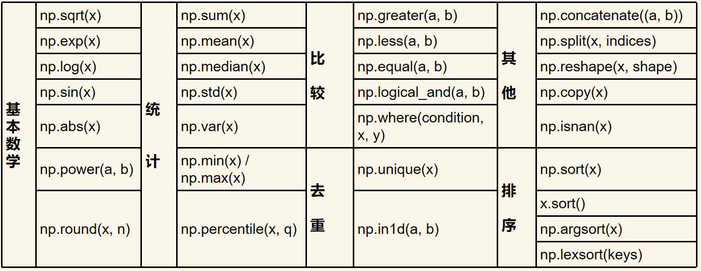

### 2.1 基本数学函数

```python
# 1. 平方根
print(np.sqrt(9))  # 3.0
print(np.sqrt([1, 4, 9]))  # [1. 2. 3.]
print(np.sqrt(np.array([1, 4, 9])))  # [1. 2. 3.]

# 2. 以e为底的指数
print(np.exp(1))  # 2.718281828459045

# 3. 自然对数
print(np.log(2.71828))  # 0.999999327347282

# 4. 三角函数
print(np.sin(np.pi / 2))  # 1.0

# 5. 绝对值
print(np.abs(-1))  # 1

# 6. a的b次幂
print(np.power([2, 3, 4], 3))  # [ 8 27 64]

# 7. 四舍五入
print(np.round([2.2, 3.8]))  # [2. 4.]

# 8. 向上取整
print(np.ceil([2.2, 3.8]))  # [3. 4.]

# 9. 向下取整
print(np.floor([2.2, 3.8]))  # [2. 3.]

# 10. 检测缺失值
print(np.isnan([1, 2, np.nan, 3]))  # [False False  True False]
```

### 2.2 统计函数

```python
arr = np.array([1, 2, 3, 6])

# 求和
print(np.sum(arr))  # 12

# 平均值
print(np.mean(arr))  # 3.0

# 中位数
print(np.median(arr))  # 2.5

# 标准差
print(np.std(arr))  # 1.8708286933869707

# 方差
print(np.var(arr))  # 3.5

# 最小值、最大值
print(np.min(arr))  # 1
print(np.max(arr))  # 6

# 最小值、最大值的索引位置
print(np.argmin(arr))  # 0
print(np.argmax(arr))  # 3

# 分位数
print(np.percentile(arr, 25))  # 1.75

# 累积和、累积积
print(np.cumsum(arr))  # [ 1  3  6 12]
print(np.cumprod(arr))  # [ 1  2  6 36]

# 二维矩阵，获取每列的最大值、每行的最大值
matrix = np.array([[1, 2, 3], [4, 5, 6], [7, 8, 9]])
## axis=0 每列（同样适用于min、sum等函数）
print(np.max(matrix, axis=0))  # [7 8 9]
## axis=1 每行（同样适用于min、sum等函数）
print(np.max(matrix, axis=1))  # [3 6 9]
```

### 2.3 比较函数

```python
arr = np.array([1, 2, 3, 6])

# 是否大于、小于、等于
print(np.greater(arr, 3))  # [False False False  True]
print(np.less(arr, 3))  # [ True  True False False]
print(np.equal(arr, 3))  # [False False  True False]

# 逻辑与、逻辑或、逻辑非
print(np.logical_and([1, 0], [1, 1]))  # [ True False]
print(np.logical_or([0, 0], [1, 0]))  # [ True False]
print(np.logical_not([1, 0]))  # [False  True]

# 检查是否至少有一个元素为True
print(np.any([0, 0, 1]))  # True
# 检查是否全部元素为True
print(np.all([0, 0, 1]))  # False

# 自定义条件 np.where(条件, 符合条件的值, 不符合条件的值)
print(np.where(arr < 3, arr, 0))  # [1 2 0 0]

# 自定义条件 np.select(条件列表, 返回结果列表)
score = np.array([58, 65, 78, 95, 100])
score_result = np.select(
    [score >= 80, (score >= 60) & (score < 80), score < 60],
    ['优良', '合格', '不合格'],
    default='未知'
)
print(score_result)  # ['不合格' '合格' '合格' '优良' '优良']
```

### 2.4 排序函数

```python
np.random.seed(42)
arr = np.random.randint(0, 100, 20)

# 排序，但不改变源数组
sorted_arr = np.sort(arr)
print(sorted_arr)
print(arr)

# 排序，但不改变源数组，返回的是值在源数组中的索引
sorted_idx_arr = np.argsort(arr)
print(sorted_idx_arr)

# 对源数组进行排序
arr.sort()
print(arr)
```

### 2.5 去重函数

```python
np.random.seed(42)
arr = np.random.randint(0, 100, 100)

# 去重，不会改变源数组，而且去重后得到的数组是有序的
new_arr = np.unique(arr)
print(new_arr)
```

### 2.6 其他函数

```python
arr1 = np.array([1, 2, 3])
arr2 = np.array([4, 5, 6])

# 1. ndarray的拼接
arr = np.concatenate((arr1, arr2))
print(arr)  # [1 2 3 4 5 6]

# 2. ndarray的分割
## 分割成3个数组（注意必须要能等分）
print(np.split(arr, 3))  # [array([1, 2]), array([3, 4]), array([5, 6])]
## 指定切割位置
print(np.split(arr, [2, 5]))  # [array([1, 2]), array([3, 4, 5]), array([6])]

# 3. 改变ndarray的形状
print(np.reshape(arr, [2, 3]))  # [[1 2 3] [4 5 6]]
```


# 第03章_Pandas

Pandas 是 Python 数据分析工具链中最核心的库，充当数据读取、清洗、分析、统计、输出的高效工具。Pandas 提供了易于使用的数据结构和数据分析工具，特别适用于处理结构化数据，如表格型数据（类似于 Excel 表格）。Pandas 是数据科学和分析领域中常用的工具之一，它使得用户能够轻松地从各种数据源中导入数据，并对数据进行高效的操作和分析。

Pandas 是基于 numpy 构建的专门为处理表格和混杂数据设计的 Python 库，核心设计理念包括：

- 标签化数据结构：提供带标签的轴
- 灵活处理缺失数据：内置 NaN 处理机制
- 智能数据对齐：自动按标签对齐数据
- 强大IO工具：支持从 CSV、Excel、SQL 等 20+ 数据源读写
- 时间序列处理：原生支持日期时间处理和频率转换

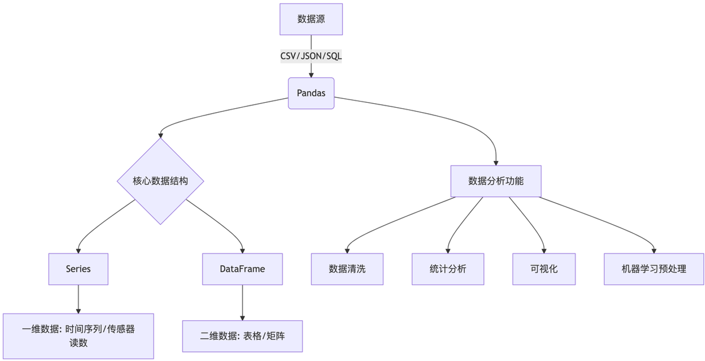

|          | Series         | DataFrame          |
| -------- | -------------- | ------------------ |
| 维度     | 一维           | 二维               |
| 索引     | 单索引         | 行索引+列名        |
| 数据存储 | 同质化数据类型 | 各列可不同数据类型 |
| 类比     | Excel单列      | 整张Excel工作表    |

## 1. Series

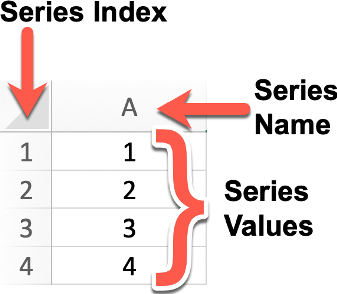

### 1.1 创建方式

```python
import pandas as pd

# 1. 基本创建方式（使用默认索引 0,1,2,...）
s = pd.Series([1, 2, 3, 4, 5])

# 2. 自定义索引进行创建
s = pd.Series([1, 2, 3, 4, 5], index=['a', 'b', 'c', 'd', 'e'])

# 3. 通过字典进行创建，效果与自定义索引相同
s = pd.Series({"a": 1, "b": 2, "c": 3, "d": 4, "e": 5})

# 4. 为Series定义name
s = pd.Series([1, 2, 3, 4, 5], index=['a', 'b', 'c', 'd', 'e'], name='月份')

# 5. 基于已有Series进行创建（可以只选取部分索引）
s1 = pd.Series(s, index=['a', 'e'])
```

### 1.2 Series的属性

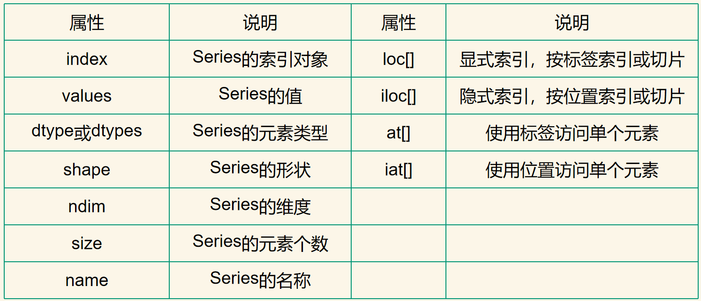

### 1.3 数据的访问方式

```python
s = pd.Series([1, 2, 3, 4, 5, 6], index=['a', 'b', 'c', 'd', 'e', 'f'])

# 访问单个数据
## 方式1：通过显式索引访问
print(s['a'])
print(s.at['a'])
print(s.loc['a'])
## 方式2：通过隐式索引访问
print(s.iat[0])
print(s.iloc[0])

# 切片
## 方式1：通过显式索引访问（左闭右闭）
print(s.loc['a':'c'])
## 方式2：通过隐式索引访问（左闭右开）
print(s.iloc[0:3])

# 布尔索引
print(s[s < 3])
```

### 1.4 Series常用函数

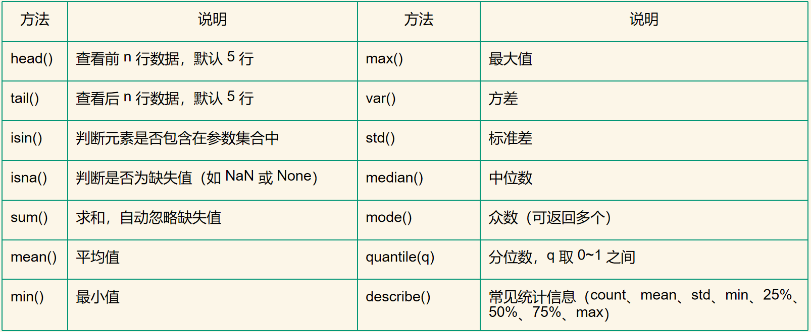

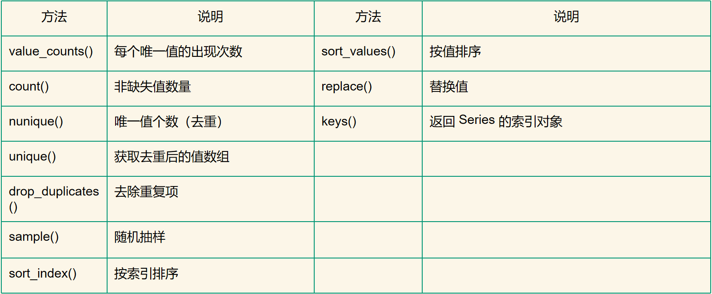

## 2. DataFrame

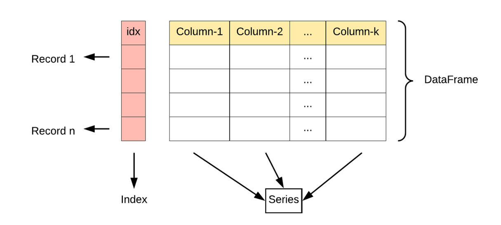

### 2.1 创建方式

```python
import pandas as pd

# 1. 基于Series创建
s1 = pd.Series(['张三', '李四', '王五'])
s2 = pd.Series([101, 102, 103])
df = pd.DataFrame({'姓名': s1, '学号': s2})

# 2. 基于字典创建
# 通过index可以设置索引名，通过columns可以设置调整列的顺序
df = pd.DataFrame(
    {
        '姓名': ['张三', '李四', '王五'],
        '学号': [101, 102, 103]
    }, index=['a', 'b', 'c'], columns=['学号', '姓名']
)
```

### 2.2 DataFrame的属性

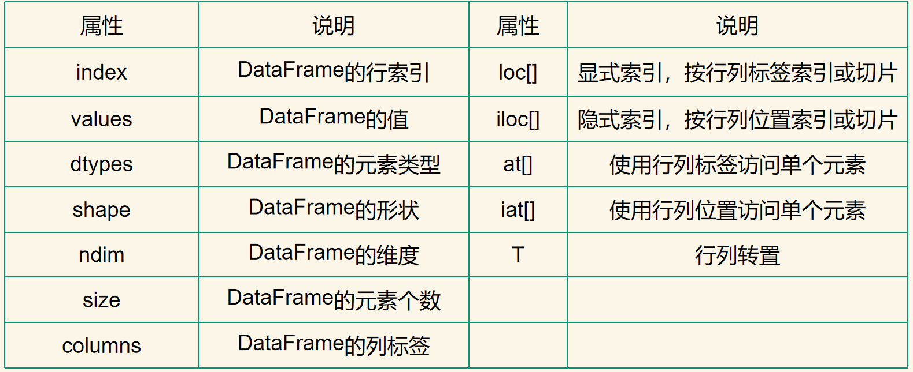

### 2.3 数据的访问方式

```python
df = pd.DataFrame(
    {
        '姓名': ['张三', '李四', '王五'],
        '学号': [101, 102, 103]
    }, index=['a', 'b', 'c']
)

# 获取某行数据
print(df.loc['a'])

# 获取某列数据
print(df.loc[:, '姓名'])
print(df['姓名'])
print(df.姓名)

# 获取多列数据
print(df[['姓名', '学号']])

# 获取单个元素
print(df.loc['a', '姓名'])
print(df.at['a', '姓名'])

# 布尔索引
print(df[df.学号 > 101])
```

### 2.4 DataFrame常用函数

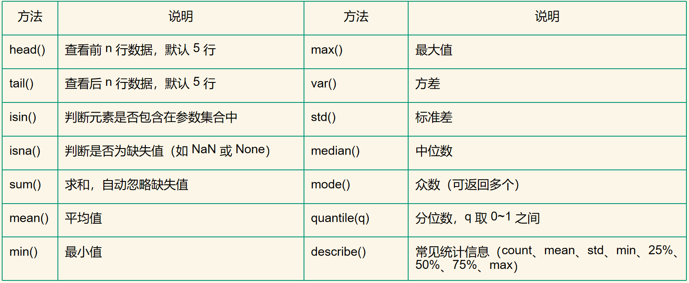

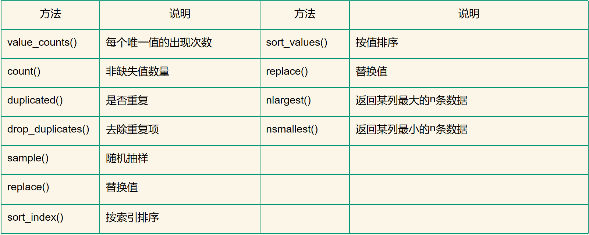

## 3. Timestamp

### 3.1 基本使用

Timestamp 用于处理时间数据，基本使用方式如下：

```python
# 1. 创建Timestamp
d = pd.Timestamp('2025-10-01 10:00')
print(d)  # 2025-10-01 10:00:00
print(type(d))  # <class 'pandas._libs.tslibs.timestamps.Timestamp'>

# 2. 常用属性
print(d.year, d.month, d.day, d.hour, d.minute, d.second)  # 2025 10 1 10 0 0
print("季度", d.quarter)  # 季度 4
print("是否是月底", d.is_month_end)  # 是否是月底 False

# 3. 常用方法
print("星期几", d.day_name())  # 星期几 Wednesday
print("转换为天", d.to_period("D"))  # 转换为天 2025-10-01
print("转换为周维度", d.to_period("W"))  # 转换为周维度 2025-09-29/2025-10-05
print("转换为月维度", d.to_period("M"))  # 转换为月维度 2025-10
print("转换为季度", d.to_period("Q"))  # 转换为季度 2025Q4
print("转换为年度", d.to_period("Y"))  # 转换为年度 2025
```

### 3.2 日期类型的转换

**字符串转日期类型**：

```python
# 对于常用的日期格式如 yyyyMMdd、yyyy-MM-dd 等都支持转换
d = pd.to_datetime('20251001')
print(d)  # 2025-10-01 00:00:00
```

**DataFrame 中的日期转换**：

```python
df = pd.DataFrame({
    'sales': [100, 200, 300],
    'date': ['20250601', '20250602', '20250603']
})

# 新增一个数据类型为 Timestamp 的 datetime 列
df['datetime'] = pd.to_datetime(df['date'])
# 如果要对某日期类型列调用 Timestamp 的相关方法，则需要通过 dt 属性调用
df['week'] = df['datetime'].dt.day_name()
print(df)
```

**导入 csv 文件并进行日期转换**：

```python
# 方式一：类似 DataFrame 中的日期转换操作
df = pd.read_csv('data/weather_withna.csv')
df['date'] = pd.to_datetime(df['date'])

# 方式二：直接在导入 csv 文件时指定要转换的日期列名
df = pd.read_csv('data/weather_withna.csv', parse_dates=['date'])
```

### 3.3 其他功能

**将日期作为索引**：

```python
df = pd.read_csv('data/weather_withna.csv', parse_dates=['date'])
df.set_index('date', inplace=True)
print(df)
```

**计算日期间隔**：

```python
d1 = pd.Timestamp('2025-10-01')
d2 = pd.Timestamp('2025-10-07')
print(d2 - d1)  # 6 days 00:00:00
```

**生成时间序列**：

```python
# 生成时间序列（指定开始和结束日期，freq用于指定间隔，默认为天，设置W则为周）
day_list1 = pd.date_range('2025-07-03', '2026-02-09', freq='W')
print(day_list1)

# 生成时间序列（指定开始日期和要生成的日期个数）
day_list2 = pd.date_range('2025-07-03', periods=5, freq='W')
print(day_list2)
```

## 4. 数据分析流程

### 4.1 数据的导入导出

```python
# 数据导入
df = pd.read_csv('data/employees.csv')
print(df)
# 数据导出
df.to_csv('data/new_employees.csv')
```

### 4.2 缺失值处理

#### 查看缺失值

```python
df = pd.DataFrame({
    '第一列': [1, 2, 3],
    '第二列': [np.nan, None, 6],
    '第三列': [pd.NA, 8, 9]
})

# 查看缺失值
print(df.isna())
```

#### 剔除缺失值

```python
df = pd.DataFrame({
    '第一列': [1, 2, 3],
    '第二列': [np.nan, None, 6],
    '第三列': [pd.NA, 8, 9]
})

# 剔除缺失值
## 1. 如果某行有缺失值，则删除该行记录
print(df.dropna())
## 2. 如果某列有缺失值，则删除该列记录
print(df.dropna(axis=1))
## 3. 如果某行的所有值都是缺失值，才删除该行记录
print(df.dropna(how='all'))
## 4. 如果某行至少有n个值不是缺失值，则保留该行
print(df.dropna(thresh=2))
## 5. 只对指定列进行检测，如果有缺失值，则删除该行记录
print(df.dropna(subset=['第三列']))
```

#### 填充缺失值

```python
df = pd.read_csv('data/weather_withna.csv')

# 填充缺失值
## 1. 对指定列使用固定值填充缺失值
print(df.fillna({'temp_max': 20, 'wind': 2.5}))
## 2. 对指定列使用该列的平均值填充缺失值
print(df.fillna(df[['temp_max', 'wind']].mean()))
## 3. 对每一列，使用缺失值前面的相邻值进行填充
print(df.ffill())
## 4. 对每一列，使用缺失值后面的相邻值进行填充
print(df.bfill())
```

### 4.3 重复值处理

```python
df = pd.DataFrame({
    'name': ['alice', 'alice', 'bob', 'alice', 'jack', 'bob'],
    'age': [26, 25, 30, 25, 35, 30],
    'city': ['NY', 'NY', 'LA', 'NY', 'SF', 'LA']
})

# 1. 一整行记录都是一样的，则标记为重复
print(df.duplicated())
# 2. 根据指定列去重，默认保留最前面的数据
print(df.drop_duplicates(subset=['name']))
# 3. 根据指定列去重，保留最后面的数据
print(df.drop_duplicates(subset=['name'], keep='last'))
```

### 4.4 数据类型转换

```python
df = pd.read_csv('data/sleep.csv')

# 将 age 列的数据类型转换为 int16
df['age'] = df['age'].astype('int16')
print(df.dtypes)

# 将 gender 列的数据类型转换为 category
df['gender'] = df['gender'].astype('category')
print(df.dtypes)

# 定义一个 Bool 类型的列，用于判断性别
df['is_male'] = df['gender'].map({'Male': True, 'Female': False})
print(df['is_male'])
```

### 4.5 分组聚合

```python
# 1. 导入数据
df = pd.read_csv('data/employees.csv')

# 2. 数据清洗
## 为了根据部门进行分组，首先要剔除部门ID为空的数据
df = df.dropna(subset=['department_id'])
## 将部门ID数据类型设置为int
df['department_id'] = df['department_id'].astype('int64')

# 3. 分组
## 查看分组
print(df.groupby('department_id').groups)
## 查看具体的某个分组数据
print(df.groupby('department_id').get_group(20))

# 4. 聚合
## 计算每个部门的平均薪资
df_aggregate_salary = df.groupby('department_id')[['salary']].mean()
## 后置处理：重置索引、平均薪资保留小数点后2位、根据薪资排序
df_aggregate_salary = df_aggregate_salary.reset_index()
df_aggregate_salary['salary'] = df_aggregate_salary['salary'].round(2)
df_aggregate_salary = df_aggregate_salary.sort_values('salary', ascending=False)
print(df_aggregate_salary)
```


# 第04章_matplotlib

数据可视化工具对比：

| 工具        | 说明                     | 优点                 | 缺点             |
| ----------- | ------------------------ | -------------------- | ---------------- |
| matplotlib  | Python最基础的可视化库   | 灵活强大、定制型强   | 代码多、风格基础 |
| seaborn     | 基于matplotlib的高级接口 | 风格美观、统计图方便 | 对简单图略繁琐   |
| pandas plot | 快速图表，调用plot()即可 | 快捷、适合EDA        | 图表样式较少     |

## 1. 折线图plot

```py
import matplotlib.pyplot as plt
from matplotlib import rcParams

# 0. 设置字体用于处理中文字符（Windows设置为SimHei，Mac设置为STHeiti）
rcParams['font.family'] = 'SimHei'

# 1. 创建图表，设置大小（长和宽）
plt.figure(figsize=(10, 5))

# 2. 数据
month = ['1月', '2月', '3月', '4月']
sales = [100, 150, 80, 130]

# 3. 绘制折线图
plt.plot(month, sales, label='产品A')
# 添加标题
plt.title('2025年销售趋势')
# 添加坐标轴的标签
plt.xlabel('月份')
plt.ylabel('销售额（万元）')
# 添加图例
plt.legend()
# 添加网格线
plt.grid(True)
# 设置y轴的范围
plt.ylim(0, 160)

# 4. 显示图表
plt.show()
```

## 2. 柱状图bar

```python
import matplotlib.pyplot as plt
from matplotlib import rcParams

# 0. 设置字体用于处理中文字符（Windows设置为SimHei，Mac设置为STHeiti）
rcParams['font.family'] = 'SimHei'

# 1. 创建图表，设置大小（长和宽）
plt.figure(figsize=(10, 5))

# 2. 数据
subjects = ['语文', '数学', '英语']
scores = [85, 92, 78]

# 3. 绘制柱状图
plt.bar(subjects, scores, label='张三')
# 添加标题
plt.title('张三2025年成绩分布')
# 添加坐标轴的标签
plt.xlabel('科目')
plt.ylabel('分数')
# 添加图例
plt.legend()
# 设置y轴的范围
plt.ylim(0, 100)

# 4. 显示图表
plt.show()
```

## 3. 条形图barh

```python
import matplotlib.pyplot as plt
from matplotlib import rcParams

# 0. 设置字体用于处理中文字符（Windows设置为SimHei，Mac设置为STHeiti）
rcParams['font.family'] = 'SimHei'

# 1. 创建图表，设置大小（长和宽）
plt.figure(figsize=(10, 5))

# 2. 数据
subjects = ['语文', '数学', '英语']
scores = [85, 92, 78]

# 3. 绘制条形图
plt.barh(subjects, scores, label='张三')
# 添加图例
plt.legend()

# 4. 显示图表
plt.show()
```

## 4. 饼图pie

```python
import matplotlib.pyplot as plt
from matplotlib import rcParams

# 0. 设置字体用于处理中文字符（Windows设置为SimHei，Mac设置为STHeiti）
rcParams['font.family'] = 'SimHei'

# 1. 创建图表，设置大小（长和宽）
plt.figure(figsize=(10, 5))

# 2. 数据
things = ['学习', '娱乐', '运动', '睡觉', '其他']
times = [6, 4, 1, 8, 5]

# 3. 绘制饼图
plt.pie(times, labels=things, autopct='%.1f%%')

# 4. 显示图表
plt.show()
```

## 5. 散点图scatter

```python
import matplotlib.pyplot as plt
from matplotlib import rcParams
import random

# 0. 设置字体用于处理中文字符（Windows设置为SimHei，Mac设置为STHeiti）
rcParams['font.family'] = 'SimHei'

# 1. 创建图表，设置大小（长和宽）
plt.figure(figsize=(10, 5))

# 2. 数据
x = []
y = []
for i in range(100):
    tmp = random.uniform(0, 10)
    x.append(tmp)
    y.append(tmp * 2 + random.random())

# 3. 绘制散点图
plt.scatter(x, y, alpha=0.5)

# 4. 显示图表
plt.show()
```

## 6. 多个图表的绘制

```python
import matplotlib.pyplot as plt

month = [1, 2, 3, 4]
sales = [100, 150, 80, 130]

f1 = plt.subplot(2, 2, 1)
f1.plot(month, sales)
f2 = plt.subplot(2, 2, 2)
f2.bar(month, sales)
f3 = plt.subplot(2, 2, 3)
f3.barh(month, sales)
f4 = plt.subplot(2, 2, 4)
f4.scatter(month, sales)

plt.show()
```


