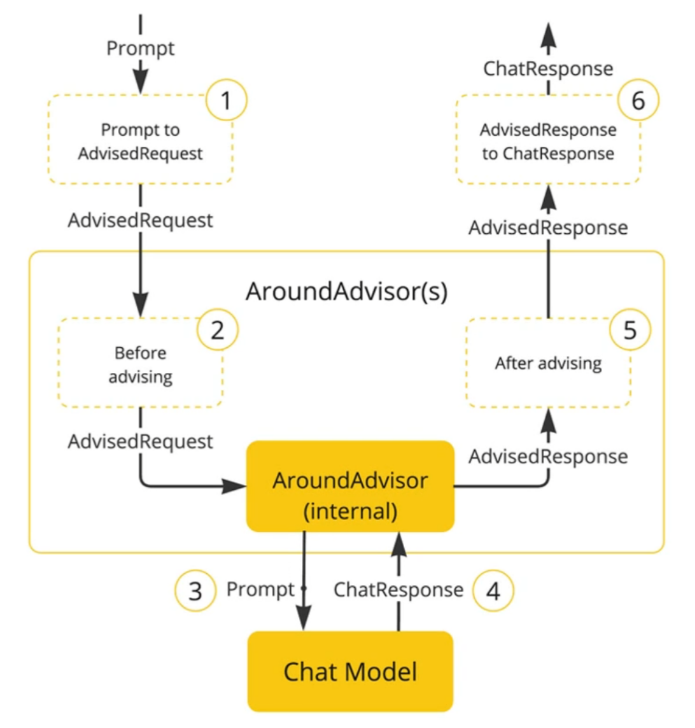
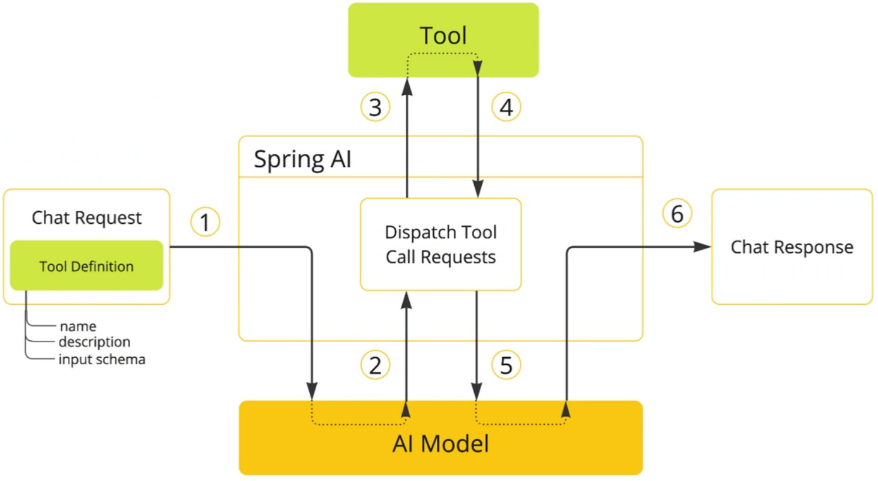

# 第01章_Spring AI快速入门

创建SpringBoot项目后，引入以下依赖：

```xml
<dependencyManagement>
    <dependencies>
        <dependency>
            <groupId>org.springframework.ai</groupId>
            <artifactId>spring-ai-bom</artifactId>
            <version>1.0.0</version>
            <type>pom</type>
            <scope>import</scope>
        </dependency>
    </dependencies>
</dependencyManagement>

<dependencies>
    <!-- openai-model -->
    <dependency>
        <groupId>org.springframework.ai</groupId>
        <artifactId>spring-ai-starter-model-openai</artifactId>
    </dependency>
    <!-- web -->
    <dependency>
        <groupId>org.springframework.boot</groupId>
        <artifactId>spring-boot-starter-web</artifactId>
    </dependency>
    <!-- test -->
    <dependency>
        <groupId>org.springframework.boot</groupId>
        <artifactId>spring-boot-starter-test</artifactId>
        <scope>test</scope>
    </dependency>
</dependencies>
```

配置文件：

```yaml
spring:
  ai:
    openai:
      base-url: https://dashscope.aliyuncs.com/compatible-mode
      api-key: 你的API-Key
      chat:
        options:
          model: qwen-plus
```

配置类：

```java
@Configuration
public class ChatClientConfig {
    @Bean
    public ChatClient chatClient(OpenAiChatModel model) {
        return ChatClient.builder(model)
                .defaultSystem("你是小吴的助手小艾同学")  // 设定system提示词
                .build();
    }
}
```

Controller：

```java
// 一次性返回响应结果
@RestController
public class ChatController {
    @Autowired
    private ChatClient chatClient;

    @GetMapping("/chat")
    public String chat(@RequestParam("message") String message) {
        return chatClient.prompt()
                .user(message)  // user提示词
                .call()  // 一次性返回响应结果
                .content();
    }
}
```

```java
// 流式返回响应结果
@RestController
public class ChatController {
    @Autowired
    private ChatClient chatClient;

    // produces属性用于解决乱码问题
    @GetMapping(value = "/chat", produces = "text/html;charset=utf-8")
    public Flux<String> chat(@RequestParam("message") String message) {
        return chatClient.prompt()
                .user(message)  // user提示词
                .stream()  // 流式返回响应结果
                .content();
    }
}
```


# 第02章_核心功能

## 1. Advisor

Spring AI利用AOP原理提供了AI会话时的拦截、增强等功能，也就是Advisor



常见的Advisor有：

- SimpleLoggerAdvisor：日志Advisor
- MessageChatMemoryAdvisor：会话记忆Advisor
- QuestionAnswerAdvisor

例如，通过以下方式就能配置日志：

```java
@Bean
public ChatClient chatClient(OpenAiChatModel model) {
    return ChatClient.builder(model)
            .defaultSystem("你是小吴的助手小艾同学")
            .defaultAdvisors(new SimpleLoggerAdvisor())  // 配置日志Advisor
            .build();
}
```

说明：还需将日志级别调整到debug级别

```yaml
logging:
  level:
    org.springframework.ai.chat.client.advisor: debug
```

## 2. 会话记忆

Spring AI提供了多种持久化会话记忆的方式，例如已经提供了jdbc数据源持久化的自动配置，所以我们以MySQL为例来实现会话记忆。

### 2.1 数据源配置

引入依赖：

```xml
<dependency>
    <groupId>org.springframework.ai</groupId>
    <artifactId>spring-ai-starter-model-chat-memory-repository-jdbc</artifactId>
</dependency>
<dependency>
    <groupId>com.mysql</groupId>
    <artifactId>mysql-connector-j</artifactId>
</dependency>
```

我们将以下SQL文件放在resources目录下，命名为`schema-mysql.sql`（启动程序后就会自动执行该文件中的SQL语句来建表）：

```sql
CREATE TABLE IF NOT EXISTS SPRING_AI_CHAT_MEMORY(
    conversation_id VARCHAR(36) NOT NULL,
    content         TEXT        NOT NULL,
    type            VARCHAR(10) NOT NULL,
    `timestamp`     TIMESTAMP   NOT NULL,
    CONSTRAINT TYPE_CHECK CHECK (type IN ('USER', 'ASSISTANT', 'SYSTEM', 'TOOL'))
);
```

> 说明：根据Spring AI官方文档可知，表名必须是`SPRING_AI_CHAT_MEMORY`

添加配置：

```yaml
spring:
  datasource:
    driver-class-name: com.mysql.cj.jdbc.Driver
    url: jdbc:mysql://192.168.231.203:3306/ai_demo
    username: root
    password: abc666
  ai:
    chat:
      memory:
        repository:
          jdbc:
            initialize-schema: always
            schema: classpath:schema-mysql.sql
```

### 2.2 配置ChatMemoryRepository

引入上述的spring-ai-starter-model-chat-memory-repository-jdbc依赖后，就会自动配置一个JdbcChatMemoryRepository并注入IoC容器。

### 2.3 配置ChatMemory

> ChatMemory是用于实现会话记忆的标准接口

```java
@Configuration
public class ChatClientConfig {
    @Bean
    public ChatClient chatClient(OpenAiChatModel model, ChatMemory chatMemory) {
        return ChatClient.builder(model)
                .defaultSystem("你是小吴的助手小艾同学")
                .defaultAdvisors(
                        new SimpleLoggerAdvisor(),
                        MessageChatMemoryAdvisor.builder(chatMemory).build()  // 配置会话记忆Advisor
                )
                .build();
    }

    @Bean
    public ChatMemory chatMemory(JdbcChatMemoryRepository jdbcChatMemoryRepository) {
        return MessageWindowChatMemory.builder()
                .chatMemoryRepository(jdbcChatMemoryRepository)
                .maxMessages(20)
                .build();
    }
}
```

### 2.4 Controller传入会话ID

```java
@RestController
public class ChatController {
    @Autowired
    private ChatClient chatClient;

    @GetMapping(value = "/chat", produces = "text/html;charset=utf-8")
    public Flux<String> chat(
            @RequestParam("memoryId") String memoryId,
            @RequestParam("message") String message) {
        return chatClient.prompt()
                .user(message)
                .advisors(advisorSpec -> advisorSpec.param(ChatMemory.CONVERSATION_ID, memoryId)) // 传入会话ID
                .stream()
                .content();
    }
}
```

## 3. Tools



Tools工具：

```java
@Component
public class ReservationTool {
    @Autowired
    private ReservationMapper reservationMapper;

    /**
     * 工具方法：添加预约信息
     */
    @Tool(description = "预约志愿填报服务")
    public void addReservation(
            @ToolParam(description = "考生姓名") String name,
            @ToolParam(description = "考生性别") String gender,
            @ToolParam(description = "考生手机号") String phone,
            @ToolParam(description = "预约沟通时间，格式为：yyyy-MM-dd'T'HH:mm") String communicationTime,
            @ToolParam(description = "考生所在省份") String province,
            @ToolParam(description = "考生预估分数") Integer estimatedScore
    ) {
        Reservation reservation = new Reservation();
        reservation.setName(name);
        reservation.setGender(gender);
        reservation.setPhone(phone);
        reservation.setCommunicationTime(LocalDateTime.parse(communicationTime));
        reservation.setProvince(province);
        reservation.setEstimatedScore(estimatedScore);

        reservationMapper.insert(reservation);
    }

    /**
     * 工具方法：查询预约信息
     */
    @Tool(description = "根据条件查询考生预约信息")
    public Reservation queryReservation(
            @ToolParam(description = "预约信息查询条件") ReservationQuery query
    ) {
        if (query == null || (StringUtils.isBlank(query.getName()) && StringUtils.isBlank(query.getPhone()))) {
            return null;
        }
        LambdaQueryWrapper<Reservation> wrapper = new LambdaQueryWrapper<>();
        if (StringUtils.isNotBlank(query.getName())) {
            wrapper.eq(Reservation::getName, query.getName());
        }
        if (StringUtils.isNotBlank(query.getPhone())) {
            wrapper.eq(Reservation::getPhone, query.getPhone());
        }
        return reservationMapper.selectOne(wrapper);
    }
}
```

```java
@Data
public class ReservationQuery {
    @ToolParam(required = false, description = "考生姓名")
    private String name;
    @ToolParam(required = false, description = "考生手机号")
    private String phone;
}
```

配置Tools工具：

```java
@Bean
public ChatClient chatClient(OpenAiChatModel model, ChatMemory chatMemory, ReservationTool reservationTool) {
    return ChatClient.builder(model)
            .defaultSystem("你是小吴的助手小艾同学")
            .defaultAdvisors(
                    new SimpleLoggerAdvisor(),
                    MessageChatMemoryAdvisor.builder(chatMemory).build()
            )
            .defaultTools(reservationTool)  // 配置Tools
            .build();
}
```

## 4. RAG

### 4.1 搭建知识库

> 我们选用RediSearch作为向量数据库

#### 1、引入依赖

```xml
<!-- SpringAI与Redis向量数据库的整合 -->
<dependency>
    <groupId>org.springframework.ai</groupId>
    <artifactId>spring-ai-starter-vector-store-redis</artifactId>
</dependency>
<!-- pdf文档阅读器 -->
<dependency>
    <groupId>org.springframework.ai</groupId>
    <artifactId>spring-ai-pdf-document-reader</artifactId>
</dependency>
```

#### 2、配置文件

**配置向量模型**（配置完成后，就会在IoC容器中注入OpenAiEmbeddingModel）：

```yaml
spring:
  ai:
    openai:
      base-url: https://dashscope.aliyuncs.com/compatible-mode
      api-key: 你的API-Key
      embedding:
        options:
          model: text-embedding-v3
```

**配置向量数据库**（配置完成后，就会在IoC容器中注入RedisVectorStore，这个类实现了VectorStore接口）：

```yaml
spring:
  data:
    redis:
      host: 192.168.231.203
      port: 6380
  ai:
    vectorstore:
      redis:
        index-name: spring_ai_index  # 向量库索引名
        initialize-schema: true      # 是否初始化向量库索引结构
        prefix: "document:"          # 向量库key前缀
```

#### 3、完成知识库的搭建

我们首先在类路径的content目录下添加一些pdf文件，作为我们的知识数据文档。

然后定义一个临时的配置类用于在SpringBoot初始化时存储数据到知识库：

```java
@Configuration
public class TempConfig {
    @Autowired
    private VectorStore vectorStore;

    @PostConstruct
    public void buildKnowledgeBase() {
        // 1. 创建PagePdfDocumentReader（按页进行文档分割）
        PagePdfDocumentReader reader = new PagePdfDocumentReader("classpath:/content/abc.pdf",
                PdfDocumentReaderConfig.builder()
                        .withPageExtractedTextFormatter(ExtractedTextFormatter.defaults())
                        .withPagesPerDocument(1)  // 每1页作为一个Document
                        .build()
        );
        // 2. 读取pdf文件为Document
        List<Document> documents = reader.read();
        // 3. 将文档写入向量数据库
        vectorStore.add(documents);
    }
}
```

启动程序后我们就会发现，RediSearch知识库已经搭建完成。注意，知识库搭建完成后需要把TempConfig这个临时配置类注释掉，否则每次启动程序都会重新搭建一次知识库。

### 4.2 检索知识库

引入依赖：

```xml
<dependency>
    <groupId>org.springframework.ai</groupId>
    <artifactId>spring-ai-advisors-vector-store</artifactId>
</dependency>
```

配置QuestionAnswerAdvisor：

```java
@Bean
public ChatClient chatClient(
        OpenAiChatModel model,
        ChatMemory chatMemory,
        ReservationTool reservationTool,
        VectorStore vectorStore
) {
    return ChatClient.builder(model)
            .defaultSystem("你是小吴的助手小艾同学")
            .defaultAdvisors(
                    new SimpleLoggerAdvisor(),
                    MessageChatMemoryAdvisor.builder(chatMemory).build(),
                    QuestionAnswerAdvisor.builder(vectorStore)
                            .searchRequest(
                                    SearchRequest.builder()
                                            .similarityThreshold(0.5d)  // 设置最小的余弦相似度（只有高于此值的片段才会被检索出来）
                                            .topK(3)  // 设置检索出来的最大片段数量
                                            .build()
                            )
                            .build()
            )
            .defaultTools(reservationTool) 
            .build();
}
```

## 5. 多模态

我们新建一个工程，引入依赖：

```xml
<dependencyManagement>
    <dependencies>
        <dependency>
            <groupId>org.springframework.ai</groupId>
            <artifactId>spring-ai-bom</artifactId>
            <version>1.0.0</version>
            <type>pom</type>
            <scope>import</scope>
        </dependency>
    </dependencies>
</dependencyManagement>

<dependencies>
    <dependency>
        <groupId>org.springframework.ai</groupId>
        <artifactId>spring-ai-starter-model-openai</artifactId>
    </dependency>
    <dependency>
        <groupId>org.springframework.boot</groupId>
        <artifactId>spring-boot-starter</artifactId>
    </dependency>
    <dependency>
        <groupId>org.springframework.boot</groupId>
        <artifactId>spring-boot-starter-test</artifactId>
        <scope>test</scope>
    </dependency>
</dependencies>
```

配置文件：

```yaml
spring:
  ai:
    openai:
      base-url: https://dashscope.aliyuncs.com/compatible-mode
      api-key: 你的API-Key
      chat:
        options:
          model: qwen-vl-max
```

配置类：

```java
@Configuration
public class ChatClientConfig {
    @Bean
    public ChatClient chatClient(OpenAiChatModel model) {
        return ChatClient.builder(model).build();
    }
}
```

测试：

```java
@SpringBootTest
public class AiDemoApplicationTests {
    @Autowired
    private ChatClient chatClient;

    @Test
    public void test() {
        // 1. 创建媒体对象
        Media media = new Media(
                MimeType.valueOf("image/png"),
                new FileSystemResource("E:/abc.png")
        );
        // 2. 发送多模态对话
        String result = chatClient.prompt()
                .user(promptUserSpec -> promptUserSpec.text("描述下这张图片中的内容").media(media))
                .call()
                .content();
        System.out.println(result);
    }
}
```

