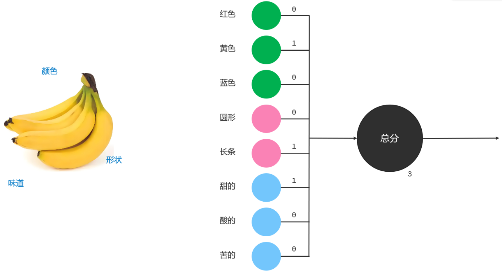
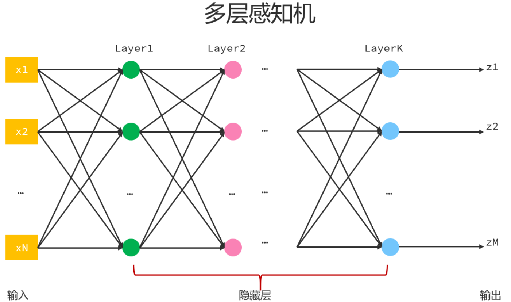
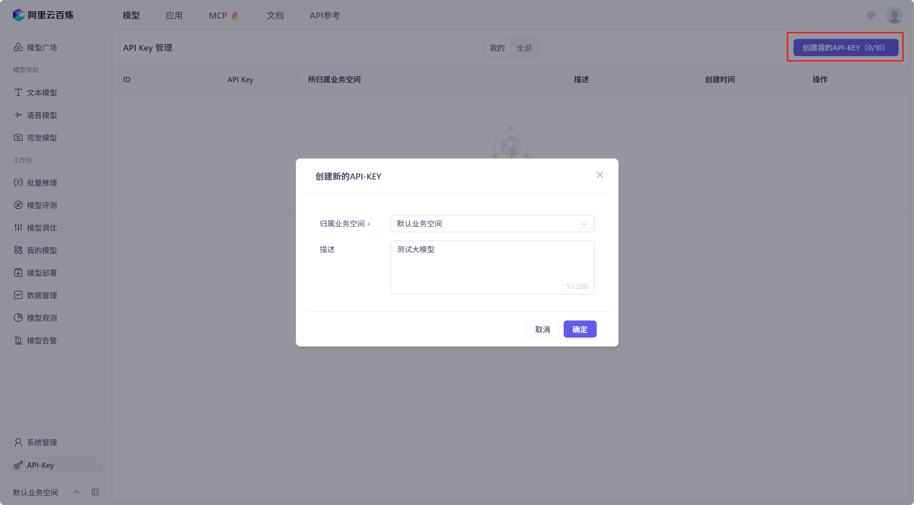
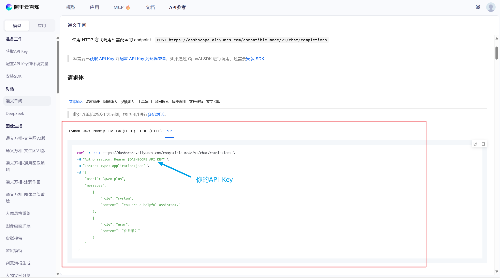
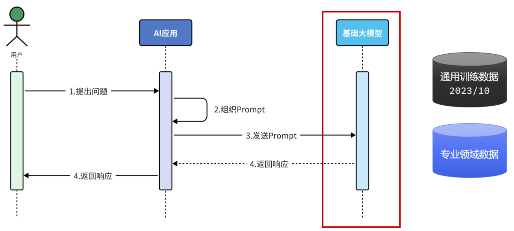
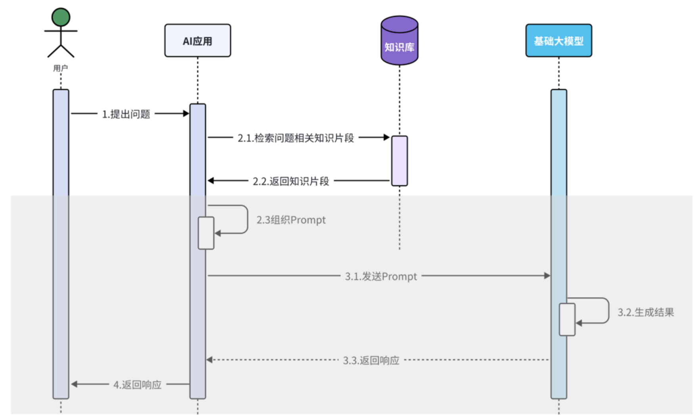
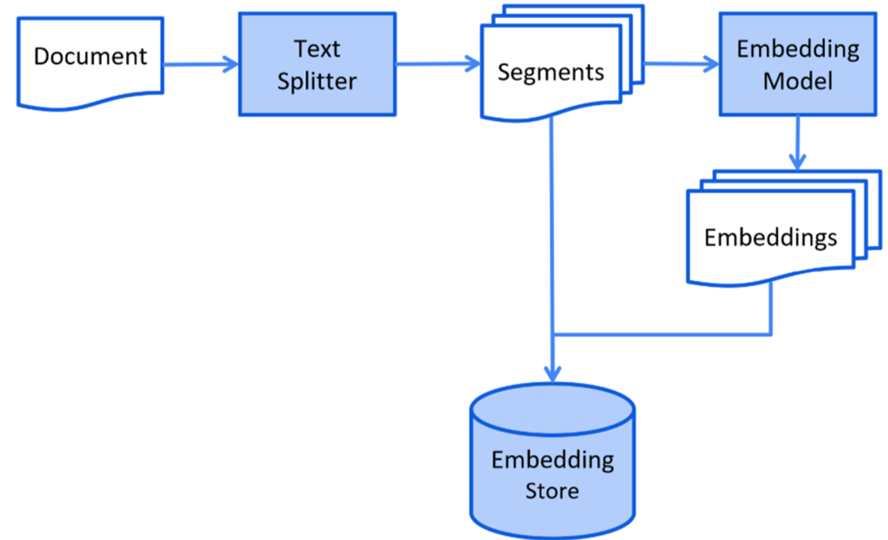
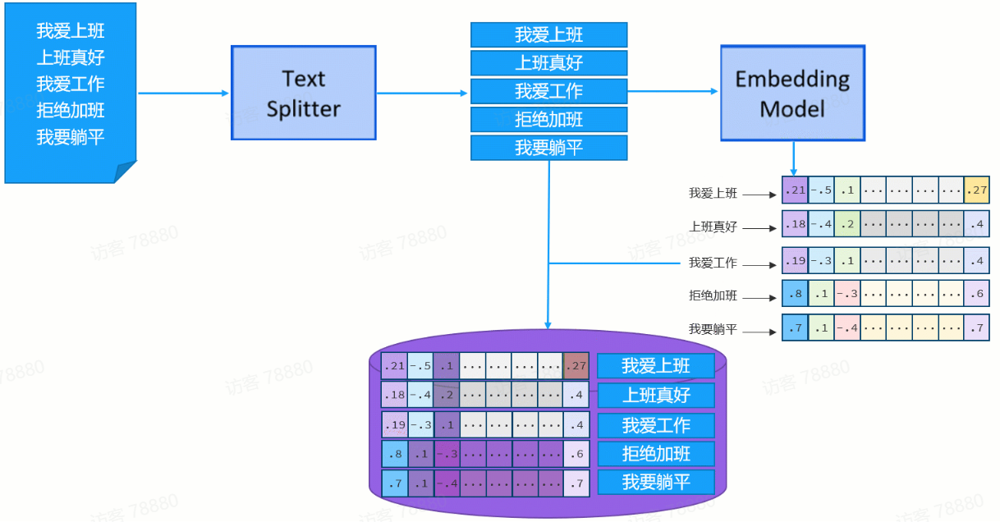
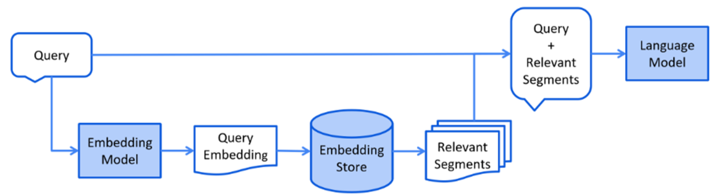
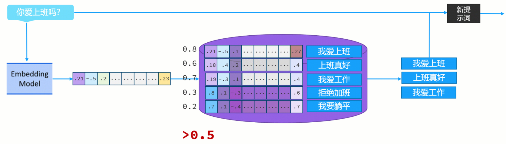

# 第01章_AI简介

## 1. AI发展史

AI，全名叫Artificial Intelligence，翻译过来就是人工智能，它的本意是让机器能够像人类一样思考、学习和解决问题。

人工智能最早可以追溯到1950年的图灵测试，图灵测试中有两种角色：被测试者和测试者，其中被测试者又分为机器和真人。测试者和被测试者通过文本进行沟通，在真实测试中，被测试者和测试者分别处在不同的房间中，这样测试者无法事先知道被测试者是人还是机器。在沟通的过程中，测试者需要根据接收到的文本信息，判断发送该文本信息的是机器还是人。假设机器给测试者发送了一段文本，但测试者判断的答案是人，这就说明测试者无法分辨清楚机器与人。这个时候，我们就可以说机器具有了人的智能。

人工智能的发展历程主要经过了三个阶段：符号主义、连接主义、神经网络。

### 1.1 符号主义

符号主义实现人工智能，主要分为三个步骤：

1. 首先**将现实抽象为符号**，比如把"天晴"记为A，"打篮球"记为B，"打游戏"记为C
2. 其次是**设置规则**，比如设置规则为"如果A，则执行B，否则执行C"
3. 最后**按照规则执行**

符号主义就相当于一个if-else语句。很明显，符号主义的一个致命缺点就是事实上我们很难把现实世界中的万事万物都抽象成具体的符号。

### 1.2 连接主义

我们可以通过模拟人脑的方式实现人工智能，于是罗森布拉特提出了著名的**感知机模型**，用于模拟神经元。在感知机模型中，输入类比神经元的树突、权重类比神经元的连接强度、激活函数类比神经元的突触。假设输入和激活函数都不变的情况下，我们可以通过调整权重值，得到不同的输出。这就是连接主义。

例如想设计一个感知机用于识别水果，我们就可以把水果的颜色、形状、味道等特征提取出来，作为感知机的输入；同时我们可以根据需求，给不同的特征取值设置不同的权重，例如我们要识别香蕉，此时可以给黄色、长条、甜的这三个特征设置权重为1，其它特征设置权重为0。结合输入和对应的权重以及激活函数，我们可以计算出一个分数，假设我们设定阈值为3，如果计算的总分达到3，我们就认为输入特征对应的水果就是香蕉，否则不是香蕉。



### 1.3 神经网络

上述的感知机模型只能做一些简单的是或不是的二分类任务，对于复杂的任务它就束手无策了。所以人们又发明了多层感知机模型，它就是由多个感知机叠加而来，每一层感知机都可以对输入的信息做整合处理并输出，输出的结果又作为下一层感知机的输入，这样层层传递得到最终的输出。

理论上，只要多层感知机模型足够宽足够深，就能够解决足够复杂的任务，这正是神经网络的由来。现在我们所接触的AI，也都是在这个基础上发展而来的。



## 2. 大模型

每个感知机会结合用户的输入、权重、激活函数，与阈值进行比较，得到最终的输出。其中，阈值更专业的名称叫做**偏置**。每个神经元上使用的权重和偏置，我们称之为**参数**。因此，每个神经元上的`参数数量=权重数量+1`，这里的1就是偏置。

整个神经网络中的参数特别特别多，所以我们无法去手动设置这么多的参数。因此我们会通过一个软件去实现神经网络，我们事先准备好一些数据交给这个软件，让它根据我们提供的数据进行学习并自主地设置好神经网络中需要的成千上万的参数。在AI领域，我们将这个实现了神经网络的软件称为**模型**。

OpenAI公司有一个出名的模型叫做GPT，研发人员通过将参数规模从10B提高到100B（1B就是10亿），从而使得GPT模型展现出了通用任务的处理能力。现在，我们通常会把参数规模在1000亿以上的模型，称为**大模型**。

随着GPT模型的爆火，全球各大公司也纷纷跟进，推出了自己的大模型，比如智普AI的ChatGLM，阿里的Qwen，百度的Ernie，Anthropic公司的Cloude，元宇宙的Llma，马斯克的Grok等。不同公司的不同模型，也有不同的擅长领域，比如文本生成、图片生成、视频生成、音频合成、音频理解、视频理解、图片处理、语音识别等等。

## 3. AI市场分布

目前AI主要分为三个赛道：基础算力、核心算法、智能应用。

### 3.1 基础算力

基础算力，就是为大模型提供计算能力。通常都是英伟达、微软、阿里等超大公司参与这个赛道，它们通过芯片、云计算等来为大模型提供更强的算力。

### 3.2 核心算法

这个赛道主要研究开发大模型所需要的算法以及算法框架，比如transformer、pytoch、Tensorflow等等，其中比较知名的公司有OpenAI、深度求索、Meta、Google等等。

### 3.3 智能应用

参与这个赛道的人是最多的，通过借助大模型的能力来将各行各业的软件进行智能化的升级和改造，比如零售、旅游、金融等等。

大模型本质上是一个实现了一些数学模型的软件，对于普通人而言是无法直接使用的。如果我们要对传统的软件做智能化升级改造，我们就需要将大模型接入到传统的软件中，借助于大模型的能力，让软件的功能变得更强大更智能，这就是所谓的智能应用（它也有另外一种主流的叫法：Agent）。


# 第02章_大模型的基本使用

## 1. 大模型部署

### 1.1 本地部署大模型

我们可以本地部署大模型并使用，Ollama工具为我们提供了一键下载并运行大模型的功能，所以我们使用Ollama来本地部署大模型。

（1）前往官网 https://ollama.com/ 下载安装Ollama

（2）从官网 https://ollama.com/search 选择一个想要的大模型（我们以qwen3为例），进入详情页后根据需求选择参数规模，然后在cmd中执行对应命令，就可以运行大模型了：

```cmd
ollama run qwen3:0.6b
```

（3）接着就可以跟本地部署的大模型进行对话，如果想退出聊天则输入`/bye`即可

（4）Ollama平台也开放了API，支持以发送HTTP请求的方式来调用本地部署的大模型。本机Ollama默认占用的端口号为11434，发送请求的url为`http://localhost:11434/api/chat`，请求方式必须为POST，请求体必须是JSON格式，样例如下：

```json
{
    "model": "qwen3:0.6b",
    "messages": [
        {
            "role": "user",
            "content": "你是谁？"
        }
    ]
}
```

### 1.2 使用云平台大模型

我们也可以直接使用云平台大模型，以阿里云百炼平台为例，需要做如下步骤：

（1）登录阿里云官网 https://aliyun.com

（2）开通大模型服务平台百炼服务


（3）点击`免费体验->模型广场->API-Key`，然后创建API-Key



（4）在模型广场中选择自己想要的大模型，点击API参考，查看使用方法。我们以通义千问-Plus为例，发送POST请求即可进行调用



## 2. 大模型调用

大模型调用时，不同平台的请求数据基本都类似，以下我们将介绍几个核心的数据。

### 2.1 请求数据

下面是一份请求数据的示例：

```json
{
    "model": "qwen-plus",
    "messages": [
        {
            "role": "system",
            "content": "你是小吴的助手小艾同学，请在每次回答时都先说一句'你好，我是小艾！'"
        },
        {
            "role": "user", 
            "content": "西北大学是211吗？"  # 第一个问题
        },
        {
            "role": "assistant",
            "content": "你好，我是小艾！  \n西北大学是211工程高校。它位于中国陕西省西安市，是一所历史悠久、学科门类齐全的综合性大学。其在文、史、哲、经、管等多个领域具有较强的学科优势。  \n\n如果您有其他问题，欢迎继续提问！"  # 第一个问题的回复
        },
        {
            "role": "user", 
            "content": "是985吗？"  # 第二个问题
        }
    ],
    "stream": true, 
    "enable_search": true
}
```

#### model

必选参数，`string`，用于指定大模型的名称。

#### messages

必选参数，`array`，发送给大模型的消息。其中content是消息内容，role是消息类型，主要有以下三种：

- user：用户发送给模型的消息（必选）。
- system：模型的目标或角色（可选，如果设置system消息则必须将其放在messages列表的第一位）。用于给大模型设定一个角色，然后大模型就可以用该角色的口吻跟用户对话了。
- assistant：模型对用户消息的回复（可选）。大模型是没有记忆能力的（用户与大模型的每次对话都是独立的），所以如果希望大模型能根据以往的聊天信息而进行推断，就需要将之前用户的问题和大模型的回复也一并发送给大模型。

#### stream

可选参数，`boolean`，默认为false

- true：流式调用，即大模型每生成一部分内容就立即输出一个片段
- false：阻塞式调用，即大模型生成完所有内容后一次性返回结果

#### enable_search

可选参数，`boolean`，默认为false。模型在生成文本时是否使用互联网搜索结果进行参考。

> 说明：由于大模型训练完毕后，它的知识库就不再更新了，比如大模型是2023年10月训练完毕的，那么2023年10月以后新产生的数据，大模型就无法感知了。如果要让大模型可以根据最新的数据回答问题，其中有一种解决方案就是开启联网搜索，大模型就可以根据联网搜索的结果生成最终的答案。

### 2.2 响应数据

下面是一份响应数据的示例：

```json
{
    "choices": [
        {
            "message": {
                "role": "assistant",
                "content": "你好，我是小艾！  \n西北大学不是985工程高校。它虽然是211工程高校，但并未列入国家“985工程”建设行列。不过，作为一所历史悠久、学科实力雄厚的综合性大学，西北大学在人文社科等领域具有很高的声誉和影响力。\n\n如果你还有其他问题，欢迎继续提问哦！"
            },
            "finish_reason": "stop",
            "index": 0,
            "logprobs": null
        }
    ],
    "object": "chat.completion",
    "usage": {
        "prompt_tokens": 128,
        "completion_tokens": 72,
        "total_tokens": 200,
        "prompt_tokens_details": {
            "cached_tokens": 0
        }
    },
    "created": 1751717507,
    "system_fingerprint": null,
    "model": "qwen-plus",
    "id": "chatcmpl-5c2783df-152f-9154-8893-32e448295dcf"
}
```

比较重要的参数有：

- `choices`：模型生成的内容数组，可以包含一条或多条内容
  1. `message`：本次调用模型输出的消息
  2. `finish_reason`：自然结束(stop)，生成内容过长(length)
  3. `index`：当前内容在choices数组中的索引
- `usage`：本次对话过程中使用的token统计
  1. `prompt_tokens`：用户的输入转换成token的个数
  2. `completion_tokens`：模型生成的回复转换成token的个数
  3. `total_tokens`：用户输入和模型生成的总token个数
- `created`：本次会话被创建时的时间戳
- `model`：本次会话使用的模型名称
- `id`：本次调用的唯一标识符

> 说明：在大语言模型中，**token**是大模型处理文本的基本单位，可以理解为模型"看得懂"的最小文本片段，用户输入的内容都需要通过分词器转换成token，才能让大模型更好的处理。不同的分词器将同一文本转化成token的个数不完全一致，但对于目前大部分分词器而言，4个英文字符约等于1个token，1个中文字符约等于1~2个token。


# 第03章_LangChain4j

## 1. 快速入门

目前市面上使用Java调用大模型的工具库主流有两种：LangChain4j和Spring AI。其中，LangChain4j的官方文档为 https://docs.langchain4j.dev/

创建一个Maven工程后，引入以下依赖：

```xml
<dependency>
    <groupId>dev.langchain4j</groupId>
    <artifactId>langchain4j-open-ai</artifactId>
    <version>1.0.1</version>
</dependency>
```

构建聊天对象OpenAiChatModel并与大模型进行交互：

```java
public class Main {
    private static final String API_KEY = "你的API-Key";

    // 1. 构建聊天对象OpenAiChatModel
    private static OpenAiChatModel model = OpenAiChatModel.builder()
            .baseUrl("https://dashscope.aliyuncs.com/compatible-mode/v1")  // url参考百炼平台API文档
            .apiKey(API_KEY)
            .modelName("qwen-plus")  // 模型名称
            .build();

    public static void main(String[] args) {
        // 2. 调用chat()方法与大模型进行交互
        String response = model.chat("你是谁？");
        System.out.println(response);
    }
}
```

## 2. SpringBoot整合LangChain4j

### 2.1 基本使用

（1）创建SpringBoot项目后，引入以下依赖：

```xml
<dependency>
    <groupId>dev.langchain4j</groupId>
    <artifactId>langchain4j-open-ai-spring-boot-starter</artifactId>
    <version>1.0.1-beta6</version>
</dependency>
```

（2）配置文件：

```yaml
langchain4j:
  open-ai:
    chat-model:
      base-url: https://dashscope.aliyuncs.com/compatible-mode/v1
      api-key: 你的API-Key
      model-name: qwen-plus
      log-requests: true   # 打印请求日志
      log-responses: true  # 打印响应日志
```

（3）自动注入OpenAiChatModel后调用大模型：

```java
@RestController
public class ChatController {
    @Autowired
    private OpenAiChatModel model;

    @GetMapping("/chat")
    public String chat(@RequestParam("message") String message) {
        return model.chat(message);
    }
}
```

### 2.2 AiServices工具类

我们之前通过OpenAiChatModel的chat()方法来调用大模型，但这种方式难以完成一些高阶功能，如会话记忆、RAG知识库、Tools工具等。所以LangChain4j为我们提供了AiServices工具类，封装了许多功能操作，帮助我们便捷地调用大模型。

（1）除了langchain4j-open-ai-spring-boot-starter依赖外，我们还需引入以下依赖：

```xml
<dependency>
    <groupId>dev.langchain4j</groupId>
    <artifactId>langchain4j-spring-boot-starter</artifactId>
    <version>1.0.1-beta6</version>
</dependency>
```

（2）配置文件与之前相同

（3）自定义服务接口

```java
public interface ChatService {
    String chat(String message);
}
```

（4）使用AiServices工具类创建服务接口的动态代理对象

```java
@Configuration
public class CommonConfig {
    @Autowired
    private OpenAiChatModel model;

    @Bean
    public ChatService chatService() {
        return AiServices.builder(ChatService.class).chatModel(model).build();
    }
}
```

（5）Controller中可以直接调用服务接口的方法

```java
@RestController
public class ChatController {
    @Autowired
    private ChatService chatService;

    @GetMapping("/chat")
    public String chat(@RequestParam("message") String message) {
        return chatService.chat(message);
    }
}
```

### 2.3 AiService声明式使用

为了简化AiServices工具类的使用，LangChain4j提供了声明式使用方法，想为哪个service接口创建代理对象，只需要在该接口上添加@AiService注解并指定要使用的模型，将来LangChain4j扫描到该注解后会自动创建该接口的代理对象并注入到IoC容器中。

由此，我们只需编写如下的service接口，而无需再编写上述CommonConfig配置类。

```java
@AiService(
        wiringMode = AiServiceWiringMode.EXPLICIT,
        chatModel = "openAiChatModel"
)
public interface ChatService {
    String chat(String message);
}
```

> 说明：
>
> - wiringMode默认为AUTOMATIC（自动装配），也就是会自动去装配IoC容器中已有的模型，例如框架自带的`openAiChatModel`，所以事实上上述`@AiService`的这两个属性都可以无需指定。
> - 我们上面将wiringMode设置为EXPLICIT（手动装配），这时候我们就必须手动指定要装配的模型，chatModel就用于指定对话时需要使用的模型对象在IoC容器中的名称。

## 3. 流式调用

我们之前代码演示的都是阻塞式调用，如果想进行流式调用，则需要使用webflux框架。

（1）引入依赖：

```xml
<dependency>
    <groupId>org.springframework.boot</groupId>
    <artifactId>spring-boot-starter-webflux</artifactId>
</dependency>
<dependency>
    <groupId>dev.langchain4j</groupId>
    <artifactId>langchain4j-open-ai-spring-boot-starter</artifactId>
    <version>1.0.1-beta6</version>
</dependency>
<dependency>
    <groupId>dev.langchain4j</groupId>
    <artifactId>langchain4j-spring-boot-starter</artifactId>
    <version>1.0.1-beta6</version>
</dependency>
<dependency>
    <groupId>dev.langchain4j</groupId>
    <artifactId>langchain4j-reactor</artifactId>
    <version>1.0.1-beta6</version>
</dependency>
```

（2）配置文件（需要配置流式模型streamingChatModel）：

```yaml
langchain4j:
  open-ai:
    streaming-chat-model:
      base-url: https://dashscope.aliyuncs.com/compatible-mode/v1
      api-key: 你的API-Key
      model-name: qwen-plus
      log-requests: true   # 打印请求日志
      log-responses: true  # 打印响应日志
```

（3）Service接口（通过`@AiService`注解的streamingChatModel指定流式模型）：

```java
@AiService(
        wiringMode = AiServiceWiringMode.EXPLICIT,
        streamingChatModel = "openAiStreamingChatModel"
)
public interface ChatService {
    Flux<String> chat(String message);
}
```

（4）Controller

```java
@RestController
public class ChatController {
    @Autowired
    private ChatService chatService;

    // produces属性用于解决乱码问题
    @GetMapping(value = "/chat", produces = "text/html;charset=utf-8")
    public Flux<String> chat(@RequestParam("message") String message) {
        return chatService.chat(message);
    }
}
```

> 说明：我们可以将资料目录下的index.html放在项目类路径的static目录下，后续我们将基于这一前端页面做案例演示。

## 4. 消息注解

我们之前提到，在发送HTTP请求时，可以通过设置system类型的消息，来给大模型设定一个角色。而在代码中，我们可以使用LangChain4j为我们提供的消息注解`@SystemMessage`来设置system类型的消息。

**方式一**：在value属性中直接指定系统消息内容

```java
@AiService(
        wiringMode = AiServiceWiringMode.EXPLICIT,
        streamingChatModel = "openAiStreamingChatModel"
)
public interface ChatService {
    @SystemMessage("你是小吴的助手小艾同学，请在每次回答时都先说一句'你好，我是小艾！'")
    Flux<String> chat(String message);
}
```

**方式二**：如果系统消息内容很多，则可以通过fromResource属性指定一个外部文件

```java
@AiService(
        wiringMode = AiServiceWiringMode.EXPLICIT,
        streamingChatModel = "openAiStreamingChatModel"
)
public interface ChatService {
    @SystemMessage(fromResource = "system.txt")
    Flux<String> chat(String message);
}
```

> 说明：我们可以将资料目录下的system.txt文件放在项目的类路径下。

## 5. 会话记忆

### 5.1 会话记忆原理

大模型是不具备记忆能力的，每次对话都是独立的。所以想实现会话记忆，就需要将之前聊天的所有内容和新的问题一起发送给大模型。

LangChain4j提供了一个接口ChatMemory，是用于实现会话记忆的标准接口：

```java
public interface ChatMemory {
    /**
     * 用于唯一标识本次会话的ID
     */
    Object id();

    /**
     * 向指定ID的会话中保存一条消息
     */
    void add(ChatMessage message);

    /**
     * 获取指定ID的会话中保存的所有消息
     */
    List<ChatMessage> messages();

    /**
     * 清空指定ID会话中的所有消息
     */
    void clear();
}
```

> 说明：必须使用唯一ID来标识每一次会话，因为用户点击新建会话时就应该使用新的会话记忆，而不是沿用旧的会话记忆。

**整体流程**：当用户发送问题时，LangChain4j会将该消息存储到指定ID的ChatMemory中，然后获取该ID保存的所有消息并发送给大模型；大模型生成文本后会将响应消息也存储到指定ID的ChatMemory中，然后响应用户。

我们可以使用ChatMemory的一个实现类MessageWindowChatMemory来实现会话记忆：

```java
public class MessageWindowChatMemory implements ChatMemory {
    private final Object id;
    private final ChatMemoryStore store;  // 存储消息的容器

    public Object id() {
        return this.id;
    }

    public void add(ChatMessage message) {
        List<ChatMessage> messages = this.messages();
        if (message instanceof SystemMessage) {
            Optional<SystemMessage> systemMessage = findSystemMessage(messages);
            if (systemMessage.isPresent()) {
                if (((SystemMessage)systemMessage.get()).equals(message)) {
                    return;
                }
                messages.remove(systemMessage.get());
            }
        }
        messages.add(message);
        ensureCapacity(messages, this.maxMessages);
        this.store.updateMessages(this.id, messages);
    }

    public List<ChatMessage> messages() {
        List<ChatMessage> messages = new LinkedList(this.store.getMessages(this.id));
        ensureCapacity(messages, this.maxMessages);
        return messages;
    }

    public void clear() {
        this.store.deleteMessages(this.id);
    }
    
    // ......
}
```

其中ChatMemoryStore才是真正存储消息的容器，所以我们需要实现ChatMemoryStore接口来将消息存储到持久化介质中（例如Redis）。

### 5.2 会话记忆的实现流程

#### 1、实现ChatMemoryStore存储消息

我们首先要在项目中进行Redis的相关配置，然后自定义类实现ChatMemoryStore接口：

```java
@Component
public class RedisChatMemoryStore implements ChatMemoryStore {
    @Autowired
    private StringRedisTemplate redisTemplate;

    /**
     * 向指定ID的会话中保存一条消息
     */
    @Override
    public void updateMessages(Object memoryId, List<ChatMessage> messages) {
        String json = ChatMessageSerializer.messagesToJson(messages);
        redisTemplate.opsForValue().set(memoryId.toString(), json, Duration.ofDays(1));
    }

    /**
     * 获取指定ID的会话中保存的所有消息
     */
    @Override
    public List<ChatMessage> getMessages(Object memoryId) {
        String json = redisTemplate.opsForValue().get(memoryId.toString());
        return ChatMessageDeserializer.messagesFromJson(json);
    }

    /**
     * 清空指定ID会话中的所有消息
     */
    @Override
    public void deleteMessages(Object memoryId) {
        redisTemplate.delete(memoryId.toString());
    }
}
```

#### 2、配置会话记忆对象ChatMemory

我们使用ChatMemory的一个实现类MessageWindowChatMemory，进行配置：

```java
@Configuration
public class CommonConfig {
    @Autowired
    private ChatMemoryStore redisChatMemoryStore;

    @Bean
    public ChatMemoryProvider chatMemoryProvider() {
        return new ChatMemoryProvider() {
            @Override
            public ChatMemory get(Object memoryId) {
                return MessageWindowChatMemory.builder()
                        .id(memoryId)
                        .maxMessages(100)  // 该会话最大可以存储的消息数量
                        .chatMemoryStore(redisChatMemoryStore)  // 配置ChatMemoryStore
                        .build();
            }
        };
    }
}
```

#### 3、service接口

```java
@AiService(
        wiringMode = AiServiceWiringMode.EXPLICIT,
        streamingChatModel = "openAiStreamingChatModel",
        chatMemoryProvider = "chatMemoryProvider"  // 配置会话记忆对象提供者
)
public interface ChatService {
    // 添加参数memoryId，并通过LangChain4j提供的注解区分ID和消息内容
    @SystemMessage(fromResource = "system.txt")
    Flux<String> chat(@MemoryId String memoryId, @UserMessage String message);
}
```

#### 4、controller

```java
@RestController
public class ChatController {
    @Autowired
    private ChatService chatService;

    // produces属性用于解决乱码问题
    @GetMapping(value = "/chat", produces = "text/html;charset=utf-8")
    public Flux<String> chat(
            @RequestParam("memoryId") String memoryId,
            @RequestParam("message") String message) {
        return chatService.chat(memoryId, message);
    }
}
```

> 说明：在我们提供的前端页面中，实际上已经传递了参数memoryId

## 6. RAG知识库

### 6.1 RAG简介

由于大模型训练完毕后，它的知识库就不再更新了，也就是说它无法感知今年最新的相关数据（例如今年各个高校的最新录取分数）。一个方案是开启联网搜索。但是对于一些专业领域的数据（例如公司内部某个方案的执行计划），那么对通用大模型而言，开启联网搜索也无法感知。因此，一种更好的策略就是RAG。

RAG全称为Retrieval Augmented Generation（**检索增强生成**），简单理解就是通过检索外部知识库的方式增强大模型的生成能力。

**普通大模型的整体流程**：



**通过RAG外挂知识库后的整体流程**：



我们需要关注的**核心问题**有两个：

1. 知识库应该怎么搭建
2. 如何从知识库中检索出用户问题相关的知识片段

而对于其他流程，LangChain4j都能帮助我们自动完成。

### 6.2 RAG基本原理

#### 存储数据

知识库通常会使用一种特殊的数据库（向量数据库）。目前市面上常见的向量数据库很多，比如Milvus、Chroma、Pinecone等。存储数据的**基本原理**如下：



首先我们需要把最新的数据或者专业的数据存储到文档中，接下来借助**文本分割器**把一个大的文档分割成一个一个小的文本片段，然后这些小的文本片段需要借助于**向量模型**转换成高维向量（向量模型是一种专门的大模型，擅长文本向量化），接下来把每个向量和其对应的文本片段一起存储到向量数据库中。

> RAG知识库中使用的向量，一般是几百到几千个维度



#### 检索与用户问题相关的数据片段

在向量数据库中，两个向量的接近程度采用**余弦相似度**来衡量，余弦相似度就是两个向量夹角的余弦值，所以余弦相似度越大（越接近1），两个向量就越接近。从向量数据库中检索与用户问题相关的数据片段的**基本原理**如下：



用户提交的消息同样会使用**向量模型**转换为高维向量，接下来拿着该向量和向量数据库中已经存在的向量进行比对，计算它们之间的余弦相似度，把满足要求的向量筛选出来（例如，余弦相似度大于0.5）得到其对应的文本片段，最后结合用户提交的消息和从向量数据库中检索到的文本片段，组织数据发送给大模型。




