# 第1章 操作系统概述

## 1. 操作系统

### 1.1 简介

操作系统（Operating System，简称 OS）是管理计算机硬件与软件资源的一个软件程序。操作系统的内核（Kernel）是操作系统的核心部分，它是连接应用程序和硬件的桥梁，决定着系统的性能和稳定性。

> 操作系统的存在屏蔽了硬件层的复杂性，它就像是硬件使用的负责人，统筹着各种相关事项。

### 1.2 操作系统的特征

（1）并发

并发性是指计算机系统中同时存在多个运行的程序，这些程序宏观上是同时运行的，但微观上是交替运行的，因此操作系统具有处理和调度多个程序并发执行的能力。单核CPU同一时刻只能执行一个程序，所以各个程序只能并发地执行；多核CPU同一时刻可以同时执行多个程序，所以多个程序可以并行地执行。

> 并行指的是多个程序在同一时刻同时运行

（2）共享

资源共享是指系统中的资源可供内存中多个并发执行的进程共同使用。

（3）虚拟

虚拟是指把一个物理上的实体变为若干逻辑上的对应物。操作系统的虚拟技术可归纳为时分复用技术(如CPU虚拟化)和空分复用技术(如内存虚拟化)。

（4）异步

异步是指在多道程序环境下，允许多个程序并发执行，但由于资源有限，进程的执行并不是一贯到底的，而是走走停停的，它以不可预知的速度向前推进，这就是进程的异步性。

### 1.3 操作系统的功能

- **进程和线程的管理**：进程的创建、撤销、阻塞、唤醒，进程间的通信等。
- **存储管理**：内存、外存的分配和管理。
- **文件管理**：文件的读、写、创建及删除等。
- **设备管理**：完成设备（输入输出设备和外部存储设备等）的请求或释放，以及设备启动等功能。
- **网络管理**：操作系统管理计算机网络的配置、连接、通信和安全等。
- **安全管理**：用户的身份认证、访问控制、文件加密等，以防止非法用户对系统资源的访问和操作。

### 1.4 操作系统的历史

1. 单用户系统：手动纸带传输进行程序输入，此阶段无操作系统
2. 批处理系统：磁带/磁盘传输进行程序输入，并由监督程序(操作系统的雏形)负责控制作业的输入/输出。优点是缓解了一定程度的人机速度矛盾；缺点是内存中仅能有一道程序运行，CPU有大量的时间是在空闲等待I/O完成，资源利用率依然很低。
3. 多道程序系统：多个程序驻留在内存中，操作系统正式诞生，用于支持多道程序并发执行，资源利用率大幅提升。缺点是用户响应时间较长，不提供人机交互能力。
4. 分时操作系统：计算机以时间片为单位轮流为各个作业服务。优点是用户请求可以被即时响应，用户可通过终端与计算机进行交互；缺点是不能优先处理一些紧急任务。
5. 分布式系统：系统中的各台计算机地位相同，任何工作都可以分布在这些计算机上，由它们并行、协同完成这个任务。
6. 个人计算机操作系统：如Windows、Linux等，方便个人使用。此外还有嵌入式操作系统、服务器操作系统、智能手机操作系统等。

## 2. 用户态和内核态

### 2.1 简介

根据进程访问资源的特点，我们可以把进程在系统上的运行分为两个级别：

- **用户态(User Mode)** : 用户态运行的进程可以直接读取用户程序的数据，**拥有较低的权限**。当应用程序需要执行某些需要特殊权限的操作，例如读写磁盘、网络通信等，就需要向操作系统发起系统调用请求，进入内核态。
- **内核态(Kernel Mode)**：内核态运行的进程几乎可以访问计算机的任何资源，包括系统的内存空间、设备、驱动程序等，不受限制，**拥有非常高的权限**。当操作系统接收到进程的系统调用请求时，就会从用户态切换到内核态，执行相应的系统调用，并将结果返回给进程，最后再从内核态切换回用户态。

> 注意：进入内核态需要**付出较高的开销**（需要进行一系列的上下文切换和权限检查等），所以应该尽量减少进入内核态的次数，以提高系统的性能。

### 2.2 为什么不能只有内核态

- 在 CPU 的所有指令中，**有一些指令是比较危险的**，比如内存分配、设置时钟、IO 处理等，如果所有的程序都能使用这些指令的话，会对系统的正常运行造成灾难性地影响。因此，我们需要限制这些危险指令只能在内核态运行，这些只能由操作系统内核态执行的指令也被叫做**特权指令**。
- 如果计算机系统中只有一个内核态，那么所有进程都会共享系统资源，例如内存、CPU、硬盘等，这将导致**系统资源的竞争和冲突**，从而影响系统性能和效率。

### 2.3 用户态和内核态的切换方式

用户态切换到内核态有 3 种方式：

1. **系统调用（Trap）**：用户态进程 **主动** 要求切换到内核态的一种方式，主要是为了使用内核态才能做的事情，比如读取磁盘资源。系统调用机制的核心还是依靠操作系统为用户特别开放的一个中断来实现（系统调用会执行一条Trap指令，执行后会触发一个中断，从而进入内核态）。
2. **中断（Interrupt）**：当外围设备完成用户请求的操作后，会向 CPU 发出相应的中断信号，这时 CPU 会暂停执行下一条即将要执行的指令，转而去执行与中断信号对应的处理程序，如果先前执行的指令是用户态下的程序，那么这个转换的过程自然也就发生了由用户态到内核态的切换。比如硬盘读写操作完成，系统会切换到硬盘读写的中断处理程序中执行后续操作等。
3. **异常（Exception）**：当 CPU 在执行运行在用户态下的程序时，发生了某些事先不可知的异常，这时会触发由当前运行进程切换到处理此异常的内核相关程序中，也就转到了内核态。比如缺页异常。

> 在系统的处理上，中断和异常类似，都是通过中断向量表来找到相应的处理程序进行处理。区别在于，中断来自处理器外部，不是由任何一条专门的指令造成，而异常是执行当前指令的结果。

## 3. 系统调用

### 3.1 简介

在我们运行的用户程序中，凡是与内核态级别的资源有关的操作（如文件管理、进程控制、内存管理等），都必须通过**系统调用**方式向操作系统提出服务请求，并由操作系统代为完成。

系统调用和普通库函数调用非常相似，只是系统调用由操作系统内核提供，执行系统调用后会从用户态进入内核态然后再执行后续指令，而普通的库函数调用由函数库或用户自己提供，运行于用户态。

**总结**：系统调用是应用程序与操作系统之间进行交互的一种方式，通过系统调用，应用程序可以访问操作系统底层资源例如文件、设备、网络等。

### 3.2 系统调用的过程

1. 用户态的程序发起系统调用，因为系统调用中涉及一些特权指令（只能由操作系统内核态执行的指令），用户态程序权限不足，因此会执行Trap指令触发中断。
2. 发生中断后，当前 CPU 执行的程序会中断，跳转到中断处理程序。于是内核程序开始执行，也就是开始处理系统调用。
3. 内核处理完成后，主动执行一条Trap返回指令，然后切换回用户态。


# 第2章 CPU虚拟化

## 1. 进程

### 1.1 简介

**进程（Process）** 是指计算机中正在运行的一个程序实例，也称为任务（Task）。

**注意**：程序是静态的，它是存放在磁盘里的可执行文件；而进程是动态的，它是程序的一次执行过程。同一个程序多次执行会对应多个进程。

进程的特点：

- 动态性
- 并发性
- 独立性：进程之间不会感知对方的存在
- 异步性

### 1.2 PCB

**PCB（Process Control Block）** 即进程控制块，是操作系统中用来管理和跟踪进程的数据结构，每个进程都对应着一个独立的 PCB。当操作系统创建一个新进程时，会为该进程分配一个唯一的进程 ID，并且为该进程创建一个对应的进程控制块。当进程执行时，PCB 中的信息会不断变化，操作系统会根据这些信息来管理和调度进程。

PCB 主要包含下面几部分的内容：

- 进程的描述信息，包括进程的名称、进程ID（PID）等；
- 进程的调度信息，包括进程阻塞原因、进程状态、进程优先级等；
- 进程占用的资源信息，包括内存空间、进程打开的文件信息等；
- 进程上下文，指CPU中各寄存器的值，用于进程切换。

### 1.3 进程状态

- **创建状态(new)**：进程正在被创建，尚未到就绪状态。
- **就绪状态(ready)**：进程已处于准备运行状态，即进程获得了除了处理器之外的一切所需资源，一旦被处理器调度即可运行。
- **运行状态(running)**：进程正在处理器上运行(单核 CPU 下任意时刻只有一个进程处于运行状态)。
- **阻塞状态(waiting)**：又称为等待状态或睡眠状态，进程正在等待某一事件而暂停运行如等待某资源为可用或等待 IO 操作完成。即使处理器空闲，阻塞状态的进程也不能运行。
- **结束状态(terminated)**：进程正在从系统中消失，可能是进程正常结束或其他原因中断退出运行。

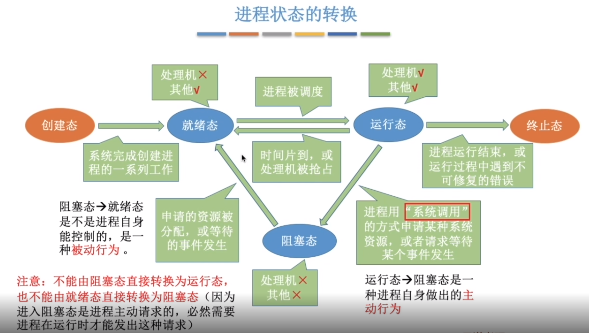

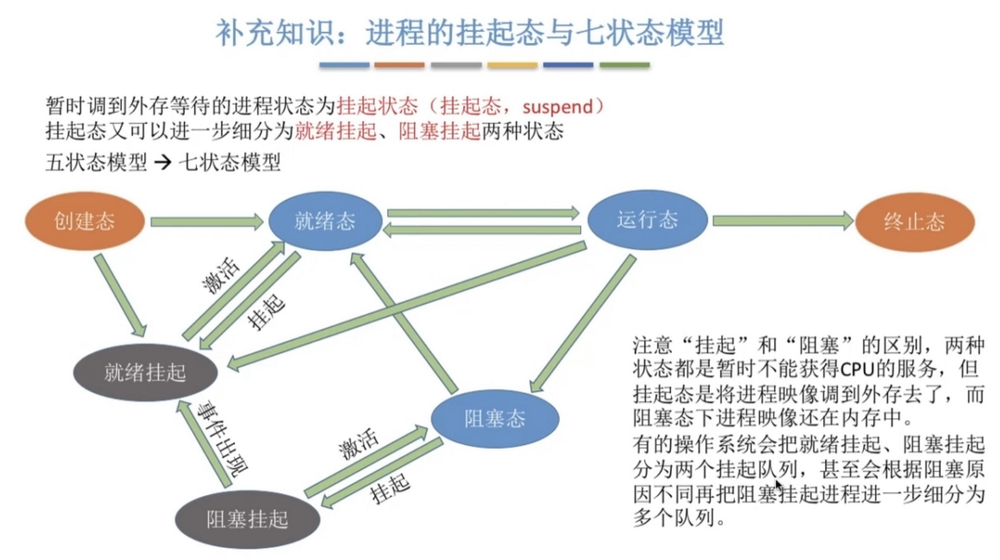

### 1.4 UNIX系统中的进程API

（1）`fork()`系统调用

用于创建子进程(一个完全相同的进程，复制父进程的地址空间，只有PID以及`fork()`的返回值不同)。子进程不会从main()函数开始执行，而是直接从`fork()`系统调用返回后继续执行。**父进程的`fork()`返回值是新创建子进程的PID，而子进程`fork()`返回值是0**

（2）`wait()`系统调用

父进程调用`wait(NULL)`进入阻塞状态，等待某个子进程结束，子进程结束时通过exit()向父进程返回一个值并唤醒父进程，将exit()返回值作为父进程中wait()的返回值。若没有子进程，则wait()立即返回-1。

（3）`exit()`系统调用

进程结束执行时会调用`exit()`来释放占用的系统资源，并将调用参数作为进程的结果（可以被父进程获取），注意该进程的PCB并没有被回收。然后检查父进程是否存活（若没有存活，则设置父进程为init进程），并进入结束状态，等待父进程回收PCB。

（4）`exec()`系统调用

`exec(name, argv)`会从可执行程序`name`中加载代码和静态数据，直接将当前运行的程序替换为这个可执行程序来运行。对`exec()`的成功调用永远不会返回。我们通常结合fork和exec来运行一个新程序：

```c
int pid = fork();
if (pid == 0) {
    // do something
    exec("program", argv);
}
```

### 1.5 僵尸进程和孤儿进程

**僵尸进程**：子进程已经终止，但是其父进程仍在运行，且父进程没有调用wait()或waitpid()等系统调用来获取子进程的状态信息，释放子进程占用的资源，导致子进程的 PCB 依然存在于系统中，但无法被进一步使用。这种情况下，子进程被称为`僵尸进程`。为了避免僵尸进程的产生，父进程需要及时调用wait()或waitpid()系统调用来回收子进程。

**孤儿进程**：一个进程的父进程已经终止或者不存在，但是该进程仍在运行，这种情况下该进程就是孤儿进程。孤儿进程通常是由于父进程意外终止导致的。为了避免孤儿进程终止后占用系统资源，操作系统会在孤儿进程调用`exit()`结束运行后，将孤儿进程的父进程设置为 init 进程（进程号为 1），由 init 进程来回收孤儿进程的资源。

## 2. 线程

**线程（Thread）** 也被称为轻量级进程，更加轻量，多个线程可以在同一个进程中同时执行，并且共享进程的资源比如内存空间、文件句柄、网络连接等。

**进程是操作系统资源分配的基本单位，而线程是处理器调度和执行的基本单位**。同一进程内的多个线程，会共享该进程的地址空间，并且共享本进程中的一些资源（初始化数据段、未初始化数据段、堆内存段等），但每个线程有自己独立的寄存器、程序计数器和栈（因此该进程的地址空间里会有多个栈，一般系统默认为每个线程分配8MB的栈空间）。

> **同一进程内的线程间进行上下文切换时开销很小**，因为地址空间保持不变，只需切换栈、寄存器、程序计数器等不共享的数据。多核计算机中，**各个线程可占用不同的CPU并行运行**，提升效率。

注意：在Linux系统中线程的本质仍然是进程，即它是用进程实现的（可以理解为这个进程中只包含一个线程）。

线程的其他特点：

- 每个线程都有一个线程ID、线程控制块(TCB)
- 线程也有就绪、阻塞和运行等状态
  
## 3. 进程间通信的方式

进程间通信(IPC, Inter Process Communication)是各进程之间通过数据交换进行交互的行为。各进程拥有的地址空间相互独立，一个进程不能直接访问另一个进程的地址空间，但是我们又需要进程之间进行数据交换，所以操作系统提供了进程间通信方法。

- **管道/匿名管道(Pipes)**：管道是一个**内存中的文件**，用于具有亲缘关系的父子进程间或者兄弟进程之间的通信。
- **有名管道(Named Pipes)** ：匿名管道由于没有名字，只能用于亲缘关系的进程间通信，为了克服这个缺点，提出了有名管道。有名管道严格遵循**先进先出(First In First Out)**，有名管道以**磁盘文件**的方式存在，可以实现本机任意两个进程通信。
- **信号(Signal)**：信号是一种比较复杂的通信方式，用于通知接收进程某个事件已经发生。
- **消息队列(Message Queuing)**：消息队列存放在内存中，并由消息队列标识符标识。管道和消息队列的通信数据都是先进先出的原则，但与管道不同的是消息队列**存放在内核中**，只有在操作系统重启或者显式地删除一个消息队列时，该消息队列才会被真正的删除。消息队列还可以实现消息的随机查询，也可以按消息的类型读取，比FIFO更有优势。**消息队列克服了信号承载信息量少，管道只能承载无格式字节流以及缓冲区大小受限等缺点**。
- **信号量(Semaphores)**：信号量是一个计数器，用于多进程对共享数据的访问，主要是进程间同步。
- **共享内存(Shared memory)**：使得多个进程可以访问同一块内存空间，不同进程可以及时看到对方进程中对共享内存中数据的更新。这种方式需要依靠某种同步操作，如互斥锁和信号量等。可以说这是**最有用的进程间通信方式**。
- **套接字(Sockets)** ：此方法主要用于在客户端和服务器之间通过网络进行通信。套接字是支持 TCP/IP 的网络通信的基本操作单元，可以看做是不同主机之间的进程进行双向通信的端点。

## 4. 处理机调度算法

处理机调度就是从就绪队列中按照一定算法挑选下一个占用CPU运行的进程。如果是非抢占式系统，一般在当前进程主动放弃CPU时进行调度；如果是抢占式系统，还会在中断请求被服务例程响应完成时进行调度。

> 注意：处理机调度和执行的基本单位实际上是**线程**，但早期我们往往将处理机调度称之为进程调度，因为在Linux系统中线程本质上也是个进程。所以，下面所说的进程调度，更严格地来说应该是线程调度。

调度算法的评价指标主要有：

- CPU利用率=CPU有效工作时间/(CPU有效工作时间+CPU空闲等待时间)
- 系统吞吐量：单位时间内CPU完成进程的数量
- 周转时间：指从进程到达系统到完成所经历的时间，即`进程完成时刻-进程到达时刻`
- 平均周转时间=各进程周转时间之和/进程数
- 等待时间：指进程处于就绪状态的时间之和
- 响应时间：指从进程到达系统到首次运行的时间

常见的进程调度算法有以下几种：

### 4.1 先来先服务算法

**先来先服务算法（FCFS，First Come First Served）**：从就绪队列中选择一个最先进入该队列的进程执行。该算法的优点是公平，缺点是短进程可能排在长进程之后、需要等待很长时间。

### 4.2 短作业优先算法

**短作业优先算法（SJF，Shortest Job First）**：从就绪队列中选出一个估计运行时间最短的进程执行。该算法的优点为它是平均周转时间最少的算法，缺点是会导致长进程饥饿（例如有源源不断的短进程到来）。

### 4.3 时间片轮转算法

**时间片轮转算法（RR，Round-Robin）**：按照各进程到达就绪队列的顺序，轮流让各个进程执行一个时间片(如100ms)，若进程未在一个时间片内执行完，则剥夺处理机，将进程重新放到就绪队列队尾。该算法使用得非常广泛，其优点是公平、响应快、不会导致饥饿，缺点是进程切换的开销很大，而且时间片的大小需要合理设计（时间片太大，则进程的响应时间就增大了；时间片太小，则频繁切换进程的开销就太大了）。

### 4.4 优先级算法

**优先级算法（Priority）**：为每个进程分配优先级，首先执行具有最高优先级的进程，依此类推。具有相同优先级的进程以FCFS方式执行。

### 4.5 多级反馈队列算法

**多级反馈队列算法（MLFQ，Multi-level Feedback Queue）**：该算法有很多优点，它对各类型进程相对公平(FCFS的优点)，每个新到达的进程都可以很快得到响应(RR的优点)，短进程只用较少的时间就可以完成(SJF的优点)。因此它是公认的较好的进程调度算法，UNIX操作系统采用的就是这种算法。

MLFQ的原理：设置多级就绪队列，各级队列优先级从高到低，时间片从小到大，并按以下规则进行调度：

- 如果A的优先级大于B的优先级，则运行A
- 如果A的优先级等于B的优先级，则按FCFS原则的顺序轮转运行A和B
- 新进程到达时，放在最高优先级(最上层第1级)队列
- 一旦进程用完了其在某一层中的时间片(无论中间主动放弃了多少次CPU)，就降低其优先级，移入低一级队列队尾；若此时已在最下级队列，则重新放回该队列队尾
- 注意MLFQ会将因I/O阻塞的进程重新放回原队列队尾，直到其一个时间片用完才会进入下一级队列
- 只有第k级队列为空时，才会为第k+1级队头的进程分配时间片
- 经过一段时间S，就将系统中所有进程重新加入最高优先级队列，从而防止饥饿。

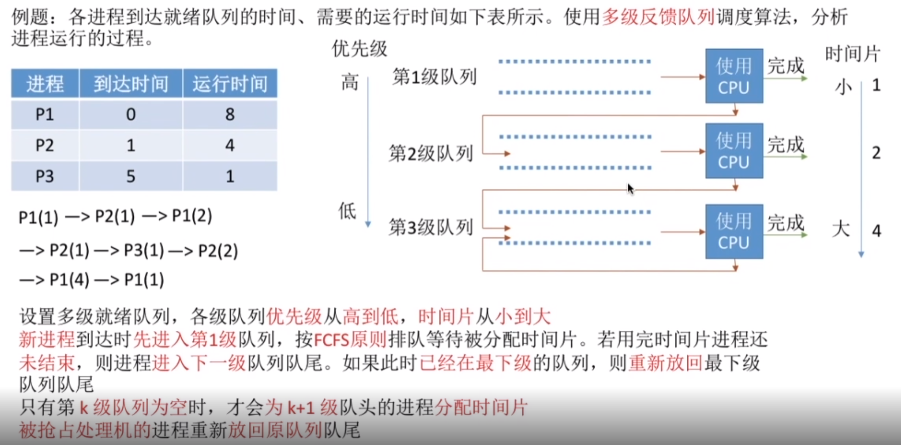


# 第3章 内存虚拟化

## 1. 简介

### 1.1 内存管理的功能

- **内存的分配与回收**
- **地址转换**：将程序中的虚拟地址转换成内存中的物理地址
- **内存扩充**：当系统没有足够的内存时，利用虚拟内存技术或自动覆盖技术，从逻辑上扩充内存。
- **内存映射**：将一个文件直接映射到进程的地址空间中，这样可以通过内存指针用读写内存的办法直接存取文件内容，速度更快。
- **内存优化**：通过调整内存分配策略和回收算法来优化内存使用效率。
- **内存安全**：保证进程之间使用内存互不干扰，避免一些恶意程序通过修改内存来破坏系统的安全性。

### 1.2 内存碎片

内存碎片是由内存的申请和释放产生的，通常分为下面两种：

- **内部内存碎片(简称内部碎片)**：已经分配给进程但未被使用的内存。导致内部碎片的主要原因是，当采用固定比例比如 2 的幂次方进行内存分配时，进程所分配的内存可能会比其实际所需要的大。
- **外部内存碎片(简称外部碎片)**：由于未分配的连续内存区域太小，以至于不能满足任意进程所需要的内存分配请求，这些小片段且不连续的内存空间被称为外部碎片。也就是说，外部碎片指的是那些并未分配给进程但又不能使用的内存。

> 内存碎片会导致内存利用率下降，如何减少内存碎片是内存管理要非常重视的一件事情

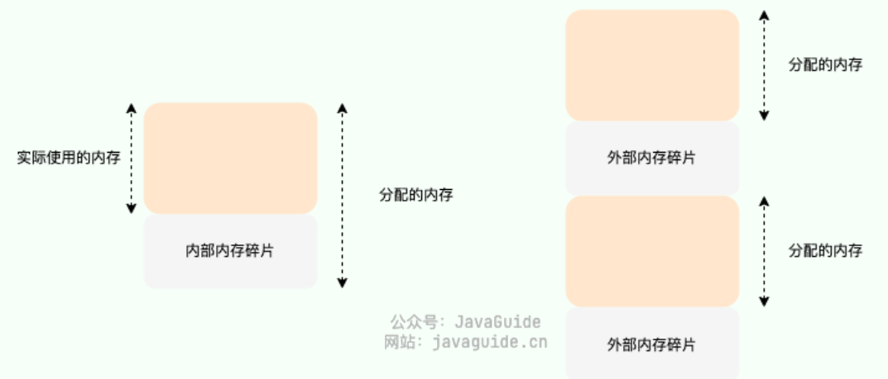

### 1.3 内存管理的方式

内存管理方式可以分为以下两种：

- **连续内存管理**：为一个用户程序分配一个连续的内存空间，这种方式的内存利用率一般不高。
- **非连续内存管理**：允许一个程序使用的内存分布在离散的内存中，这种方式相对更加灵活。

#### 1、连续内存管理

**块式管理** 是早期计算机操作系统的一种连续内存管理方式，在一个内存块中只包含一个进程。Linux系统中使用了**伙伴系统算法**来实现块式管理，它可以避免外部碎片。

伙伴系统算法的思想是：由于内存大小是2的幂次，当有一个进程申请分配内存时，内存空间被递归地一分为二，直到刚好可以满足请求的大小，其中相邻的大小相等的内存块称为**伙伴**。

例如内存大小为64KB，当有一个7KB的分配请求时，它就会被分成8KB，8KB，16KB，32KB，然后将最左边的8KB块分配给进程。显然由于空闲块都是2的幂次大小，所以会有**内部碎片**，但是这一算法的优势之处在于合并，在将这个8KB的块归还时，会先检查它的另一个8KB的伙伴是否空闲，如果空闲就合二为一，一直递归合并，直到某一个块的伙伴还没有被释放或者合并整个内存区域，其中核心在于很容易确定一个块的伙伴，因为每对互为伙伴的块的地址只有一个bit位不同。

> 注意：用伙伴系统算法实现连续内存管理，虽然可以避免外部碎片，但是仍会有内部碎片。事实上在Linux中还使用了SLAB来解决内部碎片的问题。

#### 2、非连续内存管理

非连续内存管理存在下面 3 种方式：

- **段式管理**：以段(一段连续的物理内存)为基本单位，来管理和分配物理内存。进程的虚拟地址空间也被分为大小不等的段，段是有实际意义的，每个段定义了一组逻辑信息，例如有代码段、栈段、堆段等。
- **页式管理**：把物理内存分为连续等长的物理页，以页为基本单位来管理和分配物理内存。进程的虚拟地址空间也被划分为连续等长的虚拟页。这是现代操作系统广泛使用的一种内存管理方式。
- **段页式管理**：结合了段式管理和页式管理的一种内存管理机制，把物理内存先分成若干段，每个段又继续分成若干大小相等的页。

## 2. 虚拟内存

### 2.1 虚拟内存简介

**虚拟内存(Virtual Memory)** 是操作系统内存管理非常重要的一个技术，本质上来说它只是逻辑存在的，是一个假想出来的内存空间，主要作用是作为进程访问物理内存的桥梁并简化内存管理。总结来说，虚拟内存主要提供了下面这些能力：

- **简化内存管理并提高安全性**：进程都有一个一致且私有的虚拟地址空间，程序员不用和真正的物理内存打交道，而是借助虚拟地址空间访问物理内存，从而简化了内存管理，同时也提高了系统的安全性（因为禁止了程序代码直接访问物理内存）。
- **隔离进程**：每个进程都有自己私有的虚拟地址空间，从而进程之间彼此隔离。
- **提供更大的可用内存空间**：虚拟地址空间大小一般远大于物理内存，所以进程自己可以操作更大的内存空间。而在进程运行时，只会将虚拟地址空间中正在使用的部分数据加载到物理内存，所以一般不会出现物理内存不够用的情况。如果出现物理内存不够用的情况，则会根据某种策略，将一些物理内存页暂时保存到磁盘中。
- **提升物理内存利用率**：进程运行时，只会将虚拟地址空间中正在使用的部分数据加载到物理内存，而不会将虚拟地址空间中未使用的部分也加载到物理内存中，所以提高了物理内存的利用率。

如果没有虚拟内存，程序直接访问和操作的都是物理内存，看似少了一层中介，但实际多了很多问题，例如：

1. 用户程序可以访问任意物理内存，可能会不小心操作到系统运行必需的内存，进而造成操作系统崩溃，严重影响系统的安全。
2. 同时运行多个程序容易崩溃。比如你想同时运行一个微信和一个 QQ 音乐，微信在运行的时候给内存地址 1000 赋值后，QQ 音乐也同样给内存地址 1000 赋值，那么 QQ 音乐对内存的赋值就会覆盖微信之前所赋的值，这就可能会造成微信程序崩溃。
3. 程序运行过程中使用的所有数据和指令都要载入物理内存，根据局部性原理，事实上其中很大一部分可能都不会用到，白白占用了宝贵的物理内存资源。

### 2.2 虚拟地址空间

- 虚拟地址空间是虚拟地址的集合，是虚拟内存的范围，每一个进程都有一个一致且私有的虚拟地址空间。像C语言程序中指针操作的地址，都是虚拟地址。
- 物理地址空间是物理地址的集合，是物理内存的范围。物理地址就是真正的物理内存中的地址。

操作系统通过CPU芯片中的一个重要组件**MMU（Memory Management Unit，内存管理单元）**将虚拟地址转换为物理地址，这个过程被称为**地址转换**。地址转换的方式主要有分段机制、分页机制、段页式机制这三种，现代操作系统广泛采用分页机制。

一个进程的虚拟地址空间，主要包含：

- 内核的相关信息
- 程序的代码
- 栈（用于保存函数调用信息、分配空间给局部变量、传递参数和函数返回值等）
- 堆（管理用户动态分配的内存）
- 其他信息，如静态初始化的变量等


## 3. 分段机制

分段机制：以段(一段连续的物理内存)为基本单位，来管理和分配物理内存。进程的虚拟地址空间也被分为大小不等的段，段是有实际意义的，每个段定义了一组逻辑信息，例如有代码段、栈段、堆段等。

分段机制通过 **段表** 映射虚拟地址和物理地址，每个进程都有一个对应的段表。分段机制下的虚拟地址由两部分组成：

- **段号**：标识着该虚拟地址属于整个虚拟地址空间中的哪一个段。
- **段内偏移量**：相对于该段起始地址的偏移量。

具体的地址转换过程如下：

1. MMU 首先解析得到虚拟地址中的段号；
2. 通过段号去该进程的段表中找到对应的段表项；
3. 从段表项中取出该段的起始地址（起始物理地址）加上虚拟地址中的段内偏移量得到最终的物理地址。

> 说明：段表中还存有诸如段长(可用于检查虚拟地址是否超出合法范围)、段类型（该段的类型，例如代码段、数据段等）等信息。

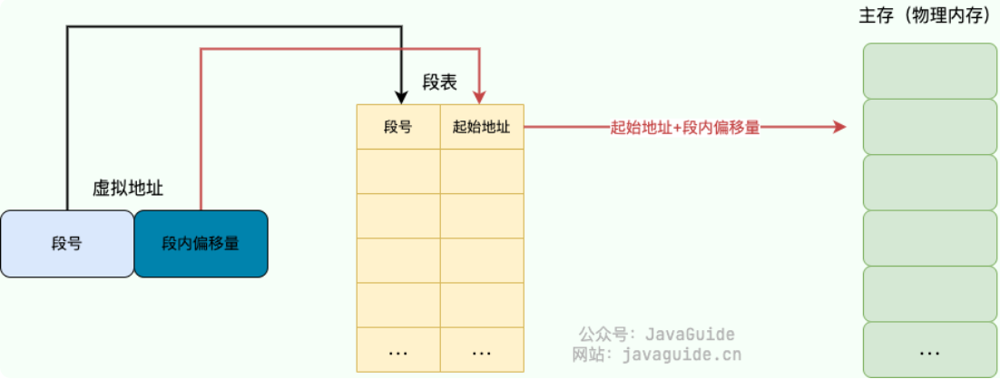

**注意**：通过段号未必能找到对应的段表项，例如系统内存不足或者无法分配到连续的物理内存块就会导致段表项无法被创建。

**分段机制容易产生外部碎片**，例如可用物理内存为 5G 的系统使用分段机制分配内存，现在有 4 个进程，每个进程的内存占用情况如下：

- 进程 1：0~1G（第 1 段）
- 进程 2：1~3G（第 2 段）
- 进程 3：3~4.5G（第 3 段）
- 进程 4：4.5~5G（第 4 段）

此时，我们关闭了进程 1 和进程 4，则第 1 段和第 4 段的内存会被释放，空闲物理内存还有 1.5G。但由于这 1.5G 物理内存并不是连续的，导致没办法将空闲的物理内存分配给一个需要 1.5G 物理内存的进程。

## 4. 分页机制

### 4.1 简介

分页机制：把物理内存分为连续等长的物理页，以页为基本单位来管理和分配物理内存。进程的虚拟地址空间也被划分为连续等长的虚拟页。这是现代操作系统广泛使用的一种内存管理方式。

分页机制通过 **页表** 映射虚拟地址和物理地址，每个进程都有一个对应的页表。分页机制下的虚拟地址由两部分组成：

- **页号**：标识着该虚拟地址属于整个虚拟地址空间中的哪一个页。
- **页内偏移量**：相对于该页起始地址的偏移量。

具体的地址转换过程如下：

1. MMU 首先解析得到虚拟地址中的虚拟页号；
2. 通过虚拟页号去该进程的页表中找到对应的页表项；
3. 从页表项中取出该页的物理页号，用该物理页号对应的物理页起始地址加上虚拟地址中的页内偏移量得到最终的物理地址。

> 说明：页表中还存有诸如访问标志（标识该页面有没有被访问过）、脏数据标识位等信息。

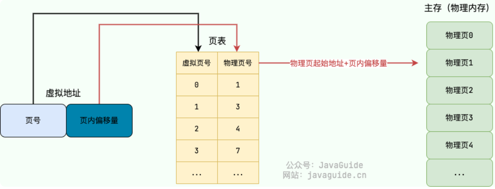

**注意**：通过页号未必能找到对应的页表项，因为可能出现`页缺失`

> **分页机制不会产生外部碎片，但可能会有内部碎片**

### 4.2 多级页表

如果只采用一级页表，假设虚拟地址空间范围共有`2^32`，而一个页的大小是`4KB`，那页表项就有`2^20`个。每个页表项一般占用4字节，所以该进程的页表大小就是`2^20 * 4 / 1024 * 1024= 4MB`，占用空间极大。

而事实上一个进程的虚拟地址空间中，大部分空间是完全没有被使用的，真正被使用的空间只有一小部分，因此我们大可不必建立这么多的页表项。所以操作系统引入了**多级页表**，32 位系统一般为二级页表，64 位系统一般为四级页表。

这里以二级页表为例进行介绍，如下图所示，一级页表共有 1024 个页表项，用于给出二级页表的地址；二级页表同样共有 1024 个页表项，用于给出物理页号。而核心在于，一级页表中的每个页表项，还会指示该页表项是否有效（如果它对应的二级页表中的所有页都没有被使用，则是无效的），所以**真正加载到内存中的，只有一级页表和有效的二级页表**。根据我们前面所说，虚拟地址空间中真正被使用的空间只有一小部分，所以一般来讲只会用到大约2个二级页表，因此此时内存中页表占用的空间就是`4KB(一级页表) + 8KB(两个二级页表)`，大大减少了占用空间。

> 多级页表属于时间换空间的典型场景，利用增加页表查询的次数减少页表占用的空间

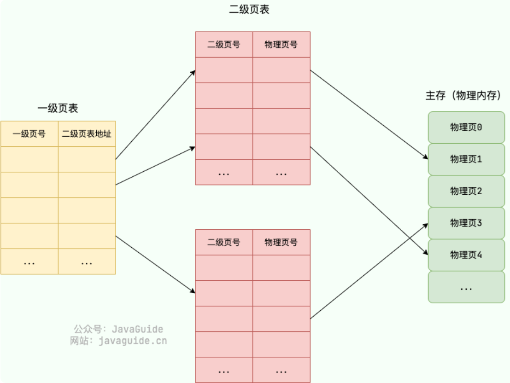

### 4.3 TLB

为了提高虚拟地址到物理地址的转换速度，操作系统在**页表**方案基础之上引入了**转址旁路缓存(Translation Lookaside Buffer，TLB)**，它也被称为**快表**。TLB属于MMU内部的单元，本质上就是一块高速缓存，缓存了虚拟页号到物理页号的映射关系。

使用 TLB 之后的地址转换流程就变成了：

1. 用虚拟地址中的虚拟页号作为 key 去 TLB 中查询；
2. 如果能查到对应的物理页的话，就不用再查询页表了，这种情况称为 TLB 命中。
3. 如果不能查到对应的物理页的话，还是需要去查询内存中的页表，同时将页表中的该映射表项添加到 TLB 中，这种情况称为 TLB 未命中。
4. 当 TLB 填满后，又要登记新映射关系时，就按照一定的淘汰策略淘汰掉快表中的一个映射表项。

> 由于页表在内存中，因此在没有 TLB 之前，每次读写内存数据时要访问**两次内存**（先访问页表，再访问要读写的数据）。而有了 TLB 之后，对于存在于 TLB 中的页表数据只需要访问**一次内存**即可，大大提升了性能。

### 4.4 页缺失

页缺失（Page Fault，又名缺页中断）指的是当软件试图访问已映射在虚拟地址空间中，但是目前并未被加载在物理内存中的一个页时，由 MMU 所发出的中断。常见的页缺失有下面这两种：

- **硬性页缺失（Hard Page Fault）**：物理内存中没有对应的物理页。于是，Page Fault Handler 会指示 CPU 从已经打开的磁盘文件中读取相应的内容到物理内存，而后交由 MMU 建立相应的虚拟页和物理页的映射关系。
- **软性页缺失（Soft Page Fault）**：物理内存中有对应的物理页，但虚拟页还未和物理页建立映射。于是，Page Fault Handler 会指示 MMU 建立相应的虚拟页和物理页的映射关系。

发生上面这两种缺页错误的时候，应用程序访问的是有效的物理内存，只是出现了物理页缺失或者虚拟页和物理页的映射关系未建立的问题。如果应用程序访问的是无效的物理内存的话，还会出现 **无效缺页错误（Invalid Page Fault）** 。

### 4.5 页面置换算法

当发生硬性页缺失时，如果物理内存中没有空闲的物理页面可用，操作系统就必须将物理内存中的一个物理页淘汰出去（放到磁盘上一个称为**交换区**的地方，等要用到的时候再将它读取到物理内存中），这样就可以腾出空间来加载新的页面了。这就是**换页机制**，它相当于利用磁盘这种较低廉的存储设备来扩展物理内存。

而用来选择淘汰哪一个物理页的规则就叫做**页面置换算法**。页缺失太频繁的发生会非常影响性能，一个好的页面置换算法需要减少页缺失发生的次数。常见的页面置换算法有以下 5 种：

- **最佳页面置换算法（OPT，Optimal）**：优先选择淘汰的页面是在将来最长时间内不再被访问的页面。该算法可以保证最低的缺页率，然而未来的访问是操作系统无法预知的，所以只能作为一个完美标杆，让其他算法尽可能接近它。
- **先进先出页面置换算法（FIFO，First In First Out）** ：总是淘汰最先进入内存的页面，即选择在内存中驻留时间最久的页面进行淘汰。该算法性能很差，完全**没有利用局部性原理**，从而可能导致经常被访问的页面频繁地调入调出，而且还**会出现Belady异常**（一般来说当缓存空间变大时缓存命中率会提高，但是FIFO反而可能导致命中率下降，这种现象称为Belady异常）。
- **最近最久未使用页面置换算法（LRU，Least Recently Used）**：LRU算法赋予每个页面一个访问字段，用来记录一个页面自上次被访问以来所经历的时间`T`，当要淘汰一个页面时，选择现有页面中`T`值最大的，即最近最久未使用的页面予以淘汰。LRU算法是实际应用中最多的（实际应用中也可能基于LRU算法做一些改进），也被认为是最接近OPT的页面置换算法。
- **最少使用页面置换算法（LFU，Least Frequently Used）**：选择之前一段时间内使用最少的页面作为淘汰页。该算法并没有很好地遵循局部性原理，性能不如LRU。
- **时钟页面置换算法（Clock）**：LRU算法有一个缺点，就是在淘汰页面时需要遍历整个内存中的所有页面，才能选出`T`值最大的，所以开销比较大。而Clock算法是一种近似LRU算法，它使用页表项中的一个标记bit（称为引用位）来实现，每当页被访问时就将其引用位设置为1。具体而言，Clock算法使用一个循环链表来保存内存中所有页的信息，时钟指针初始指向某个页，当需要淘汰页面时，会检查当前时钟指针指向的页的引用位，如果是0就将其淘汰，如果是1就将其置0，然后时钟指针指向下一个页，直到找到引用位是0的页面进行淘汰。

## 5. 局部性原理

**局部性原理（Locality Principle）** 是计算机体系结构设计的重要原则之一，也是许多优化算法的基础。它指的是，在程序执行过程中，数据和指令的访问存在一定的空间和时间上的局部性特点。其中，时间局部性是指一个数据项或指令在一段时间内被反复使用的特点，空间局部性是指一个数据项或指令在一段时间内与其相邻的数据项或指令被反复使用的特点。

在分页机制中，局部性原理的作用体现在两个方面：

- **时间局部性**：由于程序中存在一定的循环或者重复操作，因此可能会反复访问同一个数据，这就体现了时间局部性的特点。为了利用时间局部性，分页机制中通常采用缓存（TLB）机制来提高页面的命中率。
- **空间局部性**：由于程序中数据和指令的访问通常是具有一定的空间连续性的，因此当访问某个数据时，很可能还会访问其相邻的数据，这就体现了空间局部性的特点。为了利用空间局部性，操作系统就采用了分页机制，会将一整个页从磁盘读入内存，而不是仅把一条数据读入内存。

## 6. 虚拟内存的其他技巧

### 6.1 空指针异常

访问空指针会出现异常，其原因是0号虚拟页被标记为无效。

### 6.2 按需置零

当需要在虚拟地址空间分配页时，例如动态申请堆空间，此时操作系统只会在页表中放入一个标记页不可访问的条目，直到进程真正访问该页时，才会将其映射到物理页并置零。按需置零的好处是如果进程从不访问该页，就可以免去做这些工作的开销。

### 6.3 写时复制(copy-on-write，COW)

如果进程想要复制一个物理页的内容，而且该物理页已经与另一个进程的虚拟页建立了映射关系，则此时并不会实际进行物理页的复制，而仅仅是将该物理页再与当前进程的虚拟页建立一个映射关系，并且这两个进程中各自的这个虚拟页都标记为只读。

如果这两个进程对各自的这个虚拟页都只进行读操作，则不会有任何问题，操作系统就实现了快速复制而不实际移动任何数据。而一旦其中一个进程尝试对这个虚拟页进行写操作，操作系统才会真正分配一个新的物理页进行复制，此时两个物理页分别映射给这两个进程，这就是写时复制。


# 第4章 并发

## 1. 简介

### 1.1 并发的基本术语

- 临界资源：一个时间段内只允许一个线程访问的资源称为临界资源，对临界资源的访问必须互斥地进行
- 临界区：线程中访问临界资源的那段代码
- 互斥：指当一个线程进入临界区使用临界资源时，另一个线程必须等待
- 同步：指为完成某种任务而建立的两个或多个线程，这些线程因为需要在某些位置上协调它们的工作次序而等待、传递信息所产生的制约关系。
- 原子性：能够一气呵成执行(不可被中断)的代码称为具有原子性

注意：临界区应遵循以下访问规则

1. 空闲则入：没有线程在临界区时，任何线程可进入
2. 忙则等待：有线程在临界区时，其他线程均不能进入临界区
3. 有限等待：等待进入临界区的线程不能无限期等待
4. 让权等待（可选）：不能进入临界区的线程，应释放CPU（如转换到阻塞状态）

### 1.2 线程同步的方式

1. **互斥锁(Mutex)**：采用互斥对象机制，只有拥有互斥对象的线程才有访问公共资源的权限。因为互斥对象只有一个，所以可以保证公共资源不会被多个线程同时访问。比如 Java 中的 `synchronized` 关键词和各种 `Lock` 都是这种机制。
2. **读写锁(Read-Write Lock)**：允许多个线程同时读取共享资源，但只有一个线程可以对共享资源进行写操作。
3. **信号量(Semaphore)**：它允许同一时刻多个线程访问同一资源，但是需要控制同一时刻访问此资源的最大线程数量。
4. **屏障(Barrier)**：屏障是一种同步原语，用于等待多个线程到达某个点再一起继续执行。当一个线程到达屏障时，它会停止执行并等待其他线程到达屏障，直到所有线程都到达屏障后，它们才会一起继续执行。比如 Java 中的 `CyclicBarrier` 是这种机制。
5. **事件(Event)** ：也就是Wait/Notify机制，通过通知操作的方式来保持多线程同步，还可以方便的实现多线程优先级的比较操作。

### 1.3 C语言的线程API

#### 锁

```c
int pthread_mutex_lock(pthread_mutex_t* mutex);
int pthread_mutex_unlock(pthread_mutex_t* mutex);
```

通过锁使得线程互斥进入临界区，例如：

```c
pthread_mutex_t lock;
pthread_mutex_lock(&lock);
x = x + 1; //critical section
pthread_mutex_unlock(&lock);
```

这段代码的意思是：如果在调用`pthread_mutex_lock()`时没有其他线程持有该锁，线程将获取该锁并进入临界区；如果另一个线程确实持有该锁，那么尝试获取该锁的线程将不会从该调用返回，直到获得该锁。注意上述代码缺乏正确的初始化，即所有锁必须正确初始化，一种方法是将锁设置为默认值：

```c
pthread_mutex_t lock = PTHREAD_MUTEX_INITIALIZER;
```

另一种更常用的方法是动态初始化：

```c
pthread_mutex_t lock;
int rc = pthread_mutex_init(&lock, NULL);
assert(rc == 0); //always check success
```

注意当锁用完时，还应调用`pthread_mutex_destroy()`。

#### 条件变量

当线程之间必须发生某种信号时，如果一个线程在等待另一个线程继续执行某些操作(即线程同步)，条件变量就很有用：

```c
int pthread_cond_wait(pthread_cond_t* cond, pthread_mutex_t* mutex);
int pthread_cond_signal(pthread_cond_t* cond);
```

> 一般用`pthread_cond_t`声明条件变量，并用`PTHREAD_COND_INITIALIZER`初始化。

要使用条件变量，必须另外有一个与此条件相关的锁，在调用上述任何一个函数时，应该持有这个锁。wait函数使调用线程进入休眠状态，然后等待其他线程发出信号，而signal则是唤醒等待在某个条件变量上的睡眠线程。注意wait调用还有一个参数是互斥量，因为必须保证在wait调用时这个互斥量已上锁，然后wait()会把这个锁释放，并让调用线程休眠(原子地)，而当线程被唤醒时wait则会重新获取锁，然后再返回。典型用法如下：

```c
pthread_mutex_t lock = PTHREAD_MUTEX_INITIALIZER;
pthread_cond_t cond = PTHREAD_COND_INITIALIZER;
pthread_mutex_lock(&lock);
while (ready == 0)
    pthread_cond_wait(&cond, &lock);
pthread_mutex_unlock(&lock);
```

该线程检查变量ready是否已经被设置为0以外的值，如果没有，那么线程只是简单地调用等待函数以便休眠，直到其他线程唤醒它。唤醒线程的代码运行在另外某个线程中，如下：

```c
pthread_mutex_lock(&lock);
ready = 1;
pthread_cond_signal(&cond);
pthread_mutex_unlock(&lock);
```

注意在发出信号(调用signal和wait)及修改全局变量ready时，必须始终确保线程持有锁。

### 1.4 协程

协程(coroutine)是一种**用户态**的轻量级线程，协程的调度完全由用户控制。

线程与协程的对比：

- **线程是由内核管理，而协程是由用户管理**
- 协程切换时，只切换寄存器，栈的切换由用户态管理，所以无需进入内核态，因此速度快开销小；而线程切换时则会进入内核态，速度慢开销大
- 一个线程可以拥有多个协程，但这些协程只能使用一个CPU（因为一个线程只能使用一个CPU），因此这些协程无法并行执行
- 协程采用同步编程方式支持大规模并发I/O异步操作，不需要锁机制，不存在同时写变量冲突，在协程中控制共享资源不加锁，只需要判断状态，所以执行效率很高

### 1.5 管程

管程就是monitor（监视器），它是一种用于保证多线程互斥访问共享资源的数据结构，无须程序员自己实现互斥。monitor内部除了提供锁以外，还会提供条件变量，从而让程序员更方便地实现线程同步。

## 2. 锁

POSIX库将锁称为互斥量(mutex)，因为它被用来提供线程之间的互斥，即当一个线程在临界区时，它能够阻止其他线程进入，直到本线程离开临界区。

我们将给出一些锁的实现方法，并从三个方面来评价：是否完成最基本的要求(提供互斥)、公平性(是否会有竞争锁的线程饿死)、性能。

### 2.1 控制中断

最早提供的互斥解决方案之一就是在临界区关闭中断，即lock关中断，unlock开中断。这个方法虽然简单，但是有很多缺点：

1. 首先它允许所有调用线程执行特权操作(开、关中断)，这很危险
2. 其次这种方案不支持多处理器，如果多个线程运行在不同的CPU上，关中断也没用
3. 关中断可能导致中断丢失(比如磁盘完成了I/O但向CPU发送中断请求，CPU却无法收到)，从而导致严重的系统问题
4. 该方法效率低，现代CPU对于关闭和打开中断的代码执行得较慢。

### 2.2 Peterson算法(软件实现，针对2个线程)

```c
int flag[2] = { 0,0 }; //表示两个线程进入临界区的意愿
int turn = 0; //用标签表示优先让哪个线程进入临界区
void lock() {
    flag[self] = 1; //表达自己想要进入临界区
    turn = other; //但选择优先让另一个线程进入, other = 1 - self
    while (flag[other] && turn == other);
    //如果另一个线程确实想进入，并且标签上也是另一个线程的名字，则等待
}
void unlock() { flag[self] = 0; }
```

这种方法确实能正确实现互斥，然而现代系统只需很少的硬件支持就能很容易实现锁，因此只靠软件实现锁的方法已经很少使用。

### 2.3 TestAndSet指令

为了理解该指令的想法，我们如下先实现一个不依赖TestAndSet指令的锁：

```c
typedef struct lock_t { int flag; } lock_t;
void init(lock_t* mutex) {
    mutex->flag = 0; //0 means lock is available
}
void lock(lock_t* mutex) {
    while (mutex->flag == 1); //test the flag
    mutex->flag = 1; //and now set it
}
void unlock(lock_t* mutex) { mutex->flag = 0; }
```

这种方法正确性就出现了问题，如果一个线程执行完while的判断后发现flag是0，此时开始执行另一个线程的while判断也发现flag是0，接下来他们都将执行flag置1的操作然后同时进入临界区。

根本原因在于while检查和设置flag不是原子的，所以我们需要一条更强大的硬件指令，通常被称为TestAndSet(测试并设置)指令，在x86上也称为xchg(原子交换)指令：

```c
int TestAndSet(int* old_ptr, int new) {
    int old = *old_ptr;
    *old_ptr = new;
    return old;
}
```

它返回old_ptr指向的旧值，同时更新为new的新值，最关键的是这些代码是原子地执行的。于是我们可以实现以下简单的自旋锁：

```c
typedef struct lock_t { int flag; } lock_t;
void init(lock_t* mutex) {
    mutex->flag = 0; //0 means lock is available
}
void lock(lock_t* mutex) {
    while (TestAndSet(&mutex->flag, 1) == 1);
}
void unlock(lock_t* mutex) { mutex->flag = 0; }
```

自旋锁的一个问题是性能，因为线程在等待已经被持有的锁时采用了自旋等待(spin-waiting)的技术，就是不停地检查标志的值，它会占用CPU浪费时间；另一个问题是不公平，因为自旋的线程在竞争条件下可能会永远自旋。

### 2.4 CompareAndSwap指令

```c
int CompareAndSwap(int* ptr, int expected, int new) {
    int actual = *ptr;
    if (actual == expected) *ptr = new;
    return actual;
}

void lock(lock_t* mutex) {
    while (CompareAndSwap(&mutex->flag, 0, 1) == 1);
}
```

比较并交换指令的基本思路是检测ptr指向的值是否和expected相等，如果是则更新ptr所指的值为新值，否则什么也不做。可以看到它与TestAndSet指令实现的自旋锁工作方式很类似，但CompareAndSwap更强大。

### 2.5 其他可实现自旋锁的硬件原语

**链接的加载(LoadLinked)指令和条件式存储(StoreConditional)指令**

```c
int LoadLinked(int* ptr) { return *ptr; }
int StoreConditional(int* ptr, int value) {
    if (no one has updated * ptr since the LoadLinked to this address) {
        *ptr = value;
        return 1; //success
    }
    else return 0; //failed to update
}

void lock(lock_t* mutex) {
    while (1) {
        while (LoadLinked(&mutex->flag) == 1);
        if (StoreConditional(&mutex->flag, 1) == 1) return;
        //otherwise：try it all over again
    }
}
void unlock(lock_t* mutex) { mutex->flag = 0; }
```
LoadLinked指令和典型加载指令类似，都是从内存中取出值存入一个寄存器。关键区别来自StoreConditional指令，只有上一次加载的地址在期间都没有更新时才会成功，同时更新刚才LoadLinked的地址的值，成功时返回1，并将ptr指的值更新为value，失败则返回0并且不会更新值。用这两条指令实现如上的锁，如果一个线程加载并判断flag是0(说明锁可用)，然后切换到另一个线程加载并判断flag是0，此时再执行下一条if判断发现flag未被更新，于是上锁(更改flag为1)，而如果之前那个线程执行下一条if判断，发现flag已被更新，于是条件存储指令返回0，开始重新循环。

**获取并增加(FetchAndAdd)指令**

```c
int FetchAndAdd(int* ptr) {
    int old = *ptr;
    *ptr = old + 1;
    return old;
}
typedef struct lock_t { int ticket; int turn; } lock_t;
void init(lock_t* mutex) {
    mutex->ticket = 0; mutex->turn = 0;
}
void lock(lock_t* mutex) {
    int myturn = FetchAndAdd(&mutex->ticket);
    while (mutex->turn != myturn);
}
void unlock(lock_t* mutex) { FetchAndAdd(&mutex->turn); }
```

这个方案使用了ticket和turn两个变量来构建锁。如果变量希望获取锁，就对ticket执行一个原子的获取并增加指令，当某个线程的`myturn == turn`时就轮到它进入临界区。unlock则是增加turn，使得下一个等待线程可以进入临界区。不同于之前的方法，本方法能够保证所有线程都能抢到锁，只要一个线程对ticket执行了获取并增加指令，它最终就一定会被调度，从而满足公平性。

### 2.6 使用队列将自旋改成休眠

原子指令的硬件支持让我们实现了正确、公平(通过ticket锁)的锁，但是一直自旋的低性能问题没有解决。一种简单的想法是在自旋的时候操作系统用一条原语yield()主动放弃CPU，然而采用轮转调度程序，很多线程竞争一把锁，就会有很多线程一直处于运行然后让出这种模式，直到持有锁的线程再次运行，这样的上下文切换成本依然很高，并且甚至可能导致某一个线程一直处于让出的循环然后饿死。

因此，更好的做法是，操作系统用一个队列来保存等待锁的线程，并且提供两个系统调用：park()能够让调用线程休眠，unpark(TID)能唤醒TID标识的线程，可以用这两个调用来实现锁，让调用者在获取不到锁时睡眠，在锁可用时被唤醒。

```c
typedef struct lock_t {
    int flag; int guard; queue_t* q;
} lock_t;
void init(lock_t* m) {
    m->flag = 0; m->guard = 0; queue_init(m->q);
}
void lock(lock_t* m) {
    while (TestAndSet(&m->guard, 1) == 1); //acquire guard lock by spinning
    if (m->flag == 0) {
        m->flag = 1; //lock is acquired
        m->guard = 0;
    }
    else {
        queue_add(m->q, gettid());
        m->guard = 0;
        park();
    }
}
void unlock(lock_t* m) {
    while (TestAndSet(&m->guard, 1) == 1);
    if (queue_empty(m->q))
        m->flag = 0; //let go of lock; no one wants it
    else
        unpark(queue_remove(m->q)); //hold lock for next thread
    m->guard = 0;
}
```

注意其中的guard基本上起到了自旋锁的作用，保证lock和unlock中的代码能够被互斥地执行，所以这个方法并没有完全避免自旋等待，但是这个自旋等待的时间是很有限的(不是用户定义的临界区，只是在lock和unlock代码中的几个指令)，因此仍然可以认为这种方法是合理的。还要注意这种方案可能导致唤醒/等待竞争，如果一个线程将要执行park()，此时切换到另一个正在释放锁的线程，它执行完unpark后就导致了原来线程执行park()，然后原线程就会一直休眠下去。为了避免这个情况，操作系统提供了另一个系统调用setpark()来解决这个问题，一个线程调用setpark()来表明自己马上要park，如果刚好另一个线程被调度并且调用了unpark，那么后续的park调用就会直接返回，而不是一直睡眠。于是可以将lock中的相关部分改成

```c
queue_add(m->q, gettid());
setpark();
m->guard = 0;
park();
```

## 3. 条件变量

### 3.1 生产者消费者问题(有界缓冲区问题)

问题：假设有多个生产者线程和多个消费者线程，生产者把生成的数据项放入缓冲区，消费者从缓冲区取走数据项，只有缓冲区没满时，生产者才能把数据放入缓冲区，只有缓冲区不空时，消费者才能从缓冲区取走数据项，所以必须提供同步机制来访问该有界缓冲区。我们首先仅用互斥锁来实现它：

```c
int buffer[MAX];
int fill_ptr = 0;
int use_ptr = 0;
int count = 0;
pthread_mutex_t lock = PTHREAD_MUTEX_INITIALIZER;
 
void put(int value) {
    buffer[fill_ptr] = value;
    fill_ptr = (fill_ptr + 1) % MAX;
    count++;
}
int get() {
    int tmp = buffer[use_ptr];
    use_ptr = (use_ptr + 1) % MAX;
    count--;
    return tmp;
}
 
void producer() {
    while (1) {
    retry:
        pthread_mutex_lock(&lock);
        if (count == MAX) {
            pthread_mutex_unlock(&lock);
            goto retry;
        }
        put(data);
        pthread_mutex_unlock(&lock);
    }
}
void consumer() {
    while (1) {
    retry:
        pthread_mutex_lock(&lock);
        if (count == 0) {
            pthread_mutex_unlock(&lock);
            goto retry;
        }
        int tmp = get();
        pthread_mutex_unlock(&lock);
    }
}
```
这一方法固然正确，并且调用的库函数`pthread_mutex_lock()`在锁竞争时也不会发生自旋，但是线程本身可能发生自旋检查(如上不断执行goto)，我们希望通过某种变量来等待条件变真(比如在consumer中如果count为0则直接让该线程休眠，一旦count大于0则被唤醒)，从而降低系统开销。

### 3.2 条件变量

线程可以使用条件变量(condition variable)来等待一个条件变成真。条件变量是一个显式队列，当条件不满足时线程可以把自己加入队列后休眠(调用wait)，等待该条件；当另外一个线程将条件变为真后，就可以唤醒一个(调用signal)或全部(调用broadcast)等待线程。接下来我们尝试用条件变量来完成生产者消费者问题的同步。

初次尝试：

```c
void producer() {
    while (1) {
        pthread_mutex_lock(&lock);
        if (count == MAX)
            pthread_cond_wait(&cond, &lock);
        put(data);
        pthread_cond_signal(&cond);
        pthread_mutex_unlock(&lock);
    }
}
void consumer() {
    while (1) {
        pthread_mutex_lock(&lock);
        if (count == 0)
            pthread_cond_wait(&cond, &lock);
        int tmp = get();
        pthread_cond_signal(&cond);
        pthread_mutex_unlock(&lock);
    }
}
```

这个方案有两个严重的问题：首先是wait之前的if语句出现的问题，假设有两个消费者线程C1和C2，以及一个生产者进程P1，一开始C1运行直到wait睡眠，然后P1运行直到signal唤醒等待线程，此时C2抢先运行，获取了缓冲区中的数据，然后C1开始运行从wait返回，之后调用get()发生错误(因为此时缓冲区为空)。这就是信号的Mesa语义：发信号给线程只是唤醒它们，暗示状态发生了变化(这个例子中就是缓冲区不空了)，但并不会保证在它运行之前状态一直是期望的情况。修复这个问题很简单，只需将两个线程中的if都改成while即可，根据Mesa语义，我们在使用条件变量时最好总是使用while循环。

但上述方案即使如此修改后也还有另一个问题，假设C1和C2都开始运行后睡眠了，然后P1运行唤醒C1，之后P1继续运行直到睡眠(假设MAX=1)，C1返回后进入while循环发现缓冲区是满的，于是继续运行后唤醒C2，然而C2和C1继续运行下去都会发现缓冲区为空而睡眠，从而导致三个线程全都睡眠了。所以我们应该保证消费者唤醒生产者，而不能唤醒消费者，所以需要使用两个条件变量以便正确发出信号，由此我们得到了以下的正确方案。

正确方案：

```c
void producer() {
    while (1) {
        pthread_mutex_lock(&lock);
        while (count == MAX)
            pthread_cond_wait(&empty, &lock);
        put(data);
        pthread_cond_signal(&fill);
        pthread_mutex_unlock(&lock);
    }
}
void consumer() {
    while (1) {
        pthread_mutex_lock(&lock);
        while (count == 0)
            pthread_cond_wait(&fill, &lock);
        int tmp = get();
        pthread_cond_signal(&empty);
        pthread_mutex_unlock(&lock);
    }
}
```

我们常常用`pthread_cond_broadcast()`代替上面的`pthread_cond_signal()`，从而唤醒所有的等待线程，因为在有些情况下唤醒某一个线程可能并不满足所需的条件，而直接唤醒所有线程就确保了所有应该唤醒的线程都被唤醒，当然不利的一面是可能会影响性能。这种条件变量也称为覆盖条件，因为它能覆盖所有需要唤醒线程的场景。

## 4. 信号量

### 4.1 信号量的定义

信号量是有一个整数值的对象，在POSIX标准中，可以用原语`sem_wait()`和`sem_post()`来操作它(也分别称为P操作和V操作)，因为信号量的初始值能够决定其行为，所以必须初始化信号量。

```c
#include <semaphore.h>
sem_t S;
sem_init(&S, 0, x);
int sem_wait(sem_t* s) {
    decrement the value of semaphore s by one
    wait if value of semaphore s is negative
}
int sem_post(sem_t* s) {
    increment the value of semaphore s by one
    if there are one or more threads waiting, wake one
}
```

- init通过第三个参数将S的值初始化为x，而第二个参数一般都设为0，表示信号量是在同一进程的多个线程共享的。
- wait函数将信号量的值先减1，如果信号量的值仍非负，则直接返回，否则会让调用线程挂起。可见当信号量的值为负数时，这个值就是等待线程的个数。
- post函数将信号量的值加1，然后唤醒一个睡眠的线程。

### 4.2 信号量用作锁

```c
sem_t m;
sem_init(&m, 0, 1);
 
sem_wait(&m);
critical section;
sem_post(&m);
```

将信号量的值初始化为1，然后把临界区用一对P、V操作环绕就实现了锁的功能。因为锁只有两个状态(持有和没持有)，所以这种用法有时也叫作二值信号量。

### 4.3 信号量用作条件变量

我们以一个线程创建另外一线程，并且等待它结束为例：

```c
sem_t s;
void* child(void* arg) {
    printf("child\n");
    sem_post(&s);
}
int main() {
    sem_init(&s, 0, 0);
    pthread_t c;
    pthread_create(c, NULL, child, NULL);
    sem_wait(&s); 
    printf("parent\n");
    return 0;
}
```

注意上述例子中信号量应该被初始化为0

### 4.4 信号量实现生产者消费者问题

初次尝试：

```c
int buffer[MAX];
int fill_ptr = 0;
int use_ptr = 0;
sem_t empty;
sem_t fill;
sem_t mutex;
 
void put(int value) {
    buffer[fill_ptr] = value;
    fill_ptr = (fill_ptr + 1) % MAX;
}
int get() {
    int tmp = buffer[use_ptr];
    use_ptr = (use_ptr + 1) % MAX;
    return tmp;
}
 
void producer() {
    while (1) {
        sem_wait(&mutex);
        sem_wait(&empty);
        put(data);
        sem_post(&fill);
        sem_post(&mutex);
    }
}
void consumer() {
    while (1) {
        sem_wait(&mutex);
        sem_wait(&fill);
         int tmp = get();
        sem_post(&empty);
        sem_post(&mutex);
    }
}
int main() {
    sem_init(&empty, 0, MAX);
    sem_init(&fill, 0, 0);
    sem_init(&mutex, 0, 1);
    //...
}
```

类似于条件变量实现的方式，我们将锁和条件变量相应地用信号量实现。然而这段代码有一个很严重的问题，假设有一个消费者线程和一个生产者线程，消费者线程先运行，获得锁，然后执行`wait(&fill)`进入休眠，注意此时消费者仍持有锁，接下来运行生产者线程，直接在`wait(&mutex)`就进入休眠，于是就出现了循环等待，发生死锁。要解决这个问题，只需减少锁的作用域，把获取和释放互斥量的操作调整为紧挨着临界区即可(实现互斥的P操作一定要在实现同步的P操作之后，而V操作不会导致进程阻塞)：

正确方案：

```c
void producer() {
    while (1) {
        sem_wait(&empty);
        sem_wait(&mutex);
        put(data);
        sem_post(&mutex);
        sem_post(&fill);
    }
}
void consumer() {
    while (1) {
        sem_wait(&fill);
        sem_wait(&mutex);
         int tmp = get();
        sem_post(&mutex);
        sem_post(&empty);
    }
}
int main() {
    sem_init(&empty, 0, MAX);
    sem_init(&fill, 0, 0);
    sem_init(&mutex, 0, 1);
    //...
}
```

### 4.5 信号量的底层实现方式

我们用底层的同步原语(锁和条件变量)来实现自己的信号量：

```c
typedef struct _Zem_t {
    int value;
    pthread_cond_t cond;
    pthread_mutex_t lock;
} Zem_t;
 
void Zem_init(Zem_t* s, int value) {
    s->value = value;
    s->cond = PTHREAD_COND_INITIALIZER;
    s->lock = PTHREAD_MUTEX_INITIALIZER;
}
void Zem_wait(Zem_t* s) {
    pthread_mutex_lock(&s->lock);
    while (s->value <= 0)
        pthread_cond_wait(&s->cond, &s->lock);
    s->value--;
    pthread_mutex_unlock(&s->lock);
}
void Zem_post(Zem_t* s) {
    pthread_mutex_lock(&s->lock);
    s->value++;
    pthread_cond_signal(&s->cond);
    pthread_mutex_unlock(&s->lock);
}
```

注意我们wait的实现稍有不同，事实上value的值永远不会小于0，这一行为更容易实现，并符合现有的Linux实现。虽然信号量很简单，但是往往用锁和条件变量会更实用。

## 5. 经典同步问题

### 5.1 多生产者-多消费者问题

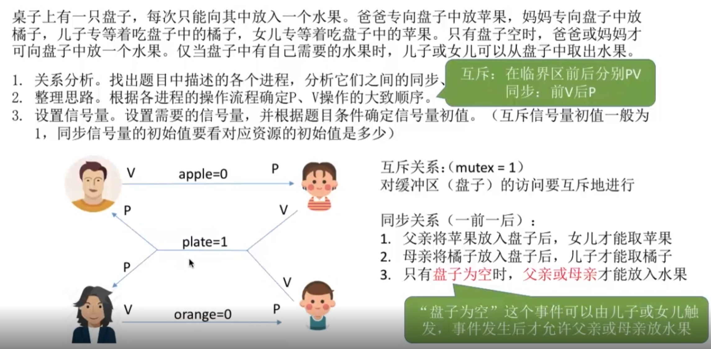

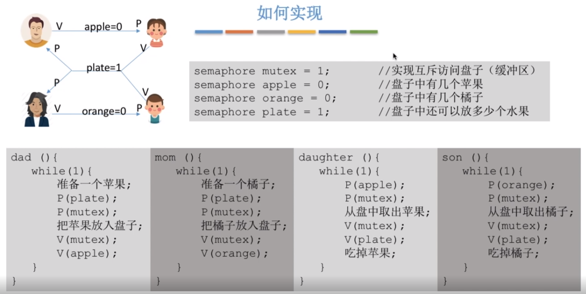

本题中也可以不设置专门的互斥变量mutex，其原因在于本题中的缓冲区大小为1，在任何时刻，apple、orange、plate三个同步信号量中最多只有一个是1，因此在任何时刻最多只有一个进程的P操作不会被阻塞并顺利进入临界区，所以不会出现多个进程同时访问临界区的现象。

### 5.2 吸烟者问题

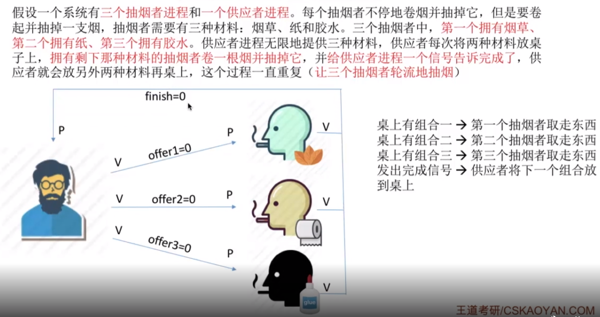

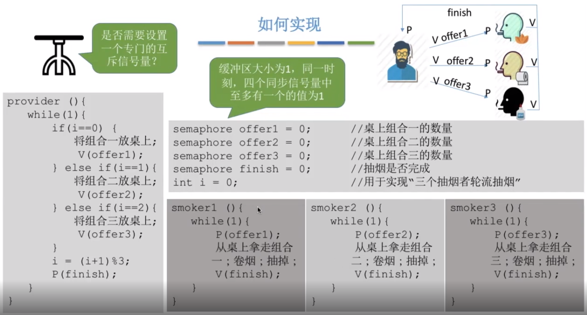

### 5.3 读者-写者问题

问题：有读者和写者两组并发进程，共享一个文件，要求：允许多个读者同时读文件；同一时刻只允许一个写者写文件(读者此时也无法读)。

```c
sem_t rw; //用于实现对共享文件的互斥访问，初始化为1
int count = 0; //记录当前有几个读进程在访问文件
sem_t mutex; //保证对变量count的互斥访问，初始化为1
sem_t w; //用于防止写进程饥饿，初始化为1
 
void write() {
    while (1) {
        sem_wait(&w);
        sem_wait(&rw); //写之前加锁
        //写文件...
        sem_post(&rw); //写完后解锁
        sem_post(&w);
    }
}
void read() {
    while (1) {
        sem_wait(&w);
        sem_wait(&mutex); //各读进程互斥访问count
        if (count == 0)
            sem_wait(&rw); //由第一个读进程负责读之前加锁
        count++;
        sem_post(&mutex);
        sem_post(&w); //此时释放w，就可防止写进程饥饿
        //读文件...
        sem_wait(&mutex); //各读进程互斥访问count
        count--;
        if (count == 0)
            sem_post(&rw); //由最后一个读进程负责读完后解锁
        sem_post(&mutex);
    }
}
int main() {
    sem_init(&rw, 0, 1);
    sem_init(&mutex, 0, 1);
    sem_init(&w, 0, 1);
    //...
}
```

### 5.4 哲学家就餐问题

问题：有5位哲学家围成一个圆桌，每两位哲学家之间有一把餐叉(一共5把)，哲学家有时要思考一会，不需要餐叉，有时又要就餐，而一位哲学家只有同时拿到了左手边和右手边的两把餐叉后才能吃东西。一个自然的想法是如下方案：

```c
//5个信号量都初始化为1，虽然这种初始化方式只是伪代码
sem_t forks[5] = { 1,1,1,1,1 }; 
void eat(int i) { //i号哲学家线程
    while (1) {
        sem_wait(&forks[i]); //拿左
        sem_wait(&forks[(i + 1) % 5]); //拿右
        //吃饭...
        sem_post(&forks[i]); //放左
        sem_post(&forks[(i + 1) % 5]); //放右
    }
}
```

然而一旦5个线程并发地拿起左边的餐叉，就会一直循环等待右边的餐叉，发生死锁。我们可以修改某个哲学家取餐叉的顺序，比如第4号哲学家选择先取右边的餐叉，再取左边的餐叉，得到以下正确方案：

```c
void eat(int i) { //i号哲学家进程
    while (1) {
        if (i == 4) {
            sem_wait(&forks[(i + 1) % 5]); //拿右
            sem_wait(&forks[i]); //拿左
        }
        else {
            sem_wait(&forks[i]); //拿左
            sem_wait(&forks[(i + 1) % 5]); //拿右
        }
        //吃饭...
        sem_post(&forks[i]); //放左
        sem_post(&forks[(i + 1) % 5]); //放右
    }
}
```

虽然这个方案正确，但事实上我们大可不必用这么特殊的解决方法。回顾我们最初的方案，其失败的原因在于我们自作聪明地让哲学家们先取左边餐叉再取右边餐叉，而事实上一个哲学家能够吃饭当且仅当他能够同时得到左右两边的餐叉，因此只要不满足这个条件，就让他等待即可，所以下述的解决方案才是解决这类问题的万能方法(我们用锁和条件变量来实现)：

```c
pthread_mutex_t mutex = PTHREAD_MUTEX_INITIALIZER;
pthread_cond_t cv = PTHREAD_COND_INITIALIZER;
bool avail[5] = { 1,1,1,1,1 };
 
void eat(int i) { //i号哲学家进程
    while (1) {
        pthread_mutex_lock(&mutex);
        while (!(avail[i] && avail[(i + 1) % 5])) 
            pthread_cond_wait(&cv, &mutex);
        avail[i] = avail[(i + 1) % 5] = false;
        pthread_mutex_unlock(&mutex);
        //吃饭...
        pthread_mutex_lock(&mutex);
        avail[i] = avail[(i + 1) % 5] = true;
        pthread_cond_broadcast(&cv);
        pthread_mutex_unlock(&mutex);
    }
}
```

## 6. 死锁

### 6.1 简介

死锁（Deadlock）是一种常见的并发问题，它是指各线程互相等待对方手里的资源，导致各线程都阻塞，无法向前推进的现象。

> 注意区分死锁与饥饿

### 6.2 产生死锁的必要条件

只要以下四个条件之一不满足，就不会发生死锁：

1. **互斥**：只有对必须互斥访问的资源的竞争才可能导致死锁
2. **占有并等待**：线程应已经持有了至少一个资源，同时又在等待其他资源
3. **非抢占**：线程获得的资源不能被抢占
4. **循环等待**：存在一种线程资源的循环等待环路，环路上每个线程都额外持有一个资源，而这个资源又是下一个线程要申请的。（注意循环等待不一定是死锁的充分条件，如果同类资源数大于1，则即使有循环等待也未必发生死锁；然而如果系统中每类资源都只有一个，那么循环等待就是死锁的充分必要条件了）

### 6.3 解决死锁的方法

一般情况下，可以使用**预防，避免，检测，解除**这四种方法来解决死锁：

- **预防**是采用某种策略，**限制并发线程对资源的请求**，从而破坏产生死锁的必要条件中的一个或多个
- **避免**则是系统在分配资源时，根据资源的使用情况**提前做出预测**，从而**避免死锁的发生**
- **检测**是指系统设有**专门的机构**，当死锁发生时，该机构能够检测死锁的发生，并精确地确定与死锁有关的线程和资源。
- **解除**是与检测相配套的一种措施，用于**将线程从死锁状态下解脱出来**。

### 6.4 死锁的预防

死锁的预防就是破坏四个必要条件中的任何一个，从而预防死锁的发生。

如果破坏第一个条件 **互斥**，使得资源是可以同时访问的，这是种简单的方法，磁盘就可以用这种方法管理，但是我们要知道，有很多资源 **往往是不能同时访问的** ，所以这种做法在大多数的场合是行不通的。

如果破坏第三个条件 **非抢占**，也就是说让资源可以被抢占，例如 **主存资源** 和 **处理器资源** 就被设计成是能够被抢占的，但很显然这种方式并不适用于所有资源。

所以一般比较实用的 **预防死锁的方法**，是通过考虑破坏第二个条件和第四个条件：

**（1）静态分配策略**

静态分配策略可以破坏死锁产生的第二个条件（占有并等待）。所谓静态分配策略，就是指一个线程必须在执行前就申请到它所需要的全部资源。因此，线程要么占有所有的资源然后开始执行，要么不占有资源，所以不会出现占有一些资源且等待一些资源的情况。

静态分配策略逻辑简单，但这种策略 **严重地降低了资源利用率**，因为在每个线程所占有的资源中，有些资源可能是在比较靠后的执行时间里采用的，甚至有些资源是在额外的情况下才使用的，这样就可能造成一个线程占有了一些 **几乎不用的资源而使其他需要该资源的线程产生等待** 的情况。

**（2）层次分配策略**

层次分配策略破坏了产生死锁的第四个条件（循环等待）。在层次分配策略下，所有的资源被分成了多个层次，一个线程得到某一层的一个资源后，它只能再申请较高一层的资源；当一个线程要释放某层的一个资源时，必须先释放所占用的较高层的资源。按这种策略，是不可能出现循环等待链的，因为那样的话，就出现了已经申请了较高层的资源，反而去申请了较低层的资源，不符合层次分配策略。

### 6.5 死锁的避免

上面提到的破坏死锁产生的四个必要条件之一就可以成功 **预防系统发生死锁** ，但是会导致 **低效的资源使用率**。而死锁的避免则相反，它允许系统中**同时存在四个必要条件** ，只要掌握并发线程的资源动态申请情况，做出 **明智和合理的选择** ，仍然可以避免死锁，因为四大条件仅仅是产生死锁的必要条件。

我们将系统的状态分为 **安全状态** 和 **不安全状态** ，每当在为申请者分配资源前先测试系统状态，若把系统资源分配给申请者会进入不安全状态，则拒绝分配，否则接受申请，并为它分配资源。

> 如果操作系统能够保证所有的线程在有限的时间内得到需要的全部资源，则称系统处于安全状态，否则说系统是不安全的。很显然，系统处于安全状态则不会发生死锁，系统若处于不安全状态则可能发生死锁。

最具有代表性的 **避免死锁算法** 就是 **Dijkstra 的银行家算法**，银行家算法用一句话表达就是：当一个线程申请使用资源的时候，银行家算法通过先 **试探** 分配给该线程资源，然后通过安全性算法判断分配后系统是否处于安全状态，若不安全则试探分配作废，让该线程继续等待，若能够进入到安全的状态，则就**真的分配资源给该线程**。

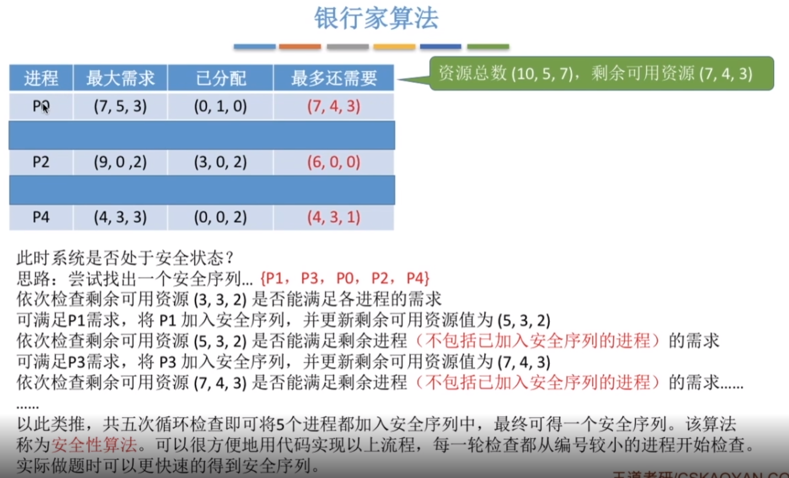

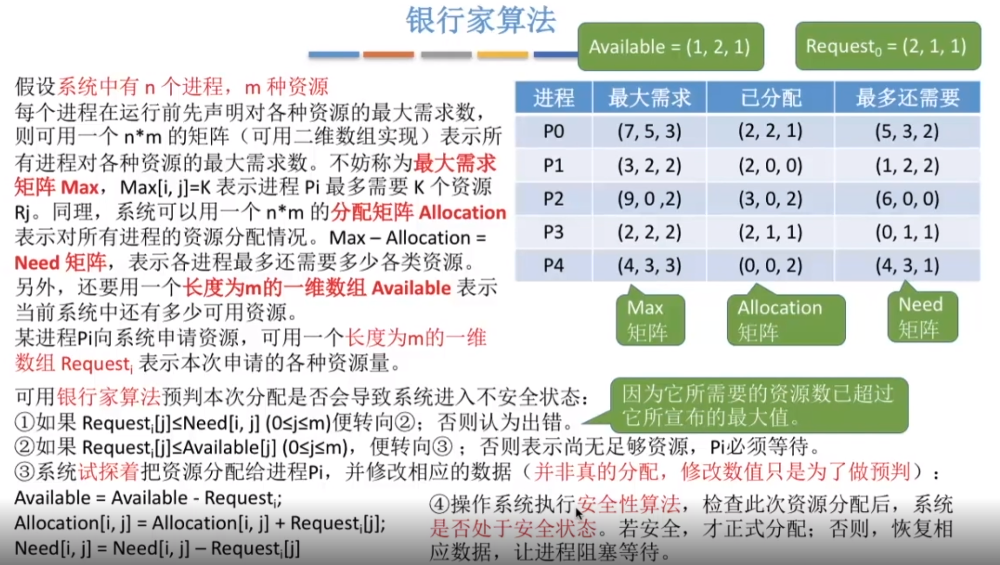

> 注意：死锁的避免(银行家算法)改善了 **资源使用率低的问题** ，但是它要不断地检测每个线程对各类资源的占用和申请情况，以及做安全性检查，需要花费较多的时间。

### 6.6 死锁的检测

对资源的分配加以限制可以 **预防和避免** 死锁的发生，但是都不利于各线程对系统资源的**充分共享**。解决死锁问题的另一条途径是**死锁检测和解除**，这种方法对资源的分配不加以任何限制，也不采取死锁避免措施，但系统**定时地运行一个死锁检测**的程序，判断系统内是否出现死锁，如果检测到系统发生了死锁，再采取措施去解除它。

> **死锁的检测和解除就像是乐观锁**，分配资源时不去提前管会不会发生死锁，等到真的死锁出现了再来解决它。而**死锁的预防和避免更像是悲观锁**，总是觉得死锁会出现，所以在分配资源的时候很谨慎。

**进程-资源分配图**

操作系统中的每一时刻的系统状态都可以用进程-资源分配图来表示，它可以用于**检测系统是否处于死锁状态**。用一个方框表示每一个资源类，方框中的黑点表示该资源类中资源的个数，每个进程用一个圆圈表示，用有向边来表示进程申请资源和资源被分配的情况。

图中 2-21 是进程-资源分配图的一个例子，由于存在占有和等待资源的环路，导致这组进程永远处于等待资源的状态，发生了死锁。

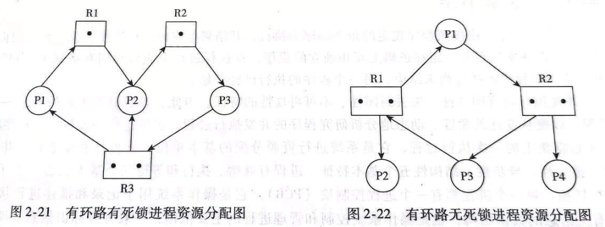

注意，进程-资源分配图中存在环路并不一定是发生了死锁，因为循环等待资源仅仅是死锁发生的必要条件，而不是充分条件。图 2-22 便是一个有环路而无死锁的例子。虽然进程 P1 和进程 P3 分别占用了一个资源 R1 和一个资源 R2，并且因为等待另一个资源 R2 和另一个资源 R1 形成了环路，但进程 P2 和进程 P4 分别占有了一个资源 R1 和一个资源 R2，它们申请的资源得到了满足，在有限的时间里会归还资源，于是进程 P1 或 P3 都能获得另一个所需的资源，环路自动解除，系统也就不存在死锁状态了。

**死锁检测程序的步骤**

1. 如果进程-资源分配图中无环路，则此时系统没有发生死锁
2. 如果进程-资源分配图中有环路，且每个资源类仅有一个资源，则系统中已经发生了死锁
3. 如果进程-资源分配图中有环路，且涉及到的资源类有多个资源，此时系统未必会发生死锁。如果能在进程-资源分配图中找出一个 **既不阻塞又非独立的进程** ，该进程能够在有限的时间内归还占有的资源，也就是把边给消除掉了，重复此过程，直到能在有限的时间内 **消除所有的边** ，则不会发生死锁，否则会发生死锁。(消除边的过程类似于**拓扑排序**)

### 6.7 死锁的解除

当死锁检测程序检测到存在死锁发生时，应设法让其解除，让系统从死锁状态中恢复过来，常用的解除死锁的方法有以下四种：

1. **立即结束所有进程的执行，重新启动操作系统**：这种方法简单，但以前所在的工作全部作废，损失很大。
2. **撤销涉及死锁的所有进程，解除死锁后继续运行**：这种方法能彻底打破**死锁的循环等待**条件，但将付出很大代价，例如有些进程可能已经计算了很长时间，由于被撤销而使产生的部分结果也被消除了，再重新执行时还要再次进行计算。
3. **逐个撤销涉及死锁的进程，回收其资源直至死锁解除**
4. **抢占资源**：从涉及死锁的一个或几个进程中抢占资源，把夺得的资源再分配给涉及死锁的进程直至死锁解除。


# 第5章 持久性

## 1. 文件系统简介

### 1.1 文件系统的功能

文件系统主要负责管理和组织计算机存储设备上的文件和目录，其功能包括以下几个方面：

1. **存储管理**：将文件数据存储到物理存储介质中，并且管理空间分配。
2. **文件管理**：文件的创建、删除等。
3. **目录管理**：目录的创建、删除等。
4. **文件访问控制**：管理不同用户或进程对文件的访问权限。

### 1.2 文件和目录

文件是一个字节序列，每个文件都对应一个索引节点（inode），inode中主要保存文件的元数据信息，例如：

- inode节点号
- 文件类型
- 文件大小
- 数据块在磁盘上的位置等

目录是一种特殊的文件，它也有对应的inode。目录中的内容主要是该目录中所含文件的名称和inode节点号等信息。

> UNIX类操作系统将所有一切均抽象成文件，提供了统一的接口，方便应用程序调用。也就是在UNIX中，万物皆文件。

### 1.3 硬链接和软链接

在类 Unix 系统上，文件链接（File Link）是一种特殊的文件类型，可以在文件系统中指向另一个文件。常见的文件链接类型有两种：

**硬链接（Hard Link）**

- 硬链接通过 inode 节点号建立链接，硬链接和源文件的 inode 节点号相同，两者对文件系统来说是完全平等的（可以看作是互为硬链接，源头是同一份文件），删除其中任何一个对另外一个没有影响，所以可以通过给文件设置硬链接文件来防止重要文件被误删。
- 只有删除了源文件和所有对应的硬链接文件，该文件才会被真正删除。
- 硬链接具有一些限制，不能对目录以及不存在的文件创建硬链接，并且，硬链接也不能跨越文件系统。
- `ln` 命令用于创建硬链接。

**软链接（Symbolic Link 或 Symlink）**

- 软链接类似于 Windows 系统中的快捷方式，其内容是指向一个文件路径。
- 软链接和源文件的 inode 节点号不同。
- 源文件删除后，软链接依然存在，但是指向的是一个无效的文件路径。
- 不同于硬链接，可以对目录或者不存在的文件创建软链接，并且，软链接可以跨越文件系统。
- `ln -s` 命令用于创建软链接。

> 硬链接不能跨越文件系统的原因是：每个文件系统都有自己的独立 inode 表，且每个 inode 表只维护该文件系统内的 inode。如果在不同的文件系统之间创建硬链接，可能会导致 inode 节点号冲突的问题，即目标文件的 inode 节点号已经在该文件系统中被使用。

### 1.4 提高文件系统性能的方式

1. **优化硬件**：使用高速硬件设备（如 SSD）替代传统的机械硬盘，使用 RAID 等技术提高磁盘性能。
2. **选择合适的文件系统选型**
3. **运用缓存**：访问磁盘的效率比较低，可以运用缓存来减少磁盘的访问次数，不过需要注意缓存命中率。
4. **避免磁盘过度使用**：注意磁盘的使用率，避免将磁盘用满，尽量留一些剩余空间，以免对文件系统的性能产生负面影响。
5. **对磁盘进行合理的分区**：合理的磁盘分区方案，能够使文件系统在不同的区域存储文件，从而减少文件碎片，提高文件读写性能。

### 1.5 Linux中的文件类型

Linux 支持很多文件类型，主要有：

- **普通文件（`-`）**
- **目录文件（`d`，directory file）**：目录也是文件的一种，打开目录事实上就是打开目录文件。
- **符号链接文件（`l`，symbolic link）**：保存了指向文件的地址。
- **字符设备（`c`，char）**：用来访问字符设备，比如键盘。
- **设备文件（`b`，block）**：用来访问块设备，比如硬盘、软盘。
- **管道文件(`p`，pipe)** ：一种特殊类型的文件，用于进程之间的通信。
- **套接字文件(`s`，socket)**：用于进程间的网络通信，也可以用于本机之间的非网络通信。

## 2. 简单文件系统

我们首先介绍一个简单文件系统（VSFS，Very Simple File System）的整体组织。

文件系统读写数据的基本单位是**磁盘块**（一般4KB，与内存操作的最小单位页大小相同），一个磁盘块只能存储一个文件。

> 说明：磁盘最小的物理存储单元是扇区（一般512B），一个磁盘块由多个连续扇区组成。

例如一个拥有64个磁盘块的磁盘（这些块的地址是从0到63），可以分为不同区域，用作不同用途：

- 数据区域：存放用户数据的磁盘区域，例如8到63号块
- inode表：用于保存每个文件的inode，例如3到7号块
- 数据位图：记录数据块是空闲还是已分配，例如第2块
- inode位图：记录inode表块是空闲还是已分配，例如第1块
- 超级块：也称为文件卷控制块，通常是第0块，它包含该文件系统的信息，比如有多少个inode和数据块、inode表的开始位置等。

## 3. 日志

当对文件进行写操作时，这些写操作通常并不会立即写入磁盘，而是先写入内存缓冲区。因此如果计算机宕机，就有可能产生数据不一致的问题。现代操作系统，通常采用**预写日志**的方法来解决这一问题。

预写日志的核心思想是：在将数据写入磁盘前，首先在磁盘的某个地方写下一点小注记来描述将要做的事情，从而保证在发生崩溃后也能够返回查看注记来重试。

## 4. IO软件层次结构

整个IO软件可以视为具有4个层次的系统结构，自上至下分别是用户层软件、设备独立性软件、设备驱动程序、中断处理程序，再往下一层就是硬件。

> 其中设备独立性软件、设备驱动程序、中断处理程序属于操作系统的内核部分，即IO核心子系统。

### 4.1 用户层软件

用户层软件实现了与用户交互的接口，用户可直接使用该层提供的与I/O操作相关的库函数对设备进行操作。

### 4.2 设备独立性软件

设备独立性软件又称设备无关性软件，与设备的硬件特性无关的功能几乎都在这一层实现。主要实现的功能包括：

- I/O调度：根据某种算法来处理各个I/O请求，如磁盘调度算法
- 设备保护、差错处理、设备的分配与回收
- 缓冲区管理：管理内存中的一块缓冲区（缓冲区的作用就是缓存数据，提高性能）
- 假脱机技术(SPOOLing技术)：可以将一台物理设备虚拟成逻辑上的多台设备，将独占式设备改造成共享设备，从而提高性能。
- 建立逻辑设备名到物理设备名的映射关系并根据设备类型选择调用相应的驱动程序

### 4.3 设备驱动程序

主要负责对硬件设备的具体控制（所有设备交互的细节都封装在设备驱动程序中）。不同的I/O设备有不同的硬件特性，具体细节只有设备的厂家才知道，因此厂家需要根据设备的硬件特性设计并提供相应的驱动程序。

### 4.4 中断处理程序

用于保存被中断进程的CPU环境，转入相应的中断处理程序进行处理，处理完毕再恢复被中断进程的现场后，返回到被中断进程。中断处理程序和设备驱动程序都与硬件紧密相关。

## 5. 磁盘调度算法

磁盘调度算法是操作系统中对磁盘访问请求进行排序和调度的算法，其目的是提高磁盘的访问效率。一次磁盘读写操作的时间由磁盘寻道时间、延迟时间和传输时间决定。磁盘调度算法可以通过改变到达磁盘请求的处理顺序，减少磁盘寻道时间和延迟时间。常见的磁盘调度算法有以下几种：

### 5.1 FCFS

**先来先服务算法（First Come FirstServed，FCFS）**：按照请求到达磁盘调度器的顺序进行处理，先到达的请求的先被服务。该算法没有考虑磁头移动的路径和方向，平均寻道时间较长。

例如多个进程先后请求访问55、58、39号磁道，则FCFS的处理顺序是55、58、39

### 5.2 SSTF

**最短寻道时间优先算法（Shortest Seek Time First，SSTF）**：优先选择距离当前磁头位置最近的请求进行服务。SSTF算法能够最小化磁头的寻道时间，但容易出现饥饿问题，即磁头附近的请求不断被服务，远离磁头的请求长时间得不到响应。

例如多个进程先后请求访问55、58、39号磁道，假设磁头的初始位置是在57号磁道，则SSTF的处理顺序是58、55、39

### 5.3 SCAN

**扫描算法（SCAN）**：也被称为电梯算法，磁头沿着一个方向扫描磁盘，如果经过的磁道有请求就处理，直到到达磁盘的边界，然后改变移动方向，依此往复。

例如多个进程先后请求访问55、58、39号磁道，假设磁头的初始位置是在57号磁道（磁道的范围是0到100号）且沿增大方向移动，则SCAN算法的磁头会先扫描到100，再往回扫描到39号，因此处理顺序是58、55、39

### 5.4 C-SCAN

**循环扫描算法（C-SCAN）**：SCAN 算法的变体，只在磁盘的一侧进行扫描，并且只按照一个方向扫描，直到到达磁盘边界，然后回到磁盘起点，重新开始循环。

例如多个进程先后请求访问55、58、39号磁道，假设磁头的初始位置是在57号磁道（磁道的范围是0到100号）且沿增大方向移动，则C-SCAN算法的磁头会先扫描到100，再回到0号，然后继续扫描到55号，因此处理顺序是58、39、55

### 5.5 LOOK

**边扫描边观察算法（LOOK）**：SCAN算法中磁头到了磁盘的边界才改变移动方向，这样可能会做很多无用功，因为磁头移动方向上可能已经没有请求需要处理了。LOOK 算法对 SCAN 算法进行了改进，如果磁头移动方向上已经没有别的请求，就可以立即改变磁头移动方向，依此往复。也就是边扫描边观察指定方向上还有无请求，因此叫 LOOK。

例如多个进程先后请求访问55、58、39号磁道，假设磁头的初始位置是在57号磁道（磁道的范围是0到100号）且沿增大方向移动，则LOOK算法的磁头会先扫描到58号，再往回扫描到39号，因此处理顺序是58、55、39

### 5.6 C-LOOK

**均衡循环扫描算法（C-LOOK）**：C-LOOK 算法对 C-SCAN 算法进行了改进，如果磁头移动的方向上已经没有磁道访问请求了，就可以立即让磁头返回，并且磁头只需要返回到有磁道访问请求的位置即可。

例如多个进程先后请求访问55、58、39号磁道，假设磁头的初始位置是在57号磁道（磁道的范围是0到100号）且沿增大方向移动，则C-LOOK算法的磁头会先扫描到58号，再回到39号，然后继续扫描到55号，因此处理顺序是58、39、55
