# 第1章_计算机网络概述

## 1. 因特网

网络(network)由若干结点(node)和连接这些结点的链路(link)组成。多个网络还可以通过路由器互连起来，构成一个覆盖范围更大的网络，称为互联网(internet)，这些网络之间的通信协议可以是任意的。

因特网(Internet)是世界上最大的互联网。

- 主机通过通信链路和分组交换机连接到一起。因特网中最著名的两种分组交换机是**路由器**和**链路层交换机**。
- 当一台主机要向另一台主机发送数据时，发送方会将数据分段，并为每段加上首部字节，由此形成的信息包就称为分组(packet)。
- 主机通过因特网服务提供商(ISP, Internet Service Provider)接入因特网。每个ISP自身就是一个由多台分组交换机和多段通信链路组成的网络。
- 协议(protocol)定义了在两个或多个通信实体之间交换的报文的格式和顺序。
- 因特网标准(Internet standard)由因特网工程任务组(IETF)研发，IETF的标准文档称为请求评论(RFC, Request For Comment)。

## 2. 性能指标

在各种网络应用中，主机彼此交换报文，源主机将长报文划分为较小的数据块，称之为**分组**，在源和目的地之间每个分组都通过通信链路和分组交换机传送。在互联网中传送分组，有以下性能指标：

### 2.1 时延

- 处理时延：检查分组首部和决定将该分组导向何处所需要的时间。
- 排队时延：在队列中分组在链路上等待传输的时间。
- 传输时延：将所有分组的比特推向链路(即传输，或者说发射)所需要的时间。用L比特表示该分组的长度，用R bps表示链路传输速率，则传输时延为L/R
- 传播时延：一个比特从一台路由器传播到另一台路由器所需要的时间。设两台路由器之间的距离为d，链路传播速率为s，则传播时延为d/s

### 2.2 吞吐量

吞吐量表示在单位时间内通过某个网络(或信道)的数据量。

### 2.3 速率

速率(数据率、数据传输率、比特率)是连接在计算机网络上的主机在数字信道上传送数据位数的速率，即单位时间内传输的数据量，单位bps。

### 2.4 带宽

带宽用来表示网络的通信线路传送数据的能力，通常是指单位时间内从网络中的某一点到另一点所能通过的最高数据率，单位bps。

### 2.5 往返时延RTT

从发送方发送数据开始，到发送方收到接收方的确认，总共经理的时延，称为往返时延RTT。

### 2.6 丢包率

丢包率是指在一定时间范围内，传输过程中丢失的分组数量与总分组数量的比率。

## 3. 网络分层

通过网络分层，可以使每一层都**专注做一件事情**，并且每一层都需要使用下一层提供的功能，比如传输层需要使用网络层提供的路由和寻址功能，这样传输层才知道把数据传输到哪里去。

### 3.1 OSI七层模型

**OSI七层模型**是国际标准化组织提出的一个网络分层模型，自上至下分别是：

- 应用层：为计算机用户提供服务
- 表示层：数据处理（编解码、加密解密、压缩解压缩）
- 会话层：管理（建立/维护/重连）应用程序之间的会话
- 传输层：为两台主机进程之间的通信提供通用的数据传输服务
- 网络层：路由和寻址（决定数据在网络中的游走路径）
- 数据链路层：帧编码和误差纠正控制
- 物理层：透明地传输比特流

> 说明：OSI七层模型理论很完整，但是较为复杂、不实用。所以更常用的是TCP/IP四层模型。

### 3.2 TCP/IP四层模型

**TCP/IP四层模型**是目前被广泛采用的一种模型，可以看作是OSI七层模型的精简版本，自上至下分别是：

- 应用层：对应于OSI模型的应用层、表示层、会话层。主要提供两个终端设备上的应用程序之间信息交换的服务。应用层的信息分组称为**报文(message)**。
- 传输层：对应于OSI模型的传输层。主要负责向两台终端设备进程之间的通信提供通用的数据传输服务。传输层的信息分组称为**报文段(segment)**。
- 网络层：对应于OSI模型的网络层。负责为分组交换网上的不同主机提供通信服务，主要进行IP寻址和路由选择。网络层的信息分组称为**数据报(datagram)**。
- 网络接口层：对应于OSI模型的数据链路层、物理层。数据链路层的信息分组称为**帧(frame)**，作用是在两个相邻节点间的链路上传送帧。物理层主要定义物理设备的标准，其作用是实现相邻节点之间比特流的透明传输，尽可能屏蔽掉具体传输介质和物理设备的差异。

> 说明：TCP/IP模型并不能与OSI模型精确匹配起来，但是可以像上述一样进行简单对应。

**注意**：数据从发送主机的协议栈向下，沿着中间的链路层交换机和路由器的协议栈上上下下，最终达到接收主机的协议栈向上交付数据。其中链路层交换机只有物理层和链路层，而路由器只有物理层、链路层和网络层。在每一层，一个分组具有两种类型的字段：首部字段和有效载荷字段，有效载荷通常是来自上一层的分组。

## 4. 网络应用体系架构

### 4.1 客户端-服务端架构

客户端-服务端架构（C/S架构，client-server）中，服务器具有固定的IP地址，它用于处理来自各个客户端发送的请求。注意，C/S架构中，客户端之间是无法直接通信的。

C/S架构的优点是可以在客户端处理一部分应用逻辑，减轻服务器压力；缺点是需要用户安装相应的客户端软件。

### 4.2 浏览器-服务器架构

浏览器-服务器架构（B/S架构，browser-server）中，使用了Web浏览器作为统一的客户端，协议一般是固定的`http`或`https`，它将系统功能实现的核心部分集中到服务器上。

B/S架构的优点是简单，而且便于用户使用；缺点是服务器压力大。

### 4.3 P2P架构(Peer-to-Peer architecture)

P2P架构（Peer-to-Peer）中，客户端主机之间可以直接通信，不再需要专门的服务器。

> 现在很多应用，也会使用C/S和P2P结合的架构。


# 第2章_应用层

应用层协议定义了运行在不同主机上的应用程序进程如何相互投递报文，协议主要定义了：

- 交换的报文类型，例如请求报文和响应报文
- 各种报文类型的语法，如报文中的各个字段及这些字段是如何描述的
- 字段的语义，即这些字段中的信息的含义

## 1. HTTP

### 1.1 HTTP简介

万维网(World Wide Web)的应用层协议是**超文本传输协议**(HTTP, HyperText Transfer Protocol)，它是Web的核心，定义了浏览器和服务器之间进行报文交换的规则。

> 注1：HTTP协议的默认端口号是80，它**使用TCP作为传输层协议**。
>
> 注2：HTTP默认使用**持续连接**，也就是服务器在响应完浏览器后仍然会保持该TCP连接，并不会立即断开。直到该TCP连接在一定的时间内都没有被使用，才会断开。
>
> 注3：HTTP是**无状态协议**，服务器只根据请求作出响应，不会存储关于该客户的状态信息。

使用HTTP协议请求Web页面的**简要过程**如下：

1. 浏览器首先与服务器建立TCP连接
2. TCP连接建立后，浏览器向它的套接字接口发送HTTP请求报文
3. 服务器从它的套接字接口接收HTTP请求报文，并进行处理
4. 服务器处理完请求后，向它的套接字接口发送HTTP响应报文
5. 最终浏览器从它的套接字接口接收HTTP响应报文

**补充**：Web相关的术语

- Web对象就是一个资源，保存在服务器端，它们通过URL（统一资源定位符，Uniform Resource Locator）进行寻址
- URL的一般形式是`<协议>://<主机>:<端口>/<路径>`

### 1.2 HTTP请求报文

#### 1、GET请求

GET请求的格式：

- 第一行是请求行，包括：`请求方式`、`请求的资源路径[?请求参数]`、`请求的协议版本号(HTTP/1.1)`。
- 其余的是请求头，由`key: value`键值对组成

```http
GET /javaweb_test/a.html HTTP/1.1
Accept: text/html,application/xhtml+xml,application/xml;q=0.9,image/webp,image/apng,*/*;q=0.8,application/signed-exchange;v=b3;q=0.7
Accept-Encoding: gzip, deflate, br
Accept-Language: zh-CN,zh;q=0.9,en;q=0.8,en-GB;q=0.7,en-US;q=0.6
Cache-Control: max-age=0
Connection: keep-alive
Cookie: JSESSIONID=A4EF15D71DFB311FFAF1647F3FB50A08; Idea-651d74c3=9561966d-dd67-45bd-a003-8417cdae1313
Host: localhost:8080
If-Modified-Since: Sun, 23 Jul 2023 09:50:46 GMT
If-None-Match: W/"265-1690105846707"
Sec-Fetch-Dest: document
Sec-Fetch-Mode: navigate
Sec-Fetch-Site: none
Sec-Fetch-User: ?1
Upgrade-Insecure-Requests: 1
User-Agent: Mozilla/5.0 (Windows NT 10.0; Win64; x64) AppleWebKit/537.36 (KHTML, like Gecko) Chrome/114.0.0.0 Safari/537.36 Edg/114.0.1823.82
sec-ch-ua: "Not.A/Brand";v="8", "Chromium";v="114", "Microsoft Edge";v="114"
sec-ch-ua-mobile: ?0
sec-ch-ua-platform: "Windows"
```

说明：

- Accept: 告诉服务器，客户端可以接收的响应数据类型（例如`Accept: text/plain`）
- Accept-Charset: 告诉服务器，客户端可以接收的字符集（例如`Accept-Charset: utf-8`）
- Accept-Encoding: 告诉服务器，客户端可以接收的数据压缩格式（例如`Accept-Encoding: gzip`）
- Accept-Language: 告诉服务器，客户端可以接收的语言类型。zh-CN表示中文中国，en-US表示英文美国。
- Authorization: 用于超文本传输协议认证的认证信息
- Connection: 告诉服务器是否使用持续连接（长连接）。keep-alive表示使用持续连接（默认），closed表示使用非持续连接。
- Host: 表示请求的服务器域名和端口号
- User-Agent: 表示客户端浏览器的信息
- Cookie: 浏览器访问服务器时携带的Cookie数据
- Referer: 表示从哪个网址来访问的
- Cache-Control: 表示如何控制缓存

#### 2、POST请求

POST请求的格式：

- 第一行是请求行，与GET请求类似
- 第二行开始是请求头
- 请求体：与请求头之间有一个空行，请求体中的内容就是发送给服务器的数据

```http
POST /javaweb_test/hello HTTP/1.1
Accept: text/html,application/xhtml+xml,application/xml;q=0.9,image/webp,image/apng,*/*;q=0.8,application/signed-exchange;v=b3;q=0.7
Accept-Encoding: gzip, deflate, br
Accept-Language: zh-CN,zh;q=0.9,en;q=0.8,en-GB;q=0.7,en-US;q=0.6
Cache-Control: max-age=0
Connection: keep-alive
Content-Length: 28
Content-Type: application/x-www-form-urlencoded
Cookie: JSESSIONID=A4EF15D71DFB311FFAF1647F3FB50A08; Idea-651d74c3=9561966d-dd67-45bd-a003-8417cdae1313
Host: localhost:8080
Origin: http://localhost:8080
Referer: http://localhost:8080/javaweb_test/a.html
Sec-Fetch-Dest: document
Sec-Fetch-Mode: navigate
Sec-Fetch-Site: same-origin
Sec-Fetch-User: ?1
Upgrade-Insecure-Requests: 1
User-Agent: Mozilla/5.0 (Windows NT 10.0; Win64; x64) AppleWebKit/537.36 (KHTML, like Gecko) Chrome/114.0.0.0 Safari/537.36 Edg/114.0.1823.82
sec-ch-ua: "Not.A/Brand";v="8", "Chromium";v="114", "Microsoft Edge";v="114"
sec-ch-ua-mobile: ?0
sec-ch-ua-platform: "Windows"

username=wsy&password=lrd666
```

说明1：

- Content-Type: 表示发送的数据的类型，常见的有：
  - application/x-www-form-urlencoded: 表示提交的数据格式为`key=value&key=value`，并对其进行url编码(url编码就是把非英文内容转换为`%xx%xx`的形式)
  - multipart/form-data: 表示以多段的形式提交数据给服务器（以流的形式提交，一般用于文件上传）
  - application/json: 使用json格式数据，在前后端分离项目中使用的最多
- Content-Length: 请求体内数据的长度（单位是字节）

说明2：POST请求体有两种格式：

- form data：当前请求体是一个表单提交的请求参数，每一组请求参数是一个键值对，键和值中间是等号，键值对之间是`&`号
- Request Payload：整个请求体以某种特定格式来组织数据，例如JSON格式

### 1.3 HTTP响应报文

响应报文的格式：

- 第一行是响应行，包括：`响应的协议和版本号`、`响应状态码`、`响应状态描述符`
- 第二行开始是响应头，由`key: value`键值对组成
- 响应体：与响应头之间有一个空行，响应体中的内容就是回传给客户端的数据，可以是各种类型的数据。

```http
HTTP/1.1 200 OK
Accept-Ranges: bytes
ETag: W/"371-1690169189370"
Last-Modified: Mon, 24 Jul 2023 03:26:29 GMT
Content-Type: text/html
Content-Length: 371
Date: Mon, 24 Jul 2023 03:56:32 GMT
Keep-Alive: timeout=20
Connection: keep-alive

<!DOCTYPE html>
<html lang="en">
<head>
    <meta charset="UTF-8">
    <title>Title</title>
</head>
<body>
    <form action="http://localhost:8080/javaweb_test/hello" method="post">
        <input type="hidden" name="username" value="wsy">
        <input type="hidden" name="password" value="lrd666">
        <input type="submit">
    </form>
</body>
</html>
```

说明：

- Content-Type: 表示响应体的数据类型
- Content-Length: 表示响应体的长度
- Date: 表示响应的时间(格林时间)
- Set-Cookie: 服务器返回新的Cookie信息给浏览器
- Location: 在重定向的情况下，告诉浏览器访问下一个资源的地址

**常见的HTTP状态码**：

（1）`1XX`是**信息性状态码**

（2）`2XX`是**成功状态码**

- `200 OK`：请求被成功处理
- `201 Created`：请求被成功处理并且在服务端创建了一个新的资源。比如我们通过POST请求创建一个新的用户。
- `202 Accepted`：服务端已经接收到了请求，但是还未处理
- `204 No Content`：服务端已成功处理了请求，但是没有返回任何内容

（3）`3XX`是**重定向状态码**

- `301 Moved Permanently`：资源被永久重定向了。比如网站的网址更换了。
- `302 Found`：资源被临时重定向了。比如网站的某些资源被暂时转移到另外一个网址。

（4）`4XX`是**客户端错误状态码**

- `400 Bad Request`：请求参数不合法
- `401 Unauthorized`：未认证却请求需要认证之后才能访问的资源。
- `403 Forbidden`：直接拒绝 HTTP 请求，不处理。一般用来针对非法、无权限的请求。
- `404 Not Found`：请求的资源未在服务端找到。
- `405 Method Not Allowed`：请求方式和服务器端对应的处理方式不一致
- `406 Not Acceptable`：请求扩展名和实际返回的响应体类型不一致
- `409 Conflict`：表示请求的资源与服务端当前的状态存在冲突，请求无法被处理。

（5）`5XX`是**服务器错误状态码**

- `500 Internal Server Error`：服务端出问题了。比如服务端处理请求的时候突然抛出异常，但是异常并未在服务端被正确处理。
- `502 Bad Gateway`：网关将请求转发到服务端，但是服务端返回的却是一个错误的响应。 

### 1.4 HTTPS协议

HTTPS协议和HTTP协议的主要区别有：

- **端口号**：HTTP 默认是 80，HTTPS 默认是 443。
- **安全性和资源消耗**：HTTP 协议运行在 TCP 之上，所有传输的内容都是明文，客户端和服务器端都无法验证对方的身份。HTTPS 是运行在 SSL/TLS 之上的 HTTP 协议，SSL/TLS 运行在 TCP 之上，所有传输的内容都经过加密，加密采用对称加密，但对称加密的密钥用服务器方的证书进行了非对称加密。所以说，HTTP 安全性没有 HTTPS 高，但是 HTTPS 比 HTTP 耗费更多服务器资源。
- **SEO（搜索引擎优化）**：搜索引擎通常会更青睐使用 HTTPS 协议的网站，因为 HTTPS 能够提供更高的安全性和用户隐私保护。使用 HTTPS 协议的网站在搜索结果中可能会被优先显示，从而对 SEO 产生影响。

HTTPS 之所以能达到较高的安全性要求，就是结合了 SSL/TLS 和 TCP 协议，对通信数据进行加密。

> 说明：SSL和TLS并没有太大区别。SSL指安全套接字协议（Secure Sockets Layer），SSL 3.0 进一步升级后的新版本就被命名为TLS 1.0，所以由于习惯叫法，通常就把HTTPS中的核心加密协议混称为 SSL/TLS。

使用 SSL/TLS 进行通信的双方使用**对称加密**（双方使用相同的密钥）来对通信数据进行加密，因为如果采用非对称加密（双方分别持有公钥和私钥）来加密所有通信数据的话，计算的成本代价太高。而对称加密的密钥，需要在双方通信前先进行交换，所以它使用了服务器方的证书进行了**非对称加密**，这样能够保证对称加密的密钥在网络信道中传输时无法被窃取，提高了安全性。

### 1.5 HTTP协议版本

#### HTTP/1.0和HTTP/1.1的区别

- **连接方式** : HTTP/1.0 为短连接，HTTP/1.1 默认使用长连接。
- **状态响应码** : HTTP/1.1 中新加入了大量的状态码
- **缓存机制** : 在 HTTP/1.0 中主要使用 Header 里的 If-Modified-Since,Expires 来做为缓存判断的标准，HTTP/1.1 则引入了更多的缓存控制策略例如 Entity tag，If-Unmodified-Since, If-Match, If-None-Match 等更多可供选择的缓存头来控制缓存策略。
- **带宽**：HTTP/1.0 中，存在一些浪费带宽的现象，例如客户端只是需要某个对象的一部分，而服务器却将整个对象送过来了，并且不支持断点续传功能。HTTP/1.1 则在请求头引入了 range 头域，它允许只请求资源的某个部分，即返回码是 206（Partial Content），这样就方便了开发者自由的选择以便于充分利用带宽和连接。
- **Host 头处理** : HTTP/1.1 引入了 Host 头字段，允许在同一 IP 地址上托管多个域名，从而支持虚拟主机的功能。而 HTTP/1.0 没有 Host 头字段，无法实现虚拟主机。

#### HTTP/1.1和HTTP/2.0的区别

- **多路复用**：HTTP/2.0 在**同一连接上可以同时传输多个请求和响应**（可以看作是 HTTP/1.1 中长连接的升级版本），互不干扰。HTTP/1.1 则使用串行方式，每个请求和响应都需要独立的连接，而浏览器为了控制资源会有 6-8 个 TCP 连接的限制。这使得 HTTP/2.0 在处理多个请求时更加高效，减少了网络延迟和提高了性能。
- **二进制帧**：HTTP/2.0 使用二进制帧进行数据传输，而 HTTP/1.1 则使用文本格式的报文。二进制帧更加紧凑和高效，减少了传输的数据量和带宽消耗。
- **头部压缩**：HTTP/1.1 支持`Body`压缩，而`Header`不支持压缩。HTTP/2.0 支持对`Header`压缩，使用了专门为`Header`压缩而设计的 HPACK 算法，减少了网络开销。
- **服务器推送**：HTTP/2.0 支持服务器推送，可以在客户端请求一个资源时，将其他相关资源一并推送给客户端，从而减少了客户端的请求次数和延迟。而 HTTP/1.1 需要客户端自己发送请求来获取相关资源。

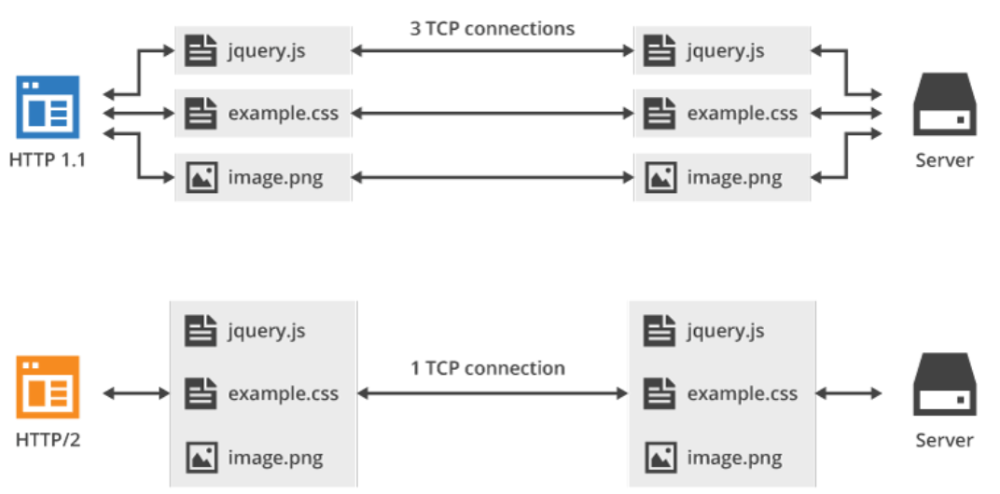

#### HTTP/2.0和HTTP/3.0的区别

- **传输协议**：HTTP/2.0 是基于 TCP 协议实现的，HTTP/3.0 新增了 QUIC（Quick UDP Internet Connections） 协议来实现可靠的传输，提供与 TLS/SSL 相当的安全性，具有较低的连接和传输延迟。可以将 QUIC 看作是 UDP 的升级版本，在其基础上新增了很多功能比如加密、重传等等。HTTP/3.0 之前名为 HTTP-over-QUIC，从这个名字中我们也可以发现，HTTP/3 最大的改造就是使用了 QUIC。
- **连接建立**：HTTP/2.0 需要经过经典的 TCP 三次握手过程（由于安全的 HTTPS 连接建立还需要 TLS 握手，共需要大约 3 个 RTT）。由于 QUIC 协议的特性（TLS 1.3，TLS 1.3 除了支持 1 个 RTT 的握手，还支持 0 个 RTT 的握手）连接建立仅需 0-RTT 或者 1-RTT。这意味着 QUIC 在最佳情况下不需要任何的额外往返时间就可以建立新连接。
- **队头阻塞**：HTTP/2.0 多请求复用一个 TCP 连接，一旦发生丢包，就会阻塞住所有的 HTTP 请求。由于 QUIC 协议的特性，HTTP/3.0 在一定程度上解决了队头阻塞（Head-of-Line blocking, 简写：HOL blocking）问题，一个连接建立多个不同的数据流，这些数据流之间独立互不影响，某个数据流发生丢包了，其他数据流不受影响（本质上是多路复用+轮询）。
- **错误恢复**：HTTP/3.0 具有更好的错误恢复机制，当出现丢包、延迟等网络问题时，可以更快地进行恢复和重传。而 HTTP/2.0 则需要依赖于 TCP 的错误恢复机制。
- **安全性**：HTTP/2.0 和 HTTP/3.0 在安全性上都有较高的要求，支持加密通信，但在实现上有所不同。HTTP/2.0 使用 TLS 协议进行加密，而 HTTP/3.0 基于 QUIC 协议，包含了内置的加密和身份验证机制，可以提供更强的安全性。

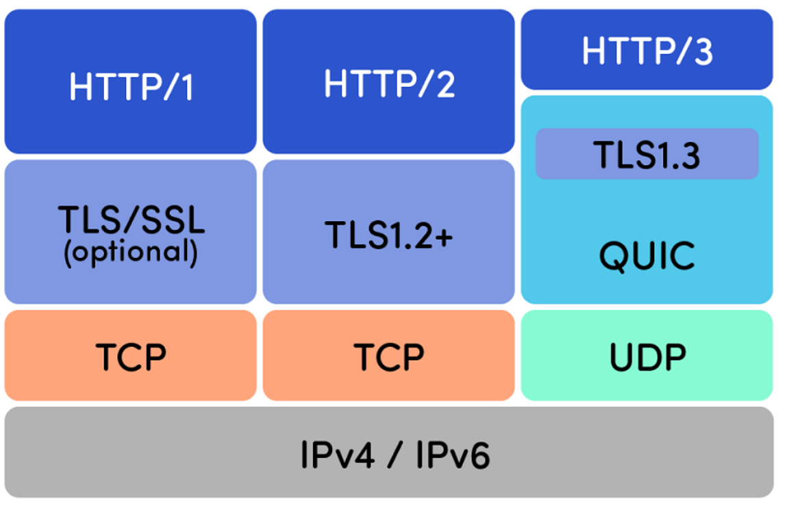

## 2. FTP

FTP是文件传输协议(File Transfer Protocol)，其作用是提供不同主机间进行文件传输的能力，但要注意FTP采用的是C/S架构（并不是P2P架构），传输层协议使用TCP。

对于一个请求会话，FTP会建立一个**TCP控制连接**（默认端口号21），该连接会贯穿整个会话，用于传输FTP的控制命令；除此之外，当开始进行数据传输时，FTP会再建立一个**TCP数据连接**（默认端口号20），用于传输文件数据，而在传输完毕后就会立即关闭该数据连接。

> 注意：FTP 是一种不安全的协议，因为它在传输过程中不会对数据进行加密。建议在传输敏感数据时使用更安全的协议，如 SFTP。

## 3. 电子邮件系统

### 3.1 简介

因特网电子邮件系统有三个核心组件：

- 用户代理：例如用户的浏览器
- 邮件服务器：用户的邮箱就在邮件服务器上
- SMTP（简单邮件发送协议，Simple Mail Transfer Protocol）

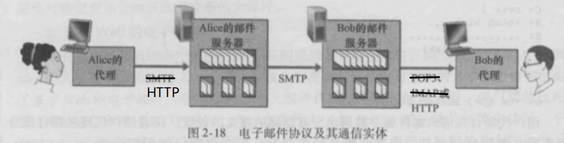

一个典型的基于Web的电子邮件发送过程为：

1. 发送方通过用户代理，使用**HTTP协议**将邮件发送到发送方的邮件服务器中
2. 发送方的邮件服务器再使用**SMTP协议**，将邮件传输到接收方的邮件服务器中
3. 接收方通过用户代理，使用**HTTP协议**从接收方的邮件服务器中读取邮件

> 注意：如果不是基于Web浏览器的电子邮件系统，上述过程1会使用SMTP协议，上述过程3会使用POP3协议或IMAP协议进行邮件接收，如上图所示。

### 3.2 简单邮件发送协议

**SMTP（简单邮件发送协议）**基于 TCP 协议，是一种用于发送电子邮件的应用层协议（默认端口号为25）。

> 注意：SMTP 协议只负责邮件的发送，而不是接收。要从邮件服务器接收邮件，需要使用 POP3 或 IMAP 或 HTTP 协议。

### 3.3 邮件接收协议

**POP3/IMAP（邮件接收协议）**：基于 TCP 协议，两者都是负责邮件接收的协议。IMAP 协议是比 POP3 更新的协议，它在功能和性能上都更加强大，几乎所有现代电子邮件客户端和服务器都支持 IMAP。

## 4. DNS

### 4.1 DNS简介

域名系统（DNS，Domain Name System）是一个由分层的DNS服务器实现的分布式数据库，也是一个能让主机查询分布式数据库的应用层协议。

DNS默认端口号为53，使用的传输层协议一般是UDP（也可以是TCP），DNS通常被其他应用层协议使用，比如HTTP等。DNS的主要作用就是提供**主机名到IP地址的转换**。

像`www.baidu.com`这样的就是域名，其中com是顶级域名，baidu是二级域名，www是三级域名。以此类推，最左边的是级别最低的域名。而顶级域名，通常只有以下三类：

- 国家顶级域名：如.cn表示中国
- 通用顶级域名：.com(公司)、.net(网络服务机构)、.org(非营利性组织)、.gov(国家或政府部门)等
- 基础结构域名：只有.arpa一个，用于反向域名解析，因此又称反向域名

### 4.2 分层DNS服务器

DNS服务器采用层次式组织，并且分布在全世界范围内，大致分为三种DNS服务器：

- **根DNS服务器**：目前全世界一共有13个组织管理的约600多个根DNS服务器，它们用于提供顶级域DNS服务器的IP地址
- **顶级域DNS服务器**：根据顶级域名，提供对应的权威DNS服务器的IP地址
- **权威DNS服务器**：提供主机名到IP地址的映射，也可能提供更下层权威DNS服务器的IP地址

除了以上三种官方的DNS服务器，还有一种很重要的DNS服务器，称为**本地DNS服务器**，它通常就邻近用户主机所在的网络，每个 ISP（互联网服务提供商）都有一个自己的本地 DNS 服务器。本地DNS服务器起着代理的作用，当用户主机发起DNS请求时，该请求会首先发送到本地DNS服务器，然后再由本地DNS服务器与上述三种官方的DNS服务器进行通信。

在所有DNS服务器中会存储资源记录（RR，Resource Record），每条资源记录的格式为`(name, value, type, ttl)`，其中ttl是该记录的生存时间，而name和value的值取决于type，type主要有以下几种类型：

- 若`type=A`，则`name`是主机名，`value`是对应的IP地址
- 若`type=NS`，则`name`为域，`value`为该域对应的权威DNS服务器的主机名

> 例如，在一台顶级域DNS服务器中，首先会有一条关于顶级域名`com`的NS记录，其value值指出了对应的权威DNS服务器的主机名为`dns.com`；其次，还会有一条关于主机名`dns.com`的A记录，其value值指出了该主机名对应的IP地址是`xxx.xxx.xxx.xxx`

### 4.3 DNS的工作流程

当我们想要访问`www.baidu.com`时，首先就需要通过DNS来得到该主机名对应的IP地址，具体流程如下：

1. 首先查询用户主机里的DNS缓存，如果有`www.baidu.com`对应的IP，就直接返回。如果没有，就将请求转发到本地DNS服务器。
2. 本地DNS服务器也首先查询自己的DNS缓存，如果有`www.baidu.com`对应的IP，就直接返回并响应给用户。如果没有，则接下来全部由该本地DNS服务器来执行以下流程。
3. 本地DNS服务器首先请求根DNS服务器，得到顶级域DNS服务器的IP地址
4. 本地DNS服务器再请求该顶级域DNS服务器，根据顶级域名com得到对应的权威DNS服务器`dns.com`的IP地址
5. 本地DNS服务器再请求`dns.com`这一权威DNS服务器，如果其中保存了`www.baidu.com`对应的IP地址，就直接返回并响应给用户。如果没有保存，则其中应该保存了更下层权威DNS服务器`dns.baidu.com`的IP地址。
6. 本地DNS服务器再请求`dns.baidu.com`这一权威DNS服务器，其中保存了`www.baidu.com`对应的IP地址，于是直接返回并响应给用户。

> 注意：除了将解析得到的IP地址响应给用户以外，也会在本地DNS服务器和用户主机中保存该映射关系，即DNS缓存，通常该缓存的过期时间为两天。

### 4.4 DNS报文

以上通过网络查询DNS记录的请求，其实发送的都是DNS报文。DNS报文分为DNS查询报文和DNS回答报文，两者的结构相同：

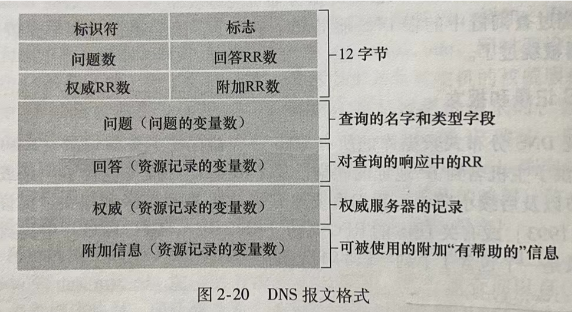

- 前12字节为首部区域。标识符是一个用来标识该查询的16比特数，该标识符会被复制到相应的回答报文里，以便匹配请求和回答；标志字段有若干标志，用来指出报文的类型（查询还是回答）、是否是所请求名字的权威DNS服务器等；首部中还有4个有关数量的字段，用来指示首部后的4类数据区域出现的数量；
- 问题区域包含了正在进行的查询信息，包括名字字段(正在被查询的主机名)、类型字段(A、NS等)；
- 回答区域包含了对最初请求的名字的资源记录，回答报文的回答区域可以包含多条资源记录，因此一个主机名能有多个IP地址；
- 权威区域包含了其他权威服务器的信息；
- 附加区域包含了其它有帮助的记录

## 5. WebSocket

### 5.1 简介

WebSocket 是一种**基于TCP连接的全双工通信协议**，即客户端和服务器可以同时发送和接收数据。WebSocket协议在 2008 年诞生，2011年成为国际标准，几乎所有主流较新版本的浏览器都支持该协议。不过，WebSocket不仅能在基于浏览器的应用程序中使用，很多编程语言、框架和服务器都提供了 WebSocket 支持。

WebSocket 协议本质上是应用层的协议，用于弥补 HTTP 协议在持久通信能力上的不足。客户端和服务器仅需一次握手，两者之间就直接可以创建持久性的连接，并进行双向数据传输。

WebSocket 的常见应用场景：

- 视频弹幕
- 实时消息推送
- 实时游戏对战
- 多用户协同编辑
- 社交聊天

### 5.2 WebSocket与HTTP的区别

WebSocket 和 HTTP 两者都是基于 TCP 的应用层协议，都可以在网络中传输数据。下面是二者的主要区别：

- WebSocket 是一种**双向实时通信协议**，而 HTTP 是一种**单向通信协议**。并且，HTTP 协议下的通信只能由客户端发起，服务器无法主动通知客户端。
- WebSocket 使用 `ws://` 或 `wss://`（使用 SSL/TLS 加密后的协议，类似于 HTTP 和 HTTPS 的关系） 作为协议前缀，HTTP 使用 `http://` 或 `https://` 作为协议前缀。
- WebSocket 可以支持扩展，用户可以扩展协议，实现部分自定义的子协议，如支持压缩、加密等。
- WebSocket 通信数据格式比较轻量，用于协议控制的数据包头部相对较小，网络开销小，而 HTTP 通信每次都要携带完整的头部，网络开销较大（不过 HTTP/2.0 使用二进制帧进行数据传输，还支持头部压缩，减少了网络开销）。

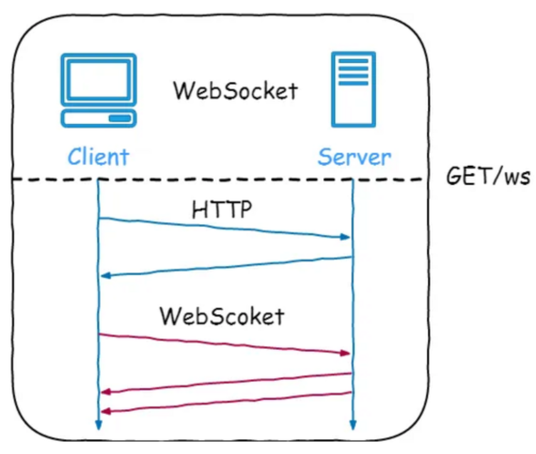

### 5.3 WebSocket的工作过程

1. 客户端向服务器发送一个 HTTP 请求，请求头中包含 `Upgrade: websocket` 和 `Sec-WebSocket-Key` 等字段，表示要求升级协议为 WebSocket；
2. 服务器收到这个请求后，会进行升级协议的操作，如果支持 WebSocket，它将回复一个 HTTP 101 状态码，响应头中包含 ，`Connection: Upgrade` 和 `Sec-WebSocket-Accept: xxx` 等字段、表示成功升级到 WebSocket 协议。
3. 客户端和服务器之间建立了一个 WebSocket 连接，可以进行双向的数据传输。数据以帧（frames）的形式进行传送，WebSocket 的每条消息可能会被切分成多个数据帧（最小单位）。发送端会将消息切割成多个帧发送给接收端，接收端接收消息帧，并将关联的帧重新组装成完整的消息。
4. 客户端或服务器可以主动发送一个关闭帧，表示要断开连接。另一方收到后，也会回复一个关闭帧，然后双方关闭 TCP 连接。

> 另外，建立 WebSocket 连接之后，会通过心跳机制来保持 WebSocket 连接的稳定性和活跃性。


# 第3章_运输层

## 1. 运输层简介

### 1.1 简介

运输层协议为不同主机上的**进程**之间提供逻辑通信，即端到端的通信（端指的是端口）。所以运输层协议是在主机中实现的，而并不是在路由器中实现的。

运输层从应用进程的套接字中接收来自应用层的报文，并添加首部生成运输层**报文段**，然后将其交给这台主机的网络层，由网络层进行两台主机间的逻辑通信。

运输层协议主要有以下两种：

- UDP（用户数据报协议，User Datagram Protocol）：提供不可靠、无连接的服务，是一种报式协议
- TCP（传输控制协议，Transmission Control Protocol）：提供可靠、面向连接的服务，是一种流式协议

> 注意：UDP和TCP都提供**数据交付**、**差错检查**的功能，因为这是运输层的最基本作用。除此之外，TCP还额外提供**可靠数据传输**、**流量控制**、**拥塞控制**的功能。

### 1.2 多路复用和多路分解

一个进程可以有一个或多个套接字（socket），套接字相当于进程与外界通信的门户。每个套接字都包含**端口号**的信息，端口号的大小在0-65535之间，其中：

- 0-1023属于周知端口号，它们为特定的socket所有
- 1024-49151属于登记端口号，可以指定分配给微服务应用
- 49152-65535可以临时随机地分配给一些用户进程

在源主机，运输层实际上是从应用进程的套接字中获取报文，然后添加首部生成运输层报文段，这一过程也称为**多路复用**；而在目的主机，运输层会根据报文段中的内容，标识出接收方套接字，然后将该报文段交付给该套接字，这一过程也称为**多路分解**。

### 1.3 UDP套接字

如果应用进程使用的运输层协议是UDP，则在通信时会使用UDP套接字。一个UDP套接字由二元组`(ip, port)`唯一标识，一般客户端的端口号是自动随机分配的，而服务端的端口号是固定的。

所以基于UDP，如果多个用户向同一服务应用发起请求，即这些报文段具有相同的目的ip和目的port，则这些报文段在服务器端将通过同一个socket到达应用程序。

### 1.4 TCP套接字

如果应用进程使用的运输层协议是TCP，则在通信时会使用TCP套接字。一个TCP套接字由四元组`(源ip, 源port, 目的ip, 目的port)`唯一标识。

所以基于TCP，如果多个用户向同一服务应用发起请求，即这些报文段具有相同的目的ip和目的port，但这些报文段在服务器端将通过不同的socket到达应用程序，因为源ip不同。

> 我们可以看到，服务器端的一个应用进程，能够关联多个socket。实际在底层，一般是使用该进程的一个线程，来关联一个socket。

## 2. UDP

### 2.1 UDP简介

UDP（用户数据报协议，User Datagram Protocol），提供不可靠、无连接的服务，是一种报式协议。它的主要特点如下：

1. 无需建立连接，所以**速度更快、开销更小**，适用于实时性要求高的应用，比如视频直播
2. **不保证可靠传输**
3. UDP支持一对一、一对多、多对一、多对多的交互通信
4. UDP是**基于报文**的，也就是不会对应用层的报文进行拆分，而是直接添加UDP首部后就向下交付给网络层。所以应用层要选择合适的报文大小，否则让网络层进行拆分会影响网络层的效率。

> 说明：如果想基于UDP传输又同时保证可靠性，则需要在应用层自主实现可靠性。

### 2.2 UDP报文段

> 人们往往把UDP报文段称为UDP数据报，但我们建议在运输层统一都称为报文段。

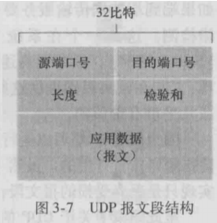

UDP首部只有四个字段，每个字段都占用2个字节，所以UDP首部大小是固定的8字节：

- 源端口号
- 目的端口号
- 长度：UDP报文段的总长度（首部+数据），单位是字节
- 校验和：用于差错检查

> 注意：UDP可以检测差错，但无法恢复差错，所以遇到差错时只能将其丢弃。

## 3. TCP

### 3.1 TCP简介

TCP（传输控制协议，Transmission Control Protocol），提供可靠、面向连接的服务，是一种流式协议。它的主要特点如下：

1. 需要建立连接（逻辑连接），所以速度更慢、开销更大
2. 能够保证**可靠数据传输**
3. TCP仅支持一对一通信，因为一个TCP连接只关联一个发送方和一个接收方，该通信是全双工的
4. TCP是**基于字节流**的，它将应用层报文看成一个字节流，所以可能会拆成多个TCP报文段。TCP报文段的MSS不能太大，因为链路MTU是固定的，像以太网的链路MTU就是1500字节。

> MSS（Maximum Segment Size）指的是报文段中数据字段的最大长度，也就是其中包含的应用层报文的最大长度。
> 
> MTU（Maximum Transmission Unit）指的是链路层帧中数据字段的最大长度，也就是其中包含的IP数据报的最大长度。


补充知识：

- 单工通信：只有一个方向的通信而没有反方向的交互，仅需要一条信道
- 半双工通信：通信的双方都可以发送或接收消息，但任何一方都不能同时发送和接收信息，此时需要两条信道
- 全双工通信：通信双方可以同时发送和接收信息，也需要两条信道

### 3.2 TCP报文段

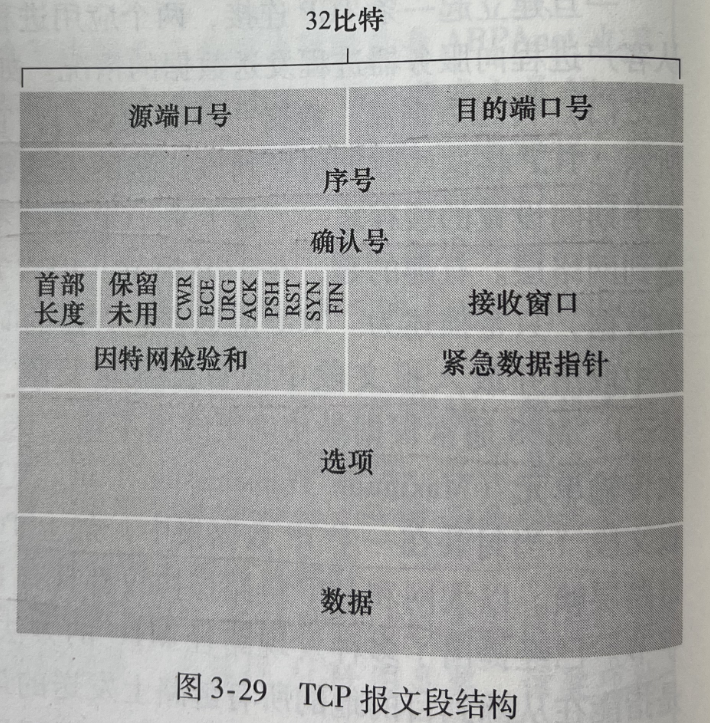

（1）源端口号，目的端口号

（2）序号：TCP将**应用层数据**看作有序的字节流，所以一个报文段的序号就是该报文段**数据字段首字节在字节流中的编号**。例如，第一个报文段的序号为1234（第一个报文段的序号是随机生成的），其包含的应用层数据长度为1000字节，那么下一个报文段的序号就是2234

（3）确认号：指的是**希望从对方主机收到的下一字节的序号**。例如，服务端收到了客户端的一个报文段，其序号是1234，包含的应用层数据长度为1000字节，那么服务端响应客户端的报文段中，确认号就是2234，表明希望收到的下一字节的序号是2234

（4）首部长度：TCP报文段首部的长度，单位是字（一个字等于32比特）。注意，如果没有`选项`字段，则TCP首部长度是固定的20字节，即5个字。

（5）选项：可选字段，可用于窗口调节因子之类的功能，至多长度为40字节。

（6）标志字段：

- CWR和ECE用于明确拥塞通告
- URG=1表示紧急数据指针字段有效。紧急数据指针指出了紧急数据的末尾在报文段中的位置，即从数据部分的首位到紧急数据指针所指的位置为止是紧急数据。
- ACK=1表示确认号字段中的值是有效的
- PSH=1表示接收方应立即将数据交给应用层(而不再等到整个缓存填满后才向上交付)
- RST=1表示TCP连接出现异常必须强制断开连接
- SYN用于建立TCP连接
- FIN用于关闭TCP连接

（7）接收窗口：用于流量控制

（8）校验和：用于差错检查

（9）数据：应用层报文的数据

## 4. TCP连接管理

### 4.1 建立TCP连接：三次握手

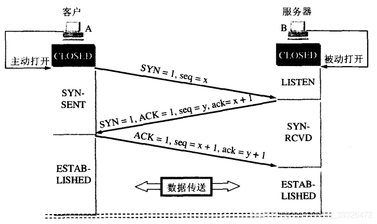

初始状态下，客户端是`CLOSED`状态，服务端是`LISTEN`状态。

（1）客户端向服务端发送**连接请求报文段**，也称为SYN报文段，然后客户端的状态变为`SYN_SENT`。该报文段中：

- `SYN=1`
- `seq=x`，该序号是客户端随机生成的
- 不包含应用层数据

（2）服务端收到SYN报文段后，如果同意建立连接，就为该TCP连接分配缓存和变量，并向该客户端发送**允许连接报文段**，也称为SYNACK报文段，然后服务端的状态变为`SYN_RCVD`。该报文段中：

- `SYN=1`
- `ACK=1`
- `seq=y`，该序号是服务端随机生成的
- `ack=x+1`
- 不包含应用层数据

（3）客户端收到SYNACK报文段后，客户端也要给该TCP连接分配缓存和变量，并再向服务端发送**确认报文段**，然后客户端的状态变为`ESTABLISHED`，当服务端收到该报文段后也进入`ESTABLISHED`状态。该报文段中：

- `SYN=0`
- `ACK=1`
- `seq=x+1`
- `ack=y+1`
- 可以携带应用层数据

以上就完成了**三次握手**的过程，接下来客户端和服务端通信发送的报文段中`SYN=0, ACK=1`。

**注意**：建立TCP连接必须采用三次握手，而不能只采用两次握手。假如只采用两次握手，可能发生以下情况：

1. 客户端第一次发送SYN报文段，但因为网络堵塞迟迟没有到服务端
2. 客户端迟迟没有等到服务端的响应，于是超时重试，重新又发了SYN报文段
3. 服务端收到了SYN报文段，于是响应SYNACK报文段。由于是两次握手，服务端就直接进入了`ESTABLISHED`状态准备通信。
4. 客户端接下来与服务端通信，通信完成后关闭TCP连接
5. 此时客户端第一次发送的SYN报文段终于到达了服务端
6. 服务端收到了SYN报文段，于是响应SYNACK报文段，并再次进入`ESTABLISHED`状态准备通信
7. 而客户端早已进入`CLOSED`状态，所以服务端只能在那一直等待通信，浪费连接资源。

### 4.2 关闭TCP连接：四次挥手

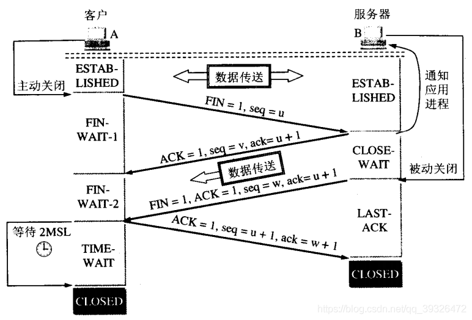

通信状态下，客户端和服务端都是`ESTABLISHED`状态。关闭TCP连接的请求由客户端和服务端都能主动发起，这里不妨假设由客户端发起。

（1）客户端向服务端发送**连接释放报文段**，然后客户端的状态变为`FIN_WAIT_1`。该报文段中：

- `FIN=1`
- `seq=u`，其中`u-1`是之前客户端向服务端发送数据的最后一个字节的序号
- 不包含应用层数据

（2）服务端收到连接释放报文段后，就向客户端发送**连接释放应答报文段**，然后服务端进入`CLOSE_WAIT`状态。该报文段中：

- `ACK=1`
- `seq=v`，其中`v-1`是之前服务端向客户端发送数据的最后一个字节的序号
- `ack=u+1`
- 不包含应用层数据

（3）客户端收到连接释放应答报文段后，进入`FIN_WAIT_2`状态，等待服务端发送连接释放请求。

（4）服务端此时还可以向客户端发送数据（但客户端显然不能向服务端发送数据了）。当服务端发送完所有数据后，就向客户端发送**连接释放请求**，然后服务端进入`LAST_ACK`状态。该报文段中：

- `FIN=1`
- `ACK=1`
- `seq=w`，其中`w-1`是之前服务端向客户端发送数据的最后一个字节的序号
- `ack=u+1`
- 不包含应用层数据

（5）客户端收到连接释放请求后，向服务端发送**确认应答**，该报文段中：

- `ACK=1`
- `seq=u+1`
- `ack=w+1`
- 不包含应用层数据

（6）然后客户端进入`TIME_WAIT`状态，该状态会持续2MSL(两个最长报文段寿命)时间，约30秒，若该时间段内没有收到服务端发来的新请求，则客户端就最终进入了`CLOSED`状态。

（7）服务端收到客户端的确认应答后，也进入`CLOSED`状态或者`LISTEN`状态。

以上就完成了**四次挥手**的过程，关闭了TCP连接。

**注意**：客户端需要进入`TIME_WAIT`状态的30秒等待时间，而不是直接进入`CLOSED`状态，原因在于：如果该客户端向服务端发送的确认应答丢失，则服务端等待超时后会重发**连接释放请求**，但客户端已经关闭，无法作出任何响应，从而就导致了服务端永远无法正常关闭。

## 5. TCP可靠数据传输

TCP采用超时重传、累计确认等技术来实现可靠数据传输，每条TCP连接的双方，都会各自维护一个重传定时器和一个发送窗口（发送缓存）。具体机制如下：

- 当TCP从应用层收到报文后，会将其保存到发送缓存中，然后将其封装在报文段中并交给网络层进行发送，同时重启定时器并设置超时时长。
- 当定时器超时后，TCP就会取出发送窗口中`已发送但未被确认`的**序号最小**的数据，重新封装成报文段后进行重传，同时重启定时器并设置**加倍**的超时时长。
- 当收到ACK报文段后，根据其中的确认号字段，TCP更新发送窗口中尚未确认的序号，如果当前还有未被确认的数据，则重启定时器并设置超时时长。

注意：TCP接收方根据序号字段，能保证收到数据的有序性，并且采用**累积确认**机制。例如，假设每个报文段数据字段长度都是1000字节，而接收方此时收到序号为0、1000、3000的三个报文段，那么它就会响应一个报文段（收到一个报文段不会立即响应，而是会等待一定时间看看有没有别的报文段到达，这样可以只响应一次），其中的确认号`ack=2000`，表明序号2000之前的内容已经正确收到，接下来希望收到序号为2000的报文段，而接收方已经收到的序号3000的报文段会被缓存起来，并不会丢弃。

常见的超时、丢包情况处理如下：

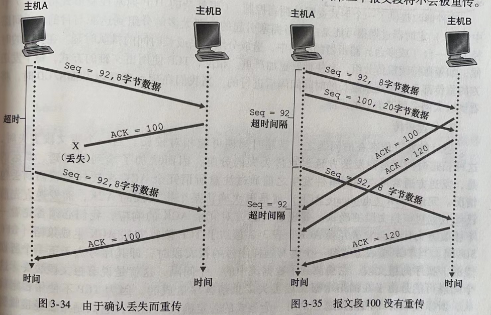

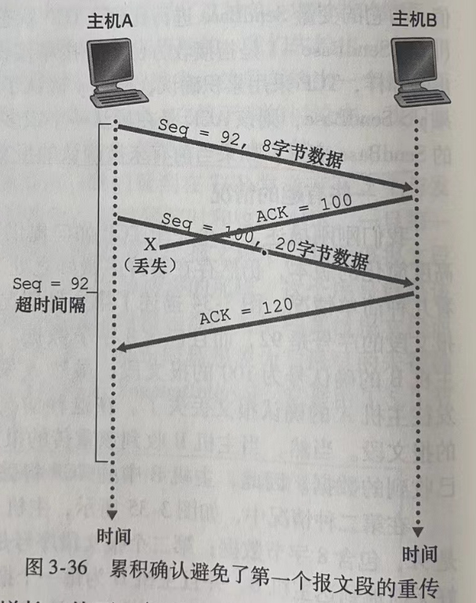

除此之外，TCP还拥有**快速重传**机制。超时触发重传的一个问题就是超时时间可能较长，如果发送方收到了多个冗余ACK（即多个相同的确认号），就说明很可能已经丢包了，需要重传。因此，TCP规定一旦收到3个冗余ACK（即一共收到4个相同的ACK），就立即执行**快速重传**，而无需等到定时器超时再重传。

## 6. TCP流量控制

如果数据流量过大，就可能导致接收方的接收窗口（接收缓存）被占满，因为接收方将数据交付给应用层的速度过慢。此时，TCP的**流量控制**就起到了作用，它是靠TCP首部中的`接收窗口`字段实现的：具体而言，当接收方返回ACK时，会告知发送方，自己剩余的接收窗口大小是多少，这样接收方就可以合理地调整其发送窗口的大小，实现了流量上的控制。

但这样会有一个问题：如果接收方接收缓存已被占满，这时候返回的ACK中`接收窗口`字段的值就是0，那么发送方就不敢再发送数据了，但是我们知道接收方只能在被动收到数据后才能返回ACK，那么如果之后接收方向上交付完数据后接收窗口增大了，又该如何告知发送方让它继续发送数据呢？

事实上，当发送方收到`接收窗口=0`的ACK时，底层会启动一个持续计时器，当计时器超时后就会向接收方发送只有1个字节数据的**零窗口探测报文段**。如果接收方窗口仍为0，则重复上述过程；否则，接收方就可以响应ACK，表明新的接收窗口大小了。

## 7. TCP拥塞控制

> **注意**：我们需要流量控制，是因为接收方的接收窗口大小有限，流量过大就会导致在接收方丢包；而我们需要拥塞控制，则是因为网络链路中的带宽和路由器缓存大小有限，如果网络过于拥堵就会导致在网路链路中丢包。
>
> **总结**：流量控制是作用于接收方的，是为了让接收方来得及接收；拥塞控制是作用于网络的，是为了避免网络负载过大。

TCP实现拥塞控制的方法是，在发送方维护一个变量`拥塞窗口大小`(cwnd)。因此我们得到，发送方的发送窗口大小等于`min{发送方的拥塞窗口大小, 接收方的接收窗口大小}`。

拥塞窗口的大小如何确定，主要取决于TCP拥塞控制算法，该算法包含三个主要部分：慢启动、拥塞避免、快速恢复。慢启动和拥塞避免是必选项；而快速恢复是可选项。

### 7.1 慢启动

刚建立TCP连接时，其cwnd设置为一个MSS。在慢启动模式下，每当收到已传输的报文段的首次确认，cwnd就增加一个MSS。因此在慢启动阶段，cwnd是指数增加的（1,2,4,8,...）

有一个变量`ssthresh`，称为**慢启动阈值**，初始值通常是65535字节，这个变量会决定慢启动模式何时结束。具体规则如下：

- 在慢启动模式下，如果发生了超时事件，就会将`ssthresh`的值修改成当前cwnd的一半，然后将cwnd设置为一个MSS
- 在慢启动模式下，如果收到了3个冗余ACK，TCP就会做一次快速重传，然后结束慢启动模式，进入快速恢复模式
- 在慢启动模式下，如果cwnd增大到`ssthresh`，则会结束慢启动模式，进入拥塞避免模式

### 7.2 拥塞避免

在拥塞避免模式下，每经过一个单位时间（单位时间就是一个往返时延RTT），cwnd就增加一个MSS。所以在拥塞避免模式下，cwnd是线性增加的（9,10,11,12,...）

其他规则如下：

- 在拥塞避免模式下，如果发生了超时事件，就会将`ssthresh`的值修改成当前cwnd的一半，然后将cwnd设置为一个MSS，并且结束拥塞避免模式，进入慢启动模式
- 在拥塞避免模式下，如果收到了3个冗余ACK，TCP就会做一次快速重传，然后结束拥塞避免模式，进入快速恢复模式

### 7.3 快速恢复

进入快速恢复模式后：

1. 首先会将`ssthresh`的值修改成当前cwnd的一半
2. 然后将cwnd的值先减半再加上冗余ACK的数量。例如收到3个冗余ACK引起TCP进入快速恢复阶段，则此时cwnd的值为cwnd/2+3，单位是MSS
3. 然后直接进入拥塞避免模式

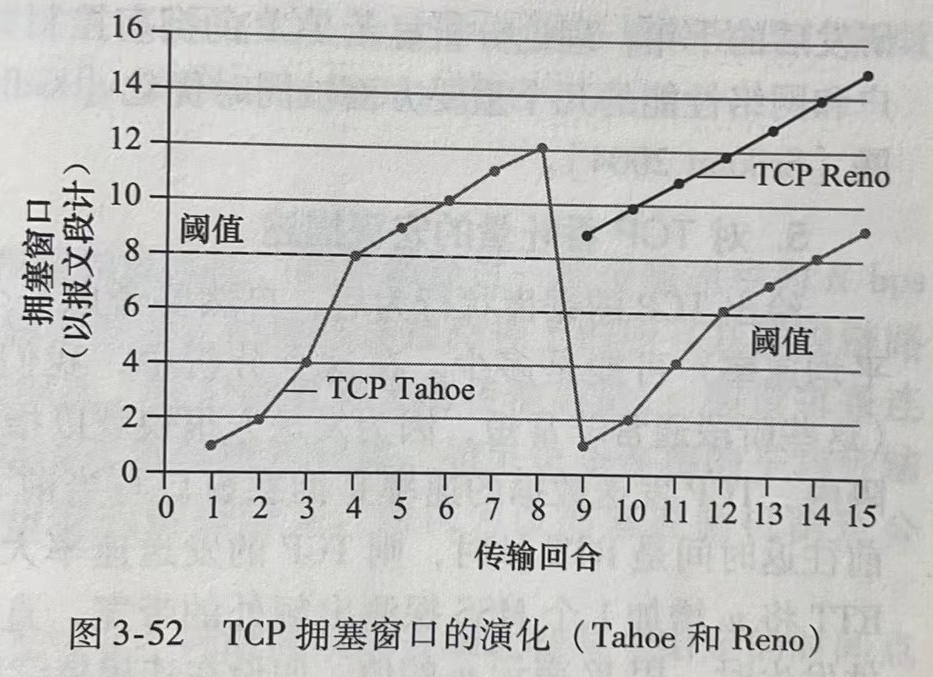

> 注意：快速恢复模式不是必选项，如果TCP的拥塞控制算法中不使用快速恢复模式，那么收到3个冗余ACK的处理方式与超时处理方式相同。如上图所示，Tahoe就不采用快速恢复，而Reno采用了快速恢复。


# 第4章_网络层

## 1. 网络层简介

网络层的作用是将分组从一台发送主机移动到另一台接收主机。网络层的核心协议是IP（Internet Protocol），它只提供尽力而为交付。

网络层最重要的设备是路由器，它具有**转发**和**路由选择**的功能。每个路由器都具有输入接口、路由表、输出接口，当分组到达路由器时会先在输入接口排队，然后根据该分组的目的地址查询路由表（最长前缀匹配规则），找到合适的输出接口进行转发。

## 2. IPv4

### 2.1 IPv4数据报格式

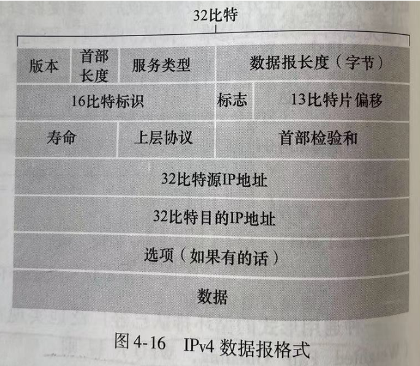

- 版本号：IP协议版本，该字段值始终为4
- 首部长度：以4字节为单位，首部最短长度为20字节，最长为60字节
- 服务类型：IP数据报的类型，一般不使用
- 数据报长度：IP数据报总长度(首部加数据)，以字节为单位
- 标识、标志、片偏移：与IPv4分片相关
- 寿命：寿命(Time-To-Live, TTL)确保数据报不会永远在网络中循环。每被一个路由器处理时，值减1，若值减到0，则丢弃数据报。
- 协议：到达最终目的地才有用，指示了IP数据报的数据部分应该交给哪个协议处理。如6交给TCP，17交给UDP，除此之外还有ICMP(1), IGMP(2), IPv6(41)。
- 首部检验和：对首部进行差错检查，注意每台路由器上必须重新计算检验和，因为像TTL这样的字段会变化。
- 源和目的IP地址
- 选项：允许IPv4首部被扩展，最多40字节
- 数据：包含运输层报文段（TCP或UDP），或ICMP报文段

### 2.2 IPv4数据报分片

由于链路MTU是固定的，像以太网的MTU就是1500字节，所以每个IP数据报的大小不能超过MTU。因此，大的IP数据报就需要进行分片。

> 注意：在每个路由器中都有可能进行IP数据报分片，因为各个路由器之间的链路可能是不一样的，所以MTU也可能会变小。但是，**片的重新组装，只在目的主机中完成**。

数据报首部中与分片相关的字段有`标识`、`标志`、`片偏移`：

- 当源主机封装一个数据报时，会给它设置唯一的`标识`号。如果某路由器需要对该数据报进行分片，则生成的每个分片中`标识`号与源数据报的`标识`号相同。因此，在目的主机进行分片组装时，就知道相同`标识`号的分片应该进行组装。
- `片偏移`字段指的是数据部分的偏移，也就是指示该分片应该放在初始IP数据报的哪个位置。注意，`片偏移`字段以8个字节为单位，所以初始IP数据报的所有分片中，除了最后一个分片，其他分片的数据部分长度一定是8B的整数倍。
- `标志`位占3bit，实际使用的只有后2位。最低位称为`MF`，当`MF=1`时表示后面还有分片，当`MF=0`时表示这是最后一个分片。中间位称为`DF`，只有`DF=0`时才允许分片。

### 2.3 IPv4编址

在全球因特网中的每台主机和路由器上的**每个接口**，都必须有一个全球唯一的IP地址（私有IP地址除外），即IP协议为互联网上的每一台主机都分配一个逻辑地址。IPv4地址一般用点分十进制记法书写，这些地址不能随意选择，一个接口的IP地址的一部分需要由其连接的子网来决定。

> **路由器的一个接口所划分出来的网络，就是一个子网**。如下图所示，有6个子网：

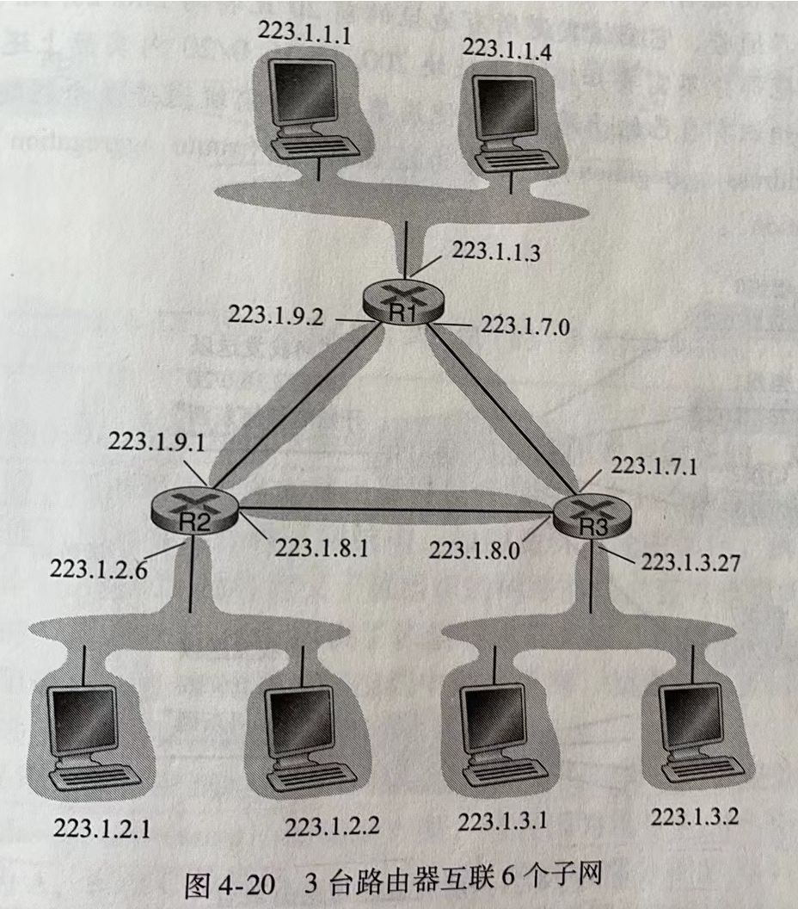

在以前，IPv4采用分类编址的方案，A类、B类、C类地址中表示所属子网的部分分别为固定的8位、16位、24位：

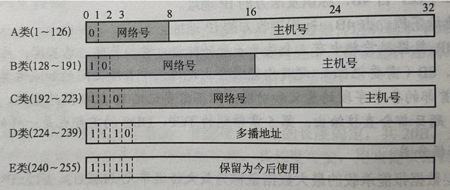

显然，这种方案不够灵活。现在IPv4都采用**无分类编址**(CIDR)的方案，使用类似`223.1.1.3/24`的写法，将IP地址分为`网络部分`和`主机号`。其中`/24`表示子网掩码的前24位为1，即子网掩码为`255.255.255.0`，所以将IP地址与子网掩码按位与，就得到了该IP地址所属的子网就是`223.1.1.0`

**说明**：

- 主机号全0的IP，表示本网络本身
- 主机号全1的IP，表示本网络的广播地址。注意如果是32位全1，也同样表示本网络的广播地址。
- 32位全0的IP，表示本网络上的本主机
- `127.x.x.x`是环回自检地址，目的地址为环回地址的IP数据报永远不会出现在任何网络上。其中最常用的是`127.0.0.1`，本机发送给`127.0.0.1`的数据只会立即发送给本机。
- 其中有一部分IP地址属于私有IP地址，详见NAT

### 2.4 DHCP

对于路由器各个接口的IP地址，通常是由系统管理员手动配置的。但对于我们用户主机的IP地址，更多是**使用DHCP来自动获取**的。

DHCP（动态主机配置协议，Dynamic Host Configuration Protocol）是一个应用层协议，基于UDP。一般每个子网都有一台DHCP服务器，如果没有，就会使用一个路由器来做中间代理，它知道其他网络上的DHCP服务器地址。DHCP的工作流程如下：

1. 当一台新的用户主机加入子网，需要得到其IP地址时，它会广播**DHCP发现报文**(DHCP Discover)，用于发现一个要与其交互的DHCP服务器。该报文中，源地址是`0.0.0.0`，广播地址是`255.255.255.255`
1. 每台DHCP服务器收到DHCP发现报文后，都会响应一个**DHCP提供报文**(DHCP Offer)，该报文仍然是使用广播地址`255.255.255.255`。该报文中，包含给用户主机分配的IP地址、子网掩码、该IP地址租用期等信息。
1. 用户主机会从这些响应的DHCP服务器中选择一个，作为与其交互的DHCP服务器，此时用户主机就得知了自己的IP地址等信息。然后，用户主机会再广播一个**DHCP请求报文**(DHCP Request)，源地址仍是`0.0.0.0`，广播地址是`255.255.255.255`。该报文中，包含用户主机自己的MAC地址、接收分配的IP地址、以及提供该IP的DHCP服务器地址等信息，从而其他未被选中的DHCP服务器就可以及时撤销资源。
1. 当对应的DHCP服务器收到DHCP请求报文后，就可以验证报文中的信息，然后广播一个**DHCP ACK报文**，告知用户已通过验证，可以使用该IP地址了。

> **注意**：DHCP给主机提供的信息，除了IP地址外，还包括子网掩码、该IP地址租用期、默认网关（第一跳路由器地址）、本地DNS服务器地址等。

### 2.5 网络地址转换NAT

> 私有IP地址是为了解决IPv4地址不够用的问题。

我们知道有一部分IPv4地址属于**私有IP地址**，具体为：

- `10.0.0.0~10.255.255.255`
- `172.16.0.0~172.31.255.255`
- `192.168.0.0~192.168.255.255`

这些**私有IP地址仅对当前子网中的设备有意义**。例如在同一个家庭局域网中可以使用私有IP发送分组进行通信，但是这些分组在转发到家庭局域网之外就不能再使用这个私有IP了，因为其他局域网中的设备也可能使用同一个私有IP。所以就需要用到NAT技术。

NAT（网络地址转换，Network Address Translation）技术是通过路由器中的NAT转换表实现的，它对外界隐藏了家庭局域网内的细节。

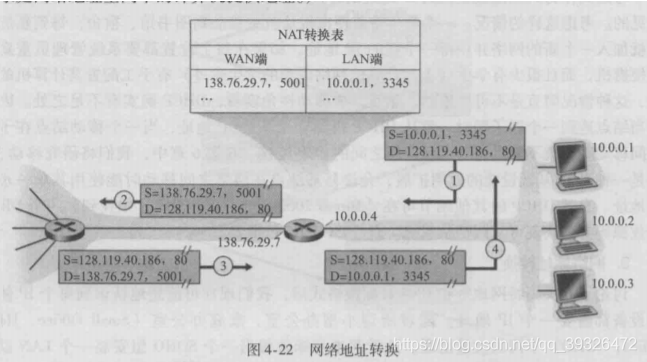

如上图，路由器对外端口的IP地址是`138.76.29.7`，而对内端口的IP地址是`10.0.0.4`（私有IP），假设主机`10.0.0.1`的`3345`端口要请求一个Web页面（目的地址是`128.119.40.186`，目的端口`80`），当路由器收到该数据报后，就会为该数据报生成一个新的源端口号`5001`，将源IP地址修改为`138.76.29.7`，然后在NAT转换表中记录该映射关系，接下来就能与外界通信了。

> 补充：在不同NAT下局域网的两个主机想要直接通信显然是不行的，因为只知道各自的私有IP地址无法通信，所以如果想进行通信，就必须知道自己所在子网的路由器的对外公网端口的IP地址，然后通过公网IP就能进行通信了，这个技术也称为**NAT穿透**。

### 2.6 IP数据报的发送过程

我们首先介绍两个概念：

- 广播域：能够接收同样广播消息的节点集合。由网络层设备（也就是路由器）划分的每个子网就是一个广播域。
- 冲突域：连接到同一物理介质上的所有节点集合。由网络层设备、链路层设备都可以划分冲突域。

IP数据报的发送过程如下：

1. 源主机发送IP数据报时，首先判断目的主机是否与自己在同一个网络：只需将目的IP地址和其子网掩码作按位与即可判断。
2. 如果在同一个网络，就可以直接交付IP数据报；如果目的地址是广播地址，则该广播域内的所有主机都能收到该IP数据报。
3. 如果不在同一个网络，就会将IP数据报发送到源主机所在网络的**默认网关**（第一跳路由器），由默认网关帮忙转发
4. 路由器中的路由表至少有四个字段：`目的网络IP地址`、`子网掩码`、`下一跳IP地址`、`接口`
5. 根据IP数据报中的目的IP地址，与路由表中的`子网掩码`作按位与，如果与`目的网络IP地址`相同，则说明匹配。最后找到**最长匹配**的条目，转发该IP数据报到`下一跳`。

> 说明：路由表中有默认路由（`0.0.0.0/0`），当其他路由都不匹配时会选择默认路由进行转发。路由表中还会有一些主机路由（`IP地址/32`），也就是精确匹配的话就能直接转发到该主机。

## 3. IPv6

### 3.1 IPv6数据报格式

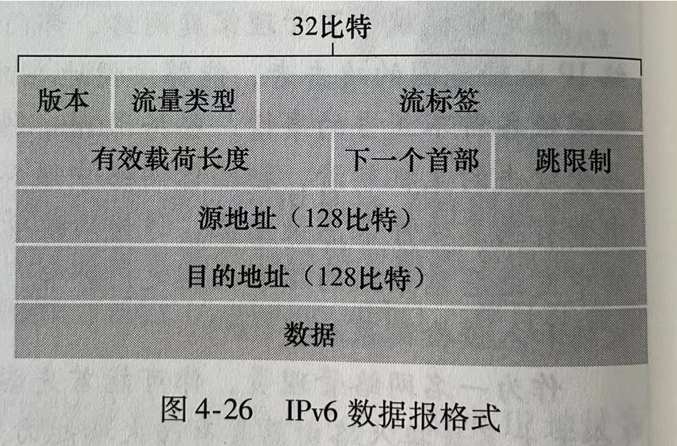

- 版本：IP协议版本，该字段值固定为6
- 流量类型：与IPv4中的TOS字段含义类似
- 流标签：用于标识一条数据报的流
- 有效载荷长度：数据部分的长度，单位字节
- 下一个首部：该字段标识数据报中的内容需要交付给哪个协议(如TCP或UDP)，与IPv4首部中的协议字段相同
- 跳限制：与寿命相同
- 源和目的地址：IP地址长度为128位
- 数据

注意事项：

1. IPv6数据报的首部长度固定为40字节
2. IPv6数据报只能在源主机进行分片，在目的主机进行重新组装。而在中间路由器上，不能分片和重新组装。
3. IPv6地址的书写格式：每4位用一个十六进制数表示并用冒号分隔每16位，例如`4BF5:AA12:0216:FEBC:BA5F:039A:BE9A:2170`

### 3.2 从IPv4到IPv6的迁移

IPv6也是为了解决IPv4地址不够用的问题，但是IPv6目前并未得到广泛应用，原因在于：很多路由器只能处理IPv4数据报，如果想要处理IPv6数据报，则需要使用`双协议栈`或者`搭建隧道`：

- 双协议栈，就是在一台路由器上同时装有IPv4协议栈和IPv6协议栈
- 隧道技术，指的就是在发送端将整个IPv6数据报放入一个IPv4数据报的数据字段中，并在IPv4数据报中的协议号字段设为41，从而指示该IPv4中的数据字段内容是IPv6数据报

## 4. 路由协议

### 4.1 路由选择算法

路由选择算法的目的是从发送方到接收方的过程中确定一条最佳的路径。常见的路由选择算法有以下两种：

#### 1、链路状态路由选择算法

链路状态路由选择算法（LS，Link State）要求每个结点（路由器）都具有**完全的网络拓扑信息**，所以这是一种集中式的路由选择算法。它们执行以下任务：第一，主动测试所有邻接结点的状态；第二，当链路状态发生变化时就会将链路状态传播给所有其他结点。一旦链路状态发生变化，结点就用收到的报文更新自己的网络图，然后采用Dijkstra最短路径算法重新计算路由。LS算法有以下特征：

- 相邻路由器之间会周期性地交换信息
- 只有当链路状态发生变化时，路由器才会将该链路状态信息传播给**一定范围内的其他路由器**。具体而言，就是将信息发送给所有相邻路由器，而它们又再把信息发送给其相邻路由器（不发送给刚刚发来信息的路由器），直到一定范围内的路由器都收到该信息为止。
- 发送的链路状态信息，只是与该路由器相邻的所有路由器的链路状态（标识、距离、费用等），而并不是该路由器知道的完全网络拓扑信息。

> **总结**：LS算法中每个路由器都具有完全的网络拓扑信息，可以根据Dijkstra算法自己计算出最佳路由。OSPF协议采用的就是LS算法。

#### 2、距离向量路由选择算法

距离向量路由选择算法（DV，Distance Vector）是一种分散式的路由选择算法，所有结点都定期地将它们的整个**路由表**传送给所有与之相邻的结点，路由表中包含每条路径的目的地及该路径的代价(距离)。所有结点都监听从其他结点传来的路由选择更新信息，在下列情况下更新自己的路由表：

- 被告知一条新的路由，该路由在本结点的路由表中不存在，此时加入这条新的路由
- 发来的路由信息中有一条到达某个目的地的路由，该路由与当前使用的路由相比，有更小的代价，这种情况下，就用经过发送路由信息的结点的新路由替换路由表中到达那个目的地的现有路由。

> **总结**：DV算法中每个路由器并不具有完全的网络拓扑信息，而是通过分布式地交换信息来将最佳路由保存到路由表中。RIP协议采用的就是DV算法。

### 4.2 自治系统

自治系统(Autonomous System, AS)指的是在同一个管理机构中的所有路由器及其互连的链路。在同一个自治系统内，所有路由器使用的路由协议必须相同，也称为`内部网关协议`，常用的有RIP和OSPF；在两个自治系统之间使用的路由协议称为`外部网关协议`，常用的有BGP。

### 4.3 RIP

路由信息协议(RIP, Routing Information Protocol)是一种分布式的基于距离向量算法的路由协议，它是**应用层协议，使用UDP传送数据**。RIP规定：

- 网络中的每个路由器都要维护从它自身到其他每个目的网络的距离记录。距离也称跳数，规定从一个路由器到直接连接网络的跳数为1。每经过一个路由器，跳数加1。
- RIP允许一条路径最多15跳，当距离等于16时表示网络不可达，这是为了避免环路的情况，可见RIP只适用于小型互联网。
- 路由选择更新信息在邻居之间每30秒交换一次。

每个路由表条目有三个关键数据：`目的网络N`，`距离d`，`下一跳路由器地址X`。具体的距离向量算法如下：

1. 对于**相邻路由器X**发来的RIP报文，将报文中下一跳字段都改为X，并把所有距离字段加1
2. 对修改后的RIP报文中的每个项目，执行如下步骤：
   - 如果原路由表中没有目的网络N，就把该项目添加到路由表中；
   - 如果原路由表中有目的网络N，且下一跳路由器地址就是X时，用收到的项目替换原路由表中的项目；
   - 如果原路由表中有目的网络N，且下一跳路由器地址不是X时，如果收到的项目中的距离d小于路由表中的距离，那么就用收到的项目替换原路由表中的项目；否则什么也不做。
3. 如果180秒还没有收到相邻路由器的更新路由表，就将此相邻路由器标记为不可达，即把距离设置为16

> 注意RIP会出现**坏消息传得慢**的现象，例如y到x的距离是1，z到y的距离1，于是z可通过y到x，故z到x的距离是2，此时若x出现故障导致y到x的距离是16，y和z会彼此交换信息，z先将已过时的信息(z到x距离为2)告知y，于是y相应更新y到x的距离为3(但实际并非如此，因为z原本是通过y才到x的)，然后y再将该信息告知z，于是z相应更新z到x的距离为4，然后一直重复该流程，经过很长时间后才会达到y到x的距离是16。

### 4.4 OSPF

OSPF(开放路径最短优先协议)基于链路状态路由选择算法，它是**运输层协议，基于IP数据报传送数据**。注意每台路由器虽然使用Dijkstra算法计算出完整的最优路径，但路由表中不会存储完整路径，而只存储下一跳路由器的地址。一个自治系统可以分为多个小范围，而OSPF在链路状态发生变化时就会将信息发送给当前小范围内的所有路由器，所以OSPF能够用于大规模的网络。

### 4.5 BGP

边界网关协议(BGP, Border Gateway Protocol)是不同自治系统之间的路由协议，它是**应用层协议，基于TCP**。BGP的工作原理如下：每个自治系统的管理员要选择至少一个路由器作为该自治系统的网关路由器（位于AS边缘的路由器），一个网关路由器与其他自治系统中的网关路由器要交换路由信息，必须先建立TCP连接，网关路由器相互交换网络可达性信息后就能找出较好的路由。网关路由器只和相邻的网关路由器交换信息，首次交换时交换整个路由表，以后则只交换有变化的部分。

## 5. ICMP

### 5.1 简介

因特网控制报文协议（ICMP，Internet Control Message Protocol）被主机和路由器用来彼此沟通网络层的信息，其最典型的用途是**差错报告**。例如"目的网络不可到达"这种错误就是通过ICMP封装的，IP路由器找不到路径通往指定主机，该路由器就向发送主机发出ICMP报文指示错误。

ICMP通常被认为是IP的一部分，但从体系结构上来讲它是位于IP之上的，因为ICMP报文是承载在IP分组中的，也就是说，**ICMP报文是作为IP有效载荷承载的**。

ICMP报文格式如下：

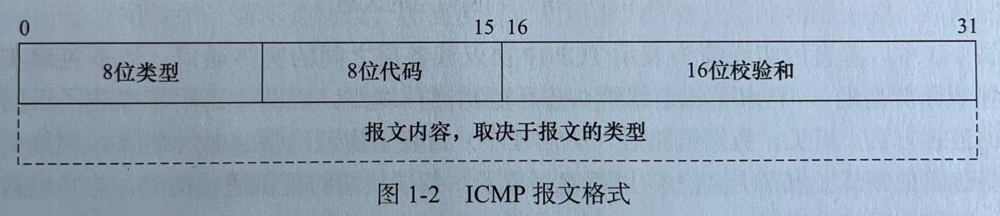

ICMP报文有两种类型：ICMP差错报告报文、ICMP查询报文

### 5.2 ICMP差错报告报文

主要有以下5种类型：
- 终点不可达(3)：当路由器或主机不能交付数据报时，就向源点发送终点不可达报文
- 源点抑制：当路由器或主机由于拥塞而丢弃数据报时，就向源点发送源点抑制报文，使源点知道应当把数据报的发送速率放慢
- 时间超过：当路由器对收到的数据报TTL减一后等于0时，除丢弃该数据报外，还要向源点发送时间超过报文。当终点在预先规定的时间内不能收到一个数据报的全部数据报片时，就把已收到的数据报片都丢弃，并向源点发送时间超过报文。
- 参数问题：当路由器或目的主机收到的数据报的首部中有的字段的值不正确时，就丢弃该数据报，并向源点发送参数问题报文。
- 改变路由(重定向)(5)：路由器把改变路由报文发送给主机，让主机知道下次应将数据报发送给另外的路由器。

以下情况不应发送ICMP差错报告报文：
- 对ICMP差错报告报文不再发送ICMP差错报告报文
- 对第一个分片的数据报片的所有后续数据报片都不发送ICMP差错报告报文
- 对具有多播地址的数据报都不发送ICMP差错报告报文
- 对具有特殊地址（如127.0.0.0或0.0.0.0）的数据报不发送ICMP差错报告报文

### 5.3 ICMP查询报文

主要有4种类型：回送请求和回答报文、时间戳请求和回答报文、地址掩码请求和回答报文、路由器询问和通告报文。

### 5.4 ICMP的常见应用

#### 1、PING命令

PING 命令是一种常用的网络诊断工具，经常用来测试网络中主机之间的连通性和网络延迟。

```sh
C:\Users\wsy>ping www.baidu.com

正在 Ping www.a.shifen.com [182.61.200.7] 具有 32 字节的数据:
来自 182.61.200.7 的回复: 字节=32 时间=203ms TTL=51
来自 182.61.200.7 的回复: 字节=32 时间=23ms TTL=51
来自 182.61.200.7 的回复: 字节=32 时间=17ms TTL=51
来自 182.61.200.7 的回复: 字节=32 时间=23ms TTL=51

182.61.200.7 的 Ping 统计信息:
    数据包: 已发送 = 4，已接收 = 4，丢失 = 0 (0% 丢失)，
往返行程的估计时间(以毫秒为单位):
    最短 = 17ms，最长 = 203ms，平均 = 66ms
```

PING 命令的输出结果通常包括以下几部分信息：

1. **ICMP Echo Request（请求报文）信息**：序列号、TTL值。
2. **目标主机的域名或 IP 地址**：输出结果的第一行。
3. **往返时间（RTT）**：从发送 ICMP Echo Request（请求报文）到接收到 ICMP Echo Reply（响应报文）的总时间，用来衡量网络连接的延迟。
4. **统计结果（Statistics）**：包括发送的 ICMP 请求数据包数量、接收到的 ICMP 响应数据包数量、丢包率、往返时间（RTT）的最小、平均、最大值。

如果 PING 对应的目标主机无法得到正确的响应，则表明这两个主机之间的连通性存在问题（有些主机或网络管理员可能禁用了对 ICMP 请求的回复，这样也会导致无法得到正确的响应）。如果往返时间（RTT）过高，则表明网络延迟过高。

**PING命令的工作原理**：

PING 基于网络层的 **ICMP**，其主要原理就是通过在网络上发送和接收 ICMP 报文实现的。PING 用到的 ICMP Echo Request（类型为 8 ） 和 ICMP Echo Reply（类型为 0） 属于**ICMP查询报文**类型 ：

- PING 命令会向目标主机发送 ICMP Echo Request。
- 如果两个主机的连通性正常，目标主机会返回一个对应的 ICMP Echo Reply。

#### 2、Traceroute

Traceroute用来跟踪分组经过的路由，它使用了ICMP时间超过报文，具体而言，分别使用`TTL=1, TTL=2, ...`的报文来测试分组经过的路由

## 6. IGMP

### 6.1 组播(多播)

组播是让源主机一次发送的单个分组可以抵达用一个组地址标识的若干目标主机，并被它们正确接收。组播基于UDP。

因特网中的IP组播使用组播组的概念，每个组都有一个特别分配的地址，要给该组发送数据的主机将使用这个地址作为分组的目标地址。目的主机使用IGMP加入组播组。

IP组播使用D类地址格式，每个D类IP地址标志一个组播组。IP组播数据报的首部中协议字段值是2，表明使用IGMP。注意：
- 组播数据报也是尽最大努力交付，不提供可靠交付
- 组播地址只能用于目的地址，而不能用于源地址
- 对组播数据报不产生ICMP差错报文
- 并非所有的D类地址都可作为组播地址

### 6.2 IGMP和组播路由算法

要使路由器知道组播组成员的信息，需要利用因特网组管理协议（IGMP, Internet Group Management Protocol）。连接到局域网上的组播路由器还必须和因特网上的其他组播路由器协同工作，以便把组播数据报用最小代价传送给所有组成员，这就需要使用组播路由算法。注意：
- IGMP并不是在因特网范围内对所有组播组成员进行管理的协议
- IGMP不知道IP组播组包含的成员数，也不知道这些成员分布在哪些网络上
- IGMP让连接到本地局域网上的组播路由器知道本局域网上是否有主机参加或退出了某个组播组

IGMP应视为网际协议IP的一个组成部分，其工作可分为两个阶段：
- 第一阶段：当某台主机加入新的组播组时，该主机应向组播组的组播地址发送一个IGMP报文，声明自己要成为该组的成员。本地的组播路由器收到IGMP报文后，将组成员关系转发给因特网上的其他组播路由器。
- 第二阶段：因为组成员关系是动态的，本地组播路由器要周期性地探询本地局域网上的主机，以便知道这些主机是否仍继续是组的成员。只要对某个组有一台主机响应，那么组播路由器就认为这个组是活跃的。但一个组在经过几次的探询后仍然没有一台主机响应时，则不再将该组的成员关系转发给其他的组播路由器。

组播路由选择实际上就是要找出以源主机为根节点的组播转发树，其中每个分组在每条链路上只传送一次(即在组播转发树上的路由器不会收到重复的组播数据报)。不同的组播组对应于不同的组播转发树；同一个组播组，对不同的源点也会有不同的组播转发树。(实际上，IP广播也采用类似的算法，构造最小生成树来进行广播，从而避免广播风暴以及冗余广播分组的传输)

## 7. 移动IP

### 7.1 移动IP的概念

支持移动性的因特网体系结构与协议共称为移动IP，它是为了满足移动结点在移动中保持其连接性而设计的。更确切地说，移动IP技术是指移动结点以固定的网络IP地址实现跨越不同网段的漫游功能，并保证基于网络IP的网络权限在漫游过程中不发生任何改变。基于IPv4的移动IP定义三种功能实体：移动结点、归属代理(本地代理)、外部代理。
- 本地代理：在一个网络环境中，一个移动结点的永久居所被称为归属网络，在归属网络中代表移动结点执行移动管理功能的实体称为归属代理，它根据移动用户的转交地址，采用隧道技术转交移动结点的数据包
- 外部代理：移动结点当前所在网络叫作外部网络，在外部网络中帮助移动结点完成移动管理功能的实体称为外部代理

> 注意移动IP与动态IP不同，动态IP指的是局域网中的计算机可以通过网络中的DHCP服务器动态地获得一个IP地址。

### 7.2 移动IP通信过程

在移动IP中，每个移动结点都有一个唯一的**本地地址(永久地址)**，当移动结点移动时，它的本地地址是不变的，在外部网络链路上每个移动结点还必须有一个外部代理来为它维护当前的位置信息，这就需要引入转交地址。当移动结点连接到外部网络链路上时，**转交地址**就用来标识移动结点现在所处的位置。移动结点的本地地址与当前转交地址的联合称为**移动绑定**，简称绑定。当移动结点得到一个新的转交地址时，通过绑定向本地代理进行注册，以便让本地代理即时了解移动结点的当前位置。移动IP技术的基本通信流程如下：
1. 移动结点在本地网络时，按传统的TCP/IP方式进行通信
2. 移动结点漫游到一个外地网络时，仍然使用固定的本地IP地址进行通信。为了能够收到其他主机发给它的IP分组，移动结点需要向本地代理注册当前的位置地址，这个地址就是转交地址
3. 本地代理接收来自转交地址的注册后，会构建一条通向转交地址的隧道，将收到的发给移动结点的IP分组通过隧道送到转交地址处
4. 在转交地址处解除隧道封装，恢复原始IP分组，最后送到移动结点，这样移动结点在外网就能够收到这些发送给它的IP分组
5. 移动结点在外网通过外网的路由器或外部代理可以直接向其他主机**发送IP数据报**(使用自己的永久地址作为源地址)，而**无需再通过本地代理迂回发送数据**
6. 移动结点来到另一个外网时，只需向本地代理更新注册的转交地址，就可继续通信
7. 移动结点回到本地网时，移动结点向本地代理注销转交地址，这时移动结点又将使用传统的TCP/IP方式进行通信


# 第5章_数据链路层

## 1. 数据链路层简介

数据链路层的作用是将分组通过**单一通信链路**从一个节点移动到相邻节点。数据链路层是在**网络适配器**中实现的，也称为**网络接口卡、网卡**。

数据链路层最重要的设备是**交换机**，其作用是对一个帧进行**转发**或**丢弃**，借助于交换机表实现。交换机表中的一个表项至少包含`MAC地址`、`通向该MAC地址的交换机接口`、`TTL`。当交换机的x接口收到一个目的MAC地址时，就查询交换机表：

- 如果表中没有该MAC地址的表项，此时交换机向除接口x外的所有接口转发该帧的副本
- 如果表中有该MAC地址的表项，且对应表项接口就是x，此时直接丢弃该帧
- 如果表中有该MAC地址的表项，且对应表项接口不是x，此时交换机就向该接口转发该帧

> 注1：交换机中的交换机表，以及路由器中的路由表，都是慢慢自动生成的，无需管理员手动设置。交换机表通过`自学习`的方式自动生成，而路由表通过`路由选择算法`的方式自动生成。
>
> 注2：**交换机没有MAC地址，更没有IP地址**，它纯粹只是一个转发数据的中转站。而**路由器的每个接口，都有IP地址和MAC地址**。

## 2. 多路访问链路和协议

有两种类型的网络链路：**点对点链路**和**广播链路**

- 点对点链路由链路一端的单个发送方和链路另一端的单个接收方组成
- 广播链路能够让多个发送和接收节点都连接到相同的共享广播信道，当任何一个节点传输一个帧时，信道广播该帧，每个其他节点都收到一个副本，**以太网和无线局域网**就是广播链路层技术的例子。

对于广播链路，如何协调多个发送和接收节点对一个共享广播信道的访问，这就是多路访问问题。节点会通过**多路访问协议**来规范它们在共享的广播信道上的传输行为。多路访问协议有以下几种：

### 2.1 信道划分协议

频分多路复用(FDM)：FDM将传输速率R bps的信道划分为不同的频段(每个频段具有R/N带宽)，并把每个频率分配给N个节点中的一个。

时分多路复用(TDM)：TDM将时间划分为时间帧，并进一步划分每个时间帧为N个时隙，然后把每个时隙分配给N个节点中的一个。

码分多址(CDMA)：CDMA对每个节点分配一种不同的编码，每个节点用它唯一的编码来对它发送的数据进行编码，从而不同节点能够同时传输，并且它们各自相应的接收方仍能正确接收发送方编码的数据比特。CDMA在无线LAN和蜂窝技术中应用广泛。

### 2.2 随机接入协议

在随机接入协议中，一个传输节点总是以信道的全部速率(R bps)进行发送，然后采取不同策略来处理发生碰撞冲突的情况。

#### 1、ALOHA协议

纯ALOHA协议：节点要传输新分组时立即发送，一旦碰撞就立刻以概率p重传该帧，若没有重传，则等待一个帧传输时间后再以p概率重传，以此类推。

时隙ALOHA协议：节点要传输新分组时等到下一个时隙开始时传输，一旦碰撞则在后续的每个时隙中以概率p重传该帧，直到该帧被无碰撞地传输出去。

#### 2、载波侦听多路访问(CSMA)协议

1-坚持CSMA：一个节点要发送数据时，首先侦听信道；如果信道空闲则立即发送数据；如果信道忙则继续侦听直到信道空闲。如果发生碰撞，那么随机等待一段时间后，再重新开始侦听信道后发送数据。

非坚持CSMA：一个节点要发送数据时，首先侦听信道；如果信道空闲则立即发送数据；如果信道忙则放弃侦听，等待一个随机的时间后再重复上述过程。

p-坚持CSMA：一个节点要发送数据时，首先侦听信道；如果信道忙则继续侦听直到信道空闲；如果信道空闲，那么以概率`p`发送数据，以概率`1-p`推迟到下一个时隙；如果在下一个时隙信道仍然空闲，则仍以概率`p`发送数据，以概率`1-p`推迟到下一个时隙，如果信道忙则等待下一个时隙再重新开始侦听。

#### 3、载波侦听多路访问/碰撞检测(CSMA/CD)协议

一个节点要发送数据时，首先侦听信道，如果信道空闲则立即发送数据，如果信道忙则继续侦听直到信道空闲。在传输过程中，节点持续检测信道，一旦检测到碰撞，则立即中止传输，然后等待一个随机时间量后继续侦听重传。

> CSMA/CD一般用于**有线局域网**

#### 4、载波侦听多路访问/碰撞避免(CSMA/CA)协议

一个节点要发送新数据时，首先侦听信道，如果信道空闲，则等待一段很短的时间(继续侦听)后发送整个数据帧。否则，选取一个随机的时间设为退避计时器的值，接下来一旦检测到信道忙，退避计时器就保持不变；只要信道空闲，退避计时器就进行倒计时。当退避计时器减到0时，就发送整个帧并等待确认。如果没收到确认(发生碰撞)，则在更大范围内重新选取一个随机的时间，重复上述操作；如果收到确认，要开始传送下一帧，同样从重新选取一个随机的时间的步骤开始，重复上述操作。

> CSMA/CA一般用于**无线局域网**

### 2.3 轮流协议

轮询协议：一个主节点以循环的方式轮询每个节点，例如主节点先向节点1发送一个报文，告诉它能够传输的帧的最多数量，在节点1传输了某些帧后，主节点再告诉节点2能够传输的帧的最多数量。

## 3. ARP

### 3.1 MAC地址

网卡是一块被设计用来允许计算机在网络上进行通讯的计算机硬件。主机或路由器的每个网卡具有唯一固定的**链路层地址(硬件地址、物理地址、MAC地址)**，用来唯一标识设备，MAC地址由网络设备制造商生产时烧录在网卡中。

> 注意：**链路层交换机没有链路层地址**，它透明地执行在主机与路由器之间承载数据报的任务。

MAC地址长度6字节，通常用十六进制表示法，如`5C-66-AB-90-75-B1`。一个网卡的MAC地址是固定的，任何两块网卡的MAC地址都不同。MAC地址空间由IEEE管理，IEEE给公司固定前24个比特(代表网络硬件制造商的编号)，后面24个比特让公司自己去生成。

当某适配器要向目的适配器发送一个帧时，发送适配器将目的适配器的MAC地址插入该帧，发送到局域网上。当适配器接受一个帧时，检查帧中的目的MAC地址与自己的MAC地址是否匹配，若匹配则取出数据报，向上传递，否则丢弃。如果发送适配器想让局域网上所有其他适配器来接收并处理它打算发送的帧，则通过特殊的MAC广播地址`FF-FF-FF-FF-FF-FF`来广播。

### 3.2 ARP

地址解析协议(ARP, Address Resolution Protocol)的作用是**通过IP地址查找MAC地址**。逆地址解析协议(RARP, Reverse Address Resolution Protocol)的作用是通过MAC地址查找IP地址。

> 注意：ARP协议串联起了网络层和链路层，一般通常将ARP协议认为是网络层协议。

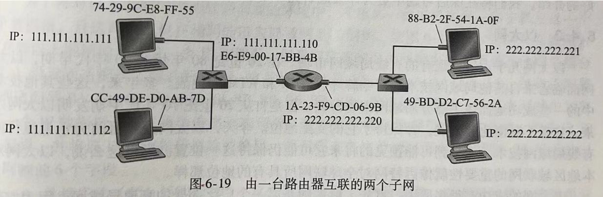

假设IP地址为`111.111.111.111`的主机A要向主机B`111.111.111.112`发送IP数据报，则源主机必须要向它的适配器不仅提供IP数据报，还要提供目的主机的MAC地址。具体流程如下：

1. 主机和路由器中都有一个ARP表，其中记录了IP地址到MAC地址的映射关系（以及TTL）。主机A首先查询自己的ARP表，如果有`111.111.111.112`对应的MAC地址则直接返回；否则，就使用ARP协议来解析这个目的IP地址
2. 发送方封装一个ARP请求报文，该报文中：
   - 源IP地址是主机A的IP地址
   - 源MAC地址是主机A的MAC地址
   - 目的IP地址是`111.111.111.112`
   - 目的MAC地址是MAC广播地址
3. 属于同一子网的其他网卡都会收到这个ARP请求报文，它们检查自己的IP地址是否与其中的`目的IP地址`匹配。主机B发现匹配，于是就向源主机发送一个ARP应答报文，该报文中：
   - 源IP地址是主机B的IP地址
   - 源MAC地址是主机B的MAC地址
   - 目的IP地址是主机A的IP地址
   - 目的MAC地址是主机A的MAC地址
4. 主机A收到后，更新自己的ARP表，接下来就可以正常发送数据

假设IP地址为`111.111.111.111`的主机A要向子网以外的主机C`222.222.222.222`发送IP数据报，具体流程如下：

1. 发送方知道目的IP与自己不属于同一子网，且发送方也知道自己所属子网的网关（第一跳路由器）地址是`111.111.111.110`。因此，首先通过上述ARP流程**获取网关的MAC地址**是`E6-E9-00-17-BB-4B`
2. 发送方接下来封装分组，该分组中：
   - 源IP地址是主机A的IP地址
   - 源MAC地址是主机A的MAC地址
   - 目的IP地址是主机C的IP地址`222.222.222.222`
   - 目的MAC地址是网关的MAC地址`E6-E9-00-17-BB-4B`
3. 于是该分组被发送到网关路由器，路由器根据目的IP地址查询路由表，于是将该分组转发到接口`222.222.222.220`
4. 这时，已知目的IP地址（主机C的IP地址）与当前接口所属同一子网，因此可以再次通过ARP协议**获取主机C的MAC地址**是`49-BD-D2-C7-56-2A`
5. 最后转发该分组，但是该分组中的一些信息需要修改：
   - 源IP地址是主机A的IP地址
   - 源MAC地址是网关接口的MAC地址`1A-23-F9-CD-06-9B`
   - 目的IP地址是主机C的IP地址`222.222.222.222`
   - 目的MAC地址是主机C的MAC地址`49-BD-D2-C7-56-2A`

> 注意：由上可见，ARP协议只能用于同一子网，也就是同一广播域。

### 3.3 ARP报文结构

ARP请求和应答报文结构类似：

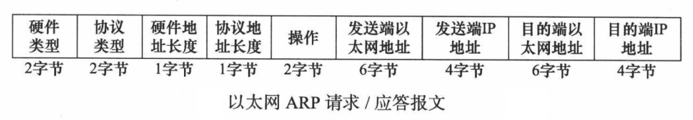

- 硬件类型：1表示MAC地址
- 协议类型：`0x800`表示IPv4地址
- 硬件地址长度：6
- 协议地址长度：4
- 操作：1表示ARP请求，2表示ARP应答，3表示RARP请求，4表示RARP应答

> 注意ARP报文还需要封装上以太网帧首部和尾部，组成帧后才能进行传输，此时以太网帧首部中的类型字段应为`0x806`，表示ARP。

## 4. 局域网

局域网(Local Area Network, LAN)是指在一个较小的地理范围内将各种计算机等设备通过双绞线、同轴电缆等连接介质互相连接起来，组成的计算机互联网络。

### 4.1 以太网

以太网是目前最流行的有线局域网，它是基于**交换机**的星形拓扑结构。以太网技术提供无连接、不可靠的服务，当某帧没有通过CRC校验时会直接丢弃该帧。以太网允许点对点链路，也允许广播链路（使用CSMA/CD协议）。

以太网帧结构如下：

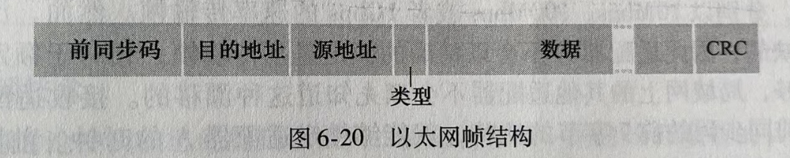

- 数据字段(46~1500字节)：这个字段承载了IP数据报，**以太网的最大传输单元(MTU)是1500字节**，数据字段最小是46字节，如果不够则需要填充。
- 目的地址(6字节)：目的网卡的MAC地址
- 源地址(6字节)：传输该帧到局域网上的网卡的MAC地址
- 类型(2字节)：指明网络层协议。`0x800`表示IP、`0x806`表示ARP、`0x835`表示RARP。
- CRC(4字节)：用于差错检验
- 前同步码(8字节，一般不计入帧首部)：前7字节值都是10101010，最后一个字节值是10101011，用于唤醒接收适配器，并且将它们的时钟和发送方的时钟同步。

### 4.2 无线局域网

无线网络的核心设施是基站，它负责协调其无线通信覆盖范围内的多个无线主机的数据传输。蜂窝网络中的基站称为`蜂窝塔`，无线局域网（WLAN）中的基站称为`接入点`。

采用IEEE802.11标准的无线局域网，又称为WiFi，它要求链路层实现**可靠传输**，允许广播链路（使用CSMA/CA协议）。WiFi也是星形拓扑结构，其中心就是`接入点`(AP, Access Point)，接入点的每个无线接口都有一个MAC地址。

> 在一个典型的家庭网络中，家庭中的各个主机以AP为中心，构成一个无线局域网，而该AP又通过有线以太网连接到一个路由器（网关），这台路由器连向外网。

## 5. 广域网

广域网通常是指覆盖范围很广的长距离网络。局域网可以通过广域网与另一个相隔很远的局域网通信。广域网使用的协议主要在网络层，而局域网使用的协议主要在链路层。

当然广域网中也有链路层协议，最常用的是PPP协议。PPP(Point-to-Point Protocol)是使用串行线路通信的面向字节的协议，该协议应用在直接连接两个结点的链路上。

> 注意：PPP只支持点对点的链路通信，且提供不可靠的服务。


# 第6章_物理层

物理层解决如何在连接各种计算机的传输媒体上**传输数据比特流**，而并不是指具体的传输媒体。

常见的物理层设备有：

- 中继器：用于对信号进行再生和还原
- 集线器：用于对信号进行放大和转发
