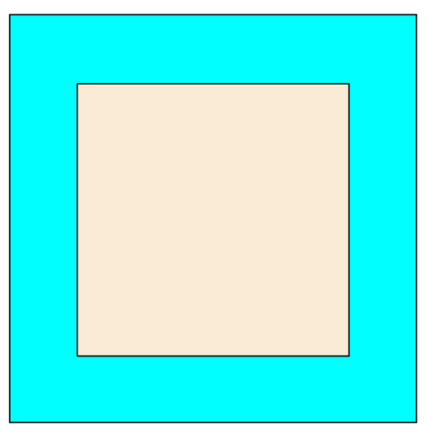

# 1. Vue简介

## 1.1 框架

任何编程语言在最初的时候都是没有框架的，后来随着在实际开发过程中不断总结『经验』，积累『最佳实践』，慢慢的人们发现很多『特定场景』下的『特定问题』总是可以『套用固定解决方案』。于是有人把成熟的『固定解决方案』收集起来，整合在一起，就成了『框架』。

在使用框架的过程中，我们往往只需要告诉框架『做什么（声明）』，而不需要关心框架『怎么做（编程）』。

对于Java程序来说，我们使用框架就是导入那些封装了『固定解决方案』的jar包，然后通过『配置文件』告诉框架做什么，就能够大大简化编码，提高开发效率。我们使用过的junit其实就是一款单元测试框架。

而对于JavaScript程序来说，我们使用框架就是导入那些封装了『固定解决方案』的『js文件』，然后在框架的基础上编码。

## 1.2 Vue.js

通过我们学习的html+css+js已经能够开发美观的页面了，但是开发的效率还有待提高，那么如何提高呢？我们先来分析下页面的组成。一个完整的html页面包括了视图和数据，数据是通过请求从后台获取的，那么意味着我们需要将后台获取到的数据呈现到页面上，很明显，这就需要我们使用DOM操作。正因为这种开发流程，所以我们引入了一种叫做**MVVM(Model-View-ViewModel)的前端开发思想**，即让我们开发者更加关注数据，而非数据绑定到视图这种机械化的操作。

MVVM:其实是Model-View-ViewModel的缩写，有3个单词，具体释义如下：

- Model: 数据模型，特指前端中通过请求从后台获取的数据
- View: 视图，用于展示数据的页面，可以理解成我们的html+css搭建的页面，但是没有数据
- ViewModel: 数据绑定到视图，负责将数据（Model）通过JavaScript的DOM技术，将数据展示到视图（View）上

基于上述的MVVM思想，其中的Model我们可以通过Ajax来发起请求从后台获取;对于View部分，我们将来会学习一款ElementUI框架来替代HTML+CSS来更加方便的搭建View;而今天我们要学习的就是侧重于ViewModel部分开发的Vue前端框架，用来替代JavaScript的DOM操作，让数据展示到视图的代码开发变得更加的简单。

接下来我们来介绍一下Vue。

Vue.js是一套构建用户界面的 **渐进式框架**，它是一套前端框架，免除原生JavaScript中的DOM操作，简化书写。它基于MVVM(Model-View-ViewModel)思想，实现数据的双向绑定，将编程的关注点放在数据上。与其他重量级框架不同的是，Vue 采用自底向上增量开发的设计。Vue 的核心库只关注视图层，并且非常容易学习，非常容易与其它库或已有项目整合。Vue.js 的目标是通过尽可能简单的 API 实现**响应的数据绑定**和**组合的视图组件**。

## 1.3 准备Vue.js环境

**1、获取Vue框架的js文件**

官网提供的下载地址：https://cdn.jsdelivr.net/npm/vue/dist/vue.js

**2、本地创建vue.js文件**

创建script目录用来存放vue.js文件，然后将官网提供的vue.js文件的内容复制粘贴到本地vue.js文件中。

**3、创建HTML文档并引入vue.js**

```html
<!DOCTYPE html>
<html lang="en">
<head>
    <meta charset="UTF-8">
    <meta http-equiv="X-UA-Compatible" content="IE=edge">
    <meta name="viewport" content="width=device-width, initial-scale=1.0">
    <title>Vue</title>
</head>
<body>
</body>
<script src="script/vue.js"></script>
<script>

</script>
</html>
```

# 2. Vue.js基本语法：声明式渲染

## 2.1 概念

- 声明式：告诉框架做什么，具体操作由框架完成
- 编程式：自己编写代码完成具体操作
- 渲染：程序计算动态数据得到具体数据的过程

## 2.2 demo

```html
<body>
    <!-- 使用{{}}格式，指定要被渲染的数据 -->
    <div id="app">{{message}}</div>
</body>
<script src="script/vue.js"></script>
<script>
    // 1. 创建一个JSON对象，作为new Vue时要使用的参数
    let argumentJson = {
        // el用于指定Vue对象要关联的HTML元素，el就是element的缩写
        // 通过id属性值指定HTML元素时，语法格式是：#id
        el:"#app",

        // data属性设置了Vue对象中保存的数据
        data:{
            "message":"Hello Vue!"
        }
    };

    // 2. 创建Vue对象，传入上面准备好的参数
    let app = new Vue(argumentJson);
</script>
```

## 2.3 Vue对象的常用属性

在创建vue对象时，有几个常用的属性：

- el:  用来指定哪些标签受 Vue 管理。该属性取值 `#app` 中的 `app` 需要是受管理的标签的id属性值
- data: 用来定义数据模型
- methods: 用来定义函数


# 3. Vue.js基本语法：绑定元素属性

## 3.1 基本语法

`v-bind:HTML标签的原始属性名="表达式"`

简化写法：`v-bind`可以省略。例如`v-bind:value="vueValue"`可以简写成`:value="vueValue"`

## 3.2 demo

```html
<body>
    <div id="app">
        <!-- v-bind:value 表示将value属性交给Vue进行管理，也就是绑定到Vue对象 -->
        <!-- vueValue 是一个用来渲染属性值的表达式，相当于标签体中加{{}}的表达式 -->
        <input type="text" v-bind:value="vueValue">
        <!-- 同样的表达式，在标签体内通过{{}}告诉Vue这里需要渲染： -->
        <!-- 在HTML标签的属性中，通过v-bind:属性名="表达式"的方式告诉Vue这里需要渲染 -->
        <p>{{vueValue}}</p>
    </div>
</body>
<script src="script/vue.js"></script>
<script>
    // 创建Vue对象，挂载#app这个div标签
    let app = new Vue({
        el:"#app",
        data:{
            vueValue:"太阳当空照"
        }
    });
</script>
```

## 3.3 小结

本质上，`v-bind:属性名="表达式"`和`{{表达式}}`它们都是用Vue对象来渲染页面。只不过：

- 文本标签体：使用`{{表达式}}`形式
- 属性：使用`v-bind:属性名="表达式"`形式

# 4. Vue.js基本语法：双向数据绑定


- `v-bind` 为HTML标签绑定属性值，如设置href, css样式等
- `v-model` 在表单元素上创建双向数据绑定


## 4.1 demo

使用了双向绑定后，就可以实现：页面上数据被修改后，Vue对象中的数据属性也跟着被修改。

```html
<body>
    <div id="app">
        <!-- v-bind:属性名 效果是从Vue对象渲染到页面 -->
        <!-- v-model:属性名 效果不仅是从Vue对象渲染到页面，而且能够在页面上数据修改后反向修改Vue对象中的数据属性 -->
        <input type="text" v-model:value="vueValue">
        <p>{{vueValue}}</p>
    </div>
</body>
<script src="script/vue.js"></script>
<script>
    // 创建Vue对象，挂载#app这个div标签
    let app = new Vue({
        el:"#app",
        data:{
            vueValue:"太阳当空照"
        }
    });
</script>
```

页面效果：p标签内的数据能够和文本框中的数据实现同步修改。

## 4.2 补充

**1、`v-model`后的`:value`可以省略**

```html
<input type="text" v-model="vueValue">
```

**2、`.trim`修饰符**

实际开发中，要考虑到用户在输入数据时，有可能会包含前后空格。而这些前后的空格对我们程序运行来说都是干扰因素，要去掉。在v-model后面加上`.trim`修饰符即可实现。

```html
<input type="text" v-model.trim="vueValue">
```

Vue会帮助我们在文本框失去焦点时自动去除前后空格。


# 5. Vue.js基本语法：条件渲染

根据Vue对象中，数据属性的值来判断是否对HTML页面内容进行渲染。

- `v-if` 条件性的渲染某元素，判定为true时渲染，否则不渲染。搭配`v-else-if`、`v-else`使用。
- `v-show` 根据条件展示某元素，区别在于切换的是display属性的值。

v-show和v-if的作用效果是一样的，只是原理不一样。可以发现，浏览器呈现的效果是一样的，但是浏览器中html源码不一样。v-if指令，不满足条件的标签代码直接没了，而v-show指令中，不满足条件的代码依然存在，只是添加了css样式 `display: none;` 来控制标签不去显示。


## 5.1 v-if

```html
<body>
    <div id="app">
        <h1>if</h1>
        <p v-if="flag">男</p>
        <p v-if="!flag">女</p>
    </div>
</body>
<script src="script/vue.js"></script>
<script>
    let app = new Vue({
        el:"#app",
        data:{
            flag:true
        }
    });
</script>
```

## 5.2 v-if和v-else

```html
<body>
    <div id="app">
        <h1>if/else</h1>
        <p v-if="flag">男</p>
        <p v-else="flag">女</p>
    </div>
</body>
<script src="script/vue.js"></script>
<script>
    let app = new Vue({
        el:"#app",
        data:{
            flag:true
        }
    });
</script>
```

## 5.3 v-show

```html
<body>
    <div id="app">
        <h1>v-show</h1>
        <p v-show="flag">男</p>
    </div>
</body>
<script src="script/vue.js"></script>
<script>
    let app = new Vue({
        el:"#app",
        data:{
            flag:true
        }
    });
</script>
```

# 6. Vue.js基本语法：列表渲染

- `v-for` 列表渲染，遍历容器的元素或者对象的属性


## 6.1 迭代一个简单的数组

```html
<body>
    <div id="app">
        <ul>
            <!-- 使用v-for语法遍历数组 -->
            <!-- v-for的值的语法格式：引用数组元素的变量名 in Vue对象中的数组属性名 -->
            <!-- 在文本标签体重使用{{引用数组元素的变量名}}渲染每一个数组元素 -->
            <li v-for="fruit in fruitList">{{fruit}}</li>
        </ul>
    </div>
</body>
<script src="script/vue.js"></script>
<script>
    let app = new Vue({
        el:"#app",
        data:{
            fruitList: [
                "apple",
                "banana",
                "orange"
            ]
        }
    });
</script>
```

## 6.2 迭代一个对象数组

```html
<body>
    <div id="app">
        <table>
            <tr>
                <th>编号</th>
                <th>姓名</th>
                <th>年龄</th>
                <th>专业</th>
            </tr>
            <tr v-for="employee in employeeList">
                <td>{{employee.empId}}</td>
                <td>{{employee.empName}}</td>
                <td>{{employee.empAge}}</td>
                <td>{{employee.empSubject}}</td>
            </tr>
        </table>
    </div>
</body>
<script src="script/vue.js"></script>
<script>
    let app = new Vue({
        el:"#app",
        data:{
            employeeList: [
                {
                    empId:11,
                    empName:"Tom",
                    empAge:111,
                    empSubject:"java"
                },
                {
                    empId:22,
                    empName:"Jerry",
                    empAge:222,
                    empSubject:"cpp"
                },
                {
                    empId:33,
                    empName:"Bob",
                    empAge:333,
                    empSubject:"python"
                }
            ]
        }
    });
</script>
```

## 6.3 补充

有时我们遍历时需要使用索引，那么v-for指令遍历的语法格式如下：

```html
<标签 v-for="(变量名,索引变量) in 集合模型数据">
    <!--索引变量是从0开始，所以要表示序号的话，需要手动的加1-->
   {{索引变量 + 1}} {{变量名}}
</标签>
```

# 7. Vue.js基本语法：事件驱动

`v-on:事件名="func"`: 用来给html标签绑定事件

- v-on语法给标签的事件绑定的函数func，必须是vue对象中声明的函数
- v-on存在简写方式，即`v-on:`可以替换成`@`

## 7.1 demo：字符串顺序反转

```html
<body>
    <div id="app">
        <p>{{message}}</p>
        <!-- v-on:事件类型="时间响应函数的函数名" -->
        <button v-on:click="reverseMessage">反转</button>
    </div>
</body>
<script src="script/vue.js"></script>
<script>
    let app = new Vue({
        el:"#app",
        data:{
            message:"Hello Vue!"
        },
        methods: {
            reverseMessage:function() {
                this.message = this.message.split("").reverse().join("");
            }    
        }
    })
</script>
```

## 7.2 demo：获取鼠标移动时的坐标信息

```html
<body>
    <div id="app">
        <div id="area" v-on:mousemove="recordPosition">1</div>
        <p id="showPosition">{{position}}</p>
    </div>
</body>
<script src="script/vue.js"></script>
<script>
    let app = new Vue({
        el:"#app",
        data:{
            position:"暂时没有获取到鼠标的位置信息"
        },
        methods: {
            recordPosition:function(event) {
                this.position = event.clientX + " " + event.clientY;
            }    
        }
    });
</script>
```

# 8. Vue.js基本语法：侦听属性

## 8.1 需求

```html
<div id="app">
    <p>尊姓：{{firstName}}</p>
    <p>大名：{{lastName}}</p>
    尊姓：<input type="text" v-model="firstName"><br>
    大名：<input type="text" v-model="lastName"><br>
    <p>全名：{{fullName}}</p>
</div>
```

在上面代码的基础上，我们希望firstName或lastName属性发生变化时，修改fullName属性。此时需要对firstName或lastName属性进行『侦听』。

具体来说，所谓『侦听』就是对message属性进行监控，当firstName或lastName属性的值发生变化时，调用我们准备好的函数。

## 8.2 Vue代码

在watch属性中声明对firstName和lastName属性进行『侦听』的函数：

```html
<script src="script/vue.js"></script>
<script>
    let app = new Vue({
        el:"#app",
        data:{
            firstName:"jim",
            lastName:"green",
            fullName:"jim green"
        },
        watch:{
            firstName:function(inputValue) {
                this.fullName = inputValue + " " + this.lastName;
            },
            lastName:function(inputValue) {
                this.fullName = this.firstName + " " + inputValue;
            },
        }
    })
</script>
```

# 9. Vue对象生命周期

vue的生命周期：指的是vue对象从创建到销毁的过程。vue的生命周期包含8个阶段：每触发一个生命周期事件，会自动执行一个生命周期方法，这些生命周期方法也被称为钩子方法。其完整的生命周期如下图所示：

| 状态          | 阶段周期 |
| ------------- | -------- |
| beforeCreate  | 创建前   |
| created       | 创建后   |
| beforeMount   | 挂载前   |
| mounted       | 挂载完成 |
| beforeUpdate  | 更新前   |
| updated       | 更新后   |
| beforeDestroy | 销毁前   |
| destroyed     | 销毁后   |

下图是 Vue 官网提供的从创建 Vue 到效果 Vue 对象的整个过程及各个阶段对应的钩子函数：


其中我们需要重点关注的是**mounted**，其他的我们了解即可。

mounted：挂载完成，Vue初始化成功，HTML页面渲染成功。（发送请求到服务端，加载数据） **以后我们一般用于页面初始化自动的ajax请求后台数据**


~~~html
<!DOCTYPE html>
<html lang="en">
<head>
    <meta charset="UTF-8">
    <meta http-equiv="X-UA-Compatible" content="IE=edge">
    <meta name="viewport" content="width=device-width, initial-scale=1.0">
    <title>Vue-指令-v-for</title>
    <script src="js/vue.js"></script>
</head>
<body>
    <div id="app">

    </div>
</body>
<script>
    //定义Vue对象
    new Vue({
        el: "#app", //vue接管区域
        data:{
           
        },
        methods: {
            
        },
        mounted () {
            alert("vue挂载完成,发送请求到服务端")
        }
    })
</script>
</html>
~~~


浏览器打开，运行结果如下：我们发现，自动弹出了了`"vue挂载完成,发送请求到服务端"`这句话，因为页面加载完成，vue对象创建并且完成了挂载，此时自动触发mounted所绑定的钩子函数，然后自动执行，弹框。


**补充**：Vue允许我们在特定的生命周期环节中通过钩子函数来加入我们的代码

```html
<body>
    <div id="app">
        <p id="content">{{message}}</p>
        <button @click="changeValue">点我</button>
    </div>
</body>
<script src="script/vue.js"></script>
<script>
new Vue({
	"el":"#app",
	"data":{
		"message":"hello"
	},
	"methods":{
		"changeValue":function(){
			this.message = "new hello";
		}
	},
	
	// 1.实例创建之前
	"beforeCreate":function(){
		console.log("beforeCreate:"+this.message);
	},
	
	// 2.实例创建完成
	"created":function(){
		console.log("created:"+this.message);
	},
	
	// 3.数据挂载前
	"beforeMount":function(){
		console.log("beforeMount:"+document.getElementById("content").innerText);
	},
	
	// 4.数据已经挂载
	"mounted":function(){
		console.log("mounted:"+document.getElementById("content").innerText);
	},
	
	// 5.数据更新前
	"beforeUpdate":function(){
		console.log("beforeUpdate:"+document.getElementById("content").innerText);
	},
	
	// 6.数据更新之后
	"updated":function(){
		console.log("updated:"+document.getElementById("content").innerText);
	}
});
</script>
```

# 10. 事件驱动补充

## 10.1 取消控件的默认行为

点超链接会跳转页面、点表单提交按钮会提交表单，这都是控件的默认行为。有时我们想要取消这些默认行为，那么就需要调用事件对象的preventDefault()方法。

**超链接举例**：

```html
<body>
    <a id="anchor" href="http://www.baidu.com">超链接</a>
</body>
<script>
	document.getElementById("anchor").onclick = function() {
		console.log("我点击了一个超链接");
		event.preventDefault();
	}
</script>
```

**表单提交按钮举例**

```html
<body>
    <form action="http://www.baidu.com" method="post">
		<button id="submitBtn" type="submit">提交表单</button>
	</form>
</body>
<script>
	document.getElementById("submitBtn").onclick = function() {
		console.log("我点击了一个表单提交按钮");
		event.preventDefault();
	}
</script>
```

## 10.2 阻止事件冒泡



图中的两个div，他们的HTML标签是：

```html
<div id="outterDiv">
	<div id="innerDiv"></div>
</div>
```

点击里面的div同时也等于点击了外层的div，此时如果两个div上都绑定了单击响应函数那么就都会被触发。**事件冒泡**指的就是一个事件会不断向父元素传递，直到window对象。

如果这不是我们想要的效果那么可以使用事件对象的stopPropagation()函数阻止：

```js
document.getElementById("innerDiv").onclick = function() {
	console.log("内层div的事件触发了");
	event.stopPropagation();
}
```

## 10.3 Vue事件修饰符

在事件处理程序中调用 event.preventDefault() 或 event.stopPropagation() 是非常常见的需求。尽管我们可以在方法中轻松实现这点，但更好的方式是：方法只有纯粹的数据逻辑，而不是去处理 DOM 事件细节。

### 1、取消控件的默认行为

采用`.prevent`修饰符

```html
<a href="http://www.baidu.com" @click.prevent="clickAnchor">超链接</a>

<form action="http://www.baidu.com" method="post">
	<button type="submit" @click.prevent="clickSubmitBtn">提交表单</button>
</form>
```

### 2、阻止事件冒泡

采用`.stop`修饰符

```html
<div id="outterDiv" @click="clickOutterDiv">
	<div id="innerDiv" @click.stop="clickInnerDiv"></div>
</div>
```

# 11. 正则表达式

JavaScript中常用正则表达式：

- 用户名：`/^[a-zA-Z_][a-zA-Z_\-0-9]{5,9}$/`
- 密码：`/^[a-zA-Z0-9_\-@\#\&\*]{6,12}$/`
- 前后空格：`/^\s+|\s+$/g`
- 电子邮箱：`/^[a-zA-Z0-9_\.-]+@([a-zA-Z0-9-]+[\.]{1})+[a-zA-Z]+$/`

详细内容，可参考`代码重工`笔记。