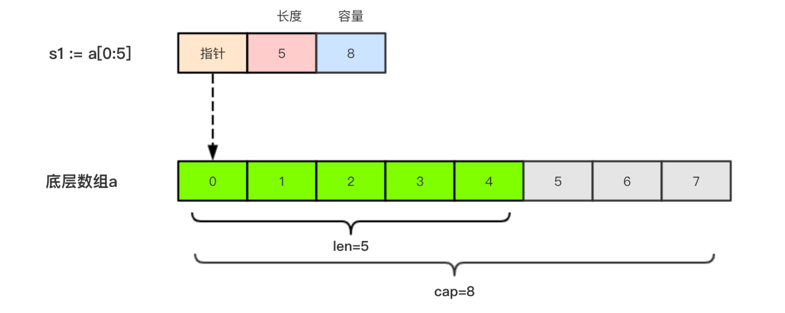
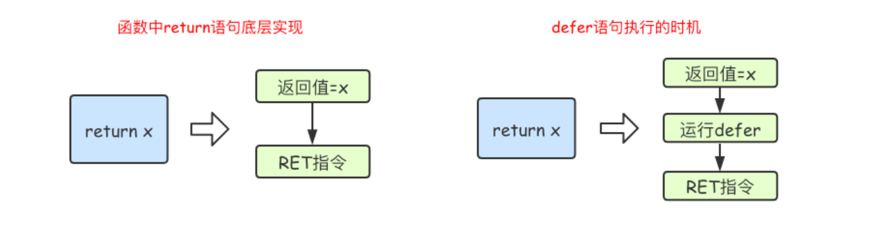

# 第01章_Go概述

## 1. 概述


## 2. Go开发环境搭建

（1）前往 Go 官方镜像网站下载并安装 Go SDK https://golang.google.cn/dl/

> 说明：我们不需要在 Linux 平台安装 Go，只需在开发机上写好 Go 代码然后进行跨平台编译，就能拷贝到 Linux 服务器上运行了，这也是 Go 程序跨平台易部署的优势。

（2）检查

```shell
# 查看安装的Go版本
go version
# 查看Go的环境
go env
```

> 说明：`GOROOT` 和 `GOPATH` 都是环境变量，其中 `GOROOT` 是我们安装 Go 开发包的路径，而 `GOPATH` 是自动设置的一个默认目录（旧版本的 Go 会用到，对新版本的 Go 来说通常无需修改）。

（3）修改 `GOPROXY`

```shell
go env -w GOPROXY=https://goproxy.cn,direct
```

> 说明：默认的 `GOPROXY` 在国内访问不到，因此需要进行修改。

（4）下载并安装 Go 的 IDE，推荐使用 GoLand

## 3. 快速入门

### 3.1 HelloWorld

（1）我们创建一个 hello-project 目录作为新项目，然后在该目录下通过 `go mod init 项目名` 命令对项目进行初始化，该命令会在项目根目录下生成 `go.mod` 文件

```shell
go mod init hello-project
```

（2）然后在该项目中创建一个 `main.go` 文件：

```go
// 声明 main 包，表明当前是一个可执行程序
package main

// 导入内置 fmt 包
import "fmt"

// main函数，是程序执行的入口
func main() {
	fmt.Println("Hello World!")
}
```

（3）在 hello-project 目录下通过 `go build` 命令将源代码编译成可执行文件

```shell
go build
# 也可以使用 -o 参数来指定编译后得到的可执行文件的名称，例如 go build -o hello.exe
```

（4）编译得到的可执行文件会保存在执行编译命令的当前目录下，如果是 `Windows` 平台会在当前目录下找到 `hello-project.exe` 可执行文件，然后就能直接运行：

```shell
hello-project.exe
```

### 3.2 其他常用命令补充

- 如果不使用 `go build`，我们也可以使用 `go run main.go` 命令执行程序，该命令本质上是先在临时目录编译程序然后再执行。
- `go install` 是安装的命令，它先编译源代码得到可执行文件，然后将可执行文件移动到 `GOPATH` 的 `bin` 目录下。由于默认已经把 `GOPATH` 下的 `bin` 目录添加到了环境变量中，所以我们在 `go install` 后就可以在任意地方直接执行可执行文件了。

### 3.3 跨平台编译

默认我们 `go build` 的可执行文件都是当前操作系统可执行的文件。Go 语言支持跨平台编译，也就是在当前平台（例如 Windows）下编译其他平台（例如 Linux）的可执行文件。

**Windows 编译 Linux 可执行文件**：（使用 PowerShell 终端）需要设置以下环境变量，然后执行 `go build` 即可

```powershell
$ENV:CGO_ENABLED=0    # 禁用CGO
$ENV:GOOS="linux"     # 目标平台是linux
$ENV:GOARCH="amd64"   # 目标处理器架构是amd64
```

> 说明：如果想再切换回 Windows，则设置 `$ENV:GOOS="windows"` 即可

**Mac 编译 Linux 可执行文件**：

```bash
CGO_ENABLED=0 GOOS=linux GOARCH=amd64 go build
```

> 说明：如果想再切换回 Mac，则执行
>
> ```bash
> CGO_ENABLED=0 GOOS=darwin GOARCH=amd64 go build
> ```


# 第02章_Go基本语法

## 1. 变量与常量

### 1.1 变量

Go 语言中的每一个变量都有自己的类型，变量必须经过声明才能开始使用，同一作用域内不支持重复声明。 注意，Go 语言的变量声明后必须使用。

**标准声明**：格式为 `var 变量名 变量类型`

```go
func main() {
	var name string
	var age int
	var canWork bool
	fmt.Println(name, age, canWork)  //  0 false
}
```

> 说明：Go 语言在声明变量的时候，会自动对变量对应的内存区域进行初始化操作。每个变量会被初始化成其类型的默认值，例如：整型和浮点型变量的默认值为 `0`，字符串变量的默认值为 `空字符串`，布尔型变量默认为 `false`，切片、函数、指针变量的默认值为 `nil`。

**批量声明**：

```go
func main() {
	var (
		name    string
		age     int
		canWork bool
	)
	fmt.Println(name, age, canWork) //  0 false
}
```

**声明并指定初始值**：

```go
func main() {
	var name string = "wsy"
	var age int = 18
	fmt.Println(name, age) // wsy 18
}
```

**类型推导（推荐）**：有时候我们会将变量的类型省略，这个时候编译器会根据等号右边的值来推导变量的类型完成初始化

```go
func main() {
	var name = "wsy"
	var age, canWork = 18, true  // 一次初始化多个变量
	fmt.Println(name, age, canWork)  // wsy 18 true
}
```

**短变量声明（推荐）**：在函数内部，可以使用更简略的 `:=` 方式声明并初始化变量。注意，**只有在函数内部才可以使用这种方式**。

```go
func main() {
	name := "wsy"
	age := 18
	fmt.Println(name, age) // wsy 18
}
```

### 1.2 匿名变量

在使用多重赋值时，如果想要忽略某个值，可以使用 `匿名变量（anonymous variable）`。 匿名变量用一个下划线 `_` 表示，例如：

```go
func foo() (int, string) {
	return 10, "wsy"
}
func main() {
	x, _ := foo()
	_, y := foo()
	fmt.Println("x =", x)  // x = 10
	fmt.Println("y =", y)  // y = wsy
}
```

匿名变量不占用命名空间，不会分配内存，所以匿名变量之间不存在重复声明。（在 `Lua` 等编程语言里，匿名变量也被叫做哑元变量)

> 注意：函数外的每个语句都必须以关键字开始（var、const、func等）

### 1.3 常量

相对于变量，常量是恒定不变的值，多用于定义程序运行期间不会改变的那些值。常量的声明和变量声明非常类似，只是把 `var` 换成了 `const`。注意，常量在定义的时候必须赋值。

**标准声明**：

```go
const PI = 3.1415
const MONDAY = 1

func main() {
	fmt.Println(PI, MONDAY) // 3.1415 1
}
```

**批量声明**：

```go
const (
	PI     = 3.1415
	MONDAY = 1
)

func main() {
	fmt.Println(PI, MONDAY) // 3.1415 1
}
```

**const 批量声明时，如果省略了值则表示和上面一行的值相同**：

```go
const (
	a = 100
	b
	c = 200
	d
)

func main() {
	fmt.Println(a, b, c, d)  // 100 100 200 200
}
```

### 1.4 iota

`iota` 是 Go 语言的常量计数器，只能在常量的表达式中使用。`iota` 在 const 关键字出现时将被重置为 0。const 中每新增一行常量声明将使 `iota` 计数一次（`iota` 可理解为 const 语句块中的行索引）。 使用 `iota` 能简化定义，在定义枚举时很有用。

例 1：

```go
const (
	a = iota
	b
	c
	d
)

func main() {
	fmt.Println(a, b, c, d) // 0 1 2 3
}
```

例 2：

```go
const (
	a = iota
	b
	_
	d
)

func main() {
	fmt.Println(a, b, d) // 0 1 3
}
```

例 3：

```go
const (
	a = iota
	b = 100
	c = iota
	d
)

func main() {
	fmt.Println(a, b, c, d) // 0 100 2 3
}
```

例 4：

```go
const (
	a, b = iota + 1, iota + 2
	c, d
	e, f
)

func main() {
	fmt.Println(a, b, c, d, e, f) // 1 2 2 3 3 4
}
```

## 2. 基本数据类型

### 2.1 整型

| 类型    | 描述                                                       |
| :------ | :--------------------------------------------------------- |
| uint8   | 无符号 8 位整型                                            |
| uint16  | 无符号 16 位整型                                           |
| uint32  | 无符号 32 位整型                                           |
| uint64  | 无符号 64 位整型                                           |
| int8    | 有符号 8 位整型                                            |
| int16   | 有符号 16 位整型                                           |
| int32   | 有符号 32 位整型                                           |
| int64   | 有符号 64 位整型                                           |
| uint    | 32 位操作系统上就是 `uint32`，64 位操作系统上就是 `uint64` |
| int     | 32 位操作系统上就是 `int32`，64 位操作系统上就是 `int64`   |
| uintptr | 无符号整型，用于存放一个指针                               |

**注意**：

- 在使用 `int` 和 `uint` 类型时，不能假定它是 32 位或 64 位的整型，而是考虑 `int` 和 `uint` 可能在不同平台上的差异。
- 获取对象长度的内建 `len()` 函数返回的长度可以根据不同平台的字节长度进行变化。实际使用中，切片或 map 的元素数量等都可以用 `int` 来表示。在涉及到二进制传输、读写文件的结构描述时，为了保持文件的结构不会受到不同编译目标平台字节长度的影响，不要使用 `int` 和 `uint`。

数字字面量语法：

```go
func main() {
	// 十进制
	var a = 10
	fmt.Printf("%d\n", a) // 10

	// 二进制 以0b开头
	var b = 0b1010
	fmt.Printf("%b\n", b) // 1010

	// 八进制 以0开头
	var c = 077
	fmt.Printf("%o\n", c) // 77

	// 十六进制 以0x开头
	var d = 0xff
	fmt.Printf("%x\n", d) // ff
	fmt.Printf("%X\n", d) // FF
}
```

### 2.2 浮点型

| 类型    | 描述        |
| ------- | ----------- |
| float32 | 32 位浮点型 |
| float64 | 64 位浮点型 |

示例：

```go
func main() {
	var num = 1.618
	fmt.Printf("%f\n", num)       // 1.618000
	fmt.Printf("%.2f\n", math.Pi) // 3.14
}
```

### 2.3 复数

| 类型       | 描述                 |
| ---------- | -------------------- |
| complex64  | 实部和虚部均为 32 位 |
| complex128 | 实部和虚部均为 64 位 |

示例：

```go
func main() {
	var c = 1 + 2i
	fmt.Println(c)
}
```

### 2.4 布尔

Go 语言中以 bool 声明布尔型数据，布尔型数据只有 `true` 和 `false` 两个值。注意，Go 语言中布尔型无法参与数值运算，也无法与其他类型进行转换。

### 2.5 字符串

#### 1、简介

Go 语言中的字符串以原生基本数据类型出现，其内部实现使用 `UTF-8` 编码。普通字符串使用双引号包裹，多行字符串使用反引号包裹。

```go
func main() {
	var s1 = "hello"
	var s2 = `浩然天地
正气长存
不为诛仙
但斩鬼神`
	fmt.Println(s1)
	fmt.Println(s2)
}
```

#### 2、字符串的常用操作

| 方法                           | 说明                       |
| ------------------------------ | -------------------------- |
| len(str)                       | 返回字符串的字节数         |
| +                              | 字符串拼接                 |
| fmt.Sprintf(format, s ...)     | 字符串格式化               |
| strings.Split(str, separator)  | 字符串分割                 |
| strings.Contains(str, s)       | 判断字符串str中是否包含s   |
| strings.HasPrefix(str, s)      | 判断字符串str是否以s为前缀 |
| strings.HasSuffix(str, s)      | 判断字符串str是否以s为后缀 |
| strings.Index(str, s)          | 子串s在str中首次出现的位置 |
| strings.LastIndex(str, s)      | 子串s在str中最后出现的位置 |
| strings.Join(str[], separator) | join操作                   |

示例：

```go
func main() {
	// 返回字符串的字节数
	s1 := "hello"
	s2 := "hello清华"
	fmt.Println(len(s1), len(s2)) // 5 11

	// 字符串拼接
	fmt.Printf(s1 + s2) // hellohello清华

	// 字符串格式化
	s3 := fmt.Sprintf("%s要上%s", "张小凡", "青云")
	fmt.Println(s3) // 张小凡要上青云

	// 字符串分割
	s4 := "清华,北大,复旦,交大"
	fmt.Println(strings.Split(s4, ",")) // [清华 北大 复旦 交大]

	// 判断是否包含
	fmt.Println(strings.Contains(s4, "清华")) // true

	// 判断前缀
	fmt.Println(strings.HasPrefix(s1, "he")) // true

	// 判断后缀
	fmt.Println(strings.HasSuffix(s1, "he")) // false

	// 子串首次出现的位置
	fmt.Println(strings.Index(s4, "大")) // 10

	// 子串最后出现的位置
	fmt.Println(strings.LastIndex(s4, "大")) // 24

	// join
	a := []string{"2025", "09", "06"}
	fmt.Println(strings.Join(a, "-")) // 2025-09-06
}
```

#### 3、字符

组成字符串的每个元素叫做字符，字符用单引号包裹起来，例如 `var c = '中'`。Go 语言的字符有以下两种：

1. `byte` 类型，代表一个 `ASCII码` 字符，实际上它是 `uint8` 的别名。
2. `rune` 类型，代表一个 `UTF-8` 字符，实际上它是 `int32` 的别名。

字符串底层是一个 byte 数组，所以可以和 `[]byte` 类型相互转换，但因为 UTF-8 编码下一个中文汉字由 3 个字节组成，所以我们不能简单的按照字节去遍历一个包含中文的字符串。

字符串的遍历应该使用以下方式：

```go
func main() {
	str := "hello清华"
	for _, r := range str {
		fmt.Printf("%c\n", r)
	}
}
```

#### 4、修改字符串

要修改字符串，需要先将其转换成 `[]rune` 或 `[]byte`，修改完成后再转换为 `string`。注意：无论哪种转换，都会重新分配内存并复制字节数组，因为**字符串是不可变的**。

```go
func main() {
	str := "hello清华"
	runeStr := []rune(str)
	runeStr[6] = '爷'
	fmt.Println(str)             // hello清华
	fmt.Println(string(runeStr)) // hello清爷
}
```

> **说明**：Go 语言中**只有强制类型转换**，没有隐式类型转换。强制类型转换的基本语法为 `T(表达式)`，该语法只能在两个类型之间支持相互转换的时候使用，其中 T 表示要转换的类型。

## 3. 运算符

### 3.1 算术运算符

`+`、`-`、`*`、`/`、`%`

> 注意：`++` 和 `--` 在 Go 语言中必须是单独的语句，并不算作运算符。

### 3.2 关系运算符

`==`、`!=`、`>`、`>=`、`<`、`<=`

### 3.3 逻辑运算符

`&&`、`||`、`!`

> 注意：操作数必须是 bool 类型

### 3.4 位运算符

`&`、`|`、`^`、`<<`、`>>`

### 3.5 赋值运算符

`=`、`+=`、`-=`、`*=`、`/=`、`%=`、`<<=`、`>>=`、`&=`、`|=`、`^=`

## 4. 流程控制

### 4.1 if

**标准写法**：

```go
func main() {
	score := 65
	if score >= 90 {
		fmt.Println("A")
	} else if score >= 80 {
		fmt.Println("B")
	} else {
		fmt.Println("C")
	}
}
```

**特殊写法**：可以在 if 表达式之前添加一个执行语句，然后再根据变量值进行判断

```go
func main() {
	score := 65
	if score += 15; score >= 90 {
		fmt.Println("A")
	} else if score >= 80 {
		fmt.Println("B")
	} else {
		fmt.Println("C")
	}
}
```

### 4.2 switch

**标准写法**：Go 语言 switch 中的每个 case 都默认自动添加了相当于其他编程语言中的 break，目的是为了避免穿透。如果我们确实想要向下穿透，则可以手动添加 fallthrough 关键字。

```go
func main() {
	week := 6
	switch week {
	case 1:
		fmt.Println("周一又要上班了")
	case 2:
		fmt.Println("周二也没啥精神")
	case 3:
		fmt.Println("周三，坚持就是胜利")
	case 4:
		fmt.Println("周四，明天就是周五啦")
	case 5:
		fmt.Println("周五，最后一天")
	case 6:
		fmt.Println("周末啦")
		fallthrough
	case 7:
		fmt.Println("开心出去玩")
	default:
		fmt.Println("输入错误")
	}

	/*
	 * 打印：
	 * 周末啦
	 * 开心出去玩
	 */
}
```

**多值 case**：一个 case 可以有多个值，多个值之间使用英文逗号分隔

```go
func main() {
	switch n := 7; n {
	case 1, 3, 5, 7, 9:
		fmt.Println("奇数")
	case 2, 4, 6, 8, 10:
		fmt.Println("偶数")
	default:
		fmt.Println(n)
	}
}
```

**表达式 case**：case 还可以使用表达式，这时候 switch 语句后面不需要再写要判断的变量名

```go
func main() {
	age := 30
	switch {
	case age < 25:
		fmt.Println("好好学习吧")
	case age > 25 && age < 35:
		fmt.Println("好好工作吧")
	default:
		fmt.Println("好好享受吧")
	}
}
```

### 4.3 for

**标准写法**：

```go
func main() {
	for i := 0; i < 5; i++ {
		fmt.Println(i)
	}
}
```

**省略写法一**：省略初始化语句

```go
func main() {
	i := 0
	for ; i < 5; i++ {
		fmt.Println(i)
	}
}
```

**省略写法二**：同时省略初始化语句和结束语句。这种写法类似于其他编程语言的 while 循环。注意，Go 语言中是没有 while 关键字的。

```go
func main() {
	i := 0
	for i < 5 {
		fmt.Println(i)
		i++
	}
}
```

**无限循环**：类似于其他编程语言的 `while (true)` 

```go
func main() {
	i := 0
	for {
		if i == 5 {
			break
		}
		fmt.Println(i)
		i++
	}
}
```

### 4.4 for range

Go 语言中可以使用 `for range` 遍历数组、切片、字符串、map 及通道（channel）。通过 `for range` 遍历的返回值有以下规律：

1. 数组、切片、字符串返回索引和值。
2. map 返回键和值。
3. 通道（channel）只返回通道内的值。

除此之外，还支持 `for range 整数`，示例如下：

```go
func main() {
	for i := range 5 {
		fmt.Println(i)
	}

	for range 2 {
		fmt.Println("hello!")
	}
}
```

## 5. 数组

数组（array）是同一种数据类型元素的集合，数组从声明时就确定，使用时可以修改数组成员，但是数组大小不可变化。

### 5.1 数组的初始化

```go
func main() {
	// 方式一：默认初始化
	var arr1 [3]int
	fmt.Println(arr1) // [0 0 0]

	// 方式二：指定长度和初始化列表
	var arr2 = [3]int{1, 2}
	fmt.Println(arr2) // [1 2 0]

	// 方式三：指定初始化列表，自动推断数组长度
	var arr3 = [...]int{1, 2, 3}
	fmt.Println(arr3) // [1 2 3]

	// 方式四：索引值方式初始化
	var arr4 = [...]int{1: 666, 3: 888}
	fmt.Println(arr4) // [0 666 0 888]
}
```

### 5.2 数组的遍历

```go
func main() {
	var arr = [...]int{666, 777, 888}
	// 方式一：for循环遍历
	for i := 0; i < len(arr); i++ {
		fmt.Println(arr[i])
	}

	// 方式二：for range遍历
	for index, value := range arr {
		fmt.Println(index, value)
	}
}
```

### 5.3 多维数组

初始化：

```go
func main() {
	// 方式一：默认初始化
	var arr1 [3][2]int
	fmt.Println(arr1) // [[0 0] [0 0] [0 0]]

	// 方式二：指定长度和初始化列表
	var arr2 = [3][2]int{
		{111, 1111},
		{222, 2222},
		{333, 3333},
	}
	fmt.Println(arr2) // [[111 1111] [222 2222] [333 3333]]

	// 方式三：指定初始化列表，自动推断数组长度。注意，只有第一层可以进行自动推断。
	var arr3 = [...][2]int{
		{111, 1111},
		{222, 2222},
		{333, 3333},
	}
	fmt.Println(arr3) // [[111 1111] [222 2222] [333 3333]]
}
```

遍历：

```go
func main() {
	var arr = [3][2]int{
		{111, 1111},
		{222, 2222},
		{333, 3333},
	}
	for _, innerArr := range arr {
		for _, value := range innerArr {
			fmt.Printf("%d\t", value)
		}
		fmt.Println()
	}
}
```

### 5.4 数组是值类型

**数组是值类型**，赋值和传参会复制整个数组。因此改变副本的值，不会改变本身的值。

```go
func main() {
	var arr = [3]int{111, 222, 333}
	modify(arr)
	fmt.Println("main函数内 arr =", arr) // [111 222 333]
}
func modify(arr [3]int) {
	arr[0] = 6666
	fmt.Println("modify函数内 arr =", arr) // [6666 222 333]
}
```

## 6. 切片

切片（slice）是一个拥有相同类型元素的可变长度的序列，它是**基于数组类型做的一层封装**，非常灵活、支持自动扩容。切片是一个引用类型，其内部结构包含 `底层数组的指针`、`当前元素个数` 和 `容量`。

### 6.1 切片的创建

**普通方式创建切片**：

```go
func main() {
	// 声明切片
	var a []int
	// 声明切片并初始化
	var b = []int{}
	// 声明切片并初始化添加元素
	var c = []int{1, 2}

	fmt.Println(a)        // []
	fmt.Println(b)        // []
	fmt.Println(c)        // [1 2]
	fmt.Println(a == nil) // true
	fmt.Println(b == nil) // false
	fmt.Println(c == nil) // false
	//fmt.Println(a == c)   // 切片是引用类型，不支持直接比较，只能和nil比较
}
```

**切片表达式创建切片**：可以从字符串、数组、指向数组或切片的指针构造子字符串或切片

```go
func main() {
	// 基于数组得到切片
	arr := [5]int{1, 2, 3, 4, 5}
	s1 := arr[1:3]
	s2 := arr[:4]                                    // 等同于 arr[0:4]
	s3 := arr[4:]                                    // 等同于 arr[4:len(arr)]
	s4 := arr[:]                                     // 等同于 arr[0:len(arr)]
	fmt.Printf("%v, %v, %v\n", s1, len(s1), cap(s1)) // [2 3], 2, 4
	fmt.Printf("%v, %v, %v\n", s2, len(s2), cap(s2)) // [1 2 3 4], 4, 5
	fmt.Printf("%v, %v, %v\n", s3, len(s3), cap(s3)) // [5], 1, 1
	fmt.Printf("%v, %v, %v\n", s4, len(s4), cap(s4)) // [1 2 3 4 5], 5, 5

	// 基于切片得到切片（注意：右区间上限是cap(s1)，而不是len(s1)）
	s5 := s1[0:4]
	fmt.Printf("%v, %v, %v\n", s5, len(s5), cap(s5)) // [2 3 4 5], 4, 4
}
```

> 说明：通过 `len()` 函数可以获取切片长度，通过 `cap()` 函数可以获取切片容量。

**make函数创建切片**：

```go
func main() {
	// make([]T, len, cap)
	s := make([]int, 5, 10)
	fmt.Printf("%v, %v, %v\n", s, len(s), cap(s)) // [0 0 0 0 0], 5, 10
}
```

> 注意事项：要检查切片是否为空，**请始终使用 `len(s) == 0` 来判断**，而不应该使用 `s == nil` 来判断。
>
> ```go
> var s1 []int         // len(s1)=0, cap(s1)=0, s1 == nil
> s2 := []int{}        // len(s2)=0, cap(s2)=0, s2 != nil
> s3 := make([]int, 0) // len(s3)=0, cap(s3)=0, s3 != nil
> ```

### 6.2 切片的本质

切片的本质就是对底层数组的封装，它包含了三个信息：底层数组的指针、切片的长度（len）和切片的容量（cap）。

例如，现在有一个数组 `a := [8]int{0, 1, 2, 3, 4, 5, 6, 7}`，切片 `s1 := a[:5]`，那么其底层结构如下图所示：



### 6.3 切片的常用操作

**切片的赋值**：切片是引用类型，直接赋值则会指向同一块内存地址

```go
func main() {
	s1 := []int{1, 2, 3}
	s2 := s1
	s2[0] = 666
	fmt.Println(s1) // [666 2 3]
	fmt.Println(s2) // [666 2 3]
}
```

**切片的复制**：使用 `copy()` 函数可以迅速地将一个切片的数据复制到另外一个切片空间中

```go
func main() {
	source := []int{1, 2, 3}
	dest := make([]int, len(source))
	copy(dest, source)

	dest[0] = 666
	fmt.Println(source) // [1 2 3]
	fmt.Println(dest)   // [666 2 3]
}
```

**切片的遍历**：

```go
func main() {
	var s = []int{666, 777, 888}
	// 方式一：for循环遍历
	for i := 0; i < len(s); i++ {
		fmt.Println(s[i])
	}

	// 方式二：for range遍历
	for index, value := range s {
		fmt.Println(index, value)
	}
}
```

**添加元素**：通过 `append()` 函数可以为切片动态添加元素

```go
func main() {
	var s []int
	// 批量添加元素
	s = append(s, 1, 2, 3) // [1 2 3]

	// 批量添加另一个切片中的元素
	s2 := []int{5, 6, 7}
	s = append(s, s2...) // [1 2 3 5 6 7]
}
```

> **扩容策略**：每个切片都会指向一个底层数组，这个数组的容量够用就能直接添加新元素。而当底层数组不能容纳新增的元素时，切片就会自动按照一定的策略进行扩容，此时该切片指向的底层数组就会更换。扩容操作往往发生在 `append()` 函数调用时，所以我们通常都需要用原变量接收 append 函数的返回值。切片的扩容策略如下：
>
> 1. 首先判断，如果新申请容量（cap）大于2倍的旧容量（oldcap），那么最终容量（newcap）就是新申请的容量（cap）。
> 2. 否则判断，如果旧切片的长度小于1024，则最终容量（newcap）就是旧容量（oldcap）的两倍。
> 3. 否则判断，如果旧切片长度大于等于1024，则最终容量（newcap）从旧容量（oldcap）开始循环增加四分之一（即不断执行 `newcap += newcap/4`），直到最终容量（newcap）大于等于新申请的容量(cap)。
> 4. 如果最终容量（newcap）计算值溢出，则最终容量（newcap）就是新申请容量（cap）。
> 5. 注意，切片扩容还会根据切片中元素的类型不同而做一些不同的处理，比如 `int` 和 `string` 类型的处理方式就不一样。

**删除元素**：Go 语言中并没有删除切片元素的专用方法，我们只能使用切片本身的特性来删除元素。具体而言，要从切片 a 中删除索引为 `index` 的元素，操作方法是 `a = append(a[:index], a[index+1:]...)`

```go
func main() {
	a := []int{30, 31, 32, 33, 34, 35, 36, 37}
	// 删除索引为 2 的元素
	a = append(a[:2], a[3:]...)
	fmt.Println(a) // [30 31 33 34 35 36 37]
}
```

## 7. map

Go 语言中提供的映射关系容器为 `map`，它是一种引用类型，其内部使用 `散列表` 实现。

### 7.1 map的创建

map 的定义语法为 `map[keyType]valueType`，map 定义后默认为 nil。有两种初始化方式：

**方式一**：使用 `make()` 函数进行初始化

```go
func main() {
	// make(map[keyType]valueType, cap)  其中cap为容量，该参数不是必须的
	m := make(map[int]string, 8)
	fmt.Println(m) // map[]
}
```

**方式二**：声明时直接填充元素

```go
func main() {
	m := map[int]string{
		1: "星期一",
		2: "星期二",
	}
	fmt.Println(m) // map[1:星期一 2:星期二]
}
```

### 7.2 map的常用操作

**增删改查**：

```go
func main() {
	scoreMap := make(map[string]int)
	// 添加key-value
	scoreMap["张三"] = 90
	scoreMap["李四"] = 100

	// 获取key对应的value
	fmt.Println(scoreMap["张三"])

	// 判断某个key是否存在（如果key存在，则ok为true、v为对应的值；否则，ok为false、v为值类型的零值）
	v, ok := scoreMap["李四"]
	if ok {
		fmt.Println(v)
	} else {
		fmt.Println("查无此人")
	}

	// 删除key-value
	delete(scoreMap, "李四")
}
```

**map的遍历**：

```go
func main() {
	scoreMap := map[string]int{
		"张三": 90,
		"李四": 100,
	}

	// 遍历key-value
	for k, v := range scoreMap {
		fmt.Println(k, v)
	}

	// 只遍历key
	for k := range scoreMap {
		fmt.Println(k)
	}
}
```

**按指定顺序遍历map**：

```go
func main() {
	// 初始化随机数种子
	random := rand.New(rand.NewSource(time.Now().UnixNano()))

	// 构建map
	var scoreMap = make(map[string]int, 200)
	for i := 0; i < 100; i++ {
		key := fmt.Sprintf("stu%02d", i)
		value := random.Intn(100) // 生成0~99的随机整数
		scoreMap[key] = value
	}

	// 取出map中的所有key并存入切片keys
	var keys = make([]string, 0, 200)
	for key := range scoreMap {
		keys = append(keys, key)
	}

	// 对切片进行排序
	sort.Strings(keys)

	// 按照排序后的key遍历map
	for _, key := range keys {
		fmt.Println(key, scoreMap[key])
	}
}
```

### 7.3 复杂map

**元素为map类型的切片**：

```go
func main() {
	var mapSlice = make([]map[string]string, 3)
	for index, value := range mapSlice {
		fmt.Printf("index:%d value:%v\n", index, value)
	}
	fmt.Println("after init")
	// 对切片中的map元素进行初始化
	mapSlice[0] = make(map[string]string, 3)
	mapSlice[0]["name"] = "小王子"
	mapSlice[0]["password"] = "123456"
	mapSlice[0]["address"] = "沙河"
	for index, value := range mapSlice {
		fmt.Printf("index:%d value:%v\n", index, value)
	}
}
```

**值为切片类型的map**：

```go
func main() {
	var sliceMap = make(map[string][]string, 3)
	key := "中国"
	value := make([]string, 0, 2)
	value = append(value, "北京", "上海")
	sliceMap[key] = value
	fmt.Println(sliceMap) // map[中国:[北京 上海]]
}
```

## 8. 函数

Go 语言中通过关键字 `func` 定义函数，具体格式如下：

```go
func 函数名(参数) (返回值) {
    函数体
}
```

### 8.1 特点

- 同一个包内，函数名不能重名

- 形参列表格式：

  ```go
  func intSum(x int, y int) int {
  	return x + y
  }
  ```
  
- 无返回值格式：

  ```go
  func sayHello() {
  	fmt.Println("hello world")
  }
  ```
  
- 多返回值格式：多个返回值必须用括号包裹

  ```go
  func calc(x int, y int) (int, int) {
  	sum := x + y
  	sub := x - y
  	return sum, sub
  }
  ```

- 类型简写：函数的参数或返回值中如果相邻变量的类型相同，则可以省略类型

  ```go
  func intSum(x, y int) int {
  	return x + y
  }
  ```

- 可变参数：可变参数通常要作为函数的最后一个参数

  ```go
  func intSum(x ...int) int {
  	fmt.Println(x) // x实际上是一个切片
  	sum := 0
  	for _, v := range x {
  		sum += v
  	}
  	return sum
  }
  ```

- 返回值命名：函数定义时可以给返回值命名，并在函数体中直接使用这些变量，最后通过 return 直接返回

  ```go
  func calc(x, y int) (sum, sub int) {
  	sum = x + y
  	sub = x - y
  	return
  }
  ```

### 8.2 函数类型

我们可以使用 `type` 关键字来定义一个函数类型，例如：

```go
type calculation func(int, int) int
```

上面的语句定义了一个 `calculation` 类型，只要函数有两个 int 类型的入参和一个 int 类型的返回值，就满足该 `calculation` 类型，于是可以赋值给 `calculation` 类型的变量。

```go
type calculation func(int, int) int

func sum(x int, y int) int {
	return x + y
}
func sub(x int, y int) int {
	return x - y
}

func main() {
	var c calculation
	c = sum
	fmt.Printf("type: %T\n", c) // type: main.calculation
	fmt.Println(c(1, 2))        // 3

	c = sub
	fmt.Printf("type: %T\n", c) // type: main.calculation
	fmt.Println(c(1, 2))        // -1
}
```

**函数可以作为参数**：

```go
func calc(x int, y int, op func(int, int) int) int {
	return op(x, y)
}
func sum(x int, y int) int {
	return x + y
}

func main() {
	fmt.Println(calc(1, 2, sum))
}
```

**函数也可以作为返回值**：

```go
func sum(x int, y int) int {
	return x + y
}
func sub(x int, y int) int {
	return x - y
}
func do(s string) (func(int, int) int, error) {
	switch s {
	case "+":
		return sum, nil
	case "-":
		return sub, nil
	default:
		err := errors.New("无法识别的操作符")
		return nil, err
	}
}
```

### 8.3 匿名函数

在一个函数内部，我们无法定义之前所说的普通函数，而只能定义匿名函数。匿名函数就是没有函数名的函数，定义格式如下：

```go
func(参数) (返回值) {
    函数体
}
```

注意，由于匿名函数没有函数名，所以只能被保存到某个变量中或者被立即执行：

```go
func main() {
	// 将匿名函数保存到变量
	sum := func(x int, y int) {
		fmt.Println(x + y)
	}
	sum(1, 2)

	// 立即执行匿名函数
	func(x int, y int) {
		fmt.Println(x + y)
	}(1, 2)
}
```

### 8.4 闭包

闭包指的是一个函数和与其相关的引用环境组合而成的实体。简单来说，`闭包=函数+引用环境`。例如，以下代码中变量 `f` 是一个函数并且它引用了其外部作用域中的 `x` 变量，此时 `f` 就是一个闭包，在 `f` 的生命周期内，变量 `x` 也一直有效。

```go
func adder() func(int) int {
	var x int
	return func(y int) int {
		x += y
		return x
	}
}
func main() {
	var f = adder()
	fmt.Println(f(10)) // 10
	fmt.Println(f(20)) // 30
	fmt.Println(f(30)) // 60

	g := adder()
	fmt.Println(g(40)) // 40
	fmt.Println(g(50)) // 90
}
```

例 1：

```go
func adder(x int) func(int) int {
	return func(y int) int {
		x += y
		return x
	}
}
func main() {
	var f = adder(10)
	fmt.Println(f(10)) // 20
	fmt.Println(f(20)) // 40
	fmt.Println(f(30)) // 70

	g := adder(20)
	fmt.Println(g(40)) // 60
	fmt.Println(g(50)) // 110
}
```

例 2：

```go
func makeSuffix(suffix string) func(string) string {
	return func(fileName string) string {
		if !strings.HasSuffix(fileName, suffix) {
			return fileName + suffix
		}
		return fileName
	}
}

func main() {
	jpgFunc := makeSuffix(".jpg")
	txtFunc := makeSuffix(".txt")
	fmt.Println(jpgFunc("flower")) // flower.jpg
	fmt.Println(txtFunc("note"))   // note.txt
}
```

例 3：

```go
func calc(base int) (func(int) int, func(int) int) {
	add := func(i int) int {
		base += i
		return base
	}

	sub := func(i int) int {
		base -= i
		return base
	}
	return add, sub
}

func main() {
	add, sub := calc(10)
	fmt.Println(add(1), sub(2)) // 11 9
	fmt.Println(add(3), sub(4)) // 12 8
	fmt.Println(add(5), sub(6)) // 13 7
}
```

### 8.5 defer语句

Go语言中的 `defer` 语句会将其后面跟随的语句进行延迟处理。在 `defer` 归属的函数即将返回时，将延迟处理的语句按 `defer` 定义的逆序进行执行，也就是说，先被 `defer` 的语句最后被执行，最后被 `defer` 的语句，最先被执行。

```go
func main() {
	fmt.Println("start")
	defer fmt.Println(1)
	defer fmt.Println(2)
	defer fmt.Println(3)
	fmt.Println("end")

	// 打印：
	// start
	// end
	// 3
	// 2
	// 1
}
```

> 说明：由于 `defer` 语句延迟调用的特性，所以 `defer` 语句能非常方便地处理资源释放问题。比如：资源清理、文件关闭、解锁及记录时间等。

**defer 的执行时机**：在 Go 语言的函数中 `return` 语句在底层并不是原子操作，它分为给返回值赋值和 RET 指令两步；而 `defer` 语句执行的时机就在返回值赋值操作后，RET 指令执行前。具体如下图所示



例 1：

```go
func f1() int {
	x := 5
	defer func() {
		x++
	}()
	return x
}
func f2() (x int) {
	defer func() {
		x++
	}()
	return 5
}
func f3() (y int) {
	x := 5
	defer func() {
		x++
	}()
	return x
}
func f4() (x int) {
	defer func(x int) {
		x++
	}(x)
	return 5
}

func main() {
	fmt.Println(f1()) // 5
	fmt.Println(f2()) // 6
	fmt.Println(f3()) // 5
	fmt.Println(f4()) // 5
}
```

例 2：

```go
func calc(index string, a, b int) int {
	ret := a + b
	fmt.Println(index, a, b, ret)
	return ret
}

func main() {
	x := 1
	y := 2
	defer calc("AA", x, calc("A", x, y))
	x = 10
	defer calc("BB", x, calc("B", x, y))
	y = 20

	// 打印：
	// A 1 2 3
	// B 10 2 12
	// BB 10 12 22
	// AA 1 3 4
}
```

> 注意：defer 注册要延迟执行的函数时该函数所有的参数都需要确定其值

### 8.6 内置函数

| 内置函数         | 说明                                                     |
| ---------------- | -------------------------------------------------------- |
| close            | 主要用来关闭 channel                                     |
| len              | 求长度，例如 string、array、slice、map、channel          |
| new              | 分配内存，用于分配值类型，比如 int、struct，返回的是指针 |
| make             | 分配内存，用于分配引用类型，比如 chan、map、slice        |
| append           | 追加元素到数组、slice 中                                 |
| panic 和 recover | 用于错误处理                                             |

Go 语言中没有异常机制，而是使用 `panic/recover` 模式来处理错误。`panic` 可以在任何地方引发，但 `recover` 只有在 `defer` 调用的函数中有效。例如：

```go
func funcA() {
	fmt.Println("func A")
}
func funcB() {
	panic("panic in B")
}
func funcC() {
	fmt.Println("func C")
}

func main() {
	funcA()
	funcB()
	funcC()
}
```

输出：

```txt
func A
panic: panic in B

goroutine 1 [running]:
main.funcB(...)
	E:/TmpProject/go-project/main.go:11
main.main()
	E:/TmpProject/go-project/main.go:19 +0x5b
```

程序运行期间 `funcB` 中引发了 `panic` 导致程序崩溃异常退出。这个时候我们就可以通过 `recover` 将程序恢复回来，继续往后执行：

```go
func funcA() {
	fmt.Println("func A")
}
func funcB() {
	defer func() {
		err := recover()
		// 如果程序出现了 panic 错误，可以通过 recover 恢复过来
		if err != nil {
			fmt.Println("recover in B")
		}
	}()
	panic("panic in B")
}
func funcC() {
	fmt.Println("func C")
}
func main() {
	funcA()
	funcB()
	funcC()
}
```

**注意**：

- `recover()` 必须搭配 `defer` 使用
- `defer` 一定要在可能引发 `panic` 的语句之前定义

## 9. 指针

### 9.1 基本概念

区别于 C/C++ 中的指针，Go 语言中的指针不能进行偏移和运算，是安全指针。因此 Go 语言中的指针操作非常简单，只需要记住两个符号：`&`（取地址）和 `*`（根据地址取值）。

Go 语言中的值类型（int、float、bool、string、array、struct）都有对应的指针类型，如：`*int`、`*int64`、`*string` 等。

```go
func main() {
	a := 10
	b := &a
	fmt.Printf("a:%d ptr:%p\n", a, &a) // a:10 ptr:0xc00001a078
	fmt.Printf("b:%p type:%T\n", b, b) // b:0xc00001a078 type:*int
	fmt.Println(&b)                    // 0xc00000e018
	fmt.Println(*b)                    // 10
}
```

### 9.2 new和make

new 用于给值类型分配内存，其函数签名为 `func new(Type) *Type`。new 函数不太常用，通过 new 函数得到一个类型指针，并且该指针对应的值为该类型的零值。例如：

```go
func main() {
	var a *int
	a = new(int)
	fmt.Println(*a) // 0
}
```

make 用于给引用类型（slice、map、channel）分配内存，并且返回的就是这三个类型本身。例如：

```go
func main() {
	var m map[string]int
	m = make(map[string]int)
	m["张三"] = 100
	fmt.Println(m) // map[张三:100]
}
```


# 第03章_Go结构体

Go 语言中没有"类"的概念，而是通过结构体的内嵌再配合接口比面向对象具有更高的扩展性和灵活性。

## 1. 自定义类型与类型别名

```go
// 自定义类型：将NewInt定义为int类型
type NewInt int

// 类型别名：MyInt只是int的别名，本质上MyInt与int是同一个类型(也就是说，MyInt类型只会在代码中存在，编译完成后并不会有MyInt类型)
type MyInt = int

func main() {
	var a NewInt
	var b MyInt
	fmt.Printf("type of a:%T\n", a) // type of a:main.NewInt
	fmt.Printf("type of b:%T\n", b) // type of b:int
}
```

补充：事实上，`rune` 和 `byte` 就是类型别名：

```go
type byte = uint8
type rune = int32
```

## 2. 结构体的创建

Go 语言提供了一种自定义数据类型，可以封装多个基本数据类型，这种数据类型叫结构体，英文名称 `struct`。 Go 语言中正是通过 `struct` 来实现**面向对象**。

### 2.1 结构体定义

```go
type Person struct {
	name string
	city string
	age int
}
```

### 2.2 结构体实例化

> 说明：结构体实例化后，其成员变量都是对应类型的零值。

**基本实例化**：

```go
func main() {
	var person Person
	person.name = "Jack"
	person.city = "上海"
	person.age = 18
	fmt.Printf("person=%v\n", person)  // person={Jack 上海 18}
	fmt.Printf("person=%#v\n", person) // person=main.Person{name:"Jack", city:"上海", age:18}
}
```

**new 实例化**：new 实例化得到的是结构体指针，注意，Go 语言支持对结构体指针直接用`.`来访问结构体成员（下面的 `person.name = "Jack"` 实际上在底层是 `(*person).name = "Jack"`，这是 Go 语言的语法糖）

```go
func main() {
	var person = new(Person)
	person.name = "Jack"
	person.age = 18
	fmt.Printf("%T\n", person)         // *main.Person
	fmt.Printf("person=%v\n", person)  // person=&{Jack  18}
	fmt.Printf("person=%#v\n", person) // person=&main.Person{name:"Jack", city:"", age:18}
}
```

**取地址实例化**：与 new 实例化相同

```go
func main() {
	var person = &Person{}
	person.name = "Jack"
	person.age = 18
	fmt.Printf("%T\n", person)         // *main.Person
	fmt.Printf("person=%v\n", person)  // person=&{Jack  18}
	fmt.Printf("person=%#v\n", person) // person=&main.Person{name:"Jack", city:"", age:18}
}
```

**匿名结构体**：

```go
func main() {
	var user struct {
		name string
		age  int
	}
	user.name = "Jack"
	user.age = 23
	fmt.Printf("%#v\n", user) // struct { name string; age int }{name:"Jack", age:23}
}
```

### 2.3 结构体初始化

**使用键值对初始化**：

```go
func main() {
	// 方式一
	person1 := Person{
		name: "Bob",
		city: "London",
		age:  22,
	}
	fmt.Printf("person1=%#v\n", person1) // person1=main.Person{name:"Bob", city:"London", age:22}

	// 方式二
	person2 := &Person{
		name: "Tom",
	}
	fmt.Printf("person2=%#v\n", person2) // person2=&main.Person{name:"Tom", city:"", age:0}
}
```

**仅使用值列表初始化**：使用这种格式进行初始化时，必须初始化结构体的所有字段且顺序要一致

```go
func main() {
	person3 := &Person{
		"Tom",
		"London",
		23,
	}
	fmt.Printf("person3=%#v\n", person3) // person3=&main.Person{name:"Tom", city:"London", age:23}
}
```

## 3. 结构体的特性

- 结构体会占用一块连续的内存空间

- Go 语言的结构体没有构造函数

- 结构体中字段大写开头表示可公开访问，小写表示私有（仅在定义当前结构体的包中可访问）

- 结构体允许匿名字段，匿名字段默认会采用类型名作为字段名，所以一个结构体中同种类型的匿名字段只能有一个

  ```go
  type Person struct {
  	string
  	int
  }
  
  func main() {
  	person := Person{
  		"张三",
  		18,
  	}
  	fmt.Printf("%#v\n", person)            // main.Person{string:"张三", int:18}
  	fmt.Println(person.string, person.int) // 张三 18
  }
  ```

  

## 4. 方法和接收者

### 4.1 简介

Go 语言中的`方法（Method）`是一种作用于特定类型变量的函数，这种特定类型变量叫做`接收者（Receiver）`，接收者的概念就类似于其他语言中的 `this`。**方法与函数的区别是：函数不属于任何类型，方法属于特定的类型**。

方法的定义格式如下：

```go
func (接收者变量 接收者类型) 方法名(参数列表) (返回参数) {
    函数体
}
```

- 接收者变量：接收者中的参数变量名在命名时，官方建议使用接收者类型名称首字母的小写，而不是 `self`、`this` 之类的命名。例如，`Person` 类型的接收者变量应该命名为 `p`，`Connector` 类型的接收者变量应该命名为 `c` 等。
- 接收者类型：接收者类型和参数类似，可以是指针类型和非指针类型。
- 方法名、参数列表、返回参数：与函数定义相同。

### 4.2 指针类型的接收者

指针类型的接收者由一个结构体的指针组成，由于指针的特性，调用方法时修改接收者指针的任意成员变量，在方法结束后，修改都是有效的。

```go
type Person struct {
	age int
}

// 指针类型的接收者
func (p *Person) setAge(age int) {
	p.age = age
}

func main() {
	person := &Person{age: 10}
	fmt.Println(person.age) // 10
	person.setAge(20)
	fmt.Println(person.age) // 20
}
```

**使用指针类型接收者的场景**：

- 需要修改接收者中的值
- 接收者是拷贝代价比较大的大对象
- 保证一致性，如果有某个方法使用了指针接收者，那么其他的方法也应该使用指针接收者

### 4.3 值类型的接收者

当方法作用于值类型接收者时，Go 语言会在代码运行时将接收者的值复制一份。在值类型接收者的方法中可以获取接收者的成员值，但修改操作只是针对副本，无法修改接收者变量本身。

```go
type Person struct {
	age int
}

// 值类型的接收者
func (p Person) setAge(age int) {
	p.age = age
}

func main() {
	person := &Person{age: 10}
	fmt.Println(person.age) // 10
	person.setAge(20)
	fmt.Println(person.age) // 10
}
```

### 4.4 任意类型都可以添加方法

在 Go 语言中，接收者的类型可以是任何类型，不仅仅是结构体，任何类型都可以拥有方法。举个例子，我们基于内置的 `int` 类型使用 type 关键字可以定义新的自定义类型，然后为我们的自定义类型添加方法。

```go
type NewInt int

func (n NewInt) sayHello() {
	fmt.Println("hello world")
}

func main() {
	var n NewInt
	n = 100
	n.sayHello()
}
```

注意：非本地类型不能定义方法，也就是说我们不能给别的包的类型定义方法。
