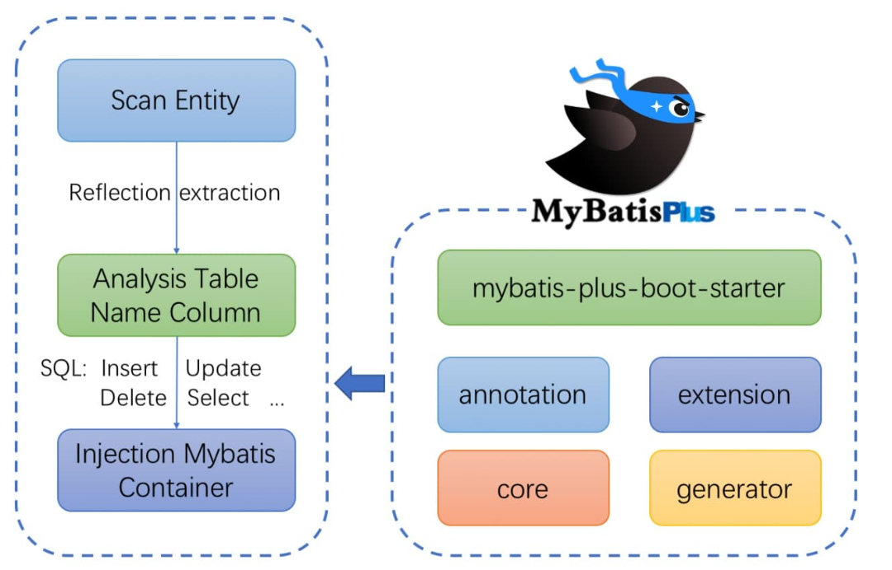
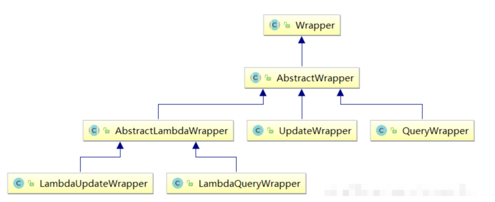
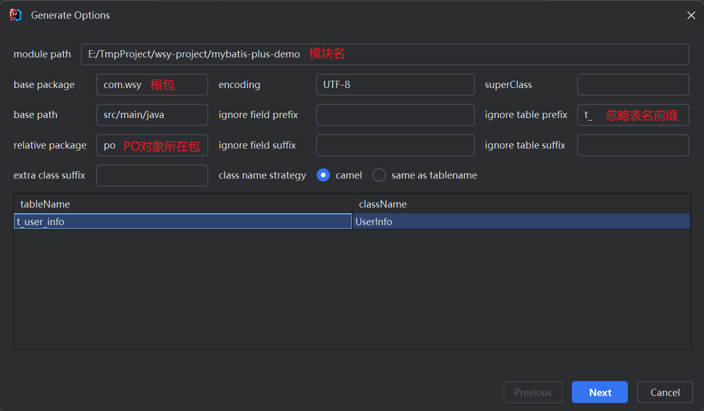
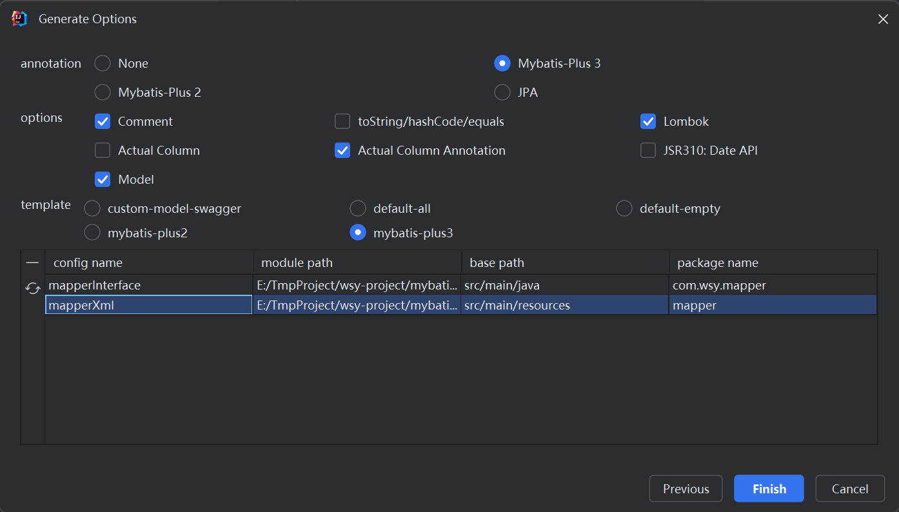

# 第01章_MyBatis-Plus简介

## 1. 简介

MyBatis-Plus（简称 MP）是一个 MyBatis 的**增强工具**，在 MyBatis 的基础上只做增强不做改变，为简化开发、提高效率而生。特点如下：

- 自动生成单表的 CRUD 功能
- 提供丰富的条件拼接方式
- 全自动 ORM 持久层框架



## 2. 快速入门

Demo 数据库表 SQL 脚本：

```sql
DROP TABLE IF EXISTS `t_user_info`;

CREATE TABLE `t_user_info`
(
    `id` BIGINT NOT NULL AUTO_INCREMENT COMMENT '主键ID',
    `username` VARCHAR(30) NOT NULL COMMENT '用户名',
    `user_age` INT NOT NULL COMMENT '用户年龄',
    `user_email` VARCHAR(50) DEFAULT NULL COMMENT '用户邮箱',
    PRIMARY KEY (`id`)
) ENGINE=InnoDB DEFAULT CHARSET=utf8 COMMENT='用户信息表';

DELETE FROM `t_user_info`;

INSERT INTO `t_user_info` (`id`, `username`, `user_age`, `user_email`) VALUES
(1, 'Jone', 18, 'test1@baomidou.com'),
(2, 'Jack', 20, 'test2@baomidou.com'),
(3, 'Tom', 28, 'test3@baomidou.com'),
(4, 'Sandy', 21, 'test4@baomidou.com'),
(5, 'Billie', 24, 'test5@baomidou.com');
```

### 2.1 引入依赖

在 SpringBoot 项目中导入 MyBatis-Plus 的场景启动器，代替 MyBatis 的场景启动器：

```xml
<!-- mybatis-plus -->
<dependency>
    <groupId>com.baomidou</groupId>
    <artifactId>mybatis-plus-spring-boot3-starter</artifactId>
    <version>3.5.8</version>
</dependency>
<!-- mysql -->
<dependency>
    <groupId>com.mysql</groupId>
    <artifactId>mysql-connector-j</artifactId>
    <scope>runtime</scope>
</dependency>
<!-- lombok -->
<dependency>
    <groupId>org.projectlombok</groupId>
    <artifactId>lombok</artifactId>
</dependency>
```

### 2.2 配置文件

```properties
spring.datasource.driver-class-name=com.mysql.cj.jdbc.Driver
spring.datasource.url=jdbc:mysql://localhost:3306/test
spring.datasource.username=root
spring.datasource.password=abc666
```

MyBatis-Plus 相关可选配置：

1. MyBatis-Plus 的自动配置，**默认指定 mapper 映射文件的位置是类路径下的 mapper 文件夹内**，即 `classpath*:/mapper/**/*.xml`，所以我们无需在配置文件中手动配置。如果我们想修改，可以进行如下配置：

   ```properties
   mybatis-plus.mapper-locations=classpath:/mapper/*.xml
   ```

2. MyBatis-Plus 的自动配置，**默认开启了自动下划线转驼峰命名映射**，所以我们无需在配置文件中手动配置。如果我们想关闭自动映射（例如在 DB 表名或字段名不遵循下划线命名规范的情形下），那么可以进行如下配置：

   ```properties
   mybatis-plus.configuration.map-underscore-to-camel-case=false
   ```

3. 如果想在控制台输出相关 SQL 语句进行调试，可以进行如下配置：

   ```properties
   mybatis-plus.configuration.log-impl=org.apache.ibatis.logging.stdout.StdOutImpl
   ```

> 更多的 MyBatis-Plus 可选配置可以参考官方文档 https://baomidou.com/reference/

### 2.3 配置类

配置 Mapper 接口的包扫描：

```java
@MapperScan("com.wsy.mapper")
@Configuration
public class MyBatisPlusConfig {
}
```

### 2.4 PO实体类

对数据库表 t_user_info 创建对应的 PO 实体类：

```java
/**
 * 用户信息表
 * @TableName t_user_info
 */
@TableName(value = "t_user_info")
@Data
public class UserInfo {
    /**
     * 主键ID
     */
    @TableId(value = "id", type = IdType.AUTO)
    private Long id;

    /**
     * 用户名
     */
    @TableField(value = "username")
    private String username;

    /**
     * 用户年龄
     */
    @TableField(value = "user_age")
    private Integer userAge;

    /**
     * 用户邮箱
     */
    @TableField(value = "user_email")
    private String userEmail;
}
```

### 2.5 Mapper接口继承BaseMapper

```java
public interface UserInfoMapper extends BaseMapper<UserInfo> {
}
```

> MyBatis-Plus 提供的 BaseMapper 接口，自带常见的单表 CRUD 方法。

### 2.6 测试

```java
@SpringBootTest
public class MybatisPlusDemoApplicationTests {
    @Autowired
    private UserInfoMapper userInfoMapper;

    @Test
    public void test01() {
        List<UserInfo> userInfos = userInfoMapper.selectList(null);
        userInfos.forEach(System.out::println);
    }
}
```

## 3. 核心注解

### 3.1 @TableName

该注解标注在 PO 实体类上，用于指定实体类对应的数据库**表名**。

> 说明：如果实体类名和表名相同（忽略大小写），可以省略该注解。但我们**不推荐省略**。

### 3.2 @TableId

#### 1、简介

该注解用于标记实体类中的**主键字段**。

> 说明：如果你的主键字段名为 `id`，则可以省略这个注解。但我们**不推荐省略**。

该注解的 type 属性用于指定**主键的生成策略**，常见的策略有：

1. `IdType.NONE`：默认值，表示使用配置文件中全局配置的主键生成策略。如果配置文件中也没有配置，则采用雪花算法。
2. `IdType.ASSIGN_ID`：使用雪花算法分配主键 ID
3. `IdType.AUTO`：使用数据库自增 ID 作为主键。注意，**此时数据库表的主键字段也必须设置主键自增**。

**注意事项**：

- 由于默认会使用雪花算法生成主键，所以建议**实体类主键属性类型为 Long 或 String，对应表的字段类型为 bigint 或 varchar(64)**
- 即使数据库表的主键字段设置为自增，只要 `@TableId` 的type没配置为 `IdType.AUTO`，则仍会使用默认的雪花算法。

#### 2、雪花算法

雪花算法（Snowflake Algorithm）由 Twitter 公司提出，它能够在分布式系统中生成**全局的唯一 ID**，并且在同一个节点上生成的 ID 能保证**有序性**。

雪花算法生成的 ID 是一个 64 bit 的整数，由以下几个部分组成：

1. 符号位：1 bit，正数是 0，负数是 1。一般 id 都是正数，所以该位通常都是 0
2. 时间戳：41 bit，精确到毫秒级
3. 节点 ID：10 bit，用于标识分布式系统中的不同节点
4. 序列号：12 bit，表示在同一毫秒内生成的不同 ID 的序号，从 0 开始自增

> **注意：雪花算法生成的数，必须使用 Long 或者 String 类型保存**。

事实上，对于 MySQL 这种数据库，还是更**推荐直接使用主键自增的策略**，因为连续的主键能够大大提高 MySQL 的查询性能。像雪花算法生成的全局唯一 ID，更适合作为业务 ID，而并不适合作为 MySQL 表的主键。不过，当数据量大到需要分库分表时，采用主键自增策略就要格外注意，禁止在相同的多张表中插入记录（只能在主键最大的那张表中继续插入记录），否则会导致主键重复。

### 3.3  @TableField

该注解用于标记实体类中的**非主键字段**。

> 说明：如果属性名与字段名一致，则可以省略该注解。但我们**不推荐省略**。

该注解的 exist 属性用于指示这个字段是否存在于数据库表中，默认为 true，如果设置为 false，那么 MyBatis-Plus 在生成 SQL 时会忽略这个字段。示例如下：

```java
@TableField(exist = false)
private static final long serialVersionUID = 1L;
```


# 第02章_Mapper接口的使用

BaseMapper 是 Mybatis-Plus 提供的一个通用 Mapper 接口，它封装了一系列常用的数据库操作方法，包括增、删、改、查等。通过继承 BaseMapper，开发者可以快速地对数据库进行操作，而无需编写繁琐的 SQL 语句。

## 1. insert

- `int insert(T entity)`：插入一条记录，entity 就是要插入的实体类对象。注意，若 entity 中没有指定主键 id，则会在**插入 DB 成功后将主键 id 设置进 entity 对应的主键属性中**。
- `List<BatchResult> insert(Collection<T> entityList)`：批量插入
- `List<BatchResult> insert(Collection<T> entityList, int batchSize)`：批量插入，batchSize 是每批次的大小

> **注意：对于插入操作，如果实体类对象的某个属性为 null，则生成的 SQL 中默认是不会包含该字段的，因此也就不会给该字段插入 null 值（如果数据库表中的该字段设置了默认值，那么插入的这条记录的这个字段就会是默认值，而不会是 null）**。所以我们定义实体类时，不推荐使用基本数据类型，而推荐使用包装类型（因为其默认值为 null）。

举例：

```java
@Test
public void test02() {
    UserInfo userInfo = new UserInfo();
    userInfo.setUsername("wsy");
    userInfo.setUserAge(18);
    userInfo.setUserEmail("wsy@qq.com");
    int row = userInfoMapper.insert(userInfo);
    System.out.println("row: " + row); // row: 1
    System.out.println("id: " + userInfo.getId()); // id: 6
}
```

## 2. delete

- `int deleteById(Serializable id)`：根据主键删除
- `int deleteByMap(Map<String, Object> columnMap)`：根据 columnMap 条件进行删除，其中 Map 的 key 必须是表中的某个字段
- `int deleteByIds(Collection idList)`：根据主键批量删除
- `int delete(Wrapper<T> queryWrapper)`：根据 wrapper 条件删除

举例：

```java
@Test
public void test03() {
    // 1. DELETE FROM t_user_info WHERE id=?
    int row1 = userInfoMapper.deleteById(2L);

    // 2. DELETE FROM t_user_info WHERE (user_age = ? AND username = ?)
    Map<String, Object> param = new HashMap<>();
    param.put("username", "Tom");
    param.put("user_age", 28);
    int row2 = userInfoMapper.deleteByMap(param);

    // 3. DELETE FROM t_user_info WHERE id IN ( ? , ? )
    int row3 = userInfoMapper.deleteByIds(List.of(4L, 5L));
}
```

## 3. update

- `int updateById(T entity)`：根据主键进行修改，主键属性必须不为 null。
- `List<BatchResult> updateById(Collection<T> entityList)`：根据主键批量修改，主键属性必须不为 null。
- `List<BatchResult> updateById(Collection<T> entityList, int batchSize)`：根据主键批量修改，主键属性必须不为 null，batchSize 是每批次的大小。
- `int update(T entity, Wrapper<T> updateWrapper)`：根据 wrapper 条件进行修改

> **注意：对于修改操作，如果实体类对象的某个属性为 null，则生成的 SQL 中默认是不会包含该字段的，因此也就不会修改该属性对应的字段的值**。所以我们定义实体类时，不推荐使用基本数据类型，而推荐使用包装类型（因为其默认值为 null）。

举例：

```java
@Test
public void test04() {
    // UPDATE t_user_info SET user_age=? WHERE id=?
    UserInfo userInfo = new UserInfo();
    userInfo.setId(6L);
    userInfo.setUserAge(20);
    int row = userInfoMapper.updateById(userInfo);
}
```

## 4. select

### 4.1 基本API

- `T selectById(Serializable id)`：根据主键查询
- `List<T> selectByIds(Collection idList)`：根据主键批量查询
- `List<T> selectByMap(Map<String, Object> columnMap)`：根据 columnMap 条件查询

### 4.2 根据wrapper条件查询

- `T selectOne(Wrapper<T> queryWrapper)`：根据 wrapper 条件查询一条记录（若结果集为多条记录，会抛出异常）
- `List<T> selectList(Wrapper<T> queryWrapper)`：根据 wrapper 条件查询多条记录
- `List<Map<String, Object>> selectMaps(Wrapper<T> queryWrapper)`：根据 wrapper 条件查询多条记录
- `Long selectCount(Wrapper<T> queryWrapper)`：查询满足 wrapper 条件的记录数
- `boolean exists(Wrapper<T> queryWrapper)`：根据 wrapper 条件，判断是否存在记录

### 4.3 分页查询

- `IPage<T> selectPage(IPage<T> page, Wrapper<T> queryWrapper)`：根据 wrapper 条件分页查询

## 5. insertOrUpdate

- `boolean insertOrUpdate(T entity)`：主键值不为 null 则更新该记录，否则插入一条记录
- `List<BatchResult> insertOrUpdate(Collection<T> entityList)`：批量修改或插入
- `List<BatchResult> insertOrUpdate(Collection<T> entityList, int batchSize)`：批量修改或插入，batchSize 是每批次的大小

## 6. 自定义Mapper接口方法

我们可以像使用 MyBatis 一样自定义 Mapper 接口方法，然后在对应的 Mapper xml 文件中编写对应的 SQL 语句。


# 第03章_Service接口的使用

IService 是 MyBatis-Plus 提供的一个通用 Service 层接口，它封装了常见的 CRUD 操作。通过继承 IService 接口，可以快速实现对数据库的基本操作，同时保持代码的简洁性和可维护性。

IService 接口中的方法命名遵循了一定的规范，如 get 用于查询单行，remove 用于删除，list 用于查询集合，page 用于分页查询，这样可以避免与 Mapper 层的方法混淆。除此之外，IService 接口中涉及写 DB 操作的方法会自动添加事务。

> 注意：在实际开发中，我们**不推荐使用 MyBatis-Plus 提供的 IService 接口**，与 DB 的交互应通过 Mapper 层来实现。

## 1. 接入方式

**（1）自定义 Service 接口继承 `IService` 接口**

```java
public interface UserInfoService extends IService<UserInfo> {
}
```

**（2）自定义 Service 实现类继承 `ServiceImpl` 类，并实现上述的自定义 Service 接口**

```java
@Service
public class UserInfoServiceImpl extends ServiceImpl<UserInfoMapper, UserInfo> implements UserInfoService {
}
```

> 原因：`IService` 接口中的一些方法提供了默认实现，而另一些方法仍是抽象方法、在 `ServiceImpl` 类中才提供了实现，所以需要继承 `ServiceImpl` 类。

## 2. 常用API

### 2.1 save

- `boolean save(T entity)`：插入一条记录
- `boolean saveBatch(Collection<T> entityList)`：批量插入记录
- `boolean saveBatch(Collection<T> entityList, int batchSize)`：批量插入记录，其中 batchSize 是每批次的数量

### 2.2 saveOrUpdate

- `boolean saveOrUpdate(T entity)`：主键值不为 null 则更新该记录，否则插入一条记录
- `boolean saveOrUpdate(T entity, Wrapper<T> updateWrapper)`：先根据 wrapper 条件进行更新，如果更新失败，则执行 `saveOrUpdate(entity)`
- `boolean saveOrUpdateBatch(Collection<T> entityList)`：批量修改插入
- `boolean saveOrUpdateBatch(Collection<T> entityList, int batchSize)`：批量修改插入

### 2.3 update

- `boolean update(Wrapper<T> updateWrapper)`：根据 wrapper 条件进行更新，需要设置 sqlset
- `boolean update(T entity, Wrapper<T> updateWrapper)`：根据 wrapper 条件进行更新
- `boolean updateById(T entity)`：根据主键进行更新
- `boolean updateBatchById(Collection<T> entityList)`：根据主键批量更新
- `boolean updateBatchById(Collection<T> entityList, int batchSize)`：根据主键批量更新

### 2.4 remove

- `boolean remove(Wrapper<T> queryWrapper)`：根据 wrapper 条件进行删除
- `boolean removeById(Serializable id)`：根据主键进行删除
- `boolean removeByMap(Map<String, Object> columnMap)`：根据 columnMap 条件进行删除
- `boolean removeByIds(Collection list)`：根据主键批量删除

### 2.5 count

- `long count()`：查询总记录数
- `long count(Wrapper<T> queryWrapper)`：根据 wrapper 条件查询总记录数

### 2.6 get

- `T getById(Serializable id)`：根据主键查询
- `T getOne(Wrapper<T> queryWrapper)`：根据 wrapper 条件查询一条记录。注意，如果结果集是多条记录，则会抛出异常。
- `T getOne(Wrapper<T> queryWrapper, boolean throwEx)`：根据 wrapper 条件查询一条记录。注意，如果结果集是多条记录，则当参数 throwEx 为 true 时会抛出异常。

### 2.7 list

- `List<T> list()`：查询所有记录
- `List<T> list(Wrapper<T> queryWrapper)`：根据 wrapper 条件查询
- `List<T> listByIds(Collection idList)`：根据主键批量查询
- `List<T> listByMap(Map<String, Object> columnMap)`：根据 columnMap 条件查询
- `List<Map<String, Object>> listMaps()`：查询所有记录
- `List<Map<String, Object>> listMaps(Wrapper<T> queryWrapper)`：根据 wrapper 条件查询
- `List<Object> listObjs()`：查询所有记录
- `List<V> listObjs(Function<? super Object, V> mapper)`：查询所有记录，参数 mapper 指定表字段和实体类属性的映射规则
- `List<Object> listObjs(Wrapper<T> queryWrapper)`：根据 wrapper 条件查询
- `List<V> listObjs(Wrapper<T> queryWrapper, Function<? super Object, V> mapper)`：根据 wrapper 条件查询


## 3. 常用API举例

```java
@SpringBootTest
public class ServiceTests {
    @Autowired
    private UserInfoService userInfoService;

    @Test
    public void testSave() {
        List<UserInfo> userInfoList = new ArrayList<>();
        for (int i = 0; i < 10; i++) {
            UserInfo userInfo = new UserInfo();
            userInfo.setUsername("wsy" + i);
            userInfo.setUserAge(20 + i);
            userInfoList.add(userInfo);
        }
        // 批量插入记录
        boolean b = userInfoService.saveBatch(userInfoList);
    }

    @Test
    public void testSaveOrUpdate() {
        UserInfo userInfo = new UserInfo();
        userInfo.setUsername("haha");
        userInfo.setUserAge(666);
        // 如果主键不为null则修改，否则就插入
        boolean b = userInfoService.saveOrUpdate(userInfo);
    }

    @Test
    public void testUpdate() {
        UserInfo userInfo = new UserInfo();
        userInfo.setId(7L);
        userInfo.setUserAge(100000);
        // 根据主键进行更新
        boolean b = userInfoService.updateById(userInfo);
    }

    @Test
    public void testRemove() {
        // 根据主键进行删除
        boolean b = userInfoService.removeById(7L);
    }

    @Test
    public void testCount() {
        // 查询总记录数 SELECT COUNT( * ) AS total FROM t_user_info
        long count = userInfoService.count();
        System.out.println(count);
    }

    @Test
    public void testGet() {
        // get 查询单条记录
        UserInfo userInfo = userInfoService.getById(8L);
        System.out.println(userInfo);
    }

    @Test
    public void testList() {
        // list 查询多条记录
        List<UserInfo> list = userInfoService.list();
        System.out.println(list);
    }
}
```


# 第04章_条件构造器

## 1. 简介

MyBatis-Plus 提供了一套强大的条件构造器（Wrapper），用于构建复杂的数据库查询条件。Wrapper 类允许开发者以链式调用的方式构造查询条件，无需编写繁琐的 SQL 语句，从而提高开发效率并减少 SQL 注入的风险。



主要分为两类：QueryWrapper 用于封装查询条件，而 UpdateWrapper 不仅可以封装查询条件、还可以封装要修改的数据。除此之外，它们还有 Lambda 形式的 Wrapper 类，通过 Lambda 表达式来引用实体类的属性，从而避免了硬编码字段名。

**注意事项**：

1. Wrapper 实例不是线程安全的，因此建议在每次使用时**创建新的 Wrapper 实例**。

2. Wrapper 方法通常接受一个 `boolean` 类型的参数，用于决定是否将该条件加入到最终的 SQL 中。例如，以下情况只有当 `age` 不为 null 且大于 0 时才会将该条件加入到最终 SQL 中：

   ```java
   LambdaQueryWrapper<UserInfo> wrapper = new LambdaQueryWrapper<UserInfo>()
                   .eq(age != null && age > 0, UserInfo::getUserAge, age);
   ```

3. 如果某个 Wrapper 方法没有显式提供 `boolean` 类型的参数，则默认为 `true`，即条件总是会被加入到 SQL 中。

## 2. QueryWrapper

```java
@SpringBootTest
public class QueryWrapperTest {

    @Autowired
    private UserInfoMapper userInfoMapper;

    /**
     * 普通条件
     */
    @Test
    public void test01() {
        // 查询用户名包含 w，年龄在 20 到 30 之间，并且邮箱不为 null 的用户信息
        QueryWrapper<UserInfo> queryWrapper = new QueryWrapper<UserInfo>()
                .like("username", "w")
                .between("user_age", 20, 30)
                .isNotNull("user_email");
        List<UserInfo> list = userInfoMapper.selectList(queryWrapper);
        list.forEach(System.out::println);
    }

    /**
     * 排序
     */
    @Test
    public void test02() {
        // 按年龄降序查询用户，如果年龄相同则按 id 升序排列
        QueryWrapper<UserInfo> queryWrapper = new QueryWrapper<UserInfo>()
                .orderByDesc("user_age")
                .orderByAsc("id");
        List<UserInfo> list = userInfoMapper.selectList(queryWrapper);
        list.forEach(System.out::println);
    }

    /**
     * 根据条件进行删除
     */
    @Test
    public void test03() {
        // 删除邮箱为 null 的用户
        QueryWrapper<UserInfo> queryWrapper = new QueryWrapper<UserInfo>()
                .isNull("user_email");
        int row = userInfoMapper.delete(queryWrapper);
    }

    /**
     * 根据条件进行更新
     * 注意：对于 int update(T entity, Wrapper<T> updateWrapper)
     *  - 可以传递一个 QueryWrapper 仅作为查询条件，用实体类 entity 封装要修改的数据
     *  - 也可以直接传递一个 UpdateWrapper 封装查询条件和要修改的数据，entity 直接传递 null
     */
    @Test
    public void test04() {
        // 将（年龄大于 18 并且用户名中包含有 w）或邮箱为 null 的用户信息修改
        QueryWrapper<UserInfo> queryWrapper = new QueryWrapper<UserInfo>()
                .gt("user_age", 18)
                .like("username", "w")
                .or().isNull("user_email");
        UserInfo userInfo = new UserInfo();
        userInfo.setUserAge(8888);
        int row = userInfoMapper.update(userInfo, queryWrapper);
    }

    /**
     * 复杂条件
     */
    @Test
    public void test05() {
        // 将用户名中包含有 w 并且（年龄大于 20 或邮箱为 null）的用户信息修改
        QueryWrapper<UserInfo> queryWrapper = new QueryWrapper<UserInfo>()
                .like("username", "w")
                .and(wrapper -> wrapper
                        .gt("user_age", 20)
                        .or().isNull("user_email"));
        UserInfo userInfo = new UserInfo();
        userInfo.setUserAge(9999);
        int row = userInfoMapper.update(userInfo, queryWrapper);
    }

    /**
     * 查询部分字段
     */
    @Test
    public void test06() {
        // 查询 id>1 的用户信息的 username 和 user_age 字段
        QueryWrapper<UserInfo> queryWrapper = new QueryWrapper<UserInfo>()
                .gt("id", 1L)
                .select("username", "user_age");
        List<Map<String, Object>> list = userInfoMapper.selectMaps(queryWrapper);
        list.forEach(System.out::println);
    }

    /**
     * 子查询
     */
    @Test
    public void test07() {
        // 使用子查询，查询 id<100 的用户信息
        QueryWrapper<UserInfo> queryWrapper = new QueryWrapper<UserInfo>()
                .inSql("id", "select id from t_user_info where id < 100");
        List<UserInfo> list = userInfoMapper.selectList(queryWrapper);
        list.forEach(System.out::println);
    }

    /**
     * condition组装条件
     */
    @Test
    public void test08() {
        /*
         * 前端传入两个参数 name, age
         * - 若 name 不为空，则附加条件 username = name 查询
         * - 若 age 大于 0，则附加条件 user_age = age 查询
         */
        String name = "";
        Integer age = 9999;

        // eq(boolean condition, R column, Object val)
        QueryWrapper<UserInfo> queryWrapper = new QueryWrapper<UserInfo>()
                .eq(StringUtils.isNotBlank(name), "username", name)
                .eq(age != null && age > 0, "user_age", age);
        List<UserInfo> list = userInfoMapper.selectList(queryWrapper);
        list.forEach(System.out::println);
    }
}
```

## 3. UpdateWrapper

UpdateWrapper 可以直接放查询条件和要修改的数据，还可以指定修改某一列为 null：

```java
@SpringBootTest
public class UpdateWrapperTest {
    @Autowired
    private UserInfoMapper userInfoMapper;

    @Test
    public void test01() {
        // 将年龄大于 10 并且用户名中包含有 w 的用户信息修改
        UpdateWrapper<UserInfo> updateWrapper = new UpdateWrapper<UserInfo>()
                .gt("user_age", 10)
                .like("username", "w")
                .set("user_age", 0)
                .set("user_email", null);
        int row = userInfoMapper.update(null, updateWrapper);
    }
}
```

> 说明：我们**不推荐使用 UpdateWrapper 进行更新操作**，因为这种方式会导致某些设置了自动填充的字段无法进行自动填充。因此，我们推荐在进行更新操作时，仍然使用 QueryWrapper 仅作为查询条件、再用实体类 entity 封装要修改的数据。

## 4. LambdaQueryWrapper、LambdaUpdateWrapper

Lambda 形式的 Wrapper 使用了实体类的属性引用（例如 `UserInfo::getUsername`、`UserInfo::getUserAge`），而不是字符串来表示字段名，这提高了代码的可读性和可维护性。

> 在实际开发中，我们**强烈推荐使用 Lambda 形式的 Wrapper 条件构造器**。

```java
@Test
public void test01() {
    // 查询用户名包含 w，年龄在 20 到 30 之间，并且邮箱不为 null 的用户信息
    LambdaQueryWrapper<UserInfo> lambdaQueryWrapper = new LambdaQueryWrapper<UserInfo>()
            .like(UserInfo::getUsername, "w")
            .between(UserInfo::getUserAge, 20, 30)
            .isNotNull(UserInfo::getUserEmail);
    List<UserInfo> list = userInfoMapper.selectList(lambdaQueryWrapper);
    list.forEach(System.out::println);
}
```


# 第05章_MyBatis-Plus高级扩展

## 1. 逻辑删除

### 1.1 简介

逻辑删除是一种优雅的数据管理策略，它通过在数据库中标记记录为"已删除"而非物理删除，来保留数据的历史痕迹，同时确保查询结果的整洁性。MyBatis-Plus 提供了便捷的逻辑删除支持，使得这一策略的实施变得简单高效。

- 物理删除：真实删除，将对应数据记录从数据库表中删除，之后在表中无法看到此条数据记录
- 逻辑删除：假删除，将对应数据记录中代表是否被删除的字段的状态修改为`被删除状态`，之后在数据库表中仍能看到此条数据记录

MyBatis-Plus 的逻辑删除功能会在执行数据库操作时自动处理逻辑删除字段。以下是它的工作方式：

- **插入**：逻辑删除字段的值不受限制。
- **查找**：自动添加条件，过滤掉标记为已删除的记录。
- **更新**：防止更新已删除的记录。
- **删除**：将删除操作转换为更新操作，标记记录为已删除。

### 1.2 使用方式

> 说明：逻辑删除字段类型**推荐使用 Integer 或 Boolean**

（1）数据库表添加一个逻辑删除的字段

```sql
# 1表示已删除 0表示未删除
ALTER TABLE `t_user_info` ADD `deleted` INT NOT NULL DEFAULT 0;  
```

（2）实体类添加一个对应的逻辑删除的属性

```java
@TableField(value = "deleted")
private Integer deleted;
```

（3）指定逻辑删除属性

- **方式1**：全局配置，在配置文件中全局指定逻辑删除的属性名

  ```properties
  # 全局逻辑删除字段名
  mybatis-plus.global-config.db-config.logic-delete-field=deleted
  # 逻辑已删除值。可选，默认值为 1
  mybatis-plus.global-config.db-config.logic-delete-value=1
  # 逻辑未删除值。可选，默认值为 0
  mybatis-plus.global-config.db-config.logic-not-delete-value=0
  ```

- **方式2（推荐）**：单独配置，在实体类中对应数据库表的逻辑删除字段上添加 `@TableLogic` 注解，delval 属性用于设置逻辑已删除值（默认为1），value 属性用于设置逻辑未删除值（默认为0）

  ```java
  @TableName(value = "t_user_info")
  @Data
  public class UserInfo {
  
      // 其他字段...
  
      @TableLogic(delval = "1", value = "0")
      @TableField(value = "deleted")
      private Integer deleted;
  }
  ```

### 1.3 逻辑删除的效果

开启逻辑删除后：

（1）删除操作会被自动转换成更新语句，例如 `userInfoMapper.deleteById(1L)` 对应的 SQL 语句是

```sql
UPDATE t_user_info SET deleted=1 WHERE id=1 AND deleted=0
```

（2）查询操作会自动查询未逻辑删除的记录，例如 `userInfoMapper.selectList(null)` 对应的SQL语句是

```sql
SELECT id,username,user_age,user_email,deleted FROM t_user_info WHERE deleted=0
```

## 2. 分页查询

### 2.1 简介

MyBatis-Plus 的分页插件 `PaginationInnerInterceptor` 提供了强大的分页功能，支持多种数据库，使得分页查询变得简单高效。

我们需要在 Java 配置类中注册分页插件：

```java
@MapperScan("com.wsy.mapper")
@Configuration
public class MyBatisPlusConfig {
    /**
     * 将 mybatis-plus 插件集合注册到 IoC 容器
     */
    @Bean
    public MybatisPlusInterceptor mybatisPlusInterceptor() {
        // 创建 mybatis-plus 插件集合，将需要使用的插件加入到这个集合中即可
        MybatisPlusInterceptor interceptor = new MybatisPlusInterceptor();
        // 添加分页插件
        interceptor.addInnerInterceptor(new PaginationInnerInterceptor(DbType.MYSQL));

        return interceptor;
    }
}
```

> 注意：如果要配置多个插件，切记**分页插件要在最后添加**，以避免 COUNT SQL 执行不准确的问题。

### 2.2 使用BaseMapper的分页查询方法

```java
@SpringBootTest
public class PageTests {
    @Autowired
    private UserInfoMapper userInfoMapper;

    @Test
    public void testPage() {
        /*
         * 参数1：当前页的页码，页码默认从 1 开始
         * 参数2：每页几条数据
         */
        Page<UserInfo> page = new Page<>(2, 5);

        // 分页查询的结果会被封装到 Page 中
        userInfoMapper.selectPage(page, null);

        long current = page.getCurrent(); // 当前页的页码
        long size = page.getSize(); // 每页几条数据
        List<UserInfo> records = page.getRecords(); // 当前页的数据
        long total = page.getTotal(); // 总记录数
        long pages = page.getPages(); // 总页数
        boolean b1 = page.hasNext(); // 是否存在下一页
        boolean b2 = page.hasPrevious(); // 是否存在上一页

        System.out.println(current);
        System.out.println(size);
        System.out.println(records);
        System.out.println(total);
        System.out.println(pages);
        System.out.println(b1);
        System.out.println(b2);
    }
}
```

### 2.3 自定义分页查询方法

自定义分页查询方法，必须保证方法的**第一个参数**以及**返回值**的类型都是 `IPage<T>`，其中 `T` 是对应的实体类类型。

```java
public interface UserInfoMapper extends BaseMapper<UserInfo> {
    // 自定义分页查询：查询年龄超过 age 的记录（分页）
    IPage<UserInfo> selectAboveAgePage(IPage<UserInfo> page, @Param("age") Integer age);
}
```

Mapper XML：

```xml
<mapper namespace="com.wsy.mapper.UserInfoMapper">
    <select id="selectAboveAgePage" resultType="com.wsy.po.UserInfo">
        SELECT * from `t_user_info` WHERE `user_age` > #{age}
    </select>    
</mapper>
```

测试：

```java
@Test
public void testMyPage() {
    Page<UserInfo> page = new Page<>(2, 5);
    // 分页查询的结果会被封装到 Page 中
    userInfoMapper.selectAboveAgePage(page, 20);
    System.out.println(page.getRecords());
}
```

## 3. 乐观锁插件

### 3.1 简介

乐观锁是一种并发控制机制，用于确保在更新记录时，该记录未被其他事务修改。MyBatis-Plus 提供了 `OptimisticLockerInnerInterceptor` 插件，使得在应用中实现乐观锁变得简单。

乐观锁的实现通常包括以下步骤：

1. 读取记录时，获取当前的版本号（version）。
2. 在更新记录时，将这个版本号一同传递。
3. 执行更新操作时，设置 `version = newVersion` 的条件为 `version = oldVersion`。
4. 如果版本号不匹配，则更新失败。

MyBatis-Plus 提供的乐观锁插件就能自动帮我们实现上述步骤，在每次更新记录时自动比对版本号，更新成功则会让版本号自增 1。

我们需要在 Java 配置类中注册分页插件：

```java
@MapperScan("com.wsy.mapper")
@Configuration
public class MyBatisPlusConfig {
    /**
     * 将 mybatis-plus 插件集合注册到 IoC 容器
     */
    @Bean
    public MybatisPlusInterceptor mybatisPlusInterceptor() {
        // 创建 mybatis-plus 插件集合，将需要使用的插件加入到这个集合中即可
        MybatisPlusInterceptor interceptor = new MybatisPlusInterceptor();
        // 添加乐观锁插件
        interceptor.addInnerInterceptor(new OptimisticLockerInnerInterceptor());
        // 添加分页插件
        interceptor.addInnerInterceptor(new PaginationInnerInterceptor(DbType.MYSQL));

        return interceptor;
    }
}
```

### 3.2 使用方式

> 说明：版本号字段类型**推荐使用 Integer 或 Long**

（1）数据库表中添加版本号字段：

```sql
ALTER TABLE `t_user_info` ADD `version` INT NOT NULL DEFAULT 1;  
```

（2）在实体类中，需要在表示版本号的字段上添加 `@Version` 注解：

```java
@TableName(value ="t_user_info")
@Data
public class UserInfo {

    // 其他字段...

    @Version
    @TableField(value = "version")
    private Integer version;
}
```

### 3.3 测试

```java
@SpringBootTest
public class OptimisticLockerTests {
    @Autowired
    private UserInfoMapper userInfoMapper;

    @Test
    public void test() {
        // 同时查询，version相同
        UserInfo user1 = userInfoMapper.selectById(6L);
        UserInfo user2 = userInfoMapper.selectById(6L);

        user1.setUserAge(6666);
        user2.setUserAge(8888);

        userInfoMapper.updateById(user1); // 更新成功
        userInfoMapper.updateById(user2); // 更新失败（因为版本号发生变化）
    }
}
```

> **注意**：乐观锁机制仅支持 `updateById(entity)`、`update(entity, wrapper)`、`insertOrUpdate(T entity)` 方法。

## 4. 自动映射枚举

### 4.1 简介

数据库表中的某些字段有时只会取一些固定值，例如性别字段，只会有`男`和`女`，这些字段对应到 Java 属性就可以使用枚举。

MyBatis-Plus 支持枚举的自动映射，只需通过 `@EnumValue` 注解标记枚举属性，就能指定枚举值在数据库中存储的实际值。

### 4.2 使用方式

（1）数据库表中添加 `user_gender` 字段：

```sql
ALTER TABLE `t_user_info` ADD `user_gender` INT DEFAULT NULL;  
```

（2）实体类中添加对应的枚举属性：

```java
@TableField(value = "user_gender")
private UserGenderEnum userGender;
```

（3）枚举类中通过 `@EnumValue` 注解标记枚举属性，该注解标注的属性值就是在数据库中存储的实际值

```java
@Getter
@AllArgsConstructor
public enum UserGenderEnum {

    FEMALE(0, "女"),
    MALE(1, "男");

    @EnumValue
    private final Integer code;

    private final String value;
}
```

### 4.3 测试

```java
@Test
public void test() {
    UserInfo userInfo = new UserInfo();
    userInfo.setUsername("李慕婉");
    userInfo.setUserAge(18);
    userInfo.setUserGender(UserGenderEnum.FEMALE);
    userInfoMapper.insert(userInfo);
}
```

## 5. 字段类型处理器

### 5.1 简介

在 MyBatis 中，类型处理器（TypeHandler）扮演着 JavaType 与 JdbcType 之间转换的桥梁角色。它们用于在执行 SQL 语句时，将 Java 对象的值设置到 PreparedStatement 中，或者从 ResultSet 或 CallableStatement 中取出值。

MyBatis-Plus 给大家提供了一些内置的类型处理器，可以通过 `TableField` 注解快速注入到 MyBatis 容器中，从而简化开发过程。

### 5.2 JSON字段类型处理器

MyBatis-Plus 内置了多种 JSON 类型处理器，这些处理器可以将 JSON 字符串与 Java 对象相互转换。我们**推荐使用 `GsonTypeHandler` 作为 JSON 类型处理器**。

（1）数据库表中添加一个 `varchar` 类型的字段 `hobby_list` ，里面保存的内容是 JSON 字符串

```sql
ALTER TABLE `t_user_info` ADD `hobby_list` varchar(1000) DEFAULT NULL;  
```

（2）实体类中添加对应的 JSON 对象类型，这里我们的类型为 `List<String>`，**注意**：

- 在 `@TableField` 注解中通过 typeHandler 属性指定 JSON 类型处理器，注意**要确保存在对应的 JSON 解析依赖包**。例如我们使用 `GsonTypeHandler`，则必须引入 gson 依赖。
- 必须在 `@TableName` 中设置 `autoResultMap = true`，来开启映射注解

```java
@TableName(value ="t_user_info", autoResultMap = true)
@Data
public class UserInfo {

    // 其他字段...

    @TableField(value = "hobby_list", typeHandler = GsonTypeHandler.class)
    private List<String> hobbyList;
}
```

> 说明：设置 `autoResultMap = true`，MyBatis-Plus 就会自动构建一个 resultMap 并注入到 MyBatis 中，注入完成后生成的内容是静态的，类似 XML 配置中的内容。由于我们需要将 typeHandler 定义在 resultMap 中，用于查询结果的封装，因此需要开启 `autoResultMap = true` 。

测试：

```java
@Test
public void test() {
    UserInfo userInfo = new UserInfo();
    userInfo.setId(50L);
    userInfo.setUsername("wsy");
    userInfo.setUserAge(18);
    userInfo.setHobbyList(List.of("Java", "Python", "Cpp"));
    userInfoMapper.insert(userInfo);
    System.out.println(userInfoMapper.selectById(50L));
}
```

### 5.3 自定义类型处理器

在 MyBatis-Plus 中，除了使用内置的类型处理器外，开发者还可以根据需要自定义类型处理器。例如，当使用 PostgreSQL 数据库时，可能会遇到 JSONB 类型的字段，这时可以创建一个自定义的类型处理器来处理 JSONB 数据。

详细的使用方法参考官方文档 https://baomidou.com/guides/type-handler/

## 6. 自动填充字段

### 6.1 简介

MyBatis-Plus 提供了一个便捷的自动填充功能，用于在插入或更新数据时自动填充某些字段，如创建时间、更新时间等。自动填充功能通过实现 `com.baomidou.mybatisplus.core.handlers.MetaObjectHandler` 接口来实现。你需要创建一个类来实现这个接口，并在其中定义插入和更新时的填充逻辑。

### 6.2 使用方式

（1）数据库表中添加需要自动填充的字段，通常是该记录的创建时间、更新时间：

```sql
ALTER TABLE `t_user_info` ADD `create_time` datetime DEFAULT NULL;
ALTER TABLE `t_user_info` ADD `update_time` datetime DEFAULT NULL;
```

（2）在实体类中，你需要使用 `@TableField` 注解来标记哪些字段需要自动填充，并指定填充的策略

- `FieldFill.DEFAULT`：默认不进行填充，依赖于数据库的默认值或手动设置
- `FieldFill.INSERT`：在执行数据库插入操作时自动填充字段值
- `FieldFill.UPDATE`：在执行数据库更新操作时自动填充字段值
- `FieldFill.INSERT_UPDATE`：在执行数据库插入或更新操作时都自动填充字段值

```java
@TableField(value = "create_time", fill = FieldFill.INSERT)
private Date createTime;

@TableField(value = "update_time", fill = FieldFill.INSERT_UPDATE)
private Date updateTime;
```

（3）创建一个填充处理器，实现 `MetaObjectHandler` 接口，并将该填充处理器**注册到 IoC 容器中**：

```java
@Component
public class AutoFillMetaObjectHandler implements MetaObjectHandler {
    @Override
    public void insertFill(MetaObject metaObject) {
        Date current = new Date();
        this.strictInsertFill(metaObject, "createTime", Date.class, current);
        this.strictInsertFill(metaObject, "updateTime", Date.class, current);
    }

    @Override
    public void updateFill(MetaObject metaObject) {
        Date current = new Date();
        this.strictUpdateFill(metaObject, "updateTime", Date.class, current);
    }
}
```

**注意事项**：

- 当执行数据库插入操作时，会调用上述的 `insertFill` 方法；当执行数据库更新操作时，会调用上述的 `updateFill` 方法。
- `strictInsertFill` 和 `strictUpdateFill` 会检查属性名称是否存在、属性类型是否正确、以及该属性是否已被设置了值（**如果该属性已被设置了值，则不会进行覆盖**）。除此之外，`strictInsertFill` 会检查该属性使用的填充策略必须是 `FieldFill.INSERT` 或 `FieldFill.INSERT_UPDATE`；`strictUpdateFill` 会检查该属性使用的填充策略必须是 `FieldFill.UPDATE` 或 `FieldFill.INSERT_UPDATE`
- 自动填充的底层原理是**直接给 entity 的属性设置值**，所以在使用 `update(T entity, Wrapper<T> wrapper)` 时，entity 一定不能为 null，否则自动填充就会失效。

### 6.3 测试

```java
@SpringBootTest
public class AutoFillTest {
    @Autowired
    private UserInfoMapper userInfoMapper;

    @Test
    public void testInsert() {
        UserInfo userInfo = new UserInfo();
        userInfo.setId(60L);
        userInfo.setUsername("wsy");
        userInfo.setUserAge(18);
        userInfoMapper.insert(userInfo);
    }

    @Test
    public void testUpdate() {
        UserInfo userInfo = new UserInfo();
        userInfo.setId(60L);
        userInfo.setUsername("wsy");
        userInfo.setUserAge(66666);
        userInfoMapper.updateById(userInfo);
    }
}
```

## 7. 多数据源

随着项目规模的扩大，单一数据源可能无法满足复杂业务需求，多数据源（动态数据源）应运而生。`dynamic-datasource` 是一个开源的 Spring Boot 多数据源启动器，提供了丰富的功能，包括数据源分组、敏感信息加密、独立初始化表结构等。

下面我们演示操作多个数据库的案例实战：

### 7.1 引入依赖

```xml
<dependencies>
    <!-- dynamic-datasource -->
    <dependency>
        <groupId>com.baomidou</groupId>
        <artifactId>dynamic-datasource-spring-boot3-starter</artifactId>
        <version>4.3.1</version>
    </dependency>
    <!-- mybatis-plus -->
    <dependency>
        <groupId>com.baomidou</groupId>
        <artifactId>mybatis-plus-spring-boot3-starter</artifactId>
        <version>3.5.8</version>
    </dependency>
    <!-- mysql -->
    <dependency>
        <groupId>com.mysql</groupId>
        <artifactId>mysql-connector-j</artifactId>
        <scope>runtime</scope>
    </dependency>
    <!-- test -->
    <dependency>
        <groupId>org.springframework.boot</groupId>
        <artifactId>spring-boot-starter-test</artifactId>
        <scope>test</scope>
    </dependency>
    <!-- lombok -->
    <dependency>
        <groupId>org.projectlombok</groupId>
        <artifactId>lombok</artifactId>
        <optional>true</optional>
    </dependency>
</dependencies>
```

### 7.2 配置文件

```yml
spring:
  datasource:
    dynamic:
      # 设置默认的数据源，默认值即为 master
      primary: master
      # 是否严格匹配数据源，默认为 false，即匹配失败则使用默认数据源。若设为 true，则匹配失败会抛出异常
      strict: false
      datasource:
        master:
          url: jdbc:mysql://localhost:3306/test
          username: root
          password: abc666
          driver-class-name: com.mysql.cj.jdbc.Driver
        slave_1:
          url: jdbc:mysql://localhost:3306/ssm
          username: root
          password: abc666
          driver-class-name: com.mysql.cj.jdbc.Driver
```

### 7.3 配置类

配置 Mapper 接口的包扫描：

```java
@MapperScan("com.wsy.mapper")
@Configuration
public class MyBatisPlusConfig {
}
```

### 7.4 实体类

对数据库 test 中的表 `student` 创建对应的实体类 `Student`：

```java
@TableName(value = "student")
@Data
public class Student {
    @TableId(value = "id", type = IdType.AUTO)
    private Integer id;

    @TableField(value = "name")
    private String name;

    @TableField(value = "age")
    private Integer age;
}
```

对数据库 ssm 中的表 `t_book` 创建对应的实体类 `Book`：

```java
@TableName(value = "t_book")
@Data
public class Book {
    @TableId(value = "book_id", type = IdType.AUTO)
    private Integer bookId;

    @TableField(value = "book_name")
    private String bookName;

    @TableField(value = "price")
    private Integer price;

    @TableField(value = "stock")
    private Integer stock;
}
```

### 7.5 Mapper

```java
public interface StudentMapper extends BaseMapper<Student> {

}
```

```java
public interface BookMapper extends BaseMapper<Book> {

}
```

### 7.6 Service层使用@DS注解指定数据源

```java
public interface StudentService {
    List<Student> queryList();
}
```

```java
public interface BookService {
    List<Book> queryList();
}
```

```java
@DS("master") // 指定要操作的数据源（此处是默认数据源，所以也可以省略该注解）
@Service
public class StudentServiceImpl implements StudentService {
    @Autowired
    private StudentMapper studentMapper;
    
    @Override
    public List<Student> queryList() {
        return studentMapper.selectList(null);
    }
}
```

```java
@DS("slave_1") // 指定要操作的数据源
@Service
public class BookServiceImpl implements BookService {
    @Autowired
    private BookMapper bookMapper;
    
    @Override
    public List<Book> queryList() {
        return bookMapper.selectList(null);
    }
}
```

> **注意**：`@DS` 可以标注在方法上或类上，如果同时存在则按照就近原则，即`方法上注解`优先于`类上注解`。

### 7.7 测试

```java
@SpringBootTest
public class DynamicDatasourceDemoApplicationTests {
    @Autowired
    private StudentService studentService;
    @Autowired
    private BookService bookService;

    @Test
    public void test() {
        System.out.println(studentService.queryList());
        System.out.println("=====================");
        System.out.println(bookService.queryList());
    }
}
```

## 8. MyBatis-Plus逆向工程

总体步骤与MyBatis逆向工程类似，只不过在使用MyBatisX插件填写信息时，要指定生成MyBatis-Plus：





annotation：选择使用 Mybatis-Plus 3 的注解

options：

- Comment（**推荐勾选**）：给 PO 类的各个属性添加注释（注释内容来源于 DB 表中的字段说明）
- toString/hashCode/equals（不推荐勾选）：给 PO 类生成 toString、hashCode、equals 方法
- Lombok（**推荐勾选**）：使用 Lombok 相关注解
- Actual Column（不推荐勾选）：生成的 PO 类的属性名称与 DB 表中的字段名称相同
- Actual Column Annotation（**推荐勾选**）：生成的 PO 类的各个属性上标注相应的 @TableId 和 @TableField 注解，并指定对应的 DB 表的字段名称
- JSR310 Date API（视情况勾选）：如果勾选，则将 DB 中的 date 类型转换为 Java 中的 LocalDate 类型，将 DB 中的 datetime 类型转换为 Java 中的 LocalDateTime 类型；如果不勾选，则 DB 中的日期时间类型都会转换为 Java 中的 Date 类型。
- Model（**推荐勾选**）：是否生成 PO 实体类

template：选择使用 mybatis-plus3 的模板，默认情况下会生成 Mapper 接口、Mapper XML 文件、Service 接口、Service 实现类。我们**推荐只生成 Mapper 接口**（如果有需要，还可以生成 Mapper XML 文件）。