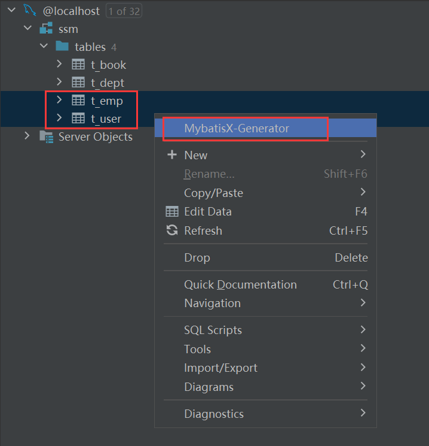

# 第01章_MyBatis简介

## 1. 项目架构

**单体架构**


**分布式架构**

一个项目（对应IDEA中的一个project），拆分成很多个模块（module），每一个模块都运行在自己的Tomcat上。每个模块都可以看成是一个单体架构的应用，模块之间可以互相调用。


## 2. ORM框架

ORM（Object-Relational Mapping，对象-关系映射）是一种将数据库和面向对象编程语言中的对象之间进行转换的技术。它将对象和关系型数据库的概念进行映射（一个类对应一张表，类的属性对应表的字段，类的一个对象对应表的一条记录），于是我们就可以**通过方法调用进行数据库操作**。

ORM框架通常有半自动和全自动两种方式：

- 半自动 ORM 通常需要程序员手动编写 SQL 语句
- 全自动 ORM 则是将实体类和数据表进行自动映射，使用 API 进行数据库操作时，会自动生成执行 SQL 语句并将查询结果转换成实体类对象

> 常见的半自动 ORM 框架包括 MyBatis 等；常见的全自动 ORM 框架包括 Hibernate、Spring Data JPA、MyBatis-Plus 等。

MyBatis最初是Apache的一个开源项目**iBatis**，之后该项目的开发团队转投Google Code旗下，于是iBatis3.x正式更名为MyBatis。MyBatis与其他持久化层技术的对比：

- **开发效率：Hibernate>Mybatis>JDBC**
- **运行效率：JDBC>Mybatis>Hibernate**

## 3. MyBatis的工作原理

对于1.x和2.x版本，iBatis进行数据库操作的方式如下：

1. 无需创建Mapper接口，只需要有Mapper映射文件即可，在该xml文件中直接编写sql语句
2. Mapper映射文件的名称空间namespace没有任何要求，随意声明一个字符串即可
3. 如果要使用SQL语句，只需创建出SqlSession对象后，调用它的CRUD方法即可

```xml
<mapper namespace="abc">
    <select id="666" resultType="com.wsy.pojo.Student">
        select * from student where sid = #{id}
    </select>
</mapper>
```

```java
/**
 * SqlSession提供的常见CRUD方法有：selectOne、selectList、insert、delete、update
 * 这些CRUD方法，本质上就是去映射文件中查找对应的SQL语句，然后执行
 * 以selectOne()方法为例：
 * - 第一个参数是一个String，需要传入SQL语句对应的namespace.id
 * - 第二个参数是一个Object，需要传入SQL语句所需的参数
 */
Student student = sqlSession.selectOne("abc.666", 1);
```

3.x版本后改名为MyBatis，使用方式也有所改变，MyBatis操作数据库的方式实际上是对iBatis的封装和优化。我们需要创建Mapper接口，而在执行`sqlSession.getMapper(StudentMapper.class)`时，底层会**使用JDK动态代理帮我们创建一个StudentMapper接口的代理实现类对象**。当我们调用Mapper接口的方法时，实际调用的是这个代理对象中的方法，在底层这个代理对象会根据接口全类名和方法名（拼接成字符串`接口全类名.方法名`），使用iBatis的方式查找并执行SQL语句。**因此在Mapper映射文件中namespace必须是接口的全类名，而SQL语句id必须是方法名**。

> 说明：Mapper接口里的方法可以重载，但是对应Mapper映射文件中的id不允许重复，也就是这多个重载方法只能对应同一个SQL语句。虽然我们也可以使用动态SQL来对这些重载方法进行区分，但一般来说我们还是并不推荐对Mapper接口进行方法重载。

## 4. 日志框架

在开发中我们禁止使用sout来打印日志信息，因为不方便统一管理和定位问题。我们应该使用日志框架，它不仅能灵活指定输出位置，还能设定级别进行统一管理，便于我们基于日志分析问题。使用Logback日志框架需要以下步骤：

（1）引入依赖

```xml
<dependency>
    <groupId>ch.qos.logback</groupId>
    <artifactId>logback-classic</artifactId>
    <version>1.2.3</version>
</dependency>
```

（2）配置文件：Logback要求配置文件名称必须是`logback.xml`，存放路径在main/resources目录下

```xml
<?xml version="1.0" encoding="UTF-8"?>
<configuration debug="true">
    <!-- 指定日志输出的位置，ConsoleAppender表示输出到控制台 -->
    <appender name="STDOUT" class="ch.qos.logback.core.ConsoleAppender">
        <encoder>
            <!-- 日志输出的格式 -->
            <!-- 按照顺序分别是：时间、日志级别、线程名称、打印日志的类、日志主体内容、换行 -->
            <pattern>[%d{HH:mm:ss.SSS}] [%-5level] [%thread] [%logger] [%msg]%n</pattern>
            <charset>UTF-8</charset>
        </encoder>
    </appender>

    <!-- 设置全局日志级别。日志级别按顺序分别是：TRACE、DEBUG、INFO、WARN、ERROR -->
    <!-- 指定任何一个日志级别都只打印当前级别和后面级别的日志。 -->
    <root level="INFO">
        <!-- 指定打印日志的appender，这里通过“STDOUT”引用了前面配置的appender -->
        <appender-ref ref="STDOUT" />
    </root>

    <!-- 根据特殊需求指定局部日志级别，可以是包名或全类名。 -->
    <logger name="com.wsy" level="DEBUG" additivity="false">
        <appender-ref ref="STDOUT" />
    </logger>

</configuration>
```

## 5. Lombok

```xml
<dependency>
    <groupId>org.projectlombok</groupId>
    <artifactId>lombok</artifactId>
    <version>1.18.24</version>
</dependency>
```

使用Lombok注解就可以省略生成setter、getter方法等固定格式代码的繁琐操作，提高开发效率。其底层原理是将自动生成的代码织入字节码文件中，从而实现**源代码没有，但是字节码文件有**。


|注解|作用|
|---|---|
|`@Data`|生成getter方法、setter方法、toString()、equals()、canEqual()、hashCode()|
|`@AllArgsConstructor`|生成全参构造器|
|`@NoArgsConstructor`|生成无参构造器|
|`@Slf4j`|生成日志对象|
|`@Getter`|生成getter方法|
|`@Setter`|生成setter方法|
|`@ToString`|生成toString()方法|
|`@Accessors(chain = true)`|字段的setter方法调用后会返回当前对象，即开启setter方法的链式调用|
|`@Builder`|开启建造者模式|


# 第02章_MyBatis核心功能

## 1. MyBatis的基本使用

### 1.1 引入依赖

```xml
<!-- mybatis依赖 -->
<dependency>
    <groupId>org.mybatis</groupId>
    <artifactId>mybatis</artifactId>
    <version>3.5.7</version>
</dependency>
<!-- junit5测试 -->
<dependency>
    <groupId>org.junit.jupiter</groupId>
    <artifactId>junit-jupiter-api</artifactId>
    <version>5.3.1</version>
    <scope>test</scope>
</dependency>
<!-- MySQL驱动 -->
<dependency>
    <groupId>mysql</groupId>
    <artifactId>mysql-connector-java</artifactId>
    <version>8.0.28</version>
</dependency>
<dependency>
    <groupId>ch.qos.logback</groupId>
    <artifactId>logback-classic</artifactId>
    <version>1.2.3</version>
</dependency>
<dependency>
    <groupId>org.projectlombok</groupId>
    <artifactId>lombok</artifactId>
    <version>1.18.24</version>
</dependency>
```

### 1.2 MyBatis核心配置文件

MyBatis核心配置文件，习惯上命名为`mybatis-config.xml`，放在src/main/resources目录下。将来被SpringBoot整合后这个配置文件可以省略。

```xml
<?xml version="1.0" encoding="UTF-8" ?>
<!DOCTYPE configuration
        PUBLIC "-//mybatis.org//DTD Config 3.0//EN"
        "http://mybatis.org/dtd/mybatis-3-config.dtd">
<configuration>
    <!--
        MyBatis核心配置文件中，标签的顺序：
        properties, settings, typeAliases, typeHandlers,
        objectFactory, objectWrapperFactory, reflectorFactory,
        plugins, environments, databaseIdProvider, mappers
    -->

    <!--引入properties文件-->
    <properties resource="jdbc.properties" />

    <!--设置连接数据库的环境-->
    <environments default="development">
        <environment id="development">
            <transactionManager type="JDBC"/>
            <dataSource type="POOLED">
                <property name="driver" value="${jdbc.driver}"/>
                <property name="url" value="${jdbc.url}"/>
                <property name="username" value="${jdbc.username}"/>
                <property name="password" value="${jdbc.password}"/>
            </dataSource>
        </environment>
    </environments>

    <!--引入Mapper映射文件-->
    <mappers>
        <package name="com.wsy.mapper"/>
    </mappers>
</configuration>
```

注意：使用子标签package批量引入Mapper映射文件，必须保证**Mapper接口所在的包要和Mapper映射文件所在的包最终的路径相同**，并且**Mapper接口名要和Mapper映射文件名相同**。如上，必须把Mapper接口(如`UserMapper`)创建到`main/java/com/wsy/mapper/`目录下，必须把对应的Mapper映射文件(如`UserMapper.xml`)创建到`main/resources/com/wsy/mapper/`目录下。

### 1.3 Mapper接口和映射文件

```java
public interface UserMapper {
    User selectUserById(@Param("id") Long id);
}
```

```xml
<?xml version="1.0" encoding="UTF-8" ?>
<!DOCTYPE mapper PUBLIC "-//mybatis.org//DTD Mapper 3.0//EN" "http://mybatis.org/dtd/mybatis-3-mapper.dtd" >
<mapper namespace="com.wsy.mapper.UserMapper">
    <select id="selectUserById" resultType="com.wsy.pojo.User">
        select * from t_user where id = #{id}
    </select>
</mapper>
```

- namespace必须指定**Mapper接口的全类名**
- SQL语句的**id**必须与接口中对应的**方法名**相同

### 1.4 其他配置文件

`logback.xml`：存放在main/resources目录下

`jdbc.properties`：存放在main/resources目录下

```properties
jdbc.driver=com.mysql.cj.jdbc.Driver
jdbc.url=jdbc:mysql://localhost:3306/mybatis
jdbc.username=root
jdbc.password=abc666
```

### 1.5 测试

```java
@Slf4j
public class MyBatisTest {

    private SqlSession sqlSession;

    // junit5会在每一个@Test方法前执行@BeforeEach方法
    @BeforeEach
    public void init() throws IOException {
        // 获取核心配置文件的输入流
        InputStream is = Resources.getResourceAsStream("mybatis-config.xml");
        // 获取SqlSessionFactory对象
        SqlSessionFactory sqlSessionFactory = new SqlSessionFactoryBuilder().build(is);
        // 获取SqlSession，它是MyBatis提供的操作数据库的对象。true表示开启自动提交事务。
        sqlSession = sqlSessionFactory.openSession(true);
    }

    // junit5会在每一个@Test方法后执行@AfterEach方法
    @AfterEach
    public void clear() {
        // 关闭SqlSession
        sqlSession.close();
    }

    @Test
    public void test() {
        // 获取UserMapper的代理实现类对象
        UserMapper userMapper = sqlSession.getMapper(UserMapper.class);
        // 调用UserMapper接口中的方法
        User user = userMapper.selectUserById(1L);
        log.info("user==>{}", user);
    }
}
```

> 说明：SqlSession代表Java程序和数据库之间的会话，而SqlSessionFactory是生产SqlSession的工厂。**工厂模式**：如果创建某一个对象，使用的过程基本固定，那么我们就可以把创建这个对象的相关代码封装到一个工厂类中，以后都使用这个工厂类来生产我们需要的对象。

## 2. SQL传参

给SQL语句传参有两种方式：`${}`和`#{}`

- `${}`的本质是**字符串拼接**（底层使用Statement方式），所以如果为字符串类型或日期类型的字段进行赋值时，需要手动加单引号。
- `#{}`的本质是**占位符赋值**（底层使用PreparedStatement方式），即会被解析成`?`然后进行占位符赋值。

> **说明**：除非某些特定场景，正常情况下都不会采用`${}`的方式传值，因为会有SQL注入攻击的风险。

### 2.1 单个参数

#### 1、普通类型

```java
User selectUserById(Long id);
```

取值方式为`#{变量名}`，示例如下：

```xml
<select id="selectUserById" resultType="com.wsy.pojo.User">
    select * from t_user where id = #{id}
</select>
```

> 说明：事实上，对于单个普通类型的参数，在`#{}`中可以写任意名称，但我们并不推荐这么做。

#### 2、对象类型

```java
int insertUser(User user);
```

取值方式为`#{对象的属性名}`，注意属性名要与getter方法对应，示例如下：

```xml
<insert id="insertUser">
    insert into t_user (username, password, age, gender, email)
    values (#{username}, #{password}, #{age}, #{gender}, #{email})
</insert>
```

#### 3、Map类型

```java
int insertUserByMap(Map<String, Object> map);
```

取值方式为`#{key}`，示例如下：

```xml
<insert id="insertUserByMap">
    insert into t_user (username, password)
    values (#{username}, #{password})
</insert>
```

#### 4、List类型

```java
int deleteFirstUser(@Param("idList") List<Long> idList);
```

取值方式为`#{指定名称[索引]}`，示例如下：

```xml
<delete id="deleteFirstUser">
    delete from t_user where id = #{idList[0]}
</delete>
```

### 2.2 多个参数

对于多个参数，则必须使用`@Param`注解指定名称。使用`@Param`注解后的取值方式如下：

- 普通类型：`#{指定名称}`
- 对象类型：`#{指定名称.属性名}`
- Map类型：`#{指定名称.key}`
- List类型：`#{指定名称[索引]}`

> 说明：即使是单个参数的情形，我们也更推荐使用`@Param`注解指定名称。

示例：

```java
int updateUser(@Param("id") Long id, 
               @Param("user") User user, 
               @Param("map") Map<String, Object> map, 
               @Param("idList") List<Long> idList);
```

```xml
<update id="updateUser">
    update t_user set username = #{user.username}, password = #{user.password},
                      age = #{map.age}, gender = #{map.gender}
    where id = #{id} and id != #{idList[0]}
</update>
```

## 3. resultType

> 注意：对于增删改操作，返回的结果是受影响的行数，用int或long接收即可。而对于查询语句，则需要指定resultType或resultMap。

### 3.1 查询单条记录

#### 1、转换为实体类

```xml
<!-- User selectUserById(@Param("id") Long id); -->
<select id="selectUserById" resultType="com.wsy.pojo.User">
    select * from t_user where id = #{id}
</select>
```

注1：当查询的数据为多条时，不能使用实体类作为返回值，否则会抛出异常TooManyResultsException。

注2：查询标签select必须设置属性resultType或resultMap，用于指定实体类和数据库表的映射关系

- resultType：指定全类名，用于属性名和表中字段名一致的情况
- resultMap：自定义映射，用于一对多或多对一或字段名和属性名不一致的情况

#### 2、转换为Map

```xml
<!-- Map<String, Object> selectUserByIdToMap(@Param("id") Long id); -->
<select id="selectUserByIdToMap" resultType="java.util.Map">
    select * from t_user where id = #{id}
</select>
```

### 3.2 查询多条记录

#### 1、转换为实体类

```xml
<!-- List<User> selectAllUsers(); -->
<select id="selectAllUsers" resultType="com.wsy.pojo.User">
    select * from t_user
</select>
```

> 注意：如果查询结果是一个List集合，resultType中只需写泛型的类型即可。

#### 2、转换为Map

```xml
<!-- List<Map<String, Object>> selectAllUsersToMap(); -->
<select id="selectAllUsersToMap" resultType="java.util.Map">
    select * from t_user
</select>
```

### 3.3 查询单个数据

```xml
<!-- Integer getUserCount(); -->
<select id="getUserCount" resultType="java.lang.Integer">
    select count(*) from t_user
</select>
```

> 注意：在MyBatis中，对于Java中常用的类型都设置了类型别名。例如，若返回值为Integer，则resultType中可以写`Integer`、`int`(不区分大小写)；若返回值为int，则resultType中可以写`_Integer`、`_int`(不区分大小写)。当然写全类名如`java.lang.Integer`肯定也是没问题的。

## 4. resultMap

### 4.1 处理字段和属性的映射

若数据库表中的字段名和实体类中的属性名不一致，我们有以下三种处理方法：

#### 方式1：设置别名

在SQL语句中为查询的字段来设置别名，和属性名保持一致

```xml
<!-- Emp selectEmpById(@Param("empId") Long empId); -->
<select id="selectEmpById" resultType="com.wsy.pojo.Emp">
    select emp_id empId, emp_name empName, age from t_emp where emp_id = #{empId}
</select>
```

#### 方式2：配置下划线映射小驼峰

当字段符合MySQL的规范(即使用下划线连接)，而属性符合Java的规范(即使用小驼峰)，此时可以在MyBatis的核心配置文件中设置一个全局配置，从而自动将下划线映射为小驼峰。

```xml
<settings>
    <!-- 将下划线映射为小驼峰 -->
    <setting name="mapUnderscoreToCamelCase" value="true"/>
</settings>
```

只要满足该命名规范并进行了上述全局配置，则正常编写SQL语句即可：

```xml
<!-- Emp selectEmpById(@Param("empId") Long empId); -->
<select id="selectEmpById" resultType="com.wsy.pojo.Emp">
    select * from t_emp where emp_id = #{empId}
</select>
```

#### 方式3：使用resultMap自定义映射

使用resultMap自定义映射关系，属性`id`唯一标识了该resultMap，属性`type`则表示需要定义映射的实体类。常用子标签如下：

- id：设置主键的映射关系
- result：设置普通字段的映射关系
- association：设置对象属性的映射关系
- collection：设置集合属性的映射关系

这些子标签中的属性`column`表示映射关系中数据库表中的字段名，而`property`表示映射关系中Java实体类的属性名。

```xml
<resultMap id="empResultMap" type="com.wsy.pojo.Emp">
    <!-- id处理主键的映射关系 -->
    <id column="emp_id" property="empId" />
    <!-- result处理普通字段的映射关系 -->
    <result column="emp_name" property="empName" />
    <result column="age" property="age" />
</resultMap>
```

这样，我们在编写SQL语句时，只需要在属性`resultMap`中指定自定义映射的唯一标识id即可：

```xml
<!-- Emp selectEmpById(@Param("empId") Long empId); -->
<select id="selectEmpById" resultMap="empResultMap">
    select * from t_emp where emp_id = #{empId}
</select>
```

### 4.2 处理多对一映射

**对一关系，指的是查询出来的多个字段只对应于实体类对象的一个属性**。例如Emp类中有一个属性`private Dept dept;`用于表示所在部门的信息，那么我们查询出来的关于部门的信息（如部门id、部门名称等字段）就需要封装到一个部门对象中，然后对应到Emp类的dept属性。

处理多对一映射的方式有以下3种：

#### 方式1：级联

利用resultMap自定义映射结合多表查询的SQL语句，注意其中关于部门的属性名，直接用`dept.deptId`的方式，这就是级联。

```xml
<!-- Emp selectEmpDetail(@Param("empId") Long empId); -->
<select id="selectEmpDetail" resultMap="empDetailResultMap">
    select e.emp_id, e.emp_name, e.age, d.dept_id, d.dept_name
    from t_emp e left join t_dept d on e.dept_id = d.dept_id
    where e.emp_id = #{empId}
</select>

<resultMap id="empDetailResultMap" type="com.wsy.pojo.Emp">
    <id column="emp_id" property="empId" />
    <result column="emp_name" property="empName" />
    <result column="age" property="age" />
    <result column="dept_id" property="dept.deptId" />
    <result column="dept_name" property="dept.deptName" />
</resultMap>
```

#### 方式2：association

association可以处理多对一的映射关系，注意association只能用于设置**对象类型**的属性。

```xml
<!-- Emp selectEmpDetail(@Param("empId") Long empId); -->
<select id="selectEmpDetail" resultMap="empDetailResultMap">
    select e.emp_id, e.emp_name, e.age, d.dept_id, d.dept_name
    from t_emp e left join t_dept d on e.dept_id = d.dept_id
    where e.emp_id = #{empId}
</select>

<resultMap id="empDetailResultMap" type="com.wsy.pojo.Emp">
    <id column="emp_id" property="empId" />
    <result column="emp_name" property="empName" />
    <result column="age" property="age" />
    <!-- javaType用于指定该属性对应的Java类型 -->
    <association property="dept" javaType="com.wsy.pojo.Dept">
        <id column="dept_id" property="deptId" />
        <result column="dept_name" property="deptName" />
    </association>
</resultMap>
```

> 说明：association标签的属性property指明了要处理的Emp类中的属性名是dept，javaType指明了该属性的实体类类型是Dept。然后在子标签中，指明查询字段和Dept类中的属性之间的对应关系。

#### 方式3：分步查询

不再通过多表连接查询从一条SQL语句中获取所有信息，而是分成多步来查询，具体而言：第一步是在员工表中查询员工信息，第二步是根据所查到的`dept_id`再到部门表中查询该部门的信息。

### 4.3 处理一对多映射

**对多关系，指的是实体类对象的一个属性，对应多条查询记录**。例如Dept类中有一个属性`private List<Emp> empList;`用于表示该部门所有员工的信息，那么我们查询出来的多条记录中，关于员工信息的字段就需要封装到该属性中。

处理一对多映射的方式有以下2种：

#### 方式1：collection

collection可以处理一对多的映射关系，注意collection只能用于设置**集合类型**的属性。

```xml
<!-- Dept selectDeptDetail(@Param("deptId") Long deptId); -->
<select id="selectDeptDetail" resultMap="deptDetailResultMap">
    select e.emp_id, e.emp_name, e.age, d.dept_id, d.dept_name
    from t_dept d left join t_emp e on e.dept_id = d.dept_id
    where d.dept_id = #{deptId}
</select>

<resultMap id="deptDetailResultMap" type="com.wsy.pojo.Dept">
    <id column="dept_id" property="deptId" />
    <result column="dept_name" property="deptName" />
    <!-- ofType用于指定集合类型的属性中存储的数据的Java类型 -->
    <collection property="empList" ofType="com.wsy.pojo.Emp">
        <id column="emp_id" property="empId" />
        <result column="emp_name" property="empName" />
        <result column="age" property="age" />
    </collection>
</resultMap>
```

> 说明：collection标签的属性property指明了要处理的Dept类中的属性名是empList，ofType指明了该属性是一个集合，其中的每个对象的类型是Emp。然后在子标签中，指明查询字段和Emp类中的属性之间的对应关系。

#### 方式2：分步查询

不再通过多表连接查询从一条SQL语句中获取所有信息，而是分成多步来查询，具体而言：第一步是在部门表中查询部门信息，第二步是根据部门id，到员工表中查询相关员工信息。

## 5. 特殊SQL

### 5.1 模糊查询

**方式1(推荐)：**

```xml
<!-- List<User> selectLikelyUser(@Param("name") String name); -->
<select id="selectLikelyUser" resultType="com.wsy.pojo.User">
    select * from t_user where username like "%"#{name}"%"
</select>
```

**方式2：**

```xml
<!-- List<User> selectLikelyUser(@Param("name") String name); -->
<select id="selectLikelyUser" resultType="com.wsy.pojo.User">
    select * from t_user where username like '%${name}%'
</select>
```

> 注意：不能使用`'%#{name}%'`，因为`#{}`本质上会被解析成`?`，而在引号内的`?`默认会被认为是字符串的一部分，而并不是占位符。

### 5.2 动态设置表名

```xml
<!-- List<User> selectUserList(@Param("tableName") String tableName); -->
<select id="selectUserList" resultType="com.wsy.pojo.User">
    select * from ${tableName}
</select>
```

> 注意：由于表名不能用引号包裹，所以无法使用`#{}`的方式。

### 5.3 主键回显

获取自增长的主键：

```xml
<!-- int insertUser(User user); -->
<insert id="insertUser" useGeneratedKeys="true" keyProperty="id">
    insert into t_user (username, password, age, gender, email)
    values (#{username}, #{password}, #{age}, #{gender}, #{email})
</insert>
```

- 设置`useGeneratedKeys="true"`表示使用主键回显功能
- keyProperty表明要将主键的值放在实体类对象的哪个属性中。必须设置该属性是因为，增删改操作统一的返回值是受影响的行数，因此**只能将获取的自增主键值放在传输的参数User对象的某个属性中**。

## 6. 动态SQL

动态SQL是MyBatis的强大特性之一，可以根据特定条件动态拼装SQL语句。

### 6.1 if标签

if标签可以通过test属性的表达式（这是一种OGNL表达式）进行判断，若表达式的结果为true，则if标签中的内容会拼接到SQL中。**注意在test属性的表达式中书写的并不是数据库表的字段**。

```xml
<!-- List<Emp> selectEmpByCondition(@Param("emp") Emp emp); -->
<select id="selectEmpByCondition" resultType="com.wsy.pojo.Emp">
    select * from t_emp where 1 = 1
    <if test="emp.empName != null and emp.empName != ''">
        and emp_name = #{emp.empName}
    </if>
    <if test="emp.age != null">
        and age = #{emp.age}
    </if>
</select>
```

> 说明：如果仅使用if标签，为了拼接不产生问题，一般都需要在where后添加`1=1`之类的恒成立条件。

### 6.2 where标签

where标签一般结合if标签一起使用：

- 若where标签中有条件成立，会自动生成where关键字
- 若where标签中没有任何一个条件成立，则where没有任何功能，即不会生成where关键字
- 会自动将where标签中拼接完后的内容前多余的and/or去掉，但是内容后多余的and/or无法去掉

```xml
<!-- List<Emp> selectEmpByCondition(@Param("emp") Emp emp); -->
<select id="selectEmpByCondition" resultType="com.wsy.pojo.Emp">
    select * from t_emp
    <where>
        <if test="emp.empName != null and emp.empName != ''">
            and emp_name = #{emp.empName}
        </if>
        <if test="emp.age != null">
            and age = #{emp.age}
        </if>
    </where>
</select>
```

### 6.3 set标签

实际开发中，要对一个实体类对象进行更新，但往往不是更新所有字段，而是只更新一部分字段。此时页面上的表单往往只会给需要修改的字段提供表单项。如果我们直接拿整个Emp对象去更新数据库，那么某些在表单项上没有的字段则会被更新为null，这显然是不符合需求的。所以我们需要在Mapper映射文件中对update语句的set子句进行定制，这时候就可以使用动态SQL的set标签。

```xml
<!-- int updateEmpDynamic(@Param("emp") Emp emp); -->
<update id="updateEmpDynamic">
    update t_emp
    <!-- set标签会自动去掉拼接完后两端多余的逗号 -->
    <set>
        <if test="emp.empName != null and emp.empName != ''">
            emp_name = #{emp.empName},
        </if>
        <if test="emp.age != null and emp.age &lt; 100">
            age = #{emp.age},
        </if>
    </set>
    where emp_id = #{emp.empId}
</update>
```

### 6.4 trim标签

trim标签比where标签和set标签功能更强。对于在trim标签中拼接完后的内容，可以设置属性来在前面或后面添加或删除一些内容：

- prefix、suffix：在内容前面或后面添加指定内容(如果标签中的if条件都不满足，则不会添加前后缀)
- prefixOverrides、suffixOverrides：在内容前面或后面去掉指定内容，可以使用`|`来分隔有可能的多个值

```xml
<!-- List<Emp> selectEmpByCondition(@Param("emp") Emp emp); -->
<select id="selectEmpByCondition" resultType="com.wsy.pojo.Emp">
    select * from t_emp
    <trim prefix="where" prefixOverrides="and|or">
        <if test="emp.empName != null and emp.empName != ''">
            and emp_name = #{emp.empName}
        </if>
        <if test="emp.age != null">
            and age = #{emp.age}
        </if>
    </trim>
</select>
```

### 6.5 choose、when、otherwise标签

在多个分支条件中，**仅执行一个**：

- 从上到下依次执行条件判断
- 遇到的第一个满足条件的分支会被采纳
- 被采纳分支后面的分支都将不被考虑
- 如果所有的when分支都不满足，那么就执行otherwise分支

when就相当于if/else if，而otherwise就相当于else。所以when至少设置一个，otherwise最多设置一个。

```xml
<!-- List<Emp> selectEmpByOneCondition(@Param("emp") Emp emp); -->
<select id="selectEmpByOneCondition" resultType="com.wsy.pojo.Emp">
    select * from t_emp
    <where>
        <choose>
            <when test="emp.empName != null and emp.empName != ''">
                emp_name = #{emp.empName}
            </when>
            <when test="emp.age != null">
                age = #{emp.age}
            </when>
            <otherwise>
                dept_id = 1
            </otherwise>
        </choose>
    </where>
</select>
```

### 6.6 sql标签

sql标签可以记录一段公共的SQL片段，在使用的地方通过include标签进行引入即可：

```xml
<!-- List<Emp> selectAllEmps(); -->
<select id="selectAllEmps" resultType="com.wsy.pojo.Emp">
    select
    <include refid="empColumns"/>
    from t_emp
</select>

<sql id="empColumns">
    emp_id, emp_name, age
</sql>
```

### 6.7 foreach标签

foreach标签的属性：
- collection：指定要遍历的数组或集合
- item：表示在遍历过程中每一个元素的别名。对于List或数组，代表每个元素值；对于Map，代表每个键值对的value值。
- index：表示在遍历过程中的位置。对于List或数组，代表每个元素的索引值；对于Map，代表每个键值对的key值。
- separator：指定遍历的数据之间的分隔符（分隔符的前后会默认添加一个空格，所以可以放心设置`"or"`这样的分隔符，无需自己手动添加空格）
- open：给遍历完成后的内容添加前缀
- close：给遍历完成后的内容添加后缀

#### 1、批量查询

```xml
<!-- List<Emp> batchSelectEmp(@Param("idList") List<Long> idList); -->
<select id="batchSelectEmp" resultType="com.wsy.pojo.Emp">
    select * from t_emp where emp_id in
    <foreach collection="idList" item="id" separator="," open="(" close=")">
        #{id}
    </foreach>
</select>
```

#### 2、批量删除

```xml
<!-- int batchDeleteEmp(@Param("idList") List<Long> idList); -->
<delete id="batchDeleteEmp">
    delete from t_emp where emp_id in
    <foreach collection="idList" item="id" separator="," open="(" close=")">
        #{id}
    </foreach>
</delete>
```

#### 3、批量插入

```xml
<!-- int batchInsertEmp(@Param("empList") List<Emp> empList); -->
<insert id="batchInsertEmp">
    insert into t_emp (emp_name, age) values 
    <foreach collection="empList" item="emp" separator=",">
        (#{emp.empName}, #{emp.age})
    </foreach>
</insert>
```

#### 4、批量更新

批量查询/删除/插入在本质上其实是一条SQL语句，而实现批量更新则需要多条SQL语句拼起来，用分号分开。也就是一次性发送多条SQL语句让数据库执行，此时需要在数据库连接信息的URL地址中设置参数`?allowMultiQueries=true`。对应的foreach标签如下：

```xml
<!-- int batchUpdateEmp(@Param("empList") List<Emp> empList); -->
<update id="batchUpdateEmp">
    <foreach collection="empList" item="emp" separator=";">
        update t_emp set emp_name = #{emp.empName} where emp_id = #{emp.empId}
    </foreach>
</update>
```


# 第03章_Mybatis高级特性

## 1. 缓存机制

MyBatis拥有缓存机制，其中一级缓存默认开启，二级缓存需要手动配置开启。

### 1.1 一级缓存

**一级缓存是SqlSession级别的（当前事务共享）**，通过同一个SqlSession查询的数据会被缓存，下次执行相同的查询语句，就会从缓存中直接获取，不会从数据库重新访问。Mybatis的一级缓存是默认开启的。

**使一级缓存失效的几种情况**：

1. 不同的SqlSession对应不同的一级缓存
2. 同一个SqlSession但是查询条件不同
3. 同一个SqlSession两次查询期间执行了任何一次增删改操作（增删改操作会自动清空一级、二级缓存）
4. 同一个SqlSession两次查询期间手动清空了缓存（`sqlSession.clearCache();`）
5. 同一个SqlSession两次查询期间提交了事务

### 1.2 二级缓存

**二级缓存是SqlSessionFactory级别的（所有事务共享）**，通过同一个SqlSessionFactory创建的SqlSession查询的结果会被缓存，此后若再次执行相同的查询语句，结果就会从缓存中获取。

MyBatis的二级缓存需要手动配置开启：

1. 在Mapper映射文件中设置标签`<cache />`
2. 查询的数据所转换的实体类类型必须实现Serializable接口

**使二级缓存失效的情况**：

- 两次查询期间执行了任意的增删改操作，会使一级和二级缓存同时失效

### 1.3 MyBatis缓存查询的顺序

MyBatis缓存查询的顺序是：

- 先查询二级缓存，因为二级缓存中可能会有其他程序已经查出来的数据，可以拿来直接使用。
- 如果二级缓存没有命中，再查询一级缓存
- 如果一级缓存也没有命中，则查询数据库
- SqlSession关闭之后，一级缓存中的数据会写入二级缓存

## 2. 插件机制

### 2.1 简介

MyBatis使用**拦截器**机制提供了插件功能，方便用户在SQL执行前后进行拦截增强。底层实际上是使用JDK动态代理，为需要拦截的接口生成代理对象来实现的。拦截器可以拦截以下四个对象的执行：

1. ParameterHandler：用于处理SQL的参数
2. ResultSetHandler：用于处理SQL的返回结果集
3. StatementHandler：数据库的处理对象，用于处理SQL语句
4. Executor：MyBatis的执行器，用于执行增删改查操作

如果我们想自定义插件，则需要实现Interceptor接口并重写`intercept()`方法，然后使用注解`@Intercepts`来标注需要拦截的接口方法，最后在MyBatis的核心配置文件中配置我们编写的插件。

### 2.2 PageHelper

PageHelper是MyBatis中著名的**分页插件**，它支持多种数据库。PageHelper使用了MyBatis的插件机制，在底层编写了**分页拦截器**，从而在SQL查询前会自动拼装分页信息。使用PageHelper需要做如下配置：

（1）引入依赖

```xml
<dependency>
    <groupId>com.github.pagehelper</groupId>
    <artifactId>pagehelper</artifactId>
    <version>5.2.0</version>
</dependency>
```

（2）在MyBatis核心配置文件中配置插件

```xml
<plugins>
    <!--设置分页插件-->
    <plugin interceptor="com.github.pagehelper.PageInterceptor">
        <property name="helperDialect" value="mysql"/>
    </plugin>
</plugins>
```

> 其中，com.github.pagehelper.PageInterceptor 是 PageHelper 插件的名称，helperDialect属性用于指定数据库类型（因为分页插件支持多种数据库）

### 2.3 PageHelper基本使用

#### 1、开启分页功能

在查询之前使用`PageHelper.startPage(int pageNum, int pageSize)`开启分页功能

- pageNum：第几页（页码从1开始递增）
- pageSize：每页的记录数

**注意**：开启分页功能后，就会在SQL语句后面自动**附加LIMIT子句**并查询**总记录数**。分页功能对原有的Mapper接口、SQL语句没有任何影响，这个效果称之为非侵入式，也可以说是可插拔的。

> 自动附加的其实就是`LIMIT index, pageSize`子句，其中`index=(pageNum-1)*pageSize`

#### 2、进行分页查询

正常使用SQL查询语句获取对象的List集合，就会自动进行分页查询。

**注意**：只有紧跟在`PageHelper.startPage()`之后的那一个查询，才具有分页的功能。

#### 3、封装分页数据

使用PageInfo封装分页相关数据：

```java
// list是分页查询得到的数据，navigatePages用于指定导航分页栏的页码数
PageInfo<T> pageInfo = new PageInfo<>(List<T> list, int navigatePages);
```

PageInfo中的分页相关数据有：

- pageNum：当前页的页码
- pageSize：每页的记录数
- size：当前页显示的真实记录数
- total：总记录数
- pages：总页数
- prePage：上一页的页码
- nextPage：下一页的页码
- isFirstPage/isLastPage：是否为第一页/最后一页
- hasPreviousPage/hasNextPage：是否存在上一页/下一页
- navigatePages：导航分页栏的页码数
- navigatepageNums：导航分页栏的页码，例如`[1,2,3,4,5]`

#### 4、示例代码

```java
@Test
public void testPageHelper() {
    // 省略获取sqlSession的步骤
    EmpMapper empMapper = sqlSession.getMapper(EmpMapper.class);

    // 1. 开启分页功能，查第8页，每页4条数据
    PageHelper.startPage(8, 4);
    // 2. 正常进行查询
    List<Emp> empList = empMapper.selectAllEmps();
    // 3. 封装分页相关数据
    PageInfo<Emp> pageInfo = new PageInfo<>(empList, 5);

    log.info("pageInfo={}", pageInfo);
    log.info("total={}", pageInfo.getTotal()); // 总记录数
    log.info("pages={}", pageInfo.getPages()); // 总页数
    log.info("pageNum={}", pageInfo.getPageNum()); // 当前页码
    log.info("pageSize={}", pageInfo.getPageSize()); // 每页的记录数
    log.info("list={}", pageInfo.getList()); // 查询页的数据集合
}
```

## 3. 逆向工程

MyBatis的逆向工程是一种**自动化生成持久层代码和映射文件的工具**，它可以根据数据库表结构生成对应的实体类、Mapper映射文件、Mapper接口等代码。**注意：逆向工程只能生成单表的CRUD，多表查询依然需要我们自己编写**。

（1）安装MyBatisX插件


（2）IDEA中连接数据库


（3）选择要逆向生成的表，右键使用MyBatis插件即可




