# 第01章_IoC基本原理

## 1. Spring简介

官网地址：https://spring.io/

Spring 框架是 Java 平台上的一个开源应用框架，它最初是由 Rod Johnson 编写的，并且于 2003 年 6 月首次在 Apache 2.0 许可下发布。Spring 框架可以用于开发任何 Java 应用程序，其目标是使 J2EE 开发变得更容易。

**广义的Spring**：指的是以 Spring Framework 为基础的整个 Spring 技术栈。

**狭义的Spring**：指的是基础框架 Spring Framework。

Spring Framework的主要功能模块有：

|功能模块|功能介绍|
|-|-|
|Core Container|核心容器，在Spring环境下使用任何功能都必须基于IoC容器|
|AOP|面向切面编程|
|Data Access|提供对ORM框架的支持，以及事务管理等功能|
|Web|提供了面向Web应用程序的集成功能|
|Test|提供对测试框架的支持|

## 2. IoC

**IoC（Inversion of Control，控制反转）**是一种设计思想，而不是一个具体的技术实现。IoC的思想就是将原本在程序中手动管理对象的控制权（创建、获取、销毁等），交由Spring框架来管理。IoC的思想并非Spring特有，在其他语言中也有应用。

- **控制**：指的是对象创建、获取、销毁等的权力
- **反转**：控制权交给外部环境，即交给Spring框架的IoC容器

将对象之间的相互依赖关系交给IoC容器来管理，并由IoC容器完成对象的自动注入（称为**依赖注入**，DI，Dependency Injection），这样可以很大程度上简化应用的开发，把应用从复杂的依赖关系中解放出来。IoC容器就像是一个工厂一样，当我们需要创建一个对象的时候，只需要添加注解并进行配置即可，完全不用考虑对象是如何被创建出来的。

> 在Spring中，IoC容器是Spring用来实现IoC思想的载体。被IoC容器所管理的对象，我们称之为**Bean**。

## 3. IoC容器

Servlet容器（Tomcat）能够管理 Servlet、Filter、Listener 这样的组件的一生，所以它是一个复杂容器。而**IoC容器也是一个复杂容器，是负责实例化、配置、组装、管理Bean的核心容器**。Spring中与IoC容器相关的继承体系如下：

**1、BeanFactory接口**

这是IoC容器的标准化超接口，是Spring框架内部使用的接口，不提供给开发人员使用。

**2、ApplicationContext接口**

BeanFactory的子接口，提供了更多高级特性，面向Spring的使用者。对我们开发人员来说，可以认为ApplicationContext就是代表整个IoC容器技术体系的顶级接口。

**3、ApplicationContext的主要实现类**

- `ClassPathXmlApplicationContext`：通过读取类路径下的 XML 格式的配置文件创建 IoC 容器
- `FileSystemXmlApplicationContext`：通过文件系统路径读取 XML 格式的配置文件创建 IoC 容器
- `AnnotationConfigApplicationContext`：通过读取 Java 配置类创建 IoC 容器
- `WebApplicationContext`：专门为 Web 应用准备，基于 Web 环境创建 IoC 容器，并将对象存入 ServletContext 域中。

> 说明：在Spring早期，通常使用XML配置文件的方式来让IoC容器管理Bean。但是，读取和解析XML文件的效率非常低。现在，我们推荐使用**注解+配置类**的方式来让IoC容器管理Bean。

## 4. IoC容器底层原理

### 4.1 保存Bean定义信息的流程

1. 指定配置类或配置文件后创建IoC容器
2. BeanDefinitionReader接口会解析其中定义的Bean的id信息以及类型信息
3. 然后保存到DefaultListableBeanFactory类的beanDefinitionMap属性中
4. **beanDefinitionMap属性**是一个`Map<String, BeanDefinition>`，其中key保存Bean的id，而value保存Bean的定义信息（如beanClass、scope等）

### 4.2 获取Bean实例的流程

获取单例Bean实例的核心源码为：

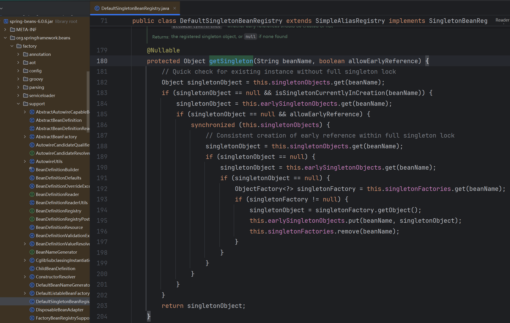

流程如下：

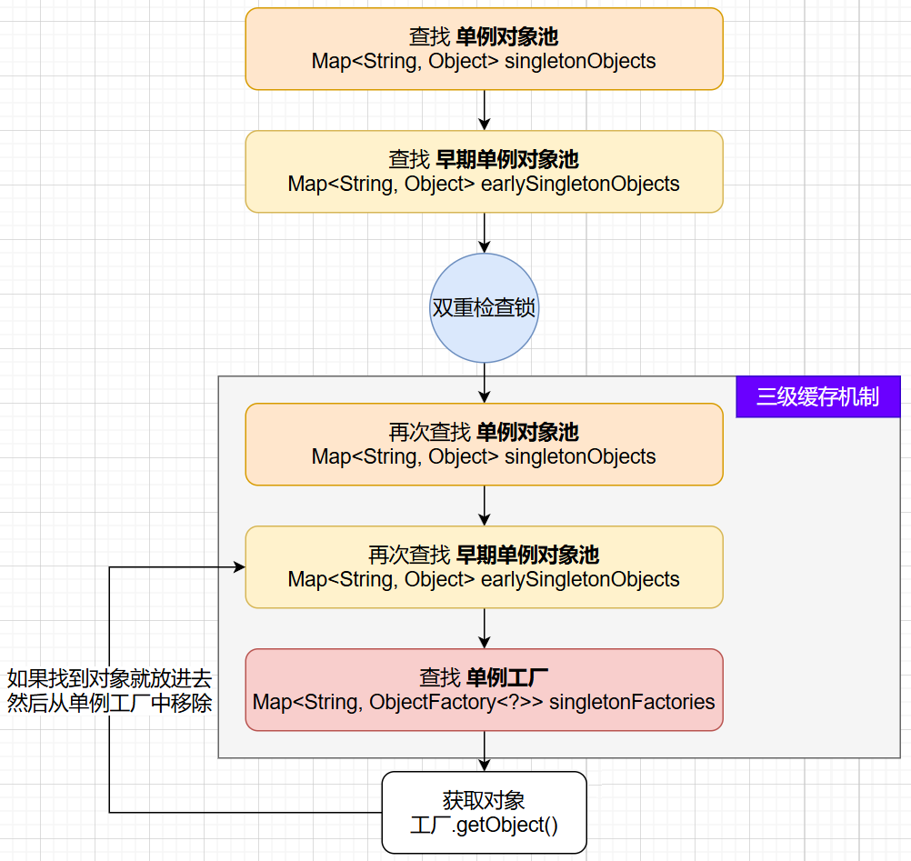

说明：

- 单例工厂的设计思想类似于FactoryBean机制，主要是用于获取那些由工厂创建出来的Bean对象
- 双重检查锁的作用是在并发场景下也能保证单例

**三级缓存机制主要是为了解决循环依赖的问题**。单例对象池相当于一个成品区，所有创建完成并且属性赋值完成的对象会保存在这里；而早期单例对象池相当于一个半成品区，所有创建完成但尚未完成属性赋值的对象会保存在这里，等它们完成属性赋值后才会移动到单例对象池。因此，由于在属性注入时会依次查询这三级缓存，所以发生循环依赖时也能正确进行属性赋值，而不会报错，如下图所示：

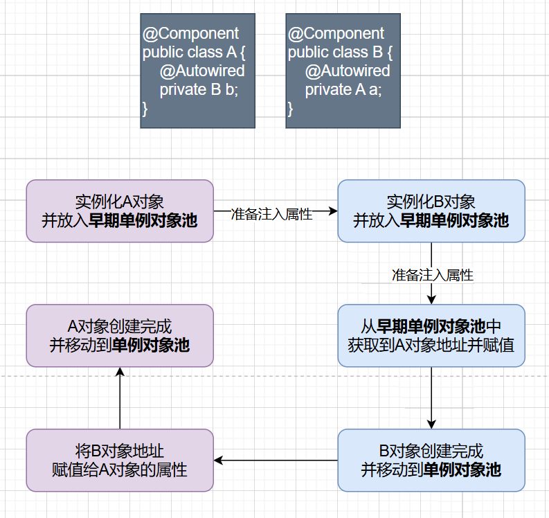

### 4.3 IoC容器启动流程

IoC容器启动的核心源码在`AbstractApplicationContext`类的`refresh()`方法中，共有12个核心步骤：

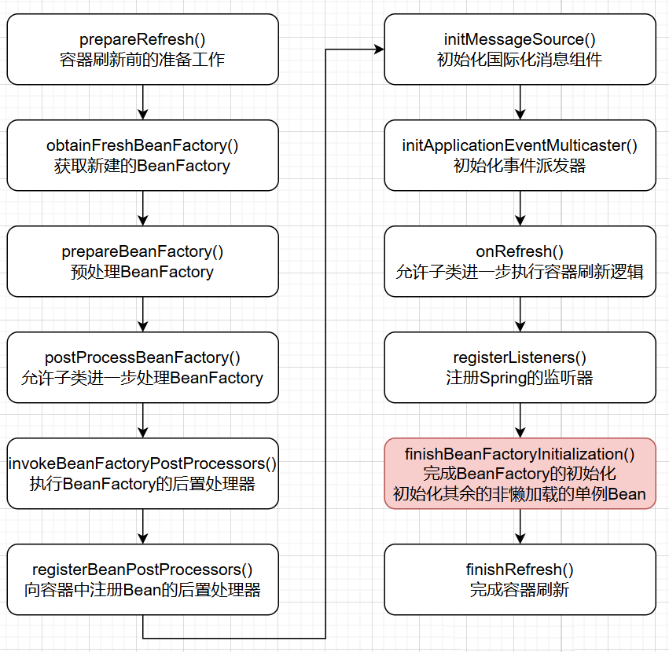


# 第02章_IoC-配置文件

使用Spring框架需要引入spring-context依赖，它是Spring的基础依赖：

```xml
<dependency>
    <groupId>org.springframework</groupId>
    <artifactId>spring-context</artifactId>
    <version>6.0.6</version>
</dependency>
```

> 说明：基于XML配置文件来让IoC管理Bean的方式只在Spring早期使用较多，现在已经不推荐使用，本章内容只需做简单了解即可。

## 1. Bean的创建

（1）首先创建一个需要交给IoC容器管理的类，如`com.ioc.Student`

（2）在`resources`目录下创建Spring的xml配置文件`applicationContext.xml`

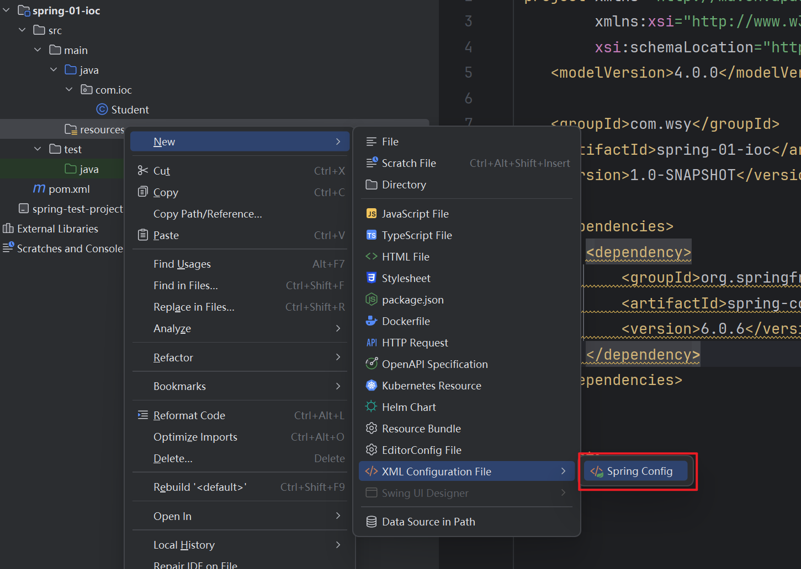

（3）在xml配置文件中配置Bean

```xml
<bean id="student" class="com.ioc.Student"></bean>
```

- id属性：Bean的唯一标识
- class属性：组件类的全类名

（4）测试

```xml
<!-- junit5测试 -->
<dependency>
    <groupId>org.junit.jupiter</groupId>
    <artifactId>junit-jupiter-api</artifactId>
    <version>5.3.1</version>
    <scope>test</scope>
</dependency>
```

```java
@Test
public void test() {
    // 指定配置文件并实例化IoC容器，可以传入多个配置文件
    ApplicationContext ioc = new ClassPathXmlApplicationContext("applicationContext.xml");
    // 获取IoC容器中的bean
    Student student = ioc.getBean(Student.class);
    student.sayHello();
}
```

## 2. Bean的获取

### 2.1 根据id获取Bean

由于id属性指定了bean的唯一标识，所以根据bean id可以精确获取到一个组件对象

```java
Student student = (Student) ioc.getBean("student");
```

### 2.2 根据类型获取Bean

这种方式要求IoC容器中有且仅有一个类型匹配的bean。由于在实际开发中，我们为同一个类往往只会配置一个bean，所以我们推荐使用这种方式获取Bean。

```java
Student student = ioc.getBean(Student.class);
```

**注意**：

1. 如果组件类实现了接口，则我们可以**根据接口类型来获取bean**（前提是bean唯一）。而且这种方式，我们开发中也推荐使用。

   ```java
   // Student类实现了Person接口
   Person student = ioc.getBean(Person.class);
   ```

2. 如果一个接口有多个实现类，且这些实现类都在IoC容器中配置了bean，那么我们不能根据接口类型来获取bean，因为bean不唯一。

**结论**：根据类型来获取bean时，在满足bean唯一性的前提下，其实只是看`对象 instanceof 指定的类型`的返回结果，只要返回的是true就可以认定为和类型匹配，能够获取到。

### 2.3 根据id和类型获取Bean

```java
Student student = ioc.getBean("student", Student.class);
```

## 3. 属性注入方式

### 3.1 setter方式注入

通过property标签配置的属性值会通过setter方法注入

- name：设置需要赋值的属性名（和settter方法有关）
- value：设置为属性所赋的值（字面量）

```xml
<bean id="student" class="com.ioc.Student">
    <property name="studentId" value="1001" />
    <property name="studentName" value="张三" />
    <property name="age" value="23" />
    <property name="gender" value="男" />
</bean>
```

### 3.2 构造器方式注入

通过constructor-arg标签会调用有参构造器来注入属性值

```xml
<bean id="student" class="com.ioc.Student">
    <constructor-arg value="1002" />
    <constructor-arg value="李四" />
    <constructor-arg value="24" />
    <constructor-arg value="女" />
</bean>
```

## 4. 属性赋值

### 4.1 特殊字符赋值

如果一个字符串内容中包含`<`等特殊字符，则不能直接赋值，因为`<`在XML文件中用于定义标签的开始。我们有以下两种方式来处理特殊字符赋值：

```xml
<!-- 方式一：使用XML实体来代替 -->
<property name="studentName" value="&lt;王五&gt;" />
```

```xml
<!-- 方式二：使用CDATA节（XML解析器会将CDATA节中的内容视为纯文本） -->
<property name="studentName">
    <value><![CDATA[<王五>]]></value>
</property>
```

### 4.2 类类型赋值

使用ref属性可以引用其他bean的id来对类类型的属性赋值：

```xml
<bean id="student" class="com.ioc.Student">
    <property name="studentName" value="张三" />
    <property name="teacher" ref="teacherWang" />
</bean>

<bean id="teacherWang" class="com.ioc.Teacher">
    <property name="teacherName" value="王老师" />
</bean>
```

### 4.3 数组类型赋值

```xml
<bean id="student" class="com.ioc.Student">
    <!-- hobby的类型是String[] -->
    <property name="hobby">
        <array>
            <value>java</value>
            <value>c++</value>
            <value>python</value>
        </array>
    </property>
</bean>
```

### 4.4 集合类型赋值

#### 1、List

```xml
<bean id="teacherWang" class="com.ioc.Teacher">
    <property name="teacherName" value="王老师" />
    <property name="studentList">
        <list>
            <ref bean="student1" />
            <ref bean="student2" />
            <ref bean="student3" />
        </list>
    </property>
</bean>

<bean id="student1" class="com.ioc.Student">
    <property name="studentName" value="小张三"/>
</bean>
<bean id="student2" class="com.ioc.Student">
    <property name="studentName" value="小小张三"/>
</bean>
<bean id="student3" class="com.ioc.Student">
    <property name="studentName" value="小小小张三"/>
</bean>
```

> 说明：若为Set集合类型属性赋值，方式类似，只需要将其中的list标签改为set标签即可

#### 2、Map

```xml
<bean id="student" class="com.ioc.Student">
    <property name="scores">
        <map>
            <entry key="语文" value="120" />
            <entry key="数学" value="150" />
            <entry key="英语" value="135" />
        </map>
    </property>
</bean>
```


# 第03章_IoC-注解和配置类

## 1. 配置类

### 1.1 组件的标记与扫描

#### 标记组件

我们可以对想要放入IoC容器中的组件使用注解标记，于是Spring框架在检测到该注解标记后，就会按对应的功能执行具体操作。常用的标记注解如下：

- `@Component` 将类标识为普通组件
- `@Controller` 将类标识为控制层组件
- `@Service` 将类标识为业务层组件
- `@Repository` 将类标识为持久层组件

> 注意：通过源码得知，后面三个注解只是在`@Component`注解的基础上起了三个新的名字，所以没有任何区别。这些注解只是为了便于程序员从名称上分辨组件的作用。

使用上述注解标记的组件，默认情况下其对应Bean的id是**类的小驼峰命名**，即类名的首字母小写的名称。当然我们也可以通过注解的value属性值来自定义Bean的id，例如`@Controller("UserController")`

#### 扫描组件

Spring框架通过扫描的方式来寻找上述标记注解，然后将对应组件注册进IoC容器。在**配置类**上使用`@ComponentScan`注解就可以指定扫描的包路径。该注解的value属性或basePackages属性是一个`String[]`，用于指定扫描的包路径，例如

```java
@ComponentScan({"com.thuwsy.spring", "com.thuwsy.mvc"})
@Configuration
public class SpringConfig {
}
```

**注意**：如果`@ComponentScan`中不指定扫描的包路径，则**默认扫描该配置类所在的包及其子包**。

> 说明：该注解中还有如excludeFilters等属性，用于排除扫描某些组件，在Spring Boot源码中经常用到。

### 1.2 配置类的基本使用

1. **创建配置类**：使用`@Configuration`注解将一个普通的类标记为Spring的配置类。注意，该注解底层也被标注了`@Component`注解，所以被`@Configuration`标注的配置类也是IoC容器中的组件。
2. 根据需要使用`@ComponentScan`注解配置包扫描路径
3. 使用`@Bean`注解标注在配置类的成员方法上，其返回值对象会被放入IoC容器中，默认以**方法名**作为Bean的id

```java
@ComponentScan
@Configuration
public class SpringConfig {
}
```

测试：

```java
@Test
public void test() {
    // 指定配置类并实例化IoC容器
    ApplicationContext ioc = new AnnotationConfigApplicationContext(SpringConfig.class);
    Student student = ioc.getBean(Student.class);
    student.sayHello();
}
```

### 1.3 引用外部属性文件

在配置类上可以使用`@PropertySource`注解来引用外部属性文件。我们以配置一个Druid数据源为例：

（1）引入数据源相关依赖

```xml
<dependency>
    <groupId>mysql</groupId>
    <artifactId>mysql-connector-java</artifactId>
    <version>8.0.28</version>
</dependency>
<dependency>
    <groupId>com.alibaba</groupId>
    <artifactId>druid</artifactId>
    <version>1.2.8</version>
</dependency>
```

（2）创建外部属性文件`jdbc.properties`

```properties
jdbc.driver=com.mysql.cj.jdbc.Driver
jdbc.url=jdbc:mysql://localhost:3306/ssm
jdbc.username=root
jdbc.password=abc666
```

（3）配置类

```java
@PropertySource("classpath:jdbc.properties")
@ComponentScan
@Configuration
public class SpringConfig {
    @Value("${jdbc.driver}")
    private String driver;
    @Value("${jdbc.url}")
    private String url;
    @Value("${jdbc.username}")
    private String username;
    @Value("${jdbc.password}")
    private String password;

    @Bean
    public DataSource dataSource() {
        // 实现具体的实例化过程
        DruidDataSource dataSource = new DruidDataSource();
        dataSource.setDriverClassName(driver);
        dataSource.setUrl(url);
        dataSource.setUsername(username);
        dataSource.setPassword(password);
        return dataSource;
    }
}
```

### 1.4 @Import注解

@Import注解一般标注在配置类上，用于导入一些类注册到IoC容器中，注册的**组件Bean id默认是该类的全类名**。该注解的主要作用就是**更方便地导入一些第三方的组件**：

```java
@Import(DataTypeUtil.class)
@Configuration
public class SpringConfig {
}
```

## 2. 深入理解Bean

### 2.1 Bean的作用域

Bean的作用域主要有以下几种：

- singleton：**默认值**，在IoC容器中这个bean的对象始终为**单实例**，**它在IoC容器初始化时就创建**
- prototype：每次获取bean时都会创建一个新的对象
- request：每次HTTP请求都会创建一个新的对象，该对象只在当前HTTP request内有效
- session：每次来自新session的HTTP请求都会创建一个新的对象，该对象只在当前HTTP session内有效

使用`@Scope`注解可以配置Bean的作用域，该注解既可以结合`@Component`使用，也可以结合`@Bean`使用：

```java
// @Scope(ConfigurableBeanFactory.SCOPE_SINGLETON) // 单例(默认值)
@Scope(ConfigurableBeanFactory.SCOPE_PROTOTYPE) // 多例
@Component
public class User {
}
```

> 事实上，在绝大多数情况下我们用的都是单例的Bean。

**补充**：对于单例的Bean，默认会在IoC容器初始化时创建对象；但如果我们标注了`@Lazy`注解，该单例对象的创建时机则是**在该Bean被第一次使用时创建**。所以`@Lazy`注解意味着懒加载，通常用于解决循环依赖的问题。

- `@Lazy`可以标注在类上，通常与`@Component`配合使用
- `@Lazy`可以标注在方法上，通常与`@Bean`配合使用
- `@Lazy`可以标注在成员变量上，通常与`@Autowired`配合使用

### 2.2 Bean的生命周期

**创建周期**：

（1）实例化Bean对象：Spring找到Bean的定义信息，然后利用反射调用构造器创建对象

（2）注入对象属性值

（3）检查Aware相关接口并设置相关依赖：

- 如果Bean实现了`BeanNameAware`接口，则调用`setBeanName()`方法，传入Bean的名字
- 如果Bean实现了`BeanClassLoaderAware`接口，则调用`setBeanClassLoader()`方法，传入`ClassLoader`对象的实例
- 如果Bean实现了`BeanFactoryAware`接口，则调用`setBeanFactory()`方法，传入`BeanFactory`对象的实例
- 如果Bean实现了其他`*Aware`接口，则类似地调用相应方法

**初始化周期**：

（4）BeanPostProcessor前置处理：如果IoC容器中有`BeanPostProcessor`对象，则调用其`postProcessBeforeInitialization()`方法

（5）执行`@PostConstruct`标注的方法

（6）如果Bean实现了`InitializingBean`接口，则调用`afterPropertiesSet()`方法

（7）执行Bean配置的initMethod方法

（8）BeanPostProcessor后置处理：如果IoC容器中有`BeanPostProcessor`对象，则调用其`postProcessAfterInitialization()`方法

**运行周期**：

（9）此时Bean对象就绪，可以正常使用

**销毁周期**：

（10）当要销毁Bean之前，执行`@PreDestroy`标注的方法

（11）当要销毁Bean之前，如果Bean实现了`DisposableBean`接口，则调用`destroy()`方法

（12）当要销毁Bean之前，执行Bean配置的destroyMethod方法

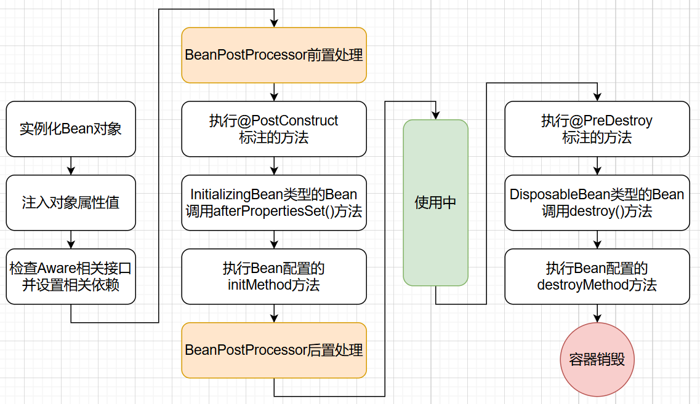

在实际开发中，**使用较多的就是`@PostConstruct`和`@PreDestroy`标注的回调方法**：

```java
@Component
public class User {
    // 以下两个注解标注的方法，方法名随意，但必须是 public void 无形参列表
    
    @PostConstruct
    public void init() {
        // 一般用于在Bean对象创建完成后，进行一些初始化逻辑
    }

    @PreDestroy
    public void clean() {
        // 一般用于在Bean销毁前，进行一些释放资源逻辑
    }
}
```

> 注意：使用以上两个注解，还需额外引入`jakarta.annotation-api`的依赖，而在Spring Boot应用中则无需手动引入。

### 2.3 Bean的线程安全性

如果Bean的作用域是prototype，那么它自然是线程安全的，因为每次获取Bean时都会创建一个新的对象实例，所以不会存在操作共享资源的问题。

如果Bean的作用域是singleton，则要分情况讨论：

- 如果这个Bean是**无状态**的（没有定义可变的成员变量），则它是**线程安全**的。事实上大部分Bean都是无状态的，例如Service、Mapper。
- 如果这个Bean是**有状态**的（定义了可变的成员变量），则它就是**线程不安全**的。为了解决线程安全问题，通常的做法是在类中定义一个`ThreadLocal`成员变量，将所有可变成员变量都保存在`ThreadLocal`中。

### 2.4 @Bean注解

#### 1、指定Bean的名称

@Bean注解默认以**方法名**作为Bean的id，但我们可以用其value属性来自己指定Bean的id：

```java
@Configuration
public class SpringConfig {
    @Bean("zhangsan")
    public Student student() {
        return new Student();
    }
}
```

#### 2、指定生命周期方法

使用@Bean注解注册组件时，可以通过其initMethod和destroyMethod属性来指定对应的生命周期方法：

```java
public class Car {
    public void init() {
        System.out.println("汽车创建了");
    }
    public void clean() {
        System.out.println("汽车销毁了");
    }
}

@Configuration
public class SpringConfig {
    @Bean(initMethod = "init", destroyMethod = "clean")
    public Car car() {
        return new Car();
    }
}
```

#### 3、引用其他Bean

**方式1（不推荐）**：直接调用其他@Bean方法即可获取Bean实例（**虽然是方法调用，但实际也是从IoC容器中获取对应的Bean，并不是重新new一个**）

```java
@Configuration
public class SpringConfig {
    @Bean
    public Car car() {
        return new Car();
    }

    @Bean
    public Student student() {
        // 直接调用方法即可获取IoC容器中的Bean实例
        Car car = car();
        System.out.println(car);
        return new Student();
    }
}
```

**方式2**：可以通过@Bean方法的形参列表直接自动注入IoC容器中的Bean

```java
@Configuration
public class SpringConfig {
    @Bean
    public Car car() {
        return new Car();
    }

    @Bean
    public Student student(Car car) {
        System.out.println(car);
        return new Student();
    }
}
```

- 注1：如果IoC容器中没有类型匹配的Bean，则会抛出异常
- 注2：如果IoC容器中有多个类型匹配的Bean，则根据形参的名称去匹配对应的Bean的id（若匹配不到，同样会抛出异常）

## 3. 自动装配Bean

自动注入Bean的注解主要有`@Autowired`和`@Resource`，两者的主要区别如下：

**（1）提供者不同**

- `@Autowired` 是 Spring 提供的注解
- `@Resource` 是 JDK 提供的注解（JSR-250系列注解）

**（2）注入方式不同**

`@Autowired`的注入方式为`byType`，也就是**根据类型进行匹配**，如果匹配不到则直接抛出异常。如果匹配到多个bean，则再根据名称进行匹配：

- 若没有标注`@Qualifier`注解，则根据变量名称作为bean的id进行匹配，匹配不到则抛出异常

- 若标注了`@Qualifier`注解，则根据该注解中指定的名称作为bean的id进行匹配，匹配不到则抛出异常

  ```java
  @Autowired
  @Qualifier("userServiceImpl")
  private UserService userService;
  ```

`@Resource`的注入方式为`byName`，也就是**根据名称进行匹配**：

- 若指定了name属性，则根据name指定的名称作为bean的id进行匹配，匹配不到则直接抛出异常

  ```java
  @Resource(name = "userServiceImpl")
  private UserService userService;
  ```

- 若没有指定name属性，则根据变量名称作为bean的id进行匹配，如果匹配不到，则再根据类型进行匹配，最终匹配不到或者匹配到多个bean都会抛出异常。

**（3）标注位置不同**

- `@Autowired` 支持在成员变量、setter方法、有参构造器、方法参数上使用
- `@Resource` 仅支持在成员变量、setter方法上使用

> 注1：注解标识在成员变量上，此时就无需设置该成员变量的setter方法
>
> 注2：如果类只有一个有参构造器（且没有无参构造器），则该构造器和其形参上都可以不用标注`@Autowired`，只要该形参类型的bean在容器中，就会自动注入。

## 4. 基本类型的属性赋值

使用`@Value`注解可以为基本类型的成员变量注入属性，最常见的作用是注入外部化属性：

```java
@Component
public class CommonComponent {
    @Value("${jdbc.username:root}")
    private String username;

    @Value("${jdbc.password}")
    private String password;
}
```

> 说明：`${key:defaultValue}`写法的含义是，如果没有这个key的话，则用默认值defaultValue赋值。

## 5. FactoryBean机制

FactoryBean机制是Spring提供的一种整合第三方框架的常用机制。和普通的bean不同，**注册一个FactoryBean类型的bean，还会自动将其`getObject()`方法返回的对象一并注册到IoC容器中**。

FactoryBean接口定义如下：

```java
public interface FactoryBean<T> {
    // 生产一个对象，并将其注册到IoC容器
    T getObject() throws Exception;

    // 设置要生产的对象的类型
    Class<?> getObjectType();

    // 生产的对象是否单例，默认为单例
    default boolean isSingleton() {
        return true;
    }
}
```

FactoryBean机制使用示例如下：

（1）自定义一个工厂类并实现FactoryBean接口

```java
// 泛型类型就是当前工厂要生产的对象的类型
public class FruitFactory implements FactoryBean<Fruit> {
    @Override
    public Fruit getObject() throws Exception {
        // 返回要生产的对象
        return new Fruit("苹果");
    }

    @Override
    public Class<?> getObjectType() {
        // 返回要生产的对象的类型
        return Fruit.class;
    }
}
```

（2）将上述工厂类注册到IoC容器中

```java
@Configuration
public class SpringConfig {
    @Bean
    public FruitFactory fruitFactory() {
        return new FruitFactory();
    }
}
```

（3）测试

```java
@Test
public void test() {
    ApplicationContext ioc = new AnnotationConfigApplicationContext(SpringConfig.class);

    Map<String, FruitFactory> fruitFactoryMap = ioc.getBeansOfType(FruitFactory.class);
    // fruitFactoryMap = {&fruitFactory=com.ioc.FruitFactory@7d9d0818}
    System.out.println("fruitFactoryMap = " + fruitFactoryMap); 

    Map<String, Fruit> fruitMap = ioc.getBeansOfType(Fruit.class);
    // fruitMap = {fruitFactory=Fruit(name=苹果)}
    System.out.println("fruitMap = " + fruitMap); 
}
```

细节：

- 注册FruitFactory时我们指定的bean id为`fruitFactory`，实际上这是其生产的`Fruit`的bean id
- 而FruitFactory在IoC容器中的bean id为`&fruitFactory`

## 6. Spring整合单元测试

使用Spring整合单元测试，可以更方便于我们进行测试。我们无需再手动创建IoC容器，而且任何需要的Bean都可以在测试类中直接自动装配使用。

（1）引入依赖

```xml
<!--junit5测试-->
<dependency>
    <groupId>org.junit.jupiter</groupId>
    <artifactId>junit-jupiter-api</artifactId>
    <version>5.3.1</version>
    <scope>test</scope>
</dependency>
<!-- Spring的测试包 -->
<dependency>
    <groupId>org.springframework</groupId>
    <artifactId>spring-test</artifactId>
    <version>6.0.6</version>
    <scope>test</scope>
</dependency>
```

（2）创建测试类

```java
@SpringJUnitConfig(SpringConfig.class) // 指定配置类
public class StudentTest {
    @Autowired
    private Student student;

    @Test
    public void test() {
        student.sayHello();
    }
}
```


# 第04章_AOP

## 1. 代理模式

### 1.1 情景设定

我们有一个Calculator及其实现类：

```java
public interface Calculator {
    int add(int i, int j);
    int sub(int i, int j);
    int mul(int i, int j);
    int div(int i, int j);
}
```

```java
public class CalculatorImpl implements Calculator {
    @Override
    public int add(int i, int j) {
        return i + j;
    }
    @Override
    public int sub(int i, int j) {
        return i - j;
    }
    @Override
    public int mul(int i, int j) {
        return i * j;
    }
    @Override
    public int div(int i, int j) {
        return i / j;
    }
}
```

现在想在加减乘除方法前后都打印一个日志。如果我们直接在CalculatorImpl中添加日志，则会有以下问题：

- **对核心业务功能有干扰**
- 附加的日志功能分散在各个业务方法中，**不利于统一维护**

一个较好的解决方案就是使用**代理模式**来进行**解耦**，将附加功能单独抽取出来，不影响业务核心代码。

### 1.2 代理模式简介

代理模式是二十三种设计模式中的一种，属于结构型模式。它的思想就是通过提供一个**代理类**，让我们在调用目标方法的时候，不再是通过目标类直接调用，而是通过代理类间接调用。从而让不属于目标方法核心逻辑的代码从目标方法中剥离出来——解耦。

- 代理类：将非核心逻辑剥离出来以后，封装这些非核心逻辑的类。
- 目标类：被代理的类。

### 1.3 静态代理

静态代理类：

```java
public class CalculatorStaticProxy implements Calculator {
    // 将被代理的目标对象声明为成员变量
    private final CalculatorImpl target;

    public CalculatorStaticProxy(CalculatorImpl target) {
        this.target = target;
    }

    @Override
    public int add(int i, int j) {
        System.out.printf("【%s】方法开始, 参数: %d,%d%n", "add", i, j);
        int result = target.add(i, j);
        System.out.printf("【%s】方法返回, 结果: %d%n", "add", result);
        return result;
    }

    @Override
    public int sub(int i, int j) {
        System.out.printf("【%s】方法开始, 参数: %d,%d%n", "sub", i, j);
        int result = target.sub(i, j);
        System.out.printf("【%s】方法返回, 结果: %d%n", "sub", result);
        return result;
    }

    @Override
    public int mul(int i, int j) {
        System.out.printf("【%s】方法开始, 参数: %d,%d%n", "mul", i, j);
        int result = target.mul(i, j);
        System.out.printf("【%s】方法返回, 结果: %d%n", "mul", result);
        return result;
    }

    @Override
    public int div(int i, int j) {
        System.out.printf("【%s】方法开始, 参数: %d,%d%n", "div", i, j);
        int result = target.div(i, j);
        System.out.printf("【%s】方法返回, 结果: %d%n", "div", result);
        return result;
    }
}
```

静态代理虽然实现了解耦，但是由于代码都写死了，完全不具备任何的灵活性。就拿日志功能来说，将来其他地方也需要附加日志，那还得再声明更多个静态代理类，这就产生了大量重复的代码，且日志功能还是分散的，没有统一管理。因此，我们推荐使用**动态代理**，而不是静态代理。

### 1.4 动态代理

使用**JDK的动态代理**，需要创建一个生产代理对象的工厂类：

```java
public class ProxyFactory {
    // 将被代理的目标对象声明为成员变量
    private final Object target;

    public ProxyFactory(Object target) {
        this.target = target;
    }

    public Object getProxy() {
        // 加载目标对象的类的类加载器
        ClassLoader classLoader = target.getClass().getClassLoader();
        // 目标对象实现的所有接口
        Class<?>[] interfaces = target.getClass().getInterfaces();
        // InvocationHandler用于编写代理的逻辑
        InvocationHandler h = new InvocationHandler() {
            /**
             * 这是一个回调方法，如果在主程序中创建一个代理
             * CalculatorImpl calculator = new CalculatorImpl();
             * ProxyFactory proxyFactory = new ProxyFactory(calculator);
             * Calculator proxy = (Calculator) proxyFactory.getProxy();
             *
             * 那么当通过proxy来调用接口Calculator中的方法时，如add(1, 2);
             * 实际上调用的是这里的invoke()方法，其中：
             * 代理对象proxy会传递给这里的形参proxy
             * add()方法对应的Method对象会传递给这里的形参method
             * add()方法中的实参会传递给这里的形参args
             */
            @Override
            public Object invoke(Object proxy, Method method, Object[] args) {
                String name = method.getName();
                try {
                    System.out.printf("【%s】方法开始, 参数: %s%n", name, Arrays.toString(args));
                    // 通过反射，调用目标对象中的对应方法
                    Object result = method.invoke(target, args);
                    System.out.printf("【%s】方法返回, 结果: %s%n", name, result);
                    return result;
                } catch (Exception e) {
                    System.out.printf("【%s】方法异常, 原因: %s%n", name, e.getMessage());
                    throw new RuntimeException(e);
                } finally {
                    System.out.printf("【%s】方法结束!%n", name);
                }
            }
        };
        return Proxy.newProxyInstance(classLoader, interfaces, h);
    }
}
```

测试：

```java
@Test
public void test() {
    // jdk动态代理
    // 1. 创建被代理的目标对象
    CalculatorImpl calculator = new CalculatorImpl();
    // 2. 创建能够生产代理对象的工厂
    ProxyFactory proxyFactory = new ProxyFactory(calculator);
    // 3. 通过工厂生产目标对象的代理对象
    Calculator proxy = (Calculator) proxyFactory.getProxy();
    // 4. 通过代理对象调用方法
    proxy.add(1, 2);
}
```

> 显然手动使用JDK动态代理的过程十分繁琐，所以Spring AOP框架就是为了帮我们简化动态代理的实现。

## 2. AOP简介

### 2.1 概述

AOP（Aspect Oriented Programming）是一种设计思想，是软件设计领域中的**面向切面编程**，它是面向对象编程的一种补充和完善。它能够**将那些与业务无关，却为业务模块所共同调用的逻辑（例如事务管理、日志记录、权限控制、统一异常处理等）抽取并封装起来**，便于减少系统的重复代码，降低模块间的耦合度，有利于未来的可拓展性和可维护性。

### 2.2 AspectJ框架

AspectJ是早期的AOP框架，它与Spring AOP框架的区别有：

- Spring AOP是**运行时增强**，而AspectJ是**编译时增强**
- Spring AOP基于**动态代理**，而AspectJ基于**字节码操作**
- Spring AOP使用起来更加简单，但是当切面太多时，性能比AspectJ低

> 说明：Spring AOP框架中借用了AspectJ中的一些AOP注解

### 2.3 Spring AOP框架

Spring AOP框架底层使用**动态代理**来实现AOP思想，它采用的动态代理技术有以下两种：

- 如果要代理的目标对象实现了某个接口，那么Spring AOP默认就会使用**JDK动态代理**去创建代理对象。生成的代理类会和目标类**实现相同的接口**，且该代理类在`jdk.proxy2`包下，类名形如`$Proxy29`
- 如果要代理的目标对象没有实现任何接口，那么Spring AOP默认就会使用**CGLIB动态代理**去创建代理对象。生成的代理类会**继承目标类**，且该代理类和目标类在相同的包下，类名形如`目标类名$$SpringCGLIB$$0`

> **注意：但在SpringBoot中，默认始终使用CGLIB动态代理去创建代理对象**。因为CGLIB动态代理适用于任何目标类，且性能比JDK动态代理更高。

### 2.4 Spring AOP底层原理

Spring AOP会为每个被切面切入的组件创建代理对象，代理对象中保存了切面类里所有通知方法构成的**增强器链**，当目标方法执行时，会去增强器链中找到需要额外执行的通知方法并执行。

当目标类被Spring AOP代理后，**IoC容器中将不再存在目标类组件，而是会将代理类的Bean放入IoC容器**。如下图所示：

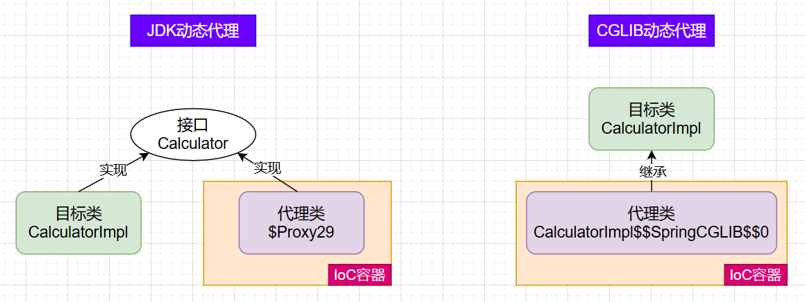

### 2.5 AOP术语

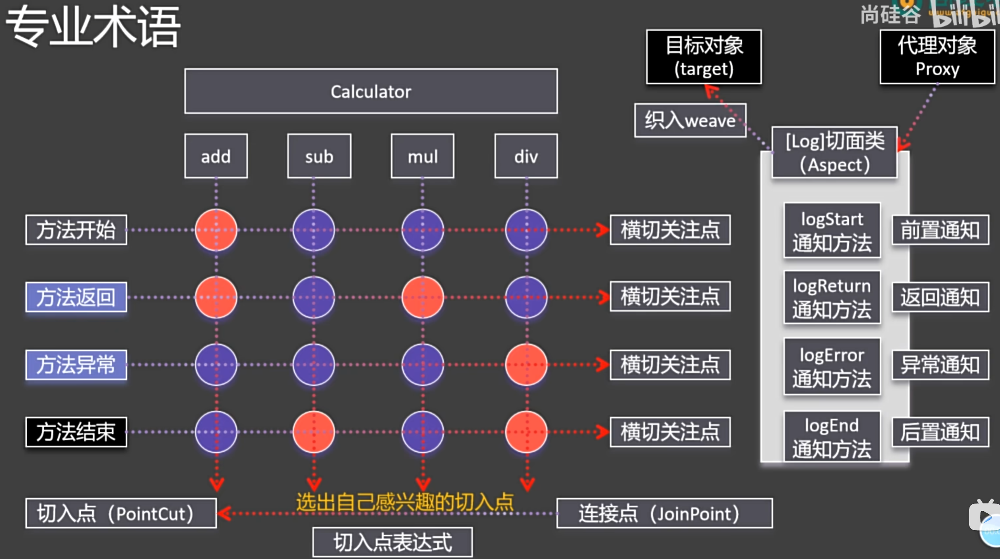

**1、横切关注点**

横切关注点就是从方法中抽取出来的同一类非核心业务，这是一个逻辑层面的概念。

**2、通知**

每一个横切关注点上要做的事情都需要写一个方法来实现，这样的方法就称为**通知**，也称为**增强**。

- 前置通知：在被代理的目标方法前执行
- 返回通知：在被代理的目标方法成功返回后执行
- 异常通知：在被代理的目标方法异常结束后执行
- 后置通知：在被代理的目标方法最终结束后执行
- 环绕通知：使用`try...catch...finally`结构围绕整个被代理的目标方法，包含上面四种通知对应的所有位置

**3、切面(Aspect)**

封装通知方法的类称为切面。根据不同的非核心业务逻辑，我们可以创建不同的切面类，例如：

- 日志功能：日志切面
- 缓存功能：缓存切面
- 事务功能：事务切面

**4、目标(target)**

被代理的目标对象

**5、代理(proxy)**

向目标对象应用通知之后创建的代理对象。

**6、连接点(JoinPoint)**

把所有方法排成一行，每一个横切位置看成x轴方向，把方法从上到下执行的顺序看成y轴方向，那么x轴和y轴的交叉点就是连接点。连接点也是一个逻辑层面的概念。

**7、切入点(Pointcut)**

切入点就是连接点中要植入通知方法的位置。通过切入点，可以将通知方法精准地植入到目标方法的指定位置。

**8、织入(weave)**

织入指的是把通知应用到目标上，生成代理对象的过程。可以在编译期织入，也可以在运行期织入，Spring AOP采用后者。

## 3. Spring AOP的使用

### 3.1 整体流程

#### 1、引入依赖

```xml
<dependency>
    <groupId>org.springframework</groupId>
    <artifactId>spring-aspects</artifactId>
    <version>6.0.6</version>
</dependency>
```

#### 2、配置类

Spring AOP的注意事项：

- **切面类和目标类都需要标注`@Component`交给IoC容器管理**，否则无法享受AOP增强
- 切面类必须通过`@Aspect`注解标识为一个切面
- 在配置类上标注`@EnableAspectJAutoProxy`注解，来开启AspectJ的注解支持

```java
@Configuration
@ComponentScan("com.aop")
@EnableAspectJAutoProxy
public class SpringAopConfig {
}
```

#### 3、切面类

```java
@Component
@Aspect
public class LoggerAspect {

    // 声明一个公共的切入点表达式
    @Pointcut("execution(* com.aop.CalculatorImpl.*(..))")
    public void pointCut() {}

//    @Before("execution(public int com.aop.CalculatorImpl.add(int, int))")
    @Before("pointCut()")
    public void beforeAdviceMethod(JoinPoint joinPoint) {
        // 获取连接点所对应方法的签名信息(修饰符、返回值、方法名、参数、异常等)
        Signature signature = joinPoint.getSignature();
        Object[] args = joinPoint.getArgs();
        System.out.printf("【%s】方法开始, 参数: %s%n", signature.getName(), Arrays.toString(args));
    }

    @After("pointCut()")
    public void afterAdviceMethod(JoinPoint joinPoint) {
        Signature signature = joinPoint.getSignature();
        System.out.printf("【%s】方法结束!%n", signature.getName());
    }

    @AfterReturning(value = "pointCut()", returning = "result")
    public void afterReturningAdviceMethod(JoinPoint joinPoint, Object result) {
        Signature signature = joinPoint.getSignature();
        System.out.printf("【%s】方法返回, 结果: %s%n", signature.getName(), result);
    }

    @AfterThrowing(value = "pointCut()", throwing = "e")
    public void afterThrowingAdviceMethod(JoinPoint joinPoint, Throwable e) {
        Signature signature = joinPoint.getSignature();
        System.out.printf("【%s】方法异常, 原因: %s%n", signature.getName(), e.getMessage());
    }

    // 环绕通知的方法的返回值一定要和目标对象方法的返回值一致
    @Around("pointCut()")
    public Object aroundAdviceMethod(ProceedingJoinPoint joinPoint) {
        try {
            System.out.println("环绕通知-->前置通知");
            // 表示目标对象方法的执行
            Object result = joinPoint.proceed();
            System.out.println("环绕通知-->返回通知");
            return result;
        } catch (Throwable e) {
            System.out.println("环绕通知-->异常通知");
            throw new RuntimeException(e); // 建议继续抛出异常，让上层感知
        } finally {
            System.out.println("环绕通知-->后置通知");
        }
    }
}
```

#### 4、测试

**注意**：我们通过接口类型获取Bean时，就会自动获取代理对象的Bean。因为被Spring AOP代理后，在IoC容器中就不存在目标类CalculatorImpl的Bean了，而是会将代理类的Bean放入IoC容器。

```java
@SpringJUnitConfig(SpringAopConfig.class)
public class AopTest {
    @Autowired
    private Calculator calculator;

    @Test
    public void test() {
        // 【Test】calculator=class jdk.proxy2.$Proxy29
        System.out.println("【Test】calculator全类名: " + calculator.getClass());
        int result = calculator.add(2, 3);
        System.out.println("【Test】result=" + result);
    }
}
```

### 3.2 重用切入点表达式

在切面中，需要通过指定的注解将方法标识为通知：
* `@Before`：前置通知，在被代理的目标方法前执行
* `@AfterReturning`：返回通知，在被代理的目标方法成功返回后执行
* `@AfterThrowing`：异常通知，在被代理的目标方法异常结束后执行
* `@After`：后置通知，在被代理的目标方法最终结束后执行
* `@Around`：环绕通知，使用`try...catch...finally`结构围绕整个被代理的目标方法，包含上面四种通知对应的所有位置

各种通知的执行顺序：
- 前置通知
- 目标操作
- 返回通知或异常通知
- 后置通知

**在使用注解标识通知的value属性中，需要指定切入点表达式，由切入点表达式控制当前通知方法要作用在哪一个目标方法之上**。最精确的写法如下：

```java
// 指明方法的 修饰符、返回值类型、方法名、参数类型
@Before("execution(public int com.aop.CalculatorImpl.add(int, int))")
```

但是采用这样的方式，则需要在每一个通知上都加上这一注解，过于繁琐，因此我们可以声明一个公共的切入点表达式，即声明一个自定义的public void的空方法，在其上添加`@PointCut`注解：

```java
// 切入点表达式重用
@Pointcut("execution(* com.aop.CalculatorImpl.*(..))")
public void pointCut() {}
```

- 在同一个类内部引用该切入点表达式：`@Before("pointCut()")`
- 在不同类中引用该切入点表达式：`@Before("com.aop.LoggerAspect.pointCut()")`

### 3.3 切入点表达式语法

我们下面来分析上述的切入点表达式：

```java
execution(* com.aop.CalculatorImpl.*(..))
```

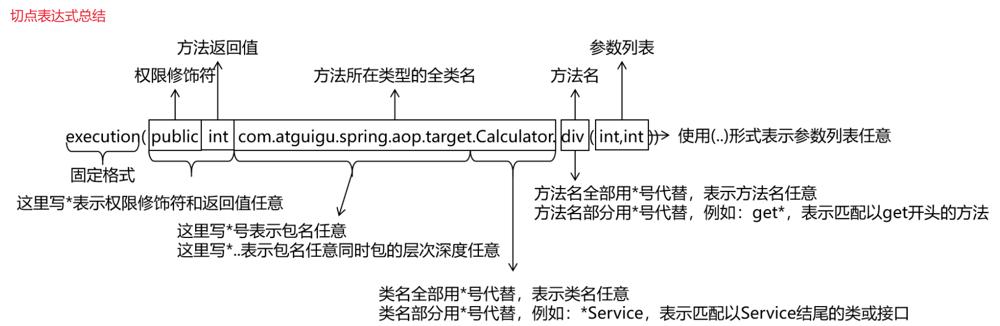

**语法细节**:

- 用`*`号代替“权限修饰符”和“返回值”这两个部分的整体，表示“权限修饰符”和“返回值”不限
- 在包名的部分，一个`*`号只能代表包的层次结构中的一层，表示这一层是任意的。例如：`*.Hello`匹配`com.Hello`，不匹配`com.atguigu.Hello`
- 在包名的部分，使用`*..`表示包名任意、包的层次深度任意
- 在类名的部分，类名部分整体用`*`号代替，表示类名任意
- 在类名的部分，可以使用`*`号代替类名的一部分。如`*Service`表示匹配所有名称以Service结尾的类或接口
- 在方法名部分，可以使用`*`号表示方法名任意
- 在方法名部分，可以使用`*`号代替方法名的一部分。如`*Operation`表示匹配所有方法名以Operation结尾的方法
- 在方法参数列表部分，使用`(..)`表示参数列表任意
- 在方法参数列表部分，使用`(int..)`表示参数列表以一个int类型的参数开头，使用`(..int)`表示参数列表以一个int类型的参数结尾，使用`(..int..)`表示参数列表包含一个int类型的参数
- 在方法参数列表部分，基本数据类型和对应的包装类型是不一样的。例如切入点表达式中使用 int 和实际方法中 Integer 是不匹配的
- 在方法返回值部分，如果想要明确指定一个返回值类型，那么必须同时写明权限修饰符
- `public *`表示权限修饰符明确，返回值任意是可以的
- 对于`execution()`表达式整体可以使用三个逻辑运算符号
  - `execution() || execution()`表示满足两个execution()中的任何一个即可
  - `execution() && execution()`表示两个execution()表达式必须都满足
  - `!execution()`表示不满足表达式的其他方法

**总结**：虽然我们上面介绍的切入点表达式语法细节很多，但是实际上具体在项目中应用时有比较固定的写法。一般切入点表达式通常都会套用到所有Service实现类的所有方法，那么切入点表达式将如下所示：

```java
execution(* *..*ServiceImpl.*(..))
```

### 3.4 各个通知获取细节信息

#### 1、JoinPoint接口

要获取连接点信息，则可以在通知方法的第一个参数位置设置JoinPoint类型的形参：

```java
@Before("pointCut()")
public void beforeAdviceMethod(JoinPoint joinPoint) {
    // 获取方法所属类的信息
    String simpleName = joinPoint.getTarget().getClass().getSimpleName();
    // 获取连接点所对应目标方法的签名信息(方法声明时的完整信息：修饰符、返回值、方法名、参数、异常等)
    Signature signature = joinPoint.getSignature();
    // 获取目标方法的方法名
    String methodName = signature.getName();
    // 获取外界调用目标方法时传入的实参列表组成的数组
    Object[] args = joinPoint.getArgs();
    System.out.printf("【%s】方法开始, 参数: %s%n", methodName, Arrays.toString(args));
}
```

#### 2、方法返回值

在返回通知中，若要获取目标对象方法的返回值，只需通过`@AfterReturning`注解的returning属性，就可以将通知方法的某个形参名指定为接收目标对象方法的返回值的参数。

```java
@AfterReturning(value = "pointCut()", returning = "result")
public void afterReturningAdviceMethod(JoinPoint joinPoint, Object result) {
    Signature signature = joinPoint.getSignature();
    System.out.printf("【%s】方法返回, 结果: %s%n", signature.getName(), result);
}
```


#### 3、目标方法抛出的异常

在异常通知中，若要获取目标对象方法抛出的异常，只需通过`@AfterThrowing`注解的throwing属性，就可以将通知方法的某个形参名指定为接收目标对象方法出现的异常的参数。

```java
@AfterThrowing(value = "pointCut()", throwing = "e")
public void afterThrowingAdviceMethod(JoinPoint joinPoint, Throwable e) {
    Signature signature = joinPoint.getSignature();
    System.out.printf("【%s】方法异常, 原因: %s%n", signature.getName(), e.getMessage());
}
```

### 3.5 环绕通知

环绕通知对应整个`try...catch...finally`结构，包含前面四种通知的所有功能。注意：
- 通过在通知方法形参位置声明`ProceedingJoinPoint`类型的形参，我们可以像JoinPoint一样获取连接点所对应目标方法的一些信息
- 通过调用`ProceedingJoinPoint`对象的`proceed()`方法，表示目标对象方法的执行
- 环绕通知的方法的返回值一定要和目标对象方法的返回值一致

```java
@Around("pointCut()")
public Object aroundAdviceMethod(ProceedingJoinPoint joinPoint) {
    try {
        System.out.println("环绕通知-->前置通知");
        // 表示目标对象方法的执行
        Object result = joinPoint.proceed();
        System.out.println("环绕通知-->返回通知");
        return result;
    } catch (Throwable e) {
        System.out.println("环绕通知-->异常通知");
        throw new RuntimeException(e); // 建议继续抛出异常，让上层感知
    } finally {
        System.out.println("环绕通知-->后置通知");
    }
}
```

### 3.6 切面的优先级

同一目标方法上同时存在多个切面时，则由切面的优先级控制切面的内外嵌套顺序：

- 优先级高的切面：外面
- 优先级低的切面：里面

使用`@Order`注解可以控制切面的优先级：

- `@Order(较小的数)`：优先级高
- `@Order(较大的数)`：优先级低

```java
@Component
@Aspect
@Order(1) // 默认值为Integer的最大值，value属性值越小、优先级越高
public class ValidateAspect {
    @Before("com.aop.LoggerAspect.pointCut()")
    public void beforeMethod() {
        System.out.println("ValidateAspect-->前置通知");
    }
}
```

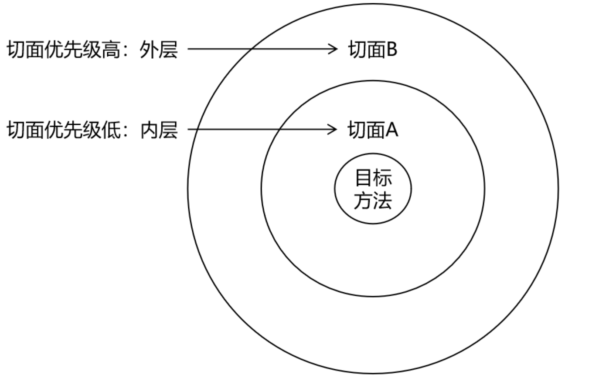


# 第05章_声明式事务

## 1. 简介

### 1.1 编程式事务与声明式事务

Spring支持两种管理事务的方式：

- **编程式事务**：事务功能的相关操作全部通过自己手动编写代码来实现。显然编程式事务对于程序员而言十分繁琐。

  ```java
  Connection conn = ... ;
  try {
      // 开启事务
      conn.setAutoCommit(false);
      // 核心操作...
      // 提交事务
      conn.commit();
  } catch (Exception e) {
      // 回滚事务
      conn.rollback();
  } finally {
      // 释放数据库连接
      conn.close();
  }
  ```

- **声明式事务**：基于注解`@Transactional`控制事务，底层实际是**通过AOP实现**。

### 1.2 声明式事务底层原理

#### 1、事务管理器

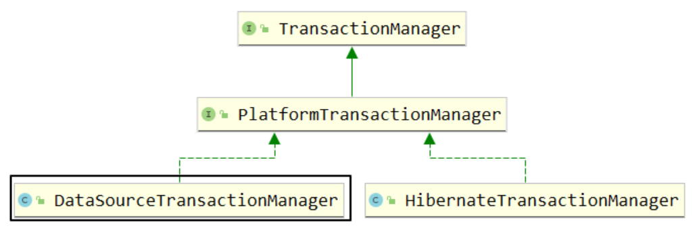

事务管理器的作用是**执行事务的提交、回滚等**。我们常用的事务管理器为DataSourceTransactionManager，它的主要方法有：

- `doBegin()`：开启事务
- `doSuspend()`：挂起事务
- `doResume()`：恢复挂起的事务
- `doCommit()`：提交事务
- `doRollback()`：回滚事务

#### 2、事务拦截器

事务拦截器TransactionInterceptor是一个**切面类**，其作用是**控制事务提交、回滚的时机**。使用AOP实现声明式事务的底层切面类正是TransactionInterceptor。

## 2. 声明式事务的基本使用

### 2.1 情景设定

#### 1、引入依赖

```xml
<dependencies>
    <!-- jdbc依赖，其中包含了声明式事务相关依赖 -->
    <dependency>
        <groupId>org.springframework</groupId>
        <artifactId>spring-jdbc</artifactId>
        <version>6.0.6</version>
    </dependency>
    <dependency>
        <groupId>org.springframework</groupId>
        <artifactId>spring-context</artifactId>
        <version>6.0.6</version>
    </dependency>
    <dependency>
        <groupId>mysql</groupId>
        <artifactId>mysql-connector-java</artifactId>
        <version>8.0.28</version>
    </dependency>
    <dependency>
        <groupId>com.alibaba</groupId>
        <artifactId>druid</artifactId>
        <version>1.2.8</version>
    </dependency>
    <dependency>
        <groupId>org.junit.jupiter</groupId>
        <artifactId>junit-jupiter-api</artifactId>
        <version>5.3.1</version>
        <scope>test</scope>
    </dependency>
    <dependency>
        <groupId>org.springframework</groupId>
        <artifactId>spring-test</artifactId>
        <version>6.0.6</version>
        <scope>test</scope>
    </dependency>
</dependencies>
```

#### 2、创建jdbc.properties

```properties
jdbc.driver=com.mysql.cj.jdbc.Driver
jdbc.url=jdbc:mysql://localhost:3306/ssm
jdbc.username=root
jdbc.password=abc666
```

#### 3、创建Spring配置类

```java
@Configuration
@ComponentScan("com.tx")
public class SpringConfig {
}
```

#### 4、配置数据源和JdbcTemplate

```java
@PropertySource("classpath:jdbc.properties")
@Configuration
public class DataSourceConfig {
    @Value("${jdbc.driver}")
    private String driver;
    @Value("${jdbc.url}")
    private String url;
    @Value("${jdbc.username}")
    private String username;
    @Value("${jdbc.password}")
    private String password;

    @Bean
    public DataSource dataSource() {
        DruidDataSource dataSource = new DruidDataSource();
        dataSource.setDriverClassName(driver);
        dataSource.setUrl(url);
        dataSource.setUsername(username);
        dataSource.setPassword(password);
        return dataSource;
    }

    @Bean
    public JdbcTemplate jdbcTemplate(DataSource dataSource) {
        JdbcTemplate jdbcTemplate = new JdbcTemplate();
        jdbcTemplate.setDataSource(dataSource);
        return jdbcTemplate;
    }
}
```

> 说明：Spring框架对JDBC进行了封装，使用JdbcTemplate可以简便地操作数据库。但未来我们更多使用的将是MyBatis，所以对JdbcTemplate只需简单了解即可。

#### 5、创建数据库表

```sql
CREATE TABLE `t_book` (
    `book_id` int(11) NOT NULL AUTO_INCREMENT COMMENT '主键',
    `book_name` varchar(20) DEFAULT NULL COMMENT '图书名称',
    `price` int(11) DEFAULT NULL COMMENT '价格',
    `stock` int(10) unsigned DEFAULT NULL COMMENT '库存（无符号）',
    PRIMARY KEY (`book_id`)
) ENGINE=InnoDB AUTO_INCREMENT=3 DEFAULT CHARSET=utf8;

insert into `t_book`(`book_id`,`book_name`,`price`,`stock`) 
values (1,'斗破苍穹',80,100),(2,'斗罗大陆',50,100);

CREATE TABLE `t_user` (
    `user_id` int(11) NOT NULL AUTO_INCREMENT COMMENT '主键',
    `username` varchar(20) DEFAULT NULL COMMENT '用户名',
    `balance` int(10) unsigned DEFAULT NULL COMMENT '余额（无符号）',
    PRIMARY KEY (`user_id`)
) ENGINE=InnoDB AUTO_INCREMENT=2 DEFAULT CHARSET=utf8;

insert into `t_user`(`user_id`,`username`,`balance`) 
values (1,'admin',50);
```

#### 6、创建组件

```java
public interface BookService {
    void buyBook(Integer userId, Integer bookId);
}
```

```java
@Service
public class BookServiceImpl implements BookService {
    @Autowired
    private BookDao bookDao;
    
    @Override
    public void buyBook(Integer userId, Integer bookId) {
        // 查询图书的价格
        Integer price = bookDao.getPriceByBookId(bookId);
        // 更新图书的库存
        bookDao.updateStock(bookId);
        // 更新用户的余额
        bookDao.updateBalance(userId, price);
    }
}
```

```java
public interface BookDao {
    Integer getPriceByBookId(Integer bookId);
    void updateStock(Integer bookId);
    void updateBalance(Integer userId, Integer price);
}
```

```java
@Repository
public class BookDaoImpl implements BookDao {
    @Autowired
    private JdbcTemplate jdbcTemplate;
    
    @Override
    public Integer getPriceByBookId(Integer bookId) {
        String sql = "select price from t_book where book_id = ?";
        return jdbcTemplate.queryForObject(sql, Integer.class, bookId);
    }

    @Override
    public void updateStock(Integer bookId) {
        String sql = "update t_book set stock = stock - 1 where book_id = ?";
        jdbcTemplate.update(sql, bookId);
    }

    @Override
    public void updateBalance(Integer userId, Integer price) {
        String sql = "update t_user set balance = balance - ? where user_id = ?";
        jdbcTemplate.update(sql, price, userId);
    }
}
```

#### 7、测试

```java
@SpringJUnitConfig(SpringConfig.class)
public class JdbcTest {
    @Autowired
    private BookService bookService;

    @Test
    public void test() {
        bookService.buyBook(1, 1);
    }
}
```

模拟场景：用户购买图书，先查询图书的价格，再更新图书的库存和用户的余额。假设用户id为1的用户，购买id为1的图书，用户余额为50，而图书价格为80，购买图书之后，用户的余额为-30，数据库中余额字段设置了无符号，因此无法将-30更新到余额字段，此时执行sql语句会抛出SQLException。

观察结果：因为没有添加事务，图书的库存更新了(从100变为99)，但是用户的余额没有更新。显然这样的结果是错误的，购买图书是一个完整的功能，更新库存和更新余额必须要么都成功要么都失败。

### 2.2 使用声明式事务

（1）在配置类上添加注解`@EnableTransactionManagement`，并配置事务管理器

```java
@Configuration
@ComponentScan("com.tx")
@EnableTransactionManagement
public class SpringConfig {
    @Bean
    public TransactionManager transactionManager(DataSource dataSource) {
        return new DataSourceTransactionManager(dataSource);
    }
}
```

（2）在需要事务控制的业务方法上标注`@Transactional`注解

```java
@Service
public class BookServiceImpl implements BookService {
    @Autowired
    private BookDao bookDao;

    @Transactional
    @Override
    public void buyBook(Integer userId, Integer bookId) {
        // 查询图书的价格
        Integer price = bookDao.getPriceByBookId(bookId);
        // 更新图书的库存
        bookDao.updateStock(bookId);
        // 更新用户的余额
        bookDao.updateBalance(userId, price);
    }
}
```

说明：`@Transactional`注解标识的位置

- 标识在方法上，则只会影响该方法
- 标识在类上，则会影响类中所有的public方法，即类级别标记的@Transactional注解中设置的事务属性也会延续影响到每个方法执行时的事务属性。如果在某个方法上又设置了@Transactional注解，则会覆盖类级别的注解，即按就近原则生效。

（3）测试：此时再进行测试，库存和余额都没有更新，这正是我们期望的结果。

## 3. 事务属性

### 3.1 只读事务

对一个查询操作来说，如果我们把它设置成只读，就能够明确告诉数据库，这个操作不涉及写操作。这样数据库就能够针对查询操作来进行性能优化。设置方式如下：

```java
// readOnly = true把当前事务设置为只读
@Transactional(readOnly = true)
```

> **注意**：针对增删改操作设置只读，会抛出异常SQLException

### 3.2 事务的超时时间

事务在执行过程中，有可能因为遇到某些问题导致程序卡住，从而长时间占用数据库资源。我们可以设置事务的超时时间，当它超时后就进行回滚，释放资源。

```java
// 默认值为-1，即不限制事务时间
// 以下设置3秒则超时回滚
@Transactional(timeout = 3)
```

### 3.3 回滚策略

声明式事务**默认只针对RuntimeException和Error回滚，而对于编译时异常则不回滚**。我们可以通过`@Transactional`中相关属性来修改回滚策略：
- rollbackFor属性：需要设置一个Class类型的对象，表示对哪些类型的异常进行回滚。默认回滚所有RuntimeException和Error。
- noRollbackFor属性：需要设置一个Class类型的对象，表示对哪些类型的异常不进行回滚。默认没有指定，如果指定，应该在rollbackFor的范围内。

> 实际开发中，我们推荐使用`@Transactional(rollbackFor = Exception.class)`来回滚所有Exception

### 3.4 事务隔离级别

```java
@Transactional(isolation = Isolation.DEFAULT) // 使用数据库默认的隔离级别
@Transactional(isolation = Isolation.READ_UNCOMMITTED) // 读未提交
@Transactional(isolation = Isolation.READ_COMMITTED)   // 读已提交
@Transactional(isolation = Isolation.REPEATABLE_READ)  // 可重复读
@Transactional(isolation = Isolation.SERIALIZABLE)     // 串行化
```

### 3.5 事务传播行为

**事务传播行为是为了解决业务层方法之间互相调用的事务问题**。当事务方法被另一个事务方法调用时，必须指定事务应该如何传播。常用的事务传播行为有以下几种：

```java
@Transactional(propagation = Propagation.REQUIRED)      // 默认值
@Transactional(propagation = Propagation.REQUIRES_NEW)
@Transactional(propagation = Propagation.NESTED)
@Transactional(propagation = Propagation.MANDATORY)
```

- `REQUIRED`：**默认**使用的事务传播行为。如果当前存在事务，则加入该事务；如果当前没有事务，则创建一个新的事务。
- `REQUIRES_NEW`：创建一个新的事务，如果当前存在事务，则把当前事务挂起。也就是说不管外部方法是否开启事务，`REQUIRES_NEW`修饰的内部方法都会新开启自己的事务，且开启的事务相互独立，互不干扰。
- `NESTED`：如果当前存在事务，则创建一个事务作为当前事务的嵌套事务来运行；如果当前没有事务，则创建一个新的事务。
- `MANDATORY`：如果当前存在事务，则加入该事务；如果当前没有事务，则抛出异常。极少使用。

> 说明：还有一些其他的事务传播行为，极少使用。

**举例**：

假设有一个CheckoutServiceImpl类的结账方法`checkout()`被标识了事务注解`@Transactional`，它内部调用了两次BookServiceImpl类的买书方法`buyBook()`：

```java
@Service
public class CheckoutServiceImpl implements CheckoutService {
    @Autowired
    private BookService bookService;

    @Transactional
    @Override
    public void checkout() {
        bookService.buyBook(1, 2);
        bookService.buyBook(1, 2);
    }
}
```

- 如果`buyBook()`使用了默认值`REQUIRED`，则只要有一本书买不起，就导致整个结账事务回滚，从而导致两本书都买不了。
- 如果`buyBook()`使用了`REQUIRES_NEW`模式，如果第一次买书成功，第二次买书失败，则只会导致第二次买书事务的回滚，并不会影响第一次买书。

## 4. 事务失效的场景

**在非事务方法中直接调用本类的事务方法，会导致事务不生效**。如下所示：

```java
public interface BookService {
    void buyBook(Integer userId, Integer bookId);
    void updateDB(Integer userId, Integer bookId, Integer price);
}
```

```java
@Service
public class BookServiceImpl implements BookService {
    @Autowired
    private BookDao bookDao;

    @Override
    public void buyBook(Integer userId, Integer bookId) {
        // 查询图书的价格
        Integer price = bookDao.getPriceByBookId(bookId);
        // 在非事务方法中直接调用本类的事务方法，事务并不会生效
        updateDB(userId, bookId, price);
    }

    @Transactional
    @Override
    public void updateDB(Integer userId, Integer bookId, Integer price) {
        // 更新图书的库存
        bookDao.updateStock(bookId);
        // 更新用户的余额
        bookDao.updateBalance(userId, price);
    }
}
```

原因是声明式事务底层依靠Spring AOP，也就是通过**动态代理**实现。所以：

1. 像上述例子，在IoC容器中不存在目标类BookServiceImpl的Bean，而是存在代理类的Bean，因此在测试类中根据接口类型BookService获取的Bean实际是代理类的对象。
2. 通过代理类对象调用`buyBook()`方法时，由于该方法并没有标注`@Transactional`注解，所以并不会织入事务的相关通知方法。因此，会直接通过反射，调用目标类对象的`buyBook()`方法。
3. 而目标类对象的`buyBook()`方法中又调用了`this.updateDB()`，由于这里的this指的就是目标类对象，所以调用的就是目标类的`updateDB()`方法，而并不是代理类的方法，所以事务失效。
4. 解决方案是：在Service层中也根据接口类型BookService进行注入，从IoC容器中得到代理对象，于是通过代理对象调用`updateDB()`方法，就能织入事务的相关通知：

```java
@Service
public class BookServiceImpl implements BookService {
    @Autowired
    private BookDao bookDao;
    @Autowired
    @Lazy // 使用该注解进行延迟加载，就能避免循环依赖的问题
    private BookService bookService;

    @Override
    public void buyBook(Integer userId, Integer bookId) {
        // 查询图书的价格
        Integer price = bookDao.getPriceByBookId(bookId);
        // 通过代理对象调用updateDB()方法，才能让事务生效
        bookService.updateDB(userId, bookId, price);
    }

    @Transactional
    @Override
    public void updateDB(Integer userId, Integer bookId, Integer price) {
        // 更新图书的库存
        bookDao.updateStock(bookId);
        // 更新用户的余额
        bookDao.updateBalance(userId, price);
    }
}
```

