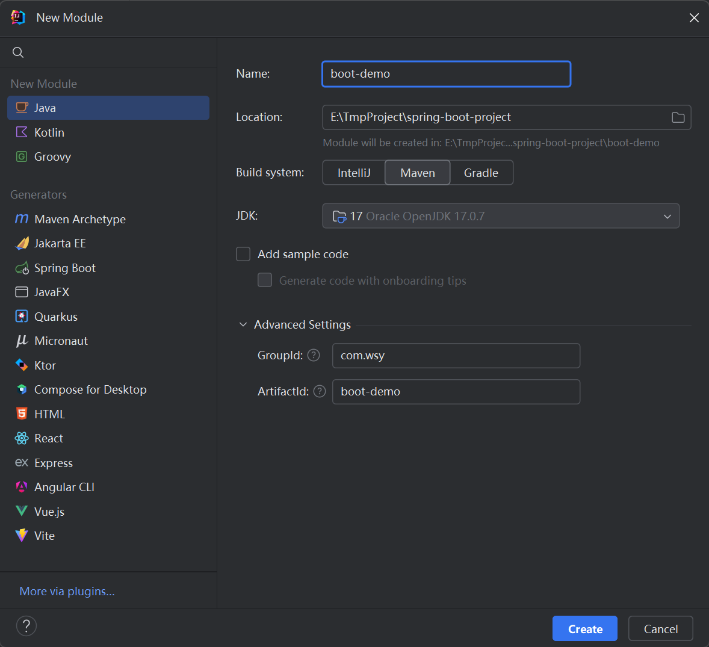
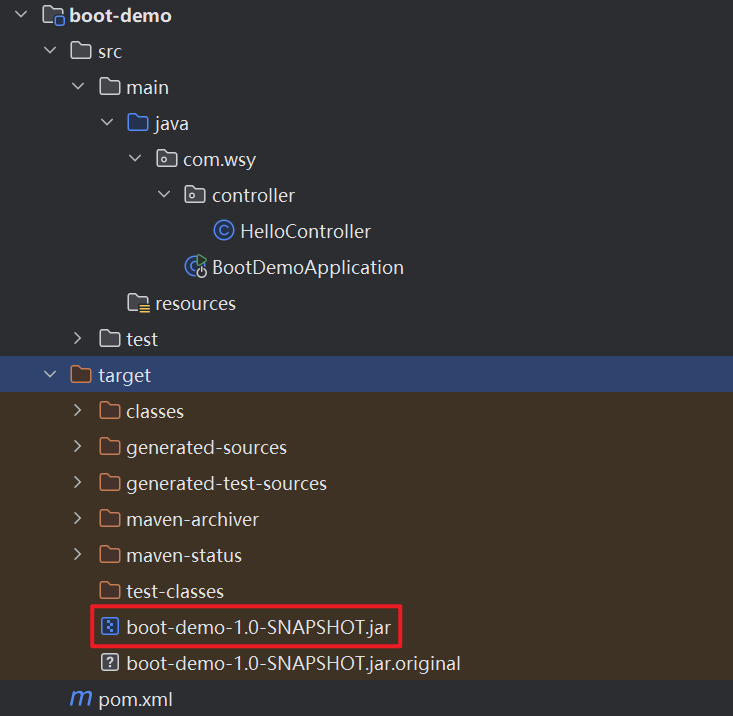
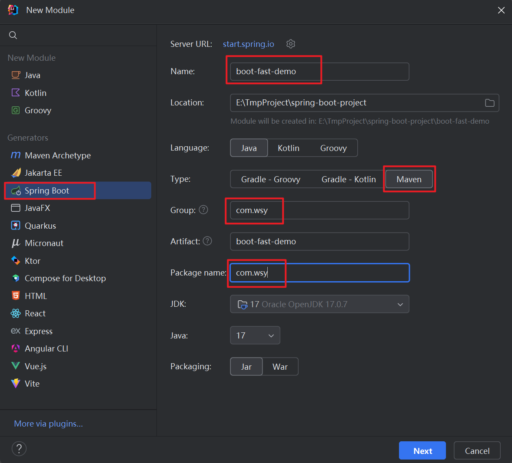
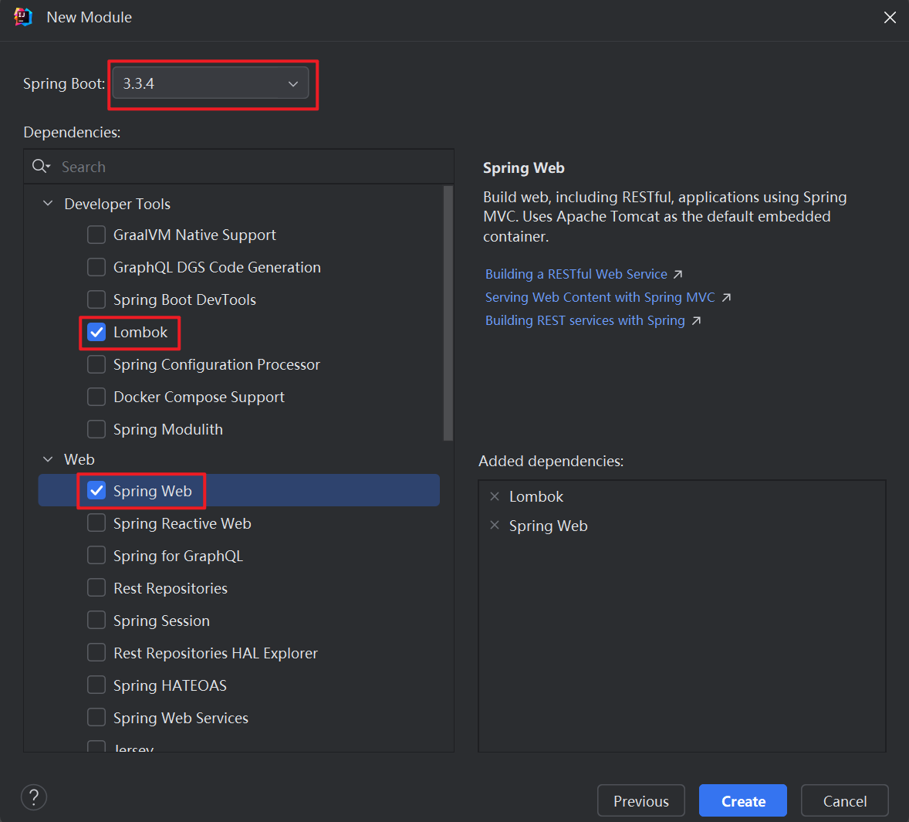
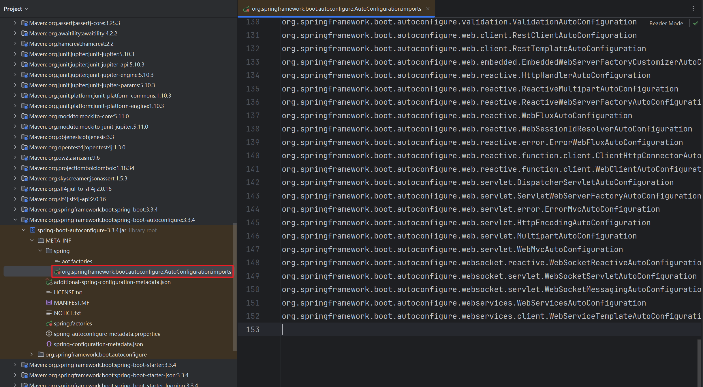
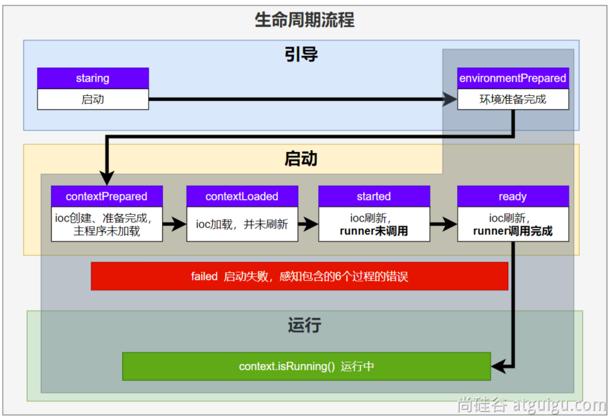
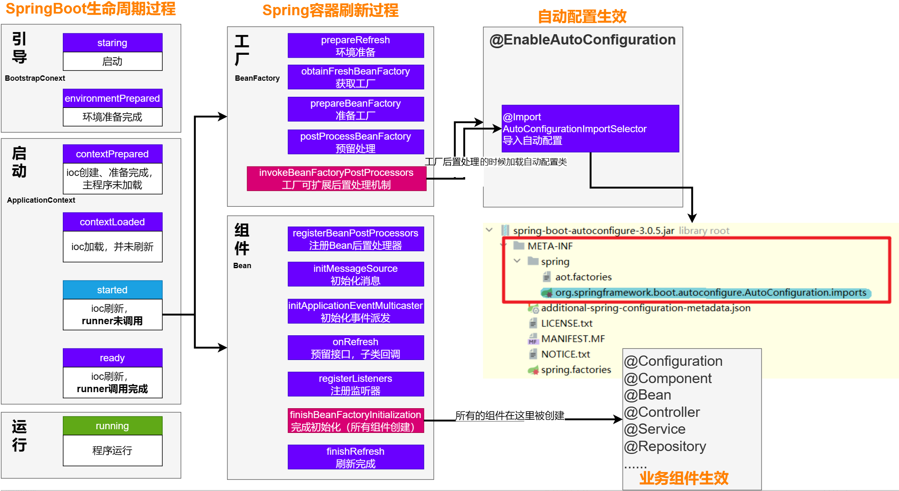
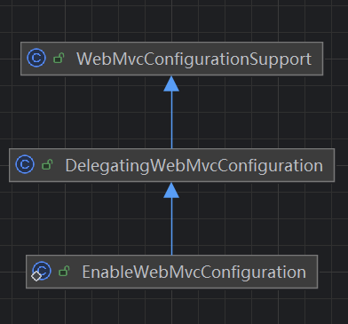
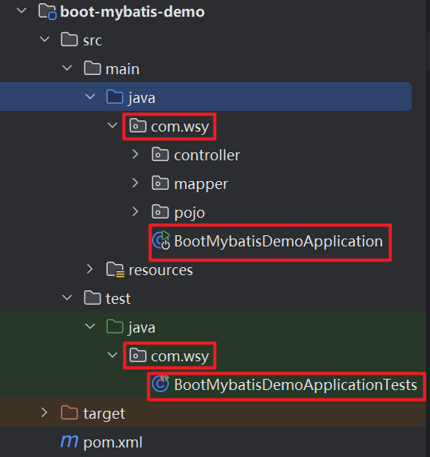

# 第01章_SpringBoot基础

## 1. SpringBoot基本使用

SpringBoot可以帮我们简单快速地创建一个独立的、生产级别的Spring应用。也就是简化开发、简化配置、简化整合、简化部署、简化监控、简化运维。创建SpringBoot项目的整体流程如下：

### 1.1 创建工程

首先创建一个普通的Maven工程：



然后在pom文件中**指定父项目为spring-boot-starter-parent**：

```xml
<parent>
    <groupId>org.springframework.boot</groupId>
    <artifactId>spring-boot-starter-parent</artifactId>
    <version>3.3.4</version>
</parent>
```

### 1.2 导入场景

```xml
<dependencies>
    <!-- web开发的场景启动器 -->
    <dependency>
        <groupId>org.springframework.boot</groupId>
        <artifactId>spring-boot-starter-web</artifactId>
    </dependency>
</dependencies>
```

### 1.3 主程序类

在com.wsy包下创建一个类作为主程序的入口：

```java
@SpringBootApplication
public class BootDemoApplication {
    public static void main(String[] args) {
        SpringApplication.run(BootDemoApplication.class, args);
    }
}
```

### 1.4 业务代码

在com.wsy.controller包下创建一个控制器类：

```java
@RestController
public class HelloController {
    @GetMapping("/hello")
    public String hello() {
        return "Hello, Spring Boot!";
    }
}
```

启动程序后访问 http://localhost:8080/hello

### 1.5 快速部署

在pom文件中添加打包插件：

```xml
<!-- SpringBoot应用打包插件 -->
<build>
    <plugins>
        <plugin>
            <groupId>org.springframework.boot</groupId>
            <artifactId>spring-boot-maven-plugin</artifactId>
        </plugin>
    </plugins>
</build>
```

执行mvn clean package把项目打成可执行的jar包：



可以将上述jar包复制到任意目录，然后在对应目录下命令行输入以下命令即可启动项目：

```shell
java -jar boot-demo-1.0-SNAPSHOT.jar
```

### 1.6 一键创建SpringBoot工程

IDEA也给我们提供了一键创建SpringBoot工程的方式：





## 2. 常用注解

### 2.1 条件注解

如果注解指定的条件成立，则将该组件注册到IoC容器中。例如：

- `@ConditionalOnClass`：如果类路径中存在指定的类，则进行组件注册
- `@ConditionalOnMissingClass`：如果类路径中不存在指定的类，则进行组件注册
- `@ConditionalOnBean`：如果容器中存在这个Bean，则进行组件注册
- `@ConditionalOnMissingBean`：如果容器中不存在这个Bean，则进行组件注册

**注意**：

- 条件注解标注在方法级别，则单独对这个方法进行注解判断
- 条件注解标注在类级别，则只有注解判断生效，整个配置类才生效

### 2.2 属性绑定

属性绑定需要使用`@ConfigurationProperties`注解，该注解用于声明**该类的属性和配置文件中以哪些前缀开始的配置项进行绑定**。标注了该注解的类通常被称为**属性类**。注意，要让属性绑定生效，还**需要将属性类注册到IoC容器中**，可以采用以下两种方式：

**方式一**：通过`@Component`或`@Bean`注解将属性类注册到IoC容器中；

**方式二（推荐）**：在配置类上通过`@EnableConfigurationProperties`可以直接注册属性类。

举例：

```java
// 该属性类绑定了前缀为hotel的配置项
@ConfigurationProperties(prefix = "hotel")
@Getter
@Setter
public class HotelProperties {
    private Long id;
    private String name;
    private String address;
}
```

```java
@EnableConfigurationProperties(HotelProperties.class) // 直接注册属性类
@Configuration
public class AppConfig {
}
```

## 3. YAML配置文件

### 3.1 简介

SpringBoot采用集中化管理配置，也就是将所有配置都写入一个配置文件中。而如果使用`application.properties`，那么配置多以后难以阅读和修改，层级结构辨识度不高。所以SpringBoot推荐使用YAML配置文件。

YAML全称为"YAML Ain't a Markup Language"（YAML不是一种标记语言）。其设计目标是方便人们读写，它层次分明，更适合做配置文件，通常使用`.yaml`或`.yml`作为文件后缀。

### 3.2 基本语法

- 大小写敏感
- 使用缩进表示层级关系，缩进时不允许使用Tab键，只允许使用空格。缩进的空格数目不重要，只要相同层级的元素左侧对齐即可，一般建议缩进2个空格。
- `k: v`，使用冒号和空格分割k和v
- `#`表示注释，从这个字符一直到行尾，都会被解析器忽略

### 3.3 示例

属性类：

```java
@ConfigurationProperties(prefix = "person")
@Data
public class PersonProperties {
    private String name;
    private Integer age;
    private Date birthDay;
    private Boolean like;
    private Child child;
    private List<Dog> dogs;
    private Map<String, Cat> cats;
}

@Data
class Child {
    private String name;
    private Integer age;
    private Date birthDay;
    private List<String> text;
}

@Data
class Dog {
    private String name;
    private Integer age;
}

@Data
class Cat {
    private String name;
    private Integer age;
}
```

#### 1、properties表示法

```properties
person.name=张三
person.age=18
person.birthDay=2010/10/12 12:12:12
person.like=true
person.child.name=李四
person.child.age=12
person.child.birthDay=2018/10/12
person.child.text[0]=abc
person.child.text[1]=def
person.dogs[0].name=小黑
person.dogs[0].age=3
person.dogs[1].name=小白
person.dogs[1].age=2
person.cats.c1.name=小蓝
person.cats.c1.age=3
person.cats.c2.name=小灰
person.cats.c2.age=2
```

#### 2、yaml表示法

```yaml
person:
  name: 张三
  age: 18
  birth-day: 2010/10/10 12:12:12
  like: true
  child:
    name: 李四
    age: 20
    birth-day: 2018/10/10
    text: ["abc","def"] #数组表示方式1：使用[]
  dogs:
    - name: 小黑 #数组表示方式2：使用-表示每个元素
      age: 3
    - name: 小白
      age: 2
  cats:
    c1:
      name: 小蓝
      age: 3
    c2: {name: 小灰,age: 2} #对象也可以用{}表示
```

> 说明：小驼峰命名的属性建议使用中横线连接，例如birthDay建议写为birth-day

## 4. 日志配置

### 4.1 默认日志配置

在实际项目开发中不要编写System.out.println()，而应该用日志记录信息。SpringBoot**默认使用的日志门面是SLF4j，日志实现是Logback，且日志输出到控制台**。

底层原理：

1. 每个starter场景，都会引入核心场景启动器spring-boot-starter，而核心场景启动器中引入了日志场景spring-boot-starter-logging
2. SpringBoot底层利用ApplicationListener**监听器机制**配置日志

### 4.2 自定义日志配置

> SpringBoot可以通过修改配置文件来修改日志的配置，配置项以logging为前缀。

#### 1、日志级别

不具体指定日志级别的所有类，都使用root指定的级别作为默认级别。SpringBoot中root指定的级别**默认为INFO**。如果我们想调整日志级别，可以在配置文件中进行修改（直接调整root级别，或者给某个包单独指定级别）：

```properties
# 默认所有日志(如果没有单独指定级别)使用root指定的级别
logging.level.root=info
# 给某个包单独指定级别
logging.level.com.wsy.mapper=debug
```

#### 2、文件输出

SpringBoot默认只把日志输出到控制台，如果我们想额外保存日志到文件，可以进行如下配置：

```properties
logging.file.name=E:\\log\\spring-demo.log
```

#### 3、文件归档与滚动切割

归档：每天的日志单独存到一个文档中。

切割：每个文件10MB，超过大小则切割成另外一个文件。

1. 每天的日志应该独立分割出来存档。如果使用Logback，则可以通过application.properties文件指定日志滚动规则；
2. 如果是其他日志框架，则需要自行添加日志配置文件（例如添加log4j2.xml或log4j2-spring.xml）；
3. Logback支持的滚动规则设置如下：

|配置项	|描述|
|---|---|
|`logging.logback.rollingpolicy.file-name-pattern` |日志存档的文件名格式（默认值：`${LOG_FILE}.%d{yyyy-MM-dd}.%i.gz`）|
|`logging.logback.rollingpolicy.clean-history-on-start`|应用启动时是否清除以前存档（默认值：`false`）|
|`logging.logback.rollingpolicy.max-file-size`|	存档前，每个日志文件的最大大小（默认值：`10MB`）|
|`logging.logback.rollingpolicy.total-size-cap`|	日志文件被删除之前，可以容纳的最大大小（默认值：`0B`）。设置1GB则磁盘存储超过 1GB 日志后就会删除旧日志文件|
|`logging.logback.rollingpolicy.max-history`|	日志文件保存的最大天数(默认值：`7`)|

#### 4、自定义日志所有配置

通常我们配置application.properties就足够了，但如果我们想自定义日志所有配置，则可以直接在类路径下写一个日志配置文件，此时SpringBoot的日志功能则以该日志配置文件为准。

- Logback：日志配置文件名为`logback-spring.xml`或`logback.xml`
- Log4j2：日志配置文件名为`log4j2-spring.xml`或`log4j2.xml`
- Java Util Logging：日志配置文件名为`logging.properties`

### 4.3 切换日志框架

利用Maven的依赖排除，可以切换日志框架：

```xml
<dependency>
    <groupId>org.springframework.boot</groupId>
    <artifactId>spring-boot-starter-web</artifactId>
</dependency>
<dependency>
    <groupId>org.springframework.boot</groupId>
    <artifactId>spring-boot-starter</artifactId>
    <exclusions>
        <exclusion>
            <groupId>org.springframework.boot</groupId>
            <artifactId>spring-boot-starter-logging</artifactId>
        </exclusion>
    </exclusions>
</dependency>
<dependency>
    <groupId>org.springframework.boot</groupId>
    <artifactId>spring-boot-starter-log4j2</artifactId>
</dependency>
```


# 第02章_SpringBoot核心原理

## 1. 依赖管理机制

SpringBoot中导入场景启动器后，就会通过Maven依赖传递机制将这个场景的核心依赖全都导入进来。而SpringBoot中很多依赖都无需写版本号，这是因为父项目`spring-boot-starter-parent`的父项目是`spring-boot-dependencies`，它被称为**版本仲裁中心**，它在标签`<dependencyManagement>`中把所有常见的依赖版本都声明好了。

**说明**：如果我们想自定义某个依赖的版本号，或者引入一些没有被SpringBoot管理的依赖，则需要手动指定版本号。例如

```xml
<dependency>
    <groupId>com.alibaba</groupId>
    <artifactId>druid</artifactId>
    <version>1.2.8</version>
</dependency>
```

## 2. 自动配置机制

SpringBoot的自动配置机制帮助我们大大简化了开发，使得开发人员只需关注**场景、配置、组件**这三大核心，最终帮助我们实现：只要导入starter、修改配置文件，就能修改底层行为。SpringBoot的自动配置机制主要提供了以下功能：

1. **自动注册核心组件**：只需导入场景，SpringBoot就会帮我们在IoC容器中自动配置好这个场景的核心组件；

2. **默认的包扫描规则**：SpringBoot默认会扫描主程序类（由`@SpringBootApplication`标注）所在的包及其子包。如果我们想自定义扫描路径，可以采用如下方式

   ```java
   @SpringBootApplication(scanBasePackages = "com.thuwsy")
   ```

3. **很多配置具有默认值**：因为配置文件中的配置项会和某个属性类的属性进行一一绑定，所以很多配置在程序启动时会被赋予默认值。

4. **按需加载自动配置**：自动配置类会由条件注解来决定是否注册到IoC容器中。

### 2.1 场景启动器

场景启动器有两个功能，我们以spring-boot-starter-web场景启动器为例进行说明：

1. 场景启动器会**引入相关场景的所有依赖**，如
   - spring-boot-starter-json
   - spring-boot-starter-tomcat
   - spring-web
   - spring-webmvc
2. 每个场景启动器还都会引入**核心场景启动器spring-boot-starter**。核心场景启动器中引入了spring-boot-autoconfigure依赖，这个jar包里面囊括了**所有场景的自动配置类**，程序启动后会利用SPI机制来加载这些自动配置类。

说明：

- 官方的场景启动器，通常命名为`spring-boot-starter-*`
- 第三方的场景启动器，通常命名为`*-spring-boot-starter`

### 2.2 @SpringBootApplication

`@SpringBootApplication`是一个复合注解，由以下三个注解构成：

```java
@Target(ElementType.TYPE)
@Retention(RetentionPolicy.RUNTIME)
@Documented
@Inherited
@SpringBootConfiguration
@EnableAutoConfiguration
@ComponentScan(excludeFilters = { @Filter(type = FilterType.CUSTOM, classes = TypeExcludeFilter.class),
		@Filter(type = FilterType.CUSTOM, classes = AutoConfigurationExcludeFilter.class) })
public @interface SpringBootApplication {
    ...
}
```

#### 1、@SpringBootConfiguration

等同于`@Configuration`，表示这是一个配置类。

#### 2、@EnableAutoConfiguration

该注解是SpringBoot**开启自动配置的核心**，我们查看其源码：

```java
@Target(ElementType.TYPE)
@Retention(RetentionPolicy.RUNTIME)
@Documented
@Inherited
@AutoConfigurationPackage
@Import(AutoConfigurationImportSelector.class)
public @interface EnableAutoConfiguration {
    ...
}
```

`@AutoConfigurationPackage`的作用是给容器中注册一个`AutoConfigurationPackages.Registrar`组件，该组件的作用仅仅是保存一些包路径。

`@Import(AutoConfigurationImportSelector.class)`的作用是给容器中注册一个`AutoConfigurationImportSelector`组件。根据源码可知，该组件会**读取SPI文件，加载所有的自动配置类，然后批量给容器中注册符合条件的组件**。具体而言，它会读取spring-boot-autoconfigure这个jar包下的`META-INF/spring/org.springframework.boot.autoconfigure.AutoConfiguration.imports`文件，然后加载其中指定的所有自动配置类（共152个）：



**注意**：这152个自动配置类并不是都被注册到IoC容器中，因为每一个自动配置类都会标注条件注解`@ConditionalOnXxx`，所以只有条件成立才会被注册到IoC容器中。

#### 3、@ComponentScan

作用是**扫描当前包及其子包**，并且**排除扫描**前面已经扫描进来的配置类和自动配置类。

### 2.3 SPI机制

SPI即Service Provider Interface（服务提供者的接口），也就是专门提供给服务提供者或者扩展框架功能的开发者去使用的一个接口。SPI提供了一种服务发现机制，允许在程序外部动态指定具体实现。

Java中SPI机制主要用于**在应用程序中动态地发现和加载组件**，核心思想是：定义一个接口或抽象类，然后通过在classpath中定义实现该接口的类来实现对组件的动态发现和加载。

**JDK的默认SPI机制**，是通过在`META-INF/services`目录下创建一个**以接口全限定名为名字**的文件，文件中包含**实现该接口的类的全限定名**。当应用程序启动时，JDK的默认SPI机制会自动扫描`META-INF/services`目录下的这些文件，并根据文件中指定的类名来加载实现类。

而**SpringBoot中的SPI机制**，则是自动加载`META-INF/spring/org.springframework.boot.autoconfigure.AutoConfiguration.imports`文件中的所有自动配置类。这一机制正是通过`@EnableAutoConfiguration`注解实现的。

### 2.4 自动配置类

SpringBoot的自动配置类都命名为`XxxAutoConfiguration`，具有以下功能：

1. **根据条件注解，给容器中注册相关的核心组件**
2. **开启属性类与配置项的绑定**


## 3. SpringBoot启动原理

### 3.1 SpringApplication生命周期

我们先编写一个生命周期监听器SpringApplicationRunListener便于更好地观察SpringApplication的生命周期。

（1）首先编写SpringApplicationRunListener的实现类

```java
public class MyAppListener implements SpringApplicationRunListener {
    @Override
    public void starting(ConfigurableBootstrapContext bootstrapContext) {
        System.out.println("=====正在启动=====");
    }

    @Override
    public void environmentPrepared(ConfigurableBootstrapContext bootstrapContext, ConfigurableEnvironment environment) {
        System.out.println("=====环境准备完成=====");
    }

    @Override
    public void contextPrepared(ConfigurableApplicationContext context) {
        System.out.println("=====ioc容器准备完成=====");
    }

    @Override
    public void contextLoaded(ConfigurableApplicationContext context) {
        System.out.println("=====ioc容器加载完成=====");
    }

    @Override
    public void started(ConfigurableApplicationContext context, Duration timeTaken) {
        System.out.println("=====ioc刷新，runner未调用=====");
    }

    @Override
    public void ready(ConfigurableApplicationContext context, Duration timeTaken) {
        System.out.println("=====ioc刷新，runner调用完成=====");
    }

    @Override
    public void failed(ConfigurableApplicationContext context, Throwable exception) {
        System.out.println("=====出现错误，启动失败=====");
    }
}
```

（2）然后在`classpath:/META-INF/spring.factories`文件中配置`org.springframework.boot.SpringApplicationRunListener=自己Listener的全类名`，例如：

```properties
org.springframework.boot.SpringApplicationRunListener=com.wsy.MyAppListener
```

启动程序后，我们就能观察到SpringApplication生命周期，主要分为三个阶段：**引导、启动、运行**。



### 3.2 九大事件触发时机


### 3.3 SpringBoot完整启动流程




# 第03章_SpringBoot整合Web场景

## 1. 基本使用

### 1.1 导入场景

```xml
<dependency>
    <groupId>org.springframework.boot</groupId>
    <artifactId>spring-boot-starter-web</artifactId>
</dependency>
```

### 1.2 使用方式

（1）全自动模式

**用法**：直接编写控制器和业务逻辑

**效果**：全部使用自动配置默认效果

（2）全手动模式

**用法**：`@Configuration`标注一个配置类，实现`WebMvcConfigurer`接口，并且标注`@EnableWebMvc`

**效果**：禁用自动配置效果，全手动设置。其中`@EnableWebMvc`注解用于禁用自动配置，实现`WebMvcConfigurer`接口用于自定义MVC的底层行为。

（3）手自一体模式**(推荐)**

**用法**：`@Configuration`标注一个配置类，实现`WebMvcConfigurer`接口，并且不要标注`@EnableWebMvc`

**效果**：保留自动配置效果，手动设置部分功能、额外添加MVC底层组件

## 2. 自动配置原理

### 2.1 WebMvcAutoConfiguration

WebMvcAutoConfiguration是Web场景**最核心的自动配置类**。它被标注了一个关键的条件注解

```java
@ConditionalOnMissingBean(WebMvcConfigurationSupport.class)
```

也就是说，**当容器中不存在WebMvcConfigurationSupport组件时，该自动配置类才会生效**。该自动配置类 的核心功能有：

1. 注册一些Filter组件，如FormContentFilter
2. 注册**内部类WebMvcAutoConfigurationAdapter**
3. 注册**内部类EnableWebMvcConfiguration**

### 2.2 WebMvcAutoConfigurationAdapter

```java
@Configuration(proxyBeanMethods = false)
@Import(EnableWebMvcConfiguration.class)
@EnableConfigurationProperties({ WebMvcProperties.class, WebProperties.class })
@Order(0)
public static class WebMvcAutoConfigurationAdapter implements WebMvcConfigurer, ServletContextAware {
    ...
}
```

由源码可见，内部类WebMvcAutoConfigurationAdapter实现了**WebMvcConfigurer接口**，该接口定义了很多配置Web组件的规范。因此，该内部类的主要功能有：

1. 开启了WebMvcProperties（配置项前缀`spring.mvc`）和WebProperties（配置项前缀`spring.web`）的属性绑定
2. 根据WebMvcConfigurer接口规范，配置了一些定制化的Web组件

### 2.3 EnableWebMvcConfiguration

内部类EnableWebMvcConfiguration的作用等同于`@EnableWebMvc`注解，用于给容器中注册一些底层组件，例如HandlerMapping。注意继承关系：



所以此时**容器中就会有一个WebMvcConfigurationSupport类型的Bean**。

#### 1、自定义WebMvcConfigurer组件

我们在代码中可以自己定义组件实现WebMvcConfigurer接口，此时也能配置组件的底层行为。原因在于：


DelegatingWebMvcConfiguration中使用@Autowired注解**将容器中所有WebMvcConfigurer都注入进来**，然后在程序启动后调用它们的方法配置组件的底层行为。

#### 2、慎用@EnableWebMvc注解

如果我们自己在配置类上标注`@EnableWebMvc`注解，则会禁用Web场景的所有自动配置。原因在于：

1. 标注`@EnableWebMvc`注解后会给容器中放入一个WebMvcConfigurationSupport类型的Bean
2. 此时自动配置类WebMvcAutoConfiguration的条件注解不成立，于是无法注册到IoC容器中

### 2.4 内容协商原理

内容协商指的是一套系统适配多端数据返回，例如给浏览器返回html，而给Postman返回JSON。

SpringBoot默认开启**基于请求头的内容协商**，即当客户端向服务端发送请求时，携带HTTP标准的Accept请求头，如`Accept: application/json,application/xml,text/yaml`，则服务端根据客户端请求头期望的数据类型进行动态返回。

当确定好要返回的媒体类型后，对于标注了`@ResponseBody`的方法，SpringBoot就会选取支持这种媒体类型的**HttpMessageConverter**将返回值写出。

### 2.5 嵌入式容器原理

Web场景导入的另一个重要的自动配置类是ServletWebServerFactoryAutoConfiguration，它自动配置了嵌入式容器的功能。具体功能有：

1. 开启了ServerProperties（配置项前缀`server`）的属性绑定
2. 根据条件注解，导入**三大嵌入式服务器之一**（EmbeddedTomcat、EmbeddedJetty、EmbeddedUndertow）
3. 在Web场景启动器中导入了Tomcat场景，所以**默认生效的嵌入式服务器是EmbeddedTomcat**

如果我们想切换服务器，只需通过依赖排除机制即可：

```xml
<dependency>
    <groupId>org.springframework.boot</groupId>
    <artifactId>spring-boot-starter-web</artifactId>
    <exclusions>
        <!-- Exclude the Tomcat dependency -->
        <exclusion>
            <groupId>org.springframework.boot</groupId>
            <artifactId>spring-boot-starter-tomcat</artifactId>
        </exclusion>
    </exclusions>
</dependency>
<!-- Use Jetty instead -->
<dependency>
    <groupId>org.springframework.boot</groupId>
    <artifactId>spring-boot-starter-jetty</artifactId>
</dependency>
```

## 3. 文件上传与下载

### 3.1 文件上传

前端代码：

```html
<form action="/upload" method="post" enctype="multipart/form-data">
    头像：<input type="file" name="photo"><br>
    资料：<input type="file" name="documents" multiple><br> <!--multiple表示多文件上传-->
    <button type="submit">上传</button>
</form>
```

> 要求form表单的请求方式必须为`post`，并且添加属性`enctype="multipart/form-data"`

SpringMVC会将上传的文件封装到**MultipartFile**对象中，通过此对象可以获取文件相关信息。在handler方法的参数位置可以标注`@RequestPart`注解来指定文件参数名：

```java
@RestController
public class FileUpLoadController {
    @PostMapping("/upload")
    public String upload(@RequestPart("photo") MultipartFile photo,
                         @RequestPart("documents") MultipartFile[] documents) throws IOException {
        if (!photo.isEmpty()) {
            // 获取上传文件的文件名
            String filename = photo.getOriginalFilename();
            // 拼接一个新的文件名，用于防止相同的文件名导致内容覆盖
            filename = createNewFileName(filename);
            // 保存到文件服务器
            photo.transferTo(new File("E:\\user-data\\" + filename));
        }
        // 对于多个文件，只需遍历MultipartFile[]数组逐一类似处理即可
        return "success";
    }

    public String createNewFileName(String filename) {
        // 获取上传文件的后缀名
        String suffix = filename.substring(filename.lastIndexOf("."));
        return UUID.randomUUID() + suffix;
    }
}
```

**注意**：我们可以在配置文件中设置上传文件的大小

```properties
# 设置上传单个文件的最大大小为10MB（默认为1MB）
spring.servlet.multipart.max-file-size=10MB
# 设置一个请求上传所有文件的总大小最多为100MB（默认为10MB）
spring.servlet.multipart.max-request-size=100MB
```

### 3.2 文件下载

前端代码：

```html
<a th:href="@{/download}">下载图片</a>
```

控制器方法的返回值如果是ResponseEntity，就代表响应给浏览器的完整响应报文。使用ResponseEntity可以实现文件下载的功能：

```java
@RestController
public class FileDownLoadController {
    @GetMapping("/download")
    public ResponseEntity<InputStreamResource> download() throws IOException {
        // 读取文件，并封装为InputStreamResource（为了防止文件太大而OOM）
        FileInputStream is = new FileInputStream("E:\\user-data\\cat.png");
        InputStreamResource resource = new InputStreamResource(is);
        // 指定文件名，使用UTF-8编码防止中文乱码
        String fileName = URLEncoder.encode("小猫.png", StandardCharsets.UTF_8);
        return ResponseEntity.ok()
                .contentType(MediaType.APPLICATION_OCTET_STREAM)
                .contentLength(is.available())
                .header("Content-Disposition", "attachment;filename=" + fileName)
                .body(resource);
    }
}
```

## 4. 服务端渲染项目的使用

### 4.1 整合Thymeleaf模板引擎

由于SpringBoot使用了嵌入式Servlet容器，所以JSP默认是不能使用的。要做服务端渲染项目的开发，优先考虑使用模板引擎，如Thymeleaf。

引入Thymeleaf场景：

```xml
<dependency>
    <groupId>org.springframework.boot</groupId>
    <artifactId>spring-boot-starter-thymeleaf</artifactId>
</dependency>
```

**默认效果**：所有的模板页面在`classpath:/templates/`下查找，且后缀名为`.html`

### 4.2 静态资源访问

**静态资源映射规则**：如果访问`/**`，就会去以下四个静态资源目录找资源：

- `classpath:/META-INF/resources/`
- `classpath:/resources/`
- `classpath:/static/`
- `classpath:/public/`

**欢迎页规则**：首先会去静态资源目录下找index.html，如果没找到则再去`classpath:/templates/`下找index.html

> 注意：当浏览器发起请求，实际上会**先去找Controller中的handler方法**看能不能处理，不能处理的所有请求才会交给静态资源处理器。如果静态资源也找不到，则响应404页面。

### 4.3 错误页跳转规则

> 注意：如果是前后端分离项目，则所有异常都应使用SpringMVC的全局异常处理器进行统一处理，然后返回JSON数据。

对于服务端渲染项目，错误页跳转规则如下：

（1）对于一些不可预知的错误，即HTTP码表示的服务器或客户端错误：

- 给`classpath:/templates/error/`目录下放常用精确的错误码页面，如500.html、404.html
- 给`classpath:/templates/error/`目录下放通用的错误码页面，即5xx.html、4xx.html

（2）对于业务中发生的错误：

- 核心业务，每一种错误都应该代码控制(try-catch)，跳转到自己定制的错误页
- 通用业务，在`classpath:/templates/error.html`页面显示错误信息


# 第04章_SpringBoot整合数据库场景

## 1. 整合MyBatis

### 1.1 导入场景

```xml
<!-- MyBatis场景 -->
<dependency>
    <groupId>org.mybatis.spring.boot</groupId>
    <artifactId>mybatis-spring-boot-starter</artifactId>
    <version>3.0.3</version>
</dependency>
<!-- 数据库驱动 -->
<dependency>
    <groupId>com.mysql</groupId>
    <artifactId>mysql-connector-j</artifactId>
    <scope>runtime</scope>
</dependency>
```

### 1.2 配置文件

```properties
# 配置数据源信息
spring.datasource.type=com.zaxxer.hikari.HikariDataSource
spring.datasource.driver-class-name=com.mysql.cj.jdbc.Driver
spring.datasource.url=jdbc:mysql://localhost:3306/test
spring.datasource.username=root
spring.datasource.password=abc666

# 指定Mapper映射文件的包路径
mybatis.mapper-locations=classpath:/mapper/*.xml
# 开启下划线自动转小驼峰命名映射
mybatis.configuration.map-underscore-to-camel-case=true
```

### 1.3 Mapper接口和映射文件

com.wsy.mapper包下创建Mapper接口：

```java
public interface UserMapper {
    User getUserById(@Param("id") Long id);
}
```

在resources下创建mapper目录，然后可以使用MyBatisX插件，自动帮我们生成Mapper接口的映射文件：

```xml
<?xml version="1.0" encoding="UTF-8" ?>
<!DOCTYPE mapper PUBLIC "-//mybatis.org//DTD Mapper 3.0//EN" "http://mybatis.org/dtd/mybatis-3-mapper.dtd" >
<mapper namespace="com.wsy.mapper.UserMapper">
    <select id="getUserById" resultType="com.wsy.pojo.User">
        select * from user where id = #{id}
    </select>
</mapper>
```

### 1.4 @MapperScan

在配置类上使用`@MapperScan`注解扫描Mapper接口所在的包：

```java
@MapperScan("com.wsy.mapper")
@SpringBootApplication
public class BootMybatisDemoApplication {
    public static void main(String[] args) {
        SpringApplication.run(BootMybatisDemoApplication.class, args);
    }
}
```

> 说明：也可以在每个Mapper接口上标注`@Mapper`注解，这样就无需使用`@MapperScan`注解。

### 1.5 事务

如果要开启事务，只需在业务方法上标注`@Transactional`注解即可，因为底层的jdbc场景已经自动配置好了事务管理器DataSourceTransactionManager等组件。

## 2. 自动配置原理

### 2.1 JDBC的自动配置类

MyBatis的场景启动器中还导入了**JDBC场景启动器**spring-boot-starter-jdbc，JDBC场景的自动配置类主要提供以下功能：

1. 开启了DataSourceProperties（配置项前缀`spring.datasource`）的属性绑定
2. 如果容器中我们没有主动放数据源，则会**默认给容器中放一个HikariDataSource数据源**
3. 给容器中放了JdbcTemplate组件，用于轻便地操作数据库
4. 自动配置好了事务管理器DataSourceTransactionManager等组件，可以直接使用声明式事务注解`@Transactional`

### 2.2 MyBatis的自动配置类

MyBatis场景的自动配置类主要提供以下功能：

1. 开启了MybatisProperties（配置项前缀`mybatis`）的属性绑定；
2. 给容器中注册SqlSessionFactory、SqlSessionTemplate等组件；
3. 注册AutoConfiguredMapperScannerRegistrar组件，其作用是**扫描指定包路径的Mapper接口，然后创建代理实现类对象并注册到容器中**。


# 第05章_SpringBoot整合其他场景

## 1. 单元测试

### 1.1 基本使用

导入场景：

```xml
<dependency>
    <groupId>org.springframework.boot</groupId>
    <artifactId>spring-boot-starter-test</artifactId>
    <scope>test</scope>
</dependency>
```

`@SpringBootTest`标注的类具备测试SpringBoot应用容器中所有组件的功能。但要注意，**该测试类必须放在主程序所在的路径或其子包**。



```java
// 测试类必须在主程序所在的路径或其子包
@SpringBootTest
@Slf4j
class BootMybatisDemoApplicationTests {
    @Autowired // 自动注入任意组件，即可进行测试
    private UserMapper userMapper;

    @Test
    void test01() {
        User user = userMapper.getUserById(1L);
        Assertions.assertNotNull(user);
        log.info("【test01】 user===>{}", user);
    }

    @Test
    void test02() {
        log.info("【test02】 executing!");
    }

    @BeforeAll // 在所有测试方法运行之前，调用这个方法一次(仅调用一次)
    static void initAll() {
        log.info("【测试类BootMybatisDemoApplicationTests启动！】");
    }

    @BeforeEach // 在每个测试方法运行之前，都调用这个方法
    void init() {
        log.info("【测试方法准备执行！】");
    }
}
```

> 注意：点击测试类上的执行按钮，会执行该类中的所有测试方法。而点击测试方法上的执行按钮，只会执行该测试方法。

### 1.2 JUnit5常用注解

- @Test: 表示方法是测试方法
- @DisplayName: 为测试类或者测试方法设置展示名称
- @BeforeEach: 表示在每个单元测试之前执行
- @AfterEach: 表示在每个单元测试之后执行
- @BeforeAll: 表示在所有单元测试之前执行
- @AfterAll: 表示在所有单元测试之后执行
- @Tag: 表示单元测试类别，类似于JUnit4中的@Categories
- @Disabled: 表示测试类或测试方法不执行，类似于JUnit4中的@Ignore
- @Timeout: 表示测试方法运行如果超过了指定时间将会返回错误

### 1.3 断言机制

断言（assertions）是测试方法中的核心，用来对测试的结果进行验证。**以下断言方法都是`org.junit.jupiter.api.Assertions`中的静态方法**：

- assertEquals：判断两个对象或两个原始类型是否相等
- assertNotEquals：判断两个对象或两个原始类型是否不相等
- assertSame：判断两个对象引用是否指向同一个对象
- assertNotSame：判断两个对象引用是否指向不同的对象
- assertTrue：判断给定的布尔值是否为 true
- assertFalse：判断给定的布尔值是否为 false
- assertNull：判断给定的对象引用是否为 null
- assertNotNull：判断给定的对象引用是否不为 null
- assertArrayEquals：判断两个数组是否相等
- assertAll：组合断言，该方法接受多个Executable函数式接口的实例作为要验证的断言，可以通过 lambda 表达式很容易的提供这些断言
- assertThrows：异常断言，即断言会抛出指定异常
- assertTimeout：超时断言，如果测试方法超过指定时间，则该测试失败
- fail：快速失败，即通过该方法可以立即让该测试失败

## 2. AOP

导入场景：

```xml
<dependency>
    <groupId>org.springframework.boot</groupId>
    <artifactId>spring-boot-starter-aop</artifactId>
</dependency>
```

然后正常使用AOP注解即可：

```java
@Component
@Aspect
public class LoggerAspect {
    @Pointcut("execution(* com.wsy.service.impl.UserServiceImpl.*(..))")
    public void pointCut() {}

    @Before("pointCut()")
    public void beforeAdviceMethod(JoinPoint joinPoint) {
        System.out.println("【LoggerAspect begin】joinPoint=" + joinPoint);
    }
}
```

## 3. 接口文档


Swagger可以快速生成**实时接口文档**，方便前后端开发人员进行协调沟通，它遵循OpenAPI规范。

### 3.1 基本使用

导入场景：

```xml
<dependency>
    <groupId>org.springdoc</groupId>
    <artifactId>springdoc-openapi-starter-webmvc-ui</artifactId>
    <version>2.6.0</version>
</dependency>
```

一般无需额外配置，直接使用，效果就已经很好。访问`http://ip:端口/swagger-ui/index.html`即可查看接口文档。

### 3.2 常用注解

- `@Tag`：标注在Controller类上。name属性描述类的名称，description属性描述该类的作用。
- `@Operation`：标注在控制器方法上。summary属性简要描述该方法的作用，description属性详细描述该方法的作用。
- `@ApiResponse`：标注在控制器方法上，用于描述响应状态码以及该状态码的含义。
- `@Schema`：标注在实体类及其属性上。title属性描述该实体类及其属性的信息。
- `@Parameter`：标注在参数上。description属性描述参数信息。
- `@Parameters`：标注在控制器方法上，用于对多个参数进行说明。

```java
@Tag(name = "用户控制器", description = "用于处理用户的相关请求")
@RestController
public class UserController {
    @Autowired
    private UserMapper userMapper;

    @Operation(summary = "查询用户", description = "根据用户id查询用户的详细信息")
    @GetMapping("/user/{id}")
    public User getUser(@Parameter(description = "用户id") @PathVariable("id") Long id) {
        return userMapper.getUserById(id);
    }

    @Operation(summary = "注册用户", description = "创建用户名和密码后注册用户")
    @Parameters({
            @Parameter(name = "name", description = "用户名"),
            @Parameter(name = "password", description = "密码")
    })
    @PostMapping("/user")
    public String registerUser(String name, String password) {
        User user = new User();
        user.setName(name);
        user.setPassword(password);
        userMapper.insertUser(user);
        return "success";
    }
}
```

```java
@Data
@Schema(title = "用户")
public class User {
    @Schema(title = "用户id")
    private Integer id;
    @Schema(title = "用户名")
    private String name;
    @Schema(title = "密码")
    private String password;
    @Schema(title = "地址")
    private String address;
    @Schema(title = "手机")
    private String phone;
}
```

## 4. 可观测性

### 4.1 简介

可观测性(Observability)指应用的运行数据，可以被线上进行观测、监控、预警等。SpringBoot提供了actuator模块，可以快速暴露应用的所有指标，主要包括：

- 健康状况(Health)：组件状态、存活状态等
- 运行指标(Metrics)：cpu、内存、垃圾回收、吞吐量、响应成功率等
- 链路追踪

### 4.2 基本使用

导入场景

```xml
<dependency>
    <groupId>org.springframework.boot</groupId>
    <artifactId>spring-boot-starter-actuator</artifactId>
</dependency>
```

配置文件中暴露所有端点

```properties
# 是否暴露所有端点信息，默认值就是true
management.endpoints.enabled-by-default=true
# 以web方式暴露的端点，默认只暴露health端点
management.endpoints.web.exposure.include=*
```

### 4.3 Endpoint

访问 http://localhost:8080/actuator 即可展示出所有可用的监控端点。我们需要重点关注以下端点：

1. **health**（健康状况）：显示应用程序运行状况信息
2. **metrics**（运行时指标）：显示应用程序的**指标**信息
3. **threaddump**：执行线程快照
4. **heapdump**：堆内存快照

### 4.4 应用指标监控系统

我们可以使用Prometheus和Grafana来构建一个线上应用指标监控系统，核心原理如下：


# 第06章_SpringBoot高级特性

## 1. 环境隔离

在实际开发中，一般会定义多种环境，如dev(开发环境)、test(测试环境)、prod(生产环境)。SpringBoot为我们提供了环境隔离机制，便于快速切换开发、测试、生产环境。

我们可以给组件或配置文件指定在哪些环境下生效：

- 对于IoC容器中的组件，可以**标注如`@Profile("dev")`的注解**来表明只在dev环境下生效。注意，没有标注`@Profile`的组件则在任意环境中都生效。
- 对于配置文件，只需**命名为application-dev.properties**就表明该配置文件只在dev环境下生效。注意，主配置文件application.properties在任意环境中都生效。

然后，我们只需**在主配置文件中配置`spring.profiles.active=dev`就激活了dev环境**（也可以使用命令行`java -jar xxx.jar --spring.profiles.active=dev`来激活环境）。

> **注意**：当我们激活dev环境后，如果application-dev.properties配置文件中存在与主配置文件冲突的配置项，则以application-dev.properties中的该配置项为准。

## 2. 外部化配置

SpringBoot使用**配置优先级+外部化配置**简化配置更新、简化运维。例如，只需要给jar包应用所在的文件夹放一个application.properties的最新配置文件，重启项目就能自动应用最新配置。

### 2.1 配置优先级

以下是**SpringBoot加载配置信息的顺序**（越往后的配置覆盖前面的）：

1. **默认属性**（通过SpringApplication.setDefaultProperties指定的）
2. @PropertySource指定加载的配置
3. **配置文件**（application.properties/yml等）
4. RandomValuePropertySource支持的`random.*`配置（如`@Value("${random.int}")`）
5. OS 环境变量
6. Java 系统属性（`System.getProperties()`）
7. JNDI 属性（来自`java:comp/env`）
8. ServletContext 初始化参数
9. ServletConfig 初始化参数
10. `SPRING_APPLICATION_JSON`属性（内置在环境变量或系统属性中的 JSON）
11. **命令行参数**
12. 测试属性（@SpringBootTest进行测试时指定的属性）
13. 测试类@TestPropertySource注解
14. Devtools设置的全局属性（`$HOME/.config/spring-boot`）

> 总结：常见的优先级顺序为 **命令行参数＞配置文件＞SpringApplication中的默认值**。

**说明**：其中，配置文件的优先级还可以进一步细分：

1. **激活环境的配置，优先级更高**；
2. **外部的配置，优先级更高**。

### 2.2 外部化配置

SpringBoot允许将配置外部化，简单而言，**越外部的配置优先级越高**。加载application.properties配置文件的顺序如下（越往后的配置覆盖前面的）：

1. jar包内，类路径下
2. jar包内，类路径下的config包内
3. jar包外，jar包所在的目录
4. jar包外，jar包所在的目录的config目录内
5. jar包外，jar包所在的目录的config目录的直接子目录内


> 注1：**配置项不同，则都生效；配置项有冲突，则高优先级覆盖低优先级**。
>
> 注2：建议使用同一种格式的配置文件（同为properties或者同为yaml）。**如果properties和yaml同时存在且配置项冲突，则properties中的优先级更高**。

## 3. 自定义starter

> 需求：编写一个机器人场景启动器，任何项目导入该starter后，访问首页机器人就会自动打招呼，其中机器人的名字可以在配置文件中修改。

### 3.1 业务代码

（1）创建模块robot-spring-boot-starter，引入依赖，并删除主启动类和application.properties配置文件

```xml
<dependencies>
    <dependency>
        <groupId>org.springframework.boot</groupId>
        <artifactId>spring-boot-starter-web</artifactId>
    </dependency>
    <dependency>
        <groupId>org.projectlombok</groupId>
        <artifactId>lombok</artifactId>
        <optional>true</optional>
    </dependency>
</dependencies>
```

（2）自定义属性类

```java
@ConfigurationProperties(prefix = "robot")
@Getter
@Setter
public class RobotProperties {
    private String name = "小爱";
}
```

（3）Controller

```java
@RestController
public class RobotController {
    @Autowired
    private RobotProperties robotProperties;

    private final SimpleDateFormat formatter = new SimpleDateFormat("yyyy-MM-dd HH:mm:ss");

    @GetMapping("/")
    public String sayHello() {
        String currentTime = formatter.format(new Date());
        return String.format("您好! 我是机器人%s, 当前时间%s", robotProperties.getName(), currentTime);
    }
}
```

### 3.2 自动配置类

```java
// 给容器中导入Robot功能要用的所有组件
@EnableConfigurationProperties(RobotProperties.class)
@Import(RobotController.class)
@Configuration
public class RobotAutoConfiguration {
}
```

此时，别的项目导入我们的机器人场景后，还必须通过`@Import(RobotAutoConfiguration.class)`才能让我们的自动配置类生效，过于繁琐，所以我们可以自定义一个注解`@EnableRobot`来便于别的项目使用。

### 3.3 @EnableXxx

```java
@Retention(RetentionPolicy.RUNTIME)
@Target({ElementType.TYPE})
@Documented
@Import(RobotAutoConfiguration.class)
public @interface EnableRobot {
}
```

此时，别的项目只需标注`@EnableRobot`就可以让Robot的自动配置类生效。

### 3.4 完全自动配置

如果我们想实现完全自动配置，则需要依赖SpringBoot的**SPI机制**，在类路径下创建`META-INF/spring/org.springframework.boot.autoconfigure.AutoConfiguration.imports`文件，并在其中写上我们的自动配置类的全类名即可：`com.wsy.robot.RobotAutoConfiguration`

此时，别的项目只需导入我们的Robot场景，启动后有关Robot的所有组件都自动放入IoC容器，无需任何注解，就能享受Robot的所有功能。


