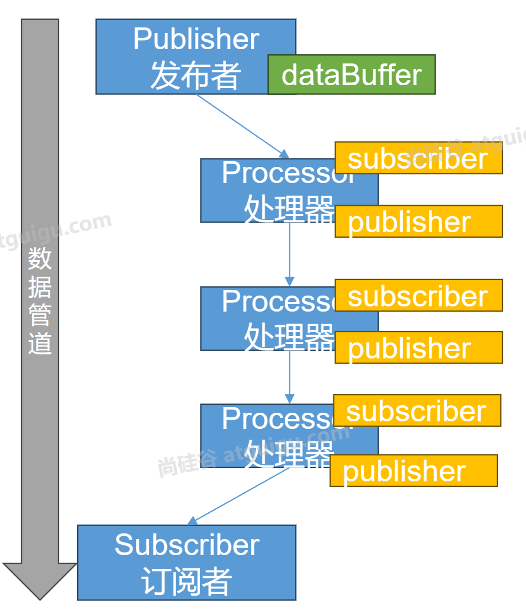
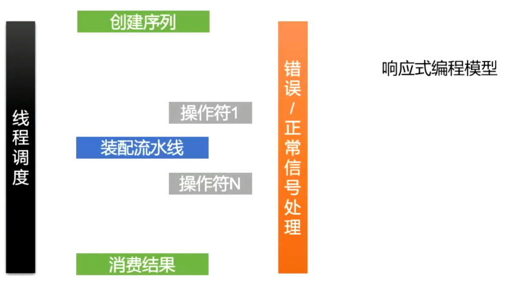

# 第01章_Reactive-Stream

## 1. 响应式编程简介

响应式编程：

- 底层：基于数据缓冲队列+消息驱动模型+异步回调机制
- 编码：流式编程+链式调用+声明式API
- 效果：优雅全异步+消息实时处理+高吞吐量+占用少量资源


## 2. Reactive-Stream简介

### 2.1 简介

Reactive Streams是JVM面向流的库的标准和规范：

- 处理可能无限数量的元素
- 有序
- 在组件之间异步传递元素
- 强制性**非阻塞，背压模式**

我们希望通过全异步的方式，结合缓冲区构建一个实时的数据流系统。而通过Kafka等MQ已经能构建出大型分布式的响应式系统，但缺少一个本地化的消息系统解决方案。

所以，Reactive Streams的作用就是让本地的所有异步线程能互相监听、处理消息，构建一个本地的实时消息处理流。

### 2.2 四大核心接口



在java.util.concurrent.Flow中定义了Reactive Stream的四大核心接口：

- Publisher：发布者，用于产生数据流
- Subscriber：订阅者，用于消费数据流
- Subscription：订阅关系，它是发布者和订阅者之间的关键接口。订阅者通过订阅来表示对发布者产生的数据的兴趣；订阅者可以请求一定数量的元素，也可以取消订阅。
- Processor：处理器，它同时继承了Publisher和Subscriber接口。它可以接收来自一个发布者的数据，进行处理，然后将结果发布给下一个订阅者。处理器在Reactor中充当中间环节，代表一个处理阶段，从而能够在数据流中进行转换、过滤或其他操作。

> 这种模型遵循Reactive Streams规范，确保了异步流的一致性和可靠性。

### 2.3 发布订阅案例演示

#### 1、发布者

对于发布者，我们使用SubmissionPublisher类，它是Publisher接口的一个实现类，可以更方便地发布消息。它具有以下API：

- `int submit(T item)`：用于发布消息。从它的底层源码可知，它发布的消息都会保存到一个数组中，即buffer区
- `void subscribe(Subscriber subscriber)`：用于绑定订阅者
- `void close()`：关闭发布通道

#### 2、订阅者

对于订阅者，我们需要实现Subscriber接口中的所有抽象方法。这些方法都是以onXxx命名的，表示在Xxx事件发生时执行这个回调。

#### 3、订阅关系

订阅关系Subscription接口中有两个核心API：

- `void cancel()`：取消订阅
- `void request(long n)`：向上游发送消息，表示请求n个消息。这是**背压模式的核心**，使得订阅者可以按自己的能力来接收上游的数据。

#### 4、案例代码

```java
public class FlowDemo {
    public static void main(String[] args) {
        // 1. 定义一个发布者
        SubmissionPublisher<String> publisher = new SubmissionPublisher<>();

        // 2. 定义一个订阅者
        Flow.Subscriber<String> subscriber = new Flow.Subscriber<>() {
            // 保存订阅关系
            private Flow.Subscription subscription;

            @Override // 在订阅时，触发这个回调
            public void onSubscribe(Flow.Subscription subscription) {
                System.out.println(Thread.currentThread() +
                        "订阅开始了：" + subscription);
                this.subscription = subscription; // 保存订阅关系
                // 从上游请求一个数据
                subscription.request(1);
            }

            @Override // 接收到新数据时，触发这个回调
            public void onNext(String item) {
                System.out.println(Thread.currentThread() +
                        "订阅者收到数据：" + item);
                if ("haha666".equals(item)) {
                    // 业务逻辑，如果收到恶意消息，则取消订阅
                    subscription.cancel();
                }
                // 从上游请求一个数据
                subscription.request(1);
            }

            @Override // 发生错误时，触发这个回调
            public void onError(Throwable throwable) {
                System.out.println(Thread.currentThread() +
                        "订阅者收到错误信号：" + throwable);
            }

            @Override // 在完成时，触发这个回调
            public void onComplete() {
                System.out.println(Thread.currentThread() +
                        "订阅者收到完成信号");
            }
        };

        // 3. 再定义一个订阅者
        Flow.Subscriber<String> subscriber2 = new Flow.Subscriber<>() {
            private Flow.Subscription subscription;

            @Override
            public void onSubscribe(Flow.Subscription subscription) {
                this.subscription = subscription;
                subscription.request(1);
            }

            @Override
            public void onNext(String item) {
                System.out.println(Thread.currentThread() +
                        "===>订阅者二号收到数据：" + item);
                subscription.request(1);
            }

            @Override
            public void onError(Throwable throwable) {}

            @Override
            public void onComplete() {}
        };

        // 4. 绑定发布者和订阅者
        publisher.subscribe(subscriber);
        publisher.subscribe(subscriber2);

        for (int i = 0; i < 4; i++) {
            // 发布4条数据
            publisher.submit("p-" + i);
        }

        // 5. 关闭发布者
        publisher.close();
        
        // 不能让主线程停止
        try {
            Thread.sleep(10000);
        } catch (InterruptedException e) {
            throw new RuntimeException(e);
        }
    }
}
```

控制台打印如下：

```
Thread[ForkJoinPool.commonPool-worker-1,5,main]订阅开始了：java.util.concurrent.SubmissionPublisher$BufferedSubscription@49989bc8
Thread[ForkJoinPool.commonPool-worker-2,5,main]===>订阅者二号收到数据：p-0
Thread[ForkJoinPool.commonPool-worker-2,5,main]===>订阅者二号收到数据：p-1
Thread[ForkJoinPool.commonPool-worker-2,5,main]===>订阅者二号收到数据：p-2
Thread[ForkJoinPool.commonPool-worker-1,5,main]订阅者收到数据：p-0
Thread[ForkJoinPool.commonPool-worker-2,5,main]===>订阅者二号收到数据：p-3
Thread[ForkJoinPool.commonPool-worker-1,5,main]订阅者收到数据：p-1
Thread[ForkJoinPool.commonPool-worker-1,5,main]订阅者收到数据：p-2
Thread[ForkJoinPool.commonPool-worker-1,5,main]订阅者收到数据：p-3
Thread[ForkJoinPool.commonPool-worker-1,5,main]订阅者收到完成信号
```

从上述案例可见，订阅者处理消息都不是同一个线程，所以**JVM底层对于整个发布订阅关系已经做好了异步和缓冲区处理，这就是一个响应式系统**。

#### 5、处理器

处理器既是一个发布者，又是一个订阅者。我们在上述案例中添加一个静态内部类作为处理器：

```java
static class MyProcessor extends SubmissionPublisher<String> implements Flow.Processor<String, String> {
    private Flow.Subscription subscription;

    @Override
    public void onSubscribe(Flow.Subscription subscription) {
        this.subscription = subscription;
        subscription.request(1);
    }

    @Override
    public void onNext(String item) {
        item += "666!"; // 给每条数据添加一个后缀
        submit(item); // 将加工的数据发布给下游
        subscription.request(1); // 请求新的数据
    }

    @Override
    public void onError(Throwable throwable) {}

    @Override
    public void onComplete() {}
}
```

然后在之前案例的代码中修改绑定关系：

```java
// 4. 绑定发布者和订阅者
MyProcessor processor1 = new MyProcessor();
MyProcessor processor2 = new MyProcessor();

publisher.subscribe(processor1);
processor1.subscribe(processor2);
processor2.subscribe(subscriber);
processor2.subscribe(subscriber2);
```

再进行测试，发现打印的数据都带有两个`666!`后缀。


# 第02章_Reactor框架

## 1. Reactor简介

官网地址 https://projectreactor.io/

Reactor是基于Reactive Streams的第四代响应式库规范，用于在JVM上构建非阻塞应用程序。

1. 完全非阻塞的，并提供高效的需求管理。它直接与Java的功能API、CompletableFuture、Stream和Duration交互。
2. Reactor提供了两个响应式和可组合的API：`Flux`(N个数据)和`Mono`(0或1个数据)
3. 适合微服务，提供基于netty背压机制的网络引擎（HTTP、TCP、UDP）

主要概念：

- 发布者（Publisher）
- 订阅者（Subscriber）
- 订阅关系（Subscription）
- 处理器（Processor）
- 调度器（Scheduler）
- 事件/信号 (event/signal)
- 序列/流（sequence/stream）
- 元素（element/item）
- 操作符（operator）

响应式编程模型：




添加依赖：

```xml
<dependencyManagement>
    <dependencies>
        <dependency>
            <groupId>io.projectreactor</groupId>
            <artifactId>reactor-bom</artifactId>
            <version>2023.0.0</version>
            <type>pom</type>
            <scope>import</scope>
        </dependency>
    </dependencies>
</dependencyManagement>

<dependencies>
    <dependency>
        <groupId>io.projectreactor</groupId>
        <artifactId>reactor-core</artifactId>
    </dependency>
    <dependency>
        <groupId>io.projectreactor</groupId>
        <artifactId>reactor-test</artifactId>
        <scope>test</scope>
    </dependency>
</dependencies>
```

## 2. 常用API

**注意：链式API中，下面的操作符，操作的是上面的流**

### 2.1 创建一个流

- `static <T> Flux<T> just(T... data)`：以可变形参创建一个多元素的流
- `static <T> Flux<T> empty()`：创建一个空流（它只有一个结束信号）
- `static Flux<Integer> range(int start, int count)`：创建一个流，其数据值从start开始，每个数据递增1，一共有count个数据
- `static Flux<Long> interval(Duration period)`：创建一个流，其数据值从0开始，每个数据递增1，且每个数据每隔period的时长发布
- `static Flux<T> concat(Publisher... sources)`：拼接多个流

> 注意：对于Mono，它至多只能创建一个元素的流，例如`static <T> Mono<T> just(T data)`

### 2.2 基本API

- `Flux<T> delayElements(Duration delay)`：流中的每个数据延迟delay的时间发布
- `Flux<V> map(Function mapper)`：对流中元素做映射
- `Flux<T> log()`：打印日志
- `Flux<T> filter(Predicate p)`：过滤，保留断言为true的元素

### 2.3 事件触发API

- `Flux<T> doOnNext(Consumer c)`：流的每个数据到达时触发
- `Flux<T> doOnEach(Consumer c)`：流的每个数据或信号到达时触发
- `Flux<T> doOnRequest(LongConsumer c)`：消费者请求流元素时触发
- `Flux<T> doOnError(Consumer c)`：流发生错误时触发
- `Flux<T> doOnSubscribe(Consumer c)`：流被订阅的时候触发
- `Flux<T> doOnTerminate(Runnable r)`：发送取消或异常信号中断流时触发
- `Flux<T> doOnCancel(Runnable r)`：流被取消时触发
- `Flux<T> doOnDiscard(Class type, Consumer discardHook)`：流中元素被忽略时触发

举例：

```java
public static void main(String[] args) {
    Flux.just(1, 3, 5, 7)
            .doOnNext(i -> System.out.println("map前i=" + i)) // 1 3 5 7
            .map(i -> 10 / i)
            .doOnNext(i -> System.out.println("map后i=" + i)) // 10 3 2 1
            .subscribe(System.out::println); // 10 3 2 1
}
```

### 2.3 流的订阅

- `Disposable subscribe(Consumer consumer)`：订阅消费流（一个流可以有多个消费者）
- `void subscribe(CoreSubscriber<? super T> actual)`：自定义一个消费者进行消费

举例：

```java
public static void main(String[] args) throws IOException {
    Flux<Integer> flux = Flux.range(1, 7)
            .delayElements(Duration.ofSeconds(1)) // 每个数据延迟1秒发布
            .doOnComplete(() -> System.out.println("发布者==>流正常结束"))
            .doOnCancel(() -> System.out.println("发布者==>流已被取消"))
            .doOnError(e -> System.out.println("发布者==>出错" + e))
            .doOnNext(i -> System.out.println("发布者==>元素" + i));

    flux.subscribe(new BaseSubscriber<Integer>() {
        @Override
        protected void hookOnSubscribe(Subscription subscription) {
            System.out.println("消费者==>已绑定" + subscription);
            request(1); // 请求1个元素
        }

        @Override
        protected void hookOnNext(Integer value) {
            System.out.println("消费者==>元素" + value);
            request(1); // 请求1个元素
        }

        @Override
        protected void hookOnComplete() {
            System.out.println("消费者==>流正常结束");
        }

        @Override
        protected void hookOnError(Throwable throwable) {
            System.out.println("消费者==>出错" + throwable);
        }

        @Override
        protected void hookOnCancel() {
            System.out.println("消费者==>流已被取消");
        }

        @Override
        protected void hookFinally(SignalType type) {
            System.out.println("消费者==>finally");
        }
    });

    // 防止主线程结束
    System.in.read();
}
```


