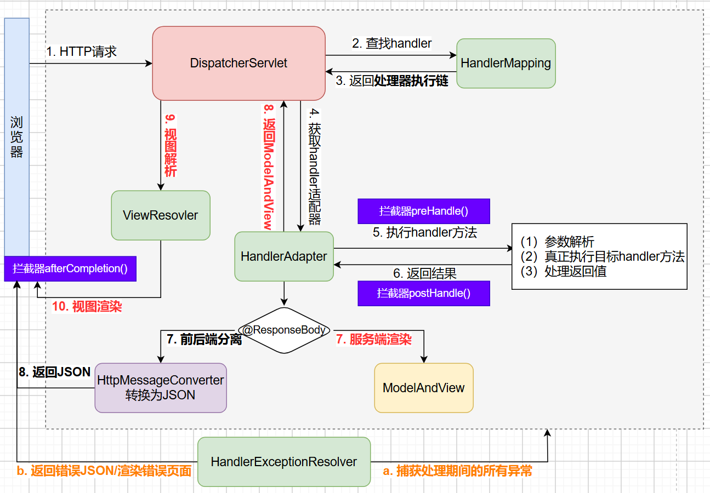
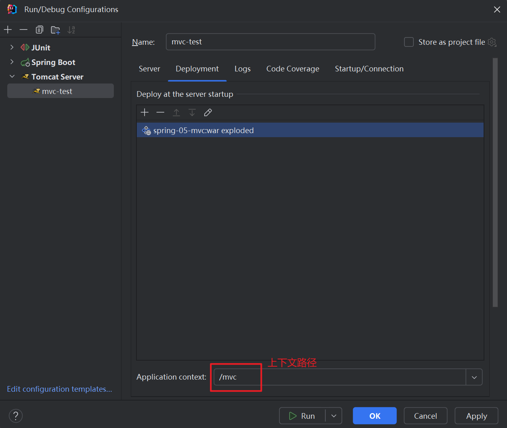

# 第01章_SpringMVC简介

## 1. 简介

MVC是一种软件架构的思想，将软件按照模型、视图、控制器来划分，其核心思想是通过将业务逻辑、数据、展示分离来组织代码。

- M：**Model，模型**，用于保存系统中涉及的数据，例如bean
- V：**View，视图**，用于展示模型中的数据，例如html页面
- C：**Controller，控制器**，用于接收请求和响应浏览器，例如Servlet

Spring Web MVC是基于Servlet API构建的原始Web框架，从一开始就包含在Spring Framework中。正式名称Spring Web MVC来自其源模块的名称（spring-webmvc），但它通常被称为`Spring MVC`。SpringMVC是Spring为**表述层**开发提供的一整套完备的解决方案，在表述层框架历经Strust、WebWork、Strust2等诸多产品的历代更迭之后，目前业界普遍选择了SpringMVC作为Java EE项目表述层开发的首选方案。

> **SpringMVC最主要的作用**：简化前端参数的接收、简化后端数据的响应。

## 2. SpringMVC核心组件

**DispatcherServlet**是SpringMVC的**核心中央处理器**，所有请求都经过它的处理和分发。DispatcherServlet中用到了以下九大组件：

```java
// 文件上传解析器
private MultipartResolver multipartResolver;

// 所处区域解析器（用于国际化）
private LocaleResolver localeResolver;

// 主题解析器（该组件已被废弃）
private ThemeResolver themeResolver;

// 处理器映射器
private List<HandlerMapping> handlerMappings;

// 处理器适配器
private List<HandlerAdapter> handlerAdapters;

// 异常解析器
private List<HandlerExceptionResolver> handlerExceptionResolvers;

// 视图名称翻译器
private RequestToViewNameTranslator viewNameTranslator;

// 闪存管理器
private FlashMapManager flashMapManager;

// 视图解析器
private List<ViewResolver> viewResolvers;
```

**核心概念**：

1. `HandlerMapping`：**处理器映射器**，它内部使用HashMap缓存了handler方法和对应访问路径，主要**用于根据URL匹配对应的handler方法**。
2. `HandlerAdapter`：**处理器适配器**，用于适配对应的handler方法。它可以**处理请求参数和处理响应数据**，DispatcherServlet是**通过HandlerAdapter间接反射调用handler方法的**。
3. `handler`：**请求处理器**，即Controller，它是由程序员自己定义的。
4. `ViewResovler`：**视图解析器**，根据返回的逻辑视图来查找真正的物理视图。注意，在前后端分离项目中不使用视图解析器，因为返回给前端的是JSON数据。

## 3. DispatcherServlet处理请求的流程

SpringMVC处理请求的源码在DispatcherServlet的`doDispatch()`方法中，整体流程如下图所示：



> 说明：**处理器执行链**是HandlerExecutionChain，它包括handler方法、以及处理该handler方法的所有拦截器集合。

## 4. SpringMVC的基本使用

### 4.1 引入依赖

创建JavaEE工程并引入依赖：

```xml
<!-- spring核心依赖 -->
<dependency>
    <groupId>org.springframework</groupId>
    <artifactId>spring-context</artifactId>
    <version>6.0.6</version>
</dependency>
<!-- Servlet API相关依赖，这里我们需要使用tomcat10来支持jakarta包 -->
<dependency>
    <groupId>jakarta.platform</groupId>
    <artifactId>jakarta.jakartaee-web-api</artifactId>
    <version>9.1.0</version>
    <scope>provided</scope>
</dependency>
<!-- springmvc相关依赖 -->
<dependency>
    <groupId>org.springframework</groupId>
    <artifactId>spring-webmvc</artifactId>
    <version>6.0.6</version>
</dependency>
<!-- 前后不分离项目需要使用模板引擎thymeleaf -->
<dependency>
    <groupId>org.thymeleaf</groupId>
    <artifactId>thymeleaf-spring6</artifactId>
    <version>3.1.1.RELEASE</version>
</dependency>
```

### 4.2 Spring配置类

```java
@Configuration
public class SpringConfig {
    // 可以在此类中配置spring的相关组件
}
```

### 4.3 SpringMVC配置类

```java
@Configuration
@EnableWebMvc
@ComponentScan("com.mvc")
public class SpringMvcConfig implements WebMvcConfigurer {
    // 按需配置：拦截器、视图控制器、开启静态资源处理
    
    // 前后端不分离项目，需要进行以下配置，来注册模板引擎
    @Bean // 1. 创建模板解析器
    public ITemplateResolver templateResolver() {
        SpringResourceTemplateResolver templateResolver = new SpringResourceTemplateResolver();
        templateResolver.setPrefix("/WEB-INF/templates/"); // 视图前缀
        templateResolver.setSuffix(".html"); // 视图后缀
        templateResolver.setCharacterEncoding("UTF-8");
        templateResolver.setTemplateMode(TemplateMode.HTML);
        templateResolver.setCacheable(false);
        return templateResolver;
    }
    @Bean // 2. 创建模板引擎，并为其注入模板解析器
    public SpringTemplateEngine templateEngine(ITemplateResolver templateResolver) {
        SpringTemplateEngine templateEngine = new SpringTemplateEngine();
        templateEngine.setTemplateResolver(templateResolver);
        return templateEngine;
    }
    @Bean // 3. 注册Thymeleaf视图解析器，并为其注入模板引擎
    public ThymeleafViewResolver viewResolver(SpringTemplateEngine templateEngine) {
        ThymeleafViewResolver viewResolver = new ThymeleafViewResolver();
        viewResolver.setTemplateEngine(templateEngine);
        viewResolver.setCharacterEncoding("UTF-8");
        viewResolver.setOrder(1);
        return viewResolver;
    }
}
```

> 说明：
>
> - 标注`@EnableWebMvc`注解后就开启了mvc的注解驱动，底层会自动将HandlerMapping、HandlerAdapter等SpringMVC核心组件加入IoC容器；
> - 实现`WebMvcConfigurer`接口，是因为它定义了很多配置web组件的规范，便于我们将来添加额外的配置。

### 4.4 Web初始化类

```java
public class WebAppInitializerConfig extends AbstractAnnotationConfigDispatcherServletInitializer {
    // 指定Spring配置类
    @Override
    protected Class<?>[] getRootConfigClasses() {
        return new Class[]{SpringConfig.class};
    }

    // 指定SpringMVC配置类
    @Override
    protected Class<?>[] getServletConfigClasses() {
        return new Class[]{SpringMvcConfig.class};
    }

    // 设置DispatcherServlet的处理路径，一般都用/处理所有请求
    @Override
    protected String[] getServletMappings() {
        return new String[]{"/"};
    }

    // 设置过滤器
    @Override
    protected Filter[] getServletFilters() {
        // 创建编码过滤器
        CharacterEncodingFilter characterEncodingFilter = new CharacterEncodingFilter();
        characterEncodingFilter.setEncoding("UTF-8");
        characterEncodingFilter.setForceEncoding(true);
        // 创建处理请求方式的过滤器
        HiddenHttpMethodFilter hiddenHttpMethodFilter = new HiddenHttpMethodFilter();
        return new Filter[]{characterEncodingFilter, hiddenHttpMethodFilter};
    }
}
```

- `CharacterEncodingFilter`：编码过滤器，用于解决POST请求参数的乱码问题。注意，**编码过滤器一定要配置到其他过滤器之前**。
- `HiddenHttpMethodFilter`：处理请求方式的过滤器，详细作用见RESTful相关章节。

### 4.5 Controller

```java
@Controller
public class HelloController {
    // 以后我们会越来越倾向于用一句话来作为请求的URL，在这样的一句话中使用"/"分隔各个单词
    @RequestMapping("/hello/spring")
    @ResponseBody
    public String hello() {
        return "hello springmvc!";
    }

    @RequestMapping("/bye/spring")
    public String bye() {
        return "bye";
    }
}
```

`@RequestMapping`注解的value属性可以通过请求地址匹配请求，`/`表示当前工程的上下文路径，如：`http://localhost:8080/mvc/`

> 说明：我们习惯上将处理请求的类称为`Controller类`或`Handler类`，处理请求的方法称为`controller方法`或`handler方法`。

### 4.6 测试

启动Tomcat，注意必须要使用Tomcat 10及以上的版本：



- 访问 http://localhost:8080/mvc/hello/spring 成功
- 访问 http://localhost:8080/mvc/bye/spring 成功（需要在`/WEB-INF/templates/`目录下创建bye.html页面）


# 第02章_SpringMVC接收数据

## 1. @RequestMapping

### 1.1 路径匹配方式

`@RequestMapping`注解的作用就是**将请求的URL地址和处理请求的handler方法关联起来，注册到HandlerMapping中**。请求路径有以下匹配方式：

**1、精确匹配**：不使用任何通配符，按照请求地址进行精确匹配。

**2、模糊匹配**：使用通配符匹配多个类似的地址，如`@RequestMapping("/fruit/*")`

- `?`：匹配任意的单个字符，不包括`?`和`/`
- `*`：匹配任意的0个或多个字符，不包括`?`和`/`
- `**`：匹配任意层数的任意目录（其中所谓的一层或多层是指一个URL地址字符串被`/`划分出来的各个层次），注意只能使用`/**/xxx`的形式

### 1.2 标注位置

- `@RequestMapping`标注在类上，用于设置映射请求的base路径
- `@RequestMapping`标注在方法上，用于设置映射请求的具体路径

```java
@RequestMapping("/test")
@RestController
public class RequestPathTestController {
    // 此时控制器方法所匹配的请求的请求路径为/test/aaa
    @RequestMapping("/aaa")
    public String aaa() {
        return "aaa success";
    }

    // 此时控制器方法所匹配的请求的请求路径为/test
    @RequestMapping
    public String bbb() {
        return "bbb success";
    }
}
```

### 1.3 属性

#### 1、value属性

value属性通过请求的请求地址匹配请求映射，是一个字符串类型的数组，表示该请求映射能够匹配多个请求地址所对应的请求。例如

```java
@RequestMapping({"/hello", "/abc"})
```

> 如果只需匹配单个地址，则可以省略数组的大括号`{}`

**注意**：如果多个 handler 方法映射了同一个地址，会导致 SpringMVC 在接收到这个地址的请求时不知道该找哪个 handler 方法处理，从而抛出异常。

#### 2、method属性

method属性通过请求的请求方式匹配请求映射，是一个RequestMethod类型的数组，表示该请求映射能够匹配多种请求方式的请求。

```java
@RequestMapping(value = "/hello", method = RequestMethod.GET)
```

注：若当前请求的请求地址满足请求映射的value属性，但是请求方式不满足method属性，则浏览器会显示`405`错误。

**说明**：对于处理指定请求方式的控制器方法，SpringMVC中提供了@RequestMapping的派生注解（以下注解只能使用在方法上，不能使用在类上）：

- `@GetMapping`专门处理get请求
- `@PostMapping`专门处理post请求
- `@PutMapping`专门处理put请求
- `@DeleteMapping`专门处理delete请求

#### 3、params属性

params属性通过请求的请求参数匹配请求映射，它是一个字符串类型的数组，可以通过四种表达式设置请求参数和请求映射的匹配关系。注意，前面的value和method只需匹配数组中的某一个元素就成功匹配，而params的数组则不同，必须匹配数组中的所有条件才算作成功匹配。

- `"user"`：要求请求映射所匹配的请求必须携带user请求参数
- `"!user"`：要求请求映射所匹配的请求必须不能携带user请求参数
- `"user=abc"`：要求请求映射所匹配的请求必须携带user请求参数且`user=abc`
- `"user!=abc"`：要求请求映射所匹配的请求要么不携带user参数，如果携带，必须`user!=abc`

注：若当前请求满足@RequestMapping注解的value和method属性，但是不满足params属性，此时页面会显示400错误。

举例：

```java
// 请求参数需要携带 username=吴&password=123456
@GetMapping(
        value = "/request/param",
        params = {"username=吴", "password=123456"}
)
public String testRequestParam() {
    return "success";
}
```

#### 4、headers属性

headers属性通过请求的请求头信息匹配请求映射，是一个字符串类型的数组，可以通过四种表达式设置请求头信息和请求映射的匹配关系。与params很类似。

- `"header"`：要求请求映射所匹配的请求必须携带header请求头信息
- `"!header"`：要求请求映射所匹配的请求必须不能携带header请求头信息
- `"header=value"`：要求请求映射所匹配的请求必须携带header请求头信息且`header=value`
- `"header!=value"`：要求请求映射所匹配的请求要么不携带header请求头信息，如果携带，必须`header!=value`

> 注1：在HTTP报文的请求头和响应头中，key的值是不区分大小写的，但value的值区分大小写。
>
> 注2：若当前请求满足@RequestMapping注解的value和method属性，但是不满足headers属性，此时页面会显示404错误。

## 2. 接收param参数

### 2.1 通过形参直接接收

在控制器方法的形参位置，设置**和请求参数同名的形参**：

```java
@GetMapping("/param1")
public String getParam1(String username, String password) {
    return String.format("username:%s, password:%s", username, password);
}
```

### 2.2 通过@RequestParam注解

`@RequestParam`用于将请求参数和控制器方法的形参创建映射关系，它一共有三个属性：

- value：指定为形参赋值的请求参数名
- required：默认为true，表示前端必须传输此参数，若没有传输该请求参数，且没有设置defaultValue属性，则页面报错`400：Required String parameter 'xxx' is not present`。若设置为false，则不是必须传输此参数，若没有传输，则注解所标识的形参的值默认为null（如果没设置defaultValue）。
- defaultValue：不管required属性值为true或false，当value所指定的请求参数没有传输或传输的值为`""`时，则使用默认值为形参赋值。

```java
@GetMapping("/param2")
public String getParam2(
        @RequestParam("username") String name,
        @RequestParam(value = "password", defaultValue = "123456") String pwd) {
    return String.format("username:%s, password:%s", name, pwd);
}
```

> 注1：为了代码的可读性，建议使用`@RequestParam`注解，而不是省略。
>
> 注2：若有多个同名的请求参数，可以在控制器方法的形参中通过集合来接收，例如`@RequestParam("hobby") List<String> hobbyList`

### 2.3 通过实体类接收

通过实体类类型的形参，此时若请求参数名和实体类中的某个属性名一致，那么请求参数就会为此属性赋值：

```java
@GetMapping("/param3")
// SpringMVC会自动调用实体类中的setter方法注入请求参数
public String getParam3(User user) {
    System.out.println(user);
    return "ok";
}
```

> **说明：SpringMVC也会自动注入级联属性，只要属性名和对应的getter、setter方法匹配即可**。

## 3. 接收JSON

`@RequestBody`注解的作用是将**请求体中的内容**和控制器方法的形参进行绑定，默认使用String类型形参接收。如果想将请求体中JSON格式的数据直接转换为Java对象，则需要如下操作：

1. 导入jackson依赖，用于进行JSON的序列化和反序列化

   ```xml
   <dependency>
       <groupId>com.fasterxml.jackson.core</groupId>
       <artifactId>jackson-databind</artifactId>
       <version>2.14.2</version>
   </dependency>
   ```

2. 在处理请求的控制器方法的形参位置，直接写要转换的Java类型的形参，并使用`@RequestBody`注解标识即可

**例1：JSON转换为实体类对象**

```java
@PostMapping("/json1")
public String getJson1(@RequestBody User user) {
    System.out.println(user);
    return "ok json1";
}
```

**例2：JSON转换为Map**

```java
@PostMapping("/json2")
public String getJson2(@RequestBody Map<String, String> map) {
    System.out.println(map);
    return "ok json2";
}
```

## 4. 接收路径中的参数

使用`@PathVariable`注解，可以将URL中的占位符`{xxx}`所表示的数据赋值给形参：

```java
@GetMapping("/path/{id}/{name}")
public String getPathVariable(@PathVariable("id") Integer identity, @PathVariable("name") String username) {
    return String.format("id:%s, name:%s", identity, username);
}
```

## 5. 其他处理请求的功能

### 5.1 接收Cookie数据

用`@CookieValue`注解来标记形参，可以将cookie数据和控制器方法的形参创建映射关系。@CookieValue注解一共有三个属性：value、required、defaultValue，用法同@RequestParam

### 5.2 接收请求头数据

用`@RequestHeader`注解来标记形参，可以将请求头信息和控制器方法的形参创建映射关系。@RequestHeader注解一共有三个属性：value、required、defaultValue，用法同@RequestParam

### 5.3 获取原生Servlet对象

HttpServletRequest, HttpServletResponse, HttpSession直接在handler方法的形参位置声明即可自动获取。而ServletContext对象没法通过形参声明的方式直接获取，它有以下两种获取方式：

**1、通过HttpSession获取**

```java
@GetMapping("/servlet1")
public String getServlet1(HttpSession session) {
    ServletContext servletContext = session.getServletContext();
    System.out.println(servletContext);
    return "success servlet1";
}
```

**2、通过IoC容器注入**

SpringMVC会在初始化容器时，将ServletContext对象放入IoC容器中：

```java
@Autowired
private ServletContext servletContext;

@GetMapping("/servlet2")
public String getServlet2() {
    System.out.println(servletContext);
    return "success servlet2";
}
```

### 5.4 使用属性域

在前后端不分离的项目中，通常是使用属性域来共享数据，其中请求域是使用最多的属性域。

#### 1、请求域

有以下五种方式可以向请求域共享数据：

```java
@Controller
public class RequestFieldController {

    /**
     * 通过Servlet API向请求域共享数据
     */
    @GetMapping("/request1")
    public String request1(HttpServletRequest request) {
        request.setAttribute("request1", "request1-value");
        return "success-page";
    }

    /**
     * 通过ModelAndView向请求域共享数据
     * ModelAndView包含Model和View的功能：
     * - Model用于向请求域中共享数据
     * - View用于设置逻辑视图实现页面跳转
     */
    @GetMapping("/request2")
    public ModelAndView request2() {
        ModelAndView modelAndView = new ModelAndView();
        // 向请求域中共享数据
        modelAndView.addObject("request2", "request2-value");
        // 设置逻辑视图
        modelAndView.setViewName("success-page");
        return modelAndView;
    }

    /**
     * 通过Model向请求域共享数据
     */
    @GetMapping("/request3")
    public String request3(Model model) {
        model.addAttribute("request3", "request3-value");
        return "success-page";
    }

    /**
     * 通过Map向请求域共享数据
     */
    @GetMapping("/request4")
    public String request4(Map<String, Object> map) {
        map.put("request4", "request4-value");
        return "success-page";
    }

    /**
     * 通过ModelMap向请求域共享数据
     */
    @GetMapping("/request5")
    public String request5(ModelMap modelMap) {
        modelMap.addAttribute("request5", "request5-value");
        return "success-page";
    }
}
```

**Model、ModelMap、Map的关系**：SpringMVC传入的Model、ModelMap、Map类型的参数事实上是同一个BindingAwareModelMap，框架底层会将该模型存入请求域。


#### 2、会话域

```java
@GetMapping("/session")
public String useSession(HttpSession session) {
    session.setAttribute("session-key", "session-value");
    return "success-page";
}
```

#### 3、应用域

```java
@GetMapping("/application")
public String useApplication(HttpSession session) {
    ServletContext servletContext = session.getServletContext();
    servletContext.setAttribute("application-key", "application-value");
    return "success-page";
}
```


# 第03章_SpringMVC响应数据

## 1. 返回JSON

`@ResponseBody`注解的作用是将所标识的控制器方法的返回值作为**响应报文的响应体**响应给浏览器，默认使用String类型返回。如果想直接返回Java对象并转化为JSON格式，则需要如下操作：

1. 导入jackson依赖，用于进行JSON的序列化和反序列化

   ```xml
   <dependency>
       <groupId>com.fasterxml.jackson.core</groupId>
       <artifactId>jackson-databind</artifactId>
       <version>2.14.2</version>
   </dependency>
   ```

2. 将需要转换为JSON字符串的Java对象直接作为控制器方法的返回值，并使用`@ResponseBody`注解标识控制器方法

**举例**：

```java
@GetMapping("/response/get")
@ResponseBody
public User getResponse() {
    return new User("张三", "123456");
}
```

**说明**：`@ResponseBody`注解也可以直接标注在类上，就表示给类中的所有方法都添加了`@ResponseBody`注解。除此之外，类上标注的`@Controller`和`@ResponseBody`，也可以直接用一个复合注解`@RestController`替代。

## 2. 返回视图

对于前后端不分离的项目，控制器方法需要返回一个视图名称。SpringMVC中的视图是View接口，视图的作用是渲染数据，将模型Model中的数据展示给用户。

### 2.1 ThymeleafView

当控制器方法中所设置的视图名称没有任何前缀时，此时的视图名称会被SpringMVC配置的视图解析器解析，**逻辑视图名称拼接视图前缀和视图后缀所得到的就是最终的物理视图名称**，会通过转发的方式实现跳转。

```java
@GetMapping("/test/view/thymeleaf")
public String testThymeleafView() {
    return "success";
}
```

### 2.2 InternalResourceView(转发视图)

SpringMVC中默认的转发视图是InternalResourceView。当控制器方法中所设置的**视图名称以`forward:`为前缀时**，就会创建InternalResourceView，此时的视图名称不会被SpringMVC配置的视图解析器解析，而是会将前缀`forward:`去掉，剩余部分作为最终路径通过转发的方式实现跳转。

```java
@GetMapping("/test/view/forward")
public String testInternalResourceView() {
    return "forward:/test/model";
}
```

### 2.3 RedirectView(重定向视图)

SpringMVC中默认的重定向视图是RedirectView。当控制器方法中所设置的**视图名称以`redirect:`为前缀时**，就会创建RedirectView，此时的视图名称不会被SpringMVC配置的视图解析器解析，而是会将前缀`redirect:`去掉，剩余部分作为最终路径通过重定向的方式实现跳转。

```java
@GetMapping("/test/view/redirect")
public String testRedirectView() {
    return "redirect:/test/model";
}
```

> 注意：重定向视图在解析时，会先将`redirect:`前缀去掉，然后判断剩余部分是否以`/`开头，**若是则会自动拼接上下文路径**。

### 2.4 补充：视图控制器ViewController

如果一个控制器方法仅仅是用来实现页面跳转，即只返回视图名称，而没有其余操作时，可以将该handler方法用视图控制器替代，以作简化。我们只需在SpringMVC的配置类中添加：

```java
@Override // 配置视图控制器
public void addViewControllers(ViewControllerRegistry registry) {
    registry.addViewController("/").setViewName("index");
}
```

> 以上就配置了一个视图控制器，将请求地址`/`转发到逻辑视图`index`所对应的物理视图。


## 3. 静态资源访问

典型的静态资源包括：纯HTML文件、图片、CSS文件、JavaScript文件等。由于DispatcherServlet会处理所有请求，而对于静态资源的访问，则无法通过`@RequestMapping`找到对应的handler方法，因此默认情况下无法访问静态资源。我们想开启静态资源访问，就需要在SpringMVC的配置类中进行配置：

```java
@Override // 开启静态资源处理
public void configureDefaultServletHandling(DefaultServletHandlerConfigurer configurer) {
    configurer.enable();
}
```

此时浏览器发送的请求会先被DispatcherServlet处理，若无法处理再转发给DefaultServlet处理，而DefaultServlet则可以访问静态资源。


# 第04章_SpringMVC其他核心功能

## 1. RESTful

### 1.1 简介

REST：**Re**presentational **S**tate **T**ransfer，表现层资源状态转移。RESTful是一种**软件架构风格**，用于设计网络应用程序和服务之间的通信。简单来说，就是使用资源名作为URI，使用HTTP的请求方式表示对资源的操作。

**RESTful风格的特点**：

1. 每一个URI代表一种资源（URI是统一资源标识符，即资源的名称，注意URL是一种具体的URI，即不仅唯一标识资源、还提供了定位该资源的信息）；
2. 客户端使用GET、POST、PUT、DELETE这四个表示操作方式的动词对服务端资源进行操作：GET用来获取资源，POST用来新建资源，PUT用来更新资源，DELETE用来删除资源；
3. 资源的表现形式是XML或者JSON；
4. 客户端与服务端之间的交互在请求之间是无状态的，从客户端到服务端的每个请求都必须包含理解请求所必需的信息。

**RESTful风格的优点**：

- 风格统一：URL地址从前到后始终都使用斜杠划分各个单词。
- 严谨规范：严格**按照HTTP1.1协议中定义的请求方式本身的语义**进行操作。
- 语义丰富：可以在URL地址中用一句话来充分表达语义。
- 简洁优雅：过去做增删改查操作需要设计4个不同的URL，现在则无需那么多，例如：

|操作|传统风格|REST 风格|
|-|-|-|
|保存|/saveEmp|POST  /emp|
|删除|/removeEmp?empId=2|DELETE  /emp/2|
|更新|/updateEmp|PUT  /emp|
|查询|/selectEmp?empId=2|GET  /emp/2|

> 说明：在RESTful下，有时也可以使用问号键值对传递参数。一般如果直接查询单一的资源，建议使用路径传参；而如果根据**多个条件**来查询资源，则建议使用问号键值对传参，因为如果参数过多，写在路径上可能产生歧义。

### 1.2 HiddenHttpMethodFilter

在HTML的表单提交中，GET和POST请求可以天然实现，但是DELETE和PUT请求无法直接做到。我们在Web初始化类中曾经配置过一个用于处理请求方式的过滤器HiddenHttpMethodFilter，其作用正是将POST请求转换为DELETE或PUT请求。具体要求为：

1. 当前请求的请求方式必须为`post`
2. 当前请求必须传输请求参数`_method`，对应的值必须为`put`、`delete`或`patch`三者之一

根据源码可知，只有满足以上条件，HiddenHttpMethodFilter过滤器才会将当前请求的请求方式转换为请求参数`_method`的值，因此请求参数`_method`的值才是最终的请求方式。

> HiddenHttpMethodFilter的设计思想正是**装饰者模式**。

## 2. 异常处理器

- **编程式异常处理**：在代码中显式地使用try-catch块编写处理异常的逻辑。
- **声明式异常处理**：将异常处理的逻辑从具体的业务逻辑中分离出来，通过配置等方式进行统一的管理和处理。

在SpringMVC中，我们推荐使用声明式异常处理，编写一个**全局异常处理器**来统一处理异常，具体步骤如下：

### 2.1 自定义异常和异常枚举值

异常枚举值：

```java
@AllArgsConstructor
@Getter
public enum BizExceptionEnum {
    UNKNOWN_ERROR(0, "未知错误"),
    STOCK_EMPTY(10001, "库存为空"),
    STOCK_SYNC_FAIL(10002, "库存同步失败"),
    STOCK_LOCK_FAIL(10003, "库存锁定失败"),
    ORDER_CREATE_FAIL(20001, "订单创建失败"),
    ORDER_CLOSE(20002, "订单已关闭");

    private final int code;
    private final String msg;
}
```

自定义业务异常：

```java
@Getter
public class BizException extends RuntimeException {
    private final int code;
    private final String msg;

    public BizException() {
        this(BizExceptionEnum.UNKNOWN_ERROR);
    }

    public BizException(BizExceptionEnum exceptionEnum) {
        super(exceptionEnum.getMsg());
        code = exceptionEnum.getCode();
        msg = exceptionEnum.getMsg();
    }
}
```

### 2.2 创建全局异常处理器

使用`@ControllerAdvice`标识的类就是全局异常处理器，里面可以统一定义异常处理handler方法。在前后端分离项目中，应使用`@RestControllerAdvice`注解，它相当于`@ControllerAdvice`加上`@ResponseBody`。

```java
@RestControllerAdvice
public class GlobalExceptionHandler {
}
```

### 2.3 定义异常处理handler方法

- 在handler方法上使用注解`@ExceptionHandler`来指定要处理的异常
- 在handler方法的形参位置，使用相应的异常类型的对象来接收所出现的异常

```java
@RestControllerAdvice
public class GlobalExceptionHandler {
    @ExceptionHandler(BizException.class)
    public String handleBizException(BizException e) {
        return String.format("errorCode:%d, errorMsg:%s", e.getCode(), e.getMsg());
    }

    @ExceptionHandler(Throwable.class)
    public String handleThrowable(Throwable e) {
        return String.format("出现重大异常, errorMsg:%s", e.getMessage());
    }
}
```

这种异常处理方式的底层原理是，会**给所有Controller织入异常处理的逻辑（AOP）**，当Controller中的方法抛出异常时，就会被对应的`@ExceptionHandler`修饰的方法进行处理。

> 注意：根据底层源码，抛出的异常会**优先匹配最精确的异常handler方法**，如果没有，再往上找其父类异常的handler方法。
>
> 说明：`@ExceptionHandler`标识的异常处理方法，也可以写在普通的`@Controller`类中，此时该异常处理方法只能处理该Controller类中抛出的异常。而如果写在`@ControllerAdvice`类中，则可以处理全局所有Controller类中抛出的异常。

## 3. 拦截器

### 3.1 简介

SpringMVC内置**拦截器机制**，允许在请求被handler方法处理的前后进行拦截，执行一些额外操作（例如权限验证、日记记录等）。**拦截器**和**过滤器**的作用十分相似，都是对请求进行拦截、过滤、放行；但过滤器的拦截范围更大，而拦截器只能在请求到达DispatcherServlet之后才可进行拦截。它们的主要区别如下：

|          | 拦截器 HandlerInterceptor     | 过滤器 Filter               |
| -------- | ----------------------------- | --------------------------- |
| 定义     | Spring框架                    | Servlet规范                 |
| 放行方式 | `preHandle()`返回true放行请求 | `chain.doFilter()`放行请求  |
| 拦截范围 | **拦截SpringMVC能处理的请求** | **拦截整个Web应用所有请求** |
| 整合性   | 受IoC容器管理                 | 不受IoC容器管理             |

> **总结**：SpringMVC应用中更推荐使用拦截器。

### 3.2 拦截器的配置

**首先自定义拦截器组件（实现HandlerInterceptor接口）**：

```java
@Component
public class MyInterceptor implements HandlerInterceptor {
    /**
     * 在控制器方法执行之前执行preHandle()
     * @return 返回值表示对控制器方法的拦截(false)或放行(true)
     */
    @Override
    public boolean preHandle(HttpServletRequest request, HttpServletResponse response, Object handler) throws Exception {
        System.out.println("MyInterceptor-->preHandle");
        return true;
    }

    /**
     * 在控制器方法执行之后执行postHandle()
     */
    @Override
    public void postHandle(HttpServletRequest request, HttpServletResponse response, Object handler, ModelAndView modelAndView) throws Exception {
        System.out.println("MyInterceptor-->postHandle");
    }

    /**
     * 在渲染视图完毕之后最终执行afterCompletion()
     */
    @Override
    public void afterCompletion(HttpServletRequest request, HttpServletResponse response, Object handler, Exception ex) throws Exception {
        System.out.println("MyInterceptor-->afterCompletion");
    }
}
```

**然后在SpringMVC配置类中配置拦截器**：

```java
@Autowired
private MyInterceptor myInterceptor;

// 配置拦截器
@Override
public void addInterceptors(InterceptorRegistry registry) {
    // 添加拦截器，可以多次调用registry.addInterceptor()来添加多个拦截器
    registry.addInterceptor(myInterceptor);
}
```

> 注：上述方式添加的拦截器，默认对DispatcherServlet处理的**所有请求**都进行拦截（包括对静态资源的访问）。我们还可以采用下面的方式拦截指定请求。

**精确拦截：**

```java
@Override
public void addInterceptors(InterceptorRegistry registry) {
    registry.addInterceptor(myInterceptor).addPathPatterns("/path1", "/abc/666");
}
```

> `addPathPatterns()`的参数是可变参数，可以配置多个拦截路径。也支持模糊路径，如`/*`匹配单层目录，`/**`匹配任意层目录。

**排除拦截：**

```java
@Override
public void addInterceptors(InterceptorRegistry registry) {
    registry.addInterceptor(myInterceptor)
            .addPathPatterns("/**") // "/**"会拦截所有请求
            .excludePathPatterns("/css/**", "/js/**"); // 可以使用这种方式放行静态资源
}
```

> `excludePathPatterns()`指定要排除的路径

### 3.3 多个拦截器的执行顺序

多个拦截器的执行顺序和在SpringMVC配置类中配置的顺序有关（即`registry.addInterceptor()`的先后顺序）：
- 首先调用`preHandle()`，它按照配置的顺序调用
- 然后调用`postHandle()`，它按照配置的反序调用
- 最后调用`afterCompletion()`，它按照配置的反序调用

**原因**：从底层源码可见，调用`preHandle()`时，是在一个拦截器数组中进行正向for循环调用的；而`postHandle()`和`afterCompletion()`，都是在数组中进行反向for循环调用的。

**说明**：若拦截器中有某个拦截器的`preHandle()`返回了false，则

- 该拦截器和它之前的拦截器的`preHandle()`都会执行
- 所有拦截器的`postHandle()`都不执行
- 该拦截器之前的拦截器的`afterCompletion()`会执行

## 4. 参数校验

### 4.1 分层领域模型

- DO（Data Object）：此对象与数据库表结构一一对应，通过DAO层向上传输数据源对象。
- DTO（Data Transfer Object）：数据传输对象，Service向外传输的对象，主要用于远程接口的数据传输。
- BO（Business Object）：业务对象，可以由Service层输出的封装业务逻辑的对象，主要在较为大型的业务中做临时的中间转换。
- VO（View/Value Object）：显示层对象，通常是Web向模板渲染引擎层传输的对象，主要用于封装与前端交互的数据。

### 4.2 参数校验简介

为了能够让业务逻辑层基于正确的数据进行处理，我们通常需要**在表述层对参数进行校验**，将错误的数据隔绝在业务逻辑层之外。JSR 303是Java为**实体类属性**数据合法性校验提供的标准框架，通过在实体类的属性上标注类似于`@NotNull`等注解来指定校验规则：

|注解|规则|
|-|-|
|`@Null`|标注值必须为 null|
|`@NotNull`|标注值不可为 null|
|`@AssertTrue`|标注值必须为 true|
|`@AssertFalse`|标注值必须为 false|
|`@Min(value)`|标注值必须大于等于 value|
|`@Max(value)`|标注值必须小于等于 value|
|`@DecimalMin(value)`|标注值必须大于等于 value|
|`@DecimalMax(value)`|标注值必须小于等于 value|
|`@Size(min=v1, max=v2)` |集合/数组/字符串的长度必须属于`[v1,v2]`|
|`@Digits(integer=m, fraction=n)`|标注在一个小数上，整数部分不超过m位，小数部分不超过n位|
|`@Past`|只能标注在日期类型上，要求必须是过去的日期|
|`@Future`|只能标注在日期类型上，要求必须是将来的日期|
|`@Pattern(value)`|标注值必须符合指定的正则表达式|

JSR 303只是一套标准，需要提供其实现才可以使用。Hibernate Validator是JSR 303的一个参考实现，除支持所有标准的校验注解外，它还支持以下扩展注解：

|注解|规则|
|-|-|
|`@Email`|标注值必须是格式正确的Email地址|
|`@Length(min=v1, max=v2)`|字符串长度必须属于`[v1,v2]`|
|`@Range(min=v1, max=v2)`|数值大小必须属于`[v1,v2]`|
|`@NotEmpty` |标注值不能为null且长度不能为0|
|`@NotBlank` |字符串不能为null且长度不能为0且不能只包含空格|
|`@URL` |标注的字符串必须是一个合法的url地址|

**注意**：上述注解都有一个message属性，用于指定在参数校验失败后抛出的异常信息。例如

```java
@NotBlank(message = "用户名不能为空")
private String username;
```

### 4.3 区分校验非空的注解

- `@NotBlank`：当字符串为null，或者长度为0，或者只包含空格时，校验失败并抛出异常。该注解只能**用于字符串类型**。
- `@NotEmpty`：当标注值为null，或者长度为0时，校验失败并抛出异常。该注解推荐**用于集合、数组**。
- `@NotNull`：当标注值为null时，校验失败并抛出异常。该注解推荐**用于其他引用数据类型**。

### 4.4 区分校验大小的注解

- `@Range(min=v1, max=v2)`：数值大小必须属于`[v1,v2]`。该注解只能用于数值类型，或者是一个内容为数值的String。
- `@Length(min=v1, max=v2)`：字符串长度必须属于`[v1,v2]`。该注解只能用于字符串类型。
- `@Size(min=v1, max=v2)`：集合/数组/字符串的长度必须属于`[v1,v2]`。该注解只能用于集合、数组、字符串。

### 4.5 参数校验的步骤

#### 1、引入依赖

```xml
<dependency>
    <groupId>jakarta.platform</groupId>
    <artifactId>jakarta.jakartaee-web-api</artifactId>
    <version>9.1.0</version>
    <scope>provided</scope>
</dependency>
<dependency>
    <groupId>org.hibernate.validator</groupId>
    <artifactId>hibernate-validator</artifactId>
    <version>8.0.0.Final</version>
</dependency>
<dependency>
    <groupId>org.hibernate.validator</groupId>
    <artifactId>hibernate-validator-annotation-processor</artifactId>
    <version>8.0.0.Final</version>
</dependency>
```

如果使用SpringBoot，则只需引入以下依赖：

```xml
<dependency>
    <groupId>org.springframework.boot</groupId>
    <artifactId>spring-boot-starter-validation</artifactId>
</dependency>
```

#### 2、在实体类属性上使用校验注解

添加员工的前端请求入参（对于添加操作，无需指定id属性）：

```java
@Data
public class AddEmployeeVO {

    @NotBlank(message = "用户名不能为空")
    private String username;

    @Length(min = 6, max = 20, message = "密码长度需要介于6到20之间")
    private String password;

    @Max(value = 150, message = "年龄不能超过150岁")
    private Integer age;

    @Email(message = "邮箱格式错误")
    private String email;

    @JsonFormat(pattern = "yyyy-MM-dd HH:mm:ss", timezone = "GMT+8")
    @NotNull(message = "出生日期不能为空")
    private Date birth;
}
```

> 说明：`@JsonFormat`用于指定JSON格式

修改员工的前端请求入参（对于修改操作，必须指定id属性）：

```java
@Data
public class UpdateEmployeeVO {

    @NotNull(message = "id不能为空")
    private Long id;

    private String username;

    private String password;

    private Integer age;

    private String email;

    @JsonFormat(pattern = "yyyy-MM-dd HH:mm:ss", timezone = "GMT+8")
    private Date birth;
}
```

数据库DO：

```java
@Data
public class Employee {
    private Long id;
    private String username;
    private String password;
    private Integer age;
    private String email;
    private Date birth;
}
```

查询员工时返回前端的响应（需要对敏感信息如password进行脱敏）：

```java
@Data
public class EmployeeResponseVO {
    
    private Long id;
    
    private String username;
    
    private Integer age;
    
    private String email;

    @JsonFormat(pattern = "yyyy-MM-dd HH:mm:ss", timezone = "GMT+8")
    private Date birth;
}
```

#### 3、在handler方法中校验形参

> **必须给要校验的实体类形参标注`@Valid`注解，表示进行参数校验**

```java
@RestController
public class EmployeeController {
    @PostMapping("/emp")
    public String addEmp(@Valid @RequestBody AddEmployeeVO addEmployeeVO, BindingResult bindingResult) {
        if (bindingResult.hasErrors()) {
            // 获取校验的错误结果
            bindingResult.getFieldErrors().forEach(item -> {
                // 发生错误的属性名称
                String field = item.getField();
                // 获取对应的错误信息
                String message = item.getDefaultMessage();
                System.out.printf("field:%s, msg:%s%n", field, message);
            });
            return "fail";
        }

        // 参数正确，模拟保存到数据库
        Employee employee = new Employee();
        BeanUtils.copyProperties(addEmployeeVO, employee);
        System.out.println(employee);
        return "success";
    }
}
```

**说明**：如果要在handler方法内部处理参数校验失败的异常，则需要使用BindingResult参数。注意，BindingResult参数必须紧跟在校验参数之后，用于获取校验失败的错误信息，从而可以在handler方法内自行定义如何处理错误。

但是，我们并不推荐直接在handler方法内部处理参数校验失败的异常，而是更**推荐直接让这个异常抛出，交给全局异常处理器来统一处理**：

```java
@RestController
public class EmployeeController {
    @PostMapping("/emp")
    public String addEmp(@Valid @RequestBody AddEmployeeVO addEmployeeVO) {
        // 模拟保存到数据库
        Employee employee = new Employee();
        BeanUtils.copyProperties(addEmployeeVO, employee);
        System.out.println(employee);
        return "success";
    }

    @PutMapping("/emp")
    public String updateEmp(@Valid @RequestBody UpdateEmployeeVO updateEmployeeVO) {
        // 模拟保存到数据库
        Employee employee = new Employee();
        BeanUtils.copyProperties(updateEmployeeVO, employee);
        System.out.println(employee);
        return "success";
    }

    @GetMapping("/emp/{id}")
    public EmployeeResponseVO getEmpById(@PathVariable("id") Long id) {
        // 模拟查询数据库
        Employee employee = new Employee();
        employee.setId(id);
        employee.setUsername("zhangsan");
        employee.setPassword("123456");
        employee.setAge(18);
        employee.setEmail("zs@qq.com");
        employee.setBirth(new Date());

        EmployeeResponseVO response = new EmployeeResponseVO();
        BeanUtils.copyProperties(employee, response);
        return response;
    }
}
```

```java
@RestControllerAdvice
public class GlobalExceptionHandler {
    // 参数校验失败，会抛出MethodArgumentNotValidException异常
    @ExceptionHandler(MethodArgumentNotValidException.class)
    public Map<String, String> handleValidException(MethodArgumentNotValidException e) {
        Map<String, String> map = new HashMap<>();
        // 获取校验的错误结果
        e.getBindingResult().getFieldErrors().forEach(item -> {
            // 发生错误的属性名称
            String field = item.getField();
            // 获取对应的错误信息
            String message = item.getDefaultMessage();
            map.put(field, message);
        });
        return map;
    }
    
    @ExceptionHandler(BizException.class)
    public String handleBizException(BizException e) {
        return String.format("errorCode:%d, errorMsg:%s", e.getCode(), e.getMsg());
    }

    @ExceptionHandler(Throwable.class)
    public String handleThrowable(Throwable e) {
        return String.format("出现重大异常, errorMsg:%s", e.getMessage());
    }
}
```

