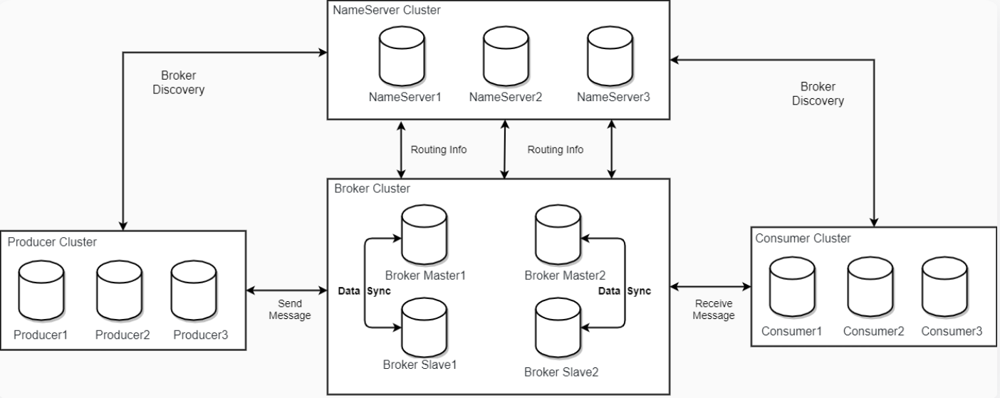

# 第01章_RocketMQ简介

## 1. 简介

RocketMQ是阿里使用Java语言开发的分布式消息中间件，具有丰富的业务功能和极强的可扩展性，是业内共识的**金融级可靠业务消息**首选方案。RocketMQ与Kafka的消息模型十分类似，因为它在设计时参考了Kafka并做出了一些改进。

## 2. RocketMQ架构



NameServer是一个简单的Topic路由注册中心，主要功能包括：

- **Broker管理**：NameServer接受Broker集群的注册信息并且保存下来作为路由信息的基本数据。然后提供心跳检测机制，检查Broker是否还存活。
- **路由信息管理**：每个NameServer将保存关于Broker集群的整个路由信息和用于客户端查询的队列信息。Producer和Consumer通过NameServer就可以知道整个Broker集群的路由信息，从而进行消息的投递和消费。

当Producer准备发送消息时，会先询问NameServer，然后分配一个Broker进行连接后再发送消息；当Consumer准备拉取消息时，也会先询问NameServer，得到一个具体的Broker进行连接后再消费消息。

## 3. Docker安装RocketMQ

### 3.1 拉取RocketMQ镜像

我们以RocketMQ 4.9.4版本为例：

```shell
docker pull apache/rocketmq:4.9.4
```

### 3.2 启动NameServer

（1）创建NameServer数据存储路径

```shell
mkdir -p /rocketmq/data/namesrv/logs /rocketmq/data/namesrv/store
```

（2）启动namesrv容器

```shell
docker run -d \
--name rmqnamesrv \
--privileged=true \
-p 9876:9876 \
-v /rocketmq/data/namesrv/logs:/root/logs \
-v /rocketmq/data/namesrv/store:/root/store \
-e "MAX_POSSIBLE_HEAP=100000000" \
-e "JAVA_OPT_EXT=-Xms512M -Xmx512M -Xmn128m" \
apache/rocketmq:4.9.4 \
sh mqnamesrv
```

### 3.3 启动Broker

（1）创建Broker数据存储路径

```shell
mkdir -p /rocketmq/data/broker/logs /rocketmq/data/broker/store /rocketmq/conf
```

（2）创建配置文件`broker.conf`

```shell
vi /rocketmq/conf/broker.conf
```

添加如下配置：

```vim
brokerClusterName = DefaultCluster
brokerName = broker-a
brokerId = 0
deleteWhen = 04
fileReservedTime = 48
brokerRole = ASYNC_MASTER
flushDiskType = ASYNC_FLUSH
brokerIP1 = 192.168.231.101
diskMaxUsedSpaceRatio=95
```

（3）启动broker容器

```shell
docker run -d \
--name rmqbroker \
--link rmqnamesrv:namesrv \
--privileged=true \
-p 10911:10911 \
-p 10912:10912 \
-p 10909:10909 \
-v /rocketmq/data/broker/logs:/root/logs \
-v /rocketmq/data/broker/store:/root/store \
-v /rocketmq/conf/broker.conf:/home/rocketmq/rocketmq-4.9.4/conf/broker.conf \
-e "NAMESRV_ADDR=namesrv:9876" \
-e "JAVA_OPT_EXT=-Xms512M -Xmx512M -Xmn128m" \
-e "MAX_POSSIBLE_HEAP=200000000" \
apache/rocketmq:4.9.4 \
sh mqbroker -c /home/rocketmq/rocketmq-4.9.4/conf/broker.conf
```

### 3.4 启动RocketMQ控制台

（1）拉取rocketmq-console镜像

```shell
docker pull styletang/rocketmq-console-ng
```

（2）启动rocketmq-console容器

```shell
docker run -d \
--name rmqadmin \
-e "JAVA_OPTS=-Drocketmq.namesrv.addr=192.168.231.101:9876 -Dcom.rocketmq.sendMessageWithVIPChannel=false" \
-p 8081:8080 \
--ulimit nofile=1024 \
styletang/rocketmq-console-ng:latest
```

（3）访问`http://192.168.231.101:8081`即可查看控制台信息


# 第02章_RocketMQ的基本使用

## 1. SpringBoot整合RocketMQ

### 1.1 基本配置

引入依赖：

```xml
<dependency>
    <groupId>org.apache.rocketmq</groupId>
    <artifactId>rocketmq-spring-boot-starter</artifactId>
    <version>2.2.2</version>
</dependency>
```

配置文件：

```properties
rocketmq.name-server=192.168.231.101:9876
# 生产者需要配置生产者组
rocketmq.producer.group=rocketmq-producer-demo
```

> 说明：在RocketMQ 4.x中有生产者组的概念，其作用是为了统一管理某一生产者服务集群。所以生产者组这一概念没什么特别用处，在RocketMQ 5.x中已经废弃了这一概念；但是在4.x版本中如果想使用RocketMQTemplate，则仍然需要配置生产者组名。

SpringBoot 3.x需要额外在resources目录下创建文件`META-INF/spring/org.springframework.boot.autoconfigure.AutoConfiguration.imports`，并在该文件中配置：

```
org.apache.rocketmq.spring.autoconfigure.RocketMQAutoConfiguration
```

### 1.2 生产者

使用RocketMQTemplate发送消息：

```java
@RestController
@Slf4j
public class RocketProducer {
    @Autowired
    private RocketMQTemplate rocketMQTemplate;

    @GetMapping("/sendMsg")
    public void sendMsg() {
        SendResult result = rocketMQTemplate.syncSend("topic-hello", "Hello! 清华大学");
        log.info("发送状态: {}, 消息id: {}", result.getSendStatus(), result.getMsgId());
    }
}
```

### 1.3 消费者

消费者需要标注`@RocketMQMessageListener`注解来指定Topic和消费者组，并实现`RocketMQListener<T>`

- 泛型为MessageExt，则可以获取消息体和消息的其他属性
- 泛型为String，则只能获取消息体

```java
@Slf4j
@Component
@RocketMQMessageListener(topic = "topic-hello", consumerGroup = "topic-hello-consumer")
public class RocketConsumer implements RocketMQListener<MessageExt> {
    @Override
    public void onMessage(MessageExt messageExt) {
        log.info("messageExt:{}", messageExt);
        log.info("msg:{}", new String(messageExt.getBody()));
    }
}
```

## 2. 普通消息发送

RocketMQ有三种方式发送消息：**同步、异步和单向传输**。前两种消息类型是可靠的，因为无论它们是否成功发送都有响应。

### 2.1 同步发送

```java
public SendResult syncSend(String destination, Object payload);
```

同步发送是最常用的方式，是指消息发送方发出一条消息后，会在**收到服务端同步确认之后才发下一条消息**的通讯方式。

注意，同步发送方式请务必捕获发送异常，并做业务侧失败兜底逻辑，如果忽略异常则可能会导致消息未成功发送的情况。

```java
@GetMapping("/syncSendMsg")
public void syncSendMsg() {
    for (int i = 0; i < 10; i++) {
        try {
            SendResult sendResult = rocketMQTemplate.syncSend("topic-hello", "syncSendMsg" + i);
            log.info("{}号消息发送状态:{}", i, sendResult.getSendStatus());
        } catch (Exception e) {
            log.error("{}号消息发送失败", i);
        }
    }
}
```

### 2.2 异步发送

```java
public void asyncSend(String destination, Object payload, SendCallback sendCallback);
```

异步发送是指发送方发出一条消息后，不等服务端返回响应，接着发送下一条消息的通讯方式。异步发送需要实现**异步发送回调接口**（SendCallback），SendCallback接口主要有onSuccess和onException两个方法，表示消息发送成功和消息发送失败。异步发送通常用于**对响应时间敏感**的业务场景。

```java
@GetMapping("/asyncSendMsg")
public void asyncSendMsg() {
    for (int i = 0; i < 10; i++) {
        rocketMQTemplate.asyncSend("topic-hello", "asyncSendMsg" + i, new SendCallback() {
            @Override
            public void onSuccess(SendResult sendResult) {
                log.info("{}消息发送成功", sendResult.getMsgId());
            }

            @Override
            public void onException(Throwable throwable) {
                log.error("消息发送异常", throwable);
            }
        });
    }
}
```

### 2.3 单向模式发送

```java
public void sendOneWay(String destination, Object payload);
```

单向模式发送是指发送方只负责发送消息，不等待服务端返回响应且没有回调函数触发，即只发送请求不等待应答。此方式吞吐量很大，但存在消息丢失的风险，适用于**对可靠性要求并不高的场景**，例如日志收集。

```java
@GetMapping("/sendOneWayMsg")
public void sendOneWayMsg() {
    for (int i = 0; i < 10; i++) {
        rocketMQTemplate.sendOneWay("topic-hello", "sendOneWayMsg" + i);
    }
}
```

## 3. 延时消息发送

延时消息发送是指消息发送到RocketMQ后，并不期望立马投递这条消息，而是延迟一定时间后才投递到Consumer进行消费。RocketMQ一共支持18个等级的延迟投递，具体时间如下：

| 等级 | 延迟时间 | 等级 | 延迟时间 |
| ---- | -------- | ---- | -------- |
| 1    | 1s       | 10   | 6min     |
| 2    | 5s       | 11   | 7min     |
| 3    | 10s      | 12   | 8min     |
| 4    | 30s      | 13   | 9min     |
| 5    | 1min     | 14   | 10min    |
| 6    | 2min     | 15   | 20min    |
| 7    | 3min     | 16   | 30min    |
| 8    | 4min     | 17   | 1h       |
| 9    | 5min     | 18   | 2h       |

```java
/**
 * @param destination 主题:标签
 * @param message 消息体
 * @param timeout 发送的超时时间，单位ms(注意这个参数和延时时间无关)
 * @param delayLevel 延时等级(1~18)
 */
public SendResult syncSend(String destination, Message<?> message, long timeout, int delayLevel);
```

```java
@GetMapping("/sendDelayMsg")
public void sendDelayMsg() {
    Message<String> msg = MessageBuilder.withPayload("这是一个延时消息").build();
    try {
        SendResult result = rocketMQTemplate.syncSend("topic-hello", msg, 2000, 3);
        log.info("延时消息发送成功{}", result.getSendStatus());
    } catch (Exception e) {
        log.error("延时消息发送失败");
    }
}
```

## 4. 顺序消息发送

顺序消息是一种对消息发送和消费顺序有严格要求的消息。

### 4.1 生产者

```java
/**
 * @param destination 主题:标签
 * @param payload 消息体
 * @param hashKey 根据此hashKey来选择要投递到哪个队列
 */
public SendResult syncSendOrderly(String destination, Object payload, String hashKey);
```

RocketMQ支持分区顺序消息，**具有相同hashKey的消息会被分配到同一个队列中**，于是在同一个队列中的消息自然是有序的。

```java
@GetMapping("/syncSendOrderlyMsg")
public void syncSendOrderlyMsg() {
    for (int i = 0; i < 100; i++) {
        rocketMQTemplate.syncSendOrderly("topic-user", "userId:" + i, "userService");
    }
}
```

### 4.2 消费者

RocketMQ消费者的consumeMode有两种：**并发消费、顺序消费**。默认情况下会进行并发消费，也就是底层会使用多个线程同时消费一个队列的消息。

因此，我们要保证在消费者端的顺序性，就不能使用并发消费，而**应该使用顺序消费**。在顺序消费模式下，对同一个队列，底层只会用一个线程去进行消费。我们需要在`@RocketMQMessageListener`注解中指定`consumeMode = ConsumeMode.ORDERLY`

```java
@Slf4j
@Component
@RocketMQMessageListener(topic = "topic-user",
        consumerGroup = "topic-user-consumer",
        consumeMode = ConsumeMode.ORDERLY
)
public class RocketOrderlyConsumer implements RocketMQListener<MessageExt> {
    @Override
    public void onMessage(MessageExt messageExt) {
        log.info("msg:{}", new String(messageExt.getBody()));
    }
}
```

## 5. 消息的常见属性

### 5.1 Tag

在给某一Topic发送消息时，还可以进一步指定该消息的标签Tag，这样消费端就可以进一步根据Tag来过滤得到自己感兴趣的消息。

生产者（Tag拼接在Topic后面，用冒号分隔）

```java
@GetMapping("/sendTagMsg")
public void sendTagMsg() {
    rocketMQTemplate.syncSend("topic-hello:tagA", "tagA消息");
    rocketMQTemplate.syncSend("topic-hello:tagB", "tagB消息");
}
```

消费者（需要指定selectorType以及selectorExpression）

```java
@Slf4j
@Component
@RocketMQMessageListener(topic = "topic-hello",
        consumerGroup = "topic-hello-consumer-tag-01",
        selectorType = SelectorType.TAG,
        selectorExpression = "tagA"
)
public class RocketTagConsumer1 implements RocketMQListener<String> {
    @Override
    public void onMessage(String message) {
        log.info("RocketTagConsumer1收到消息:{}", message);
    }
}
```

```java
@Slf4j
@Component
@RocketMQMessageListener(topic = "topic-hello",
        consumerGroup = "topic-hello-consumer-tag-02",
        selectorType = SelectorType.TAG,
        selectorExpression = "tagA || tagB"
)
public class RocketTagConsumer2 implements RocketMQListener<String> {
    @Override
    public void onMessage(String message) {
        log.info("RocketTagConsumer2收到消息:{}", message);
    }
}
```

### 5.2 Key

我们可以为消息指定Key，通常这是一个业务层面的唯一标识，便于防止消费者端重复消费消息。

生产者

```java
@GetMapping("/sendKeyMsg")
public void sendKeyMsg() {
    Message<String> message = MessageBuilder.withPayload("带key消息")
            .setHeader(RocketMQHeaders.KEYS, "uid:114514")
            .build();
    rocketMQTemplate.syncSend("topic-hello", message);
}
```

消费者

```java
@Slf4j
@Component
@RocketMQMessageListener(topic = "topic-hello", consumerGroup = "topic-hello-consumer-key")
public class RocketKeyConsumer implements RocketMQListener<MessageExt> {
    @Override
    public void onMessage(MessageExt messageExt) {
        log.info("keys:{}", messageExt.getKeys());
        log.info("msg:{}", new String(messageExt.getBody()));
    }
}
```

## 6. 消费组的消费模式

对于同一Topic来说，不同的消费者组之间是发布订阅模式；而在同一消费者组中的消费者，有以下两种消费模式：

- **集群消费模式**：这是默认的消费模式，与Kafka相同，即同一队列中的消息只能被某一个消费者消费（但要注意，一个消费者是可以消费多个队列的）
- **广播消费模式**：会将每条消息推送给该消费组内的所有消费者

我们前面的示例都是采用默认的集群消费模式，下面我们演示广播消费模式：

```java
@Slf4j
@Component
@RocketMQMessageListener(topic = "topic-hello",
        consumerGroup = "topic-hello-consumer-broadcast",
        messageModel = MessageModel.BROADCASTING
)
public class RocketBroadcastConsumer1 implements RocketMQListener<String> {
    @Override
    public void onMessage(String message) {
        log.info("RocketBroadcastConsumer1收到消息:{}", message);
    }
}
```

```java
@Slf4j
@Component
@RocketMQMessageListener(topic = "topic-hello",
        consumerGroup = "topic-hello-consumer-broadcast",
        messageModel = MessageModel.BROADCASTING
)
public class RocketBroadcastConsumer2 implements RocketMQListener<String> {
    @Override
    public void onMessage(String message) {
        log.info("RocketBroadcastConsumer2收到消息:{}", message);
    }
}
```

## 7. 重试机制

### 7.1 生产者重试

默认情况下，生产者发送消息的超时时间为3000ms，如果消息发送失败，则会进行重试，默认重试2次。

### 7.2 消费者重试

**只有集群消费模式会进行消息重试**，广播消费模式不会进行重试。消费者消息重试指的是，当Consumer消费某条消息抛出异常时，RocketMQ会在重试间隔时间后，将消息重新投递给Consumer消费，若达到最大重试次数后消息还没有成功被消费，则消息将被投递至死信队列。

顺序消费和并发消费的重试机制并不相同，具体区别如下：

#### 顺序消费

对于顺序消费，消费失败后会先在客户端本地重试直到最大重试次数，这样可以避免消费失败的消息被跳过，消费下一条消息而打乱顺序消费的顺序。

**重试间隔时间**：通过`@RocketMQMessageListener`注解中的`suspendCurrentQueueTimeMillis`属性指定，默认为1000ms。

**最大重试次数**：通过`@RocketMQMessageListener`注解中的`maxReconsumeTimes`属性指定，默认为`Integer.MAX_VALUE`。

#### 并发消费

对于并发消费，消费失败后会将消费失败的消息重新投递回服务端，再等待服务端重新投递回来，在这期间会正常消费队列后面的消息。注意，并发消费失败后并不是投递回原Topic，而是投递到一个特殊Topic，其命名为`%RETRY%ConsumerGroupName`，所以事实上该消费组也会订阅该Topic。

**重试间隔时间**：根据重试次数阶梯变化，具体规则如下

| 第几次重试 | 与上次重试的间隔时间 | 第几次重试 | 与上次重试的间隔时间 |
| ---------- | -------------------- | ---------- | -------------------- |
| 1          | 10s                  | 9          | 7min                 |
| 2          | 30s                  | 10         | 8min                 |
| 3          | 1min                 | 11         | 9min                 |
| 4          | 2min                 | 12         | 10min                |
| 5          | 3min                 | 13         | 20min                |
| 6          | 4min                 | 14         | 30min                |
| 7          | 5min                 | 15         | 1h                   |
| 8          | 6min                 | 16         | 2h                   |

**最大重试次数**：通过`@RocketMQMessageListener`注解中的`maxReconsumeTimes`属性指定，默认为`16`。

### 7.3 死信队列

若达到最大重试次数后消息还没有成功被消费，则消息将被投递至死信队列，对应的死信Topic命名为`%DLQ%ConsumerGroupName`

### 7.4 最佳实践

生产者

```java
@GetMapping("/sendError")
public void sendError() {
    try {
        rocketMQTemplate.syncSend("topic-error", "测试消息");
    } catch (Exception e) {
        log.error("发送消息异常, 请进行人工处理");
    }
}
```

消费者（模拟业务出现异常）

```java
@Slf4j
@Component
@RocketMQMessageListener(topic = "topic-error",
        consumerGroup = "topic-error-consumer",
        maxReconsumeTimes = 2
)
public class RocketServiceConsumer implements RocketMQListener<MessageExt> {
    @Override
    public void onMessage(MessageExt message) {
        log.info("收到消息:{}, 该消息已重试{}次", new String(message.getBody()), message.getReconsumeTimes());
        throw new RuntimeException("模拟业务异常");
    }
}
```

死信消费者（订阅死信Topic，做消费异常的兜底处理）

```java
@Slf4j
@Component
@RocketMQMessageListener(topic = "%DLQ%topic-error-consumer",
        consumerGroup = "topic-error-consumer-dead-letter"
)
public class RocketDeadLetterConsumer implements RocketMQListener<MessageExt> {
    @Override
    public void onMessage(MessageExt message) {
        log.error("收到死信消息:{}, 请进行人工处理", new String(message.getBody()));
    }
}
```


# 第03章_消息队列经典问题

## 1. 如何保证消息顺序消费

### 1.1 Kafka

Kafka生产者在给某个Topic发送消息时，具体该消息会在哪个Partition中是不确定的，因此，**Kafka只能为我们保证在同一分区中的消息是有序的（通过幂等性操作和事务机制）**。

所以，如果想保证消息的消费顺序，就需要**让生产者将消息发送到同一分区中**，比如可以在发送消息时指定Partition、或者指定相同的key（因为key相同就会发送到同一Partition）。

### 1.2 RocketMQ

与Kafka类似，RocketMQ也**只保证在同一队列中的消息是有序的**。

所以，如果想保证消息的消费顺序，就需要**让生产者将消息发送到同一队列中**，RocketMQ中可以在发送消息时指定相同的hashKey来保证这一点。除此之外，在RocketMQ消费者端还应该采用**顺序消费**的消费模式，保证使用单线程去消费消息。

### 1.3 RabbitMQ

RabbitMQ中可以指定相同的routingKey使得**生产者将消息发送到同一队列**，而在同一队列中的消息自然是有序的。但RabbitMQ的难点在于保证消费者端的顺序性。

注意，消费者服务往往是通过集群部署的，而在Kafka和RocketMQ的架构中能保证同一队列中的消息只会被消费者组中的一个消费者消费，所以在消费者端很容易保证顺序性。但在RabbitMQ中，我们的消费者服务集群监听同一个队列，消息则会轮询分发给这些消费者、破坏了顺序性。因此，RabbitMQ为我们提供了**单活模式队列**，它能保证该队列的多个消费者实例中只有一个实例起作用，这样就保证了消费顺序性。

## 2. 如何防止消息丢失

### 2.1 Kafka

1. 消息保证持久化。
2. 生产者保证消息不丢：
   - Kafka生产者可以通过**ACK机制**（使用默认值）、**重试机制**、**异步发送回调方法**，来保证消息不丢；
   - 如果要保证绝对的可靠性，则可以**结合MySQL和定时任务**：在发消息前先记录该消息到MySQL，发送消息成功后再修改MySQL这条消息的状态，结合定时任务定期扫描未成功发送的消息进行再次发送。
3. 消费者保证消息不丢：
   - 采用**手动提交偏移量**，并结合MySQL事务之类的方式，将消费者端的数据消费过程和偏移量提交过程进行原子性绑定；
   - Kafka消费者具有**重试机制**，当达到最大重试次数后，我们可以将这条消息**发送到死信队列**做兜底处理。

### 2.2 RocketMQ

1. 消息保证持久化。
2. 生产者保证消息不丢：
   - RocketMQ生产者可以通过**同步发送确认机制**、**异步发送回调方法**、**重试机制**，来保证消息不丢；
   - 如果要保证绝对的可靠性，则可以**结合MySQL和定时任务**。
3. 消费者保证消息不丢：
   - RocketMQ消费者默认就使用**手动提交偏移量**，我们建议再结合MySQL事务之类的方式，将消费者端的数据消费过程和偏移量提交过程进行原子性绑定；
   - RocketMQ消费者具有**重试机制**，当达到最大重试次数后，会将这条消息**发送到死信队列**做兜底处理。

### 2.3 RabbitMQ

RabbitMQ防止消息丢失，主要有以下四个环节：

1. 保证消息从生产者正确投递到交换机。一般使用消息的Confirm模式来保证该环节的可靠性。
2. 保证消息从交换机正确路由到队列。一般使用消息的Returns模式，或者使用备用交换机，来保证该环节的可靠性。
3. 保证消息的持久存储。一般让交换机、队列、消息都进行持久化，就能保证该环节的可靠性。
4. 保证消息从队列中正确被消费者消费。一般使用消息的手动确认，就能保证该环节的可靠性。

> 补充：如果要保证发送消息的绝对可靠性，则同样可以结合MySQL和定时任务。如果消费者无法正确消费，则同样可以结合死信队列做兜底处理。

## 3. 如何防止消息重复消费

出现消息重复消费的最根本原因就是**消费者已经消费的数据没有成功提交offset**。通常结合以下步骤来防止消息重复消费：

1. 采用手动提交偏移量，并结合MySQL事务之类的方式，将消费者端的数据消费过程和偏移量提交过程进行原子性绑定；
2. 消费者的业务消费接口设计为**幂等性**的。例如可以基于Redis或MySQL实现**防重表**，并且每个消息都有业务的**唯一标识**，这样已经处理过的消息就不会再进行重复处理（因为Redis执行setnx命令会失败，MySQL插入记录会产生唯一索引冲突）。

##  4. 如何防止消息积压

产生消息积压的主要原因有：

- 生产者的发送消息流量太大
- 消费者消费能力不足，或者消费者宕机

为此，我们可以采取的措施有：

- 增加Topic的分区数，并同时提升消费组的消费者数量，尽量使消费者数与分区数相等。（对于RabbitMQ而言，只要增加消费者数量即可）
- 对于实时性要求不高的业务场景，我们可以创建一个专门的消息消费服务，其功能是将消息先批量取出来，并保存到数据库中，之后再离线慢慢处理这些数据

