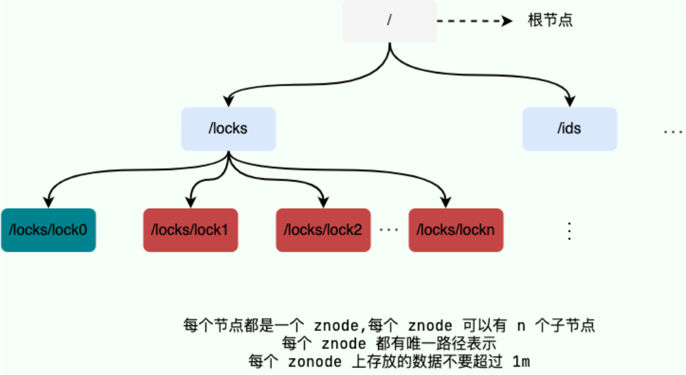
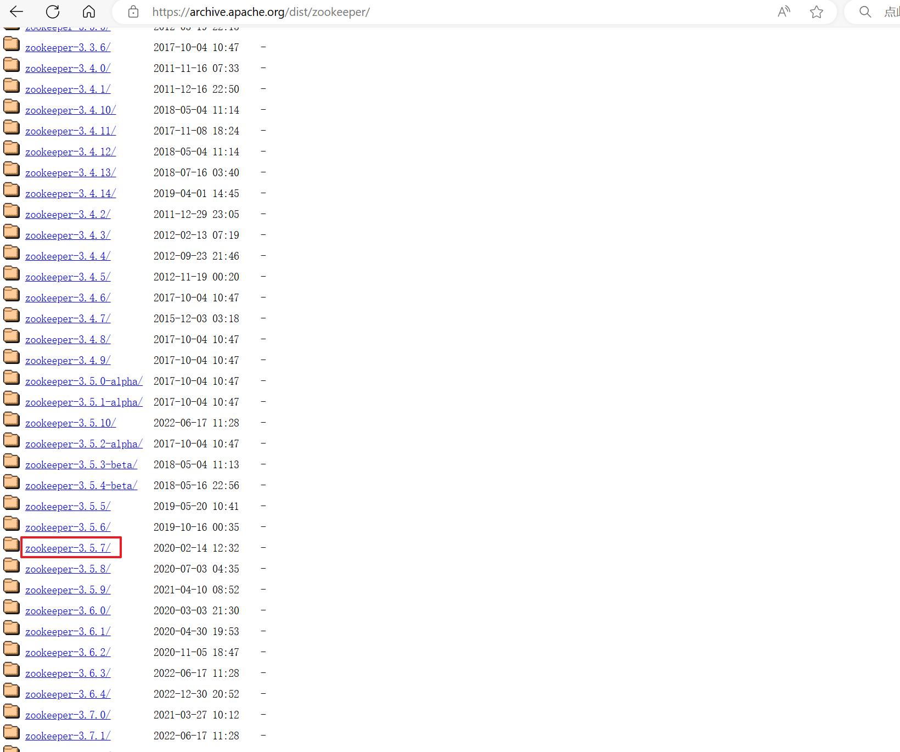
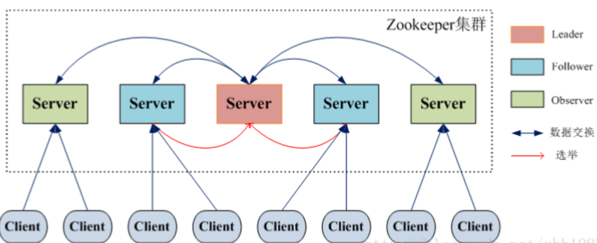
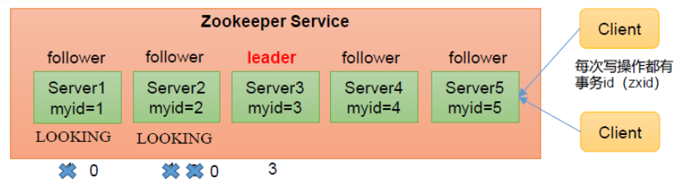
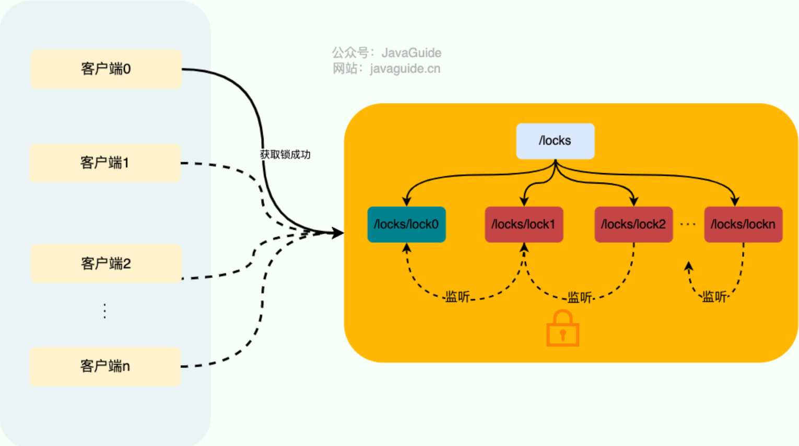

# 第01章_ZooKeeper简介

## 1. 简介

ZooKeeper是一个开源的**分布式协调服务**，它为我们提供了高可用、高性能、稳定的分布式数据一致性解决方案。ZooKeeper将数据保存在内存中（当然也会持久化到磁盘），所以在读多写少的场景下性能很高（写操作则会导致所有服务器间同步数据）。

ZooKeeper的特点有：

- **顺序一致性**：从同一客户端发起的事务请求，最终将会严格地按照顺序被应用到 ZooKeeper 中去。
- **原子性**：所有事务请求的处理结果在整个集群中所有机器上的应用情况是一致的，也就是说，要么整个集群中所有的机器都成功应用了某一个事务，要么都没有应用。
- **单一系统映像**：无论客户端连到哪一台 ZooKeeper 服务器上，其看到的服务端数据模型都是一致的。
- **可靠性**：一旦一次更改请求被应用，更改的结果就会被持久化，直到被下一次更改覆盖。
- **实时性**：一旦数据发生变更，其他节点会实时感知到。每个客户端的系统视图都是最新的。
- **集群部署**：3台（奇数台）机器就可以组成一个集群，每台机器都在内存保存了 ZooKeeper 的全部数据，机器之间互相通信同步数据，客户端连接任何一台机器都可以。
- **高可用**：集群中只要有超过半数的机器能正常工作，就能保证集群可用。所以5台机器容许挂掉2台机器，注意6台机器也只容许挂掉2台（所以推荐使用奇数台机器构成集群）。

ZooKeeper的应用场景主要有：

1. **命名服务**：可以通过 ZooKeeper 的顺序节点生成全局唯一ID。
2. **数据发布/订阅**：通过**Watcher机制**可以很方便地实现数据发布/订阅。当你将数据发布到 ZooKeeper 被监听的节点上，其他机器可通过监听 ZooKeeper 上节点的变化来实现配置的动态更新。
3. **分布式锁**

## 2. 核心概念

### 2.1 数据模型

ZooKeeper数据模型采用层次化的多叉树形结构，根节点用`/`来代表，每个节点上都可以存储数据。每个数据节点被称为**znode**，它是ZooKeeper中数据的最小单元，每个znode都有唯一的路径标识（与UNIX文件系统路径相似）。

注意，ZooKeeper的每个znode的数据大小上限是1M，所以不能在znode上存储大量的数据。**ZooKeeper是用来协调分布式服务的，而并不是用来存储业务数据的**。



### 2.2 znode

znode分为四大类：

- 持久节点（PERSISTENT）：一旦创建就一直存在，除非手动将其删除。
- 临时节点（EPHEMERAL）：临时节点的生命周期是与客户端会话（session）绑定的，会话消失则节点消失。并且，**临时节点只能做叶子节点** ，不能创建子节点。
- 持久顺序节点（PERSISTENT_SEQUENTIAL）：除了具有持久节点的特性之外， 节点的名称还具有顺序性。比如 `/node/app0000000001`、`/node/app0000000002` 。顺序号是一个单调递增的计数器，由父节点维护。
- 临时顺序节点（EPHEMERAL_SEQUENTIAL）：除了具备临时节点的特性之外，节点的名称还具有顺序性。

每个znode由两部分组成：data（节点存放的数据）、stat（状态信息）

```shell
[zk: 127.0.0.1:2181(CONNECTED) 6] get /dubbo
# 该数据节点关联的数据内容为空
null
# 下面是该数据节点的一些状态信息，其实就是 Stat 对象的格式化输出
cZxid = 0x2
ctime = Tue Nov 27 11:05:34 CST 2018
mZxid = 0x2
mtime = Tue Nov 27 11:05:34 CST 2018
pZxid = 0x3
cversion = 1
dataVersion = 0
aclVersion = 0
ephemeralOwner = 0x0
dataLength = 0
numChildren = 1
```

stat中的状态信息字段有：

| 状态信息字段   | 说明                                                         |
| -------------- | ------------------------------------------------------------ |
| cZxid          | create ZXID，即该数据节点被创建时的事务 id                   |
| ctime          | create time，即该节点的创建时间                              |
| mZxid          | modified ZXID，即该节点最终一次更新时的事务 id               |
| mtime          | modified time，即该节点最后一次的更新时间                    |
| pZxid          | 该节点的子节点列表最后一次修改时的事务 id，只有子节点列表变更才会更新 pZxid，子节点内容变更不会更新 |
| cversion       | 子节点版本号，当前节点的子节点每次变化时值增加 1             |
| dataVersion    | 数据节点内容版本号，节点创建时为 0，每更新一次节点内容(不管内容有无变化)该版本号的值增加 1 |
| aclVersion     | 节点的 ACL 版本号，表示该节点 ACL 信息变更次数               |
| ephemeralOwner | 创建该临时节点的会话的 sessionId；如果当前节点为持久节点，则 ephemeralOwner=0 |
| dataLength     | 数据节点内容长度                                             |
| numChildren    | 当前节点的子节点个数                                         |

### 2.3 ACL

ZooKeeper采用ACL（AccessControlLists）策略来进行权限控制，类似于UNIX文件系统的权限控制。

对于znode操作的权限，ZooKeeper提供了以下5种：

- **CREATE** : 能创建子节点
- **READ**：能获取节点数据和列出其子节点
- **WRITE** : 能设置/更新节点数据
- **DELETE** : 能删除子节点
- **ADMIN** : 能设置节点 ACL 的权限

> 注意：CREATE 和 DELETE 这两种权限都是针对**子节点**的权限控制。

对于身份认证，提供了以下几种方式：

- **world**: 默认方式，所有用户都可无条件访问。
- **auth**: 不使用任何 id，代表任何已认证的用户。
- **digest**: 用户名密码认证方式 `username:password`。
- **ip**: 对指定ip进行限制。

### 2.4 Watcher

Watcher（事件监听器），是 ZooKeeper 中的一个很重要的特性，对应的是设计模式中的**观察者模式**。ZooKeeper 允许用户在指定节点上注册一些 Watcher，并且在一些特定事件触发的时候，ZooKeeper 服务端会将事件通知到感兴趣的客户端上去，该机制是 ZooKeeper 实现分布式协调服务的重要特性。

### 2.5 Session

Session 可以看作是 ZooKeeper 服务器与客户端的之间的一个 TCP 长连接，通过这个连接，客户端能够通过心跳检测与服务器保持有效的会话，也能够向 ZooKeeper 服务器发送请求并接受响应，同时还能够通过该连接接收来自服务器的 Watcher 事件通知。

Session 有一个属性叫做：`sessionTimeout`，代表会话的超时时间。当由于服务器压力太大、网络故障或是客户端主动断开连接等各种原因导致客户端连接断开时，只要在`sessionTimeout`规定的时间内能够重新连接上集群中任意一台服务器，那么之前创建的会话仍然有效。

另外，在为客户端创建会话之前，服务端首先会为每个客户端都分配一个`sessionID`。由于 `sessionID`是 ZooKeeper 会话的一个重要标识，许多与会话相关的运行机制都是基于这个`sessionID`的，因此，无论是哪台服务器为客户端分配的`sessionID`，都务必保证全局唯一。

## 3. ZooKeeper安装

### 3.1 ZooKeeper下载

（1）进入官网 https://zookeeper.apache.org 下载3.5.7版本



（2）将apache-zookeeper-3.5.7-bin.tar.gz上传到Linux服务器中

（3）解压到指定目录

```shell
tar -zxvf /zookeeper/apache-zookeeper-3.5.7-bin.tar.gz -C /zookeeper/
```

> 注意：必须保证ZooKeeper所在的服务器已安装JDK

### 3.2 安装ZooKeeper单机

（1）修改配置文件

```shell
cd /zookeeper/apache-zookeeper-3.5.7-bin/conf
mv zoo_sample.cfg zoo.cfg
mkdir /zookeeper/apache-zookeeper-3.5.7-bin/zkData
vi zoo.cfg
# 然后将数据目录修改为dataDir=/zookeeper/apache-zookeeper-3.5.7-bin/zkData
```

**配置参数说明**：

- `tickTime=2000` 通信心跳时间默认为2000ms
- `initLimit=10` Leader和Follower初始连接时，如果超过10个心跳，则认为连接失败
- `syncLimit=5` Leader和Follower之间同步信息时，如果超过5个心跳，则Leader认为该Follower宕机，于是从服务器列表中移除该Follower
- `dataDir`用于指定保存ZooKeeper数据的目录
- `clientPort=2181` 客户端连接的默认端口为2181

（2）启动ZooKeeper服务器

```shell
/zookeeper/apache-zookeeper-3.5.7-bin/bin/zkServer.sh start
```

（3）查看ZooKeeper服务器状态

```shell
/zookeeper/apache-zookeeper-3.5.7-bin/bin/zkServer.sh status
```

（4）启动和退出客户端

```shell
# 启动客户端
[root@zookeeper1 bin]# /zookeeper/apache-zookeeper-3.5.7-bin/bin/zkCli.sh
# 退出客户端
[zk: localhost:2181(CONNECTED) 0] quit
```

（5）停止ZooKeeper服务器

```shell
/zookeeper/apache-zookeeper-3.5.7-bin/bin/zkServer.sh stop
```

### 3.3 安装ZooKeeper集群

我们以三台机器构成的ZooKeeper集群为例，需要在三台机器上分别进行以下操作。

（1）配置服务器编号

```shell
mkdir /zookeeper/apache-zookeeper-3.5.7-bin/zkData
cd /zookeeper/apache-zookeeper-3.5.7-bin/zkData
vi myid
# 注意，服务器编号文件名必须是myid
# 在该文件中只需配置一个数字即可，我们将三台机器分别配置为1、2、3
```

（2）修改配置文件

```shell
cd /zookeeper/apache-zookeeper-3.5.7-bin/conf
mv zoo_sample.cfg zoo.cfg
vi zoo.cfg
# 然后将数据目录修改为dataDir=/zookeeper/apache-zookeeper-3.5.7-bin/zkData
# 除此之外，还需要添加以下集群配置
server.1=192.168.231.125:2888:3888
server.2=192.168.231.126:2888:3888
server.3=192.168.231.127:2888:3888
```

**配置参数说明**：`server.A=B:C:D`

- A是服务器编号。ZooKeeper启动时会读取dataDir目录下的myid文件，里面的数据值就是该服务器的编号，于是它会将这个值和zoo.cfg配置文件中的配置信息进行比较，从而判断到底是哪个server。
- B是服务器IP地址
- C是集群中Follower和Leader交换信息的端口
- D是在进行选举时，服务器之间相互通信的端口

（3）启动ZooKeeper服务器

```shell
/zookeeper/apache-zookeeper-3.5.7-bin/bin/zkServer.sh start
```

（4）查看ZooKeeper服务器状态

```shell
/zookeeper/apache-zookeeper-3.5.7-bin/bin/zkServer.sh status
```

（5）启动和退出客户端

```shell
# 启动客户端
[root@zookeeper1 bin]# /zookeeper/apache-zookeeper-3.5.7-bin/bin/zkCli.sh -server 192.168.231.125:2181
# 退出客户端
[zk: 192.168.231.125:2181(CONNECTED) 0] quit
```

（6）停止ZooKeeper服务器

```shell
/zookeeper/apache-zookeeper-3.5.7-bin/bin/zkServer.sh stop
```


# 第02章_ZooKeeper集群

## 1. 集群架构



组成ZooKeeper集群的服务器都会在内存中维护当前的服务器状态，并且每台服务器之间都互相保持着通信，通过ZAB协议保证数据的一致性。ZooKeeper集群中有以下角色：

- Leader：为客户端提供读和写的服务，负责投票的发起和决议，更新系统状态。
- Follower：为客户端提供读服务，如果是写请求则转发给Leader。参与选举过程中的投票。
- Observer：为客户端提供读服务，如果是写请求则转发给Leader。不参与选举过程中的投票，也不参与**过半写成功**策略。该角色的作用是在不影响写性能的情况下提升集群的读性能。

## 2. Leader选举机制

### 2.1 核心术语

- SID：服务器ID，与配置文件中的myid相同，用来唯一标识ZooKeeper集群中的一台机器。
- ZXID：事务ID，用来标识一次服务器状态的变更。每次修改ZooKeeper状态都会产生一个唯一的事务ID，事务ID是ZooKeeper所有修改总的次序，如果ZXID1小于ZXID2，那么ZXID1在ZXID2之前发生。注意，在同一时刻，集群中的每台机器的ZXID值未必完全一致，这是由于ZooKeeper的**过半写成功**策略导致的。
- Epoch：Leader的任期，每投完一轮票这个值就会加一。

ZooKeeper集群中的服务器状态有下面几种：

1. **LOOKING**：寻找Leader状态。
2. **LEADING**：Leader状态，对应的节点为 Leader。
3. **FOLLOWING**：Follower状态，对应的节点为 Follower。
4. **OBSERVING**：Observer状态，对应节点为Observer。

### 2.2 Leader选举流程（首次启动）



我们以五台服务器构成的ZooKeeper集群为例：

1. 服务器1启动，发起一次选举。只有服务器1投自己一票，根据**Leader选举的过半机制**，没有达到3票，所以选举无法完成，服务器1状态保持为LOOKING；
2. 服务器2启动，再发起一次选举。服务器1和2交换信息，**将票都投给myid更大的机器**（也就是服务器2），此时服务器1获得0票，服务器2获得2票，仍然无法完成选举；
3. 服务器3启动，再发起一次选举。此时服务器3获得3票，已超过半数，于是服务器3当选Leader。服务器1和2状态变更为FOLLOWING，服务器3状态变更为LEADING；
4. 服务器4启动，发现集群已有Leader，同步状态信息后变更状态为FOLLOWING；
5. 服务器5启动，发现集群已有Leader，同步状态信息后变更状态为FOLLOWING。

### 2.3 Leader选举流程（非首次启动）

更一般性地，当集群中的一台服务器出现以下两种情况之一，就会进入Leader选举流程：

- **服务器初始化启动**
- **服务器运行期间无法和Leader保持连接**

而当一台机器进入Leader选举流程时，如果集群中已经存在一个Leader，则该机器会与Leader建立连接并同步状态；如果集群中确实不存在Leader，则会**依次比较Epoch、ZXID、SID，较大者直接当选Leader**。

例如，5台服务器的状态信息如下，其中服务器3是Leader：

|         | Epoch | ZXID | SID  |
| :-----: | :---: | :--: | :--: |
| 服务器1 |   1   |  8   |  1   |
| 服务器2 |   1   |  8   |  2   |
| 服务器3 |   1   |  8   |  3   |
| 服务器4 |   1   |  7   |  4   |
| 服务器5 |   1   |  7   |  5   |

假如服务器3和5宕机，则会进入Leader选举，根据选举规则，剩下的三台服务器都会投票给服务器2，于是服务器2获得三票（超过半数）从而当选新的Leader。

### 2.4 ZooKeeper不存在脑裂现象

**集群脑裂**指的是当产生网络分区时一个集群被割裂成几个子集群，这时候子集群各自选主就会导致脑裂现象。但是ZooKeeper中**Leader选举的过半机制**，可以防止脑裂现象的发生，因为少于等于一半的票数是无法产生Leader的。

## 3. ZAB协议

ZooKeeper并没有完全采用Paxos算法，而是使用ZAB协议作为其保证分布式数据一致性的核心算法。ZAB（ZooKeeper Atomic Broadcast）协议是为ZooKeeper专门设计的一种**支持崩溃恢复的原子广播协议**。ZAB协议包括两种基本的模式，分别是消息广播模式和崩溃恢复模式。

### 3.1 消息广播模式

ZAB协议针对事务请求的处理过程类似于两阶段提交：广播事务请求、广播提交操作。具体流程如下：

1. 客户端发起写操作请求后，该请求被转发到Leader服务器。Leader会将该请求转化为事务Proposal提案，并分配一个全局唯一且递增的ZXID。
2. Leader服务器中，会给每个其他机器都分配一个单独的队列（队列的作用是保证事务的顺序性）。所以收到Proposal后，就会将这个Proposal放入所有这些队列中。每个队列中的消息按FIFO发送给对应的Follower节点。
3. Follower接收到Proposal后，就会将其以事务日志的方式写入本地磁盘中，写入成功后向Leader发送ACK。
4. Leader收到超过半数的ACK后（**过半写成功策略**），就认为事务请求消息已发送成功。于是Leader自己完成事务提交，并广播commit消息。
5. Follower收到commit消息后，就会将上一条事务提交。

### 3.2 崩溃恢复模式

当Leader服务器宕机，ZAB协议就会进入崩溃恢复模式并选举产生新的Leader。ZAB协议的崩溃恢复要求以下两点：

1. 确保已经被Leader提交的Proposal，必须最终被所有的Follower提交
2. 必须丢弃被Leader提出但未提交的Proposal

当选举产生了新的Leader服务器，同时集群中已经有过半的机器与该Leader完成了状态同步之后，ZAB协议就会退出崩溃恢复模式。

## 4. ZooKeeper保证CP

ZooKeeper保证CP，但不保证A。当客户端发起一个写请求后，直到ZooKeeper成功写入过半的服务器，这期间ZooKeeper都是无法处理其他请求的，所以不能保证A。

ZooKeeper虽然采用过半写成功策略，但是客户端读取时却能读取到一致的数据，主要是通过ZXID保证的。如果客户端读取的这台机器ZXID不是最大的，则会自动重连到一台具有最大ZXID的机器上（仍在同一个session）读取数据。


# 第03章_ZooKeeper基本操作

## 1. 命令行操作

### 1.1 创建节点

```shell
create path value
# -s 创建顺序节点
# -e 创建临时节点
```

举例：

```shell
[zk: 192.168.231.125:2181(CONNECTED) 3] create /node-p "nodep"
Created /node-p
[zk: 192.168.231.125:2181(CONNECTED) 4] create -e /node-e "nodee"
Created /node-e
[zk: 192.168.231.125:2181(CONNECTED) 5] create -s /node "number0"
Created /node0000000002
[zk: 192.168.231.125:2181(CONNECTED) 6] create -s -e /node "number1"
Created /node0000000003
[zk: 192.168.231.125:2181(CONNECTED) 7] ls /
[node-e, node-p, node0000000002, node0000000003, zookeeper]
```

### 1.2 获取节点数据

```shell
get path
# -w 监听节点数据变化
# -s 额外展示状态信息
```

举例：

```shell
[zk: 192.168.231.125:2181(CONNECTED) 8] get /node-p
nodep
[zk: 192.168.231.125:2181(CONNECTED) 9] get -s /node-p
nodep
cZxid = 0x100000004
ctime = Mon Sep 09 20:08:45 CST 2024
mZxid = 0x100000004
mtime = Mon Sep 09 20:08:45 CST 2024
pZxid = 0x100000004
cversion = 0
dataVersion = 0
aclVersion = 0
ephemeralOwner = 0x0
dataLength = 5
numChildren = 0
```

### 1.3 查看当前znode的子节点

```shell
ls path
# -w 监听子节点的变化
# -s 额外展示状态信息
```

举例：

```shell
[zk: 192.168.231.125:2181(CONNECTED) 10] ls /
[node-e, node-p, node0000000002, node0000000003, zookeeper]
[zk: 192.168.231.125:2181(CONNECTED) 11] ls -s /
[node-e, node-p, node0000000002, node0000000003, zookeeper]cZxid = 0x0
ctime = Thu Jan 01 08:00:00 CST 1970
mZxid = 0x0
mtime = Thu Jan 01 08:00:00 CST 1970
pZxid = 0x100000007
cversion = 3
dataVersion = 0
aclVersion = 0
ephemeralOwner = 0x0
dataLength = 0
numChildren = 5
```

### 1.4 修改节点数据

```shell
set path value
```

举例：

```shell
[zk: 192.168.231.125:2181(CONNECTED) 12] set /node-p "hahaha"
[zk: 192.168.231.125:2181(CONNECTED) 13] get /node-p
hahaha
```

### 1.5 获取节点状态信息

```shell
stat path
```

举例：

```shell
[zk: 192.168.231.125:2181(CONNECTED) 3] stat /node-p
cZxid = 0x100000004
ctime = Mon Sep 09 20:08:45 CST 2024
mZxid = 0x100000008
mtime = Mon Sep 09 20:27:20 CST 2024
pZxid = 0x100000004
cversion = 0
dataVersion = 1
aclVersion = 0
ephemeralOwner = 0x0
dataLength = 6
numChildren = 0
```

### 1.6 删除节点

```shell
# 删除节点（必须保证该节点下没有子节点）
delete path
# 递归删除节点
deleteall path
```

举例：

```shell
[zk: 192.168.231.125:2181(CONNECTED) 5] create /node-p/node111
Created /node-p/node111
[zk: 192.168.231.125:2181(CONNECTED) 6] create /node-p/node222
Created /node-p/node222
[zk: 192.168.231.125:2181(CONNECTED) 7] delete /node-p/node111
[zk: 192.168.231.125:2181(CONNECTED) 8] delete /node-p
Node not empty: /node-p
[zk: 192.168.231.125:2181(CONNECTED) 9] deleteall /node-p
```

### 1.7 监听器操作

客户端可以对它关心的znode注册监听器，当znode的数据发生改变或者子节点列表发生改变时，ZooKeeper都会通知客户端。注意，注册一次监听器就只能监听一次；如果想再次监听，就需要再次注册。

**监听znode数据的改变**：

1. 在1号机器上注册监听`/node0000000002`节点数据的变化

   ```shell
   [zk: 192.168.231.125:2181(CONNECTED) 0] get -w /node0000000002
   number0
   ```

2. 在2号机器上修改`/node0000000002`节点数据

   ```shell
   [zk: 192.168.231.125:2181(CONNECTED) 0] set /node0000000002 "number666"
   ```

3. 此时在1号机器上收到数据变化的消息

   ```shell
   [zk: 192.168.231.125:2181(CONNECTED) 1] 
   WATCHER::
   
   WatchedEvent state:SyncConnected type:NodeDataChanged path:/node0000000002
   ```

**监听znode子节点列表的改变**：

1. 在1号机器上注册监听`/`子节点列表的变化

   ```shell
   [zk: 192.168.231.125:2181(CONNECTED) 0] ls -w /
   [node0000000002, zookeeper]
   ```

2. 在2号机器上改变`/`的子节点列表

   ```shell
   [zk: 192.168.231.125:2181(CONNECTED) 2] create /node10000 "123"
   Created /node10000
   ```

3. 此时在1号机器上收到子节点列表变化的消息

   ```shell
   [zk: 192.168.231.125:2181(CONNECTED) 1] 
   WATCHER::
   
   WatchedEvent state:SyncConnected type:NodeChildrenChanged path:/
   ```

## 2. API操作

### 2.1 环境准备

创建SpringBoot工程，引入依赖：

```xml
<dependency>
    <groupId>org.apache.zookeeper</groupId>
    <artifactId>zookeeper</artifactId>
    <version>3.5.7</version>
</dependency>
```

注意，windows需要配置hosts映射：

```
192.168.231.125 zookeeper1
192.168.231.126 zookeeper2
192.168.231.127 zookeeper3
```

### 2.2 常用API

```java
@SpringBootTest
public class ZooKeeperTest {

    private static final String CONNECT = "zookeeper1:2181,zookeeper2:2181,zookeeper3:2181";
    private static final int SESSION_TIMEOUT = 3000;
    private ZooKeeper zkClient;

    /**
     * 创建ZooKeeper连接
     * - 构造器的第三个参数用于指定监听器的回调方法
     */
    @BeforeEach
    public void init() throws Exception {
        zkClient = new ZooKeeper(CONNECT, SESSION_TIMEOUT, watchedEvent -> {});
    }

    /**
     * 关闭ZooKeeper连接
     */
    @AfterEach
    public void destroy() throws Exception {
        zkClient.close();
    }

    /**
     * 创建节点
     * - 参数1：节点路径
     * - 参数2：节点数据
     * - 参数3：节点权限
     * - 参数4：节点类型
     */
    @Test
    public void createNode() throws Exception {
        zkClient.create("/java", "java666".getBytes(), ZooDefs.Ids.OPEN_ACL_UNSAFE, CreateMode.PERSISTENT);
    }

    /**
     * 获取节点数据
     * - 参数1：节点路径
     * - 参数2：是否注册监听器
     * - 参数3：额外展示状态信息
     */
    @Test
    public void getNodeData() throws Exception {
        byte[] data = zkClient.getData("/java", false, null);
        System.out.println(new String(data));
    }

    /**
     * 查看当前znode的子节点
     * - 参数1：节点路径
     * - 参数2：是否注册监听器
     */
    @Test
    public void getChildren() throws Exception {
        List<String> children = zkClient.getChildren("/", false);
        System.out.println(children);
    }

    /**
     * 修改节点数据
     * - 参数1：节点路径
     * - 参数2：节点数据
     * - 参数3：需要match的数据版本号，如果传入-1，则表示匹配任意版本号
     */
    @Test
    public void setNodeData() throws Exception {
        zkClient.setData("/java", "java888".getBytes(), -1);
    }

    /**
     * 获取节点状态信息
     * - 参数1：节点路径
     * - 参数2：是否注册监听器
     */
    @Test
    public void getNodeStat() throws Exception {
        Stat stat = zkClient.exists("/java", false);
        System.out.println(stat);
    }

    /**
     * 删除节点
     * - 参数1：节点路径
     * - 参数2：需要match的节点版本号，如果传入-1，则表示匹配任意版本号
     */
    @Test
    public void deleteNode() throws Exception {
        zkClient.delete("/java", -1);
    }
}
```

### 2.3 监听器操作

**监听znode数据的改变**：

```java
@SpringBootTest
public class ZooKeeperWatcherTest {

    private static final String CONNECT = "zookeeper1:2181,zookeeper2:2181,zookeeper3:2181";
    private static final int SESSION_TIMEOUT = 3000;
    private ZooKeeper zkClient;

    /**
     * 创建ZooKeeper连接
     * - 构造器的第三个参数用于指定监听器的回调方法
     */
    @BeforeEach
    public void init() throws Exception {
        zkClient = new ZooKeeper(CONNECT, SESSION_TIMEOUT, new Watcher() {
            @Override
            public void process(WatchedEvent watchedEvent) {
                // 1. 收到事件通知后，执行业务回调方法
                System.out.println(watchedEvent.getType() + "--" + watchedEvent.getPath());
                // 2. 再次注册监听器
                try {
                    byte[] data = zkClient.getData("/java", true, null);
                    System.out.println(new String(data));
                } catch (Exception e) {
                    throw new RuntimeException(e);
                }
            }
        });
    }

    @AfterEach
    public void destroy() throws Exception {
        zkClient.close();
    }

    @Test
    public void getNodeData() throws Exception {
        byte[] data = zkClient.getData("/java", true, null);
        System.out.println(new String(data));
        Thread.sleep(Integer.MAX_VALUE);
    }
}
```

**监听znode子节点列表的改变**：

```java
@SpringBootTest
public class ZooKeeperWatcherTest {

    private static final String CONNECT = "zookeeper1:2181,zookeeper2:2181,zookeeper3:2181";
    private static final int SESSION_TIMEOUT = 3000;
    private ZooKeeper zkClient;

    /**
     * 创建ZooKeeper连接
     * - 构造器的第三个参数用于指定监听器的回调方法
     */
    @BeforeEach
    public void init() throws Exception {
        zkClient = new ZooKeeper(CONNECT, SESSION_TIMEOUT, new Watcher() {
            @Override
            public void process(WatchedEvent watchedEvent) {
                // 1. 收到事件通知后，执行业务回调方法
                System.out.println(watchedEvent.getType() + "--" + watchedEvent.getPath());
                // 2. 再次注册监听器
                try {
                    List<String> children = zkClient.getChildren("/java", true);
                    System.out.println(children);
                } catch (Exception e) {
                    throw new RuntimeException(e);
                }
            }
        });
    }
    
    @AfterEach
    public void destroy() throws Exception {
        zkClient.close();
    }

    @Test
    public void getChildren() throws Exception {
        List<String> children = zkClient.getChildren("/java", true);
        System.out.println(children);
        Thread.sleep(Integer.MAX_VALUE);
    }
}
```


# 第04章_ZooKeeper实现分布式锁

## 1. 基本原理

由于ZooKeeper是CP架构，所以ZooKeeper实现的分布式锁相比于Redis实现的分布式锁**具有更高的可靠性，不过性能相对就较差**。ZooKeeper主要是基于**临时顺序节点**和**Watcher**实现分布式锁的。

获取锁的流程：

1. 首先要有一个持久节点`/locks`，客户端获取锁就是在`/locks`下创建临时顺序节点。
2. 假设客户端创建了`/locks/lock0000000003`节点，创建成功后会判断该节点是否是`/locks`下的最小子节点。如果是最小子节点，则获取锁成功；否则获取锁失败。
3. 如果获取锁失败，则说明有其他客户端已成功获取锁。于是该客户端会在**前一个节点**比如 `/locks/lock0000000002` 上**注册一个监听器**，一旦前一个节点释放锁后就会通知到该客户端，然后该客户端就能加锁成功。

释放锁的流程：

1. 将对应的子节点删除，就是释放锁
2. 如果出现故障断开连接，由于子节点是**临时节点**，所以也会自动删除，进行锁的释放



## 2. Curator框架

Curator是Netfilx公司开源的一套ZooKeeper Java客户端框架，各种API都可以比较方便地使用，可以很容易地实现分布式锁。Curator主要实现了下面四种分布式锁：

- `InterProcessMutex`：可重入锁
- `InterProcessSemaphoreMutex`：不可重入锁
- `InterProcessReadWriteLock`：读写锁
- `InterProcessMultiLock`：联锁。将多个锁作为单个实体管理的容器，获取锁的时候获取所有锁，释放锁时也会释放所有锁资源。

引入依赖：

```xml
<dependency>
    <groupId>org.apache.curator</groupId>
    <artifactId>curator-framework</artifactId>
    <version>4.3.0</version>
</dependency>
<dependency>
    <groupId>org.apache.curator</groupId>
    <artifactId>curator-recipes</artifactId>
    <version>4.3.0</version>
</dependency>
<dependency>
    <groupId>org.apache.curator</groupId>
    <artifactId>curator-client</artifactId>
    <version>4.3.0</version>
</dependency>
```

使用分布式锁示例：

```java
@SpringBootTest
public class ZooKeeperLockTest {
    private static final String CONNECT = "zookeeper1:2181,zookeeper2:2181,zookeeper3:2181";
    private static final String LOCK_PATH = "/locks";

    @Test
    public void test() throws Exception {
        CuratorFramework curatorFramework = getCuratorFramework();
        curatorFramework.start(); // 开启连接
        new Thread(() -> executeTask(curatorFramework)).start();
        new Thread(() -> executeTask(curatorFramework)).start();
        Thread.sleep(20000);
        curatorFramework.close(); // 关闭连接
    }

    /**
     * 创建ZooKeeper连接
     */
    public CuratorFramework getCuratorFramework() {
        // 重试策略：等待1秒重试，最大重试次数为3次
        RetryPolicy policy = new ExponentialBackoffRetry(1000, 3);
        // 构建CuratorFramework实例
        CuratorFramework client = CuratorFrameworkFactory.builder()
                .connectString(CONNECT)
                .connectionTimeoutMs(3000)
                .sessionTimeoutMs(3000)
                .retryPolicy(policy)
                .build();
        return client;
    }

    private void executeTask(CuratorFramework curatorFramework) {
        InterProcessLock lock = new InterProcessMutex(curatorFramework, LOCK_PATH);
        try {
            lock.acquire();
            System.out.println(Thread.currentThread().getName() + "获取锁");
            Thread.sleep(5000);
            System.out.println(Thread.currentThread().getName() + "释放锁");
            lock.release();
        } catch (Exception e) {
            throw new RuntimeException(e);
        }
    }
}
```
