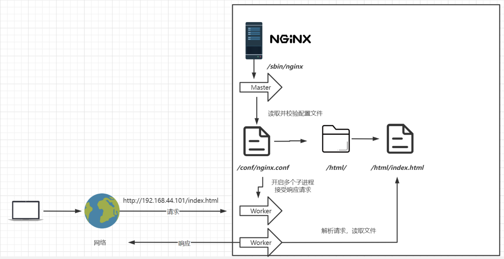

# 第01章_Nginx简介

## 1. 简介

Nginx是一个轻量级、高性能的反向代理web服务器，同时也提供了IMAP、POP3、SMTP服务。Nginx占用内存少、并发能力强，以其稳定性、丰富的功能集、简单的配置文件和低系统资源的消耗而闻名。

Nginx常用版本分为四大阵营：

- Nginx开源版：http://nginx.org/
- Nginx plus商业版：https://www.nginx.com
- OpenResty：http://openresty.org/cn/
- Tengine：http://tengine.taobao.org/

> 说明：我们主要使用Nginx开源版

## 2. Nginx的安装和启动

### 2.1 安装Nginx

（1）安装gcc

```shell
yum install -y gcc
```

（2）安装perl库

```shell
yum install -y pcre pcre-devel
```

（3）安装zlib库

```shell
yum install -y zlib zlib-devel
```

（4）去官网下载Nginx开源版，并将nginx-1.24.0.tar.gz上传到linux服务器的`/opt`目录下，然后解压到当前目录

```shell
tar -zxvf /opt/nginx-1.24.0.tar.gz
```

（5）进入到解压目录

```shell
cd /opt/nginx-1.24.0
```

（6）生成Makefile文件

```shell
./configure --prefix=/usr/local/nginx --with-stream
```

（7）编译并安装

```shell
make & make install
```

（8）验证

```shell
/usr/local/nginx/sbin/nginx -v
```

### 2.2 启动和停止Nginx

进入安装好的目录`/usr/local/nginx/sbin`

```shell
./nginx           # 启动
./nginx -s stop   # 快速停止
./nginx -s quit   # 优雅关闭，在退出前完成已经接受的连接请求
./nginx -s reload # 重新加载配置
```

### 2.3 将Nginx配置成系统服务

**（1）配置成系统服务**

创建服务脚本：

```shell
vi /usr/lib/systemd/system/nginx.service
```

服务脚本内容：

```vim
[Unit]
Description=nginx - web server
After=network.target remote-fs.target nss-lookup.target
[Service]
Type=forking
PIDFile=/usr/local/nginx/logs/nginx.pid
ExecStartPre=/usr/local/nginx/sbin/nginx -t -c /usr/local/nginx/conf/nginx.conf
ExecStart=/usr/local/nginx/sbin/nginx -c /usr/local/nginx/conf/nginx.conf
ExecReload=/usr/local/nginx/sbin/nginx -s reload
ExecStop=/usr/local/nginx/sbin/nginx -s stop
ExecQuit=/usr/local/nginx/sbin/nginx -s quit
PrivateTmp=true
[Install]
WantedBy=multi-user.target
```

重新加载系统服务：

```shell
systemctl daemon-reload
```

然后关闭已经启动的nginx：

```shell
cd /usr/local/nginx/sbin
./nginx -s stop
```

**（2）启动nginx服务**

```shell
systemctl start nginx.service
```

也可以设置为开机自启动：

```shell
systemctl enable nginx.service
```


# 第02章_Nginx基础知识

## 1. 目录结构

进入Nginx的主目录我们可以看到有以下目录：

- conf：用来存放配置文件
- html：用来存放静态文件(如html、css等)的默认目录
- logs：用来存放日志
- sbin：用来存放nginx的主程序

> 还有一些以`_temp`结尾的目录，是用来存放运行过程中的临时文件的

## 2. 基本运行原理



## 3. Nginx配置文件

查看conf目录下的nginx.conf，其包含的最小配置如下：

```vim
worker_processes  1;

events {
    worker_connections  1024;
}

http {
    include       mime.types;
    default_type  application/octet-stream;

    sendfile        on;

    keepalive_timeout  65;

    server {
        listen       80;  #监听端口号
        server_name  localhost;  #主机名或域名

        location / {  #匹配路径
            root   html;  #文件根目录
            index  index.html index.htm;  #默认页名称
        }

        error_page   500 502 503 504  /50x.html;  #报错编码对应页面
        location = /50x.html {
            root   html;
        }
    }
}
```

- `worker_processes  1;` 默认为1，表示开启一个业务进程
- `worker_connections  1024;` 单个业务进程可接受的连接数
- `include  mime.types;` 引入mime.types配置文件，其中包含了许多http mime类型
- `default_type  application/octet-stream;` 如果所有mime类型都没匹配上，则默认使用application/octet-stream，即以二进制流的方式传输
- `sendfile  on;` 使用linux的 `sendfile(socket, file, len)` 进行高效网络传输，也就是数据零拷贝，即nginx在内存中并不会读取所请求的文件，而是直接给网络接口缓存发送一个信号，然后网络接口缓存读取所请求的文件
- `keepalive_timeout  65;` 
- `server`用于虚拟主机的配置


## 4. 虚拟主机技术

### 4.1 虚拟主机原理

当多个域名对应到一个IP地址时，由Nginx服务端可以判断是从哪个域名发来的请求，然后指向不同站点的目录。于是，原本一台服务器只能对应一个站点，而通过虚拟主机技术可以虚拟化成多个站点同时对外提供服务。

### 4.2 配置虚拟主机

如果买了域名，可以在阿里云中直接配置域名解析。我们为了方便测试，直接使用以下方式配置域名解析（实际上是假的，仅能本机使用）：

将`C:\Windows\System32\drivers\etc`下的hosts文件复制到桌面，然后配置几个域名解析，例如：

```
192.168.231.101 www.thuwsy.linux.com
192.168.231.101 vod.thuwsy.linux.com
```

然后复制回`C:\Windows\System32\drivers\etc`，替换hosts文件。

#### 1、创建多个站点

我们在`/nginx-test`目录下创建站点：

```shell
mkdir -p /nginx-test/www/thuwsy
mkdir -p /nginx-test/vod/thuwsy
```

然后分别在其中创建首页index.html

#### 2、配置虚拟主机

修改nginx.conf，配置两个server(虚拟主机)对应两个站点：

```vim
    server {
        listen       80;
        server_name  www.thuwsy.linux.com;

        location / {
            root   /nginx-test/www/thuwsy;
            index  index.html index.htm;
        }

        error_page   500 502 503 504  /50x.html;
        location = /50x.html {
            root   html;
        }
    }

    server {
        listen       80;
        server_name  vod.thuwsy.linux.com;

        location / {
            root   /nginx-test/vod/thuwsy;
            index  index.html index.htm;
        }

        error_page   500 502 503 504  /50x.html;
        location = /50x.html {
            root   html;
        }
    }
```

然后重启nginx即可测试：

```shell
systemctl reload nginx.service
```

#### 3、`server_name`详解

（1）**server的匹配有先后顺序**，匹配到了先配置的server，就不会再往后匹配了；如果所有的`server_name`都匹配不上，但又确实是正确的IP，则默认会匹配第一个server

（2）我们可以在同一个`server_name`中匹配多个域名

```vim
server_name  vod.thuwsy.linux.com  vod1.thuwsy.linux.com;
```

（3）我们还可以用正则表达式来匹配域名

```vim
server_name  *.thuwsy.linux.com;
```

```vim
server_name  vod.*;
```

```vim
server_name  ~^[0-9]+\.thuwsy\.com$;
```


# 第03章_Nginx核心功能

## 1. 反向代理

### 1.1 基本概念

**正向代理**：代理内网，来访问外网，称之为正向代理。

例如局域网中只有一台电脑能够上外网，那么就在这台电脑上安装代理服务器端程序，从而让不能上外网的电脑连到这个代理程序，就可以通过代理服务器上外网。这里代理服务器做的是一个请求转发的操作。


**反向代理**：代理外网，来访问内网，称之为反向代理。

对于反向代理，其实客户端对代理是无感知的，因为客户端不需要任何配置就可以访问。请求会被发送到反向代理服务器，由反向代理服务器去选择目标服务器获取数据后，再返回给客户端，此时反向代理服务器和目标服务器对外就像是同一个服务器。因此，反向代理技术暴露的是代理服务器地址，隐藏了真实服务器IP地址。


### 1.2 配置反向代理

在配置文件中通过`proxy_pass`来配置真实服务器的地址，以下用nginx为tomcat作代理：

```vim
    server {
        listen       80;
        server_name  localhost;

        location / {
            proxy_pass http://192.168.231.101:8080;
            #root   html;
            #index  index.html index.htm;
        }

        error_page   500 502 503 504  /50x.html;
        location = /50x.html {
            root   html;
        }
    }
```

### 1.3 配置Tomcat服务器的防火墙

我们希望Tomcat只能被Nginx服务器访问，而不能被外网直接访问，就需要配置Tomcat服务器的防火墙。

（1）开启防火墙

```shell
systemctl start firewalld
```

（2）指定端口和ip访问

```shell
firewall-cmd --permanent --add-rich-rule="rule family="ipv4" source address="192.168.231.101" port protocol="tcp" port="8080" accept"
```

（3）重载规则

```shell
firewall-cmd --reload
```

（4）查看已配置的规则

```shell
firewall-cmd --list-all
```

（5）重启防火墙

```shell
systemctl restart firewalld
```

补充：移除规则

```shell
firewall-cmd --permanent --remove-rich-rule="rule family="ipv4" source address="192.168.231.101" port port="8080" protocol="tcp" accept"
```

## 2. 负载均衡

### 2.1 配置负载均衡

我们首先用docker启动三个微服务(端口号8081、8082、8083)，分别显示不同的页面，用于测试。

在配置文件中配置upstream表示用于负载均衡的服务器集群，然后基于反向代理`proxy_pass`实现负载均衡：

```vim
    upstream httpds {
        server  192.168.231.101:8081;
        server  192.168.231.101:8082;
        server  192.168.231.101:8083;
    }
    
    server {
        listen       80;
        server_name  localhost;

        location / {
            proxy_pass http://httpds;
            #root   html;
            #index  index.html index.htm;
        }

        error_page   500 502 503 504  /50x.html;
        location = /50x.html {
            root   html;
        }
    }
```

### 2.2 常见的负载均衡策略

#### 1、轮询

默认情况下使用轮询方式逐一转发，这种方式适用于无状态请求。

#### 2、weight

指定轮询几率，weight和访问比率成正比，用于后端服务器性能不均的情况。配置方式如下：

```vim
    upstream httpds {
        server  192.168.231.101:8081  weight=10  down;
        server  192.168.231.101:8082  weight=1;
        server  192.168.231.101:8083  weight=1  backup;
    }
```

- down：表示当前的server暂时不参与负载均衡。
- weight：默认为1，weight越大，负载的权重就越大。
- backup：当其它所有的非backup机器down或者忙的时候，会将请求转发给backup机。

#### 3、其他策略(了解)

**ip_hash**：根据客户端的ip地址，进行hash运算后转发，所以相同ip一定会转发到同一台服务器，可以保持session会话。

**least_conn**：将请求转发到连接数最少的服务器

**url_hash**：根据用户访问的url，进行hash运算后转发请求，所以同一url一定会转发到同一台服务器。一般在访问不同的静态资源时，可以考虑使用该策略。

**fair**：根据后端服务器响应时间转发请求。

> 说明：这些负载均衡策略不太常用，轮询策略就已经很好用，如果想要保持会话，使用Token技术即可保持无状态会话。

## 3. 动静分离

当静态资源较少时，可以将静态资源直接放在nginx服务器上提高访问效率，而将动态资源仍部署在tomcat服务器上。例如，可以将css、js文件放在nginx服务器上。

> 说明：对于大型企业而言，还是更建议纯粹把静态文件独立成单独的域名，放在独立的服务器上，来实现动静分离。而不是通过将静态资源放在nginx上来实现动静分离。

配置Nginx实现动静分离的步骤如下：

（1）在/nginx-test/static/目录下可以设置css、js、img目录来分别存放静态资源

（2）在配置文件中添加多个location

```vim
    server {
        listen       80;
        server_name  localhost;

        location / {
            proxy_pass http://httpds;
        }

        # 当用户通过url地址匹配/img/**时，使用这个location配置
        location /img/ {
            # root指定静态资源所在的根目录 
            root /nginx-test/static/;
            index index.html index.htm;
        }

        # 当用户通过url地址匹配/css/**时，使用这个location配置
        location /css/ {
            # root指定静态资源所在的根目录 
            root /nginx-test/static/;
            index index.html index.htm;
        }        

        error_page   500 502 503 504  /50x.html;
        location = /50x.html {
            root   html;
        }
    }
```

## 4. location匹配规则

location可以使用正则匹配路径：

- `/`开头：表示通用匹配，任何请求都会匹配到
- `=`开头：表示精确匹配，不是以指定模式开头
- `~`开头：正则匹配，区分大小写
- `~*`开头：正则匹配，不区分大小写
- `^~`开头：非正则匹配，匹配以指定模式开头的location

**location匹配顺序**：

- 多个正则location直接按书写顺序匹配，成功后就不会继续往后面匹配
- 普通（非正则）location会一直往下，直到找到匹配度最高的（最大前缀匹配）
- 当普通location与正则location同时存在时，如果正则匹配成功，则不会再执行普通匹配
- 所有类型location存在时，`=`匹配 > `^~`匹配 > 正则匹配 > 普通（最大前缀匹配）

举例：上一节的两个location，可以简化为

```vim
    location ~*/(css|img) {
        root /nginx-test/static/;
        index index.html index.htm;
    }
```

**补充：alias与root的区别**

```vim
    location /img/ {
        alias /nginx-test/static/img/;
        index index.html index.htm;
    }
```

root用来设置根目录，而alias在接受请求的时候在路径上不会加上location。

## 5. Nginx其他功能

### 5.1 URL重写

rewrite是实现URL重写的关键指令，根据regex(正则表达式)部分内容，重定向到replacement，结尾是flag标记。格式如下：

```vim
rewrite <regex> <replacement> [flag];
```

flag标记说明：

- last：本条规则匹配完成后，继续向下匹配新的location URI规则
- break：本条规则匹配完成即终止，不再匹配后面的任何规则
- redirect：返回302临时重定向，浏览器地址会显示跳转后的URL地址
- permanent：返回301永久重定向，浏览器地址栏会显示跳转后的URL地址


示例：

```vim
    location / {
        rewrite ^/([0-9]+).html$ /index.jsp?pageNum=$1 break;
        proxy_pass http://httpds;
    }
```

### 5.2 防盗链

有时候我们希望本服务器上的资源，只能是通过从某个地址重定向过来请求的，而其他地址重定向请求资源都无法获取，这就需要配置防盗链。

在需要防盗链的location中配置：

```vim
    location ~*/(img|css) {
        valid_referers 192.168.231.101;
        if ($invalid_referer) {
            return 403;
        }
        root html;
        index index.html index.htm;
    }
```

其中，`valid_referers`用于设置合法的referer请求头，可以设置以下多个值：

- `none`：referer请求头可以不存在。
- `blocked`：（较少使用）检测 Referer 头域的值被防火墙或者代理服务器删除或伪装的情况，这种情况该头域的值不以`http://`或`https://`开头。
- `server_names`：设置一个或多个URL，检测 Referer 头域的值是否是这些 URL 中的某一个。


# 第04章_Nginx高可用配置

## 1. Keepalived技术

为了实现Nginx的高可用，我们需要一台Nginx作为主机，另一台Nginx作为备用机，以防止主Nginx宕机的情况。我们需要用到Keepalived技术，它可以为当前机器虚拟出一个虚拟IP，这样客户端访问的永远是这个虚拟IP，而当主Nginx正常工作时，就将该虚拟IP配置在这台主Nginx上，一旦它宕机，就将该虚拟IP配置在另一台从Nginx上。

## 2. Keepalived安装和配置

安装依赖：

```shell
yum install openssl-devel
```

安装keepalived：

```shell
yum install -y keepalived
```

使用yum安装后配置文件在`/etc/keepalived/keepalived.conf`，修改配置如下：

主机：

```vim
! Configuration File for keepalived

global_defs {
    router_id lb111
}

vrrp_instance atguigu {
    state MASTER
    interface ens33
    virtual_router_id 51
    priority 100
    advert_int 1
    authentication {
        auth_type PASS
        auth_pass 1111
    }
    virtual_ipaddress {
        192.168.231.200
    }
}
```

从机：

```vim
! Configuration File for keepalived

global_defs {
    router_id lb110
}

vrrp_instance atguigu {
    state BACKUP
    interface ens33
    virtual_router_id 51
    priority 50
    advert_int 1
    authentication {
        auth_type PASS
        auth_pass 1111
    }
    virtual_ipaddress {
        192.168.231.200
    }
}
```

