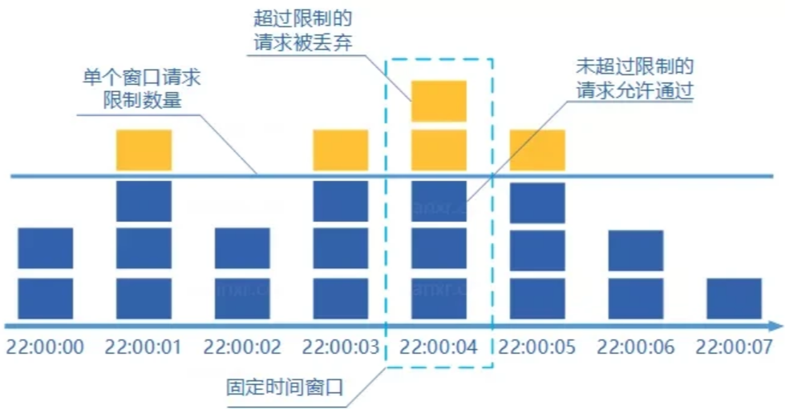
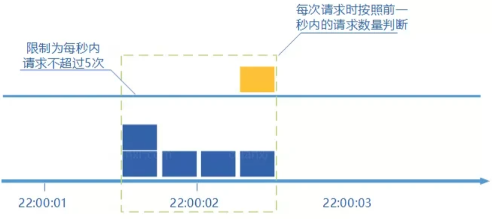
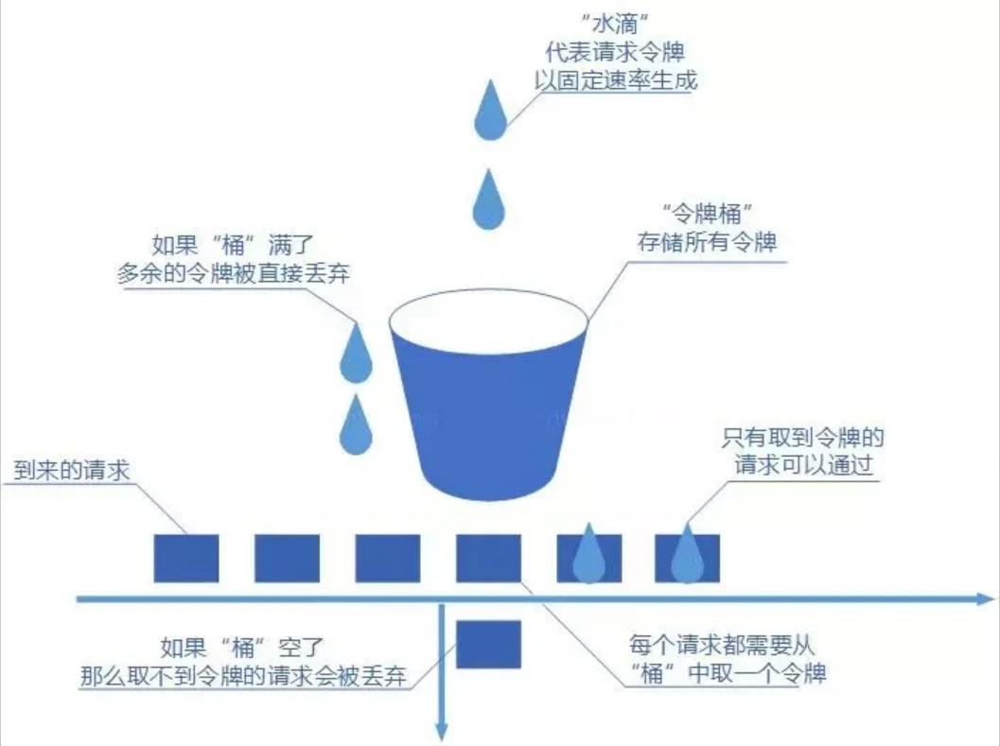
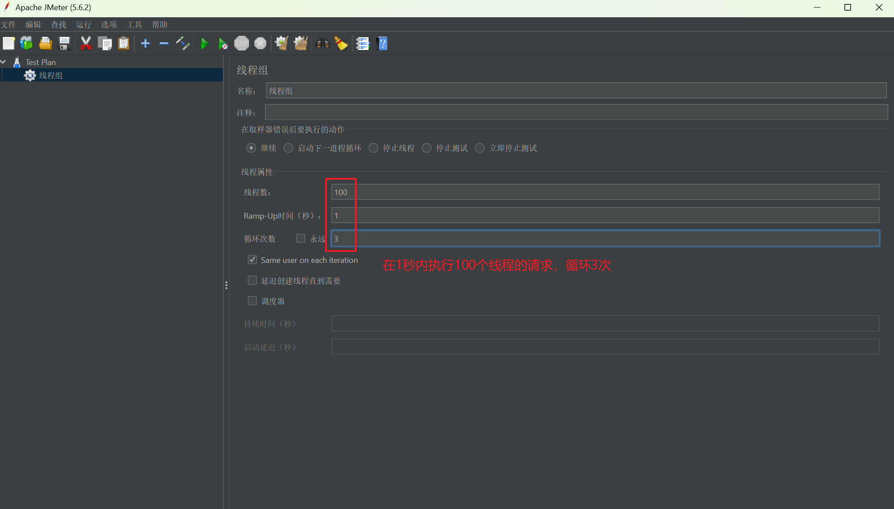
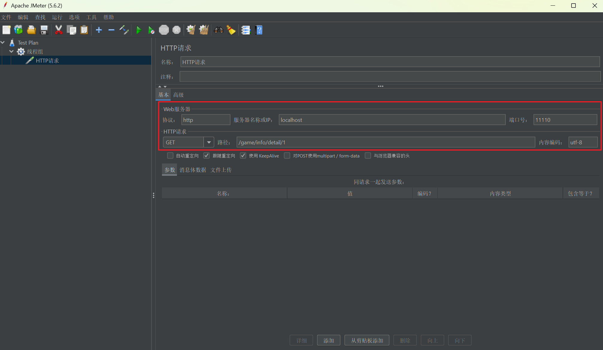
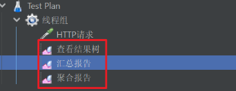
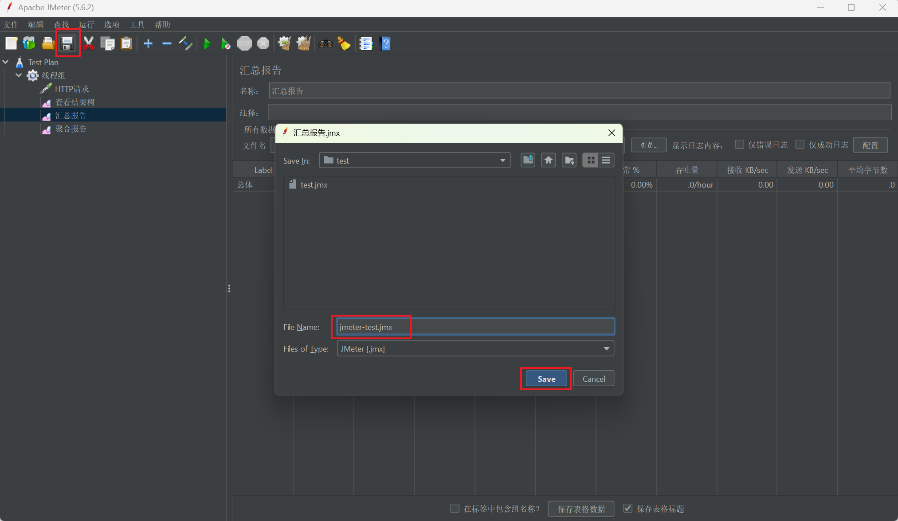
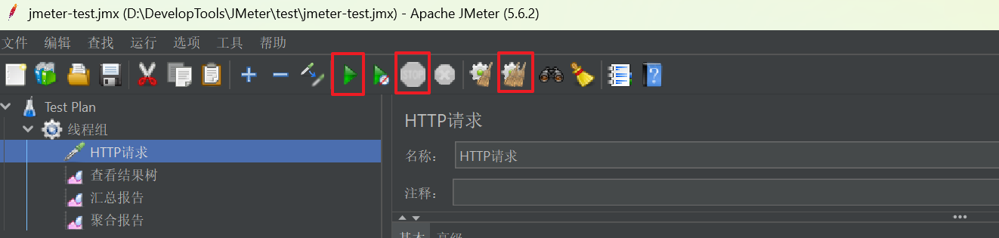

# 第01章_服务限流

## 1. 简介

针对软件系统来说，限流就是对请求的速率进行限制，避免瞬时的大量请求击垮软件系统。限流可能会导致用户的请求无法被正确处理或者无法立即被处理，不过这往往也是权衡了软件系统的稳定性之后得到的最优解。

Google Guava提供了一个限流工具类`RateLimiter`用于单机限流，它基于令牌桶算法。不过，单机限流只适用于单体架构的应用。在分布式项目中，微服务往往以集群方式部署，此时就应该采用**集群限流**。

集群限流的常见方案：

- **借助于中间件进行集群限流**：例如使用阿里的Sentinel、美团的Rhino、Redisson中的RRateLimiter来自己实现对应的限流逻辑
- **网关层限流**：也就是直接在网关层就进行限流

我们以Redisson中的`RRateLimiter`来演示集群限流的基本使用，它底层实现是基于**令牌桶算法**的。

```java
// 封装一个限流工具类
@Component
public class RateLimiterUtil {
    /**
     * 配置一些限流规则，例如B端服务限制500QPS，C端服务限制10000QPS
     * - RateType.OVERALL代表集群限流，RateType.PER_CLIENT代表单机限流
     * - 1L代表时间间隔，即1秒
     * - 500L和10000L代表请求数，也就是B端限制500个请求、C端限制10000个请求
     */
    @Getter
    @AllArgsConstructor
    public enum RateLimiterServiceEnum {
        B_SERVICE("b-service", new RateLimiterConfig(RateType.OVERALL, 1L, 500L)),
        C_SERVICE("c-service", new RateLimiterConfig(RateType.OVERALL, 1L, 10000L));

        private final String key;
        private final RateLimiterConfig config;
    }

    @Autowired
    private RedissonClient redissonClient;

    public boolean tryAcquire(RateLimiterServiceEnum service) {
        // 1. 获取指定名称的限流器对象
        RRateLimiter rateLimiter = redissonClient.getRateLimiter(service.getKey());
        // 2. 配置限流规则
        RateLimiterConfig config = service.getConfig();
        rateLimiter.trySetRate(config.getRateType(), config.getRate(), config.getRateInterval(), RateIntervalUnit.SECONDS);
        // 3. 尝试获取令牌（至多等待5秒，获取失败则返回false）
        return rateLimiter.tryAcquire(5, TimeUnit.SECONDS);
    }
}
```

```java
// 测试使用限流器
@RestController
public class TestController {
    @Autowired
    private RateLimiterUtil rateLimiterUtil;

    @GetMapping("/service/c")
    public String cServiceApi() {
        if (!rateLimiterUtil.tryAcquire(C_SERVICE)) {
            return "系统繁忙，请稍后再试";
        }
        return "请求成功";
    }
}
```

## 2. 限流算法

常见的限流算法有以下几种：

### 2.1 固定窗口计数器法

固定窗口其实就是时间窗口，其原理是将时间划分为固定大小的窗口，在每个窗口内限制请求的数量或速率，即固定窗口计数器算法规定了系统单位时间处理的请求数量。

假如我们规定系统中某个接口1秒只能被访问3次的话，使用固定窗口计数器算法的实现思路如下：

- 将时间划分为固定大小窗口，这里是1秒钟一个窗口
- 给定一个变量`counter`来记录当前接口收到的请求数量，初始值为0（代表接口当前1秒钟内还未收到请求）
- 1秒内每收到一个请求之后就进行`counter++`，当`counter=3`之后（也就是说在这1秒内接口已经被访问3次的话），后续的请求就会被全部拒绝
- 等到1秒钟之后，将`counter`重置0，重新开始计数。



优点：实现简单，易于理解。

缺点：

- 限流不够平滑。例如，我们限制某个接口每秒钟只能访问100次，假设前0.1秒就有100个请求到达的话，那后续0.9秒将无法处理任何请求，这会让用户体验变差。
- **窗口切换时可能会产生两倍于阈值流量的请求**，即瞬时流量的临界问题（突刺现象）。例如，我们限制某个接口每秒钟只能访问100次，假设0~0.9s间没有请求，0.9~1.0秒间来了100个请求，接着窗口进行切换，并在1.0~1.1秒间又来了100个请求，这就导致在0.9~1.1s这0.2秒的时间间隔内通过了200个请求，是我们设定阈值的两倍。

### 2.2 滑动窗口计数器法

滑动窗口计数器法是固定窗口计数器法的升级版，限流的颗粒度更小，**它把一个计时窗口分成了若干个小窗口，并且每个小窗口维护一个独立的计数器**。

例如我们的接口限流每秒处理5个请求，我们可以把1秒钟分为4个小窗口，于是每隔0.25秒将整个计时窗口移动一次，若当前计时窗口内的小窗口计数器总和超过设定的阈值（5个请求），则本窗口内的后续请求都被丢弃。很显然，**当滑动窗口的格子划分的越多，限流的统计就会越精确**。



优点：

- 滑动窗口计数器算法的颗粒度更小，可以提供更精确的限流控制
- 相比于固定窗口计数器法，突刺现象的问题得以改善，只要窗口划分的格子越多，最坏情况下也不会超过过多的阈值流量

缺点：

- 依然存在限流不够平滑的问题

### 2.3 漏桶算法

我们可以把发请求的动作比作成注水到桶中，我们处理请求的过程可以比喻为漏桶漏水。我们往桶中以任意速率流入水，以一定速率流出水。当水超过桶流量则丢弃，因为桶容量是不变的，保证了整体的速率。

如果想要实现这个算法的话也很简单，准备一个队列用来保存请求，然后我们定期从队列中拿请求来执行就好了（和消息队列削峰的思想是一样的）。


优点：

- 实现简单，易于理解
- 可以控制限流速率

缺点：

- 只能以固定的速率处理请求，对系统资源利用不够友好。**在实际业务场景中，基本不会使用漏桶算法**。

### 2.4 令牌桶算法

令牌桶算法中桶里装的是令牌，请求在被处理之前需要拿到一个令牌，请求处理完毕之后将这个令牌丢弃。我们根据限流大小，按照一定的速率往桶里添加令牌。如果桶装满了，就不能继续往里面继续添加令牌了。



优点：

- 可以限制平均速率和应对突然激增的流量
- 可以动态调整生成令牌的速率

缺点：

- 如果令牌产生速率和桶的容量设置不合理，可能会出现问题比如大量的请求被丢弃、系统过载


# 第02章_性能测试

## 1. 简介

压力测试用于考察当前软硬件环境下系统所能承受的最大负荷并帮助找出系统瓶颈所在。压测是为了系统在线上的处理能力和稳定性维持在一个标准范围内。

使用压力测试，我们有希望找到一些很难发现的错误，典型的错误就是：**内存泄漏**、**并发与同步**。

## 2. 性能指标

- 响应时间RT（Response Time）：用户发出请求到用户收到系统处理结果所需要的时间。
- 并发数：系统同时能处理的请求数量。
- QPS（Query Per Second）：服务器每秒可以执行的查询次数。
- TPS（Transaction Per Second）：服务器每秒可以处理的事务数。
- 吞吐量：系统单位时间内处理的请求数量。

性能测试主要关注以下指标：

1. **吞吐量**
2. **响应时间**
3. **错误率**：一批请求中结果出错的请求所占比例

## 3. JMeter的使用

下载`apache-jmeter-5.6.2.zip`后解压，运行bin目录下的jmeter.bat就启动了JMeter。

首先在测试计划中创建线程组：



在线程组下创建HTTP请求：



在线程组下添加监听器，便于查看测试报告：



保存测试计划：



启动测试/停止测试/清除以前的测试报告：



