# 第01章_Git简介

## 1. 简介

### 1.1 版本控制系统

版本控制系统（VCS）是一种记录一个或若干文件内容变化，以便将来查阅特定版本修订情况的系统。

- **集中式版本控制系统**：有一个单一的集中管理的服务器，保存所有文件的修订版本，协同工作的人们都通过客户端连到这台服务器，取出最新的文件或者提交更新。缺点是中央服务器的单点故障。SVN是最常见的集中式版本控制系统。
- **分布式版本控制系统**：客户端并不只提取最新版本的文件快照， 而是把代码仓库完整地镜像下来，包括完整的历史记录。 这么一来，任何一处协同工作用的服务器发生故障，事后都可以用任何一个镜像出来的本地仓库恢复。Git是最常见的分布式版本控制系统。

### 1.2 Git的特点

#### 直接记录快照，而非差异比较

Git和其它版本控制系统的主要差别在于Git对待数据的方式。从概念上来说，其它大部分系统以文件变更列表的方式存储信息，这类系统将它们存储的信息看作是一组基本文件和每个文件随时间逐步累积的差异 （它们通常称作**基于差异**的版本控制）。

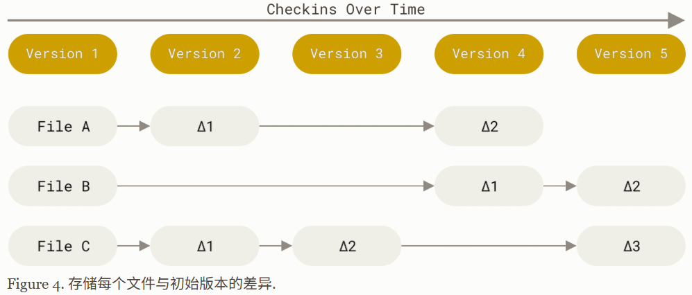

而Git不按照以上方式对待或保存数据。反之，Git更像是把数据看作是对小型文件系统的一系列快照。在Git中，每当你提交更新或保存项目状态时，它基本上就会对当时的全部文件创建一个快照并保存这个快照的索引。为了效率，如果文件没有修改，Git不再重新存储该文件，而是只保留一个链接指向之前存储的文件。Git对待数据更像是一个**快照流**。

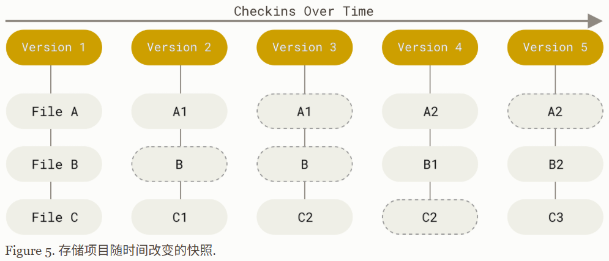

#### 近乎所有操作都是本地执行

在Git中的绝大多数操作都只需要访问本地文件和资源，一般不需要来自网络上其它计算机的信息。由于在本地磁盘上就有项目的完整历史，所以大部分操作看起来都是瞬间完成。

#### Git保证完整性

Git中所有的数据在存储前都计算校验和，然后以校验和来引用，从而保证数据完整性。Git用以计算校验和的机制叫做SHA-1散列（hash，哈希）。实际上，Git数据库中保存的信息都是以文件内容的哈希值（commit-id）来索引，而不是文件名。

### 1.3 Git的基本概念

Git有三种状态，你的文件可能处于其中之一：

- **已修改（modified）**：表示修改了文件，但还没保存到数据库中。
- **已暂存（staged）**：表示对一个已修改文件的当前版本做了标记，使之包含在下次提交的快照中。
- **已提交（committed）**：表示数据已经安全地保存在本地数据库中。

这会让我们的Git项目拥有三个阶段：

- **工作区**：是对项目的某个版本独立提取出来的内容，也就是存放我们正在写的代码。
- **暂存区**：暂存区是一个文件，保存了下次将要提交的文件列表信息，一般在Git仓库目录中。
- **Git仓库目录**：也称为本地仓库，是一个名为`.git`的隐藏目录，它是Git用来保存项目的元数据和对象数据库的地方。这是Git中最重要的部分，从其它计算机克隆仓库时，复制的就是这里的数据。

基本的Git工作流程如下：

1. 在工作区中修改文件；
2. 将你想要下次提交的更改选择性地暂存，即添加到暂存区；
3. 提交更新，也就是找到暂存区的文件，将快照永久性存储到Git仓库目录。

文件的跟踪：工作目录下的每一个文件都不外乎**已跟踪**或**未跟踪**这两种状态。已跟踪的文件是指那些被纳入了版本控制的文件，在上一次快照中有它们的记录，在工作一段时间后，它们的状态可能是未修改、已修改或已暂存。简而言之，已跟踪的文件就是Git已经知道的文件。工作目录中除已跟踪文件外的其它所有文件都属于未跟踪文件，它们既不存在于上次快照的记录中，也没有被放入暂存区。

## 2. Git的安装

以Windows操作系统为例：

（1）前往Git官网下载最新的安装包：https://git-scm.com/download/win，安装过程一路点击Next即可

（2）鼠标右击打开Git Bash，配置用户名和邮箱（用以区分不同用户）：

```shell
git config --global user.name "THU-wsy"
git config --global user.email "425121632@qq.com"
```

（3）我们可以通过以下命令来查看已配置的全局信息：

```shell
git config --global -l
```

## 3. 远程仓库账户认证

当我们向远程仓库进行拉取或推送时需要进行账户认证，我们推荐配置SSH公钥进行认证。以Gitee为例，详细配置方式请参考文档`https://help.gitee.com/base/account/SSH公钥设置`


# 第02章_命令行操作Git

## 1. 本地仓库

**创建本地仓库**：执行该命令后可以将任意一个目录作为本地仓库，会在其中自动生成一个隐藏目录`.git`（这个隐藏目录包含了版本控制系统的所有必要信息，包括配置文件、分支信息、标签等）

```shell
git init
```

**查看仓库状态**：执行该命令后可以查看当前仓库的状态，包括

1. 当前分支的名称
2. 当前分支与远程分支的关系（例如，是否是最新的）
3. 未暂存的修改：显示已修改但尚未使用`git add`添加到暂存区的文件列表
4. 未跟踪的文件：显示尚未纳入版本控制的新文件列表

```shell
git status
```

**添加到暂存区**：执行该命令后可以将文件添加到暂存区。该命令蕴含了多种功能：跟踪新文件、暂存已修改的文件、合并时把有冲突的文件标记为冲突已解决状态。

```shell
git add aaa.txt  # 添加单个文件
git add .        # 添加该目录下所有文件
```

**提交至本地仓库**：执行该命令后可以将暂存区的内容提交到本地仓库中。注意

1. 必须使用`-m`参数来编写相关的提交信息
2. `--amend`选项：**修补提交**。会将暂存区中的文件提交，但如果自上次提交以来没有做任何修改，那么快照会保持不变，而仅仅是修改提交信息。因此，如果我们提交完了才发现漏掉了几个文件没有添加、或者提交信息写错了，那么就可以执行`git commit --amend -m "新的提交信息"`。注意，使用该选项会**用新的提交替换上一次旧的提交**，而并不会额外创建一个提交记录。

```shell
git commit -m "添加两个txt文件"
```

> 补充：Git还提供了一个跳过使用暂存区而直接提交的方式，只需给`git commit`加上`-a`选项即可，此时Git就会自动把所有已跟踪的文件暂存起来一并提交，从而跳过`git add`的步骤。

**查看提交历史**：执行该命令后可以查看提交的历史记录，常用的参数有：

1. `--oneline`：每条提交记录只用一行显示
2. `--graph`：以图形方式显示提交历史和分支结构
3. `--all`：显示所有分支的提交历史，包括远程分支和分离头指针

```shell
git log --all --graph --oneline
```

**版本回退**：执行该命令后可以回退到指定版本，有以下几个可选的参数：

1. `--soft`：仅回退提交记录，保留暂存区和工作区的更改
2. `--mixed`：（默认）回退提交记录并清空暂存区，但保留工作区的更改
3. `--hard`：彻底回退提交记录、暂存区和工作区，所有更改将被丢弃

```shell
git reset --hard 2f9ca19  # 2f9ca19是我们想回退到的commit-id
```

**查看引用日志**：执行该命令后可以查看本地仓库中的引用日志，它记录了HEAD指针的移动历史，这个命令对于恢复错误的操作至关重要。例如，在进行版本回退后，通过`git log`已经无法查到原有的提交记录，这时候我们就可以通过该命令找到之前的commit-id，然后再使用`git reset`进行重置即可。注意，引用日志只存在于本地仓库，它只是一个记录你在自己的仓库里做过什么的日志；当你克隆一个新的远程仓库时，所得到的引用日志是空的。

```shell
git reflog
```

**差异比对**：

1. `git diff`：查看尚未暂存的文件修改了哪些内容（此命令比较的是工作目录中当前文件和暂存区域快照之间的差异）
2. `git diff --staged`：查看已暂存的文件将要添加到下次提交里的内容（此命令比较的是已暂存文件与最后一次提交的文件差异）
3. `git diff 另一分支名...当前分支名`：假设当前分支为`feature-app`，那么命令`git diff master...feature-app`就会对当前分支的最新提交与两个分支的共同祖先进行比较。

## 2. gitignore文件

一般我们总会有些文件无需纳入Git的管理，例如日志文件、编译产生的临时文件等。在这种情况下，我们可以创建一个名为`.gitignore`的文件，列出要忽略的文件列表，如果忽略列表中的文件存在且不是已跟踪状态，那么Git不会对其进行任何检查：

```yaml
# 忽略所有以txt结尾的文件
*.txt
# 虽然上面忽略了所有以txt结尾的文件，但是666.txt这个文件不忽略
!666.txt
# 只忽略当前目录下的TODO文件，而不忽略subdir/TODO
/TODO
# 忽略任何目录下名为test的目录，这个目录下的所有文件将全部忽略
test/
# 忽略目录中所有以txt结尾的文件，但不包括子目录，也就是说不会忽略doc/server/abc.txt
doc/*.txt
# 忽略目录中所有以txt结尾的文件，包括子目录
doc/**/*.txt
```

在最常见的情形下，一个仓库只有根目录下有一个`.gitignore`文件，它递归地应用到整个仓库中。然而，子目录下也可以有额外的`.gitignore`文件，但其中的规则只作用于它所在的目录中。

## 3. 分支

### 3.1 简介

使用分支意味着可以把你的工作从开发主线上分离开来，以免影响开发主线。Git的分支模型被称为"必杀技特性"，它处理分支的方式可谓是难以置信的轻量，创建新分支这一操作几乎能在瞬间完成，并且在不同分支之间的切换操作也是一样便捷。

每当我们进行一次提交，Git都会保存一个提交对象（commit object），这个提交对象中会保存其父提交对象的指针。Git的分支，其实**本质上仅仅是指向提交对象的可变指针**。Git创建新分支，实际上只是为你创建了一个可以移动的新的指针：

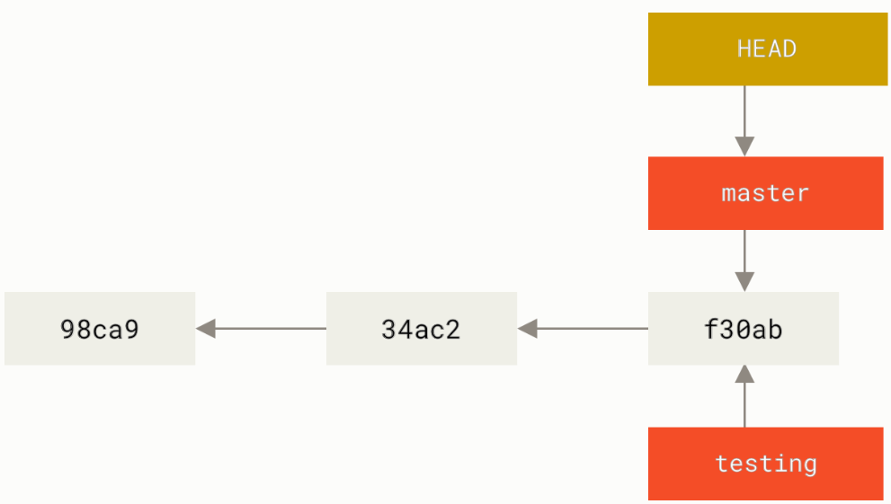

> 说明：HEAD是一个特殊指针，指向当前所在的本地分支。因此，切换分支本质上仅仅是改变HEAD指针的指向。

当我们切换到testing分支并进行一次提交后，就会变成如下情形：

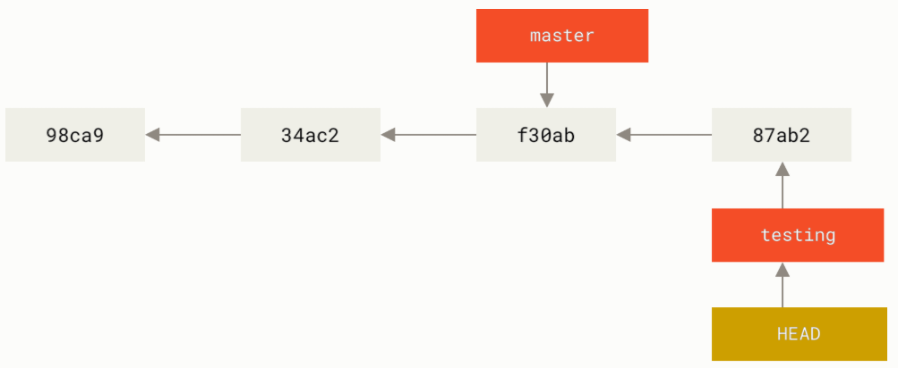

接下来我们再切换回master分支并进行一次提交后，这个项目的提交历史就会产生分叉：

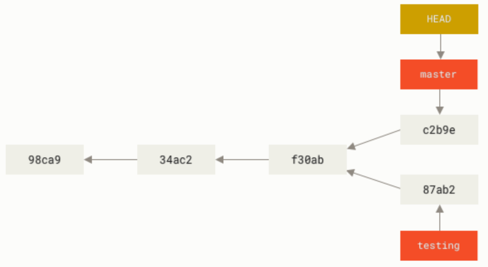

### 3.2 分支的基本操作

**创建分支**：执行该命令后可以基于当前分支创建出一个新分支

```shell
git branch feature-app        # 创建一个名为feature-app的分支
git checkout -b feature-app   # 创建并切换到一个名为feature-app的分支
```

**切换分支**：

```shell
git checkout feature-app
```

**查看分支**：

```shell
git branch              # 显示所有本地分支
git branch -a           # 显示所有本地分支和远程分支
git branch --merged     # 显示所有已合并到当前分支的分支
git branch --no-merged  # 显示所有尚未合并到当前分支的分支
```

**删除分支**：

```shell
git branch -d feature-app  # 删除已完成合并的分支
git branch -D feature-app  # 强制删除尚未进行合并工作的分支
```

### 3.3 合并分支

将指定分支feature-app合并到当前分支：

```shell
git merge feature-app
```

如果合并过程中产生了冲突（两个不同的分支对同一个文件的同一个部分进行了不同的修改），则需要打开发生冲突的文件并进行处理，处理完成后再通过`git add`和`git commit`提交，才算合并成功。

`git merge`有两种主要的合并策略：

- **快进合并**（fast-forward）：如果当前分支的提交历史是目标分支的子集，那么Git会简单地将当前分支指向目标分支的最新提交，这样就完成了合并操作。
- **递归合并**（recursive）：如果两个分支在公共祖先之后有不同的提交历史，那么Git会创建一个新的提交来表示合并结果，这个提交会包含两个分支的所有变更内容。

快进合并示意图：

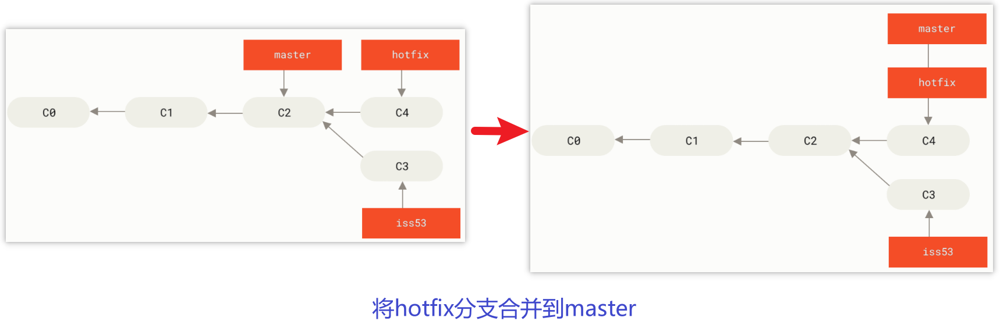

递归合并示意图：

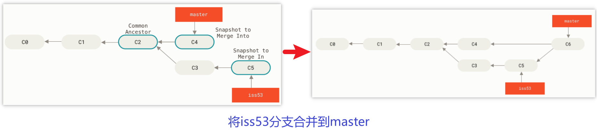

### 3.4 变基分支

将当前分支变基到feature-app上，于是当前分支会将分支起点移动到feature-app的最后一次提交位置：

```shell
git rebase feature-app
```

**原理**：当执行rebase操作时，Git会从两个分支的共同祖先开始**提取**待变基分支（当前分支）上的修改，然后将待变基分支**指向**基分支（feature-app）的最新提交，最后将刚才提取的修改**应用**到基分支的最新提交的后面。因此，在变基过程中，原有的提交会被丢弃，并创建新的提交来替代。

**示意图**：

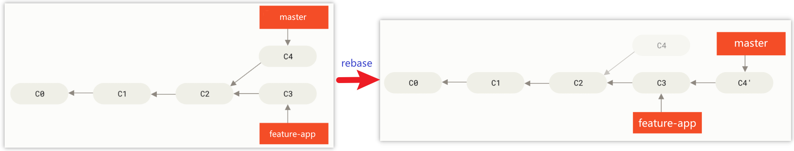

**rebase与merge的区别**：rebase与merge都可以用来整合不同分支的修改，但它们的方式有所不同。merge会创建一个新的合并提交（递归合并策略）来整合两个分支的修改；而rebase会重新创建提交，不会有额外的合并提交，从而保证了提交历史的线性。

**总结**：在团队协作中，使用merge来合并代码到公共分支，**不要使用rebase**，因为rebase可能会改变公共分支的历史、在解决冲突时还容易导致提交丢失或历史混乱。当你使用rebase整理提交历史并推送后，你的协作者们将不得不再次将他们手头的工作与你的提交进行整合，相当麻烦。

### 3.5 优选

优选就是将其他分支的某个提交复制到当前分支，而无需合并整个分支：

```shell
git cherry-pick <commit-id>
```

## 4. 远程仓库

### 4.1 远程仓库简介

远程仓库就是位于服务器上的仓库，它能在远端保存我们的版本历史，并且可以实现多人同时合作编写项目。公有的远程仓库有GitHub、码云、Coding等；私有的远程仓库一般是GitLab这种自主搭建的远程仓库私服，在公司中比较常用，它只对公司内部开放，不对外开放。

这里我们以码云做讲解，官网：https://gitee.com，首先完成用户注册。

### 4.2 自定义远程仓库

（1）我们首先在Gitee新建一个空仓库

（2）然后创建一个本地仓库

（3）将本地仓库与远程仓库进行绑定

```shell
# 1. 添加远程仓库（远程仓库名称通常命名为origin）
# git remote add 远程仓库名称 远程仓库地址
git remote add origin git@gitee.com:thu-wsy/test-demo.git

# 2. 推送到远程仓库，并设置该本地分支跟踪该远程分支
# git push -u 远程仓库名称 本地分支名称[:远程分支名称]
git push -u origin master
```

> 说明：`git push`中`-u`（与`--set-upstream`相同）选项用于在推送时**设置该本地分支跟踪远程分支**，使得后续的推送和拉取操作更加简便。设置跟踪后，我们在该本地分支上只需执行`git push`或`git pull`（不加参数），Git就会自动推送或拉取关联的远程分支，无需再手动指定远程仓库和分支名称。**总而言之，在首次推送一个分支时推荐使用`-u`选项**。

### 4.3 克隆远程仓库

克隆远程仓库时，会将远程仓库中的每一个文件的每一个版本都将被拉取下来，还会下载远程仓库中所有分支的引用（远程分支）：

```shell
# git clone <远程仓库地址>
git clone git@gitee.com:thu-wsy/test-demo.git
```

注意：

1. 使用`clone`命令克隆远程仓库后，会自动将其添加为远程仓库并默认以`origin`为名称；
2. 假设默认分支的名称为`master`，使用`clone`命令克隆远程仓库后，会创建本地`master`分支，并设置跟踪远程分支`origin/master`

### 4.4 远程分支

远程分支是指向远程仓库分支的引用，它是无法编辑的**本地引用**，以`<远程仓库名称>/<分支名称>`的形式命名，例如`origin/master`。

#### 1、远程分支示意图

当你首次克隆一个远程仓库后：

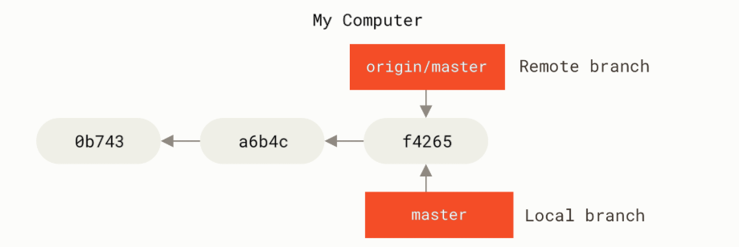

如果你在本地`master`分支做了一些工作，在同一段时间内有其他人推送新的提交到远程仓库，只要你没有主动抓取数据，那么你的`origin/master`指针就不会移动：

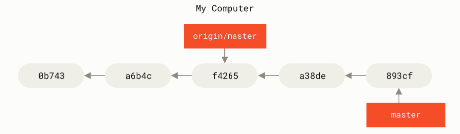

而当你通过`git fetch origin`抓取数据后，你的`origin/master`指针就会移动到更新之后的位置：

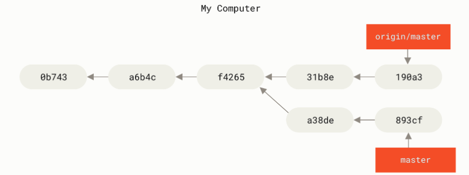

#### 2、根据远程分支创建本地分支

注意，当我们使用`git fetch origin`进行抓取后，**会拥有所有远程分支，但并不会自动创建对应的本地分支副本**。也就是说，我们本地会有一个无法编辑的`origin/feature-test`指针，但并不会有一个新的`feature-test`分支。

> 说明：使用`git clone`克隆远程仓库后，会自动给我们创建一个master分支副本，但并不会创建其他分支副本。

如果你想根据远程分支创建本地分支，可以使用如下命令：

```shell
# 根据远程分支创建本地分支，并设置自动跟踪
git checkout -b feature-test origin/feature-test
# 简化形式，与上面的命令等价
git checkout --track origin/feature-test
# 最简形式，也是最常用的形式（如果尝试切换的分支不存在、且刚好只有一个名字匹配的远程分支，那么就与上面的命令等价）
git checkout feature-test
```

这会给你创建一个本地分支`feature-test`，并且起点位于`origin/feature-test`，除此之外，还会**自动设置该本地分支跟踪该远程分支**。

#### 3、删除远程分支

```shell
git push origin --delete feature-test
```

执行上述命令可以删除远程服务器上的`feature-test`分支，同时本地的远程分支`origin/feature-test`也会被删除。但是本地分支`feature-test`并不会被删除。

### 4.5 抓取与拉取

**抓取**：该命令会访问远程仓库，从中抓取所有你还没有的数据。执行完成后，你将会**拥有远程仓库中所有分支的引用（远程分支）**，可以随时合并或查看。注意，该命令只会将数据下载到你的本地仓库，并不会自动将远程分支合并到你当前的工作，所以我们还需要手动将其合并入自己的工作。

```shell
# git fetch <远程仓库名称>
git fetch origin
```

**拉取**：该命令会从远程仓库抓取数据并自动尝试合并到当前所在的分支，相当于先`fetch`再`merge`。如果合并过程中产生了冲突，则需要打开发生冲突的文件并进行处理，处理完成后再通过`git add`和`git commit`提交，才算合并成功。

```shell
# git pull <远程仓库名称>
git pull origin
```

> 注意：如果当前分支已经设置了跟踪远程分支，那么就可以省略远程仓库名称，直接使用`git pull`命令即可。

### 4.6 推送

**推送**：只有当你有远程仓库的写入权限，并且之前没有人推送过时，这条命令才能生效。如果你与其他人在同一时间克隆，他们先进行了推送，那么你的推送就会被拒绝，所以你必须先拉取后才能推送。

```shell
# git push 远程仓库名称 本地分支名称[:远程分支名称]
git push origin master
```

> 注1：如果远程分支名称与本地分支名称相同，那么就无需指定远程分支名称。
>
> 注2：如果当前分支已经设置了跟踪远程分支，那么就可以省略远程仓库名称和分支名称，直接使用`git push`命令即可。


# 第03章_IDEA操作Git

详细操作文档可以参考 https://www.jetbrains.com/zh-cn/help/idea/2025.1/version-control-integration.html

## 1. 自定义远程仓库

（1）我们首先在Gitee新建一个空仓库

（2）然后使用IDEA创建一个Java项目，并勾选`Create Git repository`

（3）添加远程仓库并推送（IDEA会自动设置该本地分支跟踪远程分支）

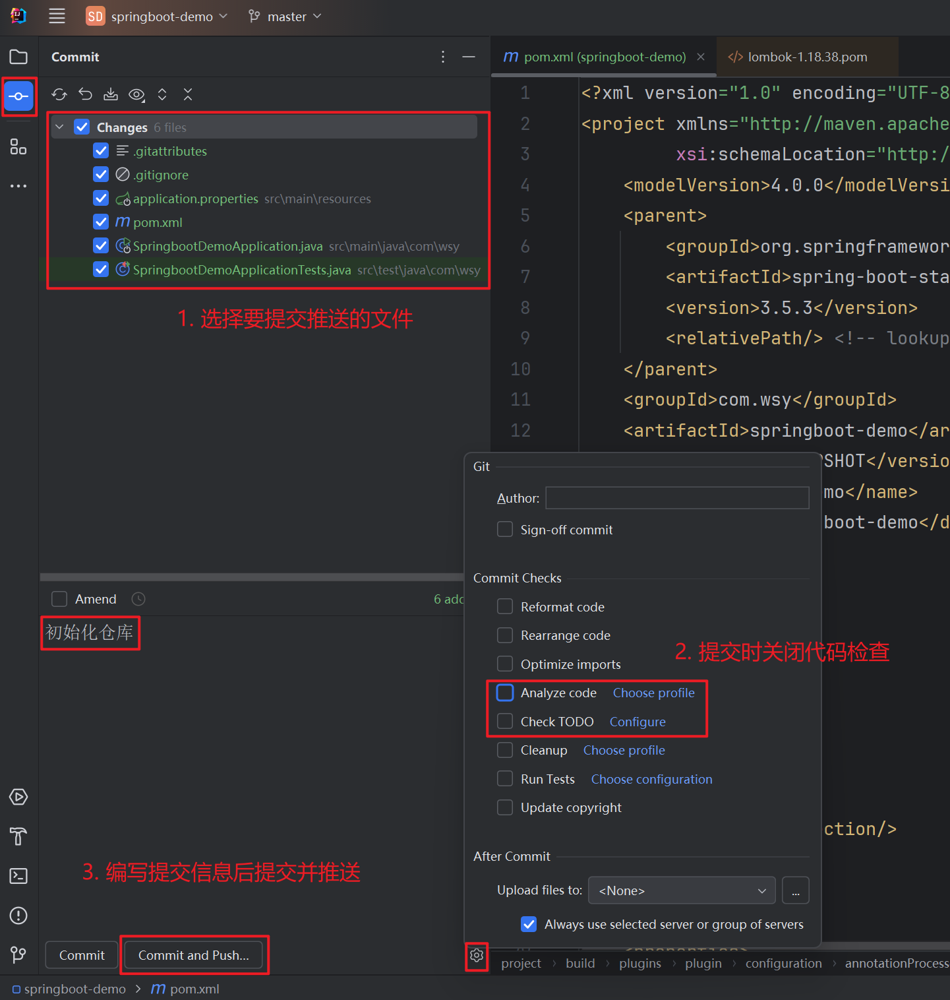

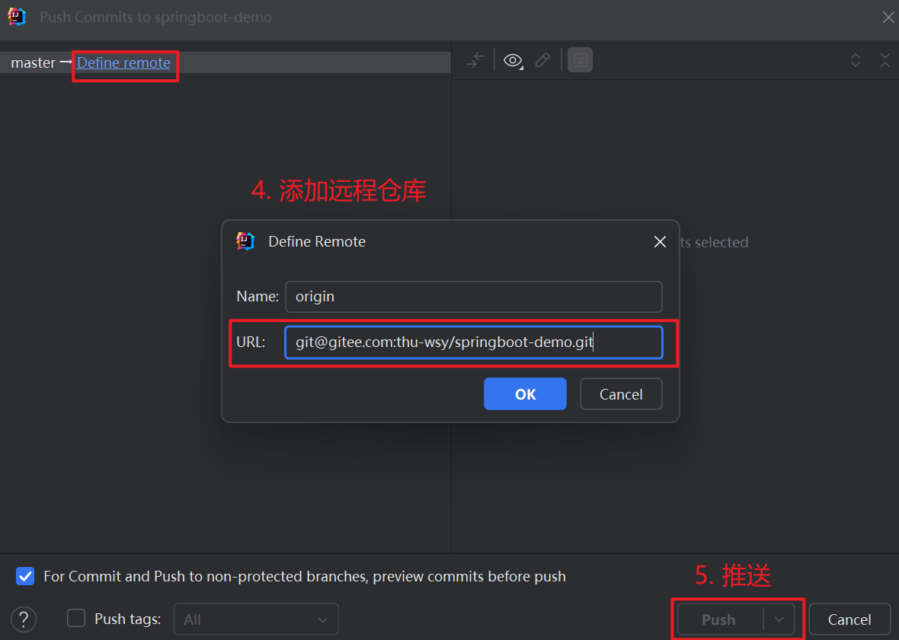

## 2. 克隆远程仓库

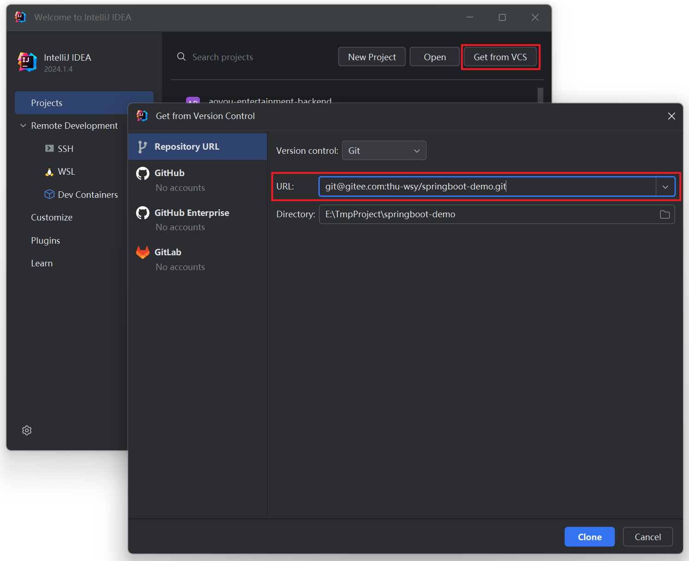

## 3. 合并分支与冲突解决

**合并分支**：例如将feature-app分支合并到master分支

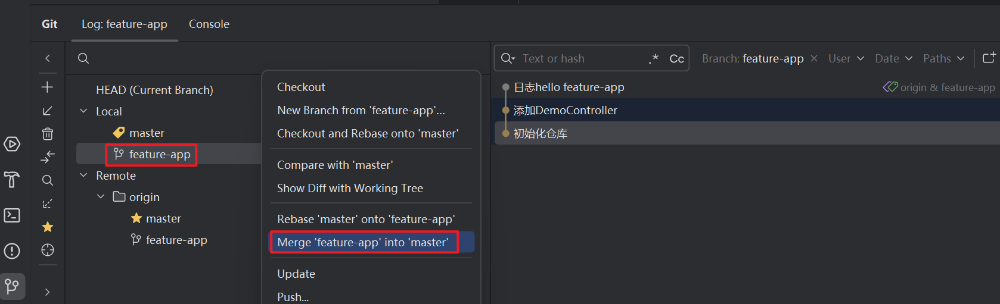

**冲突解决**：

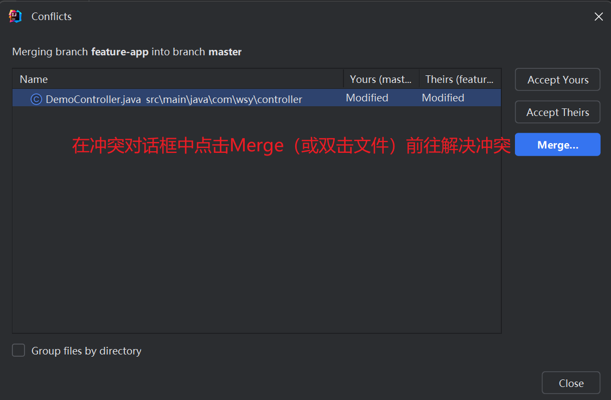

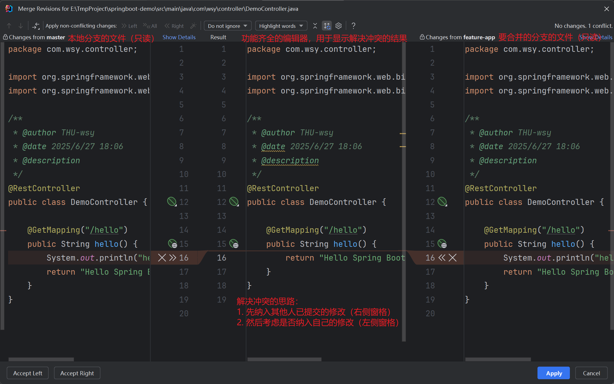

## 4. 其他常用操作

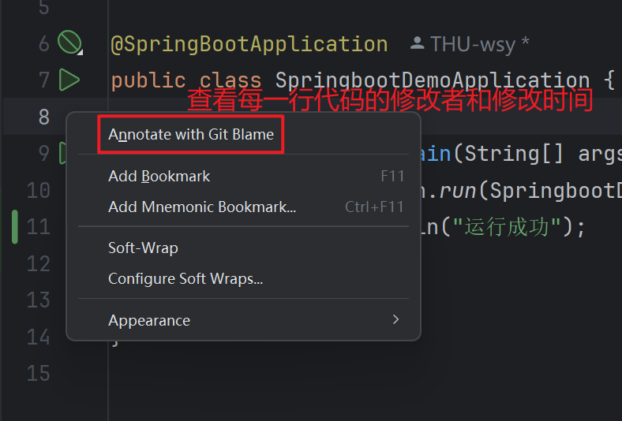

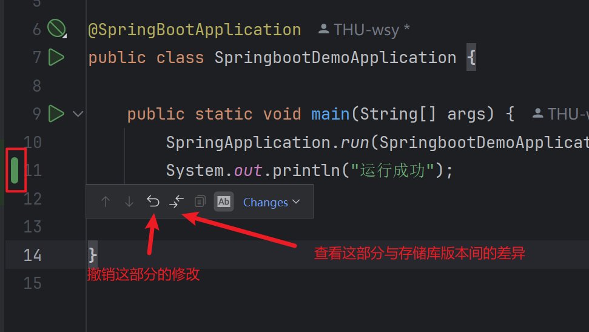

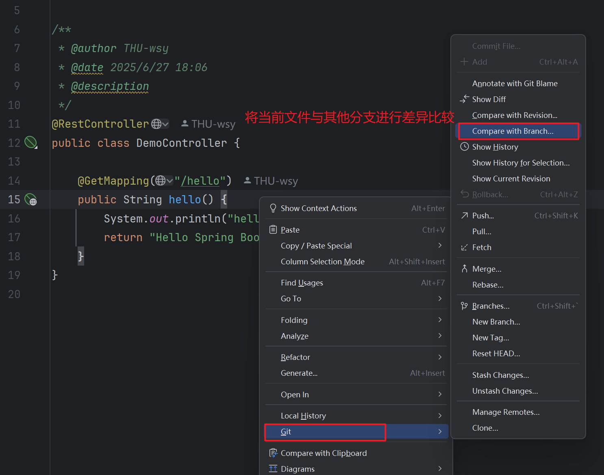

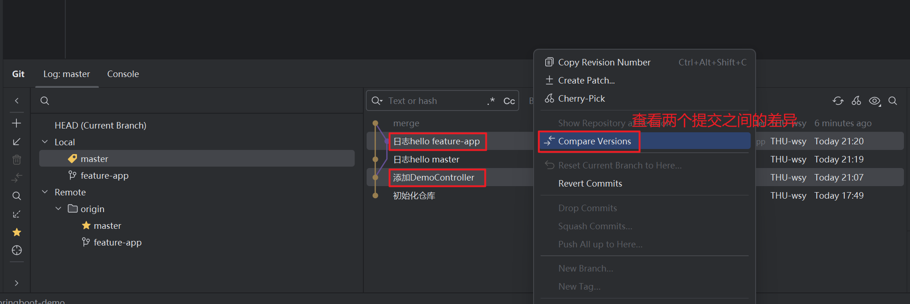


