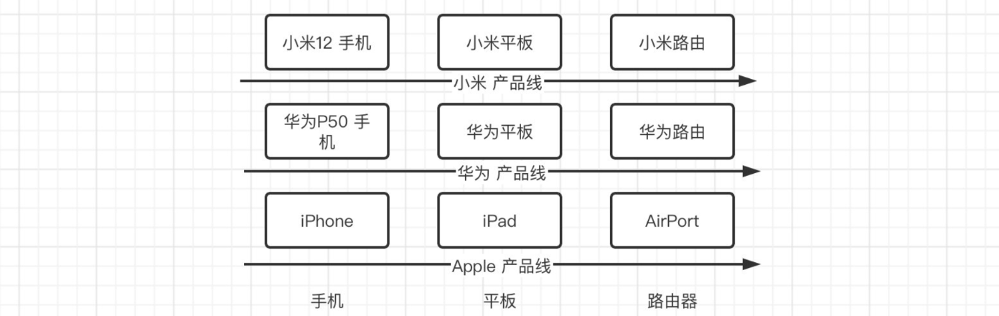
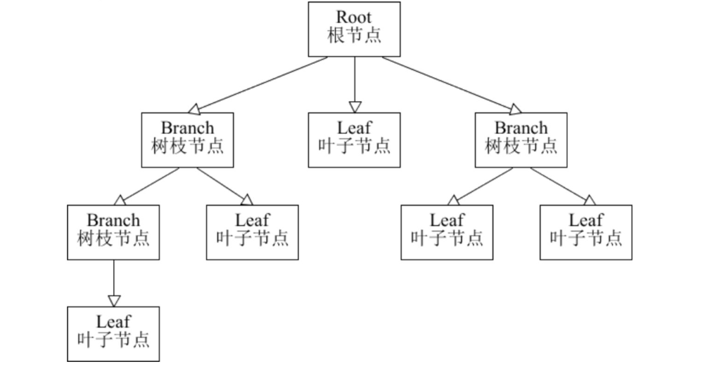
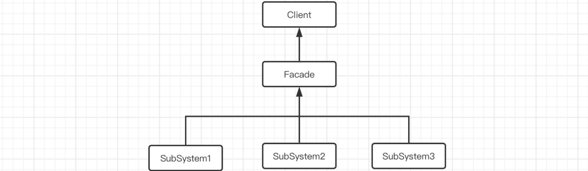

# 第01章_面向对象设计原则

## 1. 单一职责原则

单一职责原则（Simple Responsibility Pinciple，SRP）：**一个类应该只包含单一的职责，并且该职责被完整地封装在这个类中**。这是最简单的面向对象设计原则，它用于控制类的粒度大小，是实现高内聚低耦合的指导方针。

单一职责原则的目的在于增强复用性，一旦类的功能太多，复用性就越低，因为功能太多往往处理的事情就越具体，与其他模块的耦合就越多，当它的职责发生变化时，依赖它的模块可能就会出问题。所以单一职责原则可以很好地增加内聚性，降低耦合性。

> 事实上，微服务架构也参考了单一职责原则，因为每个微服务担负一个职责。

## 2. 开闭原则

开闭原则（Open Close Principle）：**软件实体应当对扩展开放，对修改关闭**。也就是尽量在不修改原代码的前提下扩展功能。

抽象化（抽象类和接口）是实现开闭原则的关键，定义抽象层，通过多态机制传入具体实现进行扩展。如果需要修改系统的行为，无需对抽象层进行任何改动，只需要增加新的具体类来实现新的业务功能即可，实现在不修改已有代码的基础上扩展系统的功能，达到开闭原则的要求。

## 3. 里氏替换原则

里氏替换原则（Liskov Substitution Principle）：**所有引用父类的地方都可以替换成其子类**。里氏替换原则是实现开闭原则的重要方式之一，由于使用父类对象的地方都可以使用子类对象，因此在程序中尽量使用父类类型定义对象，而在运行时再确定其子类类型，用子类对象来替换父类对象（这也正是多态的体现）。

里氏替换原则强调子类应该能够替换父类，而不会影响程序的正确性。子类应当完全实现父类的行为，并且不能改变父类的逻辑或功能。遵循里氏替换原则可以增强代码的可靠性、可维护性和可扩展性，同时也确保了多态设计的有效性。

## 4. 依赖倒置原则

依赖倒置原则（Dependence Inversion Principle）：**高层模块不应依赖于底层模块，它们都应该依赖抽象；抽象不应依赖于细节，细节应该依赖于抽象**。

通过依赖抽象接口而不是具体实现，可以减少模块之间的耦合，增加系统的灵活性和可扩展性。最经典的就是三层架构，以service层和dao层为例，我们通常都会在service中注入dao的接口而非具体实现，从而就能避免具体实现类发生变更所带来的影响。这就是依赖倒置的思想，即由高层声明接口和规范，低层来做具体实现，高层会在需要的时候调用低层。

## 5. 接口隔离原则

接口隔离原则（Interface Segregation Principle, ISP）：**客户端不应依赖那些它不需要的接口**。简单来说，定义接口方法时要尽量最细粒度，不应该定义一些无用的功能方法（否则，实现类本身并不需求这些方法，但还必须强制提供空实现）。

## 6. 合成复用原则

合成复用原则（Composite Reuse Principle）：**优先使用对象组合，而不是通过继承来达到复用的目的**。也就是说，在一个新的对象里面使用一些已有的对象，使之成为新对象的一部分，新的对象通过向这些对象的委派达到复用已有功能的目的。

例如，B对象想要复用A对象中的一个方法，那么不应该让B通过继承A的方式去复用，而是应该将A对象注入到B类中，然后B再通过注入的A对象调用该方法。

## 7. 迪米特法则

迪米特法则（Law of Demeter）又称最少知识原则：**每一个软件单位对其他单位都只有最少的知识，而且局限于那些与本单位密切相关的软件单位**。

简单来说就是，一个类对其他的类有越少的交互越好。当一个类发生改动，那么与其相关的类需要尽可能少的受影响，这样我们在维护项目的时候会更加轻松。

例如：

```java
public class Main {
    public static void main(String[] args) throws IOException {
        Socket socket = new Socket("localhost", 8080); //假设当前程序需要进行网络通信
        Test test = new Test();
        test.test(socket);   //现在需要执行test方法来做一些事情
    }

    static class Test {
        /**
         * 比如test方法打印我们当前Socket连接的本地地址
         */
        public void test(Socket socket){
            System.out.println("IP地址："+socket.getLocalAddress().getHostAddress());
        }
    }
}
```

可以看到，虽然上面这种写法没有问题，我们直接提供一个Socket对象，然后再由test方法来取出IP地址，但是这样却违背了迪米特法则。实际上这里的`test`方法只需要一个IP地址即可，我们完全可以直接传入一个字符串，而不是整个Socket对象，因为我们需要保证与其他类的交互尽可能的少。要是某一天，Socket类中的这些方法名发生了修改，那我们就得连带着去修改Test类，很麻烦。所以，我们推荐的改进写法如下：

```java
public class Main {
    public static void main(String[] args) throws IOException {
        Socket socket = new Socket("localhost", 8080);
        Test test = new Test();
        test.test(socket.getLocalAddress().getHostAddress());
    }

    static class Test {
        public void test(String str){   //一个字符串就能搞定，就没必要丢整个对象进来
            System.out.println("IP地址："+str);
        }
    }
}
```


# 第02章_设计模式（创建型）

软件设计模式（Design pattern），又称设计模式，是一套被反复使用、多数人知晓的、经过分类编目的、代码设计经验的总结。使用设计模式是为了可重用代码、让代码更容易被他人理解、保证代码可靠性、程序的重用性。设计模式主要分为以下三类：

1. **创建型模式（Creational）**：关注对象的实例化过程，包括了如何实例化对象、隐藏对象的创建细节等。
2. **结构型模式（Structural）**：关注对象之间的组合方式，以达到构建更大结构的目标。
3. **行为型模式（Behavioral）**：关注对象之间的通信方式，以及如何合作共同完成任务。

## 1. 工厂方法模式

工厂模式（Factory Pattern）是最常用的设计模式之一，它提供了一种创建对象的方式，使得**创建对象的过程与使用对象的过程分离**。通过使用工厂模式，可以**将对象的创建逻辑封装在一个工厂类中**，而不是在客户端代码中直接实例化对象，这样可以提高代码的可维护性和可扩展性。

工厂模式分为以下三类：

1. **简单工厂模式**：简单工厂模式并不是一个正式的设计模式，但它是工厂模式的基础。它使用一个单独的工厂类来创建不同的对象，根据传入的参数决定创建哪种类型的对象。
2. **工厂方法模式**：工厂方法模式定义了一个创建对象的接口，但由子类决定实例化哪个类。工厂方法将对象的创建延迟到子类。
3. **抽象工厂模式**：抽象工厂模式提供一个创建一系列相关产品的接口。

> 案例：我们以一个创建数据库连接的需求为例，系统中可能连接MySQL、Oracle、TiDB等不同类型的数据库，采用工厂模式创建数据库连接。

```java
public interface AbstractConnect {
    void select();
}

public class MySQLConnect implements AbstractConnect {
    @Override
    public void select() {
        System.out.println("执行MySQL查询");
    }
}

public class OracleConnect implements AbstractConnect {
    @Override
    public void select() {
        System.out.println("执行Oracle查询");
    }
}

public class TiDBConnect implements AbstractConnect {
    @Override
    public void select() {
        System.out.println("执行TiDB查询");
    }
}
```

**简单工厂模式**：

```java
public class SimpleConnectFactory {
    public static AbstractConnect createConnect(String type) {
        switch (type) {
            case "MySQL":
                System.out.println("创建MySQL连接");
                return new MySQLConnect();
            case "Oracle":
                System.out.println("创建Oracle连接");
                return new OracleConnect();
            case "TiDB":
                System.out.println("创建TiDB连接");
                return new TiDBConnect();
            default:
                System.out.println("数据库类型错误！");
                return null;
        }
    }
}
```

```java
public class Main {
    public static void main(String[] args) {
        AbstractConnect connect = SimpleConnectFactory.createConnect("MySQL");
        connect.select();
    }
}
```

> 说明：简单工厂模式其实就是在工厂类中定义构建对象的静态方法，根据传入的不同参数，实例化不同的对象返回。然而，由于工厂类集中了所有实例的创建逻辑，所以简单工厂模式违反了高内聚责任分配原则，这种对条件的判断和对具体产品类型的判断交错在一起，很难避免模块功能的蔓延，对系统的维护和扩展非常不利。

**工厂方法模式**：

```java
// 抽象工厂
public interface AbstractConnectFactory {
    AbstractConnect createConnect();
}

// 具体工厂1
public class MySQLConnectFactory implements AbstractConnectFactory {
    @Override
    public AbstractConnect createConnect() {
        System.out.println("创建MySQL连接");
        return new MySQLConnect();
    }
}

// 具体工厂2
public class OracleConnectFactory implements AbstractConnectFactory {
    @Override
    public AbstractConnect createConnect() {
        System.out.println("创建Oracle连接");
        return new OracleConnect();
    }
}

// 具体工厂3
public class TiDBConnectFactory implements AbstractConnectFactory {
    @Override
    public AbstractConnect createConnect() {
        System.out.println("创建TiDB连接");
        return new TiDBConnect();
    }
}
```

```java
public class Main {
    private static final AbstractConnectFactory mySQLConnectFactory = new MySQLConnectFactory();
    private static final AbstractConnectFactory oracleConnectFactory = new OracleConnectFactory();
    private static final AbstractConnectFactory tiDBConnectFactory = new TiDBConnectFactory();

    public static void main(String[] args) {
        AbstractConnect connect1 = mySQLConnectFactory.createConnect();
        connect1.select();
        AbstractConnect connect2 = oracleConnectFactory.createConnect();
        connect2.select();
    }
}
```

> 说明：当未来要扩展更多数据源时，只需定义新的具体工厂来实现抽象工厂即可，所以工厂方法模式提高了系统的**可扩展性**和可维护性。

## 2. 抽象工厂模式

工厂方法模式只适用于简单对象，当我们需要生产许多个产品族的时候，这种模式就有点乏力了，比如：



实际上这些产品都是成族出现的，每类产品都有手机、平板、路由，如果按照我们之前工厂方法模式来进行设计，那就需要单独设计9个工厂来生产上面这些产品，显然这样就比较麻烦。

我们可以使用抽象工厂模式，将多个产品都放在一个工厂中进行生成，按不同的产品族进行划分。比如对于小米产品，就可以安排一个小米工厂，而这个工厂里面就可以生产整条产品线上的内容，包括小米手机、小米平板、小米路由等。

```java
public interface Phone {
}

public interface Table {
}

public interface Router {
}
```

```java
public interface AbstractFactory {
    Phone getPhone();
    Table getTable();
    Router getRouter();
}
```

## 3. 建造者模式

我们经常看到有很多框架都为我们提供了形如`XxxBuilder`的类，然后用该类来创建我们需要的对象。也就是通过建造者来不断配置参数或内容，当我们配置完所有内容后，再进行对象的构建。相比于直接去new一个新的对象，建造者模式的重心是关注如何完成每一步的配置。除此之外，如果一个类的构造器参数过多，那么我们通过建造者模式来创建这个对象会更加优雅。

比如我们现在有一个学生类：

```java
public class Student {
    int id;
    int age;
    int grade;
    String name;
    String college;
    String profession;
    List<String> awards;

    public Student(int id, int age, int grade, String name, String college, String profession, List<String> awards) {
        this.id = id;
        this.age = age;
        this.grade = grade;
        this.name = name;
        this.college = college;
        this.profession = profession;
        this.awards = awards;
    }
}
```

其构造器参数非常多，如果我们直接通过new的方式去创建对象，填参数会相当复杂，而且容易填错位置。所以我们可以使用建造者模式来进行对象的创建：

```java
public class Student {
    int id;
    int age;
    int grade;
    String name;
    String college;
    String profession;
    List<String> awards;

    // 一律使用建造者来创建，构造器不对外开放
    private Student(int id, int age, int grade, String name, String college, String profession, List<String> awards) {
        this.id = id;
        this.age = age;
        this.grade = grade;
        this.name = name;
        this.college = college;
        this.profession = profession;
        this.awards = awards;
    }

    public static StudentBuilder builder() {   // 通过builder方法获取建造者
        return new StudentBuilder();
    }

    public static class StudentBuilder {
        // Builder也需要将所有的参数都进行暂时保存，所以Student怎么定义的这里就怎么定义
        int id;
        int age;
        int grade;
        String name;
        String college;
        String profession;
        List<String> awards;

        public StudentBuilder id(int id) { // 直接调用建造者对应的方法，为对应的属性赋值
            this.id = id;
            return this;   // 为了支持链式调用，这里直接返回建造者本身，下同
        }

        public StudentBuilder age(int age) {
            this.age = age;
            return this;
        }

        public StudentBuilder grade(int grade) {
            this.grade = grade;
            return this;
        }

        public StudentBuilder name(String name) {
            this.name = name;
            return this;
        }

        public StudentBuilder college(String college) {
            this.college = college;
            return this;
        }

        public StudentBuilder profession(String profession) {
            this.profession = profession;
            return this;
        }

        public StudentBuilder awards(String... awards) {
            this.awards = Arrays.asList(awards);
            return this;
        }

        // 最后我们只需要调用建造者提供的build方法即可根据我们的配置返回一个对象
        public Student build() {    
            return new Student(id, age, grade, name, college, profession, awards);
        }
    }
}
```

现在我们就可以使用建造者来为我们生成对象了：

```java
public static void main(String[] args) {
    Student student = Student.builder()   // 获取建造者
            .id(1)    // 逐步配置各个参数
            .age(18)
            .grade(3)
            .name("小明")
            .awards("ICPC-ACM 区域赛 金牌", "LPL 2022春季赛 冠军")
            .build();   // 最后直接建造我们想要的对象
}
```

## 4. 单例模式

单例模式（Singleton Pattern）提供了一种创建对象的最佳方式：确保一个类只有一个实例，并提供一个全局访问点来获取这个实例。这种模式在需要严格控制资源访问、管理全局状态或实现共享资源访问时非常有用。单例模式主要有饿汉式和懒汉式这两种实现方式，注意我们要确保没有线程安全问题，才能保证单例。

### 4.1 饿汉式

普通的**饿汉式单例本身就是线程安全的**，因为饿汉式在类初始化时就直接创建单例对象，而类初始化过程是没有线程安全问题的。如下是两种饿汉式单例模式的实现方式：

**方式一**：

```java
public class Singleton {
    private static Singleton singleton = new Singleton();
    private Singleton() {}
    public static Singleton getInstance() {
        return singleton;
    }
}
```

**方式二**：使用枚举类

```java
public enum Singleton {
    SINGLETON
}
```

### 4.2 懒汉式

我们之前在JavaSE中实现的**普通懒汉式单例会存在线程安全问题**，因为是在第一次调用`getInstance()`方法时才创建对象。我们有以下三种方式来实现线程安全的懒汉式单例：

**方式一**：使用同步锁

```java
public class Singleton {
    private static Singleton singleton;
    private Singleton() {}
    public static synchronized Singleton getInstance() {
        if (singleton == null) {
            singleton = new Singleton();
        }
        return singleton;
    }
}
```

**方式二**：使用双重检查锁

```java
public class Singleton {
    // 通过volatile声明，实现线程安全的懒汉式单例
    private volatile static Singleton singleton;
    private Singleton() {}

    public static Singleton getInstance() {
        if (singleton == null) {
            // 多线程并发创建对象时，通过加锁保证只有一个线程能创建对象
            synchronized (Singleton.class) {
                // 双重检查锁，确保单例
                if (singleton == null) {
                    // 使用volatile声明变量后，就保证了不会发生指令重排
                    singleton = new Singleton();
                }
            }
        }
        return singleton;
    }
}
```

**方式三**：使用静态内部类

```java
public class Singleton {
    private Singleton() {}
    public static Singleton getInstance() {
        return Inner.singleton;
    }
    private static class Inner {
        static final Singleton singleton = new Singleton();
    }
}
```

> 内部类只有在被调用时才加载，且类初始化过程是没有线程安全问题的。这是最好的懒汉式单例模式。当然，此时的内部类也可以用enum定义。

## 5. 原型模式

原型模式（Prototype Pattern）用于创建重复对象，它与对象的拷贝相关，也就是使用原型实例指定待创建对象的类型，并且通过复制这个原型来创建新的对象。通过实现一个原型接口，该接口用于创建当前对象的克隆。注意对象的复制要使用深拷贝。

> 说明：当直接创建对象的代价比较大时，则会考虑采用原型模式。


# 第03章_设计模式（结构型）

## 1. 适配器模式

在生活中，我们用的充电器往往称为电源适配器，因为我国的供电是220V交流电，但手机却只需要5V的直流电，所以就需要电源适配器作为中间者进行转换和适配。在实际开发中也会遇到同样的问题，当系统中现存两个接口需要交互但又无法直接交互的情况下，可以通过适配器模式解决，适配器相当于一个中间人的角色担任转换工作。

例如，HandlerAdapter就用于适配handler方法，通过适配器处理请求参数和处理响应数据，并调用目标handler方法。

```java
public interface MyServlet {
    Object invoke();
}

public class ActivityController {
    public String applyActivity(String name) {
        return "报名【" + name + "】活动成功！";
    }
}
```

```java
public class ActivityHandlerAdapter implements MyServlet {

    private final ActivityController activityController;

    public ActivityHandlerAdapter(ActivityController activityController) {
        this.activityController = activityController;
    }

    @Override
    public Object invoke() {
        String param = "天天特价";
        System.out.println("处理请求参数..." + param);
        String response = activityController.applyActivity(param);
        System.out.println("处理响应数据..." + response);
        return response;
    }
}
```

```java
public class Main {
    private static MyServlet myServlet = new ActivityHandlerAdapter(new ActivityController());

    public static void main(String[] args) {
        myServlet.invoke();
    }
}
```

> 说明：在实际开发中，适配器模式的主要适用场景有：集成老系统、集成第三方组件、实现跨平台兼容等等。

## 2. 桥接模式

桥接模式（Bridge Pattern）指的是将**抽象部分**与它的**实现部分**分离，使它们都可以独立地变化。桥接模式适用于一个类存在两个独立变化的维度、且这两个维度都可能需要进行扩展的情形。

例如，系统内集成了支付功能，目前支付渠道【抽象部分】支持微信、支付宝，这些支付方式【实现部分】包含密码支付、人脸支付等实现具体的支付，将来支付渠道还可能扩展银企直连、云闪付等，支付方式还可能支持指纹支付等。两个维度都可能扩展，也可能单个维度独立扩展，所以可以使用桥接模式将这两个维度分开实现。

```java
// 抽象部分：支付渠道
public interface Pay {
    boolean pay(String context, BigDecimal amount);
}

// 支付渠道1--微信支付
public class WeiXinPay implements Pay {

    private final PayMode payMode;

    public WeiXinPay(PayMode payMode) {
        this.payMode = payMode;
    }

    @Override
    public boolean pay(String context, BigDecimal amount) {
        // 执行微信APP的相关处理逻辑
        System.out.println("获取微信APP授权中...");
        
        if (!payMode.security(context)) {
            System.out.println("验证失败");
            return false;
        }
        return payMode.pay(amount);
    }
}

// 支付渠道2--支付宝支付
public class ZhiFuBaoPay implements Pay {

    private final PayMode payMode;

    public ZhiFuBaoPay(PayMode payMode) {
        this.payMode = payMode;
    }

    @Override
    public boolean pay(String context, BigDecimal amount) {
        // 执行支付宝APP的相关处理逻辑
        System.out.println("获取支付宝APP授权中...");

        if (!payMode.security(context)) {
            System.out.println("验证失败");
            return false;
        }
        return payMode.pay(amount);
    }
}
```

```java
// 实现部分：支付方式
public interface PayMode {
    // 安全校验
    boolean security(String context);
    // 支付金额
    boolean pay(BigDecimal amount);
}

// 支付方式1--密码支付
public class PasswordPayMode implements PayMode {
    @Override
    public boolean security(String context) {
        System.out.println("【密码支付】收到的密码为：" + context);
        return "123456".equals(context);
    }

    @Override
    public boolean pay(BigDecimal amount) {
        System.out.println("【密码支付】支付金额：" + amount);
        return true;
    }
}

// 支付方式2--刷脸支付
public class FacePayMode implements PayMode {
    @Override
    public boolean security(String context) {
        System.out.println("【刷脸支付】获取到面部数据：" + context);
        return "0x053FBA14".equals(context);
    }

    @Override
    public boolean pay(BigDecimal amount) {
        System.out.println("【刷脸支付】支付金额：" + amount);
        return true;
    }
}
```

```java
public class Main {
    public static void main(String[] args) {
        // 1、微信支付
        WeiXinPay pay1 = new WeiXinPay(new PasswordPayMode());
        pay1.pay("123456", new BigDecimal("100.00"));

        WeiXinPay pay2 = new WeiXinPay(new FacePayMode());
        pay2.pay("0x053FBA14", new BigDecimal("200.00"));

        // 2、支付宝支付
        ZhiFuBaoPay pay3 = new ZhiFuBaoPay(new PasswordPayMode());
        pay3.pay("123456", new BigDecimal("300.00"));

        ZhiFuBaoPay pay4 = new ZhiFuBaoPay(new FacePayMode());
        pay4.pay("0x053FBA14", new BigDecimal("400.00"));
    }
}
```

## 3. 组合模式

组合模式又称作整体-部分模式，它将对象组合成树状的层次结构，用来表示整体-部分的关系。通过将单个对象（叶子节点）和组合对象（树枝节点）用相同的接口进行表示，使得客户对单个对象和组合对象的使用具有一致性。



组合模式的示例如下，这里我们就用文件和文件夹的例子来讲解：

```java
// 首先创建一个组件抽象，组件可以包含组件，组件有自己的业务方法
public interface Component {
    void addComponent(Component component); // 添加子组件
    void removeComponent(Component component); // 删除子组件
    Component getChild(int index); // 获取子组件
    void test(); // 执行对应的业务方法
}
```

接着我们编写两种实现类，分别代表目录和文件：

```java
// 目录可以包含多个文件或目录
public class Directory implements Component {
    private List<Component> child = new ArrayList<>();

    @Override
    public void addComponent(Component component) {
        child.add(component);
    }

    @Override
    public void removeComponent(Component component) {
        child.remove(component);
    }

    @Override
    public Component getChild(int index) {
        return child.get(index);
    }

    @Override
    public void test() {
        child.forEach(Component::test);   // 将继续调用所有子组件的test方法执行业务
    }
}
```

```java
// 文件就相当于是叶子节点，无法再继续添加子组件
public class File implements Component {
    @Override
    public void addComponent(Component component) {
        throw new UnsupportedOperationException();
    }

    @Override
    public void removeComponent(Component component) {
        throw new UnsupportedOperationException();
    }

    @Override
    public Component getChild(int index) {
        throw new UnsupportedOperationException();
    }

    @Override
    public void test() {
        // 具体的业务方法，例如修改文件名
        System.out.println("文件名称修改成功！" + this);
    }
}
```

最后，我们来测试一下：

```java
public static void main(String[] args) {
    Directory outer = new Directory();   // 新建一个外层目录
    Directory inner = new Directory();   // 新建一个内层目录
    outer.addComponent(inner);
    outer.addComponent(new File());   // 在内层目录和外层目录都添加点文件
    inner.addComponent(new File());
    inner.addComponent(new File());
    outer.test();    // 开始执行文件名称修改操作
}
```

## 4. 装饰器模式

装饰器模式（Decorator Pattern）可以在不修改现有对象结构的同时添加新的功能，它是作为现有的类的一个包装。装饰器模式通过将原对象包装在装饰器类中，以便动态地修改其行为。装饰器模式的核心就在于不改变一个对象本身功能的基础上，给对象添加额外的行为，并且它是通过组合的形式完成的，而不是传统的继承关系。

例如，春节给家门口贴春联、挂灯笼来对大门进行装饰，就是装饰器模式的思想。

```java
// 抽象组件：大门
public interface Door {
    void show();
}

// 具体组件：木门
public class WoodDoor implements Door {
    @Override
    public void show() {
        System.out.println("木门");
    }
}
```

```java
// 抽象装饰器接口，需要继承抽象组件
public interface Decorator extends Door {
}

// 具体装饰器1：贴春联
public class SpringCoupletsDecorator implements Decorator {
	// 装饰器需要将装饰目标组合到类中
    private final Door door;

    public SpringCoupletsDecorator(Door door) {
        this.door = door;
    }
	
    // 对原本的方法进行装饰
    @Override
    public void show() {
        System.out.println("左边贴一个春联~~~");
        door.show();
        System.out.println("右边贴一个春联~~~");
    }
}

// 具体装饰器2：挂灯笼
public class LanternDecorator implements Decorator {
    // 装饰器需要将装饰目标组合到类中
    private final Door door;
    
    public LanternDecorator(Door door) {
        this.door = door;
    }
    
    // 对原本的方法进行装饰
    @Override
    public void show() {
        System.out.println("左边挂一个灯笼~~~");
        door.show();
        System.out.println("右边挂一个灯笼~~~");
    }
}
```

## 5. 代理模式

当无法直接访问某个对象或访问某个对象存在困难时，我们就可以通过一个代理对象来间接访问，这就是代理模式（Proxy Pattern）。代理模式和装饰器模式很像，它们的不同之处在于思想。装饰器模式强调的是增强自身，在被装饰之后你能够在被增强的类上使用增强后的功能，增强后你还是你，只不过被强化了而已；代理模式强调要让别人帮你去做事情，以及添加一些本身与你业务没有太多关系的事情（记录日志、设置缓存等），重点在于让别人帮你做。

代理模式分为静态代理和动态代理，我们更推荐使用动态代理，Java中常用的动态代理有JDK动态代理和CGLIB动态代理，可以参考Spring框架的笔记中更深入的讲解。

## 6. 外观模式

外观模式（Facade Pattern）又称门面模式，是一种通过隐藏系统的复杂性，并向客户端提供了一个可以访问系统的接口。如果我们的整个项目有很多个子系统，那么我们就可以在这些子系统的上层加一个门面（Facade），当我们外部需要与各个子系统交互时，就可以直接与门面进行交互，再由门面与后面的各个子系统进行操作，这就是外观模式。



比如现在我们设计了三个子系统，分别用于下订单、扣减库存、支付，正常情况下我们是需要分别去找这三个子系统去完成的，但是现在我们可以通过门面来统一完成：

```java
public class SubSystemA {
    public void test1() {
        System.out.println("下订单");
    }
}

public class SubSystemB {
    public void test2() {
        System.out.println("扣减库存");
    }
}

public class SubSystemC {
    public void test3() {
        System.out.println("支付");
    }
}
```

```java
public class Facade {
    // 聚合其他子系统
    SubSystemA a = new SubSystemA();
    SubSystemB b = new SubSystemB();
    SubSystemC c = new SubSystemC();

    public void buy() {  
        a.test1();
        b.test2();
        c.test3();
    }
}
```

```java
public static void main(String[] args) {
    Facade facade = new Facade();
    facade.buy();
}
```

## 7. 享元模式

享元模式（Flyweight Pattern）指的是，我们可以将程序中那些重复出现的内容作为共享部分提取出来。存储这些共享实例对象的地方称为享元池。享元模式可以避免频繁地创建销毁对象，大幅度减少需要创建的对象数量，避免大量相似类的开销，从而提高系统资源的利用率。

Java中String类的设计就用到了享元模式的思想：

```java
public static void main(String[] args) {
    String str1 = "abcd";
    String str2 = "abcd";
    String str3 = "ab" + "cd";
    System.out.println(str1 == str2); // true
    System.out.println(str1 == str3); // true
}
```

上面代码片段中的三个字符串对象str1、str2、str3，实际上都指向了字符串常量池中的那个唯一的字符串`"abcd"`


# 第04章_设计模式（行为型）

## 1. 解释器模式

解释器模式是很少使用的一种设计模式，指的是对我们的语言进行解释，根据不同的语义来做不同的事情。解释器模式会提供一个文法表达式处理接口，该接口解释一个特定的上下文，它用编译语言的方式来分析应用中的实例对象。例如数据结构中所学的双栈计算器，正是根据我们输入的算式，去进行解析，并根据不同的运算符来不断进行计算。

## 2. 模板方法模式

在程序中，可能某些操作是固定的，我们就可以直接在类中对应方法进行编写，但是可能某些操作需要视情况而定，由不同的子类实现来决定，这时我们就需要让这些操作由子类来延迟实现了。这就是模板方法模式（Template Pattern），主要用于处理那些包含一系列基本相同步骤的业务，但某些步骤可能有不同的实现。

在许多源码中都用到了模板方法模式，例如AQS中释放锁的源码：

```java
public final boolean release(int arg) {    // AQS的锁释放操作
    if (tryRelease(arg)) {   // 可以看到这里调用了tryRelease方法，但是此方法并不是在AQS实现的，而是不同的锁自行实现，因为AQS无法确定某个具体类型的锁到底该怎么去解锁
        Node h = head;
        if (h != null && h.waitStatus != 0)
            unparkSuccessor(h);
        return true;
    }
    return false;
}

protected boolean tryRelease(int arg) {
    throw new UnsupportedOperationException();   // AQS中不进行实现，而是由具体的子类去实现
}
```

如上所示，在AQS中定义了release这个模板，但其中的tryRelease方法并没有进行实现，而是交给具体的子类自行去实现。

## 3. 责任链模式

责任链模式（Chain of Responsibility Pattern）可以使多个对象都有机会处理同一请求，从而避免请求的发送者和接受者之间的耦合关系，每个对象都是一个处理节点，将这些对象连成一条链，并沿着这条链传递该请求。JavaWeb中的Filter过滤器，正是采用的责任链模式，通过将请求一级一级不断向下传递，来对我们所需要的请求进行过滤和处理。

我们使用责任链模式来模拟一个简单的多级审批流程：

```java
// Handler代表责任链中每个抽象的处理节点
public abstract class Handler {

    // 我们以单链表的形式设计责任链，successor用于保存后继节点
    protected Handler successor;

    // 该方法用于拼接后继节点
    public Handler connect(Handler successor) {  
        this.successor = successor;
        return successor;  // 返回后继节点，便于链式调用
    }

    public void handle() {
        this.doHandle();
        // 责任链上如果还有后继节点，就继续向下传递
        Optional.ofNullable(successor).ifPresent(Handler::handle);
    }

    public abstract void doHandle();  // 由不同的子类实现具体处理过程
}
```

```java
public class FirstHandler extends Handler {
    @Override
    public void doHandle() {
        System.out.println("==== 一级审批 ====");
    }
}

public class SecondHandler extends Handler {
    @Override
    public void doHandle() {
        System.out.println("==== 二级审批 ====");
    }
}

public class ThirdHandler extends Handler {
    @Override
    public void doHandle() {
        System.out.println("==== 三级审批 ====");
    }
}
```

```java
public static void main(String[] args) {
    Handler handler = new FirstHandler();
    handler.connect(new SecondHandler()).connect(new ThirdHandler());
    handler.handle();
}
```

## 4. 命令模式

命令模式（Command Pattern）指的是请求以命令的形式包裹在对象中，并传给调用对象。调用对象寻找可以处理该命令的合适的对象，并把该命令传给相应的对象，该对象执行命令。我们下面使用命令模式来实现游戏的发布和关闭。

```java
// 各种命令都需要实现该接口
public interface Command {
    void execute();
}

// 发布命令类
public class OpenCommand implements Command {
    private Game game;

    public OpenCommand(Game game) {
        this.game = game;
    }

    @Override
    public void execute() {
        game.open();
    }
}

// 关闭命令类
public class CloseCommand implements Command {
    private Game game;

    public CloseCommand(Game game) {
        this.game = game;
    }

    @Override
    public void execute() {
        game.close();
    }
}
```

```java
// 游戏类，该类与命令执行的具体逻辑相关
public class Game {
    private String name;

    public Game(String name) {
        this.name = name;
    }

    public void open() {
        System.out.println(name + "发布");
    }

    public void close() {
        System.out.println(name + "关闭");
    }
}
```

```java
// 命令执行者类
public class Manager {
    // 存放命令
    private List<Command> commands = new ArrayList<>();

    // 添加命令
    public void addCommand(Command command) {
        commands.add(command);
    }

    // 执行命令
    public void executeCommand() {
        for (Command command : commands) {
            command.execute();
        }
        commands.clear(); // 命令执行完毕后，清空集合
    }
}
```

```java
public static void main(String[] args) {
    Game game = new Game("王者荣耀");
    Manager manager = new Manager();
    manager.addCommand(new OpenCommand(game));
    manager.addCommand(new CloseCommand(game));

    manager.executeCommand();
}
```

## 5. 迭代器模式

迭代器模式提供一种方法顺序访问一个聚合对象中的各个元素，而又不暴露其内部的表示。我们在Java集合中已经深入学习了迭代器模式，通过迭代器可以方便地进行集合遍历。

## 6. 中介者模式

中介者模式（Mediator Pattern）通过引入一个中介者对象来封装多个对象之间复杂的交互关系，使对象之间不必相互引用，从而减少对象间的耦合。SpringCloud中的服务注册中心，就是中介者模式的设计思想。

```java
// 服务注册中心
public class Nacos {
    private final Map<String, Application> applicationMap = new HashMap<>();

    public void register(String name, Application application) {
        applicationMap.put(name, application);
    }

    public Application find(String name) {
        return applicationMap.get(name);
    }
}
```

```java
public class Application {
    private String name;
    public Application(String name) {
        this.name = name;
    }
}
```

```java
public static void main(String[] args) {
    Nacos nacos = new Nacos();
    String appName = "酒店招商业务";
    Application application = new Application(appName);

    nacos.register(appName, application);
    System.out.println(nacos.find("酒店招商业务"));
    System.out.println(nacos.find("酒店营销业务"));
}
```

## 7. 备忘录模式

备忘录模式（Memento Pattern）保存一个对象的某个状态，以便在适当的时候恢复对象，备忘录模式允许在不破坏封装性的前提下，捕获和恢复对象的内部状态。备忘录模式为我们的软件提供一个可回溯的时间节点，如果我们程序在运行过程中某一步出现了错误，这时我们就可以回到之前的某个被保存的节点上重新来过。像git版本控制就采用了备忘录模式的设计思想。

## 8. 观察者模式

观察者模式（Observer Pattern）指的是对象间存在一对多的依赖关系，使得当对象状态改变时，所有依赖于它的对象都会得到通知并自动更新。比如分布式系统中用的配置中心就是通过观察者模式实现的，即服务去观察他们感兴趣的配置文件，如果配置文件【被观察者】发生变化则通知这些服务【观察者】。

```java
// 被观察的目标对象
public class ConfigFile {
    // 它的所有观察者集合
    private final Set<Server> servers = new HashSet<>();

    // 添加观察者
    public void addServer(Server server) {
        servers.add(server);
    }

    // 模拟配置文件发生修改
    public void editFile(String content) {
        // 当对象发生变化时，会通知其所有观察者进行回调
        for (Server server : servers) {
            server.update("配置文件更新内容：" + content);
        }
    }
}

// 观察者接口
public interface Server {
    void update(String content);   // 当观察的目标对象发生变化，就会回调此方法
}

// 具体观察者1
public class Server1 implements Server {
    @Override
    public void update(String content) {
        System.out.println("服务器1收到消息：" + content);
    }
}

// 具体观察者2
public class Server2 implements Server {
    @Override
    public void update(String content) {
        System.out.println("服务器2收到消息：" + content);
    }
}
```

```java
public class Main {
    public static void main(String[] args) {
        ConfigFile configFile = new ConfigFile();
        configFile.addServer(new Server1());
        configFile.addServer(new Server2());

        configFile.editFile("file.name=thu-math");
    }
}
```

## 9. 状态模式

状态模式（State Pattern）允许对象在内部状态改变时改变其行为，使得对象在不同的状态下有不同的行为表现。通过将每个状态封装成独立的类，可以避免使用大量的条件语句来实现状态切换。

例如，我们设计一个洗衣机类，它有三种状态：洗衣、暂停、停止。

```java
// 洗衣机状态上下文
public class WashingMachineContext {
    private static State currentState;

    public static void setState(State state) {
        currentState = state;
    }

    public static State getState() {
        return currentState;
    }

    public static void doing() {
        currentState.doing();
    }

    public static void pause() {
        currentState.pause();
    }

    public static void stop() {
        currentState.stop();
    }
}

// 状态接口
public interface State {
    void doing();
    void pause();
    void stop();
}

// 具体状态：洗衣
public class DoingState implements State {
    @Override
    public void doing() {
        System.out.println("洗衣机正在运行中~~~");
    }

    @Override
    public void pause() {
        System.out.println("暂停洗衣~~~");
        WashingMachineContext.setState(new PauseState());
    }

    @Override
    public void stop() {
        System.out.println("停止洗衣~~~");
        WashingMachineContext.setState(new StopState());
    }
}

// 具体状态：暂停
public class PauseState implements State {
    @Override
    public void doing() {
        System.out.println("洗衣机继续运行~~~");
        WashingMachineContext.setState(new DoingState());
    }

    @Override
    public void pause() {
        System.out.println("【警告】洗衣已暂停，不能再次暂停");
    }

    @Override
    public void stop() {
        System.out.println("停止洗衣~~~");
        WashingMachineContext.setState(new StopState());
    }
}

// 具体状态：停止
public class StopState implements State {
    @Override
    public void doing() {
        System.out.println("洗衣机重新开始运行~~~");
        WashingMachineContext.setState(new DoingState());
    }

    @Override
    public void pause() {
        System.out.println("【警告】洗衣已停止，不能选择暂停");
    }

    @Override
    public void stop() {
        System.out.println("【警告】洗衣已停止，不能再次停止");
    }
}
```

```java
public class Main {
    public static void main(String[] args) {
        WashingMachineContext.setState(new DoingState());
        WashingMachineContext.doing();
        System.out.println(WashingMachineContext.getState().getClass());
        WashingMachineContext.pause();
        System.out.println(WashingMachineContext.getState().getClass());
        WashingMachineContext.doing();
        System.out.println(WashingMachineContext.getState().getClass());
        WashingMachineContext.stop();
        System.out.println(WashingMachineContext.getState().getClass());
        WashingMachineContext.stop();
        System.out.println(WashingMachineContext.getState().getClass());
    }
}
```

## 10. 策略模式

策略模式（Strategy Pattern）定义了一系列算法，并将每个算法封装起来，使它们可以相互替换，且算法的变化不会影响使用算法的用户。策略模式与状态模式的区别在于，策略模式中算法的转换是主动的、是由用户去指定的，而状态模式则是在运行过程中自动切换的。例如线程池的拒绝策略就用到了策略模式，当用户指定一种拒绝策略后，该线程池就会采用这种算法。

下面我们实现一个简单的策略模式：

```java
// 抽象策略类
public interface Strategy {
    void apply(); // 策略方法
}

// 具体策略类1
public class PromotionActivityStrategy implements Strategy {
    @Override
    public void apply() {
        System.out.println("执行促销活动的报名逻辑");
    }
}

// 具体策略类2
public class CouponActivityStrategy implements Strategy {
    @Override
    public void apply() {
        System.out.println("执行优惠券活动的报名逻辑");
    }
}

// 活动类
public class Activity {
    private Strategy strategy;
    public Strategy getStrategy() {
        return strategy;
    }
    public void setStrategy(Strategy strategy) {
        this.strategy = strategy;
    }
    
    public void apply() {
        strategy.apply();
    }
}

// 测试
public class Main {
    public static void main(String[] args) {
        Activity promotionActivity = new Activity();
        promotionActivity.setStrategy(new PromotionActivityStrategy());
        promotionActivity.apply();

        Activity couponActivity = new Activity();
        couponActivity.setStrategy(new CouponActivityStrategy());
        couponActivity.apply();
    }
}
```

## 11. 访问者模式

访问者模式（Visitor Pattern）允许在不改变对象结构的前提下，定义作用于这些对象的新操作。这种模式的核心思想是将数据结构与数据操作分离，使得操作可以独立于数据结构进行扩展。比如对不同类型的文件【pdf、word、yaml】扫描，对于文件来说扫描是额外操作，本身不需要实现，如果访问文件的对象需要扫描则新增扫描功能即可。

比如公司给员工计算工资，不同的员工工资计算方式不同，员工可以作为元素，财务作为访问者，计算工资时将要计算的员工添加进来，循环计算每一个员工的工资，就相当于在访问员工的信息。

```java
// 抽象访问者：包含多个元素的访问方法，一个元素对应一个方法
public interface Visitor {
    void visit(DevelopEmployee employee);
    void visit(SaleEmployee employee);
}

// 具体访问者：计算薪税时访问
public class CalculateSalaryVisitor implements Visitor {
    @Override
    public void visit(DevelopEmployee employee) {
        System.out.println("开发人员计算工资，底薪 + 绩效 + 奖金 + 补贴 = 总工资");
    }

    @Override
    public void visit(SaleEmployee employee) {
        System.out.println("销售人员计算工资，底薪 + 补贴 + 销售提成 = 总工资");
    }
}
```

```java
// 抽象元素：员工
public interface Employee {
    // 接受访问者方法，传入访问者对象
    void accept(Visitor visitor);
}

// 具体元素：开发人员
public class DevelopEmployee implements Employee {
    @Override
    public void accept(Visitor visitor) {
        visitor.visit(this);
    }
}

// 具体元素：销售人员
public class SaleEmployee implements Employee {
    @Override
    public void accept(Visitor visitor) {
        visitor.visit(this);
    }
}
```

```java
// 对象结构
public class SalaryStructure {
    // 存放元素集合
    private final List<Employee> employeeList = new ArrayList<>();
    // 添加元素
    public void addEmployee(Employee employee) {
        employeeList.add(employee);
    }
    // 循环访问允许被访问的元素
    public void accept(Visitor visitor) {
        for (Employee employee : employeeList) {
            employee.accept(visitor);
        }
    }
}
```

```java
public class Main {
    public static void main(String[] args) {
        SalaryStructure salaryStructure = new SalaryStructure();
        salaryStructure.addEmployee(new DevelopEmployee());
        salaryStructure.addEmployee(new SaleEmployee());
        Visitor visitor = new CalculateSalaryVisitor();
        salaryStructure.accept(visitor);
    }
}
```


# 第05章_设计模式实战案例

## 1. 订单优惠计算系统

功能需求：根据用户类型（普通/VIP/企业）和促销活动计算订单的最终价格；支持满减、折扣、赠品三种优惠方式。

设计思路：

1. 不同的优惠方式有不同的优惠算法，可以使用**策略模式**来封装每种优惠算法；
2. 一个订单可能会参与多个优惠活动，经过一系列优惠计算才能得到订单的最终价格，可以通过**责任链模式**将这些优惠策略组装起来一一执行，还可以控制算价顺序；
3. 优惠策略使用和创建分离开更有助于解耦，可以通过**工厂方法模式**创建责任链。

### 1.1 基本类

用户类型：

```java
@Getter
@AllArgsConstructor
public enum UserType {
    NORMAL(0, "普通用户"),
    VIP(1, "VIP用户"),
    ENTERPRISE(2, "企业用户");

    private final int code;
    private final String desc;
}
```

促销类型：

```java
@Getter
@AllArgsConstructor
public enum PromotionType {
    FULL_REDUCTION(0, "满减"),
    DISCOUNT(1, "折扣"),
    GIFT(2, "赠品");

    private final int code;
    private final String desc;
}
```

订单类：

```java
@Data
public class Order {
    private Long id;
    private String orderNo;
    private BigDecimal originalAmount;         // 原始价格
    private BigDecimal finalAmount;            // 最终价格
    private UserType userType;                 // 用户类型
    private List<PromotionType> promotionType; // 促销类型
}
```

### 1.2 策略类

策略接口：

```java
public interface PromotionStrategy {
    /**
     * 计算优惠后的金额
     * @param order 订单对象
     * @param amount 当前金额
     * @return 优惠后的金额
     */
    BigDecimal apply(Order order, BigDecimal amount);
}
```

用户类型优惠策略类：

```java
// 根据用户类型（普通/VIP/企业）计算不同的折扣
public class UserTypePromotionStrategy implements PromotionStrategy {
    /**
     * 定义不同用户类型对应的折扣率
     * - 普通用户不打折
     * - VIP用户8折
     * - 企业用户7折
     */
    private static final Map<UserType, BigDecimal> DISCOUNT_RATES = Map.of(
            UserType.NORMAL, BigDecimal.ONE,
            UserType.VIP, new BigDecimal("0.8"),
            UserType.ENTERPRISE, new BigDecimal("0.7")
    );

    @Override
    public BigDecimal apply(Order order, BigDecimal amount) {
        return amount.multiply(DISCOUNT_RATES.getOrDefault(order.getUserType(), BigDecimal.ONE));
    }
}
```

满减策略类：

```java
public class FullReductionStrategy implements PromotionStrategy {
    @Override
    public BigDecimal apply(Order order, BigDecimal amount) {
        // 满1000减100
        if (amount.compareTo(new BigDecimal("1000")) >= 0) {
            return amount.subtract(new BigDecimal("100"));
        }
        return amount;
    }
}
```

折扣策略类：

```java
public class DiscountStrategy implements PromotionStrategy {
    @Override
    public BigDecimal apply(Order order, BigDecimal amount) {
        // 8.8折
        return amount.multiply(new BigDecimal("0.88"));
    }
}
```

赠品策略类：

```java
public class GiftStrategy implements PromotionStrategy{
    @Override
    public BigDecimal apply(Order order, BigDecimal amount) {
        return BigDecimal.ZERO;
    }
}
```

### 1.3 责任链节点

促销处理器通过责任链模式实现，将多个优惠策略串联起来，主要实现思路为：

1. 当前的优惠策略通过strategy变量记录，同时使用next变量记录下一个促销处理器；
2. 通过setNext方法设置下一个促销处理器；
3. 通过handle方法执行整条责任链上的优惠计算。

```java
// 促销处理器，使用责任链模式
public class PromotionHandler {
    // 当前的优惠策略
    private final PromotionStrategy strategy;
    // 下一个促销处理器
    private PromotionHandler next;

    public PromotionHandler(PromotionStrategy strategy) {
        this.strategy = strategy;
    }

    public void setNext(PromotionHandler next) {
        this.next = next;
    }

    // 优惠计算
    public BigDecimal handle(Order order, BigDecimal amount) {
        BigDecimal result = strategy.apply(order, amount);
        if (next != null) {
            return next.handle(order, result);
        }
        return result;
    }
}
```

### 1.4 促销策略链工厂

通过工厂方法模式将订单要使用到的优惠策略组装起来，基本逻辑如下：

1. 在工厂类中定义一个创建促销策略链的方法
2. 定义一个集合存储该订单要使用到的优惠策略

```java
@Component
public class PromotionStrategyFactory {
    public List<PromotionStrategy> createPromotionChain(Order order) {
        List<PromotionStrategy> promotionChain = new ArrayList<>();
        // 1. 首先添加用户类型优惠策略（这是基础折扣）
        promotionChain.add(new UserTypePromotionStrategy());
        // 2. 然后添加其他促销类型优惠策略
        for (PromotionType promotionType : order.getPromotionType()) {
            switch (promotionType) {
                case FULL_REDUCTION:
                    promotionChain.add(new FullReductionStrategy());
                    break;
                case DISCOUNT:
                    promotionChain.add(new DiscountStrategy());
                    break;
                case GIFT:
                    promotionChain.add(new GiftStrategy());
                    break;
                default:
                    break;
            }
        }
        return promotionChain;
    }
}
```

### 1.5 优惠计算业务

```java
@Service
public class PromotionStrategyService {
    @Autowired
    private PromotionStrategyFactory promotionStrategyFactory;

    public void calculateDiscount(Order order) {
        // 1. 创建促销策略链
        List<PromotionStrategy> promotionChain = promotionStrategyFactory.createPromotionChain(order);
        // 2. 构建责任链
        PromotionHandler firstHandler = null;
        PromotionHandler currentHandler = null;
        for (PromotionStrategy strategy : promotionChain) {
            PromotionHandler handler = new PromotionHandler(strategy);
            if (firstHandler == null) {
                firstHandler = handler;
            } else {
                currentHandler.setNext(handler);
            }
            currentHandler = handler;
        }
        // 3. 执行优惠计算
        BigDecimal finalAmount = firstHandler.handle(order, order.getOriginalAmount());
        order.setFinalAmount(finalAmount);
    }
}
```

### 1.6 测试和总结

```java
@SpringBootTest
class OrderPromotionSystemApplicationTests {
    @Autowired
    private PromotionStrategyService promotionStrategyService;

    @Test
    void test() {
        Order order = new Order();
        order.setId(3649873L);
        order.setOrderNo("7010520250423132020");
        order.setOriginalAmount(new BigDecimal("15000"));
        order.setFinalAmount(new BigDecimal("15000"));
        order.setUserType(UserType.VIP);
        order.setPromotionType(List.of(FULL_REDUCTION, DISCOUNT));

        promotionStrategyService.calculateDiscount(order);
        System.out.println(order.getFinalAmount()); // 10472.000
    }
}
```

通过上述设计模式实现订单优惠计算系统后，如果未来有新的需求变更，例如新增一些其他的优惠活动，那么我们只需做以下步骤：

1. 创建新的优惠策略类
2. 在PromotionStrategyFactory工厂中添加新的case追加策略即可

对于其他地方则不需要修改代码，对Service中客户调用是隐藏细节的，遵循了开闭原则，提高系统可维护性。

## 2. 天气预报通知系统

功能需求：天气预报支持温度、湿度、风速等数据监测，当天气数据更新时，自动发送邮件和短信通知。天气数据从和风天气（https://dev.qweather.com/）获取。

设计思路：

1. 未来可能还会有微信通知、APP推送通知等新的通知方法，我们可以使用**观察者模式**来解耦气象站与通知服务，监听到天气变化后再发送指定的通知；
2. 发送通知的整体流程会比较繁杂，但整个流程相对固定，所以我们可以使用**模板方法模式**来定义这个通知流程的骨架；
3. 构建各种不同的通知渠道实例可以使用**工厂方法模式**；
4. 使用**定时任务**进行周期性地更新天气和通知。

### 2.1 基本类

天气实体类：

```java
/**
 * 天气数据实体类
 * 用于存储城市天气相关信息
 */
@Data
public class WeatherData {
    /**
     * 城市名称（中文）
     */
    private String cityName;
    /**
     * 城市行政区划代码（遵循国家统计局最新代码标准）
     */
    private String cityCode;
    /**
     * 数据观测时间（ISO8601格式，示例：2023-03-15T14:30+08:00）
     */
    private String obsTime;
    /**
     * 温度数值（单位：摄氏度℃）
     */
    private String temp;
    /**
     * 体感温度（单位：摄氏度℃）
     */
    private String feelsLike;
    /**
     * 天气图标代码（对应气象服务机构图标资源标识）
     */
    private String icon;
    /**
     * 天气现象文字描述（如：晴、多云、小雨等）
     */
    private String text;
    /**
     * 风向360度角度（0表示正北，顺时针方向计算）
     */
    private String wind360;
    /**
     * 风向中文描述（如：东南风、西北风等）
     */
    private String windDir;
    /**
     * 风力等级（中国标准，示例：3-4级）
     */
    private String windScale;
    /**
     * 风速（单位：公里/小时 km/h）
     */
    private String windSpeed;
    /**
     * 相对湿度百分比（范围：0-100）
     */
    private String humidity;
    /**
     * 过去1小时降水量，默认单位：毫米
     */
    private String precip;
    /**
     * 大气压强（单位：百帕 hPa）
     */
    private String pressure;
    /**
     * 能见度（单位：公里 km）
     */
    private String vis;
    /**
     * 云量百分比（范围：0-100）
     */
    private String cloud;
    /**
     * 露点温度（单位：摄氏度℃）
     */
    private String dew;
}
```

城市工具类：

```java
public class CityUtil {

    private static final Map<String, String> cityMap = new HashMap<>();

    static {
        cityMap.put("101010100", "北京");
        cityMap.put("101180101", "郑州");
        cityMap.put("101181101", "焦作");
        cityMap.put("101210401", "宁波");
    }

    public static String getCityName(String cityCode) {
        return cityMap.get(cityCode);
    }

    public static List<String> getCodeList() {
        return cityMap.keySet().stream().toList();
    }
}
```

### 2.2 观察者接口

```java
public interface WeatherObserver {
    /**
     * 定义通知处理流程的模板方法，处理天气更新通知
     * @param weatherData 天气数据
     */
    default void update(WeatherData weatherData) {
        // 1. 准备通知内容
        String content = prepareContent(weatherData);
        // 2. 发送通知
        send(content);
        // 3. 记录日志
        System.out.printf("发送通知成功！城市：%s，时间：%s%n", weatherData.getCityName(), weatherData.getObsTime());
    }

    private String prepareContent(WeatherData weatherData) {
        return String.format("%s 天气通知：温度 %s°C, 湿度 %s %%, 风速 %s m/s",
                weatherData.getCityName(),
                weatherData.getTemp(),
                weatherData.getHumidity(),
                weatherData.getWindSpeed());
    }

    /**
     * 发送通知，由具体实现类实现
     * @param content 通知内容
     */
    void send(String content);

    /**
     * 获取通知渠道名称
     * @return 通知渠道名称
     */
    String getType();
}
```

### 2.3 具体观察者类

短信通知：

```java
@Component
public class SmsObserver implements WeatherObserver {
    @Override
    public void send(String content) {
        System.out.println("发送短信通知：" + content);
    }

    @Override
    public String getType() {
        return "SMS";
    }
}
```

邮件通知：

```java
@Component
public class EmailObserver implements WeatherObserver {
    @Override
    public void send(String content) {
        System.out.println("发送邮件通知：" + content);
    }

    @Override
    public String getType() {
        return "EMAIL";
    }
}
```

### 2.4 工厂类

```java
@Component
public class ObserverFactory {
    private final Map<String, WeatherObserver> observerMap = new ConcurrentHashMap<>();

    public ObserverFactory(List<WeatherObserver> observers) {
        // 将所有观察者注册到Map中
        for (WeatherObserver observer : observers) {
            observerMap.put(observer.getType(), observer);
        }
    }

    public WeatherObserver getObserver(String type) {
        return observerMap.get(type);
    }

    public List<WeatherObserver> getAllObservers() {
        return List.copyOf(observerMap.values());
    }
}
```

### 2.5 业务类

```java
@Service
public class WeatherService {

    @Autowired
    private ObserverFactory observerFactory;

    // 保存要启用的通知类型
    private final Set<String> enabledNotificationTypes = new HashSet<>();

    /**
     * 启用指定类型的通知
     *
     * @param type 通知类型
     */
    public void enableNotification(String type) {
        enabledNotificationTypes.add(type);
    }

    /**
     * 禁用指定类型的通知
     *
     * @param type 通知类型
     */
    public void disableNotification(String type) {
        enabledNotificationTypes.remove(type);
    }

    /**
     * 获取天气数据并通知观察者
     */
    public WeatherData getWeatherData(String cityCode) {
        WeatherData weatherData = fetchWeatherData(cityCode);
        notifyObservers(weatherData);
        return weatherData;
    }

    /**
     * 获取天气数据
     */
    private WeatherData fetchWeatherData(String cityCode) {
        // 实时天气查询
        String key = "b48ff5173c4e49d789d930dbfcab9419";
        String url = String.format("https://devapi.qweather.com/v7/weather/now?location=%s&key=%s", cityCode, key);
        String response = HttpUtil.createGet(url).execute().body();
        if (StrUtil.isNotEmpty(response)) {
            String code = JSONUtil.parseObj(response).getStr("code");
            if ("200".equals(code)) {
                String data = JSONUtil.parseObj(response).getStr("now");
                WeatherData weatherData = JSONUtil.toBean(data, WeatherData.class);
                // 设置城市名称和编码
                weatherData.setCityCode(cityCode);
                weatherData.setCityName(CityUtil.getCityName(cityCode));
                return weatherData;
            }
        }
        return null;
    }

    /**
     * 通知所有启用的观察者
     */
    private void notifyObservers(WeatherData weatherData) {
        for (WeatherObserver observer : observerFactory.getAllObservers()) {
            if (enabledNotificationTypes.contains(observer.getType())) {
                observer.update(weatherData);
            }
        }
    }
}
```

### 2.6 定时任务

```java
// 天气数据定时任务调度器，负责定期获取天气数据并发送通知
@Component
public class WeatherScheduler {

    @Autowired
    private WeatherService weatherService;

    /**
     * 定时获取天气数据并发送通知
     * 每小时执行一次（3600000毫秒）
     */
    @Scheduled(fixedRate = 3600000)
    public void fetchWeatherData() {
        for (String cityCode : CityUtil.getCodeList()) {
            weatherService.getWeatherData(cityCode);
        }
    }
}
```

### 2.7 Controller

```java
@RestController
@RequestMapping("/api/weather/v2")
public class WeatherController {
    @Autowired
    private WeatherService weatherService;

    @GetMapping("/{cityCode}")
    public WeatherData getWeatherData(@PathVariable("cityCode") String cityCode) {
        return weatherService.getWeatherData(cityCode);
    }

    @GetMapping("/notifications/{type}/enable")
    public void enableNotification(@PathVariable("type") String type) {
        weatherService.enableNotification(type);
    }

    @GetMapping("/notifications/{type}/disable")
    public void disableNotification(@PathVariable("type") String type) {
        weatherService.disableNotification(type);
    }
}
```

### 2.8 测试和总结

测试：

1. 访问 http://localhost:8080/api/weather/v2/notifications/SMS/enable 增加短信通知

2. 访问 http://localhost:8080/api/weather/v2/notifications/EMAIL/enable 增加邮件通知

3. 访问 http://localhost:8080/api/weather/v2/101010100 获取北京的天气信息

4. 控制台打印如下

   ```
   发送短信通知：北京 天气通知：温度 22°C, 湿度 7 %, 风速 28 m/s
   发送通知成功！城市：北京，时间：2025-04-24T16:24+08:00
   发送邮件通知：北京 天气通知：温度 22°C, 湿度 7 %, 风速 28 m/s
   发送通知成功！城市：北京，时间：2025-04-24T16:24+08:00
   ```

总结：

1. 如果未来要修改通知流程，只需修改WeatherObserver中的模板方法即可
2. 如果未来要增加新的通知渠道，只需定义新的观察者类即可

