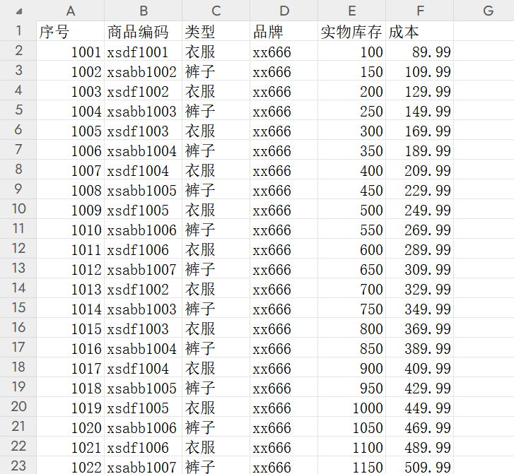
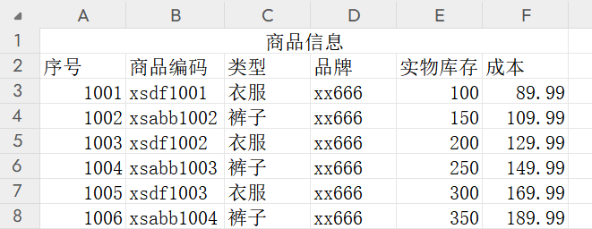

# 第01章_EasyExcel

EasyExcel是Alibaba团队提供的一个基于Java的、快速、简洁、解决大文件内存溢出的Excel处理工具。在不用考虑性能、内存等因素下，快速完成Excel的读、写等功能。官方地址：https://easyexcel.opensource.alibaba.com/

创建SpringBoot项目后引入EasyExcel依赖即可使用：

```xml
<dependency>
    <groupId>com.alibaba</groupId>
    <artifactId>easyexcel</artifactId>
    <version>4.0.3</version>
</dependency>
```

## 1. 读数据

读取数据就是将excel中的数据读到程序中，可以进行逻辑处理之后将数据根据业务需求存储到数据库、写到另一个文件中或者其他的处理均可。数据读取依据**监听器**实现，可通过匿名内部类的形式，也可以新建类创建监听器。

### 1.1 读数据的示例代码

Excel示例如下：



实体类：通过@ExcelProperty注解的value属性指定行头名称，index属性指定第几列（通常这两个属性只需指定一个即可）

```java
@Data
public class Product {
    @ExcelProperty(value = "序号", index = 0)
    private Long id;

    @ExcelProperty(value = "商品编码", index = 1)
    private String code;

    @ExcelProperty(value = "类型", index = 2)
    private String type;

    @ExcelProperty(value = "品牌", index = 3)
    private String brand;

    @ExcelProperty(value = "实物库存", index = 4)
    private Integer stock;

    @ExcelProperty(value = "成本", index = 5)
    private BigDecimal costPrice;
}
```

监听器：实现`ReadListener<T>`接口，用于自定义处理每行数据的业务逻辑，其中泛型`T`为Excel对应的实体类

```java
@Slf4j
public class ProductReadListener implements ReadListener<Product> {
    /**
     * 每读取一条数据，就会调用该方法，用于自定义处理每行数据的业务逻辑
     */
    @Override
    public void invoke(Product product, AnalysisContext analysisContext) {
        // 根据业务需求，可以将读取到的数据保存到数据库中，这里我们只做简单地打印
        log.info("读取到一条数据: {}", product);
    }

    /**
     * 读取完成后会调用doAfterAllAnalysed()方法
     */
    @Override
    public void doAfterAllAnalysed(AnalysisContext analysisContext) {

    }
}
```

> **注意**：ProductReadListener不能被Spring容器管理，每次读取Excel时都要new

读取Excel数据：

```java
@RestController
public class ProductController {
    @PostMapping("/read/excel")
    public String readExcel(@RequestPart("file") MultipartFile file) throws IOException {
        InputStream is = file.getInputStream();
        // 只会读取第1个sheet
        EasyExcel.read(is, Product.class, new ProductReadListener()).sheet().doRead();
        return "success";
    }
}
```

### 1.2 读取指定sheet

**读取所有sheet**：

```java
@PostMapping("/read/excel")
public String readExcel(@RequestPart("file") MultipartFile file) throws IOException {
    InputStream is = file.getInputStream();
    // 读取所有sheet
    EasyExcel.read(is, Product.class, new ProductReadListener()).doReadAll();
    return "success";
}
```

**读取某几个sheet**：

```java
@PostMapping("/read/excel")
public String readExcel(@RequestPart("file") MultipartFile file) {
    try (ExcelReader reader = EasyExcel.read(file.getInputStream()).build()) {
        // 只读取第1个sheet和第2个sheet
        ReadSheet readSheet1 = EasyExcel.readSheet(0).head(Product.class).registerReadListener(new ProductReadListener()).build();
        ReadSheet readSheet2 = EasyExcel.readSheet(1).head(Product.class).registerReadListener(new ProductReadListener()).build();
        reader.read(readSheet1, readSheet2);
    } catch (IOException e) {
        throw new RuntimeException(e);
    }
    return "success";
}
```

### 1.3 多个行头的处理

假设Excel有多个行头：



可以通过`headRowNumber(n)`来指定行头数，默认是1行：

```java
@PostMapping("/read/excel")
public String readExcel(@RequestPart("file") MultipartFile file) throws IOException {
    InputStream is = file.getInputStream();
    // 指定行头数为2行
    EasyExcel.read(is, Product.class, new ProductReadListener()).sheet().headRowNumber(2).doRead();
    return "success";
}
```

### 1.4 数据格式转换

部分数据读写场景涉及到数据格式问题，需要进行转换。例如像"类别"这种属性，数据库中存储的一般是枚举值，而非字符串。EasyExcel中可以通过@DateTimeFormat和@NumberFormat对日期时间和数字格式进行转换，还可以通过实现Converter接口来自定义数据格式转换的逻辑。

我们定义"类型"字段的枚举：

```java
@AllArgsConstructor
@Getter
public enum TypeEnum {
    DEFAULT(0, "无"),
    CLOTHES(101, "衣服"),
    PANTS(102, "裤子");

    private final int code;
    private final String value;

    public static TypeEnum findByCode(int code) {
        for (TypeEnum item : TypeEnum.values()) {
            if (item.getCode() == code) {
                return item;
            }
        }
        return DEFAULT;
    }

    public static TypeEnum findByValue(String value) {
        for (TypeEnum item : TypeEnum.values()) {
            if (item.getValue().equals(value)) {
                return item;
            }
        }
        return DEFAULT;
    }
}
```

自定义Converter：

```java
public class ProductTypeConverter implements Converter<TypeEnum> {
    /**
     * 读取Excel数据时，会调用该方法进行数据格式转换。
     * 我们将Excel中读取到的"类型"信息，转换为枚举TypeEnum保存到Java实体类中。
     */
    @Override
    public TypeEnum convertToJavaData(ReadCellData<?> cellData, ExcelContentProperty contentProperty, GlobalConfiguration globalConfiguration) throws Exception {
        // 获取读取到的字符串
        String type = cellData.getStringValue();
        // 转换为对应的枚举
        return TypeEnum.findByValue(type);
    }
}
```

实体类Product中的type字段修改为枚举类型，并通过@ExcelProperty的converter属性指定转换器：

```java
@ExcelProperty(value = "类型", index = 2, converter = ProductTypeConverter.class)
private TypeEnum type;
```

## 2. 写数据

写数据就是将系统内的数据写到excel中，可以将文件写到磁盘或者提供给前端下载。

### 2.1 写数据的示例代码

实体类：通过@ExcelProperty注解指定行头信息，通过@ColumnWidth注解设置列宽

```java
@Data
public class Example {
    @ExcelProperty(value = "ID", index = 0)
    @ColumnWidth(20)
    private Long id;

    @ExcelProperty(value = "名称", index = 1)
    private String name;

    @ExcelProperty(value = "价格", index = 2)
    private BigDecimal price;

    @ExcelProperty(value = "日期", index = 3)
    @ColumnWidth(18)
    private LocalDateTime dateTime;
}
```

准备数据：

```java
public class ExampleUtil {
    public static List<Example> getExampleList() {
        List<Example> list = new ArrayList<>();
        for (int i = 0; i < 1000; i++) {
            Example example = new Example();
            example.setId(1000000000000000000L + i);
            example.setName("哈哈" + i);
            example.setPrice(new BigDecimal("6666.66"));
            example.setDateTime(LocalDateTime.now());
            list.add(example);
        }
        return list;
    }
}
```

**写出Excel到磁盘**：

```java
@RestController
public class ExampleController {
    @GetMapping("/write/excel")
    public String writeExcel() {
        List<Example> list = ExampleUtil.getExampleList();
        EasyExcel.write("E:\\demo.xlsx", Example.class)
                .registerConverter(new LongStringConverter())
                .sheet("Sheet1").doWrite(list);
        return "success";
    }
}
```

**写出Excel给浏览器下载**：

```java
@RestController
public class ExampleController {
    @GetMapping("/write/excel")
    public ResponseEntity<InputStreamResource> writeExcel() throws IOException {
        List<Example> list = ExampleUtil.getExampleList();
        ByteArrayOutputStream outputStream = new ByteArrayOutputStream();
        EasyExcel.write(outputStream, Example.class)
                .registerConverter(new LongStringConverter())
                .sheet("Sheet1").doWrite(list);

        InputStream inputStream = new ByteArrayInputStream(outputStream.toByteArray());
        InputStreamResource resource = new InputStreamResource(inputStream);
        String fileName = URLEncoder.encode("demo.xlsx", StandardCharsets.UTF_8);
        return ResponseEntity.ok()
                .contentType(MediaType.APPLICATION_OCTET_STREAM)
                .contentLength(inputStream.available())
                .header("Content-Disposition", "attachment;filename=" + fileName)
                .body(resource);
    }
}
```

> 说明：直接写出Long类型的数据可能会导致精度丢失，所以上述通过**LongStringConverter**这一转换器将Long转为String写出，就能防止精度丢失。

### 2.2 分批写入

**分批写入同一sheet（每批300条数据）**：

```java
@RestController
public class ExampleController {
    @GetMapping("/write/excel")
    public String writeExcel() {
        List<Example> list = ExampleUtil.getExampleList();
        List<List<Example>> partitionList = Lists.partition(list, 300);

        try (ExcelWriter excelWriter = EasyExcel.write("E:\\demo.xlsx", Example.class).registerConverter(new LongStringConverter()).build()) {
            WriteSheet writeSheet = EasyExcel.writerSheet("Sheet1").build();
            for (List<Example> exampleList : partitionList) {
                excelWriter.write(exampleList, writeSheet);
            }
        } catch (Exception e) {
            throw new RuntimeException(e);
        }
        return "success";
    }
}
```

**分批写入不同sheet（每批300条数据）**：

```java
@RestController
public class ExampleController {
    @GetMapping("/write/excel")
    public String writeExcel() {
        List<Example> list = ExampleUtil.getExampleList();
        List<List<Example>> partitionList = Lists.partition(list, 300);

        try (ExcelWriter excelWriter = EasyExcel.write("E:\\demo.xlsx", Example.class).registerConverter(new LongStringConverter()).build()) {
            int index = 1;
            for (List<Example> exampleList : partitionList) {
                WriteSheet writeSheet = EasyExcel.writerSheet("Sheet" + index).build();
                excelWriter.write(exampleList, writeSheet);
                index++;
            }
        } catch (Exception e) {
            throw new RuntimeException(e);
        }
        return "success";
    }
}
```

## 3. 百万级别数据读写

> 案例1：从数据库读取100w条数据并写入Excel中
>
> 案例2：从Excel中读取100w条数据并写入数据库中

MyBatis-Plus相关配置如下：

（1）引入依赖：

```xml
<!-- mybatis-plus -->
<dependency>
    <groupId>com.baomidou</groupId>
    <artifactId>mybatis-plus-spring-boot3-starter</artifactId>
    <version>3.5.8</version>
</dependency>
<!-- mysql -->
<dependency>
    <groupId>com.mysql</groupId>
    <artifactId>mysql-connector-j</artifactId>
    <scope>runtime</scope>
</dependency>
```

（2）配置文件

```properties
# 数据源配置
spring.datasource.driver-class-name=com.mysql.cj.jdbc.Driver
spring.datasource.url=jdbc:mysql://localhost:3306/excel_demo
spring.datasource.username=root
spring.datasource.password=abc666
# 设置数据库连接池的大小，默认最大连接数为10容易在多线程情形下被打满
spring.datasource.hikari.maximum-pool-size=100

# 设置上传文件的最大大小
spring.servlet.multipart.max-request-size=100MB
spring.servlet.multipart.max-file-size=100MB
```

（3）配置类（注册分页插件）

```java
@Configuration
public class MyBatisPlusConfig {
    /**
     * 将mybatis-plus插件集合添加到ioc容器
     */
    @Bean
    public MybatisPlusInterceptor mybatisPlusInterceptor() {
        // 创建mybatis-plus插件集合，将需要使用的插件加入到这个集合中即可
        MybatisPlusInterceptor interceptor = new MybatisPlusInterceptor();
        // 加入分页插件
        interceptor.addInnerInterceptor(new PaginationInnerInterceptor(DbType.MYSQL));

        return interceptor;
    }
}
```

（4）数据库表实体类：

```java
@TableName("goods")
@Data
public class Goods {
    @TableId(value = "id", type = IdType.AUTO)
    private Long id;

    private String name;

    private Integer stock;
}
```

（5）Mapper

```java
@Mapper
public interface GoodsMapper extends BaseMapper<Goods> {
}
```

（6）Excel对应实体类

```java
@Data
public class GoodsVO {
    @ExcelProperty("ID")
    @ColumnWidth(15)
    private Long id;

    @ExcelProperty("商品名称")
    @ColumnWidth(15)
    private String name;

    @ExcelProperty("商品库存")
    @ColumnWidth(15)
    private Integer stock;
}
```

### 3.1 向Excel写入百万数据

```java
@RestController
@Slf4j
public class GoodsController {
    @Autowired
    private GoodsMapper goodsMapper;

    private final ExecutorService executorService = new ThreadPoolExecutor(10, 20, 60,
            TimeUnit.SECONDS,
            new ArrayBlockingQueue<>(5),
            Executors.defaultThreadFactory(),
            new ThreadPoolExecutor.AbortPolicy());

    private int curWritePageNo; // 当前实际在写的页码

    @GetMapping("/write")
    public String write() {
        curWritePageNo = 1;
        int pageSize = 100000;
        // 查询总页数
        Long totalCount = goodsMapper.selectCount(null);
        int maxPageNo = (int) Math.ceil((double) totalCount / pageSize);

        try (ExcelWriter excelWriter = EasyExcel.write("E:\\goods.xlsx", GoodsVO.class).registerConverter(new LongStringConverter()).build()) {
            WriteSheet writeSheet = EasyExcel.writerSheet("Sheet1").build();

            CountDownLatch countDownLatch = new CountDownLatch(maxPageNo);
            for (int pageNo = 1; pageNo <= maxPageNo; pageNo++) {
                Page<Goods> page = new Page<>(pageNo, pageSize);
                executorService.submit(() -> {
                    // 多线程并行查询数据
                    goodsMapper.selectPage(page, null);
                    List<Goods> goodsList = page.getRecords();

                    // 写入Excel，通过curWritePageNo控制顺序
                    synchronized (excelWriter) {
                        while (curWritePageNo != page.getCurrent()) {
                            try {
                                excelWriter.wait();
                            } catch (InterruptedException e) {
                                throw new RuntimeException(e);
                            }
                        }
                        excelWriter.write(BeanUtil.copyToList(goodsList, GoodsVO.class), writeSheet);
                        log.info("第{}页数据写入完成！", page.getCurrent());

                        curWritePageNo++;
                        excelWriter.notifyAll();
                    }
                    countDownLatch.countDown();
                });
            }
            countDownLatch.await();
        } catch (Exception e) {
            throw new RuntimeException(e);
        }
        return "success";
    }
}
```

### 3.2 从Excel读取百万数据

```java
@RestController
public class GoodsController {
    @Autowired
    private GoodsMapper goodsMapper;

    @PostMapping("/read")
    public String read(@RequestPart("file") MultipartFile file) {
        try {
            EasyExcel.read(file.getInputStream(), GoodsVO.class, new GoodsReadListener(goodsMapper))
                    .sheet().doRead();
        } catch (Exception e) {
            throw new RuntimeException(e);
        }
        return "success";
    }
}
```

```java
public class GoodsReadListener implements ReadListener<GoodsVO> {
    // 每批处理10000条数据
    public static final int BATCH_SIZE = 10000;

    // 缓存Excel表中读取到的记录
    private List<GoodsVO> goodsVOList = new ArrayList<>(BATCH_SIZE);

    private final ExecutorService executorService = new ThreadPoolExecutor(10, 100, 60,
            TimeUnit.SECONDS,
            new ArrayBlockingQueue<>(5),
            Executors.defaultThreadFactory(),
            new ThreadPoolExecutor.AbortPolicy());

    private final GoodsMapper goodsMapper;

    public GoodsReadListener(GoodsMapper goodsMapper) {
        this.goodsMapper = goodsMapper;
    }

    @Override
    public void invoke(GoodsVO data, AnalysisContext context) {
        goodsVOList.add(data);
        if (goodsVOList.size() >= BATCH_SIZE) {
            List<Goods> goodsList = BeanUtil.copyToList(goodsVOList, Goods.class);
            executorService.submit(() -> {
                goodsMapper.insert(goodsList, BATCH_SIZE);
            });
            goodsVOList.clear();
        }
    }

    @Override
    public void doAfterAllAnalysed(AnalysisContext context) {

    }
}
```


# 第02章_枚举处理

对于一个对象中的枚举属性，我们往往希望传递给前端的JSON、以及保存到数据库中都是以整数code值来代替该枚举属性。

**枚举类与JSON中的保存方式互相转换**，可以通过以下注解实现：

1. 在枚举类上标注`@JsonFormat(shape = JsonFormat.Shape.OBJECT)`
2. 在某个属性值上标注`@JsonValue`，表示转换为JSON时使用该属性值

```java
@JsonFormat(shape = JsonFormat.Shape.OBJECT)
@Getter
@AllArgsConstructor
public enum UserStatusEnum {
    NORMAL(0, "正常"),
    DISABLED(1, "禁用");

    @JsonValue
    private final int code;

    private final String message;
}
```

**枚举类与数据库中的保存方式互相转换**，如果使用MyBatis-Plus，则只需在对应的属性值上标注`@EnumValue`即可：

```java
@JsonFormat(shape = JsonFormat.Shape.OBJECT)
@Getter
@AllArgsConstructor
public enum UserStatusEnum {
    NORMAL(0, "正常"),
    DISABLED(1, "禁用");

    @EnumValue
    @JsonValue
    private final int code;

    private final String message;
}
```

测试：

```java
@RestController
public class SysUserController {
    @Autowired
    private SysUserMapper sysUserMapper;

    @GetMapping("/user")
    public SysUser saveUser() {
        SysUser sysUser = new SysUser();
        sysUser.setId(123L);
        sysUser.setUsername("张三");
        sysUser.setUserStatus(UserStatusEnum.NORMAL);

        // 打印：SysUser(id=123, username=张三, userStatus=NORMAL)
        System.out.println(sysUser);
        // 数据库中user_status字段保存的值为0
        sysUserMapper.insert(sysUser);
        // 返回的JSON为：{"id":123,"username":"张三","userStatus":0}
        return sysUser;
    }
}
```


# 第03章_前端Long精度丢失问题

超过2的53次方的数值转化为JavaScript的Number类型时，有些数值会有精度损失。例如后端传给前端的`id`为1304270071757017088，但是前端拿到的值却是1304270071757017000，这就发生了精度损失。因此，对于需要使用超大整数的场景，服务端不能返回给前端Long类型，而必须是String类型。

## 1. 方式一：使用注解处理每个Long

可以通过`@JsonFormat(shape = JsonFormat.Shape.STRING)`注解将Long转化为String返回给前端：

```java
@Data
public class UserVO {
    @JsonFormat(shape = JsonFormat.Shape.STRING)
    private Long id;
    
    private String username;
}
```

> 说明：也可以使用注解`@JsonSerialize(using = ToStringSerializer.class)`，效果是相同的。

## 2. 方式二：全局统一处理

给每个VO的Long类型属性都标注注解过于繁琐。所以Jackson也支持我们定制ObjectMapper，来统一将所有Long类型数据都序列化为String。只需在项目中添加如下配置类即可：

```java
@Configuration
public class JacksonConfig {
    @Bean
    public Jackson2ObjectMapperBuilderCustomizer jackson2ObjectMapperBuilderCustomizer() {
        return jacksonObjectMapperBuilder -> jacksonObjectMapperBuilder
                .serializerByType(Long.class, ToStringSerializer.instance);
    }
}
```


# 第04章_数据脱敏

## 1. 简介

数据脱敏，指对某些敏感信息通过脱敏规则进行数据的变形，实现敏感隐私数据的可靠保护。这样就可以在开发、测试和其它非生产环境以及外包环境中安全地使用脱敏后的真实数据集。在涉及客户安全数据或者一些商业性敏感数据的情况下，在不违反系统规则条件下，对真实数据进行改造并提供测试使用，如身份证号、手机号、卡号、客户号等个人信息都需要进行数据脱敏。是数据库安全技术之一。

在数据脱敏过程中，通常会采用不同的算法和技术，以根据不同的需求和场景对数据进行处理。例如，对于身份证号码，可以使用掩码算法将前几位数字保留，其他位用`*`代替；对于姓名，可以使用伪造算法，将真实姓名替换成随机生成的假名。

## 2. 案例实战

在实际开发中，后端从数据库查到源数据后，需要对一些敏感信息进行**脱敏后再返回给前端**。Hutool工具类提供了很多简便的脱敏方法。

引入依赖：

```xml
<dependency>
    <groupId>cn.hutool</groupId>
    <artifactId>hutool-all</artifactId>
    <version>5.8.25</version>
</dependency>
```

常用脱敏工具方法：

```java
@SpringBootTest
public class DemoApplicationTests {

    /**
     * 手机号脱敏
     */
    @Test
    public void testPhoneDesensitization() {
        String phone = "13723231234";
        // 输出：137****1234
        System.out.println(DesensitizedUtil.mobilePhone(phone));
    }

    /**
     * 银行卡脱敏
     */
    @Test
    public void testBankCardDesensitization() {
        String bankCard = "6217000130008255666";
        // 输出：6217 **** **** **** 666
        System.out.println(DesensitizedUtil.bankCard(bankCard));
    }

    /**
     * 身份证号脱敏
     */
    @Test
    public void testIdCardNumDesensitization() {
        String idCardNum = "411021199901102321";
        // 输出（显示前4位和后2位）：4110************21
        System.out.println(DesensitizedUtil.idCardNum(idCardNum, 4, 2));
    }

    /**
     * 密码脱敏
     */
    @Test
    public void testPasswordDesensitization() {
        String password = "wwjdco35711";
        // 输出：***********
        System.out.println(DesensitizedUtil.password(password));
    }

    /**
     * 电子邮件脱敏
     */
    @Test
    public void testEmailDesensitization() {
        String email = "249239002@qq.com";
        // 输出：2********@qq.com
        System.out.println(DesensitizedUtil.email(email));
    }

    /**
     * 中文姓名脱敏
     */
    @Test
    public void testNameDesensitization() {
        String name = "李慕婉";
        // 输出：李**
        System.out.println(DesensitizedUtil.chineseName(name));
    }
}
```


