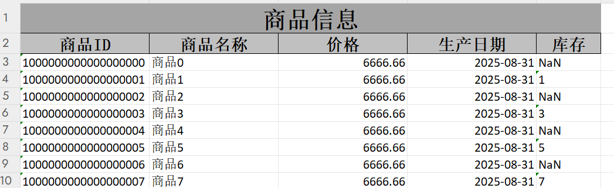

# 第01章_EasyExcel

Java 中用于解析和生成 Excel 的传统框架有 Apache poi、jxl，但他们都存在一个严重的问题就是非常耗内存。EasyExcel 是 Alibaba 团队提供的一个基于 Java 的、快速、简洁、解决大文件内存溢出的 Excel 处理工具，能够快速完成 Excel 的读写等功能。官方地址：https://easyexcel.opensource.alibaba.com/

创建 SpringBoot 项目后引入 EasyExcel 依赖即可使用：

```xml
<dependency>
    <groupId>com.alibaba</groupId>
    <artifactId>easyexcel</artifactId>
    <version>4.0.3</version>
</dependency>
```

## 1. 写Excel

写 Excel 就是将系统内的数据写入 Excel 中，可以将文件写到磁盘或者提供给前端下载。

### 1.1 快速入门

#### 1、实体类

```java
@ColumnWidth(20)
@Data
public class GoodsVO {

    @ExcelProperty(value = "商品ID", converter = LongStringConverter.class)
    private Long goodsId;

    @ExcelProperty("商品名称")
    private String goodsName;

    @ExcelProperty("价格")
    private BigDecimal price;

    @DateTimeFormat("yyyy-MM-dd")
    @ExcelProperty("生产日期")
    private Date createTime;

    @ColumnWidth(10)
    @ExcelProperty("库存")
    private Integer stock;

    @ExcelIgnore
    private String goodsPicture;
}
```

常用注解说明：

- `@ExcelProperty`：指定行头信息，value 属性用于指定列名，index 属性用于指定列号（从 0 开始递增）。注意，**我们建议只指定 value**，而不指定 index，此时列的顺序就依据实体类中字段的顺序。converter 属性用于指定转换器，例如 LongStringConverter 就是将 Long 转为 String，可以避免前端 Long 精度丢失的问题。
- `@ColumnWidth`：设置列宽。标注在类上则为每个字段都设置该列宽，标注在字段上则只为该字段设置该列宽（如果同时标注在类上和某个字段上，则该字段的列宽以字段上的注解为准）
- `@ExcelIgnore`：要忽略的字段
- `@DateTimeFormat`：指定日期的转换格式

我们准备一些数据便于测试：

```java
public class GoodsUtil {
    public static List<GoodsVO> getGoodsList() {
        List<GoodsVO> list = new ArrayList<>();
        for (int i = 0; i < 10000; i++) {
            GoodsVO goods = new GoodsVO();
            goods.setGoodsId(1000000000000000000L + i);
            goods.setGoodsName("商品" + i);
            goods.setPrice(new BigDecimal("6666.66"));
            goods.setCreateTime(new Date());
            goods.setStock(i % 2 == 0 ? -1 : i);
            goods.setGoodsPicture("https://123.com");
            list.add(goods);
        }
        return list;
    }
}
```

#### 2、写Excel到磁盘

```java
@RestController
public class GoodsController {
    @Autowired
    private GoodsService goodsService;

    @GetMapping("/write/disk")
    public String writeExcelToDisk() {
        List<GoodsVO> goodsList = GoodsUtil.getGoodsList();
        String fileName = "E:/demo.xlsx";
        goodsService.writeExcelToDisk(goodsList, fileName);
        return "success";
    }
}
```

```java
@Service
public class GoodsService {
    public void writeExcelToDisk(List<GoodsVO> goodsList, String fileName) {
        // 调用 doWrite() 后文件流会自动关闭
        EasyExcel.write(fileName, GoodsVO.class).sheet("Sheet1").doWrite(goodsList);
    }
}
```

#### 3、写Excel给浏览器下载

```java
@RestController
public class GoodsController {
    @Autowired
    private GoodsService goodsService;

    @GetMapping("/write/browser")
    public ResponseEntity<InputStreamResource> writeExcelToBrowser() {
        List<GoodsVO> goodsList = GoodsUtil.getGoodsList();
        ByteArrayOutputStream outputStream = goodsService.writeExcelToBrowser(goodsList);
        
        try (InputStream inputStream = new ByteArrayInputStream(outputStream.toByteArray())) {
            InputStreamResource resource = new InputStreamResource(inputStream);
            String downloadFileName = URLEncoder.encode("demo.xlsx", StandardCharsets.UTF_8);
            return ResponseEntity.ok()
                    .contentType(MediaType.APPLICATION_OCTET_STREAM)
                    .contentLength(inputStream.available())
                    .header("Content-Disposition", "attachment;filename=" + downloadFileName)
                    .body(resource);
        } catch (Exception e) {
            throw new RuntimeException(e);
        }
    }
}
```

```java
@Service
public class GoodsService {
    public ByteArrayOutputStream writeExcelToBrowser(List<GoodsVO> goodsList) {
        try (ByteArrayOutputStream outputStream = new ByteArrayOutputStream()) {
            // 写入数据到 outputStream，调用 doWrite() 后文件流会自动关闭
            EasyExcel.write(outputStream, GoodsVO.class).sheet("Sheet1").doWrite(goodsList);
            return outputStream;
        } catch (Exception e) {
            throw new RuntimeException(e);
        }
    }
}
```

### 1.2 分批写入

> 假设每批处理 3000 条数据

#### 1、分批写入同一Sheet

```java
@Service
public class GoodsService {
    public ByteArrayOutputStream writeExcelToBrowser(List<GoodsVO> goodsList) {
        try (
                ByteArrayOutputStream outputStream = new ByteArrayOutputStream();
                ExcelWriter excelWriter = EasyExcel.write(outputStream, GoodsVO.class).build()
        ) {
            // 写入数据到 outputStream
            List<List<GoodsVO>> partitionList = Lists.partition(goodsList, 3000);
            WriteSheet writeSheet = EasyExcel.writerSheet("Sheet1").build();
            for (int i = 0; i < partitionList.size(); i++) {
                excelWriter.write(partitionList.get(i), writeSheet);
            }
            // 这种写法 excelWriter 需手动关闭，否则无法写入 outputStream
            excelWriter.finish();
            return outputStream;
        } catch (Exception e) {
            throw new RuntimeException(e);
        }
    }
}
```

#### 2、分批写入不同Sheet

```java
@Service
public class GoodsService {
    public ByteArrayOutputStream writeExcelToBrowser(List<GoodsVO> goodsList) {
        try (
                ByteArrayOutputStream outputStream = new ByteArrayOutputStream();
                ExcelWriter excelWriter = EasyExcel.write(outputStream, GoodsVO.class).build()
        ) {
            // 写入数据到 outputStream
            List<List<GoodsVO>> partitionList = Lists.partition(goodsList, 3000);
            for (int i = 0; i < partitionList.size(); i++) {
                WriteSheet writeSheet = EasyExcel.writerSheet(i, "Sheet" + (i + 1)).build();
                excelWriter.write(partitionList.get(i), writeSheet);
            }
            // 这种写法 excelWriter 需手动关闭，否则无法写入 outputStream
            excelWriter.finish();
            return outputStream;
        } catch (Exception e) {
            throw new RuntimeException(e);
        }
    }
}
```

### 1.3 自定义格式转换

假设我们现在有个需求：当库存字段 stock 为 -1 时，希望在 Excel 文件中显示 NaN。那么我们就需要自定义格式转换器。

在 stock 字段上指定我们自定义的格式转换器：

```java
@ColumnWidth(10)
@ExcelProperty(value = "库存", converter = CustomConverter.class)
private Integer stock;
```

自定义格式转换器：

```java
// 实现 Converter<T> 接口，泛型 T 是 stock 字段的类型
public class CustomConverter implements Converter<Integer> {

    /**
     * 字段的 Java 类型
     */
    @Override
    public Class<?> supportJavaTypeKey() {
        return Integer.class;
    }

    /**
     * 字段的 Excel 类型
     */
    @Override
    public CellDataTypeEnum supportExcelTypeKey() {
        return CellDataTypeEnum.STRING;
    }

    /**
     * 读 Excel 时会调用该方法，将 Excel 数据转换为 Java 数据
     */
    @Override
    public Integer convertToJavaData(ReadConverterContext<?> context) throws Exception {
        String excelValue = context.getReadCellData().getStringValue();
        if (StringUtils.isBlank(excelValue) || "NaN".equalsIgnoreCase(excelValue)) {
            return -1;
        }
        return Integer.valueOf(excelValue);
    }

    /**
     * 写 Excel 时会调用该方法，将 Java 数据转换为 Excel 数据
     */
    @Override
    public WriteCellData<?> convertToExcelData(WriteConverterContext<Integer> context) throws Exception {
        Integer javaValue = context.getValue();
        if (javaValue.equals(-1)) {
            return new WriteCellData<>("NaN");
        }
        return new WriteCellData<>(javaValue.toString());
    }
}
```

## 2. 读Excel

读 Excel 就是将 Excel 中的数据读到内存中，可以进行逻辑处理之后将数据根据业务需求存储到数据库、写到另一个文件中或者其他的处理均可。Excel 数据读取依靠**监听器** ReadListener 实现。

### 2.1 快速入门

#### 1、实体类

仍然使用之前的实体类 GoodsVO

#### 2、监听器

实现 `ReadListener<T>` 接口，用于自定义处理每行数据的业务逻辑，其中泛型 `T` 为 Excel 对应的实体类。注意：**自定义的监听器不能被 Spring 容器管理，每次读取 Excel 时都要 new**。

```java
@Slf4j
public class GoodsReadListener implements ReadListener<GoodsVO> {

    private final List<GoodsVO> dataList;
    
    public GoodsReadListener(List<GoodsVO> dataList) {
        this.dataList = dataList;
    }
    
    /**
     * 每读取一条数据，就会调用该方法，用于自定义处理每行数据的业务逻辑
     */
    @Override
    public void invoke(GoodsVO data, AnalysisContext context) {
        dataList.add(data);
    }

    /**
     * 每个 Sheet 的内容读取完毕后都会调用 doAfterAllAnalysed() 方法
     */
    @Override
    public void doAfterAllAnalysed(AnalysisContext context) {
        log.info("Sheet 读取完毕！");
    }
}
```

#### 3、读取第一个Sheet

```java
@RestController
public class GoodsController {
    @Autowired
    private GoodsService goodsService;

    @PostMapping("/read/first")
    public List<GoodsVO> readExcelFirstSheet(@RequestPart("file") MultipartFile file) {
        try (InputStream inputStream = file.getInputStream()) {
            List<GoodsVO> goodsList = goodsService.readExcelFirstSheet(inputStream);
            return goodsList;
        } catch (Exception e) {
            throw new RuntimeException(e);
        }
    }
}
```

```java
@Service
public class GoodsService {
    public List<GoodsVO> readExcelFirstSheet(InputStream inputStream) {
        List<GoodsVO> goodsList = new ArrayList<>();
        // 调用 doRead() 后文件流会自动关闭
        EasyExcel.read(inputStream, GoodsVO.class, new GoodsReadListener(goodsList)).sheet().doRead();
        return goodsList;
    }
}
```

#### 4、读取所有Sheet

```java
@RestController
public class GoodsController {
    @Autowired
    private GoodsService goodsService;

    @PostMapping("/read/all")
    public List<GoodsVO> readExcelAllSheet(@RequestPart("file") MultipartFile file) {
        try (InputStream inputStream = file.getInputStream()) {
            List<GoodsVO> goodsList = goodsService.readExcelAllSheet(inputStream);
            return goodsList;
        } catch (Exception e) {
            throw new RuntimeException(e);
        }
    }
}
```

```java
@Service
public class GoodsService {
    public List<GoodsVO> readExcelAllSheet(InputStream inputStream) {
        List<GoodsVO> goodsList = new ArrayList<>();
        // 调用 doReadAll() 后文件流会自动关闭
        EasyExcel.read(inputStream, GoodsVO.class, new GoodsReadListener(goodsList)).doReadAll();
        return goodsList;
    }
}
```

### 2.2 处理多行头

假设 Excel 有多行头：



那么可以通过 `headRowNumber(n)` 来指定行头数（默认情况是 1 行）：

```java
@Service
public class GoodsService {
    public List<GoodsVO> readExcelFirstSheet(InputStream inputStream) {
        List<GoodsVO> goodsList = new ArrayList<>();
        // 指定行头数为2行
        EasyExcel.read(inputStream, GoodsVO.class, new GoodsReadListener(goodsList)).sheet().headRowNumber(2).doRead();
        return goodsList;
    }
}
```

## 3. 通用Excel工具类

我们可以封装一个通用的 Excel 工具类，便于开发中使用。

```java
public interface ExcelService {

    /**
     * 导出Excel文件(单个Sheet)【适合数据量小的场景】
     * @param rowList 行对象List
     * @param clazz 行对象类型
     * @param fileName 文件名称
     * @return ResponseEntity<InputStreamResource>
     */
    <T> ResponseEntity<InputStreamResource> writeSimpleExcel(List<T> rowList, Class<T> clazz, String fileName);

    /**
     * 导出Excel文件(多个Sheet)【适合数据量大的场景】
     * @param rowList 行对象List
     * @param clazz 行对象类型
     * @param fileName 文件名称
     * @param batchSize 每个Sheet的行数
     * @return ResponseEntity<InputStreamResource>
     */
    <T> ResponseEntity<InputStreamResource> writeLargeExcel(List<T> rowList, Class<T> clazz, String fileName, int batchSize);

    /**
     * 读取Excel文件【适合数据量小的场景】
     * @param inputStream 输入流
     * @param clazz 行对象类型
     * @return 行对象列表
     */
    <T> List<T> readSimpleExcel(InputStream inputStream, Class<T> clazz);

    /**
     * 分批读取Excel文件【适合数据量大的场景】
     * @param inputStream 输入流
     * @param clazz 行对象类型
     * @param dataListConsumer 数据消费函数(每次消费一批的数据量)
     * @param batchSize 每批处理的行数
     * @return 成功/失败
     */
    <T> boolean readLargeExcel(InputStream inputStream, Class<T> clazz, Consumer<List<T>> dataListConsumer, int batchSize);
}
```

```java
@Slf4j
@Service
public class ExcelServiceImpl implements ExcelService {

    @Override
    public <T> ResponseEntity<InputStreamResource> writeSimpleExcel(List<T> rowList, Class<T> clazz, String fileName) {
        try (ByteArrayOutputStream outputStream = new ByteArrayOutputStream()) {
            // 写入数据到 outputStream，调用 doWrite() 后文件流会自动关闭
            EasyExcel.write(outputStream, clazz).sheet("Sheet1").doWrite(rowList);
            // 返回给浏览器下载
            return buildResponseEntity(outputStream, fileName);
        } catch (Exception e) {
            log.error("[ExcelServiceImpl.writeSimpleExcel] error, fileName: {}, rowList: {}", fileName, rowList, e);
            return null;
        }
    }

    private ResponseEntity<InputStreamResource> buildResponseEntity(ByteArrayOutputStream outputStream, String fileName) {
        try (InputStream inputStream = new ByteArrayInputStream(outputStream.toByteArray())) {
            InputStreamResource resource = new InputStreamResource(inputStream);
            String downloadFileName = URLEncoder.encode(fileName, StandardCharsets.UTF_8);
            return ResponseEntity.ok()
                    .contentType(MediaType.APPLICATION_OCTET_STREAM)
                    .contentLength(inputStream.available())
                    .header("Content-Disposition", "attachment;filename=" + downloadFileName)
                    .body(resource);
        } catch (Exception e) {
            throw new RuntimeException(e);
        }
    }

    @Override
    public <T> ResponseEntity<InputStreamResource> writeLargeExcel(List<T> rowList, Class<T> clazz, String fileName, int batchSize) {
        try (
                ByteArrayOutputStream outputStream = new ByteArrayOutputStream();
                ExcelWriter excelWriter = EasyExcel.write(outputStream, clazz).build()
        ) {
            // 写入数据到 outputStream
            List<List<T>> partitionList = Lists.partition(rowList, batchSize);
            for (int i = 0; i < partitionList.size(); i++) {
                WriteSheet writeSheet = EasyExcel.writerSheet(i, "Sheet" + (i + 1)).build();
                excelWriter.write(partitionList.get(i), writeSheet);
            }
            // 这种写法excelWriter需手动关闭，否则无法写入outputStream
            excelWriter.finish();
            // 返回给浏览器下载
            return buildResponseEntity(outputStream, fileName);
        } catch (Exception e) {
            log.error("[ExcelServiceImpl.writeLargeExcel] error, fileName: {}, rowList: {}", fileName, rowList, e);
            return null;
        }
    }

    @Override
    public <T> List<T> readSimpleExcel(InputStream inputStream, Class<T> clazz) {
        try {
            List<T> dataList = new ArrayList<>();
            // 调用 doReadAll() 后文件流会自动关闭
            EasyExcel.read(inputStream, clazz, new SimpleExcelReadListener<>(dataList)).doReadAll();
            return dataList;
        } catch (Exception e) {
            log.error("[ExcelServiceImpl.readSimpleExcel] error", e);
            return null;
        }
    }

    @Override
    public <T> boolean readLargeExcel(InputStream inputStream, Class<T> clazz, Consumer<List<T>> dataListConsumer, int batchSize) {
        try {
            // PageReadListener是EasyExcel提供的一个内置监听器
            EasyExcel.read(inputStream, clazz, new PageReadListener<>(dataListConsumer, batchSize)).doReadAll();
            return true;
        } catch (Exception e) {
            log.error("[ExcelServiceImpl.readLargeExcel] error", e);
            return false;
        }
    }
}
```

```java
public class SimpleExcelReadListener<T> implements ReadListener<T> {

    private final List<T> dataList;

    public SimpleExcelReadListener(List<T> dataList) {
        this.dataList = dataList;
    }

    @Override
    public void invoke(T data, AnalysisContext context) {
        dataList.add(data);
    }

    @Override
    public void doAfterAllAnalysed(AnalysisContext context) {

    }
}
```

## 4. 百万级别数据读写

> 案例1：从 Excel 中读取 100w 条数据并写入数据库中
>
> 案例2：从数据库读取 100w 条数据并写入 Excel 中

MyBatis-Plus 相关配置如下：

（1）引入依赖：

```xml
<!-- mybatis-plus -->
<dependency>
    <groupId>com.baomidou</groupId>
    <artifactId>mybatis-plus-spring-boot3-starter</artifactId>
    <version>3.5.8</version>
</dependency>
<!-- mysql -->
<dependency>
    <groupId>com.mysql</groupId>
    <artifactId>mysql-connector-j</artifactId>
    <scope>runtime</scope>
</dependency>
```

（2）配置文件

```properties
# 数据源配置
spring.datasource.driver-class-name=com.mysql.cj.jdbc.Driver
spring.datasource.url=jdbc:mysql://localhost:3306/excel_demo
spring.datasource.username=root
spring.datasource.password=abc666
# 设置数据库连接池的大小，默认最大连接数为10容易在多线程情形下被打满
spring.datasource.hikari.maximum-pool-size=100

# 设置上传文件的最大大小
spring.servlet.multipart.max-request-size=100MB
spring.servlet.multipart.max-file-size=100MB
```

（3）配置类（注册分页插件）

```java
@MapperScan("com.wsy.mapper")
@Configuration
public class MyBatisPlusConfig {
    @Bean
    public MybatisPlusInterceptor mybatisPlusInterceptor() {
        MybatisPlusInterceptor interceptor = new MybatisPlusInterceptor();
        interceptor.addInnerInterceptor(new PaginationInnerInterceptor(DbType.MYSQL));
        return interceptor;
    }
}
```

（4）数据库表实体类

```java
@TableName(value = "goods")
@Data
public class Goods {
    /**
     * 商品ID
     */
    @TableId(value = "goods_id", type = IdType.AUTO)
    private Long goodsId;

    /**
     * 商品名称
     */
    @TableField(value = "goods_name")
    private String goodsName;

    /**
     * 价格
     */
    @TableField(value = "price")
    private BigDecimal price;

    /**
     * 生产日期
     */
    @TableField(value = "create_time")
    private Date createTime;

    /**
     * 库存
     */
    @TableField(value = "stock")
    private Integer stock;
}
```

（5）Mapper

```java
public interface GoodsMapper extends BaseMapper<Goods> {

}
```

（6）Excel 对应的实体类仍然使用之前的 GoodsVO

### 4.1 从Excel读取百万数据

```java
@RestController
public class GoodsController {

    private static final int BATCH_SIZE = 100000;

    private final ExecutorService executorService = new ThreadPoolExecutor(10, 100, 60,
            TimeUnit.SECONDS,
            new ArrayBlockingQueue<>(5),
            Executors.defaultThreadFactory(),
            new ThreadPoolExecutor.AbortPolicy());

    @Autowired
    private ExcelService excelService;

    @Autowired
    private GoodsMapper goodsMapper;

    @PostMapping("/read")
    public String read(@RequestPart("file") MultipartFile file) {
        try (InputStream inputStream = file.getInputStream()) {
            Consumer<List<GoodsVO>> dataConsumer = goodsVOs -> {
                List<Goods> goodsList = goodsVOs.stream().map(goodsVO -> {
                    Goods goods = new Goods();
                    BeanUtils.copyProperties(goodsVO, goods);
                    return goods;
                }).toList();
                executorService.execute(() -> goodsMapper.insert(goodsList, BATCH_SIZE));
            };
            boolean result = excelService.readLargeExcel(inputStream, GoodsVO.class, dataConsumer, BATCH_SIZE);
            return result ? "success" : "fail";
        } catch (Exception e) {
            return "fail";
        }
    }
}
```

### 4.2 向Excel写入百万数据

```java
@RestController
public class GoodsController {

    private static final int BATCH_SIZE = 100000;

    @Autowired
    private ExcelService excelService;

    @Autowired
    private GoodsMapper goodsMapper;

    @GetMapping("/write")
    public ResponseEntity<InputStreamResource> write() {
        try {
            List<Goods> goodsList = goodsMapper.selectList(null);
            List<GoodsVO> goodsVOList = goodsList.stream().map(goods -> {
                GoodsVO goodsVO = new GoodsVO();
                BeanUtils.copyProperties(goods, goodsVO);
                return goodsVO;
            }).toList();
            return excelService.writeLargeExcel(goodsVOList, GoodsVO.class, "large-demo.xlsx", BATCH_SIZE);
        } catch (Exception e) {
            return null;
        }
    }
}
```


# 第02章_枚举处理

对于一个对象中的枚举属性，我们往往希望传递给前端的JSON、以及保存到数据库中都是以整数code值来代替该枚举属性。

**枚举类与JSON中的保存方式互相转换**，可以通过以下注解实现：

1. 在枚举类上标注`@JsonFormat(shape = JsonFormat.Shape.OBJECT)`
2. 在某个属性值上标注`@JsonValue`，表示转换为JSON时使用该属性值

> 说明：这两个注解都是 Jackson 提供的，而 spring-boot-starter-web 中已经默认集成了 Jackson

```java
@JsonFormat(shape = JsonFormat.Shape.OBJECT)
@Getter
@AllArgsConstructor
public enum UserStatusEnum {
    NORMAL(0, "正常"),
    DISABLED(1, "禁用");

    @JsonValue
    private final int code;

    private final String message;
}
```

**枚举类与数据库中的保存方式互相转换**，如果使用 MyBatis-Plus，则只需在对应的属性值上标注`@EnumValue`即可：

> 说明：这个注解是由 MyBatis-Plus 提供的，需要引入 MyBatis-Plus 的相关依赖

```java
@JsonFormat(shape = JsonFormat.Shape.OBJECT)
@Getter
@AllArgsConstructor
public enum UserStatusEnum {
    NORMAL(0, "正常"),
    DISABLED(1, "禁用");

    @EnumValue
    @JsonValue
    private final int code;

    private final String message;
}
```

测试：

```java
@RestController
public class SysUserController {
    @Autowired
    private SysUserMapper sysUserMapper;

    @GetMapping("/user")
    public SysUser saveUser() {
        SysUser sysUser = new SysUser();
        sysUser.setId(123L);
        sysUser.setUsername("张三");
        sysUser.setUserStatus(UserStatusEnum.NORMAL);

        // 打印：SysUser(id=123, username=张三, userStatus=NORMAL)
        System.out.println(sysUser);
        // 数据库中user_status字段保存的值为0
        sysUserMapper.insert(sysUser);
        // 返回的JSON为：{"id":123,"username":"张三","userStatus":0}
        return sysUser;
    }
}
```


# 第03章_前端Long精度丢失问题

超过2的53次方的数值转化为JavaScript的Number类型时，有些数值会有精度损失。例如后端传给前端的`id`为1304270071757017088，但是前端拿到的值却是1304270071757017000，这就发生了精度损失。因此，对于需要使用超大整数的场景，服务端不能返回给前端Long类型，而必须是String类型。

## 1. 方式一：使用注解处理每个Long

可以通过`@JsonFormat(shape = JsonFormat.Shape.STRING)`注解将Long转化为String返回给前端：

```java
@Data
public class UserVO {
    @JsonFormat(shape = JsonFormat.Shape.STRING)
    private Long id;
    
    private String username;
}
```

> 说明：也可以使用注解`@JsonSerialize(using = ToStringSerializer.class)`，效果是相同的。

## 2. 方式二：全局统一处理

给每个VO的Long类型属性都标注注解过于繁琐。所以Jackson也支持我们定制ObjectMapper，来统一将所有Long类型数据都序列化为String。只需在项目中添加如下配置类即可：

```java
@Configuration
public class JacksonConfig {
    @Bean
    public Jackson2ObjectMapperBuilderCustomizer jackson2ObjectMapperBuilderCustomizer() {
        return jacksonObjectMapperBuilder -> jacksonObjectMapperBuilder
                .serializerByType(Long.class, ToStringSerializer.instance);
    }
}
```


# 第04章_数据脱敏

## 1. 简介

数据脱敏，指对某些敏感信息通过脱敏规则进行数据的变形，实现敏感隐私数据的可靠保护。这样就可以在开发、测试和其它非生产环境以及外包环境中安全地使用脱敏后的真实数据集。在涉及客户安全数据或者一些商业性敏感数据的情况下，在不违反系统规则条件下，对真实数据进行改造并提供测试使用，如身份证号、手机号、卡号、客户号等个人信息都需要进行数据脱敏。是数据库安全技术之一。

在数据脱敏过程中，通常会采用不同的算法和技术，以根据不同的需求和场景对数据进行处理。例如，对于身份证号码，可以使用掩码算法将前几位数字保留，其他位用`*`代替；对于姓名，可以使用伪造算法，将真实姓名替换成随机生成的假名。

## 2. 案例实战

在实际开发中，后端从数据库查到源数据后，需要对一些敏感信息进行**脱敏后再返回给前端**。Hutool工具类提供了很多简便的脱敏方法。

引入依赖：

```xml
<dependency>
    <groupId>cn.hutool</groupId>
    <artifactId>hutool-all</artifactId>
    <version>5.8.25</version>
</dependency>
```

常用脱敏工具方法：

```java
@SpringBootTest
public class DemoApplicationTests {

    /**
     * 手机号脱敏
     */
    @Test
    public void testPhoneDesensitization() {
        String phone = "13723231234";
        // 输出：137****1234
        System.out.println(DesensitizedUtil.mobilePhone(phone));
    }

    /**
     * 银行卡脱敏
     */
    @Test
    public void testBankCardDesensitization() {
        String bankCard = "6217000130008255666";
        // 输出：6217 **** **** **** 666
        System.out.println(DesensitizedUtil.bankCard(bankCard));
    }

    /**
     * 身份证号脱敏
     */
    @Test
    public void testIdCardNumDesensitization() {
        String idCardNum = "411021199901102321";
        // 输出（显示前4位和后2位）：4110************21
        System.out.println(DesensitizedUtil.idCardNum(idCardNum, 4, 2));
    }

    /**
     * 密码脱敏
     */
    @Test
    public void testPasswordDesensitization() {
        String password = "wwjdco35711";
        // 输出：***********
        System.out.println(DesensitizedUtil.password(password));
    }

    /**
     * 电子邮件脱敏
     */
    @Test
    public void testEmailDesensitization() {
        String email = "249239002@qq.com";
        // 输出：2********@qq.com
        System.out.println(DesensitizedUtil.email(email));
    }

    /**
     * 中文姓名脱敏
     */
    @Test
    public void testNameDesensitization() {
        String name = "李慕婉";
        // 输出：李**
        System.out.println(DesensitizedUtil.chineseName(name));
    }
}
```


