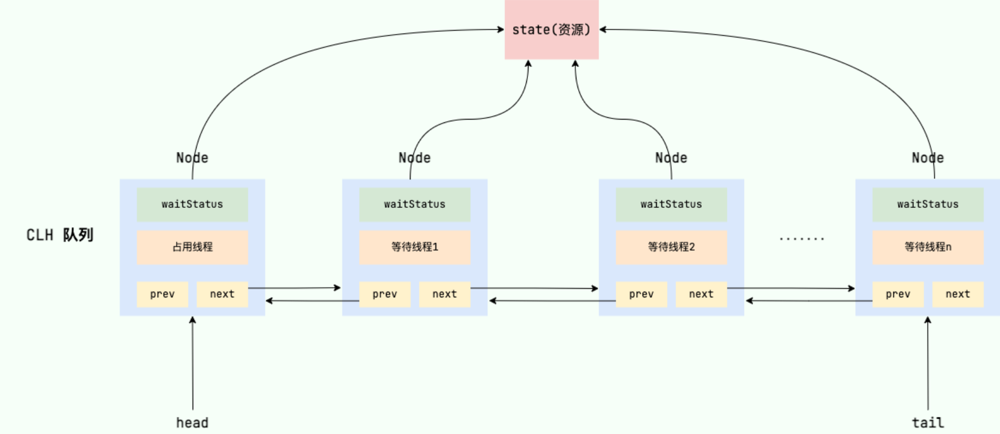
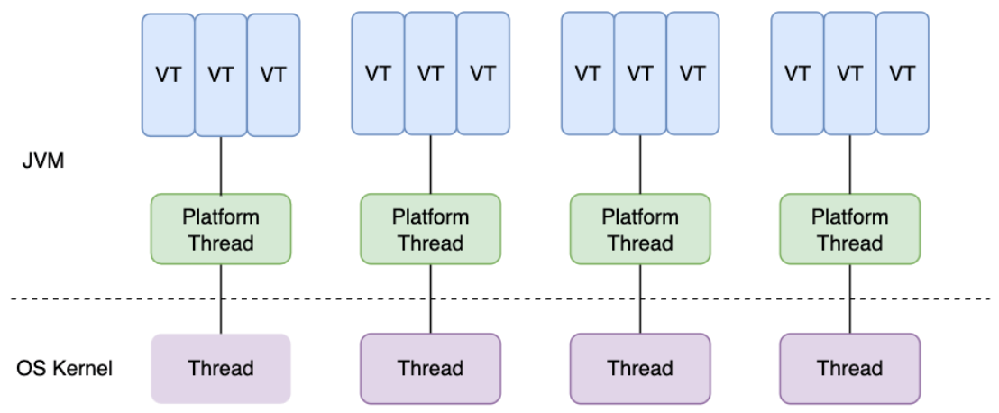
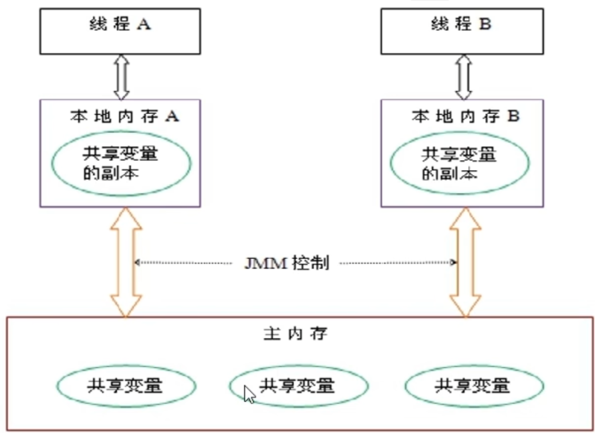
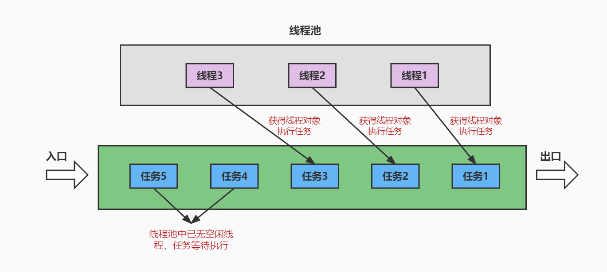
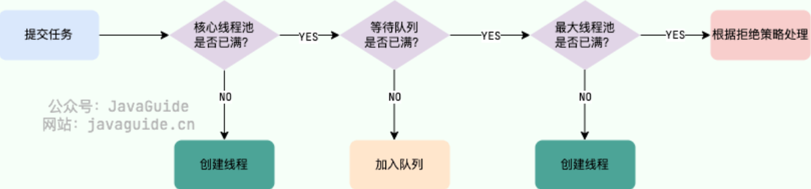
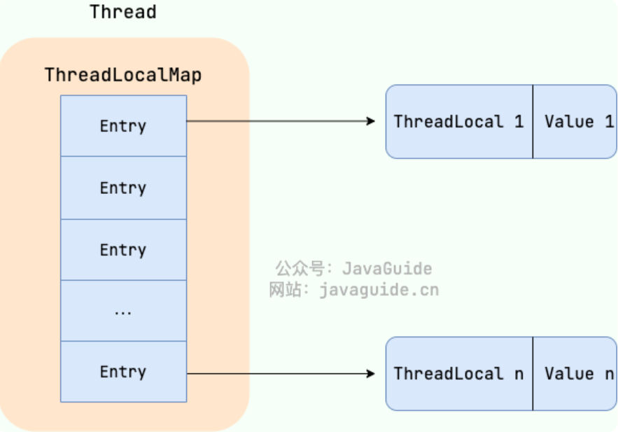

# 第01章_多线程基础

> JUC就是`java.util.concurrent`工具包的简称

## 1. Thread类

### 1.1 简介

**并发**(concurrent)指的是在一段时间内宏观上有多个程序同时运行，但在微观上这些程序是分时交替执行的。比如在单核CPU系统中，每一时刻只能执行一个线程，所以多个线程一定是并发执行的。

**并行**(parallel)指的是在一段时间内确实同时运行多个程序。在多核CPU系统上，将多个线程分配到多个CPU上，就能实现多任务的并行执行。

> **所以多线程既会并行执行也会并发执行**（如果运行的线程数没有超过CPU核心，那么只会并行执行）

一个JVM实例对应一个Java进程，而一个JVM中可以运行多个线程。在Java中使用`java.lang.Thread`类代表**线程**，所有的线程对象都是Thread类或其子类的实例。在底层，**一个Java线程对应一个操作系统内核线程**。

### 1.2 创建线程的方式

创建并启动线程有很多种方式，但实际上底层都是调用Thread对象的`start()`方法启动的。注意：

- 线程所执行的方法体，实际上是Thread对象的`run()`方法
- 但是要启动一个线程，必须调用Thread对象的`start()`方法，而不能直接调用`run()`。如果我们自己手动直接调用`run()`方法，那么就只是调用普通方法，没有启动多线程模式。**而`start()`方法底层会调用操作系统提供的API来创建一个新线程**。
- 通过`start()`启动线程后，`run()`方法调用的时机、执行的过程控制都由操作系统的CPU调度决定。
- 一个Thread实例只能调用一次`start()`方法，如果重复调用将抛出异常`IllegalThreadStateException`

#### 方式1：继承Thread类

1. 自定义类继承`Thread`，并重写`run()`方法，其方法体就代表了线程需要执行的逻辑
2. 创建上述自定义类的实例，并调用该线程对象的`start()`方法启动线程

```java
// 自定义线程类
public class MyThread extends Thread {
    public MyThread() {}
    public MyThread(String name) {
        // 调用父类的String参数的构造器，用于指定线程名称
        super(name);
    }

    @Override
    public void run() {
        for (int i = 0; i < 10; i++) {
            System.out.println(getName() + ":" + i);
        }
    }
}
```

```java
public class MyTest {
    public static void main(String[] args) {
        Thread thread1 = new MyThread(); // 创建线程对象1
        thread1.start(); // 启动子线程1

        Thread thread2 = new MyThread("子线程2"); // 创建线程对象2
        thread2.start(); // 启动子线程2

        for (int i = 0; i < 10; i++) {
            // main线程打印信息
            System.out.println(Thread.currentThread().getName() + ":" + i);
        }
    }
}
```

#### 方式2：实现Runnable接口

1. 自定义类实现`Runnable`接口，并重写`run()`方法，其方法体就代表了线程需要执行的逻辑
2. 调用Thread类的有参构造器`Thread(Runnable target)`创建线程对象，并调用该线程对象的`start()`方法启动线程

**说明**：线程执行的方法体是`Thread`对象的`run()`方法，该方法如果没有被重写，则其源代码如下。也就是只要其target属性不为空，就调用target的`run()`方法，因此当我们通过以上有参构造器创建Thread实例时，真正调用的就是我们自定义Runnable实现类的`run()`方法。

```java
public void run() {
    if (target != null) {
        target.run();
    }
}
```

**注意**：Runnable接口是一个函数式接口，所以我们可以通过Lambda表达式来简便地创建Runnable的匿名实现类对象。

```java
public class MyTest {
    public static void main(String[] args) {
        new Thread(() -> {
            for (int i = 0; i < 10; i++)
                System.out.println(Thread.currentThread().getName()+i);
        }).start();

        for (int i = 0; i < 10; i++)
            System.out.println(Thread.currentThread().getName()+i);
    }
}
```

#### 方式3：实现Callable接口

> 这种方式最大的优点是线程执行完可以有返回值

1. 自定义类实现`Callable<V>`接口，并重写`call()`方法，其方法体就代表了线程需要执行的逻辑。注意，泛型即为`call()`方法的返回值类型。
2. 调用有参构造器`FutureTask(Callable<V> callable)`创建一个FutureTask类的对象
3. 调用Thread类的有参构造器`Thread(Runnable target)`创建线程对象（传入的参数就是上述FutureTask对象），并调用该线程对象的`start()`方法启动线程。
4. 调用上述FutureTask对象的`get()`方法可以获取返回结果

**说明**：FutureTask**既实现了Runnable接口，又实现了Future接口**，所以它既可以作为Runnable被线程执行，又可以作为Future得到异步任务的返回结果。在FutureTask的`run()`方法中，实际执行的是它的成员变量callable的`call()`方法。

**注意**：Callable接口是一个函数式接口，所以我们同样可以使用Lambda表达式。

```java
public class MyTest {
    public static void main(String[] args) throws Exception {
        FutureTask<String> futureTask = new FutureTask<>(() -> {
            System.out.println(Thread.currentThread().getName() + "开始执行了");
            return "执行完毕！666！";
        });
        new Thread(futureTask).start();

        // 获取返回结果
        String result = futureTask.get();
        System.out.println(result);
    }
}
```

### 1.3 Thread类的常用API

#### 1、构造器

- `Thread()`
- `Thread(String name)`：指定线程名称
- `Thread(Runnable target)`：指定target，即线程执行体所在的Runnable对象
- `Thread(Runnable target, String name)`：指定target和线程名称

#### 2、基础API

- `void run()`
- `void start()`
- `String getName()`：获取当前线程名称
- `void setName(String name)`：设置该线程名称
- `static Thread currentThread()`：返回当前正在执行的线程对象的引用
- `static void sleep(long millis)`：**使当前正在执行的线程**睡眠指定的毫秒数

#### 3、核心API

- `void join()`：等待该线程完成。例如，在线程a中调用`b.join()`，则线程a进入阻塞状态，等待线程b执行完成后，线程a才会解除阻塞继续运行。
- `void join(long millis)`：等待该线程完成，最多等待millis毫秒。到了该时间后，将不再等待。
- `boolean isAlive()`：判断线程是否处于活动状态。活动状态，指的是线程已经启动且尚未终止。 
- `static void yield()`：尝试让当前线程释放CPU的占有权，让系统的线程调度器重新调度一次（当然也有可能重新调度后仍然执行该线程）

以下三个API均`已过时`，了解即可：

- `void stop()`：强行结束该线程，直接进入死亡状态。该方法已过时，不建议使用。
- `void suspend()`：暂停该线程，但不会释放任何锁资源。该方法已过时，不建议使用。
- `void resume()`：唤醒上述因`suspend()`而睡眠的线程。该方法已过时，不建议使用。

#### 4、优先级相关API

每个线程都有一定的优先级，同优先级的线程组成先进先出队列（先到先服务），使用**分时调度**策略。而优先级高的线程采用**抢占式策略**，获得较多的执行机会。每个线程默认的优先级都与创建它的父线程相同。

Thread类有三个优先级常量：

- `Thread.MAX_PRIORITY` 值为10，是最高优先级
- `Thread.MIN_PRIORITY` 值为1，是最低优先级
- `Thread.NORM_PRIORITY` 值为5，是普通优先级。默认情况下main线程具有普通优先级。

优先级相关API：

- `int getPriority()`：返回该线程的优先级
- `void setPriority(int newPriority)`：设置该线程的优先级，范围必须是`[1, 10]`之间的整数

#### 5、守护线程相关API

守护线程，就是在后台运行的、为其他线程提供服务的线程。例如，JVM的垃圾回收线程就是守护线程。注意，**如果主线程结束，但用户线程还在执行，则JVM存活；但如果所有用户线程都结束了，只有守护线程还存活，则JVM会直接结束**。

- `void setDaemon(boolean on)`：如果参数on的值为true，就表示将该线程设置为守护线程。注意，必须在该线程`start()`之前设置，否则会报异常。
- `boolean isDaemon()`：判断该线程是否是守护线程。

### 1.4 线程的生命周期

在Thread类的内部枚举类State中定义了线程的6种状态，Java线程在运行的生命周期中的指定时刻只可能处于下面6种不同状态的其中一个状态：

```java
public enum State {
	NEW,
	RUNNABLE,
	BLOCKED,
	WAITING,
	TIMED_WAITING,
	TERMINATED;
}
```

- `NEW（新建）`：线程刚被创建(new)，但是并未启动，即还没调用`start()`方法。
- `RUNNABLE（可运行）`：线程`start()`之后就进入可运行状态，但真正的执行时机由OS调度，并不由JVM控制。
- `TERMINATED（终止）`：表明此线程已经结束生命周期（执行完毕或者遇到异常）。
- `BLOCKED（锁阻塞）`：因等待一个锁对象而阻塞的线程处于这种状态。获取到对应的锁对象后，该线程就进入RUNNABLE状态。
- `WAITING（无限等待）`：一个正在无限期等待另一个线程执行一个特别的（唤醒）动作的线程处于这一状态。
- `TIMED_WAITING（计时等待）`：一个正在限时等待另一个线程执行一个特别的（唤醒）动作的线程处于这一状态。

> **注意**：在操作系统层面，`RUNNABLE`状态还可细分为`Ready`（就绪态）和`Running`（运行态）。但是JVM并没有区分这两种状态，因为这两种状态的切换太快了（一个CPU时间片大约只有10ms到20ms）。


我们可以看到，Java中将阻塞状态细分为`锁阻塞`、`无限等待`、`计时等待`这三种。一般来说：

- 当前线程执行过程中遇到Object类的`wait()`，Condition类的`await()`，Thread类的`join()`，LockSupport类的`park()`等，并且在调用这些方法时**没有指定时间**，那么当前线程会进入`WAITING`状态，直到被对应的方法唤醒。
- 当前线程执行过程中遇到Object类的`wait()`，Condition类的`await()`，Thread类的`sleep()`或`join()`，LockSupport类的`park()`等，并且在调用这些方法时**设置了时间**，那么当前线程会进入`TIMED_WAITING`，直到时间到或被唤醒。

> **注意**：对于Object类的`wait()`和Condition类的`await()`，当从`WAITING`或`TIMED_WAITING`状态被唤醒（或时间到）后恢复，会首先获取锁对象，获取成功则转为`RUNNABLE`，否则就转为`BLOCKED`。

## 2. synchronized

### 2.1 简介

当多个线程访问**同一共享资源**时，若多个线程`只有读操作`，那么不会发生线程安全问题；但是如果多个线程中对资源有`读和写`的操作，就容易出现线程安全问题。

要解决多线程并发访问共享资源的安全性问题，Java中提供了关键字synchronized来解决。它就相当于给某段代码**加锁**，任何线程想要执行这段代码，都要先获得锁，我们称它为**同步锁**。

> 注意：除了使用synchronized可以对临界区加锁外，也可以使用ReentrantLock。使用加锁的方式确实能解决线程安全问题，但加锁的代码实际上是串行执行的，一定程度上意味着降低了效率。

### 2.2 同步代码块

**同步代码块**：synchronized关键字可以用于某个区块前面，表示只对这个区块内的代码实行互斥访问。格式如下：

```java
synchronized (同步监视器) {
     需要同步操作的代码
}
```

**说明**：同步监视器可以使用任何一个类的对象充当，但是要保证需要同步的多个线程必须**共用同一个同步监视器对象**。一般在实例方法中推荐使用`this`作为同步监视器，而在静态方法中推荐使用`当前类.class`作为同步监视器。

举例：三个售票窗口售卖100张票

```java
public class Ticket implements Runnable {
    private static int num = 100;

    @Override
    public void run() {
        while (true) {
            synchronized (this) {
                if (num <= 0) break;
                String s = Thread.currentThread().getName();
                System.out.println(s + "取票" + num);
                num--;
            }
            try {Thread.sleep(300);} catch (Exception e) {}
        }
    }
}
```

```java
public class MyTest {
    public static void main(String[] args) {
        Ticket ticket = new Ticket();
        new Thread(ticket).start();
        new Thread(ticket).start();
        new Thread(ticket).start();
    }
}
```

### 2.3 同步方法

**同步方法**：synchronized关键字直接修饰方法，表示同一时刻只有一个线程能进入这个方法，其他线程在外面等待。格式如下：

```java
[修饰符] synchronized 返回值类型 方法名(形参列表) {
    需要同步操作的代码
}
```

**说明**：synchronized修饰的实例方法，默认同步监视器是`this`；而synchronized修饰的静态方法，默认同步监视器是`当前类.class`

> 注意：构造器不能用synchronized修饰

### 2.4 synchronized锁升级

#### 1、简介

在Java6之前，synchronized使用的是操作系统级别的**重量级锁**，在高并发情况下性能很差。因为重量级锁使用的monitor是依赖于底层操作系统的互斥量Mutex Lock实现的，所以阻塞或唤醒一个线程都需要操作系统介入，因此需要在用户态和内核态之间切换，开销极大。

从Java6开始，为了减少获得锁和释放锁带来的性能消耗，引入了**偏向锁**和**轻量级锁**。所以拥有了`无锁->偏向锁->轻量级锁->重量级锁`的**升级**过程，而不是无论什么情况都使用重量级锁。

> 说明：偏向锁增加了JVM的复杂性，并且也没有为程序带来明显的性能提升，所以现在已经废弃了偏向锁。

synchronized使用的锁种类的信息保存在锁对象的**对象头中的Mark Word中**，通过锁标志位来表明synchronized锁的类型。


- 偏向锁：主要存储偏向的线程ID
- 轻量级锁：主要存储指向栈中Lock Record的指针
- 重量级锁：主要存储指向重量级锁的指针

#### 2、偏向锁

当synchronized代码块第一次被某个线程执行时，JVM会将锁对象状态变为**偏向锁**（通过CAS修改Mark Word，并记录偏向线程ID为当前线程ID）。该线程获取锁并执行完同步代码块后，**不会主动释放偏向锁**。

当该线程第二次执行该同步代码块时，发现Mark Word中的偏向线程ID就是自己，由于之前没有释放锁，此时也就无需重新获取锁。因此，**当没有其他线程竞争锁时，偏向锁就一直偏向当前线程**，大大节省了获取锁和释放锁的开销。

> 然而偏向锁增加了JVM的复杂性，并且也没有为程序带来明显的性能提升，所以JDK18中已经彻底废弃了偏向锁。

#### 3、轻量级锁

轻量级锁是为了在线程**近乎交替**执行同步代码块时提高性能，即适用于锁竞争不太激烈的情况。线程**采用CAS的方式**获取轻量级锁，如果获取失败则**自旋等待**，因此不会像重量级锁那样产生巨大的状态切换的性能损耗。

> 注意：当因竞争轻量级锁而**自旋到了一定次数后，会升级为重量级锁**。（自旋次数的上限是不固定的，会自适应调整）

#### 4、重量级锁

重量级锁适用于有大量线程参与竞争的场景，它是通过**获取monitor对象**实现的。monitor是基于C++的`ObjectMonitor`实现的，每个Java对象中都内置了一个`ObjectMonitor`对象。

对于**同步代码块**，在编译成字节码时，会在同步代码块的开始位置插入monitorenter指令，在结束位置插入monitorexit指令。当线程执行到monitorenter指令时，会尝试获取锁对象对应的monitor所有权，如果获取到了，即获取到了锁，就会在monitor的owner中存放当前线程的id。这样它就处于锁定状态，除非退出同步代码块，否则其他线程无法获取到这个monitor。

对于**同步方法**，并没有使用上述这两个指令，而是在常量池中添加了`ACC_SYNCHRONIZED`标识，该标识指明了该方法是一个同步方法。JVM根据该标识来实现方法同步：如果是实例方法，则尝试获取实例对象`this`中的monitor；如果是静态方法，则尝试获取`当前类.class`中的monitor。

> **总结**：对于重量级锁，虽然同步代码块和同步方法的实现略有区别，但**底层都是基于获取对象监视器monitor**。所以重量级锁是基于底层操作系统实现的（C++中调用了操作系统的API），因此内核态与用户态的切换会耗费大量性能。

#### 5、其他优化

JDK6中，对于synchronized，除了引入了锁升级的优化，还引入了一些其他优化，例如锁消除、锁粗化等。

**（1）锁消除**

```java
public void func() {
    Object o = new Object();
    synchronized (o) {
        System.out.println("hello");
    }
}
```

如上代码，加锁与不加锁没有任何区别，所以JIT编译器会进行**锁消除**（同步省略），即无视这个锁。

**（2）锁粗化**

假如前后相邻的同步代码块都是同一个锁对象，那么JIT编译器会把这几个synchronized块合并为一个大块，这称为**锁粗化**，即加大范围，一次申请锁使用即可，避免多次的申请和释放锁，提高了性能。

```java
public void func() {
    synchronized (this) {
        System.out.println("hello");
    }
    synchronized (this) {
        System.out.println("world");
    }
}
```

如上代码，经过锁粗化后，实际上等同于如下代码：

```java
public void func() {
    synchronized (this) {
        System.out.println("hello");
        System.out.println("world");
    }
}
```

## 3. Lock

### 3.1 Lock接口

Lock能提供比synchronized更广泛的锁操作，它提供的常用API如下：

- `void lock()`：获取该锁对象，如果锁已被其他线程获取，则阻塞等待。
- `void unlock()`：释放该锁对象
- `boolean tryLock()`：获取该锁对象，成功则返回true，失败则立即返回false，不会阻塞等待。
- `boolean tryLock(long time, TimeUnit unit)`：获取该锁对象，至多等待时长为time，单位由unit指定
- `Condition newCondition()`：创建一个新的Condition实例，该实例绑定该锁对象

**注意**：使用Lock必须手动释放锁对象，发生异常时不会自动释放锁，因此建议将`unlock()`的调用写在finally块中。

> Lock接口的最常用实现类是ReentrantLock

### 3.2 Condition接口

通过Lock对象的`newCondition()`方法返回的`Condition`对象，可以用来实现**等待唤醒机制**，常用API如下：

- `void await()`：使当前线程阻塞，**进入该Condition对象的等待队列**，并释放锁
- `void signal()`：从**当前Condition对象的等待队列中**唤醒一个线程
- `void signalAll()`：唤醒**当前Condition对象的等待队列中**的所有线程

> 注意：被`signal()`唤醒的线程会首先获取锁对象。如果能获取锁对象，则变为`RUNNABLE`状态；否则，就变为`BLOCKED`状态（这种情况也称为虚假唤醒）。

举例：A线程只能打印`a`，B线程只能打印`b`，C线程只能打印`c`，按照`abc`的顺序打印5轮。

```java
public class MyTest {
    // 0表示当前应打印a，1表示当前应打印b，2表示当前应打印c
    public static volatile int mode = 0;
    public static ReentrantLock lock = new ReentrantLock();
    public static Condition condition = lock.newCondition();

    public static void main(String[] args) {
        new Thread(() -> print('a', 5)).start();
        new Thread(() -> print('b', 5)).start();
        new Thread(() -> print('c', 5)).start();
    }

    public static void print(char c, int n) {
        for (int i = 0; i < n; i++) {
            // 调用lock()一定要写在try块外，因为抛出异常的话是没有获取到锁的
            lock.lock();
            try {
                // 注意：必须使用while循环判断，而不能使用if
                while (mode != (c - 'a'))
                    condition.await();
                System.out.println(c);
                mode = (mode + 1) % 3;
                condition.signalAll();
            } catch (Exception e) {
                e.printStackTrace();
            } finally {
                // 调用unlock()一定要写在finally块中
                lock.unlock();
            }
        }
    }
}
```

### 3.3 ReentrantLock与synchronized的区别

（1）synchronized**基于JVM**，其底层实现并没有直接暴露给我们；ReentrantLock**基于API**，底层是通过AQS实现的。

（2）ReentrantLock需要我们手动加锁和解锁；而synchronized会自动加锁，出了作用域、遇到异常等自动解锁。通常情况下，**ReentrantLock性能更高**。

（3）ReentrantLock提供了更多的高级功能，例如：

- **等待可中断**：调用ReentrantLock的`lockInterruptibly()`方法进行加锁，则等待获取锁的过程中，该线程可以响应中断，然后不再继续等待。注意，如果调用`lock()`进行加锁，那么就和synchronized一样，等待获取锁的过程仍然是不可中断的，必须要等到成功获取锁。
- **可实现公平锁**：ReentrantLock默认是非公平锁，但也可以指定为公平锁。而synchronized只能是非公平锁。
- **可以选择性唤醒**：ReentrantLock可以多次调用`newCondition()`来绑定多个条件变量（等待队列），当要唤醒线程时可以选择只唤醒某些条件变量（等待队列）上等待的线程。

## 4. 等待唤醒机制

### 4.1 三种方式

当我们需要多个线程来共同完成一件任务，并且我们希望它们`按照一定规则执行`，那么多线程之间需要一些通信机制，来协调它们的工作。**等待唤醒机制**就是多个线程间的一种协作机制。

等待唤醒机制通常有三种实现方式：

- 使用Object中的`wait()`方法让当前线程等待，使用`notify()`唤醒锁对象的等待队列中的一个线程。这种方式**必须结合synchronized使用**。
- 使用Condition中的`await()`方法让当前线程等待，使用`signal()`方法唤醒Condition对象的等待队列中的一个线程。这种方式**必须结合Lock使用**。
- 使用LockSupport类的`park()`方法让当前线程等待，使用`unpark()`方法唤醒指定线程。

> 除此之外，Java还提供了一些同步工具类，也可以用于线程间的协作。

#### 1、Object

在Object类中提供了以下API：

- `void wait()`：使当前线程进入阻塞状态，保存到锁对象的等待队列中，并且会释放持有的锁对象。此时的线程状态是`WAITING`，不再会浪费CPU资源，需要等待另一个线程notify唤醒。
- `void wait(long timeoutMillis)`：与`wait()`类似，只不过此时的线程状态是`TIMED_WAITING`，如果等待时间到了timeoutMillis毫秒还没有被别的线程唤醒，就会自动唤醒。
- `void notify()`：选取当前锁对象的等待队列中优先级最高的一个线程唤醒(如果优先级相同，则随机唤醒一个)。被唤醒的线程需要先尝试获取该锁对象，然后才能从当初调用`wait()`的位置继续向下执行；如果未能获取锁对象，则会进入`BLOCKED`状态。
- `void notifyAll()`：唤醒当前锁对象的等待队列中的全部线程。它们被唤醒后同样需要先竞争获取该锁对象。

> 注1：`wait(time)`超时后自动唤醒，同样需要先获取锁对象。
>
> 注2：很显然被唤醒后的线程也不一定能立即恢复执行。如果能获取锁对象，则变为`RUNNABLE`状态；否则，就变为`BLOCKED`状态（这种情况也称为虚假唤醒）。

**注意**：

- 上述方法的使用，必须是在同步代码块或同步方法中，因为必须要**通过锁对象调用这些方法**。
- 同一锁对象通过`notify()`唤醒的线程，只能是这一锁对象当初调用`wait()`后睡眠的线程。

#### 2、Condition

Condition需要结合Lock使用，来实现等待唤醒机制，具体使用方式我们前面已经介绍过。

#### 3、LockSupport

LockSupport类的所有方法都是静态的，它使用了一种名为Permit（许可证）的概念来实现等待唤醒机制，**每个线程的初始许可证数量为0，数量上限为1**。其常用API为：

- `static void park()`：如果当前线程有一个许可证，则直接消耗掉这个许可证，然后继续执行后面的代码。如果当前线程没有许可证，则阻塞等待，直到有许可证可用。
- `static void unpark(Thread thread)`：为指定线程增加一个许可证（注意一个线程的许可证上限为1，所以如果指定线程已经有许可证了，就不会再增加）

举例：

```java
public static void main(String[] args) {
    Thread thread1 = new Thread(() -> {
        System.out.println("t1开始执行");
        LockSupport.park();
        System.out.println("t1被唤醒");
    });
    thread1.start();

    new Thread(() -> {
        try {Thread.sleep(3000);} catch (Exception e) {}
        System.out.println("t2发出唤醒通知");
        LockSupport.unpark(thread1);
    }).start();
}
```

### 4.2 生产者消费者问题

等待唤醒机制可以解决经典的生产者消费者问题（也称为有限缓冲区问题）。生产者会生成一定量的数据放到缓冲区中，然后重复此过程；消费者则在缓冲区消耗这些数据。该问题的关键就是要保证生产者不会在缓冲区满时加入数据，消费者也不会在缓冲区空时消耗数据。

生产者消费者问题中隐含了两个问题：

- 线程安全问题：因为生产者与消费者共享数据缓冲区，所以会有线程安全问题。
- 线程的协调工作问题：需要让生产者线程在缓冲区满时等待，等到消费者消耗了缓冲区中的数据时再唤醒；同理，消费者线程在缓冲区空时等待，等到生产者往缓冲区添加数据之后再唤醒。

**案例场景**：

生产者(Producer)将产品交给店员(Clerk)，而消费者(Consumer)从店员处取走产品，店员一次只能持有固定数量的产品(至多20个)。

**代码实现**：

```java
class Clerk {
    public static final Object lock = new Object();
    public static int productNum = 0;
}
class Producer implements Runnable {
    @Override
    public void run() {
        while (true) {
            synchronized (Clerk.lock) {
                // 缓冲区满，阻塞等待
                while (Clerk.productNum >= 20) {
                    try {
                        Clerk.lock.wait();
                    } catch (InterruptedException e) {
                        e.printStackTrace();
                    }
                }
                System.out.println("生产产品" + (++Clerk.productNum));
                Clerk.lock.notify();
            }
        }
    }
}
class Consumer implements Runnable {
    @Override
    public void run() {
        while (true) {
            synchronized (Clerk.lock) {
                // 缓冲区空，阻塞等待
                while (Clerk.productNum <= 0) {
                    try {
                        Clerk.lock.wait();
                    } catch (InterruptedException e) {
                        e.printStackTrace();
                    }
                }
                System.out.println("消费产品" + (Clerk.productNum--));
                Clerk.lock.notify();
            }
        }
    }
}
public class ProducerConsumerTest {
    public static void main(String[] args) {
        new Thread(new Producer()).start();
        new Thread(new Consumer()).start();
    }
}
```

### 4.3 sleep()和wait()的区别

**相同点**：一旦执行，都会使得当前线程结束执行状态，释放CPU资源，进入阻塞状态。

**不同点**：

1. 方法所属的类不同：`sleep()`在Thread中定义；而`wait()`在Object中定义
2. 使用范围不同：`sleep()`可以在任何位置调用；而`wait()`必须使用在同步代码块或同步方法中
3. **`sleep()`不会释放锁对象；而`wait()`会释放锁对象**
4. `sleep()`进入的阻塞状态是`TIMED_WAITING`，在指定时间一到就结束阻塞，变为`RUNNABLE`状态；而`wait()`进入的阻塞状态是`WAITING`，`wait(time)`进入的阻塞状态是`TIMED_WAITING`，被唤醒后需要先竞争锁，如果未获取到锁则会进入`BLOCKED`状态

> 注意：除了`Thread.sleep()`以外，`Thread.yield()`也不会释放锁对象。

## 5. AQS

### 5.1 AQS内部结构

AQS指的是抽象类AbstractQueuedSynchronizer，即抽象队列同步器。AQS为**构建锁和同步器**提供了一些通用功能的实现，例如ReentrantLock、ReentrantReadWriteLock、CountDownLatch、Semaphore等都是基于AQS实现的。

**AQS使用一个volatile修饰的int类型变量`state`表示同步状态，并且通过内置的FIFO等待队列来完成获取资源线程的排队工作**。

AQS的**核心思想**是：如果被请求的共享资源空闲，则将当前请求资源的线程设置为有效的工作线程，并且将共享资源设置为锁定状态；如果被请求的共享资源被占用，那么就需要一套线程阻塞等待以及被唤醒时锁分配的机制，AQS是基于**CLH锁**实现这个机制的。

CLH锁是对自旋锁的一种改进，是一个虚拟的双向队列（虚拟的双向队列即不存在队列实例，仅存在结点之间的关联关系），暂时获取不到锁的线程将被加入到该队列中。AQS将每条请求共享资源的**线程**封装成一个CLH队列锁的一个结点（Node）来实现锁的分配。在CLH队列锁中，一个节点表示一个线程，它保存着线程的引用（thread）、 当前节点在队列中的状态（waitStatus）、前驱节点（prev）、后继节点（next）。



### 5.2 ReentrantLock源码分析

ReentrantLock是基于AQS实现的，它有一个内部类`Sync`继承了`AbstractQueuedSynchronizer`，其核心流程如下：

1. 其内部维护了一个`state`变量，用来表示锁的占用状态。`state`的初始值为0，表示锁处于未锁定状态。
2. 当线程A调用`lock()`方法时，会尝试通过`tryAcquire()`方法独占该锁，并让`state`的值加1（底层使用CAS进行原子地修改）。如果成功了，那么线程A就获取到了锁。
3. 如果失败了，那么线程A就会被封装成一个Node对象并加入到等待队列（CLH队列）中，然后该线程进入阻塞状态（底层是通过`LockSupport.park()`让线程阻塞的）。直到其他线程释放该锁后，线程A才有可能被唤醒（底层是通过`LockSupport.unpark(thread)`唤醒线程的）。
4. 假设线程A获取锁成功了，释放锁之前，A线程自己是可以重复获取此锁的（`state`会累加），这就是可重入性的体现。

### 5.3 自定义同步器

同步器的设计是基于**模板方法模式**的，自定义同步器的步骤为：

1. 使用者继承`AbstractQueuedSynchronizer`并重写指定的方法。
2. 将AQS组合在自定义同步组件的实现中，并调用其模板方法，而这些模板方法会调用使用者重写的方法。

注意自定义同步器时，需要根据需求来重写下面几个AQS提供的钩子方法：

```java
// 独占方式。尝试获取资源，成功则返回true，失败则返回false。
protected boolean tryAcquire(int)
// 独占方式。尝试释放资源，成功则返回true，失败则返回false。
protected boolean tryRelease(int)
// 共享方式。尝试获取资源。负数表示失败；0表示成功，但没有剩余可用资源；正数表示成功，且有剩余资源。
protected int tryAcquireShared(int)
// 共享方式。尝试释放资源，成功则返回true，失败则返回false。
protected boolean tryReleaseShared(int)
// 该线程是否正在独占资源。只有用到condition才需要去实现它。
protected boolean isHeldExclusively()
```

> 说明：钩子方法是一种被声明在抽象类中的方法，一般使用 `protected` 关键字修饰，它可以是空方法，也可以是默认实现的方法。模板设计模式通过钩子方法控制固定步骤的实现。

注意，AQS中有两种资源共享方式：

- `Exclusive`：独占，只有一个线程能执行，如`ReentrantLock`
- `Share`：共享，多个线程可同时执行，如`Semaphore`、`CountDownLatch`等

当然，同步器也可以同时实现独占和共享两种方式，如`ReentrantReadWriteLock`

## 6. 同步工具类

### 6.1 CountDownLatch

CountDownLatch称为倒计时器，计数器的值只能在构造器中初始化一次，通过`countDown()`方法可以令计数器减1，减到0后唤醒所有因`await()`而等待的线程，继续执行它们`await()`之后的语句。注意，CountDownLatch是一次性的，使用完毕后不能再次被使用。常用API如下：

- `CountDownLatch(int count)`：有参构造器，设置一个计数器
- `void countDown()`：如果计数值为0，则无事发生。如果计数值大于0，则将其减1，如果减1之后计数值变为0了，则唤醒所有因`await()`而阻塞等待的线程。
- `void await()`：如果计数值大于0，则阻塞等待
- `long getCount()`：获取计数值

**底层原理**：CountDownLatch是基于AQS实现的，同步状态`state`初始值是计数器初始值`count`。当线程调用`await()`时，如果`state`不为零，就会被阻塞，并加入CLH队列中。当线程调用`countDown()`时就会用CAS的方式令`state`减一，如果减至零，则会唤醒CLH队列中的所有线程。

**使用场景**：有100个线程执行对共享变量自增20000的任务，主线程等待这100个线程执行完毕后再统计结果

```java
public class CountDownLatchTest {
    public static AtomicInteger num = new AtomicInteger();

    public static void main(String[] args) throws InterruptedException {
        // 1. 创建一个计数值为100的计数器
        CountDownLatch latch = new CountDownLatch(100);

        for (int i = 0; i < 100; i++) {
            new Thread(() -> {
                for (int j = 0; j < 20000; j++)
                    num.getAndIncrement();
                // 2. 任务完成后，计数器减一
                latch.countDown();
            }).start();
        }

        // 3. 主线程等待计数器变为0
        latch.await();
        System.out.println("num=" + num); // num=2000000
    }
}
```

### 6.2 CyclicBarrier

CyclicBarrier称为循环栅栏，也就是可以循环使用的屏障。通过有参构造器可以设置`parties`，当因`await()`而阻塞的线程数量达到`parties`时才会解除阻塞继续执行。注意，CyclicBarrier是可以重复使用的。常用API如下：

- `CyclicBarrier(int parties)`
- `CyclicBarrier(int parties, Runnable barrierAction)`：当阻塞线程数达到`parties`时还会额外执行一个barrierAction任务（由最后一个调用`await()`的线程执行）

- `int await()`：阻塞等待。当阻塞等待的线程数量达到`parties`后，才会解除阻塞，执行后面的语句。

**底层原理**：CyclicBarrier是基于`ReentrantLock`和`Condition`实现的，而并不是直接基于AQS实现的。其内部维护了一个`count`变量作为计数器，初始值即为`parties`。当线程调用`await()`后就将`count`减一，如果减到零了，就会触发一次barrierAction回调，然后唤醒之前所有阻塞的线程，并将`count`值重置为`parties`。

**使用场景**：每当5个线程都就绪后，再统一执行任务

```java
public class CyclicBarrierTest {
    public static void main(String[] args) {
        // 1. 定义循环栅栏
        CyclicBarrier barrier = new CyclicBarrier(5, () -> {
            System.out.println("=====统一执行任务=====");
        });

        while (true) {
            try {Thread.sleep(1000);} catch (Exception e) {}
            new Thread(() -> {
                try {
                    System.out.println("已经准备就绪");
                    // 2. 等待线程数加1
                    barrier.await();
                    System.out.println("任务执行完毕");
                } catch (Exception e) {
                    e.printStackTrace();
                }
            }).start();
        }
    }
}
```

### 6.3 Semaphore

Semaphore称为信号量，有参构造器可以设置信号量的初始值（许可证数量），从而用于控制同时访问特定资源的线程数量。常用API如下：

- `Semaphore(int permits)`：设置信号量的初始值（许可证数量）
- `void acquire()`：从信号量中获取一个许可证。如果没有则阻塞等待；如果获取成功，则许可证数量减一。
- `void acquire(int n)`：从信号量中获取n个许可证。如果不够则阻塞等待；如果获取成功，则许可证数量减n。
- `void release()`：释放一个许可证，令信号量的许可证数量加一，从而可以唤醒某个阻塞等待许可证的线程。
- `void release(int n)`：释放n个许可证，令信号量的许可证数量加n，从而可以唤醒多个阻塞等待许可证的线程。

**底层原理**：Semaphore是基于AQS实现的，同步状态`state`初始值是许可证初始值`permits`。当线程调用`acquire()`时：如果`state`大于0，则获取成功，并通过CAS令`state`值减一；如果`state`等于0，则获取失败，会创建一个Node节点加入等待队列，并挂起当前线程。当线程调用`release()`时，会通过CAS令`state`值加一（`state`可以超过初始值`permits`），同时会唤醒等待队列中的一个线程（该线程会再次执行`acquire()`的逻辑来尝试获取许可证）。

**使用场景**：一个线程只能打印B，一个线程只能打印C，需求是循环打印BBC

```java
public class SemaphoreTest {
    private static Semaphore b = new Semaphore(2);
    private static Semaphore c = new Semaphore(0);

    public static void main(String[] args) {
        new Thread(() -> {
            while (true) {
                try {
                    b.acquire();
                    System.out.println("b");
                    Thread.sleep(1000);
                    c.release();
                } catch (Exception e) {
                    e.printStackTrace();
                }
            }
        }).start();

        new Thread(() -> {
            while (true) {
                try {
                    c.acquire(2);
                    System.out.println("c");
                    Thread.sleep(1000);
                    b.release(2);
                } catch (Exception e) {
                    e.printStackTrace();
                }
            }
        }).start();
    }
}
```

## 7. ForkJoin框架

### 7.1 简介

ForkJoin框架的思想就是将一个大任务分割成若干小任务并行处理，最终汇总每个小任务的结果得到这个大任务的结果。主要用到两个类：ForkJoinTask、ForkJoinPool。

**ForkJoinTask**代表着每个任务，它是一个抽象类，实现了Future接口。我们一般使用它的两个抽象子类：RecursiveAction（用于没有返回值的任务）、RecursiveTask（用于有返回值的任务）。ForkJoinTask提供了在任务中执行fork和join的机制，核心API为：

- `ForkJoinTask<V> fork()`：会将该任务放在工作队列中异步地执行
- `V join()`：阻塞等待该任务的结果

**ForkJoinPool**是一个线程池，用于执行ForkJoinTask任务。它和其他ExecutorService线程池的主要区别在于它使用**工作窃取**：当某个队列发现自己已经没有任务需要执行了，就会去其他队列中拿任务执行。其核心API是：

- `ForkJoinTask<T> submit(ForkJoinTask<T> task)`：提交并执行这个任务

### 7.2 案例演示

需求：计算1到10000的和，要求每个子任务至多执行10个数的相加，对于更多数的求和任务需要进行拆分。

思路：首先定义一个任务类继承RecursiveTask（有返回值），并重写任务的执行方法`compute()`；然后根据阈值判断该任务是否可以直接执行；如果不能直接执行，则拆分成子任务并利用`fork()`异步执行；最终调用`join()`阻塞获取结果。

代码：

```java
// 继承RecursiveTask（有返回值）
public class Task extends RecursiveTask<Long> {
    private int beg; // 起始值
    private int end; // 结束值
    private long sum; // 总和
    public Task(int beg, int end) {
        this.beg = beg;
        this.end = end;
    }

    @Override
    protected Long compute() {
        if (end - beg < 10) {
            // 不超过10个数的求和，直接计算
            for (int i = beg; i <= end; i++)
                sum += i;
        } else {
            // 否则，拆分为两个子任务
            int mi = (beg + end) / 2;
            Task task1 = new Task(beg, mi);
            Task task2 = new Task(mi + 1, end);
            // 异步执行任务
            task1.fork();
            task2.fork();
            // 同步阻塞获取执行结果
            sum = task1.join() + task2.join();
        }
        // 返回结果
        return sum;
    }
}
```

```java
public class TaskTest {
    public static void main(String[] args) throws Exception {
        // 定义任务对象
        Task task = new Task(1, 10000);
        // 定义ForkJoinPool
        ForkJoinPool pool = new ForkJoinPool();
        // 执行任务
        ForkJoinTask<Long> result = pool.submit(task);
        // 输出结果
        System.out.println(result.get());
    }
}
```

## 8. 线程中断机制

### 8.1 简介

一个线程不应该由其他线程来强制中断或停止，而是应该由线程自己自行停止，所以，`Thread.stop()`, `Thread.suspend()`, `Thread.resume()`这些方法都已经被废弃了。

在Java中没有办法立即停止一条线程，然而停止线程却显得尤为重要，如取消一个耗时操作。因此，Java提供了一种用于停止线程的协商机制，即**中断标识协商机制**。

中断只是一种协商机制，Java没有给中断增加任何语法，中断的代码完全需要程序员自行实现。若要中断一个线程，你需要手动调用该线程的`interrupt()`方法，该方法也仅仅是将该线程对象的中断标识设置为true，接着你需要自己写代码不断检测当前线程的中断标识位，如果为true，表示别的线程请求这条线程中断，此时究竟应该做什么需要你自己写代码实现。

每个线程对象都有一个**中断标识位**，用于表示线程是否被要求中断，该标识位为true表示中断，为false表示未中断。通过调用线程对象的`interrupt()`方法可以将该线程的中断标识位设置为true，可以在别的线程中调用，也可以在自己的线程中调用。

**Thread类**中提供了以下三个有关中断的API：

- `void interrupt()`
- `boolean isInterrupted()`
- `static boolean interrupted()`

### 8.2 interrupt

`void interrupt()`是一个实例方法，其作用是通知目标线程中断，分为以下三种情况：

- 如果目标线程处于**正常运行状态**，那么会将该线程的**中断标志位设置为true**，仅此而已。被设置中断标志的线程将继续正常运行，不受影响。所以该方法并不能真正中断线程，只是设置中断标志位而已。
- 如果目标线程已经**执行结束**，则调用该方法将什么都不做，已经结束的目标线程的中断标志位仍为false
- 如果目标线程处于**阻塞状态**（例如因sleep、wait、join等进入阻塞），那么调用该方法会让目标线程立即退出阻塞状态，清除中断标志位（即设置为false），并**抛出一个InterruptedException异常**

### 8.3 isInterrupted

`boolean isInterrupted()`是一个实例方法，其作用是返回线程的中断标志位的值。

### 8.4 interrupted

`static boolean interrupted()`是一个静态方法，调用它后会产生以下作用：

1. 返回当前线程的中断标志位的值
2. 然后清除当前线程的中断标志位（即设置为false）

因此，连续调用两次该方法，返回值可能不同。例如：

```java
public static void main(String[] args) {
    System.out.println(Thread.interrupted()); // false
    Thread.currentThread().interrupt();
    System.out.println(Thread.interrupted()); // true
    System.out.println(Thread.interrupted()); // false
}
```

### 8.5 中断运行线程的方式

#### 方式1：使用volatile修饰符

```java
public class InterruptTest {
    public static volatile boolean isStop = false; // volatile变量具有可见性
    public static void main(String[] args) {
        new Thread(() -> {
            while (!isStop) System.out.println("hello");
            System.out.println("被中断");
        }).start();

        try {Thread.sleep(100);} catch (Exception e) {}
        new Thread(() -> isStop = true).start();
    }
}
```

#### 方式2：使用原子类

```java
public class InterruptTest {
    public static AtomicBoolean isStop = new AtomicBoolean(false);
    public static void main(String[] args) {
        new Thread(() -> {
            while (!isStop.get()) System.out.println("hello");
            System.out.println("被中断");
        }).start();

        try {Thread.sleep(100);} catch (Exception e) {}
        new Thread(() -> isStop.set(true)).start();
    }
}
```

#### 方式3：使用interrupt()

```java
public class InterruptTest {
    public static void main(String[] args) {
        Thread thread1 = new Thread(() -> {
            while (!Thread.currentThread().isInterrupted())
                System.out.println("hello");
            System.out.println("被中断");
        });
        thread1.start();

        try {Thread.sleep(100);} catch (Exception e) {}
        new Thread(() -> thread1.interrupt()).start();
    }
}
```

## 9. 虚拟线程

**虚拟线程**（Virtual Thread）在JDK 21正式发布，它是 JDK 而不是 OS 实现的轻量级线程，由 JVM 调度。多个虚拟线程共享同一个操作系统线程，虚拟线程的数量可以远大于操作系统线程的数量。

在引入虚拟线程之前，`java.lang.Thread` 包已经支持所谓的**平台线程**（Platform Thread），也就是没有虚拟线程之前，我们一直使用的线程。JVM 调度程序通过平台线程来管理虚拟线程，一个平台线程可以在不同的时间执行不同的虚拟线程（多个虚拟线程挂载在一个平台线程上），当虚拟线程被阻塞或等待时，平台线程可以切换到执行另一个虚拟线程。



**虚拟线程的优点**：

- 非常轻量级：可以在单个线程中创建成百上千个虚拟线程而不会导致过多的线程创建和上下文切换。
- 简化异步编程：虚拟线程可以简化异步编程，使代码更易于理解和维护。它可以将异步代码编写得更像同步代码，避免了回调地狱。
- 减少资源开销：相比于操作系统线程，虚拟线程的资源开销更小。

**虚拟线程的缺点**：

- 不适用于计算密集型任务： 虚拟线程适用于 I/O 密集型任务，但不适用于计算密集型任务，因为密集型计算始终需要 CPU 资源作为支持。


# 第02章_锁

## 1. 悲观锁和乐观锁

### 1.1 悲观锁

悲观锁总是假设最坏的情况，认为自己在访问数据的时候一定会有别的线程也来修改数据，因此在访问数据的时候会先加锁，确保数据不会被别的线程修改。悲观锁更适合**写操作多**的场景。

> 注意：synchronized和Lock的实现类都是悲观锁的思想。

### 1.2 乐观锁

乐观锁总是假设最好的情况，认为自己在访问数据的时候不会有别的线程来修改数据，所以不会添加锁，只会在提交修改的时候再去判断这段时间内有没有别的线程已经修改了这个数据。乐观锁更适合**读操作多**的场景，不加锁的特性能够使其性能大幅提升；但如果写操作很多，频繁的失败重试反而会导致CPU飙升。

实现乐观锁主要有两种方法：

1. **版本号机制**：给共享资源（例如数据库表中的一条记录）添加一个版本号`version`字段，表示数据被修改的次数，每当数据被修改时`version`就自增一。当某个线程要更新共享资源时，会先读取它此时的`version`，当要提交更新时会再次读取它最新的`version`：如果这两个`version`值相同，则提交更新并让`version`自增一；否则，就说明已有别的线程进行了修改，于是失败重试。
2. **CAS算法**：这种方式使用得更多，Java原子整型类就采用CAS自旋实现乐观锁。

## 2. 公平锁

### 2.1 公平锁与非公平锁

- 公平锁：多个线程按照申请锁的顺序来获取锁，即按照先来先服务的原则。一个线程获取公平锁时会首先查看锁维护的等待队列，如果队列为空，或者当前线程是等待队列的第一个，就占有锁，否则加入等待队列，按照FIFO等待获取锁。
- 非公平锁：多个线程获取锁的方式不是按照申请锁的顺序，后申请锁的线程也有可能比先申请锁的线程先获得锁。非公平锁有可能造成某个线程饥饿。

ReentrantLock的空参构造器，**默认创建一个非公平锁**。如果想创建公平锁，可以使用其有参构造器：

```java
new ReentrantLock(true)
```

> 注意：synchronized也是**非公平锁**。

### 2.2 非公平锁的优势

非公平锁可能会使某个线程一直成功获取锁，所以能大幅降低线程上下文切换的频率，这就意味着非公平锁的性能更高。在实际生产中，为了更高的吞吐量，一般都使用**非公平锁**。除非是在某些严格要求公平的场景，才会考虑使用公平锁。

## 3. 可重入锁

可重入锁：如果**同一个线程**已经获取该锁对象，那么它可以再次获取该锁对象，不会因为之前已经获取过该锁但没释放而产生阻塞。所以可重入锁在一定程度上能避免死锁。可重入锁也称为递归锁（因为递归调用某个synchronized方法时不会产生死锁）。

**synchronized和ReentrantLock都是可重入锁**。举例：

```java
public static void main(String[] args) {
    Object o = new Object();
    new Thread(() -> {
        synchronized (o) {
            System.out.println("外层");
            synchronized (o) {
                System.out.println("中层");
                synchronized (o) {
                    System.out.println("内层");
                }
            }
        }
    }).start();
}
```

```java
public static void main(String[] args) {
    ReentrantLock lock = new ReentrantLock();
    new Thread(() -> {
        lock.lock();
        System.out.println("外层");
        lock.lock();
        System.out.println("中层");
        lock.lock();
        System.out.println("内层");
        lock.unlock();
        lock.unlock();
        lock.unlock();
    }).start();
}
```

> 注意：ReentrantLock需要手动释放锁，并且**加锁次数要和释放次数一样**。因为锁对象拥有一个锁计数器，如果计数器的值不为0，则其他线程无法获取该锁。

## 4. 读写锁

### 4.1 读写锁简介

ReadWriteLock接口有一个实现类ReentrantReadWriteLock，表示可重入的读写锁。其内部维护了一个读锁（是一个共享锁）和一个写锁（是一个独占锁）。

- 共享锁：一把锁可以被多个线程同时获得
- 独占锁：一把锁只能被一个线程获得

ReentrantReadWriteLock类有以下特点：

- 读锁和写锁默认是非公平锁，当然也可以设置为公平锁
- 读锁和写锁都是可重入锁：同一线程在获取了读锁之后，能够再次获取读锁；同一线程在获取了写锁之后，能够再次获取写锁，**同时也可以获取读锁**

因此，读写锁**允许多个线程同时读**，但是`读写`和`写写`操作是互斥的，所以它适用于读操作较多的场景下。读写锁的一个明显缺点是写线程容易被饿死。

### 4.2 读写锁的使用

ReentrantReadWriteLock的**常用API**：

- `ReentrantReadWriteLock()`：无参构造器，默认非公平锁
- `ReentrantReadWriteLock(boolean fair)`：有参构造器，传入true表示公平锁
- `ReentrantReadWriteLock.ReadLock readLock()`：返回读锁
- `ReentrantReadWriteLock.WriteLock writeLock()`：返回写锁

案例：多线程对同一个HashMap进行读和写

```java
public class MyCache {
    // volatile保证可见性
    private volatile Map<String, String> map = new HashMap<>();
    // 创建读写锁对象
    private final ReadWriteLock rwLock = new ReentrantReadWriteLock();

    // 添加数据
    public void put(String key, String value) {
        // 1. 添加写锁
        rwLock.writeLock().lock();
        try {
            // 2. 写数据
            String name = Thread.currentThread().getName();
            System.out.println(name + "正在写数据" + key);
            map.put(key, value);
            Thread.sleep(300);
            System.out.println(name + "写完了");
        } catch (Exception e) {
            e.printStackTrace();
        } finally {
            // 3. 释放写锁
            rwLock.writeLock().unlock();
        }
    }

    // 读取数据
    public String get(String key) {
        String ans = null;
        // 1. 添加读锁
        rwLock.readLock().lock();
        try {
            // 2. 读数据
            String name = Thread.currentThread().getName();
            System.out.println(name + "正在读数据" + key);
            ans = map.get(key);
            Thread.sleep(300);
            System.out.println(name + "读完了");
        } catch (Exception e) {
            e.printStackTrace();
        } finally {
            // 3. 释放读锁
            rwLock.readLock().unlock();
        }
        return ans;
    }
}
```

```java
public class MyTest {
    public static void main(String[] args) {
        MyCache cache = new MyCache();
        for (int i = 0; i < 5; i++) {
            final String num = String.valueOf(i);
            new Thread(() -> cache.put(num, num), i+"号写线程").start();
        }

        for (int i = 0; i < 5; i++) {
            final String num = String.valueOf(i);
            new Thread(() -> cache.get(num), i+"号读线程").start();
        }
    }
}
```

### 4.3 读写锁的锁降级

ReentrantReadWriteLock的**锁降级**，指的是写锁可以降级为读锁。同一线程获取写锁后，可以继续获得读锁，然后再释放写锁（此时就意味着写锁已经降级成了读锁），最后再释放读锁。

> 说明：锁降级的目的是**让线程读到本次修改完的最新数据**。如果获取写锁并修改好数据后，先释放写锁，再获取读锁，那么在不持有锁的这段时间内，极有可能被别的线程又修改了数据，那么本次自己修改的数据就读不到了。

注意，ReentrantReadWriteLock**不支持锁升级**，即读锁不能升级为写锁。同一线程获取读锁后，继续尝试获得写锁会直接阻塞，无法获取成功。

> **支持锁降级但不支持锁升级**的原因是：当线程获取读锁后，可能有其他线程也持有读锁，所以规定不允许它再获得写锁（否则还需判断是否有其他线程持有读锁），即不允许它`升级`为写锁。而当线程已经获取写锁后，就说明读锁不可能被其他线程占有，因此允许它继续获得读锁，这样当它先释放了写锁后，就`降级`成了读锁。

## 5. 邮戳锁

### 5.1 邮戳锁简介

StampedLock是JDK8中新增的一个读写锁，也是对ReentrantReadWriteLock的优化，性能更好。它主要是为了解决ReentrantReadWriteLock的写线程饥饿问题，所以提供了**乐观读模式**，即当前线程进行乐观读时，其他线程尝试获取写锁时并不会阻塞，但是在代码中我们需要对读线程的结果进行校验。

StampedLock并不是直接实现`Lock`或`ReadWriteLock`接口，而是基于**CLH锁**独立实现的，实现原理与AQS类似。所以StampedLock提供的读锁和写锁都是不可重入的，而且也不支持条件变量`Condition`。

邮戳锁使用stamp表示锁的状态，特点如下：

- 获取读锁、获取写锁、开启乐观读模式时，都会返回一个长整型邮戳stamp，为零表示获取锁失败，其余都表示成功
- 所有释放锁的方法，都需要一个长整型邮戳stamp，这个stamp必须和成功获取锁时得到的stamp相同

常用API：

- `long writeLock()`：获取写锁，与ReentrantReadWriteLock的写锁类似，但不可重入
- `long readLock()`：获取读锁，与ReentrantReadWriteLock的读锁类似，但不可重入
- `void unlockWrite(long stamp)`：释放写锁
- `void unlockRead(long stamp)`：释放读锁
- `long tryOptimisticRead()`：尝试进行乐观读模式，是一种无锁机制，支持读写并发
- `boolean validate(long stamp)`：校验数据，如果期间没有其他线程获取过写锁，则返回true，否则返回false

### 5.2 案例演示

```java
public class StampedLockDemo {
    private static volatile int num = 50;
    private static StampedLock stampedLock = new StampedLock();

    public void write() {
        long stamp = stampedLock.writeLock();
        try {
            num = 100;
            System.out.println("写线程进行了修改");
        } finally {
            stampedLock.unlockWrite(stamp);
        }
    }

    public void read() {
        // 乐观读模式
        long stamp = stampedLock.tryOptimisticRead();
        for (int i = 0; i < 4; i++) {
            try {Thread.sleep(1000);} catch (Exception e) {}
            System.out.println("num=" + num +
                    " 是否有效：" + stampedLock.validate(stamp));
        }

        if (!stampedLock.validate(stamp)) {
            // 如果其他线程获取过写锁，此时进行加锁读，读取最终正确结果
            stamp = stampedLock.readLock();
            try {
                System.out.println("最终结果num=" + num);
            } finally {
                stampedLock.unlockRead(stamp);
            }
        }
    }

    public static void main(String[] args) {
        StampedLockDemo demo = new StampedLockDemo();
        new Thread(() -> demo.read()).start();
        try {Thread.sleep(3000);} catch (Exception e) {}
        new Thread(() -> demo.write()).start();
    }
}
```

输出结果：

```
num=50 是否有效：true
num=50 是否有效：true
写线程进行了修改
num=100 是否有效：false
num=100 是否有效：false
最终结果num=100
```


# 第03章_JMM

## 1. Java内存模型(JMM)

### 1.1 简介

CPU的运行并不是直接操作内存，而是先把内存里面的数据读到缓存，所以内存的读和写操作的时候会造成不一致的问题。JVM规范中试图**定义一种Java内存模型(JMM)来屏蔽掉各种硬件和操作系统的内存访问差异**，以实现让Java程序在各种平台下都能达到一致性的内存访问效果。

JMM（Java Memory Model，Java内存模型）是一个抽象的概念，它仅仅描述的是一组约定或规范，通过这组规范定义了程序中（尤其是**多线程**）各个变量的读写访问方式，关键技术点都是围绕多线程的**原子性**、**可见性**和**有序性**展开的。

### 1.2 原子性问题

原子性：指一个操作是不可被打断的，即多线程环境下，该操作不能被其他线程打断。

> 在Java中，可以**借助synchronized、各种Lock、各种原子类**实现原子性。

### 1.3 可见性问题

可见性：是指当一个线程修改了某一个共享变量的值，其他线程能够立即知道该变更。

> 在Java中，可以**借助synchronized、各种Lock、volatile**实现可见性。其中，通过synchronized或Lock加锁后对共享资源进行修改，在解锁时会将本地内存修改的内容刷新到主内存中，从而保证了可见性。



JMM规定了**所有的共享变量都存储在主内存**中。系统中主内存共享变量数据修改被写入的**时机是不确定的**，多线程并发下很可能出现脏读。每个线程都有自己的工作内存，**线程自己的工作内存中保存了该线程使用到的共享变量的主内存副本**，线程对变量的所有操作（读取、修改）都必须在线程自己的工作内存中进行，而不能够直接写入主内存中的变量，不同线程之间也无法直接访问对方工作内存中的变量，线程间变量值的传递均需要通过主内存来完成。

> **注意**：JMM是一个抽象的概念，主内存和工作内存也只是概念上的定义。如果一定要与实现对应，可以将主内存理解成JVM堆空间的一部分，将工作内存（本地内存）理解成JVM栈空间的一部分，但仅仅只能这样简单理解，实际上**Java内存模型和JVM内存区域是完全不一样的两个东西**。

### 1.4 有序性问题

有序性：指的是程序执行顺序按照代码先后顺序执行。

> 在Java中，可以**借助volatile**来禁止指令进行重排序优化。

事实上，为了提升性能，编译器和处理器通常会对指令序列进行重新排序，Java规范规定JVM线程内部维持顺序化语义，即只要程序的最终结果与它顺序执行的结果相等，那么指令的执行顺序可以与代码顺序不一致，此过程叫**指令的重排序**。

指令重排可以充分利用处理器特性，从而**提升性能**。但是指令重排**只保证单线程下最终结果的准确性，并没有义务保证多线程下语义的一致性**，所以在多线程下可能会出现乱序现象。

## 2. happens-before原则

### 2.1 简介

happens-before原则的诞生是为了**程序员和编译器、处理器之间的平衡**。程序员追求的是易于理解和编程的**强内存模型**，遵守既定规则编码即可。编译器和处理器追求的是较少约束的**弱内存模型**，让它们尽己所能地去优化性能。

JVM的设计分为两部分：一部分是面向我们程序员提供的happens-before原则，它通俗易懂地向我们程序员阐述了一个强内存模型，我们只要理解happens-before原则，就可以编写并发安全的程序了；另一部分是针对JVM实现的，为了尽可能少的对编译器和处理器做约束从而提升性能，JMM在不影响程序执行结果的前提下对其不做要求，即允许优化重排序。

JSR-133对happens-before原则的**定义**为：

- 如果一个操作happens-before另一个操作，那么第一个操作的执行结果将对第二个操作可见，而且第一个操作的执行顺序排在第二个操作之前。
- 如果两个操作之间存在happens-before关系，并不意味着一定要按照happens-before关系指定的顺序来执行。如果重排之后的执行结果与按照happens-before关系来执行的结果一致，那么JMM也允许这样的重排序。

### 2.2 happens-before具体规则

1. 次序规则：**同一个线程内**，按照代码的顺序，写在前面的操作先行发生于写在后面的操作，也就是说前一个操作的结果可以被后续的操作获取。
2. 锁定规则：解锁操作先行发生于后面对同一个锁的加锁操作（后面指时间上的先后）。
3. volatile变量规则：对一个volatile变量的写操作先行发生于后面对这个变量的读操作，即**前面的写对后面的读是可见的**（后面指时间上的先后）。
4. 传递规则：如果操作A先行发生于操作B，而操作B又先行发生于操作C，则操作A先行发生于操作C。
5. 线程启动规则：Thread对象的`start()`方法先行发生于此线程的每一个动作。
6. 线程中断规则：对线程`interrupt()`方法的调用先行发生于被中断线程的代码检测到中断事件的发生。
7. 线程终止规则：线程中的所有操作都先行发生于对此线程的终止检测，我们可以通过`isAlive()`等手段检测线程是否已经终止执行。
8. 对象终结规则：一个对象的初始化完成（构造器执行结束）先行发生于它的`finalize()`方法的开始。

> 如果两个操作不满足上述任意一个happens-before规则，那么这两个操作就没有顺序的保障，JVM就可以对这两个操作进行重排序。

## 3. volatile

### 3.1 volatile简介

volatile修饰的变量能保证**可见性**和**有序性(禁重排)**，但不能保证原子性。

volatile的可见性是由以下规则保证的：

- 当写一个volatile变量时，JMM会把该线程对应的本地内存中修改的新值**立即刷新回主内存**中
- 当读一个volatile变量时，JMM会把该线程对应的本地内存中的值设置为无效，重新**回到主内存中读取最新共享变量的值**

而volatile的有序性是依靠底层的**内存屏障**(Memory Barrier)来实现的。

### 3.2 内存屏障简介

内存屏障是一类同步屏障指令，是CPU或编译器在对内存随机访问的操作中的一个同步点，可以避免指令重排序。内存屏障实际上就是一种JVM指令，Java内存模型会要求Java编译器在生成对volatile操作的JVM指令时插入特定的内存屏障指令，通过这些内存屏障指令，volatile实现了Java内存模型中的有序性（禁重排）。

JMM中将内存屏障分为四类：

- LoadLoad：例如`Load1; LoadLoad; Load2;`能确保Load1的读操作一定先于Load2及后续的读操作
- StoreStore：例如`Store1; StoreStore; Store2;`能确保Store1的写操作一定先于Store2及后续的写操作
- LoadStore：例如`Load1; LoadStore; Store2;`能确保Load1的读操作一定先于Store2及后续的写操作
- StoreLoad：例如`Store1; StoreLoad; Load2;`能确保Store1的写操作一定先于Load2及后续的读操作

### 3.3 内存屏障的插入策略

（1）在volatile读指令之后，会插入LoadLoad屏障和LoadStore屏障。即

```java
volatile读;
LoadLoad;
LoadStore;
```

（2）在volatile写指令之前，会插入LoadStore屏障和StoreStore屏障；在volatile写指令之后，会插入StoreLoad屏障。即

```java
LoadStore;
StoreStore;
volatile写;
StoreLoad;
```

因此，**volatile禁重排的规则**如下：

- 当第一个操作是`volatile读`时，不管第二个操作是什么，都不能重排序。这个规则确保volatile读之后的操作不会被编译器重排序到volatile读之前。
- 当第二个操作是`volatile写`时，不管第一个操作是什么，都不能重排序。这个规则确保volatile写之前的操作不会被编译器重排序到volatile写之后。
- 当第一个操作是`volatile写`，第二个操作是`读`时，不能重排序。

## 4. volatile的特性

### 4.1 volatile的可见性

volatile的可见性指的是，它能保证不同线程对该变量完成修改操作后结果及时可见，即该共享变量一旦改变，所有线程立即可见。

举例：

```java
public class VolatileTest {
    // volatile保证可见性
    private static volatile boolean flag = true;

    public static void main(String[] args) {
        new Thread(() -> {
            System.out.println("测试线程启动");
            while (flag) ;
            System.out.println("测试线程结束");
        }).start();
        try {Thread.sleep(2000);} catch (Exception e) {}

        flag = false; // 更新flag值
        System.out.println("已将flag更新为" + flag);
    }
}
```

如上，用volatile修饰flag，就能保证测试线程读到flag的最新值，然后及时退出。如果不使用volatile修饰flag，则测试线程就会一直while循环，读不到flag被修改为false的信息，原因可能如下：

- 主线程修改了flag后可能并没有将其刷新到主内存，所以测试线程看不到
- 主线程即使已经将flag刷新到主内存，但测试线程可能一直读取的是自己工作内存中flag副本的值，而不是主内存中的最新值

### 4.2 volatile的有序性

利用内存屏障，就产生了volatile禁重排的规则，从而保证了有序性。

### 4.3 volatile没有原子性

对volatile变量的操作不具备原子性，例如：

```java
public class VolatileTest {
    // volatile并不能保证原子性
    private static volatile int count = 0;

    public static void main(String[] args) throws InterruptedException {
        CountDownLatch latch = new CountDownLatch(50);
        for (int i = 0; i < 50; i++) {
            new Thread(() -> {
                for (int j = 0; j < 1000; j++)
                    count++;
                latch.countDown();
            }).start();
        }
        latch.await();
        System.out.println("count=" + count); // count=49331
    }
}
```

原因是：对于voaltile变量，JVM只保证它从主内存加载到线程的工作内存的值是最新的（从而保证可见性），也仅仅是**数据加载时是最新的**。但如同上面的`count++`操作，线程还需要进行`数据计算`和`数据赋值`操作，由于voaltile不保证原子性，此时就容易出现线程安全问题。

例如，两个线程都将voaltile变量的最新值（如`count=5`）加载到各自的工作内存后，然后各自对其进行自增操作，最终刷新回主内存，此时主内存中`count`的值就是6，即由于线程安全问题导致count的值少加了1

因此，volatile变量通常用来保存某个状态的boolean值或者int值，而并不适合参与到依赖当前值的运算，如`i++`之类，如果一定要这么做，必须使用加锁或CAS等方法防止线程安全问题。

## 5. volatile的适用场景

### 5.1 作为状态标志

可以用volatile修饰一个布尔状态标志变量，用于指示发生了一个重要的一次性事件。注意：volatile适用于这种单一赋值的场景，但不适用于复合运算赋值(如`i++`)，因为它不具有原子性。

### 5.2 读操作较多的场景

当读操作较多时，使用volatile保证读操作的可见性，而对于写操作需要使用锁来保证原子性。

```java
public class Counter {
    private volatile int value;
    public int getValue() {
        return value; // 利用volatile保证读操作的可见性
    }
    public synchronized int increment() {
        return ++value; // 利用锁保证写操作的原子性
    }
}
```

### 5.3 双重检查锁

利用volatile**禁重排**的特性，能保证基于双重检查锁(DCL, Double Checked Locking)实现的线程安全单例模式的正确性。

```java
public class Singleton {
    // 通过volatile声明，实现线程安全的懒汉式单例
    private volatile static Singleton singleton;
    private Singleton() {}

    public static Singleton getInstance() {
        if (singleton == null) {
            // 多线程并发创建对象时，通过加锁保证只有一个线程能创建对象
            synchronized (Singleton.class) {
                // 双重检查锁，确保单例
                if (singleton == null) {
                    // 使用volatile声明变量后，就保证了不会发生指令重排
                    singleton = new Singleton();
                }
            }
        }
        return singleton;
    }
}
```

**注意**：如果不使用volatile声明，则`singleton = new Singleton();`可能产生指令重排的问题，实际上该语句分为以下三步：

1. 给将要创建的Singleton对象分配内存空间
2. 调用构造器来初始化成员变量
3. 设置变量singleton指向对象的地址（此时singleton才不为null）

如果产生指令重排，例如第一个线程进行完第1步操作后，再进行第3步操作，这时候singleton已经不为null了，但对象却尚未初始化完成。此时，第二个线程调用`getInstance()`方法判断发现singleton不为null，就直接将未完全初始化的Singleton对象返回了。**因此，必须使用volatile来禁止指令重排**。

## 6. 线程安全的单例

### 6.1 饿汉式

普通的**饿汉式单例本身就是线程安全的**，因为饿汉式在类初始化时就直接创建单例对象，而类初始化过程是没有线程安全问题的。如下是两种饿汉式单例模式的实现方式：

**方式一**：

```java
public class Singleton {
    private static Singleton singleton = new Singleton();
    private Singleton() {}
    public static Singleton getInstance() {
        return singleton;
    }
}
```

**方式二**：使用枚举类

```java
public enum Singleton {
    SINGLETON
}
```

### 6.2 懒汉式

我们之前在JavaSE中实现的**普通懒汉式单例会存在线程安全问题**，因为是在第一次调用`getInstance()`方法时才创建对象。我们有以下三种方式来实现线程安全的懒汉式单例：

**方式一**：使用同步锁

```java
public class Singleton {
    private static Singleton singleton;
    private Singleton() {}
    public static synchronized Singleton getInstance() {
        if (singleton == null) {
            singleton = new Singleton();
        }
        return singleton;
    }
}
```

**方式二**：使用双重检查锁

```java
public class Singleton {
    // 通过volatile声明，实现线程安全的懒汉式单例
    private volatile static Singleton singleton;
    private Singleton() {}

    public static Singleton getInstance() {
        if (singleton == null) {
            // 多线程并发创建对象时，通过加锁保证只有一个线程能创建对象
            synchronized (Singleton.class) {
                // 双重检查锁，确保单例
                if (singleton == null) {
                    // 使用volatile声明变量后，就保证了不会发生指令重排
                    singleton = new Singleton();
                }
            }
        }
        return singleton;
    }
}
```

**方式三**：使用静态内部类

```java
public class Singleton {
    private Singleton() {}
    public static Singleton getInstance() {
        return Inner.singleton;
    }
    private static class Inner {
        static final Singleton singleton = new Singleton();
    }
}
```

> 内部类只有在被调用时才加载，且类初始化过程是没有线程安全问题的。这是最好的懒汉式单例模式。当然，此时的内部类也可以用enum定义。


# 第04章_CAS与原子类

## 1. CAS

### 1.1 简介

CAS(compare and swap，比较并交换)主要用于保证共享变量的原子性更新，它主要包含三个操作数：**内存位置、预期原值与更新值**。如下，是Unsafe类中的本地方法compareAndSetInt：

```java
/**
 * o表示要操作的对象
 * offset表示要修改的属性的地址偏移量，即在内存中的位置
 * expected表示数据的预期原值
 * x表示要修改成的新值
 */
native boolean compareAndSetInt(Object o, long offset, int expected, int x);
```

执行CAS操作时，会将内存位置的值与预期原值进行比较：

- 如果相同，那么处理器会自动将该位置更新为新值，并返回true
- 如果不同，那么处理器不做任何操作，并返回false

举例：

```java
AtomicInteger i = new AtomicInteger(5);
System.out.println(i.compareAndSet(5, 2000)); // true
System.out.println(i.get()); // 2000
System.out.println(i.compareAndSet(5, 3000)); // false
System.out.println(i.get()); // 2000
```

> 说明：AtomicInteger的`compareAndSet(expected, x)`方法本质上底层调用了Unsafe类的`compareAndSetInt()`方法

### 1.2 Unsafe类

Unsafe类是CAS的核心类，由于Java方法无法直接访问底层系统，需要通过native方法来访问，所以Unsafe相当于一个后门，基于该类可以直接操作特定内存的数据。Unsafe类存在于sun.misc包中，其内部方法都是native修饰的，可以像C的指针一样直接操作内存和OS的底层资源，因此**Java中CAS操作的执行都依赖于Unsafe类的方法**。

CAS是**非阻塞原子性操作**，是通过**硬件**来保证比较并交换的原子性。本质上，Unsafe类的CAS方法的底层实现，就是依靠一条**CPU的原子指令**cmpxchg。CPU执行cmpxchg指令时，会**给总线加锁**，只有一个线程会对总线加锁成功，加锁成功后再执行比较与交换操作。也就是说CAS的原子性实际上是CPU实现独占的，虽然同样是加锁，但性能比synchronized等锁要好得多。

> **总结：CAS是靠硬件实现来保证原子性的，本质就是一条CPU原子指令cmpxchg。CAS常常用于实现乐观锁**。

### 1.3 原子类简介

Java提供的原子类，简单来说就是**具有原子操作特征**的类。例如，在多线程环境中，如果不使用原子类，那么想保证`i++`的线程安全性，就必须要使用volatile和锁：

```java
public class MyTest {
    private volatile int i = 0;
    public synchronized void increment() {
        i++;
    }
    public int getI() {
        return i;
    }
}
```

而如果使用原子类的API，我们无需使用volatile和锁，也能保证线程安全的`i++`：

```java
public class MyTest {
    private AtomicInteger i = new AtomicInteger(0);
    public void increment() {
        i.getAndIncrement();
    }
    public int getI() {
        return i.get();
    }
}
```

AtomicInteger类底层主要是利用**volatile、CAS、自旋**来保证原子操作的。其内部维护的数据值value使用volatile修饰，从而保证可见性；而`getAndIncrement()`方法的底层源码，实际上就是调用Unsafe类的以下API：

```java
public final int getAndAddInt(Object o, long offset, int delta) {
    int v;
    do {
        v = getIntVolatile(o, offset);
    } while (!weakCompareAndSetInt(o, offset, v, v + delta));
    return v;
}
```

如上源码写的很清晰，会首先根据内存地址获取当前数据值v，然后进行CAS。如果返回false，说明在此期间有其他线程修改了值，那么就循环重试（自旋）；如果返回true，则修改成功，返回原始值（与`i++`的语义相同）。

> 可见，采用CAS和自旋的方式，如果CAS一直失败，就会一直循环重试，这样会给CPU带来很大的开销。

### 1.4 CAS实现自旋锁

自旋锁，是指尝试获取锁的线程不会立即阻塞，而是**采用循环的方式不断去尝试获取锁**，即当线程发现锁被占用时，会不断循环判断锁的状态，直到获取。自旋锁通常都是依靠CAS实现的。

自旋锁的优点是线程始终处于Runnable状态，节省了线程状态切换带来的开销；缺点是在锁竞争激烈的情况下，不断循环尝试获取锁会消耗CPU资源。

我们可以使用CAS来实现一个简单的自旋锁：

```java
public class SpinLock {
    private AtomicReference<Thread> ref = new AtomicReference<>();
    public void lock() {
        Thread thread = Thread.currentThread();
        // 不断自旋获取锁
        while (!ref.compareAndSet(null, thread)) ;
        System.out.println(thread.getName() + "成功获取锁");
    }
    public void unlock() {
        Thread thread = Thread.currentThread();
        // 释放锁
        ref.compareAndSet(thread, null);
    }

    // 测试
    public static void main(String[] args) {
        SpinLock spinLock = new SpinLock();
        new Thread(() -> {
            spinLock.lock();
            try {Thread.sleep(4000);} catch (Exception e) {}
            spinLock.unlock();
        }).start();
        new Thread(() -> {
            try {Thread.sleep(500);} catch (Exception e) {}
            spinLock.lock();
            spinLock.unlock();
        }).start();
    }
}
```

### 1.5 CAS的缺点

CAS经常会使用自旋的方式进行失败重试，所以如果CAS一直失败，就会一直循环重试，这样会给CPU带来很大的开销。这是它的一个缺点。

CAS的另一个缺点是会产生**ABA问题**：比如线程1从内存位置V中取出数据A，这时另一个线程2也从内存中取出数据A，并且线程2进行了一些操作将值变成了B，然后线程2又将该位置的数据改回了A，这时候线程1进行CAS操作发现内存中的值仍然是A，与预期值相同，于是线程1的CAS操作成功。尽管线程1的CAS成功了，但并不代表整个过程是没问题的，因为期间其他线程对该数据的变动，并没有被线程1感知。

ABA问题的常见解决方案就是给变量加上**版本号**，Java中就提供了带**版本号的原子引用类AtomicStampedReference**来解决ABA问题，简单而言，就是每次对数据修改后，就让其版本号加1

## 2. 基本类型原子类

### 2.1 简介

基本类型原子类有：

- `AtomicInteger`：整型原子类
- `AtomicBoolean`：布尔型原子类
- `AtomicLong`：长整型原子类

以AtomicInteger为例，**常用API**有：

- `AtomicInteger()`：默认初始值为0
- `AtomicInteger(int initialValue)`：默认初始值为initialValue
- `int get()`：返回当前值
- `int getAndSet(int newValue)`：返回当前值，并设置新的值
- `int getAndIncrement()`：返回当前值，并自增
- `int getAndDecrement()`：返回当前值，并自减
- `int getAndAdd(int delta)`：返回当前值，并加上delta
- `boolean compareAndSet(int expect, int newValue)`：如果当前值等于expect，则将值改为newValue，并返回true；否则，什么都不做，并返回false
- `void lazySet(int newValue)`：最终一定会把值设置为newValue，注意调用该方法后，其他线程在之后的一小段时间内还是可能读到旧的值

### 2.2 案例演示

> 一共50个线程，每个线程给一个数自增1000次，输出最终结果

```java
public class AtomicTest {
    private static AtomicInteger i = new AtomicInteger();

    public static void main(String[] args) throws InterruptedException {
        CountDownLatch latch = new CountDownLatch(50);
        for (int j = 0; j < 50; j++) {
            new Thread(() -> {
                for (int k = 0; k < 1000; k++)
                    i.getAndIncrement();
                latch.countDown();
            }).start();
        }
        // 注意，必须使用CountDownLatch来等待50个线程全部结束，再打印输出
        latch.await();
        System.out.println(i.get());
    }
}
```

## 3. 数组类型原子类

数组类型原子类有：

- `AtomicIntegerArray`：整型数组原子类
- `AtomicLongArray`：长整型数组原子类
- `AtomicReferenceArray<V>`：引用类型数组原子类

以AtomicIntegerArray为例，**常用API**有：

- `AtomicIntegerArray(int length)`：底层创建一个长度为length的数组
- `AtomicIntegerArray(int[] array)`：底层根据array复制得到一个数组
- `int get(int i)`：返回索引i处的元素值
- `int getAndSet(int i, int newValue)`：返回索引i处的元素值，并将其设置为新值newValue
- `int getAndIncrement(int i)`：返回索引i处的元素值，并让其自增
- `int getAndDecrement(int i)`：返回索引i处的元素值，并让其自减
- `int getAndAdd(int i, int delta)`：返回索引i处的元素值，并让其增加delta
- `boolean compareAndSet(int i, int expectedValue, int newValue)`：对索引i处的元素CAS
- `void lazySet(int i, int newValue)`：对索引i处的元素进行lazySet

## 4. 引用类型原子类

### 4.1 AtomicReference

`AtomicReference<V>`是引用数据类型原子类。举例：

```java
@Data
@AllArgsConstructor
class User {
    private String name;
    private int age;
}
public class AtomicReferenceDemo {
    public static void main(String[] args) {
        AtomicReference<User> ref = new AtomicReference<>();
        User u1 = new User("u1", 22);
        User u2 = new User("u2", 23);
        ref.set(u1);

        System.out.println(ref.compareAndSet(u2, u2)); // false
        System.out.println(ref.get()); // User(name=u1, age=22)
        System.out.println(ref.compareAndSet(u1, u2)); // true
        System.out.println(ref.get()); // User(name=u2, age=23)
    }
}
```

### 4.2 AtomicStampedReference

`AtomicStampedReference<V>`是带版本号的原子引用类，可以解决使用CAS进行原子更新时可能出现的ABA问题，因为可以知道**变量被其他线程修改过几次**。

常用API：

- `AtomicStampedReference(V initialRef, int initialStamp)`：第一个参数表示数据值，第二个参数表示初始版本号
- `V getReference()`：获取数据值
- `int getStamp()`：获取当前版本号
- `boolean compareAndSet(V expectedRef, V newRef, int expectedStamp, int newStamp)`：若当前数据值是expectedRef且版本号是expectedStamp，则将数据值设置为newRef，版本号设置为newStamp，并返回true；否则，什么都不做，返回false

举例：使用AtomicStampedReference解决CAS的ABA问题

```java
public class AtomicStampedReferenceTest {
    private static AtomicStampedReference<Integer> ref =
            new AtomicStampedReference<>(100, 1);

    public static void main(String[] args) {
        new Thread(() -> {
            String name = Thread.currentThread().getName();
            int stamp = ref.getStamp(); // 此时版本号为1
            System.out.println(name + "版本号为" + stamp);
            try {Thread.sleep(1000);} catch (Exception e) {}

            if (ref.compareAndSet(100, 200, stamp, stamp + 1)) {
                // 如果预期值是100且版本号为1，则CAS成功，将数据值改为200，版本号加1
                System.out.println("CAS成功");
            } else {
                System.out.println("数据已被其他线程修改，此时数据值为："
                        + ref.getReference() + "，版本号为：" + ref.getStamp());
            }
        }, "线程1").start();

        new Thread(() -> {
            try {Thread.sleep(300);} catch (Exception e) {}
            String name = Thread.currentThread().getName();
            int stamp = ref.getStamp(); // 此时版本号为1
            System.out.println(name + "版本号为" + stamp);

            ref.compareAndSet(100, 101, stamp, stamp + 1);
            ref.compareAndSet(101, 100, stamp + 1, stamp + 2);
        }, "线程2").start();
    }
}
```

控制台打印如下：

```
线程1版本号为1
线程2版本号为1
数据已被其他线程修改，此时数据值为：100，版本号为：3
```

### 4.3 AtomicMarkableReference

`AtomicMarkableReference<V>`是带标记的原子引用类，该类将boolean标记与引用关联起来，可以知道**变量有没有被其他线程修改过**。AtomicMarkableReference并不适用于解决CAS的ABA问题。

常用API：

- `AtomicMarkableReference(V initialRef, boolean initialMark)`：第一个参数是数据值，第二个参数是初始标记
- `V getReference()`：获取数据值
- `boolean isMarked()`：获取当前标记值
- `boolean compareAndSet(V expectedRef, V newRef, boolean expectedMark, boolean newMark)`：若当前数据值是expectedRef且标记是expectedMark，则将数据值设置为newRef，标记设置为newMark，并返回true；否则，什么都不做，返回false

举例：

```java
public class AtomicMarkableReferenceTest {
    private static AtomicMarkableReference<Integer> ref
            = new AtomicMarkableReference<>(100, false);

    public static void main(String[] args) {
        new Thread(() -> {
            String name = Thread.currentThread().getName();
            boolean marked = ref.isMarked(); // 此时标记为false
            System.out.println(name + "的标记为" + marked);
            try {Thread.sleep(1000);} catch (Exception e) {}

            if (ref.compareAndSet(100, 200, marked, !marked)) {
                System.out.println("数据未被其他线程修改，于是数据修改成功");
            } else {
                System.out.println("数据已被其他线程修改，此时数据值为："
                        + ref.getReference() + "，标记为：" + ref.isMarked());
            }
        }, "线程1").start();

        new Thread(() -> {
            try {Thread.sleep(300);} catch (Exception e) {}
            String name = Thread.currentThread().getName();
            boolean marked = ref.isMarked(); // 此时标记为false
            System.out.println(name + "的标记为" + marked);

            ref.compareAndSet(100, 100, marked, !marked);
        }, "线程2").start();
    }
}
```

控制台打印如下：

```
线程1的标记为false
线程2的标记为false
数据已被其他线程修改，此时数据值为：100，标记为：true
```

## 5. 属性修改原子类

### 5.1 简介

属性修改原子类有：

- `AtomicIntegerFieldUpdater<V>`：原子更新对象中int类型字段的值
- `AtomicLongFieldUpdater<V>`：原子更新对象中long类型字段的值
- `AtomicReferenceFieldUpdater<V,T>`：原子更新对象中引用类型字段的值

属性修改原子类的作用就是原子地修改一个对象内的某个字段。使用时要注意：

- 更新的对象属性必须使用volatile修饰
- 属性修改原子类都是抽象类，所以每次使用都必须使用静态方法`newUpdater()`创建一个更新器，并且需要设置想要更新的类和属性

### 5.2 案例演示一

> 案例：50个线程各自给账户转账1000

```java
@Data
class Account {
    private volatile int money = 0;
    AtomicIntegerFieldUpdater<Account> updater =
            AtomicIntegerFieldUpdater.newUpdater(Account.class, "money");

    public void add() {
        updater.getAndIncrement(this);
    }
}
public class AtomicTest {
    public static void main(String[] args) throws InterruptedException {
        Account account = new Account();
        CountDownLatch latch = new CountDownLatch(50);
        for (int i = 0; i < 50; i++) {
            new Thread(() -> {
                for (int j = 0; j < 1000; j++) {
                    account.add();
                }
                latch.countDown();
            }).start();
        }
        latch.await();
        System.out.println(account.getMoney());
    }
}
```

### 5.3 案例演示二

> 案例：多线程同时调用一个方法，要求只有一个线程能成功

```java
class Account {
    private volatile Boolean flag = false;
    AtomicReferenceFieldUpdater<Account, Boolean> updater =
            AtomicReferenceFieldUpdater.newUpdater(Account.class, Boolean.class, "flag");
    public void unique() {
        if (updater.compareAndSet(this, false, true)) {
            System.out.println(Thread.currentThread().getName() + "调用成功");
        } else {
            System.out.println(Thread.currentThread().getName() + "调用失败");
        }
    }
}
public class AtomicTest {
    public static void main(String[] args) {
        Account account = new Account();
        for (int i = 0; i < 10; i++) {
            new Thread(() -> {
                account.unique();
            }).start();
        }
    }
}
```

## 6. 增强原子类

### 6.1 简介

JDK8新增的增强原子类有：

- `DoubleAccumulator`：根据自定义的累积计算规则，对double进行累积计算
- `DoubleAdder`：对double进行累加，初始值为0
- `LongAccumulator`：根据自定义的累积计算规则，对long进行累积计算
- `LongAdder`：对long进行累加，初始值为0

以LongAdder为例，**常用API**有：

- `void add(long x)`：将当前的value加x
- `void increment()`：将当前的value加1
- `void decrement()`：将当前的value减1
- `long sum()`：返回当前值。注意，在高并发下，该方法返回的未必是实时精确的值。
- `void reset()`：将value重置为0。注意，该方法必须在没有并发更新的时候调用。
- `long sumThenReset()`：等价于先调用`sum()`再调用`reset()`

举例：

```java
// LongAdder只有无参构造器，初始累加值为0
LongAdder longAdder = new LongAdder();
longAdder.increment();
longAdder.increment();
longAdder.increment();
System.out.println(longAdder.sum()); // 3

// LongAccumulator只有有参构造器，第一个参数是LongBinaryOperator，第二个参数是初始值
LongAccumulator accumulator = new LongAccumulator((x, y) -> x * y, 1);
accumulator.accumulate(4);
accumulator.accumulate(8);
System.out.println(accumulator.get()); // 32
```

### 6.2 案例演示

> **在高并发情况下，LongAdder的性能高于AtomicLong（更远远高于synchronized）**。我们以点赞计数器的案例来演示LongAdder的使用。

```java
public class LongAdderTest {
    private static LongAdder longAdder = new LongAdder();

    public static void main(String[] args) throws InterruptedException {
        CountDownLatch latch = new CountDownLatch(50);
        for (int i = 0; i < 50; i++) {
            new Thread(() -> {
                for (int j = 0; j < 1000000; j++) {
                    longAdder.increment();
                }
                latch.countDown();
            }).start();
        }
        latch.await();
        System.out.println(longAdder.sum());
    }
}
```

### 6.3 LongAdder底层原理

#### 1、整体结构

LongAdder继承了Striped64类，而Striped64类中有以下重要属性：

- `int NCPU`：CPU核数
- `Cell[] cells`：Cell数组，长度始终是2的幂次，最大长度不能超过NCPU
- `long base`：基础value值，并发较低时只会累加该值（通过CAS）
- `int cellsBusy`：初始化或者扩容cells数组时需要获取锁，0表示无锁状态，1表示其他线程已经持有了锁
- `static final class Cell`：Striped64的一个静态内部类

#### 2、核心思想

LongAdder比AtomicLong性能更好，因为它减少了乐观锁的重试次数，而AtomicLong在高并发下自旋会成为性能瓶颈。LongAdder的核心思想是**分散热点**，即**将value值分散到一个cells数组中**，不同线程会根据其线程哈希值命中到数组的不同槽中，各个线程只对自己槽中的那个值进行CAS操作，这样热点就被分散了，冲突的概率就小很多。如果想获取真正的value值，只要将各个槽中的数据值累加返回即可，因此`sum()`的返回值就是

$$
value = base + \sum_{i=0}^n cells[i]
$$

#### 3、具体流程

根据LongAdder类`add()`方法的源码，主要做了以下操作：

- 若cells数组为null，则直接尝试用CAS更新base值，成功就返回，即在无竞争的情况下只会操作base
- 若cells数组为null，但CAS更新base值失败，即出现了竞争，此时调用`longAccumulate()`创建cells数组
- 若cells数组不为空，则根据当前线程id的哈希值映射到数组下标，如果对应的槽为空，则调用`longAccumulate()`进行初始化
- 若cells数组不为空，则根据当前线程id的哈希值映射到数组下标，如果对应的槽非空，则CAS更新`cells[i]`的值，成功则返回，失败则调用`longAccumulate()`进行cells数组的扩容

其中`longAccumulate()`方法主要是用于创建和扩容cells数组，其首次创建的cells数组长度为2，每次扩容长度加倍，长度至多不能超过CPU核数。

`sum()`方法会将数组cells中的所有值和base累加作为返回值。注意该方法执行时，并没有限制其他线程对base和cells的更新，所以LongAdder不是强一致性的，它是最终一致性的。

**总结**：LongAdder在无竞争的情况下，跟AtomicLong一样，对同一个base进行操作；当出现竞争关系时则是采用**分散热点**的做法，用空间换时间，创建一个数组cells，将一个value值拆分进这个数组。多个线程需要同时对value进行操作的时候，可以对线程id进行hash得到hash值，再根据hash值映射到这个数组cells的某个下标，再对该下标所对应的值进行自增操作。如果要获取value值，只需将数组cells的所有值和base都加起来即可。


# 第05章_并发容器

我们在JavaSE中学习的大多数集合都是**线程不安全**的，例如ArrayList。当多个线程同时对一个ArrayList集合进行修改，很容易抛出ConcurrentModificationException异常。

我们可以使用线程安全的集合Vector代替ArrayList，但是其性能很低；也可以使用Collections工具类提供的`synchronizedXxx()`方法，根据指定集合得到一个新的线程安全的集合，但是底层也是用一个全局的锁来控制的，性能同样很低。

事实上JUC给我们提供了很多并发容器，既能保证线程安全，同时性能也较好。

## 1. ConcurrentHashMap

ConcurrentHashMap是线程安全版本的HashMap。

在JDK7及之前，其底层对整个桶数组进行了分段，每段分别使用一把锁来控制，这就是分段锁的思想，多线程访问集合内不同段的数据就不会存在锁竞争，提高并发访问率。

但到了JDK8中，ConcurrentHashMap就已经废弃了分段锁的方式，底层数据结构与HashMap相同，并**采用`synchronized`和CAS来进行并发控制**。

**注意**：ConcurrentHashMap并不能保证多个复合操作的原子性，例如以下代码就会有线程安全问题

```java
if (!map.containsKey(key)) {
    map.put(key, value);
}
```

要想解决这一问题，我们推荐使用ConcurrentHashMap提供的复合操作API，就能保证原子性：

```java
map.putIfAbsent(key, value);
```

## 2. CopyOnWriteArrayList

CopyOnWriteArrayList是线程安全版本的ArrayList。其**读操作是不加锁的**，而且**读写是可以并发**的，只有**写写才是互斥**的。CopyOnWriteArrayList使用了**写时复制**的策略，当进行写操作（add、set、remove）时不会直接修改原数组，而是会先创建底层数组的副本，对副本数组进行修改，修改完之后再将修改后的数组赋值回去，因此能保证写操作不会影响读操作。

**说明**：CopyOnWriteArrayList的底层数组使用volatile修饰来保证可见性。当进行写操作时，会首先获取锁，然后进行复制、修改、赋值，最后再释放锁。

> 很明显CopyOnWriteArrayList的写操作开销很大（因为需要复制整个底层数组），因此更适用于**读多写少**的场景。

## 3. ConcurrentSkipListMap

ConcurrentSkipListMap是一个线程安全的Map，但底层并不是基于哈希算法实现的，而是基于跳表实现的。其优点是跳表中的元素是有序的，因此在对跳表进行遍历时会得到一个有序的结果。

## 4. ConcurrentLinkedQueue

JUC提供的线程安全的`Queue`可以分为**阻塞队列**和**非阻塞队列**，而ConcurrentLinkedQueue是一个典型的非阻塞队列，它在高并发场景下性能极好，该队列底层使用的结构是链表。ConcurrentLinkedQueue主要使用CAS非阻塞算法来保证线程安全。

## 5. 阻塞队列

### 5.1 BlockingQueue接口

BlockingQueue接口代表**阻塞队列**，它提供了可阻塞的插入和移除的方法。当队列容器已满时，插入操作会被阻塞，直到队列未满；当队列容器为空时，移除操作会被阻塞，直到队列非空。

BlockingQueue接口继承了Queue接口，所以它的非阻塞的API与Queue接口的API一致，而阻塞的API主要有：

- `void put(E e)`：队尾插入元素，队满则阻塞等待
- `boolean offer(E e, long timeout, TimeUnit unit)`：队尾插入元素，队满则阻塞等待，至多等待timeout的时间，超时后返回false
- `E take()`：删除队首元素，队空则阻塞等待
- `E poll(long timeout, TimeUnit unit)`：删除队首元素，队空则阻塞等待，至多等待timeout的时间，超时后返回null

> BlockingQueue接口的常见实现类主要有以下三个。

### 5.2 ArrayBlockingQueue

ArrayBlockingQueue是基于**数组**实现的**有界**阻塞队列，其构造器为：

- `ArrayBlockingQueue(int capacity)`：参数用于指定阻塞队列的长度，一旦指定，长度就无法改变

ArrayBlockingQueue底层使用`ReentrantLock`进行并发控制、使用`Condition`实现线程间的等待和唤醒，无论是写操作还是读操作都需要先获取到锁。

### 5.3 LinkedBlockingQueue

LinkedBlockingQueue是基于**单向链表**实现的**有界**阻塞队列，其构造器为：

- `LinkedBlockingQueue(int capacity)`：参数用于指定阻塞队列的长度，一旦指定，长度就无法改变。
- `LinkedBlockingQueue()`：创建一个长度为`Integer.MAX_VALUE`的阻塞队列。

### 5.4 PriorityBlockingQueue

PriorityBlockingQueue是基于**优先级队列**实现的**无界**阻塞队列，其构造器为：

- `PriorityBlockingQueue()`
- `PriorityBlockingQueue(int initialCapacity, Comparator comparator)`：指定排序规则。注意，这里的initialCapacity只是初始容量，而PriorityBlockingQueue是无界的，所以会自动扩容。

注意，PriorityBlockingQueue是无界的，所以**添加操作不会被阻塞**。其底层采用`ReentrantLock`进行并发控制。


# 第06章_线程池

## 1. 简介

如果并发的线程数量很多，频繁创建线程就会大大降低系统的效率，因为创建线程和销毁线程的开销是很大的。

**线程池就是一个可以复用线程的技术**。在线程池中会提前创建好多个线程，使用时可以直接获取，使用完后就直接放回池中。这样就可以避免频繁创建、销毁线程，实现重复利用。



Java提供了代表线程池的接口`ExecutorService`，创建线程池主要有以下两种方式：

- 使用ExecutorService接口的实现类ThreadPoolExecutor来创建一个线程池对象
- 使用工具类Executors的静态方法来创建不同特点的线程池对象

## 2. 创建线程池的方式一

使用实现类ThreadPoolExecutor的构造器，可以创建自定义的线程池对象：

```java
ThreadPoolExecutor(int corePoolSize,
                   int maximumPoolSize,
                   long keepAliveTime,
                   TimeUnit unit,
                   BlockingQueue<Runnable> workQueue,
                   ThreadFactory threadFactory,
                   RejectedExecutionHandler handler)
```

- `corePoolSize`：指定线程池的核心线程数量
- `maximumPoolSize`：指定线程池的最大线程数量（即核心线程数+临时线程数）
- `keepAliveTime`：指定临时线程的存活时间，即如果临时线程经过该时长都没有执行任务，就将其销毁。也就是说，当线程池中的线程数量大于`corePoolSize`的时候，如果这时没有新的任务提交，多余的空闲线程不会立即销毁，而是会等待，直到等待的时间超过了`keepAliveTime`才会被回收销毁。注意，线程池回收线程时，**会对所有线程一视同仁**（不区分哪个线程最初是核心线程还是临时线程），直到线程池中线程的数量等于`corePoolSize`，回收过程才会停止。
- `unit`：keepAliveTime参数的时间单位（秒、分、时、天）
- `workQueue`：指定线程池的任务队列
- `threadFactory`：指定线程池的线程工厂
- `handler`：指定线程池的新任务拒绝策略



**注意**：

- 临时线程的创建时机：新任务提交时发现所有核心线程都在忙，任务队列也满了，并且还可以创建临时线程，此时才会创建临时线程
- 任务拒绝的时机：所有核心线程和临时线程都在忙，任务队列也满了，此时新的任务过来就会触发新任务拒绝策略

**说明**：

（1）对于CPU密集型任务，核心线程数量推荐配置为`CPU核数+1`，因为这种任务消耗的主要是CPU资源；对于IO密集型任务，核心线程数量推荐配置为`CPU核数*2`，因为这种任务主要用大量时间来处理IO交互。

（2）参数`unit`一般用枚举类TimeUnit指定，例如`TimeUnit.SECONDS`

（3）任务队列`workQueue`可以使用比较常用的阻塞队列`new ArrayBlockingQueue<>(capacity)`

（4）线程工厂`threadFactory`可以使用`Executors.defaultThreadFactory()`

（5）新任务拒绝策略一般有以下几种：

- `new ThreadPoolExecutor.AbortPolicy()`：丢弃新任务并抛出RejectedExecutionException异常，这是默认的策略。
- `new ThreadPoolExecutor.DiscardPolicy()`：丢弃新任务，但不抛出异常。
- `new ThreadPoolExecutor.DiscardOldestPolicy()`：丢弃队列中等待最久的任务，然后把新任务加入队列中。
- `new ThreadPoolExecutor.CallerRunsPolicy()`：由创建线程池的线程（一般是主线程）直接负责调用新任务的`run()`方法，即绕过线程池直接执行。

## 3. 创建线程池的方式二

使用工具类Executors的静态方法可以创建不同特点的线程池：

- `static ExecutorService newFixedThreadPool(int nThreads)`：创建固定线程数量的线程池，该线程池中的线程数量始终不变。
- `static ExecutorService newSingleThreadExecutor()`：创建只有一个线程的线程池。
- `static ExecutorService newCachedThreadPool()`：创建一个可根据实际情况调整线程数量的线程池。线程数量随着任务增加而增加，如果在60秒内没有新任务提交，则该线程就会被销毁。
- `static ScheduledExecutorService newScheduledThreadPool(int corePoolSize)`：创建一个用于在给定的延迟后运行任务或者定期执行任务的线程池。

> 事实上，这些API底层都是调用线程池的实现类ThreadPoolExecutor来创建线程池对象的。

**注意**：大型并发系统环境下，使用Executors创建线程池，会有极大的风险。阿里开发手册中严禁使用Executors创建线程池，原因是：

- `FixedThreadPool`和`SingleThreadPool`，使用的任务队列是`LinkedBlockingQueue`，其长度为`Integer.MAX_VALUE`，可能会堆积大量的任务请求，从而导致OOM
- `CachedThreadPool`和`ScheduledThreadPool`，允许创建的线程数量为`Integer.MAX_VALUE`，如果任务数量过多且执行速度较慢，则可能会创建大量的线程，从而导致OOM

## 4. 线程池的使用

### 4.1 常用API

线程池ThreadPoolExecutor的常用API如下：

- `void shutdown()`：关闭线程池，线程池的状态变为SHUTDOWN，此后不再接受新任务了，但是线程池中已有的任务（包括等待队列中的任务）需要执行完毕后才能最终关闭线程池。
- `List<Runnable> shutdownNow()`：立即关闭线程池，线程池的状态变为STOP，会停止正在执行的任务，然后返回等待队列中未执行的任务List。
- `void execute(Runnable command)`：执行Runnable任务
- `Future<T> submit(Callable<T> task)`：执行Callable任务，返回FutureTask对象（用于获取线程的返回结果）

### 4.2 执行Runnable任务

线程池执行Runnable任务，就需要使用`execute()`方法。举例：

```java
public class ThreadPoolTest {
    public static void main(String[] args) {
        ThreadPoolExecutor pool = new ThreadPoolExecutor(3, 5, 60,
                TimeUnit.SECONDS,
                new ArrayBlockingQueue<>(4), // 长度为4的任务队列
                Executors.defaultThreadFactory(),
                new ThreadPoolExecutor.AbortPolicy());
        Runnable task = () -> {
            System.out.println(Thread.currentThread().getName() + "==>666");
            try {Thread.sleep(10000);} catch (Exception e) {}
        };

        pool.execute(task);
        pool.execute(task);
        pool.execute(task);
        // 核心线程已满，下面4个任务进入任务队列等待
        pool.execute(task);
        pool.execute(task);
        pool.execute(task);
        pool.execute(task);
        // 任务队列已满，下面2个任务由新创建的临时线程处理
        pool.execute(task);
        pool.execute(task);
        // 核心线程、临时线程、任务队列都满了，新任务将被拒绝
        pool.execute(task);
    }
}
```

### 4.3 执行Callable任务

线程池执行Callable任务，就需要使用`submit()`方法。举例：

```java
public class ThreadPoolTest {
    public static void main(String[] args) throws Exception {
        ThreadPoolExecutor pool = new ThreadPoolExecutor(3, 5, 60,
                TimeUnit.SECONDS,
                new ArrayBlockingQueue<>(4), // 长度为4的任务队列
                Executors.defaultThreadFactory(),
                new ThreadPoolExecutor.AbortPolicy());

        Callable<Double> task = () -> {
            try {Thread.sleep(3000);} catch (Exception e) {}
            return Math.random();
        };

        Future<Double> f1 = pool.submit(task);
        Future<Double> f2 = pool.submit(task);
        Future<Double> f3 = pool.submit(task);
        Future<Double> f4 = pool.submit(task);

        System.out.println(f1.get());
        System.out.println(f2.get());
        System.out.println(f3.get());
        System.out.println(f4.get());
    }
}
```


# 第07章_CompletableFuture

## 1. Future接口

`Future<V>`接口是**异步**思想的典型运用，对于一些比较耗时的子线程任务，主线程可以在启动子线程之后去执行别的业务逻辑，等子线程完成之后再从Future中获取其返回结果。Future接口定义了 5 个方法：

- `V get()`：获取任务的执行结果。如果任务尚未完成，则会阻塞等待。
- `V get(long timeout, TimeUnit unit)`：获取任务的执行结果。如果任务尚未完成，则至多阻塞等待timeout时间。
- `boolean isDone()`：如果任务已执行完成，则返回true
- `boolean cancel(boolean mayInterruptIfRunning)`：如果任务尚未启动，则取消任务；如果任务已经启动，则当参数为true时取消任务
- `boolean isCancelled()`：如果任务在正常完成前被取消了，则返回true

Future最大的缺点主要有以下几个：

1. 用于获取结果的`get()`方法是**阻塞**的，影响效率
2. 也可以使用**轮询**的方式获取结果，即在while循环中使用`isDone()`方法判断任务是否已完成，但这种方式会浪费CPU资源
3. Future具有一定的局限性，**无法支持异步任务的编排组合**

> 所以在JDK8时引入了CompletableFuture类，它可以解决Future接口的这些缺陷。

## 2. CompletableFuture类

CompletableFuture类提供了非常强大的Future的扩展功能，可以帮助我们简化异步编程的复杂性，并且提供了函数式编程、异步任务编排组合等能力。

`CompletableFuture<T>`实现了两个接口：`Future<T>`和`CompletionStage<T>`。其中，CompletionStage接口代表异步计算过程中的某一个阶段，一个阶段完成以后可能会触发另外一个阶段，这个接口定义了大量的API，赋予了CompletableFuture类函数式编程的能力。

## 3. CompletableFuture的常用API

### 3.1 创建CompletableFuture对象

创建CompletableFuture对象的一种方式是直接通过`new`关键字，但这种方式就相当于把CompletableFuture当作Future来使用。我们建议使用以下**静态方法**来创建CompletableFuture对象：

```java
static CompletableFuture<Void> runAsync(Runnable runnable)
static CompletableFuture<Void> runAsync(Runnable runnable, Executor executor)
static <U> CompletableFuture<U> supplyAsync(Supplier<U> supplier)
static <U> CompletableFuture<U> supplyAsync(Supplier<U> supplier, Executor executor)
```

- 其中`runAsync()`用于创建无返回值的任务，`supplyAsync()`用于创建有返回值的任务
- **推荐使用参数executor**指定具体的线程池来处理异步任务。如果不使用线程池参数，则会默认使用ForkJoinPool的`commonPool()`方法的返回值作为线程池来执行异步任务。

> **注意**：ForkJoinPool使用的是**守护线程**，所以一旦我们主线程结束，即使ForkJoinPool尚未执行完任务，也会立即终止。但如果使用我们自定义的线程池，就不会出现这种问题。

### 3.2 获取结果

- `T get()`
- `T get(long timeout, TimeUnit unit)`
- `T join()`：与`get()`作用相同，只不过它并不会抛出编译时异常，推荐使用
- `T getNow(T valueIfAbsent)`：获取任务的计算结果，如果任务尚未完成，则返回valueIfAbsent。该方法不会阻塞。
- `boolean complete(T value)`：如果任务已经完成，则返回false。否则，就直接设置任务的计算结果为value（但任务还在继续执行，并没有结束，只是计算结果变成了固定的value），并返回true。

举例：

```java
public static void main(String[] args) {
    ExecutorService pool = Executors.newFixedThreadPool(10);

    CompletableFuture<Integer> task = CompletableFuture.supplyAsync(() -> {
        try {Thread.sleep(3000);} catch (Exception e) {}
        return 666;
    }, pool);
    boolean flag = task.complete(888);
    System.out.println(flag + "---" + task.join()); // true---888

    pool.shutdown();
}
```

### 3.3 异步回调

使用以下API，当异步任务完成或者发生异常时，会自动调用回调对象的回调方法：

- `CompletableFuture<T> whenComplete(BiConsumer action)`：当任务完成或出现异常时，触发参数action的回调，其中BiConsumer的第一个形参接收正常完成的结果、第二个形参接收异常信息。
- `CompletableFuture<T> exceptionally(Function fn)`：当任务出现异常时，触发参数fn的回调，其中Function的形参接收异常信息。

举例：

```java
public static void main(String[] args) {
    ExecutorService pool = Executors.newFixedThreadPool(10);

    CompletableFuture<Integer> task = CompletableFuture.supplyAsync(() -> {
        System.out.println("任务启动");
        int res = new Random().nextInt(10);
        try {Thread.sleep(2000);} catch (Exception e) {}
        if (res >= 5) res = 10 / 0; // 模拟异常
        return res;
    }, pool).whenComplete((v, e) -> {
        if (e == null)
            System.out.println("计算完成===>" + v);
        else
            System.out.println("出现异常===>" + e.getMessage());
    }).exceptionally(e -> {
        System.out.println("出现异常=======>" + e.getMessage());
        return -1;
    });

    System.out.println("主线程执行中");
    System.out.println(task.join()); // 出现异常则为-1，否则即为res的值

    pool.shutdown();
}
```

### 3.4 处理计算结果

当我们获取到异步计算的结果之后，还可以对其进行进一步的处理，所以下述方法都是串行执行的：

- `CompletableFuture<Void> thenAccept(Consumer action)`：action的形参接收任务的计算结果，进行消费，无返回值
- `CompletableFuture<T> thenApply(Function fn)`：fn的形参接收任务的计算结果，进行处理，有返回值
- `CompletableFuture<Void> thenRun(Runnable action)`：action无形参无返回值，但同样也是串行的，需要等任务计算完成后再执行action中的语句
- `CompletableFuture<T> handle(BiFunction fn)`：上面三个方法在出现异常时就会终止，而这个方法并不会。因为fn的第一个形参接收任务的计算结果，第二个形参接收异常信息，所以出现异常也能进行处理，有返回值。

```java
public static void main(String[] args) {
    ExecutorService pool = Executors.newFixedThreadPool(10);

    CompletableFuture<Integer> task = CompletableFuture.runAsync(() -> {
        System.out.println("任务1启动");
        try {Thread.sleep(1000);} catch (Exception e) {}
    }, pool).thenRun(() -> {
        System.out.println("任务2启动");
        try {Thread.sleep(1000);} catch (Exception e) {}
    }).thenAccept(r -> {
        System.out.println("任务3启动===>" + r);
        try {Thread.sleep(1000);} catch (Exception e) {}
    }).thenApply(r -> {
        System.out.println("任务4启动===>" + r);
        try {Thread.sleep(1000);} catch (Exception e) {}
        return 666;
    }).handle((r, ex) -> {
        System.out.println("任务5启动===>" + r);
        try {Thread.sleep(1000);} catch (Exception e) {}
        return r + 100;
    });
    System.out.println(task.join()); // 766

    pool.shutdown();
}
```

### 3.5 Async结尾的API

很多API都有对应的Async结尾的方法，例如：

- `CompletableFuture<Void> thenRun(Runnable action)`
- `CompletableFuture<Void> thenRunAsync(Runnable action)`
- `CompletableFuture<Void> thenRunAsync(Runnable action, Executor executor)`

区别在于：

- 不以Async结尾的方法，执行action中的新任务时，使用的是和之前任务相同的线程池
- 以Async结尾的方法，执行action中的新任务时，使用的是默认的线程池（ForkJoinPool），如果形参传递了executor，则使用executor线程池。

### 3.6 组合CompletableFuture

- `CompletableFuture<T> thenCompose(Function fn)`：串行地执行两个CompletableFuture任务。fn的形参接收任务的计算结果，返回值是一个`CompletableFuture`。

```java
public static void main(String[] args) {
    ExecutorService pool = Executors.newFixedThreadPool(10);

    CompletableFuture<String> task = CompletableFuture.supplyAsync(() -> {
        try {Thread.sleep(10000);} catch (Exception e) {}
        return "12";
    }, pool).thenCompose(r -> {
        System.out.println("新任务启动"); // 约10秒后打印
        return CompletableFuture.supplyAsync(() -> r + "34");
    });
    System.out.println(task.join()); // 1234

    pool.shutdown();
}
```

- `CompletableFuture<T> thenCombine(CompletionStage other, BiFunction fn)`：并行执行当前任务和other任务，等这两个任务都完成后，就将计算结果分别传递给fn的第一个参数和第二个参数，fn的返回值可以是任意类型。

```java
public static void main(String[] args) {
    ExecutorService pool = Executors.newFixedThreadPool(10);

    CompletableFuture<Integer> taskA = CompletableFuture.supplyAsync(() -> {
        try {Thread.sleep(2000);} catch (Exception e) {}
        return 12;
    }, pool);
    CompletableFuture<Integer> taskB = CompletableFuture.supplyAsync(() -> {
        try {Thread.sleep(3000);} catch (Exception e) {}
        return 34;
    }, pool);
    CompletableFuture<String> result = taskA.thenCombine(taskB, (a, b) -> {
        return a + "<==>" + b;
    });
    System.out.println(result.join()); // 12<==>34（花费时间约3秒）

    pool.shutdown();
}
```

- `CompletableFuture<T> applyToEither(CompletionStage other, Function fn)`：并行执行当前任务和other任务，将更快完成的任务的计算结果传递给fn的形参进行处理

```java
public static void main(String[] args) {
    ExecutorService pool = Executors.newFixedThreadPool(10);

    CompletableFuture<String> taskA = CompletableFuture.supplyAsync(() -> {
        try {Thread.sleep(3000);} catch (Exception e) {}
        return "playerA win!";
    }, pool);
    CompletableFuture<String> taskB = CompletableFuture.supplyAsync(() -> {
        try {Thread.sleep(2000);} catch (Exception e) {}
        return "playerB win!";
    }, pool);
    CompletableFuture<String> result = taskA.applyToEither(taskB, r -> r);
    System.out.println(result.join()); // playerB win!

    pool.shutdown();
}
```

### 3.7 并行执行CompletableFuture

- `static CompletableFuture<Void> allOf(CompletableFuture... cfs)`：并行执行多个CompletableFuture，当它们全部执行完成后，返回的`CompletableFuture<Void>`才算执行完成。

```java
public static void main(String[] args) {
    ExecutorService pool = Executors.newFixedThreadPool(10);

    CompletableFuture<Void> taskA = CompletableFuture.runAsync(() -> {
        try {Thread.sleep(3000);} catch (Exception e) {}
        System.out.println("任务A完成");
    }, pool);
    CompletableFuture<Void> taskB = CompletableFuture.runAsync(() -> {
        try {Thread.sleep(5000);} catch (Exception e) {}
        System.out.println("任务B完成");
    }, pool);
    CompletableFuture<Void> res = CompletableFuture.allOf(taskA, taskB);
    System.out.println(res.join()); // null（约5秒后打印）

    pool.shutdown();
}
```

- `static CompletableFuture<Object> anyOf(CompletableFuture... cfs)`：并行执行多个CompletableFuture，当其中一个执行完成后，返回的`CompletableFuture<Object>`就算执行完成，并且返回相同的计算结果。

```java
public static void main(String[] args) {
    ExecutorService pool = Executors.newFixedThreadPool(10);

    CompletableFuture<String> taskA = CompletableFuture.supplyAsync(() -> {
        try {Thread.sleep(3000);} catch (Exception e) {}
        System.out.println("任务A完成");
        return "aaa";
    }, pool);
    CompletableFuture<String> taskB = CompletableFuture.supplyAsync(() -> {
        try {Thread.sleep(5000);} catch (Exception e) {}
        System.out.println("任务B完成");
        return "bbb";
    }, pool);
    CompletableFuture<Object> res = CompletableFuture.anyOf(taskA, taskB);
    System.out.println(res.join()); // aaa（约3秒后打印）

    pool.shutdown();
}
```

## 4. 异步编程案例实战

### 4.1 案例需求

搜索同一款产品在各大电商平台的售价，返回一个`List<String>`，例如：

```
《MySQL》 in jd is 88.05
《MySQL》 in taobao is 90.43
```

电商平台信息如下：

```java
@Data
@NoArgsConstructor
@AllArgsConstructor
public class NetMall {
    private String netMallName;
    public double calcPrice(String productName) {
        try {Thread.sleep(1000);} catch (Exception e) {}
        return Math.random() * 100; // 模拟随机生成商品价格
    }
}

public class MallList {
    public static List<NetMall> list = Arrays.asList(
            new NetMall("taobao"),
            new NetMall("jd"),
            new NetMall("dangdang"),
            new NetMall("pdd"),
            new NetMall("dy"),
            new NetMall("meituan")
    );
}
```

### 4.2 传统的解决方案

传统的解决方案，就是一个个查询各平台的商品价格，很显然，这种方式所花费的时间将与电商平台的数量成正比。

```java
public class TestOld {
    public static List<String> getPrice(List<NetMall> list) {
        return list.stream()
                .map(netmall -> String.format("《MySQL》 in %s is %.2f",
                        netmall.getNetMallName(),
                        netmall.calcPrice("《MySQL》")))
                .collect(Collectors.toList());
    }
    public static void main(String[] args) {
        long beg = System.currentTimeMillis();
        getPrice(MallList.list).forEach(System.out::println);
        long end = System.currentTimeMillis();
        System.out.println("花费时间：" + (end - beg)); // 6057毫秒
    }
}
```

### 4.3 异步的解决方案

利用CompletableFuture进行异步编程，同时对多个电商平台进行查询，能大大减少所花费的时间。

```java
public class TestNew {
    public static List<String> getPrice(List<NetMall> list) {
        return list.stream()
                .map(netmall -> CompletableFuture.supplyAsync(() ->
                        String.format(
                                netmall.getNetMallName(),
                                netmall.calcPrice("《MySQL》"))))
                // 收集流，得到List<CompletableFuture<String>>，这样就能并行执行任务了
                .toList()
                .stream()
                .map(s -> s.join())
                .collect(Collectors.toList()); // 得到 List<String>
    }
    public static void main(String[] args) {
        long beg = System.currentTimeMillis();
        getPrice(MallList.list).forEach(System.out::println);
        long end = System.currentTimeMillis();
        System.out.println("花费时间：" + (end - beg)); // 1011毫秒
    }
}
```


# 第08章_ThreadLocal

## 1. 基本使用

### 1.1 简介

ThreadLocal是线程局部变量，每一个线程在访问ThreadLocal实例的时候（通过其get或set方法）**都有自己独立的变量副本**，从而避免了线程安全问题。使用ThreadLocal的目的通常是希望将状态（例如用户ID）与线程关联起来。

常用API：

- `T get()`：返回当前线程的此线程局部变量的值
- `void set(T value)`：将当前线程的此线程局部变量设置为指定的值
- `void remove()`：删除当前线程的此线程局部变量
- `T initialValue()`：一般用于指定初始值，但该方法始终返回null，需要使用匿名内部类重写该方法。更推荐使用下面的`withInitial()`方法来设置初始值。
- `static ThreadLocal<S> withInitial(Supplier<? extends S> supplier)`：创建线程局部变量，其初始值即为supplier的返回值。

### 1.2 案例演示

> 案例：每个用户保存自己的存款

```java
@Data
class Bank {
    // 指定ThreadLocal变量的初始值
    private ThreadLocal<Integer> money = ThreadLocal.withInitial(() -> 0);
    public void addMoney(int num) {
        money.set(money.get() + num);
    }
}
public class ThreadLocalTest {
    public static void main(String[] args) {
        Bank bank = new Bank();
        for (int i = 100; i <= 120; i++) {
            int num = i;
            new Thread(() -> {
                String name = Thread.currentThread().getName();
                try {
                    bank.addMoney(num);
                    System.out.println(name + "存款为" + bank.getMoney().get());
                } finally {
                    bank.getMoney().remove();
                }
            }).start();
        }
    }
}
```

### 1.3 注意事项

在使用完毕后必须remove自定义的ThreadLocal变量，尤其在线程池场景下，线程经常会被复用，如果不清理自定义的ThreadLocal变量，可能会影响后续业务逻辑和造成内存泄漏等问题。尽量在代码中使用try-finally块进行回收（在finally中调用线程局部变量的`remove()`方法）。

举例：以下代码没有回收ThreadLocal变量，导致后续线程刚进入时的初始值发生了变化，不再是0

```java
class Task {
    public ThreadLocal<Integer> num = ThreadLocal.withInitial(() -> 0);
    public void add() {
        num.set(num.get() + 1);
    }
}
public class ThreadLocalTest {
    public static void main(String[] args) {
        ExecutorService pool = Executors.newFixedThreadPool(3);
        Task task = new Task();
        for (int i = 0; i < 8; i++) {
            pool.execute(() -> {
                String name = Thread.currentThread().getName();
                System.out.println(name + "初始值为" + task.num.get());
                task.add();
                System.out.println(name + "更新后为" + task.num.get());
            });
        }
    }
}
```

控制台打印如下：

```
pool-1-thread-1初始值为0
pool-1-thread-3初始值为0
pool-1-thread-2初始值为0
pool-1-thread-1更新后为1
pool-1-thread-3更新后为1
pool-1-thread-1初始值为1
pool-1-thread-3初始值为1
pool-1-thread-3更新后为2
pool-1-thread-2更新后为1
pool-1-thread-3初始值为2
pool-1-thread-1更新后为2
pool-1-thread-3更新后为3
pool-1-thread-2初始值为1
pool-1-thread-1初始值为2
pool-1-thread-1更新后为3
pool-1-thread-2更新后为2
```

## 2. ThreadLocal底层原理

### 2.1 ThreadLocalMap

我们知道，每个Thread类的对象代表一个线程，而在Thread类中有一个属性`threadLocals`，**这个属性就用于保存各种线程局部变量的值**：

```java
ThreadLocal.ThreadLocalMap threadLocals;
```

其中，ThreadLocalMap是ThreadLocal的静态内部类，它类似于一个HashMap，底层存储一个个的Entry。如下，Entry继承了`WeakReference<ThreadLocal<?>>`，意味着键值对的key是**弱引用**：

```java
static class ThreadLocalMap {

    static class Entry extends WeakReference<ThreadLocal<?>> {
        Object value;

        Entry(ThreadLocal<?> k, Object v) {
            super(k);
            value = v;
        }
    }

    private static final int INITIAL_CAPACITY = 16;
    private Entry[] table;
    private int size = 0;
    ...
}
```

> 说明：ThreadLocalMap和HashMap很像，但底层结构略有不同。HashMap底层使用数组+链表+红黑树实现，而ThreadLocalMap底层只使用一个数组实现，当遇到hash冲突时，会向后线性查找，定位到空位置。

### 2.2 set()方法的底层源码

对于我们自定义的一个ThreadLocal变量，当我们调用其`set()`方法保存数据时，其源码如下：

```java
public void set(T value) {
    // 1. 获取当前线程对象
    Thread t = Thread.currentThread();
    // 2. 获取t中的threadLocals属性
    ThreadLocalMap map = getMap(t);
    if (map != null) {
        // 3. 向threadLocals这个map中保存数据
        map.set(this, value);
    } else {
        createMap(t, value);
    }
}
```

由上可见，每一个我们自定义的ThreadLocal对象所保存的值，实际上都保存到了当前线程对象(Thread对象)的threadLocals属性中，并且**以该ThreadLocal变量作为key，以具体保存的数据值作为value**。



### 2.3 总结

ThreadLocal变量只是一个壳子，本身并不存储数据值，它只是作为一个key来让线程从线程对象的threadLocals属性中来获取value。

- 当调用ThreadLocal对象的`set()`方法时，实际上就是往当前线程对象(Thread对象)的threadLocals属性中保存数据，其中key是该ThreadLocal对象，value是保存的数据值
- 当调用ThreadLocal对象的`get()`方法时，实际上就是从当前线程对象(Thread对象)的threadLocals属性中根据key获取值，其中key是该ThreadLocal对象

所以，ThreadLocal能做到线程之间的数据隔离，因为其操作的数据都保存在当前线程对象Thread中。

## 3. 内存泄漏问题

我们知道Entry的key是一个**弱引用**，这么设计的目的就是为了及时回收无用的ThreadLocal对象。例如，

```java
public void func() {
    ThreadLocal<String> t = ThreadLocal.withInitial(() -> "000");
    t.set("666");
}
```

在该方法中创建了一个ThreadLocal对象，并使用强引用t指向该ThreadLocal对象。当调用`set()`后会新建一个Entry，且这个Entry的key是一个指向该ThreadLocal对象的**弱引用**。因此，当该栈帧销毁后，不再有强引用指向该ThreadLocal对象，GC时就能及时回收该ThreadLocal对象。所以，Entry的key不能设计成强引用，否则就会造成**内存泄漏**。

注意，如果ThreadLocal对象被正确回收了，此时Entry的key就变为了null，这样就无法访问其对应的value，因此如果线程迟迟不结束的话（例如线程池中的线程），**这些value对象的存在也会造成内存泄漏**。

因此，弱引用的设计并不能保证内存不泄露，它仅仅保证ThreadLocal对象能被及时回收。所以，当我们不再使用某个ThreadLocal对象后，应该手动调用其`remove()`方法，从Thread对象的threadLocals属性中删除该Entry，从而保证value也不会发生内存泄漏。

> 说明：实际上在底层，每次调用`set()`、`get()`、`remove()`方法后，都会清除当前线程对象的threadLocals属性中所有key为null的Entry。但是仅仅依靠`set()`和`get()`的这种安全加固机制同样无法保证内存不泄露，例如上述代码`set()`之后才弹出栈帧、然后等弱引用被回收时才将key置为null，此时就无法清除该Entry。因此，仍然**必须在使用完ThreadLocal对象后手动`remove()`清除，才能真正防止内存泄漏**。


