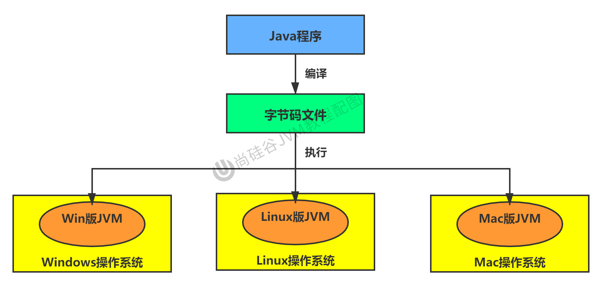
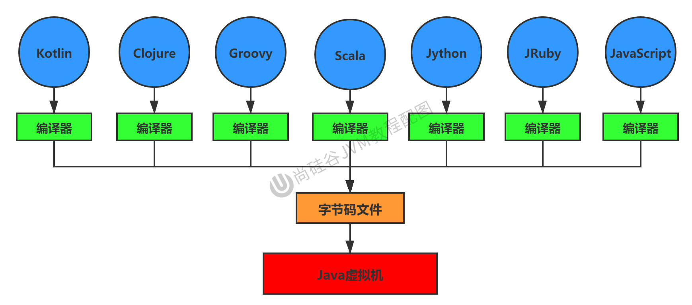
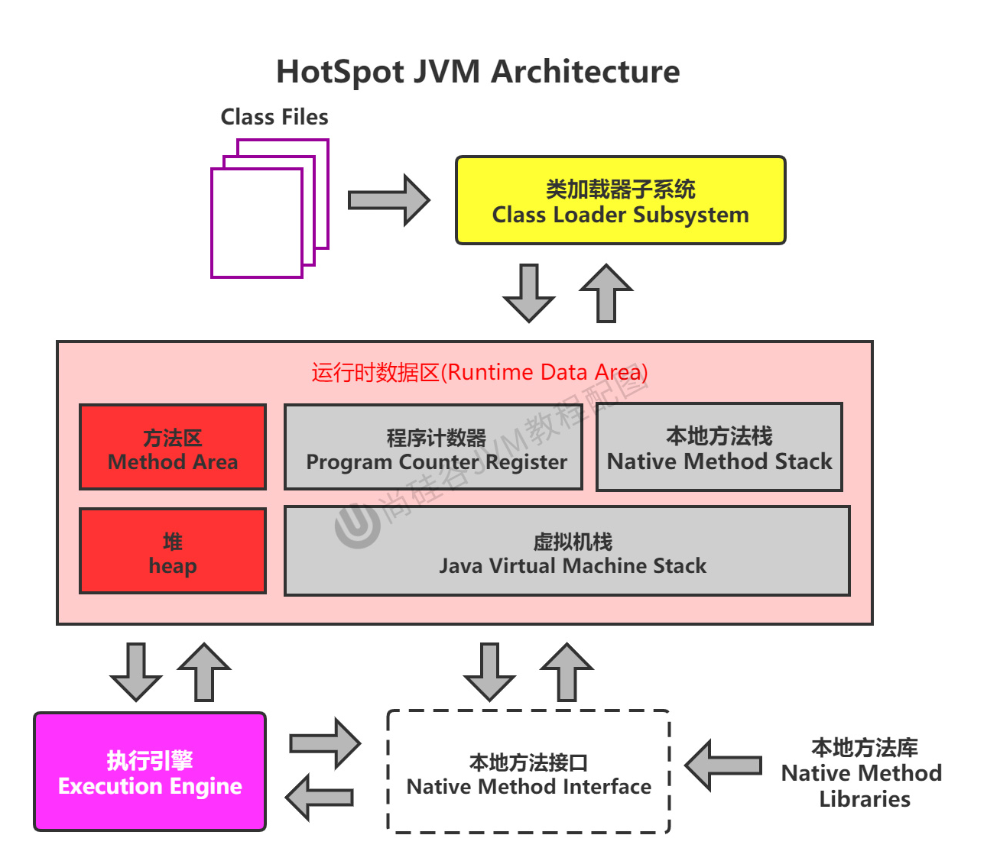
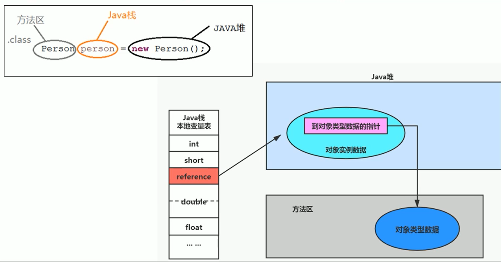
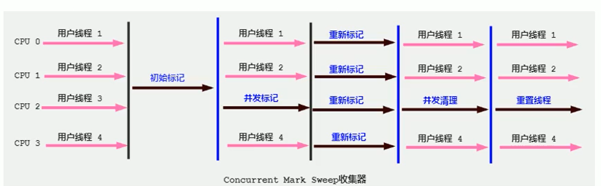
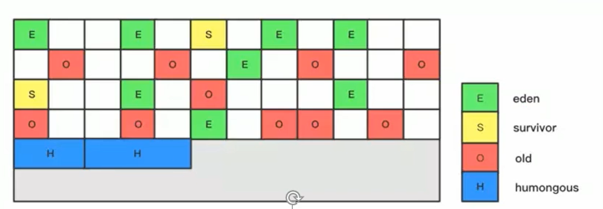

# 第01章_JVM简介

## 1. 简介

### 1.1 虚拟机

虚拟机（Virtual Machine），就是一台虚拟的计算机。它是一款软件，用来执行一系列虚拟计算机指令。虚拟机可以分为系统虚拟机和程序虚拟机：

- Virtual Box，VMware就属于系统虚拟机，它们完全是对物理计算机的仿真，提供了一个可运行完整操作系统的软件平台。
- 程序虚拟机的典型代表就是Java虚拟机，它专门为执行单个计算机程序而设计，在Java虚拟机中执行的指令我们称为Java字节码指令。

### 1.2 Java虚拟机

Java虚拟机（JVM，Java Virtual Machine）是一台执行JVM字节码的虚拟计算机。它就是二进制字节码的运行环境，负责装载字节码到其内部，解释/编译为对应平台上的机器指令执行。

JVM平台的各种语言可以共享Java虚拟机带来的跨平台性、优秀的垃圾回收器、以及可靠的即时编译器。

特点：

- 一次编译，到处运行
- 自动内存管理
- 自动垃圾回收功能

### 1.3 字节码

我们平时说的Java字节码，指的是用Java语言编译成的字节码。准确的说任何能在JVM平台上执行的字节码格式都是一样的，所以应该统称为**JVM字节码**。

不同的编译器，可以编译出相同的字节码文件，字节码文件也可以在不同的JVM上运行。



Java虚拟机根本不关心运行在其内部的程序到底是使用何种编程语言编写的，它只关心**字节码文件**。只要编程语言的编译结果满足并包含Java虚拟机的内部指令集、符号表以及其他的辅助信息，它就是一个有效的字节码文件，就能够被Java虚拟机所识别并装载运行。

> 所以，JVM与Java语言并没有必然的联系，它只与特定的二进制文件格式(class文件格式)所关联。



### 1.4 字节码文件的查看

我们可以通过安装IDEA的插件，来查看class文件


安装完成后，我们编译完程序得到class文件后，点击View即可显示我们安装的插件来查看字节码文件了


## 2. JVM结构

### 2.1 JVM的位置

JVM是运行在操作系统之上的，它与硬件没有直接的交互


### 2.2 JVM整体架构

HotSpot VM是目前市面上高性能虚拟机的代表作之一，它采用解释器与即时编译器并存的架构。



完整结构如下：


> 执行引擎包含三部分：解释器，即时编译器，垃圾回收器

### 2.3 Java代码执行流程


### 2.4 指令集架构

#### 2.4.1 两种指令集架构

基于栈的指令集架构：

- 设计和实现更简单，适用于资源受限的系统
- 不需要硬件支持，可移植性更好，更好实现跨平台
- 指令集更小，编译器容易实现，但完成一项操作所需要的指令就更多
- 指令流中的指令大部分是零地址指令，其执行过程依赖于操作栈。

基于寄存器的指令集架构：

- 典型的应用是x86的二进制指令集
- 完全依赖硬件，性能优秀，但可移植性差
- 花费更少的指令去完成一项操作
- 在大部分情况下，基于寄存器架构的指令集往往都以一地址指令、二地址指令和三地址指令为主

#### 2.4.2 两种指令集架构举例

同样执行2+3这种逻辑操作，其指令分别如下：

基于栈的计算流程：

```bash
iconst_2 //常量2入栈
istore_1
iconst_3 // 常量3入栈
istore_2
iload_1
iload_2
iadd //常量2/3出栈，执行相加
istore_0 // 结果5入栈
```

基于寄存器的计算流程：

```bash
mov eax,2 //将eax寄存器的值设为1
add eax,3 //使eax寄存器的值加3
```

#### 2.4.3 Java的指令集架构

由于跨平台性的设计，**Java的指令都是根据栈来设计的**，因为不同平台CPU架构不同，所以不能设计为基于寄存器的。优点是跨平台，指令集小，编译器容易实现，缺点是性能下降，实现同样的功能需要更多的指令。

## 3. 三大JVM

### 3.1 HotSpot

**HotSpot是默认的虚拟机**，占有绝对的市场地位，在服务器、桌面到移动端、嵌入式都有应用。名称中的HotSpot指的就是它的热点代码探测技术：

- 通过计数器找到最具编译价值代码，触发即时编译
- 通过编译器与解释器协同工作，在最优化的程序响应时间与最佳执行性能中取得平衡

### 3.2 JRockit

JRockit专注于服务端应用，它不太关注程序启动的速度，因此JRockit内部不包含解释器，全部代码都靠即时编译器编译后执行。JRockit是世界上最快的JVM。

### 3.3 J9

J9是IBM开发的虚拟机，市场定位与HotSpot接近，主要广泛应用于IBM的各种Java产品。

# 第02章_类加载器子系统

## 1. 简介

1. 类加载器子系统负责加载字节码文件（`.class`文件）。注意，类加载器只负责字节码文件的加载，至于它是否可以运行，则由执行引擎决定。
2. 加载的类信息存放于一块称为**方法区**的内存空间。除了类的信息外，方法区中还会存放**运行时常量池**等信息。


## 2. 类的加载过程

### 2.1 加载阶段

1. 通过全类名获取定义此类的二进制字节流
2. 将字节流所代表的静态存储结构转化为方法区的运行时数据结构
3. **在内存中生成一个代表这个类的`java.lang.Class`对象**，作为方法区这个类的各种数据的访问入口

> 说明：加载阶段是通过**类加载器**完成的。加载阶段与链接阶段的部分动作（如验证）是交叉进行的，也就是加载阶段尚未结束时，链接阶段可能就已经开始了。

### 2.2 链接阶段

#### 1、验证(Verify)

主要是确保Class文件的字节流中包含的信息符合Java虚拟机规范的全部约束要求。主要有以下四种验证：

- 文件格式验证（Class文件格式检查）：例如，能被JVM识别的字节码文件一定要以`CAFEBABE`开头(这个数也称为魔数)。
- 元数据验证（字节码语义检查）
- 字节码验证（程序语义检查）
- 符号引用验证（类的正确性检查）：实际上是发生在链接阶段中的解析阶段。

#### 2、准备(Prepare)

对于非final修饰的静态变量，会为其分配内存并且设置该静态变量的默认初始值，即零值(准备阶段不会对其显式初始化)。

> 注意：对于实例变量，准备阶段并不会为其分配内存和初始化，直到new对象时才会把实例变量随着对象一起分配到堆中。


#### 3、解析(Resolve)

解析就是**将常量池内的符号引用转换为直接引用的过程**，也就是得到类、字段、方法等在内存中的指针或偏移量。

- 符号引用就是以一组符号来描述所引用的目标。
- 直接引用就是直接指向目标的指针或相对偏移量。

### 2.3 初始化阶段

初始化阶段就是**执行类构造器方法`<clinit>`的过程**。

- 此方法不需定义，是javac编译器自动收集类中的所有**类变量的显式初始化**动作和**静态代码块中的语句**合并而来
- 所以当我们类中包含static变量的时候，就会有clinit方法；否则就不会有clinit方法
- **clinit方法中指令按语句在源文件中出现的顺序执行**
- 若该类具有父类，JVM会保证子类的`<clinit>`执行前，父类的`<clinit>`已经执行完毕。因为子类在被加载之前，会先保证父类已经加载完毕。
- 虚拟机调用`<clinit>`方法时会通过加锁来保证线程安全性

> **注意**：`<clinit>`称为类构造器方法，它和类的构造器并不是一个概念。类的构造器对应到字节码文件中的名称是`<init>`。


**例1**：以下代码将输出num的值为2，number的值为10

```java
public class MyTest {
    private static int num = 1;
    static {
        num = 2;
        number = 20;
    }
    private static int number = 10;
    public static void main(String[] args) {
        System.out.println(MyTest.num);
        System.out.println(MyTest.number);
    }
}
```

**原因**：在prepare阶段number被默认初始化为0，而在初始化阶段，由于源文件中的顺序是静态代码块先将number赋值为20，然后静态变量再将number显式赋值为10，所以构造器方法clinit也会按这个顺序执行，最终number的值就是10，我们可以查看字节码文件验证：


**例2**：以下代码将输出2

```java
public class MyTest {
    static class Father {
        public static int a = 1;
        static {
            a = 2;
        }
    }
    static class Son extends Father {
        public static int b = a;
    }
    public static void main(String[] args) {
        System.out.println(Son.b);
    }
}
```

## 3. 类加载器

### 3.1 简介

**类加载器**是一个负责加载类的对象，用于实现类加载过程中的**加载**这一步。每个 Java 类都有一个引用指向加载它的类加载器。注意，数组类不是通过类加载器创建的，而是由JVM直接生成的。

> 简单来说，类加载器的主要作用就是**加载Java类的字节码文件到JVM中，生成一个代表该类的Class对象**。

JVM启动时并不会一次性加载所有的类，大部分类在具体用到的时候才会去加载。**当一个类被某个类加载器加载后，这个类加载器中就会记录已经加载了这个类**。因此，对一个类加载器来说，相同二进制名称的类只会被加载一次。

JVM中内置了三个重要的类加载器：

- BootstrapClassLoader（启动类加载器）：最顶层的加载器，由C++实现，通常表示为null，并且没有父级。主要用来加载JDK核心类库，也用于加载扩展类加载器和系统类加载器。
- ExtensionClassLoader（扩展类加载器）：由`ExtClassLoader`类实现，其父级加载器是启动类加载器。主要用于加载`%JRE_HOME%/lib/ext`目录下的jar包以及被`java.ext.dirs`系统变量所指定的路径下的所有类。
- SystemClassLoader（系统类加载器）：由`AppClassLoader`类实现，也称为应用程序类加载器，其父级加载器是扩展类加载器。主要用于加载当前应用classpath下的所有类。**它是程序中默认的类加载器，一般自定义的Java类都是由它来加载**。

除了这三种类加载器之外，用户还可以加入自定义的类加载器来进行拓展，以满足自己的特殊需求。

> 注意：除了启动类加载器外，其他所有的类加载器都是由Java类实现的，均继承自抽象类`ClassLoader`。


我们在代码中获取类加载器进行测试：

```java
public class MyTest {
    public static void main(String[] args) {
        // 获取系统类加载器
        ClassLoader systemClassLoader = ClassLoader.getSystemClassLoader();
        System.out.println(systemClassLoader); // ...AppClassLoader@63947c6b

        // 获取其上层：扩展类加载器
        ClassLoader extClassLoader = systemClassLoader.getParent();
        System.out.println(extClassLoader); // ...ExtClassLoader@4eec7777

        // 获取其上层：引导类加载器
        ClassLoader bootstrapClassLoader = extClassLoader.getParent();
        System.out.println(bootstrapClassLoader); // null

        // 获取我们自己的类的类加载器(默认使用系统类加载器进行加载)
        ClassLoader classLoader = MyTest.class.getClassLoader();
        System.out.println(classLoader); // ...AppClassLoader@63947c6b

        // 获取String的类加载器(Java的核心类库中的类是由引导类加载器进行加载的)
        ClassLoader classLoader1 = String.class.getClassLoader();
        System.out.println(classLoader1); // null
    }
}
```

### 3.2 自定义类加载器

用户自定义类加载器的步骤：继承抽象类`ClassLoader`，重写其`findClass()`方法。

> 说明：ClassLoader类有两个关键方法`loadClass()`和`findClass()`。如果我们不想打破双亲委派模型，则重写`findClass()`方法即可；如果想要打破双亲委派模型，则需要重写`loadClass()`方法。

## 4. 双亲委派模型

### 4.1 工作原理

JVM对class文件采用的是**按需加载**的方式，也就是说当需要使用该类时才会将它的class文件加载到内存生成Class对象。而加载某个类的class文件时，JVM采用的是**双亲委派模型**，其工作原理为：

1. 任何一个类加载器收到类加载请求时，会首先检查该类是否已经被自己加载过，如果是的话则直接返回
2. 当类加载器要进行类加载时，它首先不会自己去尝试加载这个类，而是把这个请求委托给其父级加载器去处理
3. 以此类推，请求最终将到达顶层的启动类加载器
4. 如果父级加载器可以完成类加载的任务，就成功加载并返回；否则，就将请求交还给子加载器去处理。


### 4.2 双亲委派模型举例

假如我们在当前包下创建一个java.lang包，并自定义一个名为String类，则当我们在程序中使用java.lang.String时，实际上使用的仍是Java核心类库中的String类，而并不是我们自己定义的String类，这正是因为双亲委派模型：

- 当我们在程序中使用java.lang.String时，系统类加载器就会收到加载请求，根据双亲委派模型，会将请求委托给扩展类加载器，然后扩展类加载器又进一步将请求委托给启动类加载器
- 此时，由于启动类加载器能够加载核心类库，所以它能够加载java.lang.String，于是直接完成类加载任务
- 因此，最终加载的类仍是Java核心类库中的String类

### 4.3 双亲委派模型的好处

1. 避免类的重复加载
2. 保护程序安全，防止核心API被随意篡改（如上所示，自定义的类java.lang.String永远不会被加载）

> 说明：如果**两个Java类的全类名相同，并且其类加载器也相同**，JVM才会认为这两个类是相同的。


# 第03章_运行时数据区概述

## 1. 概述


- **堆、方法区是多个线程共享的**，即一个进程(对应一个JVM)只有一份，它们随着虚拟机的启动而创建，随着虚拟机的退出而销毁。
- **程序计数器、本地方法栈、虚拟机栈是每个线程私有的**，它们随着线程的开始而创建，随着线程的结束而销毁。

> 注意：每个JVM只有一个`java.lang.Runtime`实例，即运行时环境，相当于内存结构中的运行时数据区。

| 运行时数据区 | 是否会发生OOM | 是否会发生GC |
| ------------| -----------| ---------- |
| 程序计数器   | 否         | 否         |
| 虚拟机栈     | 是         | 否         |
| 本地方法栈   | 是         | 否         |
| 方法区       | 是         | 是         |
| 堆          | 是         | 是         |

## 2. 线程

在HotSpot JVM中允许多线程，且每个线程都与操作系统的内核线程直接映射。JVM运行后，除了main线程和main线程自己创建的线程外，还会有很多后台线程，如：

- 虚拟机线程：这种线程的操作是需要JVM达到安全点才会出现，执行类型包括"stop the world"的垃圾收集，线程栈收集，线程挂起以及偏向锁撤销。
- 周期任务线程：这种线程是时间周期事件的体现（比如中断），它们一般用于周期性操作的调度执行。
- GC线程：这种线程对在JVM里不同种类的垃圾收集行为提供了支持。
- 编译线程：这种线程在运行时会将字节码编译成机器码。
- 信号调度线程：这种线程接收信号并发送给JVM，在它内部通过调用适当的方法进行处理。

# 第04章_程序计数器

JVM中的程序计数器（Program Counter Register），其Register的命名源于CPU的寄存器。但它并非是广义上所指的物理寄存器，JVM中的PC寄存器是对CPU中的PC寄存器的一种**抽象模拟**。

JVM中的程序计数器是一块较小的内存空间，它是线程私有的。在JVM执行指令的过程中，程序计数器中**保存当前指令的地址**；当该指令执行完毕后，程序计数器会自动加1或者跳转到其他指令的地址，即**保存下一条指令的地址**。注意，如果当前正在执行的是native方法，则程序计数器中保存的是未定义值undefined。

因此，程序计数器的核心功能是：

- 执行引擎通过改变程序计数器来依次读取指令，从而实现代码的流程控制。
- 在多线程的情况下，当线程被切换回来时，就能通过程序计数器知道该线程上次运行到哪了。

> 注意：程序计数器是唯一一个不会出现`OutOfMemoryError`的内存区域。


# 第05章_虚拟机栈

## 1. 虚拟机栈概述

### 1.1 概述

Java虚拟机栈（Java Virtual Machine Stack）也是线程私有的，其内部保存一个个的栈帧（Stack Frame），对应着一次次的Java方法调用。栈的访问速度仅次于程序计数器，JVM直接对Java栈的操作只有两个：方法开始执行时入栈，方法执行结束后出栈。

Java虚拟机栈的大小可以是固定不变的，也可以是允许动态扩展的：

- 如果使用固定大小的栈，那么当线程请求栈的深度超过当前栈的最大深度时，会抛出**StackOverflowError**。
- 如果使用允许动态扩展的栈，那么当虚拟机在动态扩展栈时如果无法申请到足够的内存空间，会抛出**OutOfMemoryError**。

> 说明：HotSpot虚拟机的栈是**不允许动态扩容**的，所以会发生StackOverflowError。当然也同样可能发生OutOfMemoryError，因为栈是线程私有的，如果新创建一个线程却无法申请足够的栈空间，就发生了OOM。

### 1.2 栈帧

栈中保存的是一个个**栈帧**，该线程上**正在执行的每个方法都各自对应一个栈帧**。在一条线程中，一个时间点上只会有一个活跃的栈帧。即只有当前正在执行的方法的栈帧（栈顶栈帧）是有效的，这个栈帧被称为当前栈帧（Current Frame），与当前栈帧相对应的方法就是当前方法（Current Method），定义这个方法的类就是当前类（Current Class）。

### 1.3 栈的运行原理

执行引擎运行的所有字节码指令**只针对当前栈帧进行操作**。如果在该方法中调用了其他方法，对应的新的栈帧会被创建出来，放在栈的顶端，成为新的当前栈帧。

如果当前方法A调用了另一个方法B，则当方法B返回时，对应的当前栈帧会传回此方法的执行结果给前一个栈帧，接着虚拟机就会丢弃当前栈帧，使得前一个栈帧重新成为当前栈帧。

Java方法有两种方法返回的方式，一种是正常的方法返回，即使用return指令；另外一种是抛出异常。不管使用哪种方式，都会导致栈帧被弹出。

### 1.4 栈帧的内部结构

每个栈帧中存储着：

- 局部变量表（Local Variables）
- 操作数栈（Operand Stack）
- 动态链接（Dynamic Linking）
- 方法返回地址（Return Address）
- 一些附加信息

> 栈帧的大小主要由**局部变量表**和**操作数栈**决定。动态链接、方法返回地址、一些附加信息通常也合称为**帧数据区**。

## 2. 局部变量表

### 2.1 简介

局部变量表是一个**数字数组**，**主要用于存储方法参数和定义在方法体内的局部变量**。由于局部变量表是建立在线程的栈上，是线程私有的数据，因此**不存在数据安全问题**。

局部变量表中的变量与GC密切相关，只要被**局部变量表中直接或间接引用的对象都不会被回收**。

> 局部变量表所需的容量大小是**在编译期确定下来的，在方法运行期间是不会改变局部变量表的大小的**。

### 2.2 Slot

局部变量表，最基本的存储单元是Slot（变量槽），参数值都是存放在Slot中，起始索引为0。局部变量表中存放编译期可知的各种基本数据类型（8种）、对象引用类型（reference类型）的变量。其中，32位及以内的类型只占用一个slot，64位的类型（long和double）占用两个slot。

> byte、short、char在存储前被转换为int。boolean也被转换为int，0表示false，非0表示true。
> 

JVM会为局部变量表中的每一个Slot都分配一个访问索引，通过这个索引即可访问到局部变量表中指定的局部变量值。当一个方法被调用的时候，它的方法参数和方法体内部定义的局部变量将会按照**声明的顺序**被复制到局部变量表中的Slot上。

**注意**：如果当前帧是由构造器或者实例方法创建的，那么**该对象引用this将会存放在index为0的slot处**，其余的参数按照参数表顺序继续排列。

举例：

```java
public void test01(Date date, String name) {
    double weight = 110;
    char gender = '男';
}
```


> 如图，double类型的变量占有2个槽位

**Slot的重复利用**

栈帧中的局部变量表中的槽位是可以重用的，如果一个局部变量过了其作用域，那么在其作用域之后声明的新的局部变量就很有可能会复用过期局部变量的槽位，从而达到节省资源的目的。

举例：

```java
public void test02() {
    int a = 0;
    {
        int b = 0;
        a += b;
    }
    int c = 0;
}
```


## 3. 操作数栈

操作数栈，主要用于**保存计算过程的中间结果**。在方法执行过程中，会根据字节码指令往**操作数栈**中写入数据或提取数据，即入栈和出栈。

**注意**：如果调用了一个有返回值的方法，那么获取到它的返回值后，**这个返回值会被压入当前栈帧的操作数栈中**。

> 我们说Java虚拟机的**执行引擎是基于栈的执行引擎**，其中的栈指的就是**操作数栈**。

**栈顶缓存技术**：由于操作数是存储在内存中的，因此频繁地执行内存读/写操作必然会影响执行速度。为了解决这个问题，HotSpot JVM的设计者们提出了栈顶缓存技术（ToS，Top-of-Stack Cashing），将栈顶元素全部**缓存在物理CPU的寄存器中**，以此降低对内存的读/写次数，提升执行引擎的效率。

## 4. 动态链接

动态链接，也称为指向运行时常量池的方法引用，它指向了方法区中**运行时常量池**中的`method references`。其核心作用是服务一个方法需要调用其他方法的场景。

一个类的字节码文件的**常量池**中保存有大量的**符号引用**，包括变量、方法的符号引用等。而当这个类的字节码文件加载到方法区后，就对应会维护一个**运行时常量池**，在运行期就能够将方法的符号地址解析为真实地址，所以在运行时常量池中保存的不再是方法的符号引用，而是**方法的直接引用**。

如果当前方法要调用其他方法，就可以通过动态链接找到运行时常量池中对应方法的直接引用，然后进行调用。


## 5. 方法返回地址

方法返回地址，用于存放**当初调用该方法时的PC寄存器的值**。

当方法退出并弹出栈帧时，需要返回到该方法被调用的位置：

- 如果方法正常退出，**返回地址就是当初调用该方法时的PC寄存器的值**，它保存在栈帧中的方法返回地址里
- 如果方法异常退出，**返回地址是要通过异常表来确定**，栈帧中一般不会保存这部分信息

## 6. 方法重写的原理

在JVM中，将符号引用转换为调用方法的直接引用与方法的绑定机制相关。

### 6.1 早期绑定与晚期绑定

当一个字节码文件被装载进JVM内部时，如果被调用的**目标方法在编译期可知，且运行期保持不变**时，这种情况下将调用方法的符号引用转换为直接引用的过程称之为**静态链接**，也称为**早期绑定**。

如果**被调用的方法在编译期无法被确定下来**，也就是说，只能够在程序运行期将调用的方法的符号引用转换为直接引用，由于这种引用转换过程具备动态性，因此被称之为**动态链接**，也称为**晚期绑定**。

### 6.2 虚方法和非虚方法

如果方法在编译期就确定了具体的调用版本，且这个版本在运行时是不可变的，这样的方法称为**非虚方法**。

Java中任何一个普通的方法其实都具备**虚方法**的特征，它们相当于C++语言中的虚函数（C++中则需要使用关键字virtual来显式定义）。

> **静态方法、私有方法、final方法、实例构造器、父类方法都是非虚方法。其他方法都是虚方法**。

### 6.3 方法重写的底层原理

1. 当我们调用一个对象的虚方法时，会首先确定该对象的实际类型（运行时类型）
2. 然后根据这个运行时类型，去运行时常量池中得到该方法的直接引用：如果有该方法，则调用；否则就按照继承关系从下往上找父类中是否有该方法。

> 注意：为了提高查找方法的效率，实际上每个类中都保存一张虚方法表，表中存放着各个虚方法的实际入口（这样就无需自下至上逐个查找父类了）。


# 第06章_本地方法栈

## 1. 本地方法接口

一个native method是这样一个Java方法：**该方法的实现由非Java语言实现**，比如C。在定义一个native method时，并不提供实现体，因为其实现体是由非java语言在外面实现的，所以也称之为本地方法接口（JNI，Java Native Interface）。

> 注意：标识符native可以与其它java标识符连用，但是abstract除外

**本地方法存在的意义**：

- 有时Java应用需要与Java外面的环境（例如底层操作系统）交互，这是本地方法存在的主要原因
- JVM的一些部分就是用C写的，通过本地方法就可以像C一样与外部交互，性能更高

> 目前我们自定义使用native method的情况越来越少了，除非是与硬件有关的应用。

## 2. 本地方法栈

Java虚拟机栈用于管理Java方法的调用，而**本地方法栈用于管理本地方法的调用**。本地方法栈的结构与Java虚拟机栈的结构极为相似。如果要调用native method，就会在本地方法栈中压入栈帧。

当某个线程调用一个本地方法时，它就进入了一个全新的并且不再受虚拟机限制的世界，它和虚拟机拥有同样的权限：

- 本地方法可以通过本地方法接口来访问虚拟机内部的运行时数据区
- 本地方法可以直接使用本地处理器中的寄存器
- 本地方法可以直接从本地内存的堆中分配任意数量的内存

# 第07章_堆

## 1. 概述

### 1.1 堆

一个JVM实例只存在一个堆内存，堆也是Java内存管理的核心区域，它在JVM启动的时候即被创建，是JVM管理的最大一块内存空间。

> 说明：所有的线程共享Java堆，但在堆中也存在一部分线程私有的缓冲区，称之为TLAB(Thread Local Allocation Buffer)。

几乎所有的对象实例以及数组都在运行时分配在堆上，而在栈帧中保存引用，这个引用指向对象或数组在堆中的位置。

> 说明：在少部分情况下，一些对象可能会被分配在栈上，而不是堆上。

**注意**：在方法结束弹出栈帧后，堆中的对象不会马上被移除，而是会在垃圾收集的时候再判断是否移除。堆是GC执行垃圾回收的重点区域。

由于现在的垃圾收集器基本都采用分代垃圾收集算法，所以堆可以细分为以下两部分：

1. 新生代（新生区、年轻代）
2. 老年代（老年区、养老区）

其中，新生代可以进一步细分为：Eden区、Survivor0区、Survivor1区。

### 1.2 设置堆空间大小

堆的大小在JVM启动时就已经设定好了，可以通过选项`-Xms`和`-Xmx`来进行设置

- `-Xms`用于表示堆区的起始内存
- `-Xmx`则用于表示堆区的最大内存

一旦堆区中的内存大小超过`-Xmx`所指定的最大内存时，将会抛出OutOfMemoryError。

> 注意：通常建议将-Xms和-Xmx两个参数配置相同的值

默认情况下：

- 初始内存大小是电脑物理内存大小/64
- 最大内存大小是电脑物理内存大小/4

### 1.3 新生代与老年代

存储在JVM中的Java对象可以被划分为两类：

- 一类是生命周期较短的瞬时对象，这类对象的创建和消亡都非常迅速。这类对象通常会被放入新生代。
- 另外一类对象的生命周期非常长。这类对象通常会被放入老年代。

几乎所有的Java对象都是在Eden区被创建出来的（有些大的对象在Eden区无法存储的时候，将直接进入老年代）。绝大部分Java对象的销毁都在新生代进行了。

> 默认情况下，新生代与老年代的大小比例是1:2，而新生代中Eden与Survivor0、Survivor1的大小比例是8:1:1

## 2. 对象分配原则

### 2.1 基本原则

为新对象分配内存的基本流程如下：


1. new的对象一般都先存放在Eden区
2. 如果Eden区满了后再创建对象，就会触发Minor GC，将**新生代**(包括Eden区和Survivor区)中的垃圾进行回收。然后将**新生代**中剩余的存活对象都放到空的那个Survivor区(一般称之为Survivor To区)，并让这些对象的年龄计数器加1。而新创建的对象会被继续放到Eden区。
3. 当对象的年龄计数器达到阈值15时，再次加1就会触发Promotion晋升，即将其从新生代转移存放到老年代中。
4. 当老年代空间不足时，将触发Full GC。如果执行了Full GC之后，发现依然无法进行对象的保存，就会产生OOM。

**注意**：在Eden区满了的时候，才会触发Minor GC；而幸存者区满了后，不会触发Minor GC，而是直接提前晋升到老年代。

**所有可能的特殊情况**：


> 总结：
> - s0和s1区会频繁地发生复制和交换，其中空的那个区称为to区，另一个称为from区
> - 垃圾回收频繁发生在新生区，很少发生在老年代，几乎不发生在方法区

### 2.2 GC的分类

HotSpot里的GC按照回收区域分为两大类：部分收集、整堆收集。

**部分收集(Partial GC)**：并不收集整个堆和方法区。又分为：

- 新生代收集（Minor GC/Young GC）：只收集新生代
- 老年代收集（Old GC）：只收集老年代（只有CMS有这个模式）
- 混合收集（Mixed GC）：收集整个新生代以及部分老年代（只有G1有这个模式）

**整堆收集(Full GC)**：收集整个Java堆和方法区。

> 注意：我们常说的Major GC实际上等价于Full GC。但由于历史悠久的原因，有人也往往把Major GC等同于Old GC，所以在实际中一定要问清楚别人说的Major GC到底指的是哪一个。

### 2.3 堆空间分代思想

分代的唯一理由就是**优化GC性能**。如果没有分代，GC的时候就必须扫描整个堆。而事实上很多对象都是`朝生夕死`的，我们将其存放在新生代，在GC的时候就无需扫描老年代，提高了性能；而且根据朝生夕死的特点，每次对新生代的回收也能腾出很大的空间来。

以Serial GC为例，它的分代GC策略的触发条件为：

- Minor GC：当Eden区满时触发。因为Java对象大多都具备**朝生夕死**的特性，所以Minor GC非常频繁，一般回收速度也比较快。
- Full GC：当准备要触发一次Minor GC时，会先检查是否满足**空间分配担保**，如果不满足，则不会触发Minor GC，而是转为触发Full GC。除此之外，当老年代空间不足，或者方法区空间不足时，也会触发Full GC。

> Full GC是开发或调优中尽量要避免的，因为其STW时间很长

### 2.4 其他优化原则

#### 1、大对象直接进入老年代

大对象就是需要大量连续内存空间的对象，大对象直接进入老年代是一种优化策略，是由虚拟机动态决定的。

#### 2、动态年龄判断

对Survivor区中的对象，会按照年龄从小到大累积计算所占用的总空间，如果累积到某个年龄时，所占用总空间已经超过了Survivor区的一半，那么就取这个年龄作为新的晋升年龄阈值。

#### 3、空间分配担保

空间分配担保是为了尽量确保在Minor GC之前老年代本身还有足够的空间。在发生Minor GC之前，虚拟机会检查**老年代最大可用的连续空间是否大于新生代所有对象占用的总空间或者历次晋升到老年代的对象的平均大小**。如果大于，则会认为这次Minor GC大概率是安全的，就会进行Minor GC；否则，就不会触发Minor GC，而是转为触发Full GC。

## 3. 逃逸分析

### 3.1 逃逸分析

问题：堆是分配对象存储的唯一选择吗？

随着JIT编译器和**逃逸分析**技术逐渐成熟，标量替换等优化技术将会导致一些微妙的变化，所以对象未必是全分配在堆上的。如果经过逃逸分析（Escape Analysis）后发现，一个对象并**没有逃逸出方法**的话，那么就可能被优化成栈上分配或者标量替换。这样就无需在堆上分配内存，也无须进行垃圾回收了。

逃逸分析的基本行为就是**分析对象动态作用域**：

- 当一个对象在方法中被定义后，对象只在方法内部使用，则认为没有发生逃逸。
- 当一个对象在方法中被定义后，它被外部方法所引用，则认为发生逃逸。

> 常见的发生逃逸的情况：给成员变量赋值、作为方法返回值、实例引用传递等。

**举例**：以下代码中sb发生了逃逸

```java
public static StringBuffer createStringBuffer(String s1, String s2) {
    StringBuffer sb = new StringBuffer();
    sb.append(s1);
    sb.append(s2);
    return sb;
}
```

如果想要sb不发生逃逸，可以修改为

```java
public static String createStringBuffer(String s1, String s2) {
    StringBuffer sb = new StringBuffer();
    sb.append(s1);
    sb.append(s2);
    return sb.toString();
}
```

> 注意：JDK 1.7之后，HotSpot就默认开启了逃逸分析。因此，在开发中如果我们能使用局部变量，就尽量不要在方法外定义。

基于逃逸分析，JIT编译器可以对代码做如下优化：

- 栈上分配（HotSpot虚拟机不支持）
- 同步省略
- 标量替换

### 3.2 栈上分配

编译器根据逃逸分析的结果，发现如果一个对象并没有逃逸出方法的话，就可能被优化成栈上分配。这样就无需在堆上分配内存，也无须进行垃圾回收了。

**注意**：HotSpot虚拟机**不支持栈上分配**，即不会直接把对象存储在栈上。对于没有逃逸的对象，HotSpot会采用**标量替换**，然后再存储在栈上。

### 3.3 同步省略

在动态编译同步块的时候，JIT编译器可以借助逃逸分析来判断同步块所使用的锁对象是否只能够被一个线程访问而没有被发布到其他线程。如果是的话，那么JIT编译器在编译这个同步块的时候就会取消对这部分代码的同步，这样就能大大提高性能。这个取消同步的过程就叫**同步省略**，也叫**锁消除**。

例如下面的代码

```java
public void f() {
    Object hellis = new Object();
    synchronized (hellis) {
        System.out.println(hellis);
    }
}
```

代码中对hellis这个对象加锁，但是hellis对象的生命周期只在`f()`方法中，并不会被其他线程所访问到，所以在JIT编译阶段就会被优化掉，优化成：

```java
public void f() {
    Object hellis = new Object();
	System.out.println(hellis);
}
```

### 3.4 标量替换

**标量**（Scalar）是指一个无法再分解成更小数据的数据，Java中的基本数据类型就是标量。相对地，那些还可以分解的数据叫做**聚合量**（Aggregate），Java中的对象就是聚合量。

在JIT编译阶段，如果经过逃逸分析，发现一个对象不会被外界访问的话，那么经过JIT优化，就会把这个对象拆解成若干个它的成员变量来代替，这个过程就是**标量替换**。然后就可以将这些标量保存在栈中。

## 4. 对象的实例化

### 4.1 创建对象的过程

#### 1、类加载检查

虚拟机遇到一条new指令时，首先将去检查这个指令的参数是否能在运行时常量池中定位到这个类，并检查这个类是否已被加载过。如果没有，那必须先执行相应的类加载过程。

#### 2、分配内存

对象所需的内存大小在类加载完成后便可确定，为对象分配空间的任务等同于把一块确定大小的内存从 Java 堆中划分出来。内存分配的方式有**指针碰撞**和**空闲列表**：

- 如果Java堆**规整**（也就是使用了具有**压缩整理**功能的GC），则采用**指针碰撞**分配内存。就是把所有用过的内存整合到一边，空闲的内存放在另一边，中间有一个分界指针，分配内存时只需要向着没用过的内存方向将该指针移动对象内存大小位置即可。
- 如果Java堆**不规整**，则采用**空闲列表**分配内存。虚拟机会维护一个列表，记录哪些内存块是可用的，在分配的时候从列表中找到一块足够大的空间划分给对象实例，并更新列表上的内容。

虚拟机会保证**分配内存的线程安全性**，主要是采用了以下两种措施：

1. **TLAB分配**：JVM优先在TLAB中给对象分配内存，因为这种方式的效率更高。如果TLAB内存已耗尽，则采用下面的CAS方式。
2. **CAS+失败重试**：采用CAS对内存分配的动作做同步处理，配合失败重试的方式保证更新操作的线程安全性。

> TLAB（Thread Local Allocation Buffer）包含在Eden区之内，它是**为每个线程单独分配的一小块缓冲区**，一般仅占用整个Eden空间的百分之一。
>
> TLAB的主要作用是为了保证创建对象时**内存分配的线程安全性**。注意，我们通常说TLAB是线程私有的，但实际上仅仅是在**内存分配**这个操作上它是线程私有的，而其他的读、写、垃圾回收等操作上TLAB仍然是线程共享的。

#### 3、初始化零值

内存分配完成后，虚拟机会将分配到的内存空间（不包括对象头）都初始化为零值，从而可以保证对象的实例变量在不赋值的情况下可以直接使用。

#### 4、设置对象头

将对象所属类的元数据信息指针、对象的HashCode、对象的GC分代年龄、锁信息等数据存储在对象头中。

#### 5、执行init方法

执行`<init>`方法，`<init>`方法中进行初始化的顺序为：

1. 首先是属性的**显式初始化**和**代码块中的初始化**：这两个初始化属于同一级别，按声明的顺序依次执行
2. 然后执行**构造器中的初始化**

### 4.2 对象内存布局


对象在内存中的布局可以分为以下三部分：

#### 1、对象头(Header)

非数组对象的对象头包含两部分，分别是**标记字**(Mark Word)和**类型指针**(Class Pointer)。

数组对象的对象头包含三部分，分别是**标记字**、**类型指针**和**数组长度**(Length)。

**类型指针**：指向方法区中存放的类元数据，用于确定该对象所属的类型。

> 说明：在64位系统中，标记字占8个字节，类型指针占4个字节（实际上类型指针原本占8字节，但**默认开启了压缩指针**，使得它只占用4字节）

**标记字**包括：

- `hash`：对象的哈希值
- `age`：对象的分代年龄
- `lock`：锁状态标识位
- `biased_lock`：偏向锁标识位
- `JavaThread`：持有偏向锁的线程ID
- `epoch`：偏向时间戳


> 注1：标记字会根据对象的状态复用自己的存储空间，也就是说在运行期间Mark Word里存储的数据会随着锁标志位的变化而变化。
>
> 注2：由上图可见，对象的分代年龄占4比特，所以范围只能是0到15，所以一旦对象年龄超过15就进入老年代。

#### 2、实例数据(Instance Data)

它是对象真正存储的有效信息，包括定义的各种类型的属性(包括从父类继承下来的和本身拥有的属性)。

#### 3、对齐填充(Padding)

仅仅起到占位符的作用，保证对象大小是8个字节的倍数，因为虚拟机要求对象起始地址必须是8字节的整数倍。

例题：下面两个对象在堆空间中分别占用多大内存？

```java
class User {
    private int age;
    private boolean married;
}
public class ObjectTest {
    public static void main(String[] args) {
        Object o = new Object(); // 16字节
        User user = new User();  // 24字节
    }
}
```

解释：

- Object对象：标记字8B+类型指针4B+实例数据0B+对齐填充4B，等于16字节
- User对象：标记字8B+类型指针4B+实例数据5B(int占4字节，boolean占1字节)+对齐填充7B，等于24字节

### 4.3 对象的访问定位

通过对象引用可以访问到其指向的对象实例，对象访问定位方式有以下两种，HotSpot采用的方式是**直接指针**。

#### 1、句柄


如果使用句柄的方式，就会在堆中开辟一块空间作为句柄池，句柄池中保存到对象实例数据的指针和到对象类型数据的指针，真实的对象实例存储在实例池中。而栈帧中的局部变量表中只存储**对象的句柄地址**。

**优点**：reference中存储稳定句柄地址，对象被移动（垃圾收集时移动对象很普遍）时只会改变句柄中实例数据指针，reference本身不需要被修改。

#### 2、直接指针


如果使用直接指针的方式，那么局部变量表中的引用就直接指向堆中的实例，在对象实例的对象头中有类型指针，它指向的是方法区中的对象类型数据。

**优点**：节省空间，也节省时间（比句柄方式少了一次指针定位的时间开销）


# 第08章_方法区

## 1. 概述

**栈、堆、方法区的交互关系**：



方法区属于JVM运行时数据区域的一块逻辑区域，是各个线程共享的内存区域。当虚拟机要使用一个类时，它需要读取并解析Class文件获取相关信息，再将信息存入到方法区。

方法区是Java虚拟机规范中规定的名称，而永久代和元空间是对方法区的具体落地实现。

- 在jdk7及以前，使用**永久代**来实现方法区，它占用的是**虚拟机中的内存**
- jdk8开始，使用**元空间**来实现方法区，它不再使用虚拟机中的内存，而是**直接使用本地的物理内存**

使用元空间取代永久代的**主要原因**是：

1. 使用永久代需要设置其大小，如果加载的类过多，很容易导致OOM；而元空间直接使用本地物理内存，能够提供更大的空间。
2. 元空间直接使用更大的本地物理内存，就会大大降低Full GC的频率，提升性能。

## 2. 方法区的内部结构

方法区用于存储已被虚拟机加载的**类型信息、字段信息、方法信息、静态变量、运行时常量池、JIT代码缓存**等。

> 注意：以上是经典的方法区内部结构，但从JDK7开始，**静态变量**和**字符串常量池**，被存储在堆空间中，而不是方法区。

### 2.1 类型信息

对每个加载的类型（类、接口、枚举、注解），JVM必须在方法区中存储以下类型信息：

- 这个类型的完整有效名称（`全类名=包名.类名`）
- 这个类型直接父类的完整有效名（对于interface或是`java.lang.Object`，都没有父类）
- 这个类型的修饰符（public，abstract，final）
- 这个类型实现的直接接口的一个有序列表

### 2.2 字段信息

JVM必须在方法区中保存类型的所有字段的相关信息以及字段的声明顺序。字段的相关信息包括：字段名称、字段类型、字段修饰符。

### 2.3 方法信息

JVM必须保存类型的所有方法的声明顺序以及以下信息：

- 方法名称
- 方法的返回类型（或void）
- 方法参数的数量和类型（按顺序）
- 方法的修饰符
- 方法的字节码、操作数栈、局部变量表及大小（abstract和native方法除外）
- 异常表（abstract和native方法除外）：每个异常处理的开始位置、结束位置、代码处理在程序计数器中的偏移地址、被捕获的异常类的常量池索引

### 2.4 静态变量

静态变量指的是被static修饰，但不被final修饰的成员变量(如果还被final修饰，则称为常量)。静态变量和类关联在一起，随着类的加载而加载。静态变量被类的所有实例共享，**即使没有类实例时，也可以访问它**。

**注意**：没有final修饰的静态变量，在编译成字节码文件时还没有初始化；而有final修饰的全局常量，在编译成字节码文件时它就已经被赋值了，常量保存在常量池中。

### 2.5 运行时常量池

在字节码文件中有一部分称为**常量池**，这部分内容将在类加载后存放到方法区的**运行时常量池**中。

#### 1、常量池

一个有效的字节码文件中除了包含类的版本信息、字段、方法以及接口等描述符信息外，还包含一项信息就是常量池表（Constant Pool Table），它用于存放**各种字面量和对类型、域、方法的符号引用**。

常量池，可以看做是一张表，虚拟机指令根据这张常量表找到要执行的类名、方法名、属性名、字面量等。因为一个程序中要用到的类和方法都很多，所以使用常量池可以**大大节省空间**。

#### 2、运行时常量池

运行时常量池（Runtime Constant Pool）是方法区的一部分。**JVM为每个已加载的类型都维护一个运行时常量池**，池中的数据项像数组项一样，是通过索引访问的。

运行时常量池中包含多种不同的常量，包括编译期就已经明确的数值字面量，也包括到运行期解析后才能够获得的方法或者字段引用，此时不再是常量池中的符号地址了，而是替换为真实地址。

所以，运行时常量池相对于Class文件常量池的重要特征是：具备**动态性**。

## 3. 方法区的演进细节

> 首先明确：只有HotSpot虚拟机曾经有永久代的概念。而JRockit、J9都是不存在永久代的概念的。

HotSpot中方法区的变化：

- JDK6及之前：方法区使用永久代实现，且静态变量、字符串常量池都存储在永久代中
- JDK7：方法区使用永久代实现，但静态变量、字符串常量池被保存在堆中
- JDK8及之后：**方法区使用元空间实现，静态变量、字符串常量池被保存在堆中**


**字符串常量池调整到堆中**：主要原因是实际开发中会有大量的字符串被创建，如果放在方法区，则**需要等Full GC时才能被回收、效率很低**；而放在堆空间中，垃圾回收的频率很高，就能及时回收内存。

**静态变量调整到堆中**：注意，如果是引用数据类型的静态变量，其引用的对象实体，不管哪个jdk版本都始终存放在堆空间中。我们这里所说的静态变量被调整存储到堆中，指的是该静态变量**自身**，而并不是指它所引用的对象实体。

## 4. 方法区的垃圾回收

一般来说方法区的回收效果比较难令人满意，尤其是**类型的卸载，条件相当苛刻**。但是这部分区域的回收有时又确实是必要的。方法区的垃圾收集主要回收两部分内容：**运行时常量池中废弃的常量**和**不再使用的类型**。

HotSpot虚拟机对运行时常量池的回收策略是很明确的：只要其中的常量没有被任何地方引用，就可以被回收。所以废弃常量的回收相对比较简单。

而要判定一个类型属于不再被使用的类型就比较苛刻了，需要同时满足下面三个条件：

- 该类所有的实例都已经被回收，也就是Java堆中不存在该类及其任何派生子类的实例。
- 加载该类的类加载器已经被回收，这个条件除非是经过精心设计的可替换类加载器的场景，如JSP的重加载，否则通常是很难达成的。
- 该类对应的Class对象没有在任何地方被引用，且无法在任何地方通过反射访问该类的方法。

满足这三个条件，也仅仅是允许Java虚拟机将其回收，但不是必然会回收。

# 第09章_直接内存

直接内存是一种特殊的内存缓冲区，它是通过本地方法的方式在**本地内存**上分配的。直接内存并不是虚拟机运行时数据区的一部分，也不是虚拟机规范中定义的内存区域。注意，**元空间**和**直接内存**都是在本地物理内存上分配的。


Java的NIO库，引入了一种基于通道（Channel）与缓冲区的IO方式，它可以直接使用Native函数库分配直接内存，然后通过一个存储在Java堆中的DirectByteBuffer对象作为这块内存的引用进行操作。这样就能在一些场景中显著提高性能，因为访问直接内存的速度通常优于Java堆。

注意，直接内存的大小可以通过MaxDirectMemorySize设置，如果不指定，默认与堆的最大值`-Xmx`参数值一致，所以也可能导致OOM。

# 第10章_执行引擎

## 1. 概述

### 1.1 执行引擎

执行引擎（Execution Engine）是Java虚拟机核心的组成部分之一，执行引擎中包括**解释器、即时编译器、垃圾收集器**。本章我们主要介绍执行引擎中解释器和即时编译器的作用。

虚拟机是一个相对于物理机的概念，这两种机器都有代码执行能力，其区别是物理机的执行引擎是直接建立在处理器、缓存、指令集和操作系统层面上的，而**虚拟机的执行引擎则是由软件自行实现的**，因此可以不受物理条件制约地定制指令集与执行引擎的结构体系，**能够执行那些不被硬件直接支持的指令集格式**。

当JVM将字节码装载到其内部后，字节码并不能够直接运行在操作系统之上，因为字节码指令并非等价于本地机器指令，它内部包含的仅仅只是一些**能够被JVM所识别**的指令、符号表、以及其他辅助信息。所以，执行引擎的任务就是**将字节码指令解释/编译为对应平台上的本地机器指令**。

**执行引擎的工作流程**：

- 根据PC寄存器中的指令地址，执行引擎在执行的过程中就可以找到需要执行的字节码指令。
- 每当执行一条指令后，PC寄存器中就会更新下一条需要被执行的指令地址。
- 方法在执行的过程中，执行引擎也会通过存储在局部变量表中的对象引用准确定位到存储在Java堆区中的对象实例信息，以及通过对象头中的类型指针定位到目标对象的类型信息。

### 1.2 解释器和JIT编译器

Java源代码由Java源码编译器进行编译得到字节码文件(这一过程也称为**前端编译**)，字节码文件加载到JVM后，由JVM执行引擎来执行：主要有解释器和即时编译器两种方式。


**解释器**(Interpreter)：当Java虚拟机启动时会根据预定义的规范对字节码采用**逐行解释的方式执行**，也就是将字节码文件中的内容逐行翻译为对应平台的本地机器指令逐行执行。

**JIT编译器**(Just In Time Compiler)：虚拟机将字节码直接编译成和本地机器平台相关的机器语言(这一过程也称为**后端编译**)然后再执行。注意，编译成本地机器指令后，就可以做一个缓存操作，存储在方法区中(**JIT代码缓存**)。

> 因此，Java是半编译半解释型语言，它通常都会将解释执行与编译执行二者结合起来进行。

### 1.3 机器语言、汇编语言、高级语言

各种用二进制编码方式表示的指令，叫做机器指令码。最初，人们就用它来编写程序，这就是**机器语言**。机器指令与CPU紧密相关，所以不同种类的CPU所对应的机器指令也就不同，例如

- x86指令集，对应的是x86架构的平台
- ARM指令集，对应的是ARM架构的平台

由于机器语言可读性极差，人们又发明了汇编语言。在**汇编语言**中，用助记符代替机器指令的操作码，用地址符号代替指令或操作数的地址。在不同的硬件平台，汇编语言对应着不同的机器语言指令集，通过汇编过程转换成机器指令。

高级语言比机器语言、汇编语言更易于程序员编程。当一个高级语言(例如C语言)源程序需要执行时，首先通过编译器将其编译得到汇编代码，然后再通过汇编器将其汇编得到目标代码(机器指令)，此时才能被计算机识别和执行。

### 1.4 字节码

字节码是一种中间状态的二进制文件，其作用主要是为了实现跨平台性。字节码的实现方式是通过编译器和虚拟机器，**编译器将源码编译成字节码，特定平台上的虚拟机器将字节码转译为可以直接执行的机器指令**。

## 2. 解释器

在Java的发展历史里，一共有两套解释器，即古老的字节码解释器，和现在普遍使用的模板解释器：

- 字节码解释器在执行时通过纯软件代码模拟字节码的执行，效率非常低下
- 模板解释器将每一条字节码和一个模板函数相关联，模板函数中直接产生这条字节码执行时的机器码，从而很大程度上提高了解释器的性能

在HotSpot JVM中，解释器主要由Interpreter模块和Code模块构成：

- Interpreter模块：实现了解释器的核心功能
- Code模块：用于管理HotSpot JVM在运行时生成的本地机器指令

## 3. JIT编译器

### 3.1 编译的概念

Java语言的编译可能有以下多种含义：

- 可能指**前端编译**，即把`.java`源文件编译成`.class`字节码文件的过程
- 也可能指**后端编译**，即使用JIT编译器将字节码编译成机器码的过程
- 还可能指使用**静态提前编译器**（AOT编译器，Ahead of Time Compiler）直接把`.java`源文件编译成本地机器代码的过程

### 3.2 JIT编译器简介

解释器在设计和实现上非常简单，但效率却十分低下。所以JVM平台支持一种叫作即时编译的技术。**即时编译的目的是避免函数被解释执行，而是将整个函数体编译成为机器码，每次函数执行时，只执行编译后的机器码即可，这种方式可以使执行效率大幅度提升**。

HotSpot VM是目前市面上高性能虚拟机的代表作之一，它采用**解释器与即时编译器并存的架构**。在Java虚拟机运行时，解释器和即时编译器能够相互协作，各自取长补短，尽力去选择最合适的方式来权衡编译本地代码的时间和直接解释执行代码的时间。

HotSpot使用解释器和JIT编译器并存的架构，主要**原因**是：当虚拟机启动的时候，解释器可以**首先马上发挥作用**，而不必等待即时编译器全部编译完成再执行，这样就能保证刚启动时程序的运行效率；而随着程序运行时间的推移，即时编译器逐渐发挥作用，根据热点探测功能，**将有价值的字节码编译为本地机器指令，以换取更高的程序执行效率**；除此之外，解释执行还可以在编译器进行激进优化不成立的时候，作为一种**后备方案**。

> 注意：HotSpot中采用上述解释器和JIT编译器并存的架构，但JRockit内部就不包含解释器，其字节码全部依靠即时编译器编译后执行。所以JRockit中程序在启动时需要花费很长的时间来进行编译，但编译完成后程序的执行性能极其高效。我们知道JRockit侧重于服务端应用，所以启动时间并非关注重点。

### 3.3 热点探测技术

JIT编译器将字节码直接编译成机器指令，是需要根据代码被调用执行的频率而定的。一个被多次调用的方法，或者是一个方法体内部循环次数较多的循环体都可以被称之为**热点代码**。JIT编译器会将热点代码直接编译成本地机器指令，以此提升Java程序的执行性能。

目前HotSpot VM所采用的热点探测方式是**基于计数器的热点探测**。HotSpot VM会为每一个方法都建立两个不同类型的计数器，分别为**方法调用计数器**（Invocation Counter）和**回边计数器**（Back Edge Counter）：

- 方法调用计数器用于统计方法的调用次数。
- 回边计数器则用于统计一个方法中循环体代码执行的次数。

**核心流程**：

1. 当一个方法被调用时，会先检查该方法是否存在被JIT编译过的版本，如果存在，则直接使用编译后的本地代码来执行。
2. 如果不存在，则方法调用计数器加1，并设置回边计数器的值(方法体中的循环次数)。
3. 然后判断方法调用计数器与回边计数器值之和是否超过方法调用计数器的阀值（默认是10000次）。
4. 如果没超过阈值，则使用解释器执行。
5. 如果超过阈值，就会向JIT编译器提交编译请求，JIT编译器执行编译后将机器码缓存到方法区，最终执行该机器码。

**热点衰减**

实际上，方法调用计数器统计的并不是方法被调用的绝对次数。当超过一定的时间限度，如果该方法仍没有交给即时编译器编译，那么该方法的方法调用计数器就会被减少一半，这个过程称为**方法调用计数器热度的衰减**（Counter Decay），而这段时间就称为此方法统计的**半衰周期**（Counter Half Life Time）

> 进行热度衰减的动作是在虚拟机进行垃圾收集时顺便进行的

### 3.4 两类JIT编译器

在HotSpot VM中有两个JIT编译器，分别为Client Compiler和Server Compiler，分别简称为`C1编译器`和`C2编译器`。

- C1编译器通常在Client模式使用，它会对字节码进行简单和可靠的优化，编译速度快、耗时短
- C2编译器通常在Server模式使用，它编译耗时更长，会采用激进优化，代码的执行效率更高

C1编译器的优化策略主要有：

- 方法内联：将引用的函数代码编译到引用点处，这样可以减少栈帧的生成，减少参数传递以及跳转过程
- 去虚拟化：对唯一的实现类进行内联
- 冗余消除：在运行期间把一些不会执行的代码折叠掉

C2编译器的优化主要是在全局层面，基于逃逸分析：

- 标量替换
- 同步消除
- 栈上分配(HotSpot不支持)

**分层编译策略**：在Server模式会默认开启分层编译策略，由C1编译器和C2编译器相互协作共同来执行编译任务。

> 说明：只要是64位操作系统，Java虚拟机都采用Server模式。

## 4. AOT编译器

JDK9引入了AOT编译器（静态提前编译器，Ahead of Time Compiler），它借助了Graal编译器，将所输入的Java源文件直接转换为机器码，并存放至生成的动态共享库之中。

AOT编译，是与即时编译相对立的一个概念。即时编译指的是**在程序的运行过程中**，将字节码转换为可在硬件上直接运行的机器码。而AOT编译指的则是**在程序运行之前**就转换为机器码。

**优点**：Java虚拟机加载已经预编译的二进制库，可以直接执行，大大提升效率。

**缺点**：破坏了Java语言`一次编译，到处运行`的特点，它必须为每个不同的硬件、操作系统都编译对应的发行包；除此之外，还降低了Java链接过程的动态性，加载的代码在编译期就必须全部已知。

# 第11章_字符串常量池

每一个JVM实例都有一个StringTable（由C++实现），它是一个哈希表，底层数组大小固定为60013，其中key是字符串字面量，而value则是对应的**字符串对象的地址**（该字符串对象大多数情况下都保存在JVM的**字符串常量池**中）。

> 注意：StringTable是由C++实现的，所以它位于**本地内存**中。

当我们在Java代码中通过**字符串字面量的方式去获取String对象**，就会查找StringTable。如果有对应的key-value对，就返回value地址指向的String对象；否则，就会在字符串常量池中创建一个String对象，然后再向StringTable中添加key-value对（value就是该String对象的地址）。

## 1. String的基本特性

### 1.1 String的基本性质

String表示字符串，使用一对双引号引起来表示。所有Java的字符串字面值，也都是字符串对象。有以下两种定义方式：

- `String s1 = "wsy";`
- `String s2 = new String("wsy");`

（1）String类是final修饰的，所以**不可以被继承**

（2）String类实现了Serializable接口，表示字符串是支持序列化的

（3）String类实现了Comparable接口，表示字符串可以比较大小

### 1.2 String内部存储结构

JDK8时String对象的字符内容是存储在一个字符数组中的：`private final char[] value;`

- private意味着外面无法直接获取字符数组，而且String没有提供value的get和set方法。
- String没有提供方法来修改value数组某个元素值
- final意味着字符数组的引用不可改变
- 因此，String代表着不可变的字符序列。即，一旦对字符串进行修改，就会产生新对象。

String在jdk8及以前内部使用`private final char[] value;`来存储字符串数据。在jdk9时，改为使用`private final byte[] value;`来存储字符串数据。**原因如下**：

数据表明字符串在堆中占了主要部分，而大多数字符串中只包含占用1个字节的拉丁字符，所以使用char数组(一个char占用2个字节)过于浪费。因此将String的内部存储结构改成了使用byte数组的方式，并且额外增加一个属性`coder`作为编码标志，编码标志就代表编码的方式：

- 如果该字符串中全部都是拉丁字符，则编码标志就会指示byte数组中一个字节就代表一个字符
- 如果该字符串中有的字符需要2个字节来存储，则编码标志就会指示byte数组中每两个字节代表一个字符

> 除此之外，基于String的数据结构，例如StringBuffer和StringBuilder的内部存储结构也同样使用byte数组了。

### 1.3 String的不可变性

String代表不可变的字符序列：

- 当对字符串重新赋值时，需要重写指定内存区域赋值，不能使用原有的value进行赋值
- 当对现有的字符串进行连接操作时，也需要重新指定内存区域赋值，不能使用原有的value进行赋值
- 当调用String的replace()方法修改指定字符或字符串时，也需要重新指定内存区域赋值，不能使用原有的value进行赋值
- 调用字符串的`concat(xxx)`进行拼接。不管是常量调用此方法，还是变量调用，同样不管参数是常量还是变量，总之，调用完`concat()`方法都返回一个新new的对象。

> 注意：通过字符串字面量的方式（区别于new）赋值给一个变量，此时该字符串字面量也会对应一个String对象，它保存在**字符串常量池**中。**字符串常量池中是不会存储相同内容的字符串对象的**。

## 2. 字符串拼接

### 2.1 核心原理

- 常量与常量的拼接结果会放在字符串常量池，其原理是编译期优化。注意，字符串字面量和被final修饰的String都属于常量。
- 字符串常量池中不会存在相同内容的字符串对象
- 字符串拼接时，只要其中有一个是变量，就相当于会在堆空间中创建一个String对象，其字符串内容是对应拼接的结果。注意，变量拼接的底层原理是StringBuilder。

举例：

```java
public static void test1() {
    String s1 = "a" + "b" + "c";
    String s2 = "abc";
    /**
     * 最终.java编译成.class时会被优化为：
     * String s1 = "abc";
     * String s2 = "abc";
     */
    System.out.println(s1 == s2); // true，因为存放在字符串常量池
}

public static void test2() {
    String s1 = "javaEE";
    String s2 = "hadoop";
    String s3 = "javaEEhadoop";
    String s4 = "javaEE" + "hadoop";    
    String s5 = s1 + "hadoop";
    String s6 = "javaEE" + s2;
    String s7 = s1 + s2;

    System.out.println(s3 == s4); // true
    System.out.println(s3 == s5); // false
    System.out.println(s3 == s6); // false
    System.out.println(s3 == s7); // false
    System.out.println(s5 == s6); // false
    System.out.println(s5 == s7); // false
    System.out.println(s6 == s7); // false

    String s8 = s6.intern();
    System.out.println(s3 == s8); // true
}
```

### 2.2 底层原理

字符串拼接时，只要其中有一个是变量，底层就会使用StringBuilder进行拼接。如下代码

```java
String s1 = "a";
String s2 = "b";
String s3 = s1 + s2;
```

实际上底层在拼接s1和s2时，采用如下过程：

```java
StringBuilder s = new StringBuilder();
s.append("a");
s.append("b");
String s3 = s.toString();
```

### 2.3 字符串拼接性能对比

```java
public static void method1(int highLevel) {
    String src = "";
    for (int i = 0; i < highLevel; i++) {
        src += "a"; // 每次循环都会创建一个StringBuilder对象
    }
}

public static void method2(int highLevel) {
    StringBuilder sb = new StringBuilder();
    for (int i = 0; i < highLevel; i++) {
        sb.append("a");
    }
}
```

方法2中使用StringBuilder的append()方法进行字符串拼接，效率远远高于String的字符串拼接。原因如下：

- 采用StringBuilder的append()方式进行拼接，自始至终只会创建一个StringBuilder的对象
- 而对于字符串拼接的方式，每次拼接都需要new一个StringBuilder对象，然后再调用toString()创建一个String对象，效率极低

**改进**：我们上述使用StringBuilder的空参构造器，默认底层的byte数组长度是16，所以在拼接时触发扩容，也会消耗一定时间，因此可以使用有参构造器直接指定底层byte数组的大小，例如`StringBuilder sb = new StringBuilder(highLevel);`

## 3. intern()的使用

### 3.1 核心原理

当调用一个String对象的`intern()`方法时，会以其字符串内容值为key去查找本地内存中的StringTable。如果找到了，则会返回value中保存的地址所指向的String对象；如果没找到，则会将当前对象的地址值保存到StringTable中，并返回当前对象。

### 3.2 面试题

#### 例1-1

```java
String str = new String("ab");
```

以上代码会创建2个对象：

- 字符串常量池中创建一个内容为"ab"的字符串对象
- new在堆空间中创建一个内容为"ab"的字符串对象

#### 例1-2

```java
String str = new String("a") + new String("b");
```

以上代码会创建6个对象：

- 对象1：堆空间new的"a"对象
- 对象2：常量池的"a"对象
- 对象3：堆空间new的"b"对象
- 对象4：常量池的"b"对象
- 对象5：new StringBuilder()
- 对象6：toString会在堆空间中创建一个内容为"ab"的String对象

> **注意：调用StringBuilder的toString()方法，只会在堆空间中创建一个内容为"ab"的String对象，并不会在常量池中生成"ab"对象，也不会在StringTable中添加key-value对**。

#### 例2-1

```java
public static void main(String[] args) {
    String s = new String("1");
    s.intern();
    String s2 = "1";
    System.out.println(s == s2); // false
}
```

- 第1行：在常量池、堆中都创建了String对象，内容为"1"，变量s保存堆中String对象的地址
- 第2行：StringTable中已有内容为"1"的key，所以该方法的执行没有任何作用
- 第3行：s2保存常量池中String对象"1"的地址

#### 例2-2

```java
public static void main(String[] args) {
    String s3 = new String("1") + new String("1");
    s3.intern();
    String s4 = "11";
    System.out.println(s3 == s4); // true
}
```

- 第1行：在堆中创建了内容为"11"的String对象(通过StringBuilder的toString()方法创建的)，变量s3保存了该对象的地址。注意，在常量池中并没有生成"11"对象，在StringTable中也没有"11"的key。
- 第2行：由于StringTable中也没有"11"的key，于是会将当前对象的地址值保存到StringTable中，也就是添加一个key-value键值对，key为"11"，value即为s3保存的地址。注意，在字符串常量池中并不会新创建一个"11"对象。
- 第3行：通过字符串字面量的方式去获取String对象时，就会去查找StringTable，发现有"11"的key，于是就把对应的value地址值返回，所以s4中保存的地址就是s3中保存的地址。

#### 例2-3

```java
public static void main(String[] args) {
    String s3 = new String("1") + new String("1");
    String s4 = "11";
    s3.intern();
    System.out.println(s3 == s4); // false
}
```

- 第1行：在堆中创建了内容为"11"的String对象(通过StringBuilder的toString()方法创建的)，变量s3保存了该对象的地址。注意，在常量池中并没有生成"11"对象，在StringTable中也没有"11"的key。
- 第2行：在字符串常量池中创建一个内容为"11"的String对象，并在StringTable中保存其地址，于是s4保存的地址指向字符串常量池中的String对象。

#### 例2-4

```java
public static void main(String[] args) {
    String s = new String("a") + new String("b");
    String s2 = s.intern();
    System.out.println(s2 == "ab"); // true
    System.out.println(s == "ab"); // true
}
```

- 第1行：在堆中创建了内容为"ab"的String对象，变量s保存了该对象的地址。注意，在常量池中并没有生成"ab"对象，在StringTable中也没有"ab"的key。
- 第2行：在StringTable中添加key-value对，key就是"ab"，value即为s保存的地址。所以s2保存的地址和s保存的地址相同。


### 3.3 使用intern()节省空间

对于程序中大量使用存在的字符串时，尤其是存在很多已经重复的字符串时，使用intern()方法能够节省内存空间。

例如循环`arr[i] = new String("1");`那么在常量池中只有一个"1"，但在堆空间中会有很多String对象，其地址都被保存到arr数组中。

而如果我们使用`arr[i] = new String("1").intern();`那么数组中保存的地址都是常量池中"1"的地址，而在堆空间中new的这些对象"1"都没有被引用，所以只要Eden区满触发YGC，它们就会被回收掉，大大节省内存空间。

# 第12章_垃圾收集算法

## 1. 垃圾收集简介

Java和C/C++的一个很重要的区别就在于垃圾收集技术：

- C/C++没有垃圾收集技术，程序员通过new申请内存后，需要手动使用delete进行内存释放。不仅给程序员带来频繁申请和释放内存的管理负担，而且一旦忘记delete释放内存，就容易造成**内存泄漏**。
- 而垃圾收集机制是Java的招牌能力，极大地**提高了开发效率**。

在JVM中，只有**堆**和**方法区**会发生GC，从次数上来说：

1. 频繁收集新生代
2. 较少收集老年代
3. 基本不收集方法区

垃圾回收整体上看分为两个阶段：

1. **标记阶段**：用于区分出内存中哪些是存活对象，哪些是垃圾对象
2. **清除阶段**：执行垃圾回收，释放掉无用对象所占用的内存空间

## 2. 标记算法

标记算法用于区分出内存中哪些是存活对象，哪些是垃圾对象。常见的标记算法有：引用计数法、可达性分析算法。

### 2.1 引用计数法

引用计数法（Reference Counting）对每个对象**保存一个整型的引用计数器属性**，用于记录对象被引用的情况：

- 每当有一个地方引用了该对象，计数器就加1
- 每当引用失效，计数器就减1
- 当计数器为0时，就表示该对象不可能再被使用，可以被回收

**优点**：实现简单，判定效率高。

**缺点**：无法处理**循环引用**的情况，例如堆空间中的一个循环链表，当它不再被栈空间的变量引用时，每个节点的引用计数器也不会是0。**因此Java虚拟机并没有采用引用计数法**。

### 2.2 可达性分析算法

可达性分析算法，也称为根搜索算法，是Java虚拟机采用的标记算法。算法思想如下：

1. 可达性分析算法是以**根对象集合（GC Roots）**为起始点，向下搜索被根对象集合所连接的对象。
2. 使用可达性分析算法后，内存中的存活对象都会被根对象集合直接或间接连接着，搜索所走过的路径称为**引用链**（Reference Chain）
3. 如果某个对象没有任何引用链相连，则是不可达的，需要被回收
4. 如果某个对象有引用链相连，就直接标记为存活对象

GC Roots主要包括以下几种对象：

1. 虚拟机栈中引用的对象
2. 本地方法栈中引用的对象
3. 类的静态属性引用的对象
4. 常量池中引用的对象
5. 所有被同步锁synchronized持有的对象

> 如果要使用可达性分析算法来判断内存是否可回收，那么分析工作必须在一个能保障一致性的快照中进行。所以这也是导致GC时必须`Stop the World`的一个重要原因。即使是号称几乎不会发生停顿的CMS收集器中，**枚举GC Roots时也是必须要停顿的**。

事实上，如果某个对象没有任何引用链相连，就被认为是可以回收的，但实际上也可能未必会被回收。因为对象在被回收前，垃圾回收器会调用其`finalize()`方法，如果我们重写了该方法并在该方法体内又建立了该对象的引用，这个对象就会复活（有引用链相连了）而不是被回收。注意，一个对象的`finalize()`方法在其生命周期中只会被调用一次。

> 说明：Object类的`finalize()`方法一直被认为是一个糟糕的设计，一旦被重写就会影响GC的性能，所以现在该方法已被弃用。

## 3. 垃圾收集算法

### 3.1 标记-清除算法

标记-清除（Mark-Sweep）算法分为两个阶段：

- 标记：使用可达性分析算法，**标记所有存活对象**(即被GC Roots直接或间接引用的对象)，一般是在对象的Header中记录为可达对象。
- 清除：垃圾收集器对内存**从头到尾进行线性遍历**，如果发现某个对象在其Header中没有标记为可达对象，就将其回收。

> 注意：这里的清除并不是真正置空，而是把需要清除的对象地址保存到空闲列表中。


**特点**：

- 标记-清除算法的**效率不算很高**
- 这种方式清理出来的空闲内存是不连续的，容易产生**内存碎片**，而且还需要额外维护一个空闲列表

### 3.2 复制算法

复制（Copying）算法的核心思想是：将内存空间分为大小相同的两块，每次只使用其中一块，**在垃圾回收时将正在使用的内存中的存活对象复制到另一块内存中**，之后清除正在使用的内存块中的所有对象。


**特点**：

- 通常情况下复制算法的**效率很高**
- 复制过去以后保证空间的连续性，不会出现内存碎片问题
- 可用内存空间只有一半
- 不适用于老年代，因为存活对象特别多的话，复制的性能就会变得很差

> **说明**：如果垃圾对象很多，复制算法所需复制的存活对象就会很少，该算法的效率就会很高。所以在新生代中就使用了两个survivor区实现复制算法，正是因为新生代中的对象大多是朝生夕死的。

### 3.3 标记-压缩算法

标记-压缩（Mark-Compact）算法是在标记-清除算法之上的改进，使得垃圾回收完后不再产生内存碎片。标记阶段同样是用可达性分析算法来标记存活对象。而在清除阶段，则会将所有的存活对象压缩到内存的一端，按顺序排列，然后再清理剩余的空间。


**特点**：

- 标记-压缩算法的**效率很低**
- 不会产生内存碎片问题，而且也无需维护空闲列表

### 3.4 分代收集算法

上述三种垃圾收集算法的特点如下：

- 标记-清除算法：效率中等，空间占用少，不移动对象，但会产生内存碎片
- 复制算法：效率最快，空间占用大(需要2倍空间)，会移动对象，不会产生内存碎片
- 标记-压缩算法：效率最慢，空间占用少，会移动对象，不会产生内存碎片

可以看到前面这些算法各有优劣，所以JVM都采用**分代收集算法**的思想进行垃圾回收。分代收集算法，指的就是对不同生命周期的对象采用不同的收集方式，从而提高回收效率，例如：

- 新生代：采用复制算法，因为新生代的对象大多是朝生夕死的。而复制算法内存利用率不高的问题，通过设计两个较小的survivor区得以缓解。
- 老年代：采用标记-清除算法或标记-压缩算法。

## 4. 垃圾收集相关概念

### 4.1 System.gc()

在默认情况下，调用`System.gc()`或者`Runtime.getRuntime().gc()`会显式触发Full GC。但需要注意，该方法的调用不能保证立即生效。

例题：

```java
// 不会回收byte数组，因为buffer还存放在局部变量表索引为1的槽中
public void localvarGC1() {
    {
        byte[] buffer = new byte[10*1024*1024];
    }
    System.gc();
}

// 会回收byte数组，因为后面定义的value占用了索引为1的槽，所以此时byte数组没有被任何变量引用
public void localvarGC2() {
    {
        byte[] buffer = new byte[10*1024*1024];
    }
    int value = 10;
    System.gc();
}
```

### 4.2 内存溢出

内存溢出(Out Of Memory)，指的是没有空闲内存，并且垃圾收集器也无法提供更多内存。内存溢出的原因可能有：

- Java虚拟机设置的堆内存不够
- 代码中创建了大量大对象，并且无法被垃圾收集器收集

### 4.3 内存泄露

内存泄露(Memory Leak)，指的是某些对象不会再被程序用到了，但是GC又无法回收它们的情况。


如上图，一部分对象将不再使用了，但有一个引用忘记断开，就产生了内存泄露。常见的内存泄露有：

- 单例对象的生命周期和应用程序是一样长的，如果单例对象中持有外部对象的引用，那么这个外部对象是不能被回收的，所以很可能导致内存泄露。
- 一些资源忘记使用`close()`关闭就会导致内存泄露，例如数据库连接、socket连接、IO等。

### 4.4 STW

Stop-the-World，简称STW，指的是GC过程中会产生应用程序的停顿，停顿产生时整个用户线程都会被暂停，没有任何响应。

可达性分析算法中枚举根节点（GC Roots）会导致所有Java执行线程停顿。因为分析工作必须在一个能确保一致性的快照中进行，如果出现分析过程中对象引用关系还在不断变化，则分析结果的准确性无法保证。

被STW中断的用户线程会在完成GC之后恢复，频繁中断会让用户体验感下降，所以我们需要减少STW的发生。所有的垃圾回收器都会发生STW，我们只能改进缩短暂停时间。

### 4.5 安全点

程序执行时并非在所有地方都能停顿下来开始GC，只有在特定的位置才能停顿下来开始GC，这些位置称为**安全点**（SafePoint）。

### 4.6 引用

无论是通过引用计数法判断对象引用数量，还是通过可达性分析算法判断对象的引用链是否可达，判定对象的存活都与**引用**有关。Java将引用分为以下四种：

- 强引用（StrongReference）
- 软引用（SoftReference）
- 弱引用（WeakReference）
- 虚引用（PhantomReference）

这四种引用强度依次减弱。除强引用外，其他三种引用均可以在`java.lang.ref`包中找到。

#### 1、强引用

在Java程序中，最常见的引用类型是强引用（普通系统99%以上都是强引用），也就是我们最常见的普通对象引用，即默认的引用类型。

当在Java语言中使用new操作符创建一个新的对象，并将其赋值给一个变量的时候，这个变量就是指向该对象的一个强引用。**垃圾收集器永远不会回收掉被强引用所引用的对象**。即使内存空间不足，JVM也宁可抛出OOM错误，而不会回收具有强引用的对象。

#### 2、软引用

软引用是用来描述一些还有用，但非必需的对象。对于只被软引用关联着的对象，**如果内存空间足够，垃圾收集器就不会回收它；如果内存空间不足了，就会回收该对象**。所以软引用通常可以用来实现高速缓存。

软引用可以和一个引用队列联合使用，如果软引用所引用的对象被回收，JVM就会把这个软引用加入到与之关联的引用队列中。

#### 3、弱引用

弱引用也是用来描述那些非必需对象。只被弱引用关联的对象只能生存到下一次垃圾收集发生为止。**在GC时，只要发现弱引用，不管内存空间是否足够，都会回收掉只被弱引用关联的对象**。软引用、弱引用都非常适合来保存那些可有可无的缓存数据。

弱引用可以和一个引用队列联合使用，如果弱引用所引用的对象被回收，JVM就会把这个弱引用加入到与之关联的引用队列中。

#### 4、虚引用

一个对象是否有虚引用的存在，完全不会影响对象的生命周期。**如果一个对象仅持有虚引用，那么它和没有引用几乎是一样的，随时都可能被垃圾回收器回收**。

虚引用主要是用来**跟踪对象被垃圾回收的过程的**。虚引用**必须**和引用队列一起使用，如果虚引用所引用的对象被回收，JVM就会把这个虚引用加入到与之关联的引用队列中。


# 第13章_垃圾收集器

## 1. 概述

垃圾收集机制称为Garbage Collection，垃圾收集器称为Garbage Collector，所以两者都可以简称为GC。如果说垃圾收集算法是内存回收的方法论，那么垃圾收集器就是内存回收的具体实现。我们应该根据具体应用场景选择适合自己的垃圾收集器，因为并没有万能的垃圾收集器。

- JDK8默认使用的垃圾收集器是：**Parallel Scavenge（新生代）+Parallel Old（老年代）**
- JDK9及以后默认使用的垃圾收集器是：**G1**

### 1.1 垃圾收集器分类

按**线程数**，可以分为串行垃圾回收器和并行垃圾回收器：

- 串行垃圾回收器：只有一条垃圾收集线程工作，用户线程处于等待状态。
- 并行垃圾回收器：多条垃圾收集线程并行工作，用户线程处于等待状态。


按**工作模式**，可以分为独占式垃圾回收器和并发式垃圾回收器：

- 独占式垃圾回收器：垃圾回收时会STW，停止所有用户线程，直到垃圾回收过程完全结束。
- 并发式垃圾回收器：多条垃圾收集线程与用户线程同时进行（可能并行，可能并发）。


按**碎片处理方式**，可以分为压缩式垃圾回收器和非压缩式垃圾回收器：

- 压缩式垃圾回收器会在回收完成后，对存活对象进行压缩整理，消除回收后的碎片。
- 非压缩式垃圾回收器不会进行压缩整理。

按**工作的内存区间**，可以分为新生代垃圾回收器和老年代垃圾回收器。

### 1.2 GC的性能指标

- **吞吐量**：运行用户代码的时间占总运行时间的比例（总运行时间 = 用户代码的运行时间 + 垃圾回收的时间）
- **暂停时间**：执行垃圾收集时，用户线程被暂停（STW）的时间。


吞吐量越高，表示执行用户线程的占比越高，意味着程序运行的效率越高。而暂停时间越短（延迟越低），意味着每次STW的时间越短，就会让用户的体验更好。而高吞吐量和低延迟是一对相互矛盾的目标：

- 如果追求高吞吐量，那么必然要降低垃圾回收的频率，这样每次回收的垃圾量就会更多，导致每次STW的时间更长
- 如果追求低延迟，那就必然要频繁进行垃圾回收（每次回收的垃圾量较少），而在总体时间上，由于线程调度切换也有很大消耗，就会导致总的吞吐量下降。

### 1.3 垃圾收集器的组合关系


- 两个不同代的收集器间有连线，表明它们可以搭配使用
- 其中CMS与Serial Old之间的连线，表示当CMS出现"Concurrent Mode Failure"时，可以使用Serial Old作为后备预案。
- （红色虚线）JDK9时弃用该组合
- （绿色虚线）JDK14时弃用该组合
- （青色虚线）JDK14时删除了CMS垃圾回收器

**总结**：现在最新版本的JDK，可以选择的垃圾回收器为

1. Serial（新生代）+Serial Old（老年代）
2. Parallel Scavenge（新生代）+Parallel Old（老年代）
3. G1

## 2. Serial+Serial Old

Serial收集器是第一款垃圾收集器，也是HotSpot中Client模式下的默认新生代垃圾收集器。Serial是**新生代的串行垃圾回收器**，采用**复制算法**、**STW机制**的方式执行内存回收。

Serial Old收集器是Client模式下的默认老年代垃圾收集器。它是**老年代的串行垃圾回收器**，采用**标记-压缩算法**、**STW机制**。

> 说明：这种串行垃圾收集器现在已经不使用了

## 3. ParNew

ParNew收集器是Serial收集器的多线程版本，其中Par是Parallel的缩写，New表示只能处理新生代。所以ParNew是**新生代的并行垃圾回收器**，采用**复制算法**、**STW机制**。

## 4. Parallel Scavenge+Parallel Old

Parallel Scavenge收集器是**新生代的并行垃圾回收器**，采用**复制算法**、**STW机制**。其吞吐量比ParNew更高。

Parallel Old收集器是**老年代的并行垃圾回收器**，采用**标记-压缩算法**、**STW机制**。

> JDK8中默认使用这两个垃圾收集器。

## 5. CMS

### 5.1 简介

在JDK1.5时，HotSpot推出了一款在强交互应用中几乎可认为有划时代意义的垃圾收集器：CMS（Concurrent-Mark-Sweep）收集器，这款收集器是HotSpot虚拟机中第一款真正意义上的**并发收集器，它第一次实现了让垃圾收集线程与用户线程同时工作**。

CMS收集器的关注点是尽可能**缩短垃圾收集时用户线程的停顿时间**。停顿时间越短（低延迟）就越适合与用户交互的程序，良好的响应速度能提升用户体验。

CMS是**老年代的并发垃圾回收器**，采用**标记-清除算法**，它也会STW，但**STW的时间很短**。

### 5.2 CMS的工作流程



CMS工作流程比较复杂，主要分为以下四个阶段（会发生STW的阶段是`初始标记`和`重新标记`）：

- 初始标记：暂停所有的其他线程，**枚举出GC Roots**。由于仅仅是标记GC Roots，而并不是标记所有存活对象，所以这一阶段的速度很快。
- 并发标记：同时运行GC线程和用户线程，**从GC Roots开始遍历整个引用链来标记存活对象**。这个过程耗时较长但是不需要暂停用户线程。
- 重新标记：由于在并发标记阶段中，程序的工作线程和垃圾收集线程同时运行，因此需要**修正标记产生变动的那一部分对象的标记记录**。这个阶段的停顿时间通常会比初始标记阶段稍长一些，但也远比并发标记阶段的时间短。
- 并发清除：**清理已判定为垃圾的对象**，释放内存空间。由于不需要移动存活对象，所以这个阶段也是可以与用户线程同时执行的。

### 5.3 CMS的缺点

CMS的优点是**并发收集、低停顿**，但是它也有以下明显缺点：

1. 使用的标记-清除算法会产生大量的**内存碎片**
2. 虽然降低了延迟，但总吞吐量也降低了
3. CMS**无法处理浮动垃圾**。在并发标记阶段由于用户线程和垃圾收集线程是同时运行的，那么如果产生新的垃圾对象，CMS将无法及时回收这些新的垃圾，只能在下一次执行GC时进行回收。

## 6. G1

### 6.1 简介

G1（Garbage-First）是一款面向服务器的垃圾收集器，适用于配备多核处理器及**大容量内存**的机器。G1以极高概率满足**低停顿时间**的同时，还具备**高吞吐量**的特征，G1是JDK9及之后的默认垃圾回收器。G1的主要特点有：

#### 1、并行与并发

G1在线程数上属于并行垃圾回收器，在工作模式上属于并发垃圾回收器。

#### 2、分代收集

G1可以独立管理整个堆，但还是保留了分代的概念。G1实际上将堆空间分为若干个大小相同的Region：



每个Region是以上四种角色之一，G1新增了一种Humongous内存区域，主要用于存储大对象，如果一个对象大小超过0.5个Region，就放到H区，用于防止一个Region存不下的情况。注意，G1的大多数行为都把H区作为老年代的一部分来看待。

> 说明：每个Region内部都是通过指针碰撞来给对象分配空间的，因此每个Region内部是规整的。

#### 3、空间整合

G1的回收是以Region作为基本单位的。**从局部来看Region之间采用复制算法，但整体上可看作是标记-压缩算法**，这两种算法都可以避免内存碎片。这种特性有利于程序长时间运行，分配大对象时不会因为无法找到连续内存空间而提前触发下一次GC。

#### 4、可预测的停顿

G1除了追求低停顿外，还能建立可预测的停顿时间模型：能让使用者明确指定在一个长度为M毫秒的时间片段内，消耗在垃圾收集上的时间不得超过N毫秒。

这是因为G1的回收是以Region作为基本单位的，而并不是在整个Java堆中进行全区域的垃圾回收。G1收集器**在后台维护一个优先列表，每次根据允许的收集时间，优先选择回收价值最大（垃圾量最大）的Region**。这也是它的名字Garbage-First（垃圾优先）的由来。

### 6.2 G1的工作流程

G1的工作流程主要分为以下四个步骤（会发生STW的阶段是`初始标记`、`最终标记`、`筛选回收`）：

1. 初始标记：暂停所有的其他线程，**枚举出GC Roots**。由于仅仅是标记GC Roots，而并不是标记所有存活对象，所以这一阶段的速度很快。
2. 并发标记：同时运行GC线程和用户线程，**从GC Roots开始遍历整个引用链来标记存活对象**。这个过程耗时较长但是不需要暂停用户线程。
3. 最终标记：暂停所有的其他线程，根据并发标记阶段记录的对象修改，**最终标记哪些对象是存活**，哪些对象是垃圾。
4. 筛选回收：暂停所有的其他线程，选择多个Region构成回收集，将回收集中Region里的**存活对象复制到空的Region中**，再清理掉整个旧的Region的全部空间。


### 6.3 G1的回收模式

G1有以下三种回收模式：

#### 1、Young GC

JVM启动时就会准备好Eden区，程序在运行过程中会不断创建对象到Eden区，**当Eden空间耗尽时，G1会启动一次Young GC**。

Young GC回收的区域是**所有Eden区和Survivor区**，具体工作流程上面已经介绍过，存活对象会被复制到空的Survivor区并且年龄计数器加一（年龄计数器达到阈值则会复制到Old区）。

#### 2、Mixed GC

**当堆内存使用达到一定值（默认45%）时，就会触发Mixed GC**。

Mixed GC回收的区域是**整个新生代，以及部分Old区和H区**，具体工作流程仍然和上面一样，依然使用的是**复制算法**，将存活对象复制到对应的Survivor区、Old区或H区。

> 注意：对于Old区和H区，默认只回收垃圾比例超过65%的Region。

#### 3、Full GC

无论是Young GC还是Mixed GC，都是基于复制算法进行垃圾收集的。如果复制过程中发现已经没有空闲的Region了，此时G1就会切换成Serial+Serial Old，执行单线程的Full GC进行垃圾回收。所以遇到这种情况STW的时间就会特别长，我们应该极力避免。

## 7. ZGC

G1一直是默认的垃圾收集器，并且也在不断改进。除此之外，JDK11引入了新的垃圾收集器ZGC，它是可伸缩的低延迟垃圾回收器，目前还处于实验阶段。ZGC是一款基于Region内存布局的，以**低延迟**为首要目标的垃圾收集器，它几乎在任何GC阶段都是并发执行的（除了初始标记阶段需要STW）。未来ZGC一定会成为在服务端、大内存、低延迟应用的首选垃圾收集器。
