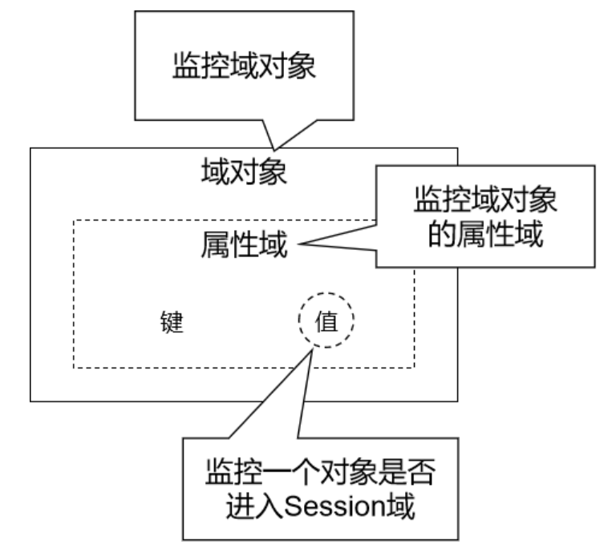
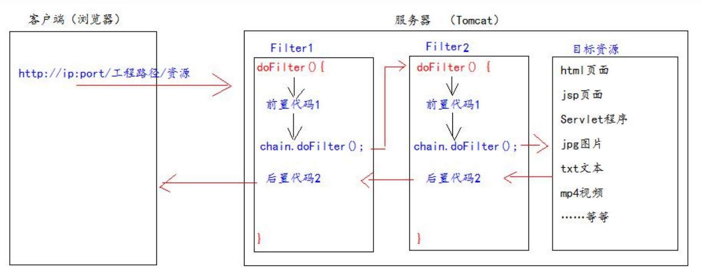
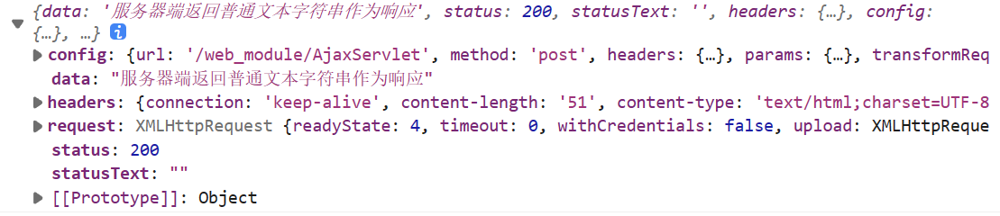
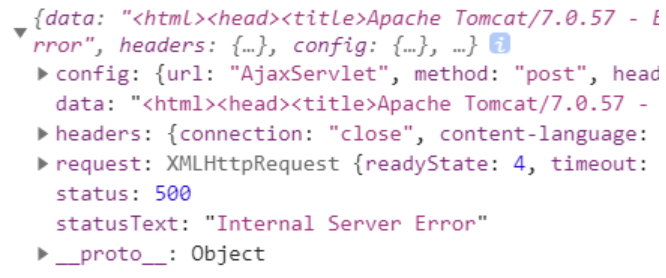
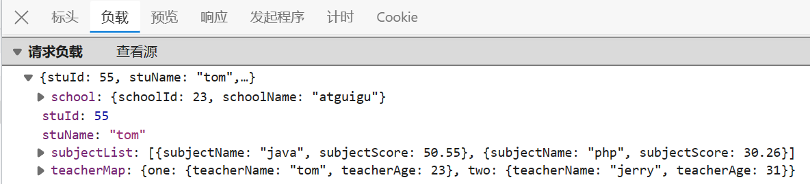
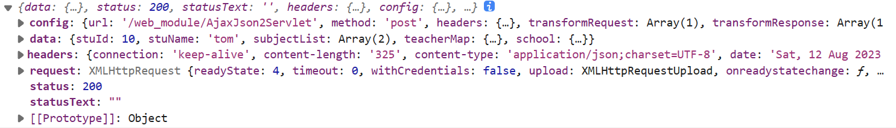

JavaEE三层架构：

**表述层(Web)**：负责用户的操作界面、数据的动态显示，以及处理请求、跳转页面。常用的技术为SpringMVC(MVC即Model-View-Controller)，M指模型层(Model)，V指视图层(View)，C指控制层(Controller)

**业务层(Service)**：负责处理业务逻辑。常用的技术为Spring

**持久层(Dao)**：负责对数据库进行CRUD操作。常用的技术为Mybatis


# 第1章 Servlet

## 1. Tomcat

**Tomcat扮演的角色**：对外是一个Web服务器，对内是一个Servlet容器。

**Tomcat的目录结构**：
- bin：该目录下存放的是二进制可执行文件，会有startup.bat和shutdown.bat文件，startup.bat用来启动Tomcat，但需要先配置JAVA_HOME环境变量才能启动，shutdawn.bat用来停止Tomcat。
- conf：配置文件目录，这个目录下有四个最为重要的文件：
  - oserver.xml：配置整个服务器信息。例如修改端口号。默认HTTP请求的端口号是：8080
  - otomcat-users.xml：存储tomcat用户的文件，这里保存的是tomcat的用户名及密码，以及用户的角色信息。
  - oweb.xml：部署描述符文件，这个文件中注册了很多MIME类型，即文档类型。
  - ocontext.xml：对所有应用的统一配置，通常我们不会去配置它。
- lib：Tomcat的类库，里面是一大堆jar文件。
- logs：这个目录中都是日志文件，记录了Tomcat启动和关闭的信息，如果启动Tomcat时有错误，那么异常也会记录在日志文件中。
- temp：存放Tomcat的临时文件，这个目录下的东西可以在停止Tomcat后删除！
- webapps：存放web项目的目录，其中每个文件夹都是一个项目；如果这个目录下已经存在了目录，那么都是tomcat自带的项目。其中ROOT是一个特殊的项目，在地址栏中访问：`http://127.0.0.1:8080`，没有给出项目目录时，对应的就是ROOT项目。`http://localhost:8080/examples`，进入示例项目。其中examples就是项目名，即文件夹的名字。
- work：运行时生成的文件，最终运行的文件都在这里。通过webapps中的项目生成的！可以把这个目录下的内容删除，再次运行时会生再次生成work目录。

**具体使用参考 `Tomcat简要教程.pdf`**

## 2. Servlet概述

### 2.1 Servlet简介

Servlet是JavaEE规范之一(规范就是接口)。Servlet是JavaWeb的三大组件之一，三大组件分别是：Servlet程序、Filter过滤器、Listener监听器。

Servlet是运行在服务器上的一个Java小程序(Servlet=Server+applet)，**它可以接收客户端发送过来的请求，并响应数据给客户端**。我们可以把Servlet称为Web应用中的`控制器`。

要使用Servlet的API，需要让IDEA的当前module依赖Tomcat提供的jar包。具体操作如下：File-->Project Structure-->Modules-->Dependencies-->Add-->Library-->选择Tomcat 10.1.10-->将Scope改为Compile

### 2.2 实现Servlet程序的方式1

#### 2.2.1 实现步骤

**步骤**：

1. 定义一个类去实现Servlet接口
2. 实现其service()方法，用于处理请求、响应数据
3. 到web.xml中去配置Servlet程序的访问地址。


Servlet程序示例(注意其中的service()方法是专门用来处理请求和响应的)：
```java
package com.thuwsy.servlet;
import jakarta.servlet.*;
import java.io.IOException;
public class HelloServlet implements Servlet {
    @Override
    public void init(ServletConfig servletConfig) throws ServletException {

    }

    @Override
    public ServletConfig getServletConfig() {
        return null;
    }

    @Override
    public void service(ServletRequest servletRequest, ServletResponse servletResponse) throws ServletException, IOException {
        System.out.println("HelloServlet被访问了"); //实现service()方法
    }

    @Override
    public String getServletInfo() {
        return null;
    }

    @Override
    public void destroy() {

    }
}
```

web.xml的配置示例：

```xml
<?xml version="1.0" encoding="UTF-8"?>
<web-app xmlns="http://xmlns.jcp.org/xml/ns/javaee"
         xmlns:xsi="http://www.w3.org/2001/XMLSchema-instance"
         xsi:schemaLocation="http://xmlns.jcp.org/xml/ns/javaee http://xmlns.jcp.org/xml/ns/javaee/web-app_4_0.xsd"
         version="4.0">

    <servlet>
        <servlet-name>HelloServlet</servlet-name>
        <servlet-class>com.thuwsy.servlet.HelloServlet</servlet-class>
    </servlet>
    <servlet-mapping>
        <servlet-name>HelloServlet</servlet-name>
        <url-pattern>/hello</url-pattern>
    </servlet-mapping>    
    
</web-app>
```

**web.xml文件中的配置信息**：

1. servlet标签用于给Tomcat配置Servlet程序。需要至少包含两个子标签：
   - servlet-name标签是给Servlet程序起一个别名(一般都用类名)
   - servlet-class标签中要写Servlet程序的全类名
   - 除此之外，还可以添加init-param标签，表示初始化参数
2. servlet-mapping标签用于给servlet程序配置访问地址。需要包含两个子标签：
   - servlet-name标签的作用就是告诉服务器，我当前配置的地址给哪个Servlet程序使用。所以需要和上述servlet标签中的servlet-name相同。
   - url-pattern标签配置访问地址。
3. url-pattern标签中的地址：斜杠`/`表示在服务器解析的时候，地址为`http://ip:port/工程名/`，即在IDEA的Run/Debug Configurations中配置的URL，例如moduel名称是`javaweb_test`，则上述地址即为`http://ip:port/javaweb_test/`；因此，我们通常在斜杠后面自定义一个访问路径(虚拟路径)，比如`/hello`就表示当浏览器访问`http://ip:port/工程名/hello`时会触发对应的Servlet程序。**因为Servlet并不是文件系统中实际存在的目录或文件，所以为了方便浏览器访问，我们创建了虚拟出来的路径来访问它**。


**从url地址到Servlet程序的访问过程**：浏览器输入url地址后，根据ip地址定位到服务器，根据端口号8080定位到Tomcat，再根据工程路径确定访问哪个模块，最后根据自定义的访问路径(也称为资源路径，即上述的`/hello`)，从web.xml中根据配置的映射关系找到全类名，然后执行该类中的service()方法。

#### 2.2.2 Servlet的生命周期

(1) 执行构造器

(2) 执行init()方法

(3) 执行service()方法(每次访问都会执行)

(4) 执行destroy()方法

注意：
- 默认情况下，Servlet在第一次接收到请求的时候才创建对象，然后执行(1)和(2)，因此(1)、(2)只会调用一次。**创建对象后，所有的URL地址匹配的请求都由这同一个对象来处理**。Tomcat中，每一个请求会被分配一个线程来处理，所以可以说：Servlet是单实例，多线程方式运行的(所以在处理请求时，不能修改公共属性，因为它是线程不安全的)。
- service()方法在每次访问页面时都会调用一次。
- 对于destroy()方法，只有在web工程停止的时候才调用一次。

补充：我们也可以修改Servlet创建对象的时机。如果想要在Tomcat启动时就创建Servlet对象，可以在web.xml中对应的servlet标签下配置`<load-on-startup>1</load-on-startup>`，中间的数字表示Servlet程序的启动顺序，数字越小，启动越靠前，最小值是0。我们将来配置SpringMVC的时候会看到这样的配置。

#### 2.2.3 GET和POST请求的分发处理

由于我们往往会根据不同的请求作不同的处理，所以我们需要在service()方法中获取请求的方式(method)是GET还是POST，然后作不同的处理。

```java
@Override
public void service(ServletRequest servletRequest, ServletResponse servletResponse) throws ServletException, IOException {
    HttpServletRequest httpServletRequest = (HttpServletRequest) servletRequest;
    String method = httpServletRequest.getMethod();
    if ("GET".equals(method))
        System.out.println("收到GET请求");
    else if ("POST".equals(method))
        System.out.println("收到POST请求");
}
```

注意ServletRequest类中无法直接获取请求的method，所以需要强制转换成其子类HttpServletRequest，然后子类调用getMethod()方法。因此方式1这种实现Servlet程序的做法很繁琐，实际开发中往往采用以下的方式2。

### 2.3 实现Servlet程序的方式2

#### 2.3.1 实现步骤

一般在实际项目开发中，都是使用继承HttpServlet类的方式去实现Servlet程序。步骤如下：

1. 定义一个类去继承HttpServlet类
2. 根据业务需要重写doGet()或doPost()方法，分别用于处理GET请求和POST请求
3. 在web.xml中配置Servlet程序的访问地址(也可用注解的方式代替在xml文件中配置路径，只需在Servlet类上添加注解`@WebServlet("/访问路径")`)

```java
public class HelloServlet extends HttpServlet {
    @Override
    protected void doGet(HttpServletRequest req, HttpServletResponse resp) throws ServletException, IOException {
        System.out.println("收到GET请求啦666");
    }

    @Override
    protected void doPost(HttpServletRequest req, HttpServletResponse resp) throws ServletException, IOException {
        System.out.println("收到POST请求啦666");
    }
}
```

#### 2.3.2 Servlet类的继承体系简介

我们自定义的类继承了HttpServlet类，而HttpServlet类继承了GenericServlet类，而GenericServlet类实现了Servlet接口。

**Servlet接口**

Servlet接口，只负责定义Servlet程序的访问规范。

**GenericServlet类**

GenericServlet类实现了Servlet类，但只是做了很多空实现。注意GenericServlet类还保存了一个ServletConfig类的引用，并对ServletConfig的使用做了一些方法。

**HttpServlet类**

HttpServlet类实现了GenericServlet类中的抽象方法service()，在方法体中做了请求的分发处理。简而言之，通过getMethod()方法获取请求的方式，然后分别调用对应的方法。注意其doGet()方法和doPost()方法中都只报405错误，所以需要子类去重写。

**我们自定义的类**

我们自定义的类继承了HttpServlet类，所以只需要根据业务需要来重写doGet()或doPost()方法即可。


### 2.4 ServletConfig类

ServletConfig类是Servlet程序的配置信息类。Servlet程序和ServletConfig对象都是由Tomcat负责创建，我们负责使用。Servlet程序默认是第一次访问页面的时候创建，而一旦Servlet程序被创建，就会创建一个与之对应的ServletConfig对象。

ServletConfig类的作用：

1. 通过`getServletName()`方法，可以获取Servlet程序的别名servlet-name的值(即web.xml文件中配置的servlet-name)
2. 通过`getInitParameter(参数名)`方法，可以获取初始化参数 init-param的参数值(即web.xml文件中配置的init-param标签，它有两个子标签：param-name用于保存参数名，param-value用于保存对应的参数值)
3. 通过`getServletContext()`方法，可以获取ServletContext对象

举例：（注意：在init()方法中，参数就是一个ServletConfig对象；而要在其他地方获取ServletConfig对象，可以调用`getServletConfig()`方法）

```xml
<?xml version="1.0" encoding="UTF-8"?>
<web-app xmlns="http://xmlns.jcp.org/xml/ns/javaee"
         xmlns:xsi="http://www.w3.org/2001/XMLSchema-instance"
         xsi:schemaLocation="http://xmlns.jcp.org/xml/ns/javaee http://xmlns.jcp.org/xml/ns/javaee/web-app_4_0.xsd"
         version="4.0">

    <servlet>
        <servlet-name>HelloServlet</servlet-name>
        <servlet-class>com.thuwsy.servlet.HelloServlet</servlet-class>
        <init-param>
            <param-name>username</param-name>
            <param-value>wsy</param-value>
        </init-param>
        <init-param>
            <param-name>password</param-name>
            <param-value>123456</param-value>
        </init-param>
    </servlet>
    <servlet-mapping>
        <servlet-name>HelloServlet</servlet-name>
        <url-pattern>/hello</url-pattern>
    </servlet-mapping>    
    
</web-app>
```


```java
public class HelloServlet extends HttpServlet {
    @Override
    protected void doGet(HttpServletRequest req, HttpServletResponse resp) throws ServletException, IOException {
        ServletConfig sc = getServletConfig();
        System.out.println("Servlet程序名为" + sc.getServletName());
        System.out.println("初始化参数username=" + sc.getInitParameter("username"));
        System.out.println("初始化参数password=" + sc.getInitParameter("password"));
        System.out.println(sc.getServletContext());
    }

    @Override
    public void init(ServletConfig config) throws ServletException {
        super.init(config);
        System.out.println("调用了init()");
    }
}
```

注：如果想重写init(config)方法，务必在第一行调用`super.init(config)`。因为实际上ServletConfig对象是用GenericServlet类的一个成员变量来保存的，而且正是用GenericServlet类中的init(config)方法将config赋值给那个成员变量保存。而我们调用的`getServletConfig()`方法，实际上就是GenericServlet类中的`getServletConfig()`方法，它将该成员变量保存的ServletConfig对象的地址返回给我们。


### 2.5 ServletContext类

#### 2.5.1 ServletContext简介

ServletContext是一个接口，它代表整个web工程。

- 一个web工程(即模块)只有一个ServletContext对象实例。
- ServletContext在web工程部署启动的时候创建，在web工程停止的时候销毁。
- ServletContext作为整个Web应用范围的域对象。域对象就是可以像Map一样存取数据的对象，这里的域指的就是存取数据的操作范围。
  - 存数据：setAttribute()
  - 取数据：getAttribute()
  - 删数据：removeAttribute()

#### 2.5.2 ServletContext的作用

1. 获取web.xml中配置的上下文参数context-param(它属于整个web工程)
2. **获取当前的工程路径(上下文路径)，格式: /工程名**
3. 获取工程部署后在服务器硬盘上的绝对路径
4. 像Map一样存取数据


举例(作用1、2、3)：

```xml
<?xml version="1.0" encoding="UTF-8"?>
<web-app xmlns="http://xmlns.jcp.org/xml/ns/javaee"
         xmlns:xsi="http://www.w3.org/2001/XMLSchema-instance"
         xsi:schemaLocation="http://xmlns.jcp.org/xml/ns/javaee http://xmlns.jcp.org/xml/ns/javaee/web-app_4_0.xsd"
         version="4.0">

    <context-param>
        <param-name>username</param-name>
        <param-value>wsy</param-value>
    </context-param>
    <context-param>
        <param-name>password</param-name>
        <param-value>666666</param-value>
    </context-param>

    <servlet>
        <servlet-name>HelloServlet</servlet-name>
        <servlet-class>com.thuwsy.servlet.HelloServlet</servlet-class>
    </servlet>
    <servlet-mapping>
        <servlet-name>HelloServlet</servlet-name>
        <url-pattern>/hello</url-pattern>
    </servlet-mapping>    
    
</web-app>
```

```java
public class HelloServlet extends HttpServlet {
    @Override
    protected void doGet(HttpServletRequest req, HttpServletResponse resp) throws ServletException, IOException {
        // 获取ServletContext域对象
        ServletContext context = getServletConfig().getServletContext();
        // 1. getInitParameter(参数名)，获取上下文参数
        String username = context.getInitParameter("username");
        System.out.println(username); // wsy
        String password = context.getInitParameter("password");
        System.out.println(password); // 666666
        // 2. getContextPath()，获取工程路径
        String contextPath = context.getContextPath();
        System.out.println(contextPath); // /javaweb_test
        // 3. getRealPath("/")，获取工程部署后在服务器硬盘上的绝对路径
        String realPath = context.getRealPath("/");
        System.out.println(realPath);
        // D:\IT\JavaSEProject\out\artifacts\javaweb_test_war_exploded\
    }
}
```

注1：getRealPath()中的参数`"/"`就表示当前工程路径，工程部署后，会将当前工程下的web目录中的所有内容，复制一份到磁盘的某个位置(称为部署目录)，然后`getRealPath("/")`就能返回这一绝对路径。如果当前工程下的web目录下有一个`a.html`文件，想获取其绝对路径，就调用`getRealPath("/a.html")`即可。简而言之，**工程目录下的web目录对应部署目录的根目录**。

注2：`getServletConfig().getServletContext()`可以获取上下文对象，除此之外，直接调用`getServletContext()`也可以获取该上下文对象，因为GenericServlet类中就有该方法。

举例(作用4)：

```java
public class HelloServlet extends HttpServlet {
    @Override
    protected void doGet(HttpServletRequest req, HttpServletResponse resp) throws ServletException, IOException {
        ServletContext context = getServletContext();
        context.setAttribute("key1", "value1");
        context.setAttribute("key2", "value2");
        context.removeAttribute("key2");
        System.out.println(context.getAttribute("key1")); // value1
    }
}
```

注意：一个web工程只有一个ServletContext对象实例，所以一旦某个Servlet程序往里面存数据后，其他Servlet程序也能够获取该数据。


#### 2.5.3 作用域

原始情况下，作用域可以认为有四个：

1. page(现在几乎不用)：当前页面内有效。对应的域对象为PageContextImpl对象。
2. request：一次请求响应范围。对应的域对象为HttpServletRequest对象。
3. session：一次会话范围。对应的域对象为HttpSession对象。
4. application：整个Web工程范围。对应的域对象为ServletContext对象。


## 3. HTTP协议

HTTP：Hyper Text Transfer Protocol超文本传输协议。HTTP最大的作用就是确定了请求和响应数据的格式。浏览器发送给服务器的数据：请求报文；服务器返回给浏览器的数据：响应报文。

### 3.1 HTTP请求报文格式

#### 3.1.1 GET请求

GET请求的格式：
- 第一行是请求行，包括：`请求方式`、`请求的资源路径[?请求参数]`、`请求的协议版本号(HTTP/1.1)`。
- 其余的是请求头，由`key: value`键值对组成

```http
GET /javaweb_test/a.html HTTP/1.1
Accept: text/html,application/xhtml+xml,application/xml;q=0.9,image/webp,image/apng,*/*;q=0.8,application/signed-exchange;v=b3;q=0.7
Accept-Encoding: gzip, deflate, br
Accept-Language: zh-CN,zh;q=0.9,en;q=0.8,en-GB;q=0.7,en-US;q=0.6
Cache-Control: max-age=0
Connection: keep-alive
Cookie: JSESSIONID=A4EF15D71DFB311FFAF1647F3FB50A08; Idea-651d74c3=9561966d-dd67-45bd-a003-8417cdae1313
Host: localhost:8080
If-Modified-Since: Sun, 23 Jul 2023 09:50:46 GMT
If-None-Match: W/"265-1690105846707"
Sec-Fetch-Dest: document
Sec-Fetch-Mode: navigate
Sec-Fetch-Site: none
Sec-Fetch-User: ?1
Upgrade-Insecure-Requests: 1
User-Agent: Mozilla/5.0 (Windows NT 10.0; Win64; x64) AppleWebKit/537.36 (KHTML, like Gecko) Chrome/114.0.0.0 Safari/537.36 Edg/114.0.1823.82
sec-ch-ua: "Not.A/Brand";v="8", "Chromium";v="114", "Microsoft Edge";v="114"
sec-ch-ua-mobile: ?0
sec-ch-ua-platform: "Windows"
```

说明：

- Accept: 告诉服务器，客户端可以接收的数据类型
- Accept-Encoding: 告诉服务器，客户端可以接收的数据编码(压缩)格式
- Accept-Language: 告诉服务器，客户端可以接收的语言类型。zh-CN表示中文中国，en-US表示英文美国。
- Connection: 告诉服务器是否使用持续连接。keep-alive表示使用持续连接（默认），closed表示使用非持续连接。
- Host: 表示请求的服务器ip和端口号
- User-Agent: 表示客户端浏览器的信息
- Cookie: 浏览器访问服务器时携带的Cookie数据


#### 3.1.2 POST请求

POST请求的格式：
- 第一行是请求行，与GET请求类似
- 第二行开始是请求头
- 请求体：与请求头之间有一个空行，请求体中的内容就是发送给服务器的数据

```http
POST /javaweb_test/hello HTTP/1.1
Accept: text/html,application/xhtml+xml,application/xml;q=0.9,image/webp,image/apng,*/*;q=0.8,application/signed-exchange;v=b3;q=0.7
Accept-Encoding: gzip, deflate, br
Accept-Language: zh-CN,zh;q=0.9,en;q=0.8,en-GB;q=0.7,en-US;q=0.6
Cache-Control: max-age=0
Connection: keep-alive
Content-Length: 28
Content-Type: application/x-www-form-urlencoded
Cookie: JSESSIONID=A4EF15D71DFB311FFAF1647F3FB50A08; Idea-651d74c3=9561966d-dd67-45bd-a003-8417cdae1313
Host: localhost:8080
Origin: http://localhost:8080
Referer: http://localhost:8080/javaweb_test/a.html
Sec-Fetch-Dest: document
Sec-Fetch-Mode: navigate
Sec-Fetch-Site: same-origin
Sec-Fetch-User: ?1
Upgrade-Insecure-Requests: 1
User-Agent: Mozilla/5.0 (Windows NT 10.0; Win64; x64) AppleWebKit/537.36 (KHTML, like Gecko) Chrome/114.0.0.0 Safari/537.36 Edg/114.0.1823.82
sec-ch-ua: "Not.A/Brand";v="8", "Chromium";v="114", "Microsoft Edge";v="114"
sec-ch-ua-mobile: ?0
sec-ch-ua-platform: "Windows"

username=wsy&password=lrd666
```

说明1：

- Referer: 表示从哪个网址来访问的
- Content-Type: 表示发送的数据的类型，有以下两种：
  - application/x-www-form-urlencoded: 表示提交的数据格式为`key=value&key=value`，并对其进行url编码(url编码就是把非英文内容转换为`%xx%xx`的形式)
  - multipart/form-data: 表示以多段的形式提交数据给服务器(以流的形式提交，用于上传)
- Content-Length: 表示发送的数据的长度(即请求体内数据的长度)
- Cache-Control: 表示如何控制缓存

说明2：POST请求体有两种格式：

- form data：当前请求体是一个表单提交的请求参数，每一组请求参数是一个键值对，键和值中间是等号，键值对之间是`&`号
- Request Payload：整个请求体以某种特定格式来组织数据，例如JSON格式


#### 3.1.3 哪些是GET请求，哪些是POST请求

GET请求：
- form标签中method="get"
- a标签
- link标签引入css
- Script标签引入js文件
- img标签引入图片
- iframe引入html页面
- 在浏览器地址栏中输入地址后敲回车

POST请求：
- form标签中method="post"


### 3.2 HTTP响应报文格式

响应报文的格式：
- 第一行是响应行，包括：`响应的协议和版本号`、`响应状态码`、`响应状态描述符`
- 第二行开始是响应头，由`key: value`键值对组成
- 响应体：与响应头之间有一个空行，响应体中的内容就是回传给客户端的数据，可以是各种类型的数据。

```http
HTTP/1.1 200 OK
Accept-Ranges: bytes
ETag: W/"371-1690169189370"
Last-Modified: Mon, 24 Jul 2023 03:26:29 GMT
Content-Type: text/html
Content-Length: 371
Date: Mon, 24 Jul 2023 03:56:32 GMT
Keep-Alive: timeout=20
Connection: keep-alive

<!DOCTYPE html>
<html lang="en">
<head>
    <meta charset="UTF-8">
    <title>Title</title>
</head>
<body>
    <form action="http://localhost:8080/javaweb_test/hello" method="post">
        <input type="hidden" name="username" value="wsy">
        <input type="hidden" name="password" value="lrd666">
        <input type="submit">
    </form>
</body>
</html>
```

说明：
- Content-Type: 表示响应体的数据类型
- Content-Length: 表示响应体的长度
- Date: 表示响应的时间(格林时间)
- Set-Cookie: 服务器返回新的Cookie信息给浏览器
- Location: 在重定向的情况下，告诉浏览器访问下一个资源的地址

**常用的响应码**：
- 200：表示请求成功
- 302：表示请求重定向
- 400：(SpringMVC特定环境)请求参数问题
- 403：没有权限
- 404：找不到目标资源。具体原因有：访问地址写错、访问了WEB-INF目录下的资源、Web应用启动时控制台已经抛出异常、服务器端缓存
- 405：请求方式和服务器端对应的处理方式不一致
- 406：(SpringMVC特定环境)请求扩展名和实际返回的响应体类型不一致
- 50X：表示服务器已经收到请求，但是服务器内部错误(代码错误)


### 3.3 MIME类型

MIME是HTTP协议中的数据类型，全称是Multipurpose Internet Mail Extensions(多功能Internet邮件扩充服务)。MIME类型的格式是`大类型/小类型`，并与某一种文件的扩展名相对应。**MIME类型在HTTP报文中对应的是内容类型：Content-Type**。常见的MIME类型如下：

|文件|MIME类型|
|---|--------|
|超文本标记语言文本 .html, .htm| text/html|
|普通文本 .txt| text/plain|
|RTF文本 .rtf| application/rtf|
|GIF图形 .gif| image/gif|
|JPEG图形 .jpeg, .jpg| image/jpeg|
|au声音文件 .au | audio/basic|
|MIDI音乐文件 .mid, .midi | audio/midi, audio/x-midi|
|RealAudio音乐文件 .ra, .ram | audio/x-pn-realaudio|
|MPEG文件 .mpg, .mpeg| video/mpeg|
|AVI文件 .avi| video/x-msvideo|
|GZIP文件 .gz| application/x-gzip|
|TAR文件 .tar| application/x-tar|


## 4. Servlet进阶

### 4.1 HttpServletRequest类

每次只要有请求进入Tomcat服务器，Tomcat服务器就会把请求过来的HTTP协议信息解析好封装到Request对象中，然后传递到service方法（doGet和doPost）中给我们使用。我们可以通过 HttpServletRequest对象，获取到所有请求的信息。

**HttpServletRequest类的常用方法**：

（1）`getRequestURI()`：获取请求的资源路径
（2）`getRequestURL()`：获取请求的统一资源定位符（绝对路径）
（3）`getRemoteHost()`：获取客户端的ip地址
（4）`getHeader(String key)`：获取请求头中key对应的value
（5）`getParameter(String name)`：获取请求的参数
（6）`getParameterValues(String name)`：获取请求的参数（多个值的时候使用）
（7）`getParameterMap()`：获取包含全部请求参数的Map，返回值类型`Map<String, String[]>`
（8）`getMethod()`：获取请求的方式(GET或POST)
（9）`setAttribute(String key, String value)`：设置请求的域数据
（10）`getAttribute(String key)`：获取请求的域数据
（11）`getRequestDispatcher(String path)`：获取请求转发对象

#### 4.1.1 举例1：基本方法的使用

```java
public class HelloServlet extends HttpServlet {
    @Override
    protected void doGet(HttpServletRequest req, HttpServletResponse resp) throws ServletException, IOException {
        System.out.println(req.getRequestURI()); // /javaweb_test/hello
        System.out.println(req.getRequestURL()); // http://localhost:8080/javaweb_test/hello
        System.out.println(req.getRemoteHost()); // 0:0:0:0:0:0:0:1
        System.out.println(req.getMethod()); // GET
        System.out.println(req.getHeader("Accept-Encoding")); // gzip, deflate, br
    }
}
```

#### 4.1.2 举例2：获取请求参数方法的使用

```html
<!-- a.html文件 -->
<!DOCTYPE html>
<html lang="en">
<head>
    <meta charset="UTF-8">
    <title>Title</title>
</head>
<body>
    <form action="http://localhost:8080/javaweb_test/hello" method="post">
        用户名：<input type="text" name="username"><br/>
        密码：<input type="password" name="password"><br/>
        兴趣爱好：<input type="checkbox" name="hobby" value="cpp">C++
        <input type="checkbox" name="hobby" value="java">Java
        <input type="checkbox" name="hobby" value="js">JavaScript<br/>
        <input type="submit">
    </form>
</body>
</html>
```

```java
public class HelloServlet extends HttpServlet {
    @Override
    protected void doPost(HttpServletRequest req, HttpServletResponse resp) throws ServletException, IOException {
        req.setCharacterEncoding("UTF-8");
        String username = req.getParameter("username");
        String password = req.getParameter("password");
        String[] hobby = req.getParameterValues("hobby");
        System.out.println(username);
        System.out.println(password);
        System.out.println(Arrays.toString(hobby));
    }
}
```

注意：如果出现中文乱码问题，需要在doPost()方法的第一行设置`req.setCharacterEncoding("UTF-8");`(GET方法不会出现中文乱码问题)

#### 4.1.3 举例3：请求转发

**请求转发**：服务器收到请求后，从一个资源跳转到另一个资源的操作。

**请求转发的过程**：假设当前工程下有Servlet1和Servlet2两个Servlet程序，则当浏览器访问`http://ip:port/工程名/servlet1`时

1. 请求req(即HttpServletRequest对象)首先传入Servlet1的doGet()/doPost()方法
2. Servlet1程序可以获取该请求中的一些参数，然后通过setAttribute()设置该请求中的一些值，来表明已经访问了Servlet1程序
3. 之后，Servlet1程序可以将该请求req传入Servlet2，这就是请求转发。
4. Servlet2于是也可以获取该请求中的一些参数，并检查该请求中的一些值，来查看是否该请求已经经过Servlet1程序，然后执行Servlet2自己的业务
5. 执行完后，就相当于Servlet1和Servlet2共同完成了一个完整的业务功能，之后可以响应给客户端浏览器

**请求转发的特点**：
- 浏览器的地址栏不会变化
- 请求转发是一次请求、一次响应(虽然中间可能经过多个Servlet程序的流转，但对客户端和服务器来说，只有一次请求和一次响应)
- 正因为是一次请求，所以请求转发中共享Request对象的数据
- 可以转发到WEB-INF目录下(注意该目录下的文件，浏览器是无法直接访问的，但可以通过请求转发来访问)
- 不可以转发到工程以外的资源


举例：

```java
public class Servlet1 extends HttpServlet {
    @Override
    protected void doGet(HttpServletRequest req, HttpServletResponse resp) throws ServletException, IOException {
        // 1. 可以查看请求参数
        String user = req.getParameter("user");
        System.out.println("Servlet1中查看user=" + user); // Servlet1中查看user=thuwsy
        // 2. 给req对象中添加一个键值对，表明该请求经过了Servlet1
        req.setAttribute("key1", "value1");
        // 3. 创建请求转发的对象，斜杠表示地址http://ip:port/工程名/
        RequestDispatcher reqD = req.getRequestDispatcher("/servlet2");
        // 4. 进入Servlet2程序
        reqD.forward(req, resp);
    }
}

public class Servlet2 extends HttpServlet {
    @Override
    protected void doGet(HttpServletRequest req, HttpServletResponse resp) throws ServletException, IOException {
        // 1. 同样可以查看请求参数
        String user = req.getParameter("user");
        System.out.println("Servlet2中查看user=" + user); // Servlet2中查看user=thuwsy
        // 2. 检查该请求是否已经经过Servlet1
        Object val = req.getAttribute("key1");
        System.out.println(val); // value1
        // 3. 处理自己的业务
        System.out.println("执行Servlet2的业务");
    }
}
```

注1：当浏览器访问`http://localhost:8080/javaweb_test/servlet1?user=thuwsy`时就把请求传入Servlet1程序，然后转发给Servlet2程序。进入Servlet2程序，需要调用转发对象的`forward(req, resp)`方法。

注2：请求转发还可以转发到WEB-INF目录下的资源(浏览器直接访问是无法访问WEB-INF目录的)：

```java
RequestDispatcher reqD = req.getRequestDispatcher("/WEB-INF/b.html");
reqD.forward(req, resp);
```

### 4.2 路径的相关问题

#### 4.2.1 base标签

案例：假设在当前工程的web目录下有一个a目录，a目录下有一个b目录，b目录下有一个c.html文件，该文件中有一个超链接用于返回首页

```html
<a href="../../index.html">跳回首页</a><br/>
```

但是注意，**相对路径默认是参考当前浏览器地址栏中的地址的**。假设此时浏览器地址栏中的地址是正确的，即`http://localhost:8080/javaweb_test/a/b/c.html`，那么点击c.html中的超链接即可回到正确的首页地址`http://localhost:8080/javaweb_test/index.html`。

然而如果我们采用请求转发来访问c.html，注意此时浏览器地址栏的地址是不会变的，比如为`http://localhost:8080/javaweb_test/servlet1`，那么此时点击c.html中的超链接，就会访问`http://localhost:8080/index.html`，这显然是一个错误的地址。

因此我们需要使用base标签，**base标签的作用就是设置：当前html文件中，所有相对路径工作时，参照哪个路径**。base标签一般写在title标签的下方，所以我们只需在c.html中添加以下base标签即可：

```html
<base href="http://localhost:8080/javaweb_test/a/b/">
```

#### 4.2.2 相对路径和绝对路径

相对路径：
- `.` 表示当前目录
- `..` 表示上一级目录
- `资源名` 表示当前目录/资源名，即`./资源名`

绝对路径：
- `http://ip:port/工程名/资源路径`

**在实际开发中，路径建议都使用绝对路径，或者base标签结合相对路径。注意在JavaWeb中，斜杠`/`表示的就是一个绝对路径**。

#### 4.2.3 绝对路径`/`

在JavaWeb中，斜杠`/`就是一种绝对路径，但具有不同的含义。

**如果`/`被浏览器解析，则得到的地址就是`http://ip:port/`**，例如html文件中的超链接标签：

- `<a href="/"></a>`

**如果`/`被服务器解析，则得到的地址就是`http://ip:port/工程名/`**，比如以下一些情况：

- `<url-pattern>/servlet1</url-pattern>`
- `servletContext.getRealPath("/");`
- `req.getRequestDispatcher("/");`

特例：`resp.sendRedirect("/");` 它表示把斜杠发送给浏览器解析，得到`http://ip:port/`


### 4.3 HttpServletResponse类

HttpServletResponse类和HttpServletRequest类一样。每次请求进来，Tomcat服务器都会创建一个Response对象传递给Servlet程序去使用。HttpServletRequest表示请求过来的信息，HttpServletResponse表示所有响应的信息。我们如果需要设置返回给客户端的信息，都可以通过HttpServletResponse对象来进行设置。

#### 4.3.1 往客户端回传数据

HttpServletResponse类提供了方法获取两种输出流：

- `getOutputStream()`：获取字节输出流，常用于传递二进制数据
- `getWriter()`：获取字符输出流，常用于传递字符串

**注意：两个流同时只能使用一个**。

```java
public class Servlet1 extends HttpServlet {
    @Override
    protected void doGet(HttpServletRequest req, HttpServletResponse resp) throws ServletException, IOException {
        resp.setContentType("text/html; charset=UTF-8");
        PrintWriter writer = resp.getWriter();
        writer.println("欢迎！");
        writer.write("6666");
    }
}
```

**注意**：我们需要设置`resp.setContentType("text/html; charset=UTF-8");`来解决响应的中文乱码问题。该方法会同时设置服务器和客户端都使用UTF-8字符集，还设置了响应头，但是该方法一定要在获取流对象之前调用才有效。

#### 4.3.2 请求重定向

**请求重定向**：是指客户端给服务器发请求，然后服务器告诉客户端说：我给你一个新地址，去新地址访问（因为之前的地址可能已经被废弃），这就是请求重定向。

**请求重定向的过程**：假设当前工程下有Response1和Response2两个Servlet程序，则当浏览器访问`http://ip:port/工程名/response1`时

1. 假设Response1接口已经属于是被废弃的状态，它就有义务告诉客户端自己已经被搬迁，所以需要**设置响应码为302，并设置响应头中的Location为新的地址**，然后响应给客户端浏览器。
2. 客户端收到响应后，再次发起对新地址的请求，即访问Response2程序，服务器的Response2程序收到请求后进行业务处理，然后响应给客户端。


**请求重定向的特点**：
- 浏览器的地址栏会发送变化
- 请求重定向实际上是两次请求
- 正因为是两次请求，所以不会共享Request域中的数据
- 无法访问WEB-INF下的资源
- 可以访问工程以外的资源

```java
public class Response1 extends HttpServlet {
    @Override
    protected void doGet(HttpServletRequest req, HttpServletResponse resp) throws ServletException, IOException {
        resp.sendRedirect("http://localhost:8080/javaweb_test/response2");
    }
}

public class Response2 extends HttpServlet {
    @Override
    protected void doGet(HttpServletRequest req, HttpServletResponse resp) throws ServletException, IOException {
        PrintWriter writer = resp.getWriter();
        writer.write("I am a new address!");
    }
}
```

说明：使用resp的`sendRedirect()`方法可实现请求重定向，其底层实际是设置了响应码302，以及响应头Location为新地址，回传给客户端，再让客户端立即访问新地址。

## 5. 文件上传与下载

### 5.1 文件上传

#### 5.1.1 文件上传的步骤

1. html页面中设置一个form标签，且属性`method="post"`，因为GET方法会有大小的限制。
2. 该form标签中必须设置属性`enctype="multipart/form-data"`，它表示提交的数据，以多段(每一个表单项一个数据段)的形式进行拼接，然后以二进制流的形式发送给服务器
3. 在form标签中使用input标签(type="file")添加上传文件的表单项
4. 编写服务器代码(Servlet程序)接收，处理上传的数据

#### 5.1.2 文件上传时发送的HTTP协议内容

我们的html文件内容为：

```html
<!DOCTYPE html>
<html lang="en">
<head>
    <meta charset="UTF-8">
    <title>Title</title>
</head>
<body>
    <form action="http://localhost:8080/javaweb_test/upload" method="post" enctype="multipart/form-data">
        用户名称：<input type="text" name="username"><br>
        上传头像：<input type="file" name="photo"><br>
        <input type="submit" value="提交">
    </form>
</body>
</html>
```

在页面输入用户名，并上传文件后，发送给服务器的HTTP请求内容如下：

```http
POST /javaweb_test/upload HTTP/1.1
Accept: text/html,application/xhtml+xml,application/xml;q=0.9,image/webp,image/apng,*/*;q=0.8,application/signed-exchange;v=b3;q=0.7
Accept-Encoding: gzip, deflate, br
Accept-Language: zh-CN,zh;q=0.9,en;q=0.8,en-GB;q=0.7,en-US;q=0.6
Cache-Control: max-age=0
Connection: keep-alive
Content-Length: 4897
Content-Type: multipart/form-data; boundary=----WebKitFormBoundarybbZhXlSVFd9RQnQu
Cookie: JSESSIONID=22C55E59547D997FB1A2F6C8E392ADAF; Idea-651d74c3=9561966d-dd67-45bd-a003-8417cdae1313
Host: localhost:8080
Origin: http://localhost:8080
Referer: http://localhost:8080/javaweb_test/a.html
Sec-Fetch-Dest: document
Sec-Fetch-Mode: navigate
Sec-Fetch-Site: same-origin
Sec-Fetch-User: ?1
Upgrade-Insecure-Requests: 1
User-Agent: Mozilla/5.0 (Windows NT 10.0; Win64; x64) AppleWebKit/537.36 (KHTML, like Gecko) Chrome/114.0.0.0 Safari/537.36 Edg/114.0.1823.82
sec-ch-ua: "Not.A/Brand";v="8", "Chromium";v="114", "Microsoft Edge";v="114"
sec-ch-ua-mobile: ?0
sec-ch-ua-platform: "Windows"

------WebKitFormBoundarybbZhXlSVFd9RQnQu
Content-Disposition: form-data; name="username"

wsy
------WebKitFormBoundarybbZhXlSVFd9RQnQu
Content-Disposition: form-data; name="photo"; filename="a.jpg"
Content-Type: image/jpeg


------WebKitFormBoundarybbZhXlSVFd9RQnQu--
```

注意：

（1）请求头中的Content-Type字段表示提交的数据类型，其中`multipart/form-data;`的含义我们已经解释；后面的boundary表示每段数据的分隔符，`----WebKitFormBoundarybbZhXlSVFd9RQnQu`是由浏览器随机生成，它就是分隔符。

（2）请求体中的内容：
- 以分隔符开始(表示一段数据的开始)
- 然后描述一些数据的信息，如`Content-Disposition`、`Content-Type`等
- 然后是一个空行
- 然后是提交的当前表单项的值。(注意如果提交的是文件，由于其内容过大，浏览器中不予以显示，所以仍表现为一个空行，但实际上数据是真实存在的)
- 当所有数据段提交完成后，以分隔符作结尾(注意结尾分隔符末尾多了两个减号，表示数据的结束标记)

#### 5.1.3 commons-fileupload.jar常用API

我们首先要导入两个jar包：commons-io-2.13.0.jar和commons-fileupload-1.5.jar，有以下两个常用类：

- ServletFileUpload类：用于解析上传的数据
- FileItem类：表示每一个表单项

常用API如下：

- `boolean ServletFileUpload.isMultipartContent(HttpServletRequest request);` 判断当前上传的数据格式是否是多段的格式
- `public List<FileItem> parseRequest(HttpServletRequest request)`：解析上传的数据
- `boolean FileItem.isFormField()`：判断当前这个表单项，是普通的表单项(true)，还是上传的文件类型(false)。
- `String FileItem.getFieldName()`：获取表单项的 name 属性值
- `String FileItem.getString()`：获取当前表单项的值
- `String FileItem.getName()`：获取上传的文件名
- `void FileItem.write(file)`：将上传的文件写到参数 file 所指向的硬盘位置

示例：

```java
@Override
protected void doPost(HttpServletRequest req, HttpServletResponse resp) throws ServletException,
IOException {
    //1 先判断上传的数据是否多段数据（只有多段的数据，才是文件上传的）
    if (ServletFileUpload.isMultipartContent(req)) {
        // 创建 FileItemFactory 工厂实现类
        FileItemFactory fileItemFactory = new DiskFileItemFactory();
        // 创建用于解析上传数据的工具类 ServletFileUpload 类
        ServletFileUpload servletFileUpload = new ServletFileUpload(fileItemFactory);
        try {
            // 解析上传的数据，得到每一个表单项 FileItem
            List<FileItem> list = servletFileUpload.parseRequest(req);
            // 循环判断，每一个表单项，是普通类型，还是上传的文件
            for (FileItem fileItem : list) {
                if (fileItem.isFormField()) {
                    // 普通表单项
                    System.out.println("表单项的 name 属性值：" + fileItem.getFieldName());
                    // 参数 UTF-8.解决乱码问题
                    System.out.println("表单项的 value 属性值：" + fileItem.getString("UTF-8"));
                } else {
                    // 上传的文件
                    System.out.println("表单项的 name 属性值：" + fileItem.getFieldName());
                    System.out.println("上传的文件名：" + fileItem.getName());
                    fileItem.write(new File("e:\\" + fileItem.getName()));
                }
            }
        } catch (Exception e) {
            e.printStackTrace();
        }
    }
}
```

### 5.2 文件下载

#### 5.2.1 文件下载的流程

客户端向服务器发送请求：要下载的文件。服务端将做如下步骤：

1. 获取要下载的文件名
2. 读取要下载的文件内容(通过ServletContext对象可以读取)
3. 设置响应头，告诉客户端返回的数据类型
4. 设置响应头，告诉客户端收到的数据是用于下载使用
5. 把下载的文件内容回传给客户端

#### 5.2.2 文件下载的常用API

- `servletContext.getResourceAsStream(String fileName);`将所需的文件转换为InputStream
- `servletContext.getMimeType(String fileName);` 获取文件的MIME类型
- `resp.setContentType(String type);` 设置响应的数据类型
- `resp.getOutputStream();` 获取响应的输出流

#### 5.2.3 示例

假设在当前工程的web目录下有一个文件`a.jpg`，客户端通过访问`http://ip:port/javaweb_test/downloadServlet`进行下载：

```java
public class DownloadServlet extends HttpServlet {
    @Override
    protected void doGet(HttpServletRequest req, HttpServletResponse resp) throws ServletException, IOException {
        // 1. 获取要下载的文件名
        String file = "/a.jpg";
        // 2. 读取要下载的文件内容(通过ServletContext对象可以读取)
        ServletContext context = getServletContext();
        InputStream src = context.getResourceAsStream(file);
        // 3. 设置响应头，告诉客户端返回的数据类型
        // 获取要下载的文件的MIME类型
        String mimeType = context.getMimeType(file);
        resp.setContentType(mimeType);
        // 4. 设置响应头，告诉客户端收到的数据是用于下载使用
        resp.setHeader("Content-Disposition", "attachment; filename=picture.jpg");
        // 5. 把下载的文件内容回传给客户端
        // 获取响应的输出流
        ServletOutputStream dest = resp.getOutputStream();
        // 读取输入流中全部的数据，复制给输出流，输出给客户端。可以使用commons-io提供的API进行复制。
        IOUtils.copy(src, dest);
    }
}
```

说明：

- 设置响应头的Content-Disposition属性，是为了告诉客户端收到的数据该怎么处理，其中attachment表示附件，即下载使用，filename即指定下载时显示的文件名。
- 如果filename一定要设置中文名，则需要用url编码(因为在响应头中，不能包含有中文字符)。我们需要如下设置：

```java
String str = "attachment; fileName=" + URLEncoder.encode("图片.jpg", "UTF-8");
resp.setHeader("Content-Disposition", str);
```


## 6. Servlet程序优化

在实际的开发过程中，我们可能开发很多不同的模块(如用户页面、购物车页面等)，每个页面中也有不同的功能(如登录、注册等)，原则上一个模块只使用一个Servlet程序。所以我们可以定义一个公共的父类BaseServlet来执行相同逻辑的代码：

```java
public abstract class BaseServlet extends HttpServlet {

    @Override
    protected void doGet(HttpServletRequest req, HttpServletResponse resp) throws ServletException, IOException {
        doPost(req, resp);
    }

    @Override
    protected void doPost(HttpServletRequest req, HttpServletResponse resp) throws ServletException, IOException {
        // 解决post请求中文乱码问题
        // 一定要在获取请求参数之前调用才有效
        req.setCharacterEncoding("UTF-8");
        // 解决响应中文乱码问题
        resp.setContentType("text/html; charset=UTF-8");

        String action = req.getParameter("action");
        try {
            // 获取action业务鉴别字符串，获取相应的业务 方法反射对象
            Method method = this.getClass()
                    .getDeclaredMethod(action, HttpServletRequest.class, HttpServletResponse.class);
            // 调用目标业务 方法
            method.invoke(this, req, resp);
        } catch (Exception e) {
            e.printStackTrace();
        }
    }
}
```

而每一个模块中，只需定义自己独有的方法即可，如以下用户界面模块对应的Servlet程序(需要继承BaseServlet，并且在web.xml中配置信息):

```java
public class UserServlet extends BaseServlet{
    protected void login(HttpServletRequest req, HttpServletResponse resp) throws ServletException, IOException {
        System.out.println("完成登录功能相关的业务");
        // ......以下为相关业务代码
    }
    protected void regist(HttpServletRequest req, HttpServletResponse resp) throws ServletException, IOException {
        System.out.println("完成注册功能相关的业务");
        // ......以下为相关业务代码
    }
}
```

除此之外，在用户界面的form标签首行，我们需要添加一个隐藏域，name属性值都统一设置为"action"，value属性值设置为需要调用的方法名(如login、regist)。(如果使用的是a标签，而不是form标签，则可以直接在a标签中写`href="userServlet?action=login"`)

```html
<!DOCTYPE html>
<html lang="en">
<head>
    <meta charset="UTF-8">
    <title>Title</title>
    <base href="http://localhost:8080/javaweb_test/">
</head>
<body>
    <form action="userServlet" method="post">
        <input type="hidden" name="action" value="login">
        <input type="submit" value="登录">
    </form>
    <form action="userServlet" method="post">
        <input type="hidden" name="action" value="regist">
        <input type="submit" value="注册">
    </form>
</body>
</html>
```

这样，在该用户模块下，当用户点击"登录"按钮后，请求会被UserServlet程序处理，于是调用从父类继承过来的doPost()方法。doPost()方法中获取请求参数action对应的value值(点击"登录"按钮时，获取到的自然就是login)，然后利用反射调用子类的login()方法。

类似的，当我们想创建一个新的购物车界面模块时，也只需编写相应的类去继承BaseServlet类，并配置web.xml，然后关注于自己所需要实现的方法业务即可。


# 第2章 Listener

## 1. 观察者模式

观察者模式是二十三种设计模式之一：
- 观察者：监控『被观察者』的行为，一旦发现『被观察者』触发了事件，就会调用事先准备好的方法执行操作。
- 被观察者：『被观察者』一旦触发了被监控的事件，就会被『观察者』发现。

## 2. Listener简介

### 2.1 概念

监听器(Listener)是JavaEE的规范(即接口)，它是JavaWeb的三大组件之一。监听器是专门用于对其他对象身上发生的事件或状态改变进行监听和相应处理的对象，当被监视的对象发生情况时，立即采取相应的行动。

**Servlet监听器**：Servlet规范中定义的一种特殊类，它用于监听Web应用程序中的ServletContext，HttpSession 和HttpServletRequest等域对象的创建与销毁事件，以及监听这些域对象中的属性发生修改的事件。

**分类**：
- 域对象监听器
- 域对象的属性域监听器
- Session域中数据的监听器



### 2.2 监听器列表

#### 1、ServletContextListener

作用：监听ServletContext对象的创建与销毁

- `contextInitialized(ServletContextEvent sce)`：ServletContext创建时调用
- `contextDestroyed(ServletContextEvent sce)`：ServletContext销毁时调用

ServletContextEvent对象代表从ServletContext对象身上捕获到的事件，通过这个事件对象我们可以获取到ServletContext对象。

#### 2、HttpSessionListener

作用：监听HttpSession对象的创建与销毁

- `sessionCreated(HttpSessionEvent hse)`：HttpSession对象创建时调用
- `sessionDestroyed(HttpSessionEvent hse)`：HttpSession对象销毁时调用

HttpSessionEvent对象代表从HttpSession对象身上捕获到的事件，通过这个事件对象我们可以获取到触发事件的HttpSession对象。

#### 3、ServletRequestListener

作用：监听ServletRequest对象的创建与销毁

- `requestInitialized(ServletRequestEvent sre)	`：ServletRequest对象创建时调用
- `requestDestroyed(ServletRequestEvent sre)`：ServletRequest对象销毁时调用

ServletRequestEvent对象代表从HttpServletRequest对象身上捕获到的事件，通过这个事件对象我们可以获取到触发事件的HttpServletRequest对象。另外还有一个方法可以获取到当前Web应用的ServletContext对象。

#### 4、ServletContextAttributeListener

作用：监听ServletContext中属性的创建、修改和销毁

- `attributeAdded(ServletContextAttributeEvent scab)`：向ServletContext中添加属性时调用
- `attributeRemoved(ServletContextAttributeEvent scab)`：从ServletContext中移除属性时调用
- `attributeReplaced(ServletContextAttributeEvent scab)`：当ServletContext中的属性被修改时调用

ServletContextAttributeEvent对象代表属性变化事件，它包含的方法如下：

- `getName()`：获取修改或添加的属性名
- `getValue()`：获取被修改或添加的属性值
- `getServletContext()`：获取ServletContext对象

#### 5、HttpSessionAttributeListener

作用：监听HttpSession中属性的创建、修改和销毁

- `attributeAdded(HttpSessionBindingEvent se)	`：向HttpSession中添加属性时调用
- `attributeRemoved(HttpSessionBindingEvent se)`：从HttpSession中移除属性时调用
- `attributeReplaced(HttpSessionBindingEvent se)`：当HttpSession中的属性被修改时调用

HttpSessionBindingEvent对象代表属性变化事件，它包含的方法如下：

- `getName()`：获取修改或添加的属性名
- `getValue()`：获取被修改或添加的属性值
- `getSession()`：获取触发事件的HttpSession对象

#### 6、ServletRequestAttributeListener

作用：监听ServletRequest中属性的创建、修改和销毁

- `attributeAdded(ServletRequestAttributeEvent srae)`：向ServletRequest中添加属性时调用
- `attributeRemoved(ServletRequestAttributeEvent srae)`：从ServletRequest中移除属性时调用
- `attributeReplaced(ServletRequestAttributeEvent srae)`：当ServletRequest中的属性被修改时调用

ServletRequestAttributeEvent对象代表属性变化事件，它包含的方法如下：

- `getName()`：获取修改或添加的属性名
- `getValue()`：获取被修改或添加的属性值
- `getServletRequest()`：获取触发事件的ServletRequest对象

#### 7、HttpSessionBindingListener

作用：监听某个对象在Session域中的创建与移除

- `valueBound(HttpSessionBindingEvent event)`：该类的实例被放到Session域中时调用
- `valueUnbound(HttpSessionBindingEvent event)`：该类的实例从Session中移除时调用

HttpSessionBindingEvent对象代表属性变化事件，它包含的方法如下：

- `getName()`：获取当前事件涉及的属性名
- `getValue()`：获取当前事件涉及的属性值
- `getSession()`：获取触发事件的HttpSession对象

#### 8、HttpSessionActivationListener

作用：监听某个对象在Session中的序列化与反序列化

- `sessionWillPassivate(HttpSessionEvent se)`：该类实例和Session一起钝化到硬盘时调用
- `sessionDidActivate(HttpSessionEvent se)`：该类实例和Session一起活化到内存时调用

HttpSessionEvent对象代表事件对象，通过getSession()方法获取事件涉及的HttpSession对象。


## 3. ServletContextListener

ServletContextListener监听器可以监听ServletContext对象的创建和销毁。注意ServletContext对象在web工程启动的时候创建，在web工程停止的时候销毁，而监听器监听到创建和销毁之后就会分别调用ServletContextListener监听器的两个方法反馈。两个方法如下：

```java
public interface ServletContextListener extends EventListener {
// 在 ServletContext 对象创建之后马上调用
public void contextInitialized(ServletContextEvent sce);

// 在 ServletContext 对象销毁之后调用
public void contextDestroyed(ServletContextEvent sce);
}
```

**使用ServletContextListener监听器监听ServletContext对象的步骤**：

1. 编写一个类去实现ServletContextListener接口
2. 实现其两个回调方法
3. 到web.xml中去配置监听器

举例：

```xml
<!-- 每一个listener标签对应一个监听器配置，若有多个监听器，则配置多个listener标签即可 -->
<listener>
    <!-- 配置监听器指定全类名即可 -->
    <listener-class>com.thuwsy.servlet.MyListener</listener-class>
</listener>
```

```java
public class MyListener implements ServletContextListener{
    @Override
    public void contextInitialized(ServletContextEvent sce) {
        // Event对象代表本次事件，通过这个对象可以获取ServletContext对象本身
        System.out.println("ServletContext对象被创建了");

        ServletContext servletContext = sce.getServletContext();
        System.out.println("servletContext = " + servletContext);
    }

    @Override
    public void contextDestroyed(ServletContextEvent sce) {
        System.out.println("ServletContext对象被销毁了");
    }
}
```

**重点**：将来学习SpringMVC的时候，**会用到一个ContextLoaderListener，这个监听器就实现了ServletContextListener接口**，表示对ServletContext对象本身的生命周期进行监控。


# 第3章 Cookie和Session

## 1. Cookie

### 1.1 Cookie简介

Cookie是服务器通知**客户端保存键值对**的一种技术。客户端有了Cookie后，每次请求会把Cookie都发送给服务器。注意每个Cookie的大小不能超过4KB。

### 1.2 服务器创建Cookie

- 客户端浏览器发起请求后，服务器可以通过`Cookie cookie = new Cookie("key1", "value1");`创建Cookie对象，然后通过`resp.addCookie(cookie);`来通知客户端保存该Cookie。
- 其原理是在HTTP响应报文中通过设置响应头`Set-Cookie: key1=value1`来通知客户端保存Cookie。
- 当客户端收到响应后，发现有Set-Cookie响应头，就去查看自己有没有这个Cookie，没有则创建，有则修改。

```java
public class CookieServlet extends BaseServlet{
    protected void createCookie(HttpServletRequest req, HttpServletResponse resp) throws ServletException, IOException {
        Cookie cookie = new Cookie("key1", "value1");
        resp.addCookie(cookie);
    }
}
```

> 说明：服务器可以一次创建多个Cookie，多次调用`resp.addCookie()`添加即可

### 1.3 服务器获取客户端的Cookie

#### 1.3.1 获取客户端的所有Cookie

`Cookie[] cookies = req.getCookies();`

原理：当客户端浏览器有Cookie后，发起请求后就会在`Cookie: `请求头中包含所有Cookie信息，如`Cookie: key1=value1; key2=value2; key3=value3;`然后把这些信息都发送给服务器。服务器获取客户端发送来的Cookie，只需调用`req.getCookies()`就可以获得`Cookie[]`数组。

```java
protected void getCookie(HttpServletRequest req, HttpServletResponse resp) throws ServletException, IOException {
    Cookie[] cookies = req.getCookies();
    for (Cookie cookie : cookies) {
        resp.getWriter().write(
                cookie.getName() + "=" +cookie.getValue() + "<br>"
        );
    }
}
```

说明：

- `cookie.getName()`返回cookie的名称(即key)
- `cookie.getValue()`返回cookie的值(即value)

#### 1.3.2 服务器查找指定的Cookie

对于Cookie的操作是开发中很频繁的事情，所以我们一般自定义一个CookieUtils工具类，来封装一些常用的方法：

```java
public class CookieUtils {
    public static Cookie findCookie(String name , Cookie[] cookies) {
        if (name == null || cookies == null || cookies.length == 0)
            return null;
        for (Cookie cookie : cookies) {
            if (name.equals(cookie.getName()))
                return cookie;
        }
        return null;
    }
}
```

然后在主程序中调用即可：

```java
protected void getCookie(HttpServletRequest req, HttpServletResponse resp) throws ServletException, IOException {
    Cookie[] cookies = req.getCookies();
    Cookie iWantCookie = CookieUtils.findCookie("key2", cookies);
    if (iWantCookie != null)
        resp.getWriter().write("找到了想要的Cookie");
}
```

### 1.4 服务器修改Cookie

方式1：创建一个要修改的同名Cookie对象，在构造器中赋予新的value值，然后调用`resp.addCookie(Cookie);`通知客户端保存修改。

方式2：先查找到需要修改的Cookie对象，然后调用setValue()方法赋予新的value值，最后调用`resp.addCookie(Cookie);`通知客户端保存修改。

```java
protected void updateCookie(HttpServletRequest req, HttpServletResponse resp) throws ServletException, IOException {
    // 方式1
    Cookie cookie1 = new Cookie("key1", "newValue1");
    resp.addCookie(cookie1);
    // 方式2
    Cookie cookie2 = CookieUtils.findCookie("key2", req.getCookies());
    if (cookie2 != null) {
        cookie2.setValue("newValue2");
        resp.addCookie(cookie2);
    }
}
```

### 1.5 Cookie的生命控制

Cookie的生命控制指的是如何管理Cookie什么时候被销毁。通过调用Cookie对象的`setMaxAge(int)`方法可以设置：

- 参数为正数：表示在指定的秒数后过期，即持久化Cookie
- 参数为负数：表示浏览器一关，Cookie就会被删除，即会话级Cookie。如果Cookie对象没有设置生命时长，默认为-1
- 参数为0：表示立即删除该Cookie

**会话级Cookie**：服务器端没有明确指定Cookie的存在时间时，就是会话级Cookie。在浏览器端会把Cookie数据存储在内存中，只要浏览器开着，数据就一直存在，直到浏览器关闭，内存中才会将Cookie数据释放。

**持久化Cookie**：服务器端明确设置了Cookie的存在时间，就是持久化Cookie。在浏览器端会把Cookie数据保存到硬盘上，存在时间由服务器端限定的时间来管控，不受浏览器关闭的影响。

**举例**：

```java
// 创建一个默认的会话级Cookie
protected void defaultLife(HttpServletRequest req, HttpServletResponse resp) throws ServletException, IOException {
    Cookie cookie = new Cookie("defaultLife", "defaultLife");
    cookie.setMaxAge(-1);
    resp.addCookie(cookie);
}
// 立即删除一个Cookie
protected void deleteNow(HttpServletRequest req, HttpServletResponse resp) throws ServletException, IOException {
    Cookie cookie = CookieUtils.findCookie("key1", req.getCookies());
    if (cookie != null) {
        cookie.setMaxAge(0);
        resp.addCookie(cookie);
    }
}
// 创建一个生命为1小时的Cookie
protected void life3600(HttpServletRequest req, HttpServletResponse resp) throws ServletException, IOException {
    Cookie cookie = new Cookie("life3600", "life3600");
    cookie.setMaxAge(3600);
    resp.addCookie(cookie);
}
```

### 1.6 Cookie有效路径Path的设置

Cookie的path属性可以有效的过滤哪些Cookie可以发送给服务器、哪些不发。path属性是通过请求的地址来进行有效的过滤。

例如：cookieA的path为`"/工程路径"`，而cookieB的path为`"/工程路径/abc"`。则当浏览器访问`http://ip:port/工程路径/a.html`，只会向服务器发送cookieA。而当浏览器访问`http://ip:port/工程路径/abc/a.html`时，cookieA和cookieB都会被发送。

注意：创建Cookie时，默认的path就是`"/工程路径"`。想要修改，可以调用setPath()方法。


```java
protected void testPath(HttpServletRequest req, HttpServletResponse resp) throws ServletException, IOException {
    Cookie cookie = new Cookie("testPath", "testPath");
    // req.getContextPath()：得到工程路径 ==> /javaweb_test
    cookie.setPath(req.getContextPath() + "/abc");
    resp.addCookie(cookie);
}
```

## 2. Session

### 2.1 Session简介

由于HTTP是无状态的协议，所以无法区分两次请求是否是同一个客户端发来的，所以需要会话跟踪技术。Session指的是一个接口(HttpSession)，它就是会话，是用来维护一个客户端和服务器之间关联的一种技术。Session会话中，我们经常用来保存用户登录之后的信息。(**注意Cookie是保存在客户端，而Session是保存在服务器端**)

### 2.2 创建和获取Session

我们可以通过`req.getSession()`来获取Session：第一次调用是创建Session会话，之后调用都是获取前面创建好的Session会话对象。(有一个重载的方法 `req.getSession(false)` ，用于获取当前会话，如果没有则返回null，不会创建新会话)

- `session.isNew()`：判断该Session是否是新创建出来的
- `session.getId()`：得到Session会话的id值(每个会话都有一个唯一的id)

```java
public class SessionServlet extends BaseServlet{
    protected void createOrGetSession(HttpServletRequest req, HttpServletResponse resp) throws ServletException, IOException {
        HttpSession session = req.getSession();
        boolean aNew = session.isNew();
        String id = session.getId();
        resp.getWriter().write("session ID：" + id + "<br>");
        resp.getWriter().write("是否是新创建的？" + aNew);
    }
}
```

### 2.3 Session域数据的存取

session保存作用域是和具体的某一个session对应的，所以只要是同一个客户端浏览器，即使访问不同的Servlet组件，session中保存的键值对也是相同的(因为是同一个session)。

```java
protected void setAttribute(HttpServletRequest req, HttpServletResponse resp) throws ServletException, IOException {
    req.getSession().setAttribute("key1", "value1");
    resp.getWriter().write("已经往Session中存了数据");
}
protected void getAttribute(HttpServletRequest req, HttpServletResponse resp) throws ServletException, IOException {
    Object val = req.getSession().getAttribute("key1");
    resp.getWriter().write("从Session中取出数据key1=" + val);
}
```

除此之外，还有`void removeAttribute(key);`

### 2.4 Session的生命控制

- `void setMaxInactiveInterval(int interval)`：设置Session的超时时间（以秒为单位），超过指定的时长，Session就会被销毁。参数若为负数则表示永不超时(极少使用)。
- `int getMaxInactiveInterval()`：获取Session的超时时间(也称为Session的非激活间隔时长)
- `void invalidate()`：让当前Session会话马上超时无效

说明：Session默认的超时时间长为30分钟。因为在Tomcat服务器的配置文件web.xml中默认有以下的配置，它就表示配置了当前Tomcat服务器下所有的Session超时配置默认时长为30分钟。

```xml
<session-config>
    <session-timeout>30</session-timeout>
</session-config>
```

如果说，你希望你的web工程默认的Session超时时长为其他时长，你可以在你自己的web.xml配置文件中做以上相同的配置。如下：

```xml
<!--表示当前web工程创建出来的所有Session默认是20分钟超时时长-->
<session-config>
    <session-timeout>20</session-timeout>
</session-config>
```

如果你只想修改个别Session的超时时长，就可以使用API来单独修改。

```java
protected void life3(HttpServletRequest req, HttpServletResponse resp) throws ServletException, IOException {
    req.getSession().setMaxInactiveInterval(3); // 设置3秒超时
}
protected void deleteNow(HttpServletRequest req, HttpServletResponse resp) throws ServletException, IOException {
    req.getSession().invalidate(); // 设置马上超时
}
```

注意：**session的超时指的是客户端两次请求的最大间隔时长**。如果设置3秒超时，则Session对象中的timeout值从3开始递减，到0则销毁，如果在中途1到2秒的时候客户端又发送了请求，则timeout的值重置为3，然后继续递减到0才销毁。


### 2.5 Session的底层原理

**Session技术，底层通常是基于Cookie技术来实现的**！

服务器端如果没调用`request.getSession()`方法，那么什么都不会发生。而如果服务器端调用了`request.getSession()`方法，那么服务器端就会检查当前请求中是否携带了JSESSIONID的Cookie：

- 如果没有，服务器端就会新建一个HttpSession对象作为request.getSession()方法的返回值返回
- 如果有，就会根据JSESSIONID对应的值在服务器端查找对应的HttpSession对象
  - 能找到，就将找到的HttpSession对象作为request.getSession()方法的返回值返回
  - 找不到，就新建一个HttpSession对象作为request.getSession()方法的返回值返回


注意，在服务器内存中新建一个HttpSession对象时，**还会创建一个对应的Cookie对象，这个Cookie的key是JSESSIONID，value是该HttpSession对象的id**，然后通过响应头把该Cookie返回给客户端：

```http
Set-Cookie: JSESSIONID=63C4D016F6516AB97CD11AB60401DC4B;
```

# 第4章 Filter

## 1. Filter过滤器概述

### 1.1 Filter过滤器简介

Filter过滤器是JavaWeb的三大组件之一，它也是JavaEE的规范(接口)。主要作用是**拦截请求**，过滤响应。

拦截请求常见的应用场景有：权限检查、日记操作、事务管理等。

**过滤器的三要素**：
- 拦截：过滤器之所以能够对请求进行预处理，关键是对请求进行拦截，把请求拦截下来才能够做后续的操作。而且对于一个具体的过滤器，它必须明确它要拦截的请求，而不是所有请求都拦截。
- 过滤：根据业务功能实际的需求，看看在把请求拦截到之后，需要做什么检查或什么操作，写对应的代码即可。
- 放行：过滤器完成自己的任务或者是检测到当前请求符合过滤规则，那么可以将请求放行。所谓放行，就是让请求继续去访问它原本要访问的资源。


### 1.2 Filter过滤器的工作流程

需求：假设我们工程的web目录下有一个admin目录，这个目录下的所有资源必须要用户登录之后才允许访问。我们可以用Filter来实现该需求！

Filter工作流程如下：当客户端浏览器访问admin下的资源，Filter过滤器来检查用户是否登录(通过判断Session域中是否保存了用户登录的信息)，如果登录了，则接下来让程序继续执行(即访问资源)，否则，不允许它访问(或者将请求转发到登录页面)。

### 1.3 Filter过滤器的使用步骤

1. 编写一个类去实现Filter接口
2. 实现过滤方法doFilter()
3. 到web.xml中配置Filter的拦截路径(也可用注解的方式代替在xml文件中配置路径，只需在Filter类上添加注解`@WebFilter("拦截路径")`)

Filter中的代码：
```java
public class AdminFilter implements Filter {
    @Override
    public void doFilter(ServletRequest servletRequest, ServletResponse servletResponse, FilterChain filterChain) throws IOException, ServletException {
        // 将请求强制转换成HttpServletRequest类型，然后调用getSession()方法检查访问权限
        HttpServletRequest req = (HttpServletRequest) servletRequest;
        HttpSession session = req.getSession();
        Object user = session.getAttribute("user");
        if (user == null) {
            // 说明还没有登录，将请求转发到登录页面
            servletRequest.getRequestDispatcher("/login.html")
                    .forward(servletRequest, servletResponse);
        } else {
            // 若已登录，则让程序继续执行(即让用户访问资源)
            filterChain.doFilter(servletRequest, servletResponse);
        }
    }

    @Override
    public void init(FilterConfig filterConfig) throws ServletException {
        Filter.super.init(filterConfig);
    }

    @Override
    public void destroy() {
        Filter.super.destroy();
    }
}
```

web.xml中添加Filter的配置：
```xml
    <filter>
        <filter-name>AdminFilter</filter-name>
        <filter-class>com.thuwsy.filter.AdminFilter</filter-class>
    </filter>
<!-- 注意，拦截地址为/admin/*，表示访问http://ip:port/工程名/admin/资源名
时会触发该Filter过滤器 -->
    <filter-mapping>
        <filter-name>AdminFilter</filter-name>
        <url-pattern>/admin/*</url-pattern>
    </filter-mapping>
```

### 1.4 完整的用户登录案例

login.html页面：

```html
<!DOCTYPE html>
<html lang="en">
<head>
    <meta charset="UTF-8">
    <title>Title</title>
</head>
<body>
    <form action="http://localhost:8080/javaweb_test/loginServlet" method="post">
        用户名：<input type="text" name="username"> <br>
        密码：<input type="password" name="password"> <br>
        <input type="submit">
    </form>
</body>
</html>
```

LoginServlet程序(用于将用户信息保存到Session域中)：

```java
public class LoginServlet extends HttpServlet {
    @Override
    protected void doPost(HttpServletRequest req, HttpServletResponse resp) throws ServletException, IOException {
        String username = req.getParameter("username");
        String password = req.getParameter("password");
        if ("thuwsy".equals(username) && "666666".equals(password)) {
            // 如果用户信息正确，保存到Session域
            req.getSession().setAttribute("user", "wsy");
            resp.getWriter().write("Login success!");
        } else {
            // 否则，继续将请求转发到登录页面
            req.getRequestDispatcher("/login.html").forward(req, resp);
        }
    }
}
```

### 1.5 Filter的生命周期

(1) 执行构造器

(2) 执行init()方法

(3) 执行doFilter()方法(每次拦截到请求都会执行)

(4) 执行destroy()方法

注意：
- **在web工程启动的时候，会创建Filter对象，然后执行(1)和(2)**，因此(1)、(2)只会调用一次。
- 而doFilter()方法在每次拦截到请求时都会执行。
- 对于destroy()方法，只有在web工程停止的时候才调用。

### 1.6 Filter的拦截路径

**精确匹配**

```xml
<url-pattern>/target.jsp</url-pattern>
```
以上配置的路径，表示请求地址必须为`http://ip:port/工程名/target.jsp`才会拦截

**目录匹配**

```xml
<url-pattern>/admin/*</url-pattern>
```
以上配置的路径，表示请求地址必须为`http://ip:port/工程名/admin/*`才会拦截

**后缀名匹配**

```xml
<url-pattern>*.html</url-pattern>
```
以上配置的路径，表示请求地址必须以.html结尾才会拦截到。(注意`/*.html`的写法是不被允许的，会抛出异常)

**注意**：Filter过滤器只关心请求的地址是否匹配，不关心请求的资源是否存在

## 2. FilterConfig类

FilterConfig类是Filter过滤器的配置信息类。Tomcat每次创建Filter的时候，也会同时创建一个FilterConfig类，这里包含了Filter配置文件的配置信息。与ServletConfig类似，FilterConfig也有以下作用：

ServletConfig类的作用：

1. 通过`getFilterName()`方法，可以获取Filter过滤器的别名filter-name的值(即web.xml文件中配置的filter-name)
2. 通过`getInitParameter(参数名)`方法，可以获取初始化参数 init-param的参数值(即web.xml文件中配置的init-param标签，它有两个子标签：param-name用于保存参数名，param-value用于保存对应的参数值)
3. 通过`getServletContext()`方法，可以获取ServletContext对象

## 3. FilterChain类

FilterChain是过滤器链，用来处理多个过滤器如何一起工作(即如果多个Filter的拦截范围存在重合部分，浏览器请求重合部分对应的目标资源时，会依次经过Filter链中的每一个Filter)。它只有一个方法：

```java
filterChain.doFilter(servletRequest, servletResponse);
```
**作用**：如果还有下一个Filter，则执行下一个Filter过滤器；如果没有下一个Filter，则执行目标资源。

**注意**：在多个Filter过滤器执行的时候，它们执行的优先顺序是由它们在web.xml中从上到下配置的`<filter-mapping>`的顺序决定的。(如果采用注解的方式来配置Filter，则是根据全类名的字典序来决定顺序)

**多个Filter过滤器执行的特点**：
- 所有Filter和目标资源默认都执行在同一个线程中
- 它们都使用同一个Request对象

流程如下：



# 第5章 JSON

## 1. JSON简介

JSON (JavaScript Object Notation) 是一种轻量级的数据交换格式。易于人阅读和编写，同时也易于机器解析和生成。JSON采用完全独立于语言的文本格式，而且很多语言都提供了对JSON的支持，这样就使得JSON成为理想的数据交换格式。

注意：JSON是一种轻量级的数据交换格式。轻量指的是比xml更简便；数据交换格式指的是客户端和服务器之间业务数据的传递格式。

## 2. JSON在JavaScript中的使用

### 2.1 JSON对象的定义和访问

**定义**：JSON对象是由键值对组成，并且由花括号包围。每个键由双引号引起来，键和值之间使用冒号进行分隔，多组键值对之间进行逗号进行分隔。

**访问**：JSON对象本身是一个对象，JSON对象中的key就像属性一样，直接用`对象名.key`访问即可。

```html
<script type="text/javascript">
    // json的定义
    let jsonObj = {
        "key1":12,
        "key2":"value2",
        "key3":true,
        "key4":[11, "arr", false],
        "key5":{
            "key5_1":551,
            "key5_2":"key5_2_val"
        }
    };
    document.write(typeof(jsonObj) + "<br>"); // json对象的类型是object

    // json的访问
    document.write(jsonObj.key3 + "<br>");
    document.write(jsonObj.key4 + "<br>");

    for (let i = 0; i < jsonObj.key4.length; i++)
        document.write(jsonObj.key4[i] + "<br>");

    // json对象转化为json字符串
    let str = JSON.stringify(jsonObj);
    document.write(str + "<br>");
    // json字符串转化为json对象
    let jsonObj2 = JSON.parse(str);

</script>
```

### 2.2 JSON的两种形式

JSON有两种形式：JSON对象和JSON字符串。一般当我们要操作JSON中的数据时，需要用JSON对象的形式；当我们要在客户端和服务器之间进行数据交换的时候，需要用JSON字符串的形式。JavaScript中提供了以下方法用于JSON对象和JSON字符串之间的转化：

```js
let str = JSON.stringify(jsonObj); // json对象转化为json字符串
let jsonObj2 = JSON.parse(str); // json字符串转化为json对象
```

注意：JSON字符串两端要么是`{}`，要么是`[]`。大括号表示一个JSON对象，而中括号表示一个JSON数组。

## 3. JSON在Java中的使用

我们需要导入gson-2.9.0.jar包，里面提供了很多对JSON操作的API

### 3.1 JavaBean与JSON的转换

```java
@Test
public void test1() {
    Person person = new Person(1, "wsy");
    // 创建Gson对象实例
    Gson gson = new Gson();
    // toJson方法可以把java对象转换成为json字符串
    String personJsonStr = gson.toJson(person);
    System.out.println(personJsonStr); // {"id":1,"name":"wsy"}
    // fromJson方法可以把json字符串转换回Java对象
    // 第一个参数是json字符串，第二个参数是转换回去的Java对象类型
    Person person1 = gson.fromJson(personJsonStr, Person.class);
    System.out.println(person1); // Person{id=1, name='wsy'}
}
```

### 3.2 List与JSON的转换

```java
@Test
public void test2() {
    List<Person> personList = new ArrayList<>();
    personList.add(new Person(1, "wsy"));
    personList.add(new Person(2, "thu"));

    Gson gson = new Gson();
    String str = gson.toJson(personList);
    System.out.println(str);
    
    // 将json字符串转换为List对象时，需要用一个匿名内部类指明类型
    List<Person> list = gson.fromJson(str,
            new TypeToken<ArrayList<Person>> () {}.getType());
    System.out.println(list);
    Person person = list.get(0);
    System.out.println(person);
}
```

### 3.3 Map与JSON的转换

```java
@Test
public void test3() {
    Map<Integer, Person> personMap = new HashMap<>();
    personMap.put(1, new Person(1, "wsy"));
    personMap.put(2, new Person(2, "thu"));
    
    Gson gson = new Gson();
    String str = gson.toJson(personMap);
    System.out.println(str);
    
    Map<Integer, Person> map = gson.fromJson(str,
            new TypeToken<HashMap<Integer, Person>>() {}.getType());
    System.out.println(map);
    Person person = map.get(1);
    System.out.println(person);
}
```


# 第6章 AJAX

## 1. 概述

### 1.1 服务器端渲染和AJAX渲染

- 服务器端渲染：浏览器窗口超链接-->请求-->Servlet-->Thymeleaf-->服务器端渲染-->完整页面：HTML格式的数据-->响应-->浏览器窗口内容整体被响应数据的完整页面所替换
- AJAX渲染(局部更新)：点击按钮-->单击响应函数-->Ajax程序发出请求-->Servlet-->数据片段：JSON格式的数据-->响应-->Ajax程序获得响应数据-->Ajax程序修改页面局部

前后端分离：就是彻底舍弃服务器端渲染，数据全部通过Ajax方式以JSON格式来传递。

### 1.2 Ajax

AJAX即Asynchronous Javascript And XML（异步 JavaScript 和 XML），是指一种创建交互式网页应用的网页开发技术。**在实际应用中Ajax指的是：不刷新浏览器窗口，不做页面跳转，局部更新页面内容的技术**。

- Ajax 是一种浏览器通过 js 异步发起请求，局部更新页面的技术
- Ajax 请求的局部更新，浏览器地址栏不会发生变化，局部更新不会舍弃原来页面的内容

**同步**：多个操作按顺序执行，前面的操作没有完成，后面的操作就必须等待。所以同步操作通常是串行的。

**异步**：多个操作相继开始并发执行，即使开始的先后顺序不同，但是由于它们各自是在自己独立的进程或线程中完成，所以互不干扰，谁也不用等谁。

### 1.3 Axios

使用原生的JavaScript程序执行Ajax极其繁琐，所以一定要使用框架来完成。而Axios就是目前最流行的前端Ajax框架。

使用Axios和使用Vue一样，导入对应的js文件即可。官方提供的script标签引入方式为：

```html
<script src="https://unpkg.com/axios/dist/axios.min.js"></script>
```

我们可以把这个axios.min.js文件下载下来保存到本地来使用。

## 2. 原生AJAX请求的示例

```html
<!DOCTYPE html PUBLIC "-//W3C//DTD HTML 4.01 Transitional//EN" "http://www.w3.org/TR/html4/loose.dtd">
<html>
<head>
  <meta http-equiv="pragma" content="no-cache" />
  <meta http-equiv="cache-control" content="no-cache" />
  <meta http-equiv="Expires" content="0" />
  <meta http-equiv="Content-Type" content="text/html; charset=UTF-8">
  <title>Insert title here</title>
  <script type="text/javascript">
    // 在这里使用 javaScript 语言发起 Ajax 请求，访问服务器 AjaxServlet 中 javaScriptAjax
    function ajaxRequest() {
      // 1、我们首先要创建 XMLHttpRequest
      var xmlhttprequest = new XMLHttpRequest();
      // 2、调用 open 方法设置请求参数
      xmlhttprequest.open("GET","http://localhost:8080/16_json_ajax_i18n/ajaxServlet?action=javaScriptAj
      ax",true)
      // 4、在 send 方法前绑定 onreadystatechange 事件，处理请求完成后的操作。
      xmlhttprequest.onreadystatechange = function(){
        if (xmlhttprequest.readyState == 4 && xmlhttprequest.status == 200) {
          var jsonObj = JSON.parse(xmlhttprequest.responseText);
          // 把响应的数据显示在页面上
          document.getElementById("div01").innerHTML = "编号：" + jsonObj.id + " , 姓名：" +
                  jsonObj.name;
        }
      }
      // 3、调用 send 方法发送请求
      xmlhttprequest.send();
    }
  </script>
</head>
<body>
<button onclick="ajaxRequest()">ajax request</button>
<div id="div01">
</div>
</body>
</html>
```

## 3. Axios基本用法

首先在前端页面引入开发环境：

```html
<script src="/web_module/static/js/vue.js"></script>
<script src="/web_module/static/js/axios.min.js"></script>
```

### 3.1 发送普通请求参数

#### 3.1.1 前端代码

**发送普通参数时，用axios中的params属性，请求参数都会被拼接到请求地址后**。

```html
<!DOCTYPE html>
<html lang="en">
<head>
    <meta charset="UTF-8">
    <title>Title</title>
</head>
<body>
    <div id="app">
        <button @click="commonParam">普通请求参数</button>
    </div>
</body>
<script src="/web_module/static/js/vue.js"></script>
<script src="/web_module/static/js/axios.min.js"></script>
<script>
    new Vue({
        el:"#app",
        data:{},
        methods:{
            commonParam:function () {
                axios({
                    method:"post",
                    url:"/web_module/AjaxServlet",
                    params:{
                        userName:"tom",
                        userPwd:"123456"
                    }
                }).then(function (response) {
                    console.log(response);
                }).catch(function (error) {
                    console.log(error);
                });
            }
        }
    })
</script>
</html>
```

效果：所有请求参数都被放到URL地址后面了，哪怕我们现在用的是POST请求方式：

```http
POST /web_module/AjaxServlet?userName=tom&userPwd=123456 HTTP/1.1
```

其中：
- then是成功响应时的回调。通过response.data可以获取到服务器响应的内容。
- catch是有异常时的回调。通过error.response.data可以获取到服务器响应的内容。

#### 3.1.2 后端代码

对于普通请求参数，可以直接通过req.getParameter()获取。

```java
@WebServlet("/AjaxServlet")
public class AjaxServlet extends HttpServlet {
    @Override
    protected void doGet(HttpServletRequest req, HttpServletResponse resp) throws ServletException, IOException {
        doPost(req, resp);
    }

    @Override
    protected void doPost(HttpServletRequest req, HttpServletResponse resp) throws ServletException, IOException {
        req.setCharacterEncoding("UTF-8");
        String userName = req.getParameter("userName");
        String userPwd = req.getParameter("userPwd");
        System.out.println("userName = " + userName);
        System.out.println("userPwd = " + userPwd);
        resp.setContentType("text/html;charset=UTF-8");
        resp.getWriter().write("服务器端返回普通文本字符串作为响应");
    }
}
```

#### 3.1.3 axios程序接收到的响应对象结构



|属性名|作用|
|---|---|
|config	|调用axios(config对象)方法时传入的JSON对象|
|data|服务器端返回的响应体数据|
|headers|响应消息头|
|request|原生JavaScript执行Ajax操作时使用的XMLHttpRequest|
|status|响应状态码|
|statusText|响应状态码的说明文本|

#### 3.1.4 服务器端处理请求失败后

```js
catch(function (error) {     // catch()服务器端处理请求出错后，会调用

    console.log(error); // error就是出错时服务器端返回的响应数据
    console.log(error.response); // 在服务器端处理请求失败后，获取axios封装的JSON格式的响应数据对象
    console.log(error.response.status); // 在服务器端处理请求失败后，获取响应状态码
    console.log(error.response.statusText); // 在服务器端处理请求失败后，获取响应状态说明文本
    console.log(error.response.data); // 在服务器端处理请求失败后，获取响应体数据

});
```

在给catch()函数传入的回调函数中，error对象封装了服务器端处理请求失败后相应的错误信息。其中，axios封装的响应数据对象，是error对象的response属性。response属性对象的结构如下图所示：



可以看到，error.response对象的结构还是和then()函数传入的回调函数中的response是一样的。

> 回调函数：开发人员声明，但是调用时交给系统来调用。像单击响应函数、then()、catch()里面传入的都是回调函数。
> 回调函数是相对于普通函数来说的，普通函数就是开发人员自己声明，自己调用。

### 3.2 发送请求体JSON

#### 3.2.1 前端代码

**发送JSON格式的数据时，用axios中的data属性，这些数据会被保存到请求报文的请求体中。所以使用data属性时，请求方式必须为post，因为get没有请求体**。

```html
<!DOCTYPE html>
<html lang="en">
<head>
    <meta charset="UTF-8">
    <title>Title</title>
</head>
<body>
    <div id="app">
        <button @click="requestBodyJSON">请求体JSON</button>
    </div>
</body>
<script src="/web_module/static/js/vue.js"></script>
<script src="/web_module/static/js/axios.min.js"></script>
<script>
    new Vue({
        el:"#app",
        data:{},
        methods:{
            requestBodyJSON:function () {
                axios({
                    method:"post",
                    url:"/web_module/AjaxJsonServlet",
                    data:{
                        stuId:55,
                        stuName:"tom",
                        subjectList: [
                            {
                                subjectName: "java",
                                subjectScore: 50.55
                            },
                            {
                                subjectName: "php",
                                subjectScore: 30.26,
                            }
                        ],
                        teacherMap: {
                            one: {
                                teacherName: "tom",
                                teacherAge: 23
                            },
                            two: {
                                teacherName: "jerry",
                                teacherAge: 31
                            }
                        },
                        school: {
                            schoolId: 23,
                            schoolName: "atguigu"
                        }
                    }
                }).then(function (response) {
                    console.log(response);
                }).catch(function (error) {
                    console.log(error);
                });
            }
        }
    })
</script>
</html>
```

效果：


#### 3.2.2 后端代码

首先要加入Gson包，Gson是Google研发的一款非常优秀的JSON数据解析和生成工具，它可以帮助我们将数据在JSON字符串和Java对象之间互相转换。

注意对于JSON格式的数据，无法通过req.getParameter()获取。


```java
@WebServlet("/AjaxJsonServlet")
public class AjaxJsonServlet extends HttpServlet {
    @Override
    protected void doGet(HttpServletRequest req, HttpServletResponse resp) throws ServletException, IOException {
        doPost(req, resp);
    }

    @Override
    protected void doPost(HttpServletRequest req, HttpServletResponse resp) throws ServletException, IOException {
        // 1.由于请求体数据有可能很大，所以Servlet标准在设计API的时候要求我们通过输入流来读取
        BufferedReader reader = req.getReader();

        // 2.创建StringBuilder对象来累加存储从请求体中读取到的每一行
        StringBuilder builder = new StringBuilder();

        // 3.声明临时变量
        String bufferStr = null;

        // 4.循环读取
        while ((bufferStr = reader.readLine()) != null) {
            builder.append(bufferStr);
        }

        // 5.关闭流
        reader.close();

        // 6.累加的结果就是整个请求体
        String requestBody = builder.toString();

        // 7.创建Gson对象用于解析JSON字符串
        Gson gson = new Gson();

        // 8.将JSON字符串还原为Java对象
        Student student = gson.fromJson(requestBody, Student.class);
        System.out.println("student = " + student);
        System.out.println("requestBody = " + requestBody);
    }
}
```

注：这段代码很复杂，将来使用SpringMVC之后，一个`@RequestBody`注解就能够搞定。

### 3.3 服务器端返回JSON数据

#### 3.3.1 前端代码

```html
<!DOCTYPE html>
<html lang="en">
<head>
    <meta charset="UTF-8">
    <title>Title</title>
</head>
<body>
    <div id="app">
        <button @click="request">请求</button>
    </div>
</body>
<script src="/web_module/static/js/vue.js"></script>
<script src="/web_module/static/js/axios.min.js"></script>
<script>
    let vue = new Vue({
        el:"#app",
        data:{
            name:"lina"
        },
        methods:{
            request:function () {
                axios({
                    method:"post",
                    url:"/web_module/AjaxJson2Servlet",
                }).then(function (response) {
                    console.log(response);
                    let obj = response.data; //这是一个JSON对象
                    vue.name = obj.stuName; //给Vue对象的相关属性进行赋值
                }).catch(function (error) {
                    console.log(error);
                });
            }
        }
    })
</script>
</html>
```

then()中获取到的response在控制台打印效果如下：



所以我们可以通过其data属性获取响应体数据：
```js
then(function (response) {
    console.log(response);
    let obj = response.data; //返回一个JSON对象
    vue.name = obj.stuName; //给Vue对象的相关属性进行赋值
})

```

#### 3.3.2 后端代码

同样要先加入Gson包

```java
@WebServlet("/AjaxJson2Servlet")
public class AjaxJson2Servlet extends HttpServlet {
    @Override
    protected void doGet(HttpServletRequest req, HttpServletResponse resp) throws ServletException, IOException {
        doPost(req, resp);
    }

    @Override
    protected void doPost(HttpServletRequest req, HttpServletResponse resp) throws ServletException, IOException {
        // 1.准备数据对象
        Student student = new Student();
        student.setStuId(10);
        student.setStuName("tom");
        student.setSchool(new School(11, "atguigu"));
        student.setSubjectList(Arrays.asList(new Subject("java", 95.5), new Subject("php", 93.5)));
        Map<String, Teacher> teacherMap = new HashMap<>();
        teacherMap.put("t1", new Teacher("lili", 25));
        teacherMap.put("t2", new Teacher("mary", 26));
        teacherMap.put("t3", new Teacher("katty", 27));
        student.setTeacherMap(teacherMap);

        // 2.创建Gson对象
        Gson gson = new Gson();

        // 3.将Java对象转换为JSON对象
        String json = gson.toJson(student);

        // 4.设置响应体的内容类型
        resp.setContentType("application/json;charset=UTF-8");
        resp.getWriter().write(json);
    }
}
```

### 3.4 Axios简化写法

我们可以简化axios的写法，直接根据请求方式，采用以下写法

- `axios.get(url[, config])`
- `axios.post(url[, data[, config]])`

注意：data表示以JSON格式传输数据，若只想传递普通参数，直接拼接到url之后即可。

举例：

```html
<script th:src="@{/static/js/vue.js}"></script>
<script th:src="@{/static/js/axios.min.js}"></script>
<script>
    let vue = new Vue({
        el:"#app",
        methods:{
            testAjax: function () {
                axios.post(
                    "/springmvc_ajax/testAjax?id=1001",
                    {username:"admin", password:"123456"}
                ).then(function (response) {
                    console.log(response.data);
                }).catch(function (error) {
                    console.log(error.response.data);
                });
            }
        }
    })
</script>
```


# 第7章 Thymeleaf

## 7.1 总体使用步骤

Thymeleaf是一种视图模板技术。使用步骤如下：

**1.添加thymeleaf的jar包**

**2.新建一个ViewBaseServlet类**

```java
import org.thymeleaf.TemplateEngine;
import org.thymeleaf.context.WebContext;
import org.thymeleaf.templatemode.TemplateMode;
import org.thymeleaf.templateresolver.ServletContextTemplateResolver;

import javax.servlet.ServletContext;
import javax.servlet.ServletException;
import javax.servlet.http.HttpServlet;
import javax.servlet.http.HttpServletRequest;
import javax.servlet.http.HttpServletResponse;
import java.io.IOException;

public class ViewBaseServlet extends HttpServlet {

    private TemplateEngine templateEngine;

    @Override
    public void init() throws ServletException {

        // 1.获取ServletContext对象
        ServletContext servletContext = this.getServletContext();

        // 2.创建Thymeleaf解析器对象
        ServletContextTemplateResolver templateResolver = new ServletContextTemplateResolver(servletContext);

        // 3.给解析器对象设置参数
        // ①HTML是默认模式，明确设置是为了代码更容易理解
        templateResolver.setTemplateMode(TemplateMode.HTML);

        // ②设置前缀
        String viewPrefix = servletContext.getInitParameter("view-prefix");

        templateResolver.setPrefix(viewPrefix);

        // ③设置后缀
        String viewSuffix = servletContext.getInitParameter("view-suffix");

        templateResolver.setSuffix(viewSuffix);

        // ④设置缓存过期时间（毫秒）
        templateResolver.setCacheTTLMs(60000L);

        // ⑤设置是否缓存
        templateResolver.setCacheable(true);

        // ⑥设置服务器端编码方式
        templateResolver.setCharacterEncoding("utf-8");

        // 4.创建模板引擎对象
        templateEngine = new TemplateEngine();

        // 5.给模板引擎对象设置模板解析器
        templateEngine.setTemplateResolver(templateResolver);

    }

    protected void processTemplate(String templateName, HttpServletRequest req, HttpServletResponse resp) throws IOException {
        // 1.设置响应体内容类型和字符集
        resp.setContentType("text/html;charset=UTF-8");

        // 2.创建WebContext对象
        WebContext webContext = new WebContext(req, resp, getServletContext());

        // 3.处理模板数据
        templateEngine.process(templateName, webContext, resp.getWriter());
    }
}
```

**3.在web.xml文件中添加配置**

```xml
<!-- 在上下文参数中配置视图前缀和视图后缀 -->
<context-param>
    <param-name>view-prefix</param-name>
    <param-value>/</param-value>
</context-param>
<context-param>
    <param-name>view-suffix</param-name>
    <param-value>.html</param-value>
</context-param>
```

**4.让我们的Servlete程序继承ViewBaseServlet**

```java
@WebServlet("/serv")
public class ServletTest extends ViewBaseServlet {
    @Override
    protected void doGet(HttpServletRequest req, HttpServletResponse resp) throws IOException {
        resp.setContentType("text/html; charset=UTF-8");
        try {
            // 从数据库中获取数据
            List<Person> personList = jdbcGetAll();
            // 将数据保存到session域中
            HttpSession session = req.getSession();
            session.setAttribute("personList", personList);
            // 调用Thymeleaf的模板方法，将数据渲染(render)到页面上去
            super.processTemplate("person", req, resp);
        } catch (Exception e) {
            e.printStackTrace();
        }
    }
    private List<Person> jdbcGetAll() throws Exception {
        Class.forName("com.mysql.cj.jdbc.Driver");
        Connection conn = DriverManager.getConnection("jdbc:mysql://localhost:3306/javaweb_pro", "root", "abc666");

        String sql = "select * from emp_tmp;";
        PreparedStatement ps = conn.prepareStatement(sql);
        ResultSet resultSet = ps.executeQuery();
        ResultSetMetaData metaData = resultSet.getMetaData();
        int columnCount = metaData.getColumnCount();

        List<Person> list = new ArrayList<>();
        while (resultSet.next()) {
            Person p = new Person();
            for (int i = 1; i <= columnCount; i++) {
                String columnLabel = metaData.getColumnLabel(i);
                Object columnValue = resultSet.getObject(i);
                Field field = Person.class.getDeclaredField(columnLabel);
                field.setAccessible(true);
                field.set(p, columnValue);
            }
            list.add(p);
        }

        resultSet.close();
        ps.close();
        conn.close();
        return list;
    }
}
```

注意：`super.processTemplate("person", req, resp);`中的第一个参数称为逻辑视图名称，而真正的物理视图名称是`view-prefix + 逻辑视图名称 + view-suffix`，根据web.xml中的配置，即为`/person.html`，也就是说请求被转发到了web目录下的`person.html`页面

**5.根据Thymeleaf语法渲染html页面**

```html
<!DOCTYPE html>
<html lang="en">
<head>
    <meta charset="UTF-8">
    <title>Title</title>
</head>
<body>
    <table>
        <tr th:if="${#lists.isEmpty(session.personList)}">
            <td colspan="3">查无此人</td>
        </tr>
        <tr th:unless="${#lists.isEmpty(session.personList)}" th:each="per : ${session.personList}">
            <td th:text="${per.id}">11</td>
            <td th:text="${per.name}">22</td>
            <td th:text="${per.pwd}">33</td>
        </tr>
    </table>
</body>
</html>
```

## 7.2 基本语法：核心语法

th名称空间：在html中引入thymeleaf名称空间的声明，这样在写thymeleaf语法时会有智能提示。

```html
<html lang="en" xmlns:th="http://www.thymeleaf.org">
```

### 7.2.1 th:text

```html
<p th:text="'new value'">old value</p>
```

- 不经过服务器解析，直接用浏览器打开HTML文件，看到的是`old value`
- 经过服务器解析，Thymeleaf引擎根据th:text属性指定的`new value`去替换`old value`

### 7.2.2 th:utext

如果服务器端发送数据：

```java
String text = "<hr>";
model.addAttribute("msg", text);
```

- th:text会进行转义，如`<p th:text="${msg}"></p>`会被渲染为`<p>&lt;hr&gt;</p>`
- th:utext不会进行转义，如`<p th:utext="${msg}"></p>`会被渲染为`<p><hr></p>`

其中`${}`的作用是变量取值。

### 7.2.3 th:属性

任何HTML标签原有的属性，前面加上th:就都可以通过Thymeleaf来动态设定新值

```html
<input type="text" name="username" th:value="'new value'" />
```

除此之外，也可以用th:attr来渲染多个属性

```html
<input type="text" th:attr="name=${username},value='new value'"/>
```

### 7.2.4 `@{}`

```html
<p th:text="@{/aaa/bbb/ccc}">标签体原始值</p>
```

`@{}`的作用是在字符串前自动添加**上下文路径**。

这个语法的好处是：实际开发过程中，项目在不同环境部署时，Web应用的名字有可能发生变化。所以上下文路径不能写死。而通过`@{}`动态获取上下文路径后，不管怎么变都不怕啦。

**说明：给url地址后面附加参数的推荐写法**：

```html
@{/web_module(id=${id},name='wsy')}
```

### 7.2.5 行内写法

行内写法就可以直接在标签体内写thymeleaf表达式，无需写th:text了。

Servlet代码：

```java
request.setAttribute("reqAttrName", "<span>hello-value</span>");
```

html代码：
```html
<p>有转义效果：[[${reqAttrName}]]</p>
<p>无转义效果：[(${reqAttrName})]</p>
```

等价的效果：
```html
<p>有转义效果：&lt;span&gt;hello-value&lt;/span&gt;</p>
<p>无转义效果：<span>hello-value</span></p>
```

### 7.2.6 常用语法

#### 1、常见

- 文本：'one text', ...
- 数字： 0, 3.0, ...
- 布尔：true, false
- null: null
- 变量名：username, ...

#### 2、拼接字符串

- 方式1：`'/hello?name=' + ${name}`

- 方式2：`|/hello?name=${name}|`

#### 3、布尔操作

- 二进制运算：and, or
- 取反：!, not

#### 4、比较运算

- 比较：`>`，`<`，`<=`，`>=`（`gt, lt, ge, le`）
- 等值运算：`==`, `!=`（`eq, ne`）

#### 5、条件运算

- if-then：`(if)?(then)`
- if-then-else: `(if)?(then):(else)`
- default: `(value)?:(defaultValue)`

#### 6、特殊语法

- 无操作：`_`

注意：所有以上语法都可以嵌套组合，例如

```html
'User is of type ' + (${user.isAdmin()} ? 'Administrator' : (${user.type} ?: 'Unknown'))
```

## 7.3 基本语法：访问域对象

使用Thymeleaf，只有请求域、会话域、应用域这三个域对象，没有pageContext了。

### 7.3.1 请求域

servlet代码：
```java
String requestAttrName = "helloRequestAttr";
String requestAttrValue = "helloRequestAttr-VALUE";
request.setAttribute(requestAttrName, requestAttrValue);
```

Thymeleaf表达式：

```html
<p th:text="${helloRequestAttr}"></p>
```

### 7.3.2 会话域

servlet代码：
```java
HttpSession session = request.getSession();
session.setAttribute("helloSessionAttr", "helloSessionAttr-VALUE");
```

Thymeleaf表达式：

```html
<p th:text="${session.helloSessionAttr}"></p>
```

### 7.3.3 应用域

servlet代码：
```java
ServletContext servletContext = getServletContext();
servletContext.setAttribute("helloAppAttr", "helloAppAttr-VALUE");
```

Thymeleaf表达式：

```html
<p th:text="${application.helloAppAttr}"></p>
```

## 7.4 基本语法：内置对象

- `param`：请求参数对象
- `session`：session对象
- `application`：application对象
- `#execInfo`：模板执行信息
- `#messages`：国际化消息
- `#uris`：uri/url工具
- `#conversions`：类型转换工具
- `#dates`：日期工具，是java.util.Date对象的工具类
- `#calendars`：类似#dates，只不过是java.util.Calendar对象的工具类
- `#temporals`： JDK8+ java.time API 工具类
- `#numbers`：数字操作工具
- `#strings`：字符串操作
- `#objects`：对象操作
- `#bools`：bool操作
- `#arrays`：array工具
- `#lists`：list工具
- `#sets`：set工具
- `#maps`：map工具
- `#aggregates`：集合聚合工具（sum、avg）
- `#ids`：id生成工具

### 7.4.1 举例：判断List是否为空

servlet代码：
```java
request.setAttribute("aNotEmptyList", Arrays.asList("aaa","bbb","ccc"));
```

thymeleaf表达式：
```html
<span th:text="${#lists.isEmpty(aNotEmptyList)}">测试#lists</span>
```

### 7.4.2 举例：将字符串转大写

thymeleaf表达式：
```html
<span th:text="${#strings.toUpperCase(username)}"></span>
```

## 7.5 基本语法：遍历

语法：`th:each="元素名,迭代状态 : ${集合}"`

```html
<table>
    <tr th:each="prod : ${prods}">
        <td th:text="${prod.name}">Onions</td>
        <td th:text="${prod.price}">2.41</td>
        <td th:text="${prod.inStock}? 'yes' : 'no'">yes</td>
    </tr>

    <tr th:each="prod,iterStat : ${prods}" th:class="${iterStat.odd}? 'odd'">
        <td th:text="${prod.name}">Onions</td>
        <td th:text="${prod.price}">2.41</td>
        <td th:text="${prod.inStock}? 'yes' : 'no'">yes</td>
    </tr>
</table>
```

迭代状态 有以下属性：
- index：当前遍历元素的索引，从0开始
- count：当前遍历元素的索引，从1开始
- size：需要遍历元素的总数量
- current：当前正在遍历的元素对象
- even/odd：是否偶数/奇数行
- first：是否第一个元素
- last：是否最后一个元素

## 7.6 基本语法：分支

`th:if`, `th:switch` 和 三元运算符

```html
<table>
    <tr th:each="prod : ${prods}">
        <td th:switch="${prod.name}">
            <span th:case="'苹果'">apple</span>
            <span th:case="'橘子'">orange</span>
            <span th:case="'香蕉'">banana</span>
        </td>
        <td th:text="|${prod.price}, 描述: ${prod.price > 20 ? '昂贵' : '便宜'}|"></td>
        <td th:if="${prod.inStock}" th:text="'商品有库存'"></td>
        <td th:if="${not prod.inStock}" th:text="'商品没有了'"></td>
    </tr>
</table>
```

## 7.7 基本语法：属性优先级

属性优先级指的是同一个标签中有多个th属性时，先按照哪个来执行。如下：order越小，优先级越高

|Order|	Feature|	Attributes|
|---|---|---|
|1|	片段包含|	th:insert th:replace|
|2|	遍历|	th:each|
|3|	判断|	th:if th:unless th:switch th:case|
|4|	定义本地变量|	th:object th:with|
|5|	通用方式属性修改|	th:attr th:attrprepend th:attrappend|
|6|	指定属性修改|	th:value th:href th:src ...|
|7|	文本值|	th:text th:utext|
|8|	片段指定|	th:fragment|
|9|	片段移除|	th:remove|

## 7.8 基本语法：变量选择

`*{}`：变量选择，需要配合`th:object`绑定对象。例如

```html
<div th:object="${session.user}">
  <p>Name: <span th:text="*{firstName}">Sebastian</span>.</p>
  <p>Surname: <span th:text="*{lastName}">Pepper</span>.</p>
  <p>Nationality: <span th:text="*{nationality}">Saturn</span>.</p>
</div>
```

等价于

```html
<div>
  <p>Name: <span th:text="${session.user.firstName}">Sebastian</span>.</p>
  <p>Surname: <span th:text="${session.user.lastName}">Pepper</span>.</p>
  <p>Nationality: <span th:text="${session.user.nationality}">Saturn</span>.</p>
</div
```

## 7.9 基本语法：包含其他模板文件

可以抽取各个页面的公共部分，然后使用th:fragment来给这个片段命名：

```html
<div th:fragment="header">
    <p>被抽取出来的头部内容</p>
</div>
```

然后可以包含到有需要的页面：

|语法|	效果|
|---|---|
|th:insert|	把目标的代码片段整个插入到当前标签内部|
|th:replace|	用目标的代码替换当前标签|
|th:include|	把目标的代码片段去除最外层标签，然后再插入到当前标签内部|

引用模板的语法：`~{ 代码片段所在页面的逻辑视图名 :: 代码片段名}`

```html
<div id="badBoy" th:insert="~{segment :: header}">
    div标签的原始内容
</div>

<div id="worseBoy" th:replace="~{segment :: header}">
    div标签的原始内容
</div>

<div id="worstBoy" th:include="~{segment :: header}">
    div标签的原始内容
</div>
```

## 7.10 基本语法：获取请求参数

如果发起请求时携带了请求参数，如
```http
http://localhost:8080/view/TestViewServlet?username=tom
```
那么在Servlet渲染视图的过程中，仍然能够拿到这些携带的请求参数（因为是同一个request对象）。在Thymeleaf语法中，通过`param.参数名`的方式获取请求参数。

**1、一个名字一个值**

```html
<p th:text="${param.username}">这里替换为请求参数的值</p>
```

**2、一个名字多个值**

如发起请求

```http
http://localhost:8080/view/TestViewServlet?team=German&team=France
```

html代码：

```html
<p th:text="${param.team}">这里替换为请求参数的值</p>
```

此时页面会显示`[German, France]`。

如果想精确获取某一个值，可以使用数组下标：

```html
<p th:text="${param.team[0]}">这里替换为请求参数的值</p>
<p th:text="${param.team[1]}">这里替换为请求参数的值</p>
```


## 7.11 基本语法：OGNL

`${}`中的表达式本质是OGNL。

OGNL：Object-Graph Navigation Language对象-图 导航语言。

**OGNL语法**：

### 1、起点

在Thymeleaf环境下，`${}`中的表达式可以从下列元素开始：

- 访问属性域的起点
  - 请求域属性名
  - session
  - application
- param
- 内置对象，如：
  - `#request`
  - `#session`
  - `#lists`
  - `#strings`

### 2、属性访问语法

- 访问对象属性：使用getXxx()、setXxx()方法定义的属性
  - `对象.属性名`
- 访问List集合或数组
  - `集合或数组[下标]`
- 访问Map集合
  - `Map集合.key`
  - `Map集合['key']`