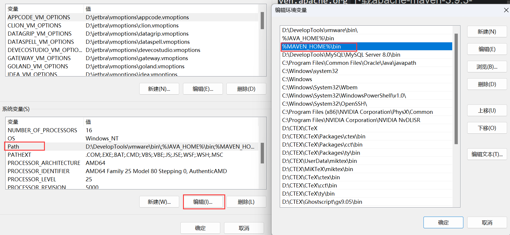

# 第01章_Maven简介

## 1. Maven的作用

Maven是一款为Java项目进行**依赖管理、构建管理**的工具，使用Maven可以自动化构建、测试、打包和发布项目，大大提高了开发效率。

**依赖管理**

Maven可以管理项目的依赖，包括自动下载所需依赖库、自动下载依赖需要的依赖并且保证版本没有冲突、依赖版本管理等。通过Maven，我们可以方便地维护项目所依赖的外部库，而我们仅仅需要编写配置即可。

**构建管理**

项目构建是指将源代码、配置文件、资源文件等转化为能够运行或部署的应用程序或库的过程。Maven可以管理项目的编译、测试、打包、部署等构建过程。通过实现标准的构建生命周期，Maven可以确保每一个构建过程都遵循同样的规则和最佳实践。同时，Maven的插件机制也使得开发者可以对构建过程进行扩展和定制。主动触发构建，只需要简单的命令操作即可。


## 2. Maven的工作机制


Maven仓库分为：

- **本地仓库**：运行Maven的计算机上的一个目录，它缓存远程下载的jar包并包含尚未发布的临时jar包。`settings.xml`文件中可以看到Maven的本地仓库路径配置，默认本地仓库路径是在`${user.home}/.m2/repository`。
- **远程仓库**：官方或者其他组织维护的Maven仓库。

Maven远程仓库可以分为：

- **中央仓库**：这个仓库是由Maven社区来维护的，里面存放了绝大多数开源的软件包，中央仓库是Maven默认配置的远程仓库。
- **私服**：私服是一种特殊的远程Maven仓库，通常使用Nexus进行搭建。它是架设在局域网内的仓库服务，私服一般被配置为互联网远程仓库的镜像，供局域网内的Maven用户使用。
- **其他的公共仓库**：有一些公共仓库是为了加速访问（比如阿里云Maven镜像仓库）或者部分jar包不存在于中央仓库中。

**Maven依赖包寻找顺序**：

1. 先去本地仓库寻找，有的话直接使用；
2. 本地仓库没有找到的话，会去远程仓库寻找，找到后会下载包到本地仓库；
3. 远程仓库没有找到的话，会报错。

## 3. Maven的安装和配置

（1）到官网`https://maven.apache.org`下载apache-maven-3.9.3-bin.zip，然后解压即可。注意Maven必须要本机有Java环境，且配置了`JAVA_HOME`系统变量。

（2）配置`MAVEN_HOME`和`PATH`




（3）在命令行输入`mvn -v`测试，查看Maven版本

（4）修改`MAVEN_HOME`路径下的conf目录下的settings.xml文件：

- 配置本地仓库地址：第55行，
    ```xml
    <localRepository>D:\maven-repository</localRepository>
    ```
- 配置Maven下载jar包时的中央仓库（阿里云提供的镜像仓库）：第168行，需要注释掉已有的mirror标签
    ```xml
    <mirror>
        <id>nexus-aliyun</id>
        <mirrorOf>central</mirrorOf>
        <name>Nexus aliyun</name>
        <url>http://maven.aliyun.com/nexus/content/groups/public</url>
    </mirror>
    ```
- 配置Maven编译项目所使用的jdk版本：第263行，
    ```xml
    <profile>
        <id>jdk-17</id>
        <activation>
            <activeByDefault>true</activeByDefault>
            <jdk>17</jdk>
        </activation>
        <properties>
            <maven.compiler.source>17</maven.compiler.source>
            <maven.compiler.target>17</maven.compiler.target>
            <maven.compiler.compilerVersion>17</maven.compiler.compilerVersion>
        </properties>
    </profile>
    ```

## 4. IDEA配置本地Maven


# 第02章_IDEA创建Maven工程

## 1. Maven工程的基本概念

### 1.1 POM

POM（Project Object Model）是项目对象模型，表示将工程抽象为一个模型，这是模型化思想的具体体现。Maven工程的核心配置文件就是**根目录下的`pom.xml`文件**。

### 1.2 Maven坐标

Maven通过groupId、artifactId、version这三个向量在Maven仓库中定位到**唯一**的jar包，这三个向量也称为Maven工程的坐标。

- groupId：公司或组织域名的倒序，通常也会加上项目名称
- artifactId：模块的名称
- version：模块的版本号，通常格式为`主版本号.次版本号.修订号`，除此之外还经常使用SNAPSHOT表示快照版本、使用RELEASE表示正式版本

举例：

```xml
<groupId>com.meituan.hotel</groupId>
<artifactId>merchant-apply-service</artifactId>
<version>1.0.28</version>
```

### 1.3 打包方式

在一个工程的Maven配置文件`pom.xml`中需要通过packaging标签来指定打包方式：

- packaging属性为jar（默认值），代表普通的Java工程，打包后的文件后缀名为`.jar`
- packaging属性为war，代表Java的web工程，打包后的文件后缀名为`.war`
- packaging属性为pom，代表不会打包，用来做父工程

### 1.4 Maven工程约定的目录结构

Maven为了让构建过程能够尽可能自动化完成，所以约定了以下目录结构：


## 2. IDEA创建Maven JavaSE工程


> 注意：version默认为1.0-SNAPSHOT，想修改可以在pom.xml中修改

## 3. IDEA创建Maven JavaEE工程

需要安装插件JBLJavaToWeb，然后根据上述步骤创建一个普通的Maven JavaSE工程，最后在工程模块右键使用JBLJavaToWeb插件快速创建web项目。


# 第03章_依赖管理

## 1. Maven依赖管理

我们通过编写pom.xml文件，Maven就能够自动解析项目的依赖关系，并通过Maven仓库**自动下载**和管理依赖，从而避免了手动下载和管理依赖的繁琐工作和可能引发的版本冲突问题。

只需在dependencies标签中引入依赖即可：

```xml
<dependencies>
    <dependency>
        <groupId>org.springframework</groupId>
        <artifactId>spring-context</artifactId>
        <version>6.0.6</version>
    </dependency>
    <dependency>
        <groupId>org.junit.jupiter</groupId>
        <artifactId>junit-jupiter-api</artifactId>
        <version>5.3.1</version>
        <scope>test</scope>
    </dependency>
    <dependency>
        <groupId>org.springframework</groupId>
        <artifactId>spring-test</artifactId>
        <version>6.0.6</version>
        <scope>test</scope>
    </dependency>
</dependencies>
```

> 补充说明：有时候一些特殊情况会导致依赖引入失败。如果依赖项的版本号是正确无误的，且网络连接也没有问题，此时依赖引入失败，很可能是本地Maven仓库被污染。我们前往本地仓库中，根据依赖的GAV坐标依次向下查找目录，最终删除内部的以`.lastupdated`结尾的文件，然后重新下载依赖即可。

## 2. 依赖范围

通过标签scope可以指定依赖范围，常见的依赖范围有以下几种：

### 2.1 compile

如果不指定scope标签，则**默认的依赖范围就是compile**。绝大多数在项目实际运行时需要用到的jar包都是使用compile这一依赖范围的。

### 2.2 test

只在测试过程中要用到的jar包，应该使用test这一依赖范围，例如junit-jupiter-api。

### 2.3 provided

如果服务器上已经自带这一jar包，但我们开发阶段又需要使用这一jar包时，就应该使用provided这一依赖范围，例如javax.servlet-api。使用provided范围，那么这一依赖就不会被放入war包中，这样部署到服务器上时就不会与服务器上的同类jar包产生冲突，同时还减轻了服务器的负担。

### 2.4 runtime

runtime这种scope专门用于编译时不需要、但运行时需要的jar包，比如热部署相关的依赖：

```xml
<dependency>
    <groupId>org.springframework.boot</groupId>
    <artifactId>spring-boot-devtools</artifactId>
    <scope>runtime</scope>
    <optional>true</optional>
</dependency>
```

> 说明：`<optional>true</optional>`表示该依赖是可选的，意味着该依赖不会被传递。

### 2.5 import

对依赖进行版本管理的最基本方法是继承父工程，但Maven是单继承的，如果不同体系的依赖版本管理信息封装在不同POM中，这种方式就无能为力。**使用import这种依赖scope，则可以导入依赖版本管理信息**。注意：使用import这种依赖scope，必须放在dependencyManagement标签中，且引入的依赖type必须是pom。

```xml
<dependencyManagement>
    <dependencies>
        <!--SpringBoot 3.0.2-->
        <dependency>
            <groupId>org.springframework.boot</groupId>
            <artifactId>spring-boot-dependencies</artifactId>
            <version>3.0.2</version>
            <type>pom</type>
            <scope>import</scope>
        </dependency>
        <!--SpringCloud 2022.0.0-->
        <dependency>
            <groupId>org.springframework.cloud</groupId>
            <artifactId>spring-cloud-dependencies</artifactId>
            <version>2022.0.0</version>
            <type>pom</type>
            <scope>import</scope>
        </dependency>
        <!--SpringCloud Alibaba 2022.0.0.0-->
        <dependency>
            <groupId>com.alibaba.cloud</groupId>
            <artifactId>spring-cloud-alibaba-dependencies</artifactId>
            <version>2022.0.0.0</version>
            <type>pom</type>
            <scope>import</scope>
        </dependency>
    </dependencies>
</dependencyManagement>
```

## 3. 依赖传递机制

**依赖传递机制**指的是当模块A依赖于模块B，而模块B又依赖于模块C时，那么A会间接依赖于C。这种依赖传递结构可以形成一个依赖树。当我们引入一个jar包时，Maven会**自动解析和加载其所有的直接和间接依赖**，确保这些依赖都可用。

> 注意：只有scope为compile的依赖，才会进行依赖传递。

## 4. 依赖冲突


### 4.1 版本仲裁机制

当直接引用或者间接引用出现了相同的jar包，就称为**依赖冲突**。此时Maven为了避免出现重复依赖，会先根据**版本仲裁机制**选出要采纳的jar包，然后对其他冲突jar包**终止依赖传递**。版本仲裁机制如下：

1. **第一原则（短路优先）**：例如`A->B->C->D->E->X(v2.0)`和`A->F->X(v1.0)`，则采纳的X版本为v1.0
2. **第二原则（先声明优先）**：当依赖路径长度相同时，在`<dependencies>`中先声明的，会优先被选择

### 4.2 依赖排除

如果根据版本仲裁机制导入的jar包并非我们所想要的版本，那么我们只能通过**依赖排除**的方式去手动解决。

> 例如在上面的案例中，我们想导入版本为v2.0的X，那么我们就需要手动排除F中的X。

```xml
<dependency>
    <groupId>org.springframework.boot</groupId>
    <artifactId>spring-boot-starter</artifactId>
    <version>3.0.2</version>
    <!-- 使用exclusions标签进行依赖排除 -->
    <exclusions>
        <!-- 在exclusion标签中配置一个具体的排除 -->
        <exclusion>
            <!-- 指定要排除的依赖的坐标（不需要写version） -->
            <groupId>org.springframework.boot</groupId>
            <artifactId>spring-boot-starter-logging</artifactId>
        </exclusion>
    </exclusions>
</dependency>
```


# 第04章_构建管理

## 1. 构建命令

| 命令        | 描述                                             |
| ----------- | ------------------------------------------------ |
| mvn clean   | 清理编译或打包后的项目结构，也就是删除target目录 |
| mvn site    | 生成一个项目具体信息的静态页面（称为站点）       |
| mvn compile | 编译项目，生成字节码文件                         |
| mvn test    | 执行测试                                         |
| mvn package | 打包项目，生成jar包或war包                       |
| mvn install | 打包后上传到Maven本地仓库                        |
| mvn deploy  | 打包后上传到Maven私服仓库                        |

### 1.1 命令行操作

> 说明：在命令行执行Maven构建操作相关的命令时，必须进入到`pom.xml`所在的目录。


### 1.2 图形化界面操作


## 2. 生命周期

为了让构建过程自动化完成，Maven设定了三个生命周期，生命周期中的每一个环节对应构建过程中的一个操作。

1. **清理周期**：对项目编译生成的文件进行清理。核心环节：clean
2. **报告周期**：生成一个项目具体信息的静态页面（称为站点）。核心环节：site
3. **默认周期**：定义了构建时所需要执行的全部步骤，是最核心的生命周期。核心环节：compile - test - package - install - deploy

> 注意：执行某个Maven构建命令时，会**自动将该生命周期中之前的环节都先执行**。例如我们执行`mvn install`命令，则实际上会执行compile、test、package、install环节。

常见的Maven命令操作：

- 重新编译：`mvn clean compile`
- 打包：`mvn clean package`
- 发布到本地仓库：`mvn clean install`
- 发布到私服仓库：`mvn clean deploy`

## 3. 插件和目标

Maven命令实际上是通过插件来执行的，例如compile是由插件maven-compiler-plugin执行的。

一个插件可以具有多个目标，其中每个目标都与生命周期中的某一个环节对应。例如默认周期中有compile和testCompile这两个和编译相关的环节，而maven-compiler-plugin插件中就有两个目标分别与之对应。


# 第05章_继承和聚合

## 1. 继承

Maven工程之间，A工程可以继承B工程，意味着A工程的pom.xml中的配置继承了B工程中pom.xml的配置。继承最主要的**作用**就是在父工程中统一管理项目中的依赖信息，具体来说就是**管理依赖信息的版本**。继承的整体流程如下：

**（1）父工程的打包方式必须是pom**

```xml
<groupId>com.wsy.maven</groupId>
<artifactId>maven-parent-demo</artifactId>
<version>1.0-SNAPSHOT</version>
<!-- 当前工程作为父工程，它要去管理子工程，所以打包方式必须是pom -->
<packaging>pom</packaging>
```

**（2）父工程使用dependencyManagement标签统一管理依赖版本**

```xml
<properties>
    <maven.compiler.source>17</maven.compiler.source>
    <maven.compiler.target>17</maven.compiler.target>
    <project.build.sourceEncoding>UTF-8</project.build.sourceEncoding>
    <!-- 自定义属性声明版本号 -->
    <spring.version>6.0.6</spring.version>
    <junit.version>5.3.1</junit.version>
</properties>

<!-- 使用dependencyManagement标签对依赖版本进行管理，被管理的依赖并不会被引入进工程 -->
<dependencyManagement>
    <dependencies>
        <dependency>
            <groupId>org.springframework</groupId>
            <artifactId>spring-context</artifactId>
            <version>${spring.version}</version>
        </dependency>
        <dependency>
            <groupId>org.junit.jupiter</groupId>
            <artifactId>junit-jupiter-api</artifactId>
            <version>${junit.version}</version>
        </dependency>
        <dependency>
            <groupId>org.springframework</groupId>
            <artifactId>spring-test</artifactId>
            <version>${spring.version}</version>
        </dependency>
    </dependencies>
</dependencyManagement>
```

> 注意：
>
> 1. **dependencyManagement标签下管理的依赖并不会被引入进工程**，其作用只是为了管理版本号，所以也**无需写scope等标签**。
> 2. 推荐**使用properties标签自定义属性声明版本号**，便于进行统一管理。
> 3. 如果想在父工程中引入一些依赖，直接被子工程继承使用，那么就使用dependencies标签即可（不要用dependencyManagement标签包裹）。

**（3）子工程使用parent标签去指定父工程**

```xml
<!-- 使用parent标签指定当前工程的父工程 -->
<parent>
    <groupId>com.wsy.maven</groupId>
    <artifactId>maven-parent-demo</artifactId>
    <version>1.0-SNAPSHOT</version>
</parent>

<!-- 子工程的坐标（如果子工程坐标中的groupId和version与父工程一致，那么可以省略） -->
<!-- <groupId>com.wsy.maven</groupId> -->
<artifactId>maven-child-demo</artifactId>
<!-- <version>1.0-SNAPSHOT</version> -->
```

**（4）子工程引用父工程管理的依赖版本，就可以省略版本号**

```xml
<dependencies>
    <dependency>
        <groupId>org.springframework</groupId>
        <artifactId>spring-context</artifactId>
    </dependency>
    <dependency>
        <groupId>org.junit.jupiter</groupId>
        <artifactId>junit-jupiter-api</artifactId>
        <scope>test</scope>
    </dependency>
    <dependency>
        <groupId>org.springframework</groupId>
        <artifactId>spring-test</artifactId>
        <scope>test</scope>
    </dependency>
</dependencies>
```

## 2. 聚合

聚合指的是使用一个总工程将各个模块工程汇集起来，作为一个完整的项目。聚合的作用如下：

1. **统一管理子模块**：通过聚合，可以将多个子模块组织在一起，便于管理和维护；
2. **一键完成构建**：很多构建命令都可以在总工程中一键执行。以`mvn install`命令为例，Maven要求有父工程时先安装父工程，有依赖的工程时先安装被依赖的工程；我们自己考虑这些规则会很麻烦，但在工程聚合之后，我们就可以在总工程中执行`mvn install`完成一键安装，底层会自动按照正确的顺序执行。

只需在总工程中配置modules即可配置聚合：

```xml
<modules>
    <module>maven-child-demo</module>
    <module>maven-test01-demo</module>
    <module>maven-test02-demo</module>
</modules>
```


# 第06章_项目部署运行

## 1. install父工程

首先需要在父工程中执行install命令，一键完成所有模块的打包并放到本地仓库中。

父工程pom.xml如下所示：

```xml
<?xml version="1.0" encoding="UTF-8"?>
<project xmlns="http://maven.apache.org/POM/4.0.0"
         xmlns:xsi="http://www.w3.org/2001/XMLSchema-instance"
         xsi:schemaLocation="http://maven.apache.org/POM/4.0.0 http://maven.apache.org/xsd/maven-4.0.0.xsd">
    <modelVersion>4.0.0</modelVersion>

    <groupId>com.wsy.maven</groupId>
    <artifactId>maven-helloworld-project</artifactId>
    <version>1.0.0</version>
    <packaging>pom</packaging>
    <modules>
        <module>maven-helloworld-domain</module>
        <module>maven-helloworld-web</module>
    </modules>

    <properties>
        <maven.compiler.source>17</maven.compiler.source>
        <maven.compiler.target>17</maven.compiler.target>
        <project.build.sourceEncoding>UTF-8</project.build.sourceEncoding>
        <springboot.version>3.0.2</springboot.version>
        <helloworld.project.version>1.0.0</helloworld.project.version>
    </properties>

    <dependencyManagement>
        <dependencies>
            <dependency>
                <groupId>org.springframework.boot</groupId>
                <artifactId>spring-boot-dependencies</artifactId>
                <version>${springboot.version}</version>
                <type>pom</type>
                <scope>import</scope>
            </dependency>
            <dependency>
                <groupId>com.wsy.maven</groupId>
                <artifactId>maven-helloworld-web</artifactId>
                <version>${helloworld.project.version}</version>
            </dependency>
            <dependency>
                <groupId>com.wsy.maven</groupId>
                <artifactId>maven-helloworld-domain</artifactId>
                <version>${helloworld.project.version}</version>
            </dependency>
        </dependencies>
    </dependencyManagement>

</project>
```

在父工程中执行以下命令：

```powershell
mvn clean install -Dmaven.test.skip=true
```

图形化界面操作方式如下：


## 2. repackage微服务模块

由于SpringBoot项目使用内置Tomcat，会加入一些额外的资源和配置，所以仅靠Maven默认插件构建得到的jar包是无法运行SpringBoot项目的。因此，SpringBoot为我们提供了spring-boot-maven-plugin插件，专门用于打包SpringBoot项目。

SpringBoot子工程pom.xml如下所示：

```xml
<?xml version="1.0" encoding="UTF-8"?>
<project xmlns="http://maven.apache.org/POM/4.0.0" xmlns:xsi="http://www.w3.org/2001/XMLSchema-instance"
         xsi:schemaLocation="http://maven.apache.org/POM/4.0.0 https://maven.apache.org/xsd/maven-4.0.0.xsd">
    <modelVersion>4.0.0</modelVersion>
    <parent>
        <groupId>com.wsy.maven</groupId>
        <artifactId>maven-helloworld-project</artifactId>
        <version>1.0.0</version>
    </parent>

    <artifactId>maven-helloworld-web</artifactId>

    <dependencies>
        <dependency>
            <groupId>com.wsy.maven</groupId>
            <artifactId>maven-helloworld-domain</artifactId>
        </dependency>
        <dependency>
            <groupId>org.springframework.boot</groupId>
            <artifactId>spring-boot-starter-web</artifactId>
        </dependency>
        <dependency>
            <groupId>org.projectlombok</groupId>
            <artifactId>lombok</artifactId>
            <optional>true</optional>
        </dependency>
        <dependency>
            <groupId>org.springframework.boot</groupId>
            <artifactId>spring-boot-starter-test</artifactId>
            <scope>test</scope>
        </dependency>
    </dependencies>

    <build>
        <plugins>
            <plugin>
                <groupId>org.springframework.boot</groupId>
                <artifactId>spring-boot-maven-plugin</artifactId>
                <configuration>
                    <excludes>
                        <exclude>
                            <groupId>org.projectlombok</groupId>
                            <artifactId>lombok</artifactId>
                        </exclude>
                    </excludes>
                </configuration>
            </plugin>
        </plugins>
    </build>

</project>
```

我们需要在该SpringBoot子工程中执行以下命令：

```powershell
mvn clean package spring-boot:repackage -Dmaven.test.skip=true
```

图形化界面操作方式如下：


> 说明：**SpringBoot项目打包的核心是调用spring-boot插件的repackage目标**，不过它要求先将该微服务初始的jar包准备好，所以需要在该命令之前先执行package子命令。

## 3. 运行微服务

我们将SpringBoot模块target目录下生成的jar包`maven-helloworld-web-1.0.0.jar`上传到Linux服务器，然后执行以下命令即可后台运行微服务：

```shell
nohup java -jar /home/wsy/maven-helloworld-web-1.0.0.jar > /home/wsy/logs/output.log 2>&1 &
```


# 第07章_Maven高级特性

事实上，Maven不仅仅是一款**依赖管理**和**构建管理**的工具，更是一款**项目管理工具**，在pom文件中还可以声明各种项目描述信息。

## 1. POM的四个层次

POM分为四个层次：

1. **超级POM**：是所有POM的顶级POM，如果我们自己的POM没有指定继承某个父POM，则会默认继承超级POM。超级POM中定义了很多构建过程中的默认设定，例如源文件存放的目录、测试源文件存放的目录、构建输出的目录等等。
2. **父POM**：与Java类似，POM之间也是单继承的。
3. **当前POM**：也就是当前工程的`pom.xml`，是我们最多关注和使用的一层。
4. **有效POM**：effective POM是隐含的一层，但却是实际上真正生效的一层。在POM的继承关系中，子POM可以覆盖父POM中的配置；如果子POM没有覆盖，那么父POM中的配置将会被继承。按照这个规则，继承关系中的所有POM叠加到一起，就得到了一个最终生效的POM，它就是effective POM。Maven实际执行构建操作就是按照effective POM来运行的。

## 2. 属性的声明和引用

### 2.1 属性的声明

通过properties标签可以声明属性：

```xml
<properties>
    <java.version>17</java.version>
    <mysql.version>8.3.0</mysql.version>
    <redis.starter.version>3.3.4</redis.starter.version>
</properties>
```

### 2.2 属性的引用

- **`${自定义属性}`可以引用properties标签中自定义的属性**。例如`${mysql.version}`的值为`8.3.0`
- **`${project.标签名.子标签名}`可以引用当前POM中的元素值**。例如`${project.version}`的值为`0.0.1-SNAPSHOT`
- `${系统属性}`可以引用系统属性。例如`${os.name}`的值为`Windows 11`
- `${env.系统环境变量名}`可以引用系统环境变量。例如`${env.JAVA_HOME}`的值为`D:\Java\jdk-17`
- `${settings.标签名}`可以引用`settings.xml`中配置的元素值。例如`${settings.localRepository}`的值为`D:\maven-repository`

## 3. build标签

### 3.1 build标签的功能

我们配置build标签后，会与超级POM中的build配置进行叠加，主要用于**定制化构建过程**。build标签的子标签大致包含三个功能：

1. **定义约定的目录结构**。例如sourceDirectory标签、testSourceDirectory标签、outputDirectory标签等。
2. **插件版本管理**。使用pluginManagement标签可以对插件版本进行管理，子工程使用插件时可以省略版本号。例如我们使用spring-boot-maven-plugin插件时无需指定版本号，其原因正是SpringBoot父工程中已经管理好了插件版本。
3. **通过plugins标签引入插件**

### 3.2 plugin标签

一个典型的示例为：

```xml
<build>
    <plugins>
        <plugin>
            <groupId>org.springframework.boot</groupId>
            <artifactId>spring-boot-maven-plugin</artifactId>
            <configuration>
                <excludes>
                    <exclude>
                        <groupId>org.projectlombok</groupId>
                        <artifactId>lombok</artifactId>
                    </exclude>
                </excludes>
            </configuration>
        </plugin>
    </plugins>
</build>
```

plugin标签的子标签大致包含以下三个部分：

1. **坐标部分**：通过groupId、artifactId、version定义坐标
2. **执行部分**：通过executions标签可以配置多个execution标签，execution标签内可以配置id（唯一标识）、phase（关联的生命周期阶段）、goals（关联指定生命周期的目标）
3. **配置部分**：通过configuration标签可以进行自定义配置

### 3.3 指定构建JDK版本

本地执行Maven构建时，默认采用settings.xml中指定的JDK版本。但在实际项目中，我们并不会在本地执行Maven构建，而是会远程进行项目的构建部署，此时本地的settings.xml就不起作用了。所以我们需要对Maven插件进行JDK版本的配置。

**传统方式：在父工程POM中手动指定Maven插件的configuration**

```xml
<build>
    <plugins>
        <plugin>
            <groupId>org.apache.maven.plugins</groupId>
            <artifactId>maven-compiler-plugin</artifactId>
            <version>3.8.1</version>
            <configuration>
                <source>17</source>
                <target>17</target>
                <encoding>UTF-8</encoding>
            </configuration>
        </plugin>
    </plugins>
</build>
```

**推荐方式：在父工程POM中通过properties配置指定版本，则maven-compiler-plugin会自动读取并使用该配置**

```xml
<properties>
    <maven.compiler.source>17</maven.compiler.source>
    <maven.compiler.target>17</maven.compiler.target>
    <project.build.sourceEncoding>UTF-8</project.build.sourceEncoding>
</properties>
```

**最佳实践**：

- 对于普通的Maven工程，只需在properties标签中进行如下配置即可：

  ```xml
  <properties>
      <maven.compiler.source>17</maven.compiler.source>
      <maven.compiler.target>17</maven.compiler.target>
      <project.build.sourceEncoding>UTF-8</project.build.sourceEncoding>
  </properties>
  ```

- 对于继承了spring-boot-starter-parent的SpringBoot工程，只需在properties标签中配置`java.version`即可（因为spring-boot-starter-parent会根据`java.version`自动帮我们配置好上述三个属性）：

  ```xml
  <properties>
      <java.version>17</java.version>
  </properties>
  ```

### 3.4 SpringBoot定制化打包

默认的Maven插件只能生成一个普通的jar包，无法运行SpringBoot项目。所以SpringBoot提供了spring-boot-maven-plugin插件进行定制化打包，通过`spring-boot:repackage`得到的jar包可以直接通过`java -jar`启动运行：

```xml
<build>
    <plugins>
        <plugin>
            <groupId>org.springframework.boot</groupId>
            <artifactId>spring-boot-maven-plugin</artifactId>
        </plugin>
    </plugins>
</build>
```

