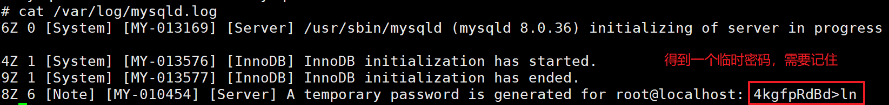
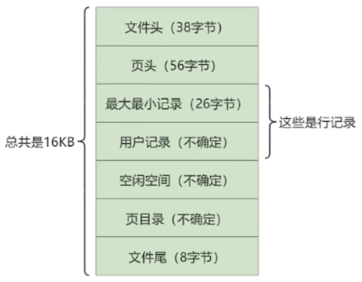

# 第01章_数据库概述

## 1. 基本概念

- DBMS，数据库管理系统(Database Management System)，是一种操纵和管理数据库的大型软件，用于对数据库进行统一管理和控制。常见的DBMS有Oracle、MySQL等。
- DB，数据库(Database)，是存储数据的仓库，其本质是一个文件系统。
- SQL，结构化查询语言(Structured Query Language)，是专门用来与数据库通信的语言。


MySQL是一个开源的关系型数据库管理系统(RDBMS)，它比Oracle体积小、成本低。MySQL在历史版本中，从5.7版本直接跳跃发布了8.0版本，这是一个里程碑版本，大幅提升了性能。

RDBMS是DMBS的主流，像Oracle、MySQL都是RDBMS。关系型数据库以二维表格形式（行和列）存储数据，表与表之间的数据记录可以有关系。SQL就是关系型数据库的查询语言。

> 非关系型数据库无需经过SQL解析，一般性能都非常高，例如Redis

## 2. 表的关联关系

### 2.1 一对一关联

一对一关联在实际开发中应用不多，因为它通常可以合成为一张表。举例：

- 用户的常用信息表：id, name, age
- 用户的不常用信息表: id, hobby, remark

这两个表通过主键id关联，形成一对一关联。

### 2.2 一对多关联

一对多关联，就是在从表(多方)创建一个字段，指向主表(一方)的主键。举例：

- 部门表(主表)：部门id, 部门名称, 部门简介
- 员工表(从表)：员工id, 员工其他信息..., 员工所属部门id(指向部门表的主键)

### 2.3 多对多关联

要表示多对多关系，必须创建第三个表，该表通常称为`联接表`或`中间表`，用于将多对多关系划分为两个一对多关系，该中间表保存这两个表的主键。举例：

- 角色表：role_id, role_name, role_info
- 权限表：perm_id, perm_name, perm_info
- 中间表：id, role_id, perm_id

### 2.4 自我引用


## 3. Linux安装MySQL

### 3.1 下载安装MySQL Server

（1）前往官网并选择版本进行下载 https://dev.mysql.com/downloads/mysql/


（2）将下载得到的`mysql-8.0.36-1.el7.x86_64.rpm-bundle.tar`进行解压，然后将解压后的所有文件都上传到Linux服务器的`/opt/mysql-8.0.36`目录下

（3）检查依赖

```sh
chmod -R 777 /tmp
yum update
yum install libaio
yum install net-tools
yum install perl
yum remove mysql-libs
```

（4）安装MySQL

```sh
cd /opt/mysql-8.0.36
rpm -ivh mysql-community-common-8.0.36-1.el7.x86_64.rpm
rpm -ivh mysql-community-client-plugins-8.0.36-1.el7.x86_64.rpm
rpm -ivh mysql-community-libs-8.0.36-1.el7.x86_64.rpm
rpm -ivh mysql-community-client-8.0.36-1.el7.x86_64.rpm
rpm -ivh mysql-community-icu-data-files-8.0.36-1.el7.x86_64.rpm
rpm -ivh mysql-community-server-8.0.36-1.el7.x86_64.rpm
```

（5）MySQL服务初始化

```sh
mysqld --initialize --user=mysql
cat /var/log/mysqld.log
```



（6）启动MySQL服务

```sh
systemctl start mysqld.service
systemctl enable mysqld.service
```

### 3.2 登录MySQL

（1）登录MySQL，执行以下命令后输入密码（首次登录时需要使用上述临时密码）

```sh
mysql -hlocalhost -P3306 -uroot -p
```

（2）修改密码

```sql
ALTER USER 'root'@'localhost' IDENTIFIED BY 'abc666';
```

（3）配置允许远程登录（将root用户对应的host设置为`%`，表示允许所有ip都能连接）

```sql
USE mysql;
update user set host = '%' where user ='root';
flush privileges;
```

（4）现在，就可以使用Navicat远程连接MySQL了

### 3.3 字符集

MySQL5.7版本还需要将默认字符集修改为utf-8，而MySQL8.0版本则无需这一步骤。我们可以查看：

```sql
mysql> show variables like 'character%';
+--------------------------+--------------------------------+
| Variable_name            | Value                          |
+--------------------------+--------------------------------+
| character_set_client     | utf8mb4                        |
| character_set_connection | utf8mb4                        |
| character_set_database   | utf8mb4                        |
| character_set_filesystem | binary                         |
| character_set_results    | utf8mb4                        |
| character_set_server     | utf8mb4                        |
| character_set_system     | utf8mb3                        |
| character_sets_dir       | /usr/share/mysql-8.0/charsets/ |
+--------------------------+--------------------------------+
8 rows in set (0.00 sec)
```

- `character_set_server`是服务器级别的字符集
- `character_set_database`是数据库级别的字符集，也就是创建数据库时的默认字符集
- MySQL还有表级别的字符集，如果创建表时不额外指定字符集，则默认使用的就是该表所在数据库的字符集
- MySQL还有列级别的字符集，如果创建存储字符串的列时不额外指定字符集，则默认使用的就是该列所在表的字符集

> 说明：utf8mb4是标准的utf8字符集，即使用1到4个字节表示字符；而utf8mb3并不标准，只使用1到3个字节表示字符。**推荐统一使用utf8mb4**。

## 4. SQL简介

### 4.1 SQL分类

SQL语言在功能上主要分为如下三大类：

- **DDL（Data Definition Language，数据定义语言）**：包括创建，删除，修改数据库、表、视图、索引等数据库对象。主要的语句关键字包括`CREATE`、`DROP`、`ALTER`等。
- **DML（Data Manipulation Language，数据操作语言）**：包括添加，删除，更新，查询数据库记录。主要的语句关键字包括`INSERT`、`DELETE`、`UPDATE`、`SELECT`等。
- **DCL（Data Control Language，数据控制语言）**：包括定义数据库、表、字段、用户的访问权限和安全级别。主要的语句关键字包括`GRANT`、`REVOKE`、`COMMIT`、`ROLLBACK`、`SAVEPOINT`等。

> 说明：由于查询语句使用的非常频繁，所以有时也将查询语句单独分为一类，称为**DQL（Data Query Language，数据查询语言）**。有时也会将`COMMIT`、`ROLLBACK`单独分为一类，称为**TCL（Transaction Control Language，事务控制语言）**。

### 4.2 SQL规范

规则：

- 每条SQL语句以`;`或者`\g`或者`\G`结束
- 字符串、日期时间类型的数据，使用单引号`''`
- 如果要对列起别名，则别名建议使用双引号`""`，且尽量不要省略as
- 如果数据库名、表名或者字段名与保留字冲突，则必须使用着重号``引起来

在Linux中，MySQL的大小写规则为：

- 数据库名、表名、表的别名、变量名是严格区分大小写的
- SQL关键字、函数名、列名、列的别名是不区分大小写的

> 注意：在Windows中，以上全部都不区分大小写。

因此，我们建议采用统一的书写规范：

- 数据库名、表名、表的别名、列名、列的别名统一小写
- SQL关键字、函数名、绑定变量等统一大写

## 5. MySQL的架构

### 5.1 MySQL的逻辑架构

MySQL是典型的C/S架构，服务端程序使用的mysqld。整个过程总体来看就是**客户端进程向服务器进程发送一段文本（SQL语句），服务器进程处理后再向客户端进程发送一段文本（处理结果）**。这个过程可以细分为如下三个步骤：

1. 客户端首先向MySQL Server建立TCP连接
2. MySQL Server中分为三层逻辑结构，来处理客户端请求
3. 最终将数据存储到文件系统中，并响应客户端


MySQL Server中分为三层逻辑结构：

#### 第一层：连接层

连接层的主要作用有：

- 管理连接：收到客户端的TCP连接请求后，每一个连接会从线程池中获取线程，该线程专门与这个客户端进行交互
- 用户认证：建立TCP连接后，会对用户传输的账号密码做身份认证
- 获取权限：用户身份认证通过后，会从权限表中查出该用户的权限，将权限与这个连接关联

#### 第二层：服务层

在服务层，MySQL Server会解析请求并创建相应的语法树，并对其完成优化（如确定查询表的顺序，是否利用索引等），最后生成相应的执行计划。服务层的常用组件如下：

- SQL接口(SQL Interface)：用于接收用户的SQL命令，并且返回给用户结果
- 解析器(Parser)：对SQL语句进行语法分析，并生成语法树
- 优化器(Optimizer)：对SQL语句进行优化，生成一个执行计划
- 查询缓存(Caches)：缓存一些查询语句及其查询结果。注意，在MySQL 8中已经删除了查询缓存，因为必须要完全相同的查询语句才能命中缓存，所以缓存命中率极低。

所以在MySQL 8中SQL语句的执行流程为：

1. 解析器对SQL语句进行语法分析，然后生成语法树
2. 优化器对SQL语句进行优化，确定SQL语句的执行路径（比如选择`全表检索`还是`索引检索`，要使用哪个索引等等），最终生成一个执行计划
3. 执行器根据执行计划，去调用一个具体的存储引擎来真正执行SQL语句

#### 第三层：引擎层

插件式存储引擎（Storage Engines），真正地负责了MySQL中数据的存储和提取，对物理服务器级别维护的底层数据执行操作，服务器通过API与存储引擎进行通信。

### 5.2 存储引擎

MySQL支持很多存储引擎，但最常用的是InnoDB和MyISAM。在MySQL 5.5之前的默认存储引擎是MyISAM，而在MySQL 5.5及之后的**默认存储引擎是InnoDB**。这两个存储引擎的主要区别如下：

- InnoDB支持事务；而MyISAM不支持事务
- InnoDB支持外键；而MyISAM不支持外键
- InnoDB支持表级锁和行级锁；而MyISAM只支持表级锁
- InnoDB的数据文件将表结构信息、数据信息、索引信息保存在同一个文件中；而MyISAM则将这三部分信息保存在三个文件中
- MyISAM针对数据统计有额外的常数存储，所以其`COUNT(*)`的时间复杂度是`O(1)`；而InnoDB的`COUNT(*)`的时间复杂度是`O(n)`
- MyISAM适用于以读为主的业务，其访问速度很快；而具备增删改查的业务，必然优先选择InnoDB
- InnoDB占用的磁盘空间更大
- 在数据库缓冲池中，InnoDB既缓存真实数据，又缓存索引；而MyISAM在数据库缓冲池中只缓存索引，不缓存真实数据。所以InnoDB使用的内存也更大。
- MyISAM不支持数据库异常崩溃后的安全恢复，而InnoDB支持，它主要依靠于redo log

### 5.3 数据库缓冲池

我们以`InnoDB`存储引擎为例来介绍数据库缓冲池(buffer pool)。`InnoDB`存储引擎是以页为单位来管理存储空间的，磁盘I/O需要消耗的时间很多，而在内存中进行操作效率则会高很多。所以DBMS会申请一块内存作为数据库缓冲池，来提高数据库的读写性能。

InnoDB存储引擎的缓冲池中，主要缓存了以下内容：


- 对于读操作，首先会判断该页面是否在缓冲池中，如果存在就直接读取，否则就会从磁盘中找到页面然后放入缓冲池中再进行读取。
- 对于写操作，如果我们是对缓冲池中的数据进行修改，那么该数据并不会立即写入磁盘，而是会将这个页设置为脏页，交由后台线程将脏页写入到磁盘，以提高整体性能。

> 注1：`数据库缓冲池`和`查询缓存`是两个完全不同的概念，查询缓存是只缓存查询语句及其查询结果，其缓存命中率很低，在MySQL 8中已被删除。
>
> 注2：`MyISAM`存储引擎的数据库缓冲池只缓存索引，而并不会缓存真实数据。

### 5.4 MySQL的数据目录

MySQL的数据目录，也就是数据库文件的默认存放路径为`/var/lib/mysql/`。我们自己创建的数据库都会在其中有一个对应的目录（目录名和数据库名相同），进入该目录后，里面保存的文件都与该数据库中的表有关联。具体而言：

- 如果某个表`t1_name`采用的是InnoDB引擎，则会有一个`t1_name.ibd`文件，用于存储这个表的**表结构信息、数据信息和索引信息**。
- 如果某个表`t2_name`采用的是MyISAM引擎，则会有以下三个文件（因为MyISAM中的索引都是`二级索引`，所以**数据和索引是分开存储的**）：
  - `t2_name_xxx.sdi`：存储这个表的表结构信息（xxx一般是几个数字）
  - `t2_name.MYD`：存储这个表的数据信息
  - `t2_name.MYI`：存储这个表的索引信息


# 第02章_DQL语句

我们首先导入sql脚本`testdb.sql`，便于学习和测试，如果导入时遇到外键约束检查问题，可以采用以下解决方案：

```sql
set FOREIGN_KEY_CHECKS=0;  #在导入前设置为不检查外键约束
set FOREIGN_KEY_CHECKS=1;  #在导入后恢复检查外键约束
```

## 1. 基本语法

### 1.1 SELECT基本查询

```sql
SELECT 字段名1, 字段名2
FROM 表名
WHERE 过滤条件;
```

举例：

```sql
SELECT employee_id, last_name, job_id
FROM employees
WHERE department_id = 90;
```

**注意**：在生产环境下，建议不要使用`SELECT *`进行查询，因为获取不需要的列数据会严重降低查询效率。

### 1.2 列的别名

在很多时候都需要给列起别名，例如方便计算等等。建议在列名和列的别名之间不要省略关键字`AS`，且列的别名使用双引号包裹。

```sql
SELECT last_name AS "name", salary * 12 AS "annual salary"
FROM employees;
```

> 注意：所有运算符或列值遇到null，运算的结果都为null

### 1.3 去重

使用关键字`DISTINCT`可以去除重复行。注意：`DISTINCT`必须放在所有列名的前面，它实际上是对所有列名的组合进行去重。

```sql
SELECT DISTINCT department_id, salary
FROM employees;
```

### 1.4 查询常数

SELECT还可以对常数进行查询，也就是在查询结果中增加一列固定的常数列，一般用于做某些标记。

```sql
SELECT last_name, '清华大学' as "school"
FROM employees;
```

### 1.5 排序

使用`ORDER BY`子句进行排序：

```sql
SELECT last_name
FROM employees
ORDER BY salary DESC, last_name ASC;
```

以上表示先按salary降序排序，如果salary相同再按last_name升序排序。升序排序时`ASC`关键字可以省略，但我们并不推荐省略。

### 1.6 分页

使用`LIMIT`可以实现分页：

```sql
LIMIT 位置偏移量, 行数
```

`位置偏移量`指的是查询到的内容从哪一条记录开始显示，而`行数`指的是返回的记录数。注意，`位置偏移量`可以省略，此时`位置偏移量`的值默认是0，也就是从第一条记录开始显示。

当使用分页查询时，使用的公式如下：

- `位置偏移量 = (当前页数 - 1) * 每页条数`
- `行数 = 每页条数`

举例：假设每页8条记录，查询第3页的记录

```sql
SELECT * FROM employees
LIMIT 16, 8;
```

> 说明：约束返回结果的数量可以提升查询效率，假设我们知道返回结果只有一条，就可以使用`LIMIT 1`，这样`SELECT`语句只要检索到一条符合条件的记录即可返回。

## 2. 运算符

### 2.1 算术运算符

算术运算符有`+`、`-`、`*`、`/`、`%`，注意，MySQL中的`+`只能表示数值的相加，如果遇到非数值类型，则会将其转化为数值类型再进行相加。如果想在MySQL中实现字符串拼接，需要使用`CONCAT()`函数。

### 2.2 比较运算符

比较运算符进行比较后，结果为真则返回1，结果为假则返回0，其余情况则返回NULL。常用的比较运算符有：

- `=` 判断两个操作数是否相等
- `<=>` 安全判断两个操作数是否相等。当两个操作数均为NULL时，返回1；当只有一个操作数为NULL时，返回0；当两个操作数都不是NULL时，返回结果与`=`一致。
- `!=` 判断两个操作数是否不相等，也可以使用`<>`
- `<`、`<=`、`>`、`>=`

> 注意：除了`<=>`外，以上其他运算符，只要有一个操作数为NULL，比较结果就为NULL

除此以外，还有非符号类型的运算符：

- `last_name IS NULL`判断last_name是否为NULL
- `last_name IS NOT NULL`判断last_name是否不为NULL
- `employee_id BETWEEN 100 AND 150`判断employee_id是否属于区间`[100, 150]`
- `employee_id IN (100, 101, 201)`判断employee_id是否在集合`{100, 101, 201}`中
- `employee_id NOT IN (100, 101, 201)`判断employee_id是否不在集合`{100, 101, 201}`中
- `last_name LIKE '%a%'`判断last_name中是否包含字符`a`。`LIKE`运算符通常用于模糊匹配，经常会使用以下两个通配符：`%`匹配0个或多个任意字符，`_`只能匹配1个任意字符。

### 2.3 逻辑运算符

- `!`表示逻辑非，也可以使用`NOT`关键字
- `&&`表示逻辑与，也可以使用`AND`关键字
- `||`表示逻辑或，也可以使用`OR`关键字
- `XOR`表示逻辑异或

**注意**：操作数尽量不要为NULL，否则很可能运算结果得到NULL。除此之外，`AND`的优先级高于`OR`，在实际开发中如果记不清运算符优先级，建议使用括号。

### 2.4 位运算符

MySQL也支持位运算符，但非常少用，如果有进行位运算的需求一般都会在Java代码中实现。

## 3. 多表查询

### 3.1 多表查询的分类

#### 1、等值连接与非等值连接

**等值连接**：连接条件中的比较运算符是`=`

举例：查询员工及其所属部门名称

```sql
SELECT e.employee_id, e.last_name, d.department_name 
FROM employees e
	JOIN departments d ON e.department_id = d.department_id;
```

注意事项：

1. `JOIN ... ON`子句中，JOIN后面的是要连接的表名，ON后面的是这两张表的连接条件
2. 多表查询中，建议**连接的表名都使用别名**进行简化，且**字段名都需要限定表的别名**（否则如果同一个字段出现在两张表中，不加表名的限定就会报错）
3. 连接条件中的字段，数据类型必须保证绝对一致，而且该字段尽量要有索引（提升性能）
4. 超过三个表禁止`JOIN`，因为多表连接就类似于嵌套for循环，连接的表数量过多时会严重影响性能

**非等值连接**：连接条件中的比较运算符不是`=`

举例：查询员工的工资所属的等级

```sql
SELECT e.last_name, e.salary, j.grade_level
FROM employees e 
	JOIN job_grades j ON e.salary BETWEEN j.lowest_sal AND j.highest_sal;
```

#### 2、自连接与非自连接

**非自连接**：连接的表是不同的。前面我们所示例的都是非自连接。

**自连接**：连接的表是自身。

举例：查询员工及其上司的姓名

```sql
SELECT t1.last_name AS "员工姓名", t2.last_name AS "上司姓名"
FROM employees t1 
	JOIN employees t2 ON t1.manager_id = t2.employee_id;
```

#### 3、内连接与外连接

**内连接**：两个表连接时，返回满足连接条件的行。使用关键字`JOIN`或`INNER JOIN`或`CROSS JOIN`都表示内连接。前面我们所示例的都是内连接。

**左外连接**：两个表连接时，除了返回满足连接条件的行，还返回左表中剩余的不满足连接条件的行，此时左表也称为主表，右表也称为从表。使用关键字`LEFT JOIN`或`LEFT OUTER JOIN`都表示左外连接。

**右外连接**：两个表连接时，除了返回满足连接条件的行，还返回右表中剩余的不满足连接条件的行，此时左表也称为从表，右表也称为主表。使用关键字`RIGHT JOIN`或`RIGHT OUTER JOIN`都表示右外连接。

**满外连接**：两个表连接时，除了返回满足连接条件的行，还返回左表和右表中剩余的不满足连接条件的行。注意，MySQL中的满外连接，只能结合`LEFT JOIN`、`RIGHT JOIN`和`UNION`关键字来实现。

### 3.2 UNION关键字

利用UNION关键字，可以给出多条SELECT语句，并将它们的结果合并成单个结果集。注意，合并时两个表**对应的列数和数据类型必须相同，并且相互对应**。格式如下：

```sql
SELECT column, ... FROM table1
UNION [ALL]
SELECT column, ... FROM table2;
```

- `UNION`会返回两个查询结果集的并集，并且去除重复记录
- `UNION ALL`会返回两个查询结果集的并集，但对于重复记录不会进行去重

> 说明：执行`UNION ALL`语句所需的资源比`UNION`更少，如果明确知道合并后的结果集不会存在重复记录，则一定要使用`UNION ALL`来提升查询效率。

### 3.3 七种JOINS的实现


```sql
# 中图：内连接 A∩B 
SELECT e.employee_id, e.last_name, d.department_name
FROM employees e 
	JOIN departments d ON e.department_id = d.department_id;
```

```sql
# 左上图：左外连接
SELECT e.employee_id, e.last_name, d.department_name
FROM employees e 
	LEFT JOIN departments d ON e.department_id = d.department_id;
```

```sql
# 右上图：右外连接
SELECT e.employee_id, e.last_name, d.department_name
FROM employees e 
	RIGHT JOIN departments d ON e.department_id = d.department_id;
```

```sql
# 左中图：A - A∩B
SELECT e.employee_id, e.last_name, d.department_name
FROM employees e 
	LEFT JOIN departments d ON e.department_id = d.department_id
WHERE d.department_id IS NULL;
```

```sql
# 右中图：B - A∩B
SELECT e.employee_id, e.last_name, d.department_name
FROM employees e 
	RIGHT JOIN departments d ON e.department_id = d.department_id
WHERE e.department_id IS NULL;
```

```sql
# 左下图：满外连接
# 可以UNION左中图和右上图
SELECT e.employee_id, e.last_name, d.department_name
FROM employees e 
	LEFT JOIN departments d ON e.department_id = d.department_id
WHERE d.department_id IS NULL
UNION ALL # 一定不会有重复记录，所以使用UNION ALL提升效率
SELECT e.employee_id, e.last_name, d.department_name
FROM employees e 
	RIGHT JOIN departments d ON e.department_id = d.department_id;
```

```sql
# 右下图：可以UNION左中图和右中图
SELECT e.employee_id, e.last_name, d.department_name
FROM employees e 
	LEFT JOIN departments d ON e.department_id = d.department_id
WHERE d.department_id IS NULL
UNION ALL # 一定不会有重复记录，所以使用UNION ALL提升效率
SELECT e.employee_id, e.last_name, d.department_name
FROM employees e 
	RIGHT JOIN departments d ON e.department_id = d.department_id
WHERE e.department_id IS NULL;
```

## 4. 单行函数

单行函数就是只对一行进行变换，每行返回一个结果，单行函数可以嵌套。MySQL内置的常用单行函数有以下几种。

### 4.1 数值函数

- `ABS(x)`：返回x的绝对值
- `LEAST(e1, e2, ...)`：返回列表中的最小值
- `GREATEST(e1, e2, ...)`：返回列表中的最大值
- `RAND()`：返回0到1之间的随机值
- `ROUND(x, y)`：返回对x的值进行四舍五入后最接近x的值，并保留到小数点后面y位
- `TRUNCATE(x, y)`：返回数字x截断为y位小数的结果

### 4.2 字符串函数

- `CHAR_LENGTH(s)`：返回字符串s的字符数
- `LENGTH(s)`：返回字符串s的字节数，与字符集有关
- `CONCAT(s1, s2, ...)`：字符串拼接
- `LEFT(s, n)`：返回字符串s最左边的n个字符
- `RIGHT(s, n)`：返回字符串s最右边的n个字符
- `TRIM(s)`：去掉字符串s开始与结尾的空格
- `REVERSE(s)`：返回字符串s反转后的结果

### 4.3 日期和时间函数

在MySQL中日期和时间格式为：`'2021-10-25 19:36:55'`

- `CURDATE()`：返回当前日期，只包含年月日
- `CURTIME()`：返回当前时间，只包含时分秒
- `NOW()`、`CURRENT_TIMESTAMP()`：返回当前日期和时间
- `UNIX_TIMESTAMP(date)`：将日期时间date以UNIX时间戳的形式返回
- `FROM_UNIXTIME(timestamp)`：返回UNIX时间戳timestamp对应的日期时间
- `YEAR(date)`、`MONTH(date)`、`DAY(date)`：返回具体的年、月、日
- `HOUR(date)`、`MINUTE(date)`、`SECOND(date)`：返回具体的时、分、秒
- `DATEDIFF(date1, date2)`：返回date1-date2的日期间隔天数
- `TIMEDIFF(date1, date2)`：返回date1-date2的时间间隔，返回值格式为`783:40:49`

### 4.4 流程控制函数

#### 1、IF

```sql
# 如果test的值为true，则返回value1，否则返回value2
IF(test, value1, value2)
```

#### 2、IFNULL

```sql
# 如果value1为NULL，则返回value2，否则返回value1
IFNULL(value1, value2)
```

说明：这个函数经常可以用来给可能为NULL的字段设定计算时的默认值（以防计算结果为NULL），例如

```sql
SELECT employee_id, 12 * salary * (1 + IFNULL(commission_pct, 0))
FROM employees;
```

#### 3、CASE的第一种用法

```sql
CASE
WHEN condition1 THEN result1 
WHEN condition2 THEN result2 
...
[ELSE other_result] 
END
```

这种用法就相当于Java的`if ... else if ... else ...`，举例：

```sql
SELECT employee_id, salary, CASE
	WHEN salary >= 15000 THEN '高薪'
	WHEN salary >= 10000 THEN '潜力股'
	WHEN salary >= 8000 THEN '小资'
	ELSE '平民'
END AS '描述信息'
FROM employees;
```

#### 4、CASE的第二种用法

```sql
CASE expr
WHEN const1 THEN value1 
WHEN const2 THEN value2 
...
[ELSE other_value] 
END
```

这种用法就相当于Java的`switch ... case ...`，举例：

```sql
SELECT last_name, job_id, salary, CASE job_id
	WHEN 'IT_PROG'  THEN 1.10 * salary
	WHEN 'ST_CLERK' THEN 1.15 * salary
	WHEN 'SA_REP'   THEN 1.20 * salary
	ELSE salary 
END AS "最终薪资"
FROM employees;
```

## 5. 聚合函数和分组

### 5.1 聚合函数

聚合函数也称为聚集函数、分组函数，它是对一组数据进行汇总的函数，输入的是一组数据的集合，输出的是单个值。聚合函数主要有：

- `AVG(column)`：计算该列的平均值，注意该字段类型必须是数值型
- `SUM(column)`：计算该列的总和，注意该字段类型必须是数值型
- `MAX(column)`：计算该列的最大值
- `MIN(column)`：计算该列的最小值
- `COUNT(*)`或`COUNT(1)`：返回表中的记录总数
- `COUNT(column)`：返回该列中不为NULL的记录总数

> 注意：**聚合函数不能嵌套调用**，例如`AVG(SUM(column))`就是非法的。

我们不推荐使用`COUNT(column)`，因为它无法统计NULL值的记录。`COUNT(*)`或`COUNT(1)`才是标准的统计行数的语法。

- 对于MyISAM引擎的表，`COUNT(*)`或`COUNT(1)`执行的时间复杂度是`O(1)`，因为该引擎内部会维护一个计数器，保存该表的记录总数。
- 对于InnoDB引擎的表，`COUNT(*)`或`COUNT(1)`执行的时间复杂度是`O(n)`，因为它需要遍历整个表才能得到记录总数。

### 5.2 GROUP BY

使用`GROUP BY`子句可以将表中的数据分为若干组，其基本语法如下：

```sql
SELECT column, ...
FROM table
WHERE condition1
GROUP BY column, expression, ...
HAVING condition2;
```

**注意事项1**：在`SELECT`列表中，除了聚合函数中的列，其他所有出现的列，都应该包含在`GROUP BY`子句中

```sql
SELECT department_id, AVG(salary)
FROM employees
GROUP BY department_id;
```

**注意事项2**：`GROUP BY`也可以根据多个列来进行分组

```sql
SELECT department_id, AVG(salary)
FROM employees
GROUP BY department_id, job_id;
```

**注意事项3**：`HAVING`不能单独使用，必须跟在`GROUP BY`之后，用于对分组后的数据进行过滤筛选。注意，在`WHERE`子句中不能使用聚合函数，但在`HAVING`子句中可以使用聚合函数。

```sql
SELECT department_id, MAX(salary)
FROM employees
GROUP BY department_id
HAVING MAX(salary) > 10000;
```

> **说明**：底层执行的顺序严格按照`WHERE`、`GROUP BY`、`HAVING`，也就是说先进行`WHERE`过滤，再进行分组，再进行`HAVING`过滤。因此，我们推荐将不包含聚合函数的过滤条件都写到`WHERE`中，先进行大面积过滤再进行分组，能够提升效率；而包含聚合函数的过滤条件，只能写到`HAVING`中，因为必须在分组之后才能对每个分组进行聚合函数的计算并过滤。

### 5.3 SELECT的执行流程

一个标准的SELECT语句格式如下，注意关键字顺序是不能颠倒的：

```sql
SELECT DISTINCT ...
FROM ...
	JOIN ... ON ...
WHERE ...
GROUP BY ...
HAVING ...
ORDER BY ...
LIMIT ...
```

而SELECT语句的底层执行顺序则是：

```sql
FROM ... JOIN ... ON ... # 顺序1
WHERE ...                # 顺序2
GROUP BY ...             # 顺序3
HAVING ...               # 顺序4
SELECT ...               # 顺序5
DISTINCT                 # 顺序6
ORDER BY ...             # 顺序7
LIMIT ...                # 顺序8
```

**具体流程**如下：

1. 首先根据`FROM`定位到要查询的表，如果是多表联查，则还会经过以下步骤：
   - 先求笛卡尔积（即左表的第一条记录，与右表的所有记录关联，然后以此类推处理左表的第二条记录，...）得到一张虚拟表，该表的总记录数就是这两张表记录数的乘积
   - 然后根据`ON`中的连接条件进行筛选
   - 如果我们使用的是左外连接、右外连接、满外连接，则还会添加外部行（也就是相应的一些不满足连接条件的行）
   - 如果是超过两张表以上的JOIN，则重复上述步骤，直到处理完所有表
2. 根据`WHERE`条件对表中的数据进行过滤
3. 根据`GROUP BY`对表中的数据进行分组
4. 根据`HAVING`对表中的数据进行分组过滤
5. 根据`SELECT`提取所需要的列
6. 如果使用了`DISTINCT`关键字，则会过滤掉重复的行
7. 根据`ORDER BY`指定的字段进行排序
8. 根据`LIMIT`取出指定行的记录，得到最终的结果集

## 6. 子查询

### 6.1 简介

子查询指一个查询语句嵌套在另一个查询语句内部的查询。例如：

```sql
SELECT last_name, salary
FROM employees
WHERE salary > (
	SELECT salary
	FROM employees
	WHERE last_name = 'Abel'
);
```

注意：

- 子查询(内查询)会在主查询之前一次执行完成，子查询的结果被主查询(外查询)使用
- 子查询要包含在括号内，且将子查询放在比较条件的右侧
- 单行操作符对应单行子查询，多行操作符对应多行子查询

子查询有以下两种分类方式：

- 按照内查询的结果返回一条记录还是多条记录，可以将子查询分为`单行子查询`和`多行子查询`
- 按照内查询是否被执行多次，可以将子查询分为`相关子查询`和`不相关子查询`
  - 不相关子查询：内查询从数据表中查询到结果，如果这个结果只执行一次，并作为主查询的条件，那么这样的子查询就称为不相关子查询。
  - 相关子查询：如果内查询需要执行多次，即采用循环的方式，先从外查询开始，每次都传入内查询进行查询，然后再将结果反馈给外部，这种嵌套的执行方式就称为相关子查询。

> **说明**：如果同一个需求，使用多表连接查询或者子查询都能实现，一般情况下建议使用**多表连接查询**。因为子查询需要创建临时表，耗费性能，而且临时表中没有索引，所以子查询的效率比连接查询低很多。
>
> **注意**：子查询不仅仅可以用在查询语句中，在`INSERT`、`UPDATE`、`DELETE`语句中同样可以使用子查询。

### 6.2 单行子查询

单行子查询，就是内查询只返回一条记录，所以对应外查询中使用的就是单行比较操作符，如`=`、`!=`、`>`、`>=`、`<`、`<=`，我们以几个例题来演示单行子查询。

例1：返回公司工资最少的员工的last_name和salary

```sql
SELECT last_name, salary
FROM employees
WHERE salary = (
	SELECT MIN(salary) FROM employees
);
```

例2：查询最低工资大于50号部门最低工资的部门id和其最低工资

```sql
SELECT department_id, MIN(salary)
FROM employees
GROUP BY department_id
HAVING MIN(salary) > (
	SELECT MIN(salary)
	FROM employees
	WHERE department_id = 50
);
```

例3：显示员工的employee_id, last_name, location。其中，若员工的department_id与location_id为1800的department_id相同，则location为`'Canada'`，其余则为`'USA'`

```sql
SELECT employee_id, last_name, CASE department_id
	WHEN (
		SELECT department_id FROM departments
		WHERE location_id = 1800
	) THEN 'Canada'
	ELSE 'USA'
END AS "location"
FROM employees;
```

### 6.3 多行子查询

多行子查询，就是内查询会返回多行记录，所以对应外查询中应该使用多行比较操作符：

- `IN`：等于列表中的任意一个
- `ANY`：需要和单行比较操作符一起使用，和子查询返回的某一个值比较
- `ALL`：需要和单行比较操作符一起使用，和子查询返回的所有值比较

例1：返回其它job_id中比job_id为`'IT_PROG'`的任一员工的工资低的员工的employee_id, last_name, job_id和salary

```sql
SELECT employee_id, last_name, job_id, salary
FROM employees
WHERE salary < ANY (
	SELECT salary FROM employees
	WHERE job_id = 'IT_PROG'
)
AND job_id != 'IT_PROG';
```

例2：查询平均工资最低的部门id

```sql
SELECT department_id
FROM employees
GROUP BY department_id
HAVING AVG(salary) <= ALL (
	SELECT AVG(salary)
	FROM employees
	GROUP BY department_id
);
```

### 6.4 相关子查询

我们之前举例的都是不相关子查询。而如果子查询的执行依赖于外部查询，通常情况下都是因为子查询中的表用到了外部的表，并进行了条件关联，因此每执行一次外部查询，子查询都要重新计算一次，这样的子查询就称之为`相关子查询`。

例1：查询员工中工资大于本部门平均工资的员工的last_name, salary, department_id

**方式一**：使用相关子查询

```sql
SELECT last_name, salary, department_id
FROM employees e 
WHERE salary > (
	SELECT AVG(salary) FROM employees
	WHERE department_id = e.department_id
);
```

**方式二**：在FROM中使用不相关子查询构建一张临时的虚拟表

```sql
SELECT e.last_name, e.salary, e.department_id
FROM employees e, (
	SELECT department_id, AVG(salary) AS "dept_salary"
	FROM employees
	GROUP BY department_id
) tmp
WHERE e.department_id = tmp.department_id
AND e.salary > tmp.dept_salary;
```

例2：查询公司管理者的employee_id，last_name，job_id，department_id信息

```sql
SELECT employee_id, last_name, job_id, department_id
FROM employees e1 
WHERE EXISTS (
	SELECT * FROM employees e2 
	WHERE e2.manager_id = e1.employee_id
);
```

> 说明：相关子查询中常常会用到`EXISTS`，它用于检查子查询是否会返回记录：一旦在子查询中找到一条满足条件的记录，就会直接返回true，不再继续进行子查询；否则就会返回false。还有一个关键字`NOT EXISTS`用于检查子查询是否不会返回记录。


# 第03章_数据库和表的管理

## 1. 数据库的管理

### 1.1 创建数据库

```sql
CREATE DATABASE [IF NOT EXISTS] db_name DEFAULT CHARACTER SET utf8mb4;
```

### 1.2 使用(切换)数据库

```sql
USE db_name;
```

### 1.3 查看数据库

- 查看所有数据库

```sql
SHOW DATABASES;
```

- 查看当前正在使用的数据库

```sql
SELECT DATABASE();
```

- 查看指定数据库下的所有表

```sql
SHOW TABLES FROM db_name;
```

- 查看数据库的创建信息

```sql
SHOW CREATE DATABASE db_name;
```

### 1.4 删除数据库

```sql
DROP DATABASE [IF EXISTS] db_name;
```

## 2. MySQL中的数据类型

### 2.1 整数类型

**原则**：如果是整数，则建议使用`INT`，若项目的数据量特别大就使用`BIGINT`，它们分别对应Java中的`Integer`(4字节)和`Long`(8字节)。注意，如果确定该字段一定是非负整数，则使用`INT UNSIGNED`或`BIGINT UNSIGNED`。

### 2.2 小数类型

**原则**：如果是小数，则使用`DECIMAL`，禁止使用`FLOAT`和`DOUBLE`，因为它们存在精度损失问题。注意，如果存储的数据范围超过`DECIMAL`的范围，则建议将数据拆成整数和小数并分开存储。

`DECIMAL`实际上是定点数类型，而`FLOAT`和`DOUBLE`则是浮点数类型，所以`DECIMAL`不会出现精度损失问题，其底层在MySQL中是以字符串形式存储的。

在定义时，使用`DECIMAL(M,D)`的方式定义数据类型，其中M是精度（即整数位和小数位的总位数），D是标度（即小数位的位数），显然D必须小于M。例如`DECIMAL(5,2)`类型表示该列数据的取值范围是`-999.99~999.99`。如果我们定义`DECIMAL`时不指定精度和标度，则默认为`DECIMAL(10,0)`。

### 2.3 日期时间类型

**原则**：如果是日期时间，则使用`DATETIME`，它的格式是`YYYY-MM-DD HH:MM:SS`

在向`DATETIME`类型的字段插入数据时，可以使用`YYYY-MM-DD HH:MM:SS`或者`YYYYMMDDHHMMSS`格式的字符串，最终都会转化为`YYYY-MM-DD HH:MM:SS`格式。`DATETIME`类型会占用8个字节的存储空间。

还有一些其他类型有时也会用到：

- `TIMESTAMP`类型：它是带时区的日期时间类型，格式与`DATETIME`相同，但会根据所在的时区而显示不同的时间。该类型只占用4个字节的存储空间，所以能够表示的时间范围也比`DATETIME`要小，其底层真实存储的实际是时间戳毫秒值。
- `DATE`类型：占用3个字节，仅表示日期而没有时间，格式为`YYYY-MM-DD`
- `TIME`类型：占用3个字节，仅表示时间而没有日期，格式为`HH:MM:SS`

### 2.4 字符串类型

**原则**：如果存储的字符串长度几乎相等，则使用`CHAR`；否则就使用`VARCHAR`，但尽量保证其长度不要超过5000；如果存储长度大于5000的字符串，则使用`TEXT`，并且独立出来一张表，用主键来关联，避免影响其他字段索引效率。

- `CHAR(M)`是固定长度的字符串，长度为M个字符，如果不指定M，则默认M为1
- `VARCHAR(M)`是可变长度的字符串，实际存储大小为`实际长度+1个字节`，定义时必须指定M，表示长度至多为M个字符
- `TEXT`一般用于保存比较大的文本段，最大可达4G

## 3. 表的管理

### 3.1 创建表

```sql
CREATE TABLE [IF NOT EXISTS] 表名 (
	字段1 数据类型 [约束条件] [默认值],
	字段2 数据类型 [约束条件] [默认值],
	...,
	[表级约束条件]
);
```

一个规范的建表语句如下：

```sql
CREATE TABLE user_info (
`id` int unsigned NOT NULL AUTO_INCREMENT COMMENT '自增主键',
`user_id` bigint NOT NULL COMMENT '用户id',
`username` varchar(45) NOT NULL COMMENT '真实姓名',
`birthday` date NOT NULL COMMENT '生日',
`sex` tinyint(4) DEFAULT '0' COMMENT '性别',
`short_introduce` varchar(150) DEFAULT NULL COMMENT '自己介绍，最多150个汉字',
`user_resume` varchar(300) NOT NULL COMMENT '用户提交的简历存放地址',
`create_time` datetime NOT NULL DEFAULT CURRENT_TIMESTAMP COMMENT '创建时间',
`update_time` datetime NOT NULL DEFAULT CURRENT_TIMESTAMP ON UPDATE
CURRENT_TIMESTAMP COMMENT '修改时间',
PRIMARY KEY (`id`),
UNIQUE KEY `uniq_user_id` (`user_id`),
KEY `idx_username` (`username`)
) ENGINE=InnoDB DEFAULT CHARSET=utf8 COMMENT='网站用户基本信息';
```

### 3.2 查看表的结构

使用`DESCRIBE 表名;`或者`DESC 表名;`可以查看表结构。

```sql
mysql> DESCRIBE employees;
+----------------+-------------+------+-----+---------+-------+
| Field          | Type        | Null | Key | Default | Extra |
+----------------+-------------+------+-----+---------+-------+
| employee_id    | int         | NO   | PRI | 0       |       |
| first_name     | varchar(20) | YES  |     | NULL    |       |
| last_name      | varchar(25) | NO   |     | NULL    |       |
| email          | varchar(25) | NO   | UNI | NULL    |       |
| phone_number   | varchar(20) | YES  |     | NULL    |       |
| hire_date      | date        | NO   |     | NULL    |       |
| job_id         | varchar(10) | NO   | MUL | NULL    |       |
| salary         | double(8,2) | YES  |     | NULL    |       |
| commission_pct | double(2,2) | YES  |     | NULL    |       |
| manager_id     | int         | YES  | MUL | NULL    |       |
| department_id  | int         | YES  | MUL | NULL    |       |
+----------------+-------------+------+-----+---------+-------+
11 rows in set (0.00 sec)
```

- Field是字段名称
- Type是字段类型
- Null表示该字段是否可以存储NULL值
- Key表示该字段是否已编制索引
- Default表示该字段的默认值
- Extra表示该字段的附件信息，例如`AUTO_INCREMENT`等

除此之外，也可以使用`SHOW CREATE TABLE 表名 \G`查看表创建的详细语句，包括存储引擎和字符编码：

```sql
mysql> SHOW CREATE TABLE employees \G
*************************** 1. row ***************************
       Table: employees
Create Table: CREATE TABLE `employees` (
  `employee_id` int NOT NULL DEFAULT '0',
  `first_name` varchar(20) DEFAULT NULL,
  `last_name` varchar(25) NOT NULL,
  `email` varchar(25) NOT NULL,
  `phone_number` varchar(20) DEFAULT NULL,
  `hire_date` date NOT NULL,
  `job_id` varchar(10) NOT NULL,
  `salary` double(8,2) DEFAULT NULL,
  `commission_pct` double(2,2) DEFAULT NULL,
  `manager_id` int DEFAULT NULL,
  `department_id` int DEFAULT NULL,
  PRIMARY KEY (`employee_id`),
  UNIQUE KEY `emp_email_uk` (`email`),
  UNIQUE KEY `emp_emp_id_pk` (`employee_id`),
  KEY `emp_dept_fk` (`department_id`),
  KEY `emp_job_fk` (`job_id`),
  KEY `emp_manager_fk` (`manager_id`),
  CONSTRAINT `emp_dept_fk` FOREIGN KEY (`department_id`) REFERENCES `departments` (`department_id`),
  CONSTRAINT `emp_job_fk` FOREIGN KEY (`job_id`) REFERENCES `jobs` (`job_id`),
  CONSTRAINT `emp_manager_fk` FOREIGN KEY (`manager_id`) REFERENCES `employees` (`employee_id`)
) ENGINE=InnoDB DEFAULT CHARSET=utf8mb3
1 row in set (0.00 sec)
```

### 3.3 修改表的结构

- 添加一个字段

```sql
ALTER TABLE 表名 ADD 字段名 字段类型 [AFTER 表中的某个字段名];
```

- 修改某个字段

```sql
ALTER TABLE 表名 MODIFY 字段名 字段类型;
```

- 重命名某个字段

```sql
ALTER TABLE 表名 CHANGE 原字段名 新字段名 新数据类型;
```

- 删除某个字段

```sql
ALTER TABLE 表名 DROP 字段名;
```

### 3.4 重命名表

```sql
RENAME TABLE 原表名 TO 新表名;
```

### 3.5 清空表

清空表中的所有数据，有以下两种方式：

```sql
TRUNCATE TABLE 表名;
DELETE FROM 表名;
```

其中，`TRUNCATE`的方式速度更快，但是该语句不能回滚，而`DELETE`语句可以回滚。开发中为了安全，尽量使用`DELETE`。

### 3.6 删除表

```sql
DROP TABLE [IF EXISTS] 表名;
```

## 4. 约束

### 4.1 简介

为了保证数据的完整性，SQL规范以约束(constraint)的方式对**表数据进行额外的条件限制**。一般都是在创建表时规定约束，当然也可以在创建表之后通过`ALTER TABLE`语句规定约束。

> 说明：在创建表时，写在字段后面的约束称之为`列级约束`，写在所有字段下面的约束称之为`表级约束`。

约束主要分为以下几类：

- `NOT NULL`非空约束
- `UNIQUE`唯一约束
- `PRIMARY KEY`主键约束
- `DEFAULT`默认值约束
- `FOREIGN KEY`外键约束

### 4.2 非空约束

默认情况下，所有数据类型的值都可以为NULL，但如果我们给某个字段添加了非空约束，这个字段的值就不允许为NULL。添加非空约束的语法如下：

```sql
CREATE TABLE 表名 (
	字段名 数据类型 NOT NULL
);
```

> 通常我们建议表中所有字段尽量都是`NOT NULL`约束，业务可以根据需要定义`DEFAULT值`

### 4.3 唯一约束

给某个字段添加唯一约束后，这个字段的值就必须唯一，但是可以出现多个NULL值。注意，添加唯一约束就会**默认创建唯一索引**，所以我们推荐使用`表级约束`的方式来创建唯一约束，并给该唯一约束命名（如果不命名，则默认和列名相同），语法如下：

```sql
CREATE TABLE 表名 (
    `user_id` bigint NOT NULL,
    UNIQUE KEY `uniq_user_id` (`user_id`) # 给字段user_id添加唯一约束，并命名该约束
);
```

我们也可以创建复合唯一约束，也就是要求多个字段组合的值唯一：

```sql
CREATE TABLE 表名 (
    `department` int NOT NULL,
    `username` varchar(50) NOT NULL,
    UNIQUE KEY `uniq_dept_uname` (`department`, `username`) 
);
```

如果我们想删除唯一约束，则只能通过索引的名称来删除唯一索引：

```sql
# 可以先查看表中的所有索引
SHOW INDEX FROM 表名;
# 然后根据索引名，删除索引
ALTER TABLE 表名 DROP INDEX `uniq_user_id`;
```

### 4.4 主键约束

主键用于唯一标识表中的一行记录，一个表中必须**有且仅有一个主键**，添加主键约束后对应字段就是唯一且非空的。可以给某一列创建主键约束，也可以给多个列的组合创建主键约束(即复合主键，但这些列必须都不为空，且组合的值不能重复)。创建主键约束时，会**默认创建主键索引**，该索引的名称始终是**PRIMARY**，我们无法自己指定。推荐使用`表级约束`的方式来创建主键约束，语法如下：

```sql
CREATE TABLE 表名 (
    `id` int unsigned NOT NULL AUTO_INCREMENT,
    PRIMARY KEY (`id`)
);
```

### 4.5 默认值约束

默认值约束用于给某个字段指定默认值，如果在插入数据时该字段没有显式赋值，则赋值为默认值。语法如下：

```sql
CREATE TABLE 表名 (
	字段名 数据类型 NOT NULL DEFAULT 默认值
);
```

> 说明：默认值约束一般不在唯一约束列和主键列上加

通常如果我们不想让字段出现NULL值影响计算时，就可以添加默认值约束`NOT NULL DEFAULT 0`或者`NOT NULL DEFAULT ''`

### 4.6 外键约束

外键约束用于限定表的某个字段的引用完整性，例如通过外键约束就可以保证员工表的员工所在部门，一定能在部门表中找到。然而，一旦添加外键约束，每次增删改数据时MySQL就会进行非常耗时的外键约束检查。因此，我们**禁止使用外键约束**，数据的引用完整性应该交给Java应用层来检查。

### 4.7 自增列

自增列的关键字是`AUTO_INCREMENT`，用于让某个字段的值自动递增，使用时有以下要求：

- 一个表至多只能有一个自增列
- 只有主键列，或者唯一约束的列，才可以设置为自增列
- 自增列的数据类型必须是整数类型
- 插入数据时，如果自增列字段的值为0或NULL，则插入后该字段的值会在自增列所维护的最大值基础上自增；如果插入数据时自增列字段的值是手动指定的具体值，则插入后该字段的值就是这一具体值。

语法如下：

```sql
CREATE TABLE 表名 (
    `id` int unsigned NOT NULL AUTO_INCREMENT,
    PRIMARY KEY (`id`)
);
```

自增列的**底层原理**：InnoDB数据字典内部会维护一个自增列的计数器，并将其持久化到`重做日志`中，计数器的初始值默认是1。所以，如果表中自增字段的值已经有`1,2,3,4,5`，则删除值为`5`的记录后，下次再插入新的记录，则其自增字段的值为`6`而不是`5`。如果我们插入一条自增字段值为给定具体值`100`的记录，则计数器维护的值也会修改，从而下一次自动插入的值就应该是`101`

## 5. 数据的增删改

### 5.1 新增数据

基本语法：

```sql
INSERT INTO 表名 (column1, column2, ...)
VALUES
(value1, value2, ...),
(value1, value2, ...),
...;
```

- 该插入语句为表的指定字段`(column1, column2, ...)`插入数据，其余字段则使用表定义时的默认值（如果没定义默认值，则为NULL）
- 如果插入的数据包含所有的字段，且顺序与表定义时字段的顺序一致，则可以省略`(column1, column2, ...)`，但我们并不推荐省略。
- 注意：插入字符串或者日期型的数据应该包含在单引号中

我们还可以使用子查询，将其他表的查询结果插入到表中：

```sql
INSERT INTO 目标表名 (tar_column1, tar_column2, ...)
SELECT (src_column1, src_column2, ...)
FROM 源表名
[WHERE condition];
```

- 使用这种语法，无需写`VALUES`关键字
- 注意，子查询中的值列表应与`INSERT`子句中的列名对应

### 5.2 修改数据

基本语法：

```sql
UPDATE 表名
SET column1 = value1, column2 = value2, ...
[WHERE condition];
```

> 注意：如果不加`WHERE`条件过滤，则会进行全表更新，开发中要注意这种安全隐患。

### 5.3 删除数据

基本语法：

```sql
DELETE FROM 表名
[WHERE condition];
```

> 注意：如果不加`WHERE`条件过滤，则会进行全表删除，开发中要注意这种安全隐患。


# 第04章_MySQL的其他基本知识

MySQL的其他基本知识（不常用），详见supplement目录。

MySQL语法的练习题，详见exercise目录。

# 第05章_索引

## 1. 索引的底层结构

### 1.1 索引简介

索引(Index)是存储引擎用于快速找到数据记录的一种数据结构。注意，索引是在存储引擎中实现的，所以每种存储引擎的索引不完全相同。

- 索引的优点：**提高数据查询的效率，减少磁盘I/O次数**
- 索引的缺点：维护索引要耗费时间，**会降低增、删、改的速度**；每个索引都对应一颗B+树，**会占用大量磁盘空间**

### 1.2 InnoDB中的索引

我们从零开始来推演InnoDB中的索引结构。首先建一个表：

```sql
mysql> CREATE TABLE index_demo (
-> c1 INT,
-> c2 INT,
-> c3 CHAR(1),
-> PRIMARY KEY(c1)
-> ) ROW_FORMAT = Compact;
```

我们规定了c1列为主键，这个表使用Compact行格式来实际存储记录。这里我们简化了index_demo表的行格式示意图并将其竖起来：


我们只在示意图里展示记录的这几个部分：

* record_type：记录头信息的一项属性，表示记录的类型，0表示普通记录、1表示目录项记录、2表示最小记录、3表示最大记录。 
* next_record：记录头信息的一项属性，表示下一条记录地址相对于本条记录的地址偏移量，我们用箭头来表明下一条记录。 
* 各个列的值：这里只记录在index_demo表中的三个列，分别是c1、c2和c3

把一些记录放到页里的示意图就是：


#### 版本1.0：简单的索引设计方案

我们可以为快速定位记录所在的数据页而建立一个目录，建这个目录必须完成下边这些事：

**条件1：下一个数据页中用户记录的主键值必须大于上一个页中用户记录的主键值**


注意：新分配的**数据页编号可能并不是连续的**，它们只是通过维护上一个页和下一个页的编号而建立了**双向链表**关系。另外，为了满足条件1，在插入主键值为4的记录时需要伴随着一次**记录移动**，如上图所示，这个过程称为**页分裂**。

**条件2：给所有的页建立一个目录项**

我们需要给所有数据页做个**目录**，每个页对应一个目录项，每个目录项包括下边两个部分：

- 页的用户记录中最小的主键值：我们用**key**来表示。
- 页号：我们用**page_no**表示。


#### 版本2.0：目录页

InnoDB使用记录头信息里的**record_type**属性来区分一条记录是普通的**用户记录**还是**目录项记录**：

* 0：普通的用户记录
* 1：目录项记录
* 2：最小记录
* 3：最大记录


从图中可以看出来，我们新分配了一个编号为30的页来专门存储目录项记录，称之为**目录页**。注意**目录项记录**和普通的**用户记录** 

**不同点**：

* **目录项记录**的record_type值是1，而**普通用户记录**的record_type值是0 
* 目录项记录只有**主键值和页的编号**两个列，而普通的用户记录的列是用户自己定义的，可能包含**很多列**，另外实际上还有InnoDB自己添加的隐藏列
* 了解：记录头信息里还有一个叫**min_rec_mask**的属性，只有在存储**目录项记录**的页中的主键值最小的**目录项记录**的**min_rec_mask**值为**1**，其他别的记录的**min_rec_mask**值都是**0**

**相同点**：底层实际上都会为主键值生成**Page Directory(页目录)**，从而在按照主键值进行查找时可以使用**二分法**来加快查询速度。

#### 版本3.0：多个目录页


#### 版本4.0：目录页的目录页


如图，我们生成了一个存储更高级目录项的`页33`，这个页中的两条记录分别代表`页30`和`页32`，如果用户记录的主键值在`[1, 320)`之间，则到`页30`中查找更详细的目录项记录，如果主键值不小于320的话，就到`页32`中查找更详细的目录项记录。

我们可以用下边这个图来描述它（这个数据结构就是B+树）：


#### 版本5.0(最终版本)：B+Tree

一个B+树的节点其实可以分成好多层，规定最下边的那层，也就是存放我们用户记录的那层为第0层，之后依次往上加。真实环境中一个页存放的记录数量是非常大的，假设所有存放用户记录的叶子节点代表的数据页可以存放100条用户记录，所有存放目录项记录的内节点代表的数据页可以存放1000条目录项记录，那么：

* 如果B+树有3层，最多能存放`1000×1000×100=1,0000,0000`条记录
* 如果B+树有4层，最多能存放`1000×1000×1000×100=1000,0000,0000`条记录

所以一般情况下，我们用到的**B+树都不会超过4层**，那我们通过主键值去查找某条记录最多只需要做4个页面内的查找（查找3个目录项页和一个用户记录页），又因为在每个页面内有所谓的**Page Directory**(页目录)，所以在页面内也可以通过**二分法**实现快速定位记录。

#### 补充说明

InnoDB中的B+树实际上还有以下两个特点：

（1）**根页面位置始终不变，且根页面始终在内存中**：最开始表中没有数据的时候，每个索引对应的B+树的`根结点`中既没有用户记录，也没有目录项记录；随着用户记录的添加，当根节点中的可用`空间用完时`继续插入记录，此时会将根节点中的所有记录复制到多个新分配的页，而此时这个`根节点`便升级为存储目录项记录的页。

（2）**内节点中目录项记录必须保证唯一性**：前面我们演示的B+树的内节点中目录项记录的内容是`索引列 + 页号`的搭配，但对于二级索引来说实际上并非如此。为了让新插入记录找到自己在哪个页面，我们就需要**保证在B+树的同一层页节点的目录项记录除页号这个字段以外是唯一的**。所以二级索引的内节点的目录项记录的内容，实际上是由三个部分构成的：`索引列的值、主键值、页号`，根据主键值就能保证唯一性。

### 1.3 索引的常见概念

- 按照物理实现方式，索引可以分为**聚簇索引**和**非聚簇索引**，其中非聚簇索引也称为二级索引。
- 按照作用字段个数，索引可以分为**单列索引**和**联合索引**
- 按照功能逻辑，索引可以分为**普通索引**、**唯一索引**、**主键索引**、**全文索引**、**空间索引**

#### 1、聚簇索引

聚簇索引会将**完整的用户记录**(也就是所有列的数据)存储在B+树的叶子节点。**InnoDB中根据主键创建的主键索引就是聚簇索引**。聚簇索引的特点如下：

- B+树的叶子节点存储的是完整的用户记录，所以查找数据很快，因为只需根据主键定位到数据后，就能立即得到其他字段的值。
- 聚簇索引使用主键值的大小进行记录和页的排序，所以根据主键查找时速度非常快。

> **注意**：根据InnoDB表主键索引的以上特点，我们要求其**主键必须是递增的，且不能被更新**。如果主键不是递增的，则插入记录可能会产生页分裂，严重影响性能；同理，更新主键的代价很高，所以建议不要更新主键。

#### 2、二级索引

二级索引在B+树的叶子节点中并不会保存完整的用户记录，而是只保存**指定的索引列以及主键的值**。所以在InnoDB中除了主键索引以外，我们创建的**其他索引都是二级索引**。例如，我们给表中的c2列创建索引，它就会创建一颗新的B+树，具有以下特点：

- 二级索引以指定列(c2列)的大小作为数据页和页中记录的排序规则
- B+树的叶子节点存储的数据是`c2列+主键`
- B+树的目录项记录中存储的数据是`c2列+主键+页号`（下图中为了简便，省略了主键）
- 根据`c2列`进行查找时速度非常快，但是二级索引通常都需要**回表**。也就是说如果我们还需要除了主键和c2列以外的字段数据，则在二级索引定位到叶子节点的记录后，还需要根据该主键值去聚簇索引中再查找一次，才能得到完整的用户记录。


#### 3、单列索引

单列索引，顾名思义就是只根据某一个字段创建的索引。

#### 4、联合索引

联合索引，顾名思义就是根据多个字段创建的索引。例如我们为`(c2列, c3列)`创建索引，这就是一个联合索引，它具有以下特点：

- 数据页和页中记录的排序会先按照c2列进行排序；在c2列值相等的情况下，再按照c3列进行排序
- B+树的叶子节点存储的数据是`c2列+c3列+主键`
- B+树的目录项记录中存储的数据是`c2列+c3列+主键+页号`

### 1.4 MyISAM中的索引


MyISAM索引的底层结构虽然也是B+Tree，但是它将**索引列的值和完整的用户记录分开存储**。例如，我们为c2列创建索引，它具有如下特点：

- B+树的叶子节点中存储的数据是`c2列+数据记录地址`，这颗B+树单独保存在`索引文件`中。而完整的用户记录单独保存在`数据文件`中，这个数据文件与索引没有任何关系(底层结构也不是B+树)，它只按照记录的插入顺序来保存所有记录。
- 因此，在MyISAM中没有聚簇索引，而**全都是二级索引**。即便是为主键创建的主键索引，其叶子节点同样只存储`主键列+数据记录地址`，所以仍然是个二级索引。因此MyISAM中甚至可以没有主键。
- MyISAM中的查询操作，始终都需要一次**回表**操作，也就是到数据文件中查找完整的数据记录。不过MyISAM中的回表，比InnoDB中的回表要快得多（因为InnoDB中的回表则是要再查找一颗B+树）

> **说明**：MyISAM可以没有主键，但InnoDB必须有主键。在InnoDB中，表如果没有显式指定主键，则会自动选择一个`非空且唯一`的列作为主键；如果不存在这种列，则自动为InnoDB表生成一个隐含字段作为主键，这个字段长度为6个字节，类型为长整型。
>
> **总结**：MyISAM表的索引全都是二级索引；InnoDB表必然有且仅有一个聚簇索引(也就是主键索引，实际上数据表本身存储的形式就是以主键索引的B+树结构存储的)，而其他的索引均为二级索引。

### 1.5 B+Tree数据结构详解

数据库索引一般很大，存储在磁盘上，所以我们根据索引查询时，不可能把整个索引全部加载到内存中，因此MySQL衡量查询效率的标准就是**磁盘IO次数**。加快查找速度的数据结构，常见的就是`哈希`和`平衡二叉搜索树`。

#### 1、Hash

Hash结构的查询时间复杂度为`O(1)`，速度非常快，然而InnoDB和MyISAM存储引擎都不支持Hash索引，其原因在于：

- Hash索引只有在等值查询时效率很高，如果要进行范围查询，时间复杂度退化为`O(n)`
- Hash索引中数据的存储是无序的，所以对于`ORDER BY`查询，还需要重新排序
- 对于联合索引，Hash值是将联合索引键合并后一起来计算的，无法对单独的一个键进行查询
- 对于等值查询来说，通常Hash索引效率更高，但如果索引列的重复值很多，Hash索引效率就变低了，因为遇到Hash冲突时需要遍历桶中的单链表进行比较。

> 补充：InnoDB本身不支持Hash索引，但是它提供`自适应Hash索引`，即如果某个数据经常被访问，当满足一定条件时，就会将这个数据页的地址存放到Hash表中，这样在下次查询时就可以直接找到这个页面的所在位置。

#### 2、B树

如果索引采用树结构，那么磁盘的IO次数正比于树的高度，而多叉树的高度会远远小于二叉树，因此B树和B+树的优先级很高。B树是多路平衡查找树，其结构如下：


一个M阶B树（M>2）有以下特点：

1. 根节点的儿子数的范围是`[2,M]`
2. 每个中间节点包含`k-1`个关键字和`k`个孩子，`孩子的数量=关键字的数量+1`，`k`的取值范围为`[ceil(M/2), M]` 
3. 叶子节点包括`k-1`个关键字（叶子节点没有孩子），k 的取值范围同上。所有叶子节点位于同一层。

#### 3、B+树

B+树也是一种多路平衡搜索树，基于B树作出了改进，它更适合文件索引系统。

**B+树和B树的差异在于以下几点**：

1. B+树中，一个节点的孩子数量等于关键字数；而B树中，`孩子数量 = 关键字数 + 1`。
2. B+树中，非叶子节点的关键字也会同时存在在子节点中，并且是在子节点中所有关键字的最小（或最大）。 
3. B+树中，非叶子节点仅保存索引列、不保存数据记录，跟记录有关的信息都放在叶子节点中；而B树中，非叶子节点既保存索引列，也保存数据记录。 
4. B+树中所有关键字都会在叶子节点出现，叶子节点间构成一个有序链表，而且叶子节点本身也按照关键字从小到大顺序链接。

**B+树的优势**：

- 查询效率更加稳定：所有用户数据记录查询路径长度相同，都会查找到叶子结点。
- 磁盘读写代价更低：B+树的内节点中并没有保存数据记录，所以能存储的目录项记录就更多，因此结构上比B树更加矮胖，树高越小意味着IO次数越少。
- 在范围查询上B+树效率也更高：因为所有关键字都出现在B+树的叶子节点中，而叶子节点之间数据递增，且有指针连接，可以直接根据指针顺序读取。

> 说明：B树和B+树是两种不同的数据结构，不能混淆。但是在MySQL中只会使用到B+树，所以有时人们会将B+树简称为B树，因此，在MySQL中提到B树的概念，实际上指的都是B+树。

## 2. InnoDB数据存储结构

### 2.1 页(Page)

由于InnoDB是MySQL现在的默认存储引擎，所以我们主要研究InnoDB中数据的存储结构。InnoDB以`页`作为磁盘和内存之间交互的**基本单位**，InnoDB中页的大小默认为`16KB`。所以无论是读取表的一行还是多行，都会将这些行所在的页都加载到内存。

比`页`大的单位还有区、段、表空间，它们之间的关系如下：


- 区(Extent)由一系列连续的页所组成，在InnoDB中默认一个区会**分配64个连续的页**
- 段(Segment)由一个或多个区组成，段是数据库中的`分配单位`，例如创建一张表时就会创建一个表段、创建一个索引时就会创建一个索引段
- 表空间(Tablespace)是一个逻辑容器，由一个或多个段组成。一个数据库就由一个或多个表空间组成。

### 2.2 页的内部结构

页有很多类型，最常见的是`数据页`（B+树的节点），数据页分为以下七个部分：



- 文件头(File Header)：保存页的通用信息，如页号、页的类型、上一页的页号、下一页的页号
- 页头(Page Header)：保存页的状态信息
- 最大最小记录：保存当前页中的最大记录(Supremum)和最小记录(Infimum)，是两条虚拟记录
- 用户记录(User Records)：按照`行格式`保存一条条用户记录，记录之间构成单链表
- 空闲空间(Free Space)：页中还没有被使用的空间
- 页目录(Page Directory)：用于保存用户记录的相对位置，便于二分查找提升效率。在底层，实际上会对这些用户记录进行分组，每组都包含一定数量的用户记录，在查找时首先通过二分查找定位到所在的组，然后在这个组中单链表顺序遍历找到目标记录。
- 文件尾(File Tailer)：用于校验页是否完整

### 2.3 行格式

行格式，也称为记录格式。行格式种类有很多，在MySQL 8中默认的行格式是`Dynamic`，它与另一种行格式`Compact`非常相似，只不过在处理行溢出数据时有所不同。所以我们着重介绍`Compact`行格式，它包含两部分内容：记录的额外信息、记录的真实数据。

#### 1、记录的额外信息

记录的额外信息中，主要包含以下三部分内容：

1. 变长字段长度列表：对于一些变长类型的字段(例如`VARCHAR`)，需要保存这些字段实际占用的长度，这就是这条记录中`变长字段长度列表`保存的内容。
2. NULL值列表：如果某个字段没有非空约束，就需要使用NULL值列表中的一个比特位来记录该字段的值是否为NULL，1表示该字段的值为NULL，0表示该字段的值不为NULL。如果所有字段都具有非空约束，则NULL值列表就不存在。
3. 记录头信息

记录头信息，主要包含以下6个字段：

- `delete_mask`：1代表当前记录已被删除，0代表当前记录未被删除。因为实际删除的记录并不是立即从磁盘中移除的，而是通过修改该标记位表示删除，否则每次都要重新排列数据，严重影响性能。这些标记为1的记录会构成一个垃圾链表，将来新增记录时可能可以重用这些空间。
- `min_rec_mask`：只有B+树中的非叶子节点中的最小记录，会将该标记设置为1，其余都设置为0
- `record_type`：表示当前记录的类型，0表示普通记录，1表示非叶子节点的记录，2表示最小记录，3表示最大记录
- `heap_no`：该值表示当前记录在本页中的位置，我们插入的记录从2开始递增。0和1分别代表最小记录和最大记录，这两条虚拟记录是由页自动插入的。
- `n_owned`：页目录中的每个分组的最后一条记录，都会用该字段存储`该组总共的记录数`
- `next_record`：从当前记录的真实数据到下一条记录的真实数据的地址偏移量（单位是字节）。而且规定，最小记录(虚拟记录)的下一条记录是本页中最小的用户记录，本页中最大的用户记录的下一条记录是最大记录(虚拟记录)。

#### 2、记录的真实数据

记录的真实数据中，主要包含以下四部分内容：

1. 用户记录的真实数据，也就是各个列的值
2. 隐藏列`row_id`：如果一个表没有手动定义主键，则会自动选择一个非空、唯一列作为主键；如果这样的列都不存在，那么就会自动添加一个名为`row_id`的隐藏列作为主键，所以只有在这种情况下才会有这个隐藏列
3. 隐藏列`trx_id`：用于记录最后改动该记录的事务id
4. 隐藏列`roll_pointer`：回滚指针，MVCC中需要用到

## 3. 索引的语法

### 3.1 创建索引

按照功能逻辑，索引可以分为**普通索引**、**唯一索引**、**主键索引**、**全文索引**、**空间索引**

#### 1、普通索引

创建普通索引，只是用于提高该字段的查询效率，这类索引可以创建在任何数据类型中，语法如下：

```sql
CREATE TABLE `table_name` (
	`id` int unsigned NOT NULL AUTO_INCREMENT,
    `user_id` bigint NOT NULL,
	`username` varchar(45) NOT NULL,
    PRIMARY KEY (`id`),
	KEY `idx_username` (`username`) # 其中idx_username是自定义的索引名称
);
```

- 关键字`KEY`和`INDEX`是同义词，可以相互替换
- 如果要创建联合索引，则使用类似`KEY idx_uid_uname (user_id, username)`的语句即可
- 对于字符串类型的字段，可以指定索引的长度，例如`KEY idx_username (username(10))`，表示只使用该字段的前10个字符来创建索引

#### 2、唯一索引

使用`UNIQUE`关键字可以设置唯一索引，除了提高该字段的查询效率外，还限制该索引列的值必须唯一，但允许有多个NULL值，语法如下：

```sql
CREATE TABLE `table_name` (
	`id` int unsigned NOT NULL AUTO_INCREMENT,
    `user_id` bigint NOT NULL,
	`username` varchar(45) NOT NULL,
    PRIMARY KEY (`id`),
	UNIQUE KEY `uniq_user_id` (`user_id`)
);
```

#### 3、主键索引

设置主键后就会创建主键索引：

```sql
CREATE TABLE `table_name` (
	`id` int unsigned NOT NULL AUTO_INCREMENT,
    `user_id` bigint NOT NULL,
	`username` varchar(45) NOT NULL,
    PRIMARY KEY (`id`)
);
```

#### 4、全文索引

全文索引能够利用分词技术提高检索效率，它只能创建在CHAR、VARCHAR、TEXT类型及其系列类型的字段上，语法为`FULLTEXT KEY futxt_idx_info (info)`。不过该功能现在已逐渐被Elasticsearch等专门的搜索引擎替代。

#### 5、空间索引

空间索引只能创建在GEOMETRY等空间数据类型的字段上，且该字段必须非空，语法为`SPATIAL KEY spa_idx_geo (geo)`

### 3.2 在已有表上增加索引

以下两种语法都可以使用：

```sql
ALTER TABLE `table_name`
ADD [UNIQUE] INDEX `index_name` (`col_name`, ...);
```

```sql
CREATE [UNIQUE] INDEX `index_name`
ON `table_name` (`col_name`, ...);
```

### 3.3 删除索引

以下两种语法都可以使用：

```sql
ALTER TABLE `table_name` 
DROP INDEX `index_name`;
```

```sql
DROP INDEX `index_name`
ON `table_name`;
```

### 3.4 隐藏索引

MySQL 8开始支持**隐藏索引**，将某个索引设置为隐藏索引后，查询优化器就不会再使用这个索引，但是增、删、改操作时仍然会正常更新这个索引。隐藏索引一般只在测试调优的时候使用，在生产上如果某个索引长期隐藏，则会严重影响性能。注意，主键不能设置为隐藏索引。

设置隐藏索引的语法很简单，只需正常创建索引，在结尾添加`INVISIBLE`关键字即可，如下：

```sql
CREATE TABLE `table_name` (
	`id` int unsigned NOT NULL AUTO_INCREMENT,
    `user_id` bigint NOT NULL,
	`username` varchar(45) NOT NULL,
    PRIMARY KEY (`id`),
	KEY `idx_username` (`username`) INVISIBLE
);
```

```sql
ALTER TABLE `table_name`
ADD [UNIQUE] INDEX `index_name` (`col_name`, ...) INVISIBLE;
```

```sql
CREATE [UNIQUE] INDEX `index_name`
ON `table_name` (`col_name`, ...) INVISIBLE;
```

切换索引的可见状态的语法为：

```sql
# 切换成隐藏索引
ALTER TABLE `table_name` ALTER INDEX `index_name` INVISIBLE; 
# 切换成非隐藏索引
ALTER TABLE `table_name` ALTER INDEX `index_name` VISIBLE;   
```

## 4. 索引的设计原则

1. 业务上具有**唯一特性**的字段，即使是组合字段，也必须建立唯一索引。而业务上不具有唯一特性的字段，如果要创建索引，只需建立普通索引即可。注意，唯一索引和普通索引在性能上的差距相差无几，创建的标准主要是依照业务是否具有唯一特性的要求。
2. 频繁作为`WHERE`过滤条件的字段，需要创建索引
3. 频繁作为`ON`连接条件的字段，需要创建索引
4. 频繁作为`GROUP BY`或`ORDER BY`的字段，需要创建索引
5. **区分度低**的字段(也就是重复值很多的字段，比如`性别`字段只有`男`和`女`，就会有很多数据重复)，禁止创建索引
6. 对字符串类型的字段创建索引时，必须**指定索引长度**(也称为前缀索引)，通常指定前20个字符即可。长度太长，会导致索引占用大量空间；长度太短，则会导致区分度过低。
7. 在多个字段都需要创建索引的情况下，通常创建联合索引会优于单列索引，因为多个单列索引占用的空间太大了。注意，在创建联合索引时，由于`最左前缀原则`，尽量将最频繁使用的字段放在联合索引的左侧。
8. 频繁更新的字段尽量不要创建索引，同理，频繁更新的表尽量不要创建过多的索引。
9. 单张表的索引数量不要超过6个，主要原因如下：
   - 维护索引要耗费时间，**会降低增、删、改的速度**
   - 每个索引都对应一颗B+树，**会占用大量磁盘空间**
   - 优化器在优化查询时，会对每一个可以用到的索引来进行评估，如果索引太多，反而**会增加优化器生成执行计划的时间**，降低查询性能。

# 第06章_MySQL调优-表结构优化

## 1. MySQL调优的整体思路

MySQL调优的目标是为了提高吞吐量和响应速度，从而提高MySQL数据库的整体性能。调优的整体思路主要是：

1. 表结构优化：在设计表时，要合理选择字段的数据类型，表的结构尽量遵循`第三范式`，有时候也需要`反范式化`。
2. SQL优化：分为`物理查询优化`和`逻辑查询优化`
   - `物理查询优化`主要是通过创建和使用索引来进行优化，通常也简称为`索引优化`
   - `逻辑查询优化`就是对SQL语句进行等价变换来让SQL执行效率更高，通常也简称为`查询优化`
3. 数据库优化：对整个MySQL服务器及其架构进行优化

## 2. 范式

**在关系型数据库中，关于数据表设计的基本原则就称为范式**。目前关系型数据库有六种常见范式，按照范式级别从低到高分别是：

- 第一范式(1NF)
- 第二范式(2NF)
- 第三范式(3NF)
- 巴斯范式(BCNF)
- 第四范式(4NF)
- 第五范式(5NF)，又称为完美范式

数据库的范式设计越高阶，冗余度就越低，且高阶的范式一定符合低阶范式的要求。然而范式级别并不是越高越好，在实际的数据表设计中，最高也就遵循到`BCNF`，**普遍使用的还是`3NF`，而且有时候还会进行`反范式化`**。因为**范式最大的优点是能降低数据冗余，然而降低冗余也就可能降低查询效率**（因为冗余度低了往往就需要多表联查）。

范式中会使用到主键和候选键的概念，数据表中的键由一个或者多个属性(字段)组成。数据表中常用的几种键和属性的定义如下：

- 超键：能唯一标识一条记录的属性集叫作超键
- 候选键：如果超键不包括多余的属性，那么这个超键就是候选键
- 主键：用户可以从候选键中选择一个作为主键
- 外键：如果数据表R1中的某属性集不是R1的主键，而是另一个数据表R2的主键，那么这个属性集就是数据表R1的外键
- 主属性：每个候选键中的属性称为主属性
- 非主属性：与主属性相对，指的是不包含在任何一个候选键中的属性

**举例:**

`球员表(player)` ：球员编号 | 姓名 | 身份证号 | 年龄 | 球队编号 

`球队表(team) `：球队编号 | 主教练 | 球队所在地

* 超键 ：对于球员表来说，超键就是包括球员编号或者身份证号的任意组合，比如（球员编号）（球员编号，姓名）（身份证号，年龄）等。 
* 候选键 ：就是最小的超键，对于球员表来说，候选键就是（球员编号）或者（身份证号）。 
* 主键 ：我们自己选定，也就是从候选键中选择一个，比如（球员编号）。 
* 外键 ：球员表中的球队编号。 
* 主属性 、 非主属性 ：在球员表中，主属性是（球员编号）（身份证号），其他的属性（姓名）（年龄）（球队编号）都是非主属性。

### 2.1 第一范式

第一范式：要求表中每个字段的值是`不可再次拆分`的最小单元，也称为每个字段具有`原子性`。任何表都应该满足第一范式。

**举例1**：在学生选课表中，设计`学生信息`这样的字段往往都是不符合原子性的，因为`学生信息`字段中通常都包含`姓名`、`专业`这样的信息，所以我们就应该将其拆成`姓名`、`专业`两个字段。

**举例2**：在学生选课表中，会有`课程名`字段，如果同一个学生选了多门课程，就应该用多条记录来存储（这多条记录的学生`姓名`是相同的，而`课程名`是不同的）。如果在一条记录中，`课程名`字段存储了多个课程，就同样违背了第一范式。

> 说明：字段的`原子性`的判别是**主观**的，例如`地址`字段，很多时候都会将`xx省xx市xx街道`放在`地址`这一个字段中存储，而并不会拆成`省、市、街道`这三个字段。

**总结：第一范式强调的是字段具有原子性**。

### 2.2 第二范式

第二范式：要求在第一范式的基础上，还要确保所有非主键字段，都必须`完全依赖`主键，不能只依赖主键的一部分（主要针对联合主键）。

**举例**：在学生选课表中，包含学号、姓名、专业、系主任、课程名、课程分数，它的主键是联合主键`(学号,课程名)`。显然，这个表并不满足第二范式，因为只有`课程分数`是完全依赖于联合主键的，而`姓名、专业、系主任`只依赖于`学号`。这种表的设计就会导致**数据冗余**，例如一个学生选了多门课，那么学生相关的信息就会重复冗余。因此我们应该将其拆成以下两张表：

| 表名       | 字段                     |
| :--------- | :----------------------- |
| 选课表     | 学号、课程名、课程分数   |
| 学生信息表 | 学号、姓名、专业、系主任 |

这样，选课表的主键就是`(学号, 课程名)`，而`课程分数`完全依赖于该联合主键；而学生信息表的主键就是`学号`，其余字段同样完全依赖于该主键。因此，这两张表都满足第二范式。

**总结：第二范式强调的是非主键字段必须与(联合)主键中的所有字段都相关**。

### 2.3 第三范式

第三范式：要求在第二范式的基础上，还要确保所有非主键字段不能依赖于其他非主键字段。

**举例**：在前面的案例中，`学生信息表`中的`系主任`字段，事实上直接依赖于`专业`，所以它并不满足第三范式。因此我们应该将`学生信息表`继续拆分成以下两张表：

| 表名   | 字段             |
| ------ | ---------------- |
| 学生表 | 学号、姓名、专业 |
| 专业表 | 专业、系主任     |

这样，学生表的主键就是`学号`，专业表的主键就是`专业`，它们都满足第三范式。

**总结：第三范式强调的是非主键字段只能直接依赖于主键**。

### 2.4 巴斯范式

巴斯范式(BCNF)，全称为巴斯-科德范式，它只在3NF的基础上加强了一点设计规范要求，所以也称为扩充的第三范式。巴斯范式：要求在第三范式的基础上，还要确保**这个表只有一个候选键，或者每个候选键都是单属性**。

**举例**：在以下的学生课程排名表中

| 学号 | 课程名   | 课程成绩的排名 |
| ---- | -------- | -------------- |
| 1    | 高等数学 | 3              |
| 1    | 线性代数 | 3              |
| 1    | 解析几何 | 3              |
| 2    | 高等数学 | 1              |
| 2    | 线性代数 | 2              |
| 2    | 解析几何 | 1              |
| 3    | 高等数学 | 2              |
| 3    | 线性代数 | 1              |
| 3    | 解析几何 | 2              |

候选键是`(学号,课程名)`和`(课程名,课程成绩的排名)`，所以这个表满足3NF，但不满足BCNF。

### 2.5 第四范式

第四范式：在巴斯范式的基础上，**消除多值依赖**，即禁止一张表中出现多对多关系。

### 2.6 第五范式

第五范式：在第四范式的基础上，**消除不是由候选键所蕴含的连接依赖**。第五范式又称为完美范式。

### 2.7 反范式化

范式最大的优点是能**降低数据冗余**，然而降低冗余也就可能**降低查询效率**。例如我们想查询学生的选课成绩，然而在选课表中却只有学号、课程名、课程分数这三个字段，而我们的业务需求往往都还需要学生的姓名，这样的表设计就使我们不得不对选课表和学生表进行多表联查，而多表联查就必然意味着查询效率的降低。

因此，在实际的数据表设计中，普遍遵循的也就是**第三范式**，而且有时候还会进行**反范式化**，也就是通过**增加一定的冗余字段来提升查询效率**。例如，将`姓名`字段额外添加到选课表中，就是一种反范式化。

反范式化的缺点：

1. 增加冗余字段，就意味着会占用更多的存储空间
2. 对一个表中的冗余字段进行修改，则还需要同步修改另一个表中的对应冗余字段，所以`增删改操作`的时间消耗会增大

因此，我们建议满足以下两个条件，才考虑增加冗余字段：

1. 这个冗余字段不需要经常进行修改
2. 这个冗余字段在查询时会频繁用到

## 3. 其他优化策略

### 3.1 非空约束

在设计字段时，如果业务允许，建议尽量使用`非空约束`。这样做的好处是：

- 进行比较和计算时，省去要对NULL值的字段判断是否为空的开销，提高效率
- 索引NULL列需要额外的空间来保存该列是否为NULL，占用更多的空间。所以使用非空约束后，就能节省存储空间。

### 3.2 主键的设计

对于**非核心业务**如告警、日志、监控信息等，对应表的主键可以直接使用MySQL的**自增ID**。

而对于**核心业务**，主键的设计至少应该是**全局唯一且单调递增的**。全局唯一用于保证在各个分布式系统之间都是唯一的，单调递增则是希望插入记录时不影响数据库性能。所以我们推荐使用**雪花算法**生成主键。

### 3.3 冷热数据分离

对于一个包含很多字段的表，往往其中某些字段使用频率很高(称为热数据)，而另一些字段使用频率很低(称为冷数据)，此时我们就可以进行`冷热数据分离`将其拆成两张表，减小表的宽度。冷热数据分离的好处是：可以减少磁盘IO，每次只读入热数据，而且能更有效地利用缓冲池，避免缓存较少使用的冷数据。

## 4. PowerDesigner的使用

### 4.1 ER模型简介

ER模型也叫做`实体关系模型`，是用来描述实体、实体的属性、实体之间关系的一种数据模型。ER模型的三个要素就是**实体、属性、关系**：

- 实体：也就是数据对象，对应于MySQL中的一张数据表，在ER模型中用矩形表示。
- 属性：对应于MySQL中的字段，在ER模型中用椭圆形表示。
- 关系：也就是实体之间的联系，分为一对一、一对多、多对多这三种关系，在ER模型中用菱形表示。


### 4.2 PowerDesigner简介

PowerDesigner是一款开发人员常用的数据库建模工具，用户利用该软件可以方便地制作`数据流程图`、`概念数据模型` 、`物理数据模型`，它几乎包括了数据库模型设计的全过程，是Sybase公司为企业建模和设计提供的一套完整的集成化企业级建模解决方案。

我们使用的版本是PowerDesigner 16.5，安装后打开`PdShell16.exe`即可，然后我们选择`Create Model`创建一个文件。


### 4.3 PowerDesigner的基本使用

PowerDesigner的数据模型有四种，但我们最常用的就是物理数据模型：


然后先将文件进行保存：


在右侧的Toolbox的Physical Diagram下，有三个最常用的按钮：`Table(表)`，`View(视图)`，`Reference(关系)`。我们首先创建表：


同样地，我们再创建一张班级信息表，完成后如下图所示：


接下来点击`Reference`按钮创建关系，由于班级对学生是`一对多`的，所以将鼠标从学生拉到班级（有箭头的一方是一，无箭头的一方是多），此时观察学生信息表，会发现自动添加了一个字段`班级编号`用于关联，但是它默认设置为外键，而在实际开发中我们禁止使用外键，不过我们会在最终生成SQL语句时取消外键。


然后我们可以双击中间的连线，修改name和code


最终我们可以导出SQL语句：


最终我们可以查看生成的sql文件内容：

```sql
/*==============================================================*/
/* DBMS name:      MySQL 5.0                                    */
/* Created on:     2024/2/5 0:11:03                             */
/*==============================================================*/


drop table if exists class_info;

drop table if exists student_info;

/*==============================================================*/
/* Table: class_info                                            */
/*==============================================================*/
create table class_info
(
   class_id             int not null auto_increment,
   class_name           varchar(50) not null,
   class_number         int,
   class_desc           varchar(500),
   primary key (class_id)
);

/*==============================================================*/
/* Table: student_info                                          */
/*==============================================================*/
create table student_info
(
   student_id           int not null auto_increment,
   class_id             int,
   student_name         varchar(50) not null,
   student_sex          char(2),
   student_age          int,
   student_school       varchar(50),
   primary key (student_id)
);
```


# 第07章_MySQL调优-SQL优化

## 1. EXPLAIN分析

### 1.1 慢查询日志

在实际生产上，如果发现MySQL服务器有不规则延迟或卡顿，我们一般可以开启**慢查询日志**，来定位查询时间较长的SQL。具体而言，开启慢查询日志后，会将运行时间超过`long_query_time`的SQL记录到慢查询日志中，`long_query_time`的默认值是10（单位：秒）。定位到这些较慢的SQL后，我们就可以使用EXPLAIN技术进行性能分析，然后对SQL语句进行优化。

> 说明：默认情况下MySQL没有开启慢查询日志，如果我们需要调优，则要手动开启慢查询日志。当然调优完毕后记得关闭慢查询日志，因为日志记录自然会带来一定的性能影响。

**命令行开启慢查询日志**：

```sql
# 开启慢查询日志
set global slow_query_log = 'ON';
# 检查慢查询日志是否开启，以及慢查询日志文件的位置
show variables like '%slow_query_log%';
# 修改long_query_time阈值，比如修改为2秒
set global long_query_time = 2;
```

**配置文件开启慢查询日志**：在配置文件`my.cnf`的`[mysqld]`下添加慢查询日志的参数，然后重启MySQL服务器。这种方式是永久生效的。

```properties
[mysqld]
slow_query_log=ON  #开启慢查询日志
slow_query_log_file=/var/lib/mysql/atguigu-slow.log  #慢查询日志文件的保存路径
long_query_time=2  #设置慢查询的阈值为2秒
log_output=FILE  #慢查询日志写入到文件中
```

**查询当前系统中慢查询SQL的数量**：

```sql
SHOW GLOBAL STATUS LIKE '%Slow_queries%';
```

### 1.2 EXPLAIN简介

定位了查询慢的SQL之后，我们就可以使用EXPLAIN工具针对性分析查询语句，它可以帮助我们查看优化器为这个查询语句生成的**执行计划**。

EXPLAIN的使用方式很简单，只需要在SQL语句前添加一个`EXPLAIN`关键字即可。注意，使用EXPLAIN时并没有真正执行后面的语句，而只是查看执行计划。

> 说明：除了SELECT语句以外，也可以在DELETE、INSERT、UPDATE语句前加上EXPLAIN，用来查看这些语句的执行计划。

**EXPLAIN语句输出的各个列的作用如下**：

- `id`：在一个大的查询语句中每个SELECT关键字都对应一个唯一的id
- `select_type`：SELECT关键字对应的那个查询的类型
- `table`：表名
- `partitions`：匹配的分区信息
- `type`：针对单表的访问方法
- `possible_keys`：可能用到的索引
- `key`：实际使用的索引
- `key_len`：实际使用到的索引的长度
- `ref`：当使用索引列等值查询时，与索引列进行等值匹配的对象信息
- `rows`：预估的需要读取的记录条数
- `filtered`：某个表经过搜索条件过滤后剩余记录条数的百分比
- `Extra`：一些额外的信息

我们先准备一些测试数据：

```sql
# 表s1，注意索引个数
CREATE TABLE s1 (
    id INT AUTO_INCREMENT,
    key1 VARCHAR(100),
    key2 INT,
    key3 VARCHAR(100),
    key_part1 VARCHAR(100),
    key_part2 VARCHAR(100),
    key_part3 VARCHAR(100),
    common_field VARCHAR(100),
    PRIMARY KEY (id),
    INDEX idx_key1 (key1),
    UNIQUE INDEX idx_key2 (key2),
    INDEX idx_key3 (key3),
    INDEX idx_key_part(key_part1, key_part2, key_part3)
) ENGINE=INNODB CHARSET=utf8;

# 表s2，注意索引个数
CREATE TABLE s2 (
    id INT AUTO_INCREMENT,
    key1 VARCHAR(100),
    key2 INT,
    key3 VARCHAR(100),
    key_part1 VARCHAR(100),
    key_part2 VARCHAR(100),
    key_part3 VARCHAR(100),
    common_field VARCHAR(100),
    PRIMARY KEY (id),
    INDEX idx_key1 (key1),
    UNIQUE INDEX idx_key2 (key2),
    INDEX idx_key3 (key3),
    INDEX idx_key_part(key_part1, key_part2, key_part3)
) ENGINE=INNODB CHARSET=utf8;

# 设置允许创建函数
set global log_bin_trust_function_creators=1;

# 创建函数
DELIMITER //
CREATE FUNCTION rand_string1(n INT)
	RETURNS VARCHAR(255) #该函数会返回一个字符串
BEGIN
	DECLARE chars_str VARCHAR(100) DEFAULT
'abcdefghijklmnopqrstuvwxyzABCDEFJHIJKLMNOPQRSTUVWXYZ';
    DECLARE return_str VARCHAR(255) DEFAULT '';
    DECLARE i INT DEFAULT 0;
    WHILE i < n DO
        SET return_str =CONCAT(return_str,SUBSTRING(chars_str,FLOOR(1+RAND()*52),1));
        SET i = i + 1;
    END WHILE;
    RETURN return_str;
END //
DELIMITER ;

# 创建存储过程：向s1插入数据
DELIMITER //
CREATE PROCEDURE insert_s1 (IN min_num INT (10),IN max_num INT (10))
BEGIN
    DECLARE i INT DEFAULT 0;
    SET autocommit = 0;
    REPEAT
    SET i = i + 1;
    INSERT INTO s1 VALUES(
        (min_num + i),
        rand_string1(6),
        (min_num + 30 * i + 5),
        rand_string1(6),
        rand_string1(10),
        rand_string1(5),
        rand_string1(10),
        rand_string1(10));
    UNTIL i = max_num
    END REPEAT;
    COMMIT;
END //
DELIMITER ;

# 创建存储过程：向s2插入数据
DELIMITER //
CREATE PROCEDURE insert_s2 (IN min_num INT (10),IN max_num INT (10))
BEGIN
    DECLARE i INT DEFAULT 0;
    SET autocommit = 0;
    REPEAT
    SET i = i + 1;
    INSERT INTO s2 VALUES(
        (min_num + i),
        rand_string1(6),
        (min_num + 30 * i + 5),
        rand_string1(6),
        rand_string1(10),
        rand_string1(5),
        rand_string1(10),
        rand_string1(10));
    UNTIL i = max_num
    END REPEAT;
    COMMIT;
END //
DELIMITER ;

# 调用存储过程，两张表各插入10000条记录
CALL insert_s1(10001,10000);
CALL insert_s2(10001,10000);
```

### 1.3 table

不论查询语句有多复杂，到最后也是需要对每个表进行`单表访问`的，所以MySQL规定**EXPLAIN语句输出的每条记录都对应着某个单表的访问方法**，该条记录的table列代表着该表的表名（有时可能是表的别名）。

举例：以下连接查询的执行计划中有两条记录，这两条记录的table列分别是s2和s1，用来分别描述对s2表和s1表的访问记录

```sql
EXPLAIN SELECT * FROM s1 INNER JOIN s2;
```


### 1.4 id

查询语句中每出现一个SELECT关键字，MySQL就会为它分配一个唯一的id值。

（1）对于**连接查询**来说，一个SELECT关键字后边的FROM字句中可以跟随多个表，所以**在连接查询的执行计划中，每个表都会对应一条记录，但是这些记录的id值都是相同的**，出现在上面的表是`驱动表`，出现在下面的表是`被驱动表`，比如：

```sql
EXPLAIN SELECT * FROM s1 INNER JOIN s2;
```


（2）对于**包含子查询**的查询语句来说，就可能涉及多个`SELECT`关键字，所以在包含子查询的查询语句的执行计划中，每个`SELECT`关键字都会对应一个唯一的id值，比如：

```sql
EXPLAIN SELECT * FROM s1 WHERE key1 IN (SELECT key1 FROM s2) OR key3 = 'a';
```


> 从中我们可以看到，外层查询的id是1，而内层子查询的id是2

（3）注意，**查询优化器可能对涉及子查询的语句进行重写，从而转换为连接查询**。如

```sql
EXPLAIN SELECT * FROM s1 WHERE key1 IN (SELECT key2 FROM s2 WHERE common_field = 'a');
```


> 可以看到，虽然我们的查询语句是一个子查询，但是执行计划中s1和s2表对应的记录的`id`值全部是1，这就表明查询优化器将子查询转换为了连接查询。

（4）对于**包含`UNION`子句**的查询语句来说，每个`SELECT`关键字也同样对应一个`id`值：

```sql
EXPLAIN SELECT * FROM s1 UNION SELECT * FROM s2;
```


> 注1：这个语句的执行计划的第三条记录产生的原因是UNION会对合并的结果集进行去重，而去重用到的是一个临时表，所以创建了一个名为`<union1,2>`的临时表的记录。
>
> 注2：如果使用UNION ALL，则不会对合并的结果集进行去重，所以就不会有第三条记录了。

**小结:**

* id如果相同，可以认为是一组，从上往下顺序执行 
* 在所有组中，id值越大，优先级越高，越先执行
* 注意：每个id就代表一次独立的查询，一条sql语句的查询次数越少越好

### 1.5 select_type

`select_type`指的是SELECT关键字对应的那个查询的类型，常用类型如下：

* `SIMPLE`：查询语句中不包含`UNION`或者子查询的查询都算作是`SIMPLE`类型
* `PRIMARY`：对于包含`UNION、UNION ALL`或者子查询的大查询来说，它是由几个小查询组成的，其中最左边的那个查询的`select_type`的值就是`PRIMARY`
* `UNION`：对于包含`UNION`或者`UNION ALL`的大查询来说，它是由几个小查询组成的，其中除了最左边的那个查询以外，其余的小查询的`select_type`值就是`UNION`
* `UNION RESULT`：MySQL选择使用临时表来完成`UNION`查询的去重工作，针对该临时表的查询的`select_type`就是`UNION RESULT`
* `SUBQUERY`：简单来说，就是无法转换成连接查询的**不相关子查询**。注意，select_type为`SUBQUERY`的子查询会被物化，也就是将子查询结果作为一个临时表来加快查询执行速度，所以它只会执行一遍。
* `DEPENDENT SUBQUERY`：简单来说，就是无法转换成连接查询的**相关子查询**，例如
  
    ```sql
    EXPLAIN SELECT * FROM s1 WHERE key1 IN 
    (SELECT key1 FROM s2 WHERE s1.key2 = s2.key2) OR key3 = 'a';
	```
	
	

**注意**：子查询的性能消耗很高，`DEPENDENT SUBQUERY`更是极其影响性能，在生产中禁止出现，包括`SUBQUERY`也应该尽量避免。

### 1.6 partitions

代表分区表中的命中情况，非分区表，该项为`NULL`。一般情况下我们的查询语句的执行计划的`partitions`列的值都为`NULL`。

### 1.7 type(重点)

type字段表示这条记录对该表执行查询时的访问方法(访问类型)。常用的访问类型如下(从上到下依次是最好到最差)：

- `system`：表中`只有一条记录`时对该表的访问方法就是`system`。实际开发中几乎遇不到这么好的场景。

- `const`：当我们根据**主键**或者**unique二级索引列**与常数进行等值匹配时，对单表的访问方法就是`const`，比如：

  ```sql
  EXPLAIN SELECT * FROM s1 WHERE id = 10005;
  ```

- `eq_ref`：在连接查询时，如果被驱动表是通过**主键**或者**unique二级索引列**等值匹配的方式进行访问的（如果该主键或者unique二级索引是联合索引的话，所有的索引列都必须进行等值比较），则对该被驱动表的访问方法就是`eq_ref`，比如：

  ```sql
  EXPLAIN SELECT * FROM s1 INNER JOIN s2 ON s1.id = s2.id;
  ```

  

  从执行计划的结果中可以看出，MySQL打算将s2作为驱动表，s1作为被驱动表，其中s1的访问方法是`eq_ref`，因为在访问s1表的时候`使用主键的等值匹配`。

- `ref`：当通过**普通的二级索引列**与常量进行等值匹配时来查询某个表，那么对该表的访问方法就是`ref`，比如：

  ```sql
  EXPLAIN SELECT * FROM s1 WHERE key1 = 'a';
  ```

- `range`：**利用索引进行范围查询**，比如：

  ```sql
  EXPLAIN SELECT * FROM s1 WHERE key1 IN ('a', 'b', 'c');
  ```

- `index`：当我们可以使用**覆盖索引**，但需要扫描**全部的索引记录**时，该表的访问方法就是`index`，这种访问类型虽然用到了索引，但其实还是对全部索引记录进行遍历，所以效率较低。比如：

  ```sql
  EXPLAIN SELECT key_part2 FROM s1 WHERE key_part3 = 'a';
  ```

  

  上述查询只查询key_part2这一个列，而且搜索条件中也只有key_part3这一个列，而这两个列又恰好都包含在idx_key_part这个联合索引中，所以可以使用覆盖索引，但是搜索条件key_part3并不满足联合索引的最左前缀原则，所以只能扫描`idx_key_part`索引的全部叶子节点，因此访问类型是`index`。

  > 再一次强调，对于使用InnoDB存储引擎的表来说，二级索引的记录只包含索引列和主键列的值，而聚簇索引中包含用户定义的全部列以及一些隐藏列，所以遍历扫描二级索引的代价比全表扫描（也就是遍历扫描聚簇索引）的代价更低一些，因此访问类型`index`还是比`ALL`好一点的。

- `ALL`：全表扫描

**小结**：Alibaba开发手册要求，SQL性能优化的目标是至少要达到range级别，尽量是ref级别，最好是const级别。

### 1.8 possible_keys和key(重点)

`possible_keys`表示在查询中，**可能用到的索引**有哪些。一般查询涉及到的字段上若存在索引，则该索引将被列出，但不一定被查询使用。

`key`列表示**实际决定使用的索引**有哪些，如果为NULL，则没有使用索引。

### 1.9 key_len(重点)

key_len表示实际使用到的索引长度 (单位：字节)，作用是帮我们检查是否充分的利用了索引，对于联合索引来说`key_len值越大越好`。

常见数据类型`key_len`的长度计算公式如下：

- 允许为空的`varchar(m)`，长度为`m*字符集长度+1+2`，其中1表示额外存储NULL信息的空间，2表示额外存储变长字段的空间
- 不允许为空的`varchar(m)`，长度为`m*字符集长度+2`
- 允许为空的`char(m)`，长度为`m*字符集长度+1`
- 不允许为空的`char(m)`，长度为`m*字符集长度`
- 允许为空的`int`，长度为5，因为`int`占4个字节，再加1个字节额外存储NULL信息
- 不允许为空的`int`，长度为4

> 说明：utf8字符集长度为3，gbk字符集长度为2，latin1字符集长度为1

举例：

```sql
EXPLAIN SELECT * FROM s1 WHERE id = 10005;      # key_len为4
EXPLAIN SELECT * FROM s1 WHERE key2 = 10126;    # key_len为5
EXPLAIN SELECT * FROM s1 WHERE key1 = 'a';      # key_len为303
EXPLAIN SELECT * FROM s1 WHERE key_part1 = 'a'; # key_len为303
EXPLAIN SELECT * FROM s1 
WHERE key_part1 = 'a' AND key_part2 = 'b';      # key_len为606
```

### 1.10 ref

ref表示查询条件中，索引列和谁去比较，是常量还是另一张表的字段。常量则会显示`const`，另一张表的字段则会显式`库名.表名.字段名`。例如：

```sql
EXPLAIN SELECT * FROM s1 WHERE key1 = 'a';
```


### 1.11 rows(重点)

rows表示估算的需要读取的记录条数，值越小越好。

### 1.12 filtered

filtered表示某个表经过搜索条件过滤后剩余记录条数的百分比。对于单表查询来说，这个filtered的值没有什么意义，我们更关注在连接查询中驱动表对应的执行计划记录的filtered值，它决定了被驱动表要执行的次数(即: `rows * filtered`)。例如：

```sql
EXPLAIN SELECT * FROM s1 INNER JOIN s2 ON s1.key1 = s2.key1 
WHERE s1.common_field = 'a';
```


从执行计划中可以看出来，查询优化器打算把`s1`作为驱动表，`s2`当做被驱动表。我们可以看到驱动表`s1`表的执行计划的`rows`列为`10152`，filtered列为`10.00`，这意味着驱动表`s1`的扇出值就是`10152 x 10.00% = 1015.2`，这说明还要对被驱动表执行大约`1015`次查询。

### 1.13 Extra(重点)

顾名思义，`Extra`列是用来说明一些额外信息的，我们只挑选比较重要的额外信息介绍：

- `Using index`：使用了**覆盖索引**
- `Using index condition`：使用了**索引条件下推**
- `Select tables optimized away`：使用了聚合函数访问存在索引的某个字段时
- `Using where`(较差)：WHERE子句中有条件无法使用到索引
- `Using join buffer`(较差)：连接查询的连接条件没有用到索引，于是MySQL自动分配一块称为`join buffer`的内存块来加快查询速度
- `Using temporary`(较差)：需要创建一个临时表来存储结果，常见于排序、分组、UNION。
- `Using filesort`(很差)：`ORDER BY`的字段没有索引，这种无法利用索引的排序就称为文件排序。开发中要极力避免这种情况。

**注意**：开发中，要关注上述较差的Extra字段并进行优化。Extra还有一些信息，例如`No tables used`表示查询语句没有`FROM`子句，`Impossible WHERE`表示WHERE子句永远为FALSE，这种一般是因为SQL语句的逻辑编写错误，与性能调优没有太大关系。

## 2. 索引优化：防止索引失效

为了更好的说明SQL优化的方法，我们以下面两张表为例进行说明：

班级表class：

| id  INT  主键 | className  VARCHAR(30) | address  VARCHAR(40) | monitor  INT |
| ------------- | ---------------------- | -------------------- | ------------ |

学生表student：

| id  INT  主键 | stuno  INT | name  VARCHAR(20) | age  INT | classId  INT |
| ------------- | ---------- | ----------------- | -------- | ------------ |

> **注意**：SQL语句最终是否会使用索引，和数据库版本、数据量、数据选择度都有关系，它是由优化器最终决定的，而优化器是基于`cost开销`来决定的，并不是基于规则或语义。因此，我们只能尽可能地遵循以下规范，这样才能保证以较高的概率使用上索引。

### 2.1 最佳左前缀原则

建立和使用联合索引时要遵守**最佳左前缀原则**，也就是在查询语句的过滤条件中的字段，要按照联合索引建立时从左往右的顺序依次给出，一旦跳过某个字段，则后面的字段都无法使用索引。根据B+树的底层结构，很容易理解最佳左前缀原则，因此我们也建议在创建联合索引时，将最频繁使用的字段放在左边。

### 2.2 慎用计算、函数、类型转换

计算会导致索引失效：

```sql
# 假设stuno字段创建了索引
# 这条语句能正确使用索引
EXPLAIN SELECT SQL_NO_CACHE * FROM student WHERE stuno=900000;
# 这条语句使用了计算，导致索引失效
EXPLAIN SELECT SQL_NO_CACHE * FROM student WHERE stuno+1=900001;
```

函数会导致索引失效：

```sql
# 假设name字段创建了索引
# 这条语句能正确使用索引
EXPLAIN SELECT SQL_NO_CACHE * FROM student WHERE name LIKE 'abc%';
# 这条语句使用了函数，导致索引失效
EXPLAIN SELECT SQL_NO_CACHE * FROM student WHERE LEFT(name,3) = 'abc';
```

类型转换会导致索引失效：

```sql
# 假设name字段创建了索引
# 这条语句能正确使用索引
EXPLAIN SELECT SQL_NO_CACHE * FROM student WHERE name='123';
# 这条语句使用了类型转换，导致索引失效
EXPLAIN SELECT SQL_NO_CACHE * FROM student WHERE name=123;
```

### 2.3 注意范围条件的使用

范围条件`!=`会导致索引失效：

```sql
# 假设name字段创建了索引，但以下语句是没有使用到索引的
EXPLAIN SELECT SQL_NO_CACHE * FROM student WHERE name != 'abc';
```

范围条件`IS NOT NULL`会导致索引失效：

```sql
# 假设age字段创建了索引
# IS NULL可以正确使用索引
EXPLAIN SELECT SQL_NO_CACHE * FROM student WHERE age IS NULL;
# IS NOT NULL导致索引失效
EXPLAIN SELECT SQL_NO_CACHE * FROM student WHERE age IS NOT NULL;
```

> 在开发中建议对字段都设置非空约束，既能节省空间，又能省去NULL值的判断。

在联合索引中，范围条件右边的索引列不会被使用：

```sql
# 假设创建了联合索引(age, classId, name)
EXPLAIN SELECT SQL_NO_CACHE * FROM student
WHERE age=30 AND classId>20 AND name='abc';
```

查看使用的索引长度可知，上述SQL语句只用到了age和classId的索引，这是因为查询条件中classId是一个范围条件，于是在联合索引中，classId右边的索引都会失效(结合B+树的结构很容易理解，因为根据`classId>20`过滤后的数据依然是优先按照`classId`排序的，所以查找`name='abc'`时自然无法使用索引)。

> 因此我们建议在创建联合索引时，**尽量把可能频繁用于范围查询的字段放在最右边**，例如这个案例的age和classId都可能频繁用于范围查询，而name几乎只会用于等值查询，所以我们最好是创建`(name, age, classId)`这样的联合索引。

### 2.4 慎用左模糊查询

使用LIKE进行模糊查询时，如果以`%`开头则索引失效，而不以`%`开头才能正确使用索引，因此在开发中我们禁止左模糊查询，如果实在有左模糊查询的需求，请使用搜索引擎。

```sql
# 假设name字段创建了索引
# 这条语句能正确使用索引
EXPLAIN SELECT SQL_NO_CACHE * FROM student WHERE name LIKE 'ab%';
# 这条语句使用了左模糊查询，导致索引失效
EXPLAIN SELECT SQL_NO_CACHE * FROM student WHERE name LIKE '%ab%';
```

### 2.5 慎用`SELECT(*)`

在查询中建议明确字段，不要使用`*`作为查询的字段列表，推荐使用`SELECT <字段列表>`。原因： 

1. MySQL在解析的过程中，会通过查询数据字典将`*`按序转换成所有列名，这也会带来一定的性能损耗
2. 查询全部字段，就意味着无法使用`覆盖索引`
3. `SELECT *`可能会导致索引失效，因为优化器底层会认为：**对于查询全部字段，如果查询的结果集超过了总行数的25%，就没必要使用索引了，因为回表的性能消耗太大，反倒不如直接在聚簇索引中全表扫描**。

## 3. 索引优化：覆盖索引、前缀索引、ICP

### 3.1 覆盖索引

当一条查询语句使用了二级索引，并且`SELECT`的字段全部包含于`索引列+主键`中，就称这条查询语句使用了**覆盖索引**。覆盖索引对于查询性能的提升是明显的，因为只需要查询一颗B+树，而无需`回表`。

举例：

```sql
# 假设创建了联合索引(age, name)
EXPLAIN SELECT id, age, name FROM student WHERE name LIKE '%abc';
```

查看执行计划我们会惊讶地发现上述SQL语句竟然使用了联合索引`(age, name)`。原因是：虽然左模糊查询一般不会使用索引，但是这条查询语句满足了覆盖索引的要求，而二级索引树显然比聚簇索引树更小，所以遍历二级索引树会更快，因此优化器最终决定使用该联合索引。

> 注意：虽然覆盖索引能提升性能，但也并不意味着创建联合索引的字段越多越好，冗余字段越多就意味着维护索引的开销越大，创建的字段过多就又几乎退化成了聚簇索引，所以创建联合索引的字段个数需要权衡考虑。

### 3.2 前缀索引

一般来说，对字符串类型的字段创建索引时，必须**指定索引长度**(也称为前缀索引)，通常指定前20个字符即可。长度太长，会导致索引占用大量空间；长度太短，则会导致区分度过低。

- 前缀索引的优点：在B+树中的索引列只会保留指定长度的字段值，因此能够大量节省空间

- 前缀索引的缺点：如果要获取该字段的完整信息，往往都需要`回表`，所以会额外增加查询开销，同时也意味着创建了`前缀索引`的字段不可能使用到`覆盖索引`

### 3.3 索引条件下推

```sql
# 假设有一个联合索引(key1, key2)
SELECT * FROM s1 WHERE key1 > 'z' AND key2 LIKE '%a';
```

在MySQL 5.6以前还没有ICP的特性，它会按照以下步骤来进行查询：

- 先根据`key1 > 'z'`定位到对应的二级索引的叶子节点
- 然后发现`key2 LIKE '%a'`是一个左模糊查询，无法利用索引
- 于是根据主键值进行回表，找到完整的用户记录再检测该记录是否符合`key2 LIKE '%a'`这个条件

但我们注意到`key2 LIKE '%a'`这个条件虽然不能组成范围区间参与range访问方法的执行，但这个key2毕竟也在`(key1,key2)`的联合索引树中，所以现在版本的MySQL会使用以下步骤进行优化：

- 先根据`key1 > 'z'`定位到对应的二级索引的叶子节点
- 对于过滤后的二级索引记录，先不急着回表，而是先检测一下该记录是否满足`key2 LIKE '%a'`这个条件
- 对于满足`key2 LIKE '%a'`条件的二级索引记录再进行回表操作

注意到回表操作其实是一个随机IO，非常耗时，所以这种修改虽然只改进了一点点，但却提高了不少性能。MySQL把这个改进称之为**索引条件下推**(Index Condition Pushdown, ICP)。如果在查询语句中使用了索引条件下推这个特性，就会在Extra列中显示`Using index condition`。

ICP是MySQL 5.6的新特性，是一种在存储引擎层使用索引过滤数据的优化方式。注意，ICP的加速效果取决于在存储引擎内通过ICP筛选掉的数据的比例。

> 注意：ICP强调的是通过索引过滤数据来减少回表的I/O操作，如果本来就无需回表，则自然与ICP无关。因此，聚簇索引和覆盖索引中都没有ICP的概念，因为它们都无需回表。

## 4. 查询优化：关联查询优化

### 4.1 JOIN的底层原理

在多表的关联查询中，主表称为`驱动表`，从表称为`被驱动表`，底层使用的算法一般有如下三种：

**（1）简单嵌套循环连接(Simple Nested-Loop Join)**：驱动表A中取出第一条记录，然后遍历被驱动表B，将匹配的记录放入结果集。然后取出驱动表A中的第二条记录，以此类推。

**（2）索引嵌套循环连接(Index Nested-Loop Join)**：要求被驱动表B中的连接条件字段必须有索引，整体流程与SNLJ类似，但是在匹配记录时无需遍历表B，而是能够利用索引。注意，由于索引查询的成本是比较固定的，所以总体的时间消耗主要取决于驱动表A的记录数，因此我们**建议使用小表（记录数少的表）作为驱动表**。

> 说明：设小表的记录数是a，大表的记录数是b，那么a小于b。所以采用小表驱动大表的时间复杂度为`O(a*log b)`，而采用大表驱动小表的时间复杂度为`O(b*log a)`，显然**小表驱动大表耗时更少**。

**（3）Hash Join**：当无法使用INLJ时，通常会使用Hash Join做优化（因为SNLJ效率实在太低）。它会将两张表中较小的那个表利用Join Key在内存中建立散列表，然后扫描较大的表并探测散列表，找出与Hash表匹配的行。注意，由于Hash的特性，Hash Join只能用于等值连接。

> 说明：在MySQL以前版本，还有一种算法是块嵌套循环连接(Block Nested-Loop Join)，它同样是在无法使用INLJ时对SNLJ做的优化，它会将驱动表的join相关的数据列放入缓冲区中来提升性能。不过这种算法在MySQL 8中已逐渐废弃，被Hash Join所取代。

**总结**：整体效率上来说，INLJ最快，Hash Join其次，SNLJ最慢。当被驱动表的连接条件字段有索引时，会使用INLJ；如果没有索引，但属于等值连接，就会使用Hash Join；否则，才会使用SNLJ。

### 4.2 关联查询优化的原则

根据JOIN的底层原理，我们建议：

1. **使用小表驱动大表**，也就是`FROM 小表 LEFT JOIN 大表`，或者`FROM 大表 RIGHT JOIN 小表`。注意，虽然即使我们写了`大表驱动小表`的不合理SQL语句，优化器也可能帮我们优化成`小表驱动大表`，但是优化器的优化也是耗时的，我们仍应该自己编写合理的SQL语句。
2. **在大表(被驱动表)的关联字段上创建索引**，即使是普通的二级索引也能将访问类型提升到`ref`，如果是主键或者unique二级索引，则能进一步提升到`eq_ref`

## 5. 查询优化：子查询优化

子查询可以一次性完成很多逻辑上需要多个步骤才能完成的SQL操作。但是，**子查询的执行效率不高**，原因：

1. 执行子查询时，MySQL需要为内层查询语句的查询结果建立一个临时表，然后外层查询语句从临时表中查询记录。查询完毕后，再撤销这些临时表。这样会消耗过多的CPU和IO资源，产生大量的慢查询。
2. 子查询的结果集存储的临时表**没有索引**，所以查询性能很低。

所以，开发中尽量用**连接查询来替代子查询**，连接查询不需要建立临时表，而且往往能使用索引，速度比子查询快得多。

## 6. 查询优化：排序、分组、深度分页优化

### 6.1 排序优化

排序优化建议：

1. 减少使用`ORDER BY`，和业务沟通能不排序就不排序，或将排序放到程序端去做。`ORDER BY`、`GROUP BY`、`DISTINCT`这些语句非常耗费CPU，而数据库的CPU资源是极其宝贵的。
2. 如果一定要在数据库进行排序，则`ORDER BY`的字段尽量使用索引，提升效率
3. 在`ORDER BY`中要注意索引失效的情况，可以通过`LIMIT`子句来避免，如下所示：

```sql
# select列太多，可能会导致索引失效，因为回表操作需要大量IO
SELECT * FROM student ORDER BY age;
# 此时加上limit就可能让索引生效，因为数据量很小，回表操作不会耗费太多资源
SELECT * FROM student ORDER BY age LIMIT 10;
```

### 6.2 分组优化

分组优化建议：

1. 如果一定要在数据库进行`GROUP BY`，则尽量使用索引，提升效率
2. 尽量在`WHERE`条件中完成大面积过滤，而在`HAVING`中只包含聚合函数的过滤条件

### 6.3 深度分页优化

查询偏移量过大的场景我们称为深度分页，例如`limit 2000000, 10`，此时需要MySQL排序得到前2000010条记录，然后丢弃前2000000条记录，返回10条记录。注意**MySQL并不是直接跳过前2000000条记录，而是完整获取前2000010条记录再进行丢弃**。因此，如果SELECT字段特别多的话，效率大大下降。

**优化思路一**：通过WHERE条件直接定位并跳过前2000000条记录，返回目标的10条记录。该方案较少使用，因为**仅适用于主键连续自增**的表。

```sql
SELECT * FROM student WHERE id > 2000000 LIMIT 10;
```

**优化思路二**：通过子查询先得到目标记录的主键字段（只SELECT主键字段而不是全部字段，能提高效率），然后再关联原表得到其他列的内容。该方案在实际生产中应用较多。

```sql
SELECT t1.* FROM student t1
JOIN (SELECT id FROM student ORDER BY id LIMIT 2000000,10) t2
ON t1.id = t2.id;
```

## 7. 查询优化：其他

### 7.1 EXISTS和IN

**问题**：哪种情况下应该使用EXISTS，哪种情况应该用IN

**回答**：我们首先保证有索引的前提，其次选择的依据就是表的记录数，核心思想就是`小表驱动大表`，因为这种方式下效率是最高的。例如，假设`age`字段在表A和表B中都创建了索引，表A的记录数是a，表B的记录数是b

```sql
SELECT * FROM A WHERE age IN (SELECT age FROM B);
SELECT * FROM A WHERE EXISTS (SELECT age FROM B WHERE B.age = A.age);
```

- 对于上述`IN`语句，内查询的时间复杂度是`O(b)`，得到范围条件后再根据索引查表A，所以整体的时间复杂度是`O(b*log a)`
- 对于上述`EXISTS`语句，外查询需要遍历`a`次，而每次内查询根据索引查表B，所以整体的时间复杂度是`O(a*log b)`

因此，当`a<b`时应该使用`EXISTS`语句，当`a>b`时应该使用`IN`语句。

### 7.2 COUNT

**问题**：在MySQL中统计数据表的行数，可以使用三种方式`COUNT(*)`、`COUNT(1)`和`COUNT(具体字段)`，使用这三者之间的查询效率是怎样的

**回答**：由于`COUNT(具体字段)`无法统计值为NULL的记录，所以一般我们不会使用它来统计表的行数。而`COUNT(*)`和`COUNT(1)`的执行效率几乎是相等的，所以它们两个没有本质区别，都可以用来统计行数。注意：

- 在MyISAM存储引擎中，`COUNT(*)`和`COUNT(1)`统计行数的时间复杂度是`O(1)`，因为MyISAM内部会维护一个计数器，用于保存该表的记录总数
- 在InnoDB存储引擎中，由于需要支持事务，会采用行级锁和MVCC机制，所以无法给每个表维护一个计数器来保存记录总数，因此`COUNT(*)`和`COUNT(1)`统计行数的时间复杂度是`O(n)`，需要全表扫描。

> 注意：在InnoDB存储引擎中，`COUNT(*)`和`COUNT(1)`会优先采用`key_len`最小的二级索引来进行遍历，因为二级索引树越小，遍历的速度越快；如果该表没有二级索引，就只能使用聚簇索引遍历了。

### 7.3 LIMIT

如果我们能确定结果集只有一条，那么就可以加上`LIMIT 1`，这样找到一条记录后就不会继续扫描了，大大加快查询速度。

### 7.4 事务相关的优化

- 一个事务中包含的SQL尽量不要超过5个，否则过长的事务会导致锁数据较久
- 事务中的更新语句尽量基于unique索引，否则容易产生间隙锁，内部扩大锁定范围，导致系统性能下降，还容易产生死锁。
- 程序中尽量多使用COMMIT，因为能够释放很多资源（例如锁结构等），提高程序性能


# 第08章_MySQL调优-数据库优化

## 1. MySQL服务器优化

MySQL服务器优化，一般都需要依靠专业的数据库管理员，主要包含以下两点：

- 提升服务器的硬件，例如内存大小
- 修改配置文件`my.cnf`来优化MySQL的各个参数，例如缓冲区大小、线程数等

## 2. 使用Redis作缓存

可以使用Redis作缓存，来减小MySQL服务器的访问压力。我们可以将常用的数据直接放到Redis中，从而大幅提升查询效率，对于查询响应要求高的场景，我们通常都会采用这种策略。

## 3. 读写分离

如果读和写的业务量都很大，并且它们都在同一个数据库服务器中进行操作，那么数据库的性能就会出现瓶颈，这时为了提升系统的性能，可以采用`读写分离`的方式降低主数据库的负载。我们依靠MySQL的主从复制来实现读写分离，用**主数据库(master)进行写操作，用从数据库(slave)进行读操作**，最常见的是一主多从的架构。

在MySQL主从架构中，如果想实现读写分离，我们可以自己编写程序，也可以通过第三方的中间件来实现：

* 自己编写程序的好处就在于比较自主，我们可以自己判断哪些查询在slave库上来执行，针对实时性要求高的查询需求也可以直接在master库上执行。
* 而中间件的功能更为强大，使用更为简单。但因为在客户端和数据库之间增加了中间件层，所以会有一些`性能损耗`。Mycat就是一款常用的数据库中间件，可以帮我们方便地实现读写分离。


## 4. 分库分表

读写分离主要提高了数据库的读并发，但并没有解决数据库存储的问题。当数据量达到`千万级`以上，数据库的CRUD性能会明显下降，这时我们就需要**分库分表**：


### 4.1 垂直分库

**垂直分库**就是把单一数据库按照业务进行划分，不同的业务使用不同的数据库，进而将一个数据库的压力分担到多个数据库。

举例：将单一的电商数据库，拆分成用户数据库、商品数据库、订单数据库。

### 4.2 水平分库

**水平分库**就是把同一张表按一定规则拆分到不同的数据库中，这样就实现了水平扩展，解决了单表的存储和性能瓶颈的问题。

举例：订单表数据量太大，将订单表进行水平切分（水平分表），然后将切分后的两张订单表分别放在两个不同的数据库。

### 4.3 垂直分表

如果一个数据表中的列过多，就可以采用**垂直分表**的方式，将一张数据表拆成多张数据表，每张表只包含一部分列，一般是将经常一起使用的列放在同一张表里。

### 4.4 水平分表

如果一个数据表中的行过多（超过1000万），就可以采用**水平分表**的方式，将数据表按照某个属性维度分拆成小表，每张小表保持相同的表结构，例如将2020年以前的数据放在一张表，以后的数据放在另一张表。

> 注意：水平分表后，这多张表一般是放在不同的MySQL服务器上，如果仍然放在同一台服务器上，并不能提高并发能力。因此，水平分表通常伴随着水平分库一起使用。


# 第09章_事务

## 1. 数据库事务概述

在MySQL中，只有InnoDB引擎是支持事务的。**事务**就是一组逻辑操作单元，使数据从一种状态变换到另一种状态。当在一个事务中执行多个操作时，要么所有的事务都被提交(`commit`)，那么这些修改就永久地保存下来；要么数据库管理系统将放弃所作的所有修改，整个事务回滚(`rollback`)到最初状态。

### 1.1 事务的ACID特性

**（1）原子性(atomicity)**：原子性是指事务是一个不可分割的工作单位，要么全部提交，要么全部失败回滚

**（2）一致性(consistency)**：一致性是指事务执行前后，数据从一个合法性状态变换到另外一个合法性状态，这种状态是跟具体业务有关的。例如在转账业务中，用户余额非负就是一种合法性状态，假如用户A余额200元却进行了向别人转账300元的操作，那么这个事务就应该回滚而不是提交。

**（3）隔离性(isolation)**：隔离性是指一个事务的执行不能被其他事务干扰，即一个事务内部的操作及使用的数据对`并发`的其他事务是隔离的，并发执行的各个事务之间不能相互干扰。

**（4）持久性(durability)**：持久性是指一个事务一旦被提交，它对数据库中数据的改变就是`永久性的`，接下来即使服务器宕机也不会对其有任何影响。持久性是通过redo日志来保证的。

在InnoDB中：

- 事务的原子性是由undo log保证的
- 事务的一致性是由原子性、隔离性、持久性以及业务逻辑代码共同保证的
- 事务的隔离性是由MVCC和锁机制保证的
- 事务的持久性是由redo log保证的

### 1.2 事务的状态

**（1）活动的(active)**：事务对应的数据库操作正在执行过程中时，我们就说该事务处在`active`状态。

**（2）部分提交的(partially committed)**：当事务中的最后一个操作执行完成，但由于操作都在内存中执行，所更新的数据还`没有刷新到磁盘`时，我们就说该事务处在`partially committed`状态。

**（3）失败的(failed)**：当事务处在`活动的`或者`部分提交的`状态时，可能遇到了某些错误而无法继续执行，或者人为地停止当前事务的执行，我们就说该事务处在`failed`状态。

**（4）中止的(aborted)**：如果事务已变为`失败的`状态，那么就需要把已经修改的事务中的操作`回滚`到事务执行前的状态。当`回滚`操作执行完毕时，也就是数据库恢复到了执行事务之前的状态，我们就说该事务处在了`aborted`状态。

**（5）提交的(committed)**：当一个处在`部分提交的`状态的事务将修改过的数据都`同步到磁盘`后，我们就说该事务处在了`committed`状态。

> 可见，只有当事务处于`提交的`或者`中止的`状态时，一个事务的生命周期才算是结束了。


### 1.3 事务的使用方式

使用事务有两种方式，分别为`显式事务`和`隐式事务`。

#### 1、显式事务

**步骤1**：使用`START TRANSACTION;`或者`BEGIN;`来显式开启一个事务。`START TRANSACTION`功能更多，后边可以跟随几个修饰符：

- `READ ONLY`：标识当前事务是一个`只读事务`，属于该事务的数据库操作只能读取数据，不能修改数据
- `READ WRITE`：标识当前事务是一个`读写事务`，属于该事务的数据库操作既可以读取数据，也可以修改数据
- `WITH CONSISTENT SNAPSHOT`：立即创建ReadView。如果不使用这个修饰符，在默认情况下，ReadView是在事务执行第一个快照读语句时才创建的。详见MVCC机制。

举例：

```sql
# 开启一个只读事务
START TRANSACTION READ ONLY; 
```

```sql
# 开启只读事务并立即创建ReadView
START TRANSACTION READ ONLY, WITH CONSISTENT SNAPSHOT; 
```

```sql
# 开启读写事务并立即创建ReadView
START TRANSACTION READ WRITE, WITH CONSISTENT SNAPSHOT;
```

注意：

* 一个事务的访问模式不能同时既设置为`只读`的也设置为`读写`的
* 如果我们不显式指定事务的访问模式，那么该事务的访问模式默认就是`读写`模式

**步骤2**：一系列事务中的操作（主要是DML）。注意，在事务中还可以使用`SAVEPOINT`的相关操作，常用命令如下：

```sql
# 在事务中创建保存点，方便后续针对保存点进行回滚。一个事务中可以存在多个保存点。
SAVEPOINT 保存点名称;
# 删除某个保存点
RELEASE SAVEPOINT 保存点名称;
# 将事务回滚到某个保存点
ROLLBACK TO 保存点名称;
```

> 注意：将事务回滚到某个保存点，该事务并没有结束，只有COMMIT或者ROLLBACK才会结束当前事务。

**步骤3**：提交事务或回滚事务

```sql
# 提交事务：当提交事务后，对数据库的修改是永久性的
COMMIT;
```

```sql
# 回滚事务：即撤销正在进行的所有没有提交的修改
ROLLBACK;
```

举例：在事务中使用`SAVEPOINT`

```sql
CREATE TABLE account (
	`id` INT PRIMARY KEY AUTO_INCREMENT,
	`name` VARCHAR(15),
	`balance` DECIMAL(10,2)
);

INSERT INTO account (`name`, `balance`)
VALUES ('张三', 1000);

BEGIN; # 开启事务

UPDATE account SET balance = balance - 200 WHERE NAME = '张三';
SAVEPOINT s1; # 设置保存点
UPDATE account SET balance = balance + 100 WHERE NAME = '张三';
ROLLBACK TO s1; # 回滚到保存点

SELECT * FROM account;
# 执行以上全部SQL语句后，会发现表中张三的balance为800.00

# 然后再执行下面的回滚语句，查询后会发现此时balance为1000.00
ROLLBACK;
SELECT * FROM account;
```

#### 2、隐式事务

MySQL中有一个系统变量`autocommit`，默认值是1，也就是开启自动提交，意味着我们的每条SQL语句执行完成后都会自动进行`COMMIT`。

- 如果我们设置`SET autocommit = 0;`即关闭自动提交，则意味着一些SQL语句（主要针对DML语句）执行之后不会自动提交。但是要注意，很多非DML的SQL仍然是会隐式地提交事务的。
- 如果我们显式使用`START TRANSACTION`或`BEGIN`来开启事务，则在本次事务提交或回滚前会暂时关闭自动提交，这同样意味着一些SQL语句（主要针对DML语句）执行之后不会提交事务。但是要注意，很多非DML的SQL仍然是会隐式地提交事务的。

**会隐式提交事务的SQL**主要有以下几种情况：

- DDL会隐式提交事务：使用CREATE、ALTER、DROP修改数据库对象后，就会提交前边语句所属的事务
- 事务控制相关的SQL会隐式提交事务：例如在上一个事务尚未提交时，就用`BEGIN`又开启了一个事务，就会先立即提交上一个事务；又例如此时的`autocommit`值为0，如果执行`SET autocommit = 1`，则同样也会立即提交前边语句所属的事务。
- 锁定相关的SQL会隐式提交事务：使用`LOCK TABLES`、`UNLOCK TABLES`等，就会提交前边语句所属的事务
- 修改mysql库中的表会隐式提交事务：例如`RENAME USER`、`GRANT`、`REVOKE`等
- 其他像`LOAD DATA`或者MySQL主从复制的相关SQL，也会隐式提交事务

> **总结**：绝大部分的非DML语句都会隐式提交事务。一般来说，我们需要事务控制的语句，基本也都是DML语句。

举例：

```sql
CREATE TABLE user (`name` varchar(20) PRIMARY KEY);

BEGIN;
INSERT INTO user SELECT '张三';
# 此时用另一个线程查看user表，发现没有数据

CREATE DATABASE haha; # DDL会隐式提交事务
# 所以此时用另一个线程查看user表，发现已有'张三'这条数据
```

## 2. 事务的隔离级别

MySQL是一个C/S架构的软件，对于同一个服务器来说，可以有若干个客户端与之连接，每个客户端与服务器连接上之后，就可以称为一个会话`Session`。每个客户端都可以在自己的会话中向服务器发起事务。事务有`隔离性`的特性，理论上在某个事务操作数据时，其他事务应该进行`排队等待`，当该事务提交之后，其他事务才可以继续操作这个数据。但是这样对性能影响太大，我们既想保持事务的隔离性，又想让服务器在处理访问同一数据的多个事务时`性能尽量高些`，那就需要二者进行权衡取舍，所以就有了事务的不同**隔离级别**。

### 2.1 事务并发问题

我们先看一下并发操作共享数据的事务可能会出现的问题，以下并发问题的严重性依次降低：

#### 1、脏写

对于事务A和事务B，如果事务A修改了事务B修改过但尚未提交的数据，则发生了**脏写**。示意图如下：


#### 2、脏读

对于事务A和事务B，如果事务A读取到了事务B修改过但尚未提交的数据，则发生了**脏读**。示意图如下：


#### 3、不可重复读

对于事务A和事务B，如果事务A首先读取了一条记录，然后事务B修改或删除了该记录并提交，之后事务A再次读取该记录，发现它已经被修改或删除了，这就发生了**不可重复读**。示意图如下：


#### 4、幻读

对于事务A和事务B，如果事务A首先查询得到一些记录，然后事务B插入新记录并提交，之后事务A再次执行相同的查询却发现记录变多了，这就称之为幻读（新插入的记录也称为`幻影记录`）。示意图如下：


注意，以上这种情况是**通常意义下的幻读**。事实上，以下情况也属于幻读，我们将其称之为**广泛意义下的幻读**：


> 注意：如果不加以额外说明，则我们所说的**幻读**都是要考虑到以上两种情况的。

### 2.2 SQL标准规定的四种隔离级别

上面介绍的几种数据并发的问题，由上至下严重性降低。SQL标准希望舍弃一些隔离性，来提升一些并发性，于是就规定了四种隔离级别：

* `READ UNCOMMITTED`：读未提交，一个事务可以读取到其他未提交事务的执行结果。不能避免脏读、不可重复读、幻读。 
* `READ COMMITTED`：读已提交，一个事务只能读取到已经提交事务的执行结果。不能避免不可重复读、幻读。 
* `REPEATABLE READ`：可重复读，事务A读取一条记录之后，即使事务B对该记录进行了修改或删除并提交，事务A再次读取该记录，读到的也还是原来的内容。不能避免幻读。 
* `SERIALIZABLE`：串行化，可以避免所有并发问题。

> 注意：所有隔离级别都会防止脏写的发生，因为脏写这个问题过于严重。隔离级别越高，就意味着事务的隔离性越好，但同时也导致并发性能变差。

### 2.3 MySQL的四种隔离级别

Oracle只支持`READ COMMITTED(默认隔离级别)`和`SERIALIZABLE`两种隔离级别。

MySQL则支持4种隔离级别（默认隔离级别是`REPEATABLE READ`），但与SQL标准中的规定有一些小区别，例如MySQL在`REPEATABLE READ`级别下可以很大程度上防止幻读发生。

**MySQL中四种隔离级别的实现机制如下（以下的读操作指的都是普通SELECT查询）**：

- `READ UNCOMMITED`：读操作不加锁，写操作加**记录锁**。从而解决脏写的问题，但无法解决脏读、不可重复度、幻读。
- `READ COMMITTED`：读操作采用MVCC（事务中每次`SELECT`都生成新的Read View），写操作加**记录锁**。从而进一步解决脏读的问题，但无法解决不可重复读、幻读。
- `REPEATABLE READ`：读操作采用MVCC（事务中只有第一次`SELECT`才生成Read View，后面的`SELECT`都复用该Read View），写操作加**临键锁**。进一步解决了不可重复读的问题，而且很大程度上也解决了幻读。
- `SERIALIZABLE`：读操作和写操作都加**临键锁**，从而避免所有并发问题。事实上，该隔离级别下会对每个`SELECT`语句后自动加上`LOCK IN SHARE MODE`，因此读操作都会加S型临键锁。

**RR隔离级别与幻读的深入剖析**：

事实上，对于普通的`SELECT`语句，由于采用MVCC机制，所以**通常意义下的幻读**是不会发生的，但是前面所述的**广泛意义下的幻读**仍然会发生。因此，RR级别想要彻底避免幻读，需要使用`SELECT ... LOCK IN SHARE MODE`来进行查询，这样它使用的就不是MVCC机制，而是使用**S型临键锁**，从而彻底避免幻读的发生。

### 2.4 修改事务隔离级别的语法

- 查看事务的隔离级别

```sql
SELECT @@transaction_isolation;
```

- 修改事务的隔离级别

```sql
SET SESSION TRANSACTION_ISOLATION = '隔离级别';
# 其中，隔离级别格式：
# READ-UNCOMMITTED
# READ-COMMITTED
# REPEATABLE-READ
# SERIALIZABLE
```

## 3. 锁

### 3.1 概述

当一个事务想对某条记录做改动时，首先会看看内存中有没有与这条记录关联的`锁结构`，如果没有，就会在内存中生成一个`锁结构`与之关联。比如，事务`T1`要对这条记录做改动，就需要生成一个`锁结构`与之关联：


在`锁结构`里有很多信息，为了简化理解，只把两个比较重要的属性拿了出来：

* `trx信息`：代表这个锁结构是哪个事务生成的。
* `is_waiting`：代表当前事务是否在等待。

在事务`T1`改动这条记录时，由于之前没有别的事务为这条记录加锁，所以`is_waiting`属性就是`false`，这就称为`加锁成功`，然后`T1`就可以对这条记录进行操作了。

在事务`T1`提交之前，另一个事务`T2`也想对该记录做改动，那么就会先看看有没有`锁结构`与这条记录关联，发现有一个`锁结构`与之关联后，然后自己也生成了一个锁结构与这条记录关联，不过锁结构的`is_waiting`属性值为`true`，表示当前事务需要等待，这就称为`加锁失败`。

在事务T1提交之后，就会把该事务生成的`锁结构释放掉`，然后看看还有没有别的事务在等待获取锁，发现了事务T2还在等待获取锁，所以把事务T2对应的锁结构的`is_waiting`属性设置为`false`，然后把该事务对应的线程唤醒，让它继续执行，此时事务T2就获取到锁了。

### 3.2 锁的结构

我们前边说对一条记录加锁的本质就是在内存中创建一个`锁结构`与之关联，那么是不是一个事务对多条记录加锁，就要创建多个`锁结构`呢？

理论上创建多个`锁结构`没问题，但是如果一个事务要获取10000条记录的锁，生成10000个锁结构消耗也太大了。所以决定在对不同记录加锁时，**符合下边这些条件的记录会放在一个`锁结构`中**：

* 在同一个事务中进行加锁操作
* 被加锁的记录在同一个页面中
* 加锁的类型是一样的
* 等待状态是一样的

`InnoDB` 存储引擎中的`锁结构`如下：


**（1）锁所在的事务信息**

哪个事务生成了这个锁结构，这里就记录这个事务的信息，此`锁所在的事务信息`在内存结构中只是一个指针，通过指针可以找到内存中关于该事务的更多信息，比方说事务id等。

**（2）索引信息**

对于`行级锁`来说，需要记录一下加锁的记录是属于哪个索引的，这里也是一个指针。

**（3）表级锁／行级锁信息**

`表级锁结构`和`行级锁结构`在这个位置的内容是不同的：

* 表级锁：记载着是对哪个表加的锁，还有其他的一些信息。

* 行级锁：记载了三个重要的信息：

  * `Space ID`：记录所在表空间
  * `Page Number`：记录所在页号
  * `n_bits`：对于行级锁来说，一条记录就对应着一个比特位，一个页面中包含很多记录，用不同的比特位来区分到底是哪一条记录加了锁(在锁结构末尾的`一堆比特位`中记录)。此处`n_bits`的值就表示锁结构中末尾的`一堆比特位`的比特位数。

  > n_bits的值一般都比页面中记录条数多一些。主要是为了之后在页面中插入了新记录后也不至于重新分配锁结构。

**（4）type_mode**

这是一个32位的数，被分成了`lock_mode`、`lock_type`和`rec_lock_type`三个部分，如图所示：


- lock_mode：共享意向锁、独占意向锁、共享锁、独占锁、自增锁
- lock_type：表级锁、行级锁
- rec_lock_type：只有当lock_type是行级锁时，才会划分更细的类型：next-key锁、gap锁、记录锁、插入意向锁等

**注意**：为了节省内存空间，`is_waiting`属性用type_mode的第9个bit位表示，1表示true(处于等待状态)，0表示false

**（5）其他信息**

为了更好的管理系统运行过程中生成的各种锁结构而设计了各种哈希表和链表。

**（6）一堆比特位**

如果是`行级锁结构`的话，在锁结构末尾还放置了一堆比特位，比特位的数量等于上面`n_bits`的值。InnoDB数据页中的每条记录在`记录头信息`中都包含一个`heap_no`属性，伪记录`Infimum`的`heap_no`值为0，`Supremum`的`heap_no`值为1，之后每插入一条记录，`heap_no`值就增1。锁结构最后的一堆比特位就对应着一个页面中的记录，一个比特位映射一个`heap_no`，即一个比特位映射到页内的一条记录。

### 3.3 锁的基本概念

**S锁**：Shared Lock，也称为读锁、共享锁。

**X锁**：Exclusive Lock，也称为写锁、排他锁、独占锁。

**显式锁**：在内存中具有锁结构的锁。

**隐式锁**：不具有锁结构，但又一定程度上具有锁的作用（在INSERT语句的底层原理中会用到隐式锁的思想）

根据锁的范围从大到小，可以分为全局锁、表级锁、行级锁三种，锁的范围越小、并发度就越高、但需要消耗的资源也越多，下面我们将逐一介绍。

> 行级锁可能发生死锁，但表级锁不会发生死锁。

### 3.4 全局锁

```sql
# 使用全局锁
flush tables with read lock;
# 释放全局锁
unlock tables;
```

使用全局锁后，整个数据库处于只读状态。全局锁可以用于做**全库逻辑备份**，但却会导致增删改的业务阻塞，所以生产中极少使用。

### 3.5 表级锁

#### 1、表锁

在InnoDB引擎中，我们通过以下语句添加的锁就是表锁：

```sql
# 对表t添加S型表锁，之后当前和其他session都只能进行读操作
LOCK TABLES t READ;
# 对表t添加X型表锁，之后只有当前session可以进行读写操作
LOCK TABLES t WRITE;
# 释放表锁
UNLOCK TABLES;
```

**注意**：使用表锁会锁住整张表，并发度极低。MyISAM只支持表级锁，所以它的查询语句会自动添加S型表锁，而增删改语句会自动添加X型表锁。**而InnoDB的优势是它的行级锁，我们不应该使用表锁**。

#### 2、元数据锁

元数据锁(MDL)是一种表级锁，它是由MySQL自动使用的，我们无需手动使用，具体规则如下：

- 对一张表的记录进行增删改查时，自动添加**MDL读锁**
- 对一张表的结构做变更时，自动添加**MDL写锁**

所以MDL就是为了保证当用户对表执行CRUD操作时，防止其他线程对这个表结构做变更。MDL会在事务提交后自动释放。

> 说明：读锁之间不互斥，所以多个线程可以同时对一张表进行CRUD。但读写锁之间、写锁之间都是互斥的，所以只能有一个线程使用DDL操作这张表。

#### 3、意向锁

意向锁是一种表级锁，其作用是**能够快速判断当前表中是否有记录被加锁**，具体规则如下：

- 当InnoDB要对表中的某些记录加`共享锁`时，会自动先给这个表加一个`意向共享锁`
- 当InnoDB要对表中的某些记录加`独占锁`时，会自动先给这个表加一个`意向独占锁`

注意，意向锁与行级锁可以并存、不会冲突，意向锁之间也可以并存、不会冲突（即意向共享锁和意向独占锁可以同时存在），这是因为意向锁纯粹只是一个标记，即标记当前表中是否有记录被加锁。而意向锁与其他的表级锁却未必兼容：

|         | 意向共享锁 | 意向独占锁 |
| ------- | ---------- | ---------- |
| S型表锁 | 兼容       | 互斥       |
| X型表锁 | 互斥       | 互斥       |

这也很好理解，因为要加X型表锁就意味着要对表进行修改，如果此时已经有意向独占锁了，说明其他线程正在修改某些行，因此自然是互斥的。而且，意向锁的作用就是能够快速判断当前表中是否有记录被加锁，如果没有意向锁的设计，当我们想要加X型表锁时，还需要遍历表中的所有记录来判断该记录是否被加锁，显然效率很低。

#### 4、AUTO-INC锁

AUTO-INC锁是一种表级锁，它不是在一个事务提交后才释放，而是在执行完插入语句后就会立即释放。当插入数据时需要给`AUTO_INCREMENT`修饰的字段赋值递增的值时，就会加一个AUTO-INC锁，执行完插入语句后就释放。

默认情况下，AUTO-INC锁的模式是**交错锁定模式**，即`innodb_autoinc_lock_mode = 2;`在此锁定模式下，自动递增值保证在所有并发执行的所有类型的insert语句中是**唯一且单调递增**的。但是，由于多个语句可以同时生成数字，为任何给定语句插入的行生成的值可能不是连续的。

### 3.6 行级锁

> 只有InnoDB存储引擎支持行级锁

#### 1、Record Lock

Record Lock称为记录锁，也就是**仅仅把一条记录锁住**。记录锁分为`S型记录锁`和`X型记录锁`：

* 当一个事务获取了一条记录的S型记录锁后，其他事务也可以继续获取该记录的S型记录锁，但不可以获取该记录的X型记录锁
* 当一个事务获取了一条记录的X型记录锁后，其他事务既不可以获取该记录的S型记录锁，也不可以获取该记录的X型记录锁

#### 2、Gap Lock

Gap Lock称为间隙锁，其作用是**锁住一个开区间范围，防止其他事务在这个范围内插入记录**。假设`id`是唯一索引，表中有`id=3`和`id=8`这两条记录，如果事务给`id=8`的记录添加间隙锁，就意味着锁住id范围`(3,8)`的间隙，那么其他事务就不能插入`id`属于`(3,8)`的记录。更严格地说，**给某条记录添加间隙锁，锁住的是B+树中前一条记录与这条记录之间的开区间间隙**，这一点尤其要在`非唯一索引`中注意。

> 注意：间隙锁就相当于一个标记，用于告知别的事务不能在这个间隙中插入记录。所以间隙锁没有S型和X型的意义，间隙锁之间是相互兼容的，多个事务都可以持有相同范围的间隙锁。

#### 3、Next-Key Lock

Next-Key Lock称为临键锁，它同时具有Record Lock和Gap Lock的功能。给某条记录加临键锁，等价于：

- 具有间隙锁的功能，也就是锁住了B+树中前一条记录与这条记录之间的开区间间隙，防止其他事务在这个范围内插入记录
- 具有记录锁的功能：S型临键锁就对应S型记录锁的功能，X型临键锁就对应X型记录锁的功能。

> **注意**：如果我们想锁住`(8,正无穷]`这样的间隙，InnoDB就会在该页面的虚拟最大记录Supremum记录上添加一个临键锁。虽然此时这个临键锁只具有间隙锁的功能（因为显然没有锁住`正无穷`记录锁的功能），但InnoDB确实是以临键锁的类型加锁的，而不是以间隙锁的类型，这是一种要注意的特殊情况。

#### 4、插入意向锁

一个事务在插入一条记录时，如果发现**插入位置已经被其他事务用间隙锁锁住了**，那么就会生成一个**插入意向锁**，并且该锁的状态设置为等待状态，插入操作将阻塞等待。

## 4. MySQL的加锁过程

### 4.1 SQL语句的加锁类型

在`RU`和`RC`隔离级别下，InnoDB使用的行级锁只有记录锁这一种类型；而在`RR`和`SERIALIZABLE`隔离级别下，InnoDB使用的行级锁是**临键锁**（不过在一些情况下可能会退化为记录锁或间隙锁）。我们主要讨论InnoDB引擎在`RR`隔离级别下增删改查SQL语句的加锁过程。

- 普通`SELECT`语句：不会进行加锁，而是采用MVCC机制。（但是在`SERIALIZABLE`隔离级别下是会加锁的）
- `SELECT ... LOCK IN SHARE MODE;`会对读取的记录加S型锁，MySQL 8中新增了一个语法`SELECT ... FOR SHARE;`与这条语句等价
- `SELECT ... FOR UPDATE;`会对读取的记录加X型锁
- `DELETE`语句：会对操作的记录加X型锁
- `UPDATE`语句：会对操作的记录加X型锁
- `INSERT`语句：最为特殊，通常是不加锁的，我们会最后单独讨论

**加锁的核心原理**：

1. 使用二级索引，则会对二级索引B+树的相关索引项进行加锁（临键锁/记录锁/间隙锁），然后还会对查询到的记录对应的主键索引B+树的索引项都加上**记录锁**。
2. 使用主键索引，则会对主键索引B+树的相关索引项进行加锁（临键锁/记录锁/间隙锁）
3. 如果不使用索引，就会导致全表扫描，将会对主键索引B+树的所有记录添加**临键锁**（注意，并不是加表锁，而是全部记录加临键锁）
4. 具体使用临键锁还是记录锁还是间隙锁，最主要的参考依据是要能够**避免幻读**

接下来，我们根据下面的表数据，以`SELECT ... FOR UPDATE;`语句为例，来分析MySQL的加锁过程：

| id（主键索引） | name   | age（普通索引） |
| -------------- | ------ | --------------- |
| 1              | 唐三   | 19              |
| 5              | 小舞   | 21              |
| 10             | 戴沐白 | 22              |
| 15             | 宁荣荣 | 20              |
| 20             | 比比东 | 39              |

### 4.2 唯一索引等值查询

> 说明：我们直接以`主键索引`为例来说明加锁过程。而对于`二级unique索引`，在其二级索引树的加锁方式完全相同，只不过还会对查询到的记录在主键索引树上加**记录锁**而已。

**情况一**：查询的记录存在

```sql
select * from user where id = 1 for update;
```

结论：会对查询到的记录的索引项加**记录锁**。在本案例中，就是对`id=1`的索引项加记录锁。

**情况二**：查询的记录不存在

```sql
select * from user where id = 2 for update;
```

结论：会在索引树中找到第一条大于该查询记录的记录，给它添加**间隙锁**。在本案例中，就是对`id=5`的索引项加间隙锁。

### 4.3 唯一索引范围查询

**情况一**：

```sql
select * from user where id > 15 for update;
```

结论：在本案例中，会对`id=20`的索引项加**临键锁**，以及对虚拟最大记录Supremum加**临键锁**。

**情况二**：

```sql
select * from user where id >= 15 for update;
```

结论：在本案例中，会对`id=15`的索引项加**记录锁**，对`id=20`的索引项加**临键锁**，以及对虚拟最大记录Supremum加**临键锁**。

**情况三**：

```sql
select * from user where id < 6 for update;
```

结论：在本案例中，会对`id=1`的索引项加**临键锁**，对`id=5`的索引项加**临键锁**，对`id=10`的索引项加**间隙锁**。

**情况四**：

```sql
select * from user where id <= 5 for update;
```

结论：在本案例中，会对`id=1`的索引项加**临键锁**，对`id=5`的索引项加**临键锁**。

**情况五**：

```sql
select * from user where id < 5 for update;
```

结论：在本案例中，会对`id=1`的索引项加**临键锁**，对`id=5`的索引项加**间隙锁**。

### 4.4 普通索引等值查询

**情况一**：查询的记录不存在

```sql
select * from user where age = 25 for update;
```

结论：会在二级索引树中找到第一条大于该查询记录的记录，给它添加**间隙锁**。在本案例中，就是对`age=39,id=20`的二级索引项加间隙锁。

> 注意：对于非唯一索引，要尤其注意间隙锁的范围，它锁住的是B+树中前一条记录与这条记录之间的开区间间隙。注意到`age=39,id=20`的前一条记录是`age=22,id=10`，所以，当我们插入`age=22,id=11`的记录会阻塞等待，而插入`age=22,id=9`的记录能直接插入成功；当我们插入`age=39,id=19`的记录会阻塞等待，而插入`age=39,id=21`的记录能直接插入成功。

**情况二**：查询的记录存在

```sql
select * from user where age = 22 for update;
```

结论：会在二级索引树中对符合查询条件的索引项都加**临键锁**，然后继续找到第一条大于该查询条件的记录，给它添加**间隙锁**，而符合查询条件的记录对应的主键索引树中还会添加**记录锁**。在本案例中，就是对`age=22,id=10`的二级索引项加临键锁，对`age=39,id=20`的二级索引项加间隙锁，对`id=10`的主键索引项加记录锁。

### 4.5 普通索引范围查询

**情况一**：

```sql
select * from user where age >= 22 for update;
```

结论：在本案例中，会对`age=22,id=10`的二级索引项加**临键锁**，对`age=39,id=20`的二级索引项加**临键锁**，对虚拟最大记录Supremum二级索引项加**临键锁**，以及对`id=10`的主键索引项加**记录锁**，对`id=20`的主键索引项加**记录锁**。

**情况二**：

```sql
select * from user where age <= 19 for update;
```

结论：在本案例中，会对`age=19,id=1`的二级索引项加**临键锁**，对`age=20,id=15`的二级索引项加**间隙锁**，以及对`id=1`的主键索引项加**记录锁**。

> 其他情况可以类似分析，核心原则就是要避免幻读。

### 4.6 INSERT

事务A要插入一条记录时，首先会判断聚簇索引树、二级索引树中，插入位置的下一条记录上是否有间隙锁或临键锁：

- 如果有，则会生成插入意向锁，然后阻塞等待
- 如果没有，则会直接插入数据，不加任何锁。注意，插入聚簇索引中的记录，会有一个`trx_id`隐藏列，用于记录最后改动该记录的事务id（这个隐藏列的作用就相当于是一种`隐式锁`）

假设事务A尚未提交，此时另一个事务B要访问或操作这条记录，就会先根据`trx_id`隐藏列判断这个事务是否是当前的某个活跃事务：

- 如果是的话，就会为其（也就是为事务A）创建一个X型记录锁，然后自己阻塞等待
- 如果不是的话，就可以正常加S锁或X锁进行访问或操作

## 5. redo日志

在执行更新语句时，会涉及到以下三种日志：

- redo log(重做日志)：是引擎层生成的日志，实现了事务的**持久性**，主要用于**断电等故障恢复**
- undo log(回滚日志)：是引擎层生成的日志，实现了事务的**原子性**，主要用于**事务回滚和MVCC**
- binlog(归档日志)：是服务层生成的日志，主要用于**数据备份和主从复制**

### 5.1 概述

由于事务包含`持久性`的特性，我们需要防止提交事务后，服务器崩溃导致内存缓冲池中修改的数据未写入磁盘的情况。InnoDB引擎的事务采用了**WAL技术** (`Write-Ahead Logging`)，这种技术的思想就是先写日志，再写磁盘，只有日志写入成功，才算事务提交成功，这里的日志就是redo log。当服务器发生宕机且数据未刷到磁盘时，就**可以通过redo log来恢复，保证事务的持久性**。

redo日志占用的空间非常小：只需存储表空间ID、页号、偏移量以及需要更新的值。并且由于redo日志写入磁盘的方式是追加写（顺序IO），所以比直接将修改的数据写入磁盘（需要定位写入的位置，是随机IO）要快得多。注意，在事务的执行过程中，redo log是一直在不断记录的。

redo log和binlog的主要区别如下：

1. binlog是**服务层**实现的日志，所有存储引擎都可以使用；redo log是**存储引擎层**实现的日志，只有InnoDB引擎可以使用。
2. binlog与redo log的文件格式不同。
3. 当开启一个长事务后，执行这个事务的过程中会一直不断地写入redo log到磁盘，但binlog只有在这个事务提交时才会一次性写入磁盘。
4. redo log主要用于断电等故障恢复；binlog主要用于数据备份和主从复制。

### 5.2 记录redo日志的整体流程

记录redo log时并不是直接写入磁盘的，我们以一个更新操作的事务为例，记录redo log的整体流程如下：

1. 将要修改的记录所在的数据页从磁盘读入内存缓冲池中，然后修改内存缓冲池中该记录的值，并标记该数据页为脏页
2. 生成一条redo log并写入内存中的redo log buffer，内容主要是记录被修改后的值
3. 在事务即将commit前，将redo log buffer中的内容刷新到redo log file，注意对redo log file采用的是追加写的方式
4. 而内存缓冲池中的脏页，会由后台线程定期刷新到磁盘中

> 说明：事实上，在以下四个时机，都会将redo log buffer中的redo log写入磁盘：
>
> 1. 在事务即将commit前
> 2. 后台线程会每隔一秒将redo log buffer中的redo log写入磁盘
> 3. 当redo log buffer中的redo log大小已经超过总容量的一半
> 4. MySQL服务器关闭时

**重做日志缓冲(redo log buffer)**：在服务器启动时就会向操作系统申请一大片称之为redo log buffer的连续内存空间，这片内存空间被划分为若干个连续的`redo log block`。一个redo log block占用`512字节`大小。


**重做日志文件(redo log file)**：保存在硬盘中，是持久的。例如，文件名为`ib_logfile0`和`ib_logfile1`的文件就是redo log file。

## 6. undo日志

undo log是一种用于撤销回退的日志。在事务中，每当InnoDB引擎对一条记录进行修改/删除/新增时，就要把回滚时需要的信息都记录到undo log里，具体而言：

- 在**插入**一条记录时，要把这条记录的主键值记下来，这样之后回滚时只需要把这个主键值对应的记录**删掉**就好了
- 在**删除**一条记录时，要把这条记录中的内容都记下来，这样之后回滚时再把由这些内容组成的记录**插入**到表中就好了
- 在**更新**一条记录时，要把被更新的列的旧值记下来，这样之后回滚时再把这些列**更新为旧值**就好了

在发生回滚时，就会读取undo log里的数据，然后做相应的回滚操作。

> 注意：**undo log的持久化也是通过redo log来保证的**。在内存的数据库缓冲池中会有undo页，记录undo日志时对undo页的修改也都会记录到redo log中，所以由redo log来保证持久化。

undo log的作用有以下两个：

- **实现事务回滚，保证事务的原子性**
- **是用于实现MVCC的关键因素之一**

> 注意：在当前事务提交后，undo log并不会立即删除，因为别的事务可能会在MVCC中用到这些undo log。所以undo log会由MySQL的purge线程来决定什么时候删除。

## 7. MVCC

### 7.1 概述

MVCC（Multi-Version Concurrency Control），多版本并发控制。顾名思义，MVCC是通过数据行的多个版本管理来实现数据库的`并发控制`，本质上是一种乐观锁的思想。在MySQL中，只有InnoDB存储引擎支持MVCC，并且只有`RC`和`RR`隔离级别中针对**快照读**使用了MVCC：

- 不加锁的普通`SELECT`语句属于**快照读**
- 而`SELECT ... FOR SHARE`和`SELECT ... FOR UPDATE`都属于**当前读**，会进行加锁

> 注意：在`SERIALIZABLE`级别下，普通的`SELECT`语句也变成了**当前读**，因为这个隔离级别会自动给该语句末尾增加`LOCK IN SHARE MODE`，从而进行加锁。所以在`SERIALIZABLE`级别下不会使用MVCC机制。

### 7.2 MVCC的核心

**实现MVCC的核心是：隐藏字段、undo log、Read View**

对于使用InnoDB存储引擎的表来说，它的聚簇索引记录中都包含两个必要的**隐藏字段**：

* `trx_id`：每次一个事务对某条聚簇索引记录进行改动时，都会把该事务的`事务id`赋值给`trx_id`隐藏列。 
* `roll_pointer`：每次对某条聚簇索引记录进行改动时，都会把旧的版本写入到undo log中，roll_pointer就是一个指针，指向undo log中这个旧版本的记录。

每次对记录进行改动，都会将旧值放到一条undo日志中(表示该记录的一个旧版本)，将这些**undo log都连起来就串成一个链表，称之为`版本链`**（版本链的头节点就是当前记录最新的值）：


**Read View就是事务在使用MVCC机制进行快照读操作时产生的读视图**。Read View中有四个重要的字段：

- `creator_trx_id`：指的是创建这个Read View的事务的事务id

- `m_ids`：指的是在创建这个Read View时，当前数据库中`活跃事务`的事务id列表。活跃事务指的是开启了但还未提交的事务。

- `min_trx_id`：指的是在创建这个Read View时，当前数据库中`活跃事务`中事务id的最小值，也就是`m_ids`列表中的最小值。

- `max_trx_id`：指的是在创建这个Read View时，当前数据库中应该给下一个事务分配的id值，也就是系统中最大的事务id值加1（因为事务id是递增分配的）。

  > 注意：要区分系统中的事务和活跃事务。例如系统中只有id为1、2、3的活跃事务，此时id为3的事务提交了，那么此时活跃事务的最大id是2，而系统中的事务最大id是3，所以下一个事务分配的id值应该为4

### 7.3 Read View的规则

当一个事务生成Read View后，去访问某条记录时，只需要按照下边的步骤判断记录的某个版本是否可见：

* 如果被访问版本记录的trx_id值与Read View中的`creator_trx_id`值相同，意味着当前事务在访问它自己修改过的记录，所以该版本可以被当前事务访问。 
* 如果被访问版本记录的trx_id值小于Read View中的`min_trx_id`值，表明生成该版本的事务在当前事务生成Read View前已经提交，所以该版本可以被当前事务访问。 
* 如果被访问版本记录的trx_id值大于或等于Read View中的`max_trx_id`值，表明生成该版本的事务在当前事务生成Read View后才开启，所以该版本不可以被当前事务访问。 
* 如果被访问版本记录的trx_id值属于Read View的`[min_trx_id, max_trx_id)`区间，那就需要判断一下trx_id值是不是在`m_ids`列表中：
  * 如果在，说明创建Read View时生成该版本的事务还是活跃的，该版本不可以被访问。 
  * 如果不在，说明创建Read View时生成该版本的事务已经被提交，该版本可以被访问。

### 7.4 MVCC的整体工作流程

当查询一条记录时：

1. 首先获取自己的事务id，然后获取Read View
2. 查询得到的记录，根据其trx_id字段值，按Read View的规则去判断该版本记录是否可见
3. 如果该记录的版本不可访问，则根据roll_pointer指针找到前一个版本的记录，以此类推，继续按Read View的规则去判断
4. 最后返回可以访问的版本的记录。如果顺着版本链查找的所有版本都不可访问，就意味着这条记录对该事务完全不可见，查询结果就不包含该记录。

> **小结**：InnoDB中，MVCC通过undo log和Read View进行数据读取，undo log保存了历史版本记录，而Read View规则帮我们判断当前版本的记录是否可见。

**注意**：

- **在隔离级别为`读已提交`时，一个事务中的每一次普通SELECT查询都会重新生成一次Read View**
- **在隔离级别为`可重复读`时，一个事务只在第一次普通SELECT时会生成一次Read View，而后面所有的普通SELECT都会复用这个Read View**

### 7.5 举例

假设现在student表中只有一条由`事务id=8`的事务插入的记录：`id=1,name='张三',class='一班'`，并且该事务已经提交。由于MVCC只能在`READ COMMITTED`和`REPEATABLE READ`两个隔离级别下工作，我们接下来分别看看这两个隔离级别生成Read View的不同：

#### 1、RC隔离级别下

假设有以下两个事务正在执行：

```sql
# 事务id=10
BEGIN;
UPDATE student SET name="李四" WHERE id=1;
UPDATE student SET name="王五" WHERE id=1;
```

```sql
# 事务id=20
BEGIN;
```

此刻，表student中id=1的记录的版本链如下：


假设现在有一个使用`READ COMMITTED`隔离级别的事务开始执行：

```sql
# 使用RC隔离级别的事务，事务id=21
BEGIN;
# SELECT1：Transaction 10、20未提交
SELECT * FROM student WHERE id = 1; # 得到的列name的值为'张三'
```

上述`SELECT1`的执行过程如下：

1. 在执行`SELECT`语句时会先生成一个Read View，其 `m_ids=[10,20,21]`，`min_trx_id=10`，`max_trx_id=22`，`creator_trx_id=21`
2. 从版本链中挑选可见的记录，第一条`name='王五'`的记录中`trx_id=10`，根据Read View规则判断不可访问，于是根据`roll_pointer`查找前一个版本的记录。
3. 同理，`name='李四'`的记录中`trx_id=10`，也不可访问，继续查找前一个版本。
4. `name='张三'`的记录中`trx_id=8`，小于`min_trx_id`的值，可以访问，因此最终返回给用户的记录就是这个版本的。

之后，我们把`事务id=10`的事务提交，然后再到`事务id=20`的事务中做如下操作：

```sql
# 事务id=20，尚未提交
UPDATE student SET name="钱七" WHERE id=1;
UPDATE student SET name="宋八" WHERE id=1;
```

此刻，表student中`id=1`的记录的版本链就长这样：


然后再到刚才事务id为21的事务中继续查找这个id为1的记录，如下：

```sql
# SELECT2：Transaction 10提交，Transaction 20未提交
SELECT * FROM student WHERE id = 1; # 得到的列name的值为'王五'
```

上述`SELECT2`的执行过程如下：

1. 由于隔离级别是`READ COMMITTED`，所以在执行该`SELECT`语句时又会生成一个新的Read View，其`m_ids=[20,21]`，`min_trx_id=20`，`max_trx_id=22`，`creator_trx_id=21`
2. 从版本链中挑选可见的记录，前两条`trx_id=20`的都不可见。而`name='王五'`的记录中`trx_id=10`，是可见的，所以返回这条记录。


> 强调：使用READ COMMITTED隔离级别的事务在每次普通SELECT时都会生成一个新的Read View

#### 2、RR隔离级别下

流程与上一小节相同，只不过换了隔离级别，我们只分析上述`SELECT1`和`SELECT2`的执行过程。

`SELECT1`的过程与上一小节相同，生成了一个Read View，其`m_ids=[10,20,21]`，`min_trx_id=10`，`max_trx_id=22`，`creator_trx_id=21`，最终查找版本链后返回的记录也是`name='张三'`的版本。

`SELECT2`的执行过程如下：

1. 由于隔离级别是`REPEATABLE READ`，所以会直接复用上述`SELECT1`时生成的Read View
2. 从版本链中挑选可见的记录，前两条`trx_id=20`的都不可见。而第三、第四条`name='王五'`和`name='李四'`的记录中`trx_id=10`，同样在`m_ids`列表中，所以依然不可见。继续查找，最终返回的记录是`name='张三'`的版本。

#### 3、RR隔离级别防止通常意义下的幻读

重新假设现在表student中只有一条数据，数据内容：主键`id=1`，普通字段`name='张三'`，隐藏列`trx_id=10`。假设现在有事务A和事务B并发执行，事务A的事务id=20，事务B的事务id=30。

**步骤1**：事务A开始第一次查询数据

```sql
select * from student where id >= 1;
```

此时事务A生成一个Read View，内容为`m_ids=[20,30], min_trx_id=20, max_trx_id=31, creator_trx_id=20`。

根据查询条件`id>=1`，结合Read View机制，发现`id=1`的记录的`trx_id=10`，小于`min_trx_id`，表示这条数据是事务A开启之前，其他事务就已经提交了的数据，因此事务A可以读取到。

**步骤2**：接着事务B往表student中新插入两条数据，并提交事务：

```sql
insert into student(id,name) values(2,'李四');
insert into student(id,name) values(3,'王五');
```

此时在聚簇索引树上就有三条数据了，如图所示：


**步骤3**：接着事务A再一次执行同样的查询，根据可重复读隔离级别的规则，此时事务A并不会再重新生成Read View，而是复用之前第一次查询时的Read View。此时聚簇索引树的三条记录都满足`where id>=1`的条件，因此每条都会根据Read View规则来判断是否可见：

- 首先`id=1`的这条数据，前面已经说过了，可以被事务A看到。
- 然后是`id=2`的数据，它的`trx_id=30`，此时事务A发现，这个值与`creator_trx_id=20`并不相同，而且还在`m_ids=[20,30]`数组中，说明`id=2`的这条数据是与事务A在同一时刻活跃的其他事务提交的，所以这条数据对A不可见。
- 同理，`id=3`的这条数据也对A不可见。

**结论**：最终事务A的第二次查询，同样只能查询出`id=1`的这条数据，这和事务A的第一次查询的结果是一样的，因此通常意义下的幻读是不会发生的。


# 第10章_主从复制

## 1. MySQL的日志类型

MySQL有很多不同类型的日志文件，如：

- 事务日志，包括redo log和undo log
- 慢查询日志：记录执行时间超过`long_query_time`的所有查询
- 通用查询日志：记录所有连接的起始时间和终止时间，以及连接发送给数据库服务器的所有指令
- 错误日志：记录MySQL服务的启动、运行或停止MySQL服务时出现的错误
- 数据定义语句日志：记录数据定义语句执行的元数据操作
- 归档日志binlog：记录所有更改数据的操作，主要用于数据备份和主从复制
- 中继日志relay log：用于主从服务器架构中，slave服务器用来存放master服务器binlog内容的一个中间文件

## 2. binlog

### 2.1 简介

binlog即binary log，二进制日志，也称为归档日志。它记录了数据库所有执行的`DDL`和`DML`等数据库更新事件的语句，但是不包含没有修改任何数据的语句（如数据查询语句select、show等）。binlog主要用于**数据备份和主从复制**。

### 2.2 binlog的格式

binlog有以下三种格式：

**STATEMENT模式**（基于SQL语句的复制，SBR）：这是**默认**的binlog格式，每一条修改数据的sql语句会记录到binlog中。

- 优点：不需要记录每一行的变化，减少了binlog日志量
- 缺点：存在动态函数问题，例如sql语句中包含`UUID()`等函数，就会导致复制的数据不一致

**ROW模式**（基于行的复制，RBR）：不记录每条sql语句，而是记录哪行数据被修改成什么样了。

- 优点：复制的数据必然是一致的，安全可靠
- 缺点：binlog文件会很大，例如一条UPDATE全表的sql语句，在STATEMENT模式下只需要记录这条sql语句，而在ROW模式下则会记录全表的行数据

**MIXED模式**（混合模式复制，MBR）：实际上就是Statement与Row的结合。在Mixed模式下，包含动态函数的sql语句采用Row格式保存binlog，而其余的sql语句则采用Statement格式保存binlog。

### 2.3 binlog的写入时机

事务执行过程中，会把binlog日志写到`binlog cache`，直到事务提交的时候，再把binlog cache中的内容写到磁盘的binlog文件中。


- 上图的write，是指把日志写入到文件系统的page cache，并没有把数据持久化到磁盘，所以速度比较快
- 上图的fsync，才是将数据持久化到磁盘的操作

刷盘的时机，可以由参数`sync_binlog`控制，默认值是1，表示每次提交事务的时候都会write，然后马上执行fsync，这就确保了binlog会写到磁盘，这种方式安全性最高。

### 2.4 两阶段提交

在执行更新语句的过程中，会记录redo log与binlog两种日志，以基本的事务为单位，**redo log在事务执行过程中可以不断写入磁盘，而binlog只有在提交事务时才写入磁盘**，所以redo log与binlog的`写入时机`不一样。

**如果redo log与binlog两份日志之间的逻辑不一致，就会出现问题**。例如执行一条插入的sql语句，在执行过程中写完了redo log，但在写binlog期间发生了异常，重启服务器后，master数据库可以根据redo log来恢复，而binlog中并没有这条插入sql的记录，从而导致slave数据库中缺失了这条记录，于是**产生了主从数据库数据不一致的问题**。

为了解决两份日志之间的逻辑一致性问题，InnoDB存储引擎采用**两阶段提交**方案，其原理很简单，就是将redo log的写入拆成了prepare和commit这两个步骤：


使用两阶段提交后，写入binlog时发生异常也不会有影响，因为MySQL根据redo log恢复数据时，发现redo log还处于prepare阶段，并且没有对应的binlog日志，就会回滚该事务：


假如redo log在commit阶段发生异常，也不会有影响，并且此时不会回滚事务。它会执行下图框住的逻辑，虽然redo log是处于prepare阶段，但是能通过事务id找到对应的binlog日志，所以MySQL认为是完整的，就会提交事务恢复数据。


## 3. relay log

relay log称为中继日志，它**只在主从架构的slave服务器上存在**。slave服务器为了与master服务器数据保持一致，就需要从master服务器中读取binlog的内容，并把读取到的内容写入本地的日志文件中，这个日志文件就叫`relay log`。然后，slave服务器读取relay log进行数据更新，完成**主从服务器的数据同步**。relay log与binlog的格式相同。

## 4. 主从复制

### 4.1 主从复制的作用

一主一从或者一主多从是最常见的MySQL主从架构，不仅可以提高数据库的吞吐量，还有以下作用：

- **读写分离**：master用于写，而slave用于读，提高数据库并发处理能力
- **数据备份**：通过主从复制将主库上的数据复制到从库上，相当于一种`热备份机制`，也就是在主库正常运行的情况下进行的备份，不会影响到服务
- **高可用性**：当主服务器出现故障或宕机的情况下，可以切换到从服务器上，保证服务的正常运行

### 4.2 主从复制的原理

主从复制的原理就是基于binlog进行数据同步。在主从复制过程中，会基于3个线程来操作，一个主库线程和两个从库线程：

- `日志转储线程`（log dump thread）是一个主库线程。当从节点连接主节点的时候，主节点就会为其创建一个log dump线程，该线程会首先读取binlog中的内容（读取前会先在binlog上加锁，读取完成后再释放锁），然后将这些内容发送给从节点。
- `从库I/O线程`用于连接主节点，并向主节点发送请求，当收到log dump thread发送来的binlog更新部分后，就会将其写入本地的中继日志（relay log）
- `从库SQL线程`会读取自己的中继日志并执行日志中的操作，从而使slave的数据与master的数据保持同步

主从复制的**简要流程**如下：

1. `master`将写操作记录到`binlog`
2. `slave`将`master`的binlog中的操作拷贝到它的中继日志`relay log`
3. `slave`执行中继日志中的操作，将数据更新到自己的数据库中


### 4.3 数据一致性问题

在slave接收到master的binlog，写入relay log并执行完这些更新操作的这段时间内（称为主从延迟时间），master和slave的数据是不一致的，这样就可能造成用户在slave上读取的数据不是最新的数据。因此，一般对于**实时性要求高的读操作，建议直接从master读取数据**。

虽然我们难以保证数据的实时一致性，但我们应该要采取方案来保证数据的最终一致性。常用的复制方式有以下三种，其中只有**组复制能确保数据的最终一致性**。

#### 1、异步复制

异步复制，就是在客户端的写操作COMMIT之后，不需要等待slave节点完成复制，而是直接响应给客户端。异步复制是**默认**采用的复制模式。

这样做的好处是不会影响master写的效率，但可能会存在master宕机，而binlog还没有复制到slave的情况，也就是此时的主库和从库数据不一致。这时候会从所有slave中选择一个作为新master，那么新master则可能缺少原来主节点中已提交的事务，所以这种复制模式下的数据一致性是最弱的。

#### 2、半同步复制

半同步复制，就是在客户端的写操作COMMIT之后，master会等待至少有一个slave接收到了binlog并写入中继日志中，然后再响应给客户端。

这样做的好处就是提高了数据的一致性，但相比于异步复制，响应速度会降低。


#### 3、组复制

异步复制和半同步复制都无法保证数据的最终一致性，而组复制则能弥补这两种复制模式的不足。组复制，简称MGR（MySQL Group Replication），是基于Paxos协议的状态机复制。MGR的工作流程如下：

首先我们将多个节点共同组成一个复制组，在`执行读写（RW）事务`的时候，需要通过一致性协议层（Consensus层）的同意，也就是读写事务想要进行提交，必须要经过组里`大多数节点`的同意，具体而言，同意的节点数量需要大于`N/2+1`才可以进行提交。而针对`只读（RO）事务`则不需要经过组内同意，直接COMMIT即可。

一个复制组由多个节点组成，它们各自维护了自己的数据副本，并且在一致性协议层实现了原子消息和全局有序消息，从而保证组内数据的一致性。


> MGR将MySQL带入了数据强一致性的时代，其中一个重要原因就是MGR是基于Paxos协议的。Paxos算法是一种广泛应用的`分布式一致性算法`，比如ZooKeeper也是基于Paxos实现的。

