# 第01章_Docker简介

## 1. Docker简介

### 1.1 简介

Docker是基于Go语言实现的云开源项目，主要目标是使用户的APP及其运行环境能够做到**一次镜像，处处运行**。Docker提供解决了运行环境和配置问题的软件容器，是一种方便做持续集成并有助于整体发布的**容器虚拟化技术**。

Docker官网：http://www.docker.com

Docker Hub官网：https://hub.docker.com

### 1.2 虚拟机与容器的对比

#### 1、传统虚拟机技术

虚拟机（virtual machine）可以在一种操作系统里面运行另一种操作系统，应用程序对此毫无感知，而对于底层系统来说，虚拟机就是一个普通文件。

传统虚拟机技术基于安装在主操作系统上的**虚拟管理系统**(如VirtualBox、VMWare等)，创建虚拟机(虚拟出各种硬件)，在虚拟机上安装从操作系统，在从操作系统中安装部署各种应用。

**虚拟机的缺点**：资源占用多、启动慢

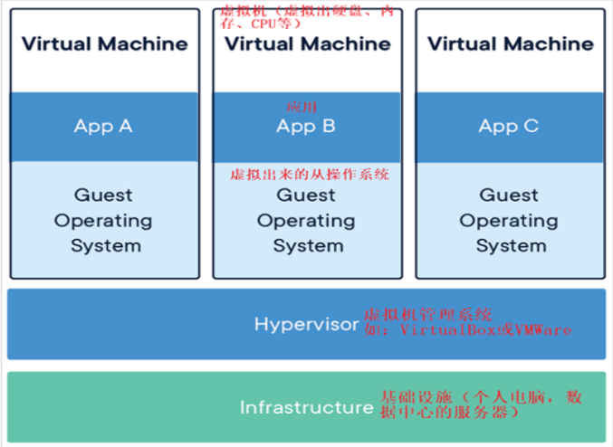

#### 2、容器虚拟化技术

由于虚拟机存在某些缺点，Linux发展出了另一种虚拟化技术：Linux容器(Linux Containers，LXC)。

Linux容器由某个镜像创建，并由该镜像提供支持进程所需的全部文件。Linux容器不是模拟一个完整的操作系统，而是对进程进行隔离。

**Docker容器就是在操作系统层面上实现虚拟化，直接复用本地主机的操作系统，而传统虚拟机则是在硬件层面实现虚拟化**。与传统的虚拟机相比，Docker优势体现为启动速度快、占用空间小。

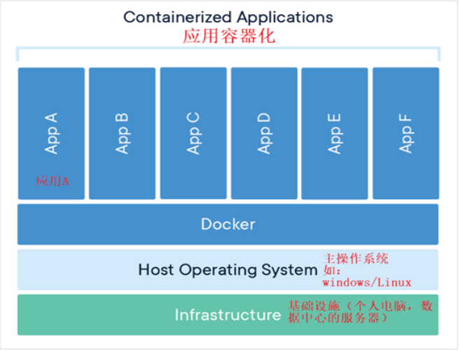

#### 3、两者的对比

- 传统虚拟机技术是虚拟出一套硬件后，在其上运行一个完整操作系统，在该系统上再运行所需应用进程；
- 而容器内的应用进程直接运行于宿主的内核，容器内没有自己的内核且也没有进行硬件虚拟。因此容器要比传统虚拟机更为轻便。
- 每个容器之间互相隔离，每个容器有自己的文件系统，容器之间进程不会相互影响，能区分计算资源。

## 2. Docker的基本组成

**Docker平台架构图**

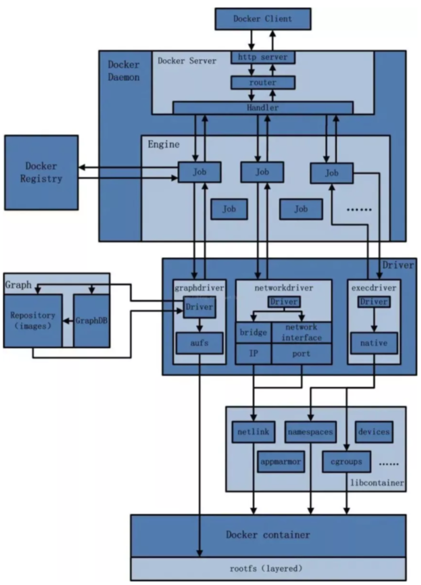

Docker是一个C/S模式的架构，其运行的基本流程为：

1. 用户使用Docker Client与Docker Daemon(Docker守护进程)建立通信，并发送请求给后者。
2. Docker Daemon作为Docker架构中的主体部分，首先提供Docker Server的功能使其可以接受Docker Client的请求。
3. Docker Engine执行Docker内部的一系列工作，每一项工作都是以一个Job的形式存在。
4. Job的运行过程中，当需要容器镜像时，则从Docker Registry中下载镜像，并通过镜像管理驱动Graph driver将下载镜像以Graph的形式存储。
5. 当需要为Docker创建网络环境时，通过网络管理驱动Network driver创建并配置Docker容器网络环境。
6. 当需要限制Docker容器运行资源或执行用户指令等操作时，则通过Exec driver来完成。
7. Libcontainer是一项独立的容器管理包，Network driver以及Exec driver都是通过Libcontainer来实现具体对容器进行的操作。

Docker的核心组成部分如下：

### 2.1 镜像image

Docker镜像（Image）就是一个只读的模板，可以用来创建Docker容器，一个镜像可以创建很多容器。

Docker镜像文件类似于Java的类模板，而Docker容器实例类似于Java中new出来的实例对象。

### 2.2 容器container

Docker利用容器（Container）独立运行一个或一组应用，**容器就类似于一个虚拟化的运行环境**，它是用镜像创建的运行实例。容器提供了一个标准的和隔离的运行环境，每个容器都是相互隔离的、保证安全的平台。

可以把容器看做是一个简易版的Linux环境和运行在其中的应用程序。

### 2.3 仓库repository

仓库（Repository）是集中存放镜像文件的场所。Docker公司提供的官方registry被称为Docker Hub (https://hub.docker.com/)，除此之外，国内的仓库有阿里云等。

例如，运行`docker run hello-world`后，Docker首先在本机中寻找该镜像，如果本机有该镜像，则直接以该镜像为模板生成容器实例运行；否则，就去配置的镜像仓库(如阿里云)上查找该镜像，如果找不到，则返回失败错误；如果找到了，就下载该镜像到本地，然后以该镜像为模板生成容器实例运行。

## 3. 镜像分层

Docker镜像是一种轻量级、可执行的独立软件包，它包含运行某个软件所需的所有内容。Docker的镜像实际上由一层一层的文件系统组成。

当容器启动时，一个新的可写层被加载到镜像的顶部，这一层通常被称作容器层，容器层之下的都叫镜像层。所有对容器的改动(无论添加、删除、还是修改文件)都只会发生在容器层中。**只有容器层是可写的，容器层下面的所有镜像层都是只读的**。

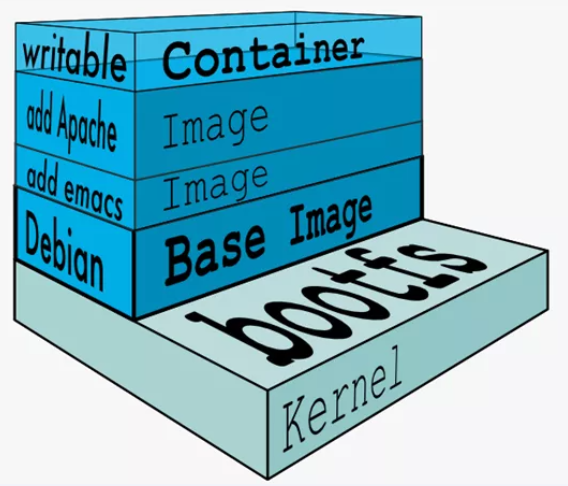

## 4. Docker的安装

### 4.1 安装相应环境

（1）Docker必须安装在Linux内核的系统上，如果安装在CentOS 7上，要求系统是64位，且Linux内核版本为3.8以上。可以使用`cat /etc/redhat-release`和`uname -r`命令来查看CentOS版本以及内核版本。

（2）卸载旧版本Docker

```shell
systemctl stop docker
yum remove docker-ce docker-ce-cli containerd.io
rm -rf /var/lib/docker
rm -rf /var/lib/containerd
```

（3）yum安装gcc相关，以及需要的软件包

```shell
yum -y install gcc
yum -y install gcc-c++
yum -y install yum-utils
```

### 4.2 安装核心

（4）设置稳定的镜像仓库

```shell
yum-config-manager --add-repo http://mirrors.aliyun.com/docker-ce/linux/centos/docker-ce.repo
```

（5）更新yum软件包索引

```shell
yum makecache fast
```

（6）安装DOCKER CE

```shell
yum install docker-ce docker-ce-cli containerd.io
```

（7）启动docker

```shell
systemctl start docker
```

（8）查看docker版本

```shell
docker version
```

（9）设置docker服务开机自启动

```shell
systemctl enable docker
```

### 4.3 配置阿里云镜像加速

（10）登录阿里云账号：https://promotion.aliyun.com/ntms/act/kubernetes.html

（11）获得加速器地址链接

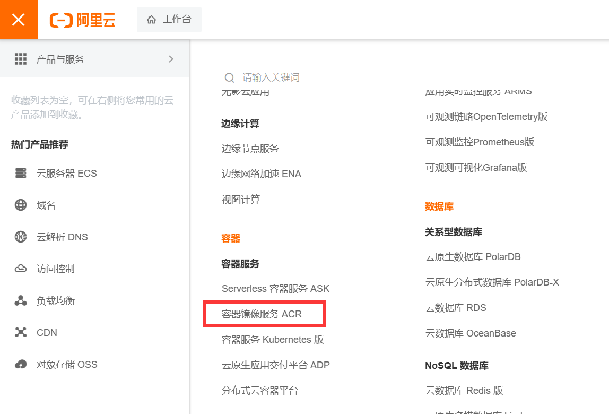

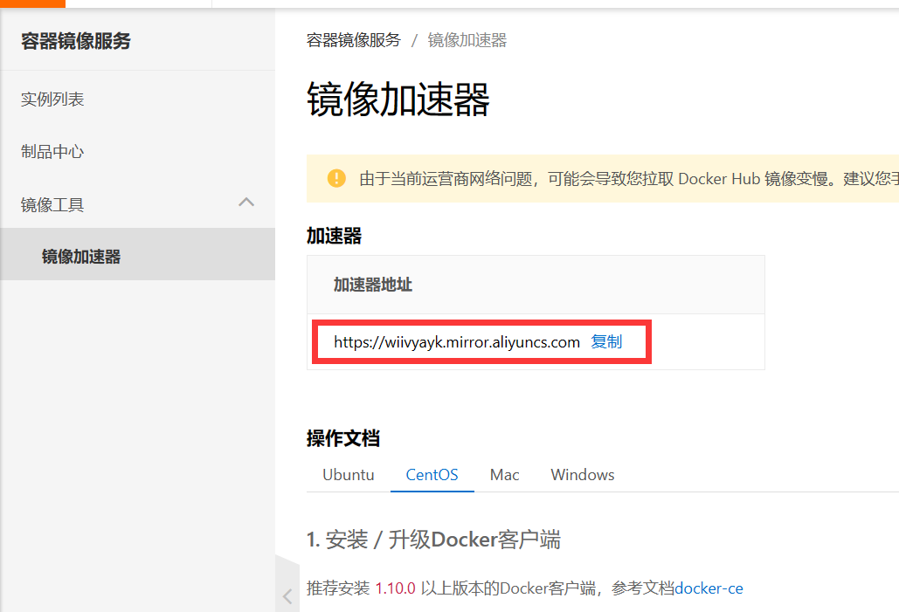

（12）粘贴脚本执行

```shell
sudo mkdir -p /etc/docker
sudo tee /etc/docker/daemon.json <<-'EOF'
{
  "registry-mirrors": ["https://wiivyayk.mirror.aliyuncs.com"]
}
EOF
sudo systemctl daemon-reload
sudo systemctl restart docker
```


# 第02章_Docker常用命令

## 1. 帮助启动类命令

- 启动docker：`systemctl start docker`
- 停止docker：`systemctl stop docker`
- 重启docker：`systemctl restart docker`
- 查看docker状态：`systemctl status docker`
- 设置docker开机启动：`systemctl enable docker`
- 查看docker概要信息：`docker info`
- 查看docker总体帮助文档：`docker --help`
- 查看docker命令帮助文档：`docker 具体命令 --help`

## 2. 镜像命令

### 2.1 docker images

列出本地主机上的镜像：

```shell
[root@thuwsy001 ~]# docker images
REPOSITORY    TAG       IMAGE ID       CREATED         SIZE
hello-world   latest    9c7a54a9a43c   4 months ago    13.3kB
ubuntu        latest    ba6acccedd29   23 months ago   72.8MB
```

- REPOSITORY：表示镜像的仓库源，即镜像名
- TAG：镜像的标签版本号。同一仓库源可以有多个TAG版本，我们一般使用`REPOSITORY:TAG`来指定某个镜像，如果不指定TAG，则默认使用最新版镜像，即`REPOSITORY:latest`
- IMAGE ID：镜像id
- CREATED：镜像创建时间
- SIZE：镜像大小

> **虚悬镜像**：镜像名、标签都是`<none>`的镜像，称为虚悬镜像(dangling image)


### 2.2 docker search 镜像名

`docker search redis`：查找redis的镜像，默认列出25个。注意，如果想要具体某个版本的镜像，建议从Docker Hub上去查找，而不是通过`docker search`命令去查找。

### 2.3 docker pull 镜像名:TAG

下载指定镜像，如果省略`:TAG`，则相当于下载`镜像名:latest`

> 注意：如果Docker拉取镜像时域名解析失败，可以将`vi /etc/resolv.conf`中改为`nameserver 8.8.8.8`

### 2.4 docker rmi -f 镜像id

删除某个镜像，可以用`镜像id`指定，也可以用`镜像名:TAG`指定。可以同时删除多个镜像。

### 2.5 docker system df

查看镜像/容器/数据卷所占的空间

```shell
[root@thuwsy001 ~]# docker system df 
TYPE            TOTAL     ACTIVE    SIZE      RECLAIMABLE
Images          2         1         72.79MB   72.78MB (99%)
Containers      2         0         0B        0B
Local Volumes   0         0         0B        0B
Build Cache     0         0         0B        0B
```

## 3. 容器命令

### 3.1 新建并启动容器

#### 1、基本使用

```shell
docker run [OPTIONS] IMAGE [COMMAND] [ARG...]
```

OPTIONS：

- `--name containerName`：为容器指定一个名称。
- `-d`：后台运行容器。
- `-it`：以交互模式启动容器。
- `-p hostPort:containerPort`：指定端口映射，将宿主机的hostPort端口映射到容器的containerPort端口。

#### 2、数据存储

可以使用`-v`参数来指定宿主机目录与容器内目录的映射，从而起到持久化存储数据的作用（即使删除了容器，数据也依旧保存在宿主机目录中）。主要有以下两种方式：

**目录挂载**：

```shell
docker run -v 宿主机绝对路径目录:容器绝对路径目录 --privileged=true 镜像名

# 举例
docker run --privileged=true -v /thuwsy/host_data:/tmp/docker_data ubuntu
```

> 注意：
>
> 1. 使用目录挂载的方式启动容器，则数据会以宿主机目录下的内容为准。因此如果宿主机的挂载目录是空的，则对应容器内的目录下也是空的，所以要额外注意这种情况，可以采用**卷映射**的方式来避免清空容器内本来就有的默认数据。
> 2. 使用`--privileged=true`参数可以让容器内具有root权限。

**卷映射**：

```shell
docker run -v 数据卷名:容器绝对路径目录 --privileged=true 镜像名

# 举例
docker run --privileged=true -v ngconf:/etc/nginx nginx
```

> 注意：
>
> 1. 使用数据卷映射的方式，实际上是将容器内目录的数据保存在宿主机的`/var/lib/docker/volumes/<volume-name>/_data`目录下
> 2. 可以使用`docker volume ls`命令来查看数据卷的数量

### 3.2 容器的基本操作

#### 1、查看容器实例

```shell
docker ps [OPTIONS]
```

OPTIONS：

- `-a`: 列出当前所有正在运行的容器，以及历史上运行过的容器。
- `-l`: 显示最近一个创建的容器。
- `-n num`: 显示最近num个创建的容器。

#### 2、停止容器

```shell
docker stop 容器id或容器名
```

如果要强制停止容器，则使用：

```shell
docker kill 容器id或容器名
```

#### 3、启动已停止的容器

```shell
docker start 容器id或容器名
```

#### 4、重启容器

```shell
docker restart 容器id或容器名
```

#### 5、删除容器

```shell
docker rm -f 容器id或容器名
```

#### 6、查看容器占用的资源

```shell
docker stats 容器id或容器名
```

#### 7、查看容器日志

```shell
docker logs 容器id或容器名
```

#### 8、拷贝容器中的文件到宿主机中

```shell
docker cp 容器id:容器内文件路径 宿主机路径
# 举例：将容器内/tmp目录下的a.txt文件拷贝到宿主机的根目录下
docker cp d9b70136c530:/tmp/a.txt /
```

### 3.3 进入容器

```shell
docker exec -it 容器id /bin/bash
```

> 说明：要退出容器的命令行终端，则输入`exit`命令即可

举例：用`-d`启动后台Redis服务后，再用exec进入对应容器实例，用客户端连接Redis

```shell
[root@thuwsy001 ~]# docker exec -it 7afb0b92b86e /bin/bash
root@7afb0b92b86e:/data# redis-cli -p 6379
127.0.0.1:6379> ping
PONG
127.0.0.1:6379> set k1 v1
OK
127.0.0.1:6379> get k1
"v1"
```

## 4. Docker网络命令

启动Docker服务后，Linux服务器中会生成一个名为**docker0**的网卡，它是一个虚拟网桥。每当我们启动一个容器实例时，如果没有指定network，则**默认使用docker0这个网桥，且默认的网桥模式是bridge**。

在bridge网桥模式下，每个启动的容器都会根据网桥的网段被分配一个**容器IP地址**，并且这个网桥就是该容器的默认网关。于是，在同一个网桥下的容器可以通过**容器IP地址**直接通信（端口号是容器内部的端口号）。

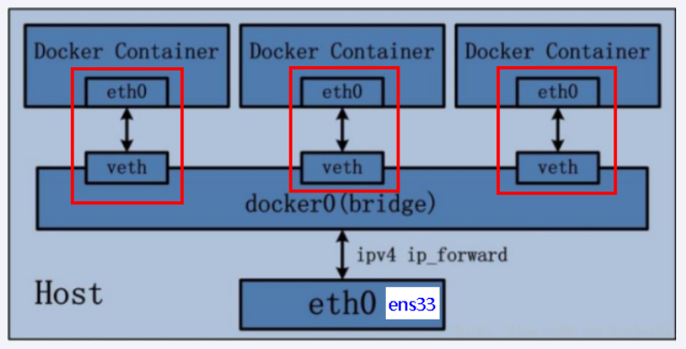

注意，由于容器IP地址可能会随着容器的重启而变化，所以我们并不希望通过容器IP地址来通信，而是**希望能通过容器名来进行通信**。由于默认的docker0网桥并不支持通过容器名来通信，所以我们需要自定义网络，具体步骤如下：

（1）创建自定义网络，自定义网络默认使用的网桥模式也是bridge

```shell
[root@thuwsy001 ~]# docker network create wsy_network
2043c25bcfba83fe8df8968c934eca2ec56e2d741f1069c64deafe000fca9403
[root@thuwsy001 ~]# docker network ls
NETWORK ID     NAME          DRIVER    SCOPE
550305d4ffe0   bridge        bridge    local
07f0fecc9c16   host          host      local
1e867ffe6972   none          null      local
2043c25bcfba   wsy_network   bridge    local
```

（2）创建容器，并通过`--network`参数来指定使用自定义网络

```shell
[root@thuwsy001 ~]# docker run -d -p 8081:8080 --network wsy_network --name tomcat81 billygoo/tomcat8-jdk8
d4b8d68a1b92bb03fd4a6bbbed631bb4231d3d5833592da8487611f567bf077d
[root@thuwsy001 ~]# docker run -d -p 8082:8080 --network wsy_network --name tomcat82 billygoo/tomcat8-jdk8
15e60b7ba6db5a09c787206c2a8fd229543e73e962fb8ad166851f71d0a6ac3e
```

（3）进入其中一个容器，通过容器名与另一个容器进行通信

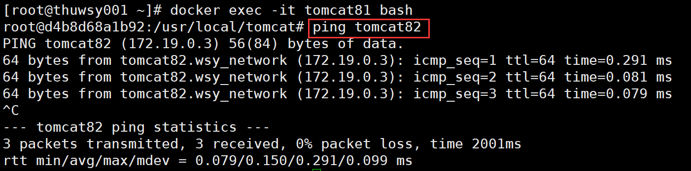

**Docker网络的常用命令**：

- 查看网络：`docker network ls`

  ```shell
  [root@thuwsy001 ~]# docker network ls
  NETWORK ID     NAME      DRIVER    SCOPE
  550305d4ffe0   bridge    bridge    local
  07f0fecc9c16   host      host      local
  1e867ffe6972   none      null      local
  ```

- 查看网络详细数据：`docker network inspect 网络名`

- 创建网络：`docker network create 网络名`

- 删除网络：`docker network rm 网络名`

## 5. 发布镜像

### 5.1 commit命令

docker commit可以提交容器副本使之成为一个新的镜像，语法如下：

```shell
docker commit -m="描述信息" -a="作者" 容器id 自定义镜像名:版本号
```

**案例演示**：创建一个带有vim的ubuntu镜像

（1）先从Hub上下载ubuntu镜像到本地并运行，这个原始的Ubuntu镜像是不包含vim命令的

（2）给这个容器实例安装vim：

```shell
root@8e5ee60e0662:/# apt-get update
root@8e5ee60e0662:/# apt-get -y install vim
```

（3）commit该容器实例，就得到了一个自己创建的带有vim的ubuntu镜像

```shell
[root@thuwsy001 ~]# docker commit -m="this is a ubuntu with vim" -a="wsy" 8e5ee60e0662 wsy/myubuntu:1.0
sha256:02df0c6998f59d5c6b8eaf5ff616b8d1083eea76b9abbff8a7ae613be88c9bca
[root@thuwsy001 ~]# docker images
REPOSITORY     TAG       IMAGE ID       CREATED         SIZE
wsy/myubuntu   1.0       02df0c6998f5   3 seconds ago   187MB
hello-world    latest    9c7a54a9a43c   4 months ago    13.3kB
redis          latest    7614ae9453d1   20 months ago   113MB
ubuntu         latest    ba6acccedd29   23 months ago   72.8MB
```

### 5.2 发布镜像到阿里云

（1）创建本地镜像(用上一节的commit，或者后面会学的DockerFile)

（2）登录阿里云的容器镜像服务，然后

- 选择个人实例
    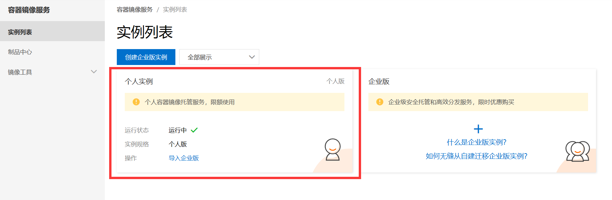

- 创建命名空间
    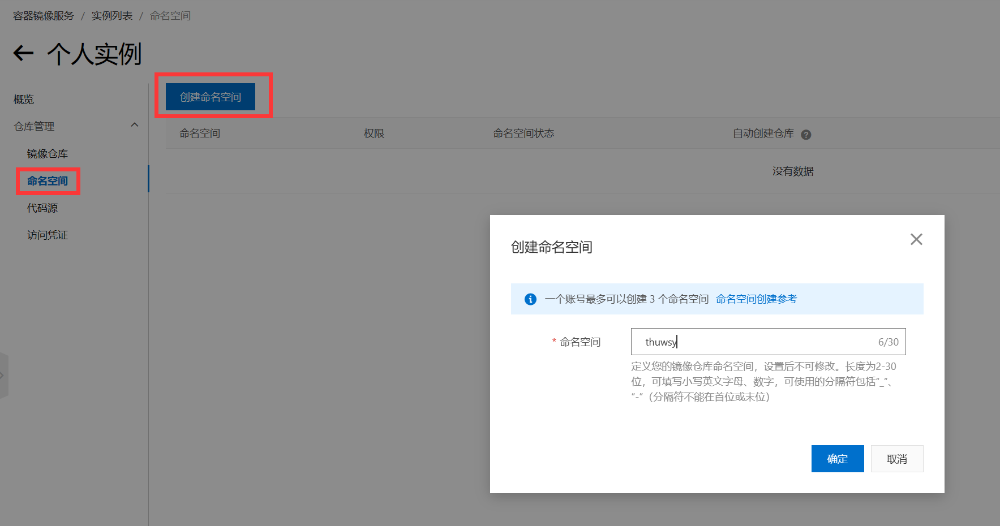

- 创建镜像仓库
    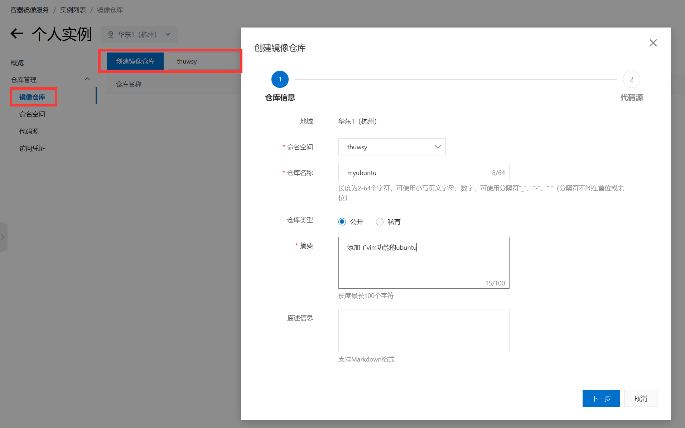
    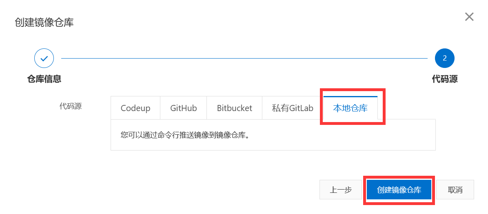

（3）根据阿里云的脚本，将本地镜像推送到Registry

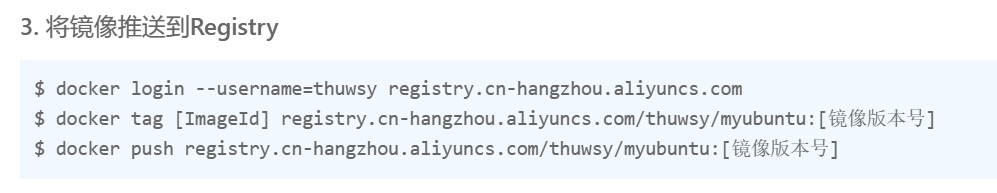

（4）根据阿里云的脚本，也可以从镜像仓库中拉取镜像到本地

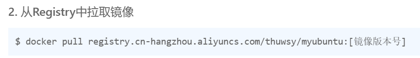


# 第03章_Docker安装常用软件

## 1. 安装tomcat

（1）运行tomcat容器实例

```shell
docker pull tomcat:latest
docker run -d -p 8080:8080 --name tomcat tomcat:latest
```

（2）注意，新版Tomcat做了一些更改，无法直接访问其首页，我们要做如下操作：

```shell
docker exec -it tomcat /bin/bash
rm -rf webapps
mv webapps.dist webapps
exit
```

（3）此时可以正常访问首页`http://192.168.231.200:8080`

## 2. 安装mysql

（1）检查主机是否已经开启mysql服务(防止3306端口占用)，如果开启的话，就将其关闭

```shell
ps -ef|grep mysql
systemctl stop mysqld.service
```

（2）下载mysql镜像

```shell
docker pull mysql:8.0.27
```

（3）创建mysql容器实例

```shell
docker run -d -p 3306:3306 --name mysql \
--restart=always \
--privileged=true \
-v /docker/mysql/log:/var/log/mysql \
-v /docker/mysql/data:/var/lib/mysql \
-v /docker/mysql/conf:/etc/mysql/conf.d \
-e MYSQL_ROOT_PASSWORD=abc666 \
mysql:8.0.27
```

（4）通过容器卷处理字符编码 `vi /docker/mysql/conf/my.cnf` 配置以下内容：

```vim
[mysqld]
init-connect="SET collation_connection=utf8mb4_0900_ai_ci"
init_connect="SET NAMES utf8mb4"
skip-character-set-client-handshake
```

（5）重启mysql容器实例

```sh
docker restart mysql
```

注意：由于我们添加了数据卷，所以即使删除了这个mysql容器实例，将来我们再按步骤（3）的命令新建mysql容器实例，仍能恢复数据。

## 3. 安装redis

（1）拉取redis镜像

```shell
docker pull redis:7.2.0
```

（2）在宿主机下创建目录用于做数据卷，以及放redis的配置文件

```shell
mkdir -p /docker/redis
```

（3）将一个`redis.conf`配置文件模板拷贝到上述目录下，注意配置文件模板要与Redis版本兼容

```shell
vi /docker/redis/redis.conf
```

- 默认daemonize no，不进行修改（第309行）
- 默认protected-mode yes，改为`protected-mode no`（第111行）
- 默认bind 127.0.0.1，将其`注释掉`，因为默认bind 127.0.0.1只能本机访问，会影响远程IP连接。（第87行）
- 设置redis的密码，添加`requirepass 自己的密码`（第1045行）
- 设置redis的工作目录(主要用于保存RDB和AOF文件，建议改为绝对路径)，改为`dir /data`（第510行）

> 注意：必须设置daemonize no，如果设置为yes，会和docker run中的-d参数冲突。

（4）创建redis容器实例

```shell
docker run -d -p 6379:6379 --name redis \
--restart=always \
--privileged=true \
-v /docker/redis/redis.conf:/etc/redis/redis.conf \
-v /docker/redis/data:/data \
redis:7.2.0 \
redis-server /etc/redis/redis.conf
```

## 4. 进阶：安装mysql集群

（1）新建主服务器容器实例3307

```shell
docker run -d -p 3307:3306 --name mysql-master --privileged=true -v /thuwsy/mysql-master/log:/var/log/mysql -v /thuwsy/mysql-master/data:/var/lib/mysql -v /thuwsy/mysql-master/conf:/etc/mysql/conf.d -e MYSQL_ROOT_PASSWORD=abc666 mysql
```

（2）进入/thuwsy/mysql-master/conf/目录下新建my.cnf，`vim my.cnf`

```vim
[mysqld]
## 设置server_id，同一局域网中需要唯一
server_id=101
## 指定不需要同步的数据库名称
binlog-ignore-db=mysql
## 开启二进制日志功能
log-bin=mall-mysql-bin
## 设置二进制日志使用内存大小（事务）
binlog_cache_size=1M
## 设置使用的二进制日志格式（mixed,statement,row）
binlog_format=mixed
## 二进制日志过期清理时间。默认值为0，表示不自动清理。
expire_logs_days=7
## 跳过主从复制中遇到的所有错误或指定类型的错误，避免slave端复制中断。
## 如：1062错误是指一些主键重复，1032错误是因为主从数据库数据不一致
slave_skip_errors=1062
```

（3）修改完配置后重启master实例，`docker restart mysql-master`

（4）进入mysql-master容器实例

```shell
[root@thuwsy001 ~]# docker exec -it mysql-master /bin/bash
root@6a786ba6daff:/# mysql -uroot -p
Enter password: 
```

（5）master容器实例内创建数据同步用户

```sql
mysql> create user 'slave'@'%' identified by '123456';
mysql> grant replication slave, replication client on *.* to 'slave'@'%';
mysql> alter user 'slave'@'%' identified with mysql_native_password by '123456';
```

（6）新建从服务器容器实例3308

```shell
docker run -d -p 3308:3306 --name mysql-slave --privileged=true -v /thuwsy/mysql-slave/log:/var/log/mysql -v /thuwsy/mysql-slave/data:/var/lib/mysql -v /thuwsy/mysql-slave/conf:/etc/mysql/conf.d -e MYSQL_ROOT_PASSWORD=abc666 mysql
```

（7）进入/thuwsy/mysql-slave/conf/目录下新建my.cnf，`vim my.cnf`

```vim
[mysqld]
## 设置server_id，同一局域网中需要唯一
server_id=102
## 指定不需要同步的数据库名称
binlog-ignore-db=mysql
## 开启二进制日志功能，以备Slave作为其它数据库实例的Master时使用
log-bin=mall-mysql-slave1-bin
## 设置二进制日志使用内存大小（事务）
binlog_cache_size=1M
## 设置使用的二进制日志格式（mixed,statement,row）
binlog_format=mixed
## 二进制日志过期清理时间。默认值为0，表示不自动清理。
expire_logs_days=7
## 跳过主从复制中遇到的所有错误或指定类型的错误，避免slave端复制中断。
## 如：1062错误是指一些主键重复，1032错误是因为主从数据库数据不一致
slave_skip_errors=1062
## relay_log配置中继日志
relay_log=mall-mysql-relay-bin
## log_slave_updates表示slave将复制事件写进自己的二进制日志
log_slave_updates=1
## slave设置为只读（具有super权限的用户除外）
read_only=1
```

（8）修改完配置后重启slave实例，`docker restart mysql-slave`

（9）在master数据库中查看主从同步状态

```sql
mysql> show master status;
+-----------------------+----------+--------------+------------------+-------------------+
| File                  | Position | Binlog_Do_DB | Binlog_Ignore_DB | Executed_Gtid_Set |
+-----------------------+----------+--------------+------------------+-------------------+
| mall-mysql-bin.000001 |      994 |              | mysql            |                   |
+-----------------------+----------+--------------+------------------+-------------------+
1 row in set (0.00 sec)
```

（10）进入mysql-slave容器实例

```shell
[root@thuwsy001 ~]# docker exec -it mysql-slave /bin/bash
root@6a786ba6daff:/# mysql -uroot -p
Enter password: 
```

（11）在从数据库中配置主从复制

```sql
mysql> change master to master_host='192.168.231.101', master_user='slave', master_password='123456', master_port=3307, master_log_file='mall-mysql-bin.000001', master_log_pos=994, master_connect_retry=30;
```

参数说明：

- master_host：主数据库的IP地址；
- master_port：主数据库的运行端口；
- master_user：在主数据库创建的用于同步数据的用户账号；
- master_password：在主数据库创建的用于同步数据的用户密码；
- master_log_file：指定从数据库要复制数据的日志文件，通过查看主数据的状态，获取File参数（即第9步中列File的值）；
- master_log_pos：指定从数据库从哪个位置开始复制数据，通过查看主数据的状态，获取Position参数（即第9步中列Position的值）；
- master_connect_retry：连接失败重试的时间间隔，单位为秒。

（12）在从数据库中查看主从同步状态，此时Slave_IO_Running和Slave_SQL_Running都应该是No

```sql
mysql> show slave status \G;
```

（13）在从数据库中开启主从同步

```sql
mysql> start slave;
```

（14）此时再执行第12步，Slave_IO_Running和Slave_SQL_Running都应该是Yes。

（15）主从复制测试：主机新建库、新建表、插入数据，从机使用库、查看记录

## 5. 进阶：安装redis集群

### 5.1 三主三从redis集群配置

（1）新建6个redis容器实例

```shell
docker run -d --name redis-node-1 --net host --privileged=true -v /thuwsy/redis/share/redis-node-1:/data redis:7.0.0 --cluster-enabled yes --appendonly yes --port 6381
```

```shell
docker run -d --name redis-node-2 --net host --privileged=true -v /thuwsy/redis/share/redis-node-2:/data redis:7.0.0 --cluster-enabled yes --appendonly yes --port 6382
```

```shell
docker run -d --name redis-node-3 --net host --privileged=true -v /thuwsy/redis/share/redis-node-3:/data redis:7.0.0 --cluster-enabled yes --appendonly yes --port 6383
```

```shell
docker run -d --name redis-node-4 --net host --privileged=true -v /thuwsy/redis/share/redis-node-4:/data redis:7.0.0 --cluster-enabled yes --appendonly yes --port 6384
```

```shell
docker run -d --name redis-node-5 --net host --privileged=true -v /thuwsy/redis/share/redis-node-5:/data redis:7.0.0 --cluster-enabled yes --appendonly yes --port 6385
```

```shell
docker run -d --name redis-node-6 --net host --privileged=true -v /thuwsy/redis/share/redis-node-6:/data redis:7.0.0 --cluster-enabled yes --appendonly yes --port 6386
```

（2）进入容器redis-node-1，然后在容器内为6台机器构建集群关系

```shell
docker exec -it redis-node-1 /bin/bash
```

```shell
redis-cli --cluster create 192.168.231.101:6381 192.168.231.101:6382 192.168.231.101:6383 192.168.231.101:6384 192.168.231.101:6385 192.168.231.101:6386 --cluster-replicas 1
```

- 注意使用自己的ip地址
- `--cluster-replicas 1`表示为每个master创建一个slave节点

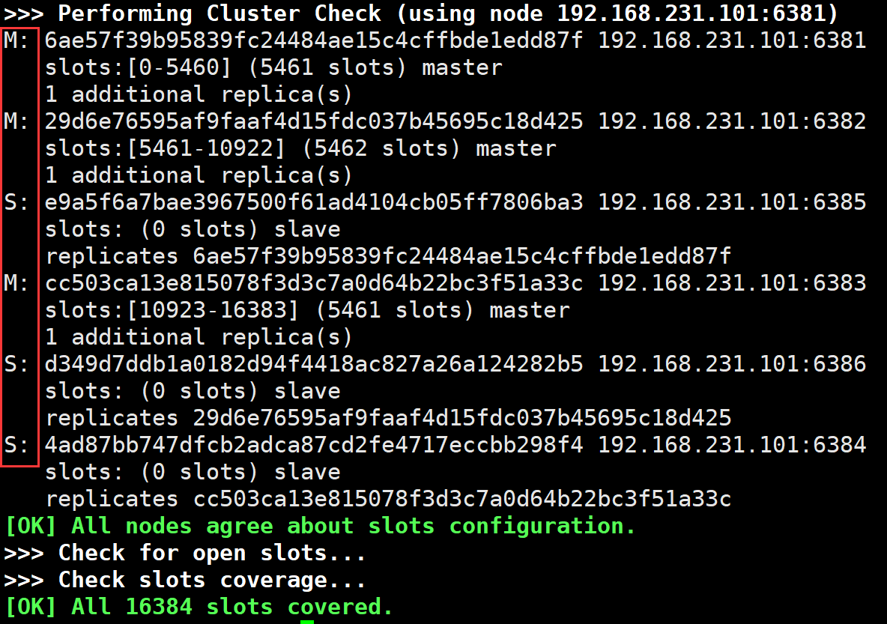

（3）此时三主三从已经搭建完成，我们可以进入6381作为切入点，来查看集群状态：

```shell
root@thuwsy001:/data# redis-cli -p 6381
127.0.0.1:6381> cluster info
127.0.0.1:6381> cluster nodes
```

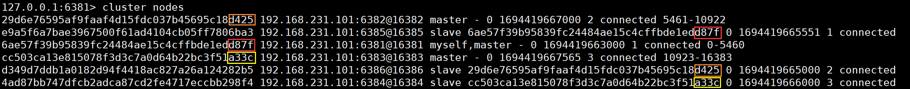

由上图可见，此次案例中：

- master6381下，挂着slave6385
- master6382下，挂着slave6386
- master6383下，挂着slave6384

### 5.2 主从容错切换迁移案例

（1）数据读写测试，启动6个容器实例并通过exec进入。以下以6381为例演示：

```shell
[root@thuwsy001 thuwsy]# docker exec -it redis-node-1 /bin/bash
root@thuwsy001:/data# redis-cli -p 6381 -c
127.0.0.1:6381> set k1 v1
-> Redirected to slot [12706] located at 192.168.231.101:6383
OK
192.168.231.101:6383> get k1
"v1"
```

> 注意：对于集群，在连接服务器时需要添加参数-c，防止路由失效

（2）查看集群信息

```shell
root@thuwsy001:/data# redis-cli --cluster check 192.168.231.101:6381
```

（3）停止6381，模拟服务器宕机，然后再次查看节点信息

```shell
[root@thuwsy001 thuwsy]# docker stop redis-node-1
redis-node-1
[root@thuwsy001 thuwsy]# docker exec -it redis-node-2 /bin/bash
root@thuwsy001:/data# redis-cli -p 6382 -c
127.0.0.1:6382> cluster nodes
cc503ca13e815078f3d3c7a0d64b22bc3f51a33c 192.168.231.101:6383@16383 master - 0 1694421540511 3 connected 10923-16383
29d6e76595af9faaf4d15fdc037b45695c18d425 192.168.231.101:6382@16382 myself,master - 0 1694421541000 2 connected 5461-10922
d349d7ddb1a0182d94f4418ac827a26a124282b5 192.168.231.101:6386@16386 slave 29d6e76595af9faaf4d15fdc037b45695c18d425 0 1694421541519 2 connected
4ad87bb747dfcb2adca87cd2fe4717eccbb298f4 192.168.231.101:6384@16384 slave cc503ca13e815078f3d3c7a0d64b22bc3f51a33c 0 1694421540000 3 connected
e9a5f6a7bae3967500f61ad4104cb05ff7806ba3 192.168.231.101:6385@16385 master - 0 1694421542528 7 connected 0-5460
6ae57f39b95839fc24484ae15c4cffbde1edd87f 192.168.231.101:6381@16381 master,fail - 1694421493151 1694421490000 1 disconnected
127.0.0.1:6382> get k1
-> Redirected to slot [12706] located at 192.168.231.101:6383
"v1"
192.168.231.101:6383> get k2
-> Redirected to slot [449] located at 192.168.231.101:6385
"v2"
```

（4）重启6381，`docker start redis-node-1`，此时我们会发现6381变成了6385的slave。如果我们想恢复原来的主从关系，只需再停止6385，然后再重启6385即可：

```shell
[root@thuwsy001 ~]# docker stop redis-node-5
redis-node-5
[root@thuwsy001 ~]# docker start redis-node-5
redis-node-5
```

### 5.3 主从扩容案例

（1）新建6387和6388两个节点

```shell
docker run -d --name redis-node-7 --net host --privileged=true -v /thuwsy/redis/share/redis-node-7:/data redis:7.0.0 --cluster-enabled yes --appendonly yes --port 6387
```

```shell
docker run -d --name redis-node-8 --net host --privileged=true -v /thuwsy/redis/share/redis-node-8:/data redis:7.0.0 --cluster-enabled yes --appendonly yes --port 6388
```

（2）进入6387容器实例内部，将6387节点作为master节点加入原集群

```shell
[root@thuwsy001 ~]# docker exec -it redis-node-7 /bin/bash
root@thuwsy001:/data# redis-cli --cluster add-node 192.168.231.101:6387 192.168.231.101:6381
```

（3）第一次检查集群信息，我们会发现6387还没有被分配槽位

```shell
root@thuwsy001:/data# redis-cli --cluster check 192.168.231.101:6381
192.168.231.101:6381 (6ae57f39...) -> 1 keys | 5461 slots | 1 slaves.
192.168.231.101:6383 (cc503ca1...) -> 1 keys | 5461 slots | 1 slaves.
192.168.231.101:6382 (29d6e765...) -> 0 keys | 5462 slots | 1 slaves.
192.168.231.101:6387 (cdbe4177...) -> 0 keys | 0 slots | 0 slaves.
......
```

（4）重新分配槽位

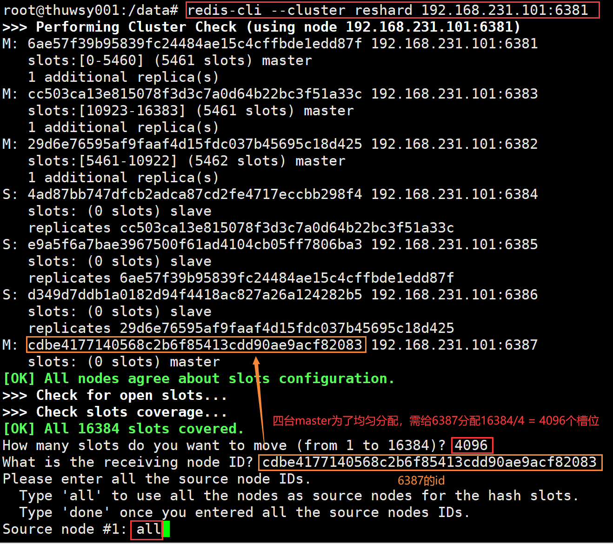

（5）第二次检查集群信息，我们会发现6387已经被分配了槽位，分别从6381、6382、6383中各自匀出来了一部分

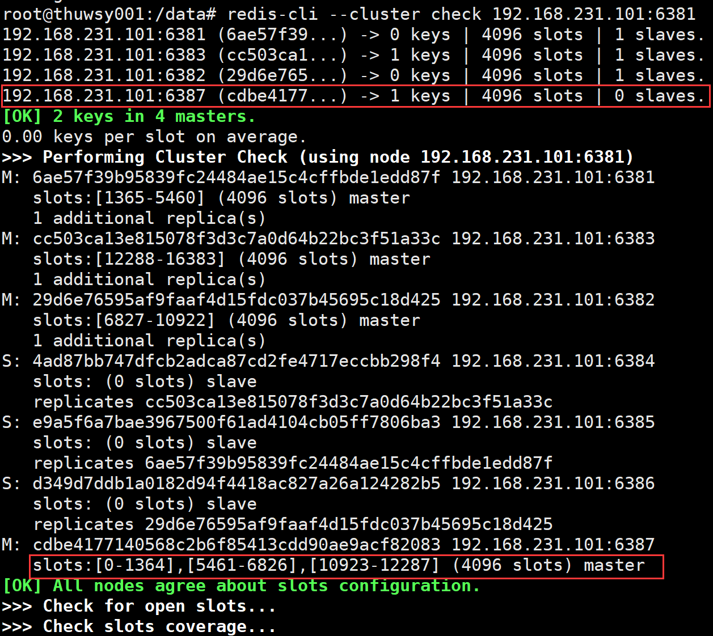

（6）为主节点6387分配从节点6388

```shell
root@thuwsy001:/data# redis-cli --cluster add-node 192.168.231.101:6388 192.168.231.101:6387 --cluster-slave --cluster-master-id cdbe4177140568c2b6f85413cdd90ae9acf82083
```

> 最后面的编号是主节点6387的id

（7）第三次检查集群信息，我们会发现6387有了slave

```shell
root@thuwsy001:/data# redis-cli --cluster check 192.168.231.101:6381
192.168.231.101:6381 (6ae57f39...) -> 0 keys | 4096 slots | 1 slaves.
192.168.231.101:6383 (cc503ca1...) -> 1 keys | 4096 slots | 1 slaves.
192.168.231.101:6382 (29d6e765...) -> 0 keys | 4096 slots | 1 slaves.
192.168.231.101:6387 (cdbe4177...) -> 1 keys | 4096 slots | 1 slaves.
......
```

### 5.4 主从缩容案例

（1）先从集群中删除从节点6388：首先用检查集群命令来获知6388的节点id，然后使用以下命令从集群中删除6388节点

```shell
redis-cli --cluster del-node 192.168.231.101:6388 83bba50763e0c6df4401394e6e8e2f681ac912fc
```

（2）将6387的槽号清空，重新分配(本例为了简便，直接把清出来的槽号都交给6381)

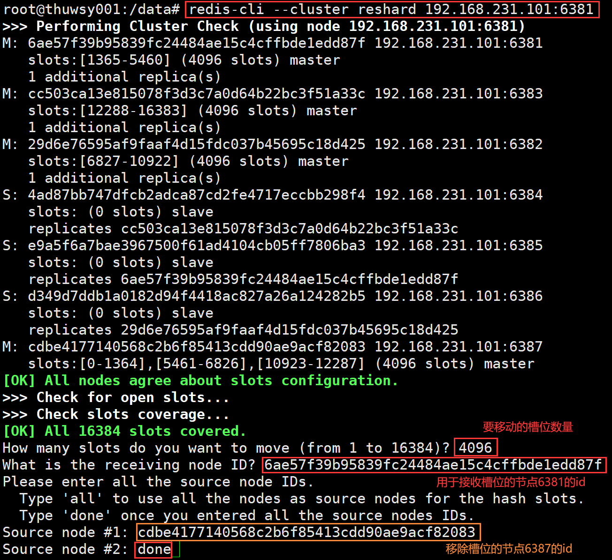

（3）检查集群信息，我们会发现6381有了8192个槽位，而6387的槽位被清空了（6387直接变成了6381的slave）

```shell
root@thuwsy001:/data# redis-cli --cluster check 192.168.231.101:6381
192.168.231.101:6381 (6ae57f39...) -> 1 keys | 8192 slots | 2 slaves.
192.168.231.101:6383 (cc503ca1...) -> 1 keys | 4096 slots | 1 slaves.
192.168.231.101:6382 (29d6e765...) -> 0 keys | 4096 slots | 1 slaves.
......
```

（4）从集群中删除节点6387：首先用检查集群命令来获知6387的节点id，然后使用以下命令从集群中删除6387节点

```shell
redis-cli --cluster del-node 192.168.231.101:6387 cdbe4177140568c2b6f85413cdd90ae9acf82083
```

（5）检查集群信息，此时又变回了三主三从的架构，只不过此时6381拥有8192个槽位

```shell
root@thuwsy001:/data# redis-cli --cluster check 192.168.231.101:6381
192.168.231.101:6381 (6ae57f39...) -> 1 keys | 8192 slots | 1 slaves.
192.168.231.101:6383 (cc503ca1...) -> 1 keys | 4096 slots | 1 slaves.
192.168.231.101:6382 (29d6e765...) -> 0 keys | 4096 slots | 1 slaves.
......
```


# 第04章_Docker Compose容器编排

## 1. Compose配置文件

Compose是Docker公司推出的一个工具软件，可以管理多个Docker容器。我们需要定义一个YAML格式的配置文件，并写好多个容器之间的调用关系，然后只需通过一个命令，就能同时启动或停止这些容器。

Compose配置文件示例如下：

```yml
version: '3.9'

services:
  redis:
    image: redis:latest
    container_name: redis
    restart: always
    ports:
      - "6379:6379"
    networks:
      - backend

  zookeeper:
    image: bitnami/zookeeper:latest
    container_name: zookeeper
    restart: always
    environment:
      ALLOW_ANONYMOUS_LOGIN: yes
      ZOOKEEPER_CLIENT_PORT: 2181
      ZOOKEEPER_TICK_TIME: 2000
    networks:
      - backend

  kafka:
    image: bitnami/kafka:3.4.0
    container_name: kafka
    restart: always
    depends_on:
      - zookeeper
    ports:
      - "9092:9092"
    environment:
      ALLOW_PLAINTEXT_LISTENER: yes
      KAFKA_CFG_ZOOKEEPER_CONNECT: zookeeper:2181
      KAFKA_OFFSETS_TOPIC_REPLICATION_FACTOR: 1
    networks:
      - backend
  
  kafka-ui:
    image: provectuslabs/kafka-ui:latest
    container_name:  kafka-ui
    restart: always
    depends_on:
      - kafka
    ports:
      - "8080:8080"
    environment:
      KAFKA_CLUSTERS_0_NAME: dev
      KAFKA_CLUSTERS_0_BOOTSTRAPSERVERS: kafka:9092
    networks:
      - backend

  prometheus:
    image: prom/prometheus:latest
    container_name: prometheus
    restart: always
    volumes:
      - ./prometheus.yml:/etc/prometheus/prometheus.yml
    ports:
      - "9090:9090"
    networks:
      - backend

  grafana:
    image: grafana/grafana:latest
    container_name: grafana
    restart: always
    depends_on:
      - prometheus
    ports:
      - "3000:3000"
    networks:
      - backend

networks:
  backend:
    name: backend
```

- version是当前使用的docker-compose语法的版本
- services中指定所有要启动的容器实例
  - image：使用的镜像
  - container_name：容器实例名称
  - ports：端口映射
  - networks：使用的自定义网络
  - restart设置为always，表示Docker启动的时候，就自动启动该容器实例
  - volumes：挂载目录/数据卷
  - depends_on：在xxx容器实例创建之后再创建
- networks中指定各种自定义网络，用name属性指定网络名称

## 2. 常用命令

编写好docker-compose.yml后可以使用如下命令启动：

```shell
docker compose -f docker-compose.yml up -d
```

停止容器实例：

```shell
docker compose -f docker-compose.yml stop
```

删除容器实例及网络：

```shell
docker compose -f docker-compose.yml down
```


# 第05章_Dockerfile

## 1. Dockerfile简介

Dockerfile是用来构建Docker镜像的文本文件，是由一条条构建镜像所需的指令和参数构成的脚本。

Dockerfile中：

- 每条保留字指令都必须为大写字母，且后面要跟随至少一个参数
- 指令按照从上到下顺序执行
- `#`表示注释
- 每条指令都会创建一个新的镜像层并对镜像进行提交

根据Dockerfile构建镜像的大致流程如下：

1. Docker从基础镜像运行一个容器
2. 执行一条指令并对容器作出修改
3. 执行类似docker commit的操作提交一个新的镜像层
4. Docker再基于刚提交的镜像运行一个新容器
5. 执行Dockerfile中的下一条指令直到所有指令都执行完成

## 2. Dockerfile常用保留字指令

### 2.1 tomcat的Dockerfile示例

```Dockerfile
#
# NOTE: THIS DOCKERFILE IS GENERATED VIA "apply-templates.sh"
#
# PLEASE DO NOT EDIT IT DIRECTLY.
#

FROM eclipse-temurin:17-jdk-jammy

ENV CATALINA_HOME /usr/local/tomcat
ENV PATH $CATALINA_HOME/bin:$PATH
RUN mkdir -p "$CATALINA_HOME"
WORKDIR $CATALINA_HOME

# let "Tomcat Native" live somewhere isolated
ENV TOMCAT_NATIVE_LIBDIR $CATALINA_HOME/native-jni-lib
ENV LD_LIBRARY_PATH ${LD_LIBRARY_PATH:+$LD_LIBRARY_PATH:}$TOMCAT_NATIVE_LIBDIR

# see https://www.apache.org/dist/tomcat/tomcat-10/KEYS
# see also "versions.sh" (https://github.com/docker-library/tomcat/blob/master/versions.sh)
ENV GPG_KEYS 5C3C5F3E314C866292F359A8F3AD5C94A67F707E A9C5DF4D22E99998D9875A5110C01C5A2F6059E7

ENV TOMCAT_MAJOR 10
ENV TOMCAT_VERSION 10.1.13
ENV TOMCAT_SHA512 406c0c367ac6ad95bb724ecc3a3c340ad7ded8c62287d657811eeec496eaaca1f5add52d2f46111da1426ae67090c543f6deccfeb5fdf4bdae32f9b39e773265

RUN set -eux; \
	\
	savedAptMark="$(apt-mark showmanual)"; \
	apt-get update; \
	apt-get install -y --no-install-recommends \
		ca-certificates \
		curl \
		gnupg \
	; \
	\
	ddist() { \
		local f="$1"; shift; \
		local distFile="$1"; shift; \
		local mvnFile="${1:-}"; \
		local success=; \
		local distUrl=; \
		for distUrl in \
# https://issues.apache.org/jira/browse/INFRA-8753?focusedCommentId=14735394#comment-14735394
			"https://www.apache.org/dyn/closer.cgi?action=download&filename=$distFile" \
# if the version is outdated (or we're grabbing the .asc file), we might have to pull from the dist/archive :/
			"https://downloads.apache.org/$distFile" \
			"https://www-us.apache.org/dist/$distFile" \
			"https://www.apache.org/dist/$distFile" \
			"https://archive.apache.org/dist/$distFile" \
# if all else fails, let's try Maven (https://www.mail-archive.com/users@tomcat.apache.org/msg134940.html; https://mvnrepository.com/artifact/org.apache.tomcat/tomcat; https://repo1.maven.org/maven2/org/apache/tomcat/tomcat/)
			${mvnFile:+"https://repo1.maven.org/maven2/org/apache/tomcat/tomcat/$mvnFile"} \
		; do \
			if curl -fL -o "$f" "$distUrl" && [ -s "$f" ]; then \
				success=1; \
				break; \
			fi; \
		done; \
		[ -n "$success" ]; \
	}; \
	\
	ddist 'tomcat.tar.gz' "tomcat/tomcat-$TOMCAT_MAJOR/v$TOMCAT_VERSION/bin/apache-tomcat-$TOMCAT_VERSION.tar.gz" "$TOMCAT_VERSION/tomcat-$TOMCAT_VERSION.tar.gz"; \
	echo "$TOMCAT_SHA512 *tomcat.tar.gz" | sha512sum --strict --check -; \
	ddist 'tomcat.tar.gz.asc' "tomcat/tomcat-$TOMCAT_MAJOR/v$TOMCAT_VERSION/bin/apache-tomcat-$TOMCAT_VERSION.tar.gz.asc" "$TOMCAT_VERSION/tomcat-$TOMCAT_VERSION.tar.gz.asc"; \
	export GNUPGHOME="$(mktemp -d)"; \
	for key in $GPG_KEYS; do \
		gpg --batch --keyserver keyserver.ubuntu.com --recv-keys "$key"; \
	done; \
	gpg --batch --verify tomcat.tar.gz.asc tomcat.tar.gz; \
	tar -xf tomcat.tar.gz --strip-components=1; \
	rm bin/*.bat; \
	rm tomcat.tar.gz*; \
	gpgconf --kill all; \
	rm -rf "$GNUPGHOME"; \
	\
# https://tomcat.apache.org/tomcat-9.0-doc/security-howto.html#Default_web_applications
	mv webapps webapps.dist; \
	mkdir webapps; \
# we don't delete them completely because they're frankly a pain to get back for users who do want them, and they're generally tiny (~7MB)
	\
	nativeBuildDir="$(mktemp -d)"; \
	tar -xf bin/tomcat-native.tar.gz -C "$nativeBuildDir" --strip-components=1; \
	apt-get install -y --no-install-recommends \
		dpkg-dev \
		gcc \
		libapr1-dev \
		libssl-dev \
		make \
	; \
	( \
		export CATALINA_HOME="$PWD"; \
		cd "$nativeBuildDir/native"; \
		gnuArch="$(dpkg-architecture --query DEB_BUILD_GNU_TYPE)"; \
		aprConfig="$(command -v apr-1-config)"; \
		./configure \
			--build="$gnuArch" \
			--libdir="$TOMCAT_NATIVE_LIBDIR" \
			--prefix="$CATALINA_HOME" \
			--with-apr="$aprConfig" \
			--with-java-home="$JAVA_HOME" \
		; \
		nproc="$(nproc)"; \
		make -j "$nproc"; \
		make install; \
	); \
	rm -rf "$nativeBuildDir"; \
	rm bin/tomcat-native.tar.gz; \
	\
# reset apt-mark's "manual" list so that "purge --auto-remove" will remove all build dependencies
	apt-mark auto '.*' > /dev/null; \
	[ -z "$savedAptMark" ] || apt-mark manual $savedAptMark > /dev/null; \
	find "$TOMCAT_NATIVE_LIBDIR" -type f -executable -exec ldd '{}' ';' \
		| awk '/=>/ { print $(NF-1) }' \
		| xargs -rt readlink -e \
		| sort -u \
		| xargs -rt dpkg-query --search \
		| cut -d: -f1 \
		| sort -u \
		| tee "$TOMCAT_NATIVE_LIBDIR/.dependencies.txt" \
		| xargs -r apt-mark manual \
	; \
	\
	apt-get purge -y --auto-remove -o APT::AutoRemove::RecommendsImportant=false; \
	rm -rf /var/lib/apt/lists/*; \
	\
# sh removes env vars it doesn't support (ones with periods)
# https://github.com/docker-library/tomcat/issues/77
	find ./bin/ -name '*.sh' -exec sed -ri 's|^#!/bin/sh$|#!/usr/bin/env bash|' '{}' +; \
	\
# fix permissions (especially for running as non-root)
# https://github.com/docker-library/tomcat/issues/35
	chmod -R +rX .; \
	chmod 1777 logs temp work; \
	\
# smoke test
	catalina.sh version

# verify Tomcat Native is working properly
RUN set -eux; \
	nativeLines="$(catalina.sh configtest 2>&1)"; \
	nativeLines="$(echo "$nativeLines" | grep 'Apache Tomcat Native')"; \
	nativeLines="$(echo "$nativeLines" | sort -u)"; \
	if ! echo "$nativeLines" | grep -E 'INFO: Loaded( APR based)? Apache Tomcat Native library' >&2; then \
		echo >&2 "$nativeLines"; \
		exit 1; \
	fi

EXPOSE 8080

# upstream eclipse-temurin-provided entrypoint script caused https://github.com/docker-library/tomcat/issues/77 to come back as https://github.com/docker-library/tomcat/issues/302; use "/entrypoint.sh" at your own risk
ENTRYPOINT []

CMD ["catalina.sh", "run"]
```

### 2.2 保留字指令

**FROM**：第一条语句必须是FROM，用于指定一个已经存在的镜像作为模板

**MAINTAINER**：镜像维护者的姓名和邮箱

**RUN**：容器构建时运行的命令(即RUN是在docker build时运行的)，有两种格式：

- shell格式：`RUN <命令行命令>`，其中`<命令行命令>`等同于在终端操作的shell命令，例如`RUN yum -y install vim`
- exec格式：`RUN ["可执行文件", "参数1", "参数2"]`，例如`RUN ["./test.php", "dev", "offline"]`等价于`RUN ./test.php dev offline`

**EXPOSE**：当前容器对外暴露出的端口

**WORKDIR**：指定在创建容器后，终端默认登录进来的工作目录

**USER**：指定该镜像以什么样的用户去执行，如果不指定，默认是root

**ENV**：用来在构建镜像过程中设置环境变量。例如`ENV MY_PATH /usr/mytest`，这个环境变量可以在后续的其他指令中使用，例如`WORKDIR $MY_PATH`

**ADD**：将宿主机目录下的文件拷贝进镜像，且会自动处理URL和解压tar压缩包

**COPY**：拷贝文件和目录到镜像中，格式为`COPY src dest`或`COPY ["src", "dest"]`，其中src是源路径、dest是容器内的指定路径

**VOLUME**：容器数据卷

**CMD**：指定容器启动后要执行的命令(即在docker run时运行)，格式与`RUN`类似。Dockerfile中可以有多个CMD指令，但只有最后一个生效，CMD会被docker run之后的命令替换。例如tomcat最后一行是`CMD ["catalina.sh", "run"]`，但如果我们启动时使用命令`docker run -it xxx /bin/bash`，则就会覆盖掉原来的CMD命令。

**ENTRYPOINT**：指定容器启动后要执行的命令，类似CMD，但是它不会被docker run后面的命令覆盖，而且docker run后面的命令行参数会被当作参数送给ENTRYPOINT指令指定的程序。举例如下：

```
ENTRYPOINT ["nginx", "-c"]
CMD ["/etc/nginx/nginx.conf"]
```

ENTRYPOINT可以和CMD一起使用，此时CMD含义发生了变化，其作用变成了给ENTRYPOINT传参。如上所示，

- 如果我们运行`docker run nginx:test`，则等价于`nginx -c /etc/nginx/nginx.conf`
- 如果我们运行`docker run nginx:test -c /etc/nginx/new.conf`，则等价于`nginx -c /etc/nginx/new.conf`

> 如果Dockerfile中存在多个ENTRYPOINT指令，仅最后一个生效。


## 3. 案例实战

目标：自定义一个centos7镜像，它具有vim、ifconfig、jdk8

（1）在`/myfile/mycentos/`目录下准备好jdk，和我们写的Dockerfile文件（文件名必须是Dockerfile）

```Dockerfile
FROM centos:7
MAINTAINER wsy<wsy@126.com>

ENV MYPATH /usr/local
WORKDIR $MYPATH

#安装vim编辑器
RUN yum -y install vim
#安装ifconfig命令查看网络IP
RUN yum -y install net-tools
#安装java8及lib库
RUN yum -y install glibc.i686
RUN mkdir /usr/local/java
#ADD 是相对路径jar,把jdk-8u181-linux-x64.tar.gz添加到容器中,安装包必须要和Dockerfile文件在同一位置
ADD jdk-8u181-linux-x64.tar.gz /usr/local/java/
#配置java环境变量
ENV JAVA_HOME /usr/local/java/jdk1.8.0_181
ENV JRE_HOME $JAVA_HOME/jre
ENV CLASSPATH $JAVA_HOME/lib/dt.jar:$JAVA_HOME/lib/tools.jar:$JRE_HOME/lib:$CLASSPATH
ENV PATH $JAVA_HOME/bin:$PATH
 
EXPOSE 80
 
CMD echo $MYPATH
CMD echo "success--------------ok"
CMD /bin/bash
```

（2）构建镜像，使用`docker build -t 新镜像名字:TAG .`

```shell
docker build -t centosjava8:1.0 .
```

（3）运行容器并测试

```shell
[root@thuwsy001 mycentos]# docker run -it centosjava8:1.0 /bin/bash
[root@386f32920253 local]# pwd
/usr/local
[root@386f32920253 local]# java -version
java version "1.8.0_181"
Java(TM) SE Runtime Environment (build 1.8.0_181-b13)
Java HotSpot(TM) 64-Bit Server VM (build 25.181-b13, mixed mode)
```


# 第06章_最佳实践

## 1. 创建Java应用

（1）建module

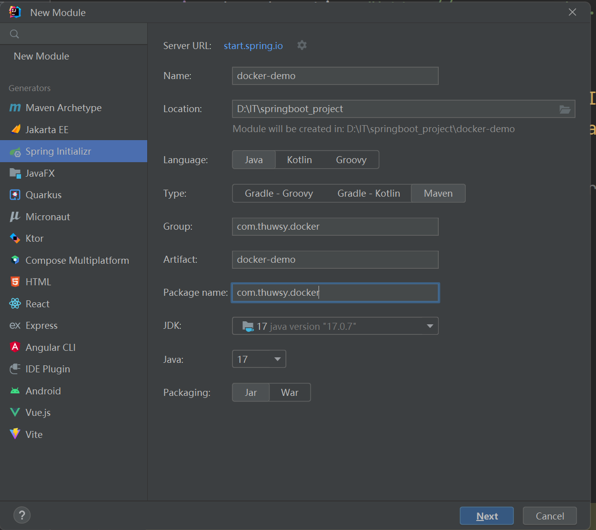

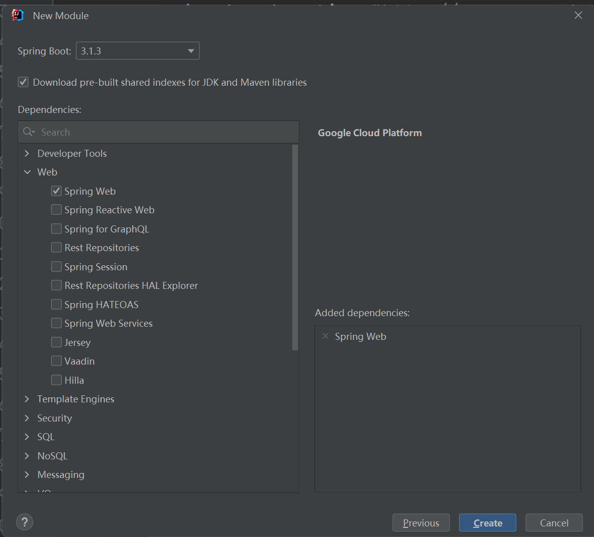

（2）配置文件

```properties
server.port=6001
```

（3）业务类

```java
@RestController
public class OrderController {
    @Value("${server.port}")
    private String port;

    @RequestMapping("/order/docker")
    public String helloDocker() {
        return "hello docker" + "\t" + port + "\t" + UUID.randomUUID();
    }

    @RequestMapping(value = "/order/index", method = RequestMethod.GET)
    public String index() {
        return "服务端口号：\t" + port + "\t" + UUID.randomUUID();
    }
}
```

## 2. 通过Dockerfile构建镜像并部署

（1）IDEA中通过maven生成微服务的jar包，然后通过Xftp上传到服务器的`/myfile/springboot/`目录下

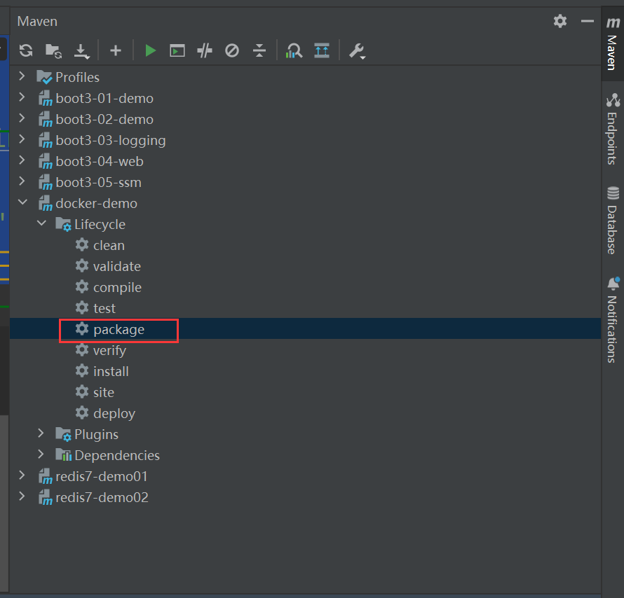

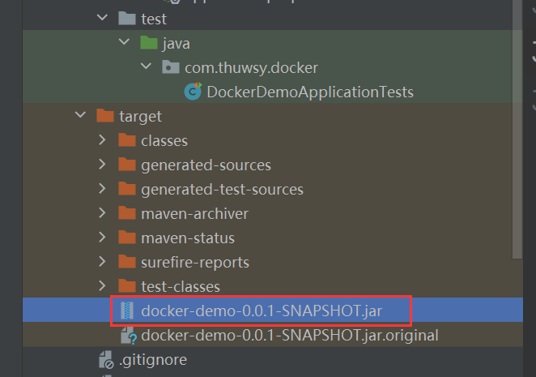

（2）在`/myfile/springboot/`目录下`vim Dockerfile`

```Dockerfile
# 基础镜像使用java
FROM openjdk:17
# 作者
MAINTAINER wsy
# VOLUME 指定临时文件目录为/tmp，在主机/var/lib/docker目录下创建了一个临时文件并链接到容器的/tmp
VOLUME /tmp
# 将jar包添加到容器中并更名为wsy_docker.jar
ADD docker-demo-0.0.1-SNAPSHOT.jar wsy_docker.jar
# 运行jar包
RUN bash -c 'touch /wsy_docker.jar'
ENTRYPOINT ["java","-jar","/wsy_docker.jar"]
#暴露6001端口作为微服务
EXPOSE 6001
```

（3）构建镜像：

```shell
docker build -t wsy_docker:1.0 .
```

（4）运行容器并测试：

```shell
docker run -d -p 6001:6001 wsy_docker:1.0
```

浏览器访问`http://192.168.231.101:6001/order/docker`成功！
