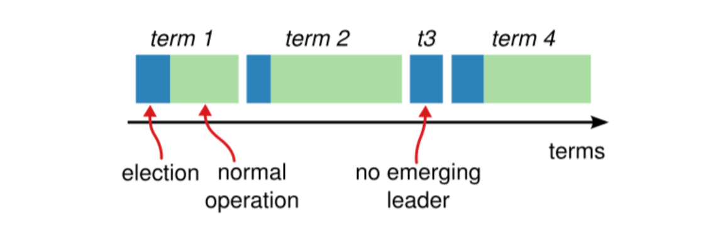

# 第01章_分布式基础理论

## 1. CAP理论

### 1.1 简介

CAP理论，又称为布鲁尔定理，它指出，对于一个分布式系统来说，当设计读写操作时，只能**同时满足以下三点中的两个**：

- Consistency(一致性)：所有节点访问同一份**最新的**数据副本
- Availability(可用性)：非故障的节点在合理的时间内**返回合理的响应**（不是错误或者超时的响应）
- Partition Tolerance(分区容错性)：分布式系统出现**网络分区**的时候，仍然能够对外提供服务

> **网络分区**：分布式系统中，多个节点之间的网络本来是连通的，但是因为某些故障（比如部分节点网络出了问题）某些节点之间不连通了，整个网络就分成了几块区域，这就叫**网络分区**。

事实上，在分布式系统中**分区容错性P是必须要满足的**，在此基础上，一致性C和可用性A只能二选一。而选择CP架构还是AP架构的关键在于当前的业务场景，没有定论，比如对于需要确保强一致性的场景（如银行）一般会选择CP架构。常见的服务注册中心选用的架构为：

- Eureka使用AP
- ZooKeeper使用CP
- Consul使用CP
- Nacos默认使用AP，但也支持切换为CP

### 1.2 AP架构

当网络分区出现后，为了保证可用性，系统B可以返回旧值。它违背了一致性C的要求，只满足可用性和分区容错性，即AP。


### 1.3 CP架构

当网络分区出现后，为了保证一致性，就必须拒接请求。它违背了可用性A的要求，只满足一致性和分区容错性，即CP。


## 2. BASE理论

BASE是以下三个短语的缩写：

- Basically Available（基本可用）
- Soft-state（软状态）
- Eventually Consistent（最终一致性）

BASE理论指的是，即使无法做到强一致性，但每个应用都可以根据自身业务特点，采用适当的方式来使系统达到最终一致性。BASE理论本质上是对CAP的延伸和补充，更具体地说，是对CAP中AP方案的一个补充，也就是牺牲数据的强一致性来满足系统的高可用性，但要采取适当的方式来保证最终一致性。

> 说明：AP方案只是在系统发生分区的时候放弃一致性，而不应该永远放弃一致性。在分区故障恢复后，系统应该达到最终一致性，这一点其实就是BASE理论延伸的地方。

### 2.1 基本可用

基本可用是指分布式系统在出现不可预知故障的时候，允许损失部分可用性。但是，这绝不等价于系统不可用。允许损失部分可用性，主要指：

- **响应时间上的损失**：正常情况下，处理用户请求需要 0.5s 返回结果，但是由于系统出现故障，处理用户请求的时间变为 3s
- **系统功能上的损失**：正常情况下，用户可以使用系统的全部功能，但是由于系统访问量突然剧增，系统的部分非核心功能无法使用

### 2.2 软状态

软状态指允许系统中的数据存在中间状态（**CAP理论中的数据不一致**），并认为该中间状态的存在不会影响系统的整体可用性，即允许系统在不同节点的数据副本之间进行数据同步的过程存在延时。

### 2.3 最终一致性

最终一致性强调的是系统中所有的数据副本，在经过一段时间的同步后，最终能够达到一个一致的状态。因此，最终一致性的本质是需要系统保证最终数据能够达到一致，而不需要实时保证系统数据的强一致性。

分布式一致性的3种级别为：

1. **强一致性**：系统写入了什么，读出来的就是什么。
2. **弱一致性**：不一定可以读取到最新写入的值，也不保证多少时间之后读取到的数据是最新的，只是会尽量保证某个时刻达到数据一致的状态。
3. **最终一致性**：弱一致性的升级版，系统会保证在一定时间内达到数据一致的状态。

> 业界比较推崇的是**最终一致性**级别，但是某些对数据一致要求十分严格的场景比如银行转账还是要保证强一致性。

一般来说，实现最终一致性，主要有以下几种方式：

- **读时修复**: 在读取数据时，检测数据的不一致，进行修复。
- **写时修复**: 在写入数据时，检测数据的不一致，进行修复。
- **异步修复**: 这个是最常用的方式，通过定时任务检测副本数据的一致性，并修复。


# 第02章_分布式一致性算法

## 1. Paxos算法

### 1.1 简介

Paxos算法是兰伯特提出的一种**分布式系统共识算法**，也是第一个被证明完备的共识算法（前提是**不存在拜占庭将军问题，也就是没有恶意节点**）。共识算法的作用是让分布式系统中的多个节点之间对某个提案（Proposal）达成一致的看法。

> **拜占庭将军问题**是由兰伯特提出的点对点通信中的基本问题，其含义是**在存在消息丢失的不可靠信道上试图通过消息传递的方式达到一致性是不可能的**。

Paxos中存在3个重要的角色：

1. **提议者（Proposer）**：负责接受客户端的请求并发起提案，提案信息通常包括提案编号和提议的值。
2. **表决者（Acceptor）**：负责对提议者的提案进行投票，同时需要记住自己的投票历史。
3. **学习者（Learner）**：如果有超过半数的表决者就某个提议达成了共识，那么学习者就需要接受这个提议，并就该提议作出运算，然后将运算结果返回给客户端。

> 说明：
>
> - 一个节点可以身兼多个角色。
> - 必须要有半数以上的Acceptor投票，一个提案才能被选定。

事实上，Paxos算法在国际上被公认为非常难以理解和实现，因此不断有人尝试简化这一算法：

- 针对没有恶意节点的情况，当前最常用的一些共识算法比如**Raft算法**、**ZAB协议**、**Fast Paxos**算法都是基于Paxos算法改进的。
- 针对存在恶意节点的情况，一般使用的是**工作量证明（POW，Proof-of-Work）**、**权益证明（PoS，Proof-of-Stake）**等共识算法。这类共识算法最典型的应用就是区块链，区块链系统使用的共识算法需要解决的核心问题就是**拜占庭将军问题**，这和我们日常接触到的ZooKeeper等分布式中间件不太一样。

### 1.2 核心流程

Paxos算法分为两个阶段：Prepare和Accept

#### Prepare阶段

1. Proposer：负责提出proposal，并赋予其一个**全局唯一且递增**的提案编号`N`，然后将该**提案编号**发送给所有表决者。
2. Acceptor：每个表决者会在自己本地保存已经accept过的最大提案编号`maxN`。当收到一个新的提案编号`N`时，只有当`N > maxN`表决者才会accept这个提案，然后将历史最大提案编号`maxN`响应给Proposer，并在自己本地保存提案编号`N`。

#### Accept阶段

1. 如果Proposer收到了超过半数Acceptor对提案编号的批准，接下来就会给所有Acceptor发送**提案编号`N`及提案内容**。
2. 表决者收到提案请求后，会再次比较`N`和`maxN`，只有当`N >= maxN`表决者才会accept这个提案，然后执行提案内容（但并未提交），并响应ACK给Proposer。
3. 如果Proposer没有收到超过半数的accept，那么它会递增该Proposal的编号，然后重新进入Prepare阶段。
4. 如果Proposer收到了超过半数的accept，那么它会给所有Acceptor发送**提案的commit消息**。Acceptor收到commit消息后就提交该提案事务。

### 1.3 Paxos算法的死循环问题

Paxos算法会产生以下死循环问题：

1. 提议者P1发起提案M1，表决者A在Prepare阶段批准了M1
2. 提议者P2发起提案M2，表决者A在Prepare阶段批准了M2
3. 此时，表决者A已经无法在Accept阶段accept M1了（因为M2的提案编号更大）。于是P1会递增M1的编号，将其变为M3，并重新发起提案。
4. 表决者A在Prepare阶段批准了M3
5. 此时，表决者A已经无法在Accept阶段accept M2了
6. 以此类推...

想解决Paxos算法的死循环问题，只需要**要求集群中只能有一个Proposer**即可，像ZAB协议就是采用这种方式来改进Paxos算法。

## 2. Raft算法

Raft算法的动画演示可以参考 https://thesecretlivesofdata.com/raft/

### 2.1 基本概念

#### 1、节点类型

我们以5台服务器构成的Raft集群为例。在任意时刻，每个服务器必然是以下三种角色之一：

1. **Leader**：负责发送心跳，响应客户端请求，创建日志，同步日志。
2. **Follower**：接收Leader的心跳和日志同步数据，投票给Candidate。
3. **Candidate**：Leader选举过程中的临时角色，作用是参加竞选并发起投票。

> 在正常的情况下，只有一个服务器是Leader，剩下的服务器是Follower。

#### 2、任期

Raft算法将时间划分为任意长度的任期（term），任期用连续的数字表示。每一个任期的开始都是一次选举。在选举开始时，一个或多个Candidate会尝试成为Leader；如果一个Candidate赢得了选举，它就会在该任期内担任Leader；如果没有选出Leader，将会开启下一个任期，并立刻开始下一次选举。

每个节点都会存储当前的term号，当服务器之间进行通信时会交换各自的term号，并遵循以下规则：

- 如果有服务器发现自己的term号比其他人小，那么它会更新到较大的term值。
- 如果一个Candidate或者Leader发现自己的term过期了，它会立即退化成Follower。
- 如果一台服务器收到的请求的term号是过期的，那么它会拒绝此次请求。



#### 3、日志

日志（log）是由事件（entry）构成的数组。只有Leader可以创建entry，entry的内容为`<index,term,cmd>`，其中index是该事件在log中的索引、term是任期、cmd是具体操作。

每个entry总是先被Leader添加到自己的log中，然后发起共识请求，获得同意之后才会被Leader提交执行。Follower只能从Leader获取新日志和当前的commitIndex，然后再把对应的entry提交执行。

### 2.2 核心流程：Leader选举

Raft算法使用心跳机制来触发Leader选举。Leader会向所有的Follower周期性发送心跳来保证自己的Leader地位：

- 如果一台服务器能够收到来自Leader或者Candidate的有效信息，那么它会一直保持为Follower状态，并刷新自己的electionElapsed（选举超时时间）。
- 如果一个Follower在一个周期内没有收到心跳信息，就叫做选举超时，然后它就会认为此时没有可用的Leader，并且开始进行一次选举以选出一个新的Leader。

为了开始新的选举，Follower会自增自己的term号并且转换状态为Candidate，然后他会向所有节点发起RequestVoteRPC请求（其他节点收到RequestVoteRPC请求后，如果在该term内没有投过票，则会将票投给该节点）。Candidate的状态会持续到以下情况发生：

- 赢得选举
- 其他节点赢得选举
- 一轮选举结束，无人胜出

> 赢得选举的条件是：一个Candidate在一个任期内收到了来自集群内的多数选票`（N/2+1）`，就可以成为 Leader。

在Candidate等待选票的时候，它可能收到其他节点声明自己是Leader的心跳，此时有两种情况：

- 该 Leader 的 term 号大于等于自己的 term 号，说明对方已经成为 Leader，则自己回退为 Follower。
- 该 Leader 的 term 号小于自己的 term 号，那么会拒绝该请求并让该节点更新 term。

由于可能同一时刻出现多个Candidate，导致没有Candidate获得大多数选票，如果没有其他手段来重新分配选票的话，那么可能会无限重复下去。Raft使用了随机的选举超时时间来避免上述情况：每一个 Candidate 在发起选举后，都会随机化一个新的选举超时时间。

### 2.3 核心流程：日志复制

在Leader选举期间，整个Raft集群对外是不可用的；而一旦选出了Leader，它就可以开始接受客户端的请求。

1. Leader收到客户端请求后会生成一个entry，再将这个entry添加到自己的日志末尾，然后向所有的节点广播该entry，要求其他服务器复制这条entry。
2. Follower会将该entry添加到自己的日志后面，同时返回给Leader同意。
3. 如果Leader收到了多数的成功响应，Leader就会将这个entry提交执行，然后响应给客户端。
4. 接下来Leader将提交的消息广播给所有Follower，Follower收到后也提交执行该entry。

Raft算法的核心就是要保证Leader和Follower日志的一致性。如果Leader崩溃，则可能导致Leader和Follower的日志不一致。为此，Raft算法中Leader通过强制Follower复制自己的日志来处理日志不一致的情况，也就是说，在Follower上的冲突日志会被Leader的日志覆盖。

## 3. ZAB协议

参考ZooKeeper笔记。


# 第03章_分布式事务

2PC和3PC是刚性事务，追求数据的强一致性；而其他分布式事务解决方案是柔性事务，追求数据的最终一致性。

## 1. 2PC

两阶段提交（2 phase commit）分为两个阶段：

第一阶段：当要执行一个分布式事务的时候，事务发起者首先向协调者发起事务请求，然后协调者会给所有参与者发送 `prepare` 请求（其中包括事务内容）；然后参与者收到 `prepare` 消息后，他们会开始执行事务（但不提交），并将`Undo`和`Redo`信息记入事务日志中，之后参与者就向协调者反馈是否准备好了。

第二阶段：协调者根据参与者反馈的情况来决定接下来是提交事务还是回滚事务

- 如果在第一阶段所有参与者都返回YES，那么协调者就会发送commit请求；参与者收到后就会提交前面执行的事务，然后响应给协调者。
- 否则，协调者就会发送rollback请求；参与者收到后就会回滚它在第一阶段所做的操作，然后响应给协调者。


缺点：

1. **阻塞问题**：当协调者发送 `prepare` 请求，参与者收到之后执行事务但并不提交，这个时候会一直占用着数据库资源不释放，如果此时协调者挂了，那么这些资源都不会再释放了。
2. **数据不一致问题**：如果第二阶段协调者只发送了一部分commit请求就挂了，那么收到commit消息的参与者就会提交事务，而未收到commit消息的参与者就不会提交事务。
3. **性能很差**：执行事务但不提交，会长时间占用数据库资源，这就意味着无法满足高并发场景。

## 2. 3PC

三阶段提交（3 phase commit）将阶段划分得更细，并且还引入了超时机制。三个阶段分别为：

**CanCommit阶段**：协调者向所有参与者发送 `CanCommit` 请求，参与者收到请求后会根据自身情况查看是否能执行事务，如果可以则返回YES响应并进入预备状态，否则返回NO。

**PreCommit阶段**：协调者根据参与者返回的响应来决定是否可以进行下面的 `PreCommit` 操作。如果上面参与者返回的都是 YES，那么协调者将向所有参与者发送 `PreCommit` 预提交请求，**参与者收到预提交请求后，会进行事务的执行操作，并将 `Undo` 和 `Redo` 信息写入事务日志中**，最后如果参与者顺利执行了事务则给协调者返回成功的响应。如果在第一阶段协调者收到了 **任何一个NO** 的信息，或者 **在一定时间内** 并没有收到全部的参与者的响应，那么就会中断事务，它会向所有参与者发送中断请求，参与者收到中断请求之后会立即中断事务，或者在一定时间内没有收到协调者的请求，它也会中断事务。

**DoCommit阶段**：这个阶段与 `2PC` 的第二阶段类似。如果协调者收到了所有参与者在 `PreCommit` 阶段的 YES 响应，那么协调者将会给所有参与者发送 `DoCommit` 请求，**参与者收到 `DoCommit` 请求后则会进行事务的提交工作**，完成后则会给协调者返回响应，协调者收到所有参与者返回的事务提交成功的响应之后则完成事务。若协调者在 `PreCommit` 阶段 **收到了任何一个 NO 或者在一定时间内没有收到所有参与者的响应** ，那么就会进行中断请求的发送，参与者收到中断请求后则会 **通过上面记录的回滚日志** 来进行事务的回滚操作，并向协调者反馈回滚状况，协调者收到参与者返回的消息后，中断事务。


## 3. TCC

TCC(Try Confirm/Cancel)是一种事务补偿型方案，它基于2PC模型，但是支持自定义的事务处理逻辑，这样就可以不使用数据库事务的锁机制，提高性能：

- 一阶段 prepare 行为：调用自定义的 prepare 逻辑。
- 二阶段 commit 行为：调用自定义的 commit 逻辑。
- 二阶段 rollback 行为：调用自定义的 rollback 逻辑。

## 4. 最大努力通知方案

结合消息队列实现，设置最大通知次数，不保证一定能通知成功，但会提供可查询操作接口进行核对。

## 5. 异步通知方案

业务处理服务在事务提交之前，向实时消息服务请求发送消息，实时消息服务只记录消息数据，而不是真正地发送。业务处理服务在业务事务提交之后，向实时消息服务确认发送。只有在得到确认发送指令后，实时消息服务才会真正发送。


# 第04章_RPC

## 1. RPC简介

**本地过程调用**，指的是在同一个JVM运行的不同方法间互相进行调用。

**远程过程调用**，简称RPC(Remote Procedure Call)，指的是`服务消费者`通过连接`服务提供者`的服务器进行请求/响应交互，来实现调用效果。

> 补充：API和SDK的区别
>
> - API是接口(Application Programming Interface)，它可以本地调用，也可以远程调用
> - SDK是工具包(Software Development Kit)，指的是本地导入jar包后，可以直接调用其中的方法

开发过程中，我们经常需要远程调用别人写的功能：

- 如果是内部微服务，可以通过分布式框架提供的RPC功能进行调用
- 如果是外部暴露的，可以通过HTTP请求、或遵循外部协议进行调用

常用的RPC方式：

- Spring Boot中，可以使用轻量级客户端RestTemplate
- Spring Cloud中，可以使用OpenFeign进行远程调用
- 使用第三方框架，如Dubbo、gRPC进行远程调用

## 2. RPC的底层原理

整个 RPC 的核心功能是由下面 5 个部分实现的：

1. **客户端（服务消费端）**：调用远程方法的一端。
2. **客户端 Stub（桩）**：这其实就是一个代理类。代理类主要做的事情很简单，就是把你调用方法、类、方法参数等信息传递到服务端。
3. **网络传输**：网络传输就是把你调用的方法的信息（比如参数）传输到服务端，然后服务端执行完之后再把返回结果通过网络传输回来。网络传输的实现方式有很多种，比如最基本的 Socket ，或者性能以及封装更加优秀的 Netty（推荐）。
4. **服务端 Stub（桩）**：这个桩就不是代理类了。这里的服务端 Stub 实际指的就是接收到客户端执行方法的请求后，去执行对应的方法然后返回结果给客户端的类。
5. **服务端（服务提供端）**：提供远程方法的一端。


RPC底层原理如下：

1. 服务消费端（client）以本地调用的方式调用远程服务；
2. 客户端 Stub（client stub） 接收到调用后负责将方法、参数等组装成能够进行网络传输的消息体（序列化）：`RpcRequest`；
3. 客户端 Stub（client stub） 找到远程服务的地址，并将消息发送到服务提供端；
4. 服务端 Stub（桩）收到消息将消息反序列化为 Java 对象: `RpcRequest`；
5. 服务端 Stub（桩）根据`RpcRequest`中的类、方法、方法参数等信息调用本地的方法；
6. 服务端 Stub（桩）得到方法执行结果并将其组装成能够进行网络传输的消息体：`RpcResponse`（序列化）发送至消费方；
7. 客户端 Stub（client stub）接收到消息并将消息反序列化为 Java 对象：`RpcResponse` ，这样也就得到了最终结果。

## 3. 常用的RPC框架

RPC框架指的是可以让客户端直接调用服务端方法，就像调用本地方法一样简单的框架，比如下面介绍的**Dubbo、gRPC**。如果需要和HTTP协议打交道，解析和封装HTTP请求和响应，那么这类框架并不能算是RPC框架，比如**OpenFeign**。

### 3.1 Dubbo

Dubbo由阿里开源，后来加入了Apache，它是一款微服务框架，为大规模微服务实践提供高性能RPC通信、流量治理、可观测性等解决方案，涵盖Java、Golang等多种语言SDK实现。

Dubbo提供了从服务定义、服务发现、服务通信到流量管控等几乎所有的服务治理能力，支持Triple协议（基于HTTP/2之上定义的下一代RPC通信协议）、应用级服务发现、Dubbo Mesh（Dubbo3 赋予了很多云原生友好的新特性）等特性。

### 3.2 gRPC

gRPC是Google开源的一个高性能、通用的RPC框架，它主要面向移动应用开发并基于HTTP/2协议标准而设计（支持双向流、消息头压缩等功能，更加节省带宽），基于ProtoBuf序列化协议开发，并且支持众多开发语言。

不过，gRPC的设计导致其几乎没有服务治理能力。如果你想要解决这个问题的话，就需要依赖其他组件比如腾讯的PolarisMesh（北极星）了。

## 4. HTTP协议和RPC的区别

HTTP是一种应用层协议，而RPC本身并不是一种协议，而是一种调用方式。RPC和主流的HTTP/1.1协议主要有以下区别：

- HTTP一般是通过DNS来进行服务发现；而RPC一般会有专门的中间服务来保存服务名和IP信息
- HTTP/1.1默认在建立底层TCP连接之后会一直保持这个连接（**keep alive**），之后的请求和响应都会复用这条连接；而RPC一般会再建个**TCP连接池**，在请求量大的时候，建立多条连接放在池内，便于复用
- HTTP/1.1的Header中的信息十分冗余，导致请求头很大，传输效率低；而RPC则采用体积更小的Protobuf或其他序列化协议去保存结构体数据，因此**性能更高**

**总结**：由于HTTP/2.0是2015年才出来的，所以在早期，很多公司由于RPC的**性能更高**，选择使用RPC而非HTTP/1.1。但是HTTP/2.0出来后，做了很多改进，所以**HTTP/2.0的性能比当时的RPC还要高**，因此像现在的一些RPC框架如**gRPC**，其底层也是基于HTTP/2.0的。


# 第05章_压力测试

## 1. 简介

压力测试用于考察当前软硬件环境下系统所能承受的最大负荷并帮助找出系统瓶颈所在。压测是为了系统在线上的处理能力和稳定性维持在一个标准范围内。

使用压力测试，我们有希望找到一些很难发现的错误，典型的错误就是：**内存泄漏**、**并发与同步**。

## 2. 性能指标

- 响应时间RT（Response Time）：用户发出请求到用户收到系统处理结果所需要的时间。
- 并发数：系统同时能处理的请求数量。
- QPS（Query Per Second）：服务器每秒可以执行的查询次数。
- TPS（Transaction Per Second）：服务器每秒可以处理的事务数。
- 吞吐量：系统单位时间内处理的请求数量。

性能测试主要关注以下指标：

1. **吞吐量**
2. **响应时间**
3. **错误率**：一批请求中结果出错的请求所占比例

## 3. JMeter的使用

下载`apache-jmeter-5.6.2.zip`后解压，运行bin目录下的jmeter.bat就启动了JMeter。

首先在测试计划中创建线程组：


在线程组下创建HTTP请求：


在线程组下添加监听器，便于查看测试报告：


保存测试计划：


启动测试/停止测试/清除以前的测试报告：


# 第06章_分布式任务调度

## 1. 简介

### 1.1 任务调度

任务调度指的是系统为了完成特定业务，基于给定时间点、给定时间间隔或者给定执行次数自动执行任务。

**单机任务调度**的常见解决方案有：

- JDK提供的`Timer`
- JDK提供的`ScheduledExecutorService`
- Spring提供的Spring Task（通过`@Scheduled`注解和cron表达式来定义定时任务）

然而，由于我们的微服务往往是集群部署的，所以如果使用单机任务调度，就会导致同一个任务被执行多次。因此在分布式架构中，我们需要使用**分布式任务调度**。常见的分布式任务调度框架有Quartz、Elastic-Job、XXL-JOB等。

### 1.2 XXL-JOB

XXL-JOB是一个轻量级的分布式任务调度框架，使用起来非常简单，提供的分布式任务调度的功能更为完善和强大，更加适合执行周期性的定时任务，并且支持可视化管理。XXL-JOB有以下三个核心概念：

- **任务**：具体的业务逻辑
- **调度中心**：负责管理调度信息，按照调度配置发出调度请求
- **执行器**：负责接收调度请求并执行任务

XXL-JOB任务执行流程如下：


> **注意**：即使是分布式任务调度，也有可能会重复执行任务，所以一定要保证任务的**幂等性**。对于定时任务而言，通常会使用分布式锁来防止并发修改，然后更新DB中的任务状态字段来标识任务已完成，从而保证幂等性。

## 2. XXL-JOB基本使用

### 2.1 启动调度中心

（1）克隆XXL-JOB调度中心源码，码云仓库为 https://gitee.com/xuxueli0323/xxl-job

（2）执行doc目录下的sql脚本`tables_xxl_job.sql`，创建数据库

（3）修改xxl-job-admin模块配置文件中的数据库连接信息，然后启动该项目即可

（4）访问`http://localhost:8080/xxl-job-admin`进入管理界面，默认用户名admin，密码123456

### 2.2 配置执行器

（1）在管理界面新增执行器


（2）在微服务中引入XXL-JOB依赖

```xml
<dependency>
    <groupId>com.xuxueli</groupId>
    <artifactId>xxl-job-core</artifactId>
    <version>2.4.1</version>
</dependency>
```

（3）在微服务中配置XXL-JOB信息

```yaml
server:
  port: 8001
xxl:
  job:
    admin:
      # 调度中心地址
      addresses: http://127.0.0.1:8080/xxl-job-admin
    accessToken: default_token
    executor:
      appname: seckill-service # 执行器AppName
      address:
      ip:
      port: 9999 # 执行器端口号，默认为9999
      logpath: E:\\user-logs\\jobhandler
      logretentiondays: 30
```

（4）在微服务中注册执行器Bean

```java
@Configuration
public class XxlJobConfig {

    @Value("${xxl.job.admin.addresses}")
    private String adminAddresses;

    @Value("${xxl.job.accessToken}")
    private String accessToken;

    @Value("${xxl.job.executor.appname}")
    private String appname;

    @Value("${xxl.job.executor.address}")
    private String address;

    @Value("${xxl.job.executor.ip}")
    private String ip;

    @Value("${xxl.job.executor.port}")
    private int port;

    @Value("${xxl.job.executor.logpath}")
    private String logPath;

    @Value("${xxl.job.executor.logretentiondays}")
    private int logRetentionDays;
    
    @Bean
    public XxlJobSpringExecutor xxlJobExecutor() {
        XxlJobSpringExecutor xxlJobSpringExecutor = new XxlJobSpringExecutor();
        xxlJobSpringExecutor.setAdminAddresses(adminAddresses);
        xxlJobSpringExecutor.setAppname(appname);
        xxlJobSpringExecutor.setAddress(address);
        xxlJobSpringExecutor.setIp(ip);
        xxlJobSpringExecutor.setPort(port);
        xxlJobSpringExecutor.setAccessToken(accessToken);
        xxlJobSpringExecutor.setLogPath(logPath);
        xxlJobSpringExecutor.setLogRetentionDays(logRetentionDays);

        return xxlJobSpringExecutor;
    }
}
```

（5）启动该微服务项目后，在管理界面就可以看到执行器已自动注册

### 2.3 配置任务

（1）在微服务中通过`@XxlJob`注解指定任务方法

```java
@Component
public class SyncGoodsJob {
    @Autowired
    private GoodsMapper goodsMapper;

    @Autowired
    private StringRedisTemplate redisTemplate;

    @XxlJob("syncGoodsInfoJobHandler")
    public void syncGoodsInfo() {
        List<Goods> goodsList = goodsMapper.selectList();
        for (Goods goods : goodsList) {
            String detailKey = "seckill:goods:detail:" + goods.getGoodsId();
            String detailValue = JSON.toJSONString(goods);
            redisTemplate.opsForValue().set(detailKey, detailValue);
            String stockKey = "seckill:goods:stock:" + goods.getGoodsId();
            String stockValue = goods.getStock().toString();
            redisTemplate.opsForValue().set(stockKey, stockValue);
        }
    }
}
```

（2）在管理界面配置任务


（3）启动任务


# 第07章_分布式文件系统

## 1. 简介

分布式文件系统（Distributed File System，DFS）是指文件系统管理的物理存储资源不一定直接连接在本地节点上，而是通过计算机网络与节点相连；或是若干不同的逻辑磁盘分区或卷标组合在一起而形成的完整的有层次的文件系统。DFS为分布在网络上任意位置的资源提供一个逻辑上的树形文件系统结构，从而使用户访问分布在网络上的共享文件更加简便。

MinIO是在GNU Affero通用公共许可证v3.0下发布的**高性能对象存储**，它与Amazon S3云存储服务API兼容，是一种常用的分布式文件系统。

## 2. MinIO的安装

（1）拉取镜像

```shell
docker pull minio/minio:RELEASE.2022-09-07T22-25-02Z
```

（2）创建挂载目录

```sh
mkdir -p /docker/minio/config
mkdir -p /docker/minio/data
```

（3）启动容器实例

```sh
docker run -d --name minio \
-p 9000:9000 -p 9090:9090 \
--restart=always \
-e "MINIO_ACCESS_KEY=minioadmin" \
-e "MINIO_SECRET_KEY=minioadmin" \
-v /docker/minio/data:/data \
-v /docker/minio/config:/root/.minio \
minio/minio:RELEASE.2022-09-07T22-25-02Z server \
/data --console-address ":9090" -address ":9000"
```

> 说明：其中9090端口是控制台的端口，而9000是提供的API端口。容器启动后，访问 http://192.168.231.201:9090 即可查看控制台。

## 3. MinIO的基本使用

（1）首先在控制台创建一个桶，名称为`testbucket`。然后在Manage中将Access Policy修改为`public`。

（2）创建一个模块用于测试，添加以下依赖

```xml
<dependency>
    <groupId>io.minio</groupId>
    <artifactId>minio</artifactId>
    <version>8.5.7</version>
</dependency>
```

（3）测试类

```java
public class MyTests {
    // 连接minio的客户端
    static MinioClient minioClient = MinioClient.builder()
            .endpoint("http://192.168.231.201:9000")
            .credentials("minioadmin", "minioadmin")
            .build();

    @Test // 上传文件
    public void testUpload() throws Exception {
        UploadObjectArgs testbucket = UploadObjectArgs.builder()
                .bucket("testbucket") // 桶的名称
                .object("001/test001.png") // 桶下保存文件的路径
                .filename("E:\\haha.png") // 源文件的路径
                .build();
        minioClient.uploadObject(testbucket);
        System.out.println("上传成功");
    }

    @Test // 下载文件
    public void testDownload() throws Exception {
        InputStream is = minioClient.getObject(GetObjectArgs.builder()
                .bucket("testbucket")
                .object("001/test001.png")
                .build());
        // 使用工具类IOUtils拷贝流，实现文件下载
        FileOutputStream os = new FileOutputStream("E:\\lala.png");
        IOUtils.copy(is, os);
        System.out.println("下载成功");
    }

    @Test // 删除文件
    public void testDelete() throws Exception {
        minioClient.removeObject(RemoveObjectArgs.builder()
                .bucket("testbucket")
                .object("001/test001.png")
                .build());
        System.out.println("删除成功");
    }
}
```
