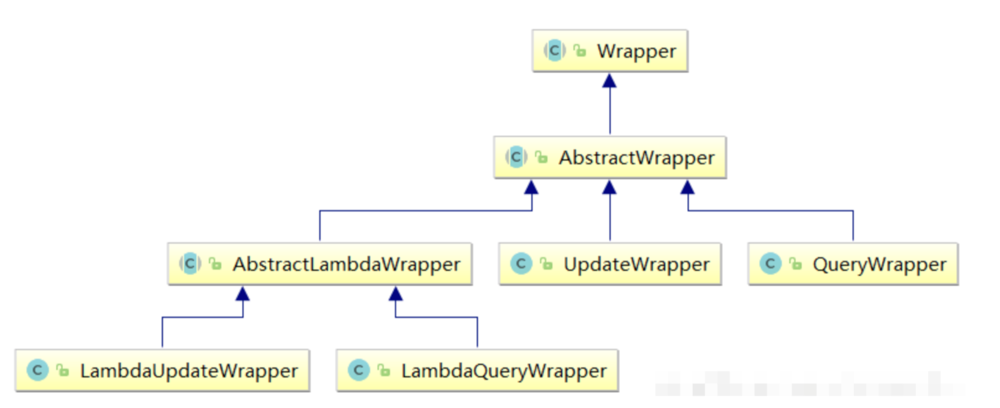
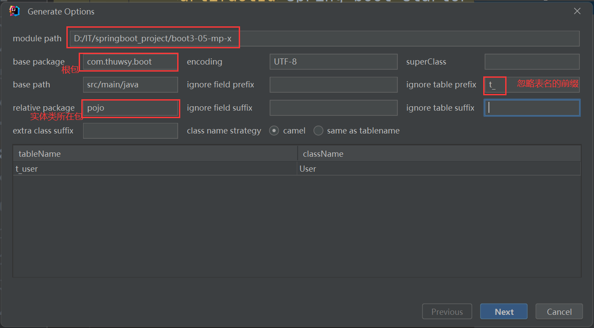
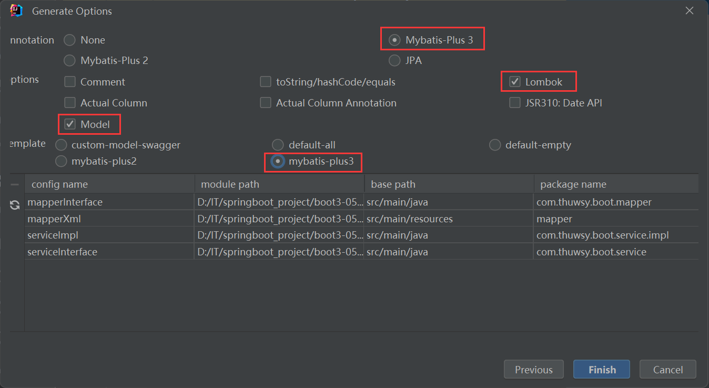

# 第01章_MyBatis-Plus简介

## 1. 简介

MyBatis-Plus（简称 MP）是一个MyBatis的**增强工具**，在MyBatis的基础上只做增强不做改变，为简化开发、提高效率而生。特点如下：

- 自动生成单表的CRUD功能
- 提供丰富的条件拼接方式
- 全自动ORM类型持久层框架

## 2. 快速入门案例

### 2.1 引入依赖

在SpringBoot项目中导入MyBatis-Plus的场景启动器，代替MyBatis的场景启动器：

```xml
<!-- mybatis-plus -->
<dependency>
    <groupId>com.baomidou</groupId>
    <artifactId>mybatis-plus-spring-boot3-starter</artifactId>
    <version>3.5.8</version>
</dependency>
<!-- mysql -->
<dependency>
    <groupId>com.mysql</groupId>
    <artifactId>mysql-connector-j</artifactId>
    <scope>runtime</scope>
</dependency>
```

### 2.2 配置文件

```properties
spring.datasource.type=com.zaxxer.hikari.HikariDataSource
spring.datasource.driver-class-name=com.mysql.cj.jdbc.Driver
spring.datasource.url=jdbc:mysql://localhost:3306/ssm
spring.datasource.username=root
spring.datasource.password=abc666
# 控制台输出sql语句
mybatis-plus.configuration.log-impl=org.apache.ibatis.logging.stdout.StdOutImpl
```

**说明**：

1. MyBatis-Plus的自动配置，**默认指定mapper映射文件的位置是类路径下的mapper文件夹内**，即`classpath*:/mapper/**/*.xml`，所以我们无需在配置文件中手动配置。
2. MyBatis-Plus的自动配置，**默认开启了自动驼峰命名映射**，所以我们无需在配置文件中手动配置。

### 2.3 主启动类

主启动类上配置Mapper接口的包扫描：

```java
@MapperScan("com.wsy.mapper")
@SpringBootApplication
public class MybatisPlusDemoApplication {
    public static void main(String[] args) {
        SpringApplication.run(MybatisPlusDemoApplication.class, args);
    }
}
```

### 2.4 实体类和数据库表

对数据库表user创建对应的实体类User：

```java
@TableName("user")
@Data
public class User {
    @TableId("id")
    private Long id;

    private String name;

    private Integer age;

    private String email;
}
```

> 注意：MyBatis-Plus中一般使用Long类型的主键，因为默认会使用**雪花算法**生成主键。

### 2.5 Mapper接口继承BaseMapper

```java
public interface UserMapper extends BaseMapper<User> {
}
```

> MyBatis-Plus提供的BaseMapper接口，自带CRUD方法

### 2.6 测试

```java
@SpringBootTest
class MybatisPlusDemoApplicationTests {
    @Autowired
    private UserMapper userMapper;

    @Test
    public void test01() {
        List<User> users = userMapper.selectList(null);
        users.forEach(System.out::println);
    }
}
```


# 第02章_基于Mapper接口CRUD

通用CRUD封装在BaseMapper接口中，Mybatis-Plus启动时自动解析实体表关系映射转换为MyBatis内部对象注入容器，内部包含常见的单表操作。

## 1. insert

- `int insert(T entity)`：插入一条记录，entity就是要插入的实体类对象。注意，若entity中没有指定主键id，则会默认采用**雪花算法**生成主键id，并设置进entity对应的属性中。

举例：

```java
@Test
public void test02() {
    User user = new User();
    user.setAge(88);
    user.setName("lala");
    user.setEmail("xxx");
    int row = userMapper.insert(user);
    System.out.println("row: " + row); // row: 1
    System.out.println("id: " + user.getId()); // id: 1854412774877265922
}
```

## 2. delete

- `int deleteById(Serializable id)`：根据主键删除
- `int deleteByMap(Map<String, Object> columnMap)`：根据columnMap条件进行删除，其中Map的key必须是表中的某个字段
- `int deleteByIds(Collection idList)`：根据主键批量删除
- `int delete(Wrapper<T> queryWrapper)`：根据wrapper条件删除

举例：

```java
@Test
public void test03() {
    // 1. DELETE FROM user WHERE id=2
    int row1 = userMapper.deleteById(2L);

    // 2. DELETE FROM user WHERE name='lala' AND age=88
    Map<String, Object> param = new HashMap<>();
    param.put("age", 88);
    param.put("name", "lala");
    int row2 = userMapper.deleteByMap(param);

    // 3. DELETE FROM user WHERE id IN (3, 4)
    int row3 = userMapper.deleteByIds(Arrays.asList(3L, 4L));
}
```

## 3. update

- `int updateById(T entity)`：根据主键进行修改，主键属性必须不为null。
- `int update(T entity, Wrapper<T> updateWrapper)`：根据wrapper条件进行修改

> **注意：对于修改操作，如果实体类对象的某个属性为null，则不会修改该属性对应的字段**。因此，我们定义实体类时，不推荐使用基本数据类型，而推荐使用包装类型（因为其默认值为null）。

举例：

```java
@Test
public void test04() {
    // UPDATE user SET name='wsy' WHERE id=4
    User user = new User();
    user.setId(4L);
    user.setName("wsy");
    int row = userMapper.updateById(user);
}
```

## 4. select

### 4.1 基本API

- `T selectById(Serializable id)`：根据主键查询
- `List<T> selectByIds(Collection idList)`：根据主键批量查询
- `List<T> selectByMap(Map<String, Object> columnMap)`：根据columnMap条件查询

### 4.2 根据wrapper条件查询

- `T selectOne(Wrapper<T> queryWrapper)`：根据wrapper条件查询一条记录（若结果集为多条记录，会抛出异常）
- `List<T> selectList(Wrapper<T> queryWrapper)`：根据wrapper条件查询多条记录
- `List<Map<String, Object>> selectMaps(Wrapper<T> queryWrapper)`：根据wrapper条件查询多条记录
- `List<Object> selectObjs(Wrapper<T> queryWrapper)`：根据wrapper条件查询多条记录，不过只返回第一个字段

### 4.3 分页查询

- `IPage<T> selectPage(IPage<T> page, Wrapper<T> queryWrapper)`：根据wrapper条件查询多条记录（并分页）
- `IPage<Map<String, Object>> selectMapsPage(IPage<T> page, Wrapper<T> queryWrapper)`：根据wrapper条件查询多条记录（并分页）

### 4.4 查询记录数

- `Long selectCount(Wrapper<T> queryWrapper)`：查询满足wrapper条件的记录数

## 5. 自定义Mapper接口方法

我们可以像使用MyBatis一样自定义Mapper接口方法，然后在mapper.xml中写对应的SQL语句。

注意，MyBatis-Plus的自动配置，**默认指定mapper映射文件的位置是类路径下的mapper文件夹内**，即`classpath*:/mapper/**/*.xml`。

当然，我们也可以在配置文件中配置`mybatis-plus.mapper-locations`来改变存放mapper.xml的位置。


# 第03章_基于Service接口CRUD

## 1. 简介

通用Service的CRUD方法封装在`IService`接口中，它与Mapper接口CRUD的区别在于：

- service添加了一些批量操作的方法
- service层的方法会自动添加事务

使用方式如下：

**（1）自定义Service接口继承`IService`接口**

```java
public interface UserService extends IService<User> {
}
```

**（2）自定义Service实现类继承`ServiceImpl`类，并实现上述的自定义Service接口**

```java
@Service
public class UserServiceImpl extends ServiceImpl<UserMapper, User> implements UserService {
}
```

> 原因：`IService`接口中的一些方法提供了默认实现，而另一些方法仍是抽象方法，在`ServiceImpl`类中才提供了实现，所以需要继承`ServiceImpl`类。

## 2. 全部API

### 2.1 save

- `boolean save(T entity)`：插入一条记录
- `boolean saveBatch(Collection<T> entityList)`：批量插入记录
- `boolean saveBatch(Collection<T> entityList, int batchSize)`：批量插入记录，其中batchSize是每次的数量

### 2.2 saveOrUpdate

- `boolean saveOrUpdate(T entity)`：主键值不为null则更新该记录，否则插入一条记录
- `boolean saveOrUpdate(T entity, Wrapper<T> updateWrapper)`：先根据wrapper条件进行更新，如果更新失败，则执行`saveOrUpdate(entity)`
- `boolean saveOrUpdateBatch(Collection<T> entityList)`：批量修改插入
- `boolean saveOrUpdateBatch(Collection<T> entityList, int batchSize)`：批量修改插入

### 2.3 update

- `boolean update(Wrapper<T> updateWrapper)`：根据wrapper条件进行更新，需要设置sqlset
- `boolean update(T entity, Wrapper<T> updateWrapper)`：根据wrapper条件进行更新
- `boolean updateById(T entity)`：根据主键进行更新
- `boolean updateBatchById(Collection<T> entityList)`：根据主键批量更新
- `boolean updateBatchById(Collection<T> entityList, int batchSize)`：根据主键批量更新

### 2.4 remove

- `boolean remove(Wrapper<T> queryWrapper)`：根据wrapper条件进行删除
- `boolean removeById(Serializable id)`：根据主键进行删除
- `boolean removeByMap(Map<String, Object> columnMap)`：根据columnMap条件进行删除
- `boolean removeByIds(Collection list)`：根据主键批量删除

### 2.5 count

- `long count()`：查询总记录数
- `long count(Wrapper<T> queryWrapper)`：根据wrapper条件查询总记录数

### 2.6 get

- `T getById(Serializable id)`：根据主键查询
- `T getOne(Wrapper<T> queryWrapper)`：根据wrapper条件查询一条记录。注意，如果结果集是多条记录，则会抛出异常。
- `T getOne(Wrapper<T> queryWrapper, boolean throwEx)`：根据wrapper条件查询一条记录。注意，如果结果集是多条记录，则当参数throwEx为true时会抛出异常。
- `Map<String, Object> getMap(Wrapper<T> queryWrapper)`：根据wrapper条件查询一条记录
- `V getObj(Wrapper<T> queryWrapper, Function<? super Object, V> mapper)`：根据wrapper条件查询一条记录，参数mapper指定表字段和实体类属性的映射规则

### 2.7 list

- `List<T> list()`：查询所有记录
- `List<T> list(Wrapper<T> queryWrapper)`：根据wrapper条件查询
- `List<T> listByIds(Collection idList)`：根据主键批量查询
- `List<T> listByMap(Map<String, Object> columnMap)`：根据columnMap条件查询
- `List<Map<String, Object>> listMaps()`：查询所有记录
- `List<Map<String, Object>> listMaps(Wrapper<T> queryWrapper)`：根据wrapper条件查询
- `List<Object> listObjs()`：查询所有记录
- `List<V> listObjs(Function<? super Object, V> mapper)`：查询所有记录，参数mapper指定表字段和实体类属性的映射规则
- `List<Object> listObjs(Wrapper<T> queryWrapper)`：根据wrapper条件查询
- `List<V> listObjs(Wrapper<T> queryWrapper, Function<? super Object, V> mapper)`：根据wrapper条件查询


## 3. 常用API举例

```java
@SpringBootTest
public class ServiceTests {
    @Autowired
    private UserService userService;

    @Test
    public void testSave() {
        ArrayList<User> users = new ArrayList<>();
        for (int i = 0; i < 10; i++) {
            User user = new User();
            user.setName("wsy" + i);
            user.setAge(20 + i);
            users.add(user);
        }
        // 批量插入记录
        boolean b = userService.saveBatch(users);
    }

    @Test
    public void testSaveOrUpdate() {
        User user = new User();
        user.setName("haha");
        // 如果主键不为null则修改，否则就插入
        boolean b = userService.saveOrUpdate(user);
    }
    
    @Test
    public void testUpdate() {
        User user = new User();
        user.setId(1746511483710042115L);
        user.setAge(100000);
        // 根据主键进行更新
        boolean b = userService.updateById(user);
    }

    @Test
    public void testRemove() {
        // 根据主键进行删除
        boolean b = userService.removeById(1746511483710042115L);
    }

    @Test
    public void testCount() {
        // 查询总记录数 SELECT COUNT(*) AS total FROM user
        long count = userService.count();
        System.out.println(count);
    }

    @Test
    public void testGet() {
        // get查询单条记录
        User user = userService.getById(1746511483710042114L);
        System.out.println(user);
    }

    @Test
    public void testList() {
        // list查询多条记录
        List<User> list = userService.list();
        System.out.println(list);
    }
}
```


# 第04章_核心注解

## 1. @TableName

```java
@TableName("t_user")
@Data
public class User {
    private Long id;
    private String name;
    private Integer age;
    private String email;
}
```

**作用**：标注在实体类上，可以设置对应数据库**表的名称**

**注意事项**：

- 如果实体类名和表名相同（忽略大小写），可以省略该注解。
- 也可以在配置文件中统一配置表名的前缀，如下所示，这样User类对应到`t_user`表时，同样也可以省略@TableName注解：
    ```properties
    mybatis-plus.global-config.db-config.table-prefix=t_
    ```

## 2. @TableId

### 2.1 作用

```java
@Data
public class User {
    @TableId
    private Long uid;
    private String name;
    private Integer age;
    private String email;
}
```

**作用**：标注实体类的**主键**属性。value可以设置对应的主键列名，type设置主键生成策略。

### 2.2 注意事项

（1）如果主键属性和主键字段名称都为`id`，则可以省略`@TableId`注解，因为MyBatis-Plus默认只把名称为`id`的属性视为主键。

> 说明：我们建议始终添加`@TableId`注解来标明主键属性，可读性更好。

（2）如果实体类主键属性名和对应表的主键列名不一致（不符合下划线转小驼峰命名规则），则必须**设置value属性**：

```java
@TableId(value = "user_id")
private Long uid;
```

（3）type属性主要可以设置以下的值：

- `IdType.NONE`：默认值，表示使用配置文件中全局配置的主键生成策略。如果配置文件中也没有配置，则采用雪花算法。
- `IdType.ASSIGN_ID`：使用雪花算法分配主键id
- `IdType.AUTO`：使用主键id自增，注意，此时数据库表的主键字段也必须设置主键自增。

> 说明：由于默认会使用雪花算法生成主键，所以建议**实体类主键属性为Long或String，对应表的字段类型为bigint或varchar(64)**
>
> 注意：即使数据库表的主键字段设置为自增，只要`@TableId`的type没配置主键自增策略，则仍会使用默认的雪花算法。

（4）在配置文件中也可以全局配置主键策略：

```properties
mybatis-plus.global-config.db-config.id-type=none
```

### 2.3 雪花算法简介

雪花算法（Snowflake Algorithm）由Twitter公司提出，它能够在分布式系统中生成**全局的唯一ID**，并且在同一个节点上生成的ID能保证**有序性**。

雪花算法生成的ID是一个64位的整数，由以下几个部分组成：

1. 符号位：1bit，正数是0，负数是1。一般id都是正数，所以该位通常都是0
2. 时间戳：41bit，精确到毫秒级
3. 节点ID：10bit，用于标识分布式系统中的不同节点
4. 序列号：12bit，表示在同一毫秒内生成的不同ID的序号，从0开始自增

> **注意：雪花算法生成的数，必须使用Long或者String类型保存**。

事实上，对于MySQL这种数据库，还是更**推荐直接使用主键自增的策略**，因为连续的主键能够大大提高MySQL的查询性能。像雪花算法生成的全局唯一ID，更适合作为业务ID，而并不适合作为MySQL表的主键。不过，当数据量大到需要分库分表时，采用主键自增策略就要格外注意，禁止在相同的多张表中插入记录（只能在主键最大的那张表中继续插入记录），否则会导致主键重复。

## 3. @TableField

```java
@Data
public class User {
    private Long id;
    @TableField("username")
    private String name;
    private Integer age;
    private String email;
    @TableField(exist = false)
    private String haha;
}
```

**作用**：标注在实体类的非主键属性上，value属性用于指定对应的数据库表的字段名，exist属性用于指定数据库表中是否存在该字段。

**注意事项**：

- MyBatis-Plus**默认开启了自动驼峰命名映射**，所以如果属性和字段一致，则无需使用@TableField注解
- exist默认为true，代表数据库表中有该属性对应的字段。如果实体类中有一个属性，它在数据库表中并没有对应的字段，需要设置`@TableField(exist = false)`


# 第05章_条件构造器

## 1. 简介

使用MyBatis-Plus的条件构造器，可以构建灵活、高效的查询条件，而不需要手动编写复杂的SQL语句。它提供了许多方法来支持各种条件操作符，并且可以通过链式调用来组合多个条件。



主要分为两类：QueryWrapper用于封装查询条件，而UpdateWrapper不仅可以封装查询条件、还可以封装要修改的数据。除此之外，它们还有Lambda形式的Wrapper类。

## 2. QueryWrapper

```java
@SpringBootTest
public class QueryWrapperTest {
    @Autowired
    private UserMapper userMapper;

    @Test // 普通条件
    public void test01() {
        // 查询用户名包含a，年龄在20到30之间，并且邮箱不为null的用户信息
        QueryWrapper<User> queryWrapper = new QueryWrapper<>();
        // 添加条件，动态调用wrapper的方法完成拼接即可
        queryWrapper.like("name", "a")
                .between("age", 20, 30)
                .isNotNull("email");
        List<User> list = userMapper.selectList(queryWrapper);
        list.forEach(System.out::println);
    }

    @Test // 排序
    public void test02() {
        // 按年龄降序查询用户，如果年龄相同则按id升序排列
        QueryWrapper<User> queryWrapper = new QueryWrapper<>();
        queryWrapper.orderByDesc("age")
                .orderByAsc("id");
        List<User> list = userMapper.selectList(queryWrapper);
        list.forEach(System.out::println);
    }

    @Test
    public void test03() {
        // 删除email为空的用户
        QueryWrapper<User> queryWrapper = new QueryWrapper<>();
        queryWrapper.isNull("email");
        int row = userMapper.delete(queryWrapper);
    }

    /**
     * 注意：对于 int update(T entity, Wrapper<T> updateWrapper)
     *  - 可以传递一个QueryWrapper仅作为查询条件，用实体类entity封装要修改的数据
     *  - 也可以直接传递一个UpdateWrapper封装查询条件和要修改的数据，entity直接传递null
     */
    @Test
    public void test04() {
        // 将（年龄大于20并且用户名中包含有a）或邮箱为null的用户信息修改
        QueryWrapper<User> queryWrapper = new QueryWrapper<>();
        queryWrapper.gt("age", 20)
                .like("name", "a")
                .or().isNull("email");
        User user = new User();
        user.setAge(8888);
        int row = userMapper.update(user, queryWrapper);
    }

    @Test
    public void test05() {
        // 将用户名中包含有a并且（年龄大于20或邮箱为null）的用户信息修改
        QueryWrapper<User> queryWrapper = new QueryWrapper<>();
        queryWrapper.like("name", "a")
                .and(wrapper -> wrapper
                        .gt("age", 20)
                        .or().isNull("email"));
        User user = new User();
        user.setAge(9999);
        int row = userMapper.update(user, queryWrapper);
    }

    @Test // 查询部分字段
    public void test06() {
        //查询id>1的用户信息的name和age字段
        QueryWrapper<User> queryWrapper = new QueryWrapper<>();
        queryWrapper.gt("id", 1L)
                .select("name", "age");
        List<Map<String, Object>> maps = userMapper.selectMaps(queryWrapper);
        maps.forEach(System.out::println);
    }

    @Test // 子查询
    public void test07() {
        // 使用子查询，查询id小于100的用户信息
        QueryWrapper<User> queryWrapper = new QueryWrapper<>();
        queryWrapper.inSql("id", "select id from user where id < 100");
        List<User> list = userMapper.selectList(queryWrapper);
        list.forEach(System.out::println);
    }

    @Test // condition组装条件
    public void test08() {
        // 前端传入两个参数name1, age1
        // 若name1不为空，作为条件name = name1查询
        // 若age1 > 18，作为条件age = age1查询
        String name1 = "wsy";
        Integer age1 = 22;
        QueryWrapper<User> queryWrapper = new QueryWrapper<>();
        // eq(boolean condition, R column, Object val)
        queryWrapper.eq(StringUtils.isNotBlank(name1), "name", name1)
                .eq(age1 != null && age1 > 18, "age", age1);
        List<User> list = userMapper.selectList(queryWrapper);
        list.forEach(System.out::println);
    }
}
```

## 3. UpdateWrapper

```java
@SpringBootTest
public class UpdateWrapperTest {
    @Autowired
    private UserMapper userMapper;

    @Test
    public void test01() {
        // 将（年龄大于20并且用户名中包含有a）或邮箱为null的用户信息修改
        // UpdateWrapper可以直接放条件和修改的数据，还可以指定修改某一列为null
        UpdateWrapper<User> updateWrapper = new UpdateWrapper<>();
        updateWrapper.gt("age", 20)
                .like("name", "a")
                .or().isNull("email")
                .set("age", 6666)
                .set("name", null);
        int row = userMapper.update(null, updateWrapper);
    }
}
```

## 4. LambdaQueryWrapper、LambdaUpdateWrapper

Lambda形式的Wrapper使用了实体类的属性引用（例如`User::getName`、`User::getAge`），而不是字符串来表示字段名，这提高了代码的可读性和可维护性。

```java
@Test
public void test02() {
    LambdaQueryWrapper<User> lambdaQueryWrapper = new LambdaQueryWrapper<>();
    lambdaQueryWrapper.like(User::getName, "a")
            .between(User::getAge, 20, 30)
            .isNotNull(User::getEmail);
    List<User> list = userMapper.selectList(lambdaQueryWrapper);
    list.forEach(System.out::println);
}
```


# 第06章_MyBatis-Plus高级扩展

## 1. 逻辑删除

### 1.1 简介

MyBatis-Plus可以方便地实现对数据库记录进行逻辑删除而不是物理删除。逻辑删除是指通过更改记录的状态或添加标记字段来模拟删除操作，从而保留了删除前的数据，便于后续的数据分析和恢复。

- 物理删除：真实删除，将对应数据从数据库表中删除，之后查询不到此条被删除的数据
- 逻辑删除：假删除，将对应数据中代表是否被删除字段的状态修改为`被删除状态`，之后在数据库表中仍旧能看到此条数据记录

### 1.2 逻辑删除的实现

（1）数据库表添加一个逻辑删除的字段

```sql
# 1表示逻辑删除 0表示未逻辑删除
ALTER TABLE user ADD deleted INT DEFAULT 0;  
```

（2）实体类添加一个对应的逻辑删除的属性

```java
private Integer deleted;
```

（3）指定逻辑删除属性

**方式1**：使用`@TableLogic`注解标识逻辑删除的属性

```java
@Data
public class User {
    private Long id;
    private String name;
    private Integer age;
    private String email;
    @TableLogic
    private Integer deleted;
}
```

**方式2**：配置文件中全局指定逻辑删除的属性名

```properties
mybatis-plus.global-config.db-config.logic-delete-field=deleted
```

> 注意：MyBatis-Plus中，**默认1表示已逻辑删除，0表示未逻辑删除**

### 1.3 逻辑删除的效果

开启逻辑删除后：

（1）删除语句会被自动改成修改语句，例如`userMapper.deleteById(5);`对应的SQL语句是

```sql
UPDATE user SET deleted=1 WHERE id=5 AND deleted=0
```

（2）查询语句会自动查询未逻辑删除的记录，例如`userMapper.selectList(null);`对应的SQL语句是

```sql
SELECT id,name,age,email,deleted FROM user WHERE deleted=0
```

## 2. 分页查询

### 2.1 在配置类中注册分页插件

```java
@Configuration
public class MyBatisPlusConfig {
    /**
     * 将mybatis-plus插件集合添加到ioc容器
     */
    @Bean
    public MybatisPlusInterceptor mybatisPlusInterceptor() {
        // 创建mybatis-plus插件集合，将需要使用的插件加入到这个集合中即可
        MybatisPlusInterceptor interceptor = new MybatisPlusInterceptor();
        // 加入分页插件
        interceptor.addInnerInterceptor(new PaginationInnerInterceptor(DbType.MYSQL));

        return interceptor;
    }
}
```

### 2.2 使用Mapper接口提供的分页查询API

```java
@SpringBootTest
public class PageTests {
    @Autowired
    private UserMapper userMapper;

    @Test
    public void testPage() {
        /**
         * 参数1：当前页的页码，默认页码从1开始
         * 参数2：每页几条数据
         */
        Page<User> page = new Page<>(1, 3);

        // 分页查询的结果会被封装到Page中
        userMapper.selectPage(page, null);

        long current = page.getCurrent(); // 当前页的页码
        long size = page.getSize(); // 每页几条数据
        List<User> records = page.getRecords(); // 当前页的数据
        long total = page.getTotal(); // 总记录数
        long pages = page.getPages(); // 总页数
        boolean b1 = page.hasNext(); // 是否存在下一页
        boolean b2 = page.hasPrevious(); // 是否存在上一页

        System.out.println(current);
        System.out.println(size);
        System.out.println(records);
        System.out.println(total);
        System.out.println(pages);
        System.out.println(b1);
        System.out.println(b2);
    }
}
```

### 2.3 使用自定义的分页查询API

注意：使用自定义的分页查询API，必须保证方法的**第一个参数**以及**返回值**的类型都是`IPage<T>`，其中`T`是对应的实体类类型。

```java
public interface UserMapper extends BaseMapper<User> {
    // 自定义一个根据年龄查询，并且分页的方法
    IPage<User> queryByAge(IPage<User> page, @Param("age") Integer age);
}
```

mapper映射文件：

```xml
<mapper namespace="com.wsy.mapper.UserMapper">
    <select id="queryByAge" resultType="com.wsy.pojo.User">
        select * from user where age > #{age}
    </select>
</mapper>
```

测试：

```java
@Test
public void testMyPage() {
    Page<User> page = new Page<>(1, 3);

    // 分页查询的结果会被封装到Page中
    userMapper.queryByAge(page, 20);

    System.out.println(page.getRecords());
}
```

## 3. 乐观锁实现

MyBatis-Plus中使用版本号实现乐观锁，原理如下：

1. 每条数据添加一个版本号字段version
2. 取出记录时，获取当前version
3. 更新时，检查对比版本号字段
4. 如果版本号没有改变，则执行更新，且version自增1
5. 如果版本号发生变化，则更新失败

使用方式如下：

### 3.1 注册乐观锁插件

乐观锁的版本号插件，会在每次更新的时候，帮助我们对比版本号字段，更新成功则会让版本号字段自增1。

```java
@Configuration
public class MyBatisPlusConfig {
    @Bean
    public MybatisPlusInterceptor mybatisPlusInterceptor() {
        MybatisPlusInterceptor interceptor = new MybatisPlusInterceptor();
        // 添加乐观锁插件
        interceptor.addInnerInterceptor(new OptimisticLockerInnerInterceptor());
        return interceptor;
    }
}
```

### 3.2 添加乐观锁字段和属性

数据库表中添加版本号字段：

```sql
ALTER TABLE user ADD version INT DEFAULT 1;
```

实体类中添加对应版本号属性，并使用`@Version`注解标注：

```java
@Data
public class User {
    private Long id;
    private String name;
    private Integer age;
    private String email;
    @Version
    private Integer version;
}
```

### 3.3 测试

**注意**：乐观锁机制仅支持`updateById(entity)`与`update(entity, wrapper)`方法

```java
@SpringBootTest
public class OptimisticLockerTests {
    @Autowired
    private UserMapper userMapper;

    @Test
    public void test() {
        // 同时查询，version相同
        User user1 = userMapper.selectById(3);
        User user2 = userMapper.selectById(3);

        user1.setAge(6666);
        user2.setAge(8888);

        userMapper.updateById(user1); // 更新成功
        userMapper.updateById(user2); // 更新失败（因为版本号发生变化）
    }
}
```

## 4. 通用枚举

数据库表中的某些字段有时只会取一些固定值，例如性别字段，只会有`男`和`女`，这些字段对应到Java属性就可以使用枚举。

### 4.1 数据库表中添加sex字段

```sql
# 0表示女，1表示男
ALTER TABLE USER ADD sex INT;
```

### 4.2 实体类中添加对应枚举属性

枚举类：

```java
@Getter
@AllArgsConstructor
public enum SexEnum {
    FEMALE(0, "女"),
    MALE(1, "男");

    @EnumValue // 该注解标注的属性值会被保存到数据库表中
    private final Integer sex;
    
    private final String sexName;
}
```

> 说明：使用`@EnumValue`注解来确定要将哪个属性值保存进数据库表。

实体类：

```java
@Data
public class User {
    private Long id;
    private String name;
    private Integer age;
    private String email;
    private SexEnum sex;
}
```

### 4.3 测试

```java
@SpringBootTest
public class SexTests {
    @Autowired
    private UserMapper userMapper;

    @Test
    public void test() {
        User user = new User();
        user.setName("张无忌");
        user.setSex(SexEnum.MALE);
        userMapper.insert(user);
    }
}
```

## 5. 防止全表更新和删除

**（1）注册防全表更新和删除的插件**

```java
@Configuration
public class MyBatisPlusConfig {
    @Bean
    public MybatisPlusInterceptor mybatisPlusInterceptor() {
        MybatisPlusInterceptor interceptor = new MybatisPlusInterceptor();
        // 添加防全表更新和删除的插件
        interceptor.addInnerInterceptor(new BlockAttackInnerInterceptor());
        return interceptor;
    }
}
```

**（2）测试**

```java
@Test
public void test() {
    userMapper.delete(null);
}
```

出现异常报错，说明正确防止了全表删除。全表更新也同样可以防止。

## 6. 多数据源

很多时候我们在业务中需要操作多个数据源，例如操作多个数据库。MyBatis-Plus为我们提供了简便的操作多数据源的方式。以下是案例实战：

### 6.1 引入依赖

```xml
<dependencies>
    <!-- dynamic-datasource -->
    <dependency>
        <groupId>com.baomidou</groupId>
        <artifactId>dynamic-datasource-spring-boot-starter</artifactId>
        <version>3.6.1</version>
    </dependency>
    <!-- mybatis-plus -->
    <dependency>
        <groupId>com.baomidou</groupId>
        <artifactId>mybatis-plus-spring-boot3-starter</artifactId>
        <version>3.5.8</version>
    </dependency>
    <!-- mysql -->
    <dependency>
        <groupId>com.mysql</groupId>
        <artifactId>mysql-connector-j</artifactId>
        <scope>runtime</scope>
    </dependency>
    <!-- test -->
    <dependency>
        <groupId>org.springframework.boot</groupId>
        <artifactId>spring-boot-starter-test</artifactId>
        <scope>test</scope>
    </dependency>
    <!-- lombok -->
    <dependency>
        <groupId>org.projectlombok</groupId>
        <artifactId>lombok</artifactId>
        <optional>true</optional>
    </dependency>
</dependencies>
```

### 6.2 配置文件

```yml
spring:
  datasource:
    type: com.zaxxer.hikari.HikariDataSource
    dynamic:
      # 设置默认的数据源，默认值即为master
      primary: master
      # 是否严格匹配数据源，默认为false，即匹配失败则使用默认数据源。若设为true，则匹配失败会抛出异常
      strict: false
      datasource:
        master:
          url: jdbc:mysql://localhost:3306/ssm
          username: root
          password: abc666
          driver-class-name: com.mysql.cj.jdbc.Driver
        slave_1:
          url: jdbc:mysql://localhost:3306/test
          username: root
          password: abc666
          driver-class-name: com.mysql.cj.jdbc.Driver
```

### 6.3 主启动类

```java
@MapperScan("com.wsy.mapper")
@SpringBootApplication
public class MybatisPlusDataSourceApplication {
    public static void main(String[] args) {
        SpringApplication.run(MybatisPlusDataSourceApplication.class, args);
    }
}
```

### 6.4 实体类和数据库表

对数据库ssm中的表`user`创建对应的实体类User：

```java
@Data
@TableName("user")
public class User {
    @TableId("id")
    private Long id;
    private String name;
    private Integer age;
    private String email;
}
```

对数据库test中的表`t_order`创建对应的实体类Order：

```java
@Data
@TableName("t_order")
public class Order {
    @TableId("order_id")
    private Long orderId;
    private String orderName;
}
```

### 6.5 Mapper

```java
public interface UserMapper extends BaseMapper<User> {
}
```

```java
public interface OrderMapper extends BaseMapper<Order> {
}
```

### 6.6 Service层使用@DS注解指定数据源

```java
public interface UserService {
    List<User> selectAll();
}
```

```java
public interface OrderService {
    List<Order> selectAll();
}
```

```java
@DS("master") // 指定要操作的数据源（此处是默认数据源，所以也可以省略该注解）
@Service
public class UserServiceImpl implements UserService {
    @Autowired
    private UserMapper userMapper;

    @Override
    public List<User> selectAll() {
        return userMapper.selectList(null);
    }
}
```

```java
@DS("slave_1") // 指定要操作的数据源
@Service
public class OrderServiceImpl implements OrderService {
    @Autowired
    private OrderMapper orderMapper;
    
    @Override
    public List<Order> selectAll() {
        return orderMapper.selectList(null);
    }
}
```

> **注意**：`@DS`可以标注在方法上或类上，如果同时存在则按照就近原则，即`方法上注解`优先于`类上注解`。

### 6.7 测试

```java
@SpringBootTest
public class DataSourceTests {
    @Autowired
    private UserService userService;
    @Autowired
    private OrderService orderService;
    
    @Test
    public void test() {
        System.out.println(userService.selectAll());
        System.out.println("========================");
        System.out.println(orderService.selectAll());
    }
}
```

## 7. MyBatis-Plus逆向工程

总体步骤与MyBatis生成逆向工程类似，只不过在使用MyBatisX插件填写信息时，要指定生成MyBatis-Plus：



