# 1. MyBatis简介

## 1.1 技术体系结构

**单一架构**

一个项目，一个工程，导出为一个war包，在一个Tomcat上运行。也叫all in one。单一架构，项目主要应用技术框架为：Spring, SpringMVC, Mybatis.

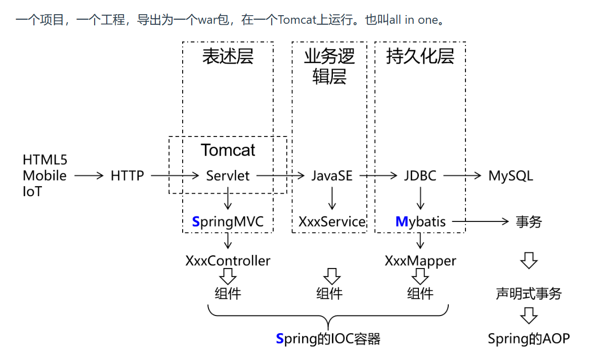

**分布式架构**

一个项目（对应 IDEA 中的一个 project），拆分成很多个模块，每个模块是一个 IDEA 中的一个 module。每一个工程都是运行在自己的 Tomcat 上。模块之间可以互相调用。每一个模块内部可以看成是一个单一架构的应用。分布式架构，项目主要应用技术框架：SpringBoot (SSM), SpringCloud, 中间件等。

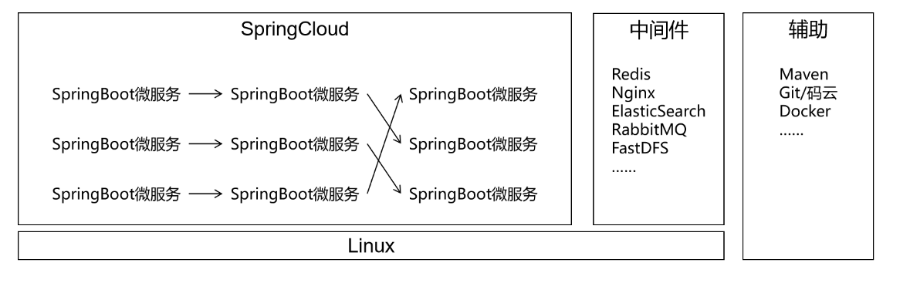

## 1.2 MyBatis历史

MyBatis最初是Apache的一个开源项目**iBatis**, 2010年6月这个项目由Apache Software Foundation迁移到了Google Code。随着开发团队转投Google Code旗下， iBatis3.x正式更名为MyBatis。代码于2013年11月迁移到Github。

iBatis一词来源于“internet”和“abatis”的组合，是一个基于Java的持久层框架。iBatis提供的持久层框架包括SQL Maps和Data Access Objects（DAO）。

Mybatis的最大特点：轻量级。相对于Hibernate省略了大量不常用的功能，整体轻巧又高效。

## 1.3 MyBatis特性

- MyBatis支持定制化SQL、存储过程以及高级映射
- MyBatis避免了几乎所有的JDBC代码和手动设置参数以及结果集解析操作
- MyBatis可以使用简单的XML或注解实现配置和原始映射；将接口和Java的POJO（Plain Ordinary Java Object，普通的Java对象）映射成数据库中的记录
- Mybatis是一个半自动的ORM（Object Relation Mapping）框架

## 1.4 和其它持久化层技术对比

- JDBC
    - SQL 夹杂在Java代码中耦合度高，导致硬编码内伤
    - 维护不易且实际开发需求中 SQL 有变化，频繁修改的情况多见
    - 代码冗长，开发效率低
- Hibernate 和 JPA
    - 操作简便，开发效率高
    - 程序中的长难复杂 SQL 需要绕过框架
    - 内部自动生成的 SQL，不容易做特殊优化
    - 基于全映射的全自动框架，大量字段的 POJO 进行部分映射时比较困难。
    - 反射操作太多，导致数据库性能下降
- MyBatis
    - 轻量级，性能出色
    - SQL 和 Java 编码分开，功能边界清晰。Java代码专注业务、SQL语句专注数据
    - 开发效率稍逊于 HIbernate，但是完全能够接收

**开发效率：Hibernate>Mybatis>JDBC**

**运行效率：JDBC>Mybatis>Hibernate**

## 1.5 MyBatis的底层原理

### 1.5.1 iBatis的底层原理

对于1.x和2.x版本，iBatis进行数据库操作的方式如下：

1. 无需创建Mapper接口，只需要有Mapper映射文件即可，在该xml文件中直接编写sql语句
2. Mapper映射文件的名称空间namespace没有任何要求，随意声明一个字符串即可
3. 如果要使用SQL语句，只需创建出SqlSession对象后，调用它的CRUD方法即可。

```xml
<mapper namespace="abc">
    <select id="666" resultType="com.thuwsy.pojo.Student">
        select * from student where sid = #{id}
    </select>
</mapper>
```

```java
// SqlSession提供的常见CRUD方法有：selectOne、selectList、insert、delete、update
// 这些CRUD方法，本质上就是去映射文件中查找对应的SQL语句，然后执行
// 以selectOne为例：
// 第一个参数是一个String，传入SQL语句对应的namespace.id
// 第二个参数是一个Object，传入SQL语句需要的参数
Student student = sqlSession.selectOne("abc.666", 1);
```

缺点：

- 传入namespace.id的字符串容易写错
- 传入SQL语句的参数只能有一个
- 查询得到的返回值类型必须自己指定

### 1.5.2 MyBatis的底层原理

3.x版本后改名为MyBatis，使用方式也有所改变，MyBatis操作数据库的方式实际上是对iBatis的封装和优化。

我们需要创建Mapper接口，而在执行 `sqlSession.getMapper(UserMapper.class)` 时，底层会帮我们创建一个UserMapper接口的代理对象(JDK动态代理)。而当我们调用Mapper接口的方法时，实际调用的是这个代理对象中的方法，在底层这个代理对象中会根据接口全类名和方法名(拼接成字符串`接口全类名.方法名`)，使用iBatis的方式查找并执行SQL语句(**因此在Mapper映射文件中namespace必须是接口的全类名，而SQL语句id必须是方法名**)。

# 2. 日志框架

## 2.1 用日志打印代替sout

### 2.1.1 sout的问题

**问题1：I/O影响性能**

System.out对象是一个输出流对象，所以控制台输出信息本质上是I/O操作。而I/O操作是项目运行过程中两大性能瓶颈之一。

**问题2：无法统一管理**

项目上线时，希望把所有（或一部分）sout打印关闭，但是只能手动一个一个查找，耗费开发人员的极大精力，因为sout的无度使用会使它分散在项目的各个角落。

### 2.1.2 使用日志框架的好处

**设定级别，统一管理**

日志框架会按照事件的严重程度来划分级别，例如：

- 错误（Error）：表示程序运行出错，比如抛异常等情况。
- 警告（Warning）：表示程序运行过程中有潜在风险，但此时并没有报错。
- 信息（Info）：表示程序运行过程中完成了一个关键动作，需要以程序运行信息的形式告知开发者。
- 调试（Debug）：表示程序运行过程中更加细致的信息，协助程序员调试程序。

通过在配置文件中指定某一个日志级别来控制系统要打印的内容。日志框架会打印**当前指定级别**的日志和比当前指定级别**更严重**的级别的日志。

例如在开发阶段，我们指定debug级别，项目上线修改成info级别，那么所有debug级别的日志就都不打印了，不需要到项目代码中一个一个修改，非常方便。

**灵活指定输出位置**

使用日志框架不一定是打印到控制台，也可以保存到文件中或者保存到数据库。这就看具体的项目维护需求。

**自定义日志格式**

打印日志数据可以使用日志框架的默认格式，也可以根据需要定制。

**基于日志分析问题**

将来我们开发的应用系统中，不仅包含Java代码，还有很多中间件服务器。任何子系统出现故障我们都是通过日志来定位问题、分析故障原因。甚至更复杂的系统还会专门开发日志子系统，在主系统出现问题时抓取日志数据供维护人员参考。

而日志数据必须要有确定格式才便于格式化和抓取，这肯定不是随意写sout就能实现的。

## 2.2 logback日志框架的使用

**1、导入依赖**

```xml
    <!-- 日志 -->
    <dependency>
        <groupId>ch.qos.logback</groupId>
        <artifactId>logback-classic</artifactId>
        <version>1.2.3</version>
    </dependency>
```

**2、引入配置文件**

Logback要求配置文件名称必须是logback.xml，存放路径在main/resources目录下。下面是配置文件示例：

```xml
<?xml version="1.0" encoding="UTF-8"?>
<configuration debug="true">
    <!-- 指定日志输出的位置，ConsoleAppender表示输出到控制台 -->
    <appender name="STDOUT"
              class="ch.qos.logback.core.ConsoleAppender">
        <encoder>
            <!-- 日志输出的格式 -->
            <!-- 按照顺序分别是：时间、日志级别、线程名称、打印日志的类、日志主体内容、换行 -->
            <pattern>[%d{HH:mm:ss.SSS}] [%-5level] [%thread] [%logger] [%msg]%n</pattern>
            <charset>UTF-8</charset>
        </encoder>
    </appender>

    <!-- 设置全局日志级别。日志级别按顺序分别是：TRACE、DEBUG、INFO、WARN、ERROR -->
    <!-- 指定任何一个日志级别都只打印当前级别和后面级别的日志。 -->
    <root level="INFO">
        <!-- 指定打印日志的appender，这里通过“STDOUT”引用了前面配置的appender -->
        <appender-ref ref="STDOUT" />
    </root>

    <!-- 根据特殊需求指定局部日志级别，可以是包名或全类名。 -->
    <logger name="com.thuwsy" level="DEBUG" additivity="false">
        <appender-ref ref="STDOUT" />
    </logger>

</configuration>
```

## 2.3 Lombok插件的使用

### 2.3.1 Lombok简介

使用Lombok注解就可以省略生成getXxx()、setXxx()方法、toString()方法、构造器等固定格式代码的繁琐操作，提高开发效率。包括Logger日志对象。

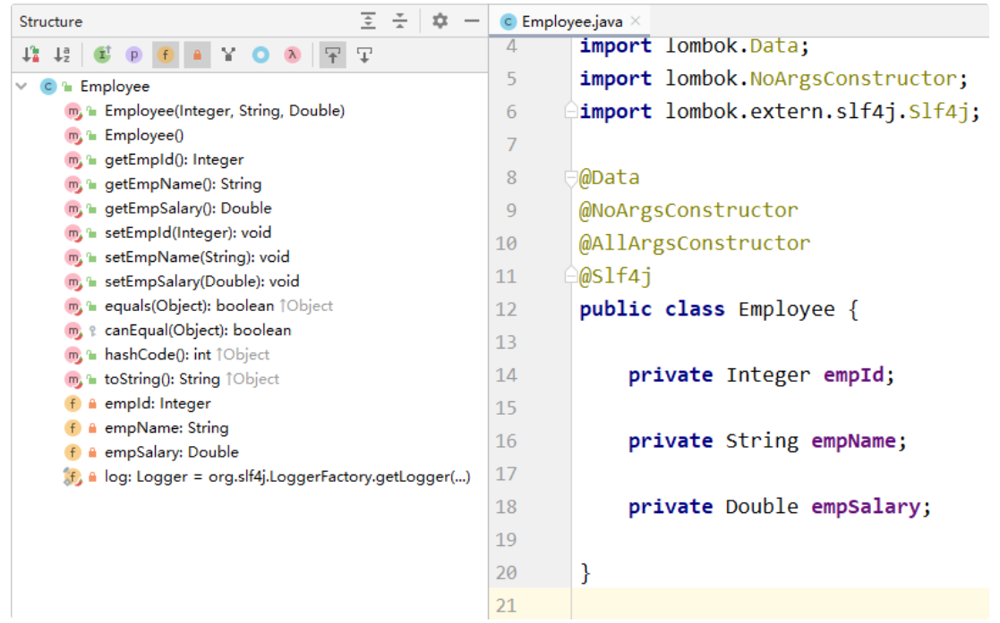

**Lombok原理**：Lombok是将自动生成的代码织入字节码文件中，从而实现：源代码没有，但是字节码文件有——毕竟我们最终运行的是字节码文件，只要字节码文件中有即可。而这个过程因为要参与源文件编译，所以需要安装IDEA插件。

### 2.3.2 使用Lombok注解

**1、加入依赖**

```xml
    <dependency>
        <groupId>org.projectlombok</groupId>
        <artifactId>lombok</artifactId>
        <version>1.18.24</version>
        <scope>provided</scope>
    </dependency>
```

**2、注解功能**

|注解|作用|
|---|---|
|`@Data`|生成getXxx()方法、setXxx()方法、toString()、equals()、canEqual()、hashCode()方法|
|`@AllArgsConstructor`|生成全参构造器|
|`@NoArgsConstructor`|生成无参构造器|
|`@Slf4j`|生成日志对象|
|`@Getter`|生成getXxx()方法|
|`@Setter`|生成setXxx()方法|
|`@ToString`|生成toString()方法|
|`@Accessors(chain = true)`|字段的`setXxx()`方法调用后会返回当前对象，即开启setter方法的链式调用|
|`@Builder`|开启建造者模式|

# 3. Mybatis基本用法

## 3.1 搭建框架开发环境

### 3.1.1 创建Maven工程

打包方式：jar。引入依赖：

```xml
    <!-- mybatis依赖 -->
    <!-- mybatis底层依赖jdbc驱动实现,本次不需要导入连接池,mybatis自带! -->
    <dependency>
        <groupId>org.mybatis</groupId>
        <artifactId>mybatis</artifactId>
        <version>3.5.7</version>
    </dependency>
    <!--junit5测试-->
    <dependency>
        <groupId>org.junit.jupiter</groupId>
        <artifactId>junit-jupiter-api</artifactId>
        <version>5.3.1</version>
        <scope>test</scope>
    </dependency>
    <!-- MySQL驱动 -->
    <dependency>
        <groupId>mysql</groupId>
        <artifactId>mysql-connector-java</artifactId>
        <version>8.0.28</version>
    </dependency>

    <dependency>
        <groupId>ch.qos.logback</groupId>
        <artifactId>logback-classic</artifactId>
        <version>1.2.3</version>
    </dependency>

    <dependency>
        <groupId>org.projectlombok</groupId>
        <artifactId>lombok</artifactId>
        <version>1.18.24</version>
        <scope>provided</scope>
    </dependency>
```

### 3.1.2 准备配置文件

#### 1、MyBatis核心配置文件

MyBatis核心配置文件，习惯上命名为 mybatis-config.xml。将来整合 Spring 之后，这个配置文件可以省略。该配置文件放在src/main/resources目录下。

```xml
<?xml version="1.0" encoding="UTF-8" ?>
<!DOCTYPE configuration
        PUBLIC "-//mybatis.org//DTD Config 3.0//EN"
        "http://mybatis.org/dtd/mybatis-3-config.dtd">
<configuration>
    <!--
        MyBatis核心配置文件中，标签的顺序：
        properties, settings, typeAliases, typeHandlers, 
        objectFactory, objectWrapperFactory, reflectorFactory, 
        plugins, environments, databaseIdProvider, mappers 
    -->
    
    <!--引入properties文件-->
    <properties resource="jdbc.properties"></properties>

    <!--设置类型别名-->
    <typeAliases>
        <package name="com.thuwsy.mybatis.pojo"/>
    </typeAliases>

    <!--设置多个连接数据库的环境-->
    <environments default="development">
        <environment id="development">
            <transactionManager type="JDBC"/>
            <dataSource type="POOLED">
                <property name="driver" value="${jdbc.driver}"/>
                <property name="url" value="${jdbc.url}"/>
                <property name="username" value="${jdbc.username}"/>
                <property name="password" value="${jdbc.password}"/>
            </dataSource>
        </environment>
    </environments>
    
    <!--引入映射文件-->
    <mappers>
        <package name="com.thuwsy.mybatis.mapper"/>
    </mappers>
</configuration>
```

**（1）typeAliases标签用于设置类型别名**

**方式1**：用子标签typeAlias一个一个来指定类型别名。

- type：需要设置别名的类的全类名
- alias：设置别名。如果不设置该属性，那么就使用默认的别名：即类名的首字母小写(事实上不区分大小写)

```xml
<typeAliases>
    <!-- alias属性指定了User的别名是uuu -->
    <typeAlias alias="uuu" type="com.thuwsy.mybatis.pojo.User" />
    <!-- 不写alias属性，默认别名为student，不区分大小写 -->
    <typeAlias type="com.thuwsy.mybatis.pojo.Student" />
</typeAliases>
```

**方式2**：用子标签package批量指定类的别名。

如下，对于包`com.thuwsy.mybatis.pojo`下的每一个类，都会自动设置别名，设置规则为：如果这个类上有注解`@Alias`，那么其别名就是该注解的value属性值，例如User类上有注解`@Alias("uuu")`，那么它的别名就是`uuu`；如果这个类上没有该注解，那么它的别名就是默认的，即类名的首字母小写(事实上不区分大小写)

```xml
<typeAliases>
    <package name="com.thuwsy.mybatis.pojo"/>
</typeAliases>
```

**（2）environments标签用于设置多个连接数据库的环境**

注意，虽然可以设置多个环境，但只能生效一个，所以使用default属性来指定生效的环境的id。

每个environment子标签内可以设置以下子标签：

- `<transactionManager type="JDBC"/>`：设置事务管理方式。`type="JDBC"`表示自动开启事务，事务的提交或回滚需要手动处理；`type="MANAGED"`表示不会自动开启事务。
- `<dataSource type="POOLED">`：配置数据源，type属性用于设置数据源的类型：
  - `type="POOLED"`：使用数据库连接池
  - `type="UNPOOLED"`：不使用数据库连接池
  - `type="JNDI"`：使用上下文中的数据源

**（3）mappers标签引入映射文件**

**方式1**：用子标签mapper一个一个引入映射文件。

```xml
<mappers>
    <!-- 引入 main/resources/mappers/UserMapper.xml -->
    <mapper resource="mappers/UserMapper.xml"/>
</mappers>
```

**方式2**：用子标签package批量引入映射文件。

注意：这种方式必须保证**mapper接口所在的包要和映射文件所在的包最终的路径相同**，并且**mapper接口名要和映射文件名相同**。

```xml
<mappers>
    <package name="com.thuwsy.mybatis.mapper"/>
</mappers>
```

如上，必须把Mapper接口(如`UserMapper`)创建到`main/java/com/thuwsy/mybatis/mapper/`目录下，必须把对应的映射配置文件(如`UserMapper.xml`)创建到`main/resources/com/thuwsy/mybatis/mapper/`目录下。

补充：MyBatis中的mapper接口相当于以前的dao。但是区别在于，mapper仅仅是接口，我们不需要提供实现类。


#### 2、MyBatis映射配置文件

```xml
<?xml version="1.0" encoding="UTF-8" ?>
<!DOCTYPE mapper
        PUBLIC "-//mybatis.org//DTD Mapper 3.0//EN"
        "http://mybatis.org/dtd/mybatis-3-mapper.dtd">
<mapper namespace="com.thuwsy.mybatis.mapper.UserMapper">
    <!-- 对应的方法：int updateUser(); -->
    <update id="updateUser">
        update t_user set username = 'root', password = '123' where id = 3
    </update>
</mapper>
```

- mapper根标签中的namespace属性，根据**接口的全类名**来找到对应的接口
- SQL语句的**id**，要和接口中对应的**方法名**一致

#### 3、其他配置文件

`logback.xml`：存放在main/resources/目录下

`jdbc.properties`：存放在main/resources/目录下

```properties
jdbc.driver=com.mysql.cj.jdbc.Driver
jdbc.url=jdbc:mysql://localhost:3306/ssm
jdbc.username=root
jdbc.password=abc666
```

### 3.1.3 通过junit测试功能

```java
@Test
public void testSelectEmployee() throws IOException {

    // 获取核心配置文件的输入流
    InputStream is = Resources.getResourceAsStream("mybatis-config.xml");
    // 获取 SqlSessionFactoryBuilder 对象
    SqlSessionFactoryBuilder sqlSessionFactoryBuilder = new SqlSessionFactoryBuilder();
    // 获取 SqlSessionFactory 对象
    SqlSessionFactory sqlSessionFactory = sqlSessionFactoryBuilder.build(is);
    // 获取sql的会话对象SqlSession，是MyBatis提供的操作数据库的对象。true表示开启自动提交事务。
    SqlSession sqlSession = sqlSessionFactory.openSession(true);
    // 获取UserMapper的代理实现类对象
    UserMapper mapper = sqlSession.getMapper(UserMapper.class);
    // 调用UserMapper接口中的方法
    mapper.updateUser();
    // 关闭SqlSession
    sqlSession.close();
}
```

说明：

- SqlSession：代表Java程序和数据库之间的会话，不依赖Web服务器，属于持久化层。（HttpSession是Java程序和浏览器之间的会话，工作在Web服务器上，属于表述层）
- SqlSessionFactory：是生产SqlSession的工厂。
- 工厂模式：如果创建某一个对象，使用的过程基本固定，那么我们就可以把创建这个对象的相关代码封装到一个工厂类中，以后都使用这个工厂类来生产我们需要的对象。

**拓展：通过JUnit5提供的注解简化测试**

```java
public class MyBatisTest {

    private SqlSession sqlSession;

    //junit5会在每一个@Test方法前执行@BeforeEach方法
    @BeforeEach
    public void init() throws IOException {
        // 获取核心配置文件的输入流
        InputStream is = Resources.getResourceAsStream("mybatis-config.xml");
        // 获取 SqlSessionFactory 对象
        SqlSessionFactory sqlSessionFactory = new SqlSessionFactoryBuilder().build(is);
        // 获取sql的会话对象SqlSession
        sqlSession = sqlSessionFactory.openSession(true);
    }
    // junit5会在每一个@Test方法后执行@AfterEach方法
    @AfterEach
    public void clear() {
        sqlSession.close();
    }
    
    @Test
    public void test01() {
        // 获取UserMapper的代理实现类对象
        UserMapper mapper = sqlSession.getMapper(UserMapper.class);
        // 调用UserMapper接口中的方法
        List<User> allUser = mapper.getAllUser();
        allUser.forEach(System.out::println);
    }
}
```


## 3.2 给sql语句传参

给sql语句传参有两种方式：`${}`和`#{}`

- `${}`的本质是字符串拼接。所以如果为字符串类型或日期类型的字段进行赋值时，需要手动加单引号。
- `#{}`的本质是占位符赋值，即会被解析成`?`然后进行占位符赋值。

说明：通常不会采用`${}`的方式传值，除非某些特定场景，例如通过Java程序动态生成数据库表，表名部分需要Java程序通过参数传入；而JDBC对于表名部分是不能使用问号占位符的，此时只能使用`${}`

### 3.2.1 单个简单类型的参数

若mapper接口中的方法参数为单个简单类型，则可以使用`${}`和`#{}`以任意的名称获取参数的值。但建议使用`@Param`注解。

### 3.2.2 多个简单类型的参数

若mapper接口中的方法参数为多个时，MyBatis会自动将这些参数放在一个map集合中，以arg0, arg1...为键，以参数为值，同时也以param1, param2...为键，以参数为值；因此只需要通过`${}`和`#{}`访问map集合的键就可以获取相对应的值。但建议使用`@Param`注解。

```xml
<!--    User checkLogin(String username, String password);-->
<select id="checkLogin" resultType="User">
    select * from t_user where username = #{param1} and password = #{param2}
</select>
```

### 3.2.3 Map集合类型的参数

若mapper接口中的方法参数为一个map时，只需要通过`${}`和`#{}`访问Map集合的键就可以获取相对应的值。

使用场景：有很多零散的参数需要传递，但是没有对应的实体类类型可以使用，而使用@Param注解一个一个传入又太麻烦了，所以可以封装到Map中。

```xml
<!--    int deleteByNameAndId(Map<String, Object> map);-->
<delete id="deleteByNameAndId">
    delete from t_user where id = #{id} and username = #{name}
</delete>
```

测试方法如下：
```java
@Test
public void test2() {
    SqlSession sqlSession = SqlSessionUtil.getSqlSession();
    UserMapper mapper = sqlSession.getMapper(UserMapper.class);
    Map<String, Object> map = new HashMap<>();
    map.put("id", 7);
    map.put("name", "root");
    mapper.deleteByNameAndId(map);
    sqlSession.close();
}
```

### 3.2.4 实体类类型的参数

若mapper接口中的方法参数为一个实体类对象时，可以使用`${}`和`#{}`，通过访问实体类对象中的属性名获取属性值。注意该属性名要与该实体类中的getXxx()方法对应，因为其底层原理是会根据传入的参数`#{age}`，加工成`getAge()`方法，通过反射在实体类对象中调用这个方法，从而获取到对应的数据，然后填充到`#{}`解析后的问号占位符的位置。


```xml
<!--    int insertUser(User user);-->
<insert id="insertUser">
    insert into t_user values (null, #{username}, #{password}, #{age}, #{gender}, #{email})
</insert>
```

### 3.2.5 使用@Param标识参数

可以通过@Param注解标识mapper接口中的方法参数。此时，会将这些参数放在Map集合中，以@Param注解的value属性值为键，以参数为值，同时也以param1, param2...为键，以参数为值。只需要通过`${}`和`#{}`访问Map集合的键就可以获取相对应的值。

```java
int updateNameById(@Param("name") String name, @Param("id") Integer id);
```

```xml
<update id="updateNameById">
    update t_user set username = #{name} where id = #{id}
</update>
```

## 3.3 查询语句

注意：对于增删改操作，返回的结果是受影响的行数，用int或long接收即可。下面我们着重讨论查询语句的查询结果。

### 3.3.1 查询一个实体类对象

```xml
<!--    User getUserById(@Param("id") Integer id);-->
<select id="getUserById" resultType="User">
    select * from t_user where id = #{id}
</select>
```

注1：当查询的数据为多条时，不能使用实体类作为返回值，否则会抛出异常TooManyResultsException。

注2：查询的标签select必须设置属性resultType或resultMap，用于设置实体类和数据库表的映射关系。
- resultType：自动映射，用于属性名和表中字段名一致的情况
- resultMap：自定义映射，用于一对多或多对一或字段名和属性名不一致的情况

### 3.3.2 查询一个List集合

```xml
<!--    List<User> getAllUser();-->
<select id="getAllUser" resultType="User">
    select * from t_user
</select>
```

如果查询结果是一个List集合类型，resultType中只需写泛型的类型即可(全类名或者别名)。

### 3.3.3 查询单个数据

```xml
<!--    Integer getCount();-->
<select id="getCount" resultType="Integer">
    select count(*) from t_user
</select>
```

注意：在MyBatis中，对于Java中常用的类型都设置了类型别名。例如，若返回值为Integer，则resultType中可以写Integer、int(不区分大小写)；若返回值为int，则resultType中可以写_Integer、_int(不区分大小写)。当然写全类名如`java.lang.Integer`肯定也是没问题的。

### 3.3.4 查询一条数据为map集合

```xml
<!--    Map<String, Object> getUserByIdToMap(@Param("id") Integer id);-->
<select id="getUserByIdToMap" resultType="Map">
    select * from t_user where id = #{id}
</select>
```

### 3.3.5 查询多条数据为map集合

**方式1(推荐)**：将表中的数据以map集合的方式查询，一条数据对应一个map；若有多条数据，就会产生多个map集合，此时可以将这些map放在一个list集合中获取。

```xml
<!--    List<Map<String, Object>> getAllUserToMap();-->
<select id="getAllUserToMap" resultType="Map">
    select * from t_user
</select>
```

**方式2**：将表中的数据以map集合的方式查询，一条数据对应一个map；若有多条数据，就会产生多个map集合，并且最终要以一个map的方式返回数据，此时需要通过@MapKey注解设置map集合的键，值是每条数据所对应的map集合

```java
@MapKey("id")
Map<String, Object> getAllUserToMap2();
```

```xml
<select id="getAllUserToMap2" resultType="Map">
    select * from t_user
</select>
```

## 3.4 特殊SQL

### 3.4.1 模糊查询

**方式1(推荐)：**

```xml
<!--    List<User> getUserByLike(@Param("mohu") String mohu);-->
<select id="getUserByLike" resultType="User">
    select * from t_user where username like "%"#{mohu}"%"
</select>
```

**方式2：**

```xml
<select id="getUserByLike" resultType="User">
    select * from t_user where username like '%${mohu}%'
</select>
```

注意：不能使用`'%#{mohu}%'`，因为`#{}`本质上会被解析成`?`，而在引号内的`?`默认会被认为是字符串的一部分，而并不是占位符。

### 3.4.2 批量删除

```xml
<!--    void deleteMoreUser(@Param("ids") String ids);-->
<delete id="deleteMoreUser">
    delete from t_user where id in(${ids})
</delete>
```

注意：不能使用`in(#{ids})`，因为`#{ids}`本质是占位符赋值，例如`String ids = "1,2"`，则`in(#{ids})`会被解析为`in('1,2')`，这显然不对。而`in(${ids})`则会被正确的解析为`in(1,2)`。

### 3.4.3 动态设置表名

```xml
<!--    List<User> getUserList(@Param("tableName") String tableName);-->
<select id="getUserList" resultType="User">
    select * from ${tableName}
</select>
```

注意：显然表名不能用引号包裹，所以自然也无法使用`#{}`的方式。

### 3.4.4 主键回显

#### 1、获取自增长的主键

```xml
<!-- void insertUser(User user);-->
<insert id="insertUser" useGeneratedKeys="true" keyProperty="id">
    insert into t_user values (null, #{username}, #{password}, #{age}, #{gender}, #{email})
</insert>
```

- 设置`useGeneratedKeys="true"`表示使用主键回显功能
- keyProperty表明要将主键的值放在实体类对象的哪个属性中。必须设置该属性是因为，增删改操作统一的返回值是受影响的行数，因此**只能将获取的自增主键值放在传输的参数User对象的某个属性中**。

#### 2、获取非自增长的主键

对于不支持自增型主键的数据库（例如Oracle）或者字符串类型主键，则可以使用 selectKey 子元素：让selectKey标签中的语句先执行并设置id，然后再执行插入语句。

使用 selectKey 帮助插入UUID作为字符串类型主键示例：

```xml
<insert id="insertUser" parameterType="User">
    <selectKey keyProperty="id" resultType="java.lang.String" order="BEFORE">
        SELECT UUID() as id
    </selectKey>
    INSERT INTO user (id, username, password) 
    VALUES (
        #{id},
        #{username},
        #{password}
    )
</insert>
```

如上，我们使用`selectKey`来查询UUID并设置到`id`字段中。通过`keyProperty`属性来指定查询到的 UUID 赋值给对象中的`id`属性，而`resultType`属性指定了UUID的类型为 `java.lang.String`。

需要注意的是，`order="BEFORE"`表示先执行selectKey标签中的语句，然后再执行接下来的插入语句。在插入语句中，我们将 `User` 对象插入到 `user` 表中时，直接使用对象中的 `id` 属性来插入主键值。

使用这种方式，我们可以方便地插入 UUID 作为字符串类型主键。当然，还有其他插入方式可以使用，如使用Java代码生成UUID并在类中显式设置值等。需要根据具体应用场景和需求选择合适的插入方式。

# 4. 使用Mybatis映射关联关系

## 4.1 处理字段和属性的映射关系

若数据库表中的字段名和实体类中的属性名不一致，我们有以下三种处理方法。

### 4.1.1 方式1：设置别名

方式1：为查询的字段来设置别名，和属性名保持一致

```xml
<!-- Emp getEmpByEmpId(@Param("empId") Integer empId);-->
<select id="getEmpByEmpId" resultType="Emp">
    select emp_id empId, emp_name empName, age, gender from t_emp where emp_id = #{empId}
</select>
```

### 4.1.2 方式2：全局配置映射关系

方式2：当字段符合MySQL的规范(即使用_)，而属性符合Java的规范(即使用小驼峰)，此时可以在MyBatis的核心配置文件中设置一个全局配置，可以自动将下划线映射为驼峰。

```xml
<settings>
    <!-- 将下划线映射为驼峰 -->
    <setting name="mapUnderscoreToCamelCase" value="true"/>
</settings>
```

只要满足该命名规范并进行了上述全局配置，则正常编写sql语句即可：

```xml
<select id="getEmpByEmpId" resultType="Emp">
    select * from t_emp where emp_id = #{empId}
</select>
```

### 4.1.3 方式3：使用resultMap自定义映射

方式3：使用resultMap自定义映射

我们首先使用resultMap自定义映射，属性`id`唯一标识了该resultMap，属性`type`则表示需要定义映射的实体类。常用子标签如下：

- id：设置主键的映射关系
- result：设置普通字段的映射关系
- association：设置多对一的映射关系
- collection：设置一对多的映射关系

这些子标签中的属性`column`表示映射关系中数据库表中的字段名，而`property`表示映射关系中实体类中的属性名。

```xml
<resultMap id="empResultMap" type="Emp">
    <!-- id来处理主键的映射关系       -->
    <id column="emp_id" property="empId"></id>
    <!-- result来处理普通字段的映射关系       -->
    <result column="emp_name" property="empName"></result>
    <result column="age" property="age"></result>
    <result column="gender" property="gender"></result>
</resultMap>
```

然后，我们在编写sql语句中，只需要在属性`resultMap`中指定自定义映射的唯一标识id即可：

```xml
<select id="getEmpByEmpId" resultMap="empResultMap">
    select * from t_emp where emp_id = #{empId}
</select>
```

## 4.2 处理多对一映射

**对一关系，指的是查询出来的多个字段只对应于实体类对象的一个属性**。例如一个Emp类中有一个属性`private Dept dept;`用于表示所在部门的信息，那么我们查询出来的关于部门的信息(如部门id，部门名称等多个字段)就需要封装到一个部门对象中，然后对应到Emp类的dept属性。

处理多对一映射的方式有以下3种：

### 4.2.1 方式1：级联

方式1：级联。利用resultMap自定义映射结合多表查询的sql语句，注意其中关于部门的属性名，直接用`dept.deptId`的方式，这就是级联。

```xml
<!--    Emp getEmpAndDeptByEmpId(@Param("empId") Integer empId);-->
<resultMap id="empAndDeptResultMap" type="Emp">
    <id column="emp_id" property="empId"></id>
    <result column="emp_name" property="empName"></result>
    <result column="age" property="age"></result>
    <result column="gender" property="gender"></result>
    <result column="dept_id" property="dept.deptId"></result>
    <result column="dept_name" property="dept.deptName"></result>
</resultMap>

<select id="getEmpAndDeptByEmpId" resultMap="empAndDeptResultMap">
    select t_emp.*, t_dept.*
    from t_emp left join t_dept
    on t_emp.dept_id = t_dept.dept_id
    where t_emp.emp_id = #{empId}
</select>
```

### 4.2.2 方式2：association

方式2：association处理多对一的映射关系，注意association用于处理实体类类型的属性。

```xml
<resultMap id="empAndDeptResultMap" type="Emp">
    <id column="emp_id" property="empId"></id>
    <result column="emp_name" property="empName"></result>
    <result column="age" property="age"></result>
    <result column="gender" property="gender"></result>
    <association property="dept" javaType="Dept">
        <id column="dept_id" property="deptId"></id>
        <result column="dept_name" property="deptName"></result>
    </association>
</resultMap>

<select id="getEmpAndDeptByEmpId" resultMap="empAndDeptResultMap">
    select t_emp.*, t_dept.*
    from t_emp left join t_dept
    on t_emp.dept_id = t_dept.dept_id
    where t_emp.emp_id = #{empId}
</select>
```

说明：association标签的属性property指明了要处理的Emp类中的属性名是dept，javaType指明了该属性名的实体类类型是Dept。然后在子标签中，指明查询字段和Dept类中的属性之间的对应关系。

### 4.2.3 方式3：分步查询

方式3：分步查询。我们不再通过多表查询从一条sql语句中获取所有信息，而是分成多步来查询，具体而言：第一步是在员工表中查询员工信息，第二步是根据所查到的dept_id再到部门表中查询该部门的信息。

我们在`DeptMapper.xml`中配置第二步查询所需的方法(注意我们设置了全局的下划线转小驼峰命名的映射关系，所以直接查询即可)：

```xml
<!--    Dept getEmpAndDeptByStepTwo(@Param("deptId") Integer deptId);-->
<select id="getEmpAndDeptByStepTwo" resultType="Dept">
    select * from t_dept where dept_id = #{deptId}
</select>
```

而在第一步的员工表查询中，我们需要自定义映射，在`EmpMapper.xml`中配置如下：

```xml
<!--    Emp getEmpAndDeptByStepOne(@Param("empId") Integer empId);-->
<resultMap id="empAndDeptByStepResultMap" type="Emp">
    <id column="emp_id" property="empId"></id>
    <result column="emp_name" property="empName"></result>
    <result column="age" property="age"></result>
    <result column="gender" property="gender"></result>
    <!-- 在开启了延迟加载的环境中，通过fetchType可以强制设置当前的分步查询是否使用延迟加载
    eager表示立即加载，lazy表示延迟加载 -->
    <association property="dept" fetchType="eager"
                    select="com.thuwsy.mybatis.mapper.DeptMapper.getEmpAndDeptByStepTwo"
                    column="dept_id">
    </association>
</resultMap>

<select id="getEmpAndDeptByStepOne" resultMap="empAndDeptByStepResultMap">
    select * from t_emp where emp_id = #{empId}
</select>
```

说明：association标签的属性说明

- property指明了要处理的Emp类中的属性名是dept
- select设置分步查询，指明要引用的下一个sql语句，所以需要指明该sql语句的唯一标识(namespace.sqlId)。注意这条sql语句对应方法的返回值类型，必须与dept属性的类型相同。
- column为"dept_id"指明将当前查询结果中的字段dept_id的值，传递给下一个sql语句作为参数
- fetchType：在开启了延迟加载的环境中，通过fetchType可以强制设置当前的分步查询是否使用延迟加载。eager表示立即加载，lazy表示延迟加载。


**延迟加载**：对于实体类关联的属性到需要使用时才查询，也叫懒加载。分步查询的优势就是可以实现延迟加载，但必须在Mybatis核心配置文件中添加以下配置来开启延迟加载：

```xml
<settings>
    <!-- 将下划线映射为驼峰       -->
    <setting name="mapUnderscoreToCamelCase" value="true"/>
    <!-- 开启延迟加载 -->
    <setting name="lazyLoadingEnabled" value="true"/>
    <!-- 按需加载 -->
    <setting name="aggressiveLazyLoading" value="false"/>
</settings>
```


## 4.3 处理一对多映射

**对多关系，指的是实体类对象的一个属性，对应多条查询记录**。例如一个Dept类中有一个属性`private List<Emp> emps;`用于表示该部门所有员工的信息，那么我们查询出来的多条记录中，关于员工信息的字段就需要封装到该属性中。

处理多对一映射的方式有以下2种：

### 4.3.1 方式1：collection

方式1：collection处理一对多的映射关系，注意collection用于处理集合类型的属性。

```xml
<!--    Dept getDeptAndEmpByDeptId(@Param("deptId") Integer deptId);-->
<resultMap id="deptAndEmpResultMap" type="Dept">
    <id column="dept_id" property="deptId"></id>
    <result column="dept_name" property="deptName"></result>
    <!-- ofType用于设置集合类型的属性中存储的数据的类型 -->
    <collection property="emps" ofType="Emp">
        <id column="emp_id" property="empId"></id>
        <result column="emp_name" property="empName"></result>
        <result column="age" property="age"></result>
        <result column="gender" property="gender"></result>
    </collection>
</resultMap>

<select id="getDeptAndEmpByDeptId" resultMap="deptAndEmpResultMap">
    select t_dept.*, t_emp.*
    from t_dept left join t_emp
    on t_dept.dept_id = t_emp.dept_id
    where t_dept.dept_id = #{deptId}
</select>
```

说明：collection标签的属性property指明了要处理的Dept类中的属性名是emps，ofType指明了该属性是一个集合，其中的每个对象的类型是Emp。然后在子标签中，指明查询字段和Emp类中的属性之间的对应关系。

### 4.3.2 方式2：分步查询

方式2：分步查询。我们不再通过多表查询从一条sql语句中获取所有信息，而是分成多步来查询，具体而言：第一步是在部门表中查询部门信息，第二步是根据部门id，到员工表中查询相关员工信息。

我们在`EmpMapper.xml`中配置第二步查询所需的方法(注意我们设置了全局的下划线转小驼峰命名的映射关系，所以直接查询即可)：

```xml
<!--    List<Emp> getDeptAndEmpByStepTwo(@Param("deptId") Integer deptId);-->
<select id="getDeptAndEmpByStepTwo" resultType="Emp">
    select * from t_emp where dept_id = #{deptId}
</select>
```

而在第一步的部门表查询中，我们需要自定义映射，在`DeptMapper.xml`中配置如下：

```xml
<!--    Dept getDeptAndEmpByStepOne(@Param("deptId") Integer deptId);-->
<resultMap id="deptAndEmpResultMapByStep" type="Dept">
    <id column="dept_id" property="deptId"></id>
    <result column="dept_name" property="deptName"></result>
    <collection property="emps"
                select="com.thuwsy.mybatis.mapper.EmpMapper.getDeptAndEmpByStepTwo"
                column="dept_id">
    </collection>
</resultMap>

<select id="getDeptAndEmpByStepOne" resultMap="deptAndEmpResultMapByStep">
    select * from t_dept where dept_id = #{deptId}
</select>
```

说明：collection标签的属性说明

- property指明了要处理的Dept类中的属性名是emps
- select设置分步查询，指明要引用的下一个sql语句，所以需要指明该sql语句的唯一标识(namespace.sqlId)。注意这条sql语句对应方法的返回值类型，必须与emps属性的类型相同。
- column为"dept_id"指明将当前查询结果中的字段dept_id的值，传递给下一个sql语句作为参数

## 4.4 拓展：resultMap简化

在MyBatis核心配置文件中，添加如下配置，这样在进行多表resultMap映射时，可以省略符合列和属性命名映射规则（即列名等于属性名，或者开启驼峰映射后的规则）的result子标签。即在resultMap中只需写id子标签和association、collection子标签。

```xml
<!--开启resultMap自动映射 -->
<setting name="autoMappingBehavior" value="FULL"/>
```

此时，4.2.2节中的resultMap，可以简写为如下形式：

```xml
<resultMap id="empAndDeptResultMap" type="Emp">
    <id column="emp_id" property="empId"></id>
    <!-- <result column="emp_name" property="empName"></result>
    <result column="age" property="age"></result>
    <result column="gender" property="gender"></result> -->
    <association property="dept" javaType="Dept">
        <id column="dept_id" property="deptId"></id>
        <!-- <result column="dept_name" property="deptName"></result> -->
    </association>
</resultMap>
```

# 5. 动态SQL

Mybatis框架的动态SQL技术是一种根据特定条件动态拼装SQL语句的功能，它存在的意义是为了解决拼接SQL语句字符串时的痛点问题。

## 5.1 if标签

if标签可通过test属性的表达式进行判断，若表达式的结果为true，则标签中的内容会拼接到sql中。**注意在if标签的test属性中可以访问实体类的属性，但不可以访问数据库表的字段**。如果仅使用if标签，为了拼接不产生问题，需要在where后添加`1=1`之类的恒成立条件。

```xml
<!--    List<Emp> getEmpByCondition(Emp emp);-->
<select id="getEmpByCondition" resultType="Emp">
    select * from t_emp where 1 = 1
    <if test="empName != null and empName != ''">
        and emp_name = #{empName}
    </if>
    <if test="age != null and age != ''">
        and age = #{age}
    </if>
    <if test="gender != null and gender != ''">
        and gender = #{gender}
    </if>
</select>
```

## 5.2 where标签

where标签一般结合if标签一起使用：

- 若where标签中有条件成立，会自动生成where关键字
- 若where标签中没有任何一个条件成立，则where没有任何功能，即不会生成where关键字
- 会自动将where标签中拼接完后的内容前多余的and/or去掉，但是内容后多余的and/or无法去掉

```xml
<select id="getEmpByCondition" resultType="Emp">
    select * from t_emp
    <where>
        <if test="empName != null and empName != ''">
            and emp_name = #{empName}
        </if>
        <if test="age != null and age != ''">
            and age = #{age}
        </if>
        <if test="gender != null and gender != ''">
            and gender = #{gender}
        </if>
    </where>
</select>
```

## 5.3 trim标签

对于在trim标签中拼接完后的内容，可以设置属性来在前面或后面添加或删除一些内容：

- prefix、suffix：在内容前面或后面添加指定内容(如果标签中的if条件都不满足，则不会添加前后缀)
- prefixOverrides、suffixOverrides：在内容前面或后面去掉指定内容，可以使用`|`来分隔有可能的多个值

```xml
<select id="getEmpByCondition" resultType="Emp">
    select * from t_emp
    <trim prefix="where" suffixOverrides="and">
        <if test="empName != null and empName != ''">
            emp_name = #{empName} and
        </if>
        <if test="age != null and age != ''">
            age = #{age} and
        </if>
        <if test="gender != null and gender != ''">
            gender = #{gender} and
        </if>
    </trim>
</select>
```

## 5.4 choose、when、otherwise标签

在多个分支条件中，仅执行一个。

- 从上到下依次执行条件判断
- 遇到的第一个满足条件的分支会被采纳
- 被采纳分支后面的分支都将不被考虑
- 如果所有的when分支都不满足，那么就执行otherwise分支

when就相当于if/else if，而otherwise就相当于else。所以when至少设置一个，otherwise最多设置一个。

```xml
<!--    List<Emp> getEmpByChoose(Emp emp);-->
<select id="getEmpByChoose" resultType="Emp">
    select * from t_emp
    <where>
        <choose>
            <when test="empName != null and empName != ''">
                emp_name = #{empName}
            </when>
            <when test="age != null and age != ''">
                age = #{age}
            </when>
            <when test="gender != null and gender != ''">
                gender = #{gender}
            </when>
        </choose>
    </where>
</select>
```

## 5.5 foreach标签

foreach标签的属性：
- collection：设置要循环的数组或集合
- item：用一个字符串表示数组或集合中的每一个数据
- separator：设置每次循环的数据之间的分隔符(分隔符的前后会默认添加一个空格，所以可以放心设置`"or"`这样的分隔符，无需自己手动添加空格)
- open：给全部循环完成后的内容添加前缀
- close：给全部循环完成后的内容添加后缀
- index：可以起一个名字，便于后面引用。遍历List集合，这里能够得到List集合的索引值，遍历Map集合，这里能够得到Map集合的key。如`index="myIndex"`，则可以在foreach标签体中使用`#{myIndex}`的方式引用。


### 5.5.1 批量插入

```xml
<!--    void insertMoreEmp(@Param("emps") List<Emp> emps);-->
<insert id="insertMoreEmp">
    insert into t_emp values
    <foreach collection="emps" item="emp" separator=",">
        <!-- 在foreach标签内部如果需要引用遍历得到的具体的一个对象，需要使用item属性声明的名称 -->
        (null, #{emp.empName}, #{emp.age}, #{emp.gender}, null)
    </foreach>
</insert>
```

### 5.5.2 批量更新

上面批量插入的例子本质上是一条SQL语句，而实现批量更新则需要多条SQL语句拼起来，用分号分开。也就是一次性发送多条SQL语句让数据库执行。此时需要在数据库连接信息的URL地址中设置参数`?allowMultiQueries=true`。对应的foreach标签如下：

```xml
<!-- int updateEmployeeBatch(@Param("empList") List<Emp> empList) -->
<update id="updateEmployeeBatch">
    <foreach collection="empList" item="emp" separator=";">
        update t_emp set emp_name=#{emp.empName} where emp_id = #{emp.empId}
    </foreach>
</update>
```

### 5.5.3 批量删除

方式1：

```xml
<!--    void deleteMoreEmp(@Param("empIds") Integer[] empIds);-->
<delete id="deleteMoreEmp">
    delete from t_emp where emp_id in
    <foreach collection="empIds" item="empId" separator="," open="(" close=")">
        #{empId}
    </foreach>
</delete>
```

方式2：

```xml
<delete id="deleteMoreEmp">
    delete from t_emp where
    <foreach collection="empIds" item="empId" separator="or">
        emp_id = #{empId}
    </foreach>
</delete>
```

## 5.6 sql标签

sql标签，可以记录一段公共sql片段，在使用的地方通过include标签进行引入。

```xml
<!--    List<Emp> getAllEmp();-->
<sql id="empColumns">
    emp_id, emp_name, age, gender, dept_id
</sql>
<select id="getAllEmp" resultType="Emp">
    select <include refid="empColumns"></include>
    from t_emp
</select>
```

## 5.7 set标签

案例：实际开发时，对一个实体类对象进行更新。往往不是更新所有字段，而是更新一部分字段。此时页面上的表单往往不会给不修改的字段提供表单项。如果我们直接拿整个Emp对象去更新数据库，那么某些在表单项上没有的字段则会被更新为null，这显然是不符合需求的。此时需要我们在Mapper配置文件中，对update语句的set子句进行定制，此时就可以使用动态SQL的set标签。

```xml
<!-- void updateEmployeeDynamic(Emp emp) -->
<update id="updateEmployeeDynamic">
    update t_emp
    <!-- set emp_name=#{empName},emp_salary=#{empSalary} -->
    <!-- 使用set标签动态管理set子句，并且动态去掉两端多余的逗号 -->
    <set>
        <if test="empName != null and empName != ''">
            emp_name = #{empName},
        </if>
        <if test="empSalary &lt; 3000">
            emp_salary = #{empSalary},
        </if>
    </set>
    where emp_id = #{empId}
</update>
```

# 6. Mybatis的缓存

## 6.1 一级缓存

**一级缓存是SqlSession级别的**，通过同一个SqlSession查询的数据会被缓存，下次查询相同的数据，就会从缓存中直接获取，不会从数据库重新访问。Mybatis的一级缓存时默认开启的。

**使一级缓存失效的五种情况**：

1. 不同的SqlSession对应不同的一级缓存
2. 同一个SqlSession但是查询条件不同
3. 同一个SqlSession两次查询期间执行了任何一次增删改操作(增删改操作会自动清空一级、二级缓存)
4. 同一个SqlSession两次查询期间手动清空了缓存(`sqlSession.clearCache();`)
5. 同一个SqlSession两次查询期间提交了事务

## 6.2 二级缓存

**二级缓存是SqlSessionFactory级别**，通过同一个SqlSessionFactory创建的SqlSession查询的结果会被缓存；此后若再次执行相同的查询语句，结果就会从缓存中获取。

**二级缓存开启的条件**：

1. 在核心配置文件中，设置全局配置属性`cacheEnabled="true"`，由于其默认为true，所以我们不需要设置
2. 在映射文件中设置标签`<cache></cache>`
3. 二级缓存必须在SqlSession关闭之后有效(因为SqlSession关闭之后，一级缓存中的数据才会写入二级缓存)
4. 查询的数据所转换的实体类类型必须实现序列化的接口

**使二级缓存失效的情况**：

- 两次查询之间执行了任意的增删改，会使一级和二级缓存同时失效

**二级缓存的相关配置**

在mapper配置文件中添加的cache标签可以设置一些属性：

- eviction属性：缓存回收策略，默认的是 LRU
  - LRU：移除最长时间不被使用的对象
  - FIFO：按对象进入缓存的顺序来移除它们
  - SOFT：软引用，移除基于垃圾回收器状态和软引用规则的对象
  - WEAK：弱引用，更积极地移除基于垃圾收集器状态和弱引用规则的对象
- flushInterval属性：刷新间隔，单位毫秒。默认情况是不设置，也就是没有刷新间隔，缓存仅仅调用语句时刷新。
- size属性：引用数目，正整数，代表缓存最多可以存储多少个对象，太大容易导致内存溢出。
- readOnly属性：只读， true/false。
  - true：只读缓存；会给所有调用者返回缓存对象的相同实例。因此这些对象不能被修改，这提供了很重要的性能优势。
  - false：读写缓存；会返回缓存对象的拷贝（通过序列化）。这会慢一些，但是安全，因此默认是false。

## 6.3 MyBatis缓存查询的顺序

MyBatis缓存查询的顺序是：

- 先查询二级缓存，因为二级缓存中可能会有其他程序已经查出来的数据，可以拿来直接使用。
- 如果二级缓存没有命中，再查询一级缓存
- 如果一级缓存也没有命中，则查询数据库
- SqlSession关闭之后，一级缓存中的数据会写入二级缓存

## 6.4 整合EHCache

上述提及的二级缓存是Mybatis自带的二级缓存，也可以称之为是内置的。我们也可以使用第三方的缓存EHCache来作为二级缓存。整合步骤如下：

**1、添加依赖**

```xml
<!-- Mybatis EHCache整合包 -->
<dependency>
    <groupId>org.mybatis.caches</groupId>
    <artifactId>mybatis-ehcache</artifactId>
    <version>1.2.1</version>
</dependency>
```

除此之外，还需要添加logback的依赖。各主要jar包作用：

|jar包名称|作用|
|-|-|
|mybatis-ehcache|Mybatis和EHCache的整合包|
|ehcache|EHCache核心包|
|slf4j-api|SLF4J日志门面包|
|logback-classic|支持SLF4J门面接口的一个具体实现|

**2、创建EHCache配置文件ehcache.xml**

```xml
<?xml version="1.0" encoding="utf-8" ?>
<ehcache xmlns:xsi="http://www.w3.org/2001/XMLSchema-instance"
         xsi:noNamespaceSchemaLocation="../config/ehcache.xsd">
    <!-- 磁盘保存路径 -->
    <diskStore path="D:\atguigu\ehcache"/>
    
    <defaultCache
            maxElementsInMemory="1000"
            maxElementsOnDisk="10000000"
            eternal="false"
            overflowToDisk="true"
            timeToIdleSeconds="120"
            timeToLiveSeconds="120"
            diskExpiryThreadIntervalSeconds="120"
            memoryStoreEvictionPolicy="LRU">
    </defaultCache>
</ehcache>
```

**3、设置二级缓存的类型**

在Mapper配置文件中添加：

```xml
<cache type="org.mybatis.caches.ehcache.EhcacheCache"/>
```

**4、加入logback日志**

**补充：EHCache配置文件说明**

当借助`CacheManager.add("缓存名称")`创建Cache时，EhCache便会采用`<defalutCache/>`指定的的管理策略。

defaultCache标签各属性说明：

|属性名|是否必须|作用|
|-|-|-|
|maxElementsInMemory|是|在内存中缓存的element的最大数目|
|maxElementsOnDisk|是|在磁盘上缓存的element的最大数目，若是0表示无穷大|
|eternal|是|设定缓存的elements是否永远不过期。  <br>如果为true，则缓存的数据始终有效，  <br>如果为false那么还要根据timeToIdleSeconds、timeToLiveSeconds判断|
|overflowToDisk|是|设定当内存缓存溢出的时候是否将过期的element缓存到磁盘上|
|timeToIdleSeconds|否|当缓存在EhCache中的数据前后两次访问的时间超过timeToIdleSeconds的属性取值时，  <br>这些数据便会删除，默认值是0,也就是可闲置时间无穷大|
|timeToLiveSeconds|否|缓存element的有效生命期，默认是0.,也就是element存活时间无穷大|
|diskSpoolBufferSizeMB|否|DiskStore(磁盘缓存)的缓存区大小。默认是30MB。每个Cache都应该有自己的一个缓冲区|
|diskPersistent|否|在VM重启的时候是否启用磁盘保存EhCache中的数据，默认是false。|
|diskExpiryThreadIntervalSeconds|否|磁盘缓存的清理线程运行间隔，默认是120秒。每个120s，  <br>相应的线程会进行一次EhCache中数据的清理工作|
|memoryStoreEvictionPolicy|否|当内存缓存达到最大，有新的element加入的时候， 移除缓存中element的策略。  <br>默认是LRU（最近最少使用），可选的有LFU（最不常使用）和FIFO（先进先出）|


## 6.5 缓存的基本原理

### 6.5.1 Cache接口

**Cache接口的重要地位**

org.apache.ibatis.cache.Cache接口：所有缓存都必须实现的顶级接口

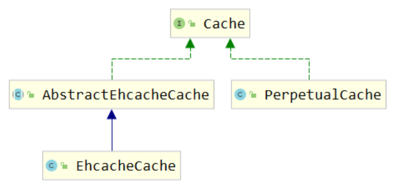

**Cache接口中的方法**

|方法名|作用|
|-|-|
|void putObject(Object, Object)|将对象存入缓存|
|Object getObject(Object)|从缓存中取出对象|
|Object removeObject(Object)|从缓存中删除对象|

**缓存的本质**

根据Cache接口中方法的声明我们能够看到，缓存的本质是一个Map。

### 6.5.2 PerpetualCache

org.apache.ibatis.cache.impl.PerpetualCache是Mybatis的默认缓存，也是Cache接口的默认实现。Mybatis一级缓存和自带的二级缓存都是通过PerpetualCache来操作缓存数据的。但是这就奇怪了，同样是PerpetualCache这个类，怎么能区分出来两种不同级别的缓存呢？

其实很简单，调用者不同。

- 一级缓存：由BaseExecutor调用PerpetualCache
- 二级缓存：由CachingExecutor调用PerpetualCache，而CachingExecutor可以看做是对BaseExecutor的装饰

### 6.5.3 一级缓存机制

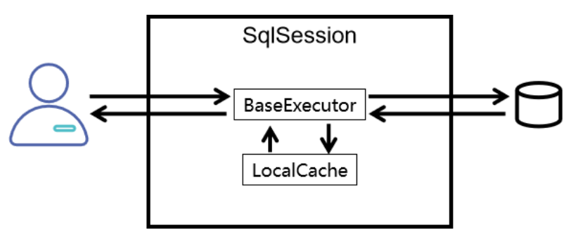

org.apache.ibatis.executor.BaseExecutor类中的关键方法：


**query()方法**:
```java
public <E> List<E> query(MappedStatement ms, Object parameter, RowBounds rowBounds, ResultHandler resultHandler, CacheKey key, BoundSql boundSql) throws SQLException {
    ErrorContext.instance().resource(ms.getResource()).activity("executing a query").object(ms.getId());
    if (closed) {
        throw new ExecutorException("Executor was closed.");
    }
    if (queryStack == 0 && ms.isFlushCacheRequired()) {
        clearLocalCache();
    }
    List<E> list;
    try {
        queryStack++;
        
        // 尝试从本地缓存中获取数据
        list = resultHandler == null ? (List<E>) localCache.getObject(key) : null;
        
        if (list != null) {
            handleLocallyCachedOutputParameters(ms, key, parameter, boundSql);
        } else {
            
            // 如果本地缓存中没有查询到数据，则查询数据库
            list = queryFromDatabase(ms, parameter, rowBounds, resultHandler, key, boundSql);
        }
    } finally {
        queryStack--;
    }
    if (queryStack == 0) {
        for (org.apache.ibatis.executor.BaseExecutor.DeferredLoad deferredLoad : deferredLoads) {
            deferredLoad.load();
        }
        // issue #601
        deferredLoads.clear();
        if (configuration.getLocalCacheScope() == LocalCacheScope.STATEMENT) {
            // issue #482
            clearLocalCache();
        }
    }
    return list;
}
```

**queryFromDatabase()方法**:

```java
private <E> List<E> queryFromDatabase(MappedStatement ms, Object parameter, RowBounds rowBounds, ResultHandler resultHandler, CacheKey key, BoundSql boundSql) throws SQLException {
    List<E> list;
    localCache.putObject(key, EXECUTION_PLACEHOLDER);
    try {
        
        // 从数据库中查询数据
        list = doQuery(ms, parameter, rowBounds, resultHandler, boundSql);
    } finally {
        localCache.removeObject(key);
    }
    
    // 将数据存入本地缓存
    localCache.putObject(key, list);
    if (ms.getStatementType() == StatementType.CALLABLE) {
        localOutputParameterCache.putObject(key, parameter);
    }
    return list;
}
```

### 6.5.4 二级缓存机制

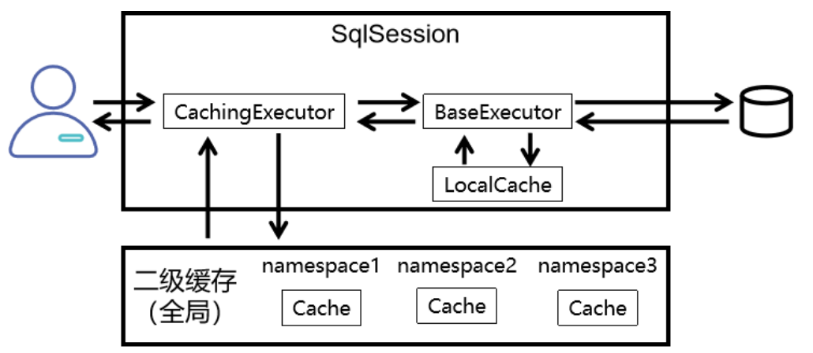

下面我们来看看CachingExecutor类中的query()方法在不同情况下使用的具体缓存对象：

**未开启二级缓存**

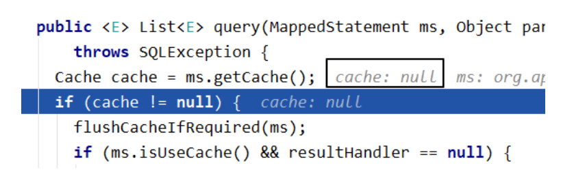


**使用自带二级缓存**

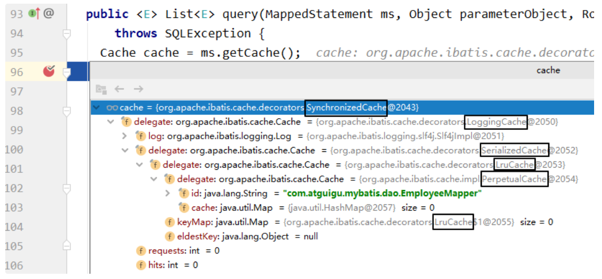

**使用EHCache**

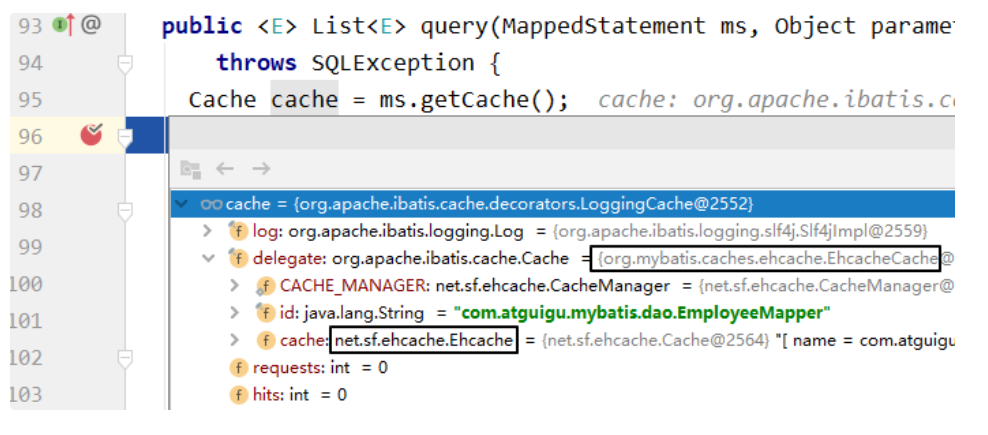


# 7. 逆向工程

## 7.1 ORM思维

ORM（Object-Relational Mapping，对象-关系映射）是一种将数据库和面向对象编程语言中的对象之间进行转换的技术。它将对象和关系数据库的概念进行映射(一个类对应一张表，类的属性对应表的字段，类的一个对象对应表的一条记录)，最后**我们就可以通过方法调用进行数据库操作**。

**ORM框架通常有半自动和全自动两种方式**：

- 半自动 ORM 通常需要程序员手动编写 SQL 语句或者配置文件
- 全自动 ORM 则是将实体类和数据表进行自动映射，使用 API 进行数据库操作时，会自动生成并执行 SQL 语句并将查询结果转换成实体对象

常见的半自动 ORM 框架包括 MyBatis 等；常见的全自动 ORM 框架包括 Hibernate、Spring Data JPA、MyBatis-Plus 等。

## 7.2 逆向工程的概念

MyBatis的逆向工程是一种**自动化生成持久层代码和映射文件的工具**，它可以根据数据库表结构和设置的参数生成对应的实体类、Mapper.xml 文件、Mapper 接口等代码文件，简化了开发者手动生成的过程。

**注意：逆向工程只能生成单表crud的操作，多表查询依然需要我们自己编写**

## 7.3 使用MyBatisX插件创建逆向工程

（1）安装MyBatisX插件

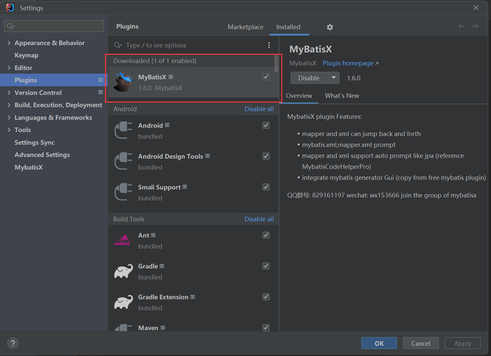

（2）IDEA中连接数据库


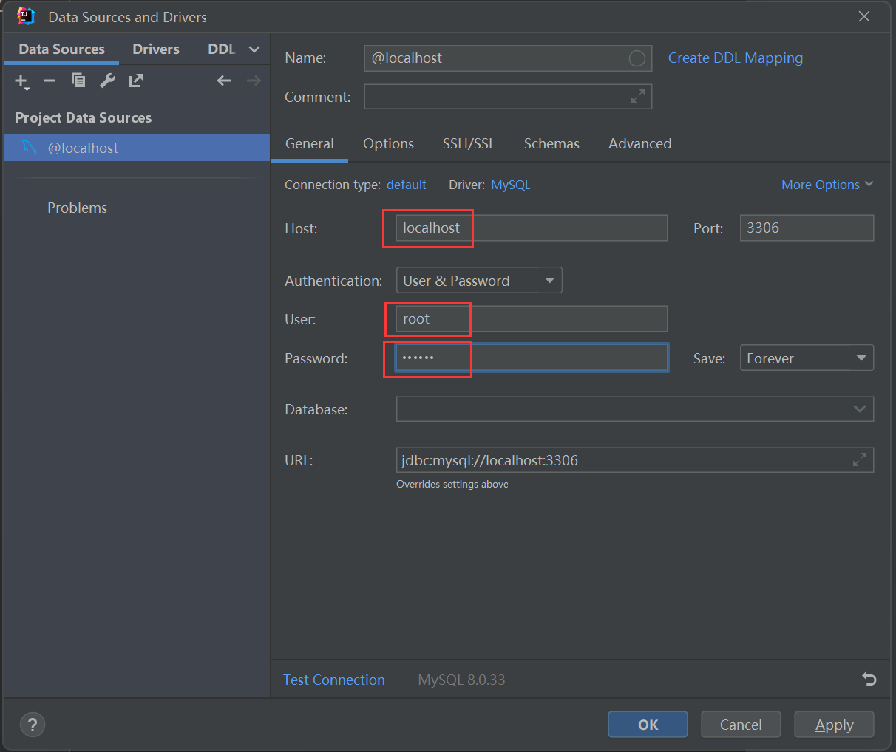

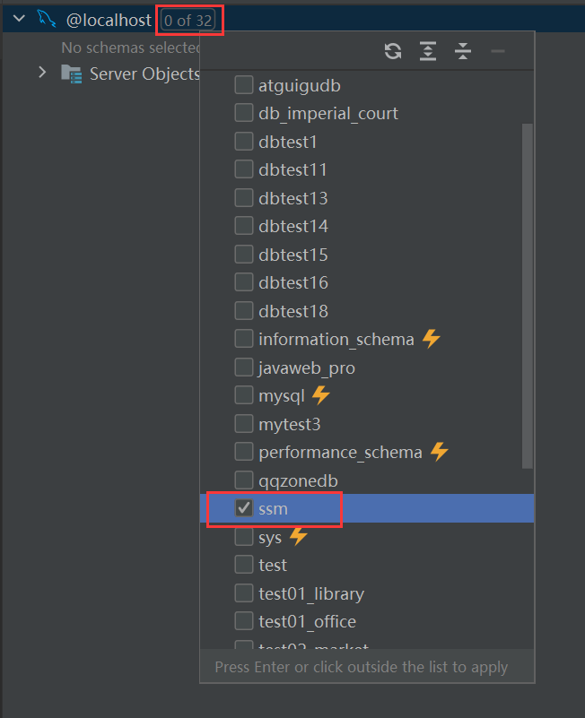

（3）选择要逆向工程的表，右键使用MyBatis插件即可

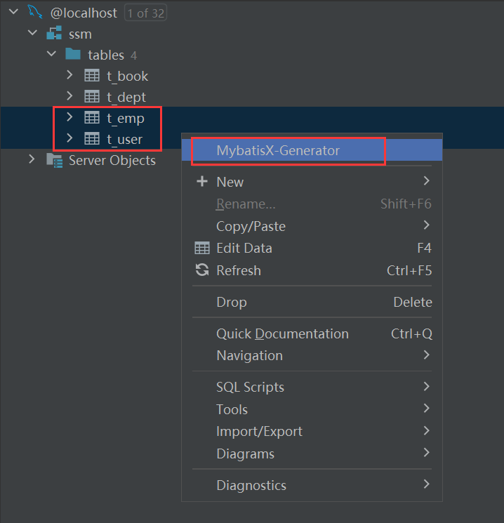

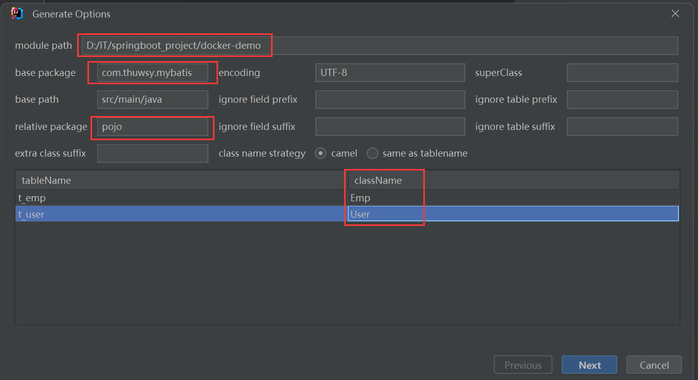

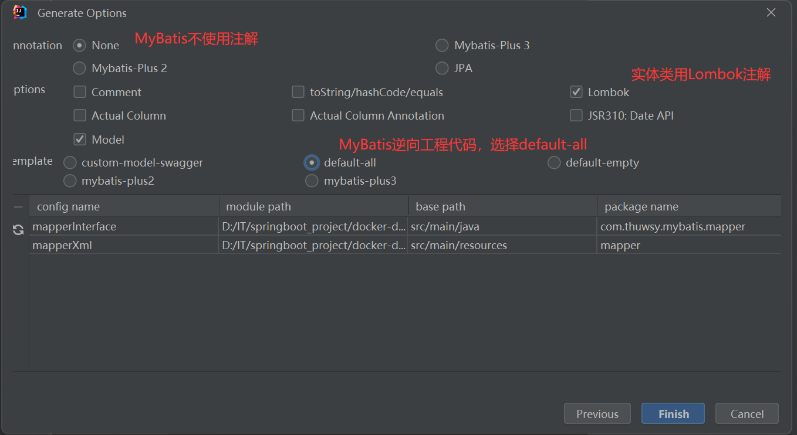

## 7.4 QBC查询

QBC：Query By Criteria。QBC查询最大的特点就是将SQL语句中的WHERE子句进行了组件化的封装，让我们可以通过调用Criteria对象的方法自由的拼装查询条件。

```java
@Test
public void testMBG(){
    try {
        InputStream is = Resources.getResourceAsStream("mybatis-config.xml");
        SqlSessionFactory sqlSessionFactory = new SqlSessionFactoryBuilder().build(is);
        SqlSession sqlSession = sqlSessionFactory.openSession(true);
        EmpMapper mapper = sqlSession.getMapper(EmpMapper.class);
        //查询所有数据
        /*List<Emp> list = mapper.selectByExample(null);
        list.forEach(emp -> System.out.println(emp));*/
        
        //根据条件查询
        /*EmpExample example = new EmpExample();
        example.createCriteria().andEmpNameEqualTo("张
        三").andAgeGreaterThanOrEqualTo(20);
        example.or().andDidIsNotNull();
        List<Emp> list = mapper.selectByExample(example);
        list.forEach(emp -> System.out.println(emp));*/
        
        mapper.updateByPrimaryKeySelective(new
        Emp(1,"admin",22,null,"456@qq.com",3));
    } catch (IOException e) {
        e.printStackTrace();
    }
}
```

# 8. 分页插件PageHelper

## 8.1 MyBatis的插件机制

MyBatis对插件进行了标准化的设计，并提供了一套可扩展的插件机制。插件可以在用于语句执行过程中进行拦截，并允许通过自定义处理程序来拦截和修改 SQL 语句、映射语句的结果等。

具体来说，MyBatis 的插件机制包括以下三个组件：

1. `Interceptor`（拦截器）：定义一个拦截方法 `intercept`，该方法在执行 SQL 语句、执行查询、查询结果的映射时会被调用。
2. `Invocation`（调用）：实际上是对被拦截的方法的封装，封装了 `Object target`、`Method method` 和 `Object[] args` 这三个字段。
3. `InterceptorChain`（拦截器链）：对所有的拦截器进行管理，包括将所有的 Interceptor 链接成一条链，并在执行 SQL 语句时按顺序调用。

插件的开发非常简单，只需要实现 Interceptor 接口，并使用注解 `@Intercepts` 来标注需要拦截的对象和方法，然后在 MyBatis 的配置文件中添加插件即可。

PageHelper 是 MyBatis 中比较著名的分页插件，它提供了多种分页方式（例如 MySQL 和 Oracle 分页方式），支持多种数据库，并且使用非常简单。

## 8.2 PageHelper插件的使用

### 8.2.1 添加依赖

```xml
<dependency>
    <groupId>com.github.pagehelper</groupId>
    <artifactId>pagehelper</artifactId>
    <version>5.2.0</version>
</dependency>
```

### 8.2.2 在MyBatis的核心配置文件中配置插件

```xml
<plugins>
    <!--设置分页插件-->
    <plugin interceptor="com.github.pagehelper.PageInterceptor">
        <property name="helperDialect" value="mysql"/>
    </plugin>
</plugins>
```

其中，com.github.pagehelper.PageInterceptor 是 PageHelper 插件的名称，helperDialect属性用于指定数据库类型（因为分页插件支持多种数据库）

### 8.2.3 使用分页插件

（1）在查询功能之前使用`PageHelper.startPage(int pageNum, int pageSize)`开启分页功能

- pageNum：当前页的页码
- pageSize：每页显示的条数

**注意**：开启分页功能，就会在 SQL 语句后面自动附加 LIMIT 子句并查询总记录数（所以自己写的SQL语句一定不能以分号`;`结尾）；不开启就还是按照原样查询。分页功能对原有的 Mapper 接口、SQL 语句没有任何影响。这个效果可以称之为是非侵入式，也可以说是可插拔的。

- 注1：例如自动附加`limit index, pageSize`子句，其中`index=(pageNum-1)*pageSize`
- 注2：自动计算总页数的方式，我们用count表示总记录数，totalPage表示总页数，则
    ```java
    totalPage = count / pageSize;
    if (count % pageSize != 0){
        totalPage += 1;
    }
    ```

（2）在用sql语句查询获取对象的list集合之后，使用`PageInfo<T> pageInfo = new PageInfo<>(List<T> list, int navigatePages)`封装分页相关数据

- list：分页之后的数据
- navigatePages：导航分页的页码数

（3）分页相关数据

```java
PageInfo{
pageNum=8, pageSize=4, size=2, startRow=29, endRow=30, total=30, pages=8,
list=Page{count=true, pageNum=8, pageSize=4, startRow=28, endRow=32, total=30,
pages=8, reasonable=false, pageSizeZero=false},
prePage=7, nextPage=0, isFirstPage=false, isLastPage=true, hasPreviousPage=true,
hasNextPage=false, navigatePages=5, navigateFirstPage4, navigateLastPage8,
navigatepageNums=[4, 5, 6, 7, 8]
}
```

- pageNum：当前页的页码
- pageSize：每页显示的条数
- size：当前页显示的真实条数
- total：总记录数
- pages：总页数
- prePage：上一页的页码
- nextPage：下一页的页码
- isFirstPage/isLastPage：是否为第一页/最后一页
- hasPreviousPage/hasNextPage：是否存在上一页/下一页
- navigatePages：导航分页的页码数
- navigatepageNums：导航分页的页码，`[1,2,3,4,5]`

最后直接将分页数据`PageInfo<T> pageInfo`共享到请求域后，渲染视图即可，由前端根据需要获取相关分页数据。

**举例**：

```java
@Test
public void testTeacherRelationshipToMulti() {
    // 省略获取sqlSession的步骤
    TeacherMapper teacherMapper = session.getMapper(TeacherMapper.class);

    // 1. 开启分页功能，查第8页，每页4条数据
    PageHelper.startPage(8,4);
    // 2. 正常进行查询
    List<Teacher> allTeachers = teacherMapper.findAllTeachers();
    // 3. 封装分页相关数据
    PageInfo<Teacher> pageInfo = new PageInfo<>(allTeachers, 5);

    System.out.println("pageInfo = " + pageInfo);
    long total = pageInfo.getTotal(); // 获取总记录数
    System.out.println("total = " + total);
    int pages = pageInfo.getPages();  // 获取总页数
    System.out.println("pages = " + pages);
    int pageNum = pageInfo.getPageNum(); // 获取当前页码
    System.out.println("pageNum = " + pageNum);
    int pageSize = pageInfo.getPageSize(); // 获取每页显示记录数
    System.out.println("pageSize = " + pageSize);
    List<Teacher> teachers = pageInfo.getList(); //获取查询页的数据集合
    System.out.println("teachers = " + teachers);
    teachers.forEach(System.out::println);
}
```

**补充**：类型是PageInfo而不是Page的原因：

当我们开启了分页功能后，查询一个 List 集合，实际返回的是：com.github.pagehelper.Page 类型，这个 Page 类继承了 ArrayList，所以也兼容 List 接口类型。

如果我们将 Page 类型的对象存入模型，转发到视图模板上显示数据，会存在一个问题：视图模板技术只承认这个对象是一个 List 集合，不识别 List 集合之外的其它属性。

这一点在其他场合也需要注意：我们开发时尽量不要继承 ArrayList、HashMap 等类似的集合实现类。如果继承了，那么页面视图模板技术或其他表达式往往只能识别我们的对象是一个集合，而无法访问额外封装的其他属性。

所以 Page 对象需要封装为 PageInfo，让 list、pageNum 等等数据作为 PageInfo 对象的属性；PageInfo 本身并不是一个 List 类型的集合。
