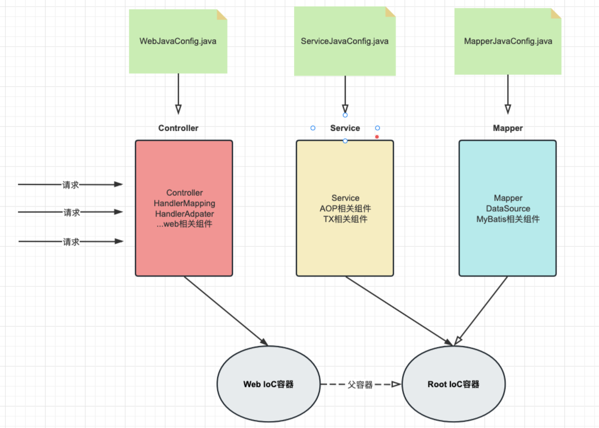

# 一、SSM整合核心问题

## 1. SSM整合需要几个IOC容器？

SSM整合需要两个IOC容器(web容器和root容器)，这样做的好处有：

1. 分离关注点
2. 解耦合
3. 灵活配置

## 2. 每个IOC容器对应哪些组件？

- web容器：盛放web相关组件，如controller,springmvc核心组件
- root容器：盛放业务和持久层相关组件，如service,mapper,dataSource,mybatis核心组件,spring核心组件

## 3. 两个IOC容器之间的关系？

root容器是父容器，web容器是子容器，这样子容器就可以访问父容器中的bean(但父容器不能访问子容器中的bean)。从源码中就可以看出父子关系：

```java
protected WebApplicationContext createWebApplicationContext(@Nullable ApplicationContext parent) {
    Class<?> contextClass = getContextClass();
    if (!ConfigurableWebApplicationContext.class.isAssignableFrom(contextClass)) {
      throw new ApplicationContextException(
          "Fatal initialization error in servlet with name '" + getServletName() +
          "': custom WebApplicationContext class [" + contextClass.getName() +
          "] is not of type ConfigurableWebApplicationContext");
    }
    ConfigurableWebApplicationContext wac =
        (ConfigurableWebApplicationContext) BeanUtils.instantiateClass(contextClass);

    wac.setEnvironment(getEnvironment());
    //wac 就是web ioc容器
    //parent 就是root ioc容器
    //web容器设置root容器为父容器，所以web容器可以引用root容器
    wac.setParent(parent);
    String configLocation = getContextConfigLocation();
    if (configLocation != null) {
      wac.setConfigLocation(configLocation);
    }
    configureAndRefreshWebApplicationContext(wac);

    return wac;
  }
```

## 4. 需要几个配置类，分别对应哪个IOC容器？

建议给三层架构的每一层都对应一个配置类：

- WebJavaConfig：配置controller，springmvc相关。对应web容器。
- ServiceJavaConfig：配置service，aop，tx相关。对应root容器。
- MapperJavaConfig：配置mapper，mybatis相关，再单独用一个配置类DataSourceJavaConfig来配置datasource。对应root容器。

> 注意：持久层我们使用MapperJavaConfig和DataSourceJavaConfig两个配置类，这是因为MyBatis框架的配置的初始化顺序可能会导致@Value注解读取不到值，所以将数据源单独放在一个配置类中。



# 二、SSM整合准备工作

## 1. 创建Maven JavaEE工程并引入依赖

```xml
<dependencies>
    <!-- spring相关依赖 -->
    <!-- ioc/di -->
    <dependency>
        <groupId>org.springframework</groupId>
        <artifactId>spring-context</artifactId>
        <version>6.0.6</version>
    </dependency>
    <dependency>
        <groupId>jakarta.annotation</groupId>
        <artifactId>jakarta.annotation-api</artifactId>
        <version>2.1.1</version>
    </dependency>
    <!-- aop -->
    <dependency>
        <groupId>org.springframework</groupId>
        <artifactId>spring-aspects</artifactId>
        <version>6.0.6</version>
    </dependency>
    <!-- tx -->
    <dependency>
        <groupId>org.springframework</groupId>
        <artifactId>spring-orm</artifactId>
        <version>6.0.6</version>
    </dependency>

    <!-- springmvc相关依赖 -->
    <dependency>
        <groupId>org.springframework</groupId>
        <artifactId>spring-webmvc</artifactId>
        <version>6.0.6</version>
    </dependency>
    <dependency>
        <groupId>jakarta.platform</groupId>
        <artifactId>jakarta.jakartaee-web-api</artifactId>
        <version>9.1.0</version>
        <scope>provided</scope>
    </dependency>
    <dependency>
        <groupId>com.fasterxml.jackson.core</groupId>
        <artifactId>jackson-databind</artifactId>
        <version>2.15.2</version>
    </dependency>
    <dependency>
        <groupId>org.hibernate.validator</groupId>
        <artifactId>hibernate-validator</artifactId>
        <version>8.0.0.Final</version>
    </dependency>
    <dependency>
        <groupId>org.hibernate.validator</groupId>
        <artifactId>hibernate-validator-annotation-processor</artifactId>
        <version>8.0.0.Final</version>
    </dependency>

    <!-- mybatis相关依赖 -->
    <dependency>
        <groupId>org.mybatis</groupId>
        <artifactId>mybatis</artifactId>
        <version>3.5.13</version>
    </dependency>
    <dependency>
        <groupId>mysql</groupId>
        <artifactId>mysql-connector-java</artifactId>
        <version>8.0.28</version>
    </dependency>
    <dependency>
        <groupId>com.github.pagehelper</groupId>
        <artifactId>pagehelper</artifactId>
        <version>5.2.0</version>
    </dependency>

    <!-- 整合第三方所需依赖 -->
    <!-- spring整合mybatis -->
    <dependency>
        <groupId>org.mybatis</groupId>
        <artifactId>mybatis-spring</artifactId>
        <version>3.0.2</version>
    </dependency>
    <!-- druid数据库连接池 -->
    <dependency>
        <groupId>com.alibaba</groupId>
        <artifactId>druid</artifactId>
        <version>1.2.8</version>
    </dependency>
    <!-- 日志 -->
    <dependency>
        <groupId>ch.qos.logback</groupId>
        <artifactId>logback-classic</artifactId>
        <version>1.2.3</version>
    </dependency>
    <!-- Lombok -->
    <dependency>
        <groupId>org.projectlombok</groupId>
        <artifactId>lombok</artifactId>
        <version>1.18.24</version>
    </dependency>
    <!-- Spring6和Thymeleaf整合包 -->
    <dependency>
        <groupId>org.thymeleaf</groupId>
        <artifactId>thymeleaf-spring6</artifactId>
        <version>3.1.1.RELEASE</version>
    </dependency>
    <!-- Spring 的测试功能 -->
    <dependency>
        <groupId>org.springframework</groupId>
        <artifactId>spring-test</artifactId>
        <version>6.0.6</version>
    </dependency>
    <!-- junit5 -->
    <dependency>
        <groupId>org.junit.jupiter</groupId>
        <artifactId>junit-jupiter-api</artifactId>
        <version>5.3.1</version>
        <scope>test</scope>
    </dependency>
</dependencies>
```

## 2. 创建数据库表和Java实体类

```sql
CREATE DATABASE `mybatis-example`;

USE `mybatis-example`;

CREATE TABLE `t_emp`(
  emp_id INT AUTO_INCREMENT,
  emp_name CHAR(100),
  emp_salary DOUBLE(10,5),
  PRIMARY KEY(emp_id)
);

INSERT INTO `t_emp`(emp_name,emp_salary) VALUES("tom",200.33);
INSERT INTO `t_emp`(emp_name,emp_salary) VALUES("jerry",666.66);
INSERT INTO `t_emp`(emp_name,emp_salary) VALUES("andy",777.77);
```

在com.thuwsy.ssm.pojo包下创建Employee实体类

```java
@Data
@NoArgsConstructor
@AllArgsConstructor
public class Employee {
    private Integer empId;
    private String empName;
    private Double empSalary;
}
```

## 3. 加入日志配置文件

在resources下创建logback.xml

```xml
<?xml version="1.0" encoding="UTF-8"?>
<configuration debug="true">
    <!-- 指定日志输出的位置 -->
    <appender name="STDOUT" class="ch.qos.logback.core.ConsoleAppender">
        <encoder>
            <!-- 日志输出的格式 -->
            <!-- 按照顺序分别是：时间、日志级别、线程名称、打印日志的类、日志主体内容、换行 -->
            <pattern>[%d{HH:mm:ss.SSS}] [%-5level] [%thread] [%logger] [%msg]%n</pattern>
            <charset>UTF-8</charset>
        </encoder>
    </appender>

    <!-- 设置全局日志级别。日志级别按顺序分别是：DEBUG、INFO、WARN、ERROR -->
    <!-- 指定任何一个日志级别都只打印当前级别和后面级别的日志。 -->
    <root level="INFO">
        <!-- 指定打印日志的appender，这里通过“STDOUT”引用了前面配置的appender -->
        <appender-ref ref="STDOUT" />
    </root>

    <!-- 专门给某一个包指定日志级别 -->
    <logger name="com.thuwsy.ssm" level="DEBUG" additivity="false">
        <appender-ref ref="STDOUT" />
    </logger>

</configuration>
```

# 三、控制层配置类

在com.thuwsy.ssm.config包下创建WebJavaConfig配置类：

```java
@Configuration
@EnableWebMvc
@ComponentScan({"com.thuwsy.ssm.controller", "com.thuwsy.ssm.exception"})
public class WebJavaConfig implements WebMvcConfigurer {
    @Override // 开启静态资源处理
    public void configureDefaultServletHandling(DefaultServletHandlerConfigurer configurer) {
        configurer.enable();
    }

    @Override // 配置视图控制器
    public void addViewControllers(ViewControllerRegistry registry) {
        registry.addViewController("/").setViewName("index");
    }

    @Override // 配置拦截器
    public void addInterceptors(InterceptorRegistry registry) {
        registry.addInterceptor(new FirstInterceptor()).addPathPatterns("/**");
    }

    @Bean // 1. 创建模板解析器
    public ITemplateResolver templateResolver() {
        SpringResourceTemplateResolver templateResolver = new SpringResourceTemplateResolver();
        templateResolver.setPrefix("/WEB-INF/templates/"); // 视图前缀
        templateResolver.setSuffix(".html"); // 视图后缀
        templateResolver.setCharacterEncoding("UTF-8");
        templateResolver.setTemplateMode(TemplateMode.HTML);
        templateResolver.setCacheable(false);
        return templateResolver;
    }
    @Bean // 2. 创建模板引擎，并为其注入模板解析器
    public SpringTemplateEngine templateEngine(ITemplateResolver templateResolver) {
        SpringTemplateEngine templateEngine = new SpringTemplateEngine();
        templateEngine.setTemplateResolver(templateResolver);
        return templateEngine;
    }
    @Bean // 3. 注册Thymeleaf视图解析器，并为其注入模板引擎
    public ThymeleafViewResolver viewResolver(SpringTemplateEngine templateEngine) {
        ThymeleafViewResolver viewResolver = new ThymeleafViewResolver();
        viewResolver.setTemplateEngine(templateEngine);
        viewResolver.setCharacterEncoding("UTF-8");
        viewResolver.setOrder(1);
        return viewResolver;
    }
}
```

> 异常处理器、视图控制器、拦截器可按需配置

# 四、业务层配置类

在com.thuwsy.ssm.config包下创建ServiceJavaConfig配置类：

```java
@Configuration
@EnableTransactionManagement // 开启声明式事务注解支持
@EnableAspectJAutoProxy // 开启aspect aop注解支持
@ComponentScan("com.thuwsy.ssm.service")
public class ServiceJavaConfig {
    @Bean // 装配事务管理器接口的实现类对象
    public TransactionManager transactionManager(DataSource dataSource) {
        return new DataSourceTransactionManager(dataSource);
    }
}
```

# 五、持久层配置类

## 1. jdbc.properties

在resources下创建jdbc.properties

```properties
jdbc.driver=com.mysql.cj.jdbc.Driver
jdbc.url=jdbc:mysql://localhost:3306/mybatis-example
jdbc.username=root
jdbc.password=abc666
```

## 2. DataSourceJavaConfig

在com.thuwsy.ssm.config包下创建DataSourceJavaConfig配置类：

```java
@Configuration
@PropertySource("classpath:jdbc.properties")
public class DataSourceJavaConfig {
    @Value("${jdbc.username}")
    private String username;
    @Value("${jdbc.password}")
    private String password;
    @Value("${jdbc.url}")
    private String url;
    @Value("${jdbc.driver}")
    private String driver;

    @Bean
    public DataSource dataSource() {
        DruidDataSource dataSource = new DruidDataSource();
        dataSource.setUsername(username);
        dataSource.setPassword(password);
        dataSource.setUrl(url);
        dataSource.setDriverClassName(driver);
        return dataSource;
    }
}
```

## 3. MapperJavaConfig

在com.thuwsy.ssm.config包下创建MapperJavaConfig配置类：

```java
@Configuration
public class MapperJavaConfig {
    // 配置SqlSessionFactoryBean，这样就可以直接在IOC中获取SqlSessionFactory
    @Bean
    public SqlSessionFactoryBean sqlSessionFactoryBean(DataSource dataSource){
        //实例化SqlSessionFactory工厂
        SqlSessionFactoryBean sqlSessionFactoryBean = new SqlSessionFactoryBean();
        //设置数据源
        sqlSessionFactoryBean.setDataSource(dataSource);

        // 代替settings标签
        org.apache.ibatis.session.Configuration configuration = new org.apache.ibatis.session.Configuration();
        configuration.setMapUnderscoreToCamelCase(true); // 开启驼峰映射
        configuration.setLogImpl(Slf4jImpl.class); // 开启logback日志输出
        configuration.setAutoMappingBehavior(AutoMappingBehavior.FULL); // 开启resultMap自动映射
        sqlSessionFactoryBean.setConfiguration(configuration);

        // 代替typeAliases标签
        sqlSessionFactoryBean.setTypeAliasesPackage("com.thuwsy.ssm.pojo"); // 给实体类起别名

        // 分页插件配置
        PageInterceptor pageInterceptor = new PageInterceptor();
        Properties properties = new Properties();
        properties.setProperty("helperDialect", "mysql");
        pageInterceptor.setProperties(properties);
        sqlSessionFactoryBean.addPlugins(pageInterceptor);

        return sqlSessionFactoryBean;
    }

    // 配置Mapper接口的扫描
    @Bean
    public MapperScannerConfigurer mapperScannerConfigurer(){
        MapperScannerConfigurer mapperScannerConfigurer = new MapperScannerConfigurer();
        //设置mapper接口和mapper映射文件所在的共同包
        mapperScannerConfigurer.setBasePackage("com.thuwsy.ssm.mapper");
        return mapperScannerConfigurer;
    }
}
```

# 六、容器初始化类

在com.thuwsy.ssm.config包下创建MyWebAppInitializer容器初始化类：

```java
public class MyWebAppInitializer extends AbstractAnnotationConfigDispatcherServletInitializer {
    @Override //指定root容器对应的配置类
    protected Class<?>[] getRootConfigClasses() {
        return new Class[] { MapperJavaConfig.class, ServiceJavaConfig.class, DataSourceJavaConfig.class };
    }
    @Override //指定web容器对应的配置类
    protected Class<?>[] getServletConfigClasses() {
        return new Class[] { WebJavaConfig.class };
    }
    @Override // 设置DispatcherServlet的处理路径，一般都用/处理所有请求
    protected String[] getServletMappings() {
        return new String[] {"/"};
    }

    @Override // 设置过滤器
    protected Filter[] getServletFilters() {
        // 创建编码过滤器
        CharacterEncodingFilter characterEncodingFilter = new CharacterEncodingFilter();
        characterEncodingFilter.setEncoding("UTF-8");
        characterEncodingFilter.setForceEncoding(true);
        // 创建处理请求方式的过滤器
        HiddenHttpMethodFilter hiddenHttpMethodFilter = new HiddenHttpMethodFilter();
        return new Filter[]{characterEncodingFilter, hiddenHttpMethodFilter};
    }
}
```

# 七、整合测试

## 1. Controller层组件

com.thuwsy.ssm.controller包下创建EmployeeController

```java
@CrossOrigin
@RestController
@Slf4j
@RequestMapping("/employee")
public class EmployeeController {
    @Autowired
    private EmployeeService employeeService;
    
    @GetMapping("/list")
    public List<Employee> retList(){
        List<Employee> employees = employeeService.findAll();
        log.info("员工数据:{}", employees);
        return employees;
    }
}
```

> 注意：在控制器类上添加@CrossOrigin注解，可以启用跨源请求，从而解决前后端联调的问题

## 2. Service层组件

首先在com.thuwsy.ssm.service包下创建EmployeeService接口

```java
public interface EmployeeService {
    public List<Employee> findAll();
}
```

然后在com.thuwsy.ssm.service.impl包下创建EmployeeServiceImpl实现类：

- 添加@Service注解标识为Service层组件
- 添加@Transactional注解使用事务
- 自动装配Mapper接口的代理实现类

```java
@Service
@Transactional
public class EmployeeServiceImpl implements EmployeeService {
    @Autowired
    private EmployeeMapper employeeMapper;

    @Override
    public List<Employee> findAll() {
        List<Employee> employeeList =  employeeMapper.queryAll();
        return employeeList;
    }
}
```

## 3. Mapper层组件

首先在java.com.thuwsy.ssm.mapper包下创建EmployeeMapper接口

```java
public interface EmployeeMapper {
    List<Employee> queryAll();
}
```

然后在resources.com.thuwsy.ssm.mapper目录下创建EmployeeMapper.xml

```xml
<?xml version="1.0" encoding="UTF-8" ?>
<!DOCTYPE mapper
        PUBLIC "-//mybatis.org//DTD Mapper 3.0//EN"
        "http://mybatis.org/dtd/mybatis-3-mapper.dtd">
<mapper namespace="com.thuwsy.ssm.mapper.EmployeeMapper">
    <!-- List<Employee> queryAll(); -->
    <select id="queryAll" resultType="Employee">
        select * from t_emp
    </select>
</mapper>
```

# 八、SSM的CRUD案例

见schedule-ssm项目。
