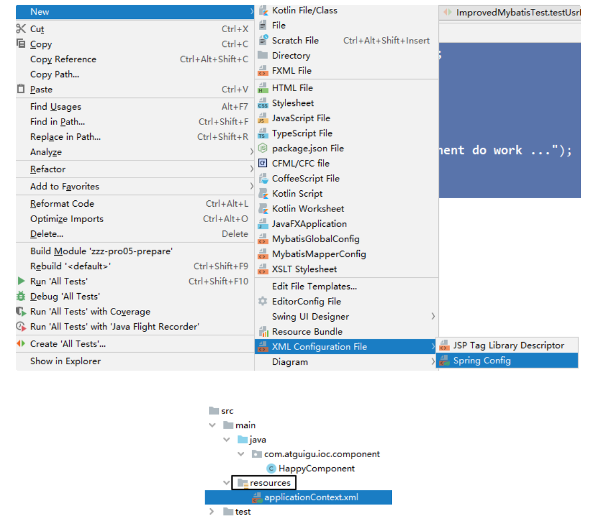
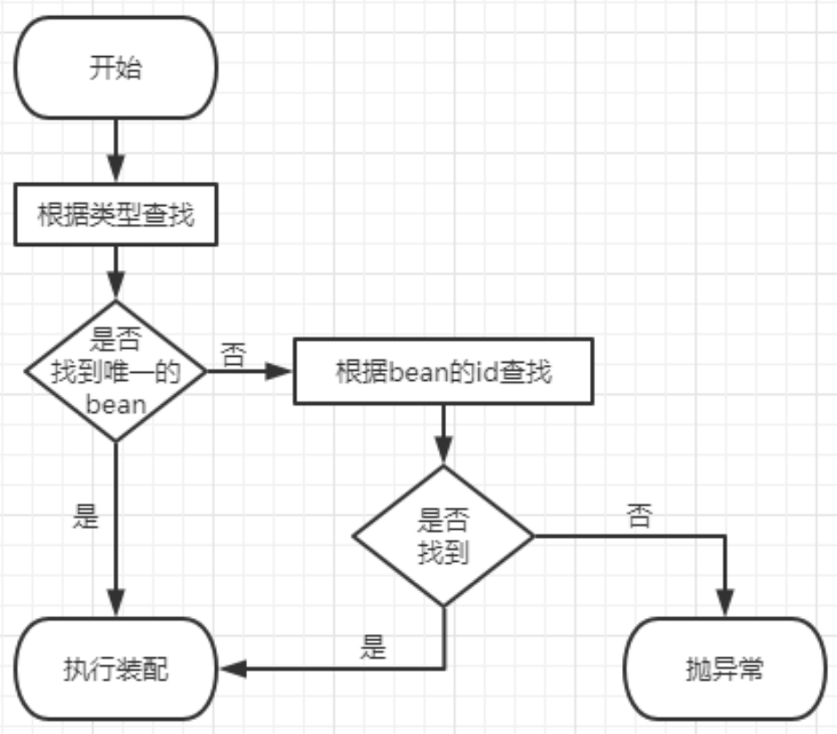
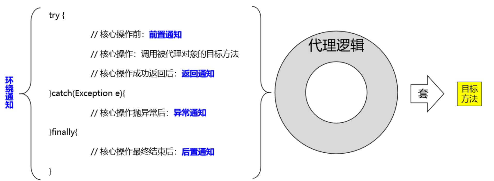
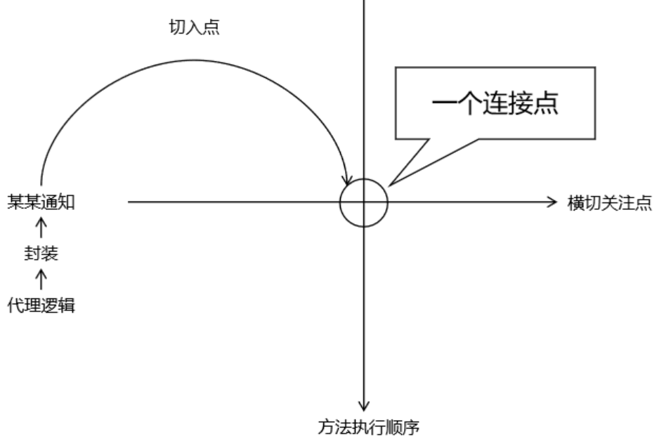
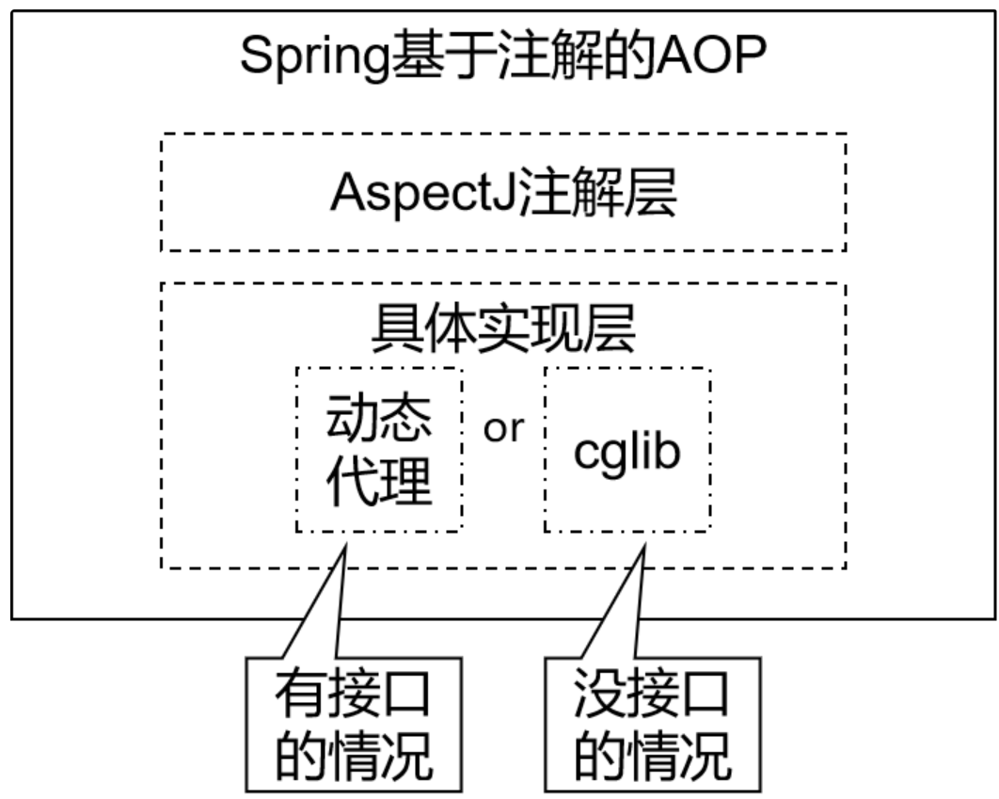
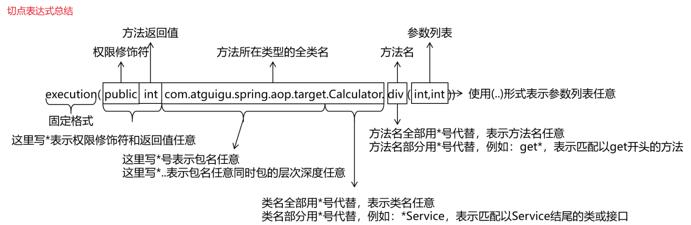
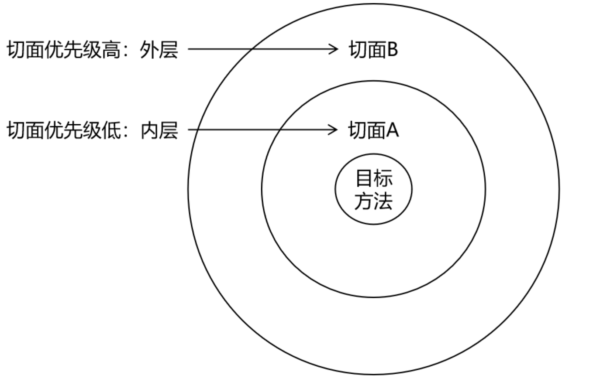
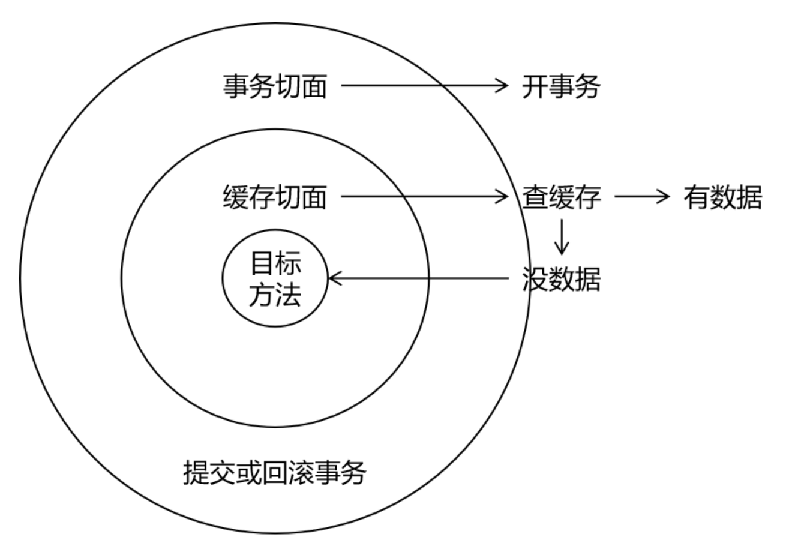
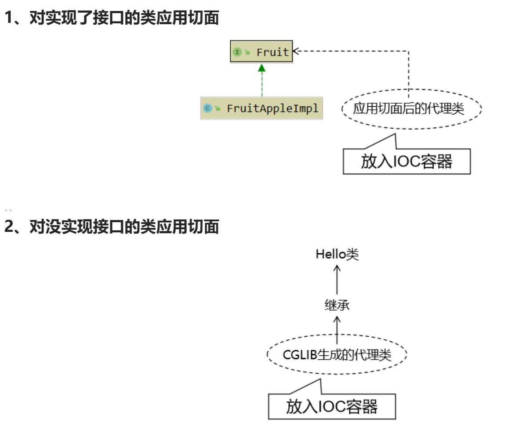
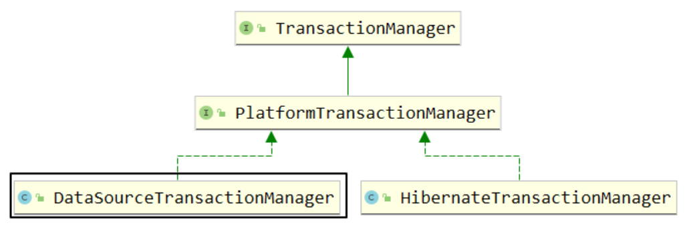

# 1. Spring简介

## 1.1 Spring概述

官网地址：https://spring.io/

Spring 是最受欢迎的企业级 Java 应用程序开发框架，数以百万的来自世界各地的开发人员使用 Spring 框架来创建性能好、易于测试、可重用的代码。

Spring 框架是一个开源的 Java 平台，它最初是由 Rod Johnson 编写的，并且于 2003 年 6 月首次在 Apache 2.0 许可下发布。Spring 是轻量级的框架，其基础版本只有 2 MB 左右的大小。

Spring 框架的核心特性是可以用于开发任何 Java 应用程序，但是在 Java EE 平台上构建 web 应用程序是需要扩展的。 Spring 框架的目标是使 J2EE 开发变得更容易使用，通过启用基于 POJO 编程模型来促进良好的编程实践。

**广义的Spring**：指的是以 Spring Framework 为基础的 Spring 技术栈。

**狭义的Spring**：指的是基础框架 Spring Framework，通常我们就称它为 Spring 框架。

## 1.2 Spring Framework

Spring Framework 是 Spring 的基础框架，可以视为 Spring 基础设施，基本上任何其他 Spring 项目都是以 Spring Framework 为基础的。

**Spring Framework优良特性**

- 非侵入式：使用 Spring Framework 开发应用程序时，Spring 对应用程序本身的结构影响非常小。对领域模型可以做到零污染；对功能性组件也只需要使用几个简单的注解进行标记，完全不会破坏原有结构，反而能将组件结构进一步简化。这就使得基于 Spring Framework 开发应用程序时结构清晰、简洁优雅。
- 控制反转：IOC——Inversion of Control，翻转资源获取方向。把自己创建资源、向环境索取资源变成环境将资源准备好，我们享受资源注入。
- 面向切面编程：AOP——Aspect Oriented Programming，在不修改源代码的基础上增强代码功能。
    - 抽取重复代码：将方法内部重复的代码抽取出来
    - 代码增强：我使用抽取出来的代码套用到某个独立功能上，就对这个独立功能进行了增强
- 容器：Spring IOC 是一个容器，因为它包含并且管理组件对象的生命周期。组件享受到了容器化的管理，替程序员屏蔽了组件创建过程中的大量细节，极大的降低了使用门槛，大幅度提高了开发效率。
- 组件化：Spring 实现了使用简单的组件配置组合成一个复杂的应用。在 Spring 中可以使用 XML 和 Java 注解组合这些对象。这使得我们可以基于一个个功能明确、边界清晰的组件有条不紊的搭建超大型复杂应用系统。
- 声明式：很多以前需要编写代码才能实现的功能，现在只需要声明需求即可由框架代为实现。
- 一站式：在IOC和 AOP 的基础上可以整合各种企业级应用的开源框架和优秀的第三方类库。而且 Spring 旗下的项目已经覆盖了广泛领域，很多方面的功能性需求可以在 Spring Framework 的基础上全部使用 Spring 来实现。

**Spring Framework主要功能模块**

|功能模块|功能介绍|
|-|-|
|Core Container|核心容器，在Spring环境下使用任何功能都必须基于IOC容器|
|AOP&Aspects|面向切面编程|
|TX|声明式事务管理|
|Spring MVC|提供了面向Web应用程序的集成功能|


# 2. IOC容器

## 2.1 组件

**整个项目就是由各种组件搭建而成的**，如控制层组件、业务层组件、持久层组件。其实这里我们强调的仍然是我们自己为了开发业务功能而创建的组件，而除了我们开发的组件，框架内部也有很多组件需要管理。

那么不管是我们开发的还是框架内部的，Spring都可以通过IOC容器的方式对它们进行统一管理和调配。所以Spring在SSM三大框架中起到的是一个基础设置的作用。而IOC容器的作用就是帮助我们管理组件。

总之，组件是一些可以复用的Java对象。所以组件一定是对象，但对象不一定是组件。

**组件交给Spring管理的优势**
1. 降低了组件之间的耦合性
2. 提高了代码的可重用性和可维护性
3. 方便了配置和管理
4. 交给Spring管理的组件，方可享受Spring框架的其他功能（AOP，声明事务管理等）

## 2.2 IOC思想

### 2.2.1 IOC

**IOC：Inversion of Control，翻译过来是控制反转**。

IoC 主要是针对对象的创建和调用控制而言的，也就是说，当应用程序需要使用一个对象时，不再是应用程序直接创建该对象，而是由 IoC 容器来创建和管理，即控制权由应用程序转移到 IoC 容器中，也就是“反转”了控制权。这种方式基本上是通过依赖注入的方式来实现的。

### 2.2.2 DI

**DI：Dependency Injection，翻译过来是依赖注入**。

DI 是指在组件之间传递依赖关系的过程中，将依赖关系在容器内部进行处理，这样就不必在应用程序代码中硬编码对象之间的依赖关系，实现了对象之间的解耦合。在 Spring 中，DI 是通过 XML 配置文件或注解的方式实现的，它提供了三种形式的依赖注入：构造函数注入、Setter 方法注入和接口注入。

结论：IOC 就是一种控制反转的思想，而 DI 是对 IOC 的一种具体实现。

## 2.3 IOC容器在Spring中的实现

### 2.3.1 IOC容器介绍

Servlet 容器能够管理 Servlet、Filter、Listener 这样的组件的一生，所以它是一个复杂容器。我们即将要学习的**IOC 容器也是一个复杂容器，是负责实例化、配置和组装 bean（组件）核心容器，它不仅要负责创建组件的对象、存储组件的对象，还要负责调用组件的方法让它们工作，最终在特定情况下销毁组件**。IOC容器通过读取配置元数据来获取有关要实例化、配置和组装组件的指令。

Spring 的 IOC 容器就是 IOC 思想的一个落地的产品实现。**IOC 容器中管理的组件也叫做 bean**。在创建 bean 之前，首先需要创建 IOC 容器。

### 2.3.2 IOC容器的接口和具体实现类

**1、BeanFactory接口**

这是 IOC 容器的标准化超接口，是 Spring 内部使用的接口，面向 Spring 本身，不提供给开发人员使用。

**2、ApplicationContext接口**

BeanFactory 的子接口，提供了更多高级特性。面向 Spring 的使用者，几乎所有场合都使用 ApplicationContext 而不是底层的 BeanFactory。

> 以后在 Spring 环境下看到一个类或接口的名称中包含 ApplicationContext，那基本就可以断定，这个类或接口与 IOC 容器有关。
> 对我们开发人员来说，ApplicationContext就是代表整个IOC容器技术体系的顶级接口。

补充：ApplicationContext接口有一个子接口ConfigurableApplicationContext，它包含一些扩展方法 refresh() 和 close()，使得 ApplicationContext 具有启动、关闭和刷新上下文的能力。

**ApplicationContext的主要实现类**

- `ClassPathXmlApplicationContext`：通过读取类路径下的 XML 格式的配置文件创建 IOC 容器对象
- `FileSystemXmlApplicationContext`：(不推荐使用)通过文件系统路径读取 XML 格式的配置文件创建 IOC 容器对象
- `AnnotationConfigApplicationContext`：通过读取Java配置类创建 IOC 容器对象
- `WebApplicationContext`：专门为 Web 应用准备，基于 Web 环境创建 IOC 容器对象，并将对象引入存入 ServletContext 域中。

### 2.3.3 IOC容器的配置方式

Spring IoC 容器使用多种形式的配置元数据，此配置元数据表示您作为应用程序开发人员如何告诉 Spring 容器实例化、配置和组装应用程序中的对象。

- XML配置方式：是Spring框架最早的配置方式之一，通过在XML文件中定义Bean及其依赖关系、Bean的作用域等信息，让Spring IoC容器来管理Bean之间的依赖关系。该方式从Spring框架的第一版开始提供支持。
- 注解方式：从Spring 2.5版本开始提供支持，可以通过在Bean类上使用注解来代替XML配置文件中的配置信息。通过在Bean类上加上相应的注解（如@Component等），将Bean注册到Spring IoC容器中，这样Spring IoC容器就可以管理这些Bean之间的依赖关系。
- Java配置类方式：从Spring 3.0版本开始提供支持，通过Java类来定义Bean与Bean之间的依赖关系和配置信息，从而代替XML配置文件的方式。Java配置类是一种使用Java编写配置信息的方式，通过@Configuration、@Bean等注解来实现Bean和依赖关系的配置。

**总结**：为了迎合SpringBoot，我们推荐使用**配置类+注解**的方式。

### 2.3.4 IOC容器底层原理

当我们根据配置文件或配置类创建一个IOC容器后，就会通过BeanDefinitionReader接口(有xml方式、配置类方式等)来解析里面定义的bean的id属性和class属性等。然后保存到DefaultListableBeanFactory类的beanDefinitionMap属性中，这个属性是一个`Map<String, BeanDefinition>`类型，其中key保存bean的id(唯一标识)，而value保存bean的定义信息(如beanClassName、scope等)。

Spring会通过BeanFactory和反射机制，调用无参构造器来实例化对象，然后进行初始化，就得到了最终的可用对象。


## 2.4 基于XML管理bean

### 2.4.1 创建bean

**1、创建Maven Module并引入依赖**

```xml
<dependencies>
    <dependency>
        <groupId>junit</groupId>
        <artifactId>junit</artifactId>
        <version>4.12</version>
        <scope>test</scope>
    </dependency>
    <!-- 基于Maven依赖传递性，导入spring-context依赖即可导入当前所需所有jar包 -->
    <dependency>
        <groupId>org.springframework</groupId>
        <artifactId>spring-context</artifactId>
        <version>5.3.18</version>
    </dependency>
</dependencies>
```

如果是junit5和spring6，则导入如下依赖：

```xml
<dependencies>
    <!--spring context依赖-->
    <!--当你引入Spring Context依赖之后，表示将Spring的基础依赖引入了-->
    <dependency>
        <groupId>org.springframework</groupId>
        <artifactId>spring-context</artifactId>
        <version>6.0.6</version>
    </dependency>
    <!--junit5测试-->
    <dependency>
        <groupId>org.junit.jupiter</groupId>
        <artifactId>junit-jupiter-api</artifactId>
        <version>5.3.1</version>
        <scope>test</scope>
    </dependency>
</dependencies>
```

**2、创建需要由IOC容器管理的类(组件类)，如HelloWorld**

**3、创建 Spring 配置文件 applicationContext.xml**



**4、配置组件**

```xml
<bean id="helloworld" class="com.thuwsy.spring.pojo.HelloWorld"></bean>
```

- bean标签：通过配置bean标签告诉IOC容器需要创建对象的组件是什么
- id属性：bean的唯一标识
- class属性：组件类的全类名

**注意：基于无参数构造函数的实例化，要求当前组件类必须包含无参数构造函数**。

**5、创建测试类**

```java
@Test
public void test1() {
    // 实例化IOC容器并指定配置文件，可以传入多个配置文件(因为该方法的参数是可变参数String...locations)
    ApplicationContext ioc = new ClassPathXmlApplicationContext("applicationContext.xml");
    // 获取IOC容器中的bean
    HelloWorld helloworld = (HelloWorld) ioc.getBean("helloworld");
    helloworld.sayHello();
}
```

以上方式在实例化IOC容器的同时指定配置文件，而在很多底层源码中更多的采用是以下方式来创建IOC容器：

```java   
// [springmvc源码和contextLoadListener源码方式]   
// 先实例化
ApplicationContext iocContainer1 = new ClassPathXmlApplicationContext();   
// 再指定配置文件(可以传入多个配置文件)
iocContainer1.setConfigLocations("services.xml", "daos.xml");
// 最后调用refresh()方法刷新容器，触发Bean实例化动作
iocContainer1.refresh();           
```


**注意事项**：

- Spring 底层默认通过反射技术调用组件类的无参构造器来创建组件对象。所以对一个JavaBean来说，无参构造器和属性的getXxx()、setXxx()方法是必须存在的，特别是在框架中。
- 用IOC容器创建对象和自己建的区别：在Spring环境下能够享受到的所有福利，都必须通过 IOC 容器附加到组件类上，所以随着我们在 Spring 中学习的功能越来越多，IOC 容器创建的组件类的对象就会比自己 new 的对象强大的越来越多。

**补充：基于工厂方法的实例化**

除了以上所示的使用构造函数实例化对象，还有一类是通过工厂模式实例化对象。

（1）基于静态工厂方法实例化

```java
public class ClientService {
  private static ClientService clientService = new ClientService();
  private ClientService() {}

  public static ClientService createInstance() {
  
    return clientService;
  }
}
```

```xml
<bean id="clientService" class="com.thuwsy.ClientService" factory-method="createInstance"/>
```

- class属性：指定工厂类的全类名
- factory-method: 指定静态工厂方法，注意，该方法必须是static方法。

（2）基于实例工厂方法实例化

```java
public class DefaultServiceLocator {

  private static ClientServiceImplclientService clientService = new ClientServiceImpl();

  public ClientService createClientServiceInstance() {
    return clientService;
  }
}
```

```xml
<!-- 将工厂类进行ioc配置 -->
<bean id="serviceLocator" class="com.thuwsy.DefaultServiceLocator"></bean>

<!-- 根据工厂对象的实例工厂方法进行实例化组件对象 -->
<bean id="clientService"
  factory-bean="serviceLocator"
  factory-method="createClientServiceInstance"/>
```

- factory-bean属性：指定当前容器中工厂Bean 的名称。
- factory-method: 指定实例工厂方法名。注意，该方法必须是非static的。

### 2.4.2 获取bean

**方式1：根据id获取**

由于 id 属性指定了 bean 的唯一标识，所以根据 bean 标签的 id 属性可以精确获取到一个组件对象。

```java
Student student = (Student) ioc.getBean("studentOne");
```

**方式2(推荐)：根据类型获取**

这种方式要求IOC容器中有且只有一个类型匹配的bean。由于在开发中，我们为同一个类往往只会配置一个bean，所以推荐使用这种方式。

```java
Student student = ioc.getBean(Student.class);
```

**方式3：根据id和类型获取**

```java
Student student = ioc.getBean("studentOne", Student.class);
```

**注意**：

**1、如果组件类实现了接口，则我们可以根据接口类型来获取 bean(前提是bean唯一)。而且这种方式，我们开发中也推荐使用**。

```java
// Student类实现了Person接口
Person student = ioc.getBean(Person.class);
```

**2、如果一个接口有多个实现类，这些实现类都配置了bean，那么我们不能根据接口类型来获取bean，因为bean不唯一**。

**结论**：根据类型来获取bean时，在满足bean唯一性的前提下，其实只是看：`对象 instanceof 指定的类型` 的返回结果，只要返回的是true就可以认定为和类型匹配，能够获取到。

### 2.4.3 依赖注入之setter注入

```xml
<bean id="studentTwo" class="com.thuwsy.spring.pojo.Student">
    <property name="sid" value="1001"></property>
    <property name="sname" value="张三"></property>
    <property name="age" value="23"></property>
    <property name="gender" value="男"></property>
</bean>
```

通过property标签配置的属性值会通过setXxx()方法注入

- name: 设置需要赋值的属性名(和set方法有关)
- value: 设置为属性所赋的值(字面量)

### 2.4.4 依赖注入之构造器注入

```xml
<bean id="studentThree" class="com.thuwsy.spring.pojo.Student">
    <constructor-arg value="1002"></constructor-arg>
    <constructor-arg value="李四"></constructor-arg>
    <constructor-arg value="24" name="age"></constructor-arg>
    <constructor-arg value="女"></constructor-arg>
</bean>
```

通过constructor-arg标签会调用构造器来注入属性值。该标签中还有两个属性可以进一步描述构造器参数：

- index属性：指定参数所在位置的索引（从0开始），不推荐使用
- name属性：指定参数名

### 2.4.5 特殊值处理

**1、字面量赋值**

```xml
<!-- 使用value属性给bean的属性赋值时，Spring会把value属性的值看做字面量 -->
<property name="name" value="张三"/>
```

**2、null**

```xml
<property name="gender">
    <null />
</property>
```

注意：`<property name="gender" value="null"></property>`是错误的，因为它表示给gender赋的值是一个字符串`"null"`。

**3、xml实体**

```xml
<!-- 小于号在XML文档中用来定义标签的开始，不能随便使用 -->
<!-- 解决方案一：使用XML实体来代替 -->
<property name="sname" value="&lt;王五&gt;"></property>
```

**4、CDATA节**

```xml
<!-- 解决方案二：使用CDATA节 -->
<!-- CDATA中的C代表Character，是文本、字符的含义，CDATA就表示纯文本数据 -->
<!-- XML解析器看到CDATA节就知道这里是纯文本，就不会当作XML标签或属性来解析 -->
<!-- 所以CDATA节中写什么符号都随意 -->
<property name="sname">
    <value><![CDATA[<王五>]]></value>
</property>
```

### 2.4.6 为类类型属性赋值

#### 1、外部bean

使用ref属性引用外部bean的id。不能使用value属性，因为对于value属性中的内容，Spring只把它看做一个普通的字符串。

```xml
<!-- 为Student类中Clazz类型的属性clazz赋值 -->
<bean id="studentFive" class="com.thuwsy.spring.pojo.Student">
    <!-- ref：引用IOC容器中的某个bean的id -->
    <property name="clazz" ref="clazzOne"></property>
</bean>

<!-- 配置Clazz类型的bean -->
<bean id="clazzOne" class="com.thuwsy.spring.pojo.Clazz">
    <property name="cid" value="1111"></property>
    <property name="cname" value="最强王者班"></property>
</bean>
```

#### 2、内部bean

```xml
<bean id="studentFive_2" class="com.thuwsy.spring.pojo.Student">
    <property name="clazz">
        <!-- 内部bean，只能在当前bean的内部使用，不能直接通过IOC容器获取 -->
        <bean id="clazzInner" class="com.thuwsy.spring.pojo.Clazz">
            <property name="cid" value="2222"></property>
            <property name="cname" value="远大前程班"></property>
        </bean>
    </property>
</bean>
```

#### 3、级联属性赋值(不推荐)

```xml
<!-- 首先要配置关联对象的bean -->
<bean id="clazzOne" class="com.thuwsy.spring.pojo.Clazz"></bean>

<bean id="studentFive" class="com.thuwsy.spring.pojo.Student">
    <!-- 必须要先引用外部bean(关联对象) -->
    <property name="clazz" ref="clazzOne"></property>
    <!-- 级联，需要保证提前为clazz成员变量进行实例化(例如上述引用关联对象)，所以这种方式不推荐使用 -->
    <property name="clazz.cid" value="2222"></property>
    <property name="clazz.cname" value="远大前程班"></property>
</bean>
```

### 2.4.7 为数组类型属性赋值

```xml
    <!-- hobby的类型是String[] -->
    <property name="hobby">
        <array>
            <value>抽烟</value>
            <value>喝酒</value>
            <value>烫头</value>
        </array>
    </property>
```

### 2.4.8 为集合类型属性赋值

#### 1、List集合

**方式1：**

```xml
<bean id="clazzTwo" class="com.thuwsy.spring.pojo.Clazz">
    <property name="students">
        <list>
            <ref bean="studentOne"></ref>
            <ref bean="studentTwo"></ref>
            <ref bean="studentThree"></ref>
        </list>
    </property>
</bean>
```

说明：若为Set集合类型属性赋值，方式类似，只需要将其中的list标签改为set标签即可

**方式2：配置一个集合类型的bean，需要使用util的约束**

```xml
<util:list id="studentList">
    <ref bean="studentOne"></ref>
    <ref bean="studentTwo"></ref>
    <ref bean="studentThree"></ref>
</util:list>
<bean id="clazzTwo_2" class="com.thuwsy.spring.pojo.Clazz">
    <property name="students" ref="studentList"></property>
</bean>
```

#### 2、Map集合

**方式1：**

```xml
<bean id="studentSix" class="com.thuwsy.spring.pojo.Student">
    <property name="teacherMap">
        <map>
            <entry key="语文" value-ref="teacherOne"></entry>
            <entry key="数学" value-ref="teacherTwo"></entry>
        </map>
    </property>
</bean>
<bean id="teacherOne" class="com.thuwsy.spring.pojo.Teacher">
    <property name="tid" value="10086"></property>
    <property name="tname" value="大宝"></property>
</bean>
<bean id="teacherTwo" class="com.thuwsy.spring.pojo.Teacher">
    <property name="tid" value="10010"></property>
    <property name="tname" value="小宝"></property>
</bean>
```

**方式2：配置一个集合类型的bean，需要使用util的约束**

```xml
<util:map id="teacherMap">
    <entry key="语文" value-ref="teacherOne"></entry>
    <entry key="数学" value-ref="teacherTwo"></entry>
</util:map>
<bean id="studentSix_2" class="com.thuwsy.spring.pojo.Student">
    <property name="teacherMap" ref="teacherMap"></property>
</bean>
```

**注意**：使用util:list、util:map标签必须引入相应的命名空间，可以通过idea的提示功能选择

### 2.4.9 p命名空间

引入p命名空间后，可以通过以下方式为bean的各个属性赋值，即可以省略子标签property。

```xml
<bean id="studentSeven" class="com.thuwsy.spring.pojo.Student"
        p:sid="1234" p:teacherMap-ref="teacherMap"></bean>
```

### 2.4.10 引入外部属性文件

**1、加入依赖**

```xml
<dependency>
    <groupId>mysql</groupId>
    <artifactId>mysql-connector-java</artifactId>
    <version>8.0.28</version>
</dependency>
<dependency>
    <groupId>com.alibaba</groupId>
    <artifactId>druid</artifactId>
    <version>1.2.8</version>
</dependency>
```

**2、创建外部属性文件jdbc.properties**

**3、引入外部属性文件并配置bean**

```xml
<!--引入jdbc.properties，之后可以通过${key}的方式访问value-->
<context:property-placeholder location="jdbc.properties"></context:property-placeholder>

<bean id="dataSource" class="com.alibaba.druid.pool.DruidDataSource">
    <property name="driverClassName" value="${jdbc.driver}"></property>
    <property name="url" value="${jdbc.url}"></property>
    <property name="username" value="${jdbc.username}"></property>
    <property name="password" value="${jdbc.password}"></property>
</bean>
```

### 2.4.11 bean的作用域

`<bean>` 标签声明Bean，只是将Bean的信息配置给SpringIoC容器。在IoC容器中，这些`<bean>`标签对应的信息转成Spring内部 `BeanDefinition` 对象，`BeanDefinition` 对象内，包含定义的信息（id,class,属性等等）。

这意味着，`BeanDefinition`与`类`概念一样，SpringIoC容器可以可以根据`BeanDefinition`对象反射创建多个Bean对象实例。具体创建多少个Bean的实例对象，由Bean的作用域Scope属性指定。

在 Spring 中可以通过配置 bean 标签的 **scope 属性**来指定 bean 的作用域范围，各取值含义参加下表：

|取值|含义|创建对象的时机|默认值|
|-|-|-|-|
|singleton|在IOC容器中，这个bean的对象始终为单实例|IOC容器初始化时|是|
|prototype|这个bean在IOC容器中有多个实例|获取bean时|否|

> 说明：这里单实例、多实例指的是一个bean标签配置之后，对应一个对象还是多个对象。

如果是在WebApplicationContext环境下还会有另外两个作用域（但不常用）：

|取值|含义|创建对象的时机|默认值|
|-|-|-|-|
|request|在一个请求范围内有效的实例|每次请求|否|
|session|在一个会话范围内有效的实例|每次会话|否|

```xml
<!-- scope="prototype"表示是多例的 -->
<bean id="student" class="com.thuwsy.spring.pojo.Student" scope="prototype">
    <property name="sid" value="1001"></property>
    <property name="sname" value="张三"></property>
</bean>
```


### 2.4.12 bean的生命周期

#### 1、bean的具体生命周期

- bean 对象创建（调用无参构造器）
- 给 bean 对象设置属性（调用属性对应的 setter 方法）
- bean 对象初始化之前操作（由 bean 的后置处理器负责）
- bean 对象初始化（需在配置 bean 时指定初始化方法）
- bean 对象初始化之后操作（由 bean 的后置处理器负责）
- bean 对象就绪可以使用
- bean 对象销毁（需在配置 bean 时指定销毁方法）
- IOC 容器关闭

#### 2、指定bean的初始化方法和销毁方法

我们可以在组件类中创建两个方法作为初始化和销毁方法：

```java
// 初始化方法
public void initMethod(){
    System.out.println("生命周期：3、初始化");
}
// 销毁方法
public void destroyMethod(){
    System.out.println("生命周期：5、销毁");
}
// 还有一些其他的方法，为了便于测试、添加了一些输出
public User() {
    System.out.println("生命周期：1、创建对象");
}
public void setId(Integer id) {
    System.out.println("生命周期：2、依赖注入");
    this.id = id;
}
```

除此之外，在配置bean时要指定上述的初始化和销毁方法。

```xml
<!-- 使用init-method属性指定初始化方法 -->
<!-- 使用destroy-method属性指定销毁方法 -->
<bean id="user" class="com.thuwsy.spring.pojo.User" init-method="initMethod" destroy-method="destroyMethod">
    <property name="id" value="1" />
    <property name="username" value="admin" />
    <property name="password" value="123456" />
    <property name="age" value="23" />
</bean>
```

#### 3、bean的后置处理器

bean的后置处理器会在生命周期的初始化前后添加额外的操作，需要实现BeanPostProcessor接口，且配置到IOC容器中，需要注意的是，bean后置处理器不是单独针对某一个bean生效，而是针对IOC容器中所有bean都会执行。


首先创建后置处理器类：

```java
public class MyBeanPostProcessor implements BeanPostProcessor {
    @Override
    public Object postProcessBeforeInitialization(Object bean, String beanName) throws BeansException {
        // 此方法在bean的生命周期初始化之前执行
        System.out.println("MyBeanPostProcessor-->后置处理器postProcessBeforeInitialization");
        return bean;
    }

    @Override
    public Object postProcessAfterInitialization(Object bean, String beanName) throws BeansException {
        // 此方法在bean的生命周期初始化之前执行
        System.out.println("MyBeanPostProcessor-->后置处理器postProcessAfterInitialization");
        return bean;
    }
}
```

在IOC容器中配置后置处理器：

```xml
<!-- bean的后置处理器要放入IOC容器才能生效 -->
<bean id="myBeanPostProcessor" class="com.thuwsy.spring.process.MyBeanPostProcessor"></bean>
```

测试：

```java
/*
* 注意：
* 若bean的作用域为单例时，在获取IOC容器时就创建对象
* 若bean的作用域为多例时，在获取bean时才创建对象，且即使调用ioc.close()也不会执行销毁方法
* */
@Test
public void test1() {
    // ConfigurableApplicationContext 是 ApplicationContext 的子接口
    // 它扩展了刷新和关闭容器的方法，所以可以调用 close()
    ConfigurableApplicationContext ioc = new ClassPathXmlApplicationContext("spring-lifecycle.xml");
    User bean = ioc.getBean(User.class);
    System.out.println(bean);
    ioc.close();
}
```

执行上述代码将输出：

```
生命周期：1、创建对象
生命周期：2、依赖注入
MyBeanPostProcessor-->后置处理器postProcessBeforeInitialization
生命周期：3、初始化
MyBeanPostProcessor-->后置处理器postProcessAfterInitialization
User{id=1, username='admin', password='123456', age=23}
生命周期：5、销毁
```


### 2.4.13 FactoryBean机制

#### 1、简介

FactoryBean是Spring提供的一种整合第三方框架的常用机制。和普通的 bean 不同，**配置一个 FactoryBean 类型的 bean，在获取 bean 的时候得到的并不是 class 属性中配置的这个类的对象，而是 getObject() 方法的返回值**。通过这种机制，Spring 可以帮我们把复杂组件创建的详细过程和繁琐细节都屏蔽起来，只把最简洁的使用界面展示给我们。一般情况下，整合第三方框架，都是通过定义FactoryBean实现。

**将来我们整合 Mybatis 时，Spring 就是通过 FactoryBean 机制来帮我们创建 SqlSessionFactory 对象的**。

FactoryBean接口是一个泛型接口，它声明的抽象方法如下：


我们需要创建一个类实现FactoryBean接口。其中有三个方法：
* getObject()：提供一个对象交给IOC容器管理
* getObjectType()：设置所提供对象的类型
* isSingleton()：所提供的的对象是否单例

**注意：当把FactoryBean的实现类配置为bean时，会将当前类中getObject()所返回的对象交给IOC容器管理**


#### 2、实现FactoryBean接口

```java
// 实现FactoryBean接口时需要指定泛型
// 泛型类型就是当前工厂要生产的对象的类型
public class UserFactoryBean implements FactoryBean<User> {
    @Override
    public User getObject() throws Exception {
        // 方法内部模拟创建、设置一个对象的复杂过程
        return new User();
    }

    @Override
    public Class<?> getObjectType() {
        // 返回要生产的对象的类型
        return User.class;
    }
}
```

#### 3、配置bean

```xml
<!-- 这个bean标签中class属性指定的是UserFactoryBean，但是将来从这里获取的bean是User对象 -->
<bean id="user" class="com.thuwsy.spring.factory.UserFactoryBean"></bean>
```

注意：
- 在xml中配置FactoryBean时，class属性指定的是FactoryBean接口的实现类，而从这个bean中获取到的则是getObject()返回的对象，所以id属性表示的是这个对象的bean的id
- 事实上，上述的UserFactoryBean对象也放入到了IOC的容器，它的bean的id默认为`&user`


#### 4、测试

```java
@Test
public void test() {
    ApplicationContext ioc = new ClassPathXmlApplicationContext("spring-factory.xml");
    // 根据类型获取bean，传入User.class
    User user = ioc.getBean(User.class);
    System.out.println(user);
}
```

#### 5、结论

- 配置一个bean，如果没有实现FactoryBean接口：配置什么类型，就能够得到什么类型；
- 配置一个bean，如果实现了FactoryBean接口：配置FactoryBean实现类类型，得到getObject()方法返回的对象

### 2.4.14 基于xml的自动装配

基于xml的自动装配：根据指定的策略，在IOC容器中匹配某个bean，自动为指定的bean中所依赖的类类型或接口类型属性赋值。

可以通过**bean标签中的autowire属性**设置自动装配的策略：
- no, default: 表示不装配，即bean中的属性不会自动匹配某个bean为属性赋值，此时属性使用默认值
- byType: 根据要赋值的属性的类型，在IOC容器中匹配某个兼容类型的bean，为属性自动赋值
  - 若通过类型没有找到任何一个类型匹配的bean，此时不装配，属性使用默认值
  - 若通过类型找到了多个类型匹配的bean，此时会抛出异常：NoUniqueBeanDefinitionException
- byName: 将要赋值的属性的属性名作为bean的id在IOC容器中匹配某个bean，为属性赋值
  - 若没有找到任何一个类型匹配的bean，此时不装配，属性使用默认值


```xml
<bean id="userController" autowire="byType" class="com.thuwsy.spring.controller.UserController"></bean>
<bean id="userService" autowire="byType" class="com.thuwsy.spring.service.impl.UserServiceImpl"></bean>
<bean id="userDao" class="com.thuwsy.spring.dao.impl.UserDaoImpl" />
```


## 2.5 基于注解管理bean

### 2.5.1 标记与扫描

**注解**：和 XML 配置文件一样，注解本身并不能执行，注解本身仅仅只是做一个标记，具体的功能是框架检测到注解标记的位置，然后针对这个位置按照注解标记的功能来执行具体操作。本质上：所有一切的操作都是 Java 代码来完成的，XML 和注解只是告诉框架中的 Java 代码如何执行。

**扫描**：Spring 为了知道程序员在哪些地方标记了什么注解，就需要通过扫描的方式，来进行检测。然后根据注解进行后续操作。

#### 1、标识组件的常用注解

- `@Component` 将类标识为普通组件
- `@Controller` 将类标识为控制层组件
- `@Service` 将类标识为业务层组件
- `@Repository` 将类标识为持久层组件

注意：通过源码得知，后面三个注解只是在`@Component`注解的基础上起了三个新的名字，所以对于Spring使用IOC容器管理这些组件来说没有区别。因此，这些注解只是给开发人员看的，让我们能够便于分辨组件的作用。

#### 2、扫描组件

**情况1：最基本的扫描方式**

```xml
<!-- 扫描组件 -->
<context:component-scan base-package="com.thuwsy.spring"></context:component-scan>
```

**情况2：指定要排除的组件**

```xml
<context:component-scan base-package="com.thuwsy.spring">
    <!--扫描根据注解的类型进行排除，如排除控制层组件-->
    <context:exclude-filter type="annotation" expression="org.springframework.stereotype.Controller"/>
    <!--扫描根据类的类型进行排除，如排除UserController类-->
    <context:exclude-filter type="assignable" expression="com.thuwsy.spring.controller.UserController"/>
</context:component-scan>
```

**情况3：仅扫描指定组件**

```xml
<!-- 设置use-default-filters="false"表示这个包下的类都不进行扫描，
此时可以使用子标签context:include-filter(包含扫描)，即扫描这些满足条件的类
-->
<context:component-scan base-package="com.thuwsy.spring" use-default-filters="false">
    <context:include-filter type="annotation" expression="org.springframework.stereotype.Service"/>
</context:component-scan>
```

#### 3、组件所对应的bean的id

一般来说，我们直接根据类的类型(或者其实现的接口类型)直接获取bean即可：

```java
ApplicationContext ioc = new ClassPathXmlApplicationContext("applicationContext.xml");
UserService userService = ioc.getBean(UserService.class);
System.out.println(userService);
```

如果想使用id来获取也是可以的。我们使用注解管理bean，每个组件仍然有一个唯一标识，默认情况下其id就是**类的小驼峰命名**，即类名的首字母小写的名称；当然我们也可以通过标识组件的注解的value属性值设置bean的自定义id，例如`@Controller("user")`

### 2.5.2 周期方法和作用域注解

**周期方法注解**

```java
@Component
public class BeanOne {
    //周期方法要求：方法名随意，但是必须是 public void 无形参列表
    @PostConstruct //注解指定初始化方法
    public void init() {
        // 初始化逻辑
    }

    @PreDestroy //注解指定销毁方法
    public void cleanup() {
        // 释放资源逻辑
    }
}
```

**作用域注解**

```java
// @Scope(scopeName = ConfigurableBeanFactory.SCOPE_SINGLETON) //单例(默认值)
@Scope(scopeName = ConfigurableBeanFactory.SCOPE_PROTOTYPE) //多例
@Component
public class BeanTwo {
}
```

注意：上述两个常量值，其实分别就是字符串 `"singleton"` 和 `"prototype"`，而由源码可以看到scopeName属性和value属性是等价的，所以上述标注多例的注解，也可以简写为 `@Scope("prototype")`

### 2.5.3 引用类型的自动装配

**注意**：如果类只有一个有参构造器，则构造器形参可以不用标注任何注解，只要该形参类型的bean在容器中，就会自动注入。

#### 1、@Autowired的标记位置

我们可以使用注解 `@Autowired` 实现自动装配功能。该注解能够标识的位置为以下四种之一：
- 标识在成员变量上，此时不需要设置该成员变量的setXxx()方法
- 标识在setXxx()方法上
- 标识在为当前成员变量赋值的有参构造器上
- 标识在有参构造器上的形参位置(如果类只有一个有参构造器，则可以省略该注解)

#### 2、@Autowired的工作流程



首先根据所需要的组件类型到IOC容器中查找：
- 能够找到唯一的bean：直接执行装配
- 如果完全找不到匹配这个类型的bean：装配失败
- 和所需类型匹配的bean不止一个：
  - 若没有`@Qualifier`注解，则根据`@Autowired`标记位置成员变量的变量名作为bean的id进行匹配：能够找到则执行装配，否则装配失败
  - 若有`@Qualifier`注解，则根据`@Qualifier`注解中指定的名称作为bean的id进行匹配：能够找到则执行装配，否则装配失败

注1：`@Qualifier`必须配合`@Autowired`一起使用，其用法如下

```java
@Autowired
@Qualifier("userServiceImpl")
private UserService userService;
```
(补充：如上的`@Autowired`和`@Qualifier`也可以合并成一个注解`@Resource(name = "userServiceImpl")`)

注2：基于注解的自动装配，默认情况下装配失败就会抛出异常，如果想要让装配失败就自动赋默认值null，则可以设置 `@Autowired(required = false)`(不推荐使用，容易出现空指针异常)

#### 3、@Resource

JSR（Java Specification Requests）是Java平台标准化进程中的一种技术规范，而JSR注解是其中一部分重要的内容。按照JSR的分类以及注解语义的不同，可以将JSR注解分为不同的系列。

`@Resource`是JSR-250系列注解，该注解标识一个需要注入的资源，是实现Java EE组件之间依赖关系的一种方式。

注意JSR是Java提供的技术规范，也就是说它只规定了注解和注解的含义，并不是直接提供特定的实现，所以需要由第三方框架（Spring）和库来实现和提供对应的功能。

**@Resource和@Autowired的区别**：

- @Resource注解是JDK扩展包中的，也就是说属于JDK的一部分，所以该注解是标准注解，更加具有通用性；而@Autowired注解是Spring框架自己的。
- **@Resource注解默认根据Bean名称装配，未指定name的话就使用属性名作为name。如果name找不到的话会通过类型装配。**
- **@Autowired注解默认根据类型装配，如果想指定根据某个名称装配的话，需要配合@Qualifier注解一起用。**
- @Resource注解用在属性上、setter方法上。
- @Autowired注解用在属性上、setter方法上、构造方法上。

**@Resource的使用**：

@Resource注解属于JDK扩展包，所以不在JDK当中，需要额外引入以下依赖：

```xml
<dependency>
    <groupId>jakarta.annotation</groupId>
    <artifactId>jakarta.annotation-api</artifactId>
    <version>2.1.1</version>
</dependency>
```

```java
@Controller
public class XxxController {

    @Resource(name = "xxxServiceImpl")
    private XxxService xxxService;

    public void show(){
        System.out.println("XxxController.show");
        xxxService.show();
    }
}
```

### 2.5.4 基本类型的属性赋值

使用`@Value`注解可以注入属性：
```java
@Value("18")
private Integer age;
```

不过这么写没有意义，直接写`private Integer age = 18;`更简洁明了。所以`@Value`注解最主要的作用是注入外部化属性，我们首先需要在xml中引入外部属性配置文件：

```xml
<!-- 扫描组件 -->
<context:component-scan base-package="com.thuwsy.spring"></context:component-scan>

<!-- 引入外部配置文件-->
<context:property-placeholder location="classpath:jdbc.properties" />
```

然后使用@Value注解注入外部化属性：

```java
@Component
public class CommonComponent {

    @Value("${jdbc.username:root}")
    private String username;

    @Value("${jdbc.password}")
    private String password;
}
```

**补充**：如上`${key:defaultValue}`的写法意思是，如果没有这个key的话，则用默认值defaultValue赋值。

## 2.6 基于配置类管理bean

Java配置类的作用就是替代spring的xml配置文件，基于配置类管理bean，就是**完全注解开发**。

1. 用@Configuration标记的Java类就是配置类，其作用是代替xml配置文件
2. @ComponentScan注解用于配置包的扫描，即代替`<context:component-scan>`标签
3. @PropertySource注解用于引用外部的配置文件，即代替`<context:property-placeholder>`标签
4. @Bean注解标记在成员方法上，用于代替`<bean>`标签

### 2.6.1 配置类的基本使用

**创建配置类**：使用 `@Configuration` 注解将一个普通的类标记为 Spring 的配置类

```java
@ComponentScan("com.thuwsy.spring")
@PropertySource("classpath:jdbc.properties")
@Configuration
public class JavaConfiguration {
}
```

**根据配置类创建IOC容器对象**

```java
@Test
public void test1() {
    // 通过配置类获取ioc容器(方式1)
    ApplicationContext ioc = new AnnotationConfigApplicationContext(JavaConfiguration.class);

    // (方式2)
    AnnotationConfigApplicationContext ioc1 = new AnnotationConfigApplicationContext();
    ioc1.register(JavaConfiguration.class);
    ioc1.refresh(); // 一定要refresh刷新

    // 获取bean
    UserController controller = ioc.getBean(UserController.class);
    System.out.println(controller);
    UserController controller1 = ioc1.getBean(UserController.class);
    System.out.println(controller1);
}
```

### 2.6.2 在配置类中配置bean

使用`@Bean`注解标记在成员方法上就可以代替`<bean>`标签：
- @Bean 注解标记的方法的返回值对象会被放入IOC容器
- 默认以方法名作为bean的id

```java
@ComponentScan("com.thuwsy.spring")
@PropertySource("classpath:jdbc.properties")
@Configuration
public class JavaConfiguration {
    @Value("${jdbc.url}")
    private String url;
    @Value("${jdbc.driver}")
    private String driver;
    @Value("${jdbc.username}")
    private String username;
    @Value("${jdbc.password}")
    private String password;
    
    @Bean
    public DataSource dataSource() {
        // 实现具体的实例化过程
        DruidDataSource dataSource = new DruidDataSource();
        dataSource.setUrl(url);
        dataSource.setDriverClassName(driver);
        dataSource.setUsername(username);
        dataSource.setPassword(password);
        return dataSource;
    }
}
```

补充：如果@Value注入的属性，只在某个@Bean中用到，也可以将@Value注解标记在该方法的形参位置，以下写法和上述写法等价：

```java
@ComponentScan("com.thuwsy.spring")
@PropertySource("classpath:jdbc.properties")
@Configuration
public class JavaConfiguration {
    
    @Bean
    public DataSource dataSource(
        @Value("${jdbc.url}") String url,
        @Value("${jdbc.driver}") String driver,
        @Value("${jdbc.username}") String username,
        @Value("${jdbc.password}") String password
    ) {
        // 实现具体的实例化过程
        DruidDataSource dataSource = new DruidDataSource();
        dataSource.setUrl(url);
        dataSource.setDriverClassName(driver);
        dataSource.setUsername(username);
        dataSource.setPassword(password);
        return dataSource;
    }
}
```

### 2.6.3 深入理解@Bean注解

@Bean注解的源码：

```java
public @interface Bean {
    //前两个属性可以指定Bean的名称
    @AliasFor("name")
    String[] value() default {};
    @AliasFor("value")
    String[] name() default {};
  
    //autowireCandidate 属性来指示该 Bean 是否候选用于自动装配。
    //autowireCandidate 属性默认值为 true，表示该 Bean 是一个默认的装配目标，可被候选用于自动装配。
    //如果将 autowireCandidate 属性设置为 false，则说明该 Bean 不是默认的装配目标，不会被候选用于自动装配。
    boolean autowireCandidate() default true;

    //指定初始化方法
    String initMethod() default "";
    //指定销毁方法
    String destroyMethod() default "(inferred)";
}
```

#### 1、指定@Bean的名称

@Bean注解默认以方法名作为bean的id，我们可以用其name属性或value属性来指定bean的id：

```java
@Configuration
public class AppConfig {
    @Bean("myThing") //指定名称
    public Thing thing() {
        return new Thing();
    }
}
```

#### 2、指定周期方法

**方式1**：与之前用@PostConstruct、@PreDestroy一样，然后将对应的组件用@Component标识自动放入IOC容器即可，也就是说，无需用到我们现在的@Bean注解

**方式2**：用@Bean注解的initMethod和destroyMethod属性来指定周期方法：

```java
public class BeanOne {
    public void init() {
        // initialization logic
    }
    public void cleanup() {
        // destruction logic
    }
}

@Configuration
public class AppConfig {
    @Bean(initMethod = "init", destroyMethod = "cleanup")
    public BeanOne beanOne() {
        return new BeanOne();
    }
}
```

#### 3、指定作用域

可以用@Scope注解在@Bean标识的方法上指定作用域：

```java
@Configuration
public class MyConfiguration {
    @Bean
    @Scope("prototype") // 等价于@Scope(scopeName = ConfigurableBeanFactory.SCOPE_PROTOTYPE)
    public Encryptor encryptor() {
        // ...
    }
}
```

#### 4、引用其他的IOC组件

**方式1(不推荐)**：直接调用其他@Bean方法即可获取Bean实例(虽然是方法调用，但也是从IOC容器中获取对应的Bean)

```java
@Configuration
public class JavaConfig {
    @Bean
    public BeanOne beanOne(){
        return new BeanOne();
    }

    @Bean
    public BeanTwo beanTwo(){
        //直接调用方法即可获取Bean实例
        BeanOne obj = beanOne();
        System.out.println(obj);
        return new BeanTwo();
    }
}
```

**方式2**：可以通过@Bean方法的形参列表直接引入IOC容器中的Bean

```java
@Configuration
public class JavaConfig {
    @Bean
    public BeanOne beanOne(){
        return new BeanOne();
    }

    @Bean
    public BeanTwo beanTwo(BeanOne obj){
        System.out.println(obj);
        return new BeanTwo();
    }
}
```

- 注1：如果IOC容器中没有类型匹配的Bean，则会报异常
- 注2：如果IOC容器中有多个类型匹配的Bean，则根据形参的名称去匹配对应的bean id (若匹配不到，同样会报异常)

### 2.6.4 深入理解@Configuration注解

@Configuration注解的源码如下：

```java
@Target({ElementType.TYPE})
@Retention(RetentionPolicy.RUNTIME)
@Documented
@Component
public @interface Configuration {
    @AliasFor(
        annotation = Component.class
    )
    String value() default "";

    boolean proxyBeanMethods() default true;

    boolean enforceUniqueMethods() default true;
}
```

可见，它被标注了@Component注解，所以被@Configuration标注的**配置类，也是IOC容器中的组件**。

除此之外，它有一个属性proxyBeanMethods，**默认为true**，即通过方法调用会获得代理bean。也就是说，假如该配置类用@Bean注解标注了一个方法，那么当外部其他程序调用这个方法时，返回的对象始终就是IOC容器中的同一个对象(即代理bean)。如果将其设置为false，则外部调用@Bean标注的方法时，返回的对象将是不同的(new出来的对象，而不是IOC容器中的对象)。

> 总结：
> @Configuration(proxyBeanMethods = true) 开启Full模式，即每个@Bean方法的调用会从IOC容器中寻找组件。
> @Configuration(proxyBeanMethods = false) 开启Lite模式，即每个@Bean方法的调用会直接new一个对象返回。

### 2.6.5 @Import注解

@Import注解一般标注在配置类上，可以导入一些类，注册到IOC容器中，注册的**组件bean id默认是该类的全类名**。

- 使用场景1：更方便地导入一些第三方的组件
- 使用场景2：可以导入一些配置类，方便IOC容器的实例化，如下所示：

```java
@Configuration
@Import({ConfigB.class, ConfigC.class})
public class ConfigA {

}
```

这样，我们在实例化IOC容器时，只需提供ConfigA一个配置类即可，因为它自动导入了其他配置类ConfigB和ConfigC：

```java
ApplicationContext ioc = new AnnotationConfigApplicationContext(ConfigA.class);
```

> 补充：还有一个注解@ImportResource一般也标注在配置类上，用于导入Spring的原生xml配置文件，例如`@ImportResource("classpath:application-context.xml")`。但现在很少使用xml配置文件的方式了，所以该注解不常用。

## 2.7 Spring整合JUnit搭建测试环境

整合测试环境的好处：

- 不需要自己创建IOC容器对象了
- 任何需要的bean都可以在测试类中直接享受自动装配

### 2.7.1 整合JUnit4

**1、加入依赖**

```xml
<!-- junit4测试 -->
<dependency>
    <groupId>junit</groupId>
    <artifactId>junit</artifactId>
    <version>4.12</version>
    <scope>test</scope>
</dependency>
<!-- Spring的测试包 -->
<dependency>
    <groupId>org.springframework</groupId>
    <artifactId>spring-test</artifactId>
    <version>5.3.18</version>
    <scope>test</scope>
</dependency>
```

**2、创建测试类**

```java
@Slf4j
// junit的@RunWith注解：指定Spring为Junit提供的运行器
@RunWith(SpringJUnit4ClassRunner.class)
// Spring的@ContextConfiguration指定Spring配置文件的位置
@ContextConfiguration(value = {"classpath:applicationContext.xml"})
public class JunitIntegrationSpring {
    
    @Autowired
    private SoldierController soldierController;
    
    @Test
    public void testIntegration() {
        log.debug("soldierController = " + soldierController);
    }
}
```

### 2.7.2 整合Junit5

**1、加入依赖**

```xml
<!--junit5测试-->
<dependency>
    <groupId>org.junit.jupiter</groupId>
    <artifactId>junit-jupiter-api</artifactId>
    <version>5.3.1</version>
    <scope>test</scope>
</dependency>
<!-- Spring的测试包 -->
<dependency>
    <groupId>org.springframework</groupId>
    <artifactId>spring-test</artifactId>
    <version>6.0.6</version>
    <scope>test</scope>
</dependency>
```

**2、创建测试类**

```java
//@SpringJUnitConfig(locations = {"classpath:spring-context.xml"})  //指定xml配置文件
@SpringJUnitConfig(value = {BeanConfig.class})  //指定配置类
public class Junit5IntegrationTest {
    
    @Autowired
    private User user;
    
    @Test
    public void testJunit5() {
        System.out.println(user);
    }
}
```

# 3. AOP

## 3.1 情景设定

**1、声明接口**

```java
public interface Calculator {
    int add(int i, int j);
    int sub(int i, int j);
    int mul(int i, int j);
    int div(int i, int j);
}
```

**2、创建实现类**

```java
public class CalculatorImpl implements Calculator{
    @Override
    public int add(int i, int j) {
        int result = i + j;
        System.out.println("方法内部，result: " + result);
        return result;
    }

    @Override
    public int sub(int i, int j) {
        int result = i - j;
        System.out.println("方法内部，result: " + result);
        return result;
    }

    @Override
    public int mul(int i, int j) {
        int result = i * j;
        System.out.println("方法内部，result: " + result);
        return result;
    }

    @Override
    public int div(int i, int j) {
        int result = i / j;
        System.out.println("方法内部，result: " + result);
        return result;
    }
}
```

**3、新增需求**

我们现在想在加减乘除方法前后都打印一个日志，如

```java
public int add(int i, int j) {
    System.out.println("[日志] add 方法开始了，参数是：" + i + "," + j);
    int result = i + j;
    System.out.println("方法内部 result: " + result);
    System.out.println("[日志] add 方法结束了，结果是：" + result);
    return result;
}
```

**4、提出问题**

- 现有代码缺陷：针对带日志功能的实现类，我们发现有如下缺陷：
  - 对核心业务功能有干扰，导致程序员在开发核心业务功能时分散了精力
  - 附加功能分散在各个业务功能方法中，不利于统一维护
- 解决思路：解决这两个问题，核心就是解耦。我们需要把附加功能从业务功能代码中抽取出来。
- 解决问题的困难：要抽取的代码在方法内部，靠以前把子类中的重复代码抽取到父类的方式没法解决。所以需要引入新的技术。

## 3.2 代理模式

### 3.2.1 概念

代理模式是二十三种设计模式中的一种，属于结构型模式。它的作用就是通过提供一个代理类，让我们在调用目标方法的时候，不再是直接对目标方法进行调用，而是通过代理类间接调用。让不属于目标方法核心逻辑的代码从目标方法中剥离出来——解耦。调用目标方法时先调用代理对象的方法，减少对目标方法的调用和打扰，同时让附加功能能够集中在一起也有利于统一维护。

- 代理：将非核心逻辑剥离出来以后，封装这些非核心逻辑的类、对象、方法。
- 目标：被代理的类、对象、方法。

### 3.2.2 静态代理

创建静态代理类：

```java
public class CalculatorStaticProxy implements Calculator{
    // 将被代理的目标对象声明为成员变量
    private CalculatorImpl target;

    public CalculatorStaticProxy(CalculatorImpl target) {
        this.target = target;
    }

    @Override
    public int add(int i, int j) {
        System.out.println("日志，方法：add，参数：" + i + "，" + j);
        int result = target.add(i, j);
        System.out.println("日志，方法：add，结果：" + result);
        return result;
    }

    @Override
    public int sub(int i, int j) {
        System.out.println("日志，方法：sub，参数：" + i + "，" + j);
        int result = target.sub(i, j);
        System.out.println("日志，方法：sub，结果：" + result);
        return result;
    }

    @Override
    public int mul(int i, int j) {
        System.out.println("日志，方法：mul，参数：" + i + "，" + j);
        int result = target.mul(i, j);
        System.out.println("日志，方法：mul，结果：" + result);
        return result;
    }

    @Override
    public int div(int i, int j) {
        System.out.println("日志，方法：div，参数：" + i + "，" + j);
        int result = target.div(i, j);
        System.out.println("日志，方法：div，结果：" + result);
        return result;
    }
}
```

静态代理确实实现了解耦，但是由于代码都写死了，完全不具备任何的灵活性。就拿日志功能来说，将来其他地方也需要附加日志，那还得再声明更多个静态代理类，那就产生了大量重复的代码，日志功能还是分散的，没有统一管理。

提出进一步的需求：将日志功能集中到一个代理类中，将来有任何日志需求，都通过这一个代理类来实现。这就需要使用动态代理技术了。

### 3.2.3 动态代理

**生产代理对象的工厂类**

JDK本身就支持动态代理，这是反射技术的一部分。下面我们创建一个生产代理对象的工厂类(基于jdk动态代理技术)：

```java
public class ProxyFactory {
    // 将被代理的目标对象声明为成员变量
    private Object target;

    public ProxyFactory(Object target) {
        this.target = target;
    }

    public Object getProxy() {
// ClassLoader loader: 加载目标对象的类的类加载器
// Class<?>[] interfaces: 目标对象实现的所有接口的Class对象的数组
// InvocationHandler h: 设置代理对象实现目标对象方法的过程
        ClassLoader classLoader = target.getClass().getClassLoader();
        Class<?>[] interfaces = target.getClass().getInterfaces();
        InvocationHandler h = new InvocationHandler() {
            @Override
            public Object invoke(Object proxy, Method method, Object[] args) throws Throwable {
                /* 这是一个回调方法，如果在主程序中创建一个代理
                * CalculatorImpl calculator = new CalculatorImpl();
                * ProxyFactory proxyFactory = new ProxyFactory(calculator);
                * Calculator proxy = (Calculator) proxyFactory.getProxy();
                * 当调用接口Calculator中的方法，如add(1, 2);
                * 实际上会调用这里的invoke()方法：
                * 代理对象传递给参数proxy。在jdk动态代理中，代理对象所属的类在com.sun.proxy包下。
                * add方法作为一个Method对象传递给参数method
                * add方法中的参数传递给参数args
                * */
                
                Object result = null;
                try {
                    System.out.println("日志，方法：" + method.getName() +
                            "，参数：" + Arrays.toString(args));
                    // 调用目标对象中的对应方法
                    result = method.invoke(target, args);
                    System.out.println("日志，方法：" + method.getName() +
                            "，结果：" + result);
                } catch (Exception e) {
                    e.printStackTrace();
                    System.out.println("日志，方法：" + method.getName() +
                            "，异常：" + e);
                } finally {
                    System.out.println("日志，方法：" + method.getName() +
                            "，方法执行完毕！");
                }
                return result;
            }
        };
        return Proxy.newProxyInstance(classLoader, interfaces, h);
    }
}
```

**测试**

```java
@Test
public void test1() {
    // jdk动态代理
    // 1.创建被代理的目标对象
    CalculatorImpl calculator = new CalculatorImpl();
    // 2.创建能够生产代理对象的工厂对象
    ProxyFactory proxyFactory = new ProxyFactory(calculator);
    // 3.通过工厂对象生产目标对象的代理对象
    Calculator proxy = (Calculator) proxyFactory.getProxy();
    // 4.通过代理对象间接调用目标对象
    proxy.div(1, 2);
}
```

**说明**：动态代理有两种：

- jdk动态代理：JDK原生的实现方式，要求必须有接口，最终生成的代理类和目标类实现相同的接口，该代理类在com.sun.proxy包下，类名为`$proxy+数字`，如`$proxy4`
- cglib动态代理：最终生成的代理类会继承目标类，并且和目标类在相同的包下


## 3.3 AOP概念及相关术语

### 3.3.1 AOP概述

AOP（Aspect Oriented Programming）是一种设计思想，是软件设计领域中的**面向切面编程**，它是面向对象编程的一种补充和完善，它以通过预编译方式和运行期动态代理方式实现在不修改源代码的情况下给程序动态统一添加额外功能的一种技术。

**AOP的核心套路**：



**AOP的作用**：
- 代码简化：把方法中固定位置的重复的代码**抽取**出来，让被抽取的方法更专注于自己的核心功能，提高内聚性。
- 代码增强：把特定的功能封装到切面类中，看哪里有需要，就往上套，被**套用**了切面逻辑的方法就被切面给增强了。

### 3.3.2 AOP相关术语

**1、横切关注点**

从每个方法中抽取出来的同一类非核心业务。在同一个项目中，我们可以使用多个横切关注点对相关方法进行多个不同方面的增强。

这个概念不是语法层面天然存在的，而是根据附加功能的逻辑上的需要：有十个附加功能，就有十个横切关注点。

> 横切关注点是一个『逻辑层面』的概念，而不是『语法层面』的概念。

**2、通知(增强)**

每一个横切关注点上要做的事情都需要写一个方法来实现，这样的方法就叫通知方法。

- 前置通知：在被代理的目标方法前执行
- 返回通知：在被代理的目标方法成功结束后执行
- 异常通知：在被代理的目标方法异常结束后执行
- 后置通知：在被代理的目标方法最终结束后执行
- 环绕通知：使用try...catch...finally结构围绕整个被代理的目标方法，包括上面四种通知对应的所有位置

**3、切面(aspect)**

封装通知方法的类。根据不同的非核心业务逻辑，我们可以创建不同的切面类：

- 日志功能：日志切面
- 缓存功能：缓存切面
- 事务功能：事务切面

**4、目标(target)**

被代理的目标对象

**5、代理(proxy)**

向目标对象应用通知之后创建的代理对象。就JDK动态代理技术而言，JDK会在运行过程中根据我们提供的接口动态生成接口的实现类(类名如`com.sun.proxy.$proxy4`)。那么我们这里谈到的代理对象就是这个动态生成的类的对象。

**6、连接点(joinpoint)**

和横切关注点一样，这又是一个纯逻辑概念，不是语法定义的。把方法排成一排，每一个横切位置看成x轴方向，把方法从上到下执行的顺序看成y轴，x轴和y轴的交叉点就是连接点。

**7、切入点(pointcut)**

定位连接点的方式。

我们通过切入点，可以将通知方法精准的植入到被代理目标方法的指定位置。每个类的方法中都包含多个连接点，所以连接点是类中客观存在的事物（从逻辑上来说）。如果把连接点看作数据库中的记录，那么切入点就是查询记录的 SQL 语句。

Spring 的 AOP 技术可以通过切入点定位到特定的连接点。切入点通过 org.springframework.aop.Pointcut 接口进行描述，它使用类和方法作为连接点的查询条件。

封装了代理逻辑的通知方法就像一颗制导导弹，在切入点这个引导系统的指引下精确命中连接点这个打击目标：



**8、织入(weave)**

指把通知应用到目标上，生成代理对象的过程。可以在编译期织入，也可以在运行期织入，Spring采用后者。

### 3.3.3 Spring AOP框架

1. AOP是一种设计思想，用来完善和解决OOP的非核心代码冗余和不方便统一维护问题。
2. 代理技术（动态代理|静态代理）是实现AOP思维编程的具体技术，但是自己使用动态代理实现代码比较繁琐。
3. Spring AOP框架，是一个基于AOP编程思维、封装动态代理技术、简化动态代理技术实现的框架。Spring AOP内部帮助我们实现动态代理，我们只需写少量的配置、指定生效范围即可完成面向切面思维编程的实现。

## 3.4 基于注解的AOP

### 3.4.1 基于注解的AOP用到的技术



- 动态代理（InvocationHandler）：JDK原生的实现方式，需要被代理的目标类必须实现接口。因为这个技术要求代理对象和目标对象实现同样的接口。
- cglib：通过继承被代理的目标类实现代理，所以不需要目标类实现接口。
- AspectJ：这是早期AOP实现的框架。SpringAOP框架借用了AspectJ中的AOP注解。

### 3.4.2 总体实现

**1、加入依赖**

```xml
    <!-- spring-aspects会帮我们传递过来aspectjweaver -->
    <dependency>
        <groupId>org.springframework</groupId>
        <artifactId>spring-aspects</artifactId>
        <version>5.3.18</version>
    </dependency>
```

**2、准备被代理的目标资源**

接口：
```java
public interface Calculator {
    int add(int i, int j);
    int sub(int i, int j);
    int mul(int i, int j);
    int div(int i, int j);
}
```

目标类(在 Spring 下工作，所有的一切都必须放在 IOC 容器中。现在接口的实现类是 AOP 要代理的目标类，所以它也必须放入 IOC 容器)
```java
@Component
public class CalculatorImpl implements Calculator {
    @Override
    public int add(int i, int j) {
        int result = i + j;
        System.out.println("方法内部，result: " + result);
        return result;
    }

    @Override
    public int sub(int i, int j) {
        int result = i - j;
        System.out.println("方法内部，result: " + result);
        return result;
    }

    @Override
    public int mul(int i, int j) {
        int result = i * j;
        System.out.println("方法内部，result: " + result);
        return result;
    }

    @Override
    public int div(int i, int j) {
        int result = i / j;
        System.out.println("方法内部，result: " + result);
        return result;
    }
}
```

注意：如果目标类没有实现任何接口，Spring则会自动使用cglib技术实现代理。

**3、创建Spring的配置文件或配置类**

AOP的注意事项：
- 切面类和目标类都需要交给IOC容器管理
- 切面类必须通过@Aspect注解标识为一个切面
- 在Spring的配置文件中设置`<aop:aspectj-autoproxy />`来开启Aspectj注解支持。(如果使用配置类，则标注@EnableAspectJAutoProxy注解，来开启Aspectj注解支持)

（1）配置文件方式：

```xml
    <!-- 配置自动扫描的包 -->
    <context:component-scan base-package="com.thuwsy.spring.aop.annotation"></context:component-scan>

    <!--开启基于注解的AOP-->
    <aop:aspectj-autoproxy />
```

（2）配置类方式：

```java
@Configuration
@ComponentScan(basePackages = "com.thuwsy.spring.aop.annotation")
@EnableAspectJAutoProxy //作用等同于 <aop:aspectj-autoproxy /> 
public class MyConfig {
}
```

**4、创建切面类**

```java
@Component //将当前组件放入IOC容器
@Aspect //将当前组件标识为切面类
public class LoggerAspect {

    // 声明一个公共的切入点表达式
    @Pointcut("execution(* com.thuwsy.spring.aop.annotation.CalculatorImpl.*(..))")
    public void pointCut() {}
    
    //@Before("execution(public int com.thuwsy.spring.aop.annotation.CalculatorImpl.add(int, int))")
    @Before("pointCut()")
    public void beforeAdviceMethod(JoinPoint joinPoint) {
        // 获取连接点所对应方法的签名信息(修饰符、返回值、方法名、参数、异常等)
        Signature signature = joinPoint.getSignature();

        Object[] args = joinPoint.getArgs();
        System.out.println("LoggerAspect，方法：" + signature.getName() +
                "，参数：" + Arrays.toString(args));
    }

    @After("pointCut()")
    public void afterAdviceMethod(JoinPoint joinPoint) {
        Signature signature = joinPoint.getSignature();
        System.out.println("LoggerAspect，方法：" + signature.getName() + "执行完毕");
    }

    @AfterReturning(value = "pointCut()", returning = "result")
    public void afterReturningAdviceMethod(JoinPoint joinPoint, Object result) {
        Signature signature = joinPoint.getSignature();
        System.out.println("LoggerAspect，方法：" + signature.getName() +
                "，结果：" + result);
    }

    @AfterThrowing(value = "pointCut()", throwing = "e")
    public void afterThrowingAdviceMethod(JoinPoint joinPoint, Throwable e) {
        Signature signature = joinPoint.getSignature();
        System.out.println("LoggerAspect，方法：" + signature.getName() +
                "，异常：" + e);
    }

    // 环绕通知的方法的返回值一定要和目标对象方法的返回值一致
    @Around("pointCut()")
    public Object aroundAdviceMethod(ProceedingJoinPoint joinPoint) {
        Object result = null;
        try {
            System.out.println("环绕通知-->前置通知");
            // 表示目标对象方法的执行
            result = joinPoint.proceed();
            System.out.println("环绕通知-->返回通知");
        } catch (Throwable e) {
            e.printStackTrace();
            System.out.println("环绕通知-->异常通知");
        } finally {
            System.out.println("环绕通知-->后置通知");
        }
        return result;
    }
}
```


**5、测试**

**注意**：我们通过接口类型获取bean，就会自动获取代理对象的bean。因为启用代理后，具体实现类CalculatorImpl的bean就不存在了。

```java
@Test
public void test1() {
    ApplicationContext ioc = new ClassPathXmlApplicationContext("aop-xml.xml");
    Calculator calculator = ioc.getBean(Calculator.class);
    calculator.add(2, 3);
}
```

或通过Spring整合junit的方式进行测试：

```java
@SpringJUnitConfig(value = {MyConfig.class})  //指定配置类
public class Junit5IntegrationTest {
    
    @Autowired
    private Calculator calculator;
    
    @Test
    public void testJunit5() {
        calculator.add(2, 3);
    }
}
```

### 3.4.3 重用切入点表达式

在切面中，需要通过指定的注解将方法标识为通知：
* @Before：前置通知，在目标对象方法执行之前执行
* @After：后置通知，在目标对象方法的finally子句中执行
* @AfterReturning：返回通知，在目标对象方法成功返回之后执行
* @AfterThrowing：异常通知，在目标对象方法的catch子句中执行
* @Around：环绕通知，使用try...catch...finally结构围绕整个被代理的目标方法，包括上面四种通知对应的所有位置

各种通知的执行顺序(Spring版本5.3.x以后)：
- 前置通知
- 目标操作
- 返回通知或异常通知
- 后置通知

**在使用注解标识通知的value属性中，需要指定切入点表达式，由切入点表达式控制当前通知方法要作用在哪一个目标方法之上**。最精确的写法如下：

```java
//指明方法的 修饰符、返回值类型、方法名、参数类型
@Before("execution(public int com.thuwsy.spring.aop.annotation.CalculatorImpl.add(int, int))")
```

但是采用这样的方式，需要在每一个通知上都加上这一的注解，过于繁琐，因此我们可以声明一个公共的切入点表达式，即声明一个自定义的public void的空方法，在其上添加`@PointCut`注解：

```java
// 切入点表达式重用
@Pointcut("execution(* com.thuwsy.spring.aop.annotation.CalculatorImpl.*(..))")
public void pointCut() {}
```

- 在同一个类内部引用该切入点表达式：`@Before("pointCut()")`
- 在不同类中引用该切入点表达式：`@Before("com.thuwsy.spring.aop.annotation.LoggerAspect.pointCut()")`

> 推荐：定义一个专门存放切入点表达式的类，将整个项目中所有切入点表达式全部集中过来，便于统一管理


### 3.4.4 切入点表达式语法

我们下面来分析上述的切入点表达式：

```java
execution(* com.thuwsy.spring.aop.annotation.CalculatorImpl.*(..))
```




**语法细节**:

- 用`*`号代替“权限修饰符”和“返回值”这两个部分的整体，表示“权限修饰符”和“返回值”不限
- 在包名的部分，一个`*`号只能代表包的层次结构中的一层，表示这一层是任意的。例如：`*.Hello`匹配`com.Hello`，不匹配`com.atguigu.Hello`
- 在包名的部分，使用`*..`表示包名任意、包的层次深度任意
- 在类名的部分，类名部分整体用`*`号代替，表示类名任意
- 在类名的部分，可以使用`*`号代替类名的一部分。如`*Service`表示匹配所有名称以Service结尾的类或接口
- 在方法名部分，可以使用`*`号表示方法名任意
- 在方法名部分，可以使用`*`号代替方法名的一部分。如`*Operation`表示匹配所有方法名以Operation结尾的方法
- 在方法参数列表部分，使用`(..)`表示参数列表任意
- 在方法参数列表部分，使用`(int..)`表示参数列表以一个int类型的参数开头，使用`(..int)`表示参数列表以一个int类型的参数结尾，使用`(..int..)`表示参数列表包含一个int类型的参数
- 在方法参数列表部分，基本数据类型和对应的包装类型是不一样的。例如切入点表达式中使用 int 和实际方法中 Integer 是不匹配的
- 在方法返回值部分，如果想要明确指定一个返回值类型，那么必须同时写明权限修饰符
- `public *`表示权限修饰符明确，返回值任意是可以的
- 对于`execution()`表达式整体可以使用三个逻辑运算符号
  - `execution() || execution()`表示满足两个execution()中的任何一个即可
  - `execution() && execution()`表示两个execution()表达式必须都满足
  - `!execution()`表示不满足表达式的其他方法

**总结**：虽然我们上面介绍过的切入点表达式语法细节很多，有很多变化，但是实际上具体在项目中应用时有比较固定的写法。典型场景：在基于 XML 的声明式事务配置中需要指定切入点表达式。这个切入点表达式通常都会套用到所有Service类（接口）的所有方法。那么切入点表达式将如下所示：

```java
execution(* *..*Service.*(..))
```

### 3.4.5 各个通知获取细节信息

#### 1、JoinPoint接口

获取连接点信息可以在通知方法的参数位置设置JoinPoint类型的形参：

```java
@Before("pointCut()")
public void beforeAdviceMethod(JoinPoint joinPoint) {
    // 获取方法属于的类的信息
    String simpleName = joinPoint.getTarget().getClass().getSimpleName();
    // 获取连接点所对应目标方法的签名信息(方法声明时的完整信息：修饰符、返回值、方法名、参数、异常等)
    Signature signature = joinPoint.getSignature();
    // 获取目标方法的方法名
    String methodName = signature.getName();
    // 获取外界调用目标方法时传入的实参列表组成的数组
    Object[] args = joinPoint.getArgs();
    System.out.println("LoggerAspect，方法：" + methodName +
            "，参数：" + Arrays.toString(args));
}
```

#### 2、方法返回值

在返回通知中，若要获取目标对象方法的返回值，只需通过@AfterReturning注解的returning属性，就可以将通知方法的某个形参名指定为接收目标对象方法的返回值的参数。

```java
@AfterReturning(value = "pointCut()", returning = "result")
public void afterReturningAdviceMethod(JoinPoint joinPoint, Object result) {
    Signature signature = joinPoint.getSignature();
    System.out.println("LoggerAspect，方法：" + signature.getName() +
            "，结果：" + result);
}
```


#### 3、目标方法抛出的异常

在异常通知中，若要获取目标对象方法的异常，只需通过@AfterThrowing注解的throwing属性，就可以将通知方法的某个形参名指定为接收目标对象方法出现的异常的参数。

```java
@AfterThrowing(value = "pointCut()", throwing = "e")
public void afterThrowingAdviceMethod(JoinPoint joinPoint, Throwable e) {
    Signature signature = joinPoint.getSignature();
    System.out.println("LoggerAspect，方法：" + signature.getName() +
            "，异常：" + e);
}
```

### 3.4.6 环绕通知

环绕通知对应整个 try...catch...finally 结构，包括前面四种通知的所有功能。注意：
- 通过在通知方法形参位置声明`ProceedingJoinPoint`类型的形参，我们可以像JoinPoint一样获取连接点所对应目标方法的一些信息
- 通过调用`ProceedingJoinPoint`对象的`proceed()`方法，表示目标对象方法的执行
- 环绕通知的方法的返回值一定要和目标对象方法的返回值一致

```java
// 环绕通知的方法的返回值一定要和目标对象方法的返回值一致
@Around("pointCut()")
public Object aroundAdviceMethod(ProceedingJoinPoint joinPoint) {
    Object[] args = joinPoint.getArgs();
    Object result = null;
    try {
        System.out.println("环绕通知-->前置通知");
        // 表示目标对象方法的执行
        result = joinPoint.proceed(args);
        System.out.println("环绕通知-->返回通知");
    } catch (Throwable e) {
        e.printStackTrace();
        System.out.println("环绕通知-->异常通知");
        throw new RuntimeException(e);
    } finally {
        System.out.println("环绕通知-->后置通知");
    }
    return result;
}
```

### 3.4.7 切面的优先级

相同目标方法上同时存在多个切面时，切面的优先级控制切面的内外嵌套顺序。

- 优先级高的切面：外面
- 优先级低的切面：里面

使用 @Order 注解可以控制切面的优先级：

- @Order(较小的数)：优先级高
- @Order(较大的数)：优先级低



```java
@Component
@Aspect
@Order(1) //默认值为Integer的最大值，value属性值越小、优先级越高
public class ValidateAspect {
    @Before("com.thuwsy.spring.aop.annotation.LoggerAspect.pointCut()")
    public void beforeMethod() {
        System.out.println("ValidateAspect-->前置通知");
    }
}
```

实际开发时，如果有多个切面嵌套的情况，要慎重考虑。例如：如果事务切面优先级高，那么在缓存中命中数据的情况下，事务切面的操作都浪费了。



此时应该将缓存切面的优先级提高，在事务操作之前先检查缓存中是否存在目标数据。


## 3.5 基于XML的AOP(了解)

准备工作：依赖、接口、实现类(目标对象)与上述相同，切面类去除所有与切面相关的注解即可。

配置Spring配置文件：

```xml
<!-- 配置自动扫描的包 -->
<context:component-scan base-package="com.thuwsy.spring.aop.xml"></context:component-scan>

<!-- 配置AOP -->
<aop:config>
    <!--设置一个公共的切入点表达式-->
    <aop:pointcut id="pointCut" expression="execution(* com.thuwsy.spring.aop.xml.CalculatorImpl.*(..))"/>
    <!--将IOC容器中的某个bean设置为切面-->
    <aop:aspect ref="loggerAspect">
        <aop:before method="beforeAdviceMethod" pointcut-ref="pointCut" />
        <aop:after method="afterAdviceMethod" pointcut-ref="pointCut" />
        <aop:after-returning method="afterReturningAdviceMethod" returning="result" pointcut-ref="pointCut" />
        <aop:after-throwing method="afterThrowingAdviceMethod" throwing="e" pointcut-ref="pointCut"/>
        <aop:around method="aroundAdviceMethod" pointcut-ref="pointCut" />
    </aop:aspect>
    <aop:aspect ref="validateAspect" order="1">
        <aop:before method="beforeMethod" pointcut-ref="pointCut" />
    </aop:aspect>
</aop:config>
```

## 3.6 AOP对获取bean的影响

### 3.6.1 根据类型获取bean

**case1**：bean对应的类没有实现任何接口。根据 bean 本身的类型获取 bean，则
- 若IOC容器中同类型的 bean 只有一个，可以正常获取
- 若IOC 容器中同类型的 bean 有多个，则会抛出 NoUniqueBeanDefinitionException 异常

**case2**：bean 对应的类实现了接口，这个接口也只有这一个实现类。则根据接口类型获取 bean，或者根据类获取 bean，都能够正常获取到 bean，而且是同一个对象。

**case3**：声明一个接口，它有多个实现类，且接口所有实现类都放入 IOC 容器，则
- 根据接口类型获取 bean，会抛出 NoUniqueBeanDefinitionException 异常
- 根据类获取bean可以正常获取

**case4**：声明一个接口，它有一个实现类，并且创建一个切面类，对上面接口的实现类应用通知，则
- 根据接口类型获取bean，可以正常获取
- 根据类获取bean，抛出异常

原因：**因为目标类实现了接口，所以采用jdk动态代理技术，因此生成的代理类也实现了同样的接口。应用了切面后，真正放在IOC容器中的是代理类的对象；目标类的对象并没有被放到IOC容器中，所以根据目标类的类型从IOC容器中是找不到的**。

补充：绕过 IOC 容器，单独创建目标对象是无法享受 AOP 增强的。

```java
// 现象：调用目标对象的方法但是切面中的通知方法没有起作用
// 原因：AOP 增强的是 IOC 容器中的目标对象，
// 如果我们自己另外创建一个，那么和 AOP 没有任何关系，
// 无法享受到 AOP 的增强，
// 同时也说明切入点表达式查找目标方法也是在 IOC 容器中查找
GoodServiceImpl goodService = new GoodServiceImpl();
goodService.sayHello();
```

**case5**：声明一个类(不实现接口)，并创建一个切面类，对前面的类应用通知。则**根据目标类获取bean，能够获取到，因为代理类是由cglib技术生成的，所以代理类继承了这个目标类，放入IOC容器中的仍是只有代理类的对象，但我们可以根据其父类类型去获取bean**。

### 3.6.2 总结




# 4. 声明式事务

## 4.1 JdbcTemplate

为了在特定领域帮助我们简化代码，Spring 封装了很多 Template形式的模板类。例如：RedisTemplate、RestTemplate 等等，包括我们今天要学习的 JDBCTemplate。Spring 框架对 JDBC 进行了封装，使用 JdbcTemplate 方便实现对数据库操作。

### 4.1.1 准备工作

**1、加入依赖**

```xml
    <dependency>
        <groupId>junit</groupId>
        <artifactId>junit</artifactId>
        <version>4.12</version>
        <scope>test</scope>
    </dependency>
    <dependency>
        <groupId>org.springframework</groupId>
        <artifactId>spring-context</artifactId>
        <version>5.3.18</version>
    </dependency>
    <dependency>
        <groupId>mysql</groupId>
        <artifactId>mysql-connector-java</artifactId>
        <version>8.0.28</version>
    </dependency>
    <dependency>
        <groupId>com.alibaba</groupId>
        <artifactId>druid</artifactId>
        <version>1.2.8</version>
    </dependency>
    <dependency>
        <groupId>org.springframework</groupId>
        <artifactId>spring-test</artifactId>
        <version>5.3.18</version>
        <scope>test</scope>
    </dependency>
    <!-- Spring 持久化层支持jar包 -->
    <!-- Spring 在执行持久化层操作、与持久化层技术进行整合过程中，需要使用orm、jdbc、tx三个
    jar包 -->
    <!-- 导入 orm 包就可以通过 Maven 的依赖传递性把其他两个也导入 -->
    <dependency>
        <groupId>org.springframework</groupId>
        <artifactId>spring-orm</artifactId>
        <version>5.3.18</version>
    </dependency>
```

**2、创建jdbc.properties**

```properties
jdbc.driver=com.mysql.cj.jdbc.Driver
jdbc.url=jdbc:mysql://localhost:3306/ssm
jdbc.username=root
jdbc.password=abc666
```

**3、创建Spring的配置文件**

```xml
    <!-- 导入外部属性文件 -->
    <context:property-placeholder location="classpath:jdbc.properties" />
    <!-- 配置数据源 -->
    <bean id="dataSource" class="com.alibaba.druid.pool.DruidDataSource">
        <property name="driverClassName" value="${jdbc.driver}" />
        <property name="url" value="${jdbc.url}" />
        <property name="username" value="${jdbc.username}" />
        <property name="password" value="${jdbc.password}" />
    </bean>
    <!-- 配置 JdbcTemplate -->
    <bean id="jdbcTemplate" class="org.springframework.jdbc.core.JdbcTemplate">
        <!-- 装配数据源 -->
        <property name="dataSource" ref="dataSource" />
    </bean>
```


### 4.1.2 测试

**1、在测试类装配JdbcTemplate**

```java
@RunWith(SpringJUnit4ClassRunner.class)
@ContextConfiguration("classpath:spring-jdbc.xml")
public class JdbcTest {
    @Autowired
    private JdbcTemplate jdbcTemplate;
}
```

**2、增删改操作**

```java
@Test
public void testUpdate(){
    String sql = "insert into t_emp values(null,?,?,?)";
    int result = jdbcTemplate.update(sql, "张三", 23, "男");
    System.out.println(result);
}
```

**3、查询一条数据为实体类对象**

```java
@Test
public void testSelectEmpById(){
    String sql = "select * from t_emp where id = ?";
    Emp emp = jdbcTemplate.queryForObject(sql, new BeanPropertyRowMapper<>
    (Emp.class), 1);
    System.out.println(emp);
}
```

**4、查询多条数据为一个List集合**

```java
@Test
public void testSelectList(){
    String sql = "select * from t_emp";
    List<Emp> list = jdbcTemplate.query(sql, new BeanPropertyRowMapper<>
    (Emp.class));
    list.forEach(emp -> System.out.println(emp));
}
```

**5、查询单行单列的值**

```java
@Test
public void selectCount(){
    String sql = "select count(1) from t_emp";
    Integer count = jdbcTemplate.queryForObject(sql, Integer.class);
    System.out.println(count);
}
```

## 4.2 声明式事务概念

### 4.2.1 编程式事务

事务功能的相关操作全部通过自己编写代码来实现：

```java
Connection conn = ...;
  
try {
  // 开启事务：关闭事务的自动提交
  conn.setAutoCommit(false);
  
  // 核心操作
  
  // 提交事务
  conn.commit();
}catch(Exception e){
  // 回滚事务
  conn.rollBack();
}finally{
  // 释放数据库连接
  conn.close();
}
```

编程式的实现方式存在缺陷：

- 细节没有被屏蔽：具体操作过程中，所有细节都需要程序员自己来完成，比较繁琐。
- 代码复用性不高：如果没有有效抽取出来，每次实现功能都需要自己编写代码，代码就没有得到复用。


### 4.2.2 声明式事务

既然事务控制的代码有规律可循，代码的结构基本是确定的，所以框架就可以将固定模式的代码抽取出来，进行相关的封装。

封装起来后，我们只需要在配置文件中进行简单的配置即可完成操作。

- 好处1：提高开发效率
- 好处2：消除了冗余的代码
- 好处3：框架会综合考虑相关领域中在实际开发环境下有可能遇到的各种问题，进行了健壮性、性能等各个方面的优化

所以，我们可以总结下面两个概念：

- 编程式：自己写代码实现功能
- 声明式：通过配置让框架实现功能


### 4.2.3 事务管理器

**1、Spring声明式事务对应依赖**

- spring-tx: 包含声明式事务实现的基本规范（事务管理器规范接口和事务增强等等）
- spring-jdbc: 包含DataSource方式事务管理器实现类DataSourceTransactionManager，支持JDBC、JdbcTemplate、MyBatis等
- spring-orm: 包含其他持久层框架的事务管理器实现类，支持Hibernate、Jpa等

**2、事务管理器顶级接口**

Spring5.2之前：

```java
public interface PlatformTransactionManager {

  TransactionStatus getTransaction(TransactionDefinition definition) throws TransactionException;

  void commit(TransactionStatus status) throws TransactionException;

  void rollback(TransactionStatus status) throws TransactionException;

}
```

Spring5.2之后：PlatformTransactionManager 接口本身没有变化，但它继承了 TransactionManager 接口

```java
public interface TransactionManager {
    
}
```
可见TransactionManager接口中什么都没有，但是它还是有存在的意义——定义一个技术体系。

**3、技术体系**



我们现在要使用的事务管理器的实现类是`org.springframework.jdbc.datasource.DataSourceTransactionManager`，将来整合 Mybatis 用的也是这个类。

DataSourceTransactionManager类中的主要方法：

- doBegin()：开启事务
- doSuspend()：挂起事务
- doResume()：恢复挂起的事务
- doCommit()：提交事务
- doRollback()：回滚事务

## 4.3 基于注解的声明式事务

### 4.3.1 准备工作

**1、加入依赖**

```xml
<dependencies>
    <dependency>
        <groupId>org.junit.jupiter</groupId>
        <artifactId>junit-jupiter-api</artifactId>
        <version>5.3.1</version>
        <scope>test</scope>
    </dependency>
    <dependency>
        <groupId>org.springframework</groupId>
        <artifactId>spring-context</artifactId>
        <version>6.0.6</version>
    </dependency>
    <dependency>
        <groupId>mysql</groupId>
        <artifactId>mysql-connector-java</artifactId>
        <version>8.0.28</version>
    </dependency>
    <dependency>
        <groupId>com.alibaba</groupId>
        <artifactId>druid</artifactId>
        <version>1.2.8</version>
    </dependency>
    <dependency>
        <groupId>org.springframework</groupId>
        <artifactId>spring-test</artifactId>
        <version>6.0.6</version>
        <scope>test</scope>
    </dependency>
    <dependency>
        <groupId>jakarta.annotation</groupId>
        <artifactId>jakarta.annotation-api</artifactId>
        <version>2.1.1</version>
    </dependency>
    <!-- spring-jdbc -->
    <dependency>
        <groupId>org.springframework</groupId>
        <artifactId>spring-jdbc</artifactId>
        <version>6.0.6</version>
    </dependency>
    <!-- 声明式事务依赖-->
    <dependency>
        <groupId>org.springframework</groupId>
        <artifactId>spring-tx</artifactId>
        <version>6.0.6</version>
    </dependency>
    <dependency>
        <groupId>org.springframework</groupId>
        <artifactId>spring-aop</artifactId>
        <version>6.0.6</version>
    </dependency>
    <dependency>
        <groupId>org.springframework</groupId>
        <artifactId>spring-aspects</artifactId>
        <version>6.0.6</version>
    </dependency>
</dependencies>
```

**2、创建jdbc.properties**

**3、创建Spring的配置类**

```java
@Configuration
@ComponentScan("com.thuwsy.spring")
@PropertySource("classpath:jdbc.properties")
public class MyConfig {
    @Value("${jdbc.driver}")
    private String driver;
    @Value("${jdbc.url}")
    private String url;
    @Value("${jdbc.username}")
    private String username;
    @Value("${jdbc.password}")
    private String password;

    @Bean
    public DataSource dataSource() {
        DruidDataSource dataSource = new DruidDataSource();
        dataSource.setDriverClassName(driver);
        dataSource.setUrl(url);
        dataSource.setUsername(username);
        dataSource.setPassword(password);
        return dataSource;
    }

    @Bean
    public JdbcTemplate jdbcTemplate(DataSource dataSource) {
        JdbcTemplate jdbcTemplate = new JdbcTemplate();
        jdbcTemplate.setDataSource(dataSource);
        return jdbcTemplate;
    }
}
```

或者使用配置文件的方式：

```xml
    <!--扫描组件-->
    <context:component-scan base-package="com.thuwsy.spring"></context:component-scan>
    <!-- 导入外部属性文件 -->
    <context:property-placeholder location="classpath:jdbc.properties" />
    <!-- 配置数据源 -->
    <bean id="dataSource" class="com.alibaba.druid.pool.DruidDataSource">
        <property name="driverClassName" value="${jdbc.driver}" />
        <property name="url" value="${jdbc.url}" />
        <property name="username" value="${jdbc.username}" />
        <property name="password" value="${jdbc.password}" />
    </bean>
    <!-- 配置 JdbcTemplate -->
    <bean id="jdbcTemplate" class="org.springframework.jdbc.core.JdbcTemplate">
        <!-- 装配数据源 -->
        <property name="dataSource" ref="dataSource" />
    </bean>
```

**4、创建数据库表**

```sql
CREATE TABLE `t_book` (
    `book_id` int(11) NOT NULL AUTO_INCREMENT COMMENT '主键',
    `book_name` varchar(20) DEFAULT NULL COMMENT '图书名称',
    `price` int(11) DEFAULT NULL COMMENT '价格',
    `stock` int(10) unsigned DEFAULT NULL COMMENT '库存（无符号）',
    PRIMARY KEY (`book_id`)
) ENGINE=InnoDB AUTO_INCREMENT=3 DEFAULT CHARSET=utf8;

insert into `t_book`(`book_id`,`book_name`,`price`,`stock`) 
values (1,'斗破苍穹',80,100),(2,'斗罗大陆',50,100);

CREATE TABLE `t_user` (
    `user_id` int(11) NOT NULL AUTO_INCREMENT COMMENT '主键',
    `username` varchar(20) DEFAULT NULL COMMENT '用户名',
    `balance` int(10) unsigned DEFAULT NULL COMMENT '余额（无符号）',
    PRIMARY KEY (`user_id`)
) ENGINE=InnoDB AUTO_INCREMENT=2 DEFAULT CHARSET=utf8;

insert into `t_user`(`user_id`,`username`,`balance`) 
values (1,'admin',50);
```

**5、创建组件**

```java
@Controller
public class BookController {
    @Autowired
    private BookService bookService;
    public void buyBook(Integer userId, Integer bookId) {
        bookService.buyBook(userId, bookId);
    }
}
```

```java
public interface BookService {
    void buyBook(Integer userId, Integer bookId);
}
```

```java
@Service
public class BookServiceImpl implements BookService {
    @Autowired
    private BookDao bookDao;
    
    @Override
    public void buyBook(Integer userId, Integer bookId) {
        // 查询图书的价格
        Integer price = bookDao.getPriceByBookId(bookId);
        // 更新图书的库存
        bookDao.updateStock(bookId);
        // 更新用户的余额
        bookDao.updateBalance(userId, price);
    }
}
```

```java
public interface BookDao {
    Integer getPriceByBookId(Integer bookId);
    void updateStock(Integer bookId);
    void updateBalance(Integer userId, Integer price);
}
```

```java
@Repository
public class BookDaoImpl implements BookDao {
    @Autowired
    private JdbcTemplate jdbcTemplate;
    
    @Override
    public Integer getPriceByBookId(Integer bookId) {
        String sql = "select price from t_book where book_id = ?";
        return jdbcTemplate.queryForObject(sql, Integer.class, bookId);
    }

    @Override
    public void updateStock(Integer bookId) {
        String sql = "update t_book set stock = stock - 1 where book_id = ?";
        jdbcTemplate.update(sql, bookId);
    }

    @Override
    public void updateBalance(Integer userId, Integer price) {
        String sql = "update t_user set balance = balance - ? where user_id = ?";
        jdbcTemplate.update(sql, price, userId);
    }
}
```

### 4.3.2 测试无事务情况

创建测试类：

```java
@SpringJUnitConfig(MyConfig.class)
public class JdbcTest {
    @Autowired
    private BookController bookController;

    @Test
    public void test1() {
        bookController.buyBook(1, 1);
    }
}
```

模拟场景：用户购买图书，先查询图书的价格，再更新图书的库存和用户的余额。假设用户id为1的用户，购买id为1的图书，用户余额为50，而图书价格为80，购买图书之后，用户的余额为-30，数据库中余额字段设置了无符号，因此无法将-30插入到余额字段，此时执行sql语句会抛出SQLException。

观察结果：因为没有添加事务，图书的库存更新了(从100变为99)，但是用户的余额没有更新。显然这样的结果是错误的，购买图书是一个完整的功能，更新库存和更新余额要么都成功要么都失败。

### 4.3.3 加入事务

**1、添加事务配置**

方式1：配置类中添加事务配置(推荐)

- 在配置类上添加注解@EnableTransactionManagement
- 装配事务管理器接口的实现类对象

```java
@Configuration
@ComponentScan("com.thuwsy")
@PropertySource("classpath:jdbc.properties")
@EnableTransactionManagement
public class MyConfig {
    @Value("${jdbc.driver}")
    private String driver;
    @Value("${jdbc.url}")
    private String url;
    @Value("${jdbc.username}")
    private String username;
    @Value("${jdbc.password}")
    private String password;

    @Bean
    public DataSource dataSource() {
        DruidDataSource dataSource = new DruidDataSource();
        dataSource.setDriverClassName(driver);
        dataSource.setUrl(url);
        dataSource.setUsername(username);
        dataSource.setPassword(password);
        return dataSource;
    }

    @Bean
    public JdbcTemplate jdbcTemplate(DataSource dataSource) {
        JdbcTemplate jdbcTemplate = new JdbcTemplate();
        jdbcTemplate.setDataSource(dataSource);
        return jdbcTemplate;
    }

    // 装配事务管理器接口的实现类对象
    @Bean
    public TransactionManager transactionManager(DataSource dataSource) {
        return new DataSourceTransactionManager(dataSource);
    }
}
```

方式2：配置文件中添加事务配置

```xml
<!--配置事务管理器-->
<bean id="transactionManager" class="org.springframework.jdbc.datasource.DataSourceTransactionManager">
    <!-- 事务管理器的bean只需要装配数据源，其他属性保持默认值即可 -->
    <!-- 引用德鲁伊数据源 -->
    <property name="dataSource" ref="dataSource" />
</bean>
<!--
    开启基于注解的声明式事务功能。
    - 通过注解@Transactional所标识的方法或标识的类中所有的方法，都会被事务管理器管理事务。
    - transaction-manager属性用于设置事务管理器的id
    - transaction-manager属性的默认值是transactionManager，如果事务管理器bean的id正好就是这个默认值，则可以省略这个属性
-->
<tx:annotation-driven transaction-manager="transactionManager"/>
<!-- 说明：导入名称空间时有好几个重复的，我们需要的是 tx 结尾的那个 -->
```

**2、添加声明式事务注解**

因为service层表示业务逻辑层，一个方法表示一个完成的功能，因此处理事务一般在service层处理。只需在BookServiceImpl的buybook()上添加声明式事务注解`@Transactional`即可：

```java
@Service
public class BookServiceImpl implements BookService {
    @Autowired
    private BookDao bookDao;
    @Override
    @Transactional
    public void buyBook(Integer userId, Integer bookId) {
        // 查询图书的价格
        Integer price = bookDao.getPriceByBookId(bookId);
        // 更新图书的库存
        bookDao.updateStock(bookId);
        // 更新用户的余额
        bookDao.updateBalance(userId, price);
    }
}
```

此时再进行测试，由于使用了Spring的声明式事务，更新库存和更新余额都没有执行，这正是我们期望的结果。

说明：`@Transactional`注解标识的位置

- 标识在方法上，则只会影响该方法
- 标识在类上，则会影响类中所有的方法，即类级别标记的@Transactional注解中设置的事务属性也会延续影响到每个方法执行时的事务属性。如果在某个方法上又设置了 @Transactional 注解，则会覆盖类级别的注解，即按就近原则生效。

### 4.3.4 事务属性：只读

**介绍**

对一个查询操作来说，如果我们把它设置成只读，就能够明确告诉数据库，这个操作不涉及写操作。这样数据库就能够针对查询操作来进行优化。

**设置方式**

```java
// readOnly = true把当前事务设置为只读
@Transactional(readOnly = true)
```

**注意**：针对增删改操作设置只读，会抛出异常SQLException

**常见用法**：在类级别`@Transactional`注解中设置只读，这样类中所有的查询方法都不需要设置`@Transactional`注解了。因为对查询操作来说，其他属性通常不需要设置，所以使用公共设置即可。然后在这个基础上，对增删改方法设置`@Transactional`注解 readOnly 属性为 false。


### 4.3.5 事务属性：超时

**需求**

事务在执行过程中，有可能因为遇到某些问题，导致程序卡住，从而长时间占用数据库资源。而长时间占用资源，大概率是因为程序运行出现了问题（可能是Java程序或MySQL数据库或网络连接等等）。

此时这个很可能出问题的程序应该被回滚，撤销它已做的操作，事务结束，把资源让出来，让其他正常程序可以执行。

概括来说就是一句话：超时回滚，释放资源。

**设置方式**

```java
// 默认值为-1，即不限制事务时间
// 以下设置3秒则超时回滚
@Transactional(timeout = 3)
```

### 4.3.6 事务属性：回滚策略

**介绍**

声明式事务**默认只针对RuntimeException和Error回滚，而对于IOException则不回滚**。可以通过@Transactional中相关属性设置回滚策略：
- rollbackFor属性：需要设置一个Class类型的对象。表示对哪些类型的异常进行回滚，声明式事务默认对所有RuntimeException和Error进行回滚。
- rollbackForClassName属性：需要设置一个字符串类型的全类名。表示对哪些类型的异常进行回滚。
- noRollbackFor属性：需要设置一个Class类型的对象。表示对哪些类型的异常不进行回滚，默认没有指定，如果指定，应该在rollbackFor的范围内。
- noRollbackForClassName属性：需要设置一个字符串类型的全类名。表示对哪些类型的异常不进行回滚。

**使用方式**

```java
//@Transactional(noRollbackForClassName = "java.lang.ArithmeticException")
@Transactional(noRollbackFor = ArithmeticException.class)
```

**应用场景**

推荐使用`@Transactional(rollbackFor = Exception.class)`来回滚所有异常。

### 4.3.7 事务属性：事务隔离级别

```java
@Transactional(isolation = Isolation.DEFAULT)//使用数据库默认的隔离级别
@Transactional(isolation = Isolation.READ_UNCOMMITTED)//读未提交
@Transactional(isolation = Isolation.READ_COMMITTED)//读已提交
@Transactional(isolation = Isolation.REPEATABLE_READ)//可重复读
@Transactional(isolation = Isolation.SERIALIZABLE)//串行化
```

### 4.3.8 事务属性：事务传播行为

#### 1、介绍

当事务方法被另一个事务方法调用时，必须指定事务应该如何传播。例如：方法可能继续在现有事务中运行，也可能开启一个新事务，并在自己的事务中运行。

#### 2、propagation属性

`@Transactional`注解通过 propagation 属性设置事务的传播行为。它的默认值是：
```java
Propagation propagation() default Propagation.REQUIRED;
```

可选值说明：propagation 属性的可选值由 `org.springframework.transaction.annotation.Propagation` 枚举类提供：

- REQUIRED(默认值，推荐使用)：如果父方法已经开启事务，就在这个事务中允许；否则就自己开启新事务，在新事务中运行。所以当前方法有可能和其他方法共用事务，在共用事务的情况下：当前方法会因为其他方法回滚而受连累。
- REQUIRES_NEW：不管父方法是否有已经开启的事务，自己都开启新事务，并在新事务中运行。所以不会和其他方法共用事务，避免被其他方法连累。

**使用方式**：

```java
// 表示该方法使用自己新开启的事务
@Transactional(propagation = Propagation.REQUIRES_NEW)
```

**举例说明**：

假设有一个CheckoutServiceImpl类的结账方法checkout()被标识了事务注解`@Transactional`，它内部调用了两次BookServiceImpl类的买书方法buyBook()，且买书方法也被标识了事务注解`@Transactional`：
- 如果buyBook()使用了默认值REQUIRED，则只要有一本书买不起，就导致整个结账事务回滚，从而导致两本书都买不了。
- 如果buyBook()使用了REQUIRES_NEW模式，如果第一次买书成功，第二次买书失败，只会导致第二次买书事务的回滚，并不会影响第一次买书。

**注意**：在同一个类中，对于@Transactional注解的方法调用，事务传播行为不会生效。这是因为Spring框架中使用代理模式实现了事务机制，在同一个类中的方法调用并不经过代理，而是通过对象的方法调用，因此@Transactional注解的设置不会被代理捕获，也就不会产生任何事务传播行为的效果。所以上述事务传播行为的举例是用另一个类(CheckoutServiceImpl)中的方法来调用BookServiceImpl类中的方法的。

## 4.4 基于XML的声明式事务

**1、加入依赖**

相比于基于注解的声明式事务，基于 XML 的声明式事务需要一个额外的依赖：

```xml
    <dependency>
        <groupId>org.springframework</groupId>
        <artifactId>spring-aspects</artifactId>
        <version>5.3.18</version>
    </dependency>
```

**2、迁移代码**

将上一个基于注解的 module 中的代码转移到新 module。去掉 @Transactional 注解。

**3、修改Spring配置文件**

去掉 `tx:annotation-driven` 标签，然后加入下面的配置：

```xml
<aop:config>
    <!-- 配置切入点表达式，将事务功能定位到具体方法上 -->
    <aop:pointcut id="txPoincut" expression="execution(* *..*Service.*(..))"/>
    
    <!-- 将事务通知和切入点表达式关联起来 -->
    <aop:advisor advice-ref="txAdvice" pointcut-ref="txPoincut"/>
</aop:config>
    
<!-- tx:advice标签：配置事务通知 -->
<!-- id属性：给事务通知标签设置唯一标识，便于引用 -->
<!-- transaction-manager属性：关联事务管理器 -->
<tx:advice id="txAdvice" transaction-manager="transactionManager">
    <tx:attributes>
    
        <!-- tx:method标签：配置具体的事务方法 -->
        <!-- name属性：指定方法名，可以使用星号代表多个字符 -->
        <tx:method name="get*" read-only="true"/>
        <tx:method name="query*" read-only="true"/>
        <tx:method name="find*" read-only="true"/>
    
        <!-- read-only属性：设置只读属性 -->
        <!-- rollback-for属性：设置回滚的异常 -->
        <!-- no-rollback-for属性：设置不回滚的异常 -->
        <!-- isolation属性：设置事务的隔离级别 -->
        <!-- timeout属性：设置事务的超时属性 -->
        <!-- propagation属性：设置事务的传播行为 -->
        <tx:method name="save*" read-only="false" rollback-for="java.lang.Exception" propagation="REQUIRES_NEW"/>
        <tx:method name="update*" read-only="false" rollback-for="java.lang.Exception" propagation="REQUIRES_NEW"/>
        <tx:method name="delete*" read-only="false" rollback-for="java.lang.Exception" propagation="REQUIRES_NEW"/>
    </tx:attributes>
</tx:advice>
```

注1：在输入 tx:advice 标签时，需要导入 tx: 名称空间，此时需要注意不要导入错误。我们需要的是以 tx 结尾的名称空间。

注2：即使需要事务功能的目标方法已经被切入点表达式涵盖到了，但是如果没有给它配置事务属性，那么这个方法就还是没有事务。所以事务属性必须配置。