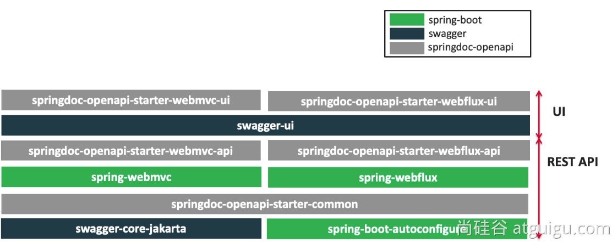
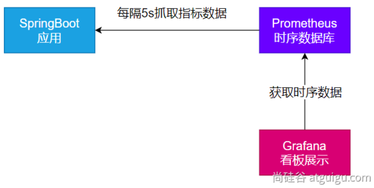

# 第08章_环境准备

## 1. 云服务器

购买云服务器 https://cloud.tencent.com

**注意：一定要配置防火墙，放行端口**


然后可以用XShell或windterm等远程登录工具登录云服务器。


## 2. 安装组件

我们一共需要安装docker、redis、kafka、prometheus、grafana这些组件。

### 2.1 安装docker

见Docker笔记。

### 2.2 通过docker-compose安装所有组件

创建`/prod`目录，在该目录下创建以下文件：

**prometheus.yml**

```yml
global:
  scrape_interval: 15s
  evaluation_interval: 15s

scrape_configs:
  - job_name: 'prometheus'
    static_configs:
      - targets: ['localhost:9090']

  - job_name: 'redis'
    static_configs:
      - targets: ['redis:6379']

  - job_name: 'kafka'
    static_configs:
      - targets: ['kafka:9092']
```

**docker-compose.yml**

```yml
version: '3.9'

services:
  redis:
    image: redis:latest
    container_name: redis
    restart: always
    ports:
      - "6379:6379"
    networks:
      - backend

  zookeeper:
    image: bitnami/zookeeper:latest
    container_name: zookeeper
    restart: always
    environment:
      ALLOW_ANONYMOUS_LOGIN: yes
      ZOOKEEPER_CLIENT_PORT: 2181
      ZOOKEEPER_TICK_TIME: 2000
    networks:
      - backend

  kafka:
    image: bitnami/kafka:3.4.0
    container_name: kafka
    restart: always
    depends_on:
      - zookeeper
    ports:
      - "9092:9092"
    environment:
      ALLOW_PLAINTEXT_LISTENER: yes
      KAFKA_CFG_ZOOKEEPER_CONNECT: zookeeper:2181
      KAFKA_OFFSETS_TOPIC_REPLICATION_FACTOR: 1
    networks:
      - backend
  
  kafka-ui:
    image: provectuslabs/kafka-ui:latest
    container_name:  kafka-ui
    restart: always
    depends_on:
      - kafka
    ports:
      - "8080:8080"
    environment:
      KAFKA_CLUSTERS_0_NAME: dev
      KAFKA_CLUSTERS_0_BOOTSTRAPSERVERS: kafka:9092
    networks:
      - backend

  prometheus:
    image: prom/prometheus:latest
    container_name: prometheus
    restart: always
    volumes:
      - ./prometheus.yml:/etc/prometheus/prometheus.yml
    ports:
      - "9090:9090"
    networks:
      - backend

  grafana:
    image: grafana/grafana:latest
    container_name: grafana
    restart: always
    depends_on:
      - prometheus
    ports:
      - "3000:3000"
    networks:
      - backend

networks:
  backend:
    name: backend
```

**启动环境**：

```shell
docker compose -f docker-compose.yml up -d
```

> 补充：redis的容器实例建议删除，然后按照Docker笔记中配置redis及其密码，否则redis服务器容易被攻击。

### 2.3 验证

- kafka-ui：访问`公网ip:8080`
- grafana：访问`公网ip:3000`，默认账号密码均为admin，第一次登录后需要修改密码(我们将密码修改为abc666)
- prometheus：访问`公网ip:9090`
- kafka：使用IDEA安装大数据插件，`公网ip:9092`
- redis：使用RedisInsight连接`公网ip:6379`，RedisInsight的下载地址为 https://redis.com/redis-enterprise/redis-insight/#insight-form


# 第09章_接口文档

## 1. OpenAPI 3 架构与 Swagger



Swagger 可以快速生成**实时接口文档**，方便前后端开发人员进行协调沟通，它遵循 OpenAPI 规范。

## 2. 整合

**（1）导入场景**

```xml
<dependency>
    <groupId>org.springdoc</groupId>
    <artifactId>springdoc-openapi-starter-webmvc-ui</artifactId>
    <version>2.1.0</version>
</dependency>
```

**（2）查看接口文档**

访问`http://ip:端口/swagger-ui/index.html`即可查看

**（3）配置文件**

一般无需额外配置，直接使用，效果就已经很好。以下配置只需了解一下常见配置项即可，无需使用：

```properties
# /api-docs endpoint custom path 默认 /v3/api-docs
springdoc.api-docs.path=/api-docs

# swagger 相关配置在  springdoc.swagger-ui
# swagger-ui custom path
springdoc.swagger-ui.path=/swagger-ui.html
springdoc.show-actuator=true
```

## 3. 使用

### 3.1 常用注解

**（1）@Tag**

标注在controller类上，可以描述该controller的作用：

- name：描述controller类的名称
- description：描述controller的作用

举例：

```java
@Tag(name = "部门", description = "部门的crud")
@RestController
public class DeptController {
}
```

**（2）@Parameter**

标注在参数上，可以描述参数：

- description：描述参数信息

举例：

```java
@Parameter(description = "部门id") Long id
```

**（3）@Parameters**

标注在参数上，作用是参数多重说明。

**（4）@Schema**

标注在实体类及其属性上，描述实体类信息：

- title：描述信息

举例：

```java
@Schema(title = "部门信息")
@Data
public class Dept {
    @Schema(title = "部门id")
    private Long id;
    @Schema(title = "部门名称")
    private String deptName;
}
```

**（5）@Operation**

标注在控制器方法上，用于描述方法的作用：

- summary：简要描述作用
- description：详细描述作用

举例：

```java
@Operation(summary = "按照id查询部门", description = "按照id查询部门，返回一个json类型的Dept对象")
@GetMapping("/dept/{id}")
public Dept getDept(@PathVariable("id") Long id) {
    return deptService.getDeptById(id);
}
```

**（6）@ApiResponse**

标注在控制器方法上，用于描述响应状态码等

### 3.2 Docket配置

如果我们有多个Controller，希望接口文档每个页面只展示一个Controller，这样看起来更加简单清楚。我们可以写一个配置类来进行配置：

```java
@Configuration
public class ApiUiConfig {
    @Bean
    public GroupedOpenApi employeeApi() {
        return GroupedOpenApi.builder()
                .group("员工管理")
                .pathsToMatch("/emp/**", "/emps")
                .build();
    }
    @Bean
    public GroupedOpenApi deptApi() {
        return GroupedOpenApi.builder()
                .group("部门管理")
                .pathsToMatch("/dept/**", "/depts")
                .build();
    }
}
```

### 3.3 OpenAPI配置

在配置类中添加组件配置OpenAPI，可以让界面展示更多额外信息：

```java
@Bean
public OpenAPI docsOpenAPI() {
    return new OpenAPI()
            .info(new Info()
                    .title("SpringBoot3-CRUD API")
                    .description("测试CRUD接口文档")
                    .version("v0.0.1")
                    .license(new License().name("Apache 2.0").url("http://springdoc.org")))
            .externalDocs(new ExternalDocumentation()
                    .description("哈哈 Wiki Documentation")
                    .url("https://springshop.wiki.github.org/docs"));
}
```

# 第10章_远程调用

## 1. RPC简介

**本地过程调用**，指的是在同一个JVM运行的不同方法间互相进行调用。

**远程过程调用**，简称RPC(Remote Procedure Call)，指的是`服务消费者`通过连接`服务提供者`的服务器进行请求/响应交互，来实现调用效果。

> 补充：API和SDK的区别
> - API是接口(Application Programming Interface)，它可以本地调用，也可以远程调用
> - SDK是工具包(Software Development Kit)，指的是本地导入jar包后，可以调用其中的方法

开发过程中，我们经常需要远程调用别人写的功能：

- 如果是内部微服务，可以通过依赖cloud、注册中心、openfeign等进行调用
- 如果是外部暴露的，可以发送http请求、或遵循外部协议进行调用

**SpringBoot提供了很多方式进行远程调用**：

（1）轻量级客户端方式

- RestTemplate：普通开发
- WebClient：响应式编程开发
- Http Interface：声明式编程

（2）Spring Cloud分布式解决方案

- Spring Cloud OpenFeign

（3）第三方框架

- Dubbo
- gRPC

## 2. WebClient

### 2.1 准备工作

我们先创建一个模块作为服务提供者，可以让服务消费者进行远程调用：

```java
@RestController
public class WeatherController {
    @GetMapping("/area-to-weather-date")
    public Weather getWeather(@RequestParam("area") String area,
                              @RequestHeader("userKey") String userKey) {
        if (!"wsy666".equals(userKey)) {
            return null;
        }
        return new Weather("晴朗", area);
    }
}
```

如上，需要在传递参数area，以及请求头中携带userKey=wsy666，才可以远程调用该接口。

### 2.2 WebClient的使用

WebClient是非阻塞、响应式的HTTP客户端，调用`WebClient.create()`或者`WebClient.create(String baseUrl)`即可创建。

我们创建一个模块来实现服务消费者：

**（1）添加依赖**

注意WebClient属于响应式Web，所以需要导入spring-boot-starter-webflux，而不是spring-boot-starter-web

```xml
<dependency>
    <groupId>org.springframework.boot</groupId>
    <artifactId>spring-boot-starter-webflux</artifactId>
</dependency>
<dependency>
    <groupId>org.springframework.boot</groupId>
    <artifactId>spring-boot-starter-test</artifactId>
    <scope>test</scope>
</dependency>
<dependency>
    <groupId>io.projectreactor</groupId>
    <artifactId>reactor-test</artifactId>
    <scope>test</scope>
</dependency>
```

**（2）controller**

```java
@RestController
public class WeatherClientController {
    @GetMapping("/weather")
    public Mono<String> weather(@RequestParam("area") String area) {
        // 远程调用流程：
        // 1. 创建WebClient
        WebClient client = WebClient.create();
        // 2. 准备数据
        Map<String, String> params = new HashMap<>();
        params.put("area", area);
        // 3. 发请求(远程调用api)
        Mono<String> mono = client.get() // 发起get请求
                .uri("http://127.0.0.1:8888/area-to-weather-date?area={area}", params)
                .accept(MediaType.APPLICATION_JSON) // 定义响应的内容类型为JSON
                .header("userKey", "wsy666") // 定义请求头
                .retrieve() // retrieve()方法用来声明如何提取响应数据
                .bodyToMono(String.class);// 返回值类型
        return mono;
    }
}
```

**（3）测试**

启动服务提供者和服务消费者，然后访问`http://localhost:8080/weather?area=shanghai`

## 3. Http Interface

Spring 允许我们通过定义接口的方式，给任意位置发送 http 请求，实现远程调用，可以用来简化 HTTP 远程访问，它同样需要响应式Web场景。使用方式如下：

**（1）添加依赖**

与之前的WebClient所需依赖相同

**（2）定义接口**

```java
public interface WeatherInterface {
    @GetExchange(url = "/area-to-weather-date", accept = "application/json")
    Mono<String> getWeather(@RequestParam("area") String area,
                            @RequestHeader("userKey") String userKey);
}
```

**（3）配置类**

```java
@Configuration
public class MyConfig {
    @Bean
    public WeatherInterface weatherInterface() {
        // 1. 创建WebClient
        WebClient client = WebClient.builder()
                .baseUrl("http://127.0.0.1:8888")
                .codecs(clientCodecConfigurer -> {
                    clientCodecConfigurer.defaultCodecs()
                            .maxInMemorySize(256 * 1024 * 1024);
                    // 响应数据量太大有可能超出BufferSize，所以这里设置的大一些
                }).build();
        // 2. 创建工厂
        HttpServiceProxyFactory factory = HttpServiceProxyFactory
                .builder(WebClientAdapter.forClient(client)).build();
        // 3. 获取代理对象
        WeatherInterface weatherAPI = factory.createClient(WeatherInterface.class);
        return weatherAPI;
    }
}
```

**（4）controller**

```java
@RestController
public class WeatherHttpController {
    @Autowired
    private WeatherInterface weatherInterface;

    @GetMapping("/weatherHttp")
    public Mono<String> weatherHttp(@RequestParam("area") String area) {
        // 测试调用
        Mono<String> result = weatherInterface.getWeather(area, "wsy666");
        return result;
    }
}
```

**（5）测试**

启动服务提供者和服务消费者，然后访问`http://localhost:8080/weatherHttp?area=shanghai`


# 第11章_消息服务

## 1. Kafka简介

### 1.1 消息模式

**消息点对点模式**


**消息发布订阅模式**


### 1.2 Kafka工作原理


### 1.3 Kafka的简单操作

（1）访问`ip:port`登录Kafka的Web操作页面

（2）创建一个Topic


（3）发送消息


## 2. SpringBoot整合Kafka

### 2.1 KafkaAutoConfiguration

导入Kafka场景：

```xml
<dependency>  
    <groupId>org.springframework.kafka</groupId>  
    <artifactId>spring-kafka</artifactId>  
</dependency>
<dependency>  
    <groupId>org.springframework.kafka</groupId>  
    <artifactId>spring-kafka-test</artifactId>  
    <scope>test</scope>  
</dependency>
```

KafkaAutoConfiguration给我们提供了以下功能：

**（1）KafkaProperties：Kafka的所有配置，以spring.kafka为前缀**

- bootstrap-servers：Kafka集群的所有服务器地址
- properties：参数设置
- consumer：消费者
- producer：生产者

**（2）@EnableKafka：开启Kafka的注解驱动**

**（3）组件KafkaTemplate：用于发送消息**

**（4）组件KafkaAdmin：用于管理Kafka，比如创建topic等**

### 2.2 KafkaTemplate发送消息

> 说明：由于我们使用Docker启动Kafka，可能会有一些错误，所以需要在`C:\Windows\System32\drivers\etc`下的hosts文件中添加`公网ip kafka`以及`公网ip b4b27b192b76`(b4b27b192b76是kafka的容器id)

在配置文件中配置Kafka的服务器地址和端口号：

```properties
spring.kafka.bootstrap-servers=公网ip:9092
```

**发送字符串消息**

```java
@SpringBootTest
class Boot312MessageApplicationTests {
    @Autowired
    private KafkaTemplate kafkaTemplate;

    @Test
    void test01() {
        StopWatch stopWatch = new StopWatch(); // 计时秒表
        CompletableFuture[] futures = new CompletableFuture[10000];

        stopWatch.start();
        for (int i = 0; i < 10000; i++) {
            // 向名为news的topic发送消息
            CompletableFuture future = kafkaTemplate.send(
                    "news", "haha" + i, "哈哈哈" + i);
            futures[i] = future;
        }
        CompletableFuture.allOf(futures).join();
        stopWatch.stop();

        long millis = stopWatch.getTotalTimeMillis();
        System.out.println("10000个消息发送完成，耗时ms为：" + millis);
    }
}
```

**发送对象消息**

需要在配置文件中配置JSON序列化器：

```properties
# 序列化器，默认为StringSerializer
## 配置key的序列化器
spring.kafka.producer.key-serializer=org.apache.kafka.common.serialization.StringSerializer
## 配置value的序列化器
spring.kafka.producer.value-serializer=org.springframework.kafka.support.serializer.JsonSerializer
```

```java
@SpringBootTest
class Boot312MessageApplicationTests {
    @Autowired
    private KafkaTemplate kafkaTemplate;

    @Test // 发送对象
    public void test02() {
        CompletableFuture future = kafkaTemplate.send("news", "person",
                new Person(1L, "张三", "zs@qq.com"));
        future.join();
        System.out.println("消息发送成功");
    }
}
```

### 2.3 @EnableKafka

在主程序类上标注@EnableKafka，表示开启Kafka的注解驱动。然后我们在配置类中就可以给Kafka添加Topic：

```java
@Configuration
public class MyKafkaConfig {
    @Bean // 添加Topic
    public NewTopic topicThing() {
        return TopicBuilder.name("thing")
                .partitions(1)
                .compact()
                .build();
    }
}
```

### 2.4 @KafkaListener

开启@EnableKafka后，使用@KafkaListener可以监听消息(消费者接收消息，必须有groupId)：

```java
@Component
@Slf4j
public class MyListener {
    // 默认从消息队列最后一个开始监听，所以只能监听新的消息
    @KafkaListener(topics = "news", groupId = "thu")
    public void listenNews(ConsumerRecord record) {
        // 获取消息的各种详细信息
        String topic = record.topic();
        Object key = record.key();
        Object value = record.value();
        log.info("thu收到消息，key={}, value={}", key, value);
    }

    // 设置监听分区和偏移量，可以获得到以前的消息
    // 注意两个监听器的groupId要设置成不一样的：
    // 因为如果相同，它们就是竞争关系，只能监听不同分区的消息
    @KafkaListener(groupId = "pku", topicPartitions = {
            @TopicPartition(topic = "news", partitionOffsets = {
                    @PartitionOffset(partition = "0", initialOffset = "0")
            })
    })
    public void listenAll(ConsumerRecord record) {
        Object key = record.key();
        Object value = record.value();
        log.info("pku收到消息，key={}, value={}", key, value);
    }
}
```

# 第12章_Web安全

## 1. 安全架构

### 1.1 三大核心

**（1）认证(Authentication)**：检查用户是否登录

**（2）授权(Authorization)**：用户的权限管理

**（3）攻击防护**

- XSS（Cross-site scripting）
- CSRF（Cross-site request forgery）
- CORS（Cross-Origin Resource Sharing）
- SQL注入

### 1.2 权限模型

#### RBAC(Role Based Access Controll)

有用户、角色、权限，以及它们之间关联的中间表。

（1）用户表（t_user）

|id|username|password|
|--|--------|--------|
|1 |zhangsan|123456  |
|2 |lisi    |123456  |

（2）角色表（t_role）

|id|role_name|
|--|---------|
|1 |admin    |
|2 |hr       |
|3 |common   |

（3）权限表（t_permission）

|id|perm        |
|--|------------|
|1 |file_r      |
|2 |file_w      |
|3 |file_x      |
|4 |order_query |
|5 |order_create|

（4）用户_角色表（t_user_role）

|id|username|role_name|
|--|--------|---------|
|1 |zhangsan|admin    |
|2 |zhangsan|common   |
|3 |lisi    |hr       |
|4 |lisi    |common   |

（5）角色_权限表（t_role_perm）

|id|role_name|perm        |
|--|---------|------------|
|1 |admin    |file_r      |
|2 |admin    |file_w      |
|3 |admin    |file_x      |
|4 |admin    |order_query |
|5 |admin    |order_create|
|6 |hr       |file_r      |

#### ACL(Access Controll List)

用户直接和权限挂钩，没有角色表。

（1）用户表（t_user）

|id|username|password|
|--|--------|--------|
|1 |zhangsan|123456  |
|2 |lisi    |123456  |

（2）权限表（t_permission）

|id|perm        |
|--|------------|
|1 |file_r      |
|2 |file_w      |
|3 |file_x      |
|4 |order_query |
|5 |order_create|

（3）用户_权限表（t_user_perm）

|id|role_name|perm        |
|--|---------|------------|
|1 |zhangsan |file_r      |
|2 |zhangsan |file_w      |
|3 |zhangsan |file_x      |
|4 |zhangsan |order_query |
|5 |zhangsan |order_create|
|6 |lisi     |file_r      |

## 2. SpringSecurity原理

### 2.1 过滤器链架构

Spring Security利用 FilterChainProxy 封装一系列拦截器链，实现各种安全拦截功能。


### 2.2 FilterChainProxy


### 2.3 SecurityFilterChain


## 3. SpringSecurity实战

### 3.1 自动配置原理

添加依赖：

```xml
<dependencies>
    <dependency>
        <groupId>org.springframework.boot</groupId>
        <artifactId>spring-boot-starter-security</artifactId>
    </dependency>
    <dependency>
        <groupId>org.springframework.boot</groupId>
        <artifactId>spring-boot-starter-thymeleaf</artifactId>
    </dependency>
    <dependency>
        <groupId>org.springframework.boot</groupId>
        <artifactId>spring-boot-starter-web</artifactId>
    </dependency>
    <dependency>
        <groupId>org.thymeleaf.extras</groupId>
        <artifactId>thymeleaf-extras-springsecurity6</artifactId>
    </dependency>
    <dependency>
        <groupId>org.projectlombok</groupId>
        <artifactId>lombok</artifactId>
        <optional>true</optional>
    </dependency>
    <dependency>
        <groupId>org.springframework.boot</groupId>
        <artifactId>spring-boot-starter-test</artifactId>
        <scope>test</scope>
    </dependency>
    <dependency>
        <groupId>org.springframework.security</groupId>
        <artifactId>spring-security-test</artifactId>
        <scope>test</scope>
    </dependency>
</dependencies>

<build>
    <plugins>
        <plugin>
            <groupId>org.springframework.boot</groupId>
            <artifactId>spring-boot-maven-plugin</artifactId>
            <configuration>
                <excludes>
                    <exclude>
                        <groupId>org.projectlombok</groupId>
                        <artifactId>lombok</artifactId>
                    </exclude>
                </excludes>
            </configuration>
        </plugin>
    </plugins>
</build>
```

Security场景的自动配置类有两个：

- SecurityFilterAutoConfiguration，它的主要作用是给容器中放了DelegatingFilterProxyRegistrationBean组件
- SecurityAutoConfiguration。它开启了SecurityProperties属性绑定，绑定以spring.security为前缀的配置项。除此之外，它还导入了**SpringBootWebSecurityConfiguration**配置类。

SpringBootWebSecurityConfiguration的作用如下：

**（1）给容器中放了默认的SecurityFilterChain组件**，源码如下：

```java
@Bean
@Order(2147483642)
SecurityFilterChain defaultSecurityFilterChain(HttpSecurity http) throws Exception {
    ((AuthorizeHttpRequestsConfigurer.AuthorizedUrl)http.authorizeHttpRequests().anyRequest()).authenticated();
    http.formLogin();
    http.httpBasic();
    return (SecurityFilterChain)http.build();
}
```

提供了三个功能：

- 使得所有请求都需要登录认证
- 开启默认表单登录：即提供了一个默认登录页面，未经登录的所有请求都跳转到该页面
- 开启httpbasic方式的登录

**（2）使@EnableWebSecurity注解生效**，其主要作用如下：

- 导入了WebSecurityConfiguration：web安全配置类
- 导入了HttpSecurityConfiguration：http安全配置类
- 开启了@EnableGlobalAuthentication：全局认证生效(该注解导入了AuthenticationConfiguration)

### 3.2 前端页面

首页index.html

```html
<!DOCTYPE html>
<html lang="en" xmlns:th="http://www.thymeleaf.org">
<head>
    <meta charset="UTF-8">
    <title>Title</title>
</head>
<body>
    Welcome!<br>
    <a th:href="@{/hello}">hello</a>
    <a th:href="@{/world}">world</a>
</body>
</html>
```

登录页login.html

```html
<!DOCTYPE html>
<html xmlns="http://www.w3.org/1999/xhtml" xmlns:th="https://www.thymeleaf.org">
<head>
    <title>Spring Security Example</title>
</head>
<body>
<div th:if="${param.error}">Invalid username and password.</div>
<div th:if="${param.logout}">You have been logged out.</div>
<form th:action="@{/login}" method="post">
    <div>
        <label> User Name : <input type="text" name="username" /> </label>
    </div>
    <div>
        <label> Password: <input type="password" name="password" /> </label>
    </div>
    <div><input type="submit" value="Sign In" /></div>
</form>
</body>
</html>
```

### 3.3 controller

LoginController：作用是接收/login请求，转发到login.html页面

```java
@Controller
public class LoginController {
    @GetMapping("/login")
    public String loginPage() {
        return "login";
    }
}
```

HelloController

```java
@RestController
public class HelloController {
    @GetMapping("/hello")
    public String hello() {
        return "hello! Spring Security";
    }

    @PreAuthorize("hasAuthority('file_write')")
    @GetMapping("/world")
    public String world() {
        return "hello! world!!!!";
    }
}
```

说明：`@PreAuthorize("hasAuthority('file_write')")`的意思是，该用户必须拥有名为`file_write`的权限，才会执行该方法。注意，使用该注解，必须在配置类上开启`@EnableMethodSecurity`。

### 3.4 配置类(核心)

```java
@EnableMethodSecurity // 开启方法级别的精确权限控制
@Configuration
public class AppSecurityConfiguration {
    @Bean
    public SecurityFilterChain securityFilterChain(HttpSecurity http) throws Exception {
        http.authorizeHttpRequests(registry -> {
            registry.requestMatchers("/").permitAll() // 1. 访问首页无需认证
                    .anyRequest().authenticated(); // 2. 其余请求都需要认证(登录)
        });
        // 3. 开启表单登录功能
        // http.formLogin(); // 开启默认的表单登录(SpringSecurity提供默认的登录页)
        http.formLogin(formLogin -> {
            formLogin.loginPage("/login").permitAll(); // 自定义登录页请求(允许所有人访问)
        });
        return http.build();
    }

    @Bean // 密码加密器
    public PasswordEncoder passwordEncoder() {
        return new BCryptPasswordEncoder();
    }

    @Bean // 查询用户详情
    public UserDetailsService userDetailsService(PasswordEncoder passwordEncoder) {
        // 为了简便，我们不连数据库了，而是直接在内存中保存用户
        UserDetails user1 = User.withUsername("zhangsan")
                .password(passwordEncoder.encode("123456"))
                .roles("admin", "hr")
                .authorities("file_read", "file_write")
                .build();
        UserDetails user2 = User.withUsername("lisi")
                .password(passwordEncoder.encode("123456"))
                .roles("hr")
                .authorities("file_read")
                .build();
        InMemoryUserDetailsManager manager = new InMemoryUserDetailsManager(user1, user2);
        return manager;
    }
}
```

**SecurityFilterChain**

由于SpringSecurity给容器中放了默认的SecurityFilterChain组件，其作用是使得所有请求都需要登录认证，但我们希望访问首页时，无需登录认证，所以我们必须自己配置一个SecurityFilterChain。

**UserDetailsService**

如果我们不配置用户信息，则默认的登录账号为user，登录密码会打印在控制台。为了简便，我们不连接数据库，直接在内存中配置用户，其中我们赋予了zhangsan两个权限：file_read、file_write，而只赋予了lisi一个权限：file_read。

### 3.5 测试

zhangsan既能访问hello，又能访问world。而lisi只能访问hello。


# 第13章_可观测性

## 1. Actuator场景

可观测性(Observability)：对线上应用进行观测、监控、预警

- 健康状况(Health)：组件状态、存活状态等
- 运行指标(Metrics)：cpu、内存、垃圾回收、吞吐量、响应成功率等
- 链路追踪

**（1）添加依赖**

```xml
<dependency>
    <groupId>org.springframework.boot</groupId>
    <artifactId>spring-boot-starter-actuator</artifactId>
</dependency>
```

**（2）配置文件中暴露指标**

```properties
# 是否暴露所有端点信息，默认值就是true
management.endpoints.enabled-by-default=true
# 以web方式暴露的端点，默认只暴露health端点
management.endpoints.web.exposure.include=*
```

**（3）访问数据**

- 展示出所有可以用的监控端点，http://localhost:8080/actuator
- http://localhost:8080/actuator/beans
- http://localhost:8080/actuator/configprops
- http://localhost:8080/actuator/metrics
- http://localhost:8080/actuator/metrics/jvm.gc.pause

> 总结：http://localhost:8080/actuator/endpointName/detailPath

## 2. Endpoint

### 2.1 常用端点

**重点关注：threaddump、heapdump、metrics(运行时指标)、health(健康状况)**

- auditevents：暴露当前应用程序的审核事件信息。需要一个AuditEventRepository组件。
- beans：显示应用程序中所有Spring Bean的完整列表。
- caches：暴露可用的缓存。
- conditions：显示自动配置的所有条件信息，包括匹配或不匹配的原因。
- configprops：显示所有@ConfigurationProperties。
- env：暴露Spring的属性ConfigurableEnvironment
- flyway：显示已应用的所有Flyway数据库迁移。需要一个或多个Flyway组件。
- **health**：显示应用程序运行状况信息。
- httptrace：显示HTTP跟踪信息（默认情况下，最近100个HTTP请求-响应）。需要一个HttpTraceRepository组件。
- info：显示应用程序信息。
- integrationgraph：显示Spring integrationgraph。需要依赖spring-integration-core。
- loggers：显示和修改应用程序中日志的配置。
- liquibase：显示已应用的所有Liquibase数据库迁移。需要一个或多个Liquibase组件。
- **metrics**：显示当前应用程序的“指标”信息。
- mappings：显示所有@RequestMapping路径列表。
- scheduledtasks：显示应用程序中的计划任务。
- sessions：允许从Spring Session支持的会话存储中检索和删除用户会话。需要使用Spring Session的基于Servlet的Web应用程序。
- shutdown：使应用程序正常关闭。默认禁用该端点。
- startup：显示由ApplicationStartup收集的启动步骤数据。需要使用SpringApplication进行配置BufferingApplicationStartup。
- **threaddump**：执行线程转储。
- **heapdump**：返回hprof堆转储文件。
- jolokia：通过HTTP暴露JMX bean（需要引入Jolokia，不适用于WebFlux）。需要引入依赖jolokia-core。
- logfile：返回日志文件的内容（如果已设置logging.file.name或logging.file.path属性）。支持使用HTTPRange标头来检索部分日志文件的内容。
- prometheus：以Prometheus服务器可以抓取的格式公开指标。需要依赖micrometer-registry-prometheus。

### 2.2 定制健康监控端点HealthEndpoint

健康监控：返回存活、死亡

我们先定义一个组件MyHaha：

```java
@Component
public class MyHaha {
    public int check() {
        Random random = new Random();
        return random.nextInt(0, 2);
    }
}
```

然后定制一个健康监控端点，来监控该组件的健康状况：

```java
@Component
public class MyHahaHealthIndicator extends AbstractHealthIndicator {
    @Autowired
    private MyHaha myHaha;

    @Override // 自定义健康检查方法
    protected void doHealthCheck(Health.Builder builder) throws Exception {
        int check = myHaha.check();
        if (check == 1) {
            // 存活
            builder.up()
                    .withDetail("code", "1000")
                    .withDetail("msg", "活的很健康")
                    .withDetail("data", "我的名字叫haha")
                    .build();
        } else {
            // 下线
            builder.down()
                    .withDetail("code", "1111")
                    .withDetail("msg", "下线啦~~")
                    .withDetail("data", "我的名字叫haha，完蛋！")
                    .build();
        }
    }
}
```

> 定制健康端点，需要创建一个类来实现HealthIndicator接口，从而定制组件的健康状态对象(Health)返回。当然，也可以像上面一样，直接继承AbstractHealthIndicator。

除此之外，我们需要在配置文件中添加

```properties
# 是否暴露health端点，默认值就是true
management.endpoint.health.enabled=true
# 配置health端点总是显示详细信息，可显示每个模块的状态信息
management.endpoint.health.show-details=always
```

最后访问`http://localhost:8080/actuator/health`即可查看效果。


### 2.3 定制指标监控端点MetricsEndpoint

指标监控：次数、率

我们定义一个组件MyHello：

```java
@Component
public class MyHello {
    private Counter counter = null; // 计数器

    /**
     * 通过有参构造器注入meterRegistry，来保存和统计所有指标
     * @param meterRegistry
     */
    public MyHello(MeterRegistry meterRegistry) {
        // 得到一个名叫MyHello.hello的计数器
        counter = meterRegistry.counter("MyHello.hello");
    }
    public void hello() {
        System.out.println("hello");
        // 该方法被调用，计数器就加一
        counter.increment();
    }
}
```

我们要监控它的hello()方法被调用了多少次，所以再写一个controller：

```java
@RestController
public class HelloController {
    @Autowired
    private MyHello myHello;

    @GetMapping("/hello")
    public String hello() {
        // 业务方法
        myHello.hello();
        return "haha";
    }
}
```

多次访问`http://localhost:8080/hello`后，可以查看`http://localhost:8080/actuator/metrics/MyHello.hello`中的监控指标。

## 3. 监控案例

### 3.1 Prometheus和Grafana

我们之前已经安装过Prometheus和Grafana，接下来将使用SpringBoot整合Prometheus和Grafana来完成线上应用指标监控系统



整合流程如下：

### 3.2 部署SpringBoot应用到服务器

（1）添加依赖

```xml
<dependency>
    <groupId>org.springframework.boot</groupId>
    <artifactId>spring-boot-starter-actuator</artifactId>
</dependency>
<dependency>
    <groupId>io.micrometer</groupId>
    <artifactId>micrometer-registry-prometheus</artifactId>
</dependency>
```

（2）配置文件

```properties
server.port=9999
# 暴露所有端点信息
management.endpoints.enabled-by-default=true
# 以web方式暴露
management.endpoints.web.exposure.include=*
```

（3）测试

访问`http://localhost:9999/actuator/prometheus`能返回prometheus格式的所有指标，就表示成功

（4）将该SpringBoot工程打成jar包，上传到服务器

（5）服务器配置java环境

```shell
mkdir -p /opt/java
cd /opt/java
wget https://download.oracle.com/java/17/latest/jdk-17_linux-x64_bin.tar.gz
tar -xzf jdk-17_linux-x64_bin.tar.gz -C /opt/java/
vim /etc/profile
######### 末尾加入以下内容
export JAVA_HOME=/opt/java/jdk-17.0.8
export PATH=$PATH:$JAVA_HOME/bin
#########
source /etc/profile
```

（6）cd到我们自己工程jar包所在的目录，执行以下命令后台启动java应用：

```shell
nohup java -jar boot3-14-actuator-0.0.1-SNAPSHOT.jar > output.log 2>&1 &
```

（7）测试

- 用浏览器访问`公网ip:9999/actuator/prometheus`
- 如果在本机访问，可以直接访问内网ip，这样速度更快，如下测试
  ```shell
  curl http://10.0.8.3:9999/actuator/prometheus
  ```

### 3.3 配置Prometheus拉取数据

（8）配置Prometheus拉取数据，修改prometheus.yml配置文件，`vim /prod/prometheus.yml`，在scrape_configs属性下添加如下内容：

```yml
  - job_name: 'spring-boot-demo'
    metrics_path: '/actuator/prometheus' #指定抓取的路径
    static_configs:
      - targets: ['10.0.8.3:9999']
        labels:
          nodename: 'app-demo'
```

（9）重启prometheus，`docker restart prometheus`，然后访问`http://公网ip:9090/targets`，确保prometheus已经能够拉取我们应用的指标数据

### 3.4 配置Grafana监控面板

（10）访问`http://公网ip:3000`，添加prometheus数据源


（11）添加监控面板。可以去dashboard市场找一个自己喜欢的面板添加。


