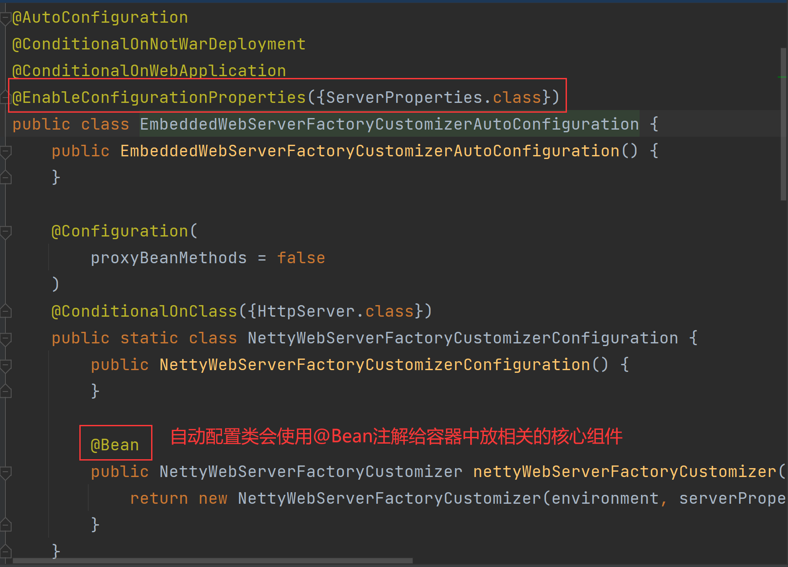
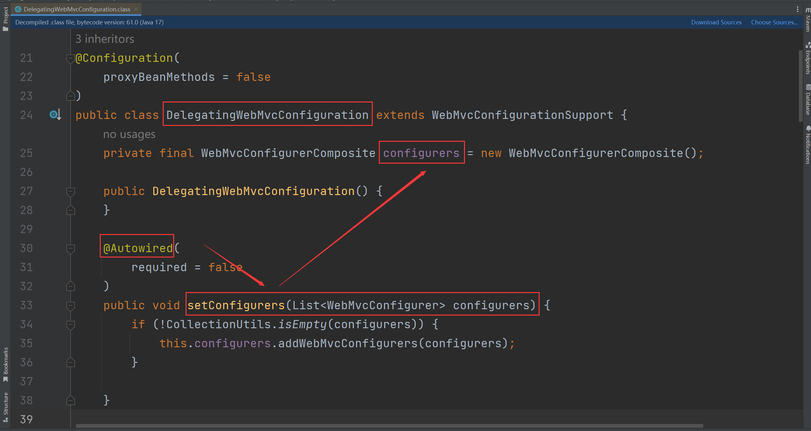
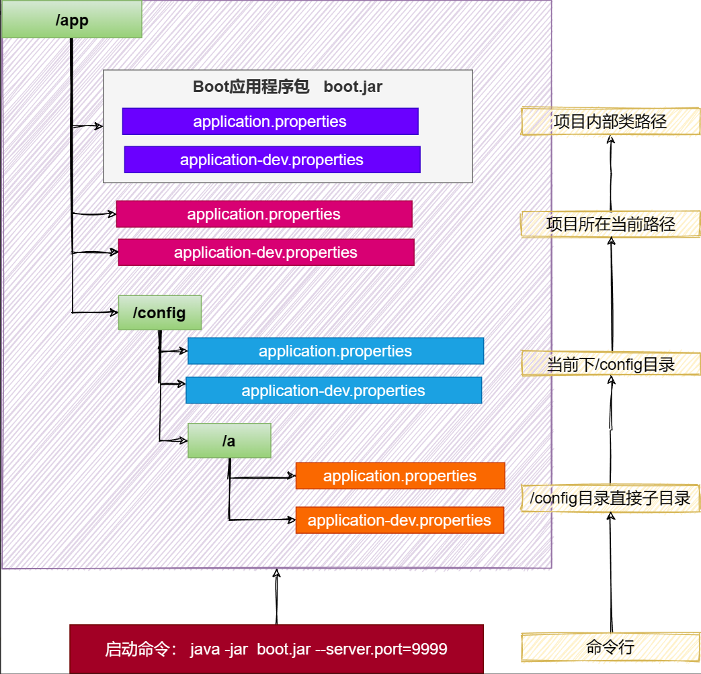
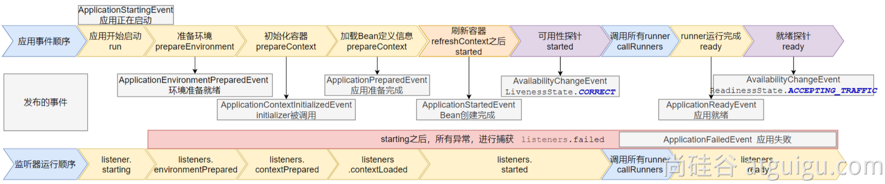
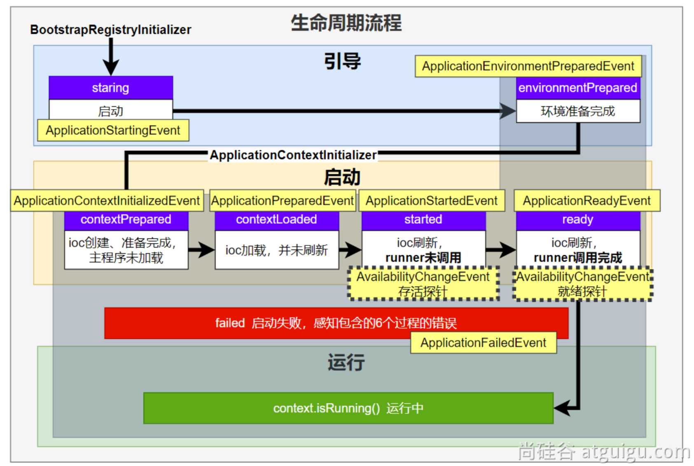

# 第01章_SpringBoot基础

## 1. SpringBoot简介

### 1.1 SpringBoot是什么

SpringBoot 是帮我们简单、快速地创建一个独立的、生产级别的 Spring 应用（SpringBoot底层是Spring）。大多数 SpringBoot 应用只需要编写少量配置即可快速整合 Spring 平台以及第三方技术。

特性：
- 快速创建独立 Spring 应用，无需像SSM一样导包、写配置后才能启动运行
- 直接嵌入Tomcat、Jetty或Undertow等Servlet容器（无需部署war包）。所以服务器上只需要有java环境就可以运行。
- 提供可选的场景启动器(starter)，简化应用整合
- 按需自动配置 Spring 以及 第三方库
  - 如果这些场景我要使用（生效），这个场景的所有配置都会自动配置好。
  - 约定大于配置：每个场景都有很多默认配置。
  - 自定义：配置文件中修改几项就可以
- 提供生产级特性：如 监控指标、健康检查、外部化配置等

> 总结：简化开发，简化配置，简化整合，简化部署，简化监控，简化运维。

### 1.2 时代背景

#### 1、微服务

微服务架构是一种架构模式，它提倡将单一应用程序划分成一组小型服务，服务之间相互协调配合。每个服务运行在其独立的进程中，服务与服务间采用轻量级的通信机制互相协作(通常是基于HTTP协议的RESTful API)。每个服务都围绕着具体业务进行构建，并且能够被独立地部署到生产环境。除此之外，应当尽量避免统一、集中式的服务管理机制，对具体的一个服务而言，应该根据业务上下文来选择合适的语言、工具对其进行构建。

#### 2、分布式

**分布式的困难**：

- 远程调用
- 服务发现
- 负载均衡
- 服务容错
- 配置管理
- 服务监控
- 链路追踪
- 日志管理
- 任务调度

**分布式的解决方案**：SpringBoot+SpringCloud

#### 3、云原生

原生应用上云的困难：

- 服务自愈
- 弹性伸缩
- 服务隔离
- 自动化部署
- 灰度发布
- 流量治理

## 2. 入门案例

> 场景：浏览器发送/hello请求，返回"Hello,Spring Boot 3!"

### 2.1 创建项目

**创建一个空项目**


**创建一个普通的maven工程**


**在pom.xml中添加：**

```xml
<!-- 所有springboot项目都必须继承自spring-boot-starter-parent -->
<parent>
    <groupId>org.springframework.boot</groupId>
    <artifactId>spring-boot-starter-parent</artifactId>
    <version>3.1.2</version>
</parent>
```

### 2.2 导入场景

**在pom.xml中添加：**

```xml
<dependencies>
    <!-- web开发的场景启动器 -->
    <dependency>
        <groupId>org.springframework.boot</groupId>
        <artifactId>spring-boot-starter-web</artifactId>
    </dependency>
</dependencies>
```

### 2.3 主程序

在com.thuwsy.boot包下创建一个类作为主程序入口

```java
@SpringBootApplication
public class MainApplication {
    public static void main(String[] args) {
        SpringApplication.run(MainApplication.class, args);
    }
}
```

### 2.4 业务

在com.thuwsy.boot.controller包下创建一个控制层类

```java
@RestController
public class HelloController {
    @GetMapping("/hello")
    public String hello() {
        return "Hello, Spring Boot 3!";
    }
}
```

### 2.5 测试

访问`http://localhost:8080/hello`即可查看效果

### 2.6 打包

**在pom.xml中添加**：

```xml
<!-- SpringBoot应用打包插件 -->
<build>
    <plugins>
        <plugin>
            <groupId>org.springframework.boot</groupId>
            <artifactId>spring-boot-maven-plugin</artifactId>
        </plugin>
    </plugins>
</build>
```

mvn clean package把项目打成可执行的jar包：


可以将该jar包复制到任意目录，然后在该目录下命令行输入以下命令即可启动项目：

```shell
java -jar boot3-01-demo-1.0-SNAPSHOT.jar
```

### 2.7 小结

#### 1、简化整合

由场景启动器，导入相关的场景，就拥有相关的功能。

- 官方提供的场景，命名为：`spring-boot-starter-*`
- 第三方提供的场景，命名为：`*-spring-boot-starter`


#### 2、简化开发

无需编写任何配置，直接开发业务

#### 3、简化配置

在resources目录下创建属性文件`application.properties`
- 集中式管理配置，只需要修改这个文件就行
- 配置基本都有默认值

#### 4、简化部署

打包为可执行的jar包，所以Linux服务器上只需要有java环境即可运行。

#### 5、简化运维

修改配置（外部放一个application.properties文件）、监控、健康检查。

### 2.8 Spring Initializr 创建向导

一键创建SpringBoot工程：


> 推荐勾选以下内容：
> - Spring Web
> - Thymeleaf
> - Lombok
> - MySQL Driver
> - MyBatis Framework
> - Spring Data Redis (Access+Driver)

## 3. 常用注解

### 3.1 定义配置类

1. 定义一个配置类，使用@Configuration注解
2. 在配置类中，可以使用@Bean注解给容器中注册组件
3. 对于第三方的组件，可以在配置类上使用@Import注册到容器中

```java
@SpringBootConfiguration // 这是一个SpringBoot配置类
// @Configuration // 普通配置类
public class AppConfig {
    @Bean
    public User user() {
        User user = new User();
        user.setId(1L);
        user.setName("张三");
        return user;
    }
}
```

**说明**：
- `@Configuration`和`@SpringBootConfiguration`功能上没有区别，只是给程序员看的。一般用后者标识通用的配置类，用前者标识普通的配置类。
- 配置类本身也是容器中的组件，查看@Configuration源码可以发现就有@Component注解。

**注意**：如果想把第三方的组件注册给IOC容器，有以下两种方式：

方式1：

```java
@SpringBootConfiguration
public class AppConfig {
    @Bean
    public FastsqlException fastsqlException() {
        return new FastsqlException();
    }
}
```

方式2(推荐)：

```java
@Import(FastsqlException.class) // 给容器中放指定类型的组件，其bean id默认是全类名
@SpringBootConfiguration
public class AppConfig {

}
```

### 3.2 条件注解

如果注解指定的条件成立，则进行组件注册。格式`@ConditionalOnXxx`，如：

- `@ConditionalOnClass`：如果类路径中存在这个类，则进行组件注册
- `@ConditionalOnMissingClass`：如果类路径中不存在这个类，则进行组件注册
- `@ConditionalOnBean`：如果容器中存在这个Bean，则进行组件注册
- `@ConditionalOnMissingBean`：如果容器中不存在这个Bean，则进行组件注册

场景：如果存在FastsqlException这个类，给容器中放一个Cat组件，名cat01；否则，就给容器中放一个Dog组件，名dog01。如果系统中有dog01这个组件，就给容器中放一个 User组件，名zhangsan；否则，就放一个User，名叫lisi。

```java
@SpringBootConfiguration
public class AppConfig2 {

    @ConditionalOnClass(name = "com.alibaba.druid.FastsqlException")
    @Bean
    public Cat cat01() {
        return new Cat();
    }

    @ConditionalOnMissingClass(value = "com.alibaba.druid.FastsqlException")
    @Bean
    public Dog dog01() {
        return new Dog();
    }

    @ConditionalOnBean(value = Dog.class)
    @Bean
    public User zhangsan() {
        return new User();
    }

    @ConditionalOnMissingBean(value = Dog.class)
    @Bean
    public User lisi() {
        return new User();
    }

}
```

注意：
- 条件注解放在方法级别，则单独对这个方法进行注解判断
- 条件注解放在类级别，则只有注解判断生效，整个配置类才生效

> 补充：`@ConditionalOnBean(value=组件类型, name=组件名字)`表示如果容器中有这个类型的组件，且名字是指定的值，才进行组件注册


### 3.3 属性绑定

#### 1、@ConfigurationProperties

该注解用于声明**组件的属性和配置文件哪些前缀开始项进行绑定**。

将容器中任意组件（Bean）的属性值和配置文件的配置项的值进行绑定，步骤如下：

1. 必须将该组件注册到容器中（@Component或@Bean）
2. 使用@ConfigurationProperties声明组件和配置文件的哪些配置项进行绑定

**举例(方式1)**：

- 使用@Component注解，@ConfigurationProperties中`prefix = "pig"`表示和配置文件中前缀为pig的配置项进行绑定
    ```java
    @ConfigurationProperties(prefix = "pig")
    @Component
    public class Pig {
        private Long id;
        private String name;
        private Integer age;

        // getXxx、setXxx、toString方法...
    }
    ```

- 配置文件application.properties中的内容
    ```properties
    pig.id=1
    pig.name=佩奇
    pig.age=5
    ```

- 测试
    ```java
    @SpringBootApplication
    public class Boot302DemoApplication {
        public static void main(String[] args) {
            var ioc = SpringApplication.run(Boot302DemoApplication.class, args);

            Pig pig = ioc.getBean(Pig.class);
            System.out.println(pig);
            // Pig{id=1, name='佩奇', age=5}
        }
    }
    ```

**举例(方式2)**：

- 在SpringBoot配置类中，使用@Bean和@ConfigurationProperties
    ```java
    @SpringBootConfiguration 
    public class AppConfig {

        @ConfigurationProperties(prefix = "pig")
        @Bean
        public Pig pig(){
            return new Pig();
        }
    }
    ```

#### 2、@EnableConfigurationProperties

这是一个快速注册属性绑定的注解。仍以上面的例子为例：

- 在Pig类上标识@ConfigurationProperties进行属性绑定
    ```java
    @ConfigurationProperties(prefix = "pig")
    public class Pig {
        private Long id;
        private String name;
        private Integer age;

        // getXxx、setXxx、toString方法...
    }
    ```

- 在配置类上使用@EnableConfigurationProperties即可快速注册(**有两个作用：开启Pig组件的属性绑定、默认会把这个组件自己放到容器中**)
    ```java
    @EnableConfigurationProperties(Pig.class)
    @SpringBootConfiguration
    public class AppConfig {

    }
    ```

该注解的**应用场景**：由于SpringBoot默认只扫描自己主程序所在的包。如果导入第三方包，即使组件上标注了 @Component、@ConfigurationProperties注解，也没用。因为组件都扫描不进来，此时使用这个注解就可以快速进行属性绑定并把组件注册进容器。


## 4. YAML配置文件

SpringBoot采用集中化管理配置，即使用配置文件`application.properties`，但配置多以后难阅读和修改，层级结构辨识度不高。

YAML 是 "YAML Ain't a Markup Language"（YAML 不是一种标记语言）。在开发这种语言时，YAML 的意思其实是："Yet Another Markup Language"（是另一种标记语言）。
- 设计目标，就是方便人类读写
- 层次分明，更适合做配置文件
- 使用.yaml或.yml作为文件后缀

### 4.1 基本语法

- 大小写敏感
- 使用缩进表示层级关系，`k: v`，使用冒号和空格分割k和v
- 缩进时不允许使用Tab键，只允许使用空格
- 缩进的空格数目不重要，只要相同层级的元素左侧对齐即可。一般建议缩进2个空格。
- `#`表示注释，从这个字符一直到行尾，都会被解析器忽略。

### 4.2 示例

实体类：

```java
@Component
@ConfigurationProperties(prefix = "person") // 和配置文件person前缀的所有配置进行绑定
@Data
public class Person {
    private String name;
    private Integer age;
    private Date birthDay;
    private Boolean like;
    private Child child; //嵌套对象
    private List<Dog> dogs; //数组（里面是对象）
    private Map<String,Cat> cats; //表示Map
}

@Data
public class Child {
    private String name;
    private Integer age;
    private Date birthDay;
    private List<String> text; //数组
}

@Data
public class Dog {
    private String name;
    private Integer age;
}

@Data
public class Cat {
    private String name;
    private Integer age;
}
```

说明：@Data注解需要导入lombok依赖：

```xml
    <dependency>
        <groupId>org.projectlombok</groupId>
        <artifactId>lombok</artifactId>
        <optional>true</optional>
    </dependency>
```

#### 4.2.1 properties表示法

application.properties文件

```properties
person.name=张三
person.age=18
person.birthDay=2010/10/12 12:12:12
person.like=true
person.child.name=李四
person.child.age=12
person.child.birthDay=2018/10/12
person.child.text[0]=abc
person.child.text[1]=def
person.dogs[0].name=小黑
person.dogs[0].age=3
person.dogs[1].name=小白
person.dogs[1].age=2
person.cats.c1.name=小蓝
person.cats.c1.age=3
person.cats.c2.name=小灰
person.cats.c2.age=2
```

#### 4.2.2 yaml表示法

application.yml文件

```yaml
person:
  name: 张三
  age: 18
  birthDay: 2010/10/10 12:12:12
  like: true
  child:
    name: 李四
    age: 20
    birth-day: 2018/10/10
    text: ["abc","def"] #数组表示方式1：使用[]
  dogs:
    - name: 小黑 #数组表示方式2：使用- 表示每个元素
      age: 3
    - name: 小白
      age: 2
  cats:
    c1:
      name: 小蓝
      age: 3
    c2: {name: 小灰,age: 2} #对象也可以用{}表示
```

说明：

1. birthDay 推荐写为 birth-day
2. 文本：
   - 单引号不会转义，如`\n`则为普通字符串显示
   - 双引号会转义，如`\n`会显示为换行符
3. 大文本
   - 以`|`开头，大文本写在下层，会保留文本格式，换行符正确显示
   - 以`>`开头，大文本写在下层，换行符会被显示为空格
4. 多文档合并
   - 使用`---`可以把多个yaml文档合并在一个文档中，每个文档区依然认为内容独立


## 5. 日志配置

### 5.1 简介

**规范**：项目开发不要编写System.out.println()，应该用日志记录信息。

1. Spring使用commons-logging作为内部日志，但底层日志实现是开放的，可对接其他日志框架：支持 jul，log4j2，logback。
2. SpringBoot 提供了默认的控制台输出配置，也可以配置输出为文件。
3. 默认使用的日志门面是SLF4j，日志实现是Logback

**SpringBoot怎么把日志默认配置好的**

1. 每个starter场景，都会导入一个核心场景spring-boot-starter，而核心场景引入了日志的功能spring-boot-starter-logging
2. 默认使用了logback + slf4j组合作为默认底层日志
3. 日志是系统一启动就要用，而xxxAutoConfiguration是系统启动好了以后再放组件的。因此日志并不是用自动配置类来配置的。
4. 事实上日志是利用**监听器**机制配置好的，即ApplicationListener。
5. 日志所有的配置都可以通过修改配置文件实现，配置项是以logging为前缀的。


### 5.2 日志格式

```shell
2023-03-31T13:56:17.511+08:00  INFO 4944 --- [           main] o.apache.catalina.core.StandardService   : Starting service [Tomcat]
2023-03-31T13:56:17.511+08:00  INFO 4944 --- [           main] o.apache.catalina.core.StandardEngine    : Starting Servlet engine: [Apache Tomcat/10.1.7]
```

默认输出格式：
- 时间和日期：毫秒级精度
- 日志级别：ERROR, WARN, INFO, DEBUG, TRACE.
- 进程 ID
- `---`：消息分割符
- 线程名：使用`[]`包含
- Logger名：通常是产生日志的类名
- 消息：日志记录的内容

注意：logback 没有FATAL级别，对应的是ERROR

默认输出格式可以参照：spring-boot包additional-spring-configuration-metadata.json文件

我们可以在配置文件中修改日志的输出格式：

```properties
logging.pattern.console=%d{yyyy-MM-dd HH:mm:ss} %-5level [%thread] %logger{15} ===> %msg%n
#此时输出格式如下：
#2023-08-15 20:47:30 INFO  [main] o.s.b.w.e.t.TomcatWebServer ===> Tomcat initialized with port(s): 8080 (http)
```

也可以只修改输出的日期格式：

```properties
#只修改日期时间格式
logging.pattern.dateformat=yyyy-MM-dd HH:mm:ss.SSS
```

### 5.3 记录日志

```java
@Slf4j
@RestController
public class HelloController {

    @GetMapping("/h")
    public String hello(String a, String b) {
        log.trace("trace日志");
        log.debug("debug日志");
        log.info("info日志，参数a的值为{} b的值为{}", a, b);
        log.warn("warn日志");
        log.error("error日志");

        return "hello";
    }
}
```

- 在类上使用Lombok插件的`@Slf4j`注解
- 使用`log.info()`等方法可以输出日志，其中可以使用占位符`{}`来打印一些参数信息

### 5.4 日志级别

由低到高：ALL, TRACE, DEBUG, INFO, WARN, ERROR, FATAL, OFF (只会打印指定级别及以上级别的日志)：
- ALL：打印所有日志
- TRACE：追踪框架详细流程日志，一般不使用
- DEBUG：开发调试细节日志
- INFO：关键、感兴趣信息日志
- WARN：警告但不是错误的信息日志，比如：版本过时
- ERROR：业务错误日志，比如出现各种异常
- FATAL：致命错误日志，比如jvm系统崩溃
- OFF：关闭所有日志记录

注1：开发可以使用的日志级别：TRACE, DEBUG, INFO, WARN, ERROR

注2：不指定级别的所有类，都使用root指定的级别作为默认级别。

注3：SpringBoot日志默认级别是INFO。可以在配置文件中修改：

```properties
#默认所有日志(如果没有单独指定级别)使用root的默认级别
logging.level.root=debug
#给某个包单独指定级别
logging.level.com.thuwsy.boot.controller=warn
```

### 5.5 日志分组

我们可以将相关的logger自定义成一个组，来统一配置或修改日志级别：

```properties
#自定义logger分组
logging.group.abc=com.thuwsy.aaa, com.thuwsy.bbb, com.thuwsy.ccc
#统一修改日志级别
logging.level.abc=debug
```

SpringBoot中为我们预定义了两个组：

- web：包含
  - `org.springframework.core.codec`
  - `org.springframework.http`
  - `org.springframework.web`
  - `org.springframework.boot.actuate.endpoint.web`
  - `org.springframework.boot.web.servlet.ServletContextInitializerBeans`
- sql：包含
  - `org.springframework.jdbc.core`
  - `org.hibernate.SQL`
  - `org.jooq.tools.LoggerListener`

### 5.6 文件输出

SpringBoot默认只把日志输出在控制台，如果想额外记录到文件，可以在application.properties中添加`logging.file.name` 或 `logging.file.path`配置项。

- 若只配置`logging.file.path`，则会在指定的路径下，将日志添加到一个名为spring.log文件中
- 若`logging.file.path`和`logging.file.name`都配置了，则只以`logging.file.name`为准
- 因此，推荐只使用`logging.file.name`来配置，有以下两种情况：
  - 只写文件名，如`logging.file.name=haha.log`，则生成到当前项目同位置的haha.log文件中
  - 写路径+文件名，如`logging.file.name=D:\\haha.log`，则生成到指定位置的指定文件中

### 5.7 文件归档与滚动切割

归档：每天的日志单独存到一个文档中。
切割：每个文件10MB，超过大小切割成另外一个文件。

1. 每天的日志应该独立分割出来存档。如果使用logback（SpringBoot 默认整合），可以通过application.properties/yaml文件指定日志滚动规则。
2. 如果是其他日志系统，需要自行添加配置文件（添加log4j2.xml或log4j2-spring.xml）
3. 支持的滚动规则设置如下

|配置项	|描述|
|---|---|
|`logging.logback.rollingpolicy.file-name-pattern` |日志存档的文件名格式（默认值：`${LOG_FILE}.%d{yyyy-MM-dd}.%i.gz`）|
|`logging.logback.rollingpolicy.clean-history-on-start`|应用启动时是否清除以前存档（默认值：`false`）|
|`logging.logback.rollingpolicy.max-file-size`|	存档前，每个日志文件的最大大小（默认值：`10MB`）|
|`logging.logback.rollingpolicy.total-size-cap`|	日志文件被删除之前，可以容纳的最大大小（默认值：`0B`）。设置1GB则磁盘存储超过 1GB 日志后就会删除旧日志文件|
|`logging.logback.rollingpolicy.max-history`|	日志文件保存的最大天数(默认值：`7`)|

### 5.8 自定义配置

通常我们配置 application.properties 就够了。当然也可以自定义配置文件。比如：
- Logback：自定义配置文件`logback-spring.xml`, `logback-spring.groovy`, `logback.xml`, 或 `logback.groovy`
- Log4j2：自定义配置文件`log4j2-spring.xml`或 `log4j2.xml`
- JDK (Java Util Logging)：自定义配置文件`logging.properties`


如果可能，我们建议您在日志配置中使用-spring 变量（例如，logback-spring.xml 而不是 logback.xml）。如果您使用标准配置文件，spring无法完全控制日志初始化。

最佳实战：自己要写配置，配置文件名为 `xxx-spring.xml`

### 5.9 切换日志组合

利用依赖排除，切换日志组合

```xml
<dependency>
    <groupId>org.springframework.boot</groupId>
    <artifactId>spring-boot-starter-web</artifactId>
</dependency>
<dependency>
    <groupId>org.springframework.boot</groupId>
    <artifactId>spring-boot-starter</artifactId>
    <exclusions>
        <exclusion>
            <groupId>org.springframework.boot</groupId>
            <artifactId>spring-boot-starter-logging</artifactId>
        </exclusion>
    </exclusions>
</dependency>
<dependency>
    <groupId>org.springframework.boot</groupId>
    <artifactId>spring-boot-starter-log4j2</artifactId>
</dependency>
```

log4j2支持yaml和json格式的配置文件：

|格式	|依赖	|文件名|
|---|---|---|
|YAML|	`com.fasterxml.jackson.core:jackson-databind` + `com.fasterxml.jackson.dataformat:jackson-dataformat-yaml`|	log4j2.yaml + log4j2.yml|
|JSON	|`com.fasterxml.jackson.core:jackson-databind`|	log4j2.json + log4j2.jsn|

### 5.10 最佳实战

1. 导入任何第三方框架，先排除它的默认日志包，因为Boot底层控制好了日志
2. 修改 application.properties 配置文件，就可以调整日志的所有行为。如果不够，可以编写日志框架自己的配置文件放在类路径下就行，比如logback-spring.xml，log4j2-spring.xml
3. 如需对接专业日志系统，也只需要把 logback 记录的日志灌倒kafka之类的中间件，这和SpringBoot没关系，都是日志框架自己的配置，修改配置文件即可
4. 业务中使用slf4j-api记录日志。不要再 sout 了

## 6. 场景和依赖梳理

### 6.1 通用依赖

#### 1、Lombok

```xml
<dependency>
    <groupId>org.projectlombok</groupId>
    <artifactId>lombok</artifactId>
    <optional>true</optional>
</dependency>
```

#### 2、单元测试

```xml
<dependency>
    <groupId>org.springframework.boot</groupId>
    <artifactId>spring-boot-starter-test</artifactId>
    <scope>test</scope>
</dependency>
```

#### 3、打包插件

如果导入了Lombok依赖，需要在打包插件中exclude

```xml
<build>
    <plugins>
        <plugin>
            <groupId>org.springframework.boot</groupId>
            <artifactId>spring-boot-maven-plugin</artifactId>
            <configuration>
                <excludes>
                    <exclude>
                        <groupId>org.projectlombok</groupId>
                        <artifactId>lombok</artifactId>
                    </exclude>
                </excludes>
            </configuration>
        </plugin>
    </plugins>
</build>
```


### 6.2 Web场景

**Web场景**：

```xml
<dependency>
    <groupId>org.springframework.boot</groupId>
    <artifactId>spring-boot-starter-web</artifactId>
</dependency>
```

**Thymeleaf**：

```xml
<dependency>
    <groupId>org.springframework.boot</groupId>
    <artifactId>spring-boot-starter-thymeleaf</artifactId>
</dependency>
```


### 6.3 SQL场景

**数据库驱动**：

```xml
<dependency>
    <groupId>com.mysql</groupId>
    <artifactId>mysql-connector-j</artifactId>
    <scope>runtime</scope>
</dependency>
```

**MyBatis场景**：

```xml
<dependency>
    <groupId>org.mybatis.spring.boot</groupId>
    <artifactId>mybatis-spring-boot-starter</artifactId>
    <version>3.0.2</version>
</dependency>
<dependency>
    <groupId>org.mybatis.spring.boot</groupId>
    <artifactId>mybatis-spring-boot-starter-test</artifactId>
    <version>3.0.2</version>
    <scope>test</scope>
</dependency>
```

**Druid数据源**：

```xml
<dependency>
    <groupId>com.alibaba</groupId>
    <artifactId>druid-spring-boot-3-starter</artifactId>
    <version>1.2.18</version>
</dependency>
```

**MyBatis-Plus场景**：

```xml
<dependency>
    <groupId>com.baomidou</groupId>
    <artifactId>mybatis-plus-boot-starter</artifactId>
    <version>3.5.3.1</version>
</dependency>
```

### 6.4 NoSQL场景

**Redis场景**：

```xml
<dependency>
    <groupId>org.springframework.boot</groupId>
    <artifactId>spring-boot-starter-data-redis</artifactId>
</dependency>
```


# 第02章_SpringBoot核心原理

## 1. 依赖管理机制

**maven依赖传递机制**

开发什么场景，我们就导入什么场景启动器。场景启动器中，就包含这个场景的所有核心依赖。例如我们导入spring-boot-starter-web场景启动器，所有web相关的依赖就全都导入进来了。其原因正是maven的依赖传递机制。

**版本号**

我们的很多依赖都不需要写版本号，这是因为每个boot项目都有一个父项目`spring-boot-starter-parent`，而该parent项目又有一个父项目`spring-boot-dependencies`，它称为**版本仲裁中心**，它在标签`<dependencyManagement>`中把所有常见的依赖版本都声明好了。


**注1**：如果我们想自定义某个依赖的版本号，可以利用maven的就近原则，有两种方式：
- 直接在当前项目properties标签中声明父项目用的版本属性的key，然后自定义版本号即可，例如：
    ```xml
    <properties>
        <mysql.version>8.0.31</mysql.version>
    </properties>
    ```
- 直接在导入依赖的时候声明想使用的版本即可

**注2**：对于一些第三方的jar包，boot父项目可能并没有管理版本，我们在添加依赖时就需要指定版本，例如druid数据源

```xml
    <dependency>
        <groupId>com.alibaba</groupId>
        <artifactId>druid</artifactId>
        <version>1.2.8</version>
    </dependency>
```

## 2. 自动配置机制的效果

> 应用关注的三大核心：**场景、配置、组件**

SpringBoot自动配置机制，提供了以下功能：

### 2.1 自动配置核心组件

只要导入场景，SpringBoot就会帮我们**在IOC容器中自动配置好这个场景的核心组件**。验证方式如下：

```java
@SpringBootApplication
public class MainApplication {
    public static void main(String[] args) {
        // run方法返回一个ioc容器
        ConfigurableApplicationContext ioc = SpringApplication.run(MainApplication.class, args);

        // 获取容器中所有组件的名字
        String[] names = ioc.getBeanDefinitionNames();
        // 遍历
        for (String name : names) {
            System.out.println(name);
        }
    }
}
```

> 从控制台输出中我们可以找到如dispatcherServlet、beanNameViewResolver、characterEncodingFilter、multipartResolver等组件，可见SpringBoot把这些核心组件都给我们自动配置好了

### 2.2 默认的包扫描规则

`@SpringBootApplication`标注的类就是主程序类。**SpringBoot默认会自动扫描(component-scan)主程序类所在的包及其下面的子包**。

自定义扫描路径的方式：

**方式1**：使用@SpringBootApplication的`scanBasePackages`属性来指定包扫描路径即可。

```java
@SpringBootApplication(scanBasePackages = "com.thuwsy")
```

**方式2**：根据源码知，@SpringBootApplication是一个复合注解，所以可以使用以下三个注解来代替，我们在@ComponentScan中指定包扫描路径即可。

```java
@SpringBootConfiguration
@EnableAutoConfiguration
@ComponentScan("com.thuwsy")
```

### 2.3 很多配置具有默认值

**配置文件**中SpringBoot提供的所有**配置项**都是和**某个类的属性**进行一一绑定的（这个类就称为**属性类**），所以很多配置在程序启动时会被赋予默认值。例如：

- ServerProperties类中绑定了所有与Tomcat服务器有关的配置
- MultipartProperties类中绑定了所有与文件上传相关的配置

### 2.4 按需加载自动配置

每个场景启动器除了会导入相关功能依赖，还会导入一个`spring-boot-starter`，它被称为**核心场景启动器**。

spring-boot-starter中导入了一个依赖 spring-boot-autoconfigure，这个依赖导入了一个包org.springframework.boot.autoconfigure，这个包里面是**所有场景的自动配置类(AutoConfiguration)**。


虽然全场景的自动配置类都被导入了，但并不是全都生效的。而是导入某个场景启动器，就让其对应的自动配置类生效(放入IOC容器)。

> **最终效果**：导入starter、修改配置文件，就能修改底层行为

## 3. 自动配置机制底层原理


### 3.1 场景启动器

我们以导入spring-boot-starter-web场景启动器为例。

1. 场景启动器会导入相关场景的所有依赖，如
   - spring-boot-starter-json
   - spring-boot-starter-tomcat
   - spring-web
   - spring-webmvc
2. 每个场景启动器还都引入了一个spring-boot-starter，即**核心场景启动器**。
3. 核心场景启动器引入了spring-boot-autoconfigure依赖，这个jar包里面囊括了**所有场景的自动配置类**。
4. 但SpringBoot默认却扫描不到spring-boot-autoconfigure下的这些配置类，因为默认只扫描主程序所在的包及其子包。

### 3.2 @SpringBootApplication

@SpringBootApplication是一个复合注解，由以下三个注解构成：

```java
@Target({ElementType.TYPE})
@Retention(RetentionPolicy.RUNTIME)
@Documented
@Inherited
@SpringBootConfiguration
@EnableAutoConfiguration
@ComponentScan(
    excludeFilters = {@Filter(
    type = FilterType.CUSTOM,
    classes = {TypeExcludeFilter.class}
), @Filter(
    type = FilterType.CUSTOM,
    classes = {AutoConfigurationExcludeFilter.class}
)}
)
public @interface SpringBootApplication {
    ...
}
```

#### 1、@SpringBootConfiguration

等同于@Configuration，表示这是一个配置类，会被放入ioc容器中。

#### 2、@EnableAutoConfiguration

该注解是SpringBoot**开启自动配置的核心**，我们查看其源码：

```java
@Target({ElementType.TYPE})
@Retention(RetentionPolicy.RUNTIME)
@Documented
@Inherited
@AutoConfigurationPackage
@Import({AutoConfigurationImportSelector.class})
public @interface EnableAutoConfiguration {
    ...
}
```

**（1）`@AutoConfigurationPackage`**

该注解的作用是**扫描主程序所在的包及其子包**。查看其源码，会发现它利用了`@Import({AutoConfigurationPackages.Registrar.class})`给容器中导入组件，而且导入的组件是主程序所在的包及其子包。

**（2）`@Import({AutoConfigurationImportSelector.class})`**

其作用是扫描SPI文件，加载所有的自动配置类，然后批量给容器中放入生效的组件。根据源码可知，它会批量加载spring-boot-autoconfigure这个jar包下`META-INF/spring/org.springframework.boot.autoconfigure.AutoConfiguration.imports`文件指定的所有配置类(共142个)：


综上，在SpringBoot项目启动时，利用@Import会批量加载这142个**自动配置类**(都命名为xxxAutoConfiguration)。

**注意**，虽然加载了142个自动配置类，但并不是这142个自动配置类都能生效(即并不是都能放在IOC容器中)。因为每一个自动配置类，都有条件注解`@ConditionalOnxxx`，只有条件成立才能生效，所以这些自动配置类是**按需生效**的。

#### 3、@ComponentScan

```java
@ComponentScan(
    excludeFilters = {@Filter(
    type = FilterType.CUSTOM,
    classes = {TypeExcludeFilter.class}
), @Filter(
    type = FilterType.CUSTOM,
    classes = {AutoConfigurationExcludeFilter.class}
)}
)
```

其作用是**排除扫描**前面已经扫描进来的配置类和自动配置类。

### 3.3 SPI机制

Java中的**SPI**（Service Provider Interface）是一种**软件设计模式**，用于**在应用程序中动态地发现和加载组件**。SPI的思想是，定义一个接口或抽象类，然后通过在classpath中定义实现该接口的类来实现对组件的动态发现和加载。

在Java中，SPI的默认实现方式是通过在META-INF/services目录下创建一个以服务接口全限定名为名字的文件，文件中包含实现该服务接口的类的全限定名。当应用程序启动时，Java的SPI机制会自动扫描classpath中的这些文件，并根据文件中指定的类名来加载实现类。

而**在SpringBoot中SPI的实现方式**，则是自动加载`META-INF/spring/org.springframework.boot.autoconfigure.AutoConfiguration.imports`文件中的所有自动配置类。

### 3.4 XxxAutoConfiguration自动配置类的功能

**（1）自动配置类会给容器中放相关的核心组件**

**（2）每个自动配置类基本都有快速注册属性绑定的注解**



`@EnableConfigurationProperties(XxxProperties.class)`用于将XxxProperties属性类注册到IOC容器，并开启属性绑定。查看ServerProperties属性类源码如下：

```java
@ConfigurationProperties(
    prefix = "server",
    ignoreUnknownFields = true
)
public class ServerProperties {
    private Integer port;
    ...
}
```

它使用@ConfigurationProperties注解，将自己的属性与配置文件中指定前缀的配置项进行绑定。如上，在配置文件中修改`server.port`，就能改变ServerProperties中port的值。

> 因此，自动配置类就能帮助我们实现：只需要改配置文件的值，核心组件的底层参数都能修改。

### 3.5 功能开关

@EnableXxx注解提供了功能开关，可以让我们手动控制哪些功能的开启。该注解的作用是开启xxx功能，点进去查看源码可知，是利用 @Import 把此功能要用的组件导入进去。

## 4. 最佳实战：使用SpringBoot

### 4.1 使用SpringBoot整合场景的步骤

1、选场景，导入到项目
- 官方starter
- 第三方：去仓库搜

2、写配置，改配置文件关键项
- 如数据库参数（连接地址、账号密码等）

3、分析这个场景给我们导入了哪些能用的组件
- 自动装配这些组件进行后续使用
- 不满意boot提供的自动配好的默认组件，则可以定制化：改配置、自定义组件

### 4.2 如何分析场景导入后生效的自动配置类

**方式1**

找`classpath:/META-INF/spring/org.springframework.boot.autoconfigure.AutoConfiguration.imports`文件中配置的所有值，就是要开启的所有自动配置类，但是每个类可能有条件注解，基于条件注解判断哪个自动配置类生效了。

**方式2**

在配置文件application.properties中开启调试模式：

```properties
debug=true
```

就会在控制台详细打印开启了哪些自动配置：Positive下的是生效的自动配置，而Negative下的是没有生效的自动配置。

### 4.3 举例：整合Redis

1、选场景：spring-boot-starter-data-redis 
- XxxAutoConfiguration就是这个场景的自动配置类

2、写配置
- 查看这个场景的自动配置类开启了哪些属性绑定关系
- `@EnableConfigurationProperties(RedisProperties.class)`
- 从而可以在配置文件中修改redis相关的配置

3、分析组件：
- 查看源码知 RedisAutoConfiguration 给容器中放了 StringRedisTemplate组件。所以我们可以在业务代码中自动装配 StringRedisTemplate 使用。

4、定制化
- 修改配置文件
- 自定义组件：不使用它提供的，而是自己给容器中定义一个 StringRedisTemplate


# 第03章_Web场景底层原理

## 1. Web场景相关的自动配置类

根据自动配置机制，SpringBoot会导入`META-INF/spring/org.springframework.boot.autoconfigure.AutoConfiguration.imports`文件中的所有自动配置类，与Web相关的自动配置类如下：

```
org.springframework.boot.autoconfigure.web.client.RestTemplateAutoConfiguration
org.springframework.boot.autoconfigure.web.embedded.EmbeddedWebServerFactoryCustomizerAutoConfiguration
====以下是响应式web场景和现在的没关系======
org.springframework.boot.autoconfigure.web.reactive.HttpHandlerAutoConfiguration
org.springframework.boot.autoconfigure.web.reactive.ReactiveMultipartAutoConfiguration
org.springframework.boot.autoconfigure.web.reactive.ReactiveWebServerFactoryAutoConfiguration
org.springframework.boot.autoconfigure.web.reactive.WebFluxAutoConfiguration
org.springframework.boot.autoconfigure.web.reactive.WebSessionIdResolverAutoConfiguration
org.springframework.boot.autoconfigure.web.reactive.error.ErrorWebFluxAutoConfiguration
org.springframework.boot.autoconfigure.web.reactive.function.client.ClientHttpConnectorAutoConfiguration
org.springframework.boot.autoconfigure.web.reactive.function.client.WebClientAutoConfiguration
================以上没关系=================
org.springframework.boot.autoconfigure.web.servlet.DispatcherServletAutoConfiguration
org.springframework.boot.autoconfigure.web.servlet.ServletWebServerFactoryAutoConfiguration
org.springframework.boot.autoconfigure.web.servlet.error.ErrorMvcAutoConfiguration
org.springframework.boot.autoconfigure.web.servlet.HttpEncodingAutoConfiguration
org.springframework.boot.autoconfigure.web.servlet.MultipartAutoConfiguration
org.springframework.boot.autoconfigure.web.servlet.WebMvcAutoConfiguration
```

可以查看与Web相关的配置项如下：

- SpringMVC的所有配置，前缀为 `spring.mvc`
- Web场景通用配置，前缀为 `spring.web`
- 文件上传配置，前缀为 `spring.servlet.multipart`
- 服务器的配置，前缀为 `server`


## 2. WebMvcAutoConfiguration自动配置类

WebMvcAutoConfiguration是web场景引入的自动配置类之一，下面我们分析这一自动配置类。

### 2.1 生效条件

```java
@AutoConfiguration(after = { DispatcherServletAutoConfiguration.class, TaskExecutionAutoConfiguration.class,
		ValidationAutoConfiguration.class }) //在这些类自动配置之后，才进行该类的自动配置
@ConditionalOnWebApplication(type = Type.SERVLET) //如果是SERVLET类型的web应用就生效
@ConditionalOnClass({ Servlet.class, DispatcherServlet.class, WebMvcConfigurer.class })
@ConditionalOnMissingBean(WebMvcConfigurationSupport.class) //容器中没有这个Bean才生效。默认就是没有，所以该自动配置类生效。
@AutoConfigureOrder(Ordered.HIGHEST_PRECEDENCE + 10)//优先级
@ImportRuntimeHints(WebResourcesRuntimeHints.class)
public class WebMvcAutoConfiguration { 
    ...
}
```

当该自动配置类生效后，就会产生以下作用：

### 2.2 注册FormContentFilter组件

```java
@Bean
@ConditionalOnMissingBean(FormContentFilter.class)
@ConditionalOnProperty(prefix = "spring.mvc.formcontent.filter", name = "enabled", matchIfMissing = true)
public OrderedFormContentFilter formContentFilter() {
    return new OrderedFormContentFilter();
}
```

给容器中放了一个FormContentFilter(表单内容Filter)。由于在HTTP规范中PUT、DELETE的请求体数据会被忽略，所以这个表单内容Filter的作用就是让这些请求体数据不被忽略，即支持让非POST请求的请求体携带数据。

### 2.3 提供HiddenHttpMethodFilter(需要配置才能生效)

```java
@Bean
@ConditionalOnMissingBean(HiddenHttpMethodFilter.class)
@ConditionalOnProperty(prefix = "spring.mvc.hiddenmethod.filter", name = "enabled")
public OrderedHiddenHttpMethodFilter hiddenHttpMethodFilter() {
    return new OrderedHiddenHttpMethodFilter();
}
```

> 注意：必须配置spring.mvc.hiddenmethod.filter.enabled=true，才会让HiddenHttpMethodFilter生效

页面表单默认只能提交GET或POST请求，而使用HiddenHttpMethodFilter可以将页面表单提交的请求在一定条件下转化为PUT、DELETE、PATCH方式。我们查看HiddenHttpMethodFilter的源码：


可见，当请求方式为POST，且传输了一个名为`_method`的请求参数，且`_method`对应的值为`put`、`delete`或`patch`三者之一时，HiddenHttpMethodFilter过滤器会将当前请求的请求方式转换为请求参数_method的值。

> 说明：该过滤器只是为了弥补页面表单只能提交GET或POST的短板。如果我们使用如Postman之类的工具直接发起put、delete请求，则无需配置该过滤器。

**补充**：我们也可以自定义请求参数的名字，而不是固定的`_method`，只需我们自己配置一个HiddenHttpMethodFilter即可，如下，这样就要求传递的请求参数名必须是`_m`

```java
@Configuration
public class MyConfig {
    @Bean
    public HiddenHttpMethodFilter hiddenHttpMethodFilter() {
        HiddenHttpMethodFilter methodFilter = new HiddenHttpMethodFilter();
        methodFilter.setMethodParam("_m");
        return methodFilter;
    }
}
```

### 2.4 注册WebMvcConfigurer组件

WebMvcAutoConfiguration类中包含一个**WebMvcAutoConfigurationAdapter**内部类，注意它**实现了WebMvcConfigurer接口**：

```java
    @Configuration(proxyBeanMethods = false)
    @Import(EnableWebMvcConfiguration.class) //额外导入了其他配置
    @EnableConfigurationProperties({ WebMvcProperties.class, WebProperties.class })
    @Order(0)
    public static class WebMvcAutoConfigurationAdapter implements WebMvcConfigurer, ServletContextAware{
        ...
    }
```

根据注解@EnableConfigurationProperties可以知道它开启了属性绑定：

- WebMvcProperties属性类绑定了前缀为spring.mvc的配置项
- WebProperties属性类绑定了前缀为spring.web的配置项

总而言之，它**给容器中放了WebMvcConfigurer组件，而这个组件的功能就是给SpringMVC添加各种定制功能**。

**内部类WebMvcAutoConfigurationAdapter的构造器**：我们可以看到它只有一个有参构造器，有参构造器中参数的值都会从容器中获取：

```java
/**
 * webProperties：获取和spring.web绑定的所有配置项的对象
 * mvcProperties：获取和spring.mvc绑定的所有配置项的对象
 * beanFactory：Spring的beanFactory
 * messageConvertersProvider：获取所有的HttpMessageConverters
 * resourceHandlerRegistrationCustomizerProvider：获取资源处理器的自定义器
 * dispatcherServletPath
 * servletRegistrations：给应用注册Servlet、Filter等
 */
public WebMvcAutoConfigurationAdapter(
        WebProperties webProperties, 
        WebMvcProperties mvcProperties, 
        ListableBeanFactory beanFactory, 
        ObjectProvider<HttpMessageConverters> messageConvertersProvider, 
        ObjectProvider<ResourceHandlerRegistrationCustomizer> resourceHandlerRegistrationCustomizerProvider, 
        ObjectProvider<DispatcherServletPath> dispatcherServletPath, 
        ObjectProvider<ServletRegistrationBean<?>> servletRegistrations) {
    this.resourceProperties = webProperties.getResources();
    this.mvcProperties = mvcProperties;
    this.beanFactory = beanFactory;
    this.messageConvertersProvider = messageConvertersProvider;
    this.resourceHandlerRegistrationCustomizer = (ResourceHandlerRegistrationCustomizer)resourceHandlerRegistrationCustomizerProvider.getIfAvailable();
    this.dispatcherServletPath = dispatcherServletPath;
    this.servletRegistrations = servletRegistrations;
}
```

### 2.5 注册WebMvcConfigurationSupport组件

WebMvcAutoConfiguration类中包含一个**EnableWebMvcConfiguration**内部类，它继承了DelegatingWebMvcConfiguration类，而这个类又继承了WebMvcConfigurationSupport类。所以**给IOC容器中放了 WebMvcConfigurationSupport 组件**。


```java
@Configuration(proxyBeanMethods = false)
@EnableConfigurationProperties(WebProperties.class)
public static class EnableWebMvcConfiguration extends DelegatingWebMvcConfiguration implements ResourceLoaderAware {
    ...
}
```

```java
@Configuration(
    proxyBeanMethods = false
)
public class DelegatingWebMvcConfiguration extends WebMvcConfigurationSupport {
    ...
}
```

**注1**：注意我们的WebMvcAutoConfiguration自动配置类生效的前提是`@ConditionalOnMissingBean(WebMvcConfigurationSupport.class)`，也就是说容器中一开始没有WebMvcConfigurationSupport这个Bean，我们的自动配置类就生效，然后生效后SpringBoot自动帮我们放了这个组件。

**注2**：因此，我们如果自己放了 WebMvcConfigurationSupport 组件，SpringBoot的整个自动配置类WebMvcAutoConfiguration都会失效。

EnableWebMvcConfiguration这个内部类**定义了很多非常底层的组件，例如xxxHandlerMapping，该组件的主要作用是根据请求路径来寻找对应的handler方法**。

### 2.6 注册一些其他组件

例如：

- 静态资源链规则：ResourceChainResourceHandlerRegistrationCustomizer
- 错误详情异常处理器(Web新特性)：ProblemDetailsExceptionHandler

## 3. WebMvcConfigurer深入理解

### 3.1 WebMvcAutoConfigurationAdapter内部类提供的功能

该内部类实现了WebMvcConfigurer接口，提供了以下功能：

- 提供视图解析器InternalResourceViewResolver
- 提供视图解析器BeanNameViewResolver：视图名（controller方法的字符串返回值）就是组件名
- 提供内容协商解析器ContentNegotiatingViewResolver
- 提供请求上下文过滤器RequestContextFilter：可以在任意位置直接获取当前request和response
- 定义了很多 WebMvcConfigurer 底层组件的默认功能，如下所示

**WebMvcConfigurer接口**提供了配置SpringMVC底层的所有组件的入口


**1、addArgumentResolvers()**

- 核心参数：`List<HandlerMethodArgumentResolver>`
- 功能：参数解析器
- 默认：mvc默认提供

**2、addCorsMappings()**

- 核心参数：CorsRegistry
- 功能：跨域
- 默认：无

**3、addFormatters()**

- 核心参数：FormatterRegistry
- 功能：格式化器：支持属性上@NumberFormat和@DatetimeFormat的数据类型转换
- 默认：GenericConversionService

**4、addInterceptors()**

- 核心参数：InterceptorRegistry
- 功能：拦截器：拦截收到的所有请求
- 默认：无

**5、addResourceHandlers()**

- 核心参数：ResourceHandlerRegistry
- 功能：静态资源处理：静态资源路径映射、缓存控制
- 默认：ResourceHandlerRegistry

**6、addReturnValueHandlers()**

- 核心参数：`List<HandlerMethodReturnValueHandler>`
- 功能：返回值解析器
- 默认：mvc默认提供

**7、addViewControllers()**

- 核心参数：ViewControllerRegistry
- 功能：视图映射：直接将请求路径与物理视图映射。用于无 java 业务逻辑的直接视图页渲染
- 默认：无

**8、configureAsyncSupport()**

- 核心参数：AsyncSupportConfigurer
- 功能：异步支持
- 默认：TaskExecutionAutoConfiguration

**9、configureContentNegotiation()**

- 核心参数：ContentNegotiationConfigurer
- 功能：内容协商：支持多种数据格式返回。需要配合支持这种类型的HttpMessageConverter
- 默认：支持json

**10、configureDefaultServletHandling()**

- 核心参数：DefaultServletHandlerConfigurer
- 功能：默认 Servlet：可以覆盖 Tomcat 的DefaultServlet，让DispatcherServlet拦截`/`
- 默认：无

**11、configureHandlerExceptionResolvers()**

- 核心参数：`List<HandlerExceptionResolver>`
- 功能：异常处理器
- 默认：默认3个
  - ExceptionHandlerExceptionResolver
  - ResponseStatusExceptionResolver
  - DefaultHandlerExceptionResolver

**12、configureMessageConverters()**

- 核心参数：`List<HttpMessageConverter<?>>`
- 功能：消息转换器：标注@ResponseBody的返回值会利用MessageConverter直接写出去
- 默认：有8个，支持byte,string,multipart,resource,json

**13、configurePathMatch()**

- 核心参数：PathMatchConfigurer
- 功能：路径匹配：自定义 URL 路径匹配。可以自动为所有路径加上指定前缀，比如 /api
- 默认：无

**14、configureViewResolvers()**

- 核心参数：ViewResolverRegistry
- 功能：视图解析器：逻辑视图转为物理视图
- 默认：ViewResolverComposite

**15、getMessageCodesResolver()**

- 核心参数：无
- 功能：消息码解析器：国际化使用
- 默认：无

**16、getValidator()**

- 核心参数：无
- 功能：数据校验：校验 Controller 上使用@Valid标注的参数合法性。需要导入starter-validator。
- 默认：无


### 3.2 自定义WebMvcConfigurer进行额外配置的原理

除了WebMvcAutoConfiguration给容器中放了WebMvcConfigurer组件外，如果我们自己也给容器中放了额外的WebMvcConfigurer组件，**它也能够额外配置底层行为**。原因如下：

自动配置类 WebMvcAutoConfiguration 包含一个 EnableWebMvcConfiguration 内部类，这个内部类继承了DelegatingWebMvcConfiguration。



DelegatingWebMvcConfiguration中使用@Autowired注解让属性configurers自动注入，即**利用DI把容器中所有 WebMvcConfigurer 都注入进来**。

程序启动时会调用 `DelegatingWebMvcConfiguration` 中的方法配置底层规则，而这些方法中则通过configurers**调用所有 WebMvcConfigurer 组件中配置的底层方法**。


综上，我们自己放的WebMvcConfigurer组件中的底层配置方法，也会得到调用。

## 4. WebMvcConfigurationSupport深入理解

### 4.1 EnableWebMvcConfiguration内部类提供的功能

该内部类间接继承了WebMvcConfigurationSupport类，提供了以下功能：

- RequestMappingHandlerAdapter
- RequestMappingHandlerMapping
- ExceptionHandlerExceptionResolver：默认的异常解析器 
- WebBindingInitializer：请求参数的封装与绑定
- FormattingConversionService：数据格式化、类型转化
- Validator：数据校验JSR303提供的数据校验功能
- WelcomePageHandlerMapping：欢迎页功能支持
- ContentNegotiationManager：内容协商管理器
- LocaleResolver：国际化解析器
- ThemeResolver：主题解析器
- FlashMapManager：临时数据共享

### 4.2 @EnableWebMvc 的底层原理

当我们自定义的配置类上标注了@EnableWebMvc，就会禁用Web场景的默认行为(即让WebMvcAutoConfiguration直接不生效)，原因如下：

```java
@Retention(RetentionPolicy.RUNTIME)
@Target({ElementType.TYPE})
@Documented
@Import({DelegatingWebMvcConfiguration.class})
public @interface EnableWebMvc {
}
```

1. `@EnableWebMvc`给容器中导入了DelegatingWebMvcConfiguration组件，它是WebMvcConfigurationSupport的子类
2. WebMvcAutoConfiguration有一个核心的条件注解, `@ConditionalOnMissingBean(WebMvcConfigurationSupport.class)`，即容器中没有WebMvcConfigurationSupport时，WebMvcAutoConfiguration才生效。
3. 因此，使用`@EnableWebMvc`注解会导入 WebMvcConfigurationSupport，从而导致WebMvcAutoConfiguration失效，即禁用了Web场景的默认行为。


## 5. 资源处理的源码

### 5.1 静态资源处理规则

在内部类WebMvcAutoConfigurationAdapter中设置了静态资源的规则(**addResourceHandlers用于设置静态资源规则**)：


**规则一**：如果访问`/webjars/**`，就去`classpath:/META-INF/resources/webjars/`下找资源。(一般通过maven添加依赖，来导入这些资源。不是很常用。)

**规则二**：如果访问`/**`，就去静态资源默认的四个位置找资源：
- `classpath:/META-INF/resources/`
- `classpath:/resources/`
- `classpath:/static/`
- `classpath:/public/`


**规则三**：静态资源默认都有缓存规则的设置，即如果浏览器访问了一个静态资源 index.js，假设服务器这个资源没有发生变化，下次访问的时候就可以直接让浏览器用自己缓存中的东西，而不用给服务器发请求。所有缓存的设置，直接通过配置文件，前缀为`spring.web`
- cachePeriod：缓存周期，即多长时间不用后找服务器要新的。默认为0，以s为单位。
- cacheControl：HTTP缓存控制
- useLastModified：是否使用最后一次修改，默认为true。配合HTTP缓存规则：第一次访问资源时，服务器除了响应资源、还告知浏览器该资源的最后修改时间；当浏览器再次访问该资源时，服务器只响应该资源的最后修改时间，如果浏览器发现两次的最后修改时间相同，就使用自己缓存的资源，否则再向服务器要新的。

### 5.2 欢迎页处理规则

在内部类EnableWebMvcConfiguration中定义了欢迎页的处理规则`welcomePageHandlerMapping`，从源码中我们得知：访问`/`，则会在四个静态资源路径下寻找欢迎页`index.html`，没有就在templates目录下找`index.html`。


## 6. DispatcherServlet处理请求原理

### 6.1 doDispatch()

类的继承关系：


从下往上找doGet()方法，发现在FrameworkServlet中重写了HttpServlet的`doGet()`和`service()`方法，它们中都调用了`processRequest()`：

```java
@Override
protected final void doGet(HttpServletRequest request, HttpServletResponse response)
        throws ServletException, IOException {
    processRequest(request, response);
}
```

而`processRequest()`中的核心，是又调用了本类的`doService()`方法，这是一个抽象方法，在DispatcherServlet中进行了实现。

而DispatcherServlet中的`doService()`方法，最核心的步骤是又调用了本类的`doDispatch()`方法。

> 综上，**每个请求进来，最终会交给DispatcherServlet中的`doDispatch(request, response)`方法进行处理**。

doDispatch()方法的源码如下，下面我们将进行深入分析：

```java
protected void doDispatch(HttpServletRequest request, HttpServletResponse response) throws Exception {
    HttpServletRequest processedRequest = request;
    HandlerExecutionChain mappedHandler = null;
    boolean multipartRequestParsed = false;

    WebAsyncManager asyncManager = WebAsyncUtils.getAsyncManager(request);

    try {
        ModelAndView mv = null;
        Exception dispatchException = null;

        try {
            processedRequest = checkMultipart(request);
            multipartRequestParsed = (processedRequest != request);

            // 1. 建立处理器执行链HandlerExecutionChain
            mappedHandler = getHandler(processedRequest);
            if (mappedHandler == null) {
                noHandlerFound(processedRequest, response);
                return;
            }

            // 2. 为当前handler找一个适配器HandlerAdapter
            HandlerAdapter ha = getHandlerAdapter(mappedHandler.getHandler());

            String method = request.getMethod();
            boolean isGet = HttpMethod.GET.matches(method);
            if (isGet || HttpMethod.HEAD.matches(method)) {
                long lastModified = ha.getLastModified(request, mappedHandler.getHandler());
                if (new ServletWebRequest(request, response).checkNotModified(lastModified) && isGet) {
                    return;
                }
            }

            // 3. 调用拦截器的preHandle()
            if (!mappedHandler.applyPreHandle(processedRequest, response)) {
                return;
            }

            // 4. HandlerAdapter准备真正调用handler方法，并返回一个ModelAndView对象
            mv = ha.handle(processedRequest, response, mappedHandler.getHandler());

            if (asyncManager.isConcurrentHandlingStarted()) {
                return;
            }

            applyDefaultViewName(processedRequest, mv);
            // 5. 调用拦截器的postHandle()
            mappedHandler.applyPostHandle(processedRequest, response, mv);
        }
        catch (Exception ex) {
            dispatchException = ex;
        }
        catch (Throwable err) {
            dispatchException = new ServletException("Handler dispatch failed: " + err, err);
        }
        // 6. 处理派发结果
        processDispatchResult(processedRequest, response, mappedHandler, mv, dispatchException);
    }
    catch (Exception ex) {
        // 7. 产生任何异常，都会调用triggerAfterCompletion()
        triggerAfterCompletion(processedRequest, response, mappedHandler, ex);
    }
    catch (Throwable err) {
        triggerAfterCompletion(processedRequest, response, mappedHandler,
                new ServletException("Handler processing failed: " + err, err));
    }
    finally {
        if (asyncManager.isConcurrentHandlingStarted()) {
            // Instead of postHandle and afterCompletion
            if (mappedHandler != null) {
                mappedHandler.applyAfterConcurrentHandlingStarted(processedRequest, response);
            }
        }
        else {
            // Clean up any resources used by a multipart request.
            if (multipartRequestParsed) {
                cleanupMultipart(processedRequest);
            }
        }
    }
}
```


### 6.2 建立处理器执行链

```java
// 1. 建立处理器执行链HandlerExecutionChain
mappedHandler = getHandler(processedRequest);
```

`getHandler()`源码如下：

```java
protected HandlerExecutionChain getHandler(HttpServletRequest request) throws Exception {
    if (this.handlerMappings != null) {
        for (HandlerMapping mapping : this.handlerMappings) {
            HandlerExecutionChain handler = mapping.getHandler(request);
            if (handler != null) {
                return handler;
            }
        }
    }
    return null;
}
```

它首先**遍历容器中所有的HandlerMapping，逐一进行匹配**。SpringBoot给我们自动注册的HandlerMapping有(按先后顺序遍历)：

- RequestMappingHandlerMapping：用于处理`@RequestMapping`与`handler()`方法之间的映射
- WelcomePageHandlerMapping：欢迎页处理映射，请求`/`能访问`index.html`
- BeanNameUrlHandlerMapping
- RouterFunctionMapping
- SimpleUrlHandlerMapping

> 说明：我们也可以自己给容器中放HandlerMapping，进行一些自定义的映射处理

首先遍历**RequestMappingHandlerMapping，它内部会保存所有@RequestMapping和handler()方法之间的映射关系**：首先判断url地址是否匹配某个handler()，然后再判断method是否匹配这些handler()中的一个：

- 如果匹配到多个handler，则会报错
- 如果匹配到仅一个handler，则return返回
- 如果没有匹配到handler，则遍历下一个HandlerMapping

最终会**返回一个HandlerExecutionChain对象**，它包含以下三个主要组成部分：

- **handler**：匹配到的handler()方法
- **interceptorList**：处理该handler()方法的所有拦截器集合
- **interceptorIndex**：拦截器索引，初始化为-1，用于控制拦截器afterCompletion()的执行


### 6.3 为当前handler找一个适配器HandlerAdapter

```java
// 2. 为当前handler找一个适配器HandlerAdapter
HandlerAdapter ha = getHandlerAdapter(mappedHandler.getHandler());
```

`getHandlerAdapter()`源码如下：

```java
protected HandlerAdapter getHandlerAdapter(Object handler) throws ServletException {
    if (this.handlerAdapters != null) {
        for (HandlerAdapter adapter : this.handlerAdapters) {
            if (adapter.supports(handler)) {
                return adapter;
            }
        }
    }
    throw new ServletException("No adapter for handler [" + handler +
            "]: The DispatcherServlet configuration needs to include a HandlerAdapter that supports this handler");
}
```

它首先遍历所有的HandlerAdapter，逐一判断是否支持当前的handler。所有的HandlerAdapter如下(按先后顺序遍历)：

- RequestMappingHandlerAdapter：支持方法上标注`@RequestMapping`的handler
- HandlerFunctionAdapter：支持函数式编程
- HttpRequestHandlerAdapter
- SimpleControllerHandlerAdapter

所以，通常的请求都会交给RequestMappingHandlerAdapter。


### 6.4 调用拦截器的preHandle()

```java
// 3. 调用拦截器的preHandle()
if (!mappedHandler.applyPreHandle(processedRequest, response)) {
    return;
}
```

applyPreHandle()源码如下：

```java
boolean applyPreHandle(HttpServletRequest request, HttpServletResponse response) throws Exception {
    for (int i = 0; i < this.interceptorList.size(); i++) {
        HandlerInterceptor interceptor = this.interceptorList.get(i);
        if (!interceptor.preHandle(request, response, this.handler)) {
            triggerAfterCompletion(request, response, null);
            return false;
        }
        this.interceptorIndex = i;
    }
    return true;
}
```

1. 顺序遍历拦截器集合，调用它们的preHandle()方法
2. 如果有某一个拦截器的preHandle()返回false，则调用triggerAfterCompletion()
3. 在triggerAfterCompletion()中，会从interceptorIndex索引开始，逆序遍历拦截器并调用它们的afterCompletion()方法

> 总结：顺序调用拦截器集合的preHandle()方法。如果有某个preHandle()返回false，则立即逆序调用已成功的拦截器(`即已经调用preHandle()并返回true的拦截器`)的afterCompletion()方法，然后结束对该请求的处理。


### 6.5 HandlerAdapter准备真正调用handler方法，并返回一个ModelAndView对象

```java
// 4. HandlerAdapter准备真正调用handler方法，并返回一个ModelAndView对象
mv = ha.handle(processedRequest, response, mappedHandler.getHandler());
```

调用链：`handle()`-->`handleInternal()`-->`invokeHandlerMethod()`，该方法源码如下(省略了非核心代码)：

```java
protected ModelAndView invokeHandlerMethod(HttpServletRequest request,
        HttpServletResponse response, HandlerMethod handlerMethod) throws Exception {
    // ...

    if (this.argumentResolvers != null) {
        // 1. 准备参数解析器
        invocableMethod.setHandlerMethodArgumentResolvers(this.argumentResolvers);
    }
    if (this.returnValueHandlers != null) {
        // 2. 准备返回值处理器
        invocableMethod.setHandlerMethodReturnValueHandlers(this.returnValueHandlers);
    }
    invocableMethod.setDataBinderFactory(binderFactory);
    invocableMethod.setParameterNameDiscoverer(this.parameterNameDiscoverer);

    // 3. 创建ModelAndViewContainer
    ModelAndViewContainer mavContainer = new ModelAndViewContainer();
    mavContainer.addAllAttributes(RequestContextUtils.getInputFlashMap(request));
    modelFactory.initModel(webRequest, mavContainer, invocableMethod);
    mavContainer.setIgnoreDefaultModelOnRedirect(this.ignoreDefaultModelOnRedirect);

    //...

    // 4. 准备真正执行目标方法
    invocableMethod.invokeAndHandle(webRequest, mavContainer);
    if (asyncManager.isConcurrentHandlingStarted()) {
        return null;
    }

    // 5. 封装并返回ModelAndView
    return getModelAndView(mavContainer, modelFactory, webRequest);
}
```

#### 6.5.1 准备参数解析器

准备好26种参数解析器(HandlerMethodArgumentResolver)


说明：HandlerMethodArgumentResolver是一个接口，它有两个方法：

- `supportsParameter()`：判断当前参数解析器是否支持解析这种参数
- `resolveArgument()`：解析参数，主要作用是确定将要执行的目标方法的每一个参数的值是什么

#### 6.5.2 准备返回值处理器

准备好15种返回值处理器(HandlerMethodReturnValueHandler)


说明：HandlerMethodReturnValueHandler是一个接口，它有两个方法：

- `supportsReturnType()`：判断当前返回值处理器是否支持处理这种返回值类型
- `handleReturnValue()`：处理返回值

#### 6.5.3 创建ModelAndViewContainer

#### 6.5.4 准备真正执行目标方法

调用`invocableMethod.invokeAndHandle()`准备真正执行目标方法

```java
public void invokeAndHandle(ServletWebRequest webRequest, ModelAndViewContainer mavContainer,
        Object... providedArgs) throws Exception {
    
    // 参数解析，并真正调用目标方法
    Object returnValue = invokeForRequest(webRequest, mavContainer, providedArgs);
    setResponseStatus(webRequest);

    if (returnValue == null) {
        if (isRequestNotModified(webRequest) || getResponseStatus() != null || mavContainer.isRequestHandled()) {
            disableContentCachingIfNecessary(webRequest);
            mavContainer.setRequestHandled(true);
            return;
        }
    }
    else if (StringUtils.hasText(getResponseStatusReason())) {
        mavContainer.setRequestHandled(true);
        return;
    }

    mavContainer.setRequestHandled(false);
    Assert.state(this.returnValueHandlers != null, "No return value handlers");
    try {
        // 返回值处理
        this.returnValueHandlers.handleReturnValue(
                returnValue, getReturnValueType(returnValue), mavContainer, webRequest);
    }
    catch (Exception ex) {
        if (logger.isTraceEnabled()) {
            logger.trace(formatErrorForReturnValue(returnValue), ex);
        }
        throw ex;
    }
}
```

下面我们详细分析这一过程：

##### 1、参数解析

`invokeForRequest()`-->`getMethodArgumentValues()`

```java
protected Object[] getMethodArgumentValues(NativeWebRequest request, @Nullable ModelAndViewContainer mavContainer,
        Object... providedArgs) throws Exception {
    // 获取方法上的形参信息
    MethodParameter[] parameters = getMethodParameters();
    if (ObjectUtils.isEmpty(parameters)) {
        return EMPTY_ARGS;
    }
    // 创建一个参数数组
    Object[] args = new Object[parameters.length];
    // 遍历每一个形参
    for (int i = 0; i < parameters.length; i++) {
        MethodParameter parameter = parameters[i];
        parameter.initParameterNameDiscovery(this.parameterNameDiscoverer);
        args[i] = findProvidedArgument(parameter, providedArgs);
        if (args[i] != null) {
            continue;
        }
        // 遍历26个参数解析器，找到能够处理当前形参的参数解析器
        if (!this.resolvers.supportsParameter(parameter)) {
            throw new IllegalStateException(formatArgumentError(parameter, "No suitable resolver"));
        }
        try {
            // 用这个参数解析器来解析当前参数的值
            args[i] = this.resolvers.resolveArgument(parameter, mavContainer, request, this.dataBinderFactory);
        }
        catch (Exception ex) {
            if (logger.isDebugEnabled()) {
                String exMsg = ex.getMessage();
                if (exMsg != null && !exMsg.contains(parameter.getExecutable().toGenericString())) {
                    logger.debug(formatArgumentError(parameter, exMsg));
                }
            }
            throw ex;
        }
    }
    return args;
}
```

说明：参数解析器中，会对封装的HTTP报文和原生request对象进行解析，然后将相应的请求参数绑定到对应的形参上。

例如，对于**实体类类型**的形参，对应的参数解析器中会做如下工作：

- 用WebDataBinder将一些请求参数的值绑定到指定的实体类的属性中
- 用Converters将请求数据转换成指定的数据类型，例如将一些String类型的请求参数转换为Integer类型

例如，对于**Map类型和Model类型**的形参，底层都会调用`mavContainer.getModel()`来返回同一个BindingAwareModelMap对象(它既间接实现了Model，又间接实现了Map)。因此，在Map参数和Model参数中保存数据，最终都是保存到同一个对象中。

##### 2、真正调用目标方法

`invokeForRequest()`-->`doInvoke()`

`invokeForRequest()`的源码如下：

```java
public Object invokeForRequest(NativeWebRequest request, @Nullable ModelAndViewContainer mavContainer,
        Object... providedArgs) throws Exception {

    Object[] args = getMethodArgumentValues(request, mavContainer, providedArgs);
    if (logger.isTraceEnabled()) {
        logger.trace("Arguments: " + Arrays.toString(args));
    }
    return doInvoke(args);
}
```

其中，`getMethodArgumentValues()`进行参数解析，我们前面已经分析过。而`doInvoke(args);`是真正调用并执行目标方法(利用反射)。

##### 3、返回值处理

`handleReturnValue()`源码：

```java
@Override
public void handleReturnValue(@Nullable Object returnValue, MethodParameter returnType,
        ModelAndViewContainer mavContainer, NativeWebRequest webRequest) throws Exception {

    // 寻找能处理该返回值类型的返回值处理器(遍历15种返回值处理器)
    HandlerMethodReturnValueHandler handler = selectHandler(returnValue, returnType);
    if (handler == null) {
        throw new IllegalArgumentException("Unknown return value type: " + returnType.getParameterType().getName());
    }
    // 处理返回值
    handler.handleReturnValue(returnValue, returnType, mavContainer, webRequest);
}
```

如果标注了@ResponseBody注解，则会找到RequestResponseBodyMethodProcessor返回值处理器来进行处理，其handleReturnValue()的源码，参考"内容协商底层原理"。


#### 6.5.5 封装并返回ModelAndView

目标方法处理的过程中，所有数据都会被放在 ModelAndViewContainer 中，包括Model数据和View视图地址。

最终调用的`getModelAndView()`方法会根据ModelAndViewContainer中的内容，封装为一个ModelAndView对象并返回。

### 6.6 调用拦截器的postHandle()

```java
// 5. 调用拦截器的postHandle()
mappedHandler.applyPostHandle(processedRequest, response, mv);
```

applyPostHandle()源码如下：

```java
void applyPostHandle(HttpServletRequest request, HttpServletResponse response, @Nullable ModelAndView mv)
        throws Exception {
    for (int i = this.interceptorList.size() - 1; i >= 0; i--) {
        HandlerInterceptor interceptor = this.interceptorList.get(i);
        interceptor.postHandle(request, response, this.handler, mv);
    }
}
```

即逆序遍历拦截器集合，调用它们的postHandle()方法。

### 6.7 处理派发结果

```java
// 6. 处理派发结果
processDispatchResult(processedRequest, response, mappedHandler, mv, dispatchException);
```

`processDispatchResult()`方法中主要做了两件事：

- 首先调用`render()`方法**处理模型数据和渲染视图**
- 然后调用`mappedHandler.triggerAfterCompletion()`方法来调用拦截器的afterCompletion()方法

#### 6.7.1 render()

render()方法中做了以下核心操作：

##### 1、解析视图名称

调用`resolveViewName()`解析视图名称，获得一个View对象。源码如下：

```java
protected View resolveViewName(String viewName, @Nullable Map<String, Object> model,
        Locale locale, HttpServletRequest request) throws Exception {

    if (this.viewResolvers != null) {
        for (ViewResolver viewResolver : this.viewResolvers) {
            View view = viewResolver.resolveViewName(viewName, locale);
            if (view != null) {
                return view;
            }
        }
    }
    return null;
}
```

遍历容器中所有的视图解析器，判断是否能根据视图名称(`handler()`方法的String返回值)来解析得到一个View对象。有以下5种视图解析器：


如果我们使用的是Thymeleaf模板引擎，则会使用ThymeleafViewResolver进行视图解析，根据源码知，它的解析规则如下：

- 如果返回值以`forward:`开头，则会返回一个InternalResourceView对象
- 如果返回值以`redirect:`开头，则会返回一个RedirectView对象
- 如果返回值是一个普通字符串，则会返回一个ThymeleafView对象


##### 2、调用View对象的render()方法进行页面渲染

该方法中首先会**将Model中的数据逐一保存到请求域中**，然后再根据View的不同类型采用不同的渲染方式：

**（1）InternalResourceView的渲染方式**

调用以下方法进行转发

```java
request.getRequestDispatcher(path).forward(request, response); 
```

**（2）RedirectView的渲染方式**

调用以下方法进行重定向

```java
response.sendRedirect(encodedURL);
```

**（3）ThymeleafView的渲染方式**

调用Thymeleaf模板引擎的`process()`方法给页面写出数据


#### 6.7.2 triggerAfterCompletion()

该方法我们之前分析过，在triggerAfterCompletion()中，会从interceptorIndex索引开始，逆序遍历拦截器并调用它们的afterCompletion()方法。由于到这一步时，拦截器的所有preHandle()方法一定都返回true，所以这里就相当于在拦截器集合中，逆序遍历所有拦截器，各自调用其afterCompletion()方法。

### 6.8 产生任何异常，都会调用triggerAfterCompletion()

```java
catch (Exception ex) {
    // 7. 产生任何异常，都会调用triggerAfterCompletion()
    triggerAfterCompletion(processedRequest, response, mappedHandler, ex);
}
```

在前面步骤的任何过程中，一旦出现了异常，就会触发triggerAfterCompletion()方法，它会从interceptorIndex索引开始，逆序遍历拦截器并调用它们的afterCompletion()方法。即逆序调用已成功的拦截器(`即已经调用preHandle()并返回true的拦截器`)的afterCompletion()方法。

### 6.9 总结

DispatcherServlet处理请求的简要流程如下：

1. 用户向服务器发送请求，请求被前端控制器DispatcherServlet捕获
2. DispatcherServlet对请求URL进行解析，得到请求资源标识符（URI），判断请求URI对应的映射：
   - 如果没有handler()方法能处理，则交给静态资源处理器，去默认的静态资源目录下访问静态资源，找不到的话客户端会展示404错误。
   - 如果有handler()方法能处理，则执行下面的流程
3. 根据该URI，调用HandlerMapping建立处理器执行链（包括handler方法对象、该handler对应的拦截器集合、拦截器索引），最后返回HandlerExecutionChain对象。
4. 为当前handler找一个适配器HandlerAdapter
5. 执行拦截器的preHandler()方法【正向】
6. 提取Request中的模型数据，进行参数解析(填充handler入参)，然后执行handler方法处理请求。在参数解析过程中，Spring将帮你做一些额外的工作：
   - HttpMessageConveter：参数解析时，将请求消息（如Json、xml等数据）转换成一个对象；方法返回时，将对象转换为指定的响应信息
   - 数据转换：对请求消息进行数据转换，如String转换成Integer、Double等。
   - 数据格式化：对请求消息进行数据格式化，如将字符串转换成格式化数字或格式化日期等。
   - 数据验证：验证数据的有效性（长度、格式等），验证结果存储到BindingResult或Error中。
7. handler执行完成后，返回一个ModelAndView对象
8. 执行拦截器的postHandle()方法【逆向】
9. 根据返回的ModelAndView（此时会判断是否存在异常，如果存在异常，则执行HandlerExceptionResolver进行异常处理）选择一个适合的ViewResolver来解析视图名称，然后再根据Model和View来渲染视图。
10. 渲染视图完毕执行拦截器的afterCompletion()方法【逆向】
11. 将渲染结果返回给客户端


## 7. 内容协商底层原理

### 7.1 处理@ResponseBody

标注了@ResponseBody的handler()方法，其返回值由RequestResponseBodyMethodProcessor返回值处理器进行处理，它的处理方法中，核心步骤是调用了`writeWithMessageConverters()`，即利用消息转换器把返回值写出去。

### 7.2 HttpMessageConverter

`writeWithMessageConverters()`底层源码的核心步骤如下：

1. 首先确定客户端能接受的媒体类型：由于默认是基于请求头的内容协商，所以只需要获取Accept请求头，就能确定客户端可以接受的媒体类型。
2. 然后确定服务端能写出的媒体类型：根据handler()方法返回值的类型，遍历容器中所有的HttpMessageConverter，挑选出支持该返回值类型的HttpMessageConverter，将它们所支持的全部媒体类型统计出来。
3. 根据上述客户端能接受的媒体类型，以及服务端能写出的媒体类型，通过双重for循环遍历，最终得到最佳匹配的媒体类型。
4. 然后再次遍历容器中所有的HttpMessageConverter，看哪个消息转换器支持处理我们指定的媒体类型。
5. 例如我们决定返回json类型，那么就会选择MappingJackson2HttpMessageConverter，因为它支持写出json，最终会使用jackson包的ObjectMapper把对象转换为json写出去。

**总结**：标注了@ResponseBody的方法，将会由支持它的 HttpMessageConverter 将返回值写给浏览器

### 7.3 WebMvcAutoConfiguration提供的默认HttpMessageConverter

自动配置类中有一个EnableWebMvcConfiguration内部类，它间接继承了WebMvcConfigurationSupport类，而这个类中，通过addDefaultHttpMessageConverters()方法添加了一些默认的HttpMessageConverter：


- ByteArrayHttpMessageConverter：支持字节数据读写
- StringHttpMessageConverter：支持字符串读写
- ResourceHttpMessageConverter：支持资源读写
- ResourceRegionHttpMessageConverter: 支持分区资源写出
- AllEncompassingFormHttpMessageConverter：支持表单xml/json读写
- MappingJackson2HttpMessageConverter：支持请求响应体Json读写(上图中没截出来，在源码第531行左右)

默认是有8个(有一些重复的)，如下图所示(后2个是导入了xml相关依赖后引入的)：

 

可见，系统提供默认的HttpMessageConverter功能有限，仅用于json或者普通返回数据。想要额外增加新的内容协商功能，必须增加新的HttpMessageConverter。

## 8. 嵌入式容器原理

Servlet容器：管理、运行Servlet组件（Servlet、Filter、Listener）的环境，一般指服务器

### 8.1 自动配置类

导入Web场景后，SpringBoot注册了 ServletWebServerFactoryAutoConfiguration 自动配置类，它自动配置了嵌入式容器的功能，其源码如下：

```java
@AutoConfiguration
@AutoConfigureOrder(Ordered.HIGHEST_PRECEDENCE)
@ConditionalOnClass(ServletRequest.class)
@ConditionalOnWebApplication(type = Type.SERVLET)
@EnableConfigurationProperties(ServerProperties.class)
@Import({ ServletWebServerFactoryAutoConfiguration.BeanPostProcessorsRegistrar.class,
		ServletWebServerFactoryConfiguration.EmbeddedTomcat.class,
		ServletWebServerFactoryConfiguration.EmbeddedJetty.class,
		ServletWebServerFactoryConfiguration.EmbeddedUndertow.class })
public class ServletWebServerFactoryAutoConfiguration {
    
}
```

（1）**绑定了ServerProperties属性类**，所有和服务器有关的配置项以server为前缀，如`server.error.path=`；有关tomcat的调优以server.tomcat为前缀，如`server.tomcat.accept-count=`

（2）根据Import注解知，它导入了ServletWebServerFactoryConfiguration类中的**三大嵌入式服务器类**：EmbeddedTomcat、EmbeddedJetty、EmbeddedUndertow

（3）这些嵌入式服务器类上都有**条件注解**，我们以EmbeddedTomcat为例：

```java
@Configuration(
    proxyBeanMethods = false
)
@ConditionalOnClass({Servlet.class, Tomcat.class, UpgradeProtocol.class})
@ConditionalOnMissingBean(
    value = {ServletWebServerFactory.class},
    search = SearchStrategy.CURRENT
)
static class EmbeddedTomcat {
    EmbeddedTomcat() {
    }

    @Bean
    TomcatServletWebServerFactory tomcatServletWebServerFactory(ObjectProvider<TomcatConnectorCustomizer> connectorCustomizers, ObjectProvider<TomcatContextCustomizer> contextCustomizers, ObjectProvider<TomcatProtocolHandlerCustomizer<?>> protocolHandlerCustomizers) {
        TomcatServletWebServerFactory factory = new TomcatServletWebServerFactory();
        factory.getTomcatConnectorCustomizers().addAll(connectorCustomizers.orderedStream().toList());
        factory.getTomcatContextCustomizers().addAll(contextCustomizers.orderedStream().toList());
        factory.getTomcatProtocolHandlerCustomizers().addAll(protocolHandlerCustomizers.orderedStream().toList());
        return factory;
    }
}
```

可见，这些嵌入式服务器是按需生效的，**如果生效，就会给容器中放一个XxxServletWebServerFactory(相应的web服务器工厂)**。注意，在Web场景启动器中，**默认导入了Tomcat的相关包，所以默认只有EmbeddedTomcat生效**。

（4）相应的web服务器工厂有一个方法`getWebServer()`，用于创建出相应的web服务器。

> **总结：SpringBoot默认嵌入Tomcat作为Servlet容器**

### 8.2 嵌入式容器底层原理

（1）SpringBoot应用启动，发现当前是Web应用(导入了Web场景启动器)，就会创建一个**Web版的IOC容器ServletWebServerApplicationContext**

（2）在Web IOC容器刷新refresh()的十二个核心步骤中，有一个**刷新子容器**的步骤onRefresh()，其中会调用`createWebServer()`方法，该方法中会寻找容器中的XxxServletWebServerFactory组件，用它的`getWebServer()`方法来创建相应的webServer。

### 8.3 切换服务器

```xml
<properties>
    <servlet-api.version>3.1.0</servlet-api.version>
</properties>
<dependency>
    <groupId>org.springframework.boot</groupId>
    <artifactId>spring-boot-starter-web</artifactId>
    <exclusions>
        <!-- Exclude the Tomcat dependency -->
        <exclusion>
            <groupId>org.springframework.boot</groupId>
            <artifactId>spring-boot-starter-tomcat</artifactId>
        </exclusion>
    </exclusions>
</dependency>
<!-- Use Jetty instead -->
<dependency>
    <groupId>org.springframework.boot</groupId>
    <artifactId>spring-boot-starter-jetty</artifactId>
</dependency>
```

### 8.4 定制化服务器

**推荐方式**：修改server下的相关配置就可以修改服务器参数

> 补充：当然也可以通过给容器中放一个ServletWebServerFactory，来禁用掉SpringBoot默认放的服务器工厂，实现自定义嵌入任意服务器。

# 第04章_Web场景的功能

## 1. 静态资源

### 1.1 默认的静态资源规则

#### 1、静态资源映射

-  如果访问`/webjars/**`，就去 `classpath:/META-INF/resources/webjars/`下找资源
-  如果访问`/**`，就去静态资源默认的四个位置找资源：
   - `classpath:/META-INF/resources/`
   - `classpath:/resources/`
   - `classpath:/static/`
   - `classpath:/public/`

> 注意：当浏览器发起请求，会**先去找Controller中的handler()方法**看能不能处理，不能处理的所有请求才会交给静态资源处理器。如果静态资源也找不到，则响应404页面。

#### 2、静态资源缓存

所有静态资源都定义了缓存规则。【浏览器访问过一次，就会缓存一段时间】，但此功能参数无默认值
- cachePeriod：缓存间隔，默认 0S
- cacheControl：缓存控制，默认无
- useLastModified：是否使用lastModified头，默认 true

#### 3、欢迎页

1. 在静态资源目录下找index.html
2. 没有就在templates目录下找index.html

#### 4、Favicon

对于自定义图标，会在静态资源目录下找 favicon.ico

#### 5、缓存实验

```properties
# spring.web
# 1. 可以配置国际化的区域信息
# 2. 可以配置静态资源策略(是否开启、处理链、缓存)

## a) 开启静态资源映射规则，默认为true
spring.web.resources.add-mappings=true

## b1) 设置缓存时间(粗略配置)
spring.web.resources.cache.period=3600

## b2) 缓存详细合并项控制，cachecontrol，它会覆盖period配置
spring.web.resources.cache.cachecontrol.max-age=7200
### 以上设置表示：浏览器第一次请求服务器，服务器告诉浏览器此资源缓存7200秒，
### 7200秒以内的所有此资源访问不用给服务器发请求

## c) 使用资源last-modified时间，来对比服务器和浏览器的资源是否没有变化，如果没有变化则返回304响应码
spring.web.resources.cache.use-last-modified=true
### use-last-modified默认就为true
```

### 1.2 自定义静态资源规则

#### 1、配置方式

`spring.mvc`：静态资源访问前缀路径
`spring.web`：静态资源目录、静态资源缓存策略

```properties
# 1. 修改webjars路径前缀，默认值为/webjars/**
spring.mvc.webjars-path-pattern=/wj/**

# 2. 修改静态资源访问路径前缀，默认值为/**
spring.mvc.static-path-pattern=/static/**

# 3. 修改静态资源目录位置，会替换原来的四个默认静态资源目录
spring.web.resources.static-locations=classpath:/a/, classpath:/static/
```

#### 2、代码方式

- 给容器中放 WebMvcConfigurer 组件，配置的底层行为都会生效
- 注意不要加 @EnableWebMvc 注解，否则会禁用boot的所有默认配置

**方式1**：

```java
@Configuration // 这是一个配置类
public class MyConfig implements WebMvcConfigurer {
   @Override
   public void addResourceHandlers(ResourceHandlerRegistry registry) {
       // 会保留以前的配置
       // 还可以额外自定义一些规则
       registry.addResourceHandler("/static/**")
               .addResourceLocations("classpath:/a/", "classpath:/static/")
               .setCacheControl(CacheControl.maxAge(7200, TimeUnit.SECONDS));
   }
}
```

**方式2**：

```java
@Configuration // 这是一个配置类
public class MyConfig {
    @Bean
    public WebMvcConfigurer webMvcConfigurer() {
        return new WebMvcConfigurer() {
            @Override
            public void addResourceHandlers(ResourceHandlerRegistry registry) {
                registry.addResourceHandler("/static/**")
                        .addResourceLocations("classpath:/a/", "classpath:/static/")
                        .setCacheControl(CacheControl.maxAge(7200, TimeUnit.SECONDS));
            }
        };
    }
}
```

## 2. 内容协商

### 2.1 默认规则

内容协商指的是一套系统适配多端数据返回


SpringBoot的多端内容适配：

**（1）基于请求头内容协商（默认开启）**

即当客户端向服务端发送请求时，携带HTTP标准的Accept请求头，如`Accept: application/json,application/xml,text/yaml`，则服务端根据客户端请求头期望的数据类型进行动态返回。

**（2）基于请求参数内容协商（需要手动开启）**

即当客户端发送请求 `GET /projects/spring-boot?format=json`，则根据参数协商，优先返回 json 类型数据；而如果发送请求 `GET /projects/spring-boot?format=xml`，则优先返回 xml 类型数据

### 2.2 效果演示

```java
@RestController
public class HelloController {
    @GetMapping("/person")
    public Person person() {
        Person person = new Person();
        person.setId(1L);
        person.setUserName("张三");
        person.setEmail("aaa@qq.com");
        person.setAge(18);
        return person;
    }
}
```

**1、基于请求头内容协商：返回json类型数据**

默认支持把对象写为json，因为默认web场景导入了jackson处理json的包jackson-core

**2、基于请求头内容协商：返回xml类型数据**

jackson也支持把数据写为xml，但需要导入xml相关依赖，并且在实体类上标注注解`@JacksonXmlRootElement`表示可以写出为xml文档

```xml
<dependency>
    <groupId>com.fasterxml.jackson.dataformat</groupId>
    <artifactId>jackson-dataformat-xml</artifactId>
</dependency>
```

**3、基于请求参数内容协商**

我们需要手动开启基于请求参数的内容协商：

```properties
# 开启基于请求参数的内容协商功能(此功能默认是不开启的)。默认的请求参数名为format。
spring.mvc.contentnegotiation.favor-parameter=true
# 指定内容协商时使用的请求参数名(默认是format)。
spring.mvc.contentnegotiation.parameter-name=type
```

我们将请求参数名自定义为`type`后，只需在发送请求时传递相应参数即可：

```
http://localhost:8080/person?type=json
http://localhost:8080/person?type=xml
```

### 2.3 自定义媒体类型返回

#### 1、配置媒体类型支持

**导入依赖**

```xml
<dependency>
    <groupId>com.fasterxml.jackson.dataformat</groupId>
    <artifactId>jackson-dataformat-yaml</artifactId>
</dependency>
```

**自定义媒体类型**

```properties
# 增加一种新的媒体类型
spring.mvc.contentnegotiation.media-types.yaml=text/yaml
```

#### 2、编写对应的HttpMessageConverter

HttpMessageConverter的示例写法：

```java
public class MyYamlHttpMessageConverter extends AbstractHttpMessageConverter<Object> {

    private ObjectMapper objectMapper = null; //用于把对象转成yaml

    public MyYamlHttpMessageConverter() {
        // 告诉SpringBoot这个MessageConverter支持哪种媒体类型
        super(new MediaType("text", "yaml", Charset.forName("UTF-8")));

        YAMLFactory factory = new YAMLFactory().disable(YAMLGenerator.Feature.WRITE_DOC_START_MARKER);
        this.objectMapper = new ObjectMapper(factory);
    }

    @Override // 支持什么类型
    protected boolean supports(Class<?> clazz) {
        return true;
    }

    @Override // 处理@RequestBody
    protected Object readInternal(Class<?> clazz, HttpInputMessage inputMessage) throws IOException, HttpMessageNotReadableException {
        return null;
    }

    @Override // 处理@ResponseBody，把对象怎么写出去
    protected void writeInternal(Object methodReturnValue, HttpOutputMessage outputMessage) throws IOException, HttpMessageNotWritableException {
        try (OutputStream os = outputMessage.getBody()) {
            this.objectMapper.writeValue(os, methodReturnValue);
        }
    }
}
```

#### 3、把MessageConverter组件加入到底层

增加HttpMessageConverter组件，专门负责把对象写出为yaml格式。

HttpMessageConverter可以通过WebMvcConfigurer提供的configureMessageConverters()方法来进行额外添加。

```java
@Configuration // 这是一个配置类
public class MyConfig {
    @Bean
    public WebMvcConfigurer webMvcConfigurer() {
        return new WebMvcConfigurer() {
            @Override // 配置一个能把对象转为yaml的MessageConverter
            public void configureMessageConverters(List<HttpMessageConverter<?>> converters) {
                converters.add(new MyYamlHttpMessageConverter());
            }
        };
    }
}
```

#### 总结：增加其他媒体类型返回的步骤

1、配置媒体类型支持，如：

```properties
spring.mvc.contentnegotiation.media-types.yaml=text/yaml
```

2、编写对应的HttpMessageConverter，要告诉Boot这个支持的媒体类型

3、把MessageConverter组件加入到底层：容器中放一个`WebMvcConfigurer`组件，并配置底层的 MessageConverter


## 3. 模板引擎

由于 SpringBoot 使用了嵌入式 Servlet 容器，所以 JSP 默认是不能使用的。如果需要服务端页面渲染，优先考虑使用模板引擎。


**模板引擎页面默认放在 `src/main/resources/templates/`**

SpringBoot 包含以下模板引擎的自动配置：
- FreeMarker
- Groovy
- **Thymeleaf**
- Mustache

### 3.1 Thymeleaf整合

```xml
<dependency>
    <groupId>org.springframework.boot</groupId>
    <artifactId>spring-boot-starter-thymeleaf</artifactId>
</dependency>
```

**自动配置原理**

1. 自动配置类 ThymeleafAutoConfiguration
2. 属性绑定在 ThymeleafProperties 中，对应配置项前缀为`spring.thymeleaf`的配置项
3. 给容器中放了组件 SpringTemplateEngine、ThymeleafViewResolver
4. 默认效果：所有的模板页面在`classpath:/templates/`下面找，且后缀名为`.html`

## 4. 文件上传和下载

### 4.1 文件上传

前端代码：

```html
<form action="/test/upload" method="post" enctype="multipart/form-data">
    头像：<input type="file" name="photo"><br>
    风景：<input type="file" name="picture" multiple><br> <!--multiple表示多文件上传-->
    <button type="submit">上传</button>
</form>
```

> 要求form表单的请求方式必须为`post`，并且添加属性`enctype="multipart/form-data"`

SpringMVC中将上传的文件封装到**MultipartFile**对象中，通过此对象可以获取文件相关信息。在handler()方法的参数位置可以标注`@RequestPart`注解来标识文件参数名。

```java
@RestController
@Slf4j
public class FileController {
    @PostMapping("/test/upload")
    public String upload(@RequestPart("photo") MultipartFile photo,
                         @RequestPart("picture") MultipartFile[] picture) throws IOException {
        if (!photo.isEmpty()) {
            // 获取上传的文件的文件名
            String filename = photo.getOriginalFilename();
            // 拼接一个新的文件名，用于防止相同的文件名导致内容覆盖
            filename = createNewFileName(filename);
            // 保存到文件服务器
            photo.transferTo(new File("E:\\cache\\" + filename));
        }
        // 对于多个文件，只需遍历MultipartFile[]数组逐一类似处理即可
        return "ok";
    }

    public String createNewFileName(String filename) {
        // 获取上传的文件的后缀名
        String suffix = filename.substring(filename.lastIndexOf("."));
        // 获取uuid
        String uuid = UUID.randomUUID().toString();
        // 拼接一个新的文件名，用于防止相同的文件名导致内容覆盖
        return uuid + suffix;
    }
}
```

### 4.2 文件上传底层原理

#### 4.2.1 自动配置类

MultipartAutoConfiguration自动配置类提供了以下功能：

**（1）绑定了属性类MultipartProperties**，对应以spring.servlet.multipart为前缀的配置项。例如

```properties
# 设置上传单个文件的最大大小为10MB
spring.servlet.multipart.max-file-size=10MB
# 设置一个请求上传所有文件的总大小最多为100MB
spring.servlet.multipart.max-request-size=100MB
```

**（2）给容器中放了组件MultipartConfigElement**

**（3）给容器中放了组件StandardServletMultipartResolver**，它的bean id是`multipartResolver`，即文件上传解析器

#### 4.2.2 文件上传的过程

**（1）封装文件上传请求**

请求进来，根据doDispatch()源码，在建立处理器执行链之前，首先会调用`processedRequest = checkMultipart(request);`来检查该请求是否是文件上传请求（如果是，则将该请求封装成一个MultipartHttpServletRequest对象）。底层实际上是使用以下语句进行判断：

```java
this.multipartResolver != null && this.multipartResolver.isMultipart(request)
```

其中调用的**文件上传解析器**的isMultipart()方法实际上就是判断请求的contentType是否是以`multipart/`为前缀的。

如果判断为true，则会调用

```java
return this.multipartResolver.resolveMultipart(request);
```

将该请求封装为一个MultipartHttpServletRequest对象并返回。

**（2）参数解析**

在请求参数解析的过程中，参数解析器会将请求中的文件内容封装为一个MultipartFile对象。MultipartFile是一个接口，提供了很多方法，例如

```java
default void transferTo(Path dest) throws IOException, IllegalStateException {
    // 用FileCopyUtils工具类实现文件流的拷贝
    FileCopyUtils.copy(this.getInputStream(), Files.newOutputStream(dest));
}
```

### 4.3 文件下载

ResponseEntity用于控制器方法的返回值类型，该控制器方法的返回值就是响应到浏览器的完整响应报文。使用ResponseEntity可以实现下载文件的功能：

```java
@RequestMapping("/test/download")
public ResponseEntity<byte[]> testResponseEntity(HttpSession session) throws
        IOException {
    //获取ServletContext对象
    ServletContext servletContext = session.getServletContext();
    //获取服务器中文件的真实路径
    String realPath = servletContext.getRealPath("/static/img/pig.png");
    //创建输入流
    InputStream is = new FileInputStream(realPath);
    //创建字节数组
    byte[] bytes = new byte[is.available()];
    //将流读到字节数组中
    is.read(bytes);
    //创建HttpHeaders对象设置响应头信息
    MultiValueMap<String, String> headers = new HttpHeaders();
    //设置要下载方式以及下载文件的名字
    headers.add("Content-Disposition", "attachment;filename=pig.png");
    //设置响应状态码
    HttpStatus statusCode = HttpStatus.OK;
    //创建ResponseEntity对象
    ResponseEntity<byte[]> responseEntity = new ResponseEntity<>(bytes, headers, statusCode);
    //关闭输入流
    is.close();
    return responseEntity;
}
```

前端代码：

```html
<a th:href="@{/test/download}">下载图片</a><br>
```

## 5. 注入Web原生组件

### 5.1 使用Servlet API注入Web原生组件

如果我们想自己写Servlet、Filter、Listener组件，首先要**在主程序类上标注注解**

```java
@ServletComponentScan(basePackages = "com.thuwsy.boot.servlet")
```

来指定这些Web原生组件所在的包。然后在对应包下创建这些类即可（**必须标注对应的@WebServlet、@WebFilter、@WebListener注解**）：

**（1）Servlet**

```java
@WebServlet(urlPatterns = "/myServlet")
public class MyServlet extends HttpServlet {
    @Override
    protected void doGet(HttpServletRequest req, HttpServletResponse resp) throws ServletException, IOException {
        resp.getWriter().write("666666");
    }
}
```

**（2）Filter**

```java
@WebFilter(urlPatterns = {"/abc/*"})
public class MyFilter implements Filter {
    @Override
    public void init(FilterConfig filterConfig) throws ServletException {
        System.out.println("MyFilter初始化完成");
    }

    @Override
    public void doFilter(ServletRequest servletRequest, ServletResponse servletResponse, FilterChain filterChain) throws IOException, ServletException {
        System.out.println("MyFilter工作");
        filterChain.doFilter(servletRequest, servletResponse);
    }

    @Override
    public void destroy() {
        System.out.println("MyFilter销毁");
    }
}
```

**（3）Listener**

```java
@WebListener
public class MyListener implements ServletContextListener {
    @Override
    public void contextInitialized(ServletContextEvent sce) {
        System.out.println("监听到项目初始化");
    }

    @Override
    public void contextDestroyed(ServletContextEvent sce) {
        System.out.println("监听到项目销毁");
    }
}
```

### 5.2 使用RegistrationBean注入Web原生组件

无需在主程序上标注@ServletComponentScan注解，也无需在对应的类上标注如@WebServlet之类的注解。只需要创建对应的类，然后再使用一个配置类注册RegistrationBean，来注入上述的Web原生组件即可：

```java
@Configuration
public class MyRegistrationBeanConfig {
    @Bean // Servlet
    public ServletRegistrationBean myServlet() {
        MyServlet myServlet = new MyServlet();
        return new ServletRegistrationBean(myServlet, "/myServlet");
    }

    @Bean // Filter
    public FilterRegistrationBean myFilter() {
        MyFilter myFilter = new MyFilter();
        FilterRegistrationBean filterRegistrationBean = new FilterRegistrationBean(myFilter);
        filterRegistrationBean.setUrlPatterns(Arrays.asList("/abc/*"));
        return filterRegistrationBean;
    }

    @Bean // Listener
    public ServletListenerRegistrationBean myListener() {
        MyListener myListener = new MyListener();
        return new ServletListenerRegistrationBean(myListener);
    }
}
```

### 5.3 DispatcherServlet的自动配置

> 我们发现一个现象：我们自己注册MyServlet后，访问`/myServlet`后却没有经过Spring的拦截器。我们首先需要理解DispatcherServlet的自动配置原理。

DispatcherServletAutoConfiguration自动配置类中放了一个DispatcherServlet组件，除此之外，还放了一个DispatcherServletRegistrationBean组件，这个类继承了`ServletRegistrationBean<DispatcherServlet>`。可见，DispatcherServlet正是用上述RegistrationBean的方式注入容器的。

注意，此时容器中有两个Servlet，一个是DispatcherServlet(其默认urlPattern是`/`)，而另一个是我们自己的MyServlet(其urlPattern是`/myServlet`)。所以根据Tomcat的精确优先原则，当我们访问`/myServlet`时，会触发我们的MyServlet，而不是DispatcherServlet，所以也自然不会触发doDispatch()方法、更不会触发拦截器了。


## 6. 错误处理

### 6.1 默认机制

错误处理的自动配置都在ErrorMvcAutoConfiguration中，两大核心机制：
1. SpringBoot 会自适应处理错误，响应页面或JSON数据
2. SpringMVC的错误处理机制依然保留，MVC处理不了，才会交给boot进行处理


总体流程简述：

**1、首先看SpringMVC的错误处理机制是否能处理**。例如我们可以用ExceptionHandler机制处理异常：

```java
@ControllerAdvice // 这个类是集中处理所有@Controller发生的错误
public class GlobalExceptionHandler {
    @ResponseBody
    @ExceptionHandler(Exception.class) // 设置要处理的异常信息
    public String handleException(Exception e) {
        // 形参e用来接收所出现的异常
        return "发生错误~" + e.getMessage();
    }
}
```

**2、如果SpringMVC都不能处理，则转发至`/error`路径，SpringBoot在底层写好了一个 BasicErrorController 的组件（在ErrorMvcAutoConfiguration类中注册了这个bean），专门处理这个请求**：

```java
@Controller
@RequestMapping({"${server.error.path:${error.path:/error}}"})
public class BasicErrorController extends AbstractErrorController {
    ...
}
```

这个BasicErrorController类中有下面两个核心的处理请求的方法（采用了内容协商，即**如果要返回HTML页面，则调用errorHtml()方法，而如果要返回JSON，则调用error()方法**）：

```java
@RequestMapping(produces = MediaType.TEXT_HTML_VALUE) //返回HTML页面
public ModelAndView errorHtml(HttpServletRequest request, HttpServletResponse response) {
    HttpStatus status = getStatus(request);
    Map<String, Object> model = Collections
        .unmodifiableMap(getErrorAttributes(request, getErrorAttributeOptions(request, MediaType.TEXT_HTML)));
    response.setStatus(status.value());
    //1、解析错误的自定义视图地址
    ModelAndView modelAndView = resolveErrorView(request, response, status, model);
    //2、如果解析不到错误页面的地址，默认的错误页就是 error
    return (modelAndView != null) ? modelAndView : new ModelAndView("error", model);
}

@RequestMapping  //返回 ResponseEntity, JSON
public ResponseEntity<Map<String, Object>> error(HttpServletRequest request) {
    HttpStatus status = getStatus(request);
    if (status == HttpStatus.NO_CONTENT) {
        return new ResponseEntity<>(status);
    }
    Map<String, Object> body = getErrorAttributes(request, getErrorAttributeOptions(request, MediaType.ALL));
    return new ResponseEntity<>(body, status);
}
```

如上，根据内容协商：
- 如果要JSON数据，则组件DefaultErrorAttributes会获取错误信息并返回：
    ```java
    // 封装了JSON格式的错误信息
    @Bean
	@ConditionalOnMissingBean(value = ErrorAttributes.class, search = SearchStrategy.CURRENT)
	public DefaultErrorAttributes errorAttributes() {
		return new DefaultErrorAttributes();
	}
    ```
- 如果要html页面，则容器中专门有一个错误视图解析器DefaultErrorViewResolver，然后按接下来的规则来解析错误页
    ```java
    @Bean
    @ConditionalOnBean(DispatcherServlet.class)
    @ConditionalOnMissingBean(ErrorViewResolver.class)
    DefaultErrorViewResolver conventionErrorViewResolver() {
        return new DefaultErrorViewResolver(this.applicationContext, this.resources);
    }
    ```

**3、SpringBoot解析自定义错误页的默认规则**

```java
@Override
public ModelAndView resolveErrorView(HttpServletRequest request, HttpStatus status, Map<String, Object> model) {
    ModelAndView modelAndView = resolve(String.valueOf(status.value()), model);
    if (modelAndView == null && SERIES_VIEWS.containsKey(status.series())) {
        modelAndView = resolve(SERIES_VIEWS.get(status.series()), model);
    }
    return modelAndView;
}

private ModelAndView resolve(String viewName, Map<String, Object> model) {
    String errorViewName = "error/" + viewName;
    TemplateAvailabilityProvider provider = this.templateAvailabilityProviders.getProvider(errorViewName,
            this.applicationContext);
    if (provider != null) {
        return new ModelAndView(errorViewName, model);
    }
    return resolveResource(errorViewName, model);
}

private ModelAndView resolveResource(String viewName, Map<String, Object> model) {
    for (String location : this.resources.getStaticLocations()) {
        try {
            Resource resource = this.applicationContext.getResource(location);
            resource = resource.createRelative(viewName + ".html");
            if (resource.exists()) {
                return new ModelAndView(new HtmlResourceView(resource), model);
            }
        }
        catch (Exception ex) {
        }
    }
    return null;
}
```

根据源码可知，如果发生了404、500等错误状态码的错误，则解析一个错误页时：
- 首先精确匹配页面`错误码.html`，具体而言：
  - 先找 `classpath:/templates/error/精确码.html`
  - 如果没找到，再在静态资源路径下找`精确码.html`
- 如果没有精确匹配的页面，则查找名为`4xx.html`和`5xx.html`的页面，具体而言：
  - 先找 `classpath:/templates/error/4xx.html(或5xx.html)`
  - 如果没找到，再在静态资源路径下找`4xx.html`或`5xx.html`
- 如果仍没有匹配到，则匹配`classpath:/templates/error.html`

**4、如果以上都没有匹配到具体页面，则SpringBoot提供默认名为error的视图**。容器中有一个默认的名为 error 的 view，提供了默认白页功能：

```java
@Bean(name = "error")
@ConditionalOnMissingBean(name = "error")
public View defaultErrorView() {
    return this.defaultErrorView;
}
```

### 6.2 最佳实战

#### 6.2.1 前后端分离

后台发生的所有错误，使用SpringMVC的 `@ControllerAdvice` + `@ExceptionHandler`进行统一异常处理，返回JSON数据。

#### 6.2.2 服务端页面渲染

对于一些不可预知的错误，即HTTP码表示的服务器或客户端错误：
- 给`classpath:/templates/error/`目录下放常用精确的错误码页面，如500.html、404.html
- 给`classpath:/templates/error/`目录下放通用的错误码页面，即5xx.html、4xx.html

对于业务中发生的错误：
- 核心业务，每一种错误，都应该代码控制(try-catch)，跳转到自己定制的错误页
- 通用业务，在`classpath:/templates/error.html`页面显示错误信息

对于发生的错误，在html页面中可以使用Model中的属性如下(用`${}`即可获取对应数据)：


## 7. 其他功能

### 7.1 路径匹配

Spring5.3 之后加入了更多的请求路径匹配的实现策略：以前只支持 AntPathMatcher 策略，现在提供了 PathPatternParser 策略，并且可以让我们指定到底使用那种策略。

#### 7.1.1 Ant风格路径用法

Ant 风格的路径模式语法具有以下规则：
- `*`：表示任意数量的字符。
- `?`：表示任意一个字符。
- `**`：表示任意数量的目录。
- `{}`：表示一个命名的模式占位符。
- `[]`：表示字符集合，例如`[a-z]`表示小写字母。

例如：
- `*.html` 匹配任意名称，扩展名为.html的文件。
- `/folder1/*/*.java` 匹配在folder1目录下的任意两级目录下的.java文件。
- `/folder2/**/*.jsp` 匹配在folder2目录下任意目录深度的.jsp文件。
- `/{type}/{id}.html` 匹配任意文件名为`{id}.html`，在任意命名的`{type}`目录下的文件。

注意：Ant 风格的路径模式语法中的特殊字符需要转义，如：
- 要匹配文件路径中的星号，则需要转义为`\\*`
- 要匹配文件路径中的问号，则需要转义为`\\?`


#### 7.1.2 PathPatternParser

- PathPatternParser 策略在 jmh 基准测试下，有 6~8 倍吞吐量提升，降低 30%~40%空间分配率
- PathPatternParser 兼容 AntPathMatcher语法，并支持更多类型的路径模式
- 但 PathPatternParser 中 `/**` 多段匹配的支持**仅允许在模式末尾使用**

例：

```java
// [a-f]+ 表示任意多个a到f之间的字符
@GetMapping("/a*/b?/{p1:[a-f]+}")
public String hello(HttpServletRequest request, @PathVariable("p1") String path) {

    log.info("路径变量p1： {}", path);
    //获取请求路径
    String uri = request.getRequestURI();
    return uri;
}
```

**总结**：SpringBoot中使用的**默认路径匹配规则，是 PathPatternParser 策略**。如果一定要替换为ant风格路径(比如在路径的非末尾出现了`/**`)，则可以在配置文件中修改：

```properties
# 改变路径匹配策略：
# ant_path_matcher 老版策略
# path_pattern_parser 新版策略（默认）
spring.mvc.pathmatch.matching-strategy=ant_path_matcher
```

### 7.2 国际化

国际化的自动配置参照MessageSourceAutoConfiguration

实现步骤：
1. Spring Boot 在类路径根下查找messages资源绑定文件。文件名为：messages.properties
2. 多语言可以定义多个消息文件，命名为`messages_区域代码.properties`。如：
   - `messages.properties`：默认
   - `messages_zh_CN.properties`：中文环境
   - `messages_en_US.properties`：英语环境
3. 在页面中可以使用表达式`#{}`获取国际化的配置项值
4. 在程序中可以自动注入MessageSource组件，获取国际化的配置项值

```java
    @Autowired  //国际化取消息用的组件
    MessageSource messageSource;
    @GetMapping("/haha")
    public String haha(HttpServletRequest request){

        Locale locale = request.getLocale();
        //利用代码的方式获取国际化配置文件中指定的配置项的值
        String login = messageSource.getMessage("login", null, locale);
        return login;
    }
```

### 7.3 Web新特性：ProblemDetails

如果没有开启ProblemDetails返回(默认就是不开启的)，则发生某些错误时，响应错误的json格式如下：

```json
{
    "timestamp": "2023-04-18T11:13:05.515+00:00",
    "status": 405,
    "error": "Method Not Allowed",
    "trace": "org.springframework.web.HttpRequestMethodNotSupportedException: Request method 'POST' is not supported......",
    "message": "Method 'POST' is not supported.",
    "path": "/list"
}
```

如果开启了ProblemDetails返回，则会使用一种新的MediaType(RFC 7807规范定义的错误信息返回的新格式) `Content-Type: application/problem+json`进行返回，格式如下：

```json
{
    "type": "about:blank",
    "title": "Method Not Allowed",
    "status": 405,
    "detail": "Method 'POST' is not supported.",
    "instance": "/list"
}
```

**注意**：要开启ProblemDetails返回，需要在配置文件中添加一个属性`spring.mvc.problemdetails.enabled=true`，原理如下：

```java
@Configuration(proxyBeanMethods = false)
//配置过一个属性 spring.mvc.problemdetails.enabled=true
@ConditionalOnProperty(prefix = "spring.mvc.problemdetails", name = "enabled", havingValue = "true")
static class ProblemDetailsErrorHandlingConfiguration {

    @Bean
    @ConditionalOnMissingBean(ResponseEntityExceptionHandler.class)
    ProblemDetailsExceptionHandler problemDetailsExceptionHandler() {
        return new ProblemDetailsExceptionHandler();
    }

}
```

- ProblemDetailsExceptionHandler 是一个 `@ControllerAdvice`，即集中处理系统异常的类
- 如果系统出现以下异常，会被SpringBoot支持以 RFC 7807规范方式返回错误数据
    ```java
    @ExceptionHandler({
            HttpRequestMethodNotSupportedException.class, //请求方式不支持
            HttpMediaTypeNotSupportedException.class,
            HttpMediaTypeNotAcceptableException.class,
            MissingPathVariableException.class,
            MissingServletRequestParameterException.class,
            MissingServletRequestPartException.class,
            ServletRequestBindingException.class,
            MethodArgumentNotValidException.class,
            NoHandlerFoundException.class,
            AsyncRequestTimeoutException.class,
            ErrorResponseException.class,
            ConversionNotSupportedException.class,
            TypeMismatchException.class,
            HttpMessageNotReadableException.class,
            HttpMessageNotWritableException.class,
            BindException.class
        })
    ```

### 7.4 Web新特性：函数式Web

Web请求处理的方式：
1. @Controller + @RequestMapping：耦合式 （路由、业务耦合）
2. 函数式Web：分离式（路由、业务分离）。SpringMVC 5.2 以后允许我们使用函数式的方式，定义Web的请求处理流程。

举例：

```java
@Configuration
public class WebFunctionConfig {
    /**
     * 函数式Web：
     * 1、给容器中放一个Bean：类型是RouterFunction<ServerResponse>，用于集中定义路由信息
     * 2、每个业务准备一个自己的Handler
     *
     * 核心四大对象：
     * - RouterFunction：定义路由信息，即发送的请求由谁来处理
     * - RequestPredicate：定义请求规则，如请求方式(GET、POST)、请求参数
     * - ServerRequest：请求，封装请求的完整数据
     * - ServerResponse：响应，封装响应的完整数据
     * */

    @Bean
    public RouterFunction<ServerResponse> userRoute(UserBizHandler userBizHandler /*这个会被自动注入进来*/ ) {
        return RouterFunctions.route() //开始定义路由信息
                .GET("/user/{id}", RequestPredicates.accept(MediaType.ALL), userBizHandler::getUser)
                .GET("/users", userBizHandler::getUsers)
                .POST("/user", RequestPredicates.accept(MediaType.APPLICATION_JSON), userBizHandler::saveUser)
                .PUT("/user/{id}", RequestPredicates.accept(MediaType.APPLICATION_JSON), userBizHandler::updateUser)
                .DELETE("/user/{id}", userBizHandler::deleteUser)
                .build();
    }
}
```

```java
@Service
@Slf4j
public class UserBizHandler {
    // 查询指定id的用户
    public ServerResponse getUser(ServerRequest request) throws Exception{
        // 业务处理
        String id = request.pathVariable("id"); //获取路径中占位符的值
        log.info("查询id为{}的用户信息", id);
        Person person = new Person();
        // 构造响应
        return ServerResponse.ok().body(person);
    }

    // 获取所有用户
    public ServerResponse getUsers(ServerRequest request) throws Exception{
        // 业务处理
        List<Person> list = Arrays.asList(new Person(), new Person(), new Person());
        // 构造响应
        return ServerResponse.ok().body(list); // 凡是body中的对象，就是以前@ResponseBody原理，写出为json
    }

    // 保存用户
    public ServerResponse saveUser(ServerRequest request) throws Exception{
        // 提取请求体
        Person body = request.body(Person.class);
        log.info("保存用户信息:{}", body);
        return ServerResponse.ok().build();
    }

    // 更新用户
    public ServerResponse updateUser(ServerRequest request) throws Exception{

        log.info("用户更新成功");
        return ServerResponse.ok().build();
    }

    // 删除用户
    public ServerResponse deleteUser(ServerRequest request) throws Exception{
        log.info("删除用户成功");
        return ServerResponse.ok().build();
    }
}
```


## 8. 总结：使用SpringBoot的方式

### 8.1 全自动模式

**用法**：直接编写控制器和业务逻辑

**效果**：全部使用自动配置默认效果

### 8.2 全手动模式

**用法**：`@Configuration`标注一个配置类，实现`WebMvcConfigurer`接口，并且标注`@EnableWebMvc`

**效果**：禁用自动配置效果，全手动设置。其中`@EnableWebMvc`注解用于禁用自动配置，实现`WebMvcConfigurer`接口用于自定义MVC的底层行为。

### 8.3 手自一体模式(推荐)

**用法**：`@Configuration`标注一个配置类，实现`WebMvcConfigurer`接口，并且不要标注`@EnableWebMvc`。(如果还想自定义核心组件实例，如RequestMappingHandlerMapping等，需要给容器中放一个WebMvcRegistrations组件)

**效果**：保留自动配置效果，手动设置部分功能、额外添加MVC底层组件


# 第05章_数据库场景

## 1. 整合MyBatis

### 1.1 引入依赖


MyBatis Framework 和 MySQL Driver 主要导入了以下依赖：

```xml
<!-- MyBatis场景 -->
<dependency>
    <groupId>org.mybatis.spring.boot</groupId>
    <artifactId>mybatis-spring-boot-starter</artifactId>
    <version>3.0.2</version>
</dependency>
<dependency>
    <groupId>org.mybatis.spring.boot</groupId>
    <artifactId>mybatis-spring-boot-starter-test</artifactId>
    <version>3.0.2</version>
    <scope>test</scope>
</dependency>
<!-- 数据库驱动 -->
<dependency>
    <groupId>com.mysql</groupId>
    <artifactId>mysql-connector-j</artifactId>
    <scope>runtime</scope>
</dependency>
```

注意，mybatis-spring-boot-starter中会给我们引入如下依赖：

**（1）jdbc场景**spring-boot-starter-jdbc，该场景又会引入如下依赖：


**（2）MyBatis相关依赖**：

- org.mybatis:mybatis
- org.mybatis:mybatis-spring

**（3）MyBatis场景的自动配置包**mybatis-spring-boot-autoconfigure

**（4）SpringBoot的核心场景启动器**spring-boot-starter

### 1.2 配置数据源以及配置MyBatis

（1）在java.com.thuwsy.boot.mapper包下创建接口UserMapper

```java
public interface UserMapper {
    public TUser getUserById(@Param("id") Long id);
}
```

（2）在resources下创建mapper目录，然后可以使用MyBatisX插件，自动帮我们生成Mapper接口的xml文件UserMapper.xml

```xml
<?xml version="1.0" encoding="UTF-8" ?>
<!DOCTYPE mapper PUBLIC "-//mybatis.org//DTD Mapper 3.0//EN" "http://mybatis.org/dtd/mybatis-3-mapper.dtd" >
<!--接口的全类名和namespace的值必须是一一对应的-->
<mapper namespace="com.thuwsy.boot.mapper.UserMapper">
    <select id="getUserById" resultType="com.thuwsy.boot.bean.TUser">
        select * from t_user where id = #{id}
    </select>
</mapper>
```

（3）接下来在配置文件application.properties中配置数据源和MyBatis：

```properties
# 1、配置数据源信息
spring.datasource.driver-class-name=com.mysql.cj.jdbc.Driver
spring.datasource.type=com.zaxxer.hikari.HikariDataSource
spring.datasource.url=jdbc:mysql://localhost:3306/test
spring.datasource.username=root
spring.datasource.password=abc666

# 2、配置整合MyBatis
mybatis.mapper-locations=classpath:/mapper/*.xml
## 开启下划线自动转小驼峰命名规则
mybatis.configuration.map-underscore-to-camel-case=true
```

（4）最后在主程序上使用@MapperScan注解指定要扫描哪个包下的所有接口：

```java
// 1、@MapperScan 批量扫描注解，告诉MyBatis，扫描哪个包下面的所有接口
// 2、在配置文件中设置mybatis.mapper-locations，来告诉MyBatis，每个接口的xml文件都在哪里
@MapperScan(basePackages = "com.thuwsy.boot.mapper")
@SpringBootApplication
public class Boot305SsmApplication {

    public static void main(String[] args) {
        SpringApplication.run(Boot305SsmApplication.class, args);
    }

}
```

> 补充：也可以在每个Mapper接口上标注@Mapper注解，这样就无需在主程序类上标注@MapperScan

（5）如果要开启事务，只需在方法(或类)上标注`@Transactional`注解即可，因为jdbc场景自动配置好了事务管理器DataSourceTransactionManager。

### 1.3 MyBatis整合总结

1. 导入MyBatis场景和数据库驱动
2. 在配置文件中配置数据源信息
3. 在配置文件中指定mapper映射文件的位置
4. 使用注解来扫描Mapper接口(`@Mapper`或`@MapperScan`)
5. 编写业务代码进行crud，事务等操作依然和Spring中用法一样

**注意**：@Autowired可能会有波浪线提示报错，这是IDEA自身的原因，因为它不知道mapper接口的代理实现类已经被装到ioc容器中了。可以在IDEA设置中，取消关于@Autowired的智能提示：


## 2. 自动配置原理

### 2.1 jdbc场景的自动配置类

mybatis-spring-boot-starter中导入了spring-boot-starter-jdbc，它是**操作数据库的场景**。jdbc场景包含以下几个自动配置类：


**（1）DataSourceAutoConfiguration**

数据源的自动配置类：

- 所有和数据源有关的配置都绑定在DataSourceProperties类(以`spring.datasource`为前缀的配置项)
- 如果容器中我们没有主动放数据源，它就会**默认给容器中放一个HikariDataSource数据源**

**（2）JdbcTemplateAutoConfiguration**

JdbcTemplate自动配置类，它给容器中放了JdbcTemplate组件来操作数据库。

**（3）JndiDataSourceAutoConfiguration**

jndi的自动配置类

**（4）XADataSourceAutoConfiguration**

基于XA二阶提交协议的分布式事务数据源的自动配置类

**（5）DataSourceTransactionManagerAutoConfiguration**

事务管理器的自动配置类

> **总结**：jdbc场景具有的底层能力有**数据源、JdbcTemplate、事务**等。

### 2.2 mybatis场景的自动配置类

mybatis-spring-boot-starter中还导入了 mybatis-spring-boot-autoconfigure（**mybatis的自动配置包**），它默认加载两个自动配置类：


其中MybatisLanguageDriverAutoConfiguration是mybatis的语言驱动自动配置。而**MybatisAutoConfiguration**是MyBatis自动配置的核心，它提供了以下功能：

- 该自动配置类，会在数据源配置好之后再进行配置
- MyBatis的所有配置绑定在MybatisProperties(以`mybatis`为前缀的配置项)
- 它给容器中放了SqlSessionFactory组件，用于创建和数据库的一次会话
- 它给容器中放了SqlSessionTemplate组件，用于操作数据库
- 有一个静态内部类AutoConfiguredMapperScannerRegistrar，其作用是扫描Mapper接口：
  - 可以在每个Mapper接口上标注@Mapper注解
  - 也可以在主程序类上标注@MapperScan注解来指定Mapper接口所在的包

**问题：每个Mapper接口的代理对象是怎么创建并放到容器中的？**

其实是根据@MapperScan的原理，它利用`@Import(MapperScannerRegistrar.class)`批量给容器中注册组件，即解析指定的包路径里面的每一个类，为每一个Mapper接口类，创建Bean定义信息，注册到容器中。

```java
@Retention(RetentionPolicy.RUNTIME)
@Target({ElementType.TYPE})
@Documented
@Import({MapperScannerRegistrar.class})
@Repeatable(MapperScans.class)
public @interface MapperScan {
    ...
}
```

## 3. 整合Druid数据源

注意：Druid数据源暂时不兼容SpringBoot3，所以配置会比较繁琐。


**（1）导入依赖**

```xml
<dependency>
    <groupId>com.alibaba</groupId>
    <artifactId>druid-spring-boot-3-starter</artifactId>
    <version>1.2.18</version>
</dependency>
```

**（2）配置文件**

```yml
spring:
  datasource:
    # 连接池类型
    type: com.alibaba.druid.pool.DruidDataSource

    # Druid的其他属性配置 springboot3整合情况下,数据库连接信息必须在Druid属性下!
    druid:
      url: jdbc:mysql://localhost:3306/ssm
      username: root
      password: abc666
      driver-class-name: com.mysql.cj.jdbc.Driver
      # 初始化时建立物理连接的个数
      initial-size: 5
      # 连接池的最小空闲数量
      min-idle: 5
      # 连接池最大连接数量
      max-active: 20
      # 获取连接时最大等待时间，单位毫秒
      max-wait: 60000
      # 申请连接的时候检测，如果空闲时间大于timeBetweenEvictionRunsMillis，执行validationQuery检测连接是否有效。
      test-while-idle: true
      # 既作为检测的间隔时间又作为testWhileIdel执行的依据
      time-between-eviction-runs-millis: 60000
      # 销毁线程时检测当前连接的最后活动时间和当前时间差大于该值时，关闭当前连接(配置连接在池中的最小生存时间)
      min-evictable-idle-time-millis: 30000
      # 用来检测数据库连接是否有效的sql 必须是一个查询语句(oracle中为 select 1 from dual)
      validation-query: select 1
      # 申请连接时会执行validationQuery检测连接是否有效,开启会降低性能,默认为true
      test-on-borrow: false
      # 归还连接时会执行validationQuery检测连接是否有效,开启会降低性能,默认为true
      test-on-return: false
      # 是否缓存preparedStatement, 也就是PSCache,PSCache对支持游标的数据库性能提升巨大，比如说oracle,在mysql下建议关闭。
      pool-prepared-statements: false
      # 要启用PSCache，必须配置大于0，当大于0时，poolPreparedStatements自动触发修改为true。在Druid中，不会存在Oracle下PSCache占用内存过多的问题，可以把这个数值配置大一些，比如说100
      max-pool-prepared-statement-per-connection-size: -1
      # 合并多个DruidDataSource的监控数据
      use-global-data-source-stat: true
```

**（3）添加SPI文件**

在resources目录下创建`META-INF/spring/org.springframework.boot.autoconfigure.AutoConfiguration.imports`，并写入：

```txt
com.alibaba.druid.spring.boot3.autoconfigure.DruidDataSourceAutoConfigure
```

## 4. 整合MyBatis-Plus

### 4.1 整合过程

**（1）引入依赖**

```xml
<!-- MyBatis-Plus场景 -->
<dependency>
    <groupId>com.baomidou</groupId>
    <artifactId>mybatis-plus-boot-starter</artifactId>
    <version>3.5.3.1</version>
</dependency>
<!-- 数据库驱动 -->
<dependency>
    <groupId>com.mysql</groupId>
    <artifactId>mysql-connector-j</artifactId>
    <scope>runtime</scope>
</dependency>
```

**（2）在配置文件application.properties中配置数据源和MyBatis-Plus**：

```properties
spring.datasource.driver-class-name=com.mysql.cj.jdbc.Driver
spring.datasource.type=com.zaxxer.hikari.HikariDataSource
spring.datasource.url=jdbc:mysql://localhost:3306/ssm
spring.datasource.username=root
spring.datasource.password=abc666
# 控制台输出sql语句
mybatis-plus.configuration.log-impl=org.apache.ibatis.logging.stdout.StdOutImpl
```

注1：MyBatis-Plus的自动配置，默认开启了自动驼峰命名映射，所以无需在配置文件中配置。

注2：MyBatis-Plus的自动配置，默认指定了mapper映射文件的位置是类路径下的mapper目录下的xml文件，所以同样无需在配置文件中配置。

**（3）在主程序上使用@MapperScan注解指定要扫描哪个包下的所有mapper接口**

```java
@MapperScan(basePackages = "com.thuwsy.boot.mapper")
@SpringBootApplication
public class Boot305SsmApplication {
    public static void main(String[] args) {
        SpringApplication.run(Boot305SsmApplication.class, args);
    }

}
```

> 补充：也可以在每个Mapper接口上标注@Mapper注解，这样就无需在主程序类上标注@MapperScan

**（4）编写Mapper接口和Mapper映射文件**

**（5）如果要开启事务，只需在方法(或类)上标注`@Transactional`注解即可**，因为jdbc场景自动配置好了事务管理器DataSourceTransactionManager。

### 4.2 自动配置原理

mybatis-plus-boot-starter中同样引入了**jdbc场景**spring-boot-starter-jdbc，除此之外，它也导入了MyBatis相关依赖以及MyBatis-Plus的核心依赖。

MyBatis-Plus的核心自动配置类是**MybatisPlusAutoConfiguration**，它提供了以下功能：

（1）该自动配置类，会在数据源配置好之后再进行配置

（2）MyBatis-Plus的所有配置绑定在MybatisPlusProperties(以`mybatis-plus`为前缀的配置项)

（3）它给容器中放了SqlSessionFactory组件，用于创建和数据库的一次会话

（4）它给容器中放了SqlSessionTemplate组件，用于操作数据库
（5）自动扫描Mapper接口(需要在Mapper接口上标注@Mapper注解，或者在主程序类上标注@MapperScan注解来指定Mapper接口所在的包)

（6）**自动配置好了mapperLocations**，默认值是`classpath*:/mapper/**/*.xml`，所以任意包的类路径下的mapper目录下任意路径下的所有xml都是mapper映射文件。

（7）**默认开启了自动驼峰命名映射**

# 第06章_SpringBoot其他特性

## 1. SpringApplication的其他用法

我们可以自定义SpringApplication来调用run()方法：

```java
@SpringBootApplication
public class Boot306FeaturesApplication {
    public static void main(String[] args) {
//        SpringApplication.run(Boot306FeaturesApplication.class, args);
        // SpringApplication：Boot应用的核心API入口。我们可以将上一行代码拆解成两步：

        // 1. 创建一个SpringApplication
        SpringApplication application = new SpringApplication(Boot306FeaturesApplication.class);

        // 中间可以调整各种参数（注意：配置文件的优先级高于程序中此处配置的优先级）
        application.setBannerMode(Banner.Mode.OFF);

        // 2. 运行
        application.run(args);
    }
}
```

也可以用FluentBuilder API来调用run()方法：

```java
@SpringBootApplication
public class Boot306FeaturesApplication {
    public static void main(String[] args) {
//        SpringApplication.run(Boot306FeaturesApplication.class, args);
        // 也可以使用FluentBuilder API来代替上一行代码
        new SpringApplicationBuilder()
                .main(Boot306FeaturesApplication.class)
                .sources(Boot306FeaturesApplication.class)
                .bannerMode(Banner.Mode.OFF)
                .run(args);
    }
}
```

## 2. Profiles

Spring Profiles 提供一种隔离配置的方式，使其仅在特定环境生效，便于快速切换开发、测试、生产环境。

**步骤**：

1. 标识环境：指定组件和配置在哪个环境生效
2. 切换环境：切换到这个环境，该环境对应的所有组件和配置就会生效

### 2.1 标识环境

一般会定义如下的一些环境：

- dev(开发环境)
- test(测试环境)
- prod(生产环境)
- 除此之外，系统为我们提供的默认环境名为default

我们需要使用@Profile注解指定每个组件在哪个环境下生效，如`@Profile({"dev"})`

- 任何@Component, @Configuration, @ConfigurationProperties, @Bean上都可以使用 @Profile 标记。简言之，**容器中的组件都可以被 @Profile标记**。
- 组件如果没有标注@Profile注解，表示在任意环境下都生效

### 2.2 激活环境

**方式1：通过配置文件激活环境**

```properties
spring.profiles.active=dev,test
```

**方式2：通过命令行激活环境**

```shell
java -jar xxx.jar --spring.profiles.active=dev
```

> 注1：可以一次激活多个环境
>
> 注2：我们还可以直接修改默认的环境（系统之前的默认环境名为default），`spring.profiles.default=test`，但不推荐这么做。更推荐使用上述激活环境的方式来进行环境切换。

### 2.3 环境包含

```properties
spring.profiles.include=dev,test
```

使用如上配置，就表示：无论当前是什么环境，都会包含dev和test环境，即dev、test环境下的组件和配置都会生效。

### 2.4 最佳实战

**生效的环境=激活的环境+包含的环境**

在实际项目中：

- 基础的配置写到**包含的环境中**，如mybatis、log等
- 需要动态切换变化的配置写到**激活的环境中**，如db、redis等

### 2.5 Profile分组

创建自定义组mygroup，指定包含dev和test的配置：

```properties
spring.profiles.group.mygroup=dev,test
```

然后使用spring.profiles.active=mygroup，就会激活dev和test环境。

### 2.6 Profile配置文件

application.properties是主配置文件，任何情况下都生效。除此之外，我们还可以创建指定环境的配置文件(Profile配置文件)，其命名规范为`application-{profile标识}.properties`，例如`application-dev.properties`，只有在激活该环境时，该配置文件才生效。

此时，我们同样可以在主配置文件中使用`spring.profiles.active=dev`来激活该环境的Profile配置文件，此时`application-dev.properties`中的配置项都会生效。

**注1**：若dev中的配置项和主配置文件中的配置项冲突，则以dev中的配置项为准。例如dev中配置了`server.port=9000`，而在主配置文件中配置了`server.port=8000`，则如果激活了dev环境，则最终采用的是`server.port=9000`。总而言之，项目所有生效的配置项包括：激活环境配置文件中的所有项，以及主配置文件中与激活环境配置文件中不冲突的配置项。

**注2**：像spring.profiles.active和spring.profiles.default这样的配置，只能用到**主配置文件**中，如果在application-dev.properties中编写就是**无效的**。

## 3. 外部化配置

SpringBoot 使用**配置优先级+外部配置**简化配置更新、简化运维。例如，只需要给jar应用所在的文件夹放一个application.properties的最新配置文件，重启项目就能自动应用最新配置。

### 3.1 配置优先级

Spring Boot 允许将配置外部化，以便可以在不同的环境中使用相同的应用程序代码。我们可以使用各种外部配置源，包括Java Properties文件、YAML文件、环境变量和命令行参数等。

以下是 **SpringBoot 属性源加载顺序**(由低到高，高优先级配置覆盖低优先级)：

1. **默认属性**（通过SpringApplication.setDefaultProperties指定的）
2. @PropertySource指定加载的配置（需要写在@Configuration类上才可生效）
3. **配置文件**（application.properties/yml等）
4. RandomValuePropertySource支持的`random.*`配置（如：`@Value("${random.int}")`）
5. OS 环境变量
6. Java 系统属性（System.getProperties()）
7. JNDI 属性（来自java:comp/env）
8. ServletContext 初始化参数
9. ServletConfig 初始化参数
10. SPRING_APPLICATION_JSON属性（内置在环境变量或系统属性中的 JSON）
11. **命令行参数**
12. 测试属性(@SpringBootTest进行测试时指定的属性)
13. 测试类@TestPropertySource注解
14. Devtools 设置的全局属性。(`$HOME/.config/spring-boot`)

> 结论：配置可以写到很多位置，常见的优先级顺序：
> **命令行> 配置文件> SpringApplication配置**

其中，**配置文件的优先级**还可细分如下(后面的会覆盖前面的)：

1. jar 包内的`application.properties/yml`
2. jar 包内的`application-{profile}.properties/yml`
3. jar 包外的`application.properties/yml`
4. jar 包外的`application-{profile}.properties/yml`

> 注意：建议使用同一种格式的配置文件(同为properties或者同为yaml)。**如果.properties和.yml同时存在，则.properties优先**。

### 3.2 外部配置

SpringBoot 应用启动时会自动寻找application.properties或application.yaml位置，进行加载。顺序如下(后面覆盖前面)：

- jar包内，类路径下
- jar包内，类路径下的config包内
- jar包外，jar包所在的目录
- jar包外，jar包所在的目录的config目录内
- jar包外，jar包所在的目录的config目录的直接子目录内

**总结**：



> **配置项不同，则都生效；配置项有冲突，则高优先级覆盖低优先级**。

### 3.3 其他

#### 3.3.1 导入配置

使用spring.config.import可以导入其他配置文件：

```properties
spring.config.import=classpath:/abc.properties
```

#### 3.3.2 属性占位符

- 配置文件中可以使用`${name:default}`形式取出之前配置过的值(default表示如果找不到name配置项时，自动赋默认值)
    ```properties
    app.name=MyApp
    app.description=${app.name} is a Spring Boot application written by ${author:Unknown}
    ```
- 在代码中也可以使用`@Value("${name:default}")`获取


## 4. 单元测试JUnit5

### 4.1 整合

SpringBoot提供一系列测试工具集及注解方便我们进行测试。我们只需要导入spring-boot-starter-test即可整合测试：

```xml
<dependency>
    <groupId>org.springframework.boot</groupId>
    <artifactId>spring-boot-starter-test</artifactId>
    <scope>test</scope>
</dependency>
```

这个场景启动器引入了如下两个依赖：

- spring-boot-test：提供核心测试能力
- spring-boot-test-autoconfigure：提供测试的一些自动配置

### 4.2 @SpringBootTest

@SpringBootTest注解标注的类具备测试SpringBoot应用容器中所有组件的功能。但要注意，**该测试类必须放在主程序所在的路径或其子包**。


```java
// 测试类必须在主程序所在的路径或其子包
@SpringBootTest
class Boot306FeaturesApplicationTests {

    @Autowired // 自动注入任意组件，即可进行测试
    private HelloService helloService;

    @DisplayName("测试sum")
    @Test
    void contextLoads() {
        int sum = helloService.sum(1, 2);
        Assertions.assertEquals(3, sum); // 期望结果是3
        System.out.println(sum);
    }

    @DisplayName("测试01")
    @Test
    public void test01() {
        System.out.println("aaa");
    }

    @BeforeAll // 在所有测试方法运行之前，调用这个方法一次(仅调用一次)
    static void initAll() {
        System.out.println("hello");
    }

    @BeforeEach // 在每个测试方法运行之前，都调用这个方法
    void init() {
        System.out.println("world");
    }
}
```

> 注意：点击测试类上的执行按钮，会执行该类中的所有测试方法。而点击测试方法上的执行按钮，只会执行该测试方法。

### 4.3 JUnit5常用注解

- @Test: 表示方法是测试方法。但是与JUnit4的@Test不同，他的职责非常单一不能声明任何属性，拓展的测试将会由Jupiter提供额外测试。
- @ParameterizedTest: 表示方法是参数化测试，下方会有详细介绍
- @RepeatedTest: 表示方法可重复执行，下方会有详细介绍
- @DisplayName: 为测试类或者测试方法设置展示名称
- @BeforeEach: 表示在每个单元测试之前执行
- @AfterEach: 表示在每个单元测试之后执行
- @BeforeAll: 表示在所有单元测试之前执行
- @AfterAll: 表示在所有单元测试之后执行
- @Tag: 表示单元测试类别，类似于JUnit4中的@Categories
- @Disabled: 表示测试类或测试方法不执行，类似于JUnit4中的@Ignore
- @Timeout: 表示测试方法运行如果超过了指定时间将会返回错误
- @ExtendWith: 为测试类或测试方法提供扩展类引用

### 4.4 断言

断言（assertions）是测试方法中的核心部分，用来对测试需要满足的条件进行验证。**这些断言方法都是 org.junit.jupiter.api.Assertions 的静态方法**。

- assertEquals：判断两个对象或两个原始类型是否相等
- assertNotEquals：判断两个对象或两个原始类型是否不相等
- assertSame：判断两个对象引用是否指向同一个对象
- assertNotSame：判断两个对象引用是否指向不同的对象
- assertTrue：判断给定的布尔值是否为 true
- assertFalse：判断给定的布尔值是否为 false
- assertNull：判断给定的对象引用是否为 null
- assertNotNull：判断给定的对象引用是否不为 null
- assertArrayEquals：判断两个数组是否相等
- assertAll：组合断言，该方法接受多个Executable函数式接口的实例作为要验证的断言，可以通过 lambda 表达式很容易的提供这些断言
- assertThrows：异常断言，即断言会抛出指定异常
- assertTimeout：超时断言，如果测试方法超过指定时间，则该测试失败
- fail：快速失败，即通过该方法可以立即让该测试失败

### 4.5 嵌套测试

JUnit5可以通过Java中的内部类和@Nested注解实现嵌套测试，从而可以更好的把相关的测试方法组织在一起。在内部类中同样可以使用@BeforeEach和@AfterEach等注解，而且嵌套的层次没有限制。

```java
@SpringBootTest
public class HelloTest {

    Stack<Object> stack;

    @Test
    @DisplayName("is instantiated with new Stack()")
    void isInstantiatedWithNew() {
        new Stack<>();
    }

    @Nested
    @DisplayName("when new")
    class WhenNew {

        @BeforeEach
        void createNewStack() {
            stack = new Stack<>();
        }

        @Test
        @DisplayName("is empty")
        void isEmpty() {
            assertTrue(stack.isEmpty());
        }

        @Test
        @DisplayName("throws EmptyStackException when popped")
        void throwsExceptionWhenPopped() {
            assertThrows(EmptyStackException.class, stack::pop);
        }

        @Test
        @DisplayName("throws EmptyStackException when peeked")
        void throwsExceptionWhenPeeked() {
            assertThrows(EmptyStackException.class, stack::peek);
        }

        @Nested
        @DisplayName("after pushing an element")
        class AfterPushing {

            String anElement = "an element";

            @BeforeEach
            void pushAnElement() {
                stack.push(anElement);
            }

            @Test
            @DisplayName("it is no longer empty")
            void isNotEmpty() {
                assertFalse(stack.isEmpty());
            }

            @Test
            @DisplayName("returns the element when popped and is empty")
            void returnElementWhenPopped() {
                assertEquals(anElement, stack.pop());
                assertTrue(stack.isEmpty());
            }

            @Test
            @DisplayName("returns the element when peeked but remains not empty")
            void returnElementWhenPeeked() {
                assertEquals(anElement, stack.peek());
                assertFalse(stack.isEmpty());
            }
        }
    }
}
```

### 4.6 参数化测试

参数化测试是JUnit5很重要的一个新特性，它使得用不同的参数多次运行测试成为了可能，也为我们的单元测试带来许多便利。

利用@ValueSource等注解，指定入参，我们将可以使用不同的参数进行多次单元测试，而不需要每新增一个参数就新增一个单元测试，省去了很多冗余代码。

- @ValueSource: 为参数化测试指定入参来源，支持八大基础类以及String类型、Class类型
- @NullSource: 表示为参数化测试提供一个null的入参
- @EnumSource: 表示为参数化测试提供一个枚举入参
- @CsvFileSource：表示读取指定CSV文件内容作为参数化测试入参
- @MethodSource：表示读取指定方法的返回值作为参数化测试入参(注意方法返回需要是一个流)

```java
@ParameterizedTest
@ValueSource(strings = {"one", "two", "three"})
@DisplayName("参数化测试1")
public void parameterizedTest1(String string) {
    System.out.println(string);
    Assertions.assertTrue(StringUtils.isNotBlank(string));
}

@ParameterizedTest
@MethodSource("method") //指定方法名，返回值就是测试用的参数
@DisplayName("方法来源参数")
public void testWithExplicitLocalMethodSource(String name) {
    System.out.println(name);
    Assertions.assertNotNull(name);
}

// 需要返回Stream
static Stream<String> method() {
    return Stream.of("apple", "banana");
}
```

## 5. 自定义banner

在application.properties中配置banner.txt的路径(以下路径是默认值)：

```properties
spring.banner.location=classpath:banner.txt
```

如上，在类路径下添加banner.txt，里面的内容就是banner了。可以到网站上自动生成banner，https://www.bootschool.net/ascii

启动项目后就会看到：


## 6. 整合AOP

**（1）导入依赖**

```xml
<dependency>
    <groupId>org.springframework.boot</groupId>
    <artifactId>spring-boot-starter-aop</artifactId>
</dependency>
```

**（2）然后直接使用aop注解即可**

```java
@Component
@Aspect
public class LogAdvice {
    @Before("execution(* com..service.*.*(..))")
    public void before(JoinPoint joinPoint){
        System.out.println("LogAdvice.before");
        System.out.println("joinPoint = " + joinPoint);
    }
}
```

## 7. 自定义starter

> 场景：抽取聊天机器人场景，它可以打招呼。
> 效果：任何项目导入此starter都具有打招呼功能，并且问候语中的人名需要可以在配置文件中修改

### 7.1 业务代码

（1）首先创建一个项目，导入所需的依赖，并删除主启动类和application.properties文件。

```xml
<dependencies>
    <dependency>
        <groupId>org.springframework.boot</groupId>
        <artifactId>spring-boot-starter-web</artifactId>
    </dependency>
    <dependency>
        <groupId>org.springframework.boot</groupId>
        <artifactId>spring-boot-configuration-processor</artifactId>
        <optional>true</optional>
    </dependency>
    <dependency>
        <groupId>org.projectlombok</groupId>
        <artifactId>lombok</artifactId>
        <optional>true</optional>
    </dependency>
    <dependency>
        <groupId>org.springframework.boot</groupId>
        <artifactId>spring-boot-starter-test</artifactId>
        <scope>test</scope>
    </dependency>
</dependencies>
```

> 注意：spring-boot-configuration-processor是配置处理器，导入此依赖后，自定义的属性类对应的配置项，在properties中编写就会有IDEA的智能提示。注意导入依赖后需要重启项目才生效。

（2）自定义属性类：

```java
@Data
@Component
@ConfigurationProperties(prefix = "robot")
public class RobotProperties {
    private String name;
    private String age;
    private String email;
}
```

（3）service

```java
@Service
public class RobotService {
    @Autowired
    private RobotProperties robotProperties;
    public String sayHello() {
        return "你好!name: " + robotProperties.getName() +
                ", age: " + robotProperties.getAge();
    }
}
```

（4）controller

```java
@RestController
public class RobotController {
    @Autowired
    private RobotService robotService;

    @GetMapping("/robot/hello")
    public String sayHello(){
        String s = robotService.sayHello();
        return s;
    }
}
```

### 7.2 写一个自动配置类

```java
// 给容器中导入Robot功能要用的所有组件
@Import({RobotController.class, RobotProperties.class, RobotService.class})
@Configuration
public class RobotAutoConfiguration {
}
```

此时，别的项目导入我们robot项目的依赖后，还必须通过`@Import(RobotAutoConfiguration.class)`才能导入我们的自动配置类(因为SpringBoot默认只扫描主程序所在的包及其子包)，过于繁琐，所以我们可以定义一个注解@EnableRobot来便于别的项目使用。

### 7.3 写一个@EnableXxx注解

```java
@Retention(RetentionPolicy.RUNTIME)
@Target({ElementType.TYPE})
@Documented
@Import(RobotAutoConfiguration.class)
public @interface EnableRobot {
}
```

此时，别的项目只需通过@EnableRobot即可将robot中的所有组件放入ioc容器。

### 7.4 完全自动配置

如果我们想实现完全自动配置，则需要依赖SpringBoot的**SPI机制**，我们在resources目录下创建`META-INF/spring/org.springframework.boot.autoconfigure.AutoConfiguration.imports`文件，并在其中写上我们的自动配置类的全类名即可：`com.thuwsy.boot.robot.config.RobotAutoConfiguration`

此时，别的项目只需导入我们的robot-starter，启动后有关robot的所有组件都自动放入ioc容器，无需任何注解，就能享受robot的所有功能。


# 第07章_SpringBoot启动原理

## 1. 初始化SpringApplication

SpringBoot启动的核心是在主程序类的main方法中调用`SpringApplication.run(MainApplication.class, args);`所以首先会初始化SpringApplication，其核心源码如下：

```java
public SpringApplication(ResourceLoader resourceLoader, Class<?>... primarySources) {
    this.resourceLoader = resourceLoader;
    Assert.notNull(primarySources, "PrimarySources must not be null");
    this.primarySources = new LinkedHashSet<>(Arrays.asList(primarySources));
    this.webApplicationType = WebApplicationType.deduceFromClasspath();
    this.bootstrapRegistryInitializers = new ArrayList<>(
            getSpringFactoriesInstances(BootstrapRegistryInitializer.class));
    setInitializers((Collection) getSpringFactoriesInstances(ApplicationContextInitializer.class));
    setListeners((Collection) getSpringFactoriesInstances(ApplicationListener.class));
    this.mainApplicationClass = deduceMainApplicationClass();
}
```

- 保存资源加载器(resourceLoader)
- 保存主配置类的信息(primarySources)
- 保存当前web应用的类型(webApplicationType)
- 保存启动引导器，是从所有的spring.factories文件中找BootstrapRegistryInitializer.class
- 设置初始化器，是从所有的spring.factories文件中找ApplicationContextInitializer
- 设置监听器，是从所有的spring.factories文件中找ApplicationListener
- 确定主程序类(mainApplicationClass)，找到第一个包含main方法的类就是主程序类

> 注意：getSpringFactoriesInstances()方法就是从所有的spring.factories文件中找对应的类

## 2. SpringApplication生命周期

### 2.1 生命周期监听器

为了更好地观察SpringBoot的启动过程，我们可以先配置一个生命周期监听器SpringApplicationRunListener。

事实上SpringBoot在spring.factories文件中给我们配置了默认的Listener，但这个监听器的主要作用是监听事件发布：


如果我们想监听应用的生命周期，可以自定义SpringApplicationRunListener，步骤如下：

（1）编写SpringApplicationRunListener**实现类**

```java
public class MyAppListener implements SpringApplicationRunListener {
    @Override
    public void starting(ConfigurableBootstrapContext bootstrapContext) {
        System.out.println("=====正在启动=====");
    }

    @Override
    public void environmentPrepared(ConfigurableBootstrapContext bootstrapContext, ConfigurableEnvironment environment) {
        System.out.println("=====环境准备完成=====");
    }

    @Override
    public void contextPrepared(ConfigurableApplicationContext context) {
        System.out.println("=====ioc容器准备完成=====");
    }

    @Override
    public void contextLoaded(ConfigurableApplicationContext context) {
        System.out.println("=====ioc容器加载完成=====");
    }

    @Override
    public void started(ConfigurableApplicationContext context, Duration timeTaken) {
        System.out.println("=====ioc刷新，runner未调用=====");
    }

    @Override
    public void ready(ConfigurableApplicationContext context, Duration timeTaken) {
        System.out.println("=====ioc刷新，runner调用完成=====");
    }

    @Override
    public void failed(ConfigurableApplicationContext context, Throwable exception) {
        System.out.println("=====出现错误，启动失败=====");
    }
}
```

（2）在`resources/META-INF/spring.factories`中配置 `org.springframework.boot.SpringApplicationRunListener=自己Listener的全类名`，例如：

```properties
org.springframework.boot.SpringApplicationRunListener=com.thuwsy.boot.listener.MyAppListener
```

### 2.2 生命周期流程

以下是run()方法的源码：

```java
public ConfigurableApplicationContext run(String... args) {
    long startTime = System.nanoTime();
    // 创建引导上下文bootstrapContext
    DefaultBootstrapContext bootstrapContext = this.createBootstrapContext();
    ConfigurableApplicationContext context = null;
    this.configureHeadlessProperty();
    // 从spring.factories中读取SpringApplicationRunListener
    SpringApplicationRunListeners listeners = this.getRunListeners(args);
    // 调用所有listener的starting方法----starting
    listeners.starting(bootstrapContext, this.mainApplicationClass);

    try {
        ApplicationArguments applicationArguments = new DefaultApplicationArguments(args);
        // 准备环境----environmentPrepared
        ConfigurableEnvironment environment = this.prepareEnvironment(listeners, bootstrapContext, applicationArguments);
        Banner printedBanner = this.printBanner(environment);
        // 创建ioc容器
        context = this.createApplicationContext();
        context.setApplicationStartup(this.applicationStartup);
        // 准备ioc容器的信息并加载主配置类----contextPrepared，contextLoaded
        this.prepareContext(bootstrapContext, context, environment, listeners, applicationArguments, printedBanner);
        // 刷新ioc容器
        this.refreshContext(context);
        this.afterRefresh(context, applicationArguments);
        Duration timeTakenToStartup = Duration.ofNanos(System.nanoTime() - startTime);
        if (this.logStartupInfo) {
            (new StartupInfoLogger(this.mainApplicationClass)).logStarted(this.getApplicationLog(), timeTakenToStartup);
        }
        // 调用所有listener的started方法----started
        listeners.started(context, timeTakenToStartup);
        // 调用所有runner
        this.callRunners(context, applicationArguments);
    } catch (Throwable var12) {
        if (var12 instanceof AbandonedRunException) {
            throw var12;
        }
        // 处理错误----failed
        this.handleRunFailure(context, var12, listeners);
        throw new IllegalStateException(var12);
    }

    try {
        if (context.isRunning()) {
            Duration timeTakenToReady = Duration.ofNanos(System.nanoTime() - startTime);
            // 调用所有listener的ready方法----ready
            listeners.ready(context, timeTakenToReady);
        }

        return context;
    } catch (Throwable var11) {
        if (var11 instanceof AbandonedRunException) {
            throw var11;
        } else {
            // 处理错误----failed
            this.handleRunFailure(context, var11, (SpringApplicationRunListeners)null);
            throw new IllegalStateException(var11);
        }
    }
}
```

**主要分为三个流程：引导、启动、运行**


#### 1、引导

（1）创建引导上下文bootstrapContext，利用它引导整个项目启动

（2）从所有的META-INF/spring.factories中读取SpringApplicationRunListener

（3）**调用所有listener的starting方法**，表示应用正在启动

（4）准备环境，即把启动参数等绑定到环境变量中

（5）环境准备好后，**调用所有listener的environmentPrepared方法**

#### 2、启动

（6）创建ioc容器

（7）准备ioc容器的信息

（8）**调用所有listener的contextPrepared方法**

（9）ioc容器加载sources(主配置类)

（10）**调用所有listener的contextLoaded方法**

（11）刷新ioc容器(即创建所有bean)

（12）**调用所有listener的started方法**

（13）调用所有runner

（14）如果容器成功running，则**调用所有listener的ready方法**

#### 3、运行

上述步骤都正确执行，代表SpringBoot应用启动成功，处于running(运行)状态。如果出现错误，就会**调用所有listener的failed方法**

## 3. 事件触发时机

### 3.1 所有回调监听器

#### 1、BootstrapRegistryInitializer

**作用**：感知引导初始化。在run()方法创建引导上下文createBootstrapContext()的时候，就会触发BootstrapRegistryInitializer的`initialize()`方法。

**使用方式**：首先编写BootstrapRegistryInitializer实现类，然后有以下两种方式进行配置：

- 方式1：在META-INF/spring.factories中配置（与上一节类似）
- 方式2：`application.addBootstrapRegistryInitializer();`
    ```java
    @SpringBootApplication
    public class MainApplication {
        public static void main(String[] args) {
            SpringApplication application = new SpringApplication(MainApplication.class);
            // 添加配置
            application.addBootstrapRegistryInitializer(new MyBootstrapRegistryInitializer());
            application.run(args);
        }
    }
    ```

#### 2、ApplicationContextInitializer

**作用**：感知ioc容器初始化。在准备ioc容器的过程中，并且在触发contextPrepared()方法之前，会触发ApplicationContextInitializer的`initialize()`方法。

**使用方式**：首先编写ApplicationContextInitializer实现类，然后有以下两种方式进行配置：

- 方式1：在META-INF/spring.factories中配置（与上一节类似）
- 方式2：`application.addInitializers();`（与前面的类似）

#### 3、ApplicationListener

**作用**：基于事件机制，感知事件。

**使用方式**：首先编写ApplicationListener的实现类，然后有以下三种方式进行配置：

- 方式1：在META-INF/spring.factories中配置（与上一节类似）
- 方式2：`application.addListeners();`（与前面的类似）
- 方式3：使用@Bean或@EventListener注解


#### 4、SpringApplicationRunListener

**作用**：感知全阶段生命周期

**使用方式**：首先编写SpringApplicationRunListener的实现类，然后在META-INF/spring.factories中配置

#### 5、ApplicationRunner

**作用**：感知应用就绪(ready)状态。会在started()之后，ready()之前调用。

**使用方式**：用@Bean注解放入ioc容器即可

```java
@Bean
public ApplicationRunner applicationRunner() {
    return new ApplicationRunner() {
        @Override
        public void run(ApplicationArguments args) throws Exception {
            System.out.println("====applicationRunner====");
        }
    };
}
```

#### 6、CommandLineRunner

**作用**：感知应用就绪(ready)状态。会在started()之后，ready()之前调用。

**使用方式**：用@Bean注解放入ioc容器即可（与前面类似）

#### 最佳实战

- 如果项目启动前要做某些操作：使用 BootstrapRegistryInitializer 或 ApplicationContextInitializer
- 如果想要在项目启动完成后做某些操作：使用ApplicationRunner 或 CommandLineRunner
- 如果要干涉生命周期：使用SpringApplicationRunListener
- 如果想要用事件机制：使用ApplicationListener


### 3.2 九大事件触发时机和顺序

测试方式：我们编写一个ApplicationListener实现类，并在META-INF/spring.factories中配置，用于感知事件。

```java
public class MyListener implements ApplicationListener<ApplicationEvent> {
    @Override
    public void onApplicationEvent(ApplicationEvent event) {
        System.out.println("=====事件到达====" + event);
    }
}
```

```properties
org.springframework.context.ApplicationListener=com.thuwsy.boot.listener.MyListener
```


1. ApplicationStartingEvent：在starting()之前触发该事件
2. ApplicationEnvironmentPreparedEvent：在environmentPrepared()之前触发该事件
3. ApplicationContextInitializedEvent：在contextPrepared()之前触发该事件
4. ApplicationPreparedEvent：在contextLoaded()之前触发该事件
5. ApplicationStartedEvent：在started()之前触发该事件
6. AvailabilityChangeEvent：在started()之前，但在ApplicationStartedEvent事件之后，触发该事件。这是一个**存活探针**，用于发布`LivenessState.CORRECT`表明应用存活。
7. ApplicationReadyEvent：在ready()之前触发该事件
8. AvailabilityChangeEvent：在ready()之前，但在ApplicationReadyEvent事件之后，触发该事件。这是一个**就绪探针**，用于发布`ReadinessState.ACCEPTING_TRAFFIC`，表明应用就绪，可以接受请求。
9. ApplicationFailedEvent：启动出错时，在failed()之前触发该事件





### 3.3 SpringBoot事件驱动开发

在应用启动过程中，我们可以感知生命周期事件，而在应用运行时我们也可以感知自定义的事件。

> 场景：如果我们在controller中直接自动注入service组件，则以后随着新功能service的增加，还需要在controller层添加代码。所以我们希望，在controller中直接发布一个事件，然后让各个service去感知。


**（1）定义一个类，封装底层发布事件的组件**

```java
@Service
public class EventPublisher implements ApplicationEventPublisherAware {
    // 底层发布事件用的组件，SpringBoot会通过ApplicationEventPublisherAware接口来注入
    private ApplicationEventPublisher applicationEventPublisher;
    
    public void sendEvent(ApplicationEvent event) {
        // 调用底层API发布事件
        applicationEventPublisher.publishEvent(event);
    }

    // 会被自动调用，把真正发事件的底层组件给我们注入过来
    @Override
    public void setApplicationEventPublisher(ApplicationEventPublisher applicationEventPublisher) {
        this.applicationEventPublisher = applicationEventPublisher;
    }
}
```

**（2）自定义事件（需要继承ApplicationEvent）**

```java
// 登录成功事件
public class LoginSuccessEvent extends ApplicationEvent {
    // 参数source代表是谁登录成功了
    public LoginSuccessEvent(UserEntity source) {
        super(source);
    }
}
```

**（3）controller**

```java
@RestController
public class LoginController {
    @Autowired
    private EventPublisher eventPublisher;

    @GetMapping("/login")
    public String login(@RequestParam("username") String username,
                        @RequestParam("password") String password) {
        // 1、创建事件信息
        LoginSuccessEvent event = new LoginSuccessEvent(new UserEntity(username, password));
        // 2、发送事件
        eventPublisher.sendEvent(event);
        return username + "登陆成功！";
    }
}
```

**（4）service，通过@EventListener注解监听事件**

```java
@Service
public class AccountService {

    @Order(1) // 可以指定顺序
    @EventListener
    public void onEvent(LoginSuccessEvent event) {
        System.out.println("====感知到了事件====");
        UserEntity source = (UserEntity) event.getSource();
        addAccountScore(source.getUsername());
    }

    public void addAccountScore(String username) {
        System.out.println(username + "加了一分");
    }
}
```

> 这种事件驱动开发的模式，有助于我们扩展service层组件，而无需修改controller层代码。

## 4. SpringBoot完整的启动流程


