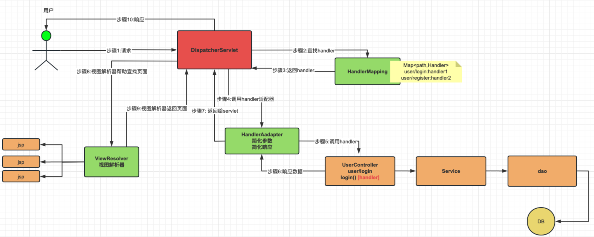
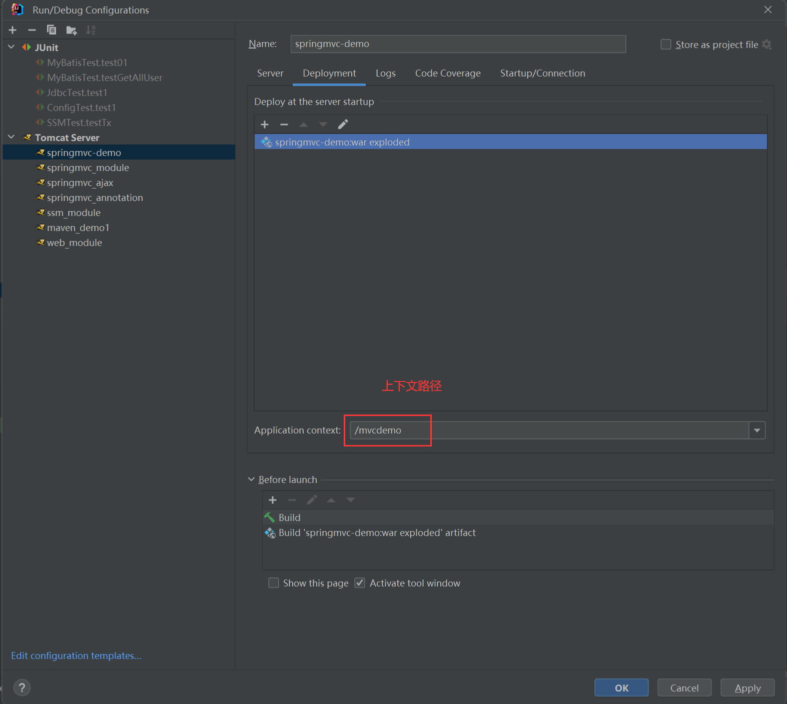
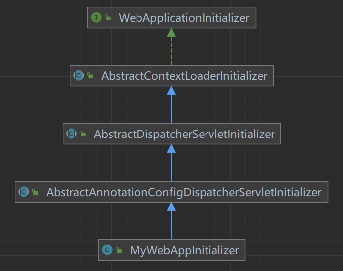
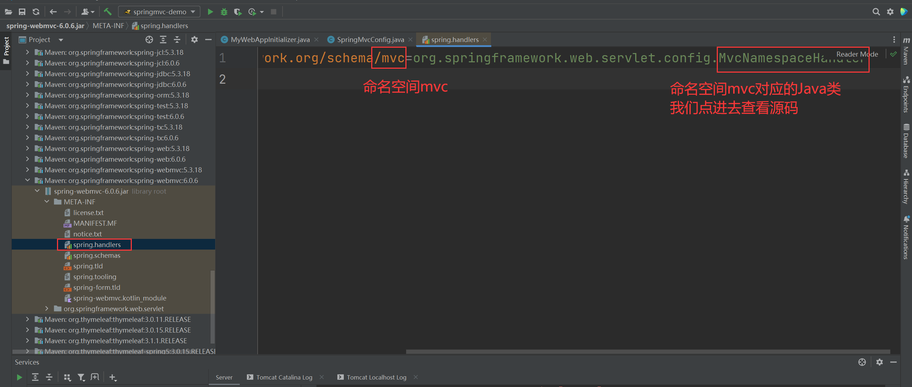
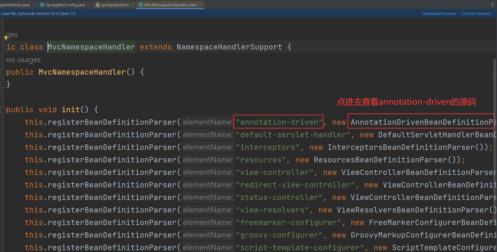
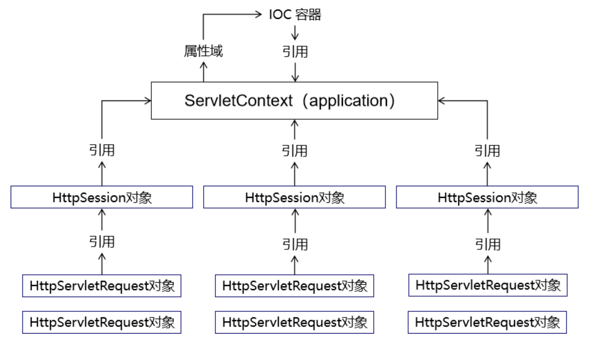
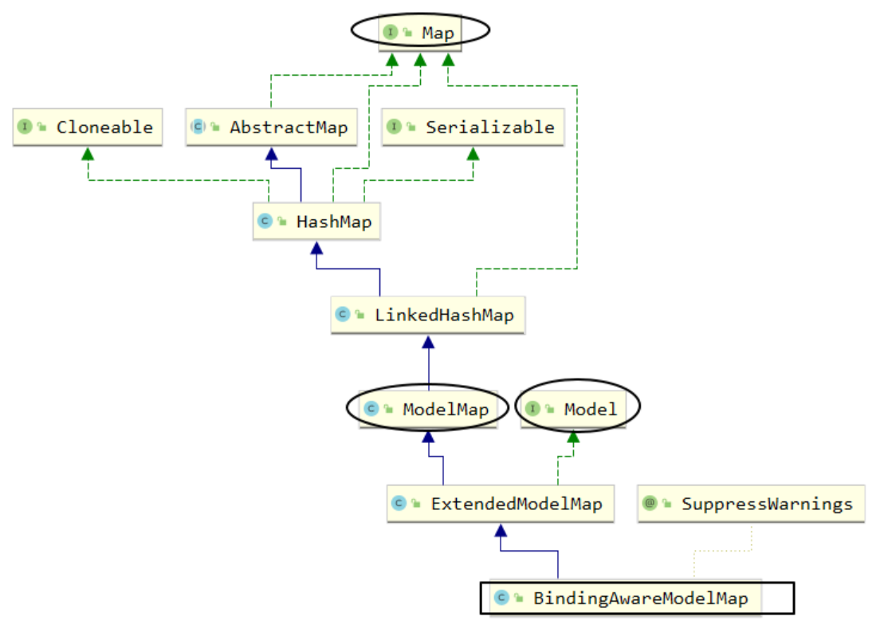
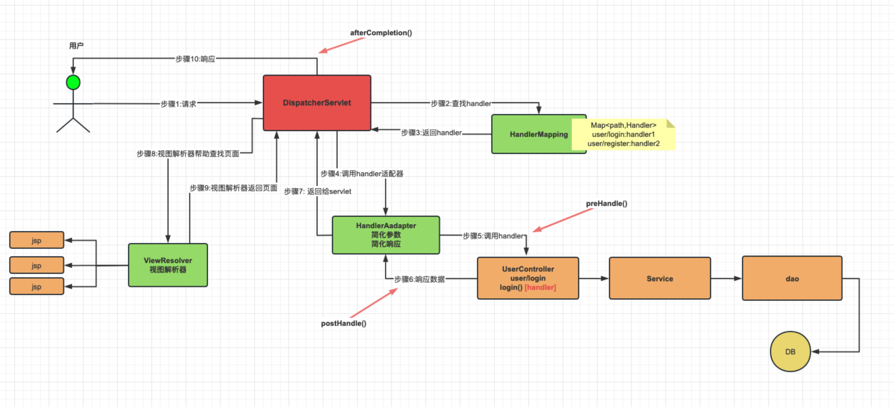
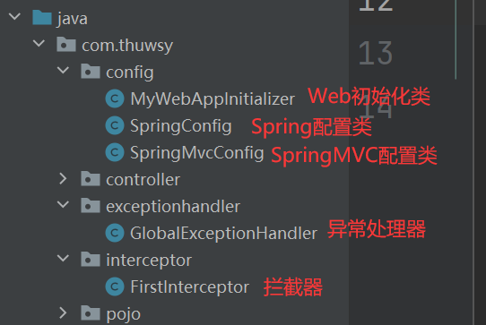
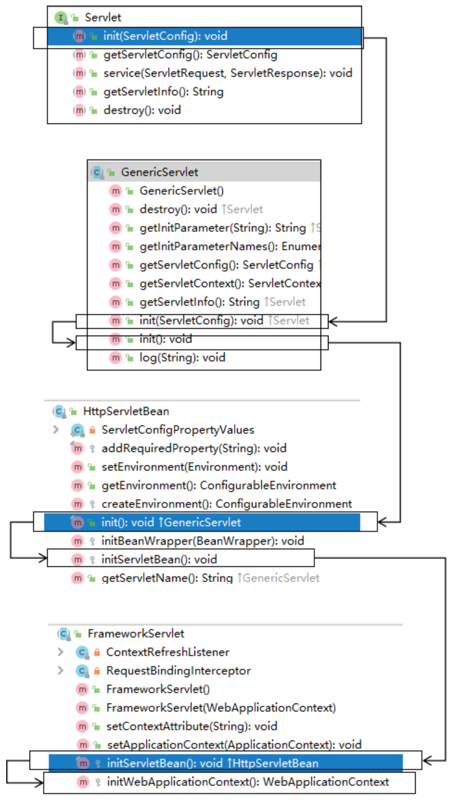

# 1. SpringMVC简介

## 1.1 MVC

MVC是一种软件架构的思想，将软件按照模型、视图、控制器来划分，其核心思想是通过将业务逻辑、数据、显示分离来组织代码。

- M：**Model，模型**，用于保存系统中涉及的数据，例如bean
- V：**View，视图**，用于展示模型中的数据，例如html页面
- C：**Controller，控制器**，用于接收请求和响应浏览器，例如Servlet

## 1.2 SpringMVC

Spring Web MVC是基于Servlet API构建的原始Web框架，从一开始就包含在Spring Framework中。正式名称Spring Web MVC来自其源模块的名称（spring-webmvc），但它通常被称为`Spring MVC`。SpringMVC 是 Spring 为**表述层**开发提供的一整套完备的解决方案，在表述层框架历经 Strust、WebWork、Strust2 等诸多产品的历代更迭之后，目前业界普遍选择了 SpringMVC 作为 Java EE 项目表述层开发的首选方案。

**SpringMVC最主要的作用**：简化前端参数的接收、简化后端数据的响应。

## 1.3 SpringMVC的核心组件

1. `DispatcherServlet`: **核心的中央处理器**，所有请求都经过它的**处理和分发**。
2. `HandlerMapping`: **处理器映射器**，它内部缓存handler方法和对应访问路径，主要**用于根据URL匹配对应的handler**，除此之外，它还会将请求涉及到的拦截器和handler一起封装。
3. `HandlerAdapter`: **处理器适配器**，它根据HandlerMapping找到的handler，来适配对应的handler。它可以**处理请求参数和处理响应数据**，每次DispatcherServlet都是**通过HandlerAdapter间接调用handler方法**。
4. `handler`: **请求处理器**，指的是Controller类内部的方法，用于处理实际请求。它是由程序员自己定义的。
5. `ViewResovler`: **视图解析器**，根据返回的逻辑视图，查找真正的视图。注意，在前后端分离项目中，不使用视图解析器，因为返回给前端的是JSON数据。

## 1.4 SpringMVC的简要工作流程



1. 客户端（浏览器）发送请求， `DispatcherServlet`拦截请求。

2. `DispatcherServlet` 根据请求信息调用 `HandlerMapping` 。`HandlerMapping` 根据 URL 去匹配查找能处理的 `Handler`，并会将请求涉及到的拦截器和 `Handler` 一起封装。

3. `DispatcherServlet` 调用 `HandlerAdapter`适配器执行 `Handler` 。

4. `Handler` 完成对用户请求的处理后，会返回一个 `ModelAndView` 对象给`DispatcherServlet`。

   > `ModelAndView`包含了数据模型以及相应的视图的信息。`Model` 是返回的数据对象，`View` 是个逻辑上的视图。

5. `ViewResolver` 会根据逻辑 `View` 查找实际的 `View`。
6. `DispaterServlet` 把返回的 `Model` 传给 `View`（视图渲染）。
7. 把 `View` 返回给请求者（浏览器）


# 2. 实战案例

## 2.1 创建Maven JavaEE工程并引入依赖

```xml
    <!--spring相关依赖-->
    <dependency>
        <groupId>org.springframework</groupId>
        <artifactId>spring-context</artifactId>
        <version>6.0.6</version>
    </dependency>
    <!--servlet API相关依赖，这里我们需要使用tomcat10来支持jakarta包-->
    <!--在Spring Web MVC 6中，Servlet API迁移到了 Jakarta EE API-->
    <dependency>
        <groupId>jakarta.platform</groupId>
        <artifactId>jakarta.jakartaee-web-api</artifactId>
        <version>9.1.0</version>
        <scope>provided</scope>
    </dependency>
    <!--springmvc相关依赖-->
    <dependency>
        <groupId>org.springframework</groupId>
        <artifactId>spring-webmvc</artifactId>
        <version>6.0.6</version>
    </dependency>
    <!--junit5-->
    <dependency>
        <groupId>org.junit.jupiter</groupId>
        <artifactId>junit-jupiter-api</artifactId>
        <version>5.3.1</version>
        <scope>test</scope>
    </dependency>
    <!--日志-->
    <dependency>
        <groupId>ch.qos.logback</groupId>
        <artifactId>logback-classic</artifactId>
        <version>1.2.3</version>
    </dependency>
    <!--Spring6和Thymeleaf整合包-->
    <dependency>
        <groupId>org.thymeleaf</groupId>
        <artifactId>thymeleaf-spring6</artifactId>
        <version>3.1.1.RELEASE</version>
    </dependency>
```

## 2.2 创建Controller

控制器中每一个处理请求的方法称为控制器方法。因为SpringMVC的控制器由一个普通的Java类担任，因此需要通过@Controller注解将其标识为一个控制层组件，交给Spring的IOC容器管理，此时SpringMVC才能够识别控制器的存在。

```java
@Controller
public class HelloController {
    // 以后我们会越来越倾向于用一句话来作为请求的URL地址，在这样的一句话中使用“/”分隔各个单词
    @RequestMapping("/springmvc/hello")
    @ResponseBody
    public String hello() {
        return "hello springmvc!";
    }

    @RequestMapping("/springmvc/bye")
    public String bye() {
        return "bye";
    }
}
```

> @RequestMapping注解用于指定**处理请求和控制器方法之间的映射关系**，其value属性可以通过请求地址匹配请求，`/`表示的当前工程的上下文路径，如：`http://localhost:8080/mvcdemo/`

**说明**：SpringMVC 对处理请求的类并没有特殊要求，但我们自己习惯上有两种命名方式：

- XxxHandler：意思是 Xxx 处理器的意思
- XxxController：意思是 Xxx 控制器的意思

这只是一个命名的习惯，不是语法要求。所以往往把处理请求的类叫做`Handler类`，处理请求的方法叫做`Handler方法`。

## 2.3 SpringMVC核心组件配置类

```java
@Configuration
@EnableWebMvc
@ComponentScan("com.thuwsy.controller")
public class SpringMvcConfig implements WebMvcConfigurer {
//    @Bean
//    public RequestMappingHandlerMapping handlerMapping() {
//        return new RequestMappingHandlerMapping();
//    }
//
//    @Bean
//    public RequestMappingHandlerAdapter handlerAdapter() {
//        return new RequestMappingHandlerAdapter();
//    }

    // 1. 创建模板解析器
    @Bean
    public ITemplateResolver templateResolver() {
        SpringResourceTemplateResolver templateResolver = new SpringResourceTemplateResolver();
        templateResolver.setPrefix("/WEB-INF/templates/"); // 视图前缀
        templateResolver.setSuffix(".html"); // 视图后缀
        templateResolver.setCharacterEncoding("UTF-8");
        templateResolver.setTemplateMode(TemplateMode.HTML);
        templateResolver.setCacheable(false);
        return templateResolver;
    }
    // 2. 创建模板引擎，并为其注入模板解析器
    @Bean
    public SpringTemplateEngine templateEngine(ITemplateResolver templateResolver) {
        SpringTemplateEngine templateEngine = new SpringTemplateEngine();
        templateEngine.setTemplateResolver(templateResolver);
        return templateEngine;
    }
    // 3. 注册Thymeleaf视图解析器，并为其注入模板引擎
    @Bean
    public ThymeleafViewResolver viewResolver(SpringTemplateEngine templateEngine) {
        ThymeleafViewResolver viewResolver = new ThymeleafViewResolver();
        viewResolver.setTemplateEngine(templateEngine);
        viewResolver.setCharacterEncoding("UTF-8");
        viewResolver.setOrder(1);
        return viewResolver;
    }

    // 开启静态资源处理
    @Override
    public void configureDefaultServletHandling(DefaultServletHandlerConfigurer configurer) {
        configurer.enable();
    }
}
```

> 注1：使用@EnableWebMvc注解后，无需手动将HandlerMapping和HandlerAdapter加入IOC容器，因为底层会自动将它们加入IOC容器，见2.7节源码。
>
> 注2：实现WebMvcConfigurer接口，里面有很多配置组件的规范，便于我们添加额外的配置。

## 2.4 容器初始化类

创建容器初始化类，或者称Web初始化类，相当于取代了web.xml文件：

```java
public class MyWebAppInitializer extends AbstractAnnotationConfigDispatcherServletInitializer {
    // 指定service、mapper层的配置类
    @Override
    protected Class<?>[] getRootConfigClasses() {
        return new Class[0];
    }
    // 指定springmvc的配置类
    @Override
    protected Class<?>[] getServletConfigClasses() {
        return new Class[]{SpringMvcConfig.class};
    }
    // 设置DispatcherServlet的处理路径，一般都用/处理所有请求
    @Override
    protected String[] getServletMappings() {
        return new String[]{"/"};
    }
}
```

## 2.5 启动测试

注意，必须要使用Tomcat 10及以上的版本。



访问`http://localhost:8080/mvcdemo/springmvc/hello`成功！

访问`http://localhost:8080/mvcdemo/springmvc/bye`成功！（需要在`/WEB-INF/templates/`目录下创建bye.html页面）

## 2.6 底层初始化原理

继承实现关系如下：



（1）WebApplicationInitializer接口中只有一个方法`onStartup`，每当web项目启动时，就会自动调用该方法。

```java
public interface WebApplicationInitializer {
    void onStartup(ServletContext servletContext) throws ServletException;
}
```

（2）一直往下找`onStartup`方法(因为根据多态，会优先调用子类的onStartup方法)，我们发现AbstractDispatcherServletInitializer中有onStartup方法：

```java
public void onStartup(ServletContext servletContext) throws ServletException {
    super.onStartup(servletContext);
    this.registerDispatcherServlet(servletContext);
}
```

- 第一步是调用了其父类AbstractContextLoaderInitializer的onStartup方法，见（4）
- 第二步是调用了registerDispatcherServlet方法，见（3）

（3）registerDispatcherServlet方法的源码（其核心操作见如下的注释）

```java
protected void registerDispatcherServlet(ServletContext servletContext) {
    String servletName = this.getServletName();
    Assert.hasLength(servletName, "getServletName() must not return null or empty");
    
    // 创建web的IOC容器
    WebApplicationContext servletAppContext = this.createServletApplicationContext();
    Assert.notNull(servletAppContext, "createServletApplicationContext() must not return null");

    // 创建DispatcherServlet
    FrameworkServlet dispatcherServlet = this.createDispatcherServlet(servletAppContext);
    Assert.notNull(dispatcherServlet, "createDispatcherServlet(WebApplicationContext) must not return null");
    dispatcherServlet.setContextInitializers(this.getServletApplicationContextInitializers());
    ServletRegistration.Dynamic registration = servletContext.addServlet(servletName, dispatcherServlet);
    if (registration == null) {
        throw new IllegalStateException("Failed to register servlet with name '" + servletName + "'. Check if there is another servlet registered under the same name.");
    } else {
        // 设置DispatcherServlet在web项目启动时就创建
        registration.setLoadOnStartup(1);
        
        // 设置DispatcherServlet处理的请求地址
        registration.addMapping(this.getServletMappings());
        registration.setAsyncSupported(this.isAsyncSupported());
        Filter[] filters = this.getServletFilters();
        if (!ObjectUtils.isEmpty(filters)) {
            Filter[] var7 = filters;
            int var8 = filters.length;

            for(int var9 = 0; var9 < var8; ++var9) {
                Filter filter = var7[var9];
                this.registerServletFilter(servletContext, filter);
            }
        }

        this.customizeRegistration(registration);
    }
}
```

**注1**：createServletApplicationContext()是一个抽象方法，由其子类AbstractAnnotationConfigDispatcherServletInitializer实现（**核心内容是加载了web配置类，而调用的方法getServletConfigClasses()正是我们自定义的类MyWebAppInitializer中重写的方法**）：

```java
protected WebApplicationContext createServletApplicationContext() {
    AnnotationConfigWebApplicationContext context = new AnnotationConfigWebApplicationContext();
    Class<?>[] configClasses = this.getServletConfigClasses();
    if (!ObjectUtils.isEmpty(configClasses)) {
        context.register(configClasses);
    }

    return context;
}
```

**注2**：设置DispatcherServlet处理的请求地址中，调用的方法getServletMappings()也正是我们自定义的类MyWebAppInitializer中重写的方法

（4）AbstractContextLoaderInitializer中的onStartup方法中，调用了registerContextLoaderListener()，而这个方法中又调用了createRootApplicationContext()，该方法是个抽象方法，由AbstractAnnotationConfigDispatcherServletInitializer类实现（**其核心内容是根据getRootConfigClasses()方法中的配置类，又创建了一个IOC容器，上述方法同样是我们自定义的类MyWebAppInitializer中重写的方法**）：

```java
protected WebApplicationContext createRootApplicationContext() {
    Class<?>[] configClasses = this.getRootConfigClasses();
    if (!ObjectUtils.isEmpty(configClasses)) {
        AnnotationConfigWebApplicationContext context = new AnnotationConfigWebApplicationContext();
        context.register(configClasses);
        return context;
    } else {
        return null;
    }
}
```

## 2.7 @EnableWebMvc注解底层原理

在SpringMVC配置类上添加@EnableWebMvc注解后，一个作用就是开启了mvc的注解驱动(相当于以前在xml配置文件中添加了`<mvc:annotation-driven />`)，下面我们来查看该配置的作用。

**查看源码的步骤如下**：





**源码如下**：

```java
class AnnotationDrivenBeanDefinitionParser implements BeanDefinitionParser {
    // ......省略非核心代码

    @Nullable
    public BeanDefinition parse(Element element, ParserContext context) {
        // ......省略非核心代码
        
        // 将HandlerMapping加入IOC容器
        readerContext.getRegistry().registerBeanDefinition(HANDLER_MAPPING_BEAN_NAME, handlerMappingDef);

        // 添加jackson转化器
        this.addRequestBodyAdvice(handlerAdapterDef);
        this.addResponseBodyAdvice(handlerAdapterDef);
        
        // 将HandlerAdapter加入IOC容器
        readerContext.getRegistry().registerBeanDefinition(HANDLER_ADAPTER_BEAN_NAME, handlerAdapterDef);
        
    }

    // 具体添加jackson转化对象方法
    protected void addRequestBodyAdvice(RootBeanDefinition beanDef) {
        if (jackson2Present) {
            beanDef.getPropertyValues().add("requestBodyAdvice", new RootBeanDefinition(JsonViewRequestBodyAdvice.class));
        }
    }
    protected void addResponseBodyAdvice(RootBeanDefinition beanDef) {
        if (jackson2Present) {
            beanDef.getPropertyValues().add("responseBodyAdvice", new RootBeanDefinition(JsonViewResponseBodyAdvice.class));
        }
    }
}
```


# 3. SpringMVC接收数据

## 3.1 请求路径

### 3.1.1 @RequestMapping的作用

@RequestMapping注解的作用就是**将请求的URL地址和处理请求的方式（handler方法）关联起来，注册到HandlerMapping中**。

请求路径有以下匹配方式：

**1、精确匹配**

在@RequestMapping注解指定URL地址时，不使用任何通配符，按照请求地址进行精确匹配。

**2、模糊匹配**

在@RequestMapping注解指定URL地址时，通过使用通配符，匹配多个类似的地址。如`@RequestMapping("/fruit/*")`

- `?`：匹配任意的单个字符，不包括`?`和`/`
- `*`：匹配任意的0个或多个字符，不包括`?`和`/`
- `**`：匹配任意层数的任意目录，注意只能使用`/**/xxx`的形式

其中所谓的一层或多层是指一个URL地址字符串被`/`划分出来的各个层次。这个知识点虽然对于@RequestMapping注解来说实用性不大，但是将来配置拦截器的时候也遵循这个规则。

### 3.1.2 @RequestMapping的位置

- @RequestMapping标识在类上：设置映射请求的base路径
- @RequestMapping标识在方法上：设置映射请求的具体路径

```java
@Controller
@RequestMapping("/test")
public class TestRequestMappingController {
    // 此时控制器方法所匹配的请求的请求路径为/test/hello
    @RequestMapping("/hello")
    public String hello() {
        return "success";
    }

    // 此时控制器方法所匹配的请求的请求路径为/test
    @RequestMapping
    public String bye() {
        return "success";
    }
}
```

### 3.1.3 @RequestMapping的属性

#### 1、value属性

value属性通过请求的请求地址匹配请求映射，是一个字符串类型的数组，表示该请求映射能够匹配多个请求地址所对应的请求。例如

```java
@RequestMapping({"/hello", "/abc"})
```

如果只需匹配单个地址，自然可以省略数组的大括号`{}`

注意：如果多个 handler 方法映射了同一个地址，会导致 SpringMVC 在接收到这个地址的请求时不知道该找哪个 handler 方法处理，从而会报Ambiguous mapping异常。

#### 2、method属性

method属性通过请求的请求方式匹配请求映射，是一个RequestMethod类型的数组，表示该请求映射能够匹配多种请求方式的请求。

```java
@RequestMapping(value = "/hello", method = RequestMethod.GET)
```

若当前请求的请求地址满足请求映射的value属性，但是请求方式不满足method属性，则浏览器报错`405：Request method 'POST' not supported`

**注1**：对于处理指定请求方式的控制器方法，SpringMVC中提供了@RequestMapping的派生注解（以下注解只能使用在方法上，不能使用在类上）：
- @GetMapping专门处理get请求，例如`@GetMapping("/hello")`
- @PostMapping专门处理post请求
- @PutMapping专门处理put请求
- @DeleteMapping专门处理delete请求

**注2**：常用的请求方式有get，post，put，delete，但是目前浏览器只支持get和post。即，若在form表单的method属性设置了put或delete，则只会按照默认的请求方式get处理。

> 若要发送put和delete请求，则需要通过spring提供的过滤器HiddenHttpMethodFilter，在RESTful部分会用到。

#### 3、params属性

params属性通过请求的请求参数匹配请求映射，它是一个字符串类型的数组，可以通过四种表达式设置请求参数和请求映射的匹配关系。注意，前面的value和method只需匹配数组中的某一个元素就成功匹配，而params的数组则不同，必须匹配数组中的所有条件才算作成功匹配。

- `"user"`：要求请求映射所匹配的请求必须携带user请求参数
- `"!user"`：要求请求映射所匹配的请求必须不能携带user请求参数
- `"user=abc"`：要求请求映射所匹配的请求必须携带user请求参数且user=abc
- `"user!=abc"`：要求请求映射所匹配的请求要么不携带user参数，如果携带，必须user!=abc

举例：在html中设置跳转的请求地址和参数

```html
<a th:href="@{/test(username='吴',password=123456)">测试</a>
```

```java
// 成功匹配
@RequestMapping(
    value = "/test",
    method = RequestMethod.GET,
    params = {"username=吴", "password=123456"}
)
public String testRequestMapping(){
    return "success";
}
```

注：若当前请求满足@RequestMapping注解的value和method属性，但是不满足params属性，此时页面会显示400错误。

#### 4、headers属性

headers属性通过请求的请求头信息匹配请求映射，是一个字符串类型的数组，可以通过四种表达式设置请求头信息和请求映射的匹配关系。与params很类似。

- `"header"`：要求请求映射所匹配的请求必须携带header请求头信息
- `"!header"`：要求请求映射所匹配的请求必须不能携带header请求头信息
- `"header=value"`：要求请求映射所匹配的请求必须携带header请求头信息且header=value
- `"header!=value"`：要求请求映射所匹配的请求要么不携带header请求头信息，如果携带，必须header!=value

注1：在HTTP报文的请求头和响应头中，key的值是不区分大小写的，但value的值区分大小写。

注2：若当前请求满足@RequestMapping注解的value和method属性，但是不满足headers属性，此时页面显示404错误，即资源未找到。

## 3.2 接收param参数

**param和json参数的对比**：

- param类型的参数会被编码为ASCII码，参数之间没有顺序，仅支持简单数据类型，一般用于GET请求。
- json类型的参数会被编码为UTF-8，参数直接是有序的，还能支持复杂数据类型(如数组、对象等)，一般用于POST请求。

**接收param参数的方式如下**：

### 1、通过ServletAPI获取

将HttpServletRequest作为控制器方法的形参，此时HttpServletRequest类型的参数表示封装了当前请求的请求报文的对象

```java
@RequestMapping("/param/servletapi")
public String getParamByServletAPI(HttpServletRequest req) {
    String username = req.getParameter("username");
    String password = req.getParameter("password");
    System.out.println(username + "-->" + password);
    return "success";
}
```

### 2、通过形参直接获取

在控制器方法的形参位置，设置**和请求参数同名的形参**：

```java
@RequestMapping("/param1")
public String getParam(String username, String password) {
    System.out.println(username + "-->" + password);
    return "success";
}
```

> 注：若有多个同名的请求参数，可以在控制器方法的形参中设置字符串集合来接收，例如`@RequestParam("hobby") List<String> hobbyList`

### 3、使用@RequestParam注解

@RequestParam是将请求参数和控制器方法的形参创建映射关系。它一共有三个属性：
- value：指定为形参赋值的请求参数名
- required：默认为true，表示前端必须传输此参数，若没有传输该请求参数，且没有设置defaultValue属性，则页面报错`400：Required String parameter 'xxx' is not present`。若设置为false，则不是必须传输此参数，若没有传输，则注解所标识的形参的值默认为null(如果没设置defaultValue)。
- defaultValue：不管required属性值为true或false，当value所指定的请求参数没有传输或传输的值为`""`时，则使用默认值为形参赋值。

```java
@RequestParam(value = "userName", required = true, defaultValue = "missing")
```

```java
@RequestMapping("/param2")
public String getParam(@RequestParam("username") String username, @RequestParam("password") String password) {
    System.out.println(username + "-->" + password);
    return "success";
}
```

> 注：为了代码的可读性，建议使用`@RequestParam`注解，而不是省略。

### 4、通过实体类获取请求参数

设置一个实体类类型的形参，此时若请求参数名和实体类中的某个属性名一致，那么请求参数就会为此属性赋值。

```java
@RequestMapping("/param/pojo")
// SpringMVC 会自动调用实体类中的 setXxx() 注入请求参数
public String getParamByPojo(User user) {
    System.out.println(user);
    return "success";
}
```

**注意：SpringMVC也会自动注入级联属性**。见下例：

实体类：

```java
@Data
@NoArgsConstructor
@AllArgsConstructor
public class Student {
    private String stuName;
    private School school;
    private List<Subject> subjectList;
}

@Data
@NoArgsConstructor
@AllArgsConstructor
public class School {
    private String schoolName;
}

@Data
@NoArgsConstructor
@AllArgsConstructor
public class Subject {
    private String subjectName;
}
```

表单：表单项中的 name 属性值必须严格按照级联对象的属性来设定：
```html
<!-- 提交数据的表单 -->
<form th:action="@{/param/cascad}" method="post">
    stuName：<input type="text" name="stuName" value="tom"/><br/>
    school.schoolName:<input type="text" name="school.schoolName" value="atguigu"/><br/>
    subjectList[0].subjectName:<input type="text" name="subjectList[0].subjectName" value="java"/><br/>
    subjectList[1].subjectName:<input type="text" name="subjectList[1].subjectName" value="php"/><br/>
    subjectList[2].subjectName:<input type="text" name="subjectList[2].subjectName" value="javascript"/><br/>
    subjectList[3].subjectName:<input type="text" name="subjectList[3].subjectName" value="css"/><br/>
    subjectList[4].subjectName:<input type="text" name="subjectList[4].subjectName" value="vue"/><br/>
    <input type="submit" value="保存"/>
</form>
```

handler方法：

```java
@RequestMapping("/param/cascad")
public String formToNestedEntity(
        // SpringMVC会自动注入级联属性，只要属性名和对应的getXxx()、setXxx()匹配即可
        Student student) {
    logger.debug(student.toString());
    return "target";
}
```

## 3.3 接受路径中的参数

我们以前在一个url中传递参数是通过类似`/deleteUser?id=1&name=wsy`的方式。但我们以后会通过Rest方式传递参数，如`/user/delete/1/wsy`

使用@PathVariable注解，可以将URL中的占位符`{xxx}`所表示的数据赋值给形参：

```html
<a th:href="@{/user/delete/1/wsy}">超链接</a>
```

```java
@RequestMapping("/user/delete/{id}/{name}")
public String testRest(@PathVariable("id") Integer identity, @PathVariable("name") String username) {
    System.out.println("id：" + identity + ", name：" + username); // id：1, name：wsy
    return "success";
}
```

## 3.4 接收json参数

### 3.4.1 @RequestBody的作用

@RequestBody将**请求体中的内容**和控制器方法的形参进行绑定。

前端的ajax请求：
```js
testAjax: function () {
    axios.post(
        "/springmvc_ajax/testAjax?id=1001",
        {username:"admin", password:"123456"}
    ).then(function (response) {
        console.log(response.data);
    });
}
```

后端处理ajax请求：
```java
@RequestMapping("/testAjax")
public void testAjax(Integer id, @RequestBody String requestBody, HttpServletResponse response) throws IOException {
    System.out.println("requestBody:" + requestBody);
    System.out.println("id:" + id);
    response.getWriter().write("hello,axios");
}
```

- 普通param参数id可以直接通过形参获取
- 请求体中的json格式数据，可以通过@RequestBody直接绑定到字符串`String requestBody`上

### 3.4.2 使用@RequestBody将json数据转化为Java对象

使用@RequestBody将请求体中json格式的数据直接转换为java对象，需要满足以下三个条件：

- 导入jackson的依赖
- 在SpringMVC的配置类上添加`@EnableWebMvc`注解，这样才会给HandlerAdpater配置json转化器
- 在处理请求的控制器方法的形参位置，直接写要转换的Java类型的形参，并使用@RequestBody注解标识即可

导入依赖：

```xml
<dependency>
    <groupId>com.fasterxml.jackson.core</groupId>
    <artifactId>jackson-databind</artifactId>
    <version>2.14.2</version>
</dependency>
```

前端的ajax请求：

```js
testRequestBody: function () {
    axios.post(
        "/springmvc_ajax/requestBody/json",
        {username:"admin", password:"123456", age:23, gender:"男"}
    ).then(function (response) {
        console.log(response.data);
    });
}
```

后端处理ajax请求：

(case1：将json转换为实体类对象)

```java
@RequestMapping("/requestBody/json")
public void testRequestBody(@RequestBody User user, HttpServletResponse response) throws IOException {
    System.out.println(user);
    response.getWriter().write("hello,RequestBody");
}
```

(case2：将json转换为Map集合)

```java
@RequestMapping("/requestBody/json")
public void testRequestBody(@RequestBody Map<String, Object> map, HttpServletResponse response) throws IOException {
    System.out.println(map);
    response.getWriter().write("hello,RequestBody");
}
```

## 3.5 接收Cookie数据

用`@CookieValue`注解来标记形参，可以将cookie数据和控制器方法的形参创建映射关系。@CookieValue注解一共有三个属性：value、required、defaultValue，用法同@RequestParam

## 3.6 接收请求头数据

用`@RequestHeader`注解来标记形参，可以将请求头信息和控制器方法的形参创建映射关系。@RequestHeader注解一共有三个属性：value、required、defaultValue，用法同@RequestParam

## 3.7 获取原生Servlet API对象

HttpServletRequest, HttpServletResponse, HttpSession 直接在handler方法的形参位置声明即可自动获取。而ServletContext对象没法通过形参声明的方式直接获取，它有以下两种获取方式：

**1、通过HttpSession获取**

```java
@RequestMapping("/test/application")
public String testApplication(HttpSession session) {
    ServletContext servletContext = session.getServletContext();
    servletContext.setAttribute("testApplicationScope", "hello, application");
    return "success";
}
```

**2、通过 IOC 容器注入**

SpringMVC会在初始化容器时，将ServletContext对象存储到IOC容器中

```java
@Autowired
private ServletContext servletContext;
    
@RequestMapping("/original/servlet/context/second/way")
public String originalServletContextSecondWay() {
    logger.debug(servletContext.toString());
    return "success";
}
```

原生对象和 IOC 容器关系：



## 3.8 属性域（共享域）

### 3.8.1 请求域

请求域是实际开发中使用最多的属性域，所以SpringMVC也提供了多种不同方式来操作：

#### 1、使用ServletAPI向request域对象共享数据

```java
@RequestMapping("/testServletAPI")
public String testServletAPI(HttpServletRequest request){
    request.setAttribute("testScope", "hello,servletAPI");
    return "success";
}
```

#### 2、使用ModelAndView向request域对象共享数据

```java
@RequestMapping("/test/mav")
public ModelAndView testMAV() {
    /*  ModelAndView包含Model和View的功能：
        - Model：向请求域中共享数据
        - View：设置逻辑视图实现页面跳转
        */
    ModelAndView mav = new ModelAndView();
    // 向请求域中共享数据
    mav.addObject("testRequestScope", "hello, model and view");
    // 设置逻辑视图
    mav.setViewName("success");
    return mav;
}
```

#### 3、使用Model向request域对象共享数据（推荐）

```java
@RequestMapping("/test/model")
public String testModel(Model model) {
    model.addAttribute("testRequestScope", "hello, model");
    return "success";
}
```

#### 4、使用map向request域对象共享数据

```java
@RequestMapping("/test/map")
public String testMap(Map<String, Object> map) {
    map.put("testRequestScope", "hello, map");
    return "success";
}
```

#### 5、使用ModelMap向request域对象共享数据

```java
@RequestMapping("/test/modelMap")
public String testModelMap(ModelMap modelMap) {
    modelMap.addAttribute("testRequestScope", "hello, modelMap");
    return "success";
}
```

**Model、ModelMap、Map的关系**

SpringMVC 传入的 Model、ModelMap、Map类型的参数其实本质上都是 BindingAwareModelMap 类型的：



实际上，框架底层将模型存入请求域！

### 3.8.2 会话域

使用会话域最简单直接的办法就是使用原生的 HttpSession 对象

```java
@RequestMapping("/test/session")
public String testSession(HttpSession session) {
    session.setAttribute("testSessionScope", "hello, session");
    return "success";
}
```

### 3.8.3 应用域

应用域同样是使用原生对象来操作

```java
@RequestMapping("/test/application")
public String testApplication(HttpSession session) {
    ServletContext servletContext = session.getServletContext();
    servletContext.setAttribute("testApplicationScope", "hello, application");
    return "success";
}
```

# 4. SpringMVC响应数据

## 4.1 返回视图

SpringMVC中的视图是View接口，视图的作用渲染数据，将模型Model中的数据展示给用户。SpringMVC视图的种类很多，默认有转发视图和重定向视图。若使用的视图技术为Thymeleaf，在SpringMVC的配置文件中配置了Thymeleaf的视图解析器，由此视图解析器解析之后所得到的是ThymeleafView。

### 4.1.1 ThymeleafView

当控制器方法中所设置的视图名称没有任何前缀时，此时的视图名称会被SpringMVC配置文件中所配置的视图解析器解析，**视图名称拼接视图前缀和视图后缀所得到的最终路径**，会通过转发的方式实现跳转。

```java
@RequestMapping("/test/view/thymeleaf")
public String testThymeleafView() {
    return "success";
}
```

### 4.1.2 InternalResourceView(转发视图)

SpringMVC中默认的转发视图是InternalResourceView。SpringMVC中创建转发视图的情况：当控制器方法中所设置的**视图名称以`forward:`为前缀时**，创建InternalResourceView视图，此时的视图名称不会被SpringMVC配置文件中所配置的视图解析器解析，而是会将前缀`forward:`去掉，剩余部分作为最终路径通过转发的方式实现跳转。

```java
@RequestMapping("/test/view/forward")
public String testInternalResourceView() {
    return "forward:/test/model";
}
```

### 4.1.3 RedirectView(重定向视图)

SpringMVC中默认的重定向视图是RedirectView。当控制器方法中所设置的**视图名称以`redirect:`为前缀时**，创建RedirectView视图，此时的视图名称不会被SpringMVC配置文件中所配置的视图解析器解析，而是会将前缀`redirect:`去掉，剩余部分作为最终路径通过重定向的方式实现跳转。

```java
@RequestMapping("/test/view/redirect")
public String testRedirectView() {
    return "redirect:/test/model";
}
```

> 注意：重定向视图在解析时，会先将redirect:前缀去掉，然后会判断剩余部分是否以`/`开头，**若是则会自动拼接上下文路径**

### 4.1.4 补充：视图控制器ViewController

当控制器方法中，仅仅用来实现页面跳转，即只需要设置视图名称，而没有其余操作时，可以将该handler方法用视图控制器替代。只需在SpringMVC的配置类中添加（注意，配置类上还必须有注解@EnableWebMvc）：

```java
@Override // 配置视图控制器
public void addViewControllers(ViewControllerRegistry registry) {
    registry.addViewController("/").setViewName("index");
}
```

> 以上就配置了一个视图控制器，将请求地址`/`转发到逻辑视图`index`所对应的物理视图

## 4.2 返回json数据

### 4.2.1 @ResponseBody的作用

@ResponseBody将所标识的控制器方法的返回值作为**响应报文的响应体**响应给浏览器。

```java
@RequestMapping("/test/ResponseBody")
@ResponseBody
public String testResponseBody() {
    return "success";
}
```

由于被@ResponseBody标注，所以此时的`return "success";`只是把字符串`success`作为响应体来响应，并不是作为逻辑视图进行跳转。

### 4.2.2 使用@ResponseBody将Java对象转化为json数据返回

@ResponseBody所标识的控制器方法，可以直接将返回的Java对象，转化为json格式的数据响应给浏览器，但需要满足以下三个条件：
- 导入jackson的依赖
- 在SpringMVC的配置类上添加`@EnableWebMvc`注解
- 将需要转换为json字符串的Java对象直接作为控制器方法的返回值，并使用@ResponseBody注解标识控制器方法。
  - Java实体类可以转化为json对象
  - Map可以转化为json对象
  - List可以转化为json数组

```java
@RequestMapping("/responseBody/json")
@ResponseBody
public User testResponseBodyJson() {
    return new User(1002, "tom", "666", 20, "男");
}
```

### 4.2.3 @RestController注解

@ResponseBody注解可以直接标注在类上，就表示给类中的所有方法都添加了@ResponseBody注解。

@RestController注解是SpringMVC提供的一个复合注解，标识在控制器的类上，就相当于给类添加了@Controller和@ResponseBody


## 4.3 静态资源访问

典型的静态资源包括：纯HTML文件、图片、CSS文件、JavaScript文件等。

当前工程的web.xml配置的前端控制器DispatcherServlet的url-pattern是`/`。而tomcat的web.xml配置的DefaultServlet的url-pattern也是`/`。此时，浏览器发送的请求会优先被DispatcherServlet进行处理。

但是DispatcherServlet无法处理静态资源(因为必须有对应的 @RequestMapping才能找到处理请求的方法)，所以我们需要在SpringMVC的配置类中进行配置：

```java
    // 开启静态资源处理
    @Override
    public void configureDefaultServletHandling(DefaultServletHandlerConfigurer configurer) {
        configurer.enable();
    }
```

**注意，在配置类上必须添加@EnableWebMvc注解**，否则所有请求都会被DefaultServlet处理。而添加了@EnableWebMvc注解，并开启了上述静态资源处理配置后，根据源码可知，此时浏览器发送的请求会先被DispatcherServlet处理，若无法处理再转发给DefaultServlet处理。

> 注意：上述开启静态资源的配置，就相当于以前的xml配置`<mvc:default-servlet-handler />`，可以在mvc名称空间中查看源码。


进行了如上配置后，我们就可以正常访问静态资源了，例如访问在webapp下的`outter.html`页面，由于它不在视图前缀指定的范围内，所以我们可以用转发或者重定向来实现：

转发：
```java
@RequestMapping("/test/forward/command")
public String forwardCommand() {
    
    // 需求：要转发前往的目标地址不在视图前缀指定的范围内，
    // 通过返回逻辑视图、拼接前缀后缀得到的物理视图无法达到目标地址
    
    // 转发到指定的地址：
    return "forward:/outter.html";
}
```

重定向：
```java
@RequestMapping("/test/redirect/command")
public String redirectCommand() {
    // 重定向到指定的地址：
    // 这个地址由 SpringMVC 框架负责在前面附加 contextPath，所以我们不能加，我们加了就加多了
    return "redirect:/outter.html";
}
```

# 5. RESTful

## 5.1 RESTful简介

REST：**Re**presentational **S**tate **T**ransfer，表现层资源状态转移。

RESTful是一种软件架构风格，用于设计网络应用程序和服务之间的通信。它是一种基于标准 HTTP 方法的简单和轻量级的通信协议，广泛应用于现代的Web服务开发。

**RESTful风格的特点**：

1. 每一个URI代表1种资源（URI是统一资源标识符，即资源的名称，注意URL是一种具体的URI，即不仅唯一标识资源、还提供了定位该资源的信息）；
2. 客户端使用GET、POST、PUT、DELETE这四个表示操作方式的动词对服务端资源进行操作：GET用来获取资源，POST用来新建资源，PUT用来更新资源，DELETE用来删除资源；
3. 资源的表现形式是XML或者**JSON**；
4. 客户端与服务端之间的交互在请求之间是无状态的，从客户端到服务端的每个请求都必须包含理解请求所必需的信息。

**RESTful风格的优点**：

- 安全：使用问号键值对的方式给服务器传递数据不安全，而使用REST风格携带数据不再需要明显的暴露数据的名称。
- 风格统一：URL地址从前到后始终都使用斜杠划分各个单词。
- 无状态：在调用一个接口（访问、操作资源）时，可以不用考虑上下文，不用考虑当前状态，极大的降低了系统设计的复杂度。
- 严谨规范：严格按照HTTP1.1协议中定义的请求方式本身的语义进行操作。
- 语义丰富：可以在URL地址中用一句话来充分表达语义。
- 简洁优雅：过去做增删改查操作需要设计4个不同的URL，现在一个就够了，如：

|操作|传统风格|REST 风格|
|-|-|-|
|保存|/CRUD/saveEmp|URL 地址：/CRUD/emp 请求方式：POST|
|删除|/CRUD/removeEmp?empId=2|URL 地址：/CRUD/emp/2 请求方式：DELETE|
|更新|/CRUD/updateEmp|URL 地址：/CRUD/emp 请求方式：PUT|
|查询|/CRUD/editEmp?empId=2|URL 地址：/CRUD/emp/2 请求方式：GET|

## 5.2 RESTful设计规范

### 5.2.1 四种请求方式

REST 风格主张在项目设计、开发过程中，具体的操作符合**HTTP协议定义的请求方式的语义**。

|操作|请求方式|
|-|-|
|查询操作|GET|
|保存操作|POST|
|删除操作|DELETE|
|更新操作|PUT|

### 5.2.2 URL地址风格

REST风格提倡**URL地址使用统一的风格设计**，从前到后**各个单词使用斜杠分开**，**不使用问号键值对方式携带请求参数**，而是将要发送给服务器的数据作为URL地址的一部分，以保证整体风格的一致性。还有一点是**不要使用请求扩展名**。

|传统 URL 地址|REST 风格地址|
|-|-|
|/remove/emp?id=5|/emp/5|

- 用一句话描述当前资源
- 一句话中各个单词用斜杠分开，从前到后保持完全一致的书写风格
- 不要使用问号键值对的方式传递数据
- 需要传递数据时，把数据嵌入到URL地址中，作为地址的一部分
- 不要使用请求扩展名

> 注意：在RESTful风格下，同样也可以使用问号键值对传递参数。一般如果直接查询单一的资源，建议使用路径传参；而如果根据**多个条件**来查询资源，则建议使用问号键值对传参，因为如果参数过多，写在路径上可能产生歧义。

## 5.3 RESTful设计案例

### 5.3.1 HiddenHttpMethodFilter

**装饰者模式**：二十三种设计模式之一，属于结构型模式，主要特点就是借助原始对象实现和原始对象一样的接口，同时通过重写父类方法修改被包装对象的行为。

在HTML中，GET和POST请求可以天然实现，但是DELETE和PUT请求无法直接做到。SpringMVC提供了**HiddenHttpMethodFilter**帮助我们将POST请求转换为DELETE或PUT请求。

我们需要在Web初始化类(即用于代替web.xml的类)中配置该过滤器，见第8章。

**HiddenHttpMethodFilter处理put和delete请求的条件**

- 当前请求的请求方式必须为`post`
- 当前请求必须传输请求参数`_method`，对应的值必须为`put`、`delete`或`patch`三者之一

根据源码可知，只有满足以上条件，HiddenHttpMethodFilter过滤器才会将当前请求的请求方式转换为请求参数`_method`的值，因此请求参数`_method`的值才是最终的请求方式。

```html
<form th:action="@{/user}" method="post">
    <input type="hidden" name="_method" value="put">
    <button type="submit">修改用户信息</button><br>
</form>
```

### 5.3.2 RESTful风格：查

```html
<a th:href="@{/user}">查询所有用户信息</a><br>
<a th:href="@{/user/1}">查询id为1的用户信息</a><br>
```

```java
@GetMapping("/user")
public String getAllUser() {
    System.out.println("查询所有的用户信息-->/user-->get");
    return "success";
}

@GetMapping("/user/{id}")
public String getUserById(@PathVariable("id") Integer id) {
    System.out.println("根据id查询用户信息-->/user/" + id + "-->get");
    return "success";
}
```

### 5.3.3 RESTful风格：增

```html
<form th:action="@{/user}" method="post">
    用户名：<input type="text" name="username"> <br>
    密码：<input type="password" name="password"> <br>
    <button type="submit">添加用户信息</button><br>
</form>
```

```java
@PostMapping("/user")
public String insertUser() {
    System.out.println("添加用户信息-->/user-->post");
    return "success";
}
```

### 5.3.4 RESTful风格：改

```html
<form th:action="@{/user}" method="post">
    <input type="hidden" name="_method" value="put">
    <button type="submit">修改用户信息</button><br>
</form>
```

```java
@PutMapping("/user")
public String updateUser() {
    System.out.println("修改用户信息-->/user-->put");
    return "success";
}
```

### 5.3.5 RESTful风格：删

```html
<form th:action="@{/user/2}" method="post">
    <input type="hidden" name="_method" value="delete">
    <button type="submit">删除用户信息</button><br>
</form>
```

```java
@DeleteMapping("/user/{id}")
public String deleteUserById(@PathVariable("id") Integer id) {
    System.out.println("删除用户信息-->/user/" + id + "-->delete");
    return "success";
}
```

# 6. 异常处理器

- **编程式异常处理**：在代码中显式地编写处理异常的逻辑，例如使用try-catch块。
- **声明式异常处理**：将异常处理的逻辑从具体的业务逻辑中分离出来，通过配置等方式进行统一的管理和处理。

在Spring MVC中，我们推荐使用声明式异常处理，编写一个**统一的全局异常处理器**来处理异常，具体步骤如下：

## 6.1声明异常处理控制器类

使用`@ControllerAdvice`注解将当前类标识为异常处理的组件，里面统一定义异常处理handler方法。前后端分离项目中，使用`@RestControllerAdvice`注解，它相当于`@ControllerAdvice`加上`@ResponseBody`。

```java
@RestControllerAdvice
public class GlobalExceptionHandler {
}
```

## 6.2 声明异常处理handler方法

- 在handler方法上使用注解`@ExceptionHandler`来指定要处理的异常
- 在handler方法的形参位置，使用相应的异常类型的对象来接收所出现的异常

```java
@RestControllerAdvice
public class GlobalExceptionHandler {
    @ExceptionHandler(RuntimeException.class)
    public String handlerRuntimeException(RuntimeException e) {
        e.printStackTrace();
        return "发生了RuntimeException";
    }

    @ExceptionHandler(Exception.class)
    public String handlerException(Exception e) {
        e.printStackTrace();
        return "发生了Exception";
    }
}
```

这种异常处理方式的底层原理是，会给所有Controller织入异常处理的逻辑（AOP），当Controller中的方法抛出异常时，就会被对应的`@ExceptionHandler`修饰的方法进行处理。

> 注意：根据底层源码，抛出的异常会**优先匹配最精确的异常handler方法**，如果没有，再往上找其父类异常的handler方法。
>
> 说明：如果异常处理类只用`@Controller`标识，那么该类中标识`@ExceptionHandler`的方法，默认只能处理该类中抛出的异常。而如果类用`@ControllerAdvice`标识，则是一个全局的异常处理类，可以处理所有抛出的异常。

## 6.3 将异常处理类扫描到IoC容器中

要在SpringMVC配置类上扫描异常处理类所在的包

```java
@ComponentScan({"com.thuwsy.controller", "com.thuwsy.exceptionhandler"})
```

# 7. 拦截器

## 7.1 拦截器的概念

SpringMVC中使用拦截器可以在请求到达具体handler方法前统一执行检测。

**拦截器和过滤器的对比**

**相似点**：三要素相同
- 拦截：必须先把请求拦住，才能执行后续操作
- 过滤：拦截器或过滤器存在的意义就是对请求进行统一处理
- 放行：对请求执行了必要操作后，放请求过去，让它访问原本想要访问的资源

**不同点**：
- 工作平台不同
  - 过滤器工作在 Servlet 容器中
  - 拦截器工作在 SpringMVC 的基础上
- 拦截的范围
  - 过滤器能够拦截到的最大范围是整个 Web 应用，所以在请求到达DispatcherServlet之前就可以进行拦截
  - 拦截器能够拦截到的最大范围是整个 SpringMVC 负责的请求，所以在请求到达DispatcherServlet之后才可以进行拦截
- IOC 容器支持
  - 过滤器：想得到 IOC 容器需要调用专门的工具方法，是间接的
  - 拦截器：它自己就在 IOC 容器中，所以可以直接从 IOC 容器中装配组件，也就是可以直接得到 IOC 容器的支持

**总结**：功能需要如果用 SpringMVC 的拦截器能够实现，就不使用过滤器。

## 7.2 拦截器的配置

### 7.2.1 自定义类实现HandlerInterceptor接口

```java
public class FirstInterceptor implements HandlerInterceptor {
    @Override
    public boolean preHandle(HttpServletRequest request, HttpServletResponse response, Object handler) throws Exception {
        System.out.println("FirstInterceptor-->preHandle");
        return true;
    }

    @Override
    public void postHandle(HttpServletRequest request, HttpServletResponse response, Object handler, ModelAndView modelAndView) throws Exception {
        System.out.println("FirstInterceptor-->postHandle");
    }

    @Override
    public void afterCompletion(HttpServletRequest request, HttpServletResponse response, Object handler, Exception ex) throws Exception {
        System.out.println("FirstInterceptor-->afterCompletion");
    }
}
```

**说明**：拦截器的三个抽象方法：

- `boolean preHandle()`：在控制器方法执行之前执行preHandle()，其返回值表示对控制器方法的拦截(false)或放行(true)
- `void postHandle()`：在控制器方法执行之后执行postHandle()
- `void afterCompletion()`：在渲染视图完毕之后执行afterCompletion()

**三个方法调用的位置如下**：




### 7.2.2 在SpringMVC配置类中添加拦截器

```java
// 配置拦截器
@Override
public void addInterceptors(InterceptorRegistry registry) {
    // 添加拦截器，可以多次调用registry.addInterceptor()来添加多个拦截器
    registry.addInterceptor(new FirstInterceptor());
}
```

> 注：上述方式添加的拦截器，默认对DispatcherServlet处理的**所有请求**都进行拦截(包括对静态资源的访问)。我们还可以采用下面的方式拦截指定请求。

**精确拦截：**

```java
@Override
public void addInterceptors(InterceptorRegistry registry) {
    registry.addInterceptor(new FirstInterceptor())
            .addPathPatterns("/path1", "/abc/666");
}
```

> addPathPatterns()的参数是可变参数，可以配置多个拦截路径。也支持模糊路径，如`/*`匹配单层目录，`/**`匹配任意层目录。

**排除拦截：**

```java
@Override
public void addInterceptors(InterceptorRegistry registry) {
    registry.addInterceptor(new FirstInterceptor())
            .addPathPatterns("/**") // "/**"会拦截所有请求
            .excludePathPatterns("/css/**", "/js/**"); // 可以使用这种方式放行静态资源
}
```

> excludePathPatterns()指定要排除的路径


## 7.3 多个拦截器的执行顺序

多个拦截器的执行顺序和在SpringMVC配置类中配置的顺序有关(即`registry.addInterceptor()`的先后顺序)：
- 首先调用preHandle()，它按照配置的顺序调用
- 然后调用postHandle()，它按照配置的反序调用
- 最后调用afterCompletion()，它按照配置的反序调用

**原因**：从底层源码可见，调用preHandle()时，是在一个拦截器数组中进行正向for循环调用的；而postHandle()和afterCompletion()，都是在数组中进行反向for循环调用的。

**拓展**：若拦截器中有某个拦截器的preHandle()返回了false：
- 该拦截器和它之前的拦截器的preHandle()都会执行
- 所有的拦截器的postHandle()都不执行
- 该拦截器之前的拦截器的afterCompletion()会执行

# 8. 两大过滤器

## 8.1 CharacterEncodingFilter

为了解决获取Post请求参数的乱码问题，可以使用SpringMVC提供的编码过滤器CharacterEncodingFilter，我们需要在Web初始化类(即用于代替web.xml的类)中进行配置。

> 注：SpringMVC中处理编码的过滤器一定要配置到其他过滤器之前

## 8.2 HiddenHttpMethodFilter

org.springframework.web.filter.HiddenHttpMethodFilter是处理请求方式的过滤器，详细作用见第5章。该过滤器也需在Web初始化类中配置，且必须配置在CharacterEncodingFilter的后面。原因如下：

- 在 CharacterEncodingFilter 中是通过 `request.setCharacterEncoding(encoding)` 方法设置字
符集的，所以要求前面不能有任何获取请求参数的操作
- 而 HiddenHttpMethodFilter 恰恰有一个获取请求方式的操作：`String paramValue = request.getParameter(this.methodParam);`

## 8.3 配置过滤器的方式

```java
public class MyWebAppInitializer extends AbstractAnnotationConfigDispatcherServletInitializer {
    // 指定service、mapper层的配置类
    @Override
    protected Class<?>[] getRootConfigClasses() {
        return new Class[0];
    }
    // 指定springmvc的配置类
    @Override
    protected Class<?>[] getServletConfigClasses() {
        return new Class[]{SpringMvcConfig.class};
    }
    // 设置DispatcherServlet的处理路径，一般都用/处理所有请求
    @Override
    protected String[] getServletMappings() {
        return new String[]{"/"};
    }

    // 配置过滤器
    @Override 
    protected Filter[] getServletFilters() {
        // 创建编码过滤器
        CharacterEncodingFilter characterEncodingFilter = new CharacterEncodingFilter();
        characterEncodingFilter.setEncoding("UTF-8");
        characterEncodingFilter.setForceEncoding(true);
        // 创建处理请求方式的过滤器
        HiddenHttpMethodFilter hiddenHttpMethodFilter = new HiddenHttpMethodFilter();
        return new Filter[]{characterEncodingFilter, hiddenHttpMethodFilter};
    }
}
```


# 10. 参数校验

## 10.1 参数校验简介

为了能够让业务逻辑层基于正确的数据进行处理，我们需要**在表述层对数据进行检查**，将错误的数据隔绝在业务逻辑层之外。

JSR 303 是 Java 为 Bean 数据合法性校验提供的**标准框架**，通过在Bean的属性上标注类似于@NotNull、@Max等标准的注解指定校验规则：

|注解|规则|
|-|-|
|@Null|标注值必须为 null|
|@NotNull|标注值不可为 null|
|@AssertTrue|标注值必须为 true|
|@AssertFalse|标注值必须为 false|
|@Min(value)|标注值必须大于或等于 value|
|@Max(value)|标注值必须小于或等于 value|
|@DecimalMin(value)|标注值必须大于或等于 value|
|@DecimalMax(value)|标注值必须小于或等于 value|
|@Size(max,min) |标注值大小必须在 max 和 min 限定的范围内|
|@Digits(integer,fratction)|标注值值必须是一个数字，且必须在可接受的范围内|
|@Past|标注值只能用于日期型，且必须是过去的日期|
|@Future|标注值只能用于日期型，且必须是将来的日期|
|@Pattern(value)|标注值必须符合指定的正则表达式|

JSR 303 只是一套标准，需要提供其实现才可以使用。**Hibernate Validator 是 JSR 303 的一个参考实现**，除支持所有标准的校验注解外，它还支持以下的扩展注解：

|注解|规则|
|-|-|
|@Email|标注值必须是格式正确的 Email 地址|
|@Length|标注值字符串大小必须在指定的范围内|
|@NotEmpty|标注值字符串不能是空字符串|
|@Range |标注值必须在指定的范围内|

> SpringMVC中配置`@EnableWebMvc`后，就会默认装配好一个 LocalValidatorFactoryBean(它实现了Validator接口)，通过在处理方法的入参上标注 `@Validated` 注解即可让 SpringMVC 在完成数据绑定后执行数据校验的工作。

## 10.2 三个检查非空的注解

### 1、@NotNull

一般用于实体类或者包装类对象。当被标注的属性值为null时，校验失败并抛出异常。

### 2、@NotEmpty

用于集合、数组。当该属性值为null，或者其`size() == 0`时，校验失败并抛出异常。

### 3、@NotBlank

用于字符串。当该属性值为null，或者是空字符串，或者只包含空格时，校验失败并抛出异常。

## 10.3 参数校验的步骤

### 1、导入依赖

```xml
<dependency>
    <groupId>jakarta.platform</groupId>
    <artifactId>jakarta.jakartaee-web-api</artifactId>
    <version>9.1.0</version>
    <scope>provided</scope>
</dependency>
<!-- 校验注解实现-->
<dependency>
    <groupId>org.hibernate.validator</groupId>
    <artifactId>hibernate-validator</artifactId>
    <version>8.0.0.Final</version>
</dependency>
<dependency>
    <groupId>org.hibernate.validator</groupId>
    <artifactId>hibernate-validator-annotation-processor</artifactId>
    <version>8.0.0.Final</version>
</dependency>
```

### 2、在实体类属性上使用校验注解

```java
@Data
public class User {
    @Min(10)
    private Integer age;
    @NotBlank
    private String name;
    @Email
    private String email;
    @Length(min = 6, max = 20)
    private String password;
}
```

### 3、在handler方法中校验形参

```java
@RestController
public class UserController {
    @PostMapping("/user/save")
    public Object save(@Validated @RequestBody User user, BindingResult result) {
        if (result.hasErrors()) {
            String errorMsg = result.getFieldError().toString();
            return errorMsg;
        }
        System.out.println("正常");
        return user;
    }
}
```

> 注1：@Validated代表应用校验注解，必须添加。
>
> 注2：BindingResult参数必须紧跟在校验对象之后，用于获取校验错误的信息，从而可以自行定义如何处理错误。


# 11. SpringMVC的常用配置梳理



## 11.1 Spring配置类

```java
@Configuration
public class SpringConfig {
    //ssm整合之后，spring的配置信息写在此类中
}
```

## 11.2 SpringMVC配置类

```java
@Configuration
@EnableWebMvc
@ComponentScan({"com.thuwsy.controller", "com.thuwsy.exceptionhandler"})
public class SpringMvcConfig implements WebMvcConfigurer {
    @Override // 开启静态资源处理
    public void configureDefaultServletHandling(DefaultServletHandlerConfigurer configurer) {
        configurer.enable();
    }

    @Override // 配置视图控制器
    public void addViewControllers(ViewControllerRegistry registry) {
        registry.addViewController("/").setViewName("index");
    }

    @Override // 配置拦截器
    public void addInterceptors(InterceptorRegistry registry) {
        registry.addInterceptor(new FirstInterceptor()).addPathPatterns("/**");
    }

    @Bean // 1. 创建模板解析器
    public ITemplateResolver templateResolver() {
        SpringResourceTemplateResolver templateResolver = new SpringResourceTemplateResolver();
        templateResolver.setPrefix("/WEB-INF/templates/"); // 视图前缀
        templateResolver.setSuffix(".html"); // 视图后缀
        templateResolver.setCharacterEncoding("UTF-8");
        templateResolver.setTemplateMode(TemplateMode.HTML);
        templateResolver.setCacheable(false);
        return templateResolver;
    }
    @Bean // 2. 创建模板引擎，并为其注入模板解析器
    public SpringTemplateEngine templateEngine(ITemplateResolver templateResolver) {
        SpringTemplateEngine templateEngine = new SpringTemplateEngine();
        templateEngine.setTemplateResolver(templateResolver);
        return templateEngine;
    }
    @Bean // 3. 注册Thymeleaf视图解析器，并为其注入模板引擎
    public ThymeleafViewResolver viewResolver(SpringTemplateEngine templateEngine) {
        ThymeleafViewResolver viewResolver = new ThymeleafViewResolver();
        viewResolver.setTemplateEngine(templateEngine);
        viewResolver.setCharacterEncoding("UTF-8");
        viewResolver.setOrder(1);
        return viewResolver;
    }
}
```

## 11.3 Web初始化类

```java
public class MyWebAppInitializer extends AbstractAnnotationConfigDispatcherServletInitializer {
    @Override // 指定Spring配置类
    protected Class<?>[] getRootConfigClasses() {
        return new Class[]{SpringConfig.class};
    }

    @Override // 指定SpringMVC配置类
    protected Class<?>[] getServletConfigClasses() {
        return new Class[]{SpringMvcConfig.class};
    }

    @Override // 设置DispatcherServlet的处理路径，一般都用/处理所有请求
    protected String[] getServletMappings() {
        return new String[]{"/"};
    }
    
    @Override // 设置过滤器
    protected Filter[] getServletFilters() {
        // 创建编码过滤器
        CharacterEncodingFilter characterEncodingFilter = new CharacterEncodingFilter();
        characterEncodingFilter.setEncoding("UTF-8");
        characterEncodingFilter.setForceEncoding(true);
        // 创建处理请求方式的过滤器
        HiddenHttpMethodFilter hiddenHttpMethodFilter = new HiddenHttpMethodFilter();
        return new Filter[]{characterEncodingFilter, hiddenHttpMethodFilter};
    }
}
```

# 12. SpringMVC底层原理

## 12.1 DispatcherServlet初始化过程

DispatcherServlet 本质上是一个 Servlet，所以天然的遵循 Servlet 的生命周期。所以宏观上是 Servlet 生命周期来进行调度。

**继承关系：**

DispatcherServlet继承FrameworkServlet继承HttpServletBean继承HttpServlet继承GenericServlet实现Servlet接口。

**初始化过程调用线路图**：



**核心步骤**：

### 1、初始化WebApplicationContext

FrameworkServlet类中的initWebApplicationContext()方法做了以下核心操作：

1. 调用方法，创建WebApplicationContext（步骤2）
2. 调用方法，刷新WebApplicationContext（步骤3）
3. 然后将该IOC容器在应用域共享

### 2、创建IOC容器

FrameworkServlet类中通过调用createWebApplicationContext()方法创建了WebApplicationContext，该方法中做了以下核心步骤：

1. 通过反射创建 IOC 容器对象(WebApplicationContext)
2. 设置父容器(父容器类型为ApplicationContext)

### 3、初始化DispatcherServlet

FrameworkServlet类中通过调用onRefresh()方法刷新容器，此方法在DispatcherServlet类中进行了重写，调用了initStrategies(context)方法，初始化DispatcherServlet的各个组件，如请求映射等。
