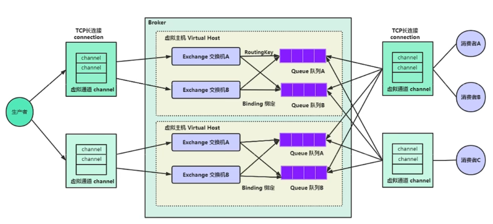
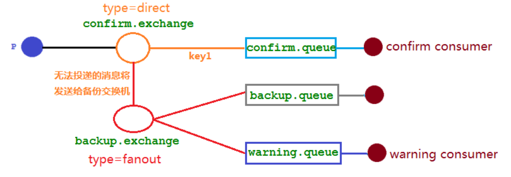
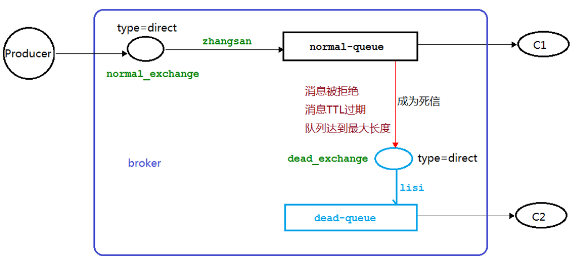
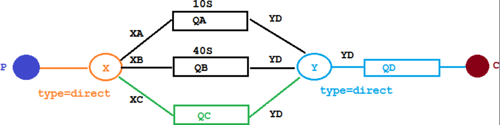
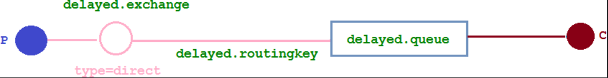
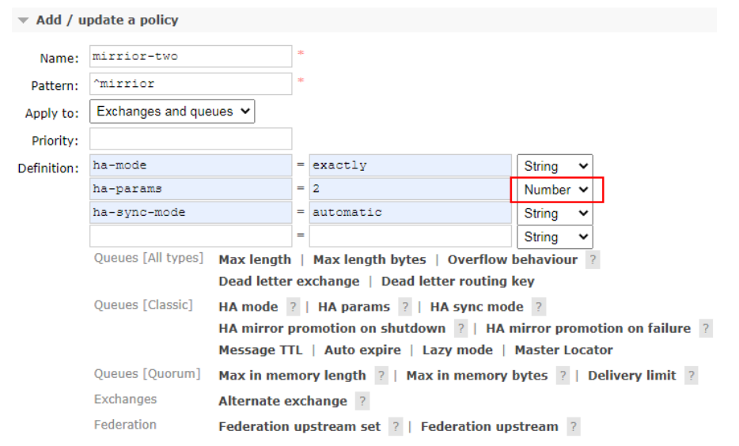
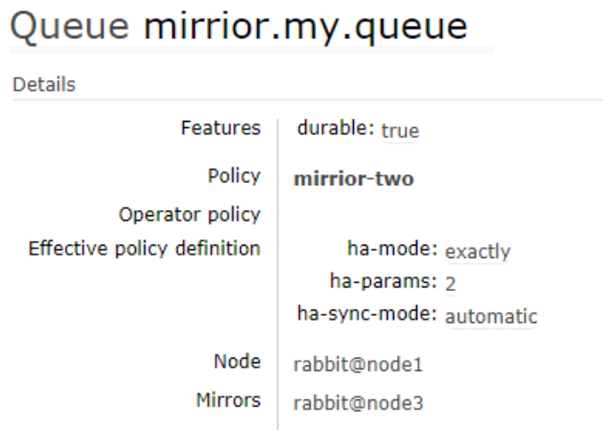
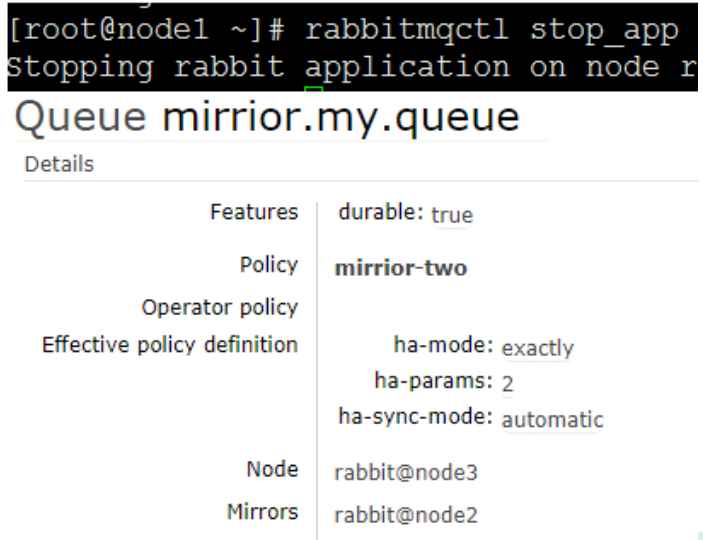

# 第01章_消息中间件

## 1. 消息中间件简介

### 1.1 概述

中间件（Middleware）用于分布式系统中，它是脱离于具体设计目标，而具备提供普遍独立功能需求的模块。

消息中间件，利用可靠的消息传递机制进行系统和系统之间的通讯，它通过提供消息传递和消息分派机制，可以在分布式系统环境下扩展进程间的通讯。

MQ(message queue)是一个FIFO的队列，其中存放的内容是message，MQ是一种跨进程的通信机制，用于上下游传递消息。在互联网架构中，MQ是一种非常常见的上下游`逻辑解耦+物理解耦`的消息通信服务。使用了MQ之后，消息发送上游只需要依赖MQ，不用依赖其他服务。

### 1.2 MQ的作用

**流量消峰**

例如，订单系统最多能处理一万次订单，如果在高峰期有两万次下单，操作系统是处理不了的，只能限制订单超过一万后不允许用户下单。而使用消息队列做缓冲，我们可以取消这个限制，把一秒内下的订单分散成一段时间来处理，这时有些用户可能在下单十几秒后才能收到下单成功的操作，但是比不能下单的体验要好。

**数据缓冲**

例如一个日志采集客户端收集大量日志信息，准备交给日志处理服务来处理，可以使用消息队列作数据缓冲，让日志采集客户端将消息写入消息队列，然后日志处理服务再订阅消费。

**应用解耦**

以电商应用为例，应用中有订单系统、库存系统、物流系统、支付系统。用户创建订单后，如果耦合调用库存系统、物流系统、支付系统，任何一个子系统出了故障，都会造成下单操作异常。当转变成基于消息队列的方式后，系统间调用的问题会减少很多，比如物流系统因为发生故障，需要几分钟来修复。在这几分钟的时间里，物流系统要处理的数据被缓存在消息队列中，用户的下单操作可以正常完成。当物流系统恢复后，继续处理订单信息即可，用户感受不到物流系统的故障，提升系统的可用性。

**异步处理**

有些服务间调用是异步的，例如 A 调用 B，B 需要花费很长时间执行，但是 A 需要知道 B 什么时候可以执行完。使用消息队列，可以很方便解决这个问题，当 B 处理完成后，会发送一条消息给MQ，MQ会将此消息转发给 A 服务。这样 A 服务可以继续执行自己的业务，还能及时得到异步处理成功的消息。

### 1.3 MQ的分类

#### 1、ActiveMQ

缺点：官方社区现在对ActiveMQ 5.x维护越来越少，高吞吐量场景较少使用。

#### 2、Kafka

Kafka是专为**大数据**而生的消息中间件，百万级TPS吞吐量，基于Pull的模式来处理消息消费。

优点：吞吐量高极高，高可用，在日志领域非常成熟。

缺点：Kafka单机超过64个队列/分区，Load会发生明显的飙高现象，导致发送消息响应时间变长。

#### 3、RocketMQ

RocketMQ是阿里巴巴的开源产品，用Java语言实现，在设计时参考了Kafka，并做出了一些改进，适用于**金融互联网领域**等可靠性要求较高的场景。

优点：单机吞吐量十万级，高可用，消息可以做到0丢失，可靠性极高。

缺点：支持的客户端语言不多，主要是Java。

#### 4、RabbitMQ

RabbitMQ采用Erlang语言编写，是一个实现AMQP(高级消息队列协议)的消息中间件，适用于**数据量不大的场景**。

优点：吞吐量万级，功能比较完备、稳定。

缺点：商业版需要收费。

## 2. RabbitMQ简介

官网地址 https://www.rabbitmq.com/

### 2.1 三大核心概念

- 生产者：发送消息的应用
- 消息队列：存储消息的缓存
- 消费者：接收消息的应用

### 2.2 RabbitMQ工作模型



- **Broker**：消息服务器，即RabbitMQ Server
- **Virtual host**：虚拟主机，即一个虚拟分组，类似于网络中的namespace概念。当多个不同的用户使用同一个 RabbitMQ Server时，可以划分出多个Virtual host，每个用户在自己的Virtual host创建exchange或queue等。这样做可以使分类更清晰，且相互隔离。
- **Connection**：连接RabbitMQ服务器的TCP长连接
- **Channel**：信道，即连接中的一个虚拟通道，发送和接收消息都是通过信道进行的。Channel是轻量级的，能大幅减少操作系统建立TCP Connection的开销。
- **Exchange**：交换机负责从生产者接收消息，并根据交换机类型分发到对应的消息队列中，起到一个路由的作用
- **Routing Key**：交换机根据路由键来决定消息分发到哪个队列，路由键是消息的目的地址
- **Binding**：绑定是队列和交换机的一个关联关系
- **Queue**：队列，即存储消息的缓存

## 3. Docker安装RabbitMQ

**1、下载rabbitmq镜像**

```shell
docker pull rabbitmq:management
```

**2、创建一个数据卷，专门用于持久化RabbitMQ的所有数据**

```shell
mkdir -p /thuwsy/rabbitmq
```

**3、启动容器实例，并创建用户**

```shell
docker run -id --name=rabbitmq -v /thuwsy/rabbitmq:/var/lib/rabbitmq -p 15672:15672 -p 5672:5672 -e RABBITMQ_DEFAULT_USER=admin -e RABBITMQ_DEFAULT_PASS=abc666 rabbitmq:management
```

说明：

- 15672端口：RabbitMQ的管理页面端口
- 5672端口：RabbitMQ的消息接收端口
- RABBITMQ_DEFAULT_USER环境变量：指定RabbitMQ的用户名
- RABBITMQ_DEFAULT_PASS环境变量：指定RabbitMQ的密码

## 4. SpringBoot整合RabbitMQ

**引入依赖**：

```xml
<dependency>
    <groupId>org.springframework.boot</groupId>
    <artifactId>spring-boot-starter-amqp</artifactId>
</dependency>
<dependency>
    <groupId>org.springframework.amqp</groupId>
    <artifactId>spring-rabbit-test</artifactId>
    <scope>test</scope>
</dependency>
```

**配置文件(RabbitMQ单机)**：

```properties
spring.rabbitmq.host=192.168.231.101
spring.rabbitmq.port=5672
spring.rabbitmq.username=admin
spring.rabbitmq.password=abc666
spring.rabbitmq.virtual-host=/
```

**配置文件(RabbitMQ集群)**：

```properties
spring.rabbitmq.addresses=192.168.231.101:5672,192.168.231.102:5672,192.168.231.103:5672
spring.rabbitmq.username=admin
spring.rabbitmq.password=abc666
spring.rabbitmq.virtual-host=/
```

# 第02章_常用API

## 1. Exchange

### 1.1 Exchange

org.springframework.amqp.core.Exchange接口代表交换机。RabbitMQ有四种交换机类型，我们以其中之一DirectExchange为例查看交换机的常用参数。

```java
// DirectExchange的构造器
DirectExchange(String name, boolean durable, boolean autoDelete, Map<String, Object> arguments)
```

- name: 交换机的名称
- durable: 是否持久化到硬盘，true表示RabbitMQ服务器重启后该交换机仍然存在。一般都设置为true。
- autoDelete: 是否自动删除，true表示如果曾经有队列/交换机绑定到该交换机，后来所有与之绑定的队列/交换机全都与之解绑了，则自动删除该交换机。一般都设置为false。
- arguments: 交换机的属性参数

> 说明：事实上一般交换机的属性参数arguments只有一个`alternate-exchange`，即设置对应的备用交换机。设置该参数后，如果发送到该交换机的消息无法被路由，则会将其转发到所设置的备用交换机。

### 1.2 ExchangeBuilder

通常我们使用ExchangeBuilder的建造者模式来创建交换机。ExchangeBuilder类的常用API：

- `static ExchangeBuilder fanoutExchange(String name)`：创建一个扇出交换机
- `static ExchangeBuilder directExchange(String name)`：创建一个直接交换机
- `static ExchangeBuilder topicExchange(String name)`：创建一个主题交换机
- `static ExchangeBuilder headersExchange(String name)`：创建一个头部交换机
- `ExchangeBuilder durable(boolean isDurable)`：设置该交换机是否持久化。如果不设置，**默认是持久化的**。
- `ExchangeBuilder autoDelete()`：设置该交换机为自动删除的。如果不设置，**默认是不自动删除的**。
- `ExchangeBuilder withArguments(Map<String, Object> arguments)`：设置交换机的属性参数
- `ExchangeBuilder withArgument(String key, Object value)`：设置交换机的单个属性参数
- `T build()`：构建出交换机

**设置具体属性参数的API**

- `ExchangeBuilder alternate(String exchange)`：设置备用交换机，等价于设置属性参数`alternate-exchange`


## 2. Queue

### 2.1 Queue

org.springframework.amqp.core.Queue类代表队列，其构造器为

```java
Queue(String name, boolean durable, boolean exclusive, boolean autoDelete, Map<String, Object> arguments)
```

- name: 队列的名称
- durable: 是否持久化到硬盘，true表示RabbitMQ服务器重启后该队列仍然存在。一般都设置为true。
- exclusive: 是否独占，true表示只有第一个连接它的消费者能消费其消息，其他消费者都无法连接该队列，并且当第一个连接它的消费者断开连接后，该队列就直接自动删除。一般都设置为false。
- autoDelete: 是否自动删除，true表示如果曾经有消费者连接到该交换机，后来所有与之连接的消费者都断开连接了，则自动删除该队列。一般都设置为false。
- arguments: 队列的属性参数

### 2.2 QueueBuilder

通常我们使用QueueBuilder的建造者模式来创建队列。QueueBuilder的常用API：

- `static QueueBuilder durable(String name)`：创建一个持久化的队列
- `static QueueBuilder nonDurable(String name)`：创建一个非持久化的队列
- `QueueBuilder exclusive()`：设置该队列为独占的。如果不设置，**默认是非独占的**。
- `QueueBuilder autoDelete()`：设置该队列为自动删除的。如果不设置，**默认是不自动删除的**。
- `QueueBuilder withArguments(Map<String, Object> arguments)`：设置队列的属性参数
- `QueueBuilder withArgument(String key, Object value)`：设置队列的单个属性参数
- `Queue build()`：构建出队列

**设置具体属性参数的API(常用)**

- `QueueBuilder ttl(int ttl)`：设置队列中消息的TTL(即存活时间，单位ms)。等价于设置属性参数`x-message-ttl`
- `QueueBuilder deadLetterExchange(String dlx)`：设置队列对应的死信交换机。等价于设置属性参数`x-dead-letter-exchange`
- `QueueBuilder deadLetterRoutingKey(String dlrk)`：设置死信对应的路由key。等价于设置属性参数`x-dead-letter-routing-key`
- `QueueBuilder maxLength(int count)`：设置队列的最大长度。等价于设置属性参数`x-max-length`

**设置具体属性参数的API(不常用)**

- `QueueBuilder maxPriority(int maxPriority)`：设置队列的最大优先级(范围是0-255)。等价于设置属性参数`x-max-priority`。详细参考优先级队列相关章节。
- `QueueBuilder lazy()`：设置队列模式为lazy。等价于设置属性参数`x-queue-mode`的值为`"lazy"`。详细参考惰性队列相关章节。
- `QueueBuilder expires(int expires)`：当队列在指定时间内(单位ms)未被访问时，会自动删除。等价于设置属性参数`x-expires`
- `QueueBuilder overflow(Overflow overflow)`：设置队列的溢出行为，参数只能是以下两种
  - `QueueBuilder.Overflow.dropHead`：这是**默认的策略**，队列满时丢弃队首消息，队尾加入新消息。等价于设置属性参数`x-overflow`的值为`"drop-head"`
  - `QueueBuilder.Overflow.rejectPublish`：队列满时直接拒绝新消息，即丢弃新消息。等价于设置属性参数`x-overflow`的值为`"reject-publish"`
- `QueueBuilder singleActiveConsumer()`：设置该队列只能有一个消费者来连接。等价于设置属性参数`x-single-active-consumer`的值为true
- `QueueBuilder maxLengthBytes(int bytes)`：设置队列的最大容量(单位是字节)。等价于设置属性参数`x-max-length-bytes`


## 3. Binding

### 3.1 Binding

org.springframework.amqp.core.Binding类代表交换机和队列之间的绑定关系。

### 3.2 BindingBuilder

通常我们使用BindingBuilder的建造者模式来创建绑定关系。创建绑定关系的常用写法：

```java
// 绑定队列到fanout交换机
return BindingBuilder.bind(queue).to(fanoutExchange);
// 绑定队列到direct交换机
return BindingBuilder.bind(queue).to(directExchange).with("routingKey");
// 绑定队列到topic交换机
return BindingBuilder.bind(queue).to(topicExchange).with("routingKey");
// 绑定队列到headers交换机
return BindingBuilder.bind(queue).to(headersExchange)
        .whereAll(Map<String, Object> headerValues).match();
```

## 4. Message

### 4.1 Message

org.springframework.amqp.core.Message类代表消息。Message的常用API：

- `Message(byte[] body)`：构造器，设置消息体
- `Message(byte[] body, MessageProperties messageProperties)`：构造器，设置消息体和消息属性
- `byte[] getBody()`：获取消息体
- `MessageProperties getMessageProperties()`：获取消息属性

### 4.2 MessageBuilder

通常我们使用MessageBuilder的建造者模式来创建消息。MessageBuilder的常用API：

- `static MessageBuilder withBody(byte[] body)`：设置消息体，即消息的内容
- `MessageBuilder andProperties(MessageProperties properties)`：设置消息的属性
- `Message build()`：构建出消息

### 4.3 MessageProperties

MessageProperties代表消息属性，它的常用成员变量如下（有对应的getter和setter方法）：

- `Map<String, Object> headers;` 消息头
- `String expiration;` 消息的存活时间，单位ms
- `long deliveryTag;` 消息的投递序号

常用API：

- `void setDelay(Integer delay)`：给消息头中设置`x-delay`属性（单位ms），用于配合延迟队列插件使用


# 第03章_交换机

## 1. 交换机简介

RabbitMQ消息传递模型的核心思想是: **生产者生产的消息不会直接发送到队列，而是只能将消息发送到交换机(Exchange)**。实际上，通常生产者甚至都不知道这些消息传递传递到了哪些队列中。

交换机工作的内容非常简单：一方面它接收来自生产者的消息，另一方面将它们推入队列。交换机必须确切知道如何处理收到的消息，是应该把这些消息放到特定队列、还是把它们放到许多队列中、还是应该丢弃它们，这就由交换机的类型来决定。

**Exchange有四种类型**：

- 扇出(fanout)
- 直接(direct)
- 主题(topic)
- 头部(headers)

> 说明：binding指的是exchange和queue之间的绑定关系。**在绑定时**，direct和topic类型的交换机都需要设置队列的routingKey；而headers类型的交换机需要设置匹配的消息头属性；fanout类型的交换机什么都不需要设置。


## 2. Fanout Exchange

### 2.1 Fanout介绍

Fanout类型的交换机，会将消息**广播**发送到它绑定的所有队列中，所以其routingKey并没有作用(一般设置成空字符串即可)。这种交换机表示的就是**发布订阅模式**。

### 2.2 Fanout实战 

#### 1、配置类

```java
@Configuration
public class RabbitConfig {
    @Bean // 定义交换机
    public FanoutExchange fanoutExchange() {
        return ExchangeBuilder.fanoutExchange("exchange.fanout").build();
    }

    @Bean // 定义队列A
    public Queue queueA() {
        return QueueBuilder.durable("queue.a").build();
    }
    @Bean // 定义队列B
    public Queue queueB() {
        return QueueBuilder.durable("queue.b").build();
    }

    @Bean // 绑定交换机和队列A
    public Binding bindingA(FanoutExchange fanoutExchange, Queue queueA) {
        return BindingBuilder.bind(queueA).to(fanoutExchange);
    }
    @Bean // 绑定交换机和队列B
    public Binding bindingB(FanoutExchange fanoutExchange, Queue queueB) {
        return BindingBuilder.bind(queueB).to(fanoutExchange);
    }
}
```

#### 2、消息生产者

使用RabbitTemplate来发送消息：

- `void convertAndSend(String exchange, String routingKey, Object object)`

```java
@RestController
public class MessageProducer {
    @Autowired
    private RabbitTemplate template;

    @GetMapping("/send")
    public void sendMsg() {
        Message msg = new Message("hello world".getBytes());
        template.convertAndSend("exchange.fanout", "", msg);
    }
}
```

#### 3、消息消费者

使用@RabbitListener注解来监听队列中的消息

```java
@Component
public class MessageConsumer {
    @RabbitListener(queues = {"queue.a", "queue.b"})
    public void receiveMsg(Message msg) {
        byte[] body = msg.getBody();
        String str = new String(body);
        System.out.println("收到消息：" + str);
    }
}
```

## 3. Direct Exchange

### 3.1 Direct介绍

Direct类型的交换机，会将收到的消息只发送给它绑定的相应**精确routingKey的队列中**去。

- 交换机与同一个队列绑定时，也可以设置多个routingKey
- 交换机与不同的队列绑定时，也可以设置相同的routingKey，称之为多重绑定

> 注意：如果根据某个消息的routingKey路由不到对应的queue，那么该消息就会被直接丢弃。

### 3.2 Direct实战

> 需求：我们创建一个direct类型的交换机，将warning信息发给a队列，将error信息发送给a和b队列。

#### 1、配置类

```java
@Configuration
public class RabbitConfig {
    @Bean
    public DirectExchange directExchange() {
        return ExchangeBuilder.directExchange("exchange.direct").build();
    }

    @Bean
    public Queue queueA() {
        return QueueBuilder.durable("queue.a").build();
    }
    @Bean
    public Queue queueB() {
        return QueueBuilder.durable("queue.b").build();
    }

    @Bean
    public Binding bindingA1(DirectExchange directExchange, Queue queueA) {
        return BindingBuilder.bind(queueA).to(directExchange)
                .with("warning");
    }
    @Bean
    public Binding bindingA2(DirectExchange directExchange, Queue queueA) {
        return BindingBuilder.bind(queueA).to(directExchange)
                .with("error");
    }
    @Bean
    public Binding bindingB(DirectExchange directExchange, Queue queueB) {
        return BindingBuilder.bind(queueB).to(directExchange)
                .with("error");
    }
}
```

#### 2、消息生产者

```java
@RestController
public class MessageProducer {
    @Autowired
    private RabbitTemplate template;

    @GetMapping("/warn")
    public void sendWarning() {
        Message msg = MessageBuilder.withBody("hello warning".getBytes()).build();
        template.convertAndSend("exchange.direct", "warning", msg);
    }
    @GetMapping("/err")
    public void sendError() {
        Message msg = MessageBuilder.withBody("hello error".getBytes()).build();
        template.convertAndSend("exchange.direct", "error", msg);
    }
}
```

#### 3、消息消费者

```java
@Component
public class MessageConsumer {
    @RabbitListener(queues = "queue.a")
    public void receiveA(Message msg) {
        byte[] body = msg.getBody();
        String str = new String(body);
        System.out.println("收到A中的消息：" + str);
    }

    @RabbitListener(queues = "queue.b")
    public void receiveB(Message msg) {
        byte[] body = msg.getBody();
        String str = new String(body);
        System.out.println("收到B中的消息：" + str);
    }
}
```

## 4. Topic Exchange

### 4.1 Topic介绍

Topic类型的交换机是Direct类型的增强，同样会将收到的消息只发送给它绑定的相应routingKey的队列中去，但其routingKey可以使用通配符匹配。

Topic交换机的routingKey必须满足一定的要求，它必须是**一个单词列表，以点号分隔开**。且这个单词列表最多不能超过255个字节。注意，可以使用两个特殊的替换符：

- `*`可以匹配任意一个单词
- `#`可以匹配任意0个或多个单词

例如，topic交换机与队列a通过`routingKey="*.orange.*"`绑定，与队列b通过`routingKey="*.*.rabbit"`和`routingKey="lazy.#"`绑定，那么

- a.orange.rabbit则会路由到a和b
- lazy.abc会路由到b
- lazy.abc.rabbit会路由到b

> 注意：如果根据某个消息的routingKey路由不到对应的queue，那么该消息就会被直接丢弃。

### 4.2 Topic实战

#### 1、配置类

```java
@Configuration
public class RabbitConfig {
    @Bean
    public TopicExchange topicExchange() {
        return ExchangeBuilder.topicExchange("exchange.topic").build();
    }

    @Bean
    public Queue queueA() {
        return QueueBuilder.durable("queue.a").build();
    }
    @Bean
    public Queue queueB() {
        return QueueBuilder.durable("queue.b").build();
    }

    @Bean
    public Binding bindingA(TopicExchange topicExchange, Queue queueA) {
        return BindingBuilder.bind(queueA).to(topicExchange)
                .with("*.orange.*");
    }
    @Bean
    public Binding bindingB1(TopicExchange topicExchange, Queue queueB) {
        return BindingBuilder.bind(queueB).to(topicExchange)
                .with("*.*.rabbit");
    }
    @Bean
    public Binding bindingB2(TopicExchange topicExchange, Queue queueB) {
        return BindingBuilder.bind(queueB).to(topicExchange)
                .with("lazy.#");
    }
}
```

#### 2、消息生产者

```java
@RestController
public class MessageProducer {
    @Autowired
    private RabbitTemplate template;

    @GetMapping("/test1")
    public void test1() {
        Message msg = new Message("test1 haha".getBytes());
        template.convertAndSend("exchange.topic", "a.orange.rabbit", msg);
    }
    @GetMapping("/test2")
    public void test2() {
        Message msg = new Message("test2 haha".getBytes());
        template.convertAndSend("exchange.topic", "lazy.abc", msg);
    }
    @GetMapping("/test3")
    public void test3() {
        Message msg = new Message("test3 haha".getBytes());
        template.convertAndSend("exchange.topic", "lazy.abc.rabbit", msg);
    }
}
```

#### 3、消息消费者

```java
@Component
public class MessageConsumer {
    @RabbitListener(queues = "queue.a")
    public void receiveA(Message msg) {
        byte[] body = msg.getBody();
        String str = new String(body);
        System.out.println("收到A中的消息：" + str);
    }

    @RabbitListener(queues = "queue.b")
    public void receiveB(Message msg) {
        byte[] body = msg.getBody();
        String str = new String(body);
        System.out.println("收到B中的消息：" + str);
    }
}
```

## 5. Headers Exchange

### 5.1 Headers介绍

Headers类型的交换机，基于消息属性中的headers进行匹配，所以其routingKey并没有作用。

### 5.2 Headers实战

#### 1、配置类

```java
@Configuration
public class RabbitConfig {
    @Bean
    public HeadersExchange headersExchange() {
        return ExchangeBuilder.headersExchange("exchange.headers").build();
    }

    @Bean
    public Queue queueA() {
        return QueueBuilder.durable("queue.a").build();
    }
    @Bean
    public Queue queueB() {
        return QueueBuilder.durable("queue.b").build();
    }

    @Bean // 绑定时指定需要匹配的消息头属性，而不是设置routingKey
    public Binding bindingA(HeadersExchange headersExchange, Queue queueA) {
        Map<String, Object> headerValues = new HashMap<>();
        headerValues.put("type", "m");
        headerValues.put("status", 1);
        return BindingBuilder.bind(queueA).to(headersExchange)
                .whereAll(headerValues).match();
    }
    @Bean // 绑定时指定需要匹配的消息头属性，而不是设置routingKey
    public Binding bindingB(HeadersExchange headersExchange, Queue queueB) {
        Map<String, Object> headerValues = new HashMap<>();
        headerValues.put("type", "s");
        headerValues.put("status", 0);
        return BindingBuilder.bind(queueB).to(headersExchange)
                .whereAll(headerValues).match();
    }
}
```

#### 2、消息生产者

```java
@RestController
public class MessageProducer {
    @Autowired
    private RabbitTemplate template;

    @GetMapping("/test1")
    public void test1() {
        // 定义消息属性
        MessageProperties messageProperties = new MessageProperties();
        Map<String, Object> headers = new HashMap<>();
        headers.put("type", "m");
        headers.put("status", 1);
        // 设置消息头
        messageProperties.setHeaders(headers);
        // 添加消息属性
        Message msg = MessageBuilder.withBody("test1 haha666".getBytes())
                .andProperties(messageProperties).build();
        // 发送消息（头部交换机无需路由键）
        template.convertAndSend("exchange.headers", "", msg);
    }
    @GetMapping("/test2")
    public void test2() {
        // 定义消息属性
        MessageProperties messageProperties = new MessageProperties();
        Map<String, Object> headers = new HashMap<>();
        headers.put("type", "s");
        headers.put("status", 0);
        // 设置消息头
        messageProperties.setHeaders(headers);
        // 添加消息属性
        Message msg = MessageBuilder.withBody("test2 haha888".getBytes())
                .andProperties(messageProperties).build();
        // 发送消息（头部交换机无需路由键）
        template.convertAndSend("exchange.headers", "", msg);
    }
}
```

#### 3、消息消费者

```java
@Component
public class MessageConsumer {
    @RabbitListener(queues = "queue.a")
    public void receiveA(Message msg) {
        byte[] body = msg.getBody();
        String str = new String(body);
        System.out.println("收到A中的消息：" + str);
    }

    @RabbitListener(queues = "queue.b")
    public void receiveB(Message msg) {
        byte[] body = msg.getBody();
        String str = new String(body);
        System.out.println("收到B中的消息：" + str);
    }
}
```

# 第04章_消息的可靠性投递

## 1. 简介

消息的可靠性投递，指的就是要保证消息投递过程中每一个环节都要成功。所以要保证可靠性，必然会牺牲一点性能。保证消息的完全可靠投递，有以下四个环节：

1. 保证消息从生产者正确投递到交换机。一般使用消息的Confirm模式来保证该环节的可靠性。
2. 保证消息从交换机正确路由到队列。一般使用消息的Returns模式，或者使用备用交换机，来保证该环节的可靠性。
3. 保证消息在队列中持久存储。一般让交换机、队列、消息都进行持久化，就能保证该环节的可靠性。
4. 保证消息从队列中正确被消费者消费。一般使用消息的手动确认，就能保证该环节的可靠性。

## 2. 环节一：Confirm模式

### 2.1 简介

在环节一中，我们要保证消息从生产者正确投递到交换机（因为有时候可能把交换机名称写错，导致投递失败）。所以可以使用消息的Confirm模式（确认模式），**当消息成功或失败投递到交换机，都会给生产者一个响应，告知其投递结果**。其底层实现，实际上是在生产者和交换机中设有一个缓存，每次消息都先发送到缓存中，然后再由缓存发送给交换机，并通知生产者投递到交换机的成功与否。

使用消息的Confirm模式，首先**需要在配置文件中添加**：

```properties
spring.rabbitmq.publisher-confirm-type=correlated
```

- `none`表示禁用Confirm模式，是默认值
- `correlated`表示开启Confirm模式

其次，需要写一个类来实现`RabbitTemplate.ConfirmCallback`接口，重写其`confirm()`方法，该方法就是当消息成功/失败投递到交换机时生产者的回调方法。

### 2.2 配置类

```java
@Configuration
public class RabbitConfig {
    public static final String EXCHANGE_NAME = "confirm.exchange"; // 交换机
    public static final String QUEUE_NAME = "confirm.queue"; // 队列
    public static final String ROUTING_KEY = "key1"; // 路由key

    @Bean // 声明交换机
    public DirectExchange confirmExchange() {
        return ExchangeBuilder.directExchange(EXCHANGE_NAME).build();
    }

    @Bean // 声明队列
    public Queue confirmQueue() {
        return QueueBuilder.durable(QUEUE_NAME).build();
    }

    @Bean // 绑定
    public Binding binding(Queue confirmQueue, DirectExchange confirmExchange) {
        return BindingBuilder.bind(confirmQueue).to(confirmExchange)
                .with(ROUTING_KEY);
    }
}
```

### 2.3 生产者的回调接口(核心)

RabbitTemplate类中有一个内部的ConfirmCallback接口，为我们提供了confirm回调方法，当交换机成功或失败收到消息时，都会触发其回调方法：

```java
@Slf4j
@Component
public class MyCallBack implements RabbitTemplate.ConfirmCallback {
    @Autowired
    private RabbitTemplate rabbitTemplate;

    @PostConstruct // 该注解标注的方法会在构造器执行之后执行
    public void init() {
        // 由于该类实现的是RabbitTemplate类内部的接口，所以需要将该类注入进去
        rabbitTemplate.setConfirmCallback(this);
    }

    /**
     * 当交换机成功或失败收到消息，都会触发该回调方法
     * @param correlationData 保存消息的id及相关信息
     * @param b 交换机成功收到消息，则为true，否则为false
     * @param s 交换机未收到消息的原因(若成功收到消息，则为null)
     */
    @Override
    public void confirm(CorrelationData correlationData, boolean b, String s) {
        String id = correlationData != null ? correlationData.getId() : "";
        if (b) {
            log.info("交换机成功收到id={}的消息", id);
        } else {
            log.info("交换机未能收到id={}的消息，错误原因:{}", id, s);
        }
    }
}
```

### 2.4 生产者

在生产者中，我们模拟三种情况：成功发送消息、交换机名称错误、队列路由key错误。

```java
@Slf4j
@RestController
public class SendMsgController {
    @Autowired
    private RabbitTemplate rabbitTemplate;

    // 成功发送消息
    @GetMapping("/sendMessage1/{message}")
    public void sendMessage1(@PathVariable("message") String message) {
        // 保存消息的相关数据，有参构构造器可以传入自定义的消息id
        CorrelationData correlationData = new CorrelationData("1");
        rabbitTemplate.convertAndSend(RabbitConfig.EXCHANGE_NAME,
                RabbitConfig.ROUTING_KEY, message, correlationData);
        log.info("发送消息：{}", message);
    }

    // 失败发送消息(交换机名称错误)
    @GetMapping("/sendMessage2/{message}")
    public void sendMessage2(@PathVariable("message") String message) {
        CorrelationData correlationData = new CorrelationData("2");
        rabbitTemplate.convertAndSend("error",
                RabbitConfig.ROUTING_KEY, message, correlationData);
        log.info("发送消息：{}", message);
    }

    // 失败发送消息(队列路由key错误)
    @GetMapping("/sendMessage3/{message}")
    public void sendMessage3(@PathVariable("message") String message) {
        CorrelationData correlationData = new CorrelationData("3");
        rabbitTemplate.convertAndSend(RabbitConfig.EXCHANGE_NAME,
                "error", message, correlationData);
        log.info("发送消息：{}", message);
    }
}
```

### 2.5 消费者

```java
@Slf4j
@Component
public class Consumer {
    @RabbitListener(queues = RabbitConfig.QUEUE_NAME)
    public void receiveMessage(Message message) {
        String msg = new String(message.getBody());
        log.info("接收消息：{}", msg);
    }
}
```

### 2.6 测试

（1）访问`http://localhost:8080/sendMessage1/wsy111`，控制台打印如下：

```
... 发送消息：wsy111
... 交换机成功收到id=1的消息
... 接收消息：wsy111
```

交换机成功收到消息，触发回调，符合预期！

（2）访问`http://localhost:8080/sendMessage2/wsy222`，控制台打印如下：

```
... 发送消息：wsy222
... Shutdown Signal: channel error; protocol method: #method<channel.close>(reply-code=404, reply-text=NOT_FOUND - no exchange 'error' in vhost '/', class-id=60, method-id=40)
... 交换机未能收到id=2的消息，错误原因:channel error; protocol method: #method<channel.close>(reply-code=404, reply-text=NOT_FOUND - no exchange 'error' in vhost '/', class-id=60, method-id=40)
```

交换机未能收到消息，触发回调，符合预期！

（3）访问`http://localhost:8080/sendMessage3/wsy333`，控制台打印如下：

```
... 发送消息：wsy333
... 交换机成功收到id=3的消息
```

交换机成功收到消息，触发回调，同样符合预期。但是，由于routingKey错误，导致没有队列能接收这个消息，所以这条消息直接被丢弃了，但事实上这种消息传送失败的情况也应该回馈给生产者。所以我们需要在环节二也保证可靠性。

## 3. 环节二：Returns模式

### 3.1 简介

在环节二中，我们需要保证消息从交换机正确路由到队列（因为可能routingKey写错，就会导致路由失败）。为了保证该环节的可靠性，一种方式是采用消息的Returns模式（回退模式），即**当消息无法路由到队列时会触发生产者的回调**。

使用消息的Returns模式，**首先需要在配置文件中添加**：

```properties
spring.rabbitmq.publisher-returns=true
```

其次，需要写一个类来实现`RabbitTemplate.ReturnsCallback`接口，重写其`returnedMessage()`方法，该方法就是当消息无法路由到队列时生产者的回调方法。

> 注意：Confirm模式中，消息无论成功或失败投递到Exchange，都会触发回调；而Returns模式中，只有消息无法路由到队列时，才会触发回调（成功路由到队列则不会触发回调）。

### 3.2 生产者的回调接口(核心)

配置类、生产者、消费者的代码和环节一中的代码一样。我们只需修改生产者的回调接口，额外实现RabbitTemplate内部的ReturnsCallback接口即可：

```java
@Slf4j
@Component
public class MyCallBack implements RabbitTemplate.ConfirmCallback, RabbitTemplate.ReturnsCallback {
    @Autowired
    private RabbitTemplate rabbitTemplate;

    @PostConstruct // 该注解标注的方法会在构造器执行之后执行
    public void init() {
        // 由于该类实现的是RabbitTemplate类内部的接口，所以需要将该类注入进去
        rabbitTemplate.setConfirmCallback(this);
        rabbitTemplate.setReturnsCallback(this);
    }

    @Override // 交换机成功或失败收到消息的回调方法
    public void confirm(CorrelationData correlationData, boolean b, String s) {
        String id = correlationData != null ? correlationData.getId() : "";
        if (b) {
            log.info("交换机成功收到id={}的消息", id);
        } else {
            log.info("交换机未能收到id={}的消息，错误原因:{}", id, s);
        }
    }

    @Override // 当消息无法路由到队列时的回调方法
    public void returnedMessage(ReturnedMessage message) {
        log.error("消息：{}，被交换机{}退回，退回原因：{}，路由key：{}",
                new String(message.getMessage().getBody()),
                message.getExchange(),
                message.getReplyText(),
                message.getRoutingKey());
    }
}
```

### 3.3 测试

访问`http://localhost:8080/sendMessage3/wsy333`，控制台打印如下：

```
... 发送消息：wsy333
... 消息：wsy333，被交换机confirm.exchange退回，退回原因：NO_ROUTE，路由key：error
... 交换机成功收到id=3的消息
```

交换机成功收到消息，触发`confirm()`回调，同时由于routingKey错误、消息无法路由，触发`returnedMessage()`回调，符合预期！

## 4. 环节二：备用交换机

### 4.1 简介

对于无法路由的消息，固然可以采用消息回退模式来交给生产者处理，但这样会增加生产者的复杂性。更好的方案是使用**备用交换机**，即把所有无法路由的消息，都转发给一个备用交换机，由备用交换机来做相应的处理。通常**备用交换机的类型是Fanout**，这样就能把消息投递到所有与其绑定的队列中(这样就解决了routingKey错误导致的无法路由)，通常会建立一个备用队列专门处理这些消息，以及一个警告队列专门进行监测和警告。

> 注意：同时使用消息Returns模式和备用交换机时，**备用交换机优先级高**。

代码架构图如下：



> 为了简便，我们省略交换机处的Confirm模式，只演示无法路由的消息该如何处理。

### 4.2 配置类

```java
@Configuration
public class RabbitConfig {
    public static final String CONFIRM_EXCHANGE = "confirm.exchange"; // 确认交换机
    public static final String CONFIRM_QUEUE = "confirm.queue"; // 确认队列
    public static final String ROUTING_KEY = "key1"; // 路由key
    public static final String BACKUP_EXCHANGE = "backup.exchange"; // 备用交换机
    public static final String BACKUP_QUEUE = "backup.queue"; // 备用队列
    public static final String WARNING_QUEUE = "warning.queue"; // 警告队列

    @Bean // 确认交换机
    public DirectExchange confirmExchange() {
        // 无法路由的消息，将转发给备用交换机
        return ExchangeBuilder.directExchange(CONFIRM_EXCHANGE)
                .alternate(BACKUP_EXCHANGE).build();
    }

    @Bean // 确认队列
    public Queue confirmQueue() {
        return QueueBuilder.durable(CONFIRM_QUEUE).build();
    }

    @Bean // 绑定确认交换机和确认队列
    public Binding bindingConfirm(Queue confirmQueue, DirectExchange confirmExchange) {
        return BindingBuilder.bind(confirmQueue).to(confirmExchange)
                .with(ROUTING_KEY);
    }

    @Bean // 备用交换机
    public FanoutExchange backupExchange() {
        return ExchangeBuilder.fanoutExchange(BACKUP_EXCHANGE).build();
    }

    @Bean // 备用队列
    public Queue backupQueue() {
        return QueueBuilder.durable(BACKUP_QUEUE).build();
    }

    @Bean // 警告队列
    public Queue warningQueue() {
        return QueueBuilder.durable(WARNING_QUEUE).build();
    }

    @Bean // 绑定备用队列和备用交换机
    public Binding bindingBackup(Queue backupQueue, FanoutExchange backupExchange) {
        return BindingBuilder.bind(backupQueue).to(backupExchange);
    }

    @Bean // 绑定警告队列和备用交换机
    public Binding bindingWarning(Queue warningQueue, FanoutExchange backupExchange) {
        return BindingBuilder.bind(warningQueue).to(backupExchange);
    }
}
```

### 4.3 消费者

ConfirmConsumer：

```java
@Slf4j
@Component
public class ConfirmConsumer {
    @RabbitListener(queues = RabbitConfig.CONFIRM_QUEUE)
    public void receiveConfirmMessage(Message message) {
        String msg = new String(message.getBody());
        log.info("接收confirm消息：{}", msg);
    }
}
```

WarningConsumer：

```java
@Slf4j
@Component
public class WarningConsumer {
    @RabbitListener(queues = RabbitConfig.WARNING_QUEUE)
    public void receiveWarningMessage(Message message) {
        String msg = new String(message.getBody());
        log.warn("发现不可路由的消息：{}", msg);
    }
}
```

### 4.4 生产者

```java
@Slf4j
@RestController
public class SendMsgController {
    @Autowired
    private RabbitTemplate rabbitTemplate;

    // 正确路由的消息
    @GetMapping("/sendConfirm/{message}")
    public void sendConfirm(@PathVariable("message") String message) {
        rabbitTemplate.convertAndSend(RabbitConfig.CONFIRM_EXCHANGE,
                RabbitConfig.ROUTING_KEY, message);
        log.info("发送消息：{}", message);
    }

    // 错误路由的消息
    @GetMapping("/sendWarning/{message}")
    public void sendWarning(@PathVariable("message") String message) {
        rabbitTemplate.convertAndSend(RabbitConfig.CONFIRM_EXCHANGE,
                "error", message);
        log.info("发送消息：{}", message);
    }
}
```

### 4.5 测试

（1）访问`http://localhost:8080/sendConfirm/wsy111`，控制台打印如下

```
... 发送消息：wsy111
... 接收confirm消息：wsy111
```

（2）访问`http://localhost:8080/sendWarning/wsy222`，控制台打印如下

```
... 发送消息：wsy222
... 发现不可路由的消息：wsy222
```

## 5. 环节三：持久化

要保证消息在队列中持久存储，一般让交换机、队列、消息都进行持久化，就能保证该环节的可靠性。

- 交换机的持久化：使用ExchangeBuilder创建出的交换机，默认都是持久化的。
- 队列的持久化：使用QueueBuilder的`durable(String name)`方法创建出的队列是持久化的。
- 消息的持久化：使用RabbitTemplate的`convertAndSend()`方法发送消息时，消息默认就是持久化的。因为该方法会将消息转换为一个Message对象，为其设置MessageProperties，注意到MessageProperties类中有一个属性deliveryMode进行了显式默认赋值，这个默认值就表示该消息是持久化的。

## 6. 环节四：消息手动确认

### 6.1 简介

RabbitMQ使用了**消息确认机制**，即消费者在接收到消息后，会给MQ发送确认消息，而MQ一旦收到确认就会把该消息从队列中删除。

RabbitMQ默认采用**消息自动确认**，即消费者收到消息后，就会自动给MQ发送确认消息。

但我们建议开启**消息手动确认**，即当消费者处理完毕消息后，在合适的时机手动返回ACK通知MQ删除消息，这样就能**保证消息从队列中正确被消费者消费后才会删除**。使用消息手动确认模式，需要在配置文件中配置：

```properties
spring.rabbitmq.listener.simple.acknowledge-mode=manual
```

### 6.2 消息手动确认的API

使用com.rabbitmq.client.Channel接口的以下API可以进行手动的消息确认：

- `void basicAck(long deliveryTag, boolean multiple)`：肯定确认，第一个参数是消息的投递序号，第二个参数表示是否使用累计确认机制
- `void basicNack(long deliveryTag, boolean multiple, boolean requeue)`：否定确认，第三个参数表示消息是否重新入队
- `void basicReject(long deliveryTag, boolean requeue)`：否定确认，与`basicNack()`的唯一区别是它无法累积确认

> 消息的手动确认，一般结合死信队列使用，详细请参考死信队列相关章节。

### 6.3 累积确认机制

对于参数multiple：

- 设置为true，表示使用累积确认机制，即批量确认当前投递序号及之前的所有消息。这种方式效率更高，但可能会丢失之前的消息。
- 设置为false，表示不使用累积确认机制，即只确认当前投递序号的消息。这种方式更加安全，不容易丢失消息，推荐使用这种方式。

### 6.4 消息的重新入队机制

对于参数requeue：

- 设置为true，表示当收到消息的否定确认时，会将该消息重新加入队列的队尾，然后继续分发消息。
- 设置为false，表示当收到消息的否定确认时，该消息就直接变为死信

> 注意：在RabbitMQ默认的消息自动确认模式中，被拒绝的消息就采用自动重新入队的机制。

# 第05章_死信队列

## 1. 死信的概念

死信，指的就是无法被消费的消息。当producer将消息投递到broker中，consumer可能由于特定的原因**导致某些消息无法被消费**，这样的消息就称为死信，我们需要将死信放入**死信队列**中进行统一处理。

**应用场景**：例如为了保证订单业务的消息数据不丢失，需要使用到 RabbitMQ 的死信队列机制，当消息消费发生异常时，将消息投入死信队列中；除此之外，比如用户在商城下单成功后未在指定时间内支付，订单就会自动失效，也可以使用死信队列机制。

**产生死信的情况**：

- 消息TTL过期(TTL即Time To Live，生存时间)
- 队列达到最大长度，无法再向MQ中添加消息
- 消息被拒绝(否定确认)，即`channel.basicReject()`或`channel.basicNack()`，并且没有重新入队(`requeue=false`)

## 2. 消息TTL过期-案例演示

案例架构图如下：



#### 1、配置类

```java
@Configuration
public class RabbitConfig {
    @Bean // 普通交换机
    public DirectExchange normalExchange() {
        return ExchangeBuilder.directExchange("normal.exchange").build();
    }
    @Bean // 普通队列
    public Queue normalQueue() {
        Map<String, Object> arguments = new HashMap<>();
        // 1. 设置对应的死信交换机
        arguments.put("x-dead-letter-exchange", "dead.exchange");
        // 2. 设置死信的routingKey
        arguments.put("x-dead-letter-routing-key", "lisi");
        return QueueBuilder.durable("normal.queue")
                .withArguments(arguments).build();
    }
    @Bean // 绑定普通交换机和普通队列
    public Binding normalBinding(DirectExchange normalExchange, Queue normalQueue) {
        return BindingBuilder.bind(normalQueue).to(normalExchange).with("zhangsan");
    }

    @Bean // 死信交换机
    public DirectExchange deadExchange() {
        return ExchangeBuilder.directExchange("dead.exchange").build();
    }
    @Bean // 死信队列
    public Queue deadQueue() {
        return QueueBuilder.durable("dead.queue").build();
    }
    @Bean // 绑定死信交换机和死信队列
    public Binding deadBinding(DirectExchange deadExchange, Queue deadQueue) {
        return BindingBuilder.bind(deadQueue).to(deadExchange).with("lisi");
    }
}
```

#### 2、生产者

```java
@RestController
public class Producer {
    @Autowired
    private RabbitTemplate template;

    @GetMapping("/send")
    public void send() {
        MessageProperties messageProperties = new MessageProperties();
        messageProperties.setExpiration("15000"); // 设置TTL，单位ms
        Message msg = MessageBuilder.withBody("hello".getBytes())
                .andProperties(messageProperties).build();
        template.convertAndSend("normal.exchange", "zhangsan", msg);
    }
}
```

#### 3、消费者C2

由于没有消费者C1来消费普通队列，所以普通队列中的消息最终会变为死信，最终被消费者C2消费

```java
@Component
public class Consumer2 {
    @RabbitListener(queues = "dead.queue")
    public void receive(Message msg) {
        System.out.println("收到死信消息：" + new String(msg.getBody()));
    }
}
```

## 3. 队列达到最大长度-案例演示

#### 1、配置类

基本与上一个案例相同，只需在设置普通队列时多添加一个参数来限制最大长度：

```java
arguments.put("x-max-length", 6); // 设置普通队列的最大长度为6
```

> 注意：当队列满时再收到消息，会**将队首的消息弹出、变为死信**，然后新消息再入队。

#### 2、生产者

```java
@RestController
public class Producer {
    @Autowired
    private RabbitTemplate template;

    @GetMapping("/send")
    public void send() {
        for (int i = 0; i < 10; i++) {
            String str = "hello" + i;
            Message msg = MessageBuilder.withBody(str.getBytes()).build();
            template.convertAndSend("normal.exchange", "zhangsan", msg);
        }
    }
}
```

#### 3、消费者C2

与上一个案例相同。注意，在测试时，要先进入Web管理界面将上一个案例创建的交换机、队列删除。

## 4. 消息被拒-案例演示

#### 1、配置类

基本与上一个案例相同，只需删除普通队列的最大长度设置。

#### 2、生产者

与上一个案例相同

#### 3、消费者C2

与上一个案例相同

#### 4、消费者C1

首先需要在配置文件中添加如下配置，开启消息手动确认模式：

```properties
spring.rabbitmq.listener.simple.acknowledge-mode=manual
```

```java
@Component
public class Consumer1 {
    @RabbitListener(queues = "normal.queue")
    public void receive(Message msg, Channel channel) throws IOException {
        String str = new String(msg.getBody());
        // 获取消息的投递序号
        long deliveryTag = msg.getMessageProperties().getDeliveryTag();
        // 拒收内容为hello4的消息
        if ("hello4".equals(str)) {
            // 第2个参数表示是否重新入队
            channel.basicReject(deliveryTag, false);
        } else {
            System.out.println("收到普通消息：" + str);
            // 第2个参数表示是否累积确认
            channel.basicAck(deliveryTag, false);
        }
    }
}
```

注意，在测试时，要先进入Web管理界面将上一个案例创建的交换机、队列删除。


# 第06章_延迟队列

## 1. 延迟队列简介

### 1.1 延迟队列概念

延迟队列就是用来存放需要在指定时间被处理的元素的队列。例如，让订单在十分钟之内未支付则自动取消，就可以使用延迟队列来实现。

最简单实现延迟队列的方式，就是基于TTL的死信机制。我们设置TTL即可实现延迟队列，即给消息设置TTL、或给队列设置TTL，这样该队列就是一个延迟队列，当队列中的消息达到超时时间后，就变成死信，转发给死信交换机处理。

### 1.2 TTL

TTL是一个消息或者队列的属性，表明一条消息或者该队列中的所有消息的**最大存活时间**，单位是**毫秒**。

如果一条消息设置了 TTL 属性或者进入了设置 TTL 属性的队列，那么这条消息如果在 TTL 设置的时间内没有被消费，则会成为死信。如果同时配置了队列的TTL和消息的TTL，那么**较小的那个值将会被使用**。

**队列设置TTL的方式**：

```java
@Bean 
public Queue normalQueue() {
    // 用于设置队列的相关参数
    Map<String, Object> arguments = new HashMap<>();
    // 设置TTL，单位ms
    arguments.put("x-message-ttl", 15000);
    return QueueBuilder.durable("队列名称").withArguments(arguments).build();
}
```

**消息设置TTL的方式**：

```java
MessageProperties messageProperties = new MessageProperties();
messageProperties.setExpiration("15000"); // 设置TTL，单位ms
Message msg = MessageBuilder.withBody("hello".getBytes())
        .andProperties(messageProperties).build();
```

> 注意：如果不设置TTL，则表示消息永远不会过期。如果将TTL设置为0，则表示除非此时可以直接投递该消息到消费者，否则该消息将会过期。

## 2. 基于死信实现延迟队列

### 2.1 代码架构图



如上，三个普通队列QA、QB、QC，其中QA和QB的TTL分别设置为10秒和40秒，而QC不设置TTL、用于存放自定义TTL的消息。当消息变为死信后，转发到死信队列QD进行统一处理。

### 2.2 配置类

```java
@Configuration
public class RabbitConfig {
    public static final String NORMAL_EXCHANGE = "X"; // 普通交换机
    public static final String DEAD_EXCHANGE = "Y"; // 死信交换机
    public static final String NORMAL_QUEUE_A = "QA"; // 普通队列A
    public static final String NORMAL_QUEUE_B = "QB"; // 普通队列B
    public static final String NORMAL_QUEUE_C = "QC"; // 普通队列C
    public static final String DEAD_QUEUE_D = "QD"; // 死信队列D

    @Bean // 声明普通交换机
    public DirectExchange normalExchange() {
        return ExchangeBuilder.directExchange(NORMAL_EXCHANGE).build();
    }

    @Bean // 声明死信交换机
    public DirectExchange deadExchange() {
        return ExchangeBuilder.directExchange(DEAD_EXCHANGE).build();
    }

    @Bean // 声明普通队列A
    public Queue normalQueueA() {
        Map<String, Object> arguments = new HashMap<>();
        // 1. 设置对应的死信交换机
        arguments.put("x-dead-letter-exchange", DEAD_EXCHANGE);
        // 2. 设置死信的routingKey
        arguments.put("x-dead-letter-routing-key", "YD");
        // 3. 设置TTL
        arguments.put("x-message-ttl", 10 * 1000);
        return QueueBuilder.durable(NORMAL_QUEUE_A).withArguments(arguments).build();
    }

    @Bean // 声明普通队列B
    public Queue normalQueueB() {
        Map<String, Object> arguments = new HashMap<>();
        arguments.put("x-dead-letter-exchange", DEAD_EXCHANGE);
        arguments.put("x-dead-letter-routing-key", "YD");
        arguments.put("x-message-ttl", 40 * 1000);
        return QueueBuilder.durable(NORMAL_QUEUE_B).withArguments(arguments).build();
    }

    @Bean // 声明普通队列C
    public Queue normalQueueC() {
        Map<String, Object> arguments = new HashMap<>();
        arguments.put("x-dead-letter-exchange", DEAD_EXCHANGE);
        arguments.put("x-dead-letter-routing-key", "YD");
        return QueueBuilder.durable(NORMAL_QUEUE_C).withArguments(arguments).build();
    }

    @Bean // 声明死信队列D
    public Queue deadQueueD() {
        return QueueBuilder.durable(DEAD_QUEUE_D).build();
    }

    @Bean // 绑定X和QA
    public Binding bindingXA(Queue normalQueueA, DirectExchange normalExchange) {
        return BindingBuilder.bind(normalQueueA).to(normalExchange)
                .with("XA");
    }

    @Bean // 绑定X和QB
    public Binding bindingXB(Queue normalQueueB, DirectExchange normalExchange) {
        return BindingBuilder.bind(normalQueueB).to(normalExchange)
                .with("XB");
    }

    @Bean // 绑定X和QC
    public Binding bindingXC(Queue normalQueueC, DirectExchange normalExchange) {
        return BindingBuilder.bind(normalQueueC).to(normalExchange)
                .with("XC");
    }

    @Bean // 绑定Y和QD
    public Binding bindingYD(Queue deadQueueD, DirectExchange deadExchange) {
        return BindingBuilder.bind(deadQueueD).to(deadExchange)
                .with("YD");
    }
}
```

### 2.3 生产者


```java
@Slf4j
@RestController
@RequestMapping("/ttl")
public class SendMsgController {
    @Autowired
    private RabbitTemplate rabbitTemplate;

    // 不带TTL的消息，发送到设置了TTL的队列中
    @GetMapping("/sendMsg/{message}")
    public void sendMsg(@PathVariable("message") String message) {
        log.info("当前时间：{}, 发送消息：{}", new Date(), message);
        // 发消息
        rabbitTemplate.convertAndSend("X", "XA",
                "TTL:10s, Message:" + message);
        rabbitTemplate.convertAndSend("X", "XB",
                "TTL:40s, Message:" + message);
    }

    // 带有TTL的消息，发送到QC队列中
    @GetMapping("/sendMsgTTL/{message}/{ttl}")
    public void sendMsgTTL(@PathVariable("message") String message,
                           @PathVariable("ttl") String ttl) {
        log.info("当前时间：{}, 发送消息：{}, TTL：{}ms", new Date(), message, ttl);
        
        String str = "TTL:" + ttl + "ms, Message:" + message;
        MessageProperties properties = new MessageProperties();
        properties.setExpiration(ttl); // 设置消息的TTL
        Message msg = MessageBuilder.withBody(str.getBytes())
                .andProperties(properties).build();

        rabbitTemplate.convertAndSend("X", "XC", msg);
    }
}
```

### 2.4 消费者

```java
@Slf4j
@Component
public class Consumer {
    @RabbitListener(queues = "QD")
    public void receiveQD(Message message) {
        String msg = new String(message.getBody());
        log.info("当前时间：{}, 收到消息：{}", new Date(), msg);
    }
}
```

### 2.5 测试

**（1）测试QA和QB**

`http://localhost:8080/ttl/sendMsg/wsy666`发送消息，控制台打印如下

```
... 当前时间：Wed Oct 04 17:41:16 CST 2023, 发送消息：wsy666
... 当前时间：Wed Oct 04 17:41:27 CST 2023, 收到消息：TTL:10s, Message:wsy666
... 当前时间：Wed Oct 04 17:41:57 CST 2023, 收到消息：TTL:40s, Message:wsy666
```

结果符合预期！第一条消息在 10s 后变成了死信，然后被消费掉，第二条消息在 40s 之后变成了死信，然后被消费掉。

**（2）测试QC**

`http://localhost:8080/ttl/sendMsgTTL/wsy777/20000`

`http://localhost:8080/ttl/sendMsgTTL/wsy888/2000`

发送两条消息，控制台打印如下

```
... 当前时间：Wed Oct 04 17:47:18 CST 2023, 发送消息：wsy777, TTL：20000ms
... 当前时间：Wed Oct 04 17:47:26 CST 2023, 发送消息：wsy888, TTL：2000ms
... 当前时间：Wed Oct 04 17:47:38 CST 2023, 收到消息：TTL:20000ms, Message:wsy777
... 当前时间：Wed Oct 04 17:47:38 CST 2023, 收到消息：TTL:2000ms, Message:wsy888
```

我们注意到，第二条消息TTL为2秒，却没有按时变成死信。这是**因为 RabbitMQ 只会检查队首消息是否过期**，如果过期则变为死信丢弃，然后检查新的队首消息。因此，如果第一个消息的TTL很长，而第二个消息的TTL很短，如上所示，第二个消息并不会优先被丢弃，而是等到第一个消息被丢弃后，才会立即丢弃。

这就是基于死信实现的延迟队列的缺点，以下我们可以使用延迟队列插件来解决这一问题！

## 3. 基于插件实现延迟队列

### 3.1 RabbitMQ延迟队列插件的安装

基于死信实现的延迟队列，本质上就是在一个队列中根据其中消息的TTL，来实现延迟。而基于插件实现的延迟队列，直接在交换机处就实现延迟，然后再发送给队列，让消费者进行消费即可，流程上简单得多。

我们用Docker方式安装RabbitMQ延迟队列插件：

**（1）下载插件**

- 登录官网 https://www.rabbitmq.com/community-plugins.html
- 下载插件rabbitmq_delayed_message_exchange-3.9.0.ez
- 然后上传到服务器的/opt目录下

**（2）将插件上传到Docker容器实例内部**

首先`docker ps`查看运行中的rabbitmq实例的容器id，然后执行以下命令将插件拷贝到容器内的/plugins目录下：

```shell
docker cp /opt/rabbitmq_delayed_message_exchange-3.9.0.ez 5b9a3d9726ef:/plugins
```

**（3）启用插件**

进入rabbitmq实例容器内部的/plugins目录下，启用插件：

```shell
docker exec -it 5b9a3d9726ef /bin/bash
cd /plugins
rabbitmq-plugins enable rabbitmq_delayed_message_exchange
```

此时插件已启用，退出容器并重启容器实例即可：

```shell
exit
docker restart 5b9a3d9726ef
```

**（4）Web端管理界面查看**

登录RabbitMQ的Web端管理界面，在Exchanges中Add a new exchange，发现Type里多了一个类型x-delayed-message，说明插件启用成功。

### 3.2 代码架构图



### 3.3 配置类

在我们自定义的交换机中，这是一种新的交换机类型，它支持支持延迟投递机制：消息不会立即投递到目标队列中，而是存储在mnesia(一个分布式数据系统)表中，当达到投递时间时，才投递到目标队列中。

```java
@Configuration
public class RabbitConfig {
    public static final String DELAYED_EXCHANGE = "delayed.exchange"; // 延迟交换机
    public static final String DELAYED_QUEUE = "delayed.queue"; // 队列
    public static final String DELAYED_ROUTINGKEY = "delayed.routingkey"; // 路由key

    @Bean // 声明延迟交换机
    public CustomExchange delayedExchange() {
        Map<String, Object> arguments = new HashMap<>();
        arguments.put("x-delayed-type", "direct");
        /**
         * 1. 交换机的名称
         * 2. 交换机的类型
         * 3. 该交换机是否需要持久化
         * 4. 该交换机是否需要自动删除
         * 5. 其他参数
         */
        return new CustomExchange(DELAYED_EXCHANGE, "x-delayed-message",
                true, false, arguments);
    }

    @Bean // 声明队列
    public Queue delayedQueue() {
        return new Queue(DELAYED_QUEUE);
    }

    @Bean // 绑定
    public Binding bindingDelayed(Queue delayedQueue, CustomExchange delayedExchange) {
        return BindingBuilder.bind(delayedQueue).to(delayedExchange)
                .with(DELAYED_ROUTINGKEY).noargs();
    }
}
```

### 3.4 生产者

注意：要给消息属性中设置延迟时间属性，而不是设置TTL

```java
@Slf4j
@RestController
public class SendMsgController {
    @Autowired
    private RabbitTemplate rabbitTemplate;

    // 发送带有延迟时间的消息
    @GetMapping("/sendDelayMsg/{message}/{delayTime}")
    public void sendDelayMsg(@PathVariable("message") String message,
                             @PathVariable("delayTime") Integer delayTime) {
        log.info("当前时间：{}, 发送消息：{}, 延迟时间：{}ms", new Date(), message, delayTime);
        
        String str = "延迟时间:" + delayTime + "ms, Message:" + message;
        MessageProperties properties = new MessageProperties();
        properties.setDelay(delayTime); // 设置消息的延迟时间，单位ms
        Message msg = MessageBuilder.withBody(str.getBytes())
                .andProperties(properties).build();
        
        rabbitTemplate.convertAndSend(RabbitConfig.DELAYED_EXCHANGE,
                RabbitConfig.DELAYED_ROUTINGKEY, msg);
    }
}
```

### 3.5 消费者

```java
@Slf4j
@Component
public class Consumer {
    @RabbitListener(queues = RabbitConfig.DELAYED_QUEUE)
    public void receiveDelayMessage(Message message) {
        String msg = new String(message.getBody());
        log.info("当前时间：{}, 收到消息：{}", new Date(), msg);
    }
}
```

### 3.6 测试

`http://localhost:8080/sendDelayMsg/wsy111/20000`

`http://localhost:8080/sendDelayMsg/wsy222/2000`

发送两条消息，控制台打印如下

```
... 当前时间：Wed Oct 04 19:07:31 CST 2023, 发送消息：wsy111, 延迟时间：20000ms
... 当前时间：Wed Oct 04 19:07:42 CST 2023, 发送消息：wsy222, 延迟时间：2000ms
... 当前时间：Wed Oct 04 19:07:44 CST 2023, 收到消息：延迟时间:2000ms, Message:wsy222
... 当前时间：Wed Oct 04 19:07:51 CST 2023, 收到消息：延迟时间:20000ms, Message:wsy111
```

第二个消息被先消费掉了，符合预期！

## 4. 总结

延迟队列在需要延时处理的场景下非常有用，使用 RabbitMQ 来实现延时队列可以很好的利用 RabbitMQ 的特性，如：消息可靠发送、消息可靠投递、死信队列来保障消息至少被消费一次以及未被正确处理的消息不会被丢弃。另外，通过 RabbitMQ 集群的特性，可以很好的解决单点故障问题，不会因为单个节点挂掉导致延时队列不可用或者消息丢失。

> 当然，延迟队列还有很多其它选择，比如利用 Java 的 DelayQueue，利用 Redis 的 zset，利用 Quartz 或者利用 kafka 的时间轮，这些方式各有特点，看需要适用的场景。一般还是更推荐使用MQ的延迟队列。


# 第07章_其他知识

## 1. 分发消息

### 1.1 轮询分发消息

默认情况下，RabbitMQ采用**轮询分发消息**，即如果有多个消费者连接到同一个队列，则该队列中的消息会轮流分发给每个消费者。

测试如下：

#### 1、配置类

```java
@Configuration
public class RabbitConfig {
    @Bean
    public DirectExchange exchange() {
        return ExchangeBuilder.directExchange("exchange.each").build();
    }
    @Bean
    public Queue queue() {
        return QueueBuilder.durable("queue.each").build();
    }
    @Bean
    public Binding binding(Queue queue, DirectExchange exchange) {
        return BindingBuilder.bind(queue).to(exchange).with("each");
    }
}
```

#### 2、生产者

```java
@RestController
public class Producer {
    @Autowired
    private RabbitTemplate template;
    
    @GetMapping("/send")
    public void send() {
        for (int i = 0; i < 10; i++) {
            String str = "消息" + i;
            template.convertAndSend("exchange.each", "each", str);
        }
    }
}
```

#### 3、消费者

> 我们这里为了简便，在同一个类中用三个方法监听同一队列。在实际开发中，应当是在三个模块中定义消费者监听同一队列。

```java
@Component
public class Consumer { // 三个消费者监听同一队列
    @RabbitListener(queues = "queue.each")
    public void consumer1(Message message) {
        String msg = new String(message.getBody());
        System.out.println("消费者1收到" + msg);
    }
    @RabbitListener(queues = "queue.each")
    public void consumer2(Message message) {
        String msg = new String(message.getBody());
        System.out.println("消费者2收到" + msg);
    }
    @RabbitListener(queues = "queue.each")
    public void consumer3(Message message) {
        String msg = new String(message.getBody());
        System.out.println("消费者3收到" + msg);
    }
}
```

#### 4、测试

访问`http://localhost:8080/send`，控制台打印如下

```
消费者3收到消息0
消费者2收到消息1
消费者1收到消息2
消费者3收到消息3
消费者2收到消息4
消费者1收到消息5
消费者3收到消息6
消费者2收到消息7
消费者1收到消息8
消费者3收到消息9
```

### 1.2 不公平分发消息

如果多个消费者处理任务的速度差别很大，采用轮询分发消息的方式并不合适，因为会使消费速度快的消费者大部分时间处于空闲状态。为了解决这一问题，可以采用不公平的方式来分发消息，只需在配置文件中设置**预取值**即可：

```properties
# 要设置预取值，必须采用消息手动确认模式
spring.rabbitmq.listener.simple.acknowledge-mode=manual
# 设置预取值
spring.rabbitmq.listener.simple.prefetch=1
```

prefetch称为预取值，指的就是该信道上未确认消息的最大数量。如上将预取值设置为1，那么效率慢的消费者收到一个消息后，就会迟迟未确认导致该信道缓冲区已占满；而效率快的消费者，就能被分发更多的消息。

我们可以根据消费者服务器的性能，来设置不同的预取值，例如一个消费者设置为2，另一个消费者设置为5。这就表示前者的信道上的未确认消息缓冲区大小为2，后者大小为5。

> 预取值为1是最保守的，当然这将使吞吐量变得很低，特别是在消费者连接等待时间较长的环境中。对于大多数应用来说，稍微高一点的值将是最佳的。

## 2. 幂等性

### 2.1 简介

**幂等性**指的是用户对于同一操作发起的一次请求或者多次请求的结果是一致的，不会因为多次点击而产生了副作用。

例如网络卡顿，用户对同一笔订单支付了两次，造成了重复扣款，这就说明这个订单支付模块是不具备幂等性的，即存在**幂等性问题**。所以，我们需要设计的订单支付模块，应该保证用户即使多次支付同一订单，也只会扣款一次，这才具有幂等性。

### 2.2 幂等性问题的解决方案

在海量订单生成的业务高峰期，生产端有可能就会重复生成了消息，这时候**消费端就要实现幂等性**，这就意味着我们的消息永远不会被消费多次，即使我们收到了一样的消息。

实现幂等性的主流方案是：**全局唯一ID+Redis**。具体而言，生产者在发送消息时，为每条消息设置一个全局唯一ID，消费者在接收消息时，用Redis的setnx命令将此ID作为key放到Redis中：该操作如果返回1则表示插入成功，说明此消息之前未被消费，接下来我们就正常消费它即可；该操作如果返回0则表示插入失败，意味着Redis中已经保存了这个key，说明收到了重复的消息，此时直接丢弃该消息即可。

参考代码：

```java
@Component
public class Consumer {
    @Autowired
    private StringRedisTemplate template;

    @RabbitListener(queues = "order.queue")
    public void receive(Message message) {
        // 1. 将Message的消息体中的数据反序列化后获取orderId(为了简便我们直接用消息体表示orderId)
        String orderId = new String(message.getBody());
        // 2. 向Redis中插入数据（如果Redis中没有该key，则设置此key-value键值对）
        Boolean flag = template.opsForValue().setIfAbsent("orderId=" + orderId, orderId);
        // 3. 插入成功则消费消息，插入失败则直接无视该消息
        if (flag) {
            // 向MySQL数据库中插入该订单记录
        }
    }
}
```

## 3. 优先级队列

### 3.1 使用场景

在订单催付中，我们可以采用 RabbitMQ 的优先级队列，如果发现是大客户的订单催付就给一个相对比较高的优先级，否则就是默认优先级。

### 3.2 使用方式

要让队列实现优先级，首先要**将队列设置为优先级队列**，其次消息也需要**设置消息的优先级**。除此之外，只有批量发送消息积压到队列之后，消费者再去消费才会有优先级的效果；如果不批量发消息，那么发一个消息、消费者就消费一个消息，就体现不出优先级。

> 注意：优先级范围0-255，数值越大，优先级越高

**定义优先级队列**：

```java
@Bean // 定义优先级队列
public Queue priorityQueue() {
    // 使用maxPriority()方法给队列设置最大优先级，范围是0-255
    return QueueBuilder.durable("queueName")
            .maxPriority(10) // 表示队列中允许的消息优先级范围是0-10
            .build();
}
```

**给消息设置优先级**：

```java
MessageProperties properties = new MessageProperties();
properties.setPriority(8); // 设置消息的优先级为8
Message message = MessageBuilder.withBody("hello".getBytes())
        .andProperties(properties).build();
```

### 3.3 案例演示

需求：批量发送10条消息，让第5条消息被优先消费。

#### 1、配置类

```java
@Configuration
public class RabbitConfig {
    public static final String EXCHANGE_NAME = "priority.exchange";
    public static final String QUEUE_NAME = "priority.queue";
    public static final String ROUTING_KEY = "priority";

    @Bean // 定义交换机
    public DirectExchange priorityExchange() {
        return ExchangeBuilder.directExchange(EXCHANGE_NAME).build();
    }

    @Bean // 定义优先级队列
    public Queue priorityQueue() {
        // 使用maxPriority()方法给队列设置最大优先级，范围是0-255
        return QueueBuilder.durable(QUEUE_NAME)
                .maxPriority(10) // 表示队列中允许的消息优先级范围是0-10
                .build();
    }

    @Bean // 绑定
    public Binding binding(Queue priorityQueue, DirectExchange priorityExchange) {
        return BindingBuilder.bind(priorityQueue).to(priorityExchange)
                .with(ROUTING_KEY);
    }
}
```

#### 2、生产者

```java
@Slf4j
@RestController
public class SendMsgController {
    @Autowired
    private RabbitTemplate rabbitTemplate;

    @GetMapping("/sendPriorityMessage")
    public void sendPriorityMessage(){
        for (int i = 0; i < 10;i++){
            String str = "info" + i;
            // 给第5条消息优先级设置为10(高优先级)
            if (i == 5){
                MessageProperties properties = new MessageProperties();
                properties.setPriority(10);
                Message message = MessageBuilder.withBody(str.getBytes())
                        .andProperties(properties).build();
                rabbitTemplate.convertAndSend(RabbitConfig.EXCHANGE_NAME,
                        RabbitConfig.ROUTING_KEY, message);
            } else {
                rabbitTemplate.convertAndSend(RabbitConfig.EXCHANGE_NAME,
                        RabbitConfig.ROUTING_KEY, str);
            }
        }
        log.info("消息发送成功");
    }
}
```

#### 3、消费者

注意，消费者建议写在另一个微服务项目中，这样先启动优先级队列的项目发送消息，消息会被积压在优先级队列中，然后再启动消费者项目，就可以查看到正确的效果，即info5首先被消费。

```java
@Slf4j
@Component
public class Consumer {
    @RabbitListener(queues = "priority.queue")
    public void receiveMessage(Message message) {
        String msg = new String(message.getBody());
        log.info("接收消息：{}", msg);
    }
}
```

## 4. 惰性队列

### 4.1 队列的两种模式

队列具备两种模式：default和lazy。

在默认模式default下，当生产者将消息发送到 RabbitMQ 的时候，队列中的消息会**尽可能地存储在内存之中**，这样可以更加快速的将消息发送给消费者。即使是持久化的消息，在被写入磁盘的同时也会在内存中驻留一份备份。当 RabbitMQ 需要释放内存的时候，才会将内存中的消息换页至磁盘中，这个操作会耗费较长的时间，也会阻塞队列的操作，进而无法接收新的消息。

而lazy模式就表示惰性队列，它**会尽可能地将消息存入磁盘中，而在消费者消费到相应的消息时才会被加载到内存中**，它的一个重要的设计目标是能够支持更多的消息存储。当消费者由于各种各样的原因(比如消费者宕机)而致使长时间内不能消费消息造成堆积时，惰性队列就很有必要了。

### 4.2 设置惰性队列的方式

```java
@Bean // 定义惰性队列
public Queue lazyQueue() {
    return QueueBuilder.durable("queueName")
            .lazy().build();
}
```

> 注：内存开销对比大致如下，在发送一百万条1KB消息的情况下，default队列占用内存约1.2GB，而惰性队列仅占用内存约1.5MB。

# 第08章_RabbitMQ集群

## 1. 简介

为了防止单台RabbitMQ服务器出现故障，并且提高吞吐量，我们需要搭建RabbitMQ集群。集群模式分为默认集群模式和镜像集群模式。

RabbitMQ的默认集群模式，只会把交换机、队列、虚拟主机等**元数据信息**在各个节点同步，而具体队列中的消息内容不会在各个节点中同步、只会存储在一个节点中。

RabbitMQ的镜像集群模式，会把所有数据完全同步，包括元数据信息和消息数据信息，显然这会降低一定的性能、并且占用更多的空间，但是可靠性更高。

## 2. 默认集群模式

搭建步骤如下：

（1）修改3台机器的主机名称：`vim /etc/hostname`

（2）配置各个节点的 hosts 文件，让各个节点都能互相识别对方：`vim /etc/hosts`

```vim
10.211.55.74 node1
10.211.55.75 node2
10.211.55.76 node3
```

（3）确保各个节点的 cookie 文件使用的是同一个值，在 node1 上执行远程操作命令：

```shell
scp /var/lib/rabbitmq/.erlang.cookie root@node2:/var/lib/rabbitmq/.erlang.cookie
scp /var/lib/rabbitmq/.erlang.cookie root@node3:/var/lib/rabbitmq/.erlang.cookie
```

（4）启动 RabbitMQ 服务，顺带启动 Erlang 虚拟机和 RbbitMQ 应用服务(在三台节点上分别执行以下命令)：

```shell
rabbitmq-server -detached
```

（5）在节点 2 执行：

```shell
rabbitmqctl stop_app  # rabbitmqctl stop 会将 Erlang 虚拟机关闭，rabbitmqctl stop_app 只关闭 RabbitMQ 服务
rabbitmqctl reset
rabbitmqctl join_cluster rabbit@node1
rabbitmqctl start_app  # 只启动应用服务
```

（6）在节点 3 执行：

```shell
rabbitmqctl stop_app
rabbitmqctl reset
rabbitmqctl join_cluster rabbit@node2
rabbitmqctl start_app
```

（7）查看集群状态：

```shell
rabbitmqctl cluster_status
```

（8）重新设置用户

- 创建账号：`rabbitmqctl add_user admin 123`
- 设置用户角色：`rabbitmqctl set_user_tags admin administrator`
- 设置用户权限：`rabbitmqctl set_permissions -p "/" admin ".*" ".*" ".*"`

（9）解除集群节点(node2 和 node3 机器分别执行)

```shell
rabbitmqctl stop_app
rabbitmqctl reset
rabbitmqctl start_app
rabbitmqctl cluster_status
rabbitmqctl forget_cluster_node rabbit@node2 # node1机器上执行
```

## 3. 镜像集群模式

引入镜像队列(Mirror Queue)的机制，可以将队列镜像到集群中的其他 Broker 节点之上，如果集群中的一个节点失效了，队列能自动地切换到镜像中的另一个节点上以保证服务的可用性。

搭建步骤如下：

（1）启动三台集群节点

（2）随便找一个节点添加 policy



（3）在 node1 上创建一个队列发送一条消息，队列存在镜像队列



（4）停掉 node1 之后发现 node2 成为镜像队列



（5）就算整个集群只剩下一台机器了，依然能消费队列里面的消息，说明队列里面的消息被镜像队列传递到相应机器里面了。
