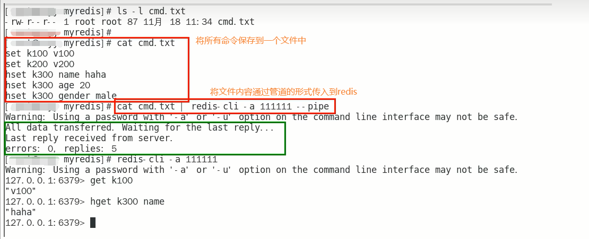
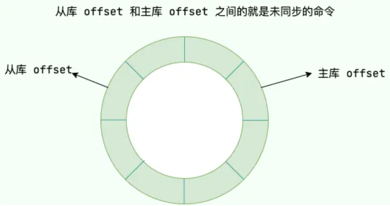
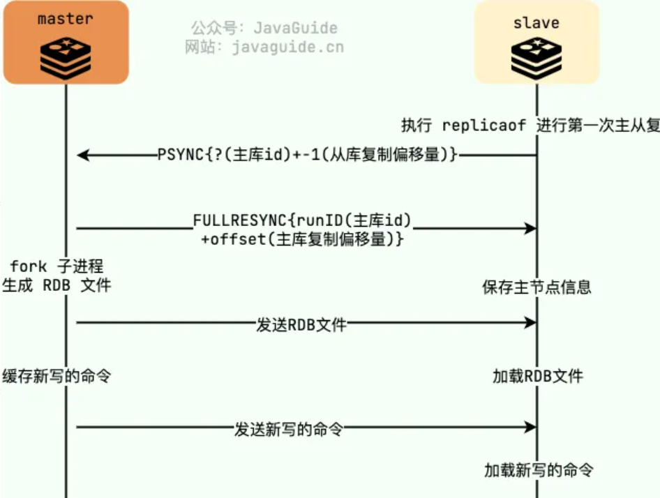

# 第01章_Redis概述

## 1. 简介

### 1.1 Redis

Redis，即Remote Dictionary Server(远程字典服务器)，是一个**高性能的key-value存储系统**，支持存储的value类型很多，包括string、hash、list、set、zset等。Redis由意大利人Antirez开发，是一个用C语言编写的NoSQL开源**内存数据库**。

Redis版本的命名规则：版本号第二位如果是奇数，则为非稳定版本（开发版本），如2.7、2.9、3.1等。如果是偶数，则为稳定版本，如2.8、3.2等。

### 1.2 NoSQL

NoSQL可以理解为`Non-relational SQL`或者`Not Only SQL`，泛指非关系型的数据库。它的产生就是为了解决大规模数据集合、多重数据种类带来的挑战。NoSQL主要分为以下四种：

**（1）键值存储数据库**

像Map一样存储key-value对。典型代表是Redis。

**（2）列存储数据库**

即按列来进行存储。关系型数据库时典型的行存储数据库，即一行一行地存储，它存在的问题是：按行存储的数据在物理层面占用的是连续存储空间，不适合海量数据分布式存储。而按列存储则可以实现分布式存储，适合海量存储。典型代表是HBase。

**（3）文档型数据库**

这是NoSQL与关系型数据的结合，它是最像关系型数据库的NoSQL。典型代表是MongoDB。

**（4）图形数据库**

用于存放一个节点关系的数据库，例如描述不同人之间的关系。典型代表是Neo4J。

### 1.3 Redis的应用场景

- 缓存
- 分布式锁
- 分布式Session

### 1.4 Redis的优势

- 性能极高：Redis读的速度是110000次/秒，写的速度是81000次/秒
- 简单稳定，源码精细而优雅
- Redis数据类型丰富，不仅仅支持简单的string类型的数据，同时还提供list，set，zset，hash等数据类型
- Redis支持数据的持久化，可以将内存中的数据保持在磁盘中，重启的时候可以再次加载进行使用
- Redis支持高可用集群

### 1.5 Redis性能极高的原因

1. Redis基于**内存**，内存的访问速度是磁盘的上千倍
2. Redis基于Reactor模式设计开发了一套高效的事件处理模型，主要是**单线程事件循环和IO多路复用**
3. Redis内置了多种**优化过的数据结构**，性能非常高

## 2. Linux上安装Redis

### 2.1 Linux环境要求

- Linux环境安装Redis必须先具备gcc编译环境。用以下命令查看gcc版本`gcc -v`
- 安装redis之前需要具备c++库环境，`yum -y install gcc-c++`

### 2.2 Redis安装步骤

（1）去官网下载Redis的安装包，选择redis7版本即可：https://redis.io/download/

（2）下载`redis-7.2.0.tar.gz`后将它上传到Linux目录`/opt`下

（3）解压后会得到一个redis-7.2.0目录

```shell
cd /opt
tar -zxvf redis-7.2.0.tar.gz
```

（4）进入该目录并执行make命令

```shell
cd /opt/redis-7.2.0
make && make install
```

（5）查看默认安装目录：`cd /usr/local/bin`

> 说明：Linux下的`/usr/local`类似Windows系统的`C:\Program Files`

- redis-benchmark: 性能测试工具，服务启动后运行该命令，可以查看自己电脑性能如何
- redis-check-aof: 修复有问题的AOF文件
- redis-check-rdb: 修复有问题的dump.rdb文件
- redis-cli: 客户端操作入口
- redis-sentinel: redis集群使用
- reids-server: redis服务器启动命令

（6）将默认的Redis配置文件`redis.conf`拷贝到自己定义好的一个路径下

```shell
mkdir /myredis
cp /opt/redis-7.2.0/redis.conf /myredis/redis.conf
```

（7）修改`/myredis`目录下`redis.conf`配置文件。注意，每次修改完Redis配置文件后，重启Redis服务器才能生效。

- 默认daemonize no，改为`daemonize yes`（第309行）
- 默认protected-mode yes，改为`protected-mode no`（第111行）
- 默认bind 127.0.0.1，将其`注释掉`或改为本机IP地址，因为默认bind 127.0.0.1只能本机访问，会影响远程IP连接。（第87行）
- 设置redis的密码，添加`requirepass 自己的密码`（第1045行）
- 设置redis的工作目录(用于保存RDB和AOF文件，建议改为绝对路径)，改为`dir /myredis/rdb-aof`（第510行）

（8）查看Redis版本：`redis-server -v`

### 2.3 启动Redis

**启动Redis服务器**，需要指定Redis的配置文件：

```shell
redis-server /myredis/redis.conf
```

**客户端连接Redis服务器**：

```shell
redis-cli -a abc666 -p 6379
```

- `-a`指定Redis的密码
- `-p`指定Redis的端口号（默认6379）
- 退出客户端可以使用`quit`命令

### 2.4 关闭Redis

- 在Redis服务器里面，可以直接使用`shutdown`命令来关闭Redis服务器
- 在Redis服务器外面，可以使用`redis-cli -a abc666 -p 6379 shutdown`来关闭Redis服务器

### 2.5 卸载Redis

首先关闭Redis服务器，然后删除`/usr/local/bin`目录下与redis相关的文件即可：

```shell
rm -rf /usr/local/bin/redis-*
```

## 3. Redis单线程模型

### 3.1 简介

Redis从整体上看是**多线程**的，即除了用于执行请求的主线程外，Redis的额外功能：如持久化RDB、AOF、异步删除UNLINK、集群数据同步等，都是使用额外的后台线程执行的。

Redis基于Reactor模式设计开发了一套高效的**事件处理模型**，这套事件处理模型对应的是Redis中的**文件事件处理器**。由于文件事件处理器是**单线程**方式运行的，所以我们一般都说 Redis 是单线程模型。

**注意**：文件事件处理器处理一个客户端请求，包括**网络IO**和**键值对读写**这两部分操作

- 在Redis5及之前，网络IO和键值对读写都是由主线程这一个线程完成的
- 在Redis6及之后，**默认**情况下网络IO和键值对读写仍然是由主线程这一个线程完成的。但是也**支持用多个线程处理网络IO**，不过**核心的键值对读写命令依然是主线程单线程执行**的。

### 3.2 文件事件处理器

文件事件处理器主要包含4个部分：

- 多个 socket（客户端连接）
- IO 多路复用程序（支持多个客户端连接的关键）
- 文件事件分派器（将 socket 关联到相应的事件处理器）
- 事件处理器（命令请求处理器、命令回复处理器、连接应答处理器、主从连接处理器等）


1. Redis能够监听大量的客户端连接，核心就是**IO多路复用程序**，它可以监听多个socket，将感兴趣的事件注册到内核中并监听每个事件是否发生。
2. 当被监听的socket准备好执行连接应答、读取、写入、关闭等操作时，与操作相对应的文件事件就会发生，于是就会被监听到。然后文件事件分派器就会将 socket 关联到相应的事件处理器，交给事件处理器来处理这些事件。

> **使用epoll函数的I/O多路复用技术让Redis不需要额外创建多余的线程来监听客户端的大量连接，降低了资源的消耗**

### 3.3 单线程网络IO

Redis5及之前，文件事件处理器处理网络IO只能使用单线程；Redis6及之后，文件事件处理器处理网络IO默认也使用单线程。Redis如此青睐单线程的原因主要有：

1. 单线程编程容易并且更容易维护，而多线程就会存在死锁、线程上下文切换等问题
2. Redis的性能瓶颈最主要是网络带宽，其次是内存大小，而**CPU并不是瓶颈**；

### 3.4 多线程网络IO

Redis6及之后，文件事件处理器处理网络IO支持使用多个线程，但是需要在配置文件中手动开启。使用多IO线程的主要原因是能够提高网络IO读写性能，提高网络请求处理的并行度。注意，Redis对于**键值对读写命令**的处理，始终使用的是**单一的主线程**。

> 说明：根据官网描述，除非性能达到瓶颈，需要加速网络IO处理，否则没有必要开启多线程网络IO

要开启多线程网络IO，需要在redis.conf中配置两项：

- `io-thread-do-reads yes`
- `io-threads num`：设置IO线程个数为num。官方建议设置的线程数要略小于机器核数。

### 3.5 Unix网络编程的五种IO模型

- Blocking IO（阻塞IO）
- NonBlocking IO（非阻塞IO）
- IO Multiplexing（IO多路复用）
- Signal Driven IO（信号驱动IO）
- Asynchronous IO（异步IO）

#### 1、BIO

BIO，即阻塞IO，当用户调用了如`read()`的系统调用后会切换到内核态，直到内核准备好数据后，再将数据拷贝到用户内存，期间用户线程始终处于阻塞状态。

很明显，BIO的缺点是**效率太低**。

#### 2、NIO

NIO，即非阻塞IO，当用户调用了非阻塞的`read()`函数后，切换到内核态，内核会立即返回结果（准备好了数据就返回数据，否则就告知用户尚未准备好数据），因此用户线程不会被阻塞。

NIO的缺点是需要用户**不断轮询**才能获取数据，大幅消耗CPU性能，而且每次轮询都需要进行内核态和用户态的切换，开销也很大。不仅如此，如果我们需要监听的文件描述符有很多，每次轮询都需要挨个遍历，也会大大影响效率。

#### 3、IO多路复用

IO多路复用，就是用一个线程来处理多个客户端连接。实现IO多路复用可以使用`select`、`poll`、`epoll`三个函数。

**select**

select函数实际上就是将NIO中用户态需要遍历的fd数组（监听的文件描述符数组）拷贝到了内核态，交给内核来遍历，从而节省了NIO遍历过程中用户态和内核态切换的开销。

缺点：

- fd数组有长度限制，至多为1024
- 每次轮询调用select函数时，需要将fd数组从用户态拷贝到内核大，开销也不低
- 其返回值是一个正整数，表示就绪的fd的个数，但具体是哪些fd就绪了，仍需用户自己重新遍历一次确定

**poll**

poll函数和select函数基本相同，只不过select函数最多监听1024个fd，而poll函数没有这一限制。

**epoll**

使用epoll函数实现IO多路复用，是将用户socket对应的文件描述符(FileDescriptor)注册进epoll，然后epoll帮你监听哪些socket上有消息到达，注意此时的socket应该采用**非阻塞的**。

可见，每个socket从用户态拷贝到内核态只会发生一次（注册进epoll的那一次），开销很小；而且，使用事件通知机制，当fd就绪后就会触发回调，而无需遍历所有fd，这就是**reactor模式**。

**总结**

|            | select         | poll         | epoll                |
| ---------- | -------------- | ------------ | -------------------- |
| 操作方式   | 遍历所有fd     | 遍历所有fd   | 回调，即事件通知机制 |
| 数据结构   | bitmap         | 数组         | 红黑树               |
| fd拷贝时机 | 每次调用select | 每次调用poll | fd首次注册进epoll    |

## 4. Redis内存管理

### 4.1 Redis的默认内存

通过命令`info memory`可以查看Redis的内存使用情况，通过命令`config get maxmemory`可以查看Redis的最大内存。我们可以看到，Redis的**默认内存大小为0**，表示不限制内存大小。

我们也可以在redis.conf的`MEMORY MANAGEMENT`模块下添加`maxmemory <bytes>`来设置Redis的最大内存大小，注意单位是字节。在生产上，一般推荐Redis设置内存为最大物理内存的3/4

**注意**：如果超出了Redis的最大内存，就会报OOM异常。所以Redis需要`删除过期key的策略`以及`缓存淘汰策略`。

### 4.2 删除过期key的策略

如果一个key过期了，实际上它未必是立即删除的，而是会依照设置的删除策略来进行删除。具体有以下三种删除策略：

**立即删除**

立即删除能保证过期的key会被马上删除，底层实现是依靠CPU的不断轮询，所以这种方式会给CPU带来巨大的压力，不推荐使用。

**惰性删除**

使用惰性删除时，当key到达过期时间后不会做任何处理，等到再次访问该key时再进行判断：如果未过期，则返回数据；如果已过期，才进行删除，并返回空。

这种方式会占用大量内存，如果一个key已经过期，但之后从不访问，就会一直存储在内存中，这就是一种`内存泄漏`。

**定期删除**

定期删除，就是每隔一段时间执行一次删除过期key的操作，且每次是随机抽取一部分key来检查是否过期，并不是检查所有key。

这种策略是折中的策略，但同样会导致一些key到了过期时间却没有被删除。如果采用这种策略，服务器必须根据实际情况，合理地设置删除操作的执行频率。

> Redis使用的策略是**定期删除和惰性删除结合**，其中定期删除是每隔100ms随机抽取一部分key检查是否过期。

### 4.3 内存淘汰策略

仅仅依靠`删除过期key的策略`，并不能保证Redis的内存不被耗尽。一方面，可能所有的key都没有过期时间，一直积攒在Redis中导致OOM；另一方面，可能一些已经过期的key也没有被删除（例如`惰性删除`中过期key没有被再次访问，或者`定期删除`中始终没有随机抽取到某些过期key），积攒在Redis中最终导致OOM。

因此，当Redis内存即将被耗尽时，就会采用`内存淘汰策略`来防止OOM。在redis.conf的`MEMORY MANAGEMENT`模块下，可以配置内存淘汰策略`maxmemory-policy 策略`，默认的策略为`noeviction`，一共有以下8种：

- `noeviction`：即使内存达到上限，也不会删除任何key，只不过接下来所有能引起内存增加的命令都会返回error
- `volatile-ttl`：删除剩余的过期时间最少的key
- `allkeys-random`：在所有key中，随机删除一个key
- `volatile-random`：在所有设置了过期时间的key中，随机删除一个key
- `allkeys-lru`：在所有key中，使用LRU算法删除一个key
- `volatile-lru`：在所有设置了过期时间的key中，使用LRU算法删除一个key
- `allkeys-lfu`：在所有key中，使用LFU算法删除一个key
- `volatile-lfu`：在所有设置了过期时间的key中，使用LFU算法删除一个key

> 说明：LRU算法即`最近最少使用`算法，会删除最长时间未被使用的key。LFU算法即`最近最不常用`算法，会删除在一定时间段内访问次数最少的key。

一般来说，在生产上我们推荐使用的内存淘汰策略是`allkeys-lru`


# 第02章_Redis数据类型基本使用

## 1. 简介

### 1.1 概述

Redis数据类型官网地址：https://redis.io/docs/data-types/

Redis常用命令官网地址：https://redis.io/commands/

Redis的数据类型指的是**value的数据类型**，而key的类型都是字符串。Redis常见的数据类型有：

- 5种基本数据类型：string(字符串)、list(列表)、hash(哈希表)、set(集合)、zset(有序集合)
- 其他特殊数据类型：Bitmap(位图)、HyperLogLog(基数统计)、GEO(地理空间)、Stream(流)、Bitfield(位域)

> 注意：Redis的命令不区分大小写，但key和value是区分大小写的。

### 1.2 操作key的常用命令

- `KEYS *`：查看当前库所有的key
- `EXISTS key`：判断当前库中某个key是否存在。这里key可以有多个，例如`EXISTS k1 k2 k3`，返回值是其中存在的key的数量。
- `TYPE key`：返回key对应的value类型，如果key在当前库中不存在，则返回none
- `DEL key`：删除指定key的键值对，删除存在的key会返回1，删除不存在的key会返回0。这种方式是原子地删除，只有完成删除后才会返回，所以删除一个大key会阻塞后面的操作。
- `UNLINK key`：非阻塞删除指定key的键值对，仅仅将key从keyspace元数据中删除，真正的删除会在后续异步中执行
- `EXPIRE key time`：为指定key设置过期时间（单位秒）
- `TTL key`：查看该key还有多少秒过期，-1表示永不过期，-2表示已过期
- `SELECT dbindex`：切换数据库（dbindex的范围是0-15），默认为0号数据库
- `MOVE key dbindex`：将当前数据库的key移动到指定的数据库中
- `DBSIZE`：查看当前数据库中key的数量
- `FLUSHDB`：清空当前数据库
- `FLUSHALL`：清空所有数据库
- `HELP @数据类型`：查看帮助文档，数据类型有string, list, hash, hyperloglog等

## 2. 字符串string

string是redis最基本的数据类型，它是二进制安全的，即可以是jpg图片或者序列化的对象。一个redis中字符串value最多可以是512M。

### 2.1 SET

SET命令是最常用的命令，其完整形式如下：

```
SET key value [NX | XX] [GET] [ttl setting]
```

- `NX`：当键不存在时才设置键值
- `XX`：当键存在时才设置键值
- `GET`：返回指定键原来的值(不存在则返回nil)，然后再进行设置
- `ttl setting`用于设置过期时间，可以选择以下五种格式之一：
  - `EX time`：以秒为单位设置过期时间
  - `PX time`：以毫秒为单位设置过期时间
  - `EXAT time`：设置以秒为单位的UNIX时间戳所对应的时间为过期时间
  - `PXAT time`：设置以毫秒为单位的UNIX时间戳所对应的时间为过期时间
  - `KEEPTTL`：保留设置前指定键的生存时间

**注意事项**：

1. 如果不使用`GET`参数，则SET命令的返回值是`OK`(设置成功)或`nil`(未执行该SET命令，例如不满足NX或XX条件等)
2. 为key设置新值时，如果不使用`KEEPTTL`参数，则会将原来的过期时间覆盖掉
3. SET命令如果使用EX、PX、NX参数，其效果基本等同于`SETEX`、`PSETEX`、`SETNX`命令，不过后面这三个命令在未来可能被淘汰。

- `SETEX key time value`：等同于`SET key value EX time`
- `SETNX key value`：效果基本等同于`SET key value NX`，只不过`SETNX`设置成功会返回1，设置失败会返回0

### 2.2 GET

- `GET key`：返回key对应的value值，若不存在则返回nil

### 2.3 批量设置/获取

- `MSET k1 v1 [k2 v2 ...]`：批量设置
- `MGET k1 [k2 ...]`：批量获取
- `MSETNX k1 v1 [k2 v2 ...]`：当前数据库中若k1,k2,...都不存在，才会进行批量设置（只要有一个存在，就都不会进行设置）

### 2.4 数值增减

> 注意：以下命令只能用于value为纯整数的字符串

- `INCR key`：将value增加1
- `DECR key`：将value减少1
- `INCRBY key num`：将value增加num
- `DECRBY key num`：将value减少num

### 2.5 设置/获取子字符串

- `GETRANGE key start end`：返回key对应的value字符串索引为`[start, end]`的子字符串。如果end为-1，表示最后一位索引。
- `SETRANGE key offset word`：对于key对应的value字符串，从索引为offset开始逐个字符替换为word

举例：

```shell
127.0.0.1:6379> set k1 abcd1234
OK
127.0.0.1:6379> GETRANGE k1 0 -1
"abcd1234"
127.0.0.1:6379> GETRANGE k1 1 3
"bcd"
127.0.0.1:6379> SETRANGE k1 1 xxx
(integer) 8
127.0.0.1:6379> get k1
"axxx1234"
```

### 2.6 其他字符串操作

- `STRLEN key`：返回value字符串的长度
- `APPEND key str`：在value字符串后追加内容str
- `GETSET key newValue`：返回key对应的旧value值，并将其设置为newValue

## 3. 列表list

list底层是一个双向链表，容量是`2^32-1`，其中的每个元素都是字符串。对两端的操作性能很高，通过索引下标操作中间的节点性能较差。注意，如果列表中的元素被全部删除，则会自动删除key。

### 3.1 核心操作

- `LPUSH key element1 [element2 ...]`：在列表左端插入element1，然后在新列表左端再插入element2，依次类推。
- `RPUSH key element1 [element2 ...]`：在列表右端插入element1，然后在新列表右端再插入element2，依次类推。
- `LRANGE key start end`：返回列表索引范围`[start, end]`的元素。如果end为-1，表示最后一位索引。
- `LPOP key`：返回并删除列表最左端的元素
- `RPOP key`：返回并删除列表最右端的元素
- `LINDEX key index`：返回列表索引为index的元素（index为-1表示最后一位索引）。如果不存在该元素，则返回nil。
- `LSET key index val`：将列表索引index处的值修改为val
- `LLEN key`：返回列表中的元素个数

### 3.2 其他操作

- `LREM key num val`：对列表从左至右删除num个值为val的元素，返回实际删除的元素个数。如果num为0，则表示删除列表中所有值为val的元素。
- `LTRIM key start end`：只保留该列表索引范围`[start, end]`的元素，其他元素全部删除
- `RPOPLPUSH source destination`：删除source对应的列表的最右边元素，并将该元素添加到destination对应的列表的最左边，然后返回该元素
- `LINSERT key BEFORE oldVal newVal`：在列表的第一个oldVal元素前插入newVal。如果列表中不存在元素oldVal，则插入失败。
- `LINSERT key AFTER oldVal newVal`：在列表的第一个oldVal元素后插入newVal。如果列表中不存在元素oldVal，则插入失败。

## 4. 哈希表hash

hash中存储string键值对，通常将hash中存储的键称为field(字段)，可见hash特别适合存储对象信息。Redis中每个hash可以存储`2^32-1`个键值对。

### 4.1 核心操作

- `HSET key field1 value1 [field2 value2 ...]`：批量给哈希表中添加键值对。还有个命令`HMSET`功能与之相同，不过`HMSET`已经被弃用。
- `HGET key field`：获取哈希表中field对应的值
- `HMGET key field1 [field2 ...]`：批量获取哈希表中字段field1,field2,...对应的值
- `HGETALL key`：获取哈希表中的所有键值对
- `HDEL key field1 [field2 ...]`：批量删除哈希表中的键值对

### 4.2 其他操作

- `HLEN key`：返回哈希表中键值对的数量
- `HEXISTS key field`：判断field字段是否在哈希表中
- `HKEYS key`：返回哈希表中的所有键
- `HVALS key`：返回哈希表中的所有值
- `HINCRBY key field integer`：给哈希表中field对应的值增加整数integer。注意，该命令要求field对应的值必须是整数。
- `HINCRBYFLOAT key field float`：给哈希表中field对应的值增加小数float。注意，该命令要求field对应的值必须是浮点数。
- `HSETNX key field value`：如果哈希表中不存在字段field，则添加键值对，并返回1；否则，不进行添加，并返回0

## 5. 集合set

set是用于存储string类型元素的无序集合，集合中的元素是唯一的。set底层同样是采用哈希表实现的，一个set中最大能存储`2^32-1`个元素。

### 5.1 核心操作

- `SADD key member1 [member2 ...]`：批量给集合中添加元素
- `SMEMBERS key`：返回集合中的所有元素
- `SISMEMBER key member`：判断member是否在集合中
- `SREM key member1 [member2 ...]`：批量删除集合中的元素
- `SCARD key`：返回集合中的元素个数
- `SRANDMEMBER key [count]`：从集合中随机展示count个元素。如果不写count，默认count为1。
- `SPOP key [count]`：从集合中随机删除count个元素并返回。如果不写count，默认count为1。
- `SMOVE source destination member`：将集合source中的元素member删除，并将该元素添加到集合destination中

### 5.2 集合间的运算

- `SDIFF key1 [key2 key3 ...]`：差集运算，返回属于集合key1，但不属于集合key2,key3,...的元素
- `SUNION key1 [key2 key3 ...]`：并集运算，返回所有集合的并集中的元素
- `SINTER key1 [key2 key3 ...]`：交集运算，返回所有集合的交集中的元素
- `SINTERCARD numkeys key1 [key2 ...] [LIMIT limit]`：返回所有集合的交集中的元素个数。numkeys指定集合的个数，必须与后面key的数量一致。limit用于限制最大返回值，即如果交集元素个数已经达到limit就直接返回limit，不再进行后续运算。默认不添加limit就表示不进行限制。

## 6. 有序集合zset

zset，即sorted set，它也是string类型元素的集合，且不允许重复的元素，只不过每个元素都会关联一个double类型的分数(score)，Redis正是通过分数来为集合中的成员进行**从小到大**的排序。

注意，zset中的每个string元素是唯一的，但是score可以重复。zset底层同样是通过哈希表实现的，每个zset中最多可以存储`2^32-1`个元素。

### 6.1 核心操作

- `ZADD key score1 member1 [score2 member2 ...]`：批量给有序集合中添加元素，其中score必须是double类型数值的字符串
- `ZSCORE key member`：返回元素member对应的score
- `ZCARD key`：返回zset中的元素数量
- `ZREM key member1 [member2 ...]`：批量删除zset中的元素

### 6.2 范围查询

- `ZRANGE key start end [WITHSCORES]`：按照分数从小到大的顺序返回索引范围`[start,end]`的所有元素。如果不加参数WITHSCORES，则只返回元素；如果加参数WITHSCORES，则返回元素和对应的分数。
- `ZREVRANGE key start end [WITHSCORES]`：获取zset对应的反序集合(即从大到小排列)的索引范围`[start,end]`的所有元素
- `ZCOUNT key min max`：返回分数范围`[min,max]`中的元素个数。注意，min和max可以写成如`(min`的形式，表示不包含等于该min值的分数。
- `ZRANGEBYSCORE key min max [WITHSCORES] [LIMIT offset count]`：返回分数范围`[min,max]`中的元素，其中min和max同样可以写成如`(min`的形式。LIMIT参数用于限制结果集的返回，即返回结果集中从索引offset开始的至多count个元素。

举例：

```shell
127.0.0.1:6379> ZADD zset 60 haha60 70 haha70 80 haha80 90 haha90
(integer) 4
127.0.0.1:6379> ZRANGEBYSCORE zset 60 (90
1) "haha60"
2) "haha70"
3) "haha80"
127.0.0.1:6379> ZRANGEBYSCORE zset 60 90 LIMIT 1 2
1) "haha70"
2) "haha80"
```

### 6.3 其他操作

- `ZINCRBY key increment member`：给元素member对应的分数增加increment
- `ZRANK key member [WITHSCORE]`：返回元素member的索引。如果加了WITHSCORE参数，还会返回其对应的score。
- `ZREVRANK key member [WITHSCORE]`：返回元素member在zset对应的反序集合中的索引。
- `ZMPOP numkeys key1 [key2 ...] MIN|MAX [COUNT count]`：先找到key1,key2,...中的第一个非空zset，然后弹出该zset中的count个最小(或最大)元素。注意，numkeys必须与后面写的zset个数相匹配；不加COUNT关键字默认count为1。

举例：

```shell
127.0.0.1:6379> ZADD zset1 100 haha100 110 haha110
(integer) 2
127.0.0.1:6379> ZADD zset2 80 haha80 90 haha90
(integer) 2
127.0.0.1:6379> ZMPOP 2 zset1 zset2 MIN COUNT 3
1) "zset1"
2) 1) 1) "haha100"
      2) "100"
   2) 1) "haha110"
      2) "110"
```

## 7. 其他数据类型

### 7.1 位图Bitmap

bitmap是一个bit数组，用string类型作为底层数据类型，即8个bit对应一个字符。底层占用的字节大小，取决于最右边的1的位置。例如给位图设置索引0处的值为1，索引7处的值为1，则只占用1个字节；但如果设置索引8处的值为1，则占用2个字节。

> bitmap支持的最大位数是`2^32`个bit

**常用命令**如下：

- `SETBIT key offset val`：给位图的索引offset位赋值为val，注意val只能是0或者1
- `GETBIT key offset`：获取位图的索引offset位的值
- `BITCOUNT key [start end]`：返回位图的索引范围`[start, end]`中值为1的个数。不写索引范围，默认`[0, -1]`。
- `STRLEN key`：返回位图底层占用的字节数
- `BITOP AND|OR|XOR|NOT destkey key1 key2`：对key1与key2进行按位与、或、异或、取反(取反操作只能写key1，不能写key2)，然后将结果保存到destkey

举例：

```sql
127.0.0.1:6379> SETBIT key 3 1
(integer) 0
127.0.0.1:6379> SETBIT key1 1 1
(integer) 0
127.0.0.1:6379> SETBIT key2 1 1
(integer) 0
127.0.0.1:6379> SETBIT key2 0 1
(integer) 0
127.0.0.1:6379> BITOP AND key key1 key2
(integer) 1
127.0.0.1:6379> GETBIT key 0
(integer) 0
127.0.0.1:6379> GETBIT key 1
(integer) 1
127.0.0.1:6379> GETBIT key 3
(integer) 0
```

### 7.2 基数统计HyperLogLog

基数统计，就是用于统计一个集合中不重复的元素个数，也就是对集合去重后计算剩余元素的个数。HyperLogLog的优点是：在输入元素的数量或者体积非常大时，计算基数所需的空间总是固定的、并且是很小的，因为HyperLogLog采用的是一种概率算法（所以并不保证百分百精确，不过误差率只有`0.81%`）。

注意，HyperLogLog只会根据输入元素来计算基数，而不会存储输入元素本身，所以HyperLogLog无法返回输入的各个元素。HyperLogLog的底层数据类型同样是string类型。

**常用命令**如下：

- `PFADD key element1 [element2 ...]`：添加指定元素到HyperLogLog中
- `PFCOUNT key`：返回HyperLogLog的基数统计值
- `PFMERGE destkey sourcekey`：将sourcekey中的元素添加到destkey中

举例：

```sql
127.0.0.1:6379> PFADD key 1 1 2 5 3 3 2 4 4
(integer) 1
127.0.0.1:6379> PFCOUNT key
(integer) 5
127.0.0.1:6379> PFADD key2 5 5 4 6
(integer) 1
127.0.0.1:6379> PFMERGE key key2
OK
127.0.0.1:6379> PFCOUNT key
(integer) 6
127.0.0.1:6379> PFCOUNT key2
(integer) 3
```

### 7.3 地理空间GEO

GEO主要用于存储地理位置信息，并对存储的信息进行操作，能够根据用户给定的经纬度坐标来获取指定范围内的地理位置集合。GEO的底层数据类型是zset类型。

**常用命令**如下：

- `GEOADD key x1 y1 member1 [x2 y2 member2 ...]`：批量插入经纬度坐标。x1代表经度，y1代表纬度，member1是元素名称。
- `GEOPOS key member1 [member2 ...]`：返回元素的经纬度坐标
- `GEODIST key member1 member2 [M|KM|FT|MI]`：返回两个位置之间的距离，单位可以是米、千米、英寸、英里
- `GEORADIUS key x1 y1 radius M|KM|FT|MI [WITHCOORD] [WITHDIST]`：以给定的经纬度为中心，返回集合中与该中心距离不超过给定距离的所有元素。参数WITHCOORD表示将元素的经纬度一并返回，参数WITHDIST表示将元素与指定中心间的距离也一并返回。

举例：

```sql
127.0.0.1:6379> GEOADD key 116.4 39.9 gugong 116.0 40.4 changcheng
(integer) 2
127.0.0.1:6379> GEOPOS key gugong changcheng
1) 1) "116.39999896287918091"
   2) "39.90000009167092543"
2) 1) "116.00000113248825073"
   2) "40.39999918756212338"
127.0.0.1:6379> GEODIST key gugong changcheng KM
"65.1861"
127.0.0.1:6379> GEORADIUS key 116 40 50 KM WITHCOORD WITHDIST
1) 1) "changcheng"
   2) "44.4904"
   3) 1) "116.00000113248825073"
      2) "40.39999918756212338"
2) 1) "gugong"
   2) "35.8743"
   3) 1) "116.39999896287918091"
      2) "39.90000009167092543"
```

### 7.4 流Stream

Stream就是Redis版的消息中间件+阻塞队列，生产上基本不使用。推荐使用Kafka、RabbitMQ、RocketMQ等做专业的消息中间件。

### 7.5 位域Bitfield

BITFIELD命令可以将一个Redis字符串看作是一个由二进制位组成的数组，并对这个数组中任意偏移进行访问，也就是对比特位域(连续的多个比特位)进行操作。

## 8. 应用场景

### 8.1 存储对象

当我们存储对象时，一般会考虑使用string类型或者hash类型。String存储的是序列化后的整个对象数据，而Hash是对对象的每个字段单独存储。因此，当要频繁修改对象中的某个字段时，使用Hash更好。而String存储更加节省内存，缓存相同的对象，String消耗的内存约是Hash的一半。

> 因此，在绝大部分情况下我们**建议使用String来存储对象数据**。

### 8.2 实现购物车

由于购物车中的商品频繁修改和变动，购物车信息建议使用 Hash 存储：

- 用户 id 为 key
- 商品 id 为 field，商品数量为 value

> 这里只是以业务比较简单的购物车场景举例，实际电商场景下，field 只保存一个商品 id 是没办法满足需求的。

### 8.3 实现排行榜

zset（有序集合）数据类型经常被用于做排行榜，常用到的命令有：

- `ZRANGE`：从小到大排序
- `ZREVRANGE`：从大到小排序
- `ZREVRANK`：指定元素排名

### 8.4 实现抽奖系统

set数据类型可以实现一个简单的抽奖系统，常用到的命令有：

- `SADD`：向指定集合添加元素
- `SPOP`：随机移除并获取指定集合中一个或多个元素，适用于不允许重复中奖的场景
- `SRANDMEMBER`：随机获取指定集合中一个或多个元素，适用于允许重复中奖的场景

### 8.5 统计活跃用户

可以使用Bitmap统计活跃用户，能极大节省存储空间：可以使用日期作为key，然后用户id作为offset，如果用户当日活跃过就设置为1。

- 使用`BITCOUNT`就能统计当日的活跃用户数
- 如果要统计多日的总活跃用户数，可以使用`BITOP OR`对多个key进行`或运算`，然后再使用`BITCOUNT`统计1的个数

### 8.6 统计页面UV

可以使用HyperLogLog统计页面UV（独立访客数），主要用到以下命令：

- `PFADD`：添加一个或多个用户id到HyperLogLog中
- `PFCOUNT`：获取HyperLogLog中的唯一计数


# 第03章_Redis数据类型底层实现

## 1. 简介

### 1.1 键值对的存储结构

Redis是key-value数据库，每个键值对使用结构体`dictEntry`保存，各个dictEntry之间是单链表结构：

```c
typedef struct dictEntry {
    void *key; // 指向key的指针
    union {
        void *val; // 指向value的指针
        uint64_t u64;
        int64_t s64;
        double d;
    } v;
    struct dictEntry *next; // 指向下一个dictEntry
    void *metadata[];
} dictEntry;
```

Redis中的key都是字符串类型，底层存储在SDS结构体中。而Redis中的value有各种不同的数据类型，底层统一存储在结构体`redisObject`中：

```c
typedef struct redisObject {
    unsigned type:4;
    unsigned encoding:4;
    unsigned lru:LRU_BITS;
    int refcount;
    void *ptr;
} robj;
```

- `type`字段表示当前value对象的数据类型，即string、list、hash、set、zset、stream。Bitmap实质是string，HyperLogLog实质是string，GEO实质是zset，bitfield看具体key。
- `encoding`字段表示当前value对象底层存储的编码类型
- `lru`字段用于保存缓存淘汰策略中LRU算法或者LFU算法的相关信息，例如对于LRU算法，该字段就保存该对象最后一次被访问的时间戳
- `refcount`字段记录该对象被引用的次数
- `ptr`是指向真正的底层数据结构的指针

### 1.2 Redis底层使用的数据结构

- 简单动态字符串SDS
- 整数集合intset
- 哈希表hashtable
- 跳表skiplist
- 快速列表quicklist
- 压缩列表ziplist
- 紧凑列表listpack

### 1.3 各个数据类型对应的数据结构

在Redis7之前，各个数据类型底层采用的数据结构为：

- `string`：采用 SDS
- `set`：采用 intset + hashtable
- `zset`：采用 skiplist + ziplist
- `list`：采用 quicklist（内部节点使用ziplist）
- `hash`：采用 hashtable + ziplist

在Redis7中，上述**使用到的`ziplist`均被`listpack`取代**。

## 2. string底层实现

string对应的redisObject中的encoding字段（编码类型）有三种取值，如下所示：

```sql
127.0.0.1:6379> set k1 123456789
OK
127.0.0.1:6379> OBJECT ENCODING k1
"int"
127.0.0.1:6379> set k1 12345678abcdsf
OK
127.0.0.1:6379> OBJECT ENCODING k1
"embstr"
127.0.0.1:6379> set k1 12345678abcdsfaaaaaaaaaaaaaaaaaaaaaaaaaaaaaaaaaaaaaaaaaaaaaaaaaaaaaa
OK
127.0.0.1:6379> OBJECT ENCODING k1
"raw"
```

> 说明：使用`OBJECT ENCODING key`命令可以查看value的编码类型。

### 2.1 int

如果string的内容是一个**long类型的有符号整数**（即不超过64bit），则会使用`int`编码类型。此时，redisObject中的`ptr`字段**直接赋值为该整数值**，而不再是使用指针。

如果编码类型不是`int`，而是`embstr`或者`raw`，则ptr字段是一个指向SDS结构的指针。**SDS即简单动态字符串(simple dynamic string)，是Redis中用于保存字符串的结构**，如下图所示，SDS结构底层使用名字为`sdshdr + 数字n`的结构体实现，这样可以更精确控制结构体的大小，因为`n`就表示该结构体的大小不超过`2^n`字节：


- `len`字段记录实际存储的字符串长度
- `alloc`字段记录buf数组的长度
- `flags`字段标识sds类型，即标识到底是`sdshdr8`还是`sdshdr16`等等
- `buf[]`字符数组用来实际存储字符串

Redis中使用自己定义的SDS结构来存储字符串，而不是像C语言一样直接用`char[]`来存储，其**原因**是：

1. 使用SDS能**在`O(1)`时间得到字符串长度**；而C语言中`char[]`保存的字符串，要获取其长度必须从头开始遍历。
2. 使用SDS**分配空间更灵活**，因为预分配的`buf[]`数组长度是大于字符串实际长度的，便于字符串的拼接或删除；而C语言中`char[]`长度固定，拼接字符串只能重新分配内存空间。
3. SDS是**二进制安全**的，根据`len`字段确定字符串的结束位置；而C语言中用`\0`标记字符串的结束位置，如果字符串内容本身包含一些`\0`字符，就无法读取原本的字符串内容。

### 2.2 embstr

如果string不满足`int`编码类型的条件，并且字符串数据小于等于44字节，则会采用`embstr`编码类型。使用这种编码类型，会用一块连续的内存空间来存储redisObject和sdshdr结构，即sdshdr结构体紧跟着redisObject结构体存储，这样就避免了内存碎片。

### 2.3 raw

如果字符串数据大于44字节，则会采用`raw`编码类型。使用这种编码类型，redisObject和sdshdr结构并不是连续的。

注意，还有一种特殊情况，也会采用`raw`编码类型，如下所示：

```sql
127.0.0.1:6379> set k1 a
OK
127.0.0.1:6379> OBJECT ENCODING k1
"embstr"
127.0.0.1:6379> APPEND k1 b
(integer) 2
127.0.0.1:6379> get k1
"ab"
127.0.0.1:6379> OBJECT ENCODING k1
"raw"
```

对于`embstr`，它的实现是只读的，所以对其进行修改，就会转化为`raw`，无论它是否超过了44字节。

## 3. hash底层实现

### 3.1 简介

hash对应的redisObject中的encoding字段（编码类型）有两种取值：`listpack`(Redis7之前是`ziplist`)和`hashtable`。

默认情况下：

- 当hash要保存的键值对数量不超过512个，且每个键、每个值的大小都不超过64字节时，编码类型为`listpack`，即底层采用紧凑列表的数据结构。（Redis7之前是`ziplist`，即压缩列表）
- 只要不满足上述条件，编码类型就是`hashtable`，即底层采用哈希表的数据结构。

> 注意：从listpack(ziplist)可以升级为hashtable，但hashtable是不会降级为listpack(ziplist)的（无论怎么删除或修改元素）。

### 3.2 hashtable

这种数据结构就是我们熟知的哈希表，在C语言中使用数组和链表实现。每个键值对都封装为一个dictEntry进行存储。

### 3.3 ziplist

当hash要保存的数据较小时，Redis7之前就采用ziplist来保存键值对。ziplist是占用连续内存的数据结构，其特点是占用空间小，但读写速度较慢。具体结构如下：


- `zlbytes`记录压缩列表所占用的内存字节数
- `zltail`记录尾节点至起始节点的偏移量
- `zllen`记录节点个数
- `entry`表示每个节点，长度不固定，主要是保存键值对数据
- `zlend`是一个固定的值`0xFF`，用于标记压缩列表的末端

其中，`entry`的具体核心结构如下：

- `prevlen`记录前一个节点的长度，该字段要么是1字节、要么是5字节。注意，虽然1字节也能表示数值255，但会与压缩列表的末端标记`zlend`冲突，所以要避免使用`0xFF`。
- `encoding`记录当前节点实际数据类型及长度
- `entrydata`记录当前节点实际保存的键值对数据

使用ziplist，而不是单独的链表，主要原因是：

1. 链表的遍历需要寻址、效率较慢；而ziplist占用连续内存，遍历速度很快。
2. 链表还需维护前后指针，占用空间较大

然而，ziplist有一个致命缺点，也就是它会产生**连锁更新现象**：因为它的每个entry都维护了前一个entry的长度，所以一旦某个entry长度增大，就可能导致后面的entry中`prevlen`字段的大小从1字节变为5字节，导致后续entry连锁地更新长度。正是由于这个致命缺点，所以在Redis 7中使用了新的数据结构listpack取代了ziplist。

### 3.4 listpack

当hash要保存的数据较小时，Redis7中采用listpack来保存键值对，它解决了ziplist的致命缺点，具体结构如下：


- `tot-bytes`记录紧凑列表所占用的内存字节数
- `num-elements`记录节点个数
- `element`表示每个节点，长度不固定，主要是保存键值对数据
- `listpack-end-byte`是一个固定的值`0xFF`，用于标记紧凑列表的末端

其中，`element`的具体核心结构如下：

- `encoding-type`记录当前节点实际数据类型
- `element-data`记录当前节点实际保存的键值对数据
- `element-lot-len`记录encoding-type和element-data这两部分的总长度

> 可见，listpack的每个节点会记录自己的长度并放在尾部，而不再维护前一个节点的长度，所以就彻底解决了ziplist的连锁更新问题。

## 4. list底层实现

list对应的redisObject中的encoding字段（编码类型）只有一种，即`quicklist`，也就意味着它底层使用的数据结构是quicklist。在Redis7之前，quicklist其实就是`双向链表`和`ziplist`的混合体，也就是将双向链表按段切分，每一段使用`ziplist`来紧凑存储，如下图所示：


而在Redis7中，list底层使用的数据结构仍然是quicklist，只不过将节点内部使用的`ziplist`更改成了`listpack`。

## 5. set底层实现

set对应的redisObject中的encoding字段（编码类型）有两种：`intset`和`hashtable`

- 如果set中每个元素都是long类型的有符号整数（即不超过64bit），且set中的元素数量不超过512个，则使用`intset`数据结构
- 否则，就使用`hashtable`数据结构

## 6. zset底层源码

### 6.1 简介

zset对应的redisObject中的encoding字段（编码类型）有两种：`skiplist`和`listpack`(Redis7之前是`ziplist`)

- 如果zset中每个元素的大小不超过64字节，且zset中的元素数量不超过128个，则使用`listpack`(`ziplist`)数据结构
- 否则，就使用`skiplist`数据结构

### 6.2 skiplist

skiplist(跳表)这种数据结构，采用概率平衡而不是严格强制的平衡，因此跳表插入和删除操作更为简单，而且速度更快（相比于平衡树）。


**规则：$S_k$中的每个关键码，在$S_{k+1}$中依然出现的概率均为1/2**。因此根据概率论的知识，期望的节点总数为`O(n)`，即跳表占用的空间期望为`O(n)`。

跳表的**查找**过程：从顶层开始横向扫描，根据碰到的关键码决定是否转入下层，以此类推。根据概率论的知识，查找的时间复杂度期望为`O(log n)`，因为跳表的最高塔高是`O(log n)`的概率极大，而每层的横向跳转的期望次数是`O(1)`。

跳表的**插入**过程：首先查找定位到底层的插入位置，然后根据概率规则来纵向生成塔。所以插入的时间复杂度期望为`O(log n)`

跳表的**删除**过程：定位到要删除的节点值后移除这座塔。所以删除的时间复杂度期望为`O(log n)`

### 6.3 选择跳表的原因

zset底层使用跳表，而不是平衡树、红黑树、B+树，原因在于：

**平衡树**的插入、删除、查询的时间复杂度和跳表一样都是`O(log n)`，对于范围查询来说，平衡树也可以通过中序遍历的方式达到和跳表一样的效果。但是它的每一次插入或者删除操作都需要保证整颗树左右节点的绝对平衡，只要不平衡就要通过旋转操作来保持平衡，除了红黑树以外，其他大多数平衡树（例如AVL树）最坏情况需要`O(log n)`次旋转才能维持平衡，耗时极高。而跳表使用概率平衡，并不是严格强制的平衡，因此，跳表中的插入和删除速度快得多。

**红黑树**虽然插入和删除时最坏情况只有`O(1)`次旋转、`O(log n)`次染色，但是红黑树的实现比跳表复杂得多。而且，如果按照区间来查找数据，红黑树的效率没有跳表高。

**B+树**更适合作为数据库和文件系统中常用的索引结构，它的核心思想是通过尽可能少的 IO 定位到尽可能多的索引来获得查询数据。而 Redis 作为内存数据库本身就不可能存储大量的数据，所以B+树的意义并不大。


# 第04章_SpringBoot整合Redis

## 1. 简介

### 1.1 Jedis和Lettuce

Java可以通过JDBC来操作MySQL。同样，Java也可以使用Redis的客户端来操作Redis。

第一种方式是使用Jedis。Jedis Client是Redis官网推荐的一个面向Java的客户端，但这种方式，每个线程都要用自己创建的Jedis实例去连接Redis服务器，开销大并且线程不安全。所以这种方式现在基本已经不使用了。

第二种方式是使用Lettuce。它可以使多个线程共享一个Lettuce连接，开销低且线程安全。SpringBoot2.0之后默认都是使用Lettuce这个客户端连接Redis服务器。

在SpringBoot中，我们一般都**使用RedisTemplate来操作Redis**，其底层封装的就是Lettuce。

### 1.2 自动配置原理


根据SPI文件知，Redis场景导入的自动配置类有以上三个。其中RedisReactiveAutoConfiguration与响应式编程有关，RedisRepositoriesAutoConfiguration与JPA操作有关。所以我们接下来关注**RedisAutoConfiguration自动配置类**，它的源码如下：

源码如下：

```java
@AutoConfiguration
@ConditionalOnClass({RedisOperations.class})
@EnableConfigurationProperties({RedisProperties.class})
@Import({LettuceConnectionConfiguration.class, JedisConnectionConfiguration.class})
public class RedisAutoConfiguration {
    public RedisAutoConfiguration() {
    }

    @Bean
    @ConditionalOnMissingBean(
        name = {"redisTemplate"}
    )
    @ConditionalOnSingleCandidate(RedisConnectionFactory.class)
    public RedisTemplate<Object, Object> redisTemplate(RedisConnectionFactory redisConnectionFactory) {
        RedisTemplate<Object, Object> template = new RedisTemplate();
        template.setConnectionFactory(redisConnectionFactory);
        return template;
    }

    @Bean
    @ConditionalOnMissingBean
    @ConditionalOnSingleCandidate(RedisConnectionFactory.class)
    public StringRedisTemplate stringRedisTemplate(RedisConnectionFactory redisConnectionFactory) {
        return new StringRedisTemplate(redisConnectionFactory);
    }
}
```

- 开启了属性绑定：属性类RedisProperties绑定了所有以`spring.data.redis`为前缀的配置项。
- 添加组件`LettuceConnectionConfiguration`：它给容器中注入了连接工厂LettuceConnectionFactory，和操作redis的客户端DefaultClientResources。注意，Lettuce是默认使用的Redis客户端。
- 添加组件`RedisTemplate<Object, Object>`：用于操作Redis，默认采用的是JDK的序列化策略，保存的key和value都是采用此策略序列化保存的。
- 添加组件`StringRedisTemplate`：同样用于操作Redis，默认采用的是String的序列化策略，保存的key和value都是采用此策略序列化保存的。

> 一般我们更多使用StringRedisTemplate来操作Redis。

## 2. 基本配置

### 2.1 添加依赖

```xml
<dependency>
    <groupId>org.springframework.boot</groupId>
    <artifactId>spring-boot-starter-data-redis</artifactId>
</dependency>
```

### 2.2 配置文件(单机)

```properties
spring.data.redis.host=192.168.231.120
spring.data.redis.port=6379
spring.data.redis.password=abc666
```

> 补充：参数spring.data.redis.database可以配置连接的数据库，不配置默认连接0号库。

### 2.3 配置文件(集群)

使用如下配置文件，然后启动6台redis集群即可：

```properties
spring.data.redis.password=abc666
# 获取失败时的最大重定向次数
spring.data.redis.cluster.max-redirects=3
# 支持集群拓扑动态感应刷新
spring.data.redis.lettuce.cluster.refresh.adaptive=true
# 定时刷新
spring.data.redis.lettuce.cluster.refresh.period=2000
# 集群节点
spring.data.redis.cluster.nodes=192.168.231.121:6381,192.168.231.121:6382,192.168.231.122:6383,192.168.231.122:6384,192.168.231.123:6385,192.168.231.123:6386
```

**注意**：我们一定要设置SpringBoot支持集群拓扑动态感应刷新的配置。否则，SpringBoot客户端(Lettuce)就不会动态感知Redis的最新集群信息，这样一旦有一台master宕机，虽然Redis集群可以完成主从切换，但SpringBoot却感知不到，就不会刷新节点拓扑，导致连接不上。

## 3. 常用API

RedisTemplate是一个对Redis进行操作的模板类。该模板类中具有很多方法，其中很多与Redis操作命令同名或类似，例如`delete()`, `keys()`, `scan()`, `multi()`, `exec()`等。除此之外，还有两类对各种value类型操作的方法：`boundXxxOps(key)`与`opsForXxx()`。

```java
@RestController
public class RedisController {
    @Autowired
    private StringRedisTemplate template;

    @GetMapping("/string")
    public void string() {
        // 操作string类型：template.opsForValue()
        template.opsForValue().set("key1", "abc666");
        String val = template.opsForValue().get("key1");
        System.out.println(val); // abc666
    }

    @GetMapping("/list")
    public void list() {
        // 操作list类型：template.opsForList()
        template.opsForList().leftPushAll("list", "1", "2", "3");
        String s = template.opsForList().leftPop("list");
        System.out.println(s); // 3
    }

    @GetMapping("/hash")
    public void hash() {
        // 操作hash类型：template.opsForHash()
        template.opsForHash().put("hash", "k1", "v1");
        template.opsForHash().put("hash", "k2", "v2");
        Object obj = template.opsForHash().get("hash", "k1");
        System.out.println(obj); // v1
    }

    @GetMapping("/set")
    public void set() {
        // 操作set类型：template.opsForSet()
        template.opsForSet().add("set", "1", "2", "3");
        Boolean flag = template.opsForSet().isMember("set", "4");
        System.out.println(flag); // false
    }

    @GetMapping("/zset")
    public void zset() {
        // 操作zset类型：template.opsForZSet()
        template.opsForZSet().add("zset", "zhangsan", 90.0);
        template.opsForZSet().add("zset", "lisi", 91.5);
        template.opsForZSet().add("zset", "wangwu", 89.2);
        ZSetOperations.TypedTuple<String> max = template.opsForZSet().popMax("zset");
        System.out.println(max.getValue() + "==>" + max.getScore()); // lisi==>91.5
    }
}
```

## 4. 定制化

### 4.1 序列化机制

如果我们想给Redis中保存对象，也可以使用RedisTemplate，但它使用的是默认的jdk序列化机制，会导致Redis中保存的对象呈现出一堆乱码。为了系统的兼容性，所有对象都应该以json的方式进行保存。所以，我们需要写一个配置类，来改变默认的序列化器：

```java
@Configuration
public class AppRedisConfiguration {
    @Bean
    public RedisTemplate<Object, Object> redisTemplate(RedisConnectionFactory redisConnectionFactory) {
        RedisTemplate<Object, Object> template = new RedisTemplate();
        template.setConnectionFactory(redisConnectionFactory);
        // 把对象转为json字符串的序列化器
        template.setDefaultSerializer(new GenericJackson2JsonRedisSerializer());
        return template;
    }
}
```

> 参数redisConnectionFactory，是SpringBoot自动给我们注入的连接工厂。只有获取连接后，才能用RedisTemplate等工具类操作Redis。
> 
> GenericJackson2JsonRedisSerializer序列化器，可以使得Object类型的key-value，都被转为json字符串进行存储

**测试**：

```java
@RestController
public class RedisJsonController {
    @Autowired
    private RedisTemplate<Object, Object> redisTemplate;

    @GetMapping("/person/save")
    public String savePerson() {
        Person person = new Person(1L, "张三", 18, new Date());
        // 序列化：将对象转为json字符串
        redisTemplate.opsForValue().set("person", person);
        return "ok";
    }

    @GetMapping("/person/get")
    public Person getPerson() {
        Person person = (Person) redisTemplate.opsForValue().get("person");
        return person;
    }
}
```

**注意：实体类必须实现序列化接口**

```java
@NoArgsConstructor
@AllArgsConstructor
@Data
public class Person implements Serializable {
    private Long id;
    private String name;
    private Integer age;
    private Date birthDay;
}
```

### 4.2 切换Jedis

Lettuce是默认的redis客户端，因为spring-boot-starter-data-redis中导入了lettuce-core。如果我们想使用Jedis作redis客户端，需要修改pom.xml：

```xml
<dependency>
    <groupId>org.springframework.boot</groupId>
    <artifactId>spring-boot-starter-data-redis</artifactId>
    <!-- 排除lettuce的依赖 -->
    <exclusions>
        <exclusion>
            <groupId>io.lettuce</groupId>
            <artifactId>lettuce-core</artifactId>
        </exclusion>
    </exclusions>
</dependency>
<!-- 切换jedis作为操作redis的底层客户端-->
<dependency>
    <groupId>redis.clients</groupId>
    <artifactId>jedis</artifactId>
</dependency>
```

### 4.3 其他配置参数

设置Lettuce的底层参数：

```properties
spring.data.redis.client-type=lettuce
spring.data.redis.lettuce.pool.enabled=true
spring.data.redis.lettuce.pool.max-active=8
```

设置Jedis的底层参数：

```properties
spring.data.redis.client-type=jedis
spring.data.redis.jedis.pool.enabled=true
spring.data.redis.jedis.pool.max-active=8
```

# 第05章_Redis持久化

## 1. 持久化简介

如果断电，Redis需要从磁盘中读取并恢复数据，从而继续起到保护MySQL服务器的作用，因此Redis需要持久化。除此之外，Redis主从节点进行数据同步也需要用到持久化。Redis的持久化主要有以下两种方式：

- **RDB**(Redis DataBase)
- **AOF**(Append Only File)

## 2. RDB

### 2.1 简介

RDB(Redis DataBase)：RDB持久化以指定的时间间隔将内存中的数据集快照写入磁盘，当宕机恢复时再将硬盘快照文件直接读回到内存里。

- 实现类似照片记录效果的方式，就是把某一时刻的数据和状态以文件的形式写到磁盘上，也就是快照。这样一来即使故障宕机，快照文件也不会丢失，数据的可靠性也就得到了保证。
- 这个快照文件就称为RDB文件(dump.rdb)

**注意**：Redis的数据都在内存中，RDB持久化保存备份时它执行的是**全量快照**，也就是说，把内存中的所有数据都记录到磁盘中。

> 说明：RDB持久化是Redis默认开启的。

### 2.2 RDB相关配置

RDB的相关配置在redis.conf配置文件中的`SNAPSHOTTING`模块下，主要有以下配置参数。

#### 1、设置自动触发的间隔

配置参数`save <seconds> <changes>`可以设置Redis自动触发RDB持久化的间隔。例如`save m n`表示距离上次保存快照的时间超过m秒，并且期间更新操作不小于n次时，就自动执行一次`bgsave`命令保存快照。

**RDB持久化是Redis默认使用的持久化方式**，如果用户在启动Redis服务器时，既没有显式地关闭RDB持久化功能，也没有启用AOF持久化功能，那么Redis默认将使用以下save参数进行RDB持久化。

Redis6.0.16及以下，默认配置如下：

- save 900 1：距离上次保存快照的时间超过900秒，且期间更新操作不小于1次，就写一份新的RDB文件
- save 300 10：距离上次保存快照的时间超过300秒，且期间更新操作不小于10次，就写一份新的RDB文件
- save 60 10000：距离上次保存快照的时间超过60秒，且期间更新操作不小于10000次，就写一份新的RDB文件

Redis6.2及以后，默认配置如下：

- save 3600 1
- save 300 100
- save 60 10000

可见，Redis引入了按时间和数据修改次数双重限制的快照保存机制，以在灵活性和效率之间取得平衡。因为如果限制只按时间间隔来进行保存快照，则会出现两个问题：

- 如果时间间隔太大，那么Redis持久化的数据可能会丢失。
- 如果时间间隔太小，那么数据的保存成本就会过高，导致Redis运行效率下降。

#### 2、设置工作目录

在配置文件中默认的工作目录是`dir ./`，即启动Redis服务器时所在的目录，我们建议将其修改为绝对路径，如`dir /myredis/rdb-aof`。RDB文件和AOF文件都保存在该工作目录中。

#### 3、设置RDB文件名称

在配置文件中默认的RDB文件名称为`dbfilename dump.rdb`

#### 4、其他配置参数

- `stop-writes-on-bgsave-error yes`：默认值为yes，即当bgsave命令出错时立即阻止Redis继续接受新的请求，可以保证数据的一致性。
- `rdbcompression yes`：默认值为yes，即对于存储到磁盘中的快照，采用LZF算法进行压缩存储。
- `rdbchecksum yes`：默认值为yes，即在存储快照后，让redis使用CRC64算法来进行数据校验，这样做会增加大约10%的性能消耗。
- `rdb-del-sync-files no`：默认值为no，即禁止在没有持久化的情况下删除复制中使用的RDB文件。

### 2.3 手动保存快照

以上配置是Redis自动生成快照，除此之外，我们可以使用以下命令直接手动生成RDB文件：

- `SAVE`：使用该命令保存快照，会阻塞当前Redis服务器，直到持久化完成。即保存快照期间，Redis不能处理其他请求。在实际开发中**严禁使用该命令**。
- `BGSAVE`：这是Redis默认的保存快照命令，它会在后台异步进行快照保存，不会阻塞Redis服务器。其底层实现是fork出一个子进程，由子进程负责持久化工作，而父进程继续处理客户端请求。

> 补充：还有个命令`LASTSAVE`，用于获取最后一次成功保存快照的时间戳。

### 2.4 触发RDB快照的时机

以下情况会触发RDB快照：

1. 配置文件中默认的RDB快照配置
2. 手动save或bgsave命令
3. 执行flushdb或fulshall命令后会生成RDB快照，但dump.rdb文件中没有数据(因为清空了数据库)
4. 执行shutdown且没有设置开启AOF持久化，也会生成RDB快照
5. 主从复制时，主节点自动触发

### 2.5 RDB的优劣

**优点**：

- 按照业务定时备份。
- RDB生成紧凑压缩的二进制文件，体积小，使用该文件恢复数据的速度非常快，RDB文件在内存中的加载速度要比AOF快很多。
- 在保存RDB文件时，父进程只需fork出一个子进程即可，无需再做其他IO操作，可以最大化Redis的性能.

**缺点**：

- 在一定间隔时间做一次备份，所以如果Redis意外宕机的话，仍旧会丢失从当前至最近一次快照期间的数据。
- 内存数据的全量同步，如果数据量太大会导致IO严重影响服务器性能。
- RDB依赖于主进程的fork，在很大的数据集中，这可能会导致服务请求的瞬间延迟。fork的时候内存中的数据被克隆了一份，所以大致会有2倍的膨胀。

### 2.6 其他注意事项

#### 1、使用RDB文件恢复数据库

只需将备份的RDB文件(dump.rdb)移动到Redis工作目录并启动Redis服务器即可。

> 注意：执行flushall或flushdb命令后也会生成dump.rdb文件，但里面是空的。因此，在执行这些命令之前，一定要将dump.rdb文件先复制一份进行备份存储。

#### 2、检查修复RDB文件

RDB文件有时会损坏，我们可以执行以下命令来检查并修复RDB文件：

```shell
redis-check-rdb /myredis/rdb-aof/dump.rdb
```

#### 3、禁用RDB持久化

如果我们想禁用RDB持久化功能，有以下两种方式：

- 方式1：使用命令`redis-cli config set value ""`
- 方式2：修改redis.conf配置文件，添加`save ""`

> 除此之外，还需将dump.rdb文件删除

## 3. AOF

### 3.1 简介

AOF(Append Only File)：**以日志的形式来记录每个写操作**，将Redis执行过的所有写指令记录下来(读操作不记录)，只许追加文件、不可以改写文件，Redis重启的话就根据日志文件的内容将写指令从前到后执行一次以完成数据的恢复工作。

> 默认情况下，redis是没有开启AOF的。开启AOF功能需要配置：`appendonly yes`。

**AOF持久化工作流程**

1. 命令追加：所有的写命令会追加到AOF缓冲区中（AOF缓冲区是内存中的一片区域，存在的目的是当这些命令达到一定量以后再写入磁盘，避免频繁的磁盘IO操作）
2. 文件写入：调用`write()`将AOF缓冲区中的数据写入系统内核缓冲区并返回（注意此时并没有同步到磁盘）
3. 文件同步：后台线程根据**AOF的写回策略**将数据写入磁盘上的AOF文件（调用`fsync()`函数）
4. 文件重写：随着写入AOF内容的增加，为避免文件膨胀，会根据规则进行命令的合并(又称**AOF重写**，AOFRW)，从而起到AOF文件压缩的目的。
5. 重启加载：当Redis重启时，可以加载AOF文件进行数据恢复

注意，如果AOF文件发生破损，可以通过命令来修复AOF文件：

```shell
redis-check-aof --fix /myredis/rdb-aof/appendonlydir/appendonly.aof.1.incr.aof 
```

### 3.2 AOF相关配置

AOF的相关配置在redis.conf配置文件中的`APPEND ONLY MODE`模块下，主要有以下配置参数。

#### 1、开启AOF

AOF默认是关闭的，我们需要手动开启：将`appendonly no`改为`appendonly yes`

#### 2、设置AOF的写回策略

配置文件中默认`appendfsync everysec`，即默认采用的写回策略是everysec。AOF的写回策略一共有以下三种：

- `always`（同步写回）：主线程执行完`write()`后，后台线程`aof_fsync`会立即调用`fsync()`同步到磁盘AOF文件。优点是数据可靠性高，缺点是IO频繁、性能低。
- `everysec`（每秒写回）：主线程执行完`write()`后，后台线程`aof_fsync`每隔1秒会调用`fsync()`同步到磁盘AOF文件。优点是性能适中，缺点是宕机时会丢失1秒内的数据。
- `no`（操作系统控制写回）：主线程执行完`write()`后，让操作系统决定何时调用`fsync()`同步到磁盘，Linux系统一般为30秒一次。优点是性能高，缺点是宕机时可能会丢失很多数据。

#### 3、设置AOF文件的保存路径

在Redis7之前，AOF文件和RDB文件的保存位置相同，都由`dir /myredis/rdb-aof`指定。因此：

- RDB文件保存在`/myredis/rdb-aof/`目录下
- AOF文件保存在`/myredis/rdb-aof/`目录下

而在Redis7中，还有一个额外的参数来指定AOF文件的目录：`appenddirname "appendonlydir"`。因此，假设`dir`和前面相同，则：

- RDB文件保存在`/myredis/rdb-aof/`目录下
- AOF文件保存在`/myredis/rdb-aof/appendonlydir/`目录下

#### 4、设置AOF文件名称

通过参数`appendfilename "appendonly.aof"`来指定AOF文件名称。

在redis7之前，有且只有一个AOF文件，文件名即为上述所定义。而在redis7中，采用了Multi Part AOF的设计，会有多个AOF文件，其文件名前缀即为上述appendfilename指定，具体有：

- `appendonly.aof.1.base.rdb`
- `appendonly.aof.1.incr.aof`，`appendonly.aof.2.incr.aof`
- `appendonly.aof.manifest`

**MP-AOF的具体实现**：MP-AOF就是将原来的单个AOF文件拆分成多个AOF文件。在MP-AOF中，我们将AOF分为三种类型:

- **BASE: 表示基础AOF**，它一般由子进程通过重写产生，该文件最多只有一个。
- **INCR: 表示增量AOF**，它一般会在AOFRW开始执行时被创建，该文件可能存在多个。
- **HISTORY: 表示历史AOF**，它由BASE和INCR AOF变化而来，每次AOFRW成功完成时，本次AOFRW之前对应的BASE和INCR AOF都将变为HISTORY，HISTORY类型的AOF会被Redis自动删除。

为了管理这些AOF文件，Redis引入了一个**manifest(清单)文件**来跟踪、管理这些AOF。同时，为了便于AOF备份和拷贝，我们将所有的AOF文件和manifest文件放入一个单独的文件目录中，目录名由appenddirname配置决定。

### 3.3 AOF的重写机制

#### 1、简介

由于AOF持久化是Redis不断将写命令记录到AOF文件中，随着Redis不断的进行，AOF文件会越来越大、占用服务器内存越大、AOF恢复时间越长。

为了解决这个问题，**Redis新增了AOF重写机制(AOFRW)**，当AOF文件的大小超过所设定的峰值时，Redis就会自动启动AOF文件的内容压缩，**只保留可以恢复数据的最小指令集**。除此之外，我们也可以手动使用命令`bgrewriteaof`来触发重写机制。

例如：我们做了以下操作

```shell
set k1 v1
set k1 v2
set k1 v3
```

如果不重写，那么这3条语句都在AOF文件中，占用空间大、而且重启时需要都执行一遍。如果触发了AOF的重写机制，则只会保存`set k1 v3`这一条。

#### 2、自动触发

配置文件中自动触发的默认配置为：

```
auto-aof-rewrite-percentage 100
auto-aof-rewrite-min-size 64mb
```

即：当前AOF文件的大小，比上次重写后的AOF文件大小增长了1倍，并且此时AOF文件的大小超过了64MB，则自动触发AOF重写。

#### 3、手动触发

客户端向服务器发送`bgrewriteaof`命令，此时立刻执行AOF重写。

#### 4、AOFRW的底层原理

1. 在重写开始前，redis会创建一个`重写子进程`
2. `重写子进程`会在一个临时文件中写新的BASE AOF
3. 主进程创建一个新的INCR AOF文件，继续写入新收到的写指令。假如子进程重写失败了，那么旧的BASE和INCR AOF文件加上这个新的INCR AOF就代表此时内存中的数据集，所以是安全的。
4. 当子进程完成重写工作后，会给父进程发一个信号，于是会使用新的INCR AOF文件和子进程写完的BASE AOF文件来创建一个manifest。
5. 最终，Redis会清理掉旧的BASE AOF和未使用的INCR AOF。

> 注意：事实上，重写AOF文件的操作，并没有读取旧的AOF文件，而是将整个内存中的数据库内容用命令的方式重写了一个新的AOF文件，这点和快照有点类似。

### 3.4 AOF的优劣

**优点**：

- 持久化的实时性更高，更安全
- AOF日志是一个仅附加日志，因此不会出现寻道问题，也不会在断电时出现损坏问题。即使由于某种原因，日志以写一半的命令结尾，redis-check-aof工具也能够轻松修复它。
- 当AOF变得太大时，Redis能够在后台自动重写AOF。
- AOF以**文本协议格式**写入命令，具有很好的兼容性，且可读性好，便于直接修改和处理。

**缺点**：

- 相同数据集而言，AOF文件要远大于RDB文件，恢复速度慢于RDB
- AOF运行效率要慢于RDB，每秒同步策略效率较好，不同步效率和RDB相同

## 4. RDB-AOF混合持久化

### 4.1 Redis4之前

在Redis4之前，可以同时开启RDB和AOF。但在数据恢复时，只会加载AOF文件(如果AOF文件不存在，才会加载RDB文件)。这是因为AOF的数据更实时。

但并不建议只开启AOF，因为RDB更适合用于备份数据库(AOF在不断变化、不好备份)，所以留着RDB作为一个以防万一的手段。

### 4.2 Redis4及之后

Redis4引入了RDB-AOF混合持久化，我们也推荐使用这种方式，开启方式如下：

1. 首先开启AOF：`appendonly yes`
2. 然后开启混合方式：`aof-use-rdb-preamble yes`

使用RDB-AOF混合持久化，即让**RDB做全量持久化，AOF做增量持久化**。先使用RDB进行快照存储，然后使用AOF持久化记录所有新的写操作，**当重写策略满足或手动触发重写的时候，将最新的数据存储为新的RDB记录**。这样的话，重启服务的时候会从RDB和AOF两部分恢复数据，既保证了数据完整性，又提高了恢复数据的性能。简单来说，混合持久化方式产生的文件一部分是RDB格式，一部分是AOF格式。

## 5. 关闭持久化

让Redis同时关闭RDB和AOF，配置步骤如下：

1. `save ""` 禁用RDB：注意，禁用RDB持久化模式下，我们仍然可以使用命令save、bgsave手动生成RDB文件
2. `appendonly no` 禁用AOF：禁用AOF持久化模式下，我们仍然可以使用命令bgrewriteaof手动生成AOF文件

> 注意：在实际生产中，我们禁止关闭持久化


# 第06章_Redis其他基础知识

## 1. Redis事务

### 1.1 简介

在Redis事务中，可以一次执行多个命令，本质是一组命令的集合。一个事务中的所有命令都会序列化在一个队列中，然后一次性地串行化执行，而不会被其他命令插入。

在实际开发中，Redis事务用的非常少，它与关系型数据库的事务完全不同，有以下很多缺陷：

- Redis事务中的每条命令都会与Redis服务器进行网络交互，而并不是一次交互、批量执行多条命令，所以非常浪费资源
- Redis事务不保证原子性，也就是不保证所有指令同时成功或同时失败。Redis事务在运行错误的情况下，除了出现错误的命令外，其他命令都能正常执行。并且Redis事务是不支持回滚操作的。
- 如果Redis没有开启持久化，则Redis事务自然也不具备持久性

> 注意：Redis事务在提交前，事务中的任何指令都不会被实际执行。

### 1.2 Lua脚本

要想解决Redis事务的缺陷，最好的方式就是使用Lua脚本来代替Redis事务。利用Lua脚本，可以批量执行多条Redis命令，并且这些命令会被一次性提交到Redis服务器执行完成，大幅减小了网络开销。

一段Lua脚本提交到Redis服务器后可以被视为是一条命令，所以一段Lua脚本执行过程中不会有其他脚本或Redis命令同时执行，保证了操作不会被其他指令插入或打扰。不过，如果Lua脚本运行时出错并中途结束，出错之后的命令是不会被执行的；并且，出错之前执行的命令是无法被撤销的，无法实现回滚的效果。因此，严格来说，通过 Lua 脚本来批量执行 Redis 命令实际也是不完全满足原子性的。

> 将来我们实现分布式锁时，会深入运用Lua脚本

### 1.3 Redis事务常用命令

- `MULTI`：标记一个事务块的开始
- `EXEC`：提交事务，执行事务块内的所有命令
- `DISCARD`：取消事务，放弃执行事务块内的所有命令
- `WATCH key [key ...]`：监视一个或多个key，如果在事务执行之前这些key被其他线程所改动，那么事务将执行失败
- `UNWATCH`：取消WATCH命令对所有key的监视

### 1.4 Redis事务使用案例

#### 案例1：正常执行事务

使用MULTI开启事务，使用EXEC提交事务，即执行事务块内的所有命令。

```sql
127.0.0.1:6379> MULTI
OK
127.0.0.1:6379(TX)> set k1 v1
QUEUED
127.0.0.1:6379(TX)> set k2 v2
QUEUED
127.0.0.1:6379(TX)> set k3 v3
QUEUED
127.0.0.1:6379(TX)> EXEC
1) OK
2) OK
3) OK
127.0.0.1:6379> keys *
1) "k3"
2) "k1"
3) "k2"
```

#### 案例2：取消事务

使用MULTI开启事务，使用DISCARD取消事务。

```sql
127.0.0.1:6379> MULTI
OK
127.0.0.1:6379(TX)> set k1 v111
QUEUED
127.0.0.1:6379(TX)> set k2 v222
QUEUED
127.0.0.1:6379(TX)> DISCARD
OK
127.0.0.1:6379> get k1
"v1"
```

#### 案例3：全体连坐

开启事务后，如果在EXEC之前，有任何一个命令的语法检查就已经报错，则执行EXEC时Redis会直接返回错误，所有的命令都不会执行。

```sql
127.0.0.1:6379> MULTI
OK
127.0.0.1:6379(TX)> set k1 v123
QUEUED
127.0.0.1:6379(TX)> set k2 v123
QUEUED
127.0.0.1:6379(TX)> set k3
(error) ERR wrong number of arguments for 'set' command
127.0.0.1:6379(TX)> EXEC
(error) EXECABORT Transaction discarded because of previous errors.
127.0.0.1:6379> get k1
"v1"
```

#### 案例4：冤头债主

开启事务后，如果在语法检查阶段没有报错，而是在EXEC执行后有一个命令出错，则其他没有错误的命令仍会正常执行。

> Redis不提供事务回滚的功能，开发者必须在事务执行出错后，手动恢复数据库状态。

```sql
127.0.0.1:6379> set email wsy@qq.com
OK
127.0.0.1:6379> MULTI
OK
127.0.0.1:6379(TX)> set k1 666
QUEUED
127.0.0.1:6379(TX)> INCR email
QUEUED
127.0.0.1:6379(TX)> set k2 888
QUEUED
127.0.0.1:6379(TX)> EXEC
1) OK
2) (error) ERR value is not an integer or out of range
3) OK
127.0.0.1:6379> get k1
"666"
127.0.0.1:6379> get k2
"888"
127.0.0.1:6379> get email
"wsy@qq.com"
```

#### 案例5：watch监控

Redis使用watch来提供乐观锁定，底层使用版本号version方式实现乐观锁。使用watch监控后，Redis在执行事务的时候会检测该数据是否被别的线程修改，如果被修改了，则整个事务失败。

如下，事务开启后，在EXEC执行前，有另一个线程修改了balance：`set balance 300`，此时执行EXEC，则整个事务失败，事务中的所有命令都不执行。

```sql
127.0.0.1:6379> set k1 abc
OK
127.0.0.1:6379> set balance 100
OK
127.0.0.1:6379> WATCH balance
OK
127.0.0.1:6379> MULTI
OK
127.0.0.1:6379(TX)> set k1 abc666
QUEUED
127.0.0.1:6379(TX)> set balance 200
QUEUED
127.0.0.1:6379(TX)> EXEC
(nil)
127.0.0.1:6379> get k1
"abc"
127.0.0.1:6379> get balance
"300"
```

**unwatch**就是watch的逆操作，即取消WATCH命令对所有key的监视。

> 注1：一旦执行了EXEC，无论事务是否执行成功，之前WATCH对变量的监控都会被取消。所以想要重新监控，必须重新使用WATCH命令。
>
> 注2：当客户端连接丢失的时候(比如退出连接)，所有key都会被取消监视。

## 2. Redis管道

### 2.1 简介

管道(pipeline)可以将多条命令打包一次性发送给服务端，服务端依次处理完毕后，通过一条响应一次性将结果返回，大大减少了客户端与Redis的通信次数。pipeline实现的原理是队列，先进先出特性就保证了数据的顺序性。

> 简言之，管道是处理多条命令的一种优化措施，类似Redis的原生批量命令(如mget和mset)。

案例演示：



### 2.2 注意事项

**pipeline与原生批量命令对比**

- 原生批量命令是原子性的(如：mset、mget)，而pipeline是没有原子性、排他性的（执行命令的过程中，可能被别的客户端请求命令插入执行）
- 原生批量命令只能执行一种命令，pipeline支持批量执行不同种命令
- 原生批量命令是Redis服务端实现的，而pipeline需要服务端与客户端共同完成

**pipeline、事务、Lua脚本的对比**

- pipeline、Lua脚本都相当于一次性将多条命令发送到服务器，所以只有一次网络传输的开销；而事务中的每条命令都会逐一发送到服务器，所以有很多次网络传输的开销
- Lua脚本、事务的执行都具有排他性，也就是执行过程中其他命令无法插入；而pipeline中多条命令的执行并不具有排他性，执行过程中，其他客户端的请求命令依然能够插入执行。（注意，很多教材也将这里的排他性称为是原子操作，这种叫法固然也合理，但一定要与关系型数据库事务的原子性区分，并不是一个概念）

> 由此也可见Lua脚本的强大，在生产中我们极力推荐使用Lua脚本

**使用pipeline的注意事项**

- pipeline缓冲的指令只是会依次执行，但不保证原子性、排他性。如果执行中指令发生异常，仍会继续执行后续的指令。
- 使用pipeline组装的命令个数不能太多，不然数量过大，客户端收到响应的时间就会很久，同时服务端也会被迫维护一个很大的队列，占用很多内存

## 3. Redis发布订阅(了解)

**发布订阅**是一种消息通信模式，发送者(PUBLISH)发送消息，订阅者(SUBSCRIBE)接收消息，可以实现进程间的消息传递。

Redis可以实现消息中间件MQ的功能，通过发布订阅实现消息的引导和分流，后续Redis用Stream这种数据结构也实现了这个功能。但是我们并不推荐使用Redis的发布订阅功能，专业的消息中间件远比Redis好用。


# 第07章_Redis性能优化

## 1. 使用批量操作减少网络传输

一个Redis命令的执行主要有以下四步

1. 发送命令
2. 命令排队
3. 命令执行
4. 返回结果

使用批量操作可以减少网络传输次数，进而有效减少网络开销。主要有以下几种批量操作：

- 原生批量操作命令：`MGET`、`MSET`、`HMGET`、`HMSET`、`SADD`等
- pipeline
- Lua脚本

## 2. MoreKey优化

### 2.1 MoreKey问题

我们使用shell脚本往Redis中插入大批量的100w条数据：

```shell
for((i=1;i<=100*10000;i++)); do echo "set k$i v$i" >> /myredis/tmp/redisTest.txt ; done;
# 使用Redis管道发送命令
cat /myredis/tmp/redisTest.txt | redis-cli -a abc666 -p 6379 --pipe
```

如果我们使用`keys *`命令查询所有key，会极其耗时。因为这个指令没有offset、limit等参数，会采用复杂度`O(n)`的遍历算法，而Redis又是单线程的，这个指令就会导致Redis服务器卡顿，所有其他读写指令都会被延后甚至超时报错，进而甚至可能引起Redis宕机。

因此，在生产上严禁使用`keys *`, `flushdb`, `flushall`等危险命令。我们可以在redis.conf中SECURITY模块下进行配置，来禁用这些命令：

```
rename-command keys ""
rename-command flushdb ""
rename-command flushall ""
```

### 2.2 SCAN命令

在禁用`keys *`命令后，我们可以使用SCAN及其相关命令，用于增量遍历集合中的元素：

- `SCAN`命令用于迭代当前数据库中的键
- `SSCAN`命令用于迭代set中的元素
- `HSCAN`命令用于迭代hash中的键值对
- `ZSCAN`命令用于迭代zset中的元素

例如，`SCAN`命令的语法如下：

```shell
SCAN cursor [MATCH pattern] [COUNT count]
```

- cursor：游标
- pattern：匹配的模式
- count：指定从数据集里返回多少个元素，默认为10

它是基于游标的迭代器，每次被调用后都会向用户返回一个新的游标，用户在下一次迭代时，需要使用这个新游标作为cursor参数，来延续之前的迭代过程。以0作为游标开始一次新的迭代，直到该命令返回游标0表示完成一次遍历。

SCAN的返回值是两个元素，第一个元素是用于进行下一次迭代的新游标，第二个元素是一个数组，即被迭代遍历的元素。如果返回的游标是0，表示完成一次遍历。

> 注1：SCAN命令的遍历算法不是从头开始顺序遍历，而是采用高位进位加法来遍历。这是考虑到字典的扩容和缩容时避免槽位的遍历重复和遗漏。
>
> 注2：SCAN命令不保证每次执行都返回指定count个元素，只能是大概率有count个元素。

举例：（Redis中已有100w个key）

```sql
127.0.0.1:6379> SCAN 0
1) "720896"
2)  1) "k672733"
    2) "k313701"
    3) "k291729"
    4) "k894749"
    5) "k486638"
    6) "k177235"
    7) "k636844"
    8) "k136651"
    9) "k884927"
   10) "k789347"
   11) "k165327"
127.0.0.1:6379> SCAN 720896
1) "98304"
2)  1) "k311305"
    2) "k766808"
    3) "k93892"
    4) "k594541"
    5) "k96950"
    6) "k6304"
    7) "k523495"
    8) "k2369"
    9) "k900025"
   10) "k358587"
```

## 3. BigKey优化

### 3.1 简介

我们所说的BigKey，指的是该key对应的value很大（因为实际生产中，几乎没有把key设置为很大的）。根据阿里开发规范，如果string类型大小超过10KB，hash、list、set、zset中的元素个数超过5000个，就视为BigKey。

BigKey一般是由于日积月累的增加而产生的（例如粉丝关注数每天增多），或者未及时清理垃圾数据。BigKey的危害有以下几点：

- 导致集群迁移困难
- 访问BigKey会比较耗时，导致网络流量增大，客户端阻塞很久
- 删除BigKey十分耗时，会阻塞工作线程

所以我们应该避免Redis中存在BigKey。定位BigKey有以下几种方式：

- `redis-cli -a abc666 -p 6379 --bigkeys`：该命令会返回每种数据类型的最大key，并且还会返回每种数据类型的个数和平均大小。但其缺点是只能返回每种数据类型的最大key，如果想查询所有超过10KB的BigKey，该命令就无法做到。
- `MEMORY USAGE key`：连接Redis服务器后使用该命令，可以获取该key及其对应的value在内存中总共占用的字节数。
- 使用一些开源工具来定位BigKey

### 3.2 BigKey的处理方式

BigKey的常见处理及优化方法如下：

- **分割BigKey**：将一个BigKey分割为多个小key
- **手动清理**：在Redis4及以后，可以直接使用`UNLINK`命令来异步删除；在Redis4之前，则只能考虑使用`SCAN`命令结合`DEL`命令来分批次删除（渐进式删除）

## 4. HotKey优化

### 4.1 简介

如果一个 key 的访问次数明显多于其他 key 的话，那这个 key 就可以看作是 HotKey（热 Key）。例如在 Redis 实例的每秒处理请求达到 5000 次，而其中某个 key 的每秒访问量就高达 2000 次，那这个 key 就可以看作是 HotKey。

HotKey出现的原因主要是某个热点数据访问量暴增，如重大的热搜事件、参与秒杀的商品。处理 HotKey 会占用大量的 CPU 和带宽，可能会影响 Redis 实例对其他请求的正常处理。如果突然访问 HotKey 的请求超出了 Redis 的处理能力，Redis 就会直接宕机。因此，HotKey 很可能成为系统性能的瓶颈点，需要单独对其进行优化，以确保系统的高可用性和稳定性。

定位HotKey有以下几种方式：

- 根据业务情况提前预估HotKey，不过像热搜事件这样的HotKey一般也难以预估
- 使用一些开源工具来定位HotKey

### 4.2 HotKey的处理方式

HotKey的常见处理及优化方法如下：

- **读写分离**：主节点处理写请求，从节点处理读请求
- **使用Redis集群**：将热点数据分散存储在多个 Redis 节点上
- **二级缓存**：HotKey采用二级缓存的方式进行处理，也就是将HotKey再存放一份到 JVM 本地内存中

## 5. 慢查询命令

慢查询命令就是那些执行时间较长的命令。在Redis中有一些命令的时间复杂度很高`O(n)`，就有可能成为慢查询命令。我们可以定位到慢查询命令来做相应的优化。

在 `redis.conf` 文件中，我们可以使用 `slowlog-log-slower-than` 参数设置耗时命令的阈值，并使用 `slowlog-max-len` 参数设置耗时命令的最大记录条数。当 Redis 服务器检测到执行时间超过 `slowlog-log-slower-than` 阈值的命令时，就会将该命令记录在慢查询日志中，这点和 MySQL 记录慢查询语句类似。当慢查询日志超过设定的最大记录条数之后，Redis会把最早记录的命令依次舍弃。

## 6. Redis内存碎片

Redis内存碎片虽然不会影响 Redis 性能，但是会增加内存消耗。Redis内存碎片产生比较常见的 2 个原因是：

- Redis存储数据的时候向操作系统申请的内存空间可能会大于数据实际需要的存储空间
- 频繁修改Redis中的数据也会产生内存碎片

> Redis可以通过配置文件来开启自动内存碎片清理机制，不过这可能对Redis性能产生影响，实际生产上还是不推荐开启的，内存碎片并不算是很严重的问题。


# 第08章_Redis高可用

## 1. 主从复制(replica)

### 1.1 主从复制简介

Redis主从复制模式中，master可以执行读写操作（但一般以写操作为主），而slave只能执行读操作。当master数据变化时，会自动将新的数据异步地复制到它的slave节点中。主从复制的作用有：**读写分离、容灾恢复、数据备份、提高读并发量**。主从复制是Redis高可用的基石，后面的Redis Sentinel和Redis Cluster都依赖于主从复制。

**特点**：

1. 从机只能执行读命令，不能执行写命令。
2. 从机重启时，会复制主机的所有内容，之后master写、slave跟。
3. 主机如果shutdown了，从机不会有任何变化，从机数据仍可以正常读取，主从关系也依然存在。
4. 主机如果shutdown了，重启后主从关系依然存在，从机依旧可以顺利复制。

其他操作：

- 一个主master下有一个slave1，此时这个salve1也可以是另一个slave2的master。所以，slave1作为该链条中的一个master，可以有效减轻主master的压力。但是，slave1仍然不能执行写操作，因为它是主master的从机。
- 连接从机后，在命令行执行`SLAVEOF no one`，可以使当前节点停止与其他节点的同步关系，即自己变成master。

### 1.2 主从复制案例实战

#### 1、架构说明

我们使用三台虚拟机，搭建一主二从的Redis架构：

- master: IP为`192.168.231.121`，端口号6379
- slave: IP为`192.168.231.122`，端口号6380
- slave: IP为`192.168.231.123`，端口号6381

#### 2、Redis配置文件

在每台机器上创建Redis的配置文件：

```shell
mkdir /redis-replica
vi /redis-replica/redis.conf
```

参考内容如下：

```
daemonize yes
protected-mode no

# 注意三台机器的端口分别为6379,6380,6381
port 6379

logfile "/redis-replica/myredis.log"
pidfile /redis-replica/myredis.pid
dir /redis-replica
dbfilename dump.rdb
appendonly no
appenddirname "appendonlydir"
appendfilename "appendonly.aof"

# 密码
requirepass abc666
# 访问master的密码
masterauth abc666
```

**配置主从关系**：在两台从机的配置文件中配置`replicaof 主机IP 主机端口`来指定对应的主机，即

```
replicaof 192.168.231.121 6379
```

#### 3、启动测试

（1）启动三台虚拟机上的Redis服务器（先启动master，再启动两台slave）

```shell
redis-server /redis-replica/redis.conf
```

（2）三台虚拟机上分别启动客户端连接Redis

```shell
# 注意端口分别为6379,6380,6381
redis-cli -a abc666 -p 6379
```

（3）使用命令`INFO REPLICATION`可以查看主从关系

（4）在master中`set k1 v1`，然后在三台机器上均能`get k1`查到结果

### 1.3 主从复制底层原理-PSYNC方案

#### 1、PSYNC命令

Redis使用`PSYNC`命令完成主从数据同步，该命令的格式为`PSYNC replicationid offset`，数据同步分为**全量复制**和**增量复制**。全量复制一般用于初次复制的场景，增量复制则用于处理因网络中断等原因造成数据丢失的场景。主从复制用到了以下概念：

**（1）复制偏移量(`offset`)**

主节点和从节点都各自维护自己的主从复制偏移量offset。当主节点有写入命令时，`offset=offset+命令的字节长度`。从节点在收到主节点发送的命令后，也会增加自己的offset，并把自己的offset发送给主节点。这样，**主节点同时保存自己的offset和从节点的offset**，通过对比offset来判断主从节点数据是否一致。

**（2）积压缓冲区(`repl_backlog_buffer`)**

在**主节点**上的一个固定长度的先进先出的环形队列，默认大小为1MB，用于保存从生成RDB文件开始收到的所有写命令。注意，一个master只有一个积压缓冲区，即使有多个slave，也只需要记录它们各自的offset即可。



**（3）节点运行ID(`runId`)**

每个Redis节点重启后，都会动态分配一个长度为40的字符串作为运行ID。每个slave节点中都会保存它的master节点的runId。因此当主节点的运行ID变化后(说明主节点重启了)，从节点将做全量复制。

**psync命令的作用**：从节点向主节点发送`psync runId offset`命令，主节点会有三种响应：

- FULLRESYNC：指示从节点进行**全量复制**
- CONTINUE：指示从节点进行**增量复制**

**注意**：在主从架构中，master会给从机每隔一定时间发送PING包，以确保连接的存在，称之为PING心跳。这个时间间隔由参数`repl-ping-replica-period 10`设置，可见默认为10秒。

#### 2、全量复制的流程



1. 从节点启动，向主节点发送`psync ? -1`命令（因为第一次发送，不知道主节点的runId，所以为`?`；因为是第一次复制，所以`offset=-1`）。
2. 主节点发现从节点是第一次复制，返回`FULLRESYNC runId offset`，runId和offset都是主节点的。
3. 从节点接收到主节点信息后，保存到masterinfo中
4. 主节点在发送FULLRESYNC后，启动bgsave命令，生成RDB文件
5. 主节点发送RDB文件给从节点。直到从节点加载数据完成这段期间内，主节点的写命令放入积压缓冲区。最终也会将积压缓冲区中的命令发送给从节点。
6. 从节点收到RDB文件后，会首先清除自己所有旧的数据库数据，然后开始加载RDB文件。加载完成后，会加载主节点发来的新的写命令（积压缓冲区中的写命令）。

> 注意，发生以下情况也会进行全量复制：
>
> - slave宕机后重启，但丢失了主节点runId和自己的offset信息
> - master宕机后重启，它的runId会发生变化，于是它的从节点就需要进行全量复制

#### 3、增量复制的流程


1. 从节点因网络连接等异常情况断开了与主节点的连接
2. 主从连接中断期间，主节点依然响应命令，并将写命令写入积压缓冲区中
3. 当从节点重启，主从连接恢复后，由于从节点之前保存了自身已复制的偏移量和主节点的运行ID。因此会把它们当做psync参数发送给主节点`psync runId offset`，要求进行增量复制。
4. 主节点接收到psync命令后首先核对参数runId是否与自身一致，如果一致，说明之前复制的是当前主节点；之后根据参数offset在积压缓冲区中查找，如果offset之后的数据存在，则对从节点发送`COUTINUE`命令，表示可以进行增量复制。注意，因为缓冲区大小固定，若发生缓冲溢出，则会进行全量复制。
5. 主节点根据偏移量把积压缓冲区里的数据发送给从节点，保证主从复制进入正常状态。

### 1.4 主从复制底层原理-PSYNC2.0方案

在PSYNC方案中，如果发生了主从切换，那么新选出来的master的runId和offset都会发生变化，就会引起从节点的全量复制。所以PSYNC2.0方案对其进行了优化，在发生了主从切换的情况下，也有可能只进行增量复制而不是全量复制。在这种方案中，舍弃了`runId`的概念，取而代之的是`replid`和`replid2`。

### 1.5 主从复制的缺点

- 复制延时：写命令从Master同步到Slave有一定的延迟，当系统很繁忙且Slave很多的时候，延迟问题会更加严重
- 一旦master宕机，默认情况下，不会在slave节点中自动选一个master，所以每次都要人工干预，极为繁琐。
- 主从复制和Redis Sentinel这两种方案，无法缓解高并发**写压力**，且无法解决**缓存数据量过大**的问题。而Redis Cluster使用数据分片完美解决了这些问题。

## 2. 哨兵(sentinel)

### 2.1 哨兵简介

哨兵用于巡查监控后台master主机是否故障，如果故障了，则根据**投票数**自动将某一个从库转换为新主库，继续对外服务。哨兵的核心作用如下：

- 主从监控：监控主从Redis运行是否正常
- 故障转移：如果master异常，则会进行主从切换，将其中一个slave升级为新master

哨兵是Redis的一种运行模式，不提供读写服务，默认运行在26379端口上，依赖于Redis工作，普通模式下运行的Redis命令无法在Sentinel模式中使用。

> sentinel最大的作用，就是帮助我们实现了**自动化的故障转移**。

### 2.2 哨兵案例实战

#### 1、架构说明


- 三个哨兵：自动监控和维护集群，不存放数据
- 一主二从：用于数据存放

我们仍使用主从复制案例实战中的三台机器，为了简便，我们将三个哨兵均放在master主机上。

#### 2、哨兵配置文件

在master主机上，我们创建三个哨兵配置文件，三个哨兵的端口分别设置为26379,26380,26381

```shell
mkdir -p /redis-sentinel/s26379
mkdir -p /redis-sentinel/s26380
mkdir -p /redis-sentinel/s26381
vi /redis-sentinel/s26379/sentinel.conf
vi /redis-sentinel/s26380/sentinel.conf
vi /redis-sentinel/s26381/sentinel.conf
```

sentinel的初始配置文件在`/opt/redis-7.2.0/sentinel.conf`。我们创建的sentinel配置文件参考内容如下：

```
bind 0.0.0.0
daemonize yes
protected-mode no

# 注意三个配置文件分别是26379,26380,26381
port 26379
logfile "/redis-sentinel/s26379/sentinel.log"
pidfile /redis-sentinel/s26379/sentinel.pid
dir /redis-sentinel/s26379

# 定义要监控的master名称、ip、端口、quorum
sentinel monitor mymaster 192.168.231.121 6379 2
# 连接master的密码
sentinel auth-pass mymaster abc666
```

**说明**：

- `sentinel monitor <master-name> <ip> <redis-port> <quorum>`：设置要监控的master服务器，其中quorum指的是**确认`客观下线`的最少的哨兵数量**
- `sentinel auth-pass <master-name> <password>`：连接master服务的密码

> 网络是不可靠的，有时候一个sentinel会因为网络堵塞而误以为master已经死掉。因此，在sentinel集群环境下需要多个sentinel互相沟通来确认某个master是否真的死掉了。
> 
> quorum这个参数就是进行**客观下线**的一个依据，意思是至少有quorum个sentinel认为这个master有故障，才会对这个master进行下线以及故障转移，这就保证了公平性和高可用。

补充：一个哨兵也可以同时监控多个master，一行配置一个即可。

#### 3、启动测试

（1）启动三台虚拟机上的Redis服务器（先启动master，再启动两台slave）

```shell
redis-server /redis-replica/redis.conf
```

（2）启动master机器上的三个哨兵

```shell
redis-sentinel /redis-sentinel/s26379/sentinel.conf
redis-sentinel /redis-sentinel/s26380/sentinel.conf
redis-sentinel /redis-sentinel/s26381/sentinel.conf
```

> 启动后我们发现在sentinel配置文件中，会自动加上一些有关监控主从机的配置信息。

（3）三台虚拟机上分别启动客户端连接Redis

```shell
# 注意端口分别为6379,6380,6381
redis-cli -a abc666 -p 6379
```

（4）在master中`set k2 v2`，然后在三台机器上均能`get k2`查到结果

（5）在master中执行shutdown，模拟宕机，此时我们会发现：

- 两台从机的数据仍然没有问题
- 使用命令`INFO REPLICATION`查看主从关系，发现哨兵已经从剩余的两台机器上选出了新的master
- 之前宕机的master 6379重启归来，此时它不再是master了，而是变成了slave

> 说明：6379宕机后，立即在6380上`get k2`可能会报BROKEN PIPE异常，这个异常是客户端读取超时关闭了连接、此时服务器端再向客户端已经断开的连接写数据时就发生了BROKEN PIPE异常。该异常并没有太大影响，重新再执行一次命令即可。

**注意**：Redis和Sentinel配置文件的内容，在运行期间，都可能被Sentinel动态进行更改。例如6381升级成了master，那么其配置文件中就会自动去掉原来的`replicaof`配置；而6379降级成了slave，那么其配置文件中就会自动增加`replicaof`的配置来指定对应的master。

### 2.3 哨兵的底层原理

当一个主从架构中master宕机后，sentinel可以选举出一个新的master用于自动接替原master的工作，主从架构中的其他redis服务器自动指向新的master同步数据，一般建议sentinel采取奇数台，防止某一台sentinel无法连接到master导致误切换。哨兵的工作流程如下：

#### 步骤1：SDown主观下线

主观下线(Subjectively Down)是**单个sentinel自己主观上认为某个master应该下线**。从sentinel的角度来看，如果在指定时间内没有收到master对自己发出的PING命令的响应或者收到一个错误消息，就会主观地认为这个master不可用了。

> sentinel配置文件中的down-after-milliseconds参数设置了判断主观下线的时间长度，默认为30秒。`sentinel down-after-milliseconds mymaster 30000`

#### 步骤2：ODown客观下线

客观下线(Objectively Down)指的是当一定数量(quorum个)的哨兵都主观认为这个master有故障应该下线时，才会对这个master进行下线以及故障转移。

#### 步骤3：选举领导者哨兵

当主节点被判断客观下线后，各个哨兵节点会进行协商，先选举出一个领导者哨兵，并由该领导者进行接下来的failover（故障转移）操作。

从哨兵日志文件中我们也可以看到这一过程：


**如何选举领导者哨兵？Raft算法**

监视该主节点的所有哨兵都有可能被选为领导者，选举领导者哨兵使用的算法是Raft算法。Raft算法的基本思路是先到先得：即在一轮选举中，哨兵A向B发送信息表明自己想申请成为领导者，此时如果B没有同意过其他哨兵，就会同意A成为领导者。

#### 步骤4：故障转移

由上述sentinel leader进行接下来的failover流程：

**（1）新主登基**

将某个slave选为master。假设剩余的slave节点健康，那么就会按以下规则来选出新的master：

- 首先比较priority，优先级越高的(即对应数值越小的)被选为新的master。在redis.conf文件中，由参数replica-priority设定优先级，数值越小优先级越高(默认数值为100)。
- 如果priority相同，复制偏移位置offset最大的从节点当选新的master。因为offset越大，说明复制到的数据越新。
- 如果offset相同，则runId最小的从节点当选新的master，即按字典顺序。

**（2）群臣俯首**

sentinel leader会对选举出的新master执行`slaveof on one`操作，将其提升为master节点。接下来，sentinel leader会向其他slave发送命令，让剩余的slave成为新的master节点的slave。

**（3）旧主拜服**

sentinel leader会让原来的master降级为slave，等它重新上线后，就变成了新选出的master的从节点。

### 2.4 哨兵的使用建议

哨兵的优点在于，故障转移操作均由sentinel自己独立完成，无需人工干预。使用哨兵时，有以下建议：

1. 哨兵节点的数量应为多个，即哨兵本身应该集群，保证高可用
2. 哨兵节点的数量应该是奇数
3. 各个哨兵节点的配置应一致
4. 如果哨兵节点部署在Docker等容器里面，尤其要注意端口的正确映射
5. 哨兵配合主从复制，并不能保证数据零丢失，因为哨兵选出新的master也需要一定时间，而在这段时间内都无法处理客户端的写请求。所以我们使用接下来的集群来解决这一问题。

## 3. 集群(cluster)

### 3.1 集群简介

由于数据量过大，单个Master复制集难以承担，因此需要对多个复制集进行集群，形成水平扩展，**每个复制集只负责存储整个数据集的一部分**，这就是Redis Cluster。


**特点**：

- Redis集群**支持多个master**，每个master又可以挂载多个slave，从而支持数据的高可用、支持海量数据的读写存储操作。
- 由于Cluster**自带类似Sentinel的故障转移机制**，内置了高可用的支持，所以无需再去使用哨兵功能
- 客户端与Redis的节点连接，不需要连接集群中所有的节点，只需要**任意连接集群中的一个可用节点**即可
- **槽位slot**负责分配到各个master节点，由对应的集群来负责维护节点、槽位和数据之间的关系

**注意**：

1. Redis集群**不保证强一致性**，这意味着在特定的条件下，Redis集群可能还是会丢掉一些写入请求命令。
2. Redis集群中的slave只用作数据备份、提供高可用，而并**不提供读服务**
3. Redis集群中的各个master节点，会通过**Gossip协议**互相探测健康状态，在故障时可以自动切换（所以Redis集群自带类似Sentinel的故障转移机制，无需我们再去配置使用Redis Sentinel）

### 3.2 数据分片

定义：使用Redis集群时我们会将存储的数据分散到多台Redis机器上，这称为**分片**。

Redis集群实现数据分片的方案是**哈希槽分区**。Redis集群有16384个槽位(slot)，每个key通过CRC16算法后对16384取模，来决定该key放置在哪个槽位：

```
HASH_SLOT = CRC16(key) mod 16384
```

**集群的每个master节点负责一部分槽位**，比如当前集群有3个主节点，那么可以让第一个节点负责0-5460号槽位、第二个节点负责5461-10922号槽位、第三个节点负责10923-16383号槽位。

> 注意：理论上我们可以最多配置16384个主节点，让每个主节点各自负责一个槽位，但实际上严禁这么做，**建议配置的最大主节点个数大约在1000个左右**。

**使用哈希槽分区实现数据分片的优点：方便扩缩容和数据分派查找**。这种结构很容易添加或者删除节点，比如想添加一个节点D，只需要从节点A，B，C中移动部分槽位到D上；如果想移除节点A，只需要将A中的槽位移动到B和C节点上，然后将没有任何槽位的节点A从集群中移除即可。由于一个结点将哈希槽移动到另一个节点不会停止服务，所以无论添加删除或者改变某个节点的哈希槽的数量都不会造成集群不可用的状态。

### 3.3 实现数据分片的常见方案

#### 方案1：哈希取余

假设有N个主节点构成一个集群，用户每次读写操作都是根据公式：`hash(key) % N`，来决定数据映射到哪一个节点上。

优点：简单直接，让每台服务器固定处理一部分请求，起到负载均衡和分而治之的作用。

缺点：进行扩容或者缩容极其麻烦，因为节点数N一旦变动，映射关系就需要重新进行计算，可能会导致全部数据重新洗牌。

#### 方案2：一致性哈希算法

一致性Hash算法的设计目标是为了解决分布式缓存数据变动和映射问题。当服务器个数发生变动时，该算法能够尽量减少影响客户端到服务器的映射关系。具体流程如下：

**（1）构建一致性哈希环**：一致性哈希算法根据某个Hash算法得到的值再对`2^32`取模，即得到的Hash值一定落在`[0, 2^32-1]`这个区间，这个区间首尾相连后可以看作是一个虚拟的圆环(按顺时针方向从小到大)，称为Hash环，由于它与集群中的主节点个数无关，所以称之为一致性Hash环。

**（2）服务器IP节点映射**：集群中的各个主节点可以通过IP地址映射到哈希环上的某个位置。

**（3）key与服务器的映射规则**：当我们需要存储一个kv键值对时，首先对这个key使用一致性Hash算法计算出它在环上的位置，**从此位置沿环顺时针行走**，第一台遇到的服务器就是其应该定位到的服务器，并将该键值对存储在该服务器上。


**优点**：

- 一致性Hash算法具有**容错性**：在一致性Hash算法中，如果一台服务器宕机了，则受影响的数据仅仅是此服务器到其环空间中前一台服务器之间的数据，其它不会受到影响。如上图，假设C宕机了，则受影响的只是B到C之间的数据，只需将这些数据转移到D进行存储即可。
- 一致性Hash算法具有**扩展性**：如果需要增加一台节点X，假设X的位置在A和B之间，那么受到影响的数据也只有A到X之间的数据，重新把这些数据录入到X上即可，不会导致全部数据重新洗牌。

**缺点**：

- 一致性Hash算法会产生**数据倾斜问题**：当集群节点太少时，容易因为节点分布不均匀而造成数据倾斜问题(即大部分数据集中存储在某一台服务器上)

#### 方案3：哈希槽分区

哈希槽分区是Redis集群实现数据分片的方案。所有哈希槽实际上就构成一个数组，索引为`[0, 2^14-1]`。哈希槽就相当于数据和服务器节点的中间层，用于管理数据和节点之间的关系，即节点中放的是槽、槽里面放的是数据。


综上，槽解决的是粒度问题，便于数据移动；哈希解决的是映射问题，使用key的哈希值来计算所在的槽，便于数据分配。

一个Redis集群只能有16384个槽，编号0-16383。这些槽会分配给集群中的所有主节点，分配策略没有要求，但每个主节点负责的槽位数量建议大致相等。算法流程我们之前已经概述过，即每个key通过CRC16算法后对16384取模，来决定该key放置在哪个槽位：

```
HASH_SLOT = CRC16(key) mod 16384
```

**问题：为什么Redis集群的最大槽数是16384个**

**解答**：CRC16算法产生的hash值有16bit，即该算法可以产生`2^16=65536`个值。我们却使用更小的范围16384，原因如下：

1. 每秒钟Redis节点需要发送一定数量的ping消息作为心跳包，其消息头中最占空间的属性是`myslots[CLUSTER_SLOTS/8]`，所以如果槽位为65536，消息头的大小至少超过了8KB，过于浪费带宽。
2. Redis集群的主节点数量基本不可能超过1000个(节点过多会导致网络拥堵)，对于这种数量的节点数，16384个槽位足够使用了。
3. 槽位越少，压缩比越高，越容易进行传输：Redis主节点的配置信息中它所负责的哈希槽是通过一张bitmap来保存的，在传输过程中会对bitmap进行压缩，但是如果bitmap的填充率`slots/N`很高的话(N表示节点数)，bitmap的压缩率就很低。

**总结**：

1. 哈希槽太多会导致心跳包太大，消耗太多带宽
2. Redis Cluster的主节点通常不会太多，16384个哈希槽已经足够用了
3. 哈希槽总数越少，对存储哈希槽信息的bitmap压缩效果越好

### 3.4 集群案例实战

#### 1、架构说明

我们搭建三主三从的Redis集群。为了简便，我们使用3台虚拟机，在每台虚拟机上都启动两个Redis服务器。6台Redis的端口分别为6381,6382,6383,6384,6385,6386，三台虚拟机的IP分别如下：

- `192.168.231.121`
- `192.168.231.122`
- `192.168.231.123`

#### 2、Redis配置文件

在每台机器上创建两个Redis的配置文件：

```shell
# 注意6台Redis的端口号
mkdir -p /redis-cluster/redis6381
mkdir -p /redis-cluster/redis6382
vi /redis-cluster/redis6381/redis.conf
vi /redis-cluster/redis6382/redis.conf
```

参考内容如下：

```
bind 0.0.0.0
daemonize yes
protected-mode no

# 注意六台机器的端口号
port 6381
logfile "/redis-cluster/redis6381/redis.log"
pidfile /redis-cluster/redis6381/redis.pid
dir /redis-cluster/redis6381

dbfilename dump.rdb
appendonly no
appenddirname "appendonlydir"
appendfilename "appendonly.aof"

# 密码
requirepass abc666
# 访问master的密码
masterauth abc666

# 集群相关配置
cluster-enabled yes
# 注意六台机器的端口号
cluster-config-file nodes-6381.conf
cluster-node-timeout 5000
```

#### 3、构建集群关系

（1）启动6台Redis服务器：

```shell
redis-server /redis-cluster/redis6381/redis.conf
```

（2）在任意一台机器上，通过`redis-cli`命令为6台Redis服务器构建集群关系：

```shell
redis-cli -a abc666 --cluster create --cluster-replicas 1 192.168.231.121:6381 192.168.231.121:6382 192.168.231.122:6383 192.168.231.122:6384 192.168.231.123:6385 192.168.231.123:6386
```

> 注意：其中`--cluster-replicas 1`表示为每个master创建一个slave节点。注意，**实际哪台是master，哪台是slave，都是不确定的，要根据实际情况为准**，配置完成后通过`cluster nodes`命令可以查看主从关系。

（3）客户端连接进6381：`redis-cli -a abc666 -p 6381 -c`

> **注意**：在集群模式下连接Redis服务器，**必须添加`-c`参数**，这样才能防止路由失效。若不加`-c`参数，则操作的key一旦不在当前Redis服务器负责的槽位区间，就会报错。

（4）集群的相关命令：

- `INFO REPLICATION`：查看主从复制关系
- `CLUSTER NODES`：查看集群中的所有节点
- `CLUSTER INFO`：查看集群的状态
- `CLUSTER KEYSLOT key`：返回该key所在的槽位号
- `CLUSTER COUNTKEYSINSLOT 槽位号`：返回1表示该槽位中有key，返回0表示该槽位中没有key。注意，该槽位号必须在当前Redis服务器的管理范围内，否则一律返回0。
- `redis-cli -a 密码 --cluster check ip:port`：该命令在Redis服务器外使用，用于查看集群信息（很常用）

（5）当前集群中节点的主从关系：


- 6381是主机，它的从机是6384
- 6383是主机，它的从机是6386
- 6385是主机，它的从机是6382

#### 4、测试：集群的读写

```sql
127.0.0.1:6381> set k2 v2
OK
127.0.0.1:6381> set k1 v1
-> Redirected to slot [12706] located at 192.168.231.123:6385
OK
192.168.231.123:6385> get k2
-> Redirected to slot [449] located at 192.168.231.121:6381
"v2"
192.168.231.121:6381> CLUSTER KEYSLOT k1
(integer) 12706
```

#### 5、测试：容错切换

我们对6381执行`shutdown`模拟宕机，由于主节点6381的从节点是6384，此时6384就变成了主节点。然后重启6381，我们发现它变成了6384的slave。

如果重启后，仍想保持一开始的主从关系，即6381作为主机、6384作为从机，那么我们可以登录6381机，输入命令`CLUSTER FAILOVER`即可执行故障转移。

**注意**：集群不保证数据一致性百分百OK，是会有数据丢失的情况。比如在一开始主节点6381宕机后，在6384被选为主节点前，如果某些写操作的key经过Hash算法得到的槽位号刚好是在6381节点管辖的范围内，那么这些数据就会丢失。

#### 6、测试：集群扩容

（1）我们新建6387、6388两台Redis服务器，为了简便，我们直接在IP为`192.168.231.123`的机器上创建，然后启动：

```shell
mkdir -p /redis-cluster/redis6387
mkdir -p /redis-cluster/redis6388
vi /redis-cluster/redis6387/redis.conf
vi /redis-cluster/redis6388/redis.conf
redis-server /redis-cluster/redis6387/redis.conf
redis-server /redis-cluster/redis6388/redis.conf
```

> 配置文件的内容与之前相同

（2）将新增的6387节点(空槽位)作为master节点加入原有集群。如下，6387就是将要作为master新增节点，6381就是原来集群节点里面的一个代表。

```shell
redis-cli -a abc666 --cluster add-node 192.168.231.123:6387 192.168.231.121:6381
```

（3）加入集群后，此时6387还是空槽位，我们需要重新分派槽位

```shell
redis-cli -a abc666 --cluster reshard 192.168.231.121:6381
```


> 注意：检查集群信息，我们会发现6387被分配的槽位是三个区间，分别是从之前三个旧的主节点中各自匀出来了大致相等的一部分，这是为了节约成本，因为完全重新分配的话成本太高。

（4）为主节点6387分配从节点6388

```shell
# 最后面的编号是主节点6387的id
redis-cli -a abc666 --cluster add-node 192.168.231.123:6388 192.168.231.123:6387 --cluster-slave --cluster-master-id 54718ea248c9e11f7341ddd96ce23df1791d149b
```

#### 7、测试：集群缩容

我们准备将6387和6388移出集群。

（1）先从集群中将节点6388删除

```shell
# 最后面的编号是节点6388的id
redis-cli -a abc666 --cluster del-node 192.168.231.123:6388 ce117033eb9ad0b7986c42791ffde9e1b7cd96e6
```

（2）将6387的槽号清空，重新分配，为了方便，本例将清出来的槽号直接全部都给6381。此后，6381将拥有8192个槽位。

```shell
redis-cli -a abc666 --cluster reshard 192.168.231.121:6381
```


> 此时，检查集群信息，我们发现6381有了8192个槽位，而6387的槽位被清空了（6387直接变成了6381的slave）

（3）从集群中将节点6387删除

```shell
# 最后面的编号是节点6387的id
redis-cli -a abc666 --cluster del-node 192.168.231.123:6387 54718ea248c9e11f7341ddd96ce23df1791d149b
```

> 此时，检查集群信息，又变回了三主三从的架构，只不过6381拥有8192个槽位

#### 8、其他注意事项

**（1）通识占位符**

不在同一个slot槽位中的键无法使用mset、mget等多键操作：

```
127.0.0.1:6381> set key1 val1
-> Redirected to slot [9189] located at 192.168.231.123:6386
OK
192.168.231.123:6386> set key2 val2
-> Redirected to slot [4998] located at 192.168.231.121:6381
OK
192.168.231.121:6381> set key3 val3
OK
192.168.231.121:6381> mget key1 key2 key3
(error) CROSSSLOT Keys in request don't hash to the same slot
192.168.231.121:6381> mset key1 11 key2 22 key3 33
(error) CROSSSLOT Keys in request don't hash to the same slot
```

我们可以通过`{}`来定义同一个组的概念，使`{}`中内容相同的键值对放到同一个slot槽位中。如下，key1、key2、key3都在z组中，所以槽位一样，就可以使用mset和mget：

```
192.168.231.121:6381> mset key1{z} val111 key2{z} val222 key3{z} val333
-> Redirected to slot [8157] located at 192.168.231.123:6386
OK
192.168.231.123:6386> mget key1{z} key2{z} key3{z}
1) "val111"
2) "val222"
3) "val333"
```

**（2）cluster-require-full-coverage参数**

在Redis配置文件中，`cluster-require-full-coverage`参数可以用于指定集群是否完整才能对外提供服务，默认为yes，即集群必须完整才可以对外提供服务。

例如，上述的三主三从集群中，如果有一个master及其对应的slave都宕机了，那么这时候该集群就不完整了(因为能对外提供的数据只有2/3)，所以此时，redis在默认情况下是不会对外提供服务的。**我们建议设置为yes**。

如果将该参数设置为no，那么在上述情况下集群也会对外提供服务，只不过宕机的那1/3数据无法被访问，但是另外二主二从都依旧能对外提供服务。

# 第09章_Redis作缓存

## 1. 缓存读写策略

### 1.1 旁路缓存模式

旁路缓存模式（Cache Aside Pattern）是平时**用的最多**的缓存读写策略，适用于读多写少的场景：

- 对于读操作，如果缓存中有该数据就直接返回；否则，就从DB中查询数据并返回，然后把该数据回写到缓存中
- 对于写操作，先更新DB，然后直接到缓存中删除相应的缓存数据

> 注意：如果写操作过多，会频繁删除缓存，影响缓存命中率

### 1.2 读写穿透模式

读写穿透模式（Read/Write Through Pattern）主要依靠cache服务来负责缓存和DB之间的读写：

- 对于读操作，如果缓存中有该数据就直接返回；否则，就从DB中查询数据，然后由cache服务把该数据回写到缓存中后再返回
- 对于写操作，如果缓存中不存在该数据，则直接更新DB；如果缓存中有该数据，则更新缓存（然后由cache服务自己再同步更新DB）

> 像Redis这样的缓存服务器自身并没有提供同步更新DB的功能，所以我们很少使用这种策略。

### 1.3 异步缓存写入模式

异步缓存写入模式（Write Behind Pattern），和读写穿透模式很相似，都是由cache服务来负责缓存和DB之间的读写。但是`读写穿透模式`是同步更新缓存和DB，而`异步缓存写入模式`则是使用异步批量的方式来更新DB。

这种策略在我们平时开发过程中也非常少见，但是不代表它的应用场景少，比如消息队列中消息的异步写入磁盘、MySQL 的 Innodb Buffer Pool 机制都用到了这种策略。

> 显然，`读写穿透模式`适用于一致性要求高的场景，而`异步缓存写入模式`适用于一致性要求不高的场景

## 2. 案例实战

### 2.1 简介

Redis用作缓存，常用的缓存读写策略就是旁路缓存模式：

- 对于读操作，先查询Redis，如果Redis中有该数据，就直接返回；如果Redis中没有该数据，就去MySQL中查询并返回，然后将该数据回写进Redis。
- 对于写操作，直接到MySQL中进行写操作，写完后到Redis中将相应的缓存数据直接删除。

在Spring Boot中使用Redis做缓存，可以直接使用RedisTemplate自己手动操作Redis，也可以使用Spring提供的注解来简化某些缓存操作。不过，使用注解方式需要额外进行以下配置：

1. 在配置文件中需要添加缓存的相关信息
2. 在主启动类上标注`@EnableCaching`来开启缓存的注解驱动
3. 对于查询数据的业务方法，可以标注`@Cacheable`注解，表示如果Redis中没有该数据，则从MySQL中查询后自动将其写入Redis
4. 对于更改数据的业务方法，可以标注`@CacheEvict`注解，表示更改完MySQL中的数据后，删除Redis中的缓存数据

### 2.2 添加依赖

创建模块redis-cache后，添加以下依赖：

```xml
<dependency>
    <groupId>org.springframework.boot</groupId>
    <artifactId>spring-boot-starter-data-redis</artifactId>
</dependency>
<dependency>
    <groupId>org.springframework.boot</groupId>
    <artifactId>spring-boot-starter-web</artifactId>
</dependency>
<dependency>
    <groupId>org.mybatis.spring.boot</groupId>
    <artifactId>mybatis-spring-boot-starter</artifactId>
    <version>3.0.0</version>
</dependency>
<dependency>
    <groupId>com.mysql</groupId>
    <artifactId>mysql-connector-j</artifactId>
    <scope>runtime</scope>
</dependency>
<dependency>
    <groupId>org.projectlombok</groupId>
    <artifactId>lombok</artifactId>
    <optional>true</optional>
</dependency>
<dependency>
    <groupId>org.springframework.boot</groupId>
    <artifactId>spring-boot-starter-test</artifactId>
    <scope>test</scope>
</dependency>
```

### 2.3 主启动类

标注`@EnableCaching`注解，用于开启缓存的注解驱动

```java
@EnableCaching
@MapperScan("com.thuwsy.redis.mapper")
@SpringBootApplication
public class RedisCacheApplication {
    public static void main(String[] args) {
        SpringApplication.run(RedisCacheApplication.class, args);
    }
}
```

### 2.4 配置文件

在配置文件中需要添加缓存的相关信息

```properties
# MySQL数据源
spring.datasource.driver-class-name=com.mysql.cj.jdbc.Driver
spring.datasource.type=com.zaxxer.hikari.HikariDataSource
spring.datasource.url=jdbc:mysql://192.168.231.101:3306/redis_cache_test
spring.datasource.username=root
spring.datasource.password=abc666

# MyBatis相关配置
mybatis.mapper-locations=classpath:/mapper/*.xml
mybatis.configuration.map-underscore-to-camel-case=true

# Redis相关配置
spring.data.redis.host=192.168.231.120
spring.data.redis.port=6379
spring.data.redis.password=abc666

# 缓存相关配置
spring.cache.type=redis
## 给这块缓存定义一个名称空间
spring.cache.cache-names=wsy-cache
```

### 2.5 MySQL建表及实体类

SQL建表语句如下：

```sql
CREATE DATABASE `redis_cache_test`;
USE `redis_cache_test`;
CREATE TABLE `product` (
  `id` INT AUTO_INCREMENT,
  `name` VARCHAR(20) NOT NULL,
  `count` INT NOT NULL,
  PRIMARY KEY (`id`)
) ENGINE=INNODB AUTO_INCREMENT=1 DEFAULT CHARSET=utf8;
INSERT INTO `product` VALUES
(1, '苹果', 3),
(2, '香蕉', 5),
(3, '西瓜', 1),
(4, '橙子', 20);
```

实体类如下：（Redis要求实体类必须可序列化）

```java
@Data
public class Product implements Serializable {
    private Integer id;
    private String name;
    private Integer count;
}
```

### 2.6 业务类

#### 1、配置类

```java
@Configuration
public class RedisConfig {
    @Bean
    public RedisTemplate<Object, Object> redisTemplate(RedisConnectionFactory redisConnectionFactory) {
        RedisTemplate<Object, Object> template = new RedisTemplate<>();
        template.setConnectionFactory(redisConnectionFactory);
        // 把对象转为json字符串的序列化器
        template.setDefaultSerializer(new GenericJackson2JsonRedisSerializer());
        return template;
    }
}
```

#### 2、持久层

```java
public interface ProductMapper {
    void updateProduct(Product product);
    Product selectByName(@Param("name") String name);
    Integer selectSum();
}
```

对应的xml映射文件：

```xml
<mapper namespace="com.thuwsy.redis.mapper.ProductMapper">
    <update id="updateProduct">
        update `product` set `count` = #{count} where id = #{id}
    </update>
    <select id="selectByName" resultType="com.thuwsy.redis.pojo.Product">
        select `id`, `name`, `count` from `product` where `name` = #{name}
    </select>
    <select id="selectSum" resultType="java.lang.Integer">
        select sum(`count`) from product
    </select>
</mapper>
```

#### 3、业务层(核心)

ProductService:

```java
public interface ProductService {
    void updateProduct(Product product);
    Product selectByName(String name);
    Integer selectSum();
}
```

ProductServiceImpl:

```java
@Service
public class ProductServiceImpl implements ProductService {
    @Autowired
    private ProductMapper productMapper;
    @Autowired
    private RedisTemplate<Object, Object> template;

    @CacheEvict(value = "wsy-cache", allEntries = true)
    @Override
    public void updateProduct(Product product) {
        productMapper.updateProduct(product);
    }

    @Cacheable(value = "wsy-cache", key = "'product:' + #name")
    @Override
    public Product selectByName(String name) {
        System.out.println("数据库被访问了");
        return productMapper.selectByName(name);
    }

    @Override
    public Integer selectSum() {
        String key = "product-sum";
        Object sum = template.opsForValue().get(key);
        if (sum == null) {
            // 如果在缓存中没查到，就去MySQL查
            sum = productMapper.selectSum();
            System.out.println("数据库被访问了");
            // 然后再写入Redis，并设置过期时间
            template.opsForValue().set(key, sum, 15, TimeUnit.SECONDS);
        }
        return (Integer) sum;
    }
}
```

**说明**：

- 标注`@CacheEvict`的方法，在更新完MySQL中的数据后，会将value属性指定的缓存名称空间中的数据清空。`allEntries=true`表示清空该缓存空间的所有数据；如果只想清除指定的key，可以通过key属性来指定。
- 标注`@Cacheable`的方法，会首先从Redis缓存中根据key属性查找数据；如果没找到，就会查询MySQL，然后将该数据再写入Redis，它的key同样由key属性指定。注意，value属性同样用于指定缓存名称空间。
- 如果我们想自己操作缓存，例如给缓存数据设置过期时间，可以使用RedisTemplate。

#### 4、控制层

```java
@RestController
public class ProductController {
    @Autowired
    private ProductService productService;

    @GetMapping("/update")
    public void updateProduct(Product product) {
        productService.updateProduct(product);
    }
    @GetMapping("/select")
    public Product selectByName(String name) {
        return productService.selectByName(name);
    }
    @GetMapping("/sum")
    public String selectSum() {
        return "总数为" + productService.selectSum();
    }
}
```

### 2.7 测试

启动MySQL、Redis和该程序后：

（1）访问`http://localhost:8080/sum`

- 正确返回总数29，在Redis中可以查看到key，控制台打印`数据库被访问了`。立即再次访问，控制台不会打印信息。
- 等15秒后，Redis中的该key被删除了，再次访问，控制台又会打印信息

（2）访问`http://localhost:8080/select?name=苹果`

- 正确返回数据，在Redis中可以查看到key，控制台打印`数据库被访问了`。再次访问，控制台不会打印信息。

（3）访问`http://localhost:8080/update?id=1&name=苹果&count=100`

- 在Redis中查看，发现（2）中得到的key被删除了
- 再次访问（2）中的地址，控制台又会打印信息

## 3. 高并发问题

Redis做缓存虽减轻了DBMS的压力，但在高并发情况下也是可能会出现各种问题的。

在**高并发读**场景下，可能会出现缓存穿透、缓存击穿、缓存雪崩的问题。在**高并发写**场景下，可能会出现数据库缓存双写不一致的问题。

## 4. 缓存穿透

当用户访问的数据**既不在缓存中也不在数据库中**时，就会导致每个用户查询都会穿透缓存直抵数据库，这种情况就称为`缓存穿透`。

例如，黑客对一些非法的key发起大量请求，就发生了缓存穿透。缓存穿透会引发对DBMS的高并发查询，很可能会导致DBMS的崩溃。

要解决缓存穿透，首先最基本的就是做好参数校验，将一些不合法的参数请求直接抛出异常信息返回给客户端。当然，即使这些参数合法，也同样可能会导致缓存穿透，所以还需要以下解决方案：

### 4.1 缓存无效key

缓存无效key，也就是对结果为空的查询给出默认值并进行缓存。例如查询`uid:0001`为空后可以在Redis中存储key为`uid:0001`，value为`defaultNull`的键值对。

但是这种方案仍然无法防止黑客的恶意攻击，黑客如果高并发查询**不同的key**恶意攻击，仍旧会发生`缓存穿透`，而且还会导致Redis中缓存大量的无效key（所以尽量要给无效key设置短一点的过期时间，例如一分钟）。因此，我们还需要根据用户或IP来进行限流，对于异常频繁的访问行为，直接将异常IP列入黑名单。

### 4.2 布隆过滤器

#### 1、简介

Bloom Filter由一个初值都为零的大型bit数组和多个无偏hash函数(无偏代表均匀分布)构成，作用是快速判断集合中是否存在某个元素。

- 给布隆过滤器中**添加key**时，根据`hash(key) % len`得到一个索引位置(len就是bit数组的长度)，每个hash函数都会得到一个索引，最终将这几个索引位置都置1就完成了添加操作。
- 在布隆过滤器中**查询key**时，同样根据上述算法得到多个索引位置。只要有一个位置的值是0就表示这个key不存在；但如果这多个索引位置的值都是1，只能表示这个key大概率存在，但并不绝对存在。

> 注意：使用布隆过滤器时初始bit数组的长度尽量足够大，避免扩容。如果实际元素数量超过了初始数组长度，应对布隆过滤器进行重建，即重新分配一个size更大的bit数组，再将所有的历史元素批量进行添加。

布隆过滤器的优点：

- 查询key非常高效
- 占用内存空间小
- 使用白名单校验，可以解决**缓存穿透**问题
- 使用黑名单校验，可以应用于识别垃圾邮件等场景

布隆过滤器的缺点：

- 无法百分百判断某一个元素存在
- 不能删除布隆过滤器中的元素，因为布隆过滤器的每一个bit不是独占的，很可能关联多个元素，所以不能直接将其置0

#### 2、布隆过滤器的使用

我们使用Google的布隆过滤器Guava，需要添加以下依赖：

```xml
<dependency>
    <groupId>com.google.guava</groupId>
    <artifactId>guava</artifactId>
    <version>33.0.0-jre</version>
</dependency>
```

案例演示：

```java
@SpringBootTest
public class BloomFilterTest {
    public static final int size = 100 * 10000; // 添加的数据量
    public static final double fpp = 0.03; // 设定的误判率
    // 创建布隆过滤器Guava
    BloomFilter<Integer> bloomFilter = BloomFilter.create(Funnels.integerFunnel(), size, fpp);

    // 我们向布隆过滤器中添加数据100w条数据
    // 然后判断额外新的10w条数据是否在其中，即测试布隆过滤器的误判率
    @Test
    public void test() {
        // 1. 先让bloomFilter加入100w条白名单数据
        for (int i = 0; i < size; i++) {
            bloomFilter.put(i);
        }

        // 2. 判断额外新的10w条数据是否在其中
        ArrayList<Integer> list = new ArrayList<>();
        for (int i = size; i < size + 10 * 10000; i++) {
            if (bloomFilter.mightContain(i)) {
                System.out.println(i + "数据被误判了");
                list.add(i);
            }
        }
        System.out.println("误判的总数为" + list.size()); // 误判的总数为3033
    }
}
```

**底层原理**：如果我们指定的误判率越低，则结果越准确，但底层使用的bit数组就越大，使用的hash函数就越多，就会有更大的时间和空间开销。BloomFilter默认的误判率是0.03，此时它底层使用的hash函数共5个。

#### 3、使用布隆过滤器解决缓存穿透问题

使用白名单架构的布隆过滤器，就可以解决缓存穿透问题。具体流程如下：

1. 首先根据MySQL中存在的数据，将所有合法的key添加到布隆过滤器中。
2. 用户请求到达时，先查询布隆过滤器，若不存在则直接返回。若存在，则有可能存在该数据，进而查询Redis缓存。
3. 若Redis中有数据，则直接返回该数据；若没有，则查询MySQL数据库。
4. 如果MySQL中有数据，则回写Redis缓存并返回结果；如果MySQL中没有，则返回null，并在Redis缓存中添加空默认值的键值对。

## 5. 缓存击穿

对于**某一个热点key**，如果它在DMBS中却不在Redis中（例如其缓存过期时间到了），此时有**高并发的请求来访问这个key**，就会导致对DBMS的高并发查询，进而可能引起DBMS的崩溃。这种情况就称为`缓存击穿`，而该缓存数据称为热点数据。

像我们之前案例中的代码，就可能会导致缓存击穿。缓存击穿的解决方案有：

### 5.1 对热点key直接不设置过期时间

### 5.2 缓存预热

缓存预热，也就是提前将热点数据先写入缓存中，并设置合理的过期时间。例如在秒杀场景下，在秒杀开始前先进行缓存预热，并且设置过期时间使得这些数据在秒杀结束后才会过期。

常见的缓存预热方式有两种：

- 使用定时任务，如xxl-job，来定时触发缓存预热的逻辑，将数据库中的热点数据查询出来并存入缓存中。
- 使用消息队列，如Kafka，来异步地进行缓存预热，将数据库中的热点数据的主键发送到消息队列中，然后由缓存服务消费消息队列中的数据，根据主键查询数据库并更新缓存。

### 5.3 双重检测锁

使用**双重检测锁**机制，大致流程如下：

```java
public Person get(int id) {
    Person person = null;
    String key = id + "";
    // 1. 先查询Redis，查到则直接返回
    person = (Person) redisTemplate.opsForValue().get(key);
    if (person != null) return person;

    // 2. 加锁
    synchronized (RedisController.class) {
        // 3. 二次查询Redis，如果查到(说明别的线程已经回写Redis了)，则直接返回
        person = (Person) redisTemplate.opsForValue().get(key);
        if (person != null) return person;

        // 4. 如果没查到，则查询MySQL获取数据
        person = personMapper.selectById(id);
        if (person == null) {
            // 5. 如果MySQL中没有数据，可以做一些措施防止恶意攻击，这里我们直接返回null
            return null;
        } else {
            // 6. 如果MySQL中有数据，则回写Redis，完成数据一致性的同步工作
            redisTemplate.opsForValue().setIfAbsent(key, person, 7L, TimeUnit.DAYS);
            return person;
        }
    }
}
```

> 说明：双检加锁策略可以保证查询同一key时，只有一个线程会查询数据库并回写Redis，其他线程在获取锁后，二次查询Redis发现已有数据，就会直接返回。
>
> 注意：在实际开发中，上述使用的锁不能是像synchronized这样的单机锁，而应该使用**分布式锁**。

## 6. 缓存雪崩

如果缓存中**大量的key**都失效（例如在同一时间过期），此时高并发地访问这些key，就会导致对DBMS的高并发查询，进而可能引起DBMS的崩溃。这种情况就称为`缓存雪崩`。

缓存雪崩的解决方案有：

### 6.1 使用Redis集群

使用Redis集群可以避免单机宕机而导致的缓存雪崩，除此之外，这样还可以将热点数据均匀地分布在不同节点中，于是高并发的访问就会进行负载均衡。

### 6.2 限流

可以使用Sentinel进行限流和熔断降级，从而避免同时处理大量请求。

### 6.3 设置不同的过期时间

可以给不同的key设置随机的过期时间，避免同时过期。而对于热点key，可以直接不设置过期时间。

### 6.4 缓存预热

## 7. 数据库缓存双写不一致

对于写操作，我们**必须保证写入MySQL数据库的是最新数据**，而对于Redis缓存要尽可能地保证一致性。对于Redis缓存中的数据，一般有两种做法：`更新缓存`，`删除缓存`。所以有以下几种常见策略：

### 7.1 先更新缓存，再写入数据库

这种策略在多线程并发写的情形下会产生以下问题：假设两个线程A、B先后进行写操作

```java
1. B set redis:key 40
2. A set redis:key 90
3. A update mysql set val=90 并提交事务
4. B update mysql set val=40 并提交事务
```

可见，MySQL中保存的是最新数据40，然而缓存中保存的却是脏数据90，导致数据不一致。

### 7.2 先写入数据库，再更新缓存

这种策略在多线程并发写的情形下会产生以下问题：假设两个线程A、B先后进行写操作

```java
1. A update mysql set val=90 并提交事务
2. B update mysql set val=40 并提交事务
3. B set redis:key 40
4. A set redis:key 90
```

可见，MySQL中保存的是最新数据40，然而缓存中保存的却是脏数据90，导致数据不一致。当然，如果以上把更新数据库和更新缓存放在同一个事务中进行控制，就不会出现问题，因为mysql事务中update会加锁。

然而更新缓存这一方案最大的问题是：如果更新操作的逻辑较复杂，需要涉及到很多数据并进行复杂运算时，更新缓存的代价就会很高，而且也更容易发生数据不一致。因此，我们更倾向于直接**删除缓存**。

### 7.3 先删除缓存，再写入数据库

这种策略在多线程并发读写的情形下会产生以下问题：假设两个线程A、B先后分别进行写和读操作

```java
1. A del redis:key
2. B select * from mysql 得到值为80
3. B set redis:key 80
4. A update mysql set val=100
```

可见，MySQL中保存的是最新数据100，然而缓存中保存的却是脏数据80，导致数据不一致。

### 7.4 先写入数据库，再删除缓存

这是一种**较优**的策略，注意，这种策略一定要保证成功删除缓存。为了保证成功删除缓存，一般结合消息队列使用，即把要删除的缓存值发送到消息队列中，如果删除失败就从消息队列中重新读取要删除的缓存值并重试。

不过，这一策略也会有两个问题：

**问题一**：A线程先更新MySQL且更新时间很久，如果Redis中有数据，此时B线程来读取数据，就读到了缓存中的脏数据。不过这种**数据不一致的时间是很短的**，并且在A最终删除缓存之后，依旧保证了最终的一致性。

**问题二**：A线程先更新MySQL且更新时间很久，如果Redis中没有数据，此时B线程来读取数据，就会从MySQL中读到旧值，在B线程准备回写Redis之前，A线程先更新结束并删除Redis中的缓存，然后B线程再把旧值回写Redis，就造成了数据不一致的问题。

以上，`问题一`并不重要，但`问题二`是很严重的，因为它会导致长时间的数据不一致。通常有以下三种方案来解决`问题二`。

#### 方案一：延时双删

这种方案指的是，在A线程删除Redis缓存后，延迟一段时间，再去Redis中删除缓存。其中，延迟一段时间的目的是，为了保证线程B将数据回写Redis完成，然后我们再将该缓存删除。

> 虽然可以使用延时双删来保证一致性，然而**具体的延时时间是很难确定**的。

#### 方案二：分布式锁

使用分布式锁就可以解决线程安全问题，使数据库与缓存中的数据达成一致性。但是加锁就意味着将所有请求串行化，降低了并发量，影响了性能。

### 7.5 监听binlog

Canal中间件用于同步MySQL的数据到其他数据源，其底层依赖MySQL的binlog。Canal数据同步的原理如下：

1. Canal模拟MySQL slave节点与master节点的交互协议，把自己伪装成一个MySQL slave节点，向master节点请求binlog
2. master节点接收到请求之后，根据偏移量将新的binlog发送给slave节点
3. Canal接收到binlog之后，就可以对这部分日志进行解析，获取master的结构及数据变更，然后同步到其他数据源（例如Redis）

> 说明：在实际生产中，我们使用最多的往往就是这种方式，用一个中间件监听binlog，就可以帮助我们方便地解决数据库缓存双写不一致的问题。


# 第10章_Redis作分布式锁

## 1. Lua脚本

Lua是一个由标准C语言开发的轻量级、弱类型、解释型脚本语言。其设计目的是为了嵌入应用程序中，从而为应用程序提供灵活的扩展和定制功能。官网地址 https://www.lua.org/

### 1.1 Linux安装使用Lua

#### 1、安装步骤

（1）从官网下载`lua-5.4.6.tar.gz`后，上传到Linux的`/opt/lua`目录下并解压：

```shell
cd /opt/lua
tar -zxvf lua-5.4.6.tar.gz -C /opt/lua/
cd /opt/lua/lua-5.4.6
```

（2）安装gcc

```shell
yum -y install gcc gcc-c++
```

（3）编译并安装

```shell
make linux test
make install
```

（4）查看版本号

```shell
lua -v
```

#### 2、使用Lua-命令行模式

Lua为用户提供了两种交互模式：命令行模式与脚本文件模式。

在任意目录下使用lua命令即可进入lua命令行模式，然后直接输入语句，回车即可运行显式结果，使用`ctrl+C`可以退出模式。

```shell
[root@redis lua-5.4.6]# lua
Lua 5.4.6  Copyright (C) 1994-2023 Lua.org, PUC-Rio
> print("hello world");
hello world
> ^C
```

> 注意：lua对语句后的分号要求不是强制性的，可以没有分号。

#### 3、使用Lua-脚本文件模式

该模式就是先编写脚本文件，然后再使用lua命令来运行文件。

```shell
cd ~
vi hello.lua
```

```lua
print("hello 1");
print("hello 2");
print("hello 3");
```

然后使用lua命令运行脚本文件即可：

```shell
lua hello.lua
```

**补充**：除了lua命令外，还可以直接将lua脚本文件修改为可执行文件直接运行。只需在lua脚本文件的首行添加`#!/usr/bin/lua`即可，然后修改权限并执行：

```shell
chmod 755 hello.lua
./hello.lua
```

### 1.2 Windows安装使用Lua

我们安装Windows系统中Lua的运行环境，最常用的是SciTE，它是一款Lua脚本测试编辑器，提供Lua的编辑运行环境。官方下载地址为 https://github.com/rjpcomputing/luaforwindows/releases

打开SciTE后，直接编辑文件，保存后运行即可。注意，保存的文件后缀名必须是`.lua`

### 1.3 Lua基本语法

参考`Lua基本语法.pdf`

## 2. 分布式锁简介

### 2.1 问题场景引入

场景：某电商平台对商品`sk:0001`进行秒杀销售，该商品数量为1000台，每个用户只允许抢购一台。

下面我们搭建这一案例：

#### 1、基本配置

添加依赖：

```xml
<dependency>
    <groupId>org.springframework.boot</groupId>
    <artifactId>spring-boot-starter-data-redis</artifactId>
</dependency>
<dependency>
    <groupId>org.springframework.boot</groupId>
    <artifactId>spring-boot-starter-web</artifactId>
</dependency>
<dependency>
    <groupId>org.projectlombok</groupId>
    <artifactId>lombok</artifactId>
    <optional>true</optional>
</dependency>
<dependency>
    <groupId>org.springframework.boot</groupId>
    <artifactId>spring-boot-starter-test</artifactId>
    <scope>test</scope>
</dependency>
```

配置文件：

```properties
server.port=8081
spring.data.redis.host=192.168.231.120
spring.data.redis.port=6379
spring.data.redis.password=abc666
```

主启动类：

```java
@SpringBootApplication
public class RedisLockApplication {
    public static void main(String[] args) {
        SpringApplication.run(RedisLockApplication.class, args);
    }
}
```

#### 2、业务类

```java
@RestController
public class ShoppingController {
    @Autowired
    private StringRedisTemplate template;

    @GetMapping("/sk")
    public String skHandler() {
        synchronized (this) {
            String stock = template.opsForValue().get("sk:0001");
            int amount = stock == null ? 0 : Integer.parseInt(stock);
            if (amount > 0) {
                template.opsForValue().set("sk:0001", String.valueOf(--amount));
                return "库存剩余" + amount;
            }
        }
        return "抱歉，没有抢到";
    }
}
```

#### 3、问题

上述代码是有问题的。既然是秒杀，那么一定是高并发场景，且生产环境下，该微服务必然是以集群方式部署的，例如在三台服务器0、1、2部署上述微服务。

而synchronized关键字只能保证在一台服务器上请求是串行化执行的。而在高并发场景下，三台服务器均会收到大量请求，此时三个线程并发访问Redis中的`"sk:0001"`，就会产生并发安全问题，即`超卖`问题，也就是三个线程同时读取到了相同的value，于是最终实际上卖出去了3台产品，但Redis中的value值只减少了1。

### 2.2 分布式锁

上述问题的根源在于使用的是单机的锁，也就是在同一个JVM内的锁。而对于分布式的微服务集群，它们分布在多个JVM中，所以单机的锁并没有作用，共享资源仍会被多个JVM同时访问。

因此，我们就需要使用**分布式锁**。分布式锁是控制分布式系统间同步访问共享资源的一种方式，其可以保证共享资源在并发场景下的数据一致性。

为了达到同步访问的目的，规定，让线程在访问共享资源之前先要获取到一个令牌token，只有具有令牌的线程才可以访问共享资源。**这个令牌就是通过各种技术实现的分布式锁**。而这个分布式锁是一种`互斥资源`，即只有一个。只要有线程抢到了锁，那么其它线程只能等待，直到锁被释放或等待超时。

### 2.3 分布式锁应具备的条件

一个最基本的分布式锁需要满足：

- **互斥**：任意一个时刻，锁只能被一个线程持有。
- **高可用**：锁服务是高可用的，当一个锁服务出现问题，能够自动切换到另外一个锁服务。并且，即使客户端的释放锁的代码逻辑出现问题，锁最终一定还是会被释放，不会影响其他线程对共享资源的访问。这一般是通过超时机制实现的。
- **可重入**：一个节点获取了锁之后，还可以再次获取锁。

除了上面这三个基本条件之外，一个好的分布式锁还需要满足下面这些条件：

- **高性能**：获取和释放锁的操作应该快速完成，并且不应该对整个系统的性能造成过大影响。
- **非阻塞**：如果获取不到锁，不能无限期等待，避免对系统正常运行造成影响。

### 2.4 分布式锁的常见实现方式

常见分布式锁实现方案如下：

- 基于关系型数据库比如 MySQL 实现分布式锁，一般是通过唯一索引或者排他锁实现。不过实际中很少使用这种方式，因为性能太差，且不具备锁失效机制。
- 基于分布式协调服务 ZooKeeper 实现分布式锁。
- 基于分布式键值存储系统比如 Redis 、Etcd 实现分布式锁。

> 下面我们介绍基于Redis实现分布式锁的方案。

## 3. 手写分布式锁：setnx

### 3.1 简介

Redis可以通过`setnx`命令实现分布式锁，基本原理是：`setnx`只有在指定key不存在时才能执行成功。在分布式系统中，哪个节点抢先成功执行`setnx`，它就抢到了锁，其他节点只能等待锁的释放；抢到锁的节点操作完毕后，就可以主动删除该key，即释放分布式锁；然后其他节点就可以重新使用`setnx`命令继续抢锁。

### 3.2 示例代码

```java
@RestController
public class ShoppingController {
    // 分布式锁的key
    public static final String REDIS_LOCK = "redis_lock";

    @Autowired
    private StringRedisTemplate template;

    @GetMapping("/sk")
    public String skHandler() {
        String result = "抱歉，没有抢到";
        String uuid = UUID.randomUUID().toString();
        try {
            // 1. 获取分布式锁，setIfAbsent()方法就是Redis中的setnx命令
            while (!template.opsForValue().setIfAbsent(REDIS_LOCK, uuid, 5, TimeUnit.SECONDS)) {
                // 2. 如果没抢到锁，则自旋等待
            }

            // 3. 抢锁成功，操作共享资源
            String stock = template.opsForValue().get("sk:0001");
            int amount = stock == null ? 0 : Integer.parseInt(stock);
            if (amount > 0) {
                template.opsForValue().set("sk:0001", String.valueOf(--amount));
                result = "库存剩余" + amount;
            }
        } finally {
            // 4. 释放锁，即从Redis中删除该key
            if (template.opsForValue().get(REDIS_LOCK).equals(uuid))
                template.delete(REDIS_LOCK);
        }
        return result;
    }
}
```

注1：`setIfAbsent()`设置key获取锁时，**必须给key指定过期时间**（例如5秒）。原因是，如果key永久有效，假如节点获取锁后突然宕机，那么finally中释放锁的代码就无法执行，从而就会导致再也没有节点能够获取锁了。注意，使用`setIfAbsent()`方法来设置key并设置过期时间是一个原子的操作。

注2：**必须给锁添加标识**，也就是设置锁对应的value值应该能标识客户端，例如UUID。原因是，如果value值是一个固定的值，那么可能发生以下情况：

1. 线程a获取锁，但业务处理时间较长，还没处理完，锁就过期了
2. 此时线程b也能够获取锁
3. 然后线程a执行完毕，结果把线程b加的锁给释放了
4. 此时其他线程又可以获取锁了，结果与线程b同时访问共享资源

所以这是个很严重的问题。根据Java中的规范，谁加的锁，就只能由谁解锁，因此，必须给锁添加客户端标识。

### 3.3 使用Lua脚本保证释放锁的原子性

上述代码还是有问题的，因为在finally中对于客户端身份判断和删除锁操作是两个语句，不具有原子性，在高并发场景下可能出现以下问题：

1. 线程a获取锁，但业务处理时间很长，还没处理完，锁就过期了
2. 然后线程a处理完毕，到finally中进行身份判断，结果为true。此时时间片到了，暂停执行。
3. 由于锁已经过期，所以线程b能获取锁
4. 此时线程a进行删除key的操作，又把线程b加的锁给释放了

所以我们要保证原子地执行客户端身份判断和删除锁操作。可以通过**Lua脚本**来实现它们的原子性。

Redis中使用eval命令可以执行Lua脚本：

```sh
EVAL script numkeys [key ...] [arg ...]
```

- script表示要执行的lua脚本（在lua脚本中一般使用`redis.call()`来调用Redis的命令）
- numkeys表示后面参数key的数量
- 参数key和参数arg分别赋值到lua脚本中占位符`KEYS`和`ARGV`的位置，索引从1开始

例如，以下命令

```shell
EVAL "return redis.call('mset', KEYS[1], ARGV[1], 'k2', ARGV[2])" 1 k1 lua1 lua2
```

实际上就等同于调用了`MSET k1 lua1 k2 lua2`

在RedisTemplate中，可以使用以下API来调用EVAL命令：

```java
T execute(RedisScript<T> script, List<K> keys, Object... args)
```

因此，最终的示例代码如下：

```java
@RestController
public class ShoppingController {
    // 分布式锁的key
    public static final String REDIS_LOCK = "redis_lock";

    @Autowired
    private StringRedisTemplate template;

    @GetMapping("/sk")
    public String skHandler() {
        String result = "抱歉，没有抢到";
        String uuid = UUID.randomUUID().toString();
        try {
            // 1. 获取分布式锁，setIfAbsent()方法就是Redis中的setnx命令
            while (!template.opsForValue().setIfAbsent(REDIS_LOCK, uuid, 5, TimeUnit.SECONDS)) {
                // 2. 如果没抢到锁，则自旋等待
            }

            // 3. 抢锁成功，操作共享资源
            String stock = template.opsForValue().get("sk:0001");
            int amount = stock == null ? 0 : Integer.parseInt(stock);
            if (amount > 0) {
                template.opsForValue().set("sk:0001", String.valueOf(--amount));
                result = "库存剩余" + amount;
            }
        } finally {
            // 4. 使用Lua脚本原子地判断身份并释放锁
            // 定义Lua脚本，其中redis.call()是Lua中对Redis命令的调用函数
            String script = "if redis.call('get', KEYS[1]) == ARGV[1] " +
                    "then return redis.call('del', KEYS[1]) " +
                    "else return 0 " +
                    "end";
            // 执行EVAL命令，DefaultRedisScript的构造器的第二个参数指定返回值类型
            Long eval = template.execute(new DefaultRedisScript<>(script, Long.class),
                    Arrays.asList(REDIS_LOCK), uuid);
            // EVAL命令的返回值，就是lua脚本script的返回值
            if ("1".equals(eval.toString()))
                System.out.println("释放锁成功");
            else
                System.out.println("释放锁失败");
        }
        return result;
    }
}
```

## 4. 手写分布式锁：可重入性和锁续命

之前手写的分布式锁还存在两个问题：一个问题是不具备可重入性，另一个问题是锁可能会在业务处理完成之前就过期。所以我们需要进行改进。

### 4.1 可重入性

简单的`setnx`指令无法实现可重入性。所以我们选择使用hash的数据类型，而加锁和解锁操作，则通过lua脚本保证其原子性。具体流程如下：

**（1）加锁**

1. 首先判断分布式锁key是否存在，如果不存在，则创建hash数据类型，并添加`field-value`对，其中`field`是客户端标识uuid和线程id的组合，value是该线程重入锁的次数，第一次自然是1。
2. 如果分布式锁key存在，则进一步判断该锁是否是当前线程自己的：若是自己的锁，则计数器自增1表示重入；若不是，则加锁失败，返回0。

**（2）解锁**

1. 首先根据分布式锁key中的field判断是否是自己加的锁，如果不是，则无法解锁，直接返回null。
2. 如果是，则计数器自减1。若没有减到0，则直接返回0；若减到0了，则删除分布式锁key，并返回1。

```java
public class RedisDistributedLock implements Lock {
    private StringRedisTemplate template;
    private String lockName;
    private String threadField;
    private long expireTime;

    public RedisDistributedLock(StringRedisTemplate template, String lockName, String uuid) {
        this.template = template;
        this.lockName = lockName;
        this.threadField = uuid + ":" + Thread.currentThread().getId();
        this.expireTime = 30L;
    }

    @Override
    public void lock() {
        String script = "if redis.call('exists', KEYS[1]) == 0 " +
                "or redis.call('hexists', KEYS[1], ARGV[1]) == 1 " +
                "then redis.call('hincrby', KEYS[1], ARGV[1], 1) " +
                "redis.call('expire', KEYS[1], ARGV[2]) return 1 " +
                "else return 0 end";
        while (!template.execute(new DefaultRedisScript<>(script, Boolean.class),
                Arrays.asList(lockName), threadField, String.valueOf(expireTime)));
    }

    @Override
    public void unlock() {
        String script = "if redis.call('hexists', KEYS[1], ARGV[1]) == 0 " +
                "then return nil " +
                "elseif redis.call('hincrby', KEYS[1], ARGV[1], -1) == 0 " +
                "then return redis.call('del', KEYS[1]) " +
                "else return 0 end";
        Long flag = template.execute(new DefaultRedisScript<>(script, Long.class),
                Arrays.asList(lockName), threadField);
        if (flag == null)
            throw new RuntimeException();
    }

    @Override
    public boolean tryLock() {
        return false;
    }
    @Override
    public boolean tryLock(long time, TimeUnit unit) throws InterruptedException {
        return false;
    }
    @Override
    public void lockInterruptibly() throws InterruptedException {
    }
    @Override
    public Condition newCondition() {
        return null;
    }
}
```

```java
@RestController
public class ShoppingController {
    // 分布式锁的key
    public static final String REDIS_LOCK = "redis_lock";

    @Autowired
    private StringRedisTemplate template;

    @GetMapping("/sk")
    public String skHandler() {
        String result = "抱歉，没有抢到";
        String uuid = UUID.randomUUID().toString();
        // 使用自己的分布式锁
        Lock redisLock = new RedisDistributedLock(template, REDIS_LOCK, uuid);

        try {
            // 1. 加锁
            redisLock.lock();

            // 2. 抢锁成功，操作共享资源
            String stock = template.opsForValue().get("sk:0001");
            int amount = stock == null ? 0 : Integer.parseInt(stock);
            if (amount > 0) {
                template.opsForValue().set("sk:0001", String.valueOf(--amount));
                result = "库存剩余" + amount;
            }
        } finally {
            // 3. 解锁
            redisLock.unlock();
        }
        return result;
    }
}
```

### 4.2 锁续命

前面的代码一直存在的一个重大问题是，**锁可能在业务处理完成之前就过期**，从而导致多线程并发操作共享资源。我们可以采用锁续命(锁续约)的方式来解决，也就是在当前业务开始执行时，新开一个子线程用于启动一个定时任务，该定时任务的定时时间小于锁的过期时间。子线程会定时查看处理当前请求的业务进程的锁是否已被删除，如果已被删除，则子线程结束；如果未被删除，说明当前请求的业务还未处理完毕，则将锁的时间重新设置为`原来的过期时间`。

我们只需修改RedisDistributedLock的代码：

```java
public class RedisDistributedLock implements Lock {
    private StringRedisTemplate template;
    private String lockName;
    private String threadField;
    private long expireTime;

    public RedisDistributedLock(StringRedisTemplate template, String lockName, String uuid) {
        this.template = template;
        this.lockName = lockName;
        this.threadField = uuid + ":" + Thread.currentThread().getId();
        this.expireTime = 30L;
    }

    @Override
    public void lock() {
        String script = "if redis.call('exists', KEYS[1]) == 0 " +
                "or redis.call('hexists', KEYS[1], ARGV[1]) == 1 " +
                "then redis.call('hincrby', KEYS[1], ARGV[1], 1) " +
                "redis.call('expire', KEYS[1], ARGV[2]) return 1 " +
                "else return 0 end";
        while (!template.execute(new DefaultRedisScript<>(script, Boolean.class),
                Arrays.asList(lockName), threadField, String.valueOf(expireTime)));
        // 创建一个后台子线程，用于定时进行锁续命
        resetExpire();
    }

    private void resetExpire() {
        String script = "if redis.call('hexists', KEYS[1], ARGV[1]) == 1 " +
                "then return redis.call('expire', KEYS[1], ARGV[2]) " +
                "else return 0 end";
        new Timer().schedule(new TimerTask() {
            @Override
            public void run() {
                if (template.execute(new DefaultRedisScript<>(script, Boolean.class),
                        Arrays.asList(lockName), threadField, String.valueOf(expireTime))) {
                    resetExpire();
                }
            }
        }, expireTime * 1000 / 3); // 定时时间设置为锁的过期时间的1/3
    }

    @Override
    public void unlock() {
        String script = "if redis.call('hexists', KEYS[1], ARGV[1]) == 0 " +
                "then return nil " +
                "elseif redis.call('hincrby', KEYS[1], ARGV[1], -1) == 0 " +
                "then return redis.call('del', KEYS[1]) " +
                "else return 0 end";
        Long flag = template.execute(new DefaultRedisScript<>(script, Long.class),
                Arrays.asList(lockName), threadField);
        if (flag == null)
            throw new RuntimeException();
    }

    @Override
    public boolean tryLock() {
        return false;
    }
    @Override
    public boolean tryLock(long time, TimeUnit unit) throws InterruptedException {
        return false;
    }
    @Override
    public void lockInterruptibly() throws InterruptedException {
    }
    @Override
    public Condition newCondition() {
        return null;
    }
}
```

## 5. Redisson-单机

### 5.1 Redisson简介

Redisson是Redis的一个Java客户端，提供了很多非常好用的分布式服务，底层采用Netty框架。官网地址 https://redisson.org/

在生产中，对于Redisson使用最多的场景就是其分布式锁。Redisson提供了多种类型的分布式锁供用户在不同场景使用：

- 使用的最多的就是`RLock`，它是一种可重入的非公平锁
- 如果需要可重入的公平锁，可以使用`RedissonFairLock`
- 如果要实现红锁算法，可以使用联锁`RedissonMultiLock`
- 如果需要读写锁，可以使用`RReadWriteLock`，通过其实例可以分别获取到读锁`RedissonReadLock`与写锁`RedissonWriteLock`

### 5.2 案例实战

#### 1、架构说明

在实际生产中，用于做分布式锁的Redis和用于存储数据的Redis一定是不同的服务器。所以，我们这里演示的单机分布式锁，指的是只使用一台机器做分布式锁；而后面会演示多机分布式锁，会使用三台机器做分布式锁。本次案例中：

- `192.168.231.120` Redis服务器用于存储数据
- `192.168.231.121` Redis服务器用于做分布式锁

#### 2、添加依赖

```xml
<dependency>
    <groupId>org.redisson</groupId>
    <artifactId>redisson</artifactId>
    <version>3.25.2</version>
</dependency>
<dependency>
    <groupId>org.springframework.boot</groupId>
    <artifactId>spring-boot-starter-data-redis</artifactId>
</dependency>
<dependency>
    <groupId>org.springframework.boot</groupId>
    <artifactId>spring-boot-starter-web</artifactId>
</dependency>
<dependency>
    <groupId>org.projectlombok</groupId>
    <artifactId>lombok</artifactId>
    <optional>true</optional>
</dependency>
<dependency>
    <groupId>org.springframework.boot</groupId>
    <artifactId>spring-boot-starter-test</artifactId>
    <scope>test</scope>
</dependency>
```

#### 3、配置文件

```properties
server.port=8081
# 用于存储数据的Redis的IP
spring.data.redis.host=192.168.231.120
spring.data.redis.port=6379
spring.data.redis.password=abc666
```

#### 4、配置类

在配置类中添加一个由单Redis节点构建的Redisson

```java
@Configuration
public class RedisConfig {
    @Bean
    public Redisson redisson() {
        Config config = new Config();
        config.useSingleServer()
                .setAddress("redis://192.168.231.121:6379")
                .setPassword("abc666");
        return (Redisson) Redisson.create(config);
    }
}
```

#### 5、controller

```java
@RestController
public class ShoppingController {
    public static final String REDIS_LOCK = "redis_lock"; // 分布式锁的key
    @Autowired
    private StringRedisTemplate template; // StringRedisTemplate
    @Autowired
    private Redisson redisson; // Redisson

    @GetMapping("/sk")
    public String skHandler() {
        // 1. 得到指定key名称的Redisson可重入锁实例
        RLock rLock = redisson.getLock(REDIS_LOCK);
        try {
            // 2. 尝试加锁，指定锁的过期时间为5秒。如果加锁失败，则最长可以等待20秒。
            boolean flag = rLock.tryLock(20, 5, TimeUnit.SECONDS);
            if (!flag) return "没有抢到锁";

            // 3. 加锁成功，操作共享资源
            String stock = template.opsForValue().get("sk:0001");
            int amount = stock == null ? 0 : Integer.parseInt(stock);
            if (amount > 0) {
                template.opsForValue().set("sk:0001", String.valueOf(--amount));
                return "库存剩余" + amount;
            }
        } catch (InterruptedException e) {
            throw new RuntimeException(e);
        } finally {
            // 4. 释放锁
            rLock.unlock();
        }
        return "抱歉，没有抢到";
    }
}
```

#### 6、测试

（1）启动两台机器上的Redis服务器，`192.168.231.121`中的参考配置文件如下：

```shell
mkdir -p /redis-redisson
vi /redis-redisson/redis.conf
```

```vim
daemonize yes
protected-mode no
port 6379
logfile "/redis-redisson/redis.log"
pidfile /redis-redisson/redis.pid
dir /redis-redisson
dbfilename dump.rdb
appendonly no
appenddirname "appendonlydir"
appendfilename "appendonly.aof"
requirepass abc666
```

（2）启动微服务，访问`http://localhost:8081/sk`成功

（3）使用debug模式打断点，可以查看在`192.168.231.121`的Redis服务器中，执行过程中会加一个key，其value是hash类型的，这就是redisson提供的分布式锁

### 5.3 底层原理

Redisson的底层原理和我们之前手写的分布式锁很类似，同样是使用**Lua脚本**实现了分布式锁的**添加、重入、续约、释放**。

Redisson需要用户为锁指定一个key，但无需为锁指定过期时间，因为它有**默认过期时间30秒**，当然我们也可以使用`tryLock()`指定过期时间。

Redisson同样会起一个守护线程来进行**锁续命**，它定时检查主线程是否还持有锁（定时时间是锁过期时间的1/3），如果有则重置过期时间。这一守护线程被称为`watch dog`。

Redisson实现可重入性，同样是使用hash的数据类型。加锁、解锁的底层lua脚本，与我们之前手写的分布式锁基本相同。

## 6. Redisson-多机

### 6.1 Redlock算法

在单机做分布式锁的情况下，以上代码是没有问题的，但单机就意味着可能出现单点故障，所以在实际生产中要用主从集群。但如果使用主从集群做分布式锁，那么会存在`锁丢失问题`。例如，节点A为master，节点B为slave，假设进行业务处理的微服务是集群部署在两台服务器Sa和Sb上，那么可能存在如下问题：

1. 请求a向节点A添加key(锁)，A写入key成功后，响应服务器Sa，然后准备向slave同步该key
2. 而在同步尚未开始时，节点A宕机了，节点B晋升为master
3. 此时，请求b向节点B申请锁，由于节点B中并没有该key，所以key写入成功，然后响应服务器Sb
4. 这时候，服务器Sa和Sb都收到了申请锁成功的响应，于是同时对共享数据进行处理，产生了并发问题

综上，出现该问题的原因在于，对于节点B来说，根本就不知道请求a的锁申请，也就是主从集群丢失了请求a锁申请的信息。因此，该问题称为**主从集群的锁丢失问题**。

为此，Redis之父提出了**Redlock算法**来解决这一问题。具体思想如下：需要使用N台独立的master（N为大于等于3的奇数）来做分布式锁，而不使用slave（为了防止异步复制带来的数据不一致问题），然后

1. 当要获取锁时，使用相同的key同时向N台master申请获取锁
2. 如果成功从`N/2+1`台master中成功获取锁，并且获取锁的总耗时没有超过锁的过期时间，则认为**加锁成功**
3. 如果加锁失败，则在N台master上全部进行解锁

> 说明：**Redlock算法**实现比较复杂，性能还很差，发生时钟变迁的情况下还存在安全性隐患，在实际项目中**不推荐**使用Redlock算法来实现分布式锁。
>
> 如果不是非要实现绝对可靠的分布式锁的话，那么**单机的Redis做分布式锁已经足够**了，实现简单且性能很高。如果必须要实现一个绝对可靠的分布式锁的话，可以**基于ZooKeeper来实现**，只不过性能会差一些。

### 6.2 案例实战

#### 1、架构说明

- `192.168.231.120` Redis服务器用于存储数据
- `192.168.231.121` Redis服务器用于做分布式锁
- `192.168.231.122` Redis服务器用于做分布式锁
- `192.168.231.123` Redis服务器用于做分布式锁

其中，三台做分布式锁的机器的Redis配置文件均可参照`192.168.231.121`。

#### 2、配置类

依赖和配置文件与之前相同，配置类如下：

```java
@Configuration
public class RedisConfig {
    @Bean
    public RedissonClient redissonClient1() {
        Config config = new Config();
        config.useSingleServer()
                .setAddress("redis://192.168.231.121:6379")
                .setPassword("abc666");
        return Redisson.create(config);
    }
    @Bean
    public RedissonClient redissonClient2() {
        Config config = new Config();
        config.useSingleServer()
                .setAddress("redis://192.168.231.122:6379")
                .setPassword("abc666");
        return Redisson.create(config);
    }
    @Bean
    public RedissonClient redissonClient3() {
        Config config = new Config();
        config.useSingleServer()
                .setAddress("redis://192.168.231.123:6379")
                .setPassword("abc666");
        return Redisson.create(config);
    }
}
```

#### 3、controller

Redisson分布式锁支持MultiLock机制，可以将多个锁合并为一个大锁，对一个大锁进行统一的申请加锁以及释放锁。

> 以前`RedissonRedLock`是红锁算法的落地实现，但这个类已经过时，现在使用`RedissonMultiLock`来实现红锁算法。

```java
@RestController
public class ShoppingController {
    public static final String REDIS_LOCK = "redis_lock"; // 分布式锁的key
    @Autowired
    private StringRedisTemplate template; // StringRedisTemplate
    @Autowired
    private RedissonClient redissonClient1;
    @Autowired
    private RedissonClient redissonClient2;
    @Autowired
    private RedissonClient redissonClient3;

    @GetMapping("/sk")
    public String skHandler() {
        // 1. 得到指定key名称的Redisson可重入锁实例，然后组合成联锁
        RLock lock1 = redissonClient1.getLock(REDIS_LOCK);
        RLock lock2 = redissonClient2.getLock(REDIS_LOCK);
        RLock lock3 = redissonClient3.getLock(REDIS_LOCK);
        RedissonMultiLock multiLock = new RedissonMultiLock(lock1, lock2, lock3);

        try {
            // 2. 尝试加锁，指定锁的过期时间为20秒。如果加锁失败，则最长可以等待30秒。
            boolean flag = multiLock.tryLock(30, 20, TimeUnit.SECONDS);
            if (!flag) return "没有抢到锁";

            // 3. 加锁成功，操作共享资源
            String stock = template.opsForValue().get("sk:0001");
            int amount = stock == null ? 0 : Integer.parseInt(stock);
            if (amount > 0) {
                template.opsForValue().set("sk:0001", String.valueOf(--amount));
                return "库存剩余" + amount;
            }
        } catch (InterruptedException e) {
            throw new RuntimeException(e);
        } finally {
            // 4. 释放锁
            multiLock.unlock();
        }
        return "抱歉，没有抢到";
    }
}
```

#### 4、测试

（1）启动4台Redis服务器

（2）启动微服务，访问`http://localhost:8081/sk`成功

（3）使用debug模式打断点，可以查看在三台做分布式锁的Redis服务器中，执行过程中会加一个key，其value是hash类型的，这就是redisson提供的分布式锁

## 7. 分段锁

无论前面使用的是哪种锁，它们解决并发问题的思路都是相同的，那就将所有请求通过锁实现串行化。而串行化在高并发场景下势必会引发性能问题。

解决锁的串行化引发的性能问题的方案就是，使访问并行化。将要共享访问的一个资源，拆分为多个共享访问资源，这样就会将一把锁的需求转变为多把锁，实现并行化。

例如，对于秒杀商品`sk:0001`，其有1000件。现在将其拆分为10份，每份100件。也就是将秒杀商品变为了10份，分别为`sk:0001:01`，`sk:0001:02`等。这样的话，就需要10把锁来控制所有请求的并发。由原来的因为只有一把锁而导致的每个时刻只能处理1个请求，变为了现在有了10把锁，每个时刻可以同时处理10个请求，并发提高了10倍。

