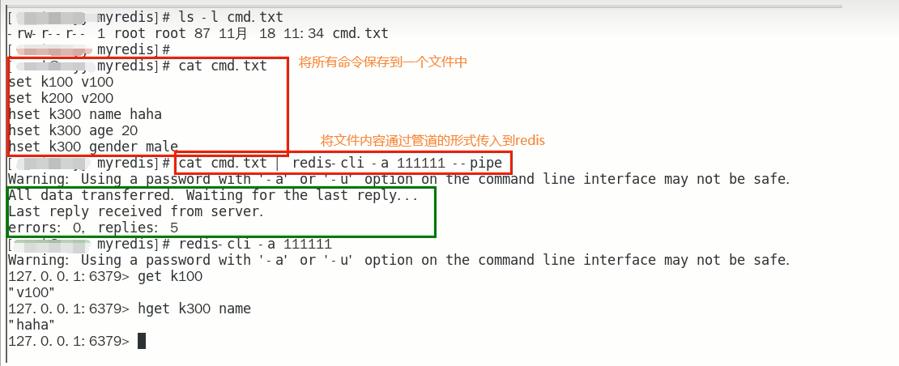
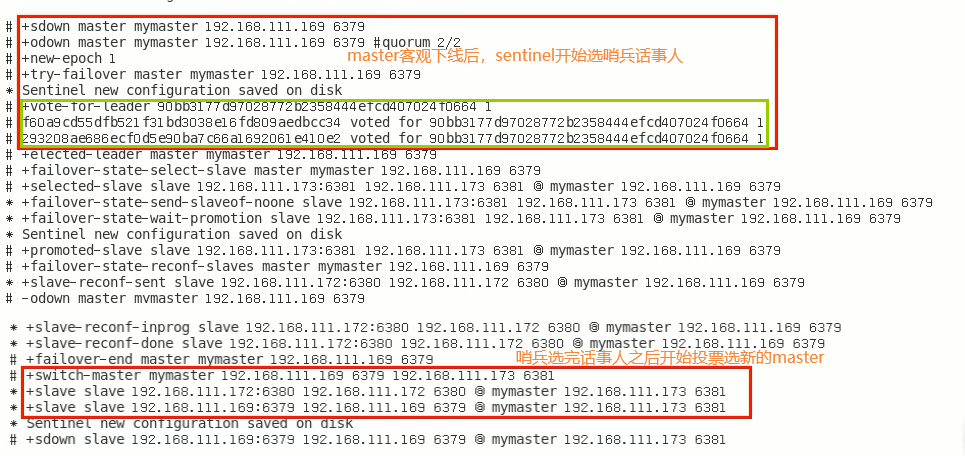
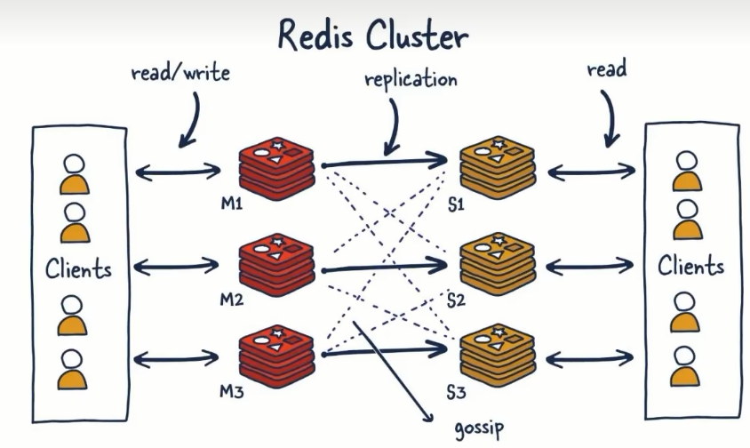
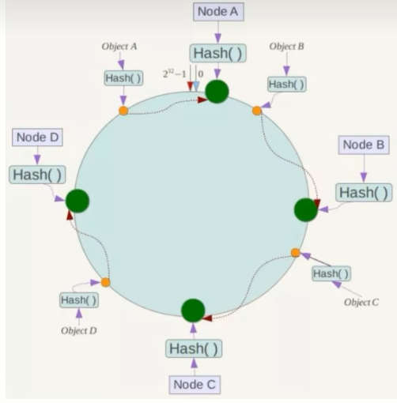
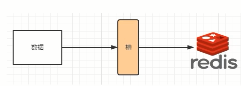

# 第01章_Redis概述

## 1. Redis是什么

**Redis：Remote Dictionary Server(远程字典服务器)**，是一个**高性能的Key-Value数据库**，提供了丰富的数据结构，例如String、Hash、List、Set、SortedSet等等。**数据是存在内存中的**，同时Redis支持事务、持久化、LUA脚本、发布/订阅、缓存淘汰、流技术等多种功能，提供了主从模式、Redis Sentinel和Redis Cluster集群架构方案

## 2. Redis的应用场景

### 2.1 分布式缓存

Redis可以做分布式缓存，即挡在MySQL数据库之前的带刀护卫。客户的查询请求先从Redis中查询，如果没有则再查询MySQL。

**Redis与传统数据库(MySQL)的关系**：

- Redis是**key-value数据库**(NoSQL的一种)，而MySQL是关系型数据库
- Redis数据操作主要在**内存**，而MySQL数据则存储在磁盘
- Redis在某一些场景使用中要明显优于MySQL，比如计数器、排行榜等方面
- Redis通常用于一些特定场景，经常需要与MySQL一起配合使用。所以，**两者并不是相互替换和竞争的关系，而是一起配合使用**。


### 2.2 内存存储和持久化

Redis支持异步将内存中的数据写到硬盘上（RDB和AOF），同时不影响继续服务。

### 2.3 高可用架构搭配

​Redis可以使用主从、哨兵、集群来实现高可用的架构。

### 2.4 缓存穿透、击穿、雪崩

### 2.5 分布式锁

### 2.6 队列

​Redis提供list和set操作，这使得Redis能作为一个很好的消息队列平台来使用。我们常通过Redis的队列功能做购买限制，比如到了节假日或者推广期间，进行一些活动，对用户购买行为进行限制，限制今天只能购买几次商品或者一段时间内只能购买一次。

### 2.7 排行榜和点赞功能

Redis提供的zset数据类型能够快速实现一些复杂的排行榜。

## 3. Redis的优势

- 性能极高：Redis读的速度是110000次/秒，写的速度是81000次/秒
- Redis数据类型丰富，不仅仅支持简单的key-value类型的数据，同时还提供list，set，zset，hash等数据结构的存储
- Redis支持数据的持久化，可以将内存中的数据保持在磁盘中，重启的时候可以再次加载进行使用
- Redis支持数据的备份，即master-slave模式的数据备份

## 4. Redis7新特性

Redis版本的命名规则：

- 版本号第二位如果是奇数，则为非稳定版本，如2.7、2.9、3.1等。如果是偶数，则为稳定版本，如2.8、3.2等。
- 当前奇数版本就是下一个稳定版本的开发版，如2.9版本就是3.0版本的开发版本

Redis7.0部分新特性概述：

### 4.1 多AOF文件支持

7.0 版本中一个比较大的变化就是 AOF 文件由一个变成了多个，主要分为两种类型: 基本文件(base files)、增量文件(incr files)。在此之外还引入了一个清单文件(manifest)用于跟踪文件以及文件的创建和应用顺序。

### 4.2 config命令增强

对于Config Set和Get命令，支持在一次调用过程中传递多个配置参数。例如，现在我们可以在执行一次Config Set命今中更改多个参数: `config set maxmemory 10000001 maxmemory-clients 50% port 6399`

### 4.3 限制客户端内存使用(Client-eviction)

一旦 Redis 连接较多，再加上每个连接的内存占用都比较大的时候，Redis总连接内存占用可能会达到maxmemory的上限，可以增加允许限制所有客户端的总内存使用量配置项，redis.config 中对应的配置项：

```
//两种配置形式: 指定内存大小、基于maxmemory的百分比
maxmemory-client 1g
maxmemory-client 10%
```

### 4.4 listpack紧凑列表调整

listpack 是用来替代 ziplist 的新数据结构，在 7.0 版本已经没有 ziplist 的配置了（6.0版本仅部分数据类型作为过渡阶段在使用）。

### 4.5 访问安全性增强ACLV2

在redis.conf配置文件中protected-mode默认为yes，只有当你希望你的客户端在没有授权的情况下可以连接到Redis server的时候可以将protect-mode设置为no

### 4.6 redis function

Redis函数，一种新的通过服务端脚本扩展Redis的方式，函数与数据本身一起存储。简言之，redis自己要去抢夺Lua脚本的饭碗。

### 4.7 RDB保存时间调整

将持久化文件RDB的保存规则发生了改变，尤其是时间记录频度变化

### 4.8 命令新增和变动

- Zset(有序集合)增加 ZMPOP、BZMPOP、ZINTERCARD 等命令
- Set(集合)增加 SINTERCARD 命令
- LIST(列表)增加 LMPOP、BLMPOP ，从提供的键名列表中的第一个非空列表键中弹出一个或多个元素。

### 4.9 性能资源利用率、安全等改进

自身底层部分优化改动，Redis核心在许多方面进行了重构和改进主动碎片整理V2: 增强版主动碎片整理，配合Jemalloc版本更新，更快更智能，延时更低。

HyperLogLog改进: 在Redis5.0中，HyperLogLog算法得到改进，优化了计数统计时的内存使用效率，7更加优秀更好的内存统计报告。

如果不是为了API向后兼容，我们将不再使用slave一词（政治正确）。


# 第02章_Redis安装配置

## 1. Linux环境

1. 建议将Redis放在Linux服务器上(或者虚拟机)
2. Linux环境安装Redis必须先具备gcc编译环境。用以下命令查看gcc版本`gcc -v`
3. 安装redis之前需要具备c++库环境，`yum -y install gcc-c++`

## 2. Redis安装及使用

（1）去官网下载Redis的安装包，选择redis7.0版本即可：https://redis.io/download/

（2）下载获取redis-7.0.0.tar.gz后将它放入我们的Linux目录/opt

（3）/opt目录下解压redis，`tar -zxvf redis-7.0.0.tar.gz`，解压后会多一个redis-7.0.0的文件夹

（4）进入该目录`cd redis-7.0.0`，然后在redis-7.0.0目录下执行make命令：`make && make install`

（5）查看默认安装目录：/usr/local/bin。Linux下的/usr/local类似我们Windows系统的C:\Program Files

- redis-benchmark: 性能测试工具，服务启动后运行该命令，可以查看自己电脑性能如何
- redis-check-aof: 修复有问题的AOF文件
- redis-check-dump: 修复有问题的dump.rdb文件
- redis-cli: 客户端操作入口
- redis-sentinel: redis集群使用
- reids-server: redis服务器启动命令

（6）将默认的Redis配置文件`redis.conf`拷贝到自己定义好的一个路径下，比如/myredis，`cp redis.conf /myredis/redis7.conf`

（7）修改/myredis目录下redis.conf配置文件，做初始化设置。注意，每次修改完Redis配置文件后，重启Redis服务器才能生效。

- 默认daemonize no，改为 `daemonize yes`
- 默认protected-mode yes，改为 `protected-mode no`
- 默认bind 127.0.0.1，将其`注释掉`，因为默认bind 127.0.0.1只能本机访问，会影响远程IP连接
- 设置redis的密码，改为 `requirepass 自己的密码`

（8）启动Redis服务器(Redis配置文件为/myredis/redis7.conf)：`redis-server /myredis/redis7.conf`

（9）客户端连接Redis服务器：`redis-cli -a abc666 -p 6379`，其中-a后面的是redis的密码，-p后面的是端口号(默认为6379)

（10）关闭Redis服务器

- 如果在Redis服务器里面，可以直接使用`shutdown`命令关闭
- 如果在Redis服务器外面，可以使用`redis-cli -a abc666 -p 6379 shutdown`

**补充**：

- 查看自己Redis版本的命令：`redis -server -v`
- Redis端口号默认为6379，所以如果上述`-p 6379`可以省略

## 3. Redis卸载

（1）首先关闭Redis服务器

（2）然后删除/usr/local/bin目录下与redis相关的文件即可，`rm -rf /usr/local/bin/redis-*`


# 第04章_Redis持久化

## 1. 持久化介绍

### 1.1 为什么需要持久化

如果断电，Redis需要从磁盘中读取并恢复数据，从而继续起到保护MySQL服务器的作用，因此Redis需要持久化。

### 1.2 持久化双雄

**RDB**(Redis DataBase)

**AOF**(Append Only File)

## 2. RDB

### 2.1 简介

RDB(Redis DataBase)：RDB持久化以指定的时间间隔执行数据集的时间点快照。

- 实现类似照片记录效果的方式，就是把某一时刻的数据和状态以文件的形式写到磁盘上，也就是快照。这样一来即使故障宕机，快照文件也不会丢失，数据的可靠性也就得到了保证。
- 这个快照文件就称为RDB文件(dump.rdb)

**作用**：在指定的时间间隔内将内存中的数据集快照写入磁盘，即snapshot内存快照，当恢复时再将硬盘快照文件直接读回到内存里。

**注意**：Redis的数据都在内存中，保存备份时它执行的是**全量快照**，也就是说，把内存中的所有数据都记录到磁盘中。

### 2.2 使用方式

#### 2.2.1 配置文件

在Redis.conf配置文件中的SNAPSHOTTING下配置save参数，来触发Redis的RDB持久化条件。例如`save m n`表示距离上次保存的时间超过m秒，且更新次数不小于n次时，自动触发`bgsave`。

RDB持久化是Redis默认使用的持久化方式，如果用户在启动Redis服务器时，既没有显式地关闭RDB持久化功能，也没有启用AOF持久化功能，那么Redis默认将使用以下save选项进行RDB持久化。

**Redis6.0.16及以下，默认配置如下**：

- save 900 1：距离上次保存的时间超过900秒，且更新次数不小于1，就写一份新的RDB文件
- save 300 10：距离上次保存的时间超过300秒，且更新次数不小于10，就写一份新的RDB文件
- save 60 10000：距离上次保存的时间超过60秒，且更新次数不小于10000，就写一份新的RDB文件

**Redis6.2及以后，默认配置如下**：

- save 3600 1
- save 300 100
- save 60 10000

#### 2.2.2 自动触发

**1、设置自动触发的间隔**

在redis.conf里配置 `save <seconds> <changes>`，为方便案例演示，我们配置5秒内有2次修改就写一份新的RDB文件：`save 5 2`

**2、修改RDB文件保存路径**

在配置文件中默认为`dir ./`，我们可以修改路径：`dir /myredis/dumpfiles`

**3、修改RDB文件名称**

在配置文件中默认名称为`dbfilename dump.rdb`，我们可以自定义文件名：`dbfilename dump6379.rdb`

**4、触发备份**

Redis引入了按时间和数据修改次数双重限制的快照保存机制，以在灵活性和效率之间取得平衡。因为如果限制只按时间间隔来进行保存快照，则会出现两个问题：

- 如果时间间隔太大，那么 Redis 持久化的数据可能会丢失。
- 如果时间间隔太小，那么数据的保存成本就会过高，并可能导致 Redis 运行效率下降。

**5、如何恢复**

将备份文件(dump.rdb)移动到Redis安装目录并启动服务即可。

注意：执行flushall/flushdb命令也会产生dump.rdb文件，但里面是空的。因此，进行物理恢复，一定要将服务产生的RDB文件备份一份，然后分机隔离，避免生产上物理损坏后备份文件也挂了。


#### 2.2.3 手动触发

可以使用save或者bgsave命令来手动生成RDB文件。

**save**：在主程序中执行会**阻塞**当前redis服务器，直到持久化工作完成，即执行save命令期间，Redis不能处理其他命令，**实际开发中禁止使用**

**bgsave(默认)**：redis会在后台异步进行快照操作，**不阻塞**快照同时还可以响应客户端请求。其底层是fork出一个子进程，由子进程负责持久化过程。

- Redis会使用bgsave对当前内存中的所有数据做快照，这个操作是子进程在后台完成的，这就允许主进程同时可以修改数据。
- 补充：LASTSAVE命令。我们可以通过lastsave命令获取最后一次成功执行快照的时间戳。

### 2.3 RDB的优劣

#### 2.3.1 优点

- 按照业务定时备份
- RDB生成紧凑压缩的二进制文件，体积小，使用该文件恢复数据的速度非常快，RDB文件在内存中的加载速度要比AOF快很多。
- 在保存RDB文件时，父进程只需fork出一个子进程即可，无需再做其他IO操作，可以最大化Redis的性能

#### 2.3.2 缺点

- 在一定间隔时间做一次备份，所以如果redis意外宕机的话，就会丢失从当前至最近一次快照期间的数据
- 内存数据的全量同步，如果数据量太大会导致IO严重影响服务器性能
- RDB依赖于主进程的fork，在更大的数据集中，这可能会导致服务请求的瞬间延迟。fork的时候内存中的数据被克隆了一份，大致2倍的膨胀性。

### 2.4 触发RDB快照的时机

以下情况会触发RDB快照：

1. 配置文件中默认的快照配置
2. 手动save/bgsave命令
3. 执行flushdb/fulshall命令也会产生dump.rdb文件，但是也会将命令记录到dump.rdb文件中，所以是空文件
4. 执行shutdown且没有设置开启AOF持久化
5. 主从复制时，主节点自动触发

### 2.5 其他配置

#### 2.5.1 检查修复RDB文件

RDB文件有时会损坏，我们可以执行redis-check-rdb命令`redis-check-rdb ./redisconfig/dump.rdb`来检查并修复RDB文件。

#### 2.5.2 禁用快照

方式1：通过命令停止RDB保存：`redis-cli config set value ""`

方式2：手动修改配置文件，添加`save ""`

#### 2.5.3 RDB优化配置项详解

在配置文件SNAPSHOTTING模块有以下参数：

- `save <seconds> <changes>`：配置快照保存条件
- `dir`：配置RDB文件保存目录地址
- `dbfilename`：配置RDB文件名称
- `stop-writes-on-bgsave-error`：默认值为yes，即当bgsave出错时立即停止写入(即阻止redis继续接受新的请求)，数据一致性高
- `rdbcompression`：默认值为yes，即对于存储到磁盘中的快照，采用LZF算法进行压缩存储。
- `rdbchecksum`：默认值为yes，即在存储快照后，让redis使用CRC64算法来进行数据校验，这样做会增加大约10%的性能消耗
- `rdb-del-sync-files`：默认值为no，即禁止在没有持久化的情况下删除复制中使用的RDB文件。


## 3. AOF

### 3.1 简介

AOF(Append Only File)：**以日志的形式来记录每个写操作**，将Redis执行过的所有写指令记录下来(读操作不记录)，只许追加文件、不可以改写文件，redis重启的话就根据日志文件的内容将写指令从前到后执行一次以完成数据的恢复工作。

默认情况下，redis是没有开启AOF的。开启AOF功能需要设置配置：`appendonly yes`。AOF保存在`appendonly.aof`文件。

#### 3.1.1 AOF持久化工作流程

1. Client作为命令的来源，向Redis Server发起请求。
2. 这些命令到达Redis Server以后并不是直接写入AOF文件，而是会将这些命令先放入AOF缓存中进行保存。这里的AOF缓冲区实际上是内存中的一片区域，存在的目的是当这些命令达到一定量以后再写入磁盘，避免频繁的磁盘IO操作。
3. AOF缓冲会根据AOF缓冲区**同步文件的三种写回策略**将命令写入磁盘上的AOF文件。
4. 随着写入AOF内容的增加，为避免文件膨胀，会根据规则进行命令的合并(**又称AOF重写**)，从而起到AOF文件压缩的目的。
5. 当Redis Server服务器重启的时候会从AOF文件载入数据。

#### 3.1.2 AOF缓冲区三种写回策略

**always**：同步写回，即每个写命令执行完立刻同步地将日志写到磁盘。优点是可靠性高、数据基本不丢失，缺点是IO频繁、性能低。

**everysec**(默认)：每秒写回，即每个写命令执行完，只是先把日志写到AOF文件的内存缓冲区，然后每隔1秒把缓冲区中的内容写入到磁盘。优点是性能适中，缺点是宕机时会丢失1秒内的数据。

**no**：操作系统控制的写回，即每个写命令执行完，只是先把日志写到AOF文件的内存缓冲区，由操作系统决定何时将缓冲区内容写回磁盘。优点是性能高，缺点是宕机时会丢失很多数据。

### 3.2 使用方式

#### 3.2.1 配置文件

**1、开启AOF**

AOF默认是关闭的，我们需要手动开启。在配置文件中将`appendonly no`改为`appendonly yes`。

**2、使用默认写回策略**

`appendfsync everysec`

**3、设置AOF文件的保存路径**

（1）redis7之前

AOF文件的保存位置和RDB文件的保存位置一样，都是通过redis.conf配置文件的dir配置。例如配置`dir /myredis`，则RDB文件保存在`/myredis/dump.rdb`，AOF文件保存在`/myredis/appendonly.aof`

（2）redis7

额外通过`appenddirname`定义AOF文件存放的目录名。例如配置`dir /myredis`以及`appenddirname "appendonlydir"`，则则RDB文件保存在`/myredis/dump.rdb`，AOF文件保存在`/myredis/appendonlydir/appendonly.aof`

**4、AOF文件的名称**

通过`appendfilename "appendonly.aof"`定义AOF文件名。

（1）redis7之前，有且只有一个AOF文件，文件名即为上述所定义。

（2）redis7，采用了Multi Part AOF的设计，会有多个文件，其文件名前缀即为上述appendfilename。

- appendonly.aof.1.base.rdb
- appendonly.aof.1.incr.aof，appendonly.aof.2.incr.aof
- appendonly.aof.manifest

**MP-AOF实现**：MP-AOF就是将原来的单个AOF文件拆分成多个AOF文件。在MP-AOF中，我们将AOF分为三种类型:

- **BASE: 表示基础AOF**，它一般由子进程通过重写产生，该文件最多只有一个。

- **INCR: 表示增量AOF**，它一般会在AOFRW开始执行时被创建，该文件可能存在多个。

- **HISTORY: 表示历史AOF**，它由BASE和INCR AOF变化而来，每次AOFRW成功完成时，本次AOFRW之前对应的BASE和INCR AOF都将变为HISTORY，HISTORY类型的AOF会被Redis自动删除。

为了管理这些AOF文件，我们引入了一个 **manifest(清单)** 文件来跟踪、管理这些AOF。同时，为了便于AOF备份和拷贝，我们将所有的AOF文件和manifest文件放入一个单独的文件目录中，目录名由appenddirname配置(Redis 7.0新增配置项)决定。

#### 3.2.2 恢复数据

如果AOF文件发生破损，需要通过命令来修复AOF文件：

```shell
redis-check-aof --fix /myredis/appendonlydir/appendonly.aof.1.incr.aof 
```

然后重启Redis服务器即可。

### 3.3 AOF的优劣

#### 3.3.1 优点

- 持久性更高，更安全
- AOF日志是一个仅附加日志，因此不会出现寻道问题，也不会在断电时出现损坏问题。即使由于某种原因，日志以写一半的命令结尾，redis-check-aof工具也能够轻松修复它。
- 当AOF变得太大时，Redis能够在后台自动重写AOF。
- AOF以**文本协议格式**写入命令，具有很好的兼容性，且可读性好，便于直接修改和处理。

#### 3.3.2 缺点

- 相同数据集而言，AOF文件要远大于RDB文件，恢复速度慢于RDB
- AOF运行效率要慢于RDB，每秒同步策略效率较好，不同步效率和RDB相同

### 3.4 AOF的重写机制

由于AOF持久化是Redis不断将写命令记录到AOF文件中，随着Redis不断的进行，AOF的文件会越来越大、占用服务器内存越大以及AOF恢复要求时间越长。

为了解决这个问题，**Redis新增了重写机制**，当AOF文件的大小超过所设定的峰值时，Redis就会**自动**启动AOF文件的内容压缩，**只保留可以恢复数据的最小指令集**。除此之外，我们也可以**手动使用命令bgrewriteaof来触发重写机制**。

**应用场景**：比如我们做了以下操作

```redis
set k1 v1
set k1 v2
set k1 v3
```

如果不重写，那么这3条语句都在aof文件中，占用空间大、而且重启时需要都执行一遍。如果触发了AOF的重写机制，则只会保存`set k1 v3`这一条。

#### 3.4.1 自动触发

配置文件中自动触发的默认配置为：

```
auto-aof-rewrite-percentage 100
auto-aof-rewrite-min-size 64mb
```

即：当前AOF文件的大小，比上次重写后的AOF文件大小增长了1倍，并且此时AOF文件的大小超过了64MB，则自动触发重写机制。

#### 3.4.2 手动触发

客户端向服务器发送bgrewriteaof命令，此时立刻执行重写机制。

#### 3.4.3 重写机制的底层原理

1. 在重写开始前，redis会创建一个`重写子进程`
2. `重写子进程`会在一个临时文件中写新的BASE AOF
3. 主进程创建一个新的INCR AOF文件，继续写入新收到的写指令。假如子进程重写失败了，那么旧的BASE和INCR AOF文件加上这个新的INCR AOF就代表此时内存中的数据集，所以是安全的。
4. 当子进程完成重写工作后，会给父进程发一个信号，于是会使用新的INCR AOF文件和子进程写完的BASE AOF文件来创建一个manifest。
5. 最终，Redis会清理掉旧的BASE AOF和未使用的INCR AOF。

> 注意：重写AOF文件的操作，并没有读取旧的AOF文件，而是将整个内存中的数据库内容用命令的方式重写了一个新的AOF文件，这点和快照有点类似。

## 4. RDB-AOF混合持久化

### 4.1 Redis4之前

在Redis4之前，可以同时开启RDB和AOF。但在数据恢复时，只会加载AOF文件(如果AOF文件不存在，才会加载RDB文件)。这是因为AOF的数据更实时。

但并不建议只开启AOF，因为RDB更适合用于备份数据库(AOF在不断变化、不好备份)，所以留着RDB作为一个以防万一的手段。

### 4.2 Redis4及之后

Redis4引入了RDB-AOF混合持久化，我们也推荐使用这种方式，开启方式如下：

1. 首先开启AOF：`appendonly yes`
2. 然后开启混合方式：`aof-use-rdb-preamble yes`

使用RDB-AOF混合持久化，即让RDB做全量持久化，AOF做增量持久化。先使用RDB进行快照存储，然后使用AOF持久化记录所有新的写操作，当重写策略满足或手动触发重写的时候，将最新的数据存储为新的RDB记录。这样的话，重启服务的时候会从RDB和AOF两部分恢复数据，既保证了数据完整性，又提高了恢复数据的性能。简单来说，混合持久化方式产生的文件一部分是RDB格式，一部分是AOF格式。

## 5. 纯缓存模式

纯缓存模式，指的就是让Redis同时关闭RDB和AOF，专心做缓存。配置步骤如下：

1. `save ""` 禁用RDB：注意，禁用RDB持久化模式下，我们仍然可以使用命令save、bgsave手动生成RDB文件
2. `appendonly no` 禁用AOF：禁用AOF持久化模式下，我们仍然可以使用命令bgrewriteaof手动生成AOF文件

# 第05章_Redis事务

## 1. Redis事务简介

在Redis事务中，可以一次执行多个命令，本质是一组命令的集合，**一个事务中的所有命令都会序列化在一个队列中，然后一次性、顺序性、排他性地串行化执行，而不会被其他命令插入**

**Redis事务与数据库事务的不同**：

1. 单独的隔离操作：Redis的事务仅仅是保证事务里的操作会被连续独占的执行，redis命令执行是单线程架构，在执行完事务内所有指令前是不可能再去同时执行其他客户端的请求的。
2. 没有隔离级别的概念：因为事务提交前任何指令都不会被实际执行，也就不存在脏读等问题
3. 不保证原子性：Redis的事务不保证原子性，也就是不保证所有指令同时成功或同时失败，只有决定是否开始执行全部指令的能力，没有执行到一半进行回滚的能力
4. 排他性：Redis会保证一个事务内的命令依次执行，而不会被其它命令插入

## 2. Redis事务操作

### 2.1 Redis事务常用命令

- `MULTI`：标记一个事务块的开始
- `EXEC`：执行所有事务块内的命令
- `DISCARD`：取消事务，放弃执行事务块内的所有命令
- `WATCH key [key ...]`：监视一个或多个key，如果在事务执行之前这些key被其他命令所改动，那么事务将被打断
- `UNWATCH`：取消WATCH命令对所有key的监视

### 2.2 case1：正常执行

使用MULTI开启事务，使用EXEC执行事务块内的命令。

```sql
127.0.0.1:6379> MULTI
OK
127.0.0.1:6379(TX)> set k1 v1
QUEUED
127.0.0.1:6379(TX)> set k2 v2
QUEUED
127.0.0.1:6379(TX)> set k3 v3
QUEUED
127.0.0.1:6379(TX)> EXEC
1) OK
2) OK
3) OK
127.0.0.1:6379> keys *
1) "k1"
2) "k3"
3) "k2"
```

### 2.3 case2：放弃事务

使用MULTI开启事务，使用DISCARD取消事务。

```sql
127.0.0.1:6379> MULTI
OK
127.0.0.1:6379(TX)> set k1 v111
QUEUED
127.0.0.1:6379(TX)> set k2 v222
QUEUED
127.0.0.1:6379(TX)> DISCARD
OK
127.0.0.1:6379> get k1
"v1"
```

### 2.4 case3：全体连坐

开启事务后，如果在EXEC之前，有任何一个命令就已经报错，则执行EXEC时Redis会直接返回错误，所有的命令都不会执行。

```sql
127.0.0.1:6379> MULTI
OK
127.0.0.1:6379(TX)> set k1 v123
QUEUED
127.0.0.1:6379(TX)> set k2 v123
QUEUED
127.0.0.1:6379(TX)> set k3
(error) ERR wrong number of arguments for 'set' command
127.0.0.1:6379(TX)> EXEC
(error) EXECABORT Transaction discarded because of previous errors.
127.0.0.1:6379> get k1
"v1"
```

### 2.5 case4：冤头债主

开启事务后，如果在语法检查阶段没有报错，而是在EXEC执行后有一个命令出错，则其他没有错误的命令仍会正常执行。

> Redis不提供事务回滚的功能，开发者必须在事务执行出错后，手动恢复数据库状态

```sql
127.0.0.1:6379> set email wsy@qq.com
OK
127.0.0.1:6379> MULTI
OK
127.0.0.1:6379(TX)> set k1 666
QUEUED
127.0.0.1:6379(TX)> INCR email
QUEUED
127.0.0.1:6379(TX)> set k2 888
QUEUED
127.0.0.1:6379(TX)> EXEC
1) OK
2) (error) ERR value is not an integer or out of range
3) OK
127.0.0.1:6379> get k1
"666"
127.0.0.1:6379> get k2
"888"
127.0.0.1:6379> get email
"wsy@qq.com"
```

### 2.6 case5：watch监控

**Redis使用watch来提供乐观锁定，类似于CAS(Check-and-Set)**

- 悲观锁：每次去拿数据的时候都认为别人会修改，所以每次在拿数据的时候都会上锁
- 乐观锁：每次去拿数据的时候都认为别人不会修改，所以不会上锁，但是在更新的时候会判断一下在此期间别人有没有去更新这个数据。即，乐观锁策略：提交版本必须大于记录当前版本才能执行更新。

watch命令是一种乐观锁的实现，Redis在修改的时候会检测数据是否被更改，如果被更改了，则执行失败。

如下，事务开启后，在EXEC执行前，有另一个线程修改了balance：`set balance 300`，此时执行EXEC，则整个事务失败。

```sql
127.0.0.1:6379> set k1 abc
OK
127.0.0.1:6379> set balance 100
OK
127.0.0.1:6379> WATCH balance
OK
127.0.0.1:6379> MULTI
OK
127.0.0.1:6379(TX)> set k1 abc666
QUEUED
127.0.0.1:6379(TX)> set balance 200
QUEUED
127.0.0.1:6379(TX)> EXEC
(nil)
127.0.0.1:6379> get k1
"abc"
127.0.0.1:6379> get balance
"300"
```

**unwatch**就是watch的逆操作，即取消WATCH命令对所有key的监视。

> 注1：一旦执行了EXEC，无论事务是否执行成功，之前WATCH对变量的监控都会被取消。所以想要重新监控，必须重新使用WATCH命令。
>
> 注2：当客户端连接丢失的时候(比如退出连接)，所有key都会被取消监视。

# 第06章_Redis管道

## 1. 问题背景

Redis是一种基于**客户端-服务端模型**以及请求/响应协议的TCP服务。一个请求会遵循以下步骤:

1. 客户端向服务端发送命令分四步(发送命令、命令排队、命令执行、返回结果)，并监听Socket返回，通常以阻塞模式等待服务端响应。
2. 服务端处理命令，并将结果返回给客户端。

上述两步消耗的总时长称为: Round Trip Time(简称RTT，数据包往返于两端的时间)。

如果同时需要执行大量的命令，那么就要等待上一条命令应答后再执行，这中间不仅仅多了RTT，而且还频繁调用系统IO，发送网络请求，同时需要redis调用多次read()和write()系统方法，系统方法会将数据从用户态转移到内核态，导致性能很低下。Redis管道就是为了解决这一问题。

## 2. 管道简介

### 2.1 管道的定义

管道(pipeline)可以将多条命令打包一次性发送给服务端。**服务端依次处理完毕后，通过一条响应一次性将结果返回，通过减少客户端与redis的通信次数来实现降低往返延时时间**。pipeline实现的原理是队列，先进先出特性就保证了数据的顺序性。

简言之，管道是处理多条命令的一种优化措施，类似Redis的原生批量命令(如mget和mset)

### 2.2 案例演示



### 2.3 注意事项

**pipeline与原生批量命令对比**
  
- 原生批量命令是原子性的(如：mset、mget)，而pipeline是非原子性的
- 原生批量命令一次只能执行一种命令，pipeline支持批量执行不同种命令
- 原生批量命令是服务端实现，而pipeline需要服务端与客户端共同完成

**pipeline与事务对比**

- 管道一次性将多条命令发送到服务器，事务是一条一条发的，且事务只有在接收到exec命令后才会执行
- 执行事务时会阻塞其他命令的执行，而执行管道中的命令时不会

**使用pipeline注意事项**

- pipeline缓冲的指令只是会依次执行，不保证原子性，如果执行中指令发生异常，将会继续执行后续的指令
- 使用pipeline组装的命令个数不能太多，不然数量过大，客户端阻塞的时间可能过久，同时服务端此时也被迫维护一个队列，占用很多内存

# 第07章_Redis发布订阅(了解)

**定义**：是一种消息通信模式，发送者(PUBLISH)发送消息，订阅者(SUBSCRIBE)接收消息，可以实现进程间的消息传递。

**总结**：Redis可以实现消息中间件MQ的功能，通过发布订阅实现消息的引导和分流。但是目前不推荐使用该功能，专业的事情交给专业的中间件处理，redis就做好分布式缓存功能即可。

**PUB/SUB缺点**：

1. 发布的消息在Redis系统中不能持久化，因此，必须先执行订阅，在等待消息发布。如果先发布了消息，那么该消息由于没有订阅者，消息将被直接丢弃。
2. 消息只管发送，对于发布者而言消息是即发即失，不管接受，也没有ACK机制，无法保证消息的消费成功。
3. 以上的缺点导致Redis的Pub/Sub模式在生产环境中几乎无用武之地，为此Redis5.0版本新增了Stream数据结构，不但支持多播，还支持数据持久化，相比Pub/Sub更加强大。


# 第08章_Redis复制(replica)

## 1. Redis复制简介

Redis复制就是主从复制，master以写为主，slave以读为主，当master数据变化的时候，自动将新的数据异步同步到其他的slave数据库。

**作用**：

- 读写分离
- 容灾恢复
- 数据备份
- 水平扩容支撑高并发

**注意事项**：master如果配置了requirepass参数，即需要密码登录，那么slave就要配置masterauth来设置相同的访问master的密码，否则的话master会拒绝slave的访问请求。

**基本操作命令**

- `info replication`：可以查看主从关系和配置信息
- `replicaof 主库IP 主库端口`：一般写入进Redis.conf配置文件内(配置在从库中，而不是主库中)，用于指定对应的主库，重启后该配置依然生效
- `slaveof 新主库IP 新主库端口`：在运行期间对当前节点指定相应的主库，如果当前数据库本来已经是某个主数据库的从数据库，那么会停止和原主数据库的同步关系，**转而和新主数据库同步，成为新主数据库的从库**。注意，一旦当前节点宕机了，重启后该关系就不存在了。
- `slaveof no one`：使当前数据库停止与其他数据库的同步，**转成主数据库，自立为王**

## 2. 案例演示

### 2.1 架构说明

我们演示一个一主二从的架构模式(需要三台虚拟机，每台都装有redis)：

- master：IP为192.168.111.169，端口号为6379
- slave：IP为192.168.111.172，端口号为6380
- slave：IP为192.168.111.173，端口号为6381

需要拷贝多个redis.conf文件，分别命名为redis6379.conf、redis6380.conf、redis6381.conf

注意：三台虚拟机需要能相互ping通且需要注意防火墙配置

### 2.2 修改配置文件

以redis6379.conf为例，步骤如下：

1. `daemonize yes`
2. 注释掉 `bind 127.0.0.1`
3. `protected-mode no`
4. 指定端口 `port 6379`
5. 指定当前工作目录 `dir /myredis`
6. 配置pid文件(一般使用默认即可)，`pidfile /var/run/redis_6379.pid`
7. 配置log文件，`logfile "/myredis/6379.log"`
8. 设置密码 `requirepass abc666`
9. 配置RDB文件名 `dbfilename dump6379.rdb`
10. 配置AOF文件(本步骤可选)。如果不开启AOF，则配置`appendonly no`；如果要开启AOF，则配置`appendonly yes`以及`appendfilename "appendonly.aof"`、`appenddirname "appendonlydir"`
11. **从机必须配置访问主机的通行密码masterauth，主机不用配置**，`masterauth "abc666"`。

### 2.3 方案1：配置文件配置主从关系

**在从机的配置文件中配置`replicaof 主库IP 主库端口`来指定对应的主机，例如`replicaof 192.168.111.169 6379`**。

我们先开启master，然后再开启两台slave。可以通过`info replication`命令来查看主从关系。

然后在master中`set k1 v1`后，我们在slave中也能查看`get k1`，说明主从关系配置成功。

**主从关系的特点**：

1. 从机只能执行读命令，不能执行写命令。
2. 从机重启时，会复制主机的所有内容，之后master写、slave跟。
3. 主机如果shutdown，从机不会有任何变化，从机数据仍可以正常读取，主从关系也依然存在。
4. 主机shutdown了，重启后主从关系依然存在，从机依旧可以顺利复制。

### 2.4 方案2：通过命令指定主从关系

我们首先将从机停机，并注释掉配置文件中的`replicaof 192.168.111.169 6379`。此时3台服务器目前都是主机状态，各不从属。

然后，我们在预设的从机上通过命令行执行命令`SLAVEOF 192.168.111.169 6379`，即通过`salveof 新主库IP 新主库端口`的方式手动、临时地指定主从关系。

**缺点**：从机一旦重启，主从关系就不存在了。

### 2.5 薪火相传

一个主master下有一个slave1，此时这个salve1也可以是另一个slave2的master。所以，slave1作为该链条中的一个master，可以有效减轻主master的压力。

注意：slave1仍然不能执行写操作，因为它是主master的从机。

### 2.6 反客为主

在命令行使用命令`SLAVEOF no one`，可以使当前数据库停止与其他数据库的同步关系，即自己变成master。

## 3. 主从复制底层原理

### 3.1 psync命令

从2.8版本开始，Redis使用`psync`命令完成主从数据同步，同步过程分为**全量复制**和**部分复制**。全量复制一般用于初次复制的场景，部分复制则用于处理因网络中断等原因造成数据丢失的场景。psync命令需要以下参数的支持：

- 复制偏移量(offset)：主节点和从节点都各自维护自己的主从复制偏移量offset，当主节点有写入命令时，`offset=offset+命令的字节长度`。从节点在收到主节点发送的命令后，也会增加自己的offset，并把自己的offset发送给主节点。这样，**主节点同时保存自己的offset和从节点的offset**，通过对比offset来判断主从节点数据是否一致。
- 积压缓冲区(repl-backlog-buffer)：保存在主节点上的一个固定长度的先进先出队列，默认大小为1MB。主节点处理写命令时，不但会把命令发送给从节点，还会写入积压缓冲区，用于部分复制和命令丢失的数据补救。
- 节点运行ID(runId)：每个Redis节点重启后，都会动态分配一个40位的十六进制字符串作为运行ID。因此当主节点的运行ID变化后(说明主节点重启了)，从节点将做全量复制。

**补充**：redis2.8之前使用`sync`同步命令，其缺点是`只支持全量复制`。

**psync命令的作用**：从节点向主节点发送`psync runId offset`命令，主节点会有三种响应：

- FULLRESYNC：表示这是第一次连接，于是从节点将进行**全量复制**
- CONTINUE：从节点将进行**部分复制**
- ERR：说明主节点版本过低，无法识别psync命令

**注意**：在主从架构中，master会给从机每隔一定时间发送PING包，以确保连接的存在，称之为PING心跳。这个时间间隔由参数`repl-ping-replica-period 10`设置，可见默认为10秒。

### 3.2 全量复制的流程

1. 从节点启动，向主节点发送`psync ? -1`命令（因为第一次发送，不知道主节点的runId，所以为`?`；因为是第一次复制，所以`offset=-1`）。
2. 主节点发现从节点是第一次复制，返回`FULLRESYNC runId offset`，runId和offset都是主节点的。
3. 从节点接收到主节点信息后，保存到masterinfo中
4. 主节点在发送FULLRESYNC后，启动bgsave命令，生成RDB文件（数据持久化）。
5. 主节点发送RDB文件给从节点。直到从节点加载数据完成这段期间内，主节点的写命令放入积压缓冲区。最终也会将积压缓冲区中的数据发送给从节点。
6. 从节点首先清除自己所有旧的数据库数据。然后开始加载RDB文件，将数据保存到自己的数据库中。如果从节点开启了AOF，从节点也会异步重写AOF文件。

### 3.3 部分复制的流程

1. 从节点因网络连接等异常情况断开了与主节点的连接
2. 主从连接中断期间，主节点依然响应命令，并将这些命令写入积压缓冲区中
3. 当从节点重启，主从连接恢复后，由于从节点之前保存了自身已复制的偏移量和主节点的运行ID。因此会把它们当做psync参数发送给主节点`psync runId offset`，要求进行部分复制。
4. 主节点接收到psync命令后首先核对参数runId是否与自身一致，如果一致，说明之前复制的是当前主节点；之后根据参数offset在积压缓冲区中查找，如果offset之后的数据存在，则对从节点发送`COUTINUE`命令，表示可以进行部分复制。因为缓冲区大小固定，若发生缓冲溢出，则进行全量复制。
5. 主节点根据偏移量把积压缓冲区里的数据发送给从节点，保证主从复制进入正常状态。

### 3.4 主从复制的缺点

- 复制延时，信号衰减：由于所有的写操作都是先在Master上操作，然后同步更新到Slave上，所以从Master同步到Slave机器有一定的延迟，当系统很繁忙的时候，延迟问题会更加严重，Slave机器数量的增加也会使这个问题更加严重。
- 一旦master宕机，默认情况下，不会在slave节点中自动选一个master，所以每次都要人工干预，极为繁琐。


# 第09章_Redis哨兵(sentinel)

## 1. Redis哨兵简介

哨兵用于巡查监控后台master主机是否故障，如果故障了，则根据**投票数**自动将某一个从库转换为新主库，继续对外服务。

**作用**：

- **主从监控**：监控主从redis库运行是否正常
- **消息通知**：哨兵可以将故障转移的结果发送给客户端
- **故障转移**：如果master异常，则会进行主从切换，将其中一个slave作为新master
- **配置中心**：客户端通过连接哨兵来获得当前Redis服务的主节点地址

## 2. 哨兵配置参数说明

### 2.1 Redis Sentinel架构

- 3个哨兵：自动监控和维护集群，不存放数据
- 1主2从：用于数据存放


### 2.2 配置参数

我们在`/myredis`目录下新建或者拷贝sentinel.conf文件。首先我们查看`/opt/redis-7.2.0/`目录下默认的sentinel.conf文件的内容，一些重要的配置参数如下：

- bind：服务监听地址，用于客户端连接，默认本机地址
- daemonize：是否以后台daemon方式运行
- protected-model：安全保护模式
- port：端口
- logfile：日志文件路径
- pidfile：pid文件路径
- dir：工作目录
- `sentinel auth-pass <master-name> <password>`：连接master服务的密码
- `sentinel monitor <master-name> <ip> <redis-port> <quorum>`：设置要监控的master服务器，其中quorum指的是**确认`客观下线`的最少的哨兵数量**


> 说明：
> 网络是不可靠的，有时候一个sentinel会因为网络堵塞而误以为master redis已经死掉。因此，在sentinel集群环境下需要多个sentinel互相沟通来确认某个master是否真的死掉了。
> 
> quorum这个参数就是进行**客观下线**的一个依据，意思是至少有quorum个sentinel认为这个master有故障，才会对这个master进行下线以及故障转移，这就保证了公平性和高可用。

### 2.3 通用配置示例

三个哨兵的配置文件分别命名为：sentinel26379.conf、sentinel26380.conf、sentinel26381.conf。我们以端口号为26379的哨兵为例，进行如下配置即可：

```
bind 0.0.0.0
daemonize yes
protected-mode no
port 26379
logfile "/myredis/sentinel26379.log"
pidfile /var/run/redis-sentinel26379.pid
dir /myredis
sentinel monitor mymaster 192.168.111.169 6379 2
sentinel auth-pass mymaster abc666
```

补充：一个哨兵也可以同时监控多个master，一行配置一个即可。

一主二从的配置文件跟之前相同，不过需要注意的是，主节点中也要添加配置参数`masterauth "abc666"`，因为之后它可能会变为从节点，所以需要设置访问新主机的密码。

## 3. 案例演示

### 3.1 启动哨兵

首先启动一主二从3个redis实例，测试正常的主从复制：

```shell
[root@thuwsy001 ~]# redis-server /myredis/redis6379.conf
[root@thuwsy001 ~]# redis-server /myredis/redis6380.conf
[root@thuwsy001 ~]# redis-server /myredis/redis6381.conf
[root@thuwsy001 ~]# redis-cli -a abc666 -p 6379
[root@thuwsy001 ~]# redis-cli -a abc666 -p 6380
[root@thuwsy001 ~]# redis-cli -a abc666 -p 6381
```

接下来要启动哨兵，sentinel有两种启动方式：

- `redis-sentinel /myredis/sentinel.conf`
- `redis-server /myredis/sentinel.conf --sentinel`

于是我们启动这3个哨兵：

```shell
[root@thuwsy001 ~]# redis-server /myredis/sentinel26379.conf --sentinel
[root@thuwsy001 ~]# redis-server /myredis/sentinel26380.conf --sentinel
[root@thuwsy001 ~]# redis-server /myredis/sentinel26381.conf --sentinel
```

启动后我们会发现在sentinel配置文件中，会自动加上一些有关监控主从机的配置信息。

### 3.2 模拟master宕机

我们自己手动关闭6379服务器，模拟master宕机。此时，我们会发现：

1. 两台从机的数据仍然没有问题
2. 会从这两台机器上选出新的master，例如6381，于是6379、6380都变成了它的slave
3. 之前宕机的master 6379重启归来，此时它不再是master了，而是变成了6381的从机

注意：6379宕机后，立即在6380上`get k1`可能会报BROKEN PIPE异常，这个异常是客户端读取超时关闭了连接、此时服务器端再向客户端已经断开的连接写数据时就发生了BROKEN PIPE异常。该异常并没有太大影响。

### 3.3 总结

Redis和Sentinel配置文件的内容，在运行期间，都可能被sentinel动态进行更改。例如6381升级成了master，那么其配置文件中就会自动去掉原来的`replicaof`配置；而6379降级成了slave，那么其配置文件中就会自动增加`replicaof`的配置来指定对应的master。

## 4. 哨兵的底层原理

当一个主从架构中master宕机后，sentinel可以选举出一个新的master用于自动接替原master的工作，主从架构中的其他redis服务器自动指向新的master同步数据，一般建议sentinel采取奇数台，防止某一台sentinel无法连接到master导致误切换。运行流程如下：

### 4.1 步骤1：SDown主观下线

主观下线(Subjectively Down)是**单个sentinel自己主观上认为某个master应该下线**。从sentinel的角度来看，如果在指定时间内没有收到master的PING命令或者收到一个错误消息，就会主观地认为这个master不可用了。

> sentinel配置文件中的down-after-milliseconds参数设置了判断主观下线的时间长度，默认为30秒。`sentinel down-after-milliseconds mymaster 30000`

### 4.2 步骤2：ODown客观下线

客观下线(Objectively Down)指的是当一定数量(quorum个)的哨兵都主观认为这个master有故障应该下线时，才会对这个master进行下线以及故障转移。

### 4.3 步骤3：选举领导者哨兵

当主节点被判断客观下线后，各个哨兵节点会进行协商，先选举出一个领导者哨兵，并由该领导者进行接下来的failover（故障转移）操作。

从哨兵日志文件中我们也可以看到这一过程：



**如何选举领导者哨兵？Raft算法**

监视该主节点的所有哨兵都有可能被选为领导者，选举领导者哨兵使用的算法是Raft算法。Raft算法的基本思路是先到先得：即在一轮选举中，哨兵A向B发送信息表明自己想申请成为领导者，此时如果B没有同意过其他哨兵，就会同意A成为领导者。

### 4.4 步骤4：故障转移

由上述sentinel leader进行接下来的failover流程：

**（1）新主登基**

将某个slave选为master。假设剩余的slave节点健康，那么就会按以下规则来选出新的master：

- 首先比较priority，优先级越高的(即对应数值越小的)被选为新的master。在redis.conf文件中，由参数replica-priority设定优先级，数值越小优先级越高(默认数值为100)。
- 如果priority相同，复制偏移位置offset最大的从节点当选新的master。因为offset越大，说明复制到的数据越新。
- 如果offset相同，则runId最小的从节点当选新的master，即按字典顺序。

**（2）群臣俯首**

sentinel leader会对选举出的新master执行slaveof on one操作，将其提升为master节点。

接下来，sentinel leader会向其他slave发送命令，让剩余的slave成为新的master节点的slave。

**（3）旧主拜服**

sentinel leader会让原来的master降级为slave，等它重新上线后，就变成了新选出的master的从节点。

## 5. 哨兵使用建议

哨兵的优点在于，故障转移操作均由sentinel自己独立完成，无需人工干预。使用哨兵时，有以下建议：

1. 哨兵节点的数量应为多个，即哨兵本身应该集群，保证高可用
2. 哨兵节点的数量应该是奇数
3. 各个哨兵节点的配置应一致
4. 如果哨兵节点部署在Docker等容器里面，尤其要注意端口的正确映射
5. 哨兵配合主从复制，并不能保证数据零丢失，因为哨兵选出新的master也需要一定时间，而在这段时间内都无法处理客户端的写请求。所以我们使用接下来的集群来解决这一问题。


# 第10章_Redis集群(cluster)

## 1. 集群简介

### 1.1 集群的定义和特点

**定义**：由于数据量过大，单个Master复制集难以承担，因此需要对多个复制集进行集群，形成水平扩展，每个复制集只负责存储整个数据集的一部分，这就是Redis的集群，其作用是提供在多个Redis节点间共享数据的程序集。



**特点**：

- Redis集群**支持多个master**，每个master又可以挂载多个slave。从而实现读写分离、支持数据的高可用、支持海量数据的读写存储操作。
- 由于Cluster自带Sentinel的故障转移机制，内置了高可用的支持，所以**无需再去使用哨兵功能**
- 客户端与Redis的节点连接，不需要连接集群中所有的节点，只需要**任意连接集群中的一个可用节点**即可
- **槽位slot**负责分配到各个物理服务节点，由对应的集群来负责维护节点、插槽和数据之间的关系

注意：redis集群**不保证强一致性**，这意味着在特定的条件下，Redis集群可能还是会丢掉一些被系统收到的写入请求命令。

### 1.2 槽位和分片

#### 1.2.1 槽位slot

Redis集群没有使用一致性hash算法，而是引入了**哈希槽**的概念。

```
HASH_SLOT = CRC16(key) mod 16384
```

**Redis集群有16384个slot，每个key通过CRC16校验后对16384取模，来决定该key放置在哪个槽位**。

**集群的每个主节点负责一部分槽位**，比如当前集群有3个主节点，那么可以让第一个节点负责0-5460号槽位、第二个节点负责5461-10922号槽位、第三个节点负责10923-16383号槽位。

注意，理论上我们可以最多配置16384个主节点，让每个主节点各自负责一个槽位，但实际上严禁这么做，**建议配置的最大主节点个数大约在1000个左右**。

#### 1.2.2 redis集群的分片

**定义**：使用Redis集群时我们会将存储的数据分散到多台redis机器上，这称为分片。简言之，集群中的每个Redis实例都被认为是整个数据的一个分片。

**如何找到给定key的分片？**

为了找到给定key的分片，我们对key进行CRC16(key)算法处理并通过对总分片数量取模。然后，使用确定性哈希函数，这意味着给定的key将多次始终映射到同一个分片，我们可以推断将来读取特定key的位置。

#### 1.2.3 分片和槽位的优势

**最大优势：方便扩缩容和数据分派查找**

这种结构很容易添加或者删除节点，比如想添加一个节点D，只需要从节点A，B，C中的移动部分槽位到D上；如果想移出节点A，只需要将A中的槽位移动到B和C节点上，然后将没有任何槽位的节点A从集群中移除即可。由于一个结点将哈希槽移动到另一个节点不会停止服务，所以无论添加删除或者改变某个节点的哈希槽的数量都不会造成集群不可用的状态。


## 2. 实现数据分片的方案

### 2.1 哈希取余

假设有N个主节点构成一个集群，用户每次读写操作都是根据公式：`hash(key) % N`，来决定数据映射到哪一个节点上。

**优点**：简单直接，让每台服务器固定处理一部分请求、起到负载均衡和分而治之的作用。

**缺点**：进行扩容或者缩容极其麻烦，因为节点数N一旦变动，映射关系就需要重新进行计算，可能会导致全部数据重新洗牌。

### 2.2 一致性哈希算法

一致性Hash算法的设计目标是**为了解决分布式缓存数据变动和映射问题**。当服务器个数发生变动时，该算法能够尽量减少影响客户端到服务器的映射关系。

#### 1、构建一致性哈希环

一致性哈希算法根据某个Hash算法得到的值再对$2^{32}$取模，即得到的Hash值一定落在$[0,2^{32}-1]$这个区间，这个区间首尾相连后可以看作是一个虚拟的圆环(按顺时针方向从小到大)，称为Hash环，由于它与集群中的主节点个数无关，所以称之为一致性Hash环。

#### 2、服务器IP节点映射

集群中的各个主节点可以通过IP地址映射到哈希环上的某个位置。

#### 3、key与服务器的映射规则

当我们需要存储一个kv键值对时，首先对这个key使用一致性Hash算法计算出它在环上的位置，**从此位置沿环顺时针行走**，第一台遇到的服务器就是其应该定位到的服务器，并将该键值对存储在该节点上。



#### 优点

**一致性Hash算法具有容错性**：在一致性Hash算法中，如果一台服务器宕机了，则受影响的数据仅仅是此服务器到其环空间中前一台服务器之间的数据，其它不会受到影响。如上图，假设C宕机了，则受影响的只是B到C之间的数据，只需将这些数据转移到D进行存储即可。

**一致性Hash算法具有扩展性**：当数据量增加时，需要增加一台节点X，假设X的位置在A和B之间，那么受到影响的数据也只有A到X之间的数据，重新把这些数据录入到X上即可，不会导致全部数据重新洗牌。


#### 缺点

**一致性Hash算法会产生数据倾斜问题**：当集群节点太少时，容易因为节点分布不均匀而造成**数据倾斜**(即大部分数据集中缓存在某一台服务器上)问题

### 2.3 哈希槽分区

#### 1、简介

哈希槽实质就是一个数组，$[0, 2^{14} - 1]$形成hash slot空间。它相当于是数据和节点的中间层，用于管理数据和节点之间的关系，即节点中放的是槽、槽里面放的是数据。



综上，槽解决的是粒度问题，便于数据移动；哈希解决的是映射问题，使用key的哈希值来计算所在的槽，便于数据分配。

一个集群只能有16384个槽，编号0-16383。这些槽会分配给集群中的所有主节点，分配策略没有要求，但每个主节点负责的槽位数量应该大致相等。

#### 2、算法流程

```
HASH_SLOT = CRC16(key) mod 16384
```

**Redis集群有16384个slot，每个key通过CRC16算法后对16384取模，来决定该key放置在哪个槽位**。

#### 3、为什么Redis集群的最大槽数是16384个

CRC16算法产生的hash值有16bit，该算法可以产生$2^{16}=65536$个值。换句话说值是分布在0～65535之间，那么我们为什么要用更小的范围16384呢？

**原因**：

1. 每秒钟，redis节点需要发送一定数量的ping消息作为心跳包，其消息头中最占空间的是 `myslots[CLUSTER_SLOTS/8]` ，所以如果槽位为65536，消息头的大小至少超过了8KB，过于浪费带宽。
2. redis集群的主节点数量基本不可能超过1000个(节点过多会导致网络拥堵)，对于这种数量的节点数，16384个槽位足够使用了。
3. 槽位越少，压缩比越高，越容易进行传输：Redis主节点的配置信息中它所负责的哈希槽是通过一张bitmap来保存的，在传输过程中会对bitmap进行压缩，但是如果bitmap的填充率 `slots/N` 很高的话(N表示节点数)，bitmap的压缩率就很低。

## 3. 集群搭建案例演示

### 3.1 三主三从Redis集群配置

（1）找3台真实虚拟机，各自新建`mkdir -p /myredis/cluster`

（2）新建6个独立的Redis实例服务，配置文件示例如下

​	`vim /myredis/cluster/redisCluster6381.conf`

```
bind 0.0.0.0
daemonize yes
protected-mode no
port 6381
logfile "/myredis/cluster/cluster6381.log"
pidfile /myredis/cluster6381.pid
dir /myredis/cluster
dbfilename dump6381.rdb
appendonly yes
appendfilename "appendonly6381.aof"
requirepass abc666
masterauth abc666

cluster-enabled yes
cluster-config-file nodes-6381.conf
cluster-node-timeout 5000
```

（3）启动6台Redis实例，`redis-server /myredis/cluster/redisCluster6381.conf` ...

​（4）通过`redis-cli`命令为6台机器构建集群关系：

```shell
redis-cli -a abc666 --cluster create --cluster-replicas 1 192.168.111.175:6381 192.168.111.175:6382 192:168.111.172:6383 192.168.111.172:6384 192.168.111.174:6385 192.168.111.174:6386
```

其中`--cluster- replicas 1`表示为每个master创建一个slave节点。注意，**实际哪台是master，哪台是slave，都是不确定的，要根据实际情况为准**，配置完成后通过`cluster nodes`命令可以查看主从关系。

（5）连接进6381作为切入点，查看节点状态，有三个命令可以查看

- `info replication`
- `cluster nodes`
- `cluster info`

### 3.2 集群的读写

对6381新增两个key：

```sql
127.0.0.1:6381> set k1 v1
(error) MOVED 12706 192.168.111.174:6385
127.0.0.1:6381> get k1
(error) MOVED 12706 192.168.111.174:6385
127.0.0.1:6381> set k2 v2
OK
127.0.0.1:6381> get k2
"v2"
```

**添加k1报错的原因**在于，根据算法得到k1所在的槽位应该是12706号，而此时这台6381的主节点负责的槽位区间并不包含12706号。

**解决方案**：在连接服务器时添加参数-c，即可防止路由失效，`redis-cli -a abc666 -p 6381 -c`

此时，再次添加k1，效果如下：

```sql
127.0.0.1:6381> set k1 v1
-> Redirected to slot [12706] located at 192.168.111.174:6385
OK
```

我们可以使用`cluster keyslot key`命令来**查看某个key所属的槽位号**：

```sql
127.0.0.1:6381> CLUSTER KEYSLOT k1
(integer) 12706
```

### 3.3 容错切换

假设主节点6381的从节点是6384。此时将6381停机模拟服务器故障，那么6384就会变成主节点。之后6381重启，它变成了6384的slave。

**注意**：集群不保证数据一致性100%OK，是会有数据丢失的情况。比如在一开始主节点6381宕机后，在6384被选为主节点前，如果某些写操作的key经过Hash算法得到的槽位号刚好是在6381节点管辖的范围内，那么这些数据就会丢失。

**补充**：如果重启后，仍想保持一开始的主从关系，即6381作为主机、6384作为从机，那么我们可以登录6381机，输入命令`cluster failover`即可执行故障转移。

### 3.4 集群扩容

（1）我们新建6387、6388两个服务实例，创建配置文件后启动(与之前类似)。

（2）将新增的6387节点(空槽位)作为master节点加入原有集群。如下，6387就是将要作为master新增节点，6381就是原来集群节点里面的领路人

```shell
redis-cli -a abc666 --cluster add-node 192.168.111.174:6387 192.168.111.175:6381
```

（3）加入集群后，此时6387还是空槽位，我们需要重新分派槽位

```shell
redis-cli -a abc666 --cluster reshard 192.168.111.175:6381
```

> 注意：6387分配到的槽位是三个区间，也就是之前三个旧的主节点负责的槽位各自匀出来**大致相等的一部分**分配给6387，这是为了节约成本，因为完全重新分配的话成本太高。

（4）为主节点6387分配从节点6388

```shell
redis-cli -a abc666 --cluster add-node 192.168.111.174:6388 192.168.111.174:6387 --cluster-slave --cluster-master-id 4feb6a7ee0ed2b39f86474cf4189ab2a554a40f
// 最后面的编号是主节点6387的id
```

### 3.5 集群缩容

我们的目标是将6387和6388移出集群。

（1）先从集群中将从节点6388删除

```shell
redis-cli -a abc666 --cluster del-node 192.168.111.174:6388 218e7b8b4f81be54ff173e4776b4f4faaf7c13da
// 最后面的编号是6388的id
```

（2）将6387的槽号清空，重新分配，为了方便，本例将清出来的槽号直接全部都给6381。此后，6381将拥有8192个槽位。

```shell
redis-cli -a abc666 --cluster reshard 192.168.111.175:6381
```

（3）将6387节点删除

```shell
redis-cli -a abc666 --cluster del-node 192.168.111.174:6387 307a5f6617a6eeb4949f3cb9124ed04c6962c348
```

## 4. 其他注意事项

### 4.1 通识占位符

不在同一个slot槽位下的键值无法使用mset、mget等多键操作：

```sql
127.0.0.1:6381> set k1 v1
-> Redirected to slot [12706] located at 192.168.111.174:6385
OK
192.168.111.174:6385> set k2 v2
-> Redirected to slot [449] located at 192.168.111.175:6381
OK
192.168.111.175:6381> set k3 v3
OK
192.168.111.175:6381> mget k1 k2 k3
(error) CROSSSLOT Keys in request don’t hash to the same slot
192.168.111.175:6381> mset k1 11 k2 12 k3 13
(error) CROSSSLOT Keys in request don’t hash to the same slot
```

我们可以通过`{}`来定义同一个组的概念，使key中`{}`内相同内容的键值对放到一个slot槽位去。如下，k1、k2、k3都在z组中，所以槽位一样，就可以使用mset和mget：

```sql
192.168.111.175:6381> mset k1{z} z1 k2{z} z2 k3{z} z3
-> Redirected to slot [8157] located at 192.168.111.172:6383
OK
192.168.111.172:6383> mget k1{z} k2{z} k3{z}
1) "z1"
2) "z2"
3) "z3"
```

### 4.2 cluster-require-full-coverage参数

cluster-require-full-coverage参数用于指定集群是否完整才能对外提供服务，默认为yes，即集群必须完整才可以对外提供服务。

例如，上述的三主三从集群中，如果有一个master及其对应的slave都宕机了，那么这时候该集群就不完整了(因为能对外提供的数据只有2/3)，所以此时，redis在默认情况下是不会对外提供服务的。**建议设置为yes**。

如果将该参数设置为no，那么在上述情况下集群也会对外提供服务，只不过宕机的那1/3数据无法被访问，但是另外二主二从都依旧能对外提供服务。

### 4.3 集群的其他操作命令

- `CLUSTER COUNTKEYSINSLOT 槽位数字编号`：返回1表示该槽位中有key，返回0表示该槽位中没有key
- `CLUSTER KEYSLOT 键名称`：返回该key所在的槽位编号


# 第11章_SpringBoot集成Redis

## 1. 简介

Java可以通过JDBC来操作MySQL。同样，Java也可以通过以下三种方式来操作Redis：

- Jedis：最早的方式，现在基本已经不用
- Lettuce：改进了Jedis
- RedisTemplate：SpringBoot中使用这种方式，底层实际封装的就是Lettuce

## 2. 集成Jedis

Jedis Client是Redis官网推荐的一个面向Java的客户端，库文件实现了对各类API进行封装调用。

**步骤**：

（1）建module

（2）修改pom.xml

```xml
<?xml version="1.0" encoding="UTF-8"?>
<project xmlns="http://maven.apache.org/POM/4.0.0" xmlns:xsi="http://www.w3.org/2001/XMLSchema-instance"
         xsi:schemaLocation="http://maven.apache.org/POM/4.0.0 https://maven.apache.org/xsd/maven-4.0.0.xsd">
    <modelVersion>4.0.0</modelVersion>
    <parent>
        <groupId>org.springframework.boot</groupId>
        <artifactId>spring-boot-starter-parent</artifactId>
        <version>3.1.3</version>
        <relativePath/> <!-- lookup parent from repository -->
    </parent>
    <groupId>com.thuwsy.redis</groupId>
    <artifactId>redis7-demo01</artifactId>
    <version>0.0.1-SNAPSHOT</version>
    <name>redis7-demo01</name>
    <description>redis7-demo01</description>
    <properties>
        <java.version>17</java.version>
    </properties>
    <dependencies>
        <dependency>
            <groupId>org.springframework.boot</groupId>
            <artifactId>spring-boot-starter-web</artifactId>
        </dependency>

        <dependency>
            <groupId>org.projectlombok</groupId>
            <artifactId>lombok</artifactId>
            <optional>true</optional>
        </dependency>
        <dependency>
            <groupId>org.springframework.boot</groupId>
            <artifactId>spring-boot-starter-test</artifactId>
            <scope>test</scope>
        </dependency>
        <dependency>
            <groupId>redis.clients</groupId>
            <artifactId>jedis</artifactId>
            <version>4.4.3</version>
        </dependency>
    </dependencies>

    <build>
        <plugins>
            <plugin>
                <groupId>org.springframework.boot</groupId>
                <artifactId>spring-boot-maven-plugin</artifactId>
                <configuration>
                    <excludes>
                        <exclude>
                            <groupId>org.projectlombok</groupId>
                            <artifactId>lombok</artifactId>
                        </exclude>
                    </excludes>
                </configuration>
            </plugin>
        </plugins>
    </build>

</project>
```

（3）写application.properties配置文件

```properties
server.port=7777
spring.application.name=redis7-demo01
```

（4）写一个测试类，测试连接Redis服务器

```java
public class RedisDemo {
    public static void main(String[] args) {
        // 1. 指定Redis服务器的ip和端口号，获取connection
        Jedis jedis = new Jedis("192.168.231.101", 6379);
        // 2. 指定访问Redis服务器的密码
        jedis.auth("abc666");
        // 3. 通过ping我们可以验证获取连接成功，此时就可以像jdbc操作mysql一样，用jedis操作redis
        System.out.println(jedis.ping());

        // 向redis读取和存储数据
        jedis.set("k1", "hello-jedis");
        jedis.set("k2", "hello-springboot");
        Set<String> keys = jedis.keys("*");
        System.out.println(keys);
        System.out.println(jedis.get("k1"));
    }
}
```


## 3. 集成Lettuce

Lettuce也是一个Redis的Java驱动包，它与Jedis的区别如下：

- Jedis和Lettuce都可以连接Redis服务器，但在SpringBoot2.0之后默认都是使用Lettuce这个客户端连接Redis服务器。
- 如果用Jedis连接Redis服务器，每个线程都要拿自己创建的Jedis实例去连接，开销大，而且线程不安全
- 而Lettuce底层使用的是Netty，可以使多个线程共享一个Lettuce连接，且线程安全


**步骤**：

（1）建module

（2）修改pom.xml

只需将上述jedis的依赖改为如下lettuce的依赖即可

```xml
<dependency>
    <groupId>io.lettuce</groupId>
    <artifactId>lettuce-core</artifactId>
    <version>6.2.1.RELEASE</version>
</dependency>
```

（3）写application.properties配置文件

（4）测试连接Redis服务器

```java
public class RedisDemo {
    public static void main(String[] args) {
        // 1. 使用构建器链式编程，来build我们的RedisURI
        RedisURI uri = RedisURI.builder().withHost("192.168.231.101").withPort(6379)
                .withAuthentication("default", "abc666")
                .build();
        // 2. 创建连接
        RedisClient redisClient = RedisClient.create(uri);
        StatefulRedisConnection<String, String> conn = redisClient.connect();
        // 3. 通过conn创建用于操作的command
        RedisCommands<String, String> commands = conn.sync();
        // 4. 业务操作
        commands.set("k1", "hello-lettuce");
        List<String> keys = commands.keys("*");
        System.out.println(keys);
        System.out.println(commands.get("k1"));
        // 5. 关闭各种资源
        conn.close();
        redisClient.shutdown();
    }
}
```

## 4. 集成RedisTemplate

### 4.1 连接单机

见SpringBoot笔记

### 4.2 连接集群

使用如下配置文件，然后启动6台redis集群即可：

```properties
spring.data.redis.password=abc666
# 获取失败 最大重定向次数
spring.data.redis.cluster.max-redirects=3
# 支持集群拓扑动态感应刷新，默认false关闭
spring.data.redis.lettuce.cluster.refresh.adaptive=true
# 定时刷新
spring.data.redis.lettuce.cluster.refresh.period=2000
# 集群节点
spring.data.redis.cluster.nodes=192.168.111.175:6381,192.168.111.175:6382,192.168.111.176:6383,192.168.111.176:6384,192.168.111.177:6385,192.168.111.177:6386
```

**注意**：我们一定要设置SpringBoot支持集群拓扑动态感应刷新的配置。否则，SpringBoot客户端(Lettuce)就不会动态感知RedisCluster的最新集群信息，这样一旦有一台master宕机，虽然redis集群可以完成主从切换，但SpringBoot却感知不到，就不会刷新节点拓扑，导致连接不上。


