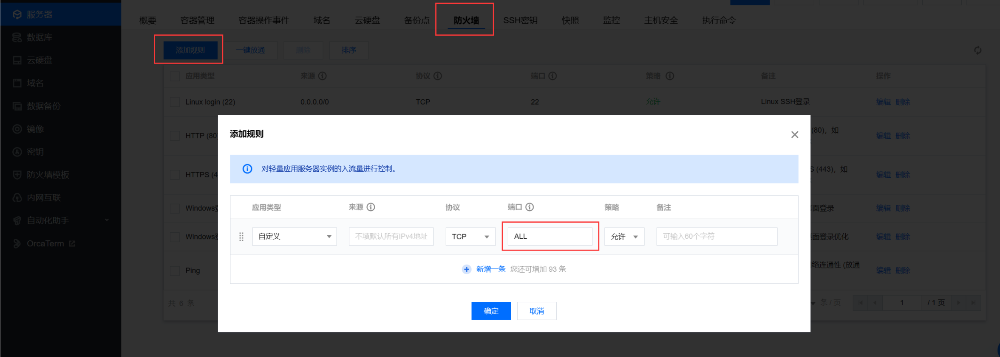
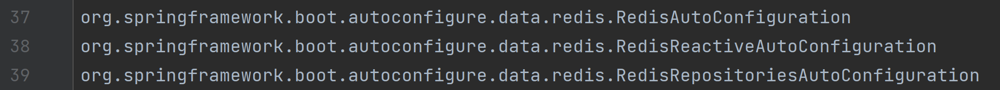
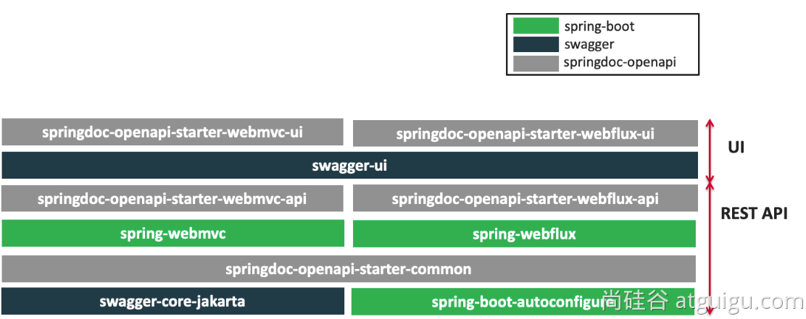

# 一、环境准备

## 1. 云服务器

购买云服务器 https://cloud.tencent.com

**注意：一定要配置防火墙，放行端口**



然后可以用XShell或windterm等远程登录工具登录云服务器。


## 2. 安装组件

我们一共需要安装docker、redis、kafka、prometheus、grafana这些组件。

### 2.1 安装docker

见Docker笔记。

### 2.2 通过docker-compose安装所有组件

创建`/prod`目录，在该目录下创建以下文件：

**prometheus.yml**

```yml
global:
  scrape_interval: 15s
  evaluation_interval: 15s

scrape_configs:
  - job_name: 'prometheus'
    static_configs:
      - targets: ['localhost:9090']

  - job_name: 'redis'
    static_configs:
      - targets: ['redis:6379']

  - job_name: 'kafka'
    static_configs:
      - targets: ['kafka:9092']
```

**docker-compose.yml**

```yml
version: '3.9'

services:
  redis:
    image: redis:latest
    container_name: redis
    restart: always
    ports:
      - "6379:6379"
    networks:
      - backend

  zookeeper:
    image: bitnami/zookeeper:latest
    container_name: zookeeper
    restart: always
    environment:
      ALLOW_ANONYMOUS_LOGIN: yes
      ZOOKEEPER_CLIENT_PORT: 2181
      ZOOKEEPER_TICK_TIME: 2000
    networks:
      - backend

  kafka:
    image: bitnami/kafka:3.4.0
    container_name: kafka
    restart: always
    depends_on:
      - zookeeper
    ports:
      - "9092:9092"
    environment:
      ALLOW_PLAINTEXT_LISTENER: yes
      KAFKA_CFG_ZOOKEEPER_CONNECT: zookeeper:2181
      KAFKA_OFFSETS_TOPIC_REPLICATION_FACTOR: 1
    networks:
      - backend
  
  kafka-ui:
    image: provectuslabs/kafka-ui:latest
    container_name:  kafka-ui
    restart: always
    depends_on:
      - kafka
    ports:
      - "8080:8080"
    environment:
      KAFKA_CLUSTERS_0_NAME: dev
      KAFKA_CLUSTERS_0_BOOTSTRAPSERVERS: kafka:9092
    networks:
      - backend

  prometheus:
    image: prom/prometheus:latest
    container_name: prometheus
    restart: always
    volumes:
      - ./prometheus.yml:/etc/prometheus/prometheus.yml
    ports:
      - "9090:9090"
    networks:
      - backend

  grafana:
    image: grafana/grafana:latest
    container_name: grafana
    restart: always
    depends_on:
      - prometheus
    ports:
      - "3000:3000"
    networks:
      - backend

networks:
  backend:
    name: backend
```

**启动环境**：

```shell
docker compose -f docker-compose.yml up -d
```

> 补充：redis的容器实例建议删除，然后按照Docker笔记中配置redis及其密码，否则redis服务器容易被攻击。

### 2.3 验证

- kafka-ui：访问`公网ip:8080`
- grafana：访问`公网ip:3000`
- prometheus：访问`公网ip:9090`
- kafka：使用IDEA安装大数据插件，`公网ip:9092`
- redis：使用RedisInsight连接`公网ip:6379`，RedisInsight的下载地址为 https://redis.com/redis-enterprise/redis-insight/#insight-form

# 二、NoSQL

## 1. 场景整合

**（1）导入依赖**

```xml
<dependency>
    <groupId>org.springframework.boot</groupId>
    <artifactId>spring-boot-starter-data-redis</artifactId>
</dependency>
```

**（2）配置**

```properties
spring.data.redis.host=192.168.231.101
spring.data.redis.port=6379
spring.data.redis.password=abc666
```

**（3）测试**

```java
@RestController
public class RedisController {
    @Autowired
    private StringRedisTemplate redisTemplate;

    @GetMapping("/count")
    public String count() {
        Long hello = redisTemplate.opsForValue().increment("hello");
        return "访问了" + hello + "次";
    }
}
```

## 2. StringRedisTemplate操作常用数据类型

```java
@SpringBootTest
class Boot309RedisApplicationTests {

    @Autowired
    private StringRedisTemplate redisTemplate;

    @Test
    public void test1() {
        // 操作字符串类型：redisTemplate.opsForValue()
        redisTemplate.opsForValue().set("haha", UUID.randomUUID().toString());
        String haha = redisTemplate.opsForValue().get("haha");
        System.out.println(haha);
    }

    @Test
    public void test2() {
        // 操作列表类型：redisTemplate.opsForList()
        redisTemplate.opsForList().leftPush("listName", "1");
        redisTemplate.opsForList().leftPush("listName", "2");
        redisTemplate.opsForList().leftPush("listName", "3");
        String s = redisTemplate.opsForList().leftPop("listName");
        System.out.println(s);
    }

    @Test
    public void test3() {
        // 操作集合类型：redisTemplate.opsForSet()
        redisTemplate.opsForSet().add("setName", "1", "2", "3");
        Boolean flag1 = redisTemplate.opsForSet().isMember("setName", "2");
        Boolean flag2 = redisTemplate.opsForSet().isMember("setName", "5");
        System.out.println(flag1);
        System.out.println(flag2);
    }

    @Test
    public void test4() {
        // 操作有序集合类型：redisTemplate.opsForZSet()
        redisTemplate.opsForZSet().add("zsetName", "zhangsan", 90.00);
        redisTemplate.opsForZSet().add("zsetName", "lisi", 91.00);
        redisTemplate.opsForZSet().add("zsetName", "wangwu", 89.00);
        ZSetOperations.TypedTuple<String> popMax = redisTemplate.opsForZSet().popMax("zsetName");
        System.out.println(popMax.getValue() + "==>" + popMax.getScore());
    }

    @Test
    public void test5() {
        // 操作哈希类型：redisTemplate.opsForHash()
        redisTemplate.opsForHash().put("hash", "k1", "v1");
        redisTemplate.opsForHash().put("hash", "k2", "18");
        Object obj = redisTemplate.opsForHash().get("hash", "k1");
        System.out.println(obj);
    }
}
```

## 3. 自动配置原理

### 3.1 导入的自动配置类



根据SPI文件知，Redis场景导入的自动配置类有以上三个。其中RedisReactiveAutoConfiguration与响应式编程有关，RedisRepositoriesAutoConfiguration与JPA操作有关。所以我们接下来关注RedisAutoConfiguration自动配置类。

### 3.2 RedisAutoConfiguration

源码如下：

```java
@AutoConfiguration
@ConditionalOnClass({RedisOperations.class})
@EnableConfigurationProperties({RedisProperties.class})
@Import({LettuceConnectionConfiguration.class, JedisConnectionConfiguration.class})
public class RedisAutoConfiguration {
    public RedisAutoConfiguration() {
    }

    @Bean
    @ConditionalOnMissingBean(
        name = {"redisTemplate"}
    )
    @ConditionalOnSingleCandidate(RedisConnectionFactory.class)
    public RedisTemplate<Object, Object> redisTemplate(RedisConnectionFactory redisConnectionFactory) {
        RedisTemplate<Object, Object> template = new RedisTemplate();
        template.setConnectionFactory(redisConnectionFactory);
        return template;
    }

    @Bean
    @ConditionalOnMissingBean
    @ConditionalOnSingleCandidate(RedisConnectionFactory.class)
    public StringRedisTemplate stringRedisTemplate(RedisConnectionFactory redisConnectionFactory) {
        return new StringRedisTemplate(redisConnectionFactory);
    }
}
```

**（1）开启了属性绑定**

属性类RedisProperties绑定了所有以`spring.data.redis`为前缀的配置项。

**（2）添加组件`LettuceConnectionConfiguration`**

给容器中注入了连接工厂LettuceConnectionFactory，和操作 redis 的客户端DefaultClientResources。注意，Lettuce是默认使用的Redis客户端。

**（3）添加组件`RedisTemplate<Object, Object>`**

这是操作redis的工具类，可给 redis 中存储任意类型的对象，会使用 jdk 默认序列化方式。

**（4）添加组件`StringRedisTemplate`**

这也是操作redis的工具类，但给redis中存储的key和value都是字符串。

## 4. 定制化

### 4.1 序列化机制

如果我们想给redis中保存对象，可以使用RedisTemplate，但它使用的是默认的jdk序列化机制，会导致redis中保存的对象呈现出一堆乱码。为了系统的兼容性，所有对象都应该以json的方式进行保存。所以，我们需要写一个配置类，来改变默认的序列化器：

```java
@Configuration
public class AppRedisConfiguration {
    @Bean
    public RedisTemplate<Object, Object> redisTemplate(RedisConnectionFactory redisConnectionFactory) {
        RedisTemplate<Object, Object> template = new RedisTemplate();
        template.setConnectionFactory(redisConnectionFactory);
        // 把对象转为json字符串的序列化器
        template.setDefaultSerializer(new GenericJackson2JsonRedisSerializer());
        return template;
    }
}
```

> 1、参数redisConnectionFactory，是SpringBoot自动给我们注入的连接工厂。只有获取连接后，才能用RedisTemplate等工具类操作redis。
> 
> 2、GenericJackson2JsonRedisSerializer序列化器，可以使得Object类型的key-value，都被转为json字符串进行存储

**测试**：

```java
@RestController
public class RedisController {
    @Autowired
    private RedisTemplate<Object, Object> redisTemplate;

    @GetMapping("/person/save")
    public String savePerson() {
        Person person = new Person(1L, "张三", 18, new Date());
        // 序列化：将对象转为字符串
        redisTemplate.opsForValue().set("person", person);
        return "ok";
    }

    @GetMapping("/person/get")
    public Person getPerson() {
        Person person = (Person) redisTemplate.opsForValue().get("person");
        return person;
    }
}
```

注意：实体类必须实现序列化接口

```java
@NoArgsConstructor
@AllArgsConstructor
@Data
public class Person implements Serializable {
    private Long id;
    private String name;
    private Integer age;
    private Date birthDay;
}
```

### 4.2 redis客户端

Lettuce是默认的redis客户端，因为spring-boot-starter-data-redis中导入了lettuce-core。如果我们想使用Jedis作redis客户端，需要修改pom.xml：

```xml
<dependency>
    <groupId>org.springframework.boot</groupId>
    <artifactId>spring-boot-starter-data-redis</artifactId>
    <!-- 排除lettuce的依赖 -->
    <exclusions>
        <exclusion>
            <groupId>io.lettuce</groupId>
            <artifactId>lettuce-core</artifactId>
        </exclusion>
    </exclusions>
</dependency>
<!-- 切换jedis作为操作redis的底层客户端-->
<dependency>
    <groupId>redis.clients</groupId>
    <artifactId>jedis</artifactId>
</dependency>
```

### 4.3 其他参数

设置Lettuce的底层参数：

```properties
spring.data.redis.client-type=lettuce
spring.data.redis.lettuce.pool.enabled=true
spring.data.redis.lettuce.pool.max-active=8
```

设置Jedis的底层参数：

```properties
spring.data.redis.client-type=jedis
spring.data.redis.jedis.pool.enabled=true
spring.data.redis.jedis.pool.max-active=8
```

# 三、接口文档

## 1. OpenAPI 3 架构与 Swagger



Swagger 可以快速生成**实时接口文档**，方便前后端开发人员进行协调沟通，它遵循 OpenAPI 规范。

## 2. 整合

**（1）导入场景**

```xml
<dependency>
    <groupId>org.springdoc</groupId>
    <artifactId>springdoc-openapi-starter-webmvc-ui</artifactId>
    <version>2.1.0</version>
</dependency>
```

**（2）查看接口文档**

访问`http://ip:端口/swagger-ui/index.html`即可查看

**（3）配置文件**

一般无需额外配置，直接使用，效果就已经很好。以下配置只需了解一下常见配置项即可，无需使用：

```properties
# /api-docs endpoint custom path 默认 /v3/api-docs
springdoc.api-docs.path=/api-docs

# swagger 相关配置在  springdoc.swagger-ui
# swagger-ui custom path
springdoc.swagger-ui.path=/swagger-ui.html
springdoc.show-actuator=true
```

## 3. 使用

### 3.1 常用注解

**（1）@Tag**

标注在controller类上，可以描述该controller的作用：

- name：描述controller类的名称
- description：描述controller的作用

举例：

```java
@Tag(name = "部门", description = "部门的crud")
@RestController
public class DeptController {
}
```

**（2）@Parameter**

标注在参数上，可以描述参数：

- description：描述参数信息

举例：

```java
@Parameter(description = "部门id") Long id
```

**（3）@Parameters**

标注在参数上，作用是参数多重说明。

**（4）@Schema**

标注在实体类及其属性上，描述实体类信息：

- title：描述信息

举例：

```java
@Schema(title = "部门信息")
@Data
public class Dept {
    @Schema(title = "部门id")
    private Long id;
    @Schema(title = "部门名称")
    private String deptName;
}
```

**（5）@Operation**

标注在控制器方法上，用于描述方法的作用：

- summary：简要描述作用
- description：详细描述作用

举例：

```java
@Operation(summary = "按照id查询部门", description = "按照id查询部门，返回一个json类型的Dept对象")
@GetMapping("/dept/{id}")
public Dept getDept(@PathVariable("id") Long id) {
    return deptService.getDeptById(id);
}
```

**（6）@ApiResponse**

标注在控制器方法上，用于描述响应状态码等

### 3.2 Docket配置

如果我们有多个Controller，希望接口文档每个页面只展示一个Controller，这样看起来更加简单清楚。我们可以写一个配置类来进行配置：

```java
@Configuration
public class ApiUiConfig {
    @Bean
    public GroupedOpenApi employeeApi() {
        return GroupedOpenApi.builder()
                .group("员工管理")
                .pathsToMatch("/emp/**", "/emps")
                .build();
    }
    @Bean
    public GroupedOpenApi deptApi() {
        return GroupedOpenApi.builder()
                .group("部门管理")
                .pathsToMatch("/dept/**", "/depts")
                .build();
    }
}
```

### 3.3 OpenAPI配置

在配置类中添加组件配置OpenAPI，可以让界面展示更多额外信息：

```java
@Bean
public OpenAPI docsOpenAPI() {
    return new OpenAPI()
            .info(new Info()
                    .title("SpringBoot3-CRUD API")
                    .description("测试CRUD接口文档")
                    .version("v0.0.1")
                    .license(new License().name("Apache 2.0").url("http://springdoc.org")))
            .externalDocs(new ExternalDocumentation()
                    .description("哈哈 Wiki Documentation")
                    .url("https://springshop.wiki.github.org/docs"));
}
```