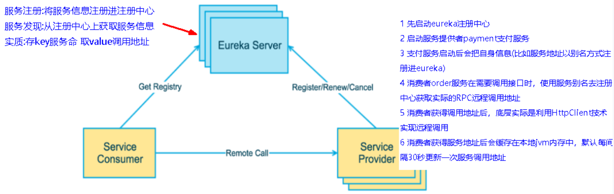
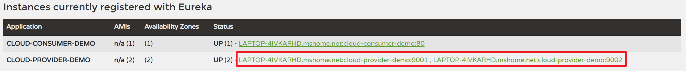
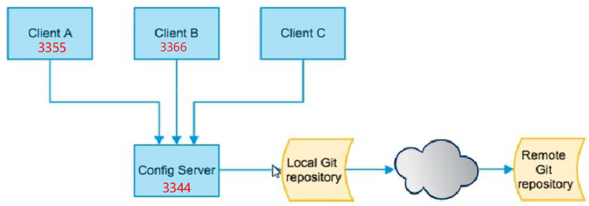
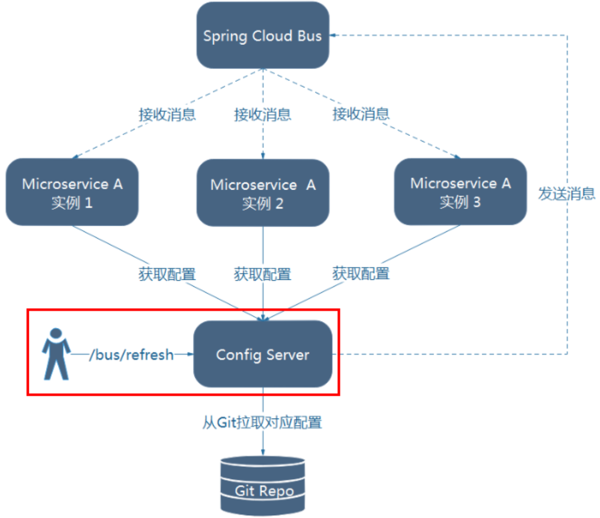

# 第11章_Eureka服务注册中心

## 1. Eureka简介

### 1.1 简介

Eureka的设计架构中，需要一台Eureka Server作为服务注册功能的服务器，即**服务注册中心**。而系统中的其他微服务，都使用Eureka Client连接到Eureka Server并维持心跳连接。

> 注意：与Nacos不同，Eureka注册中心需要我们自己编写一个微服务实现。

### 1.2 整体架构



> 注意：微服务RPC远程服务调用需要保证高可用，避免单点故障，所以我们需要搭建Eureka注册中心集群，实现负载均衡和故障容错。

### 1.3 Eureka Server

Eureka Server提供服务注册功能。各个微服务节点通过配置启动后，会在Eureka Server中进行注册，这样EurekaServer中的服务注册表中将会存储所有可用服务节点的信息，服务节点的信息可以在界面中直观看到。

### 1.4 Eureka Client

Eureka Client是一个Java客户端，用于简化与Eureka Server的交互，客户端同时也具备一个内置的、使用轮询(round-robin)负载算法的负载均衡器LoadBalancer。在应用启动后，将会向Eureka Server发送心跳(默认周期为30秒)。如果Eureka Server在多个心跳周期内没有接收到某个节点的心跳，EurekaServer将会从服务注册表中把这个服务节点移除（默认90秒）。

## 2. Eureka Server单机搭建

### 2.1 创建模块cloud-eureka-server7001

### 2.2 添加依赖

```xml
<!-- eureka-server -->
<dependency>
    <groupId>org.springframework.cloud</groupId>
    <artifactId>spring-cloud-starter-netflix-eureka-server</artifactId>
</dependency>
<dependency>
    <groupId>org.springframework.boot</groupId>
    <artifactId>spring-boot-starter-web</artifactId>
</dependency>
<dependency>
    <groupId>org.springframework.boot</groupId>
    <artifactId>spring-boot-starter-actuator</artifactId>
</dependency>
<dependency>
    <groupId>org.springframework.boot</groupId>
    <artifactId>spring-boot-starter-test</artifactId>
    <scope>test</scope>
</dependency>
```

### 2.3 配置文件

```properties
server.port=7001

# eureka相关配置
## eureka服务端的主机名称
eureka.instance.hostname=localhost
## false表示不向注册中心注册自己
eureka.client.register-with-eureka=false
## false表示自己就是注册中心，只负责维护服务实例，而不需要去检索服务
eureka.client.fetch-registry=false
## 设置与EurekaServer交互的地址，查询服务和注册服务都需要依赖这个地址
eureka.client.service-url.defaultZone=http://localhost:7001/eureka/
```

### 2.4 主启动类

**注意**：Eureka Server端必须添加@EnableEurekaServer注解

```java
@SpringBootApplication
@EnableEurekaServer
public class EurekaServer7001 {
    public static void main(String[] args) {
        SpringApplication.run(EurekaServer7001.class, args);
    }
}
```

## 3. Eureka Server集群搭建

### 3.1 准备工作

我们修改`C:\Windows\System32\drivers\etc\`目录下的hosts文件，添加以下映射关系，来模拟不同的域名访问：

```
127.0.0.1 eureka7001.com
127.0.0.1 eureka7002.com
```

EurekaServer服务注册中心集群搭建的思想是**多台注册中心互相注册**，我们以搭建两台注册中心为例。

### 3.2 修改7001的配置文件

```properties
server.port=7001

# eureka相关配置
eureka.instance.hostname=eureka7001.com
eureka.client.register-with-eureka=false
eureka.client.fetch-registry=false
eureka.client.service-url.defaultZone=http://eureka7002.com:7002/eureka/
```

### 3.3 创建另一个Eureka Server 7002

创建模块cloud-eureka-server7002，它与7001类似，只有配置文件不同：

```properties
server.port=7002

# eureka相关配置
eureka.instance.hostname=eureka7002.com
eureka.client.register-with-eureka=false
eureka.client.fetch-registry=false
eureka.client.service-url.defaultZone=http://eureka7001.com:7001/eureka/
```

## 4. 案例实战

### 4.1 服务提供者

#### 1、创建模块cloud-provider-demo9001

#### 2、添加依赖

```xml
<!-- eureka-client -->
<dependency>
    <groupId>org.springframework.cloud</groupId>
    <artifactId>spring-cloud-starter-netflix-eureka-client</artifactId>
</dependency>
<dependency>
    <groupId>org.springframework.boot</groupId>
    <artifactId>spring-boot-starter-web</artifactId>
</dependency>
<dependency>
    <groupId>org.springframework.boot</groupId>
    <artifactId>spring-boot-starter-actuator</artifactId>
</dependency>
<dependency>
    <groupId>org.springframework.boot</groupId>
    <artifactId>spring-boot-starter-test</artifactId>
    <scope>test</scope>
</dependency>
```

#### 3、配置文件

```properties
# 端口号
server.port=9001
# 微服务名称
spring.application.name=cloud-provider-demo

# eureka相关配置
## true表示将自己注册到Eureka注册中心，默认值为true
eureka.client.register-with-eureka=true
## true表示从EurekaServer抓取已有的注册信息，默认值为true。集群必须设置为true才能使用负载均衡。
eureka.client.fetch-registry=true
## 设置与EurekaServer交互的地址
eureka.client.service-url.defaultZone=http://eureka7001.com:7001/eureka, http://eureka7002.com:7002/eureka
```

#### 4、主启动类

标注@EnableDiscoveryClient注解开启服务发现功能

```java
@SpringBootApplication
@EnableDiscoveryClient
public class Demo9001 {
    public static void main(String[] args) {
        SpringApplication.run(Demo9001.class, args);
    }
}
```

#### 5、业务类

controller

```java
@RestController
public class DemoController {
    @Value("${server.port}")
    private String serverPort;

    @GetMapping("/demo/get")
    public String getDemo() {
        return serverPort;
    }
}
```

#### 6、再创建一个服务提供者构成集群

我们的服务提供者模块为了实现高可用，也需要搭建集群。我们以搭建两台服务提供者为例。

创建模块cloud-provider-demo9002，几乎与9001完全一样，只需在配置文件中修改端口号。

### 4.2 服务消费者

#### 1、创建模块cloud-consumer-demo80

#### 2、添加依赖

```xml
<!-- eureka-client -->
<dependency>
    <groupId>org.springframework.cloud</groupId>
    <artifactId>spring-cloud-starter-netflix-eureka-client</artifactId>
</dependency>
<!-- loadbalancer -->
<dependency>
    <groupId>org.springframework.cloud</groupId>
    <artifactId>spring-cloud-starter-loadbalancer</artifactId>
</dependency>
<dependency>
    <groupId>org.springframework.boot</groupId>
    <artifactId>spring-boot-starter-web</artifactId>
</dependency>
<dependency>
    <groupId>org.springframework.boot</groupId>
    <artifactId>spring-boot-starter-actuator</artifactId>
</dependency>
<dependency>
    <groupId>org.springframework.boot</groupId>
    <artifactId>spring-boot-starter-test</artifactId>
    <scope>test</scope>
</dependency>
```

> 说明：eureka-client中自动也给我们引入了loadbalancer的依赖，所以我们也可以无需自己手动再引入loadbalancer依赖

#### 3、配置文件

```properties
# 端口号
server.port=80
# 微服务名称
spring.application.name=cloud-consumer-demo

# eureka相关配置
eureka.client.register-with-eureka=true
eureka.client.fetch-registry=true
eureka.client.service-url.defaultZone=http://eureka7001.com:7001/eureka, http://eureka7002.com:7002/eureka
```

#### 4、主启动类

标注@EnableDiscoveryClient注解开启服务发现功能

```java
@SpringBootApplication
@EnableDiscoveryClient
public class Demo80 {
    public static void main(String[] args) {
        SpringApplication.run(Demo80.class, args);
    }
}
```

#### 5、业务类

（1）在配置类ApplicationContextConfig中配置组件RestTemplate，并开启负载均衡功能

```java
@Configuration
public class ApplicationContextConfig {
    @Bean
    @LoadBalanced
    public RestTemplate restTemplate() {
        return new RestTemplate();
    }
}
```

（2）controller

```java
@RestController
public class DemoController {
    public static final String URL = "http://cloud-provider-demo";

    @Autowired
    private RestTemplate restTemplate;

    @GetMapping("/consumer/demo/get")
    public String getDemo() {
        return restTemplate.getForObject(URL + "/demo/get", String.class);
    }
}
```

### 4.3 测试

- 启动7001、7002、9001、9002、80
- 访问`http://localhost/consumer/demo/get`成功，端口号9001和9002交替出现，说明负载均衡效果生效
- 访问`http://localhost:7001`也可以查看Eureka Server中的注册信息


## 5. actuator微服务信息完善



我们可以做一些配置，让上述位置不显示主机名称，而是显示我们自定义的名称(可读性更高)，除此之外，我们还希望鼠标悬浮上去后能提示ip地址和端口号。只需在9001和9002的配置文件中添加如下配置：

9001：

```properties
## 自定义显示名称
eureka.instance.instance-id=demo9001
## 访问路径可以显示ip地址
eureka.instance.prefer-ip-address=true
```

9002：

```properties
eureka.instance.instance-id=demo9002
eureka.instance.prefer-ip-address=true
```

## 6. Eureka自我保护模式

### 6.1 自我保护模式

**Eureka属于CAP里面的AP分支**

当我们看到以下提示时，说明Eureka进入了自我保护模式：


一旦进入自我保护模式，Eureka Server将会尝试保护其服务注册表中的信息，不再删除服务注册表中的数据，也就是**不会注销任何微服务**。

### 6.2 自我保护模式产生的原因

假设没有自我保护模式，那么如果Eureka Server在一定时间内没有接收到某个微服务实例的心跳，Eureka Server将会注销该实例（默认90秒）。但是当网络分区故障发生(延时、卡顿、拥挤)时，微服务与Eureka Server之间无法正常通信，以上行为可能就变得非常危险了，因为微服务本身其实是健康的，此时本不应该注销这个微服务。

所以Eureka通过**自我保护模式**来解决这个问题，当Eureka Server节点在短时间内丢失过多客户端时（可能发生了网络分区故障），那么这个节点就会进入自我保护模式。

在自我保护模式中，Eureka Server会保护服务注册表中的信息，不再注销任何服务实例。

综上，自我保护模式是一种应对网络异常的安全保护措施。它的架构哲学是同时保留所有微服务，而不盲目注销任何健康的微服务。使用自我保护模式，可以让Eureka集群更加的健壮稳定。

### 6.3 关闭自我保护模式的方式

默认自我保护模式是开启的，如果想关闭，只需在Eureka Server的配置文件中添加

```properties
## 关闭自我保护机制，保证不可用服务被及时踢除
eureka.server.enable-self-preservation=false
```

为了便于测试，我们可以配置一些其他参数：

- 在Eureka Server端配置
    ```properties
    ## 清理无效节点的频率，以下配置表示每隔2000ms清理无效节点
    eureka.server.eviction-interval-timer-in-ms=2000
    ```
- 在Eureka Client端配置
    ```properties
    ## Eureka客户端向服务端发送心跳的时间间隔，单位为秒(默认是30秒)
    eureka.instance.lease-renewal-interval-in-seconds=1
    ## Eureka服务端在收到最后一次心跳后等待时间上限，单位为秒(默认是90秒)，超时将剔除服务
    eureka.instance.lease-expiration-duration-in-seconds=2
    ```

# 第12章_ZooKeeper服务注册中心

## 1. ZooKeeper简介

### 1.1 概述

ZooKeeper是一个分布式协调工具，可以实现注册中心功能。关闭Linux服务器防火墙后启动ZooKeeper服务器，用它取代Eureka服务器，来作为服务注册中心。

### 1.2 ZooKeeper安装

使用Docker安装ZooKeeper的步骤如下：

（1）拉取镜像，下载zookeeper 3.6.0版本

```shell
docker pull zookeeper:3.6.0
```

（2）创建ZooKeeper挂载目录（数据挂载目录、配置挂载目录和日志挂载目录）

```shell
mkdir -p /thuwsy/zookeeper/data
mkdir -p /thuwsy/zookeeper/conf
mkdir -p /thuwsy/zookeeper/logs
```

（3）启动ZooKeeper容器

```shell
docker run -d --name zookeeper --privileged=true -p 2181:2181 -v /thuwsy/zookeeper/data:/data -v /thuwsy/zookeeper/conf:/conf -v /thuwsy/zookeeper/logs:/datalog zookeeper:3.6.0
```

（4）进入容器内部，验证容器状态

```shell
# 进入zookeeper 容器内部
docker exec -it zookeeper /bin/bash
# 检查容器状态
docker exec -it zookeeper /bin/bash ./bin/zkServer.sh status
# 进入控制台
docker exec -it zookeeper zkCli.sh
```

## 2. 案例实战

### 2.1 服务提供者

#### 1、创建模块cloud-provider-demo9003

#### 2、添加依赖

```xml
<!-- SpringCloud整合zookeeper客户端 -->
<dependency>
    <groupId>org.springframework.cloud</groupId>
    <artifactId>spring-cloud-starter-zookeeper-discovery</artifactId>
    <!--先排除自带的zookeeper-->
    <exclusions>
        <exclusion>
            <groupId>org.apache.zookeeper</groupId>
            <artifactId>zookeeper</artifactId>
        </exclusion>
    </exclusions>
</dependency>
<!--添加zookeeper3.6.0版本，与我们服务器zookeeper的版本相同-->
<dependency>
    <groupId>org.apache.zookeeper</groupId>
    <artifactId>zookeeper</artifactId>
    <version>3.6.0</version>
    <!--排除其自带的日志-->
    <exclusions>
        <exclusion>
            <groupId>org.slf4j</groupId>
            <artifactId>slf4j-reload4j</artifactId>
        </exclusion>
    </exclusions>
</dependency>
<dependency>
    <groupId>org.springframework.boot</groupId>
    <artifactId>spring-boot-starter-web</artifactId>
</dependency>
<dependency>
    <groupId>org.springframework.boot</groupId>
    <artifactId>spring-boot-starter-actuator</artifactId>
</dependency>
<dependency>
    <groupId>org.springframework.boot</groupId>
    <artifactId>spring-boot-starter-test</artifactId>
    <scope>test</scope>
</dependency>
```

#### 3、配置文件

```properties
server.port=9003
spring.application.name=cloud-provider-demo
# zookeeper服务器的ip和端口
spring.cloud.zookeeper.connect-string=192.168.231.101:2181
```

#### 4、主启动类

需要添加@EnableDiscoveryClient注解，用于向使用consul或者zookeeper作为注册中心时注册服务

```java
@SpringBootApplication
@EnableDiscoveryClient
public class Provider9003 {
    public static void main(String[] args) {
        SpringApplication.run(Provider9003.class, args);
    }
}
```

#### 5、业务类

```java
@RestController
public class PaymentController {
    @Value("${server.port}")
    private String serverPort;
    @RequestMapping("/payment/zk")
    public String paymentzk() {
        return "port:" + serverPort + "\t" + UUID.randomUUID();
    }
}
```

#### 6、测试

启动ZooKeeper，启动9003，在ZooKeeper服务器上即可查看是否注册了该服务：

```shell
[root@thuwsy001 conf]# docker exec -it zookeeper zkCli.sh
[zk: localhost:2181(CONNECTED) 0] ls /
[services, zookeeper]
[zk: localhost:2181(CONNECTED) 1] ls /services
[cloud-provider-demo]
[zk: localhost:2181(CONNECTED) 2] ls /services/cloud-provider-demo
[53b99772-2316-45e0-aa1f-7d0464162448]
```

**注意：ZooKeeper中的服务节点是临时节点，一旦我们关闭了上述payment服务，一段时间后，ZooKeeper就会注销该节点**。

### 2.2 服务消费者

#### 1、创建模块cloud-consumer-demo-zk80

#### 2、添加依赖，与上述9003相同

#### 3、配置文件

```properties
server.port=80
spring.application.name=cloud-consumer-demo-zk
spring.cloud.zookeeper.connect-string=192.168.231.101:2181
```

#### 4、主启动类

```java
@SpringBootApplication
@EnableDiscoveryClient
public class ConsumerZk80 {
    public static void main(String[] args) {
        SpringApplication.run(ConsumerZk80.class, args);
    }
}
```

#### 5、业务类

（1）配置类

```java
@Configuration
public class ApplicationConfig {
    @Bean
    @LoadBalanced
    public RestTemplate restTemplate() {
        return new RestTemplate();
    }
}
```

（2）controller

```java
@RestController
public class OrderController {
    public static final String URL = "http://cloud-provider-demo";
    @Autowired
    private RestTemplate restTemplate;
    @GetMapping("/consumer/payment/zk")
    public String paymentzk() {
        String result = restTemplate.getForObject(URL + "/payment/zk", String.class);
        return result;
    }
}
```

#### 6、测试

启动ZooKeeper，启动9003、80，在ZooKeeper服务器上即可查看服务的注册信息。访问`http://localhost/consumer/payment/zk`可以正确得到信息。


# 第13章_Consul服务注册中心

## 1. Consul简介

### 1.1 概述

Consul 是一套开源的分布式服务发现和配置管理系统，由 HashiCorp 公司用 Go 语言开发。它提供了微服务系统中的服务治理、配置中心、控制总线等功能，这些功能中的每一个都可以根据需要单独使用，也可以一起使用以构建全方位的服务网格，总之Consul提供了一种完整的服务网格解决方案。

特点：

- 服务发现：提供HTTP和DNS两种发现方式
- 健康监测：支持多种方式，HTTP、TCP、Docker、Shell脚本定制化监控
- KV存储：Key-Value的存储方式
- 多数据中心：Consul支持多数据中心
- 可视化Web界面

### 1.2 Consul安装

Docker安装Consul的步骤：

（1）拉取镜像

```shell
docker pull consul:1.6.1
```

（2）启动容器

```shell
docker run -d -p 8500:8500 --name=consul consul:1.6.1 agent -server -bootstrap -ui -node=1 -client='0.0.0.0'
```

（3）访问测试

访问`http://192.168.231.101:8500`

## 2. 案例实战

### 2.1 服务提供者

#### 1、创建模块cloud-provider-demo9004

#### 2、添加依赖

```xml
<!-- consul-discovery -->
<dependency>
    <groupId>org.springframework.cloud</groupId>
    <artifactId>spring-cloud-starter-consul-discovery</artifactId>
</dependency>
<dependency>
    <groupId>org.springframework.boot</groupId>
    <artifactId>spring-boot-starter-web</artifactId>
</dependency>
<dependency>
    <groupId>org.springframework.boot</groupId>
    <artifactId>spring-boot-starter-actuator</artifactId>
</dependency>
<dependency>
    <groupId>org.springframework.boot</groupId>
    <artifactId>spring-boot-starter-test</artifactId>
    <scope>test</scope>
</dependency>
```

#### 3、配置文件

```properties
server.port=9004
spring.application.name=cloud-provider-demo
# consul注册中心地址
spring.cloud.consul.host=192.168.231.101
spring.cloud.consul.port=8500
spring.cloud.consul.discovery.service-name=${spring.application.name}
spring.cloud.consul.discovery.prefer-ip-address=true
```

#### 4、主启动类

需要添加@EnableDiscoveryClient注解，用于向使用consul或者zookeeper作为注册中心时注册服务

```java
@SpringBootApplication
@EnableDiscoveryClient
public class Provider9004 {
    public static void main(String[] args) {
        SpringApplication.run(Provider9004.class, args);
    }
}
```

#### 5、业务类

```java
@RestController
public class PaymentController {
    @Value("${server.port}")
    private String serverPort;
    @RequestMapping("/payment/consul")
    public String paymentConsul() {
        return "port:" + serverPort + "\t" + UUID.randomUUID();
    }
}
```

### 2.2 服务消费者

#### 1、创建模块cloud-consumer-demo-consul80

#### 2、添加依赖，与上述9004相同

#### 3、配置文件

```properties
server.port=80
spring.application.name=cloud-consumer-demo-consul
spring.cloud.consul.host=192.168.231.101
spring.cloud.consul.port=8500
spring.cloud.consul.discovery.service-name=${spring.application.name}
spring.cloud.consul.discovery.prefer-ip-address=true
```

#### 4、主启动类

```java
@SpringBootApplication
@EnableDiscoveryClient
public class ConsumerConsul80 {
    public static void main(String[] args) {
        SpringApplication.run(ConsumerConsul80.class, args);
    }
}
```

#### 5、业务类

（1）配置类

```java
@Configuration
public class ApplicationConfig {
    @Bean
    @LoadBalanced
    public RestTemplate restTemplate() {
        return new RestTemplate();
    }
}
```

（2）controller

```java
@RestController
public class OrderController {
    public static final String URL = "http://cloud-provider-demo";
    @Autowired
    private RestTemplate restTemplate;
    @GetMapping("/consumer/payment/consul")
    public String paymentConsul() {
        String result = restTemplate.getForObject(URL + "/payment/consul", String.class);
        return result;
    }
}
```

#### 6、测试

启动Consul，启动9004、80，访问`http://192.168.231.101:8500`可以查看服务的注册信息。同时，访问`http://localhost/consumer/payment/consul`可以正确得到信息。


# 第14章_Config配置中心

## 1. Config简介

Spring Cloud Config中，配置服务器**默认采用GitHub来存储配置信息**，这样就有助于对环境配置进行版本管理，并且可以通过git客户端工具来方便的管理和访问配置内容。

**架构图**：



## 2. Config服务端

### 2.1 在GitHub上创建配置文件

在github上创建一个springcloud-test-config仓库，并在其中创建三个配置文件：

- config-dev.yml
    ```yml
    config:
      info: main-dev-config-hello-version=1.0
    ```
- config-test.yml
    ```yml
    config:
      info: main-test-config-hello-version=1.0
    ```
- config-prod.yml
    ```yml
    config:
      info: main-prod-config-hello-version=1.0
    ```

并记住仓库地址：`git@github.com:THU-wsy/springcloud-test-config.git`。在实际开发中需要clone到本地进行配置修改，但我们为了简便，后面步骤直接在github上进行修改。

### 2.2 创建模块cloud-config-center-3344作为配置中心

### 2.3 添加依赖

```xml
<!-- config-server -->
<dependency>
    <groupId>org.springframework.cloud</groupId>
    <artifactId>spring-cloud-config-server</artifactId>
</dependency>
<dependency>
    <groupId>org.springframework.cloud</groupId>
    <artifactId>spring-cloud-starter-netflix-eureka-client</artifactId>
</dependency>
<dependency>
    <groupId>org.springframework.boot</groupId>
    <artifactId>spring-boot-starter-web</artifactId>
</dependency>
<dependency>
    <groupId>org.springframework.boot</groupId>
    <artifactId>spring-boot-starter-actuator</artifactId>
</dependency>
<dependency>
    <groupId>org.springframework.boot</groupId>
    <artifactId>spring-boot-starter-test</artifactId>
    <scope>test</scope>
</dependency>
```

### 2.4 配置文件

```yml
server:
  port: 3344
spring:
  application:
    name: cloud-config-center 
  cloud:
    config:
      server:
        git:
          uri: git@github.com:THU-wsy/springcloud-test-config.git # GitHub仓库地址
          search-paths:
            - springcloud-test-config # 仓库名称
          default-label: main # 分支
# 注册到Eureka
eureka:
  client:
    service-url:
      defaultZone: http://eureka7001.com:7001/eureka, http://eureka7002.com:7002/eureka
```

### 2.5 主启动类

需要标注@EnableConfigServer

```java
@SpringBootApplication
@EnableConfigServer
public class ConfigCenterMain3344 {
    public static void main(String[] args) {
        SpringApplication.run(ConfigCenterMain3344.class, args);
    }
}
```

### 2.6 测试

为了模拟开发中一般用域名访问配置中心，我们在windows的hosts文件中添加映射`127.0.0.1 config-3344.com`

启动7001，7002，3344，访问`http://config-3344.com:3344/main/config-dev.yml`成功

> 注意：访问路径为`/{label}/{application}-{profile}.yml`

## 3. Config客户端

### 3.1 创建模块cloud-config-client-3355

### 3.2 添加依赖

```xml
<!-- config客户端 -->
<dependency>
    <groupId>org.springframework.cloud</groupId>
    <artifactId>spring-cloud-starter-config</artifactId>
</dependency>
<!-- 支持bootstrap.yml配置文件 -->
<dependency>
    <groupId>org.springframework.cloud</groupId>
    <artifactId>spring-cloud-starter-bootstrap</artifactId>
</dependency>
<dependency>
    <groupId>org.springframework.cloud</groupId>
    <artifactId>spring-cloud-starter-netflix-eureka-client</artifactId>
</dependency>
<dependency>
    <groupId>org.springframework.boot</groupId>
    <artifactId>spring-boot-starter-web</artifactId>
</dependency>
<dependency>
    <groupId>org.springframework.boot</groupId>
    <artifactId>spring-boot-starter-actuator</artifactId>
</dependency>
<dependency>
    <groupId>org.springframework.boot</groupId>
    <artifactId>spring-boot-starter-test</artifactId>
    <scope>test</scope>
</dependency>
```

### 3.3 配置文件bootstrap.yml

```yml
server:
  port: 3355
spring:
  application:
    name: cloud-config-client
  cloud:
    config:
      label: main # 分支名称
      name: config # GitHub仓库中配置文件名称
      profile: dev # GitHub仓库中配置文件的环境后缀
      # 以上三个配置结合，就表示读取main分支上的config-dev.yml配置文件
      uri: http://config-3344.com:3344 # 配置中心地址
# 服务注册到Eureka
eureka:
  client:
    service-url:
      defaultZone: http://eureka7001.com:7001/eureka, http://eureka7002.com:7002/eureka
# 暴露监控端点，为了使用客户端动态刷新
management:
  endpoints:
    web:
      exposure:
        include: '*'
```

### 3.4 主启动类

```java
@SpringBootApplication
public class ConfigClientMain3355 {
    public static void main(String[] args) {
        SpringApplication.run(ConfigClientMain3355.class, args);
    }
}
```

### 3.5 业务类

需要在Contoller上添加@RefreshScope注解来支持客户端的动态刷新

```java
@RestController
@RefreshScope // 添加该注解用于支持动态刷新
public class ConfigClientController {
    @Value("${config.info}") // 读取配置文件中名为config.info的配置项
    private String configInfo;

    @Value("${server.port}")
    private String serverPort;

    @GetMapping("/configInfo")
    public String getConfigInfo() {
        return "serverPort:" + serverPort + ", configInfo:" + configInfo;
    }
}
```

### 3.6 类似3355再创建一个模块cloud-config-client-3366

### 3.7 测试

- 启动7001、7002、3344、3355、3366
- 访问`http://localhost:3355/configInfo`读取配置成功
- 访问`http://localhost:3366/configInfo`读取配置成功
- 修改GitHub仓库中config-dev.yml的配置并提交
- 此时访问配置中心`http://config-3344.com:3344/main/config-dev.yml`已经得到新的配置
- 但如果想要客户端也读取到新的配置(在不重启的情况下)，需要运维人员先发一个POST请求给`http://localhost:3355/actuator/refresh`表示刷新配置，然后再访问`http://localhost:3355/configInfo`就读取到了新的配置。
- 同理也要给3366发POST请求才能让3366读取到最新配置

> 问题：如果有很多微服务客户端，一旦修改配置中心的配置文件，每个微服务都需要执行一次POST请求，过于繁琐。如果想大范围的执行自动刷新，即一次通知、处处生效，就需要用到消息总线。

# 第15章_Bus消息总线

## 1. Bus简介

Spring Cloud Bus 配合 Spring Cloud Config 使用可以**实现配置的动态刷新**。Spring Cloud Bus是用来将分布式系统的节点与轻量级消息系统链接起来的框架，它整合了Java的事件处理机制和消息中间件的功能。Spring Clud Bus目前支持**RabbitMQ和Kafka**。

Spring Cloud Bus能管理和传播分布式系统间的消息，就像一个分布式执行器，可用于广播状态更改、事件推送等，也可以当作微服务间的通信通道。

**总线**：

在微服务架构的系统中，通常会使用轻量级的消息代理来构建一个共用的消息主题，并让系统中所有微服务实例都连接上来。由于该主题中产生的消息会被所有实例监听和消费，所以称它为消息总线。在总线上的各个实例，都可以方便地广播一些需要让其他连接在该主题上的实例都知道的消息。

**基本原理**：

ConfigClient实例都监听MQ中同一个topic(默认是springCloudBus)。当一个服务刷新数据的时候，它会把这个信息放入到Topic中，这样其它监听同一Topic的服务就能得到通知，然后去更新自身的配置。

## 2. 架构说明

### 2.1 启动Linux服务器上的RabbitMQ

可以参考RabbitMQ笔记

```shell
docker restart rabbitmq
```

账号admin，密码abc666

### 2.2 架构图

利用消息总线触发一个服务端ConfigServer的/bus/refresh端点，进而刷新所有客户端的配置。



## 3. Bus动态刷新案例实战

### 3.1 配置中心3344添加消息总线支持

#### 1、添加依赖

```xml
<!--添加消息总线RabbitMQ支持-->
<dependency>
    <groupId>org.springframework.cloud</groupId>
    <artifactId>spring-cloud-starter-bus-amqp</artifactId>
</dependency>
```

#### 2、配置文件中添加

```yml
spring:
  rabbitmq: # rabbitmq相关配置
    host: 192.168.231.101
    port: 5672
    username: admin
    password: abc666
# 暴露bus刷新配置的端点
management:
  endpoints:
    web:
      exposure:
        include: 'busrefresh'
```

### 3.2 客户端3355和3366添加消息总线支持

#### 1、添加依赖

```xml
<!--添加消息总线RabbitMQ支持-->
<dependency>
    <groupId>org.springframework.cloud</groupId>
    <artifactId>spring-cloud-starter-bus-amqp</artifactId>
</dependency>
```

#### 2、配置文件中添加

```yml
spring:
  rabbitmq: # rabbitmq相关配置
    host: 192.168.231.101
    port: 5672
    username: admin
    password: abc666
```

### 3.3 测试(全局广播)

- 启动RabbitMQ、7001、7002、3344、3355、3366
- 访问`http://config-3344.com:3344/main/config-dev.yml`读取配置成功
- 访问`http://localhost:3355/configInfo`读取配置成功
- 访问`http://localhost:3366/configInfo`读取配置成功
- 然后修改GitHub仓库中config-dev.yml的配置并提交
- 然后运维人员发一个POST请求给`http://config-3344.com:3344/actuator/busrefresh`，一次发送、处处生效
- 再次访问上述三个地址，均得到了新的配置。
- 并且访问RabbitMQ的Web管理界面`http://192.168.231.101:15672`，会发现有一个名为springCloudBus的topic类型交换机

### 3.4 测试(定点通知)

修改GitHub仓库中config-dev.yml的配置并提交，如果只想让3355获取新的配置，则运维人员可以发一个POST请求给`http://config-3344.com:3344/actuator/busrefresh/cloud-config-client:3355`来定点通知(即在广播url后添加`/微服务名:端口号`)

然后再次访问：

- `http://localhost:3355/configInfo`读取到新的配置
- `http://localhost:3366/configInfo`还是以前的配置
