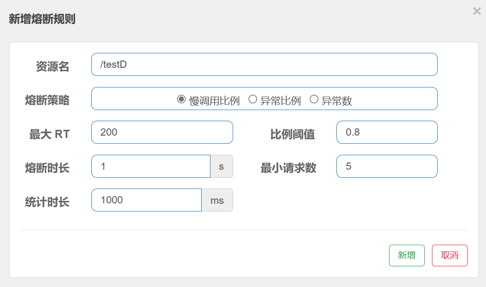
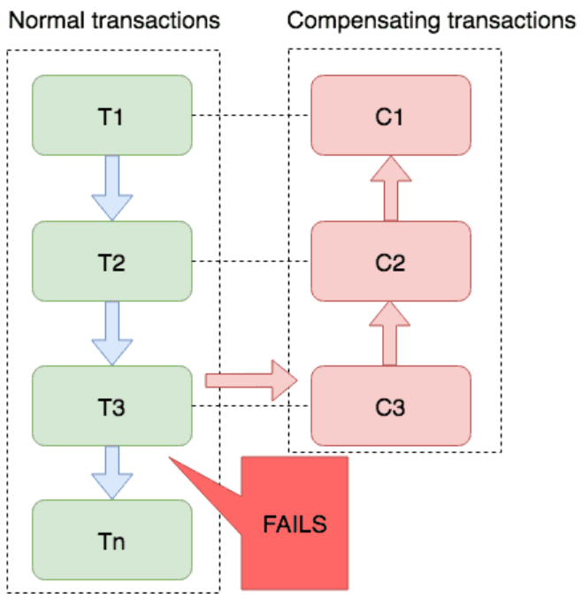
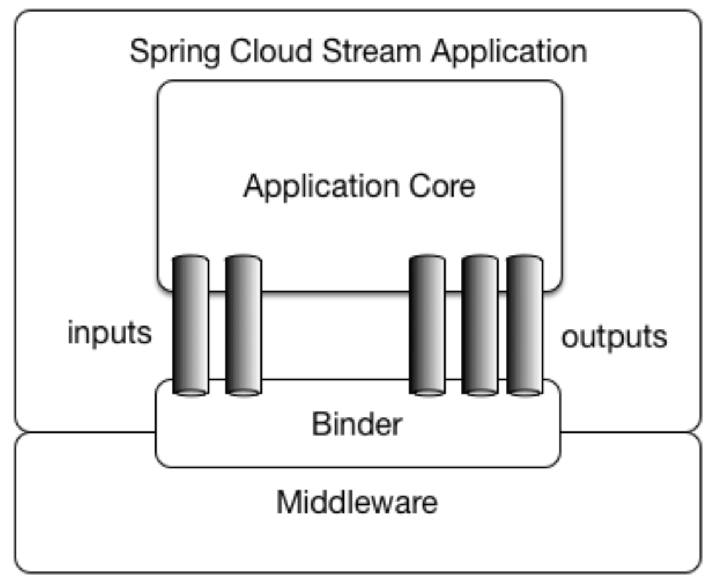

# 第01章_SpringCloud简介

## 1. 微服务架构

**微服务架构**是一种架构模式，它提倡将单一应用程序划分成一组小型服务，服务之间相互协调配合。每个服务运行在其独立的进程中，服务与服务间采用轻量级的通信机制互相协作(通常是基于HTTP协议的RESTful API)。每个服务都围绕着具体业务进行构建，并且能够被独立地部署到生产环境。除此之外，应当尽量避免统一、集中式的服务管理机制，对具体的一个服务而言，应该根据业务上下文来选择合适的语言、工具对其进行构建。

**Spring Cloud是分布式微服务架构的一站式解决方案**，是多种微服务架构实现技术的集合体。

## 2. Spring Cloud

### 2.1 Spring Cloud版本的命名规则

Spring Cloud采用了英国伦敦地铁站的名称来命名，并由地铁站名称字母A-Z依次类推的形式来发布迭代版本，例如Angel是第一个版本, Brixton是第二个版本。这是因为SpringCloud有很多子项目，需要管理它们的版本号，为了防止SpringCloud的版本号和子项目的版本号混淆，所以采用了这种命名方式。

> 补充：现在Spring Cloud版本根据年份来命名

### 2.2 版本选择

版本选择可以参考 https://github.com/alibaba/spring-cloud-alibaba/wiki/%E7%89%88%E6%9C%AC%E8%AF%B4%E6%98%8E

我们选用的版本如下：

- Spring Cloud：2022.0.0
- Spring Boot：3.0.2
- Spring Cloud Alibaba：2022.0.0.0

> 说明：Spring Cloud Alibaba的版本命名中，前3位是适配的Spring Cloud版本，最后一位是扩展版本。

我们选用的组件版本：

- Sentinel: 1.8.6
- Nacos: 2.2.3
- RocketMQ: 4.9.4
- Seata: 1.7.1

## 3. Spring Cloud Alibaba

以前Spring Cloud所使用的组件主要由Spring Cloud Netflix提供，但它现在已停更并进入维护模式，从而Spring Cloud Alibaba将其取而代之。

Spring Cloud Alibaba致力于提供微服务开发的一站式解决方案。此项目包含开发分布式应用微服务的必需组件，方便开发者通过 Spring Cloud 编程模型轻松使用这些组件来开发分布式应用服务。

英文官网：https://spring.io/projects/spring-cloud-alibaba#learn

中文文档：https://github.com/alibaba/spring-cloud-alibaba/blob/2022.x/README-zh.md

## 4. Dubbo

Dubbo从3.0开始已经不再与Spring Cloud Alibaba进行集成了，原因主要是与其发展方向定位有关。

- 最初，Dubbo定位是**微服务框架**，与SpringCloud定位相同。但没有撼动SpringCloud的地位，自己反而停止维护了。
- 后来，随着Spring Cloud Alibaba的大火，Dubbo又火爆了起来，因为它解决了Spring Cloud Alibaba通信效率低下的问题。此时Dubbo的定位是**RPC通信框架**。
- 现在，Dubbo已经逐步完善，定位又回到了**微服务框架**。此时的Dubbo，能够完美处理**超大规模的微服务应用**，而Spring Cloud只适用于中小规模的微服务应用。

## 5. SpringCloud组件的升级与替换

### 5.1 服务注册中心

- Eureka：由Netflix提供(已过时)
- ZooKeeper：由雅虎公司提供
- Consul：由HashiCorp公司提供
- Nacos：由Alibaba提供(推荐使用)

### 5.2 服务配置中心

- Config：由SpringCloud官方提供
- Nacos：由Alibaba提供(推荐使用)

### 5.3 消息总线

- Bus：由SpringCloud官方提供
- Nacos：由Alibaba提供(推荐使用)

### 5.4 负载均衡器

- Ribbon：由Netflix提供(已过时)
- LoadBalancer：由SpringCloud官方提供(推荐使用)

### 5.5 服务远程调用

- Feign：由Netflix提供(已过时)
- OpenFeign：由SpringCloud官方提供(推荐使用)

### 5.6 网关

- Zuul：由Netflix提供(已过时)
- Gateway：由SpringCloud官方提供(推荐使用)

### 5.7 服务降级、熔断、限流

- Hystrix：由Netflix提供(已过时)
- Resilience4j：国外使用较多
- Sentinel：由Alibaba提供(推荐使用)

### 5.8 处理分布式事务

- Seata：由Alibaba提供(推荐使用)

### 5.9 调用链跟踪

- Sleuth：由SpringCloud官方提供(不支持SpringBoot3)
- SkyWalking：由Apache提供(推荐使用)

### 5.10 消息驱动

- Stream：由SpringCloud官方提供(推荐使用)

## 6. 工程案例搭建

### 6.1 父工程搭建

（1）创建一个新的Maven项目作为父工程，然后删除src目录

（2）确认相关配置：

- 确认使用的Maven正确
    
- 确认字符编码正确
    
- 确认注解生效激活
    
- 确认Java编译版本
    

（3）父工程pom文件：

```xml
<?xml version="1.0" encoding="UTF-8"?>
<project xmlns="http://maven.apache.org/POM/4.0.0"
         xmlns:xsi="http://www.w3.org/2001/XMLSchema-instance"
         xsi:schemaLocation="http://maven.apache.org/POM/4.0.0 http://maven.apache.org/xsd/maven-4.0.0.xsd">
    <modelVersion>4.0.0</modelVersion>

    <groupId>com.thuwsy.cloud</groupId>
    <artifactId>SpringCloudAlibabaProject</artifactId>
    <version>1.0-SNAPSHOT</version>

    <!--管理版本号-->
    <properties>
        <maven.compiler.source>17</maven.compiler.source>
        <maven.compiler.target>17</maven.compiler.target>
        <project.build.sourceEncoding>UTF-8</project.build.sourceEncoding>
        <mybatis.spring.boot.version>3.0.2</mybatis.spring.boot.version>
    </properties>

    <!--依赖版本管理-->
    <dependencyManagement>
        <dependencies>
            <!--SpringBoot 3.0.2-->
            <dependency>
                <groupId>org.springframework.boot</groupId>
                <artifactId>spring-boot-dependencies</artifactId>
                <version>3.0.2</version>
                <type>pom</type>
                <scope>import</scope>
            </dependency>
            <!--SpringCloud 2022.0.0-->
            <dependency>
                <groupId>org.springframework.cloud</groupId>
                <artifactId>spring-cloud-dependencies</artifactId>
                <version>2022.0.0</version>
                <type>pom</type>
                <scope>import</scope>
            </dependency>
            <!--SpringCloud Alibaba 2022.0.0.0-->
            <dependency>
                <groupId>com.alibaba.cloud</groupId>
                <artifactId>spring-cloud-alibaba-dependencies</artifactId>
                <version>2022.0.0.0</version>
                <type>pom</type>
                <scope>import</scope>
            </dependency>
            <!-- mybatis-spring-boot-starter -->
            <dependency>
                <groupId>org.mybatis.spring.boot</groupId>
                <artifactId>mybatis-spring-boot-starter</artifactId>
                <version>${mybatis.spring.boot.version}</version>
            </dependency>
        </dependencies>
    </dependencyManagement>

    <build>
        <plugins>
            <plugin>
                <groupId>org.springframework.boot</groupId>
                <artifactId>spring-boot-maven-plugin</artifactId>
                <version>3.0.2</version>
            </plugin>
        </plugins>
    </build>
</project>
```

### 6.2 实体类模块

#### 1、创建模块cloud-api-commons

#### 2、添加依赖

```xml
<dependency>
    <groupId>org.projectlombok</groupId>
    <artifactId>lombok</artifactId>
    <optional>true</optional>
</dependency>
<dependency>
    <groupId>cn.hutool</groupId>
    <artifactId>hutool-all</artifactId>
    <version>5.8.12</version>
</dependency>
```

#### 3、entities

主实体类Payment：

```java
@Data
@AllArgsConstructor
@NoArgsConstructor
public class Payment implements Serializable {
    private Long id;
    private String serial;
}
```

Json封装体CommonResult：

```java
@Data
@AllArgsConstructor
@NoArgsConstructor
public class CommonResult<T> {
    private Integer code;
    private String message;
    private T data;

    public CommonResult(Integer code, String message) {
        this(code, message, null);
    }

    public CommonResult(T data) {
        this(200, "操作成功", data);
    }
}
```

#### 4、SQL建表

在spring_cloud_test库下创建payment表

```sql
CREATE TABLE `payment` (
  `id` BIGINT(20) NOT NULL AUTO_INCREMENT COMMENT 'ID',
  `serial` VARCHAR(200) DEFAULT '',
  PRIMARY KEY (`id`)
) ENGINE=INNODB AUTO_INCREMENT=1 DEFAULT CHARSET=utf8;
```

#### 5、将该模块install到Maven仓库

对该模块执行maven命令clean install

### 6.3 服务提供者模块

#### 1、创建模块cloud-provider-payment8001

#### 2、添加依赖

```xml
<dependency>
    <groupId>org.springframework.boot</groupId>
    <artifactId>spring-boot-starter-web</artifactId>
</dependency>
<dependency>
    <groupId>org.springframework.boot</groupId>
    <artifactId>spring-boot-starter-actuator</artifactId>
</dependency>
<dependency>
    <groupId>org.mybatis.spring.boot</groupId>
    <artifactId>mybatis-spring-boot-starter</artifactId>
</dependency>
<dependency>
    <groupId>com.mysql</groupId>
    <artifactId>mysql-connector-j</artifactId>
    <scope>runtime</scope>
</dependency>
<dependency>
    <groupId>org.projectlombok</groupId>
    <artifactId>lombok</artifactId>
    <optional>true</optional>
</dependency>
<dependency>
    <groupId>org.springframework.boot</groupId>
    <artifactId>spring-boot-starter-test</artifactId>
    <scope>test</scope>
</dependency>
<!-- 引入自己定义的api通用包 -->
<dependency>
    <groupId>com.thuwsy.cloud</groupId>
    <artifactId>cloud-api-commons</artifactId>
    <version>${project.version}</version>
</dependency>
```

#### 3、配置文件

```properties
# 端口号
server.port=8001
# 微服务名称
spring.application.name=cloud-provider-payment

# 配置数据源信息
spring.datasource.driver-class-name=com.mysql.cj.jdbc.Driver
spring.datasource.type=com.zaxxer.hikari.HikariDataSource
spring.datasource.url=jdbc:mysql://localhost:3306/spring_cloud_test
spring.datasource.username=root
spring.datasource.password=abc666

# 配置整合MyBatis
mybatis.mapper-locations=classpath:/mapper/*.xml
mybatis.configuration.map-underscore-to-camel-case=true
mybatis.type-aliases-package=com.thuwsy.cloud.entities
```

#### 4、主启动类

```java
@MapperScan("com.thuwsy.cloud.mapper")
@SpringBootApplication
public class Payment8001 {
    public static void main(String[] args) {
        SpringApplication.run(Payment8001.class, args);
    }
}
```

#### 5、业务类

**（1）mapper**

```java
public interface PaymentMapper {
    int create(Payment payment);
    Payment getPaymentById(@Param("id") Long id);
}
```

```xml
<mapper namespace="com.thuwsy.cloud.mapper.PaymentMapper">
    <insert id="create">
        insert into payment (serial) values (#{serial})
    </insert>
    <select id="getPaymentById" resultType="com.thuwsy.cloud.entities.Payment">
        select id, serial from payment where id = #{id}
    </select>
</mapper>
```

**（2）service**

```java
public interface PaymentService {
    int create(Payment payment);
    Payment getPaymentById(Long id);
}
```

```java
@Service
public class PaymentServiceImpl implements PaymentService {
    @Autowired
    private PaymentMapper paymentMapper;

    @Override
    public int create(Payment payment) {
        return paymentMapper.create(payment);
    }

    @Override
    public Payment getPaymentById(Long id) {
        return paymentMapper.getPaymentById(id);
    }
}
```

**（3）controller**

```java
@RestController
@Slf4j
public class PaymentController {
    @Autowired
    private PaymentService paymentService;
    @Value("${server.port}")
    private String serverPort;

    @PostMapping("/payment/create")
    public CommonResult<Integer> create(@RequestBody Payment payment) {
        int result = paymentService.create(payment);
        log.info("插入操作返回结果：{}", result);
        if (result > 0) {
            return new CommonResult<>(200, "插入数据成功", result);
        }
        return new CommonResult<>(444, "插入数据失败", null);
    }

    @GetMapping("/payment/get/{id}")
    public CommonResult<Payment> getPaymentById(@PathVariable("id") Long id) {
        Payment payment = paymentService.getPaymentById(id);
        log.info("查询结果：{}", payment);
        if (payment != null) {
            return new CommonResult<>(200, "查询成功,port=" + serverPort, payment);
        }
        return new CommonResult<>(444, "这条记录不存在，id=" + id, null);
    }
}
```

### 6.4 服务消费者模块

#### 1、创建模块cloud-consumer-order80

#### 2、添加依赖

```xml
<dependency>
    <groupId>org.springframework.boot</groupId>
    <artifactId>spring-boot-starter-web</artifactId>
</dependency>
<dependency>
    <groupId>org.springframework.boot</groupId>
    <artifactId>spring-boot-starter-actuator</artifactId>
</dependency>
<dependency>
    <groupId>org.projectlombok</groupId>
    <artifactId>lombok</artifactId>
    <optional>true</optional>
</dependency>
<dependency>
    <groupId>org.springframework.boot</groupId>
    <artifactId>spring-boot-starter-test</artifactId>
    <scope>test</scope>
</dependency>
<!-- 引入自己定义的api通用包 -->
<dependency>
    <groupId>com.thuwsy.cloud</groupId>
    <artifactId>cloud-api-commons</artifactId>
    <version>${project.version}</version>
</dependency>
```

#### 3、配置文件

```properties
# 端口号
server.port=80
# 微服务名称
spring.application.name=cloud-consumer-order
```

#### 4、主启动类

```java
@SpringBootApplication
public class Order80 {
    public static void main(String[] args) {
        SpringApplication.run(Order80.class, args);
    }
}
```

#### 5、业务类

（1）在配置类ApplicationContextConfig中配置组件RestTemplate

```java
@Configuration
public class ApplicationContextConfig {
    @Bean
    public RestTemplate restTemplate() {
        return new RestTemplate();
    }
}
```

（2）controller

```java
@RestController
public class OrderController {
    public static final String PAYMENT_URL = "http://127.0.0.1:8001";

    @Autowired
    private RestTemplate restTemplate;

    // 客户端用浏览器应发送get请求
    @GetMapping("/consumer/payment/create")
    public CommonResult create(Payment payment) {
        // 调用postForObject()发送post请求进行远程调用
        return restTemplate.postForObject(PAYMENT_URL + "/payment/create",
                payment, CommonResult.class);
    }

    @GetMapping("/consumer/payment/get/{id}")
    public CommonResult getPayment(@PathVariable("id") Long id) {
        return restTemplate.getForObject(PAYMENT_URL +
                "/payment/get/" + id, CommonResult.class);
    }
}
```

### 6.5 补充：RestTemplate

RestTemplate提供了多种便捷访问远程Http服务的方法，是一种简单便捷访问restful服务的模板类，是Spring提供的用于访问Rest服务的**客户端模板工具集**。

使用RestTemplate访问restful接口非常简单，只需注意三个参数的含义即可：

- url：REST请求地址
- request：请求参数
- responseType：HTTP响应被转换成的对象类型

**注意**：

- 上述`restTemplate.getForObject()`返回的对象为响应体中数据转化成的对象(基本可以理解为json)
- 还有一个方法`restTemplate.getForEntity()`，返回对象为ResponseEntity对象，包含了响应中的一些重要信息，比如响应头、响应状态码、响应体等。但这个方法并不是很常用。

# 第02章_Nacos服务注册中心

## 1. 服务注册中心

### 1.1 服务注册中心简介

所有服务提供者将自己**提供服务的名称**和自己**主机详情**(ip、port、版本等)写入到某个统一的服务器的一个表中，这台服务器就称为**服务注册中心**，这个表称为**服务注册表**。

所有服务消费者需要调用微服务时，会首先从注册中心将服务注册表下载到本地，然后根据消费者本地设置好的**负载均衡策略**选择一个服务提供者进行调用，这个过程称为**服务发现**。

可以充当Spring Cloud服务注册中心的服务器有很多，如Eureka、ZooKeeper、Consul等，但Spring Cloud Alibaba中推荐使用的注册中心为Nacos。

RPC远程调用框架核心设计思想：**使用注册中心管理每个服务与服务之间的依赖关系**。在任何RPC远程调用框架中，都会有一个注册中心，用于存放服务地址等相关信息。

### 1.2 CAP理论

#### 1、简介

CAP理论，又称为布鲁尔定理，它指出，对于一个分布式系统来说，当设计读写操作时，只能**同时满足以下三点中的两个**：

- Consistency(一致性)：所有节点访问同一份**最新的**数据副本
- Availability(可用性)：非故障的节点在合理的时间内**返回合理的响应**（不是错误或者超时的响应）
- Partition Tolerance(分区容错性)：分布式系统出现**网络分区**的时候，仍然能够对外提供服务

> **网络分区**：分布式系统中，多个节点之间的网络本来是连通的，但是因为某些故障（比如部分节点网络出了问题）某些节点之间不连通了，整个网络就分成了几块区域，这就叫**网络分区**。

事实上，在分布式系统中**分区容错性P是必须要满足的**，在此基础上，一致性C和可用性A只能二选一。而选择CP架构还是AP架构的关键在于当前的业务场景，没有定论，比如对于需要确保强一致性的场景（如银行）一般会选择CP架构。例如，常见注册中心选用的架构为：

- Eureka使用AP
- ZooKeeper使用CP
- Consul使用CP
- Nacos默认使用AP，但也支持切换为CP

#### 2、AP架构

当网络分区出现后，为了保证可用性，系统B可以返回旧值。它违背了一致性C的要求，只满足可用性和分区容错性，即AP。


#### 3、CP架构

当网络分区出现后，为了保证一致性，就必须拒接请求。它违背了可用性A的要求，只满足一致性和分区容错性，即CP。


## 2. Nacos

### 2.1 Nacos简介

官方文档 https://nacos.io/zh-cn/docs/v2/what-is-nacos.html

Nacos的前4个字母分别是Naming和Configuration的前两个字母，最后的s表示Service。Nacos全称为Dynamic Naming and Configuration Service，它是一个更易于构建云原生应用的动态服务发现、配置管理和服务管理的平台。

简言之，**Nacos就是服务注册中心和服务配置中心的组合**，可以同时代替Eureka+Config+Bus。

> Nacos有**注册表缓存**功能，即如果消费者进行服务调用，就会把服务中心的服务注册表缓存到本地，所以如果此时Nacos宕机，当消费者调用注册表中的微服务API仍能成功。

### 2.2 Nacos安装

Nacos的下载地址为 https://github.com/alibaba/nacos/releases

我们下载的版本为nacos-server-2.2.3.zip，而后缀名为.tar.gz是用于Linux服务器上的。

进入解压后的文件夹找到如下相对文件夹nacos/bin，

- Windows系统在cmd中执行`startup.cmd -m standalone`命令即可启动Nacos服务器
- Linux系统执行`./startup.sh -m standalone`命令即可启动Nacos服务器

> -m standalone表示以单机而非集群的方式启动Nacos服务器

然后访问`http://localhost:8848/nacos`即可。

### 2.3 临时实例与持久实例

#### 1、临时实例

**Nacos默认会将注册的微服务设置为临时实例**，即服务实例仅会注册在Nacos内存，不会持久化到Nacos磁盘。临时实例的健康检测机制为**Client模式**，即Client主动向Server上报其健康状态，默认心跳间隔为5秒。

- 若在15秒内Server未收到Client心跳，则会将其标记为不健康状态
- 若在30秒内Server又收到了该Client的心跳，则重新将其恢复为健康状态，否则就将该实例从Server端内存中清除

#### 2、持久实例

对于持久实例，服务实例不仅会注册到Nacos内存，还会持久化到Nacos磁盘。持久实例的健康检测机制为**Server模式**，即Server会主动去检测Client的健康状态，默认每20秒检测一次，健康检测失败后该服务实例会被标记为不健康状态，但不会被清除，因为它是持久化在磁盘中的。

注意，要将微服务注册为持久实例，需要在配置文件中添加以下配置项：

```properties
spring.cloud.nacos.discovery.ephemeral=false
```

> 说明：一般Web微服务都**推荐注册为默认的临时实例**，而不是持久实例。而且持久实例的删除极为繁琐，可以参考官方文档。

### 2.4 Nacos和CAP

默认情况下，Nacos集群的数据一致性采用的是**AP模式**，但它也支持转换为CP模式，只需发送如下PUT请求即可切换为CP模式：

```shell
curl -X PUT 'localhost:8848/nacos/v1/ns/operator/switches?entry=serverMode&value=CP'
```

## 3. 案例实战

### 3.1 服务提供者

修改cloud-provider-payment8001

#### 1、添加依赖

```xml
<!-- nacos-discovery -->
<dependency>
    <groupId>com.alibaba.cloud</groupId>
    <artifactId>spring-cloud-starter-alibaba-nacos-discovery</artifactId>
</dependency>
```

#### 2、配置文件中添加配置项

```properties
# 以web方式暴露所有端点
management.endpoints.web.exposure.include=*
# 配置Nacos Server地址
spring.cloud.nacos.discovery.server-addr=127.0.0.1:8848
```

#### 3、补充说明

我们类似cloud-provider-payment8001再创建一个模块cloud-provider-payment8002，因为服务提供者要实现高可用，所以需要搭建集群。同时也便于我们后面演示客户端的**负载均衡功能**。

> 注意：对于一些其他的注册中心，需要在主启动类上标注@EnableDiscoveryClient注解才能开启服务注册与发现功能。但对于Nacos则无需标注，因为它默认开启服务注册与发现功能。

### 3.2 服务消费者

修改cloud-consumer-order80

#### 1、添加依赖

```xml
<!-- nacos-discovery -->
<dependency>
    <groupId>com.alibaba.cloud</groupId>
    <artifactId>spring-cloud-starter-alibaba-nacos-discovery</artifactId>
</dependency>
<!-- loadbalancer -->
<dependency>
    <groupId>org.springframework.cloud</groupId>
    <artifactId>spring-cloud-starter-loadbalancer</artifactId>
</dependency>
```

#### 2、配置文件中添加配置项

```properties
# 配置Nacos Server地址
spring.cloud.nacos.discovery.server-addr=127.0.0.1:8848
```

#### 3、修改业务类

（1）配置类中组件RestTemplate要添加@LoadBalanced注解来开启负载均衡功能：

```java
@Configuration
public class ApplicationContextConfig {
    @Bean
    @LoadBalanced
    public RestTemplate restTemplate() {
        return new RestTemplate();
    }
}
```

（2）controller中不再通过ip和port来远程调用，而是通过服务注册中心里的微服务名来调用服务提供者的API：

```java
@RestController
public class OrderController {
    public static final String PAYMENT_URL = "http://cloud-provider-payment";

    @Autowired
    private RestTemplate restTemplate;

    // 客户端用浏览器应发送get请求
    @GetMapping("/consumer/payment/create")
    public CommonResult create(Payment payment) {
        // 调用postForObject()发送post请求进行远程调用
        return restTemplate.postForObject(PAYMENT_URL + "/payment/create",
                payment, CommonResult.class);
    }

    @GetMapping("/consumer/payment/get/{id}")
    public CommonResult getPayment(@PathVariable("id") Long id) {
        return restTemplate.getForObject(PAYMENT_URL +
                "/payment/get/" + id, CommonResult.class);
    }
}
```

### 3.3 测试

- 启动Nacos、8001、8002、80
- 访问`http://localhost:8848/nacos`可以查看服务注册的情况
- 访问`http://localhost/consumer/payment/get/1`能正确获取信息(并且有负载均衡效果，即轮询端口8001和8002)

## 4. 获取注册表数据

### 4.1 DiscoveryClient

**在代码中注入DiscoveryClient组件**，就可以用它获取注册中心里所有微服务的信息。我们在cloud-consumer-order80中添加一个controller用于测试：

```java
@RestController
public class DiscoveryClientController {
    @Autowired
    private DiscoveryClient client;

    @GetMapping("/discovery/test")
    public Object discoveryTest() {
        // 获取注册中心所有微服务的名称
        List<String> services = client.getServices();
        for (String serviceName : services) {
            // 获取指定微服务名称的所有微服务实例
            List<ServiceInstance> instances = client.getInstances(serviceName);
            for (ServiceInstance instance : instances) {
                Map<String, Object> map = new HashMap<>();
                map.put("serviceName", serviceName);
                map.put("serviceId", instance.getServiceId());
                map.put("host", instance.getHost());
                map.put("port", instance.getPort());
                map.put("uri", instance.getUri());
                System.out.println(map);
            }
        }
        return client;
    }
}
```

### 4.2 测试

- 启动Nacos、8001、8002、80
- 访问`http://localhost:8848/nacos`可以查看服务注册的情况
- 访问`http://localhost/discovery/test`

页面返回：

```json
{
    "discoveryClients": [
        {
            "services": [
                "cloud-provider-payment",
                "cloud-consumer-order"
            ],
            "order": 0
        },
        {
            "services": [],
            "order": 0
        }
    ],
    "services": [
        "cloud-provider-payment",
        "cloud-consumer-order"
    ],
    "order": 0
}
```

控制台打印：

```
{port=8002, host=172.21.16.1, serviceName=cloud-provider-payment, serviceId=cloud-provider-payment, uri=http://172.21.16.1:8002}
{port=8001, host=172.21.16.1, serviceName=cloud-provider-payment, serviceId=cloud-provider-payment, uri=http://172.21.16.1:8001}
{port=80, host=172.21.16.1, serviceName=cloud-consumer-order, serviceId=cloud-consumer-order, uri=http://172.21.16.1:80}
```

## 5. Nacos数据模型

### 5.1 简介


Nacos数据模型Key是由三元组唯一确定的：Namespace、Group、Service/DataId

- 默认的命名空间名称是public，对应的命名空间ID为空字符串
- 默认的Group是DEFAULT_GROUP

> Namespace和Group的作用是相同的，用于划分不同的区域，只不过Namespace的范围更大。

### 5.2 服务隔离


只有注册到同一个Namespace以及同一个Group中的微服务，才能互相访问调用。可以在配置文件中指定微服务注册到Nacos的Namespace和Group(不指定则为默认)

```properties
# 指定注册服务的命名空间ID
spring.cloud.nacos.discovery.namespace=ec0d3934-5f2a-48a6-9f09-332b8669d754
# 指定注册服务的Group
spring.cloud.nacos.discovery.group=DEV_GROUP
```

### 5.3 配置隔离

可以在配置文件中指定微服务读取的配置文件所在的Namespace和Group(不指定则为默认)

```properties
# 指定配置文件的命名空间ID
spring.cloud.nacos.config.namespace=ec0d3934-5f2a-48a6-9f09-332b8669d754
# 指定配置文件的Group
spring.cloud.nacos.config.group=TEST_GROUP
```

## 6. Nacos集群和持久化

### 6.1 架构说明


默认Nacos使用嵌入式数据库derby实现数据的存储。所以，如果启动多个默认配置下的Nacos节点，数据存储是存在一致性问题的。为了解决这个问题，可以配置Nacos让它采用集中式存储的方式来支持集群化部署，目前只支持MySQL的存储。所以，我们需要将Nacos的数据源切换成MySQL。

> 说明：为了简便，我们只使用一个Nginx服务器，而不搭建Nginx集群。而Nacos节点要搭建3个，因为至少3个Nacos节点才能构成集群。

注意：Nacos2.0版本新增了gRPC的通信方式，所以**会多占用两个端口**(分别比主端口多1000和1001)，即默认端口为8848，还会占用9848端口和9849端口

- 其中偏移量为1000的端口是客户端gRPC请求服务端端口，用于客户端向服务端发起连接和请求
- 其中偏移量为1001的端口是服务端gRPC请求服务端端口，用于服务间同步等

### 6.2 Linux安装Nacos和集群配置

（1）将下载的nacos-server-2.2.3.tar.gz上传到Linux服务器的/opt目录下，然后解压，并将目录复制到/mynacos下便于操作

```shell
tar -zxvf /opt/nacos-server-2.2.3.tar.gz
cp -r /opt/nacos /mynacos/
```

（2）配置集群的ip和端口号

```shell
cd /mynacos/nacos/conf/
cp cluster.conf.example cluster.conf
vim cluster.conf
```

将其中的内容替换成以下配置（指明三台Nacos的ip和port用于搭建集群）：

```vim
192.168.231.101:3333
192.168.231.101:4444
192.168.231.101:5555
```

> 注1：不要使用连续的端口号，因为gRPC会额外占用2个端口
>
> 注2：Nacos的运行必须要有Java和Maven环境

### 6.3 切换MySQL数据源

（1）SQL脚本在/mynacos/nacos/conf/mysql-schema.sql

（2）将其复制到MySQL下的nacos_config数据库并执行

（3）`vim /mynacos/nacos/conf/application.properties`添加如下内容

```properties
spring.datasource.platform=mysql

db.num=1
db.url.0=jdbc:mysql://192.168.231.101:3306/nacos_config?characterEncoding=utf8&connectTimeout=1000&socketTimeout=3000&autoReconnect=true
db.user=root
db.password=abc666
```

### 6.4 搭建三台Nacos

由于我们在同一台机器上模拟3个Nacos节点，所以需要修改端口号(在实际应用中，一定是在不同机器上部署Nacos的，所以都使用默认的8848端口，就无需这一步的配置)。

（1）复制出三台Nacos

```shell
cp -r /mynacos/nacos /mynacos/nacos3333/
cp -r /mynacos/nacos /mynacos/nacos4444/
cp -r /mynacos/nacos /mynacos/nacos5555/
```

（2）修改端口号

```shell
vim /mynacos/nacos3333/nacos/conf/application.properties
vim /mynacos/nacos4444/nacos/conf/application.properties
vim /mynacos/nacos5555/nacos/conf/application.properties
```

分别修改`server.port`的值为3333、4444、5555

### 6.5 配置Nginx

修改Nginx的配置文件`vim /usr/local/nginx/conf/nginx.conf`，对外暴露端口1111：

```vim
worker_processes  1;

events {
    worker_connections  1024;
}

# nacos的grpc协议配置
stream {
    upstream nacoscluster-grpc { 
        # nacos2.0版本,grpc端口比主端口多1000
        server  192.168.231.101:4333 weight=1;
        server  192.168.231.101:5444 weight=1;
        server  192.168.231.101:6555 weight=1;
    }
    server {
        listen 2111;
        proxy_pass nacoscluster-grpc;
    }
}

http {
    include       mime.types;
    default_type  application/octet-stream;

    sendfile        on;

    keepalive_timeout  65;

    #gzip  on;

    upstream cluster {
        server  192.168.231.101:3333;
        server  192.168.231.101:4444;
        server  192.168.231.101:5555;
    }

    server {
        listen       1111;
        server_name  localhost;

        location / {
            proxy_pass http://cluster;
            #root   html;
            #index  index.html index.htm;
        }

        error_page   500 502 503 504  /50x.html;
        location = /50x.html {
            root   html;
        }
    }
}
```

### 6.6 测试

（1）启动Nacos集群

```shell
/mynacos/nacos3333/nacos/bin/startup.sh
/mynacos/nacos4444/nacos/bin/startup.sh
/mynacos/nacos5555/nacos/bin/startup.sh
```

（2）启动Nginx

```shell
/usr/local/nginx/sbin/nginx
```

（3）通过Nginx访问Nacos，访问`http://192.168.231.101:1111/nacos`

（4）创建一个配置文件Data ID后，在数据库的config_info表中能找到记录

（5）对于微服务，只需将配置文件中Nacos的地址修改为`192.168.231.101:1111`，启动后查看Nacos即可发现微服务已经注册


# 第03章_Nacos服务配置中心

## 1. 服务配置中心

### 1.1 配置中心简介

由于每个微服务都需要必要的配置信息才能运行，所以一套集中式的、动态的配置管理设施是必不可少的，这就是**配置中心**，它为各个不同微服务应用的所有环境提供了一个中心化的外部配置。

分布式配置的架构分为**服务端**和**客户端**两部分：

- 服务端也称为**分布式配置中心**，用来**连接保存配置文件数据的服务器**并为客户端提供获取配置信息、加密/解密信息等访问接口。
- 客户端则是普通的微服务，可以在启动的时候**从配置中心获取和加载配置信息**。

**配置中心的作用**：

- 集中管理配置文件
- 不同环境不同配置，分环境部署(如dev、test、prod、beta、release)
- 不需要在每个微服务部署的机器上编写配置文件，微服务会向配置中心统一拉取配置自己的信息
- 运行期间动态调整配置：当配置发生变动时，服务不需要重启即可感知到配置的变化并应用新的配置

### 1.2 Nacos和Config的区别

Nacos服务器**自身就作为配置中心**，它将配置文件数据保存到**数据库**服务器中。除此之外，Nacos支持动态配置刷新，我们只需在类上**标注`@RefreshScope`注解**，该类中读取的配置信息就是Nacos中最新的配置。

> Nacos会记录配置文件的历史版本默认保留30天，此外还有一键回滚功能，回滚操作将会触发配置更新。

而Spring Cloud Config架构中，需要我们自己**创建一个微服务来作为配置中心**，并且一般将配置文件数据保存到**GitHub**。除此之外，虽然Config也支持配置刷新，但它不仅需要`@RefreshScope`注解，还需要我们手动给每个微服务发送POST请求来让它们读取新的配置，过于繁琐，一般需要配合Spring Cloud Bus消息总线来实现大范围的配置刷新。

## 2. 案例实战

### 2.1 Data ID的命名

我们在Nacos的配置列表中添加配置：


Data ID的命名规则为`微服务名-环境.后缀名`，微服务名即`spring.application.name`，环境即`spring.profiles.active`，后缀名即`spring.cloud.nacos.config.file-extension`

**注意**：如果不配置`spring.profiles.active`，则对应的Data ID命名就是`微服务名.后缀名`

### 2.2 创建模块nacos-config-client3377

### 2.3 添加依赖

```xml
<!-- nacos-config -->
<dependency>
    <groupId>com.alibaba.cloud</groupId>
    <artifactId>spring-cloud-starter-alibaba-nacos-config</artifactId>
</dependency>
<!-- nacos-discovery -->
<dependency>
    <groupId>com.alibaba.cloud</groupId>
    <artifactId>spring-cloud-starter-alibaba-nacos-discovery</artifactId>
</dependency>
<!-- 支持bootstrap配置文件 -->
<dependency>
    <groupId>org.springframework.cloud</groupId>
    <artifactId>spring-cloud-starter-bootstrap</artifactId>
</dependency>
<dependency>
    <groupId>org.springframework.boot</groupId>
    <artifactId>spring-boot-starter-web</artifactId>
</dependency>
<dependency>
    <groupId>org.springframework.boot</groupId>
    <artifactId>spring-boot-starter-actuator</artifactId>
</dependency>
<dependency>
    <groupId>org.springframework.boot</groupId>
    <artifactId>spring-boot-starter-test</artifactId>
    <scope>test</scope>
</dependency>
```

### 2.4 配置文件

> 注意，bootstrap.yml是系统级的配置文件，优先级比application.yml更高，所以会优先加载。从而就可以在bootstrap.yml中配置关于配置中心的信息，而在application.yml中配置当前服务器自己额外需要的一些配置信息。

（1）bootstrap.properties优先级更高，用于获取配置中心的配置

```properties
server.port=3377
spring.application.name=nacos-config-client
# Nacos服务注册中心地址
spring.cloud.nacos.discovery.server-addr=127.0.0.1:8848
# Nacos服务配置中心地址
spring.cloud.nacos.config.server-addr=127.0.0.1:8848
# 需要获取的配置文件的后缀名
spring.cloud.nacos.config.file-extension=yaml
```

（2）application.properties优先级低，用于额外配置本地的特殊配置

```properties
# 激活dev环境
spring.profiles.active=dev
```

> 根据上述配置，获取的配置的Data ID就是`nacos-config-client-dev.yaml`

### 2.5 主启动类

```java
@SpringBootApplication
public class NacosConfigClientMain3377 {
    public static void main(String[] args) {
        SpringApplication.run(NacosConfigClientMain3377.class, args);
    }
}
```

### 2.6 业务类

在控制器类上添加`@RefreshScope`注解，可以使当前类下的配置支持Nacos的动态刷新功能

```java
@RestController
@RefreshScope
public class ConfigClientController {
    @Value("${config.info}")
    private String configInfo;
    
    @GetMapping("/config/info")
    public String getConfigInfo() {
        return configInfo;
    }
}
```

### 2.7 测试

启动Nacos、3377，访问`http://localhost:3377/config/info`，然后修改Nacos中的配置文件，再次访问上述地址，获取到了新的配置信息。

> **Nacos自带动态刷新**，只需配合@RefreshScope注解使用即可

# 第04章_LoadBalancer负载均衡器

## 1. LoadBalancer简介

### 1.1 LoadBalancer

LoadBalancer是SpringCloud负载均衡器的唯一实现，它替换了Ribbon(以前使用的一种负载均衡器)。主要功能是提供**客户端的软件负载均衡算法**。

LoadBalancer在工作时分成两步：

- 首先选择服务注册中心，它会优先选择在同一个区域内负载较少的server
- 然后从server中下载服务注册表到本地，再根据用户指定的负载均衡策略，从本地的服务注册表中选择一个地址。注意，LoadBalancer只提供两种负载均衡策略
  - 轮询，这是**默认**使用的策略
  - 随机

### 1.2 负载均衡

**负载均衡**指的是将用户请求分摊到不同的服务器上处理，以提高系统整体的并发处理能力以及可靠性。负载均衡主要分为以下两种：

- **服务端负载均衡**：主要应用在系统外部请求和网关层之间。可以通过硬件来实现，例如F5；也可以通过软件来实现，例如Nginx。
- **客户端负载均衡**：主要应用于系统内部的不同服务之间，可以使用现成的负载均衡组件来实现。在客户端负载均衡中，客户端会自己维护一份服务器的地址列表，发送请求之前，客户端会根据对应的负载均衡算法来选择具体某一台服务器处理请求。Spring Cloud中的LoadBalancer就是典型的客户端负载均衡。

## 2. LoadBalancer的使用

### 2.1 配合RestTemplate使用

这种方式我们之前已经使用过，只需添加LoadBalancer依赖

```xml
<dependency>
    <groupId>org.springframework.cloud</groupId>
    <artifactId>spring-cloud-starter-loadbalancer</artifactId>
</dependency>
```

然后在注册RestTemplate时标注@LoadBalanced注解来开启负载均衡功能即可：

```java
@Configuration
public class ApplicationContextConfig {
    @Bean
    @LoadBalanced
    public RestTemplate restTemplate() {
        return new RestTemplate();
    }
}
```

### 2.2 配合OpenFeign使用

只需添加OpenFeign和LoadBalancer和依赖，就自动开启了OpenFeign的负载均衡：

```xml
<!-- openfeign -->
<dependency>
    <groupId>org.springframework.cloud</groupId>
    <artifactId>spring-cloud-starter-openfeign</artifactId>
</dependency>
<!-- loadbalancer -->
<dependency>
    <groupId>org.springframework.cloud</groupId>
    <artifactId>spring-cloud-starter-loadbalancer</artifactId>
</dependency>
```

# 第05章_OpenFeign服务远程调用

## 1. OpenFeign简介

### 1.1 简介

OpenFeign是一个声明式REST客户端，它可以将服务提供者提供的RESTful服务伪装成接口，服务消费者只需使用OpenFeign接口+注解的方式，就可以直接调用提供者提供的RESTful服务，而**无需再使用RestTemplate**。

OpenFeign的@FeignClient注解可以解析SpringMVC的@RequestMapping注解下的接口，并通过**动态代理**的方式产生实现类，实现类中做负载均衡并调用其他服务。

### 1.2 OpenFeign的底层实现技术

Feign远程调用的底层实现技术默认采用JDK的URLConnection，同时也支持HttpClient和OkHttp。然而URLConnection不支持连接池，通信效率很低。

所以OpenFeign中直接将底层的**默认实现改为了HttpClient**，同时也支持OkHttp。用户可根据业务需求选择要使用的远程调用底层实现技术。

### 1.3 使用步骤

#### 1、依赖

OpenFeign中默认使用LoadBalancer来做客户端负载均衡。所以使用OpenFeign时需要同时导入OpenFeign和LoadBalancer的依赖：

```xml
<!-- openfeign -->
<dependency>
    <groupId>org.springframework.cloud</groupId>
    <artifactId>spring-cloud-starter-openfeign</artifactId>
</dependency>
<!-- loadbalancer -->
<dependency>
    <groupId>org.springframework.cloud</groupId>
    <artifactId>spring-cloud-starter-loadbalancer</artifactId>
</dependency>
```

> 说明：OpenFeign和LoadBalancer是**针对服务消费端做负载均衡地远程调用**，所以服务提供端代码无需任何改动。

#### 2、@EnableFeignClients

在主启动类上需要标注@EnableFeignClients注解，来开启OpenFeign的注解驱动。可以使用以下属性来指定扫描feign接口所在的包：

```java
@EnableFeignClients(basePackages = "com.thuwsy.cloud.feign")
```

#### 3、@FeignClient

在service接口上标注@FeignClient注解，其value属性中指定微服务的名称。

接口方法的声明要与远程调用的控制器方法相同(方法名可以不同，但我们并不推荐这么做)，并且标注@RequestMapping来指定对应的请求路径和请求方式。

服务消费者调用该service接口，就能实现负载均衡地远程调用。

## 2. 案例实战

> 我们创建一个新的服务消费者，用OpenFeign来远程调用服务提供者8001和8002

### 2.1 创建模块cloud-consumer-feign-order80

### 2.2 添加依赖

```xml
<!-- openfeign -->
<dependency>
    <groupId>org.springframework.cloud</groupId>
    <artifactId>spring-cloud-starter-openfeign</artifactId>
</dependency>
<!-- loadbalancer -->
<dependency>
    <groupId>org.springframework.cloud</groupId>
    <artifactId>spring-cloud-starter-loadbalancer</artifactId>
</dependency>
<!-- nacos-discovery -->
<dependency>
    <groupId>com.alibaba.cloud</groupId>
    <artifactId>spring-cloud-starter-alibaba-nacos-discovery</artifactId>
</dependency>
<dependency>
    <groupId>org.springframework.boot</groupId>
    <artifactId>spring-boot-starter-web</artifactId>
</dependency>
<dependency>
    <groupId>org.springframework.boot</groupId>
    <artifactId>spring-boot-starter-actuator</artifactId>
</dependency>
<dependency>
    <groupId>org.projectlombok</groupId>
    <artifactId>lombok</artifactId>
    <optional>true</optional>
</dependency>
<dependency>
    <groupId>org.springframework.boot</groupId>
    <artifactId>spring-boot-starter-test</artifactId>
    <scope>test</scope>
</dependency>
<!-- 引入自己定义的api通用包 -->
<dependency>
    <groupId>com.thuwsy.cloud</groupId>
    <artifactId>cloud-api-commons</artifactId>
    <version>${project.version}</version>
</dependency>
```

### 2.3 配置文件

```properties
# 端口号
server.port=80
# 微服务名称
spring.application.name=cloud-consumer-feign-order
# 配置Nacos Server地址
spring.cloud.nacos.discovery.server-addr=127.0.0.1:8848
```

### 2.4 主启动类

> 标注@EnableFeignClients注解，来开启OpenFeign的注解驱动

```java
@SpringBootApplication
@EnableFeignClients
public class OrderFeignMain80 {
    public static void main(String[] args) {
        SpringApplication.run(OrderFeignMain80.class, args);
    }
}
```

### 2.5 业务类

#### 1、service

业务逻辑接口标注@FeignClient注解，然后定义远程调用的方法

```java
@FeignClient(value = "cloud-provider-payment")
public interface PaymentFeignService {
    @PostMapping("/payment/create")
    CommonResult<Integer> create(@RequestBody Payment payment);

    @GetMapping("/payment/get/{id}")
    CommonResult<Payment> getPaymentById(@PathVariable("id") Long id);
}
```

#### 2、controller

直接调用标注了@FeignClient的service接口中的方法

```java
@RestController
public class OrderFeignController {
    @Autowired
    private PaymentFeignService paymentFeignService;

    // 客户端用浏览器应发送get请求
    @GetMapping("/consumer/payment/create")
    public CommonResult create(Payment payment) {
        return paymentFeignService.create(payment);
    }

    @GetMapping("/consumer/payment/get/{id}")
    public CommonResult getPayment(@PathVariable("id") Long id) {
        return paymentFeignService.getPaymentById(id);
    }
}
```

### 2.6 测试

- 启动Nacos、8001、8002、80
- 访问`http://localhost:8848/nacos`可以查看服务注册的情况
- 访问`http://localhost/consumer/payment/create?serial=haha666`能正确创建新记录(可在数据库中查看)
- 访问`http://localhost/consumer/payment/get/1`能正确获取信息(并且有负载均衡效果，即轮询端口8001和8002)

## 3. OpenFeign超时控制

### 3.1 设置OpenFeign客户端的超时控制

在cloud-consumer-feign-order80的配置文件中添加：

```properties
# 连接超时时间(单位ms)
spring.cloud.openfeign.client.config.default.connect-timeout=2000
# 读超时时间(单位ms)
spring.cloud.openfeign.client.config.default.read-timeout=5000
```

- 连接超时时间，即consumer连接上provider的时间阈值，主要由网络状况决定
- 读超时时间，即consumer发起请求直到收到provider的响应的这段时间的阈值，主要由provider的业务处理时长决定

### 3.2 超时场景模拟

（1）服务提供者8001中添加睡眠程序

```java
@GetMapping("/payment/feign/timeout")
public String paymentFeignTimeout() {
    // 暂停6秒钟
    try {
        TimeUnit.SECONDS.sleep(6);
    } catch (InterruptedException e) {
        e.printStackTrace();
    }
    return serverPort;
}
```

（2）服务消费者cloud-consumer-feign-order80添加对应的远程调用方法

在PaymentFeignService中添加：

```java
@GetMapping("/payment/feign/timeout")
String paymentFeignTimeout();
```

在OrderFeignController中添加：

```java
@GetMapping("/consumer/payment/feign/timeout")
public String paymentFeignTimeout() {
    return paymentFeignService.paymentFeignTimeout();
}
```

（3）测试

- 启动Nacos、8001、80
- 访问`http://localhost:8001/payment/feign/timeout`正确
- 但访问`http://localhost/consumer/payment/feign/timeout`却得到一个错误页。

**原因：我们设置了OpenFeign客户端的读超时时间为5秒，但是服务端处理需要6秒钟，所以返回报错**。

# 第06章_Gateway网关

## 1. Gateway简介

### 1.1 概述

网关是系统唯一对外的入口，介于客户端和服务器之间，用于对请求进行鉴权、限流、路由、监控等功能。

以前使用的网关主要是Netflix公司的Zuul，但它的1.0版本已经停止维护，2.0版本刚推出的时候又不开源，所以SpringCloud自研了Gateway来作为网关。

Spring Cloud Gateway 是 SpringCloud 的一个全新项目，它旨在为微服务架构提供一种简单有效的**统一的API路由管理方式**，以及基于**Filter链**的方式提供网关的基本功能。为了提升网关的性能，Spring Cloud Gateway是**基于WebFlux框架实现**的，而WebFlux框架底层则使用了高性能的**Reactor模式通信框架Netty**。

**Spring Cloud Gateway具有以下特性**：

- 动态路由(能够匹配任何请求属性)
- 可以对路由指定Predicate（断言）和Filter（过滤器）
- 集成Hystrix的断路器功能
- 集成Spring Cloud服务发现功能
- 请求限流功能
- 支持路径重写

**微服务架构中网关的位置**：


### 1.2 Gateway和Zuul的对比

Zuul的1.0版本是一个基于Servlet2.5的阻塞I/O的API网关，且不支持任何长连接(如WebSocket)，性能相对较差。

而Spring Cloud Gateway建立在Spring Framework、Project Reactor和Spring Boot之上，基于WebFlux框架，使用**异步非阻塞API**，它还**支持WebSocket**，并且与Spring紧密集成拥有更好的开发体验。

> WebFlux是一个典型**异步非阻塞**的框架，它的核心是基于Reactor的相关API实现的。相对于传统的web框架来说，它可以运行在诸如Netty，Undertow及支持Servlet3.1的容器上(Servlet3.1之后才有异步非阻塞的支持)。

### 1.3 三大核心概念

**（1）Route(路由)**

路由是构建网关的基本模块，它由一个路由ID、一个目标地址URI、一组断言工厂和一组过滤器组成。如果断言为true，则请求将经由Filter链被路由到目标URI。

**（2）Predicate(断言)**

断言即一个条件判断，根据当前HTTP请求进行指定规则的匹配，例如根据HTTP请求头、请求时间、请求参数等。只有匹配上规则时，断言才为true。

- 一个路由规则可以包含多个断言
- 如果一个路由规则中有多个断言，则需要同时满足才能匹配
- 如果一个请求可以匹配多个路由，则映射第一个匹配成功的路由

**（3）Filter(过滤器)**

Filter是**对请求或响应进行处理**的逻辑部分。当请求的断言为true时，会被路由到设置好的过滤器。过滤器可以对请求或响应进行处理，例如给请求额外添加一个请求参数、给响应额外添加header等。

### 1.4 Gateway工作流程


1. **路由判断**：客户端的请求到达网关后，先经过 Gateway Handler Mapping 处理，这里面会做断言（Predicate）判断，看下符合哪个路由规则，这个路由映射后端的某个服务。
2. **请求过滤**：然后请求到达Gateway Web Handler，这里面有很多过滤器，组成过滤器链，这些过滤器可以对请求进行拦截和修改，比如添加请求头、参数校验等等。然后将请求转发到实际的后端服务。这些过滤器逻辑上可以称作Pre-Filters。
3. **服务处理**：后端服务会对请求进行处理。
4. **响应过滤**：后端处理完结果后，返回给 Gateway 的过滤器再次做处理，逻辑上可以称作Post-Filters。
5. **响应返回**：响应经过过滤处理后，返回给客户端。

> 在pre类型的过滤器中可以做参数校验、权限校验、流量监控、日志输出、协议转换等
>
> 在post类型的过滤器中可以做响应内容、响应头的修改、日志的输出、流量监控等

## 2. 案例实战

### 2.1 创建模块cloud-gateway9527

### 2.2 添加依赖

**注意，使用Spring Cloud Gateway，一定不能添加Web场景**。除此之外，必须添加LoadBalancer依赖，才能使用Gateway集成LoadBalancer后的负载均衡功能。

```xml
<!-- gateway -->
<dependency>
    <groupId>org.springframework.cloud</groupId>
    <artifactId>spring-cloud-starter-gateway</artifactId>
</dependency>
<!-- nacos-discovery -->
<dependency>
    <groupId>com.alibaba.cloud</groupId>
    <artifactId>spring-cloud-starter-alibaba-nacos-discovery</artifactId>
</dependency>
<!-- loadbalancer -->
<dependency>
    <groupId>org.springframework.cloud</groupId>
    <artifactId>spring-cloud-starter-loadbalancer</artifactId>
</dependency>
<dependency>
    <groupId>org.springframework.boot</groupId>
    <artifactId>spring-boot-starter-test</artifactId>
    <scope>test</scope>
</dependency>
```

### 2.3 主启动类

```java
@SpringBootApplication
public class GateWayMain9527 {
    public static void main(String[] args) {
        SpringApplication.run(GateWayMain9527.class, args);
    }
}
```

### 2.4 配置文件

我们希望9527网关能做以下路由映射：

- 当请求路径为`/payment/get/**`时，路由到服务提供者8001或8002
- 当请求路径为`/guonei`时，路由到国内的百度新闻

```yml
server:
  port: 9527
spring:
  application:
    name: cloud-gateway
  cloud:
    nacos: # Nacos Server地址
      discovery:
        server-addr: 127.0.0.1:8848
    gateway:
      # 开启从注册中心动态创建路由的功能，即可以利用微服务名进行路由
      discovery:
        locator:
          enabled: true
      # 配置路由信息
      routes:
        - id: payment_route # 路由id，必须唯一
          uri: lb://cloud-provider-payment # 目标地址
          predicates: # 断言
            - Path=/payment/get/** # 请求路径匹配该Path时，断言为true
        - id: guonei_route
          uri: http://news.baidu.com
          predicates:
            - Path=/guonei
```

- 注1：我们需要开启从注册中心动态创建路由的功能，这样Gateway才能根据注册中心上的微服务名创建动态路由。
- 注2：**uri的协议如果为lb，就表示启用Gateway集成LoadBalancer的负载均衡功能**
- 注3：当我们访问网关时，请求路径将被拼接到目标uri之后。例如我们访问`http://localhost:9527/payment/get/2`，则由于请求路径为`/payment/get/2`，所以它会匹配路由id为payment_route的路由(因为其断言为true)，然后将请求路径拼接到目标uri之后，即访问`lb://cloud-provider-payment/payment/get/2`

### 2.5 测试

- 启动Nacos、8001、8002、9527
- 访问`http://localhost:9527/payment/get/2`成功
- 访问`http://localhost:9527/guonei`成功

### 2.6 补充：Gateway路由的代码配置方式

除了在yml文件中配置网关路由，也可以在代码中注入RouteLocator的Bean进行配置。如下，我们演示通过9527网关访问`http://webvpn.tsinghua.edu.cn/login`

添加配置类：

```java
@Configuration
public class GatewayConfig {
    @Bean
    public RouteLocator routeLocator(RouteLocatorBuilder builder) {
        /**
         * 配置了一个路由规则，相当于配置文件中额外添加了：
         *  id: login_route
         *  uri: http://webvpn.tsinghua.edu.cn
         *  predicates:
         *    - Path=/login
         */
        return builder.routes().route("login_route", r ->
                r.path("/login").uri("http://webvpn.tsinghua.edu.cn"))
                .build();
    }
}
```

访问`http://localhost:9527/login`成功

## 3. Route Predicate Factories

### 3.1 简介

Spring Cloud Gateway将路由匹配作为Spring WebFlux HandlerMapping基础架构的一部分。

Spring Cloud Gateway包含许多内置的Route Predicate工厂。所有这些Predicate都与HTTP请求的不同属性匹配。多个Route Predicate工厂可以**通过逻辑and**进行组合使用。

Spring Cloud Gateway创建Route对象时，使用RoutePredicateFactory创建Predicate对象，Predicate对象可以赋值给Route。

> **总结：Predicate就是为了实现一组匹配规则，当断言为true时才将请求进行路由**。

### 3.2 Predicate测试案例搭建

（1）创建模块cloud-gateway-predicate-test9528

（2）添加依赖(同9527)

（3）主启动类

（4）配置文件

```yml
server:
  port: 9528
spring:
  application:
    name: cloud-gateway-predicate-test
  cloud:
    nacos:
      discovery:
        server-addr: 127.0.0.1:8848
    gateway:
      discovery:
        locator:
          enabled: true
      # 配置路由信息
      routes:
        - id: route1
          uri: lb://cloud-provider-payment
          predicates:
            - Path=/payment/get/1
            - After=2023-10-18T15:10:03.685+08:00[Asia/Shanghai]
        - id: route2
          uri: lb://cloud-provider-payment
          predicates:
            - Path=/payment/get/2
            - Before=2023-10-18T15:10:03.685+08:00[Asia/Shanghai]
        - id: route3
          uri: lb://cloud-provider-payment
          predicates:
            - Path=/payment/get/3
            - Between=2023-10-18T15:10:03.685+08:00[Asia/Shanghai], 2024-10-18T15:10:03.685+08:00[Asia/Shanghai]
        - id: route4
          uri: lb://cloud-provider-payment
          predicates:
            - Path=/payment/get/4
            - Cookie=username, wsy
        - id: route5
          uri: lb://cloud-provider-payment
          predicates:
            - Path=/payment/get/5
            - Header=thu, \d+  # 请求头要有thu属性并且值为自然数
        - id: route6
          uri: lb://cloud-provider-payment
          predicates:
            - Path=/payment/get/6
            - Host=localhost:9528
        - id: route7
          uri: lb://cloud-provider-payment
          predicates:
            - Path=/payment/get/7
            - Method=GET
        - id: route8
          uri: lb://cloud-provider-payment
          predicates:
            - Path=/payment/get/8
        - id: route9
          uri: lb://cloud-provider-payment
          predicates:
            - Path=/payment/get/9
            - Query=thu, \d+ # 请求参数要有thu，并且值为自然数
        - id: route10_high
          uri: lb://cloud-provider-payment
          predicates:
            - Path=/payment/get/10
            - Weight=group666, 9
        - id: route10_low
          uri: http://www.baidu.com
          predicates:
            - Path=/payment/get/10
            - Weight=group666, 1
        - id: route11
          uri: lb://cloud-provider-payment
          predicates:
            - Path=/payment/get/11
            - RemoteAddr=172.21.16.1/24
        - id: route12
          uri: lb://cloud-provider-payment
          predicates:
            - Path=/payment/get/12
            - XForwardedRemoteAddr=192.168.111.111
```

（5）测试：启动Nacos、8001、8002、9528

### 3.3 常用的Route Predicate Factory

#### 1、After

After接收一个时间参数。对于在该时间之后的请求，断言为true。

测试：访问`http://localhost:9528/payment/get/1`成功，因为现在的时间确实在指定时间之后。

#### 2、Before

Before接收一个时间参数。对于在该时间之前的请求，断言为true。

测试：访问`http://localhost:9528/payment/get/2`失败，因为现在的时间并不在指定时间之前。

#### 3、Between

Between接收两个时间参数。对于在这两个时间之间的请求，断言为true。

测试：访问`http://localhost:9528/payment/get/3`成功。

#### 4、Cookie

Cookie接收两个参数，一个是Cookie name，一个是正则表达式。路由规则会通过获取对应的Cookie name对应的值和正则表达式去匹配，如果匹配则返回true。

测试：用Postman携带一个`username=wsy`的Cookie访问`http://localhost:9528/payment/get/4`成功，若不携带则访问失败。

#### 5、Header

Header接收两个参数，一个是请求头属性名称，一个是正则表达式。当请求的请求头中这个属性对应的值和正则表达式匹配则返回true。

测试：用Postman携带一个key为thu，value为自然数的请求头，访问`http://localhost:9528/payment/get/5`成功

#### 6、Host

Host接收的参数是一组匹配的域名列表。如果请求头中的Host值在这组域名列表中，则断言为true。

测试：访问`http://localhost:9528/payment/get/6`成功，但访问`http://127.0.0.1:9528/payment/get/6`失败

#### 7、Method

请求方式必须为指定的方式才返回true

测试：访问`http://localhost:9528/payment/get/7`成功

#### 8、Path

请求路径必须为指定Path才返回true

测试：访问`http://localhost:9528/payment/get/8`成功

#### 9、Query

Query接收两个参数，一个是请求参数的名称，一个是对应的值(可以是正则表达式)。当请求携带该请求参数，并且其值与正则表达式匹配，则返回true。

测试：访问`http://localhost:9528/payment/get/9?thu=666`成功

#### 10、Weight

Weight接收两个参数，一个是分组名称，一个是权重。当一个请求匹配多个同组路由，根据Weight指定的权重决定最终的路由。

测试：访问`http://localhost:9528/payment/get/10`，有90%几率成功，有10%几率失败

#### 11、RemoteAddr

RemoteAddr接收的参数是一组ip地址。当客户端ip在指定的ip地址中时，断言为true。

例如，`RemoteAddr=172.21.16.1/24`就表示客户端ip为172.21.16.x时可以访问。

测试：访问`http://172.21.16.1:9528/payment/get/11`成功

#### 12、XForwarded Remote Addr

XForwarded Remote Addr接收的参数是一组ip地址。当请求头中的最后一个X-Forwarded-For的值在指定的ip地址中时，断言为true。

测试：访问`http://localhost:9528/payment/get/12`失败，但用Postman添加请求头`X-Forwarded-For: 192.168.111.111`后访问成功

### 3.4 自定义Route Predicate Factory

（1）创建模块cloud-gateway-predicate-define9529

（2）添加依赖(同9527)

（3）主启动类

（4）配置文件

```yml
server:
  port: 9529
spring:
  application:
    name: cloud-gateway-predicate-define
  cloud:
    nacos:
      discovery:
        server-addr: 127.0.0.1:8848
    gateway:
      discovery:
        locator:
          enabled: true
```

#### 1、自定义Auth认证

需求：当请求头中携带有用户名和密码的key-value对，且用户名与配置文件中Auth路由断言工厂中指定的username相同，密码与Auth路由断言工厂中指定的password相同时，才能通过认证，允许访问。

（1）创建Auth断言工厂

**注意**：该类的类名由两部分构成，后面必须是RoutePredicateFactory，前面为功能前缀，用于在配置文件中指定断言名称。

```java
@Component
public class AuthRoutePredicateFactory extends AbstractRoutePredicateFactory<AuthRoutePredicateFactory.Config> {
    public AuthRoutePredicateFactory() {
        super(Config.class);
    }
    
    @Override
    public Predicate<ServerWebExchange> apply(Config config) {
        return exchange -> {
            // 获取请求头中的所有header
            HttpHeaders headers = exchange.getRequest().getHeaders();
            // 获取指定用户名(key)对应的密码(value)
            List<String> pwd = headers.get(config.getUsername());
            return pwd.contains(config.getPassword());
        };
    }
    
    @Override
    public List<String> shortcutFieldOrder() {
        return Arrays.asList("username", "password");
    }
    
    public static class Config {
        private String username;
        private String password;
        public String getUsername() {
            return username;
        }
        public String getPassword() {
            return password;
        }
        public void setUsername(String username) {
            this.username = username;
        }
        public void setPassword(String password) {
            this.password = password;
        }
    }
}
```

（2）配置文件中添加路由

```yml
spring:
  cloud:
    gateway:
      routes:
        - id: auth_route
          uri: lb://cloud-provider-payment
          predicates:
            - Path=/payment/get/1
            - Auth=wsy, 666
```

> 如上，当请求路径为`/payment/get/1`且请求头中携带`wsy: 666`时断言才为true

（3）测试

- 启动Nacos、8001、8002、9529
- 访问`http://localhost:9529/payment/get/1`失败
- Postman中携带请求头`wsy: 666`访问成功

#### 2、自定义Token认证

需求：当请求中携带一个token请求参数，且参数值与配置文件中Token路由断言工厂指定的Token值匹配才能通过认证。

（1）创建Token断言工厂

```java
@Component
public class TokenRoutePredicateFactory extends AbstractRoutePredicateFactory<TokenRoutePredicateFactory.Config> {
    public TokenRoutePredicateFactory() {
        super(Config.class);
    }

    @Override
    public Predicate<ServerWebExchange> apply(Config config) {
        return exchange -> {
            // 获取请求中的所有请求参数
            MultiValueMap<String, String> params = exchange.getRequest().getQueryParams();
            List<String> values = params.get("token");
            return values.contains(config.getToken());
        };
    }

    @Override
    public List<String> shortcutFieldOrder() {
        return Arrays.asList("token");
    }

    public static class Config {
        private String token;
        public String getToken() {
            return token;
        }
        public void setToken(String token) {
            this.token = token;
        }
    }
}
```

（2）配置文件中添加路由

```yml
spring:
  cloud:
    gateway:
      routes:
        - id: token_route
          uri: lb://cloud-provider-payment
          predicates:
            - Path=/payment/get/2
            - Token=haha
```

> 如上，当请求路径为`/payment/get/2`且含有请求参数`token=haha`时断言才为true

（3）测试

- 启动Nacos、8001、8002、9529
- 访问`http://localhost:9529/payment/get/2`失败
- 访问`http://localhost:9529/payment/get/2?token=haha`成功

## 4. GatewayFilter Factories

### 4.1 简介

网关过滤器工厂允许以某种方式**修改传入的HTTP请求或返回的HTTP响应**，分别称为pre类型和post类型。网关过滤工厂主要作用在某个具体的路由。Spring Cloud Gateway包含了很多内置的网关过滤器工厂。

### 4.2 GatewayFilter测试案例搭建

#### 1、服务提供者

> 新创建一个服务提供者，因为需要用于测试输出请求头等信息

（1）创建模块cloud-gateway-provider9500

（2）添加依赖

```xml
<!-- nacos-discovery -->
<dependency>
    <groupId>com.alibaba.cloud</groupId>
    <artifactId>spring-cloud-starter-alibaba-nacos-discovery</artifactId>
</dependency>
<dependency>
    <groupId>org.springframework.boot</groupId>
    <artifactId>spring-boot-starter-web</artifactId>
</dependency>
<dependency>
    <groupId>org.springframework.boot</groupId>
    <artifactId>spring-boot-starter-actuator</artifactId>
</dependency>
<dependency>
    <groupId>org.springframework.boot</groupId>
    <artifactId>spring-boot-starter-test</artifactId>
    <scope>test</scope>
</dependency>
```

（3）配置文件

```properties
server.port=9500
spring.application.name=cloud-gateway-provider
spring.cloud.nacos.discovery.server-addr=127.0.0.1:8848
```

（4）主启动类

```java
@SpringBootApplication
public class GatewayProvider9500 {
    public static void main(String[] args) {
        SpringApplication.run(GatewayProvider9500.class, args);
    }
}
```

（5）业务类

```java
@RestController
public class ProviderController {
    @GetMapping("/add/header/test")
    public String headerHandler(HttpServletRequest request) {
        String value = request.getHeader("my-header");
        return "请求头my-header: " + value;
    }
    @GetMapping("/add/param/test")
    public String paramHandler(HttpServletRequest request) {
        String value = request.getParameter("color");
        return "请求参数color=" + value;
    }
    @GetMapping("/response/header/test")
    public String responseHeaderHandler() {
        return "ok";
    }
    @GetMapping("/all/test")
    public String allHandler(HttpServletRequest request) {
        String v1 = request.getHeader("wsy-header");
        String v2 = request.getParameter("wsy-param");
        return "wsy-header: " + v1 + ", wsy-param=" + v2;
    }
}
```

#### 2、Gateway

（1）创建模块cloud-gateway-filter-test9530

（2）添加依赖

```xml
<!-- gateway -->
<dependency>
    <groupId>org.springframework.cloud</groupId>
    <artifactId>spring-cloud-starter-gateway</artifactId>
</dependency>
<!-- nacos-discovery -->
<dependency>
    <groupId>com.alibaba.cloud</groupId>
    <artifactId>spring-cloud-starter-alibaba-nacos-discovery</artifactId>
</dependency>
<!-- loadbalancer -->
<dependency>
    <groupId>org.springframework.cloud</groupId>
    <artifactId>spring-cloud-starter-loadbalancer</artifactId>
</dependency>
<dependency>
    <groupId>org.springframework.boot</groupId>
    <artifactId>spring-boot-starter-test</artifactId>
    <scope>test</scope>
</dependency>
```

（3）主启动类

```java
@SpringBootApplication
public class GateWayMain9530 {
    public static void main(String[] args) {
        SpringApplication.run(GateWayMain9530.class, args);
    }
}
```

（4）配置文件

```yml
server:
  port: 9530
spring:
  application:
    name: cloud-gateway-filter-test
  cloud:
    nacos:
      discovery:
        server-addr: 127.0.0.1:8848
    gateway:
      discovery:
        locator:
          enabled: true
      # 配置路由信息
      routes:
        - id: route1
          uri: lb://cloud-gateway-provider
          predicates:
            - Path=/add/header/test
          filters:
            - AddRequestHeader=my-header, wsy
        - id: route2
          uri: lb://cloud-gateway-provider
          predicates:
            - Path=/add/param/test
          filters:
            - AddRequestParameter=color, red
        - id: route3
          uri: lb://cloud-gateway-provider
          predicates:
            - Path=/response/header/test
          filters:
            - AddResponseHeader=my-response, 666
        - id: route4
          uri: lb://cloud-gateway-provider
          predicates:
            - Path=/param/test
          filters:
            - PrefixPath=/add
        - id: route5
          uri: lb://cloud-gateway-provider
          predicates:
            - Path=/*/*/add/param/test
          filters:
            - StripPrefix=2
        - id: route6
          uri: lb://cloud-gateway-provider
          predicates:
            - Path=/haha/param/test
          filters:
            - RewritePath=/haha, /add
```


#### 3、测试

启动Nacos、9500、9530，做接下来的测试

### 4.3 常用的GatewayFilter Factory

#### 1、AddRequestHeader

AddRequestHeader接收两个参数，例如`AddRequestHeader=my-header, wsy`，就会给当前请求添加请求头`my-header: wsy`

测试：访问`http://localhost:9530/add/header/test`

#### 2、AddRequestParameter

AddRequestParameter接收两个参数，例如`AddRequestParameter=color, red`，就会给当前请求添加请求参数`color=red`

测试：访问`http://localhost:9530/add/param/test`

#### 3、AddResponseHeader

AddResponseHeader接收两个参数，例如`AddResponseHeader=my-response, 666`，就会给响应添加响应头`my-response: 666`

测试：打开F12，访问`http://localhost:9530/response/header/test`，查看响应头中有`my-response: 666`

#### 4、PrefixPath

PrefixPath给请求路径添加前缀，例如请求路径为`/param/test`，则设置`PrefixPath=/add`后，真正的请求路径就变成了`/add/param/test`

测试：访问`http://localhost:9530/param/test`

#### 5、StripPrefix

StripPrefix给请求路径去掉前缀，例如请求路径为`/aaa/bbb/add/param/test`，则设置`StripPrefix=2`后，就会去掉前2级前缀，真正的请求路径就变成了`/add/param/test`

测试：访问`http://localhost:9530/aaa/bbb/add/param/test`

#### 6、RewritePath

RewritePath可以将请求路径的一部分，替换成指定路径。例如请求路径为`/haha/param/test`，则设置`RewritePath=/haha, /add`后，就会将请求路径中的`/haha`替换为`/add`，真正的请求路径就变成了`/add/param/test`

测试：访问`http://localhost:9530/haha/param/test`

> RewritePath也支持正则表达式

### 4.4 Default Filters

前面都是针对某一个具体的路由来配置GatewayFilter，我们也可以在配置文件中配置Default Filters将其应用到所有的路由上。

（1）创建模块cloud-gateway-filter-default9531

（2）添加依赖(同9530)

（3）主启动类

（4）配置文件

```yml
server:
  port: 9531
spring:
  application:
    name: cloud-gateway-filter-default
  cloud:
    nacos:
      discovery:
        server-addr: 127.0.0.1:8848
    gateway:
      discovery:
        locator:
          enabled: true
      # 配置default-filters
      default-filters:
        - AddRequestHeader=wsy-header, 123
      # 配置路由信息
      routes:
        - id: my_route
          uri: lb://cloud-gateway-provider
          predicates:
            - Path=/all/test
          filters:
            - AddRequestParameter=wsy-param, 456
```

（5）测试

启动Nacos、9500、9531，访问`http://localhost:9531/all/test`，发现请求头和请求参数都添加了，说明正确触发了我们设置的默认过滤器。

### 4.5 自定义GatewayFilter Factory

（1）创建模块cloud-gateway-filter-define9532

（2）添加依赖(同9530)

（3）主启动类

（4）自定义GatewayFilter Factory

我们自己创建一个给请求添加请求头的网关过滤器工厂，注意该类的类名由两部分构成，后面必须是GatewayFilterFactory，前面为功能前缀，用于在配置文件中指定过滤器名称。

```java
@Component
public class MyHeaderGatewayFilterFactory extends AbstractNameValueGatewayFilterFactory {
    @Override
    public GatewayFilter apply(NameValueConfig config) {
        return (exchange, chain) -> {
            ServerHttpRequest req = exchange.getRequest().mutate()
                    .header(config.getName(), config.getValue())
                    .build();
            ServerWebExchange exc = exchange.mutate().request(req).build();
            return chain.filter(exc);
        };
    }
}
```

（5）配置文件

```yml
server:
  port: 9532
spring:
  application:
    name: cloud-gateway-filter-define
  cloud:
    nacos:
      discovery:
        server-addr: 127.0.0.1:8848
    gateway:
      discovery:
        locator:
          enabled: true
      routes:
        - id: define_route
          uri: lb://cloud-gateway-provider
          predicates:
            - Path=/all/test
          filters:
            - MyHeader=wsy-header, haha
```

（6）测试

启动Nacos、9500、9532，访问`http://localhost:9532/all/test`，发现请求头已成功添加。

## 5. Global Filters

### 5.1 简介

全局过滤器是应用于所有路由上的Filter，同样有pre类型和post类型，与前面的Default Filters很类似。只不过Spring Cloud Gateway中已经定义好了很多GlobalFilter，且这些GlobalFilter无需任何配置和声明，只要符合应用条件就会自动生效。

> 例如我们之前使用的uri协议为lb，它就自动使用了Gateway的负载均衡全局过滤器。

### 5.2 自定义Global Filter

自定义GlobalFilter可以提供更多功能，例如全局日志记录、统一网关鉴权等。只需编写一个组件，实现GlobalFilter和Ordered接口即可，无需在具体的路由规则中进行配置。

（1）创建模块cloud-gateway-filter-global9533

（2）添加依赖(同9530)

（3）主启动类

（4）配置文件

```yml
server:
  port: 9533
spring:
  application:
    name: cloud-gateway-filter-global
  cloud:
    nacos:
      discovery:
        server-addr: 127.0.0.1:8848
    gateway:
      discovery:
        locator:
          enabled: true
      routes:
        - id: global_route
          uri: lb://cloud-gateway-provider
          predicates:
            - Path=/all/test
```

（5）自定义GlobalFilter

```java
@Component
public class MyGlobalFilter implements GlobalFilter, Ordered {
    @Override
    public Mono<Void> filter(ServerWebExchange exchange, GatewayFilterChain chain) {
        String uname = exchange.getRequest().getQueryParams().getFirst("uname");
        if (uname == null) {
            // 如果请求参数中没有uname，则禁止登录
            exchange.getResponse().setStatusCode(HttpStatus.NOT_ACCEPTABLE);
            return exchange.getResponse().setComplete();
        }
        // 如果请求参数中有uname，视为已登录，直接放行
        return chain.filter(exchange);
    }

    @Override // Filter的优先级
    public int getOrder() {
        return 0;
    }
}
```

（6）测试

- 启动Nacos、9500、9533
- 访问`http://localhost:9533/all/test`失败
- 访问`http://localhost:9533/all/test?uname=11`成功

## 6. 跨域配置

### 6.1 跨域概述

为了安全，浏览器中启用了一种称为**同源策略**的安全机制，禁止从一个域名页面中请求另一个域名下的资源。

当两个请求的**访问协议、域名、端口号**这三者都相同时，才称它们是**同源**请求，否则就称为**跨域**请求。

CORS(Cross-Origin Resource Sharing)跨域资源共享，是一种允许当前域的资源被其他域的脚本请求访问的机制。

### 6.2 跨域问题模拟

（1）创建模块cloud-gateway-cross-origin9534

（2）添加依赖(同9530)

（3）主启动类

（4）配置文件

```yml
server:
  port: 9534
spring:
  application:
    name: cloud-gateway-cross-origin
  cloud:
    nacos:
      discovery:
        server-addr: 127.0.0.1:8848
    gateway:
      discovery:
        locator:
          enabled: true
      routes:
        - id: cross_route
          uri: lb://cloud-gateway-provider
          predicates:
            - Path=/all/test
```

（5）在`classpath:/static/`下放一个abc.html页面

```html
<!DOCTYPE html>
<html lang="en">
<head>
    <meta charset="UTF-8">
    <title>Title</title>
    <script src="https://s3.pstatp.com/cdn/expire-1-M/jquery/3.3.1/jquery.min.js"></script>
    <script>
        function access() {
            $.get("http://localhost:9534/all/test", function (data) {
                alert(data)
            });
        }
    </script>
</head>
<body>
    <button onclick="access()">访问</button>
</body>
</html>
```

（6）测试

- 启动Nacos、9500、9534
- 右键用浏览器打开abc.html，打开F12，点击访问按钮，发现发生了跨域问题


### 6.3 跨域问题的解决方案

在Gateway中添加一个配置类

```java
@Configuration
public class CorsConfig {
    @Bean
    public CorsWebFilter corsFilter() {
        CorsConfiguration config = new CorsConfiguration();
        config.addAllowedMethod("*");
        config.addAllowedOrigin("*");
        config.addAllowedHeader("*");

        UrlBasedCorsConfigurationSource source = new UrlBasedCorsConfigurationSource(new PathPatternParser());
        source.registerCorsConfiguration("/**", config);
        return new CorsWebFilter(source);
    }
}
```


# 第07章_Sentinel流量治理

## 1. Sentinel简介

### 1.1 概述

官方文档 https://sentinelguard.io/zh-cn/docs/introduction.html

随着微服务的流行，服务和服务之间的稳定性变得越来越重要。Sentinel是面向分布式、多语言异构化服务架构的**流量治理组件**，主要以流量为切入点，从流量路由、流量控制、流量整形、熔断降级、系统自适应过载保护、热点流量防护等多个维度来帮助开发者保障微服务的稳定性。

Sentinel的主要特性：


Sentinel分为两个部分：

- 核心库(Java客户端)：不依赖任何框架/库，能够运行于所有Java运行时环境，同时对Dubbo、Spring Cloud等框架也有较好的支持
- 控制台(Dashboard)：主要负责管理推送规则、监控、管理机器信息等，它的默认占用端口是8080

### 1.2 安装Sentinel控制台

（1）下载地址 https://github.com/alibaba/Sentinel/releases

（2）将sentinel-dashboard-1.8.6.jar下载到本地

（3）执行以下命令启动(注意要有java环境，且8080端口不能被占用)

```cmd
java -jar sentinel-dashboard-1.8.6.jar
```

> 可以使用以下参数
> - `-Dserver.port=8080`来指定控制台端口号
> - `-Dsentinel.dashboard.auth.username=sentinel`来指定登录账号
> - `-Dsentinel.dashboard.auth.password=sentinel`来指定登录密码

（4）访问Sentinel管理界面`http://localhost:8080`，默认账号密码均为sentinel

### 1.3 三个重要概念

#### 1、服务降级

服务降级指的是当用户的请求由于各种原因被拒后，系统返回一个事先设定好的、用户可以接受的结果。

发生服务降级的情况有：程序运行异常、超时、服务熔断触发服务降级、线程池/信号量打满等。

**一般服务降级处理程序都是应用在服务消费端**，而不是服务提供端。

#### 2、服务熔断

服务熔断是应对服务雪崩的一种微服务链路保护机制，它指的是当某个微服务出错或者请求访问达到阈值时，会熔断该微服务一段时间，对于在这段时间内的请求都会直接返回服务降级的结果，当检测到该节点正常后再逐渐恢复调用链路。

> **服务雪崩**，就是发生级联的故障。分布式系统中的微服务会有许多互相调用的依赖关系，一旦某个节点发生异常，调用该微服务的请求都会被阻塞，每个阻塞的请求都会占用一个线程，于是会占用越来越多的系统资源，进而引起系统崩溃，这就是服务雪崩。

**熔断的三种状态**：

- 熔断关闭：即不对服务进行熔断
- 熔断打开：即对服务进行熔断，请求不会再调用当前服务，熔断打开状态将持续一定的时间(称之为**熔断时长**)，之后就进入熔断半开状态
- 熔断半开：此时第一个请求会调用当前服务，如果该请求符合指定的成功条件，则关闭熔断；否则就再次进入熔断打开状态

**服务熔断流程**：

1. 当请求达到阈值时(例如出现异常率达到阈值)，断路器就会开启，进入熔断打开状态
2. 在熔断打开状态内，所有的请求不会再调用当前服务的主逻辑，而是会直接调用服务降级的方法
3. 经过熔断时长后，进入熔断半开状态
4. 处于熔断半开状态，会让第一个请求调用当前服务主逻辑，如果该请求符合指定的成功条件，就关闭断路器、恢复服务主逻辑；否则，继续开启断路器，回到步骤2

#### 3、服务限流

服务限流就是对访问流量的控制。Sentinel实现流控的原理是监控应用流量的QPS或并发线程数等指标，当达到指定的阈值时对再到来的请求进行控制，以避免被瞬时的流量高峰冲垮，从而保障应用的高可用性。

## 2. 服务降级案例实战

### 2.1 Sentinel式服务降级

> 使用Sentinel式服务降级，核心就是用注解@SentinelResource来定义资源和服务降级方法

#### 1、创建模块cloud-consumer-sentinel81

#### 2、添加依赖

```xml
<!-- nacos-discovery -->
<dependency>
    <groupId>com.alibaba.cloud</groupId>
    <artifactId>spring-cloud-starter-alibaba-nacos-discovery</artifactId>
</dependency>
<!-- sentinel -->
<dependency>
    <groupId>com.alibaba.cloud</groupId>
    <artifactId>spring-cloud-starter-alibaba-sentinel</artifactId>
</dependency>
<!-- openfeign -->
<dependency>
    <groupId>org.springframework.cloud</groupId>
    <artifactId>spring-cloud-starter-openfeign</artifactId>
</dependency>
<!-- loadbalancer -->
<dependency>
    <groupId>org.springframework.cloud</groupId>
    <artifactId>spring-cloud-starter-loadbalancer</artifactId>
</dependency>
<dependency>
    <groupId>org.springframework.boot</groupId>
    <artifactId>spring-boot-starter-web</artifactId>
</dependency>
<dependency>
    <groupId>org.springframework.boot</groupId>
    <artifactId>spring-boot-starter-actuator</artifactId>
</dependency>
<dependency>
    <groupId>org.projectlombok</groupId>
    <artifactId>lombok</artifactId>
    <optional>true</optional>
</dependency>
<dependency>
    <groupId>org.springframework.boot</groupId>
    <artifactId>spring-boot-starter-test</artifactId>
    <scope>test</scope>
</dependency>
<dependency>
    <groupId>com.thuwsy.cloud</groupId>
    <artifactId>cloud-api-commons</artifactId>
    <version>${project.version}</version>
</dependency>
```

#### 3、配置文件

这里的`spring.cloud.sentinel.transport.port`端口配置会在应用对应的机器上启动一个Http Server，该Server会与Sentinel控制台做交互。比如Sentinel控制台添加了一个限流规则，就会把规则数据push给这个Http Server接收，Http Server再将规则注册到Sentinel中。

```properties
server.port=81
spring.application.name=cloud-consumer-sentinel
management.endpoints.web.exposure.include=*
# Nacos服务注册中心地址
spring.cloud.nacos.discovery.server-addr=127.0.0.1:8848
# Sentinel Dashboard地址
spring.cloud.sentinel.transport.dashboard=127.0.0.1:8080
# Sentinel API的端口，默认为8719
spring.cloud.sentinel.transport.port=8719
```

> 注意：**Sentinel默认开启懒加载**，所以当微服务启动后，只有访问一次微服务后，该微服务才会出现在Sentinel控制台上。如果不想使用懒加载，则可以设置`spring.cloud.sentinel.eager=true`开启饥饿加载。

#### 4、主启动类

```java
@SpringBootApplication
@EnableFeignClients
public class SentinelMain81 {
    public static void main(String[] args) {
        SpringApplication.run(SentinelMain81.class, args);
    }
}
```

#### 5、业务类

**PaymentService接口**：

```java
@FeignClient(value = "cloud-provider-payment")
public interface PaymentService {
    @GetMapping("/payment/get/{id}")
    CommonResult<Payment> getPaymentById(@PathVariable("id") Long id);
}
```

**PaymentController**：在控制层通过@SentinelResource定义资源和服务降级方法

```java
@RestController
public class PaymentController {
    @Autowired
    private PaymentService paymentService;

    @GetMapping("/consumer/payment/{id}")
    @SentinelResource(value = "payment",
            blockHandlerClass = PaymentExceptionHandler.class,
            blockHandler = "blockHandlerMethod",
            fallbackClass = PaymentExceptionHandler.class,
            fallback = "fallbackMethod")
    public CommonResult<Payment> getPayment(@PathVariable("id") Long id) {
        CommonResult<Payment> res = paymentService.getPaymentById(id);
        if (res.getData() == null) {
            throw new NullPointerException("该id没有对应记录");
        }
        return res;
    }
}
```

> 注意：blockHandler指定的方法用于处理限流降级引起的异常，而fallback指定的方法可以处理所有异常(包括程序中的异常)，如果这两个属性都指定了，则限流降级引起的异常会优先交给blockHandler指定的方法处理。

**PaymentExceptionHandler**：创建一个服务降级类，用于统一定义服务降级方法

```java
public class PaymentExceptionHandler {
    public static CommonResult<Payment> blockHandlerMethod(
            Long id, BlockException e) {
        Payment payment = new Payment(id, "");
        return new CommonResult<>(55555,
                "BlockException: " + e, payment);
    }
    public static CommonResult<Payment> fallbackMethod(
            Long id, Throwable e) {
        Payment payment = new Payment(id, "");
        return new CommonResult<>(44444,
                "运行异常: " + e, payment);
    }
}
```

> 注意：这里的服务降级方法定义在PaymentController之外的类中，所以方法必须声明为public static。详见后面的@SentinelResource注解详解。

#### 6、Sentinel配置


#### 7、测试

- 启动Nacos、Sentinel、8001、8002、81
- 访问`http://localhost:81/consumer/payment/1`正确得到结果；如果快速访问，则返回错误码为55555的信息
- 访问`http://localhost:81/consumer/payment/100`得到错误码为44444的信息；如果快速访问，则返回错误码为55555的信息

### 2.2 OpenFeign式服务降级

#### 1、创建模块cloud-consumer-sentinel82

#### 2、添加依赖(同81)

#### 3、配置文件

> 需要激活Sentinel对OpenFeign的支持

```properties
server.port=82
spring.application.name=cloud-consumer-sentinel
management.endpoints.web.exposure.include=*
# Nacos服务注册中心地址
spring.cloud.nacos.discovery.server-addr=127.0.0.1:8848
# Sentinel Dashboard地址
spring.cloud.sentinel.transport.dashboard=127.0.0.1:8080
# Sentinel API的端口，默认为8719
spring.cloud.sentinel.transport.port=8719
# 激活Sentinel对OpenFeign的支持
feign.sentinel.enabled=true
```

#### 4、主启动类(同81)

#### 5、业务类

**PaymentService**：

```java
@FeignClient(value = "cloud-provider-payment", fallback = PaymentServiceImpl.class)
public interface PaymentService {
    @GetMapping("/payment/get/{id}")
    CommonResult<Payment> getPaymentById(@PathVariable("id") Long id);
}
```

> @FeignClient的fallback属性指定一个服务降级类(该类必须实现该接口)，当远程调用超时或者失败时，就会调用对应的容错处理方法。

**PaymentServiceImpl**：

```java
@Service
public class PaymentServiceImpl implements PaymentService {
    @Override
    public CommonResult<Payment> getPaymentById(Long id) {
        Payment payment = new Payment(id, "");
        return new CommonResult<>(4444, "服务降级", payment);
    }
}
```

**PaymentController**

```java
@RestController
public class PaymentController {
    @Autowired
    private PaymentService paymentService;

    @GetMapping("/consumer/payment/{id}")
    public CommonResult<Payment> getPayment(@PathVariable("id") Long id) {
        CommonResult<Payment> res = paymentService.getPaymentById(id);
        if (res.getData() == null) {
            throw new NullPointerException("该id没有对应记录");
        }
        return res;
    }
}
```

#### 6、测试

- 启动Nacos、Sentinel、8001、8002、82
- 访问`http://localhost:82/consumer/payment/1`正确得到结果
- 访问`http://localhost:82/consumer/payment/100`得到错误页
- 关闭8001和8002，再次访问上述url，得到服务降级的结果(返回错误码为4444的信息)

## 3. 测试案例搭建

### 3.1 创建模块cloud-sentinel-test83

### 3.2 添加依赖

```xml
<!-- nacos-discovery -->
<dependency>
    <groupId>com.alibaba.cloud</groupId>
    <artifactId>spring-cloud-starter-alibaba-nacos-discovery</artifactId>
</dependency>
<!-- sentinel-datasource-nacos 后续做持久化会使用-->
<dependency>
    <groupId>com.alibaba.csp</groupId>
    <artifactId>sentinel-datasource-nacos</artifactId>
</dependency>
<!-- sentinel -->
<dependency>
    <groupId>com.alibaba.cloud</groupId>
    <artifactId>spring-cloud-starter-alibaba-sentinel</artifactId>
</dependency>
<!-- openfeign -->
<dependency>
    <groupId>org.springframework.cloud</groupId>
    <artifactId>spring-cloud-starter-openfeign</artifactId>
</dependency>
<!-- loadbalancer -->
<dependency>
    <groupId>org.springframework.cloud</groupId>
    <artifactId>spring-cloud-starter-loadbalancer</artifactId>
</dependency>
<dependency>
    <groupId>org.springframework.boot</groupId>
    <artifactId>spring-boot-starter-web</artifactId>
</dependency>
<dependency>
    <groupId>org.springframework.boot</groupId>
    <artifactId>spring-boot-starter-actuator</artifactId>
</dependency>
<dependency>
    <groupId>org.springframework.boot</groupId>
    <artifactId>spring-boot-starter-test</artifactId>
    <scope>test</scope>
</dependency>
```

### 3.3 配置文件

```properties
server.port=83
spring.application.name=cloud-sentinel-test
management.endpoints.web.exposure.include=*
# Nacos服务注册中心地址
spring.cloud.nacos.discovery.server-addr=192.168.231.101:1111
# Sentinel Dashboard地址
spring.cloud.sentinel.transport.dashboard=127.0.0.1:8080
# Sentinel API的端口，默认为8719
spring.cloud.sentinel.transport.port=8719
```

> 我们接下来使用Nacos集群做服务注册中心

### 3.4 主启动类

```java
@SpringBootApplication
public class SentinelMain83 {
    public static void main(String[] args) {
        SpringApplication.run(SentinelMain83.class, args);
    }
}
```

## 4. @SentinelResource

### 4.1 @SentinelResource详解

@SentinelResource用于定义资源和服务降级方法，注意它标注的方法权限不能是private。该注解包含以下属性：

#### 1、value

value用于定义资源名称，不能为空

#### 2、entryType

entryType用于指定entry类型，默认为EntryType.OUT

#### 3、blockHandler和blockHandlerClass

blockHandler用于指定**处理BlockException的方法名称**，该方法需要满足以下条件：

- 访问权限为public
- 返回值类型与原方法返回值类型一致
- 参数列表与原方法一致，并且**最后必须额外添加一个参数，其类型为BlockException**
- 该方法默认需要和原方法在同一个类中。如果希望定义在其他类中，则必须用blockHandlerClass属性来指定对应的类，并且此时该方法必须为static，否则无法解析。

#### 4、fallback和fallbackClass

fallback用于指定**处理异常的方法名称**，它可以针对所有类型的异常进行处理(exceptionsToIgnore属性中排除的异常类型除外)，该方法需要满足以下条件：

- 访问权限为public
- 返回值类型与原方法返回值类型一致
- 参数列表与原方法一致，或者最后可以额外添加一个参数，其类型为Throwable
- 该方法默认需要和原方法在同一个类中。如果希望定义在其他类中，则必须用fallbackClass属性来指定对应的类，并且此时该方法必须为static，否则无法解析。

#### 5、defaultFallback

defaultFallback用于指定默认的处理异常的方法名称，通常用于更通用的服务降级处理逻辑。它可以针对所有类型的异常进行处理(exceptionsToIgnore属性中排除的异常类型除外)，该方法需要满足以下条件：

- 访问权限为public
- 返回值类型与原方法返回值类型一致
- **参数列表需要为空**，或者最后可以额外添加一个参数，其类型为Throwable
- 该方法默认需要和原方法在同一个类中。如果希望定义在其他类中，则必须用fallbackClass属性来指定对应的类，并且此时该方法必须为static，否则无法解析。

> 注意，若同时配置了fallback属性和defaultFallback属性，则只有fallback属性生效。

#### 6、exceptionsToIgnore

exceptionsToIgnore用于指定哪些异常被排除掉，即不会计入异常统计中，也不会进入fallback逻辑中，而是会原样抛出。

#### 注意事项

- 若blockHandler和fallback都进行了配置，则被限流降级而抛出BlockException时只会进入blockHandler处理逻辑
- 若未配置blockHandler、fallback和defaultFallback，则被限流降级时会将BlockException**直接抛出**

> BlockException是一个抽象类，它有5个子类
> - FlowException
> - DegradeException
> - ParamFlowException
> - SystemBlockException
> - AuthorityException
> 
> 分别就是流控规则、熔断规则、热点规则、系统规则、授权规则可能抛出的异常。

### 4.2 资源名

#### 1、简介

在Sentinel中，如果不在@SentinelResource注解的value属性中指定资源名称，则默认的资源名称就是请求地址。对于这两种资源名，降级方法的调用有所不同。

我们在cloud-sentinel-test83中创建一个controller用于测试：

```java
@RestController
public class ResourceNameController {
    @GetMapping("/test/detail")
    @SentinelResource(value = "detail", blockHandler = "myHandler")
    public String getDetail() {
        return "ok! detail!";
    }

    @GetMapping("/test/nothing")
    @SentinelResource(value = "nothing")
    public String getNothing() {
        return "ok! nothing!";
    }

    public String myHandler(BlockException e) {
        return "出错啦!";
    }
}
```

#### 2、指定资源名

我们在Sentinel控制台根据指定资源名设置流控规则如下：


由于我们是根据@SentinelResource中的value属性作为资源名设置的规则，所以服务降级会调用@SentinelResource中指定的逻辑：

- 如果指定了降级方法，则会调用降级方法
- 否则，就返回一个Error Page，因为BlockException被直接抛出了

**测试**：

- 启动Nacos集群、Sentinel、83
- 快速访问`http://localhost:83/test/detail`，限流后调用myHandler并返回
- 快速访问`http://localhost:83/test/nothing`，限流后返回Error Page(错误码500)

#### 3、默认资源名

去掉上面根据资源名称限流的流控规则，添加以下配置(按请求地址限流)


**测试**：

- 快速访问`http://localhost:83/test/detail`，限流后返回`Blocked by Sentinel (flow limiting)`
- 快速访问`http://localhost:83/test/nothing`，限流后返回`Blocked by Sentinel (flow limiting)`

**总结**：通过请求地址来限流，将会返回Sentinel自带的默认限流处理信息`Blocked by Sentinel (flow limiting)`，而不会经过@SentinelResource中指定的限流处理方法。

## 5. 流控规则

### 5.1 基本介绍

流控规则是用于完成服务流控的。服务流控就是对访问流量的控制，也称为服务限流。Sentinel实现流控的原理是监控应用流量的QPS或并发线程数等指标，当达到指定的阈值时对再到来的请求进行控制，以避免被瞬时的流量高峰冲垮，从而保障应用的高可用性。


**资源名**：唯一名称，默认资源名是请求路径

**针对来源**：Sentinel可以针对调用者进行限流，填写微服务名，默认default(不区分来源)

**阈值类型/单机阈值**：

- QPS(每秒钟的请求数量)：当调用该API的QPS达到阈值时，进行限流
- 并发线程数：当调用该API的线程数达到阈值时，进行限流

**是否集群**：不需要集群

**流控模式**：

- 直接：API达到限流条件时，直接限流
- 关联：当关联的资源达到阈值时，就限流自己
- 链路：只记录指定链路上的流量(指定资源从入口资源进来的流量，如果达到阈值，就进行限流)【API级别的针对来源】

**流控效果**：

- 快速失败：直接失败，抛异常
- Warm Up：根据coldFactor(冷加载因子，默认3)的值，从`阈值/codeFactor`开始，经过预热时长，才达到设置的QPS阈值
- 排队等待：匀速排队，让请求以匀速的速度通过，阈值类型必须设置为QPS，否则无效

### 5.2 测试代码

我们在cloud-sentinel-test83中创建一个controller用于测试：

```java
@RestController
public class FlowController {
    @GetMapping("/testA")
    public String testA() {
        return "-----testA";
    }
    @GetMapping("/testB")
    public String testB() {
        return "-----testB";
    }
}
```

然后启动Nacos集群、Sentinel、83

### 5.3 流控模式

#### 1、直接

**系统默认的流控模式是直接，流控效果是快速失败**。我们进行如下配置，


如果快速访问`http://localhost:83/testA`，就会报错`Blocked by Sentinel (flow limiting)`

> 阈值类型也可以用并发线程数来进行测试，如果设置为1，就表示同时只能处理1个线程，超过了则进行限流。

#### 2、关联

关联模式下，当对关联资源的访问达到自己设定的阈值时，就会对自己进行限流。例如A关联了B，则当对B的访问达到阈值时，就会限流A。我们进行如下配置，


测试方式如下：利用postman每隔0.3秒发送一个请求到/testB，然后我们浏览器访问/testA会发现被限流了


#### 3、链路

在链路模式下，当对一个资源有多种访问路径时，可以对某一路径的访问进行限流，而其他访问路径不限流。例如资源名为/common，使用链路的流控模式，配置入口资源为/test1，则通过/test1/common访问会根据阈值进行限流，而通过/test2/common则不会限流。

### 5.4 流控效果

#### 1、快速失败

快速失败是默认的流控效果：直接失败，抛出异常。

#### 2、Warm Up

Warm Up方式，即预热方式(或者称为冷启动方式)。当服务长期处于低水位的情况下，系统为该服务分配的各种软硬件资源都会很少(如缓存空间、线程数量等)，此时如果流量突然增加，直接把系统拉升到高水位可能瞬间把系统压垮。所以可以通过冷启动，让通过的流量缓慢增加，在一定时间内逐渐增加到阈值上限，给冷系统一个预热的时间，避免冷系统被压垮。如果还是超出了阈值，就会对请求执行快速失败的效果，进行降级处理。

默认coldFactor为3，假如设置的阈值为threshold，则当没有流量的时候，QPS阈值就是`threshold/coldFactor`；一旦有流量后，就会经过指定的预热时间，QPS阈值会慢慢上升到`threshold`；如果又有一段时间没有流量，QPS阈值又会降低到最初的`threshold/coldFactor`。

配置方式：


进行了如上配置，则初始的QPS阈值为10/3=3，一旦有流量访问后，就会经过5秒的预热，逐渐达到最高阈值10。快速访问`http://localhost:83/testB`即可看出效果。

> 应用场景：秒杀系统在开启的瞬间，会有很多流量上来，很有可能把系统打死，预热方式就是为了保护系统，慢慢把流量放进来，慢慢把阀值增长到设置的阀值。

#### 3、排队等待

排队等待方式，也称为匀速排队，该方式会严格控制请求通过的间隔时间，让请求以均匀的速度通过，它是漏斗算法的改进。不同的是，当流量超过设定阈值时，漏斗算法会直接将再进来的请求丢弃，而排队等待算法则是将请求缓存起来，后面慢慢处理。注意这种方式的**阈值类型必须设置为QPS**，否则无效。

配置方式：


上面设置的含义是：/testA只能接受每秒1次请求，超过的话就排队等待，每个请求等待的最长超时时间为20000毫秒。

测试：使用postman每隔0.3秒发送请求，会发现请求会每隔1秒均匀地被响应。

> 应用场景：主要用于处理**间隔性突发的流量**。假如某一秒有大量请求到来，而接下来几秒处于空闲状态，我们就希望系统能在接下来的空闲期间逐渐处理这些请求，而不是在第一秒直接拒绝多余的请求。

### 5.5 来源流控

来源流控是针对请求发出者的来源名称所进行的流控。在流控规则中可以直接指定该规则仅用于限制指定来源的请求，一条规则尽可以指定一个限流的来源。

**原理**：来源名称可以在请求参数、请求头或Cookie中通过key-value形式指定，Sentinel提供了一个RequestOriginParser解析器，Sentinel可以从该解析器中获取到请求中携带的来源，然后将流控规则应用于获取到的请求来源之上。

我们在cloud-sentinel-test83中创建一个请求来源解析器，然后重启该微服务：

```java
@Component
public class VipRequestOriginParser implements RequestOriginParser {
    /**
     * 假设我们在请求参数中携带请求来源标识，
     * Sentinel会自动根据parseOrigin()的返回值来判断请求来源
     */
    @Override
    public String parseOrigin(HttpServletRequest request) {
        // 获取请求参数vip的值(即请求来源标识)
        String value = request.getParameter("vip");
        if (StringUtils.hasText(value)) {
            // 返回请求参数vip的值作为请求来源名称
            return value;
        }
        return "no-vip";
    }
}
```

Sentinel配置如下：


- 来源为wsy666表示携带了请求参数vip=wsy666，此时QPS阈值为100
- 来源为other表示除了wsy666以外的所有来源，此时QPS阈值为1

测试：

- 快速访问`http://localhost:83/testA`，会被限流
- 快速访问`http://localhost:83/testA?vip=wsy666`不会被限流


## 6. 熔断规则

### 6.1 基本介绍

Sentinel熔断降级会在调用链路中某个资源出现不稳定状态时，对这个资源的调用进行熔断降级，避免影响到其它的资源而导致级联错误。当资源被熔断降级后，在接下来的熔断时长之内，对该资源的调用都自动熔断（默认行为是抛出DegradeException）。

### 6.2 测试代码

我们在cloud-sentinel-test83中创建一个controller用于测试：

```java
@RestController
public class DegradeController {
    @GetMapping("/testD")
    public String testD() {
        try {
            TimeUnit.SECONDS.sleep(1);
        } catch (InterruptedException e) {
            e.printStackTrace();
        }
        return "-----testD";
    }

    @GetMapping("/testE")
    public String testE() {
        int a = 10 / 0;
        return "-----testE";
    }
}
```

然后启动Nacos集群、Sentinel、83

### 6.3 熔断策略：慢调用比例

慢调用比例(SLOW_REQUEST_RATIO)。选择以慢调用比例作为阈值，需要设置允许的慢调用RT（即最大的响应时间），请求的响应时间大于该值则统计为慢调用。**当单位统计时长内请求数目大于设置的最小请求数目，并且慢调用的比例大于阈值，则接下来的熔断时长内请求会自动被熔断**。经过熔断时长后熔断器会进入探测恢复状态（HALF-OPEN状态，即半开状态），若接下来的一个请求响应时间小于设置的慢调用RT则结束熔断，若大于设置的慢调用RT则会再次被熔断。



进行了以上配置，则表示请求响应时间大于200ms的请求就是慢调用。当1秒内请求数大于5，并且这些请求中慢调用的比例大于0.8，则接下来的1秒内(熔断时长)请求会自动被熔断。

JMeter压力测试：


启动后，每秒发送10个请求，且每个请求都是慢调用(因为代码中睡眠了1秒，请求响应时间必然大于200ms)，从而发生熔断降级，使用浏览器访问`http://localhost:83/testD`会返回`Blocked by Sentinel (flow limiting)`。

当我们停止JMeter，经过1秒(熔断时长)后，发送一个请求可以正确访问，但此时仍处于HALF-OPEN状态，并没有结束熔断(因为这个请求的响应时间超过了RT=200ms)，所以如果我们1秒内发送2次请求，第1次请求将正确响应，但此时就已经触发了HALF-OPEN机制，从而接下来1秒内的请求都将被自动熔断，所以第2次请求将返回`Blocked by Sentinel (flow limiting)`

### 6.4 熔断策略：异常比例

异常比例(ERROR_RATIO)。**当单位统计时长内请求数目大于设置的最小请求数目，并且异常的比例大于阈值，则接下来的熔断时长内请求会自动被熔断**。经过熔断时长后熔断器会进入探测恢复状态（HALF-OPEN），若接下来的一个请求成功完成(没有发生异常)则结束熔断，否则继续熔断。


进行了以上配置，当1秒内请求数大于5，并且这些请求中出现异常的比例大于0.2，则接下来的3秒内(熔断时长)请求会自动被熔断。

启动JMeter每秒发送10个请求，且每个请求都发生异常，从而发生熔断降级，使用浏览器访问`http://localhost:83/testE`会返回`Blocked by Sentinel (flow limiting)`。

当我们停止JMeter，经过3秒(熔断时长)后，发送一个请求就能正确访问(即返回异常的错误页)，但此时仍处于HALF-OPEN状态，并没有结束熔断(因为这个请求出现了异常)，所以如果我们在3秒内又立即发送请求，该请求就会被熔断(返回`Blocked by Sentinel (flow limiting)`)，这正是因为HALF-OPEN机制。

### 6.5 熔断策略：异常数

异常数(ERROR_COUNT)。**当单位统计时长内的异常数目超过阈值之后会自动进行熔断**。经过熔断时长后熔断器会进入探测恢复状态（HALF-OPEN），若接下来的一个请求成功完成(没有发生异常)则结束熔断，否则继续熔断。


进行了以上配置，当1秒内异常数大于5，则接下来的3秒内(熔断时长)请求会自动被熔断。

### 6.6 补充：代码中配置熔断规则

我们之前都是在Sentinel控制台动态配置流控规则和熔断规则，但我们也可以在代码中配置规则。如下，我们修改主启动类来配置一个慢调用比例的规则：

```java
@SpringBootApplication
public class SentinelMain83 {
    public static void main(String[] args) {
        SpringApplication.run(SentinelMain83.class, args);
        initDegradeRule();
    }

    public static void initDegradeRule() {
        List<DegradeRule> rules = new ArrayList<>();
        DegradeRule rule = configDegradeRule();
        rules.add(rule);
        // 添加熔断规则
        DegradeRuleManager.loadRules(rules);
    }

    public static DegradeRule configDegradeRule() {
        DegradeRule rule = new DegradeRule();
        // 指定当前规则应用于的资源名称
        rule.setResource("/testD");
        // 指定熔断策略为慢调用比例
        rule.setGrade(RuleConstant.DEGRADE_GRADE_RT);
        // 指定最大RT
        rule.setCount(200); // 200ms
        // 指定比例阈值
        rule.setSlowRatioThreshold(0.8);
        // 指定熔断时长
        rule.setTimeWindow(1); // 1s
        // 指定最小请求数
        rule.setMinRequestAmount(5);
        // 指定统计时长
        rule.setStatIntervalMs(1000); // 1000ms
        return rule;
    }
}
```

启动后，我们发现在Sentinel控制台就会有该规则。而之前在Sentinel控制台动态配置的规则，一旦微服务重启就会消失。

> 对于其他规则，同样可以使用代码方式配置，详细内容可以参考官方文档。

## 7. 授权规则

### 7.1 基本介绍

授权规则是一种通过对请求来源进行甄别的鉴权规则。规则规定了哪些请求可以通过访问，哪些请求则是被拒绝访问的，而这些请求的设置是通过黑白名单来完成的。

无论是黑名单还是白名单，其实就是一个请求来源名称列表。出现在黑名单中的请求将拒绝访问，而其他来源的请求则可以正常访问；出现在白名单中的请求可以正常访问，而其他来源的请求则将被拒绝。

### 7.2 测试

Sentinel中添加授权规则：


> 其中，请求来源名称列表用英文逗号分隔

- 启动Nacos集群、Sentinel、83
- 访问`http://localhost:83/testA`，访问被拒
- 访问`http://localhost:83/testA?vip=wsy666`成功
- 访问`http://localhost:83/testA?vip=wsy999`成功

> 注意：我们在流控规则中的来源流控章节，配置过请求来源解析器，就是用请求参数vip的值作为来源名称。

## 8. 热点规则

### 8.1 基本介绍

热点规则是用于实现热点参数限流的规则。热点参数限流会统计传入参数中的热点参数，并根据配置的限流阈值与模式，对包含热点参数的资源调用进行限流。热点参数限流可以看做是一种特殊的流量控制，仅对包含热点参数的资源调用生效。

Sentinel 利用 LRU 策略统计最近最常访问的热点参数，结合令牌桶算法来进行参数级别的流控。

> 注意：**热点参数限流仅支持QPS模式**

### 8.2 基本使用步骤

**核心思想**：对于@SentinelResource标注的资源，若方法有参数，则这些参数会依次传入Sentinel API(索引分别是0、1、2...)，从而可以用于热点规则判断。

我们在cloud-sentinel-test83中创建一个controller用于测试：

```java
@RestController
public class ParamFlowController {
    @GetMapping("/testHotKey")
    @SentinelResource(value = "testHotKey", blockHandler = "hotKeyBlockHandler")
    public String testHotKey(
            @RequestParam(value = "p0", required = false) String p0,
            @RequestParam(value = "p1", required = false) String p1) {
        return "----testHotKey";
    }

    public String hotKeyBlockHandler(String p0, String p1, BlockException e) {
        return "----hotKeyBlockHandler";
    }
}
```

在Sentinel控制台新增热点规则：


如上配置，表示当访问资源testHotKey且携带的参数p0有值时，每秒请求不能超过1次，否则会触发限流(即在窗口时长内超过单机阈值就限流)。

**测试**：

- 快速访问`http://localhost:83/testHotKey?p0=1`，触发限流
- 而快速访问`http://localhost:83/testHotKey?p1=1`则不会触发限流

### 8.3 参数例外项

上面的案例限流了热点参数p0，但有时我们希望如果热点参数取到一个特殊值，例如当`p0=vip`时，限流的阈值能提高，则我们可以进行如下配置：


测试：

- 快速访问`http://localhost:83/testHotKey?p0=1`，触发限流
- 快速访问`http://localhost:83/testHotKey?p0=vip`则不会触发限流(除非你能一秒点击200次以上)

> 注意：参数例外项的配置中，参数类型只能是String、int、double、long、float、char、byte

## 9. 系统规则

系统保护规则是从应用级别的入口流量进行控制，从单台机器的总体`Load、RT、线程数、入口QPS、CPU使用率`这五个维度监控应用数据，让系统尽可能跑在最大吞吐量的同时保证系统整体的稳定性。

系统保护规则是应用整体维度的，而不是资源维度的，并且仅对入口流量生效。入口流量指的是进入应用的流量，比如 Web 服务或 Dubbo 服务端接收的请求，都属于入口流量。

系统规则支持以下的阈值类型：

- Load（仅对 Linux/Unix-like 机器生效）：当系统 load1 超过阈值，且系统当前的并发线程数超过系统容量时才会触发系统保护。系统容量由系统的 `maxQps * minRt` 计算得出，设定参考值一般是 `CPU cores * 2.5`。
- RT：当单台机器上所有入口流量的平均 RT 达到阈值即触发系统保护，单位是毫秒。
- 线程数：当单台机器上所有入口流量的并发线程数达到阈值即触发系统保护。
- 入口QPS：当单台机器上所有入口流量的 QPS 达到阈值即触发系统保护。
- CPU使用率：当系统CPU使用率超过阈值即触发系统保护（取值范围 0.0-1.0）。

## 10. 网关流控

### 10.1 简介

从Sentinel 1.6.0开始，Sentinel对于主流网关限流的实现，是通过Sentinel API Gateway Adapter Common这个公共适配器模块实现的。


这个公共适配器模块提供了两种维度的限流：

- Route维度：根据网关路由中指定的路由id进行路由
- API维度：使用Sentinel提供的API自定义分组进行限流

### 10.2 Route维度限流案例实战

#### 1、创建模块cloud-sentinel-gateway9600

#### 2、添加依赖

需要添加sentinel与gateway的整合依赖

```xml
<!-- sentinel与gateway的整合 -->
<dependency>
    <groupId>com.alibaba.cloud</groupId>
    <artifactId>spring-cloud-alibaba-sentinel-gateway</artifactId>
</dependency>
<!-- sentinel -->
<dependency>
    <groupId>com.alibaba.cloud</groupId>
    <artifactId>spring-cloud-starter-alibaba-sentinel</artifactId>
</dependency>
<!-- gateway -->
<dependency>
    <groupId>org.springframework.cloud</groupId>
    <artifactId>spring-cloud-starter-gateway</artifactId>
</dependency>
<!-- nacos-discovery -->
<dependency>
    <groupId>com.alibaba.cloud</groupId>
    <artifactId>spring-cloud-starter-alibaba-nacos-discovery</artifactId>
</dependency>
<!-- loadbalancer -->
<dependency>
    <groupId>org.springframework.cloud</groupId>
    <artifactId>spring-cloud-starter-loadbalancer</artifactId>
</dependency>
<dependency>
    <groupId>org.springframework.boot</groupId>
    <artifactId>spring-boot-starter-test</artifactId>
    <scope>test</scope>
</dependency>
```

#### 3、配置文件

注意：需要设置`spring.cloud.sentinel.filter.enabled=false`，因为Sentinel默认不支持URL粒度

```yml
server:
  port: 9600
spring:
  application:
    name: cloud-sentinel-gateway
  cloud:
    nacos:
      discovery:
        server-addr: 127.0.0.1:8848 # Nacos Server地址
    sentinel:
      transport:
        dashboard: 127.0.0.1:8080 # Sentinel Dashboard地址
        port: 8719 # Sentinel API的端口号，默认为8719
      filter:
        enabled: false # Sentinel默认不支持URL粒度
    gateway:
      # 开启从注册中心动态创建路由的功能，即可以利用微服务名进行路由
      discovery:
        locator:
          enabled: true
      # 配置路由信息
      routes:
        - id: payment_route1
          uri: lb://cloud-provider-payment
          predicates:
            - Path=/payment/get/1
        - id: payment_route2
          uri: lb://cloud-provider-payment
          predicates:
            - Path=/payment/get/2
        - id: payment_route3
          uri: lb://cloud-provider-payment
          predicates:
            - Path=/payment/get/3
        - id: payment_route4
          uri: lb://cloud-provider-payment
          predicates:
            - Path=/payment/get/4
```

#### 4、主启动类

```java
@SpringBootApplication
public class SentinelGateway9600 {
    public static void main(String[] args) {
        SpringApplication.run(SentinelGateway9600.class, args);
    }
}
```

#### 5、Sentinel控制台配置


如上，我们对payment_route1的路由ID进行了限流，在间隔时间(1秒)内请求数不能超过QPS阈值(3)。其中Burst size可以设置在流量突增的情况下额外增加的QPS阈值，例如将Burst size设置为5，则在流量突增的情况下QPS阈值就是8

#### 6、测试

- 启动Nacos单机、Sentinel、8001、8002、9600
- 快速访问`http://localhost:9600/payment/get/1`会报错
- 快速访问`http://localhost:9600/payment/get/2`能正确访问

#### 7、自定义降级处理方式

上述网关限流中，一旦限流降级就会返回一个"当前无法使用此页面"的页面。我们可以在配置文件中定义降级的处理方式。

方式1：添加如下配置，触发限流降级后会重定向

```yml
spring:
  cloud:
    sentinel:
      scg:
        fallback:
          mode: redirect
          redirect: https://www.baidu.com
```

方式2：添加如下配置，触发限流降级后会返回json数据

```yml
spring:
  cloud:
    sentinel:
      scg:
        fallback:
          mode: response
          response-status: 429
          content-type: 'application/json'
          response-body: '{"msg":"访问量过大", "status":429}'
```

#### 8、更精细的网关流控规则

**五种请求信息**：

- Client IP
- Remote Host
- Header
- URL参数
- Cookie

**三种匹配模式**：

- 精确：请求中的某个属性值与设置的匹配串完全相同时才会应用当前的流控规则
- 子串：请求中的某个属性值包含设置的匹配串时才会应用当前的流控规则
- 正则：请求中的某个属性值符合设置的匹配串中的正则表达式时才会应用当前的流控规则


如上图，只有当请求中携带参数`wsy=666`时才会进行限流

测试：

- 快速访问`http://localhost:9600/payment/get/1`能正确访问
- 快速访问`http://localhost:9600/payment/get/1?wsy=666`触发限流


### 10.3 API维度限流案例实战

Route维度主要是根据Route ID来进行限流，而API维度主要是根据请求路径来进行限流。我们仍使用上面的9600模块。

#### 1、Sentinel控制台配置

首先创建API分组：


然后添加网关流控规则：


#### 2、测试

- 启动Nacos单机、Sentinel、8001、8002、9600
- 快速访问`http://localhost:9600/payment/get/3`会触发限流
- 快速访问`http://localhost:9600/payment/get/4`能正确访问

## 11. Sentinel规则持久化

一旦我们重启微服务，sentinel规则就会消失，所以生产环境需要将配置规则进行持久化。我们可以**将规则持久化到Nacos保存**，这样只要刷新cloud-sentinel-test83的某个访问地址，sentinel控制台就会显示该规则，只要Nacos里面的配置不删除，针对83的sentinel规则就不会消失。除此之外，只需修改Nacos里面的配置文件，对应sentinel的规则也会立即修改生效。这种规则持久化的方式也称为Push模式。

### 11.1 修改模块cloud-sentinel-test83

### 11.2 添加依赖

```xml
<!-- sentinel-datasource-nacos 持久化 -->
<dependency>
    <groupId>com.alibaba.csp</groupId>
    <artifactId>sentinel-datasource-nacos</artifactId>
</dependency>
```

### 11.3 添加Nacos数据源配置

```properties
# Nacos数据源配置
spring.cloud.sentinel.datasource.ds1.nacos.server-addr=192.168.231.101:1111
spring.cloud.sentinel.datasource.ds1.nacos.data-id=${spring.application.name}-flow
spring.cloud.sentinel.datasource.ds1.nacos.group-id=DEFAULT_GROUP
spring.cloud.sentinel.datasource.ds1.nacos.data-type=json
## 规则类型为流控规则
spring.cloud.sentinel.datasource.ds1.nacos.rule-type=flow
```

> 其中ds1是数据源名称，可以自定义

### 11.4 在Nacos中添加配置规则

访问`http://192.168.231.101:1111/nacos`


- resource：资源名称
- limitApp：来源应用
- grade：阈值类型，0表示线程数，1表示QPS
- count：单机阈值
- strategy：流控模式，0表示直接，1表示关联，2表示链路
- controlBehavior：流控效果，0表示快速失败，1表示Warm Up，2表示排队等待
- clusterMode：是否集群

### 11.5 测试

- 启动Nacos集群、Sentinel、83
- 访问`http://localhost:83/test/detail`后，查看Sentinel的流控规则，发现已有资源名为detail的规则
- 快速访问上述url，正确触发流控方法
- 修改Nacos中的配置文件cloud-sentinel-test-flow，例如修改`"count": 5`，发布后查看Sentinel控制台，发现流控规则也已经修改了

> 注意：如果在Sentinel控制台修改流控规则，并不会使Nacos中的配置文件也同步修改。如果想实现这一点，需要改造Sentinel控制台源码。


# 第08章_Seata处理分布式事务

## 1. Seata简介

### 1.1 简介

官网 http://seata.io/zh-cn/

Seata是一款开源的分布式事务解决方案，致力于在微服务架构下提供高性能和简单易用的分布式事务服务。Seata 将为用户提供了 AT、TCC、SAGA 和 XA 事务模式，为用户打造一站式的分布式解决方案。

> 一次业务操作需要跨多个数据源或需要跨多个系统进行远程调用，就会产生分布式事务问题

我们只需要使用一个`@GlobalTransactional`注解标注在业务方法上，即可开启分布式事务。

### 1.2 核心术语

**XID**：Transaction ID，全局唯一的事务ID

**TC**：Transaction Coordinator，事务协调者，维护全局和分支事务的状态，驱动全局事务提交或回滚。

**TM**：Transaction Manager，事务管理器，定义全局事务的范围，开始全局事务、提交或回滚全局事务。

**RM**：Resource Manager，资源管理器，管理分支事务处理的资源，与TC交谈以注册分支事务和报告分支事务的状态，并驱动分支事务提交或回滚。

> 简单来说，Seata Server就是TC，标注了@GlobalTransactional的业务就是TM，而每个需要被调用的数据库就是RM

### 1.3 分布式事务的处理过程


1. TM向TC申请开启一个分布式事务(TM向TC注册全局事务记录)，全局事务创建成功并生成一个全局唯一的XID；
2. XID在微服务调用链路的上下文中传播；
3. RM向TC注册分支事务，将其纳入XID对应全局事务的管辖；
4. TM通知TC提交/回滚事务，事务一阶段结束；
5. TC汇总事务信息，决定分布式事务时提交还是回滚；
6. TC通知所有RM提交/回滚资源，事务二阶段结束。

### 1.4 Seata的安装

下载地址 https://github.com/seata/seata/releases

> 注意二进制文件和源码都要下载

（1）windows版直接解压seata-server-1.7.1.zip到当前文件夹得到一个seata目录

（2）将conf目录下的application.yml配置文件复制一份为application.init.yml作为备份，然后我们修改application.yml，主要添加以下内容

- 配置中心设置为nacos
- 注册中心设置为nacos
- 存储模式设置为db（保存到数据库），如果设置为file，则只会保存到本地文件

```yml
seata:
  config:
    # support: nacos, consul, apollo, zk, etcd3
    type: nacos
    nacos:
      server-addr: 192.168.231.101:1111
      namespace:
      group: SEATA_GROUP
      username:
      password:
      context-path:
      ##if use MSE Nacos with auth, mutex with username/password attribute
      #access-key:
      #secret-key:
      data-id: seataServer.properties
  registry:
    # support: nacos, eureka, redis, zk, consul, etcd3, sofa
    type: nacos
    nacos:
      application: seata-server
      server-addr: 192.168.231.101:1111
      group: SEATA_GROUP
      namespace:
      cluster: default
      username:
      password:
      context-path:
      ##if use MSE Nacos with auth, mutex with username/password attribute
      #access-key:
      #secret-key:
  store:
    # support: file 、 db 、 redis
    mode: db
    session:
      mode: db
    lock:
      mode: db
    db:
      datasource: druid
      db-type: mysql
      driver-class-name: com.mysql.cj.jdbc.Driver
      url: jdbc:mysql://127.0.0.1:3306/seata
      user: root
      password: abc666
      min-conn: 10
      max-conn: 100
      global-table: global_table
      branch-table: branch_table
      lock-table: lock_table
      distributed-lock-table: distributed_lock
      query-limit: 1000
      max-wait: 5000
```

（3）使用script/server/db/mysql.sql脚本在数据库seata下建表


（4）启动Nacos集群，添加一个配置，Data ID为`seataServer.properties`，Group为`SEATA_GROUP`


配置内容在`script/config-center/config.txt`中，我们主要修改存储模式为db以及数据库的相关配置，参考配置如下：

```properties
#For details about configuration items, see https://seata.io/zh-cn/docs/user/configurations.html
#Transport configuration, for client and server
transport.type=TCP
transport.server=NIO
transport.heartbeat=true
transport.enableTmClientBatchSendRequest=false
transport.enableRmClientBatchSendRequest=true
transport.enableTcServerBatchSendResponse=false
transport.rpcRmRequestTimeout=30000
transport.rpcTmRequestTimeout=30000
transport.rpcTcRequestTimeout=30000
transport.threadFactory.bossThreadPrefix=NettyBoss
transport.threadFactory.workerThreadPrefix=NettyServerNIOWorker
transport.threadFactory.serverExecutorThreadPrefix=NettyServerBizHandler
transport.threadFactory.shareBossWorker=false
transport.threadFactory.clientSelectorThreadPrefix=NettyClientSelector
transport.threadFactory.clientSelectorThreadSize=1
transport.threadFactory.clientWorkerThreadPrefix=NettyClientWorkerThread
transport.threadFactory.bossThreadSize=1
transport.threadFactory.workerThreadSize=default
transport.shutdown.wait=3
transport.serialization=seata
transport.compressor=none

#Transaction routing rules configuration, only for the client
service.vgroupMapping.default_tx_group=default
#If you use a registry, you can ignore it
service.default.grouplist=127.0.0.1:8091
service.enableDegrade=false
service.disableGlobalTransaction=false

#Transaction rule configuration, only for the client
client.rm.asyncCommitBufferLimit=10000
client.rm.lock.retryInterval=10
client.rm.lock.retryTimes=30
client.rm.lock.retryPolicyBranchRollbackOnConflict=true
client.rm.reportRetryCount=5
client.rm.tableMetaCheckEnable=true
client.rm.tableMetaCheckerInterval=60000
client.rm.sqlParserType=druid
client.rm.reportSuccessEnable=false
client.rm.sagaBranchRegisterEnable=false
client.rm.sagaJsonParser=fastjson
client.rm.tccActionInterceptorOrder=-2147482648
client.tm.commitRetryCount=5
client.tm.rollbackRetryCount=5
client.tm.defaultGlobalTransactionTimeout=60000
client.tm.degradeCheck=false
client.tm.degradeCheckAllowTimes=10
client.tm.degradeCheckPeriod=2000
client.tm.interceptorOrder=-2147482648
client.undo.dataValidation=true
client.undo.logSerialization=jackson
client.undo.onlyCareUpdateColumns=true
server.undo.logSaveDays=7
server.undo.logDeletePeriod=86400000
client.undo.logTable=undo_log
client.undo.compress.enable=true
client.undo.compress.type=zip
client.undo.compress.threshold=64k
#For TCC transaction mode
tcc.fence.logTableName=tcc_fence_log
tcc.fence.cleanPeriod=1h

#Log rule configuration, for client and server
log.exceptionRate=100

#Transaction storage configuration, only for the server. The file, db, and redis configuration values are optional.
store.mode=db
store.lock.mode=db
store.session.mode=db
#Used for password encryption
#store.publicKey=

#If `store.mode,store.lock.mode,store.session.mode` are not equal to `file`, you can remove the configuration block.
#store.file.dir=file_store/data
#store.file.maxBranchSessionSize=16384
#store.file.maxGlobalSessionSize=512
#store.file.fileWriteBufferCacheSize=16384
#store.file.flushDiskMode=async
#store.file.sessionReloadReadSize=100

#These configurations are required if the `store mode` is `db`. If `store.mode,store.lock.mode,store.session.mode` are not equal to `db`, you can remove the configuration block.
store.db.datasource=druid
store.db.dbType=mysql
store.db.driverClassName=com.mysql.cj.jdbc.Driver
store.db.url=jdbc:mysql://127.0.0.1:3306/seata
store.db.user=root
store.db.password=abc666
store.db.minConn=5
store.db.maxConn=30
store.db.globalTable=global_table
store.db.branchTable=branch_table
store.db.distributedLockTable=distributed_lock
store.db.queryLimit=100
store.db.lockTable=lock_table
store.db.maxWait=5000

#These configurations are required if the `store mode` is `redis`. If `store.mode,store.lock.mode,store.session.mode` are not equal to `redis`, you can remove the configuration block.
#store.redis.mode=single
#store.redis.single.host=127.0.0.1
#store.redis.single.port=6379
#store.redis.sentinel.masterName=
#store.redis.sentinel.sentinelHosts=
#store.redis.maxConn=10
#store.redis.minConn=1
#store.redis.maxTotal=100
#store.redis.database=0
#store.redis.password=
#store.redis.queryLimit=100

#Transaction rule configuration, only for the server
server.recovery.committingRetryPeriod=1000
server.recovery.asynCommittingRetryPeriod=1000
server.recovery.rollbackingRetryPeriod=1000
server.recovery.timeoutRetryPeriod=1000
server.maxCommitRetryTimeout=-1
server.maxRollbackRetryTimeout=-1
server.rollbackRetryTimeoutUnlockEnable=false
server.distributedLockExpireTime=10000
server.xaerNotaRetryTimeout=60000
server.session.branchAsyncQueueSize=5000
server.session.enableBranchAsyncRemove=false
server.enableParallelRequestHandle=false

#Metrics configuration, only for the server
metrics.enabled=false
metrics.registryType=compact
metrics.exporterList=prometheus
metrics.exporterPrometheusPort=9898
```

（5）启动Seata，在bin目录下运行

```shell
seata-server.bat -m db
```

访问`http://localhost:7091`即可进入管理界面，默认用户名和密码都是seata

（6）将来每个业务的数据库中都需要建各自的回滚日志表，建表的sql语句在下载的Seata源码中，路径为`seata-1.7.1/script/client/at/db/mysql.sql`

## 2. 分布式事务模式

### 2.1 Seata XA模式


XA(Unix Transaction)是一种分布式事务处理模式，基于XA协议。在 Seata 定义的分布式事务框架内，利用事务资源（数据库、消息服务等）对 XA 协议的支持，以 XA 协议的机制来管理分支事务的一种事务模式。它是**两阶段提交模型(2PC)**。

**使用前提**：

- 支持XA事务的数据库
- Java应用，通过 JDBC 访问数据库

**整体运行机制**：

（1）执行阶段：

- 可回滚：业务 SQL 操作放在 XA 分支中进行，由资源对 XA 协议的支持来保证`可回滚`
- 持久化：XA 分支完成后，执行 XA prepare，同样，由资源对 XA 协议的支持来保证`持久化`（即，之后任何意外都不会造成无法回滚的情况）

（2）完成阶段：

- 分支提交：执行 XA 分支的 commit
- 分支回滚：执行 XA 分支的 rollback

**缺点**：

- 回滚日志无法自动清理，需要手工清理
- 多线程下对同一个RM中的数据进行修改，存在ABA问题

### 2.2 Seata AT模式

AT(Automatic Transaction)模式是**Seata默认的分布式事务模型**，由XA模式演变而来，通过全局锁对XA模式中的问题进行了改进，并实现了回滚日志的自动清理。它也是**两阶段提交模型(2PC)**。

**使用前提**：

- 基于支持本地 ACID 事务的关系型数据库
- Java应用，通过 JDBC 访问数据库

**整体运行机制**：

（1）一阶段：业务数据和回滚日志记录在同一个本地事务中提交，释放本地锁和连接资源。

（2）二阶段：

- 提交异步化，非常快速地完成。
- 回滚通过一阶段的回滚日志进行反向补偿。

**缺点**：

- 通过全局锁进行控制，性能较低，不适合高并发场景
- 全局commit/rollback阶段以及回滚日志的清除过程，是完全自动化的，无法实现定制化过程

> 注意：从编程模型上，XA模式与AT模式保持完全一致

### 2.3 Seata TCC模式

TCC(Try Confirm/Cancel)同样是**两阶段提交模型(2PC)**，它与AT模式的区别如下：

AT 模式基于支持本地 ACID 事务的关系型数据库：

- 一阶段 prepare 行为：在本地事务中，一并提交业务数据更新和相应回滚日志记录。
- 二阶段 commit 行为：马上成功结束，自动异步批量清理回滚日志。
- 二阶段 rollback 行为：通过回滚日志，自动生成补偿操作，完成数据回滚。

相应的，TCC 模式，不依赖于底层数据资源的事务支持：

- 一阶段 prepare 行为：调用自定义的 prepare 逻辑。
- 二阶段 commit 行为：调用自定义的 commit 逻辑。
- 二阶段 rollback 行为：调用自定义的 rollback 逻辑。

> 总结：TCC 模式支持把**自定义**的分支事务纳入到全局事务的管理中

### 2.4 Seata Saga模式

对于架构复杂、业务流程较多的系统，一般不适合使用2PC的分布式模式，因为这种系统一般无法提供TM、TC、RM三种接口。所以我们可以选择Saga模式，**它不是2PC的**，而是一种长事务解决方案。

Saga模式是SEATA提供的长事务解决方案，在Saga模式中，业务流程中每个参与者都提交本地事务，当出现某一个参与者失败则补偿前面已经成功的参与者，一阶段正向服务和二阶段补偿服务都由业务开发实现。



**整体运行机制**：对于一个流程很长的复杂业务，会包含很多子流程(事务)，每个子流程都让它们真实提交它们真正的执行结果，只有当前子流程执行成功后才能执行下一个子流程。若所有子流程全部执行成功，则整个业务流程成功；只要有一个子流程执行失败，则可采用两种补偿方式：

- 向后恢复：对于其前面所有成功的子流程，其执行结果全部撤销
- 向前恢复：重试失败的子流程直到其成功

**与2PC模式的区别**：

- Saga模式的所有分支事务时串行执行的，而2PC则是并行执行的
- Saga模式没有TC，它是通过子流程间的消息传递来完成全局事务管理的；而2PC则具有TC，它是通过TC来完成全局事务管理的


## 3. 实战案例-数据库搭建

### 3.1 业务说明

我们将创建三个服务，一个订单服务，一个库存服务，一个账户服务。

当用户下单时，会在订单服务中创建一个订单，然后通过远程调用库存服务来扣减下单商品的库存，再通过远程调用账户服务来扣减用户账户里面的余额，最后在订单服务中修改订单状态为已完成。

> 总结：下订单-->减库存-->扣余额-->改状态

### 3.2 创建业务数据库

```sql
CREATE DATABASE seata_order;
CREATE DATABASE seata_storage;
CREATE DATABASE seata_account;
```

- seata_order：存储订单的数据库
- seata_storage：存储库存的数据库
- seata_account：存储账户信息的数据库

### 3.3 创建业务数据表

（1）seata_order库下建t_order表

```sql
CREATE TABLE t_order (
  `id` BIGINT(11) NOT NULL AUTO_INCREMENT PRIMARY KEY,
  `user_id` BIGINT(11) DEFAULT NULL COMMENT '用户id',
  `product_id` BIGINT(11) DEFAULT NULL COMMENT '产品id',
  `count` INT(11) DEFAULT NULL COMMENT '数量',
  `money` DECIMAL(11,0) DEFAULT NULL COMMENT '金额',
  `status` INT(1) DEFAULT NULL COMMENT '订单状态：0：创建中；1：已完结' 
) ENGINE=INNODB AUTO_INCREMENT=7 DEFAULT CHARSET=utf8;
```

（2）seata_storage库下建t_storage表

```sql
CREATE TABLE t_storage (
 `id` BIGINT(11) NOT NULL AUTO_INCREMENT PRIMARY KEY,
 `product_id` BIGINT(11) DEFAULT NULL COMMENT '产品id',
 `total` INT(11) DEFAULT NULL COMMENT '总库存',
 `used` INT(11) DEFAULT NULL COMMENT '已用库存',
 `residue` INT(11) DEFAULT NULL COMMENT '剩余库存'
) ENGINE=INNODB AUTO_INCREMENT=2 DEFAULT CHARSET=utf8;

INSERT INTO seata_storage.t_storage(`id`, `product_id`, `total`, `used`, `residue`)
VALUES ('1', '1', '100', '0', '100');
```

（3）seata_account库下建t_account表

```sql
CREATE TABLE t_account (
  `id` BIGINT(11) NOT NULL AUTO_INCREMENT PRIMARY KEY COMMENT 'id',
  `user_id` BIGINT(11) DEFAULT NULL COMMENT '用户id',
  `total` DECIMAL(10,0) DEFAULT NULL COMMENT '总额度',
  `used` DECIMAL(10,0) DEFAULT NULL COMMENT '已用余额',
  `residue` DECIMAL(10,0) DEFAULT '0' COMMENT '剩余可用额度'
) ENGINE=INNODB AUTO_INCREMENT=2 DEFAULT CHARSET=utf8;

INSERT INTO seata_account.t_account(`id`, `user_id`, `total`, `used`, `residue`)
VALUES ('1', '1', '1000', '0', '1000');
```

### 3.4 创建回滚日志表

在上述三个库中，各自都要创建回滚日志表，建表sql在`seata-1.7.1/script/client/at/db/mysql.sql`，其内容如下：

```sql
-- for AT mode you must to init this sql for you business database. the seata server not need it.
CREATE TABLE IF NOT EXISTS `undo_log`
(
    `branch_id`     BIGINT       NOT NULL COMMENT 'branch transaction id',
    `xid`           VARCHAR(128) NOT NULL COMMENT 'global transaction id',
    `context`       VARCHAR(128) NOT NULL COMMENT 'undo_log context,such as serialization',
    `rollback_info` LONGBLOB     NOT NULL COMMENT 'rollback info',
    `log_status`    INT(11)      NOT NULL COMMENT '0:normal status,1:defense status',
    `log_created`   DATETIME(6)  NOT NULL COMMENT 'create datetime',
    `log_modified`  DATETIME(6)  NOT NULL COMMENT 'modify datetime',
    UNIQUE KEY `ux_undo_log` (`xid`, `branch_id`)
) ENGINE = InnoDB AUTO_INCREMENT = 1 DEFAULT CHARSET = utf8mb4 COMMENT ='AT transaction mode undo table';
ALTER TABLE `undo_log` ADD INDEX `ix_log_created` (`log_created`);
```

## 4. 实战案例-微服务搭建

### 4.1 订单模块

#### 1、创建模块seata-order-service2001

#### 2、添加依赖

注意seata的依赖最好我们自己手动引入匹配的版本

> 说明：我们Seata服务器的版本是1.7.1，但我们引入的seata-spring-boot-starter版本是1.6.1。这是因为1.7.1版本的依赖需要在配置文件中做一些额外配置，所以我们为了简便，使用1.6.1版本的依赖(它同样支持1.7.1版本的Seata Server)。

```xml
<!-- nacos-discovery -->
<dependency>
    <groupId>com.alibaba.cloud</groupId>
    <artifactId>spring-cloud-starter-alibaba-nacos-discovery</artifactId>
</dependency>
<!-- seata -->
<dependency>
    <groupId>com.alibaba.cloud</groupId>
    <artifactId>spring-cloud-starter-alibaba-seata</artifactId>
    <exclusions>
        <exclusion>
            <groupId>io.seata</groupId>
            <artifactId>seata-spring-boot-starter</artifactId>
        </exclusion>
    </exclusions>
</dependency>
<dependency>
    <groupId>io.seata</groupId>
    <artifactId>seata-spring-boot-starter</artifactId>
    <version>1.6.1</version>
</dependency>
<!--openfeign-->
<dependency>
    <groupId>org.springframework.cloud</groupId>
    <artifactId>spring-cloud-starter-openfeign</artifactId>
</dependency>
<!-- loadbalancer -->
<dependency>
    <groupId>org.springframework.cloud</groupId>
    <artifactId>spring-cloud-starter-loadbalancer</artifactId>
</dependency>
<!-- druid数据源 -->
<dependency>
    <groupId>com.alibaba</groupId>
    <artifactId>druid-spring-boot-3-starter</artifactId>
    <version>1.2.18</version>
</dependency>
<dependency>
    <groupId>org.springframework.boot</groupId>
    <artifactId>spring-boot-starter-web</artifactId>
</dependency>
<dependency>
    <groupId>org.springframework.boot</groupId>
    <artifactId>spring-boot-starter-actuator</artifactId>
</dependency>
<dependency>
    <groupId>org.mybatis.spring.boot</groupId>
    <artifactId>mybatis-spring-boot-starter</artifactId>
</dependency>
<dependency>
    <groupId>com.mysql</groupId>
    <artifactId>mysql-connector-j</artifactId>
    <scope>runtime</scope>
</dependency>
<dependency>
    <groupId>org.springframework.boot</groupId>
    <artifactId>spring-boot-starter-test</artifactId>
    <scope>test</scope>
</dependency>
<dependency>
    <groupId>org.projectlombok</groupId>
    <artifactId>lombok</artifactId>
    <optional>true</optional>
</dependency>
```

#### 3、配置文件

```yml
server:
  port: 2001
spring:
  application:
    name: seata-order-service
  cloud: # Nacos相关配置
    nacos:
      discovery:
        server-addr: 192.168.231.101:1111
        group: SEATA_GROUP # 注意要和seata-server在同一分组
  datasource: # 数据源相关配置
    type: com.alibaba.druid.pool.DruidDataSource
    druid:
      url: jdbc:mysql://localhost:3306/seata_order
      username: root
      password: abc666
      driver-class-name: com.mysql.cj.jdbc.Driver

mybatis: # MyBatis相关配置
  mapper-locations: classpath:/mapper/*.xml
  configuration:
    map-underscore-to-camel-case: true
  type-aliases-package: com.thuwsy.cloud.entities
```

除此之外，为了SpringBoot3、MySQL8和Druid数据源的兼容性，需要在resources目录下创建`META-INF/spring/org.springframework.boot.autoconfigure.AutoConfiguration.imports`，并写入：

```txt
com.alibaba.druid.spring.boot3.autoconfigure.DruidDataSourceAutoConfigure
```

#### 4、主启动类

```java
@SpringBootApplication
@EnableFeignClients
@MapperScan("com.thuwsy.cloud.mapper")
public class SeataOrderMainApp2001 {
    public static void main(String[] args) {
        SpringApplication.run(SeataOrderMainApp2001.class, args);
    }
}
```

#### 5、业务类

（1）实体类entities

```java
@Data
@AllArgsConstructor
@NoArgsConstructor
public class CommonResult<T> {
    private Integer code;
    private String message;
    private T data;

    public CommonResult(Integer code, String message) {
        this(code, message, null);
    }

    public CommonResult(T data) {
        this(200, "操作成功", data);
    }
}
```

```java
@Data
@AllArgsConstructor
@NoArgsConstructor
public class Order {
    private Long id;
    private Long userId;
    private Long productId;
    private Integer count;
    private BigDecimal money;
    private Integer status; //0表示订单创建中，1表示订单已完结
}
```

（2）mapper

```java
public interface OrderMapper {
    // 创建订单
    void create(Order order);
    // 修改订单金额
    void update(@Param("userId") Long userId, @Param("status") Integer status);
}
```

```xml
<mapper namespace="com.thuwsy.cloud.mapper.OrderMapper">
    <insert id="create">
        insert into t_order (`id`, `user_id`, `product_id`, `count`, `money`, `status`)
        values (null, #{userId}, #{productId}, #{count}, #{money}, 0)
    </insert>
    <update id="update">
        update t_order set status = 1
        where user_id = #{userId} and status = #{status}
    </update>
</mapper>
```

（3）service

OrderService：

```java
public interface OrderService {
    void create(Order order);
}
```

StorageService：

```java
@FeignClient("seata-storage-service")
public interface StorageService {
    // 扣减库存
    @PostMapping("/storage/decrease")
    CommonResult decrease(@RequestParam("productId") Long productId,
                          @RequestParam("count") Integer count);
}
```

AccountService：

```java
@FeignClient("seata-account-service")
public interface AccountService {
    // 扣减账户余额
    @PostMapping("/account/decrease")
    CommonResult decrease(@RequestParam("userId") Long userId,
                          @RequestParam("money") BigDecimal money);
}
```

OrderServiceImpl：使用一个`@GlobalTransactional`注解标注在业务方法上，即可开启全局分布式事务

```java
@Service
@Slf4j
public class OrderServiceImpl implements OrderService {
    @Autowired
    private OrderMapper orderMapper;
    @Autowired
    private StorageService storageService;
    @Autowired
    private AccountService accountService;
    /**
     * 下订单->减库存->减余额->改状态
     */
    @Override
    @GlobalTransactional
    public void create(Order order) {
        log.info("====>创建订单");
        orderMapper.create(order);
        log.info("====>扣减库存");
        storageService.decrease(order.getProductId(), order.getCount());
        log.info("====>扣减余额");
        accountService.decrease(order.getUserId(), order.getMoney());
        log.info("====>修改状态");
        orderMapper.update(order.getUserId(), 0);
        log.info("====>下单结束!success!");
    }
}
```

（4）controller

```java
@RestController
public class OrderController {
    @Autowired
    private OrderService orderService;
    
    @GetMapping("/order/create")
    public CommonResult create(Order order) {
        orderService.create(order);
        return new CommonResult(200, "订单创建成功！");
    }
}
```

### 4.2 库存模块

#### 1、创建模块seata-storage-service2002

#### 2、添加依赖(同订单模块)

#### 3、配置文件

```yml
server:
  port: 2002
spring:
  application:
    name: seata-storage-service
  cloud: # Nacos相关配置
    nacos:
      discovery:
        server-addr: 192.168.231.101:1111
        group: SEATA_GROUP # 注意要和seata-server在同一分组
  datasource: # 数据源相关配置
    type: com.alibaba.druid.pool.DruidDataSource
    druid:
      url: jdbc:mysql://localhost:3306/seata_storage
      username: root
      password: abc666
      driver-class-name: com.mysql.cj.jdbc.Driver

mybatis: # MyBatis相关配置
  mapper-locations: classpath:/mapper/*.xml
  configuration:
    map-underscore-to-camel-case: true
  type-aliases-package: com.thuwsy.cloud.entities
```

除此之外，为了SpringBoot3、MySQL8和Druid数据源的兼容性，需要在resources目录下创建`META-INF/spring/org.springframework.boot.autoconfigure.AutoConfiguration.imports`，并写入：

```txt
com.alibaba.druid.spring.boot3.autoconfigure.DruidDataSourceAutoConfigure
```

#### 4、主启动类

```java
@SpringBootApplication
@EnableFeignClients
@MapperScan("com.thuwsy.cloud.mapper")
public class SeataStorageServiceApplication2002 {
    public static void main(String[] args) {
        SpringApplication.run(SeataStorageServiceApplication2002.class, args);
    }
}
```

#### 5、业务类

（1）实体类entities

```java
@Data
@AllArgsConstructor
@NoArgsConstructor
public class CommonResult<T> {
    private Integer code;
    private String message;
    private T data;

    public CommonResult(Integer code, String message) {
        this(code, message, null);
    }

    public CommonResult(T data) {
        this(200, "操作成功", data);
    }
}
```

```java
@Data
@AllArgsConstructor
@NoArgsConstructor
public class Storage {
    private Long id;
    private Long productId;
    private Integer total; // 总库存
    private Integer used; // 已用库存
    private Integer residue; // 剩余库存
}
```

（2）mapper

```java
public interface StorageMapper {
    // 扣减库存
    void decrease(@Param("productId") Long productId, @Param("count") Integer count);
}
```

```xml
<mapper namespace="com.thuwsy.cloud.mapper.StorageMapper">
    <update id="decrease">
        update t_storage
        set used = used + #{count},
            residue = residue - #{count}
        where product_id = #{productId}
    </update>
</mapper>
```

（3）service

StorageService：

```java
public interface StorageService {
    void decrease(Long productId, Integer count);
}
```

StorageServiceImpl：

```java
@Service
@Slf4j
public class StorageServiceImpl implements StorageService {
    @Autowired
    private StorageMapper storageMapper;
    @Override
    public void decrease(Long productId, Integer count) {
        log.info("====>StorageService中开始扣减库存");
        storageMapper.decrease(productId, count);
    }
}
```

（4）controller

```java
@RestController
public class StorageController {
    @Autowired
    private StorageService storageService;
    @PostMapping("/storage/decrease")
    public CommonResult decrease(@RequestParam("productId") Long productId,
                          @RequestParam("count") Integer count) {
        storageService.decrease(productId, count);
        return new CommonResult(200, "扣减库存成功！");
    }
}
```

### 4.3 账户模块

#### 1、创建模块seata-account-service2003

#### 2、添加依赖(同订单模块)

#### 3、配置文件

```yml
server:
  port: 2003
spring:
  application:
    name: seata-account-service
  cloud: # Nacos相关配置
    nacos:
      discovery:
        server-addr: 192.168.231.101:1111
        group: SEATA_GROUP # 注意要和seata-server在同一分组
  datasource: # 数据源相关配置
    type: com.alibaba.druid.pool.DruidDataSource
    druid:
      url: jdbc:mysql://localhost:3306/seata_account
      username: root
      password: abc666
      driver-class-name: com.mysql.cj.jdbc.Driver

mybatis: # MyBatis相关配置
  mapper-locations: classpath:/mapper/*.xml
  configuration:
    map-underscore-to-camel-case: true
  type-aliases-package: com.thuwsy.cloud.entities
```

除此之外，为了SpringBoot3、MySQL8和Druid数据源的兼容性，需要在resources目录下创建`META-INF/spring/org.springframework.boot.autoconfigure.AutoConfiguration.imports`，并写入：

```txt
com.alibaba.druid.spring.boot3.autoconfigure.DruidDataSourceAutoConfigure
```

#### 4、主启动类

```java
@SpringBootApplication
@EnableFeignClients
@MapperScan("com.thuwsy.cloud.mapper")
public class SeataAccountMainApp2003 {
    public static void main(String[] args) {
        SpringApplication.run(SeataAccountMainApp2003.class, args);
    }
}
```

#### 5、业务类

（1）实体类entities

```java
@Data
@AllArgsConstructor
@NoArgsConstructor
public class CommonResult<T> {
    private Integer code;
    private String message;
    private T data;

    public CommonResult(Integer code, String message) {
        this(code, message, null);
    }

    public CommonResult(T data) {
        this(200, "操作成功", data);
    }
}
```

```java
@Data
@AllArgsConstructor
@NoArgsConstructor
public class Account {
    private Long id;
    private Long userId;
    private BigDecimal total; // 总额度
    private BigDecimal used; // 已用额度
    private BigDecimal residue; // 剩余额度
}
```

（2）mapper

```java
public interface AccountMapper {
    // 扣减账户余额
    void decrease(@Param("userId") Long userId, @Param("money") BigDecimal money);
}
```

```xml
<mapper namespace="com.thuwsy.cloud.mapper.AccountMapper">
    <update id="decrease">
        update t_account
        set residue = residue - #{money},
            used = used + #{money}
        where user_id = #{userId}
    </update>
</mapper>
```

（3）service

AccountService：

```java
public interface AccountService {
    void decrease(Long userId, BigDecimal money);
}
```

AccountServiceImpl：

```java
@Service
@Slf4j
public class AccountServiceImpl implements AccountService {
    @Autowired
    private AccountMapper accountMapper;
    @Override
    public void decrease(Long userId, BigDecimal money) {
        log.info("====>AccountService中开始扣减余额");
        accountMapper.decrease(userId, money);
        // 模拟出现异常，验证是否全局事务回滚
        int a = 10 / 0;
    }
}
```

（4）controller

```java
@RestController
public class AccountController {
    @Autowired
    private AccountService accountService;

    @PostMapping("/account/decrease")
    public CommonResult decrease(@RequestParam("userId") Long userId,
                          @RequestParam("money") BigDecimal money) {
        accountService.decrease(userId, money);
        return new CommonResult(200, "扣减账户余额成功！");
    }
}
```

### 4.4 测试

启动Nacos集群、Seata、2003、2002、2001。

下单：`http://localhost:2001/order/create?userId=1&productId=1&count=10&money=100`

根据AccountServiceImpl中的异常，我们发现事务全局回滚，数据库中的表没有变化。

接下来将AccountServiceImpl中的`int a = 10 / 0;`注释掉，再次访问上述url，能正确下单，数据库中的表发生了变化。

## 5. AT模式深入理解

### 5.1 AT模式的整体工作机制

我们以一个示例来进行说明。假设有一个数据库表product，它有三个字段：

- id: 类型是bigint(20)，主键
- name: 类型是varchar(100)
- since: 类型是varchar(100)

分支事务执行如下业务逻辑：

```sql
update product set name = 'GTS' where name = 'TXC';
```

#### 一阶段-prepare

（1）解析SQL：得到SQL的类型(`UPDATE`)、表(`product`)、条件(`where name = 'TXC'`)等相关信息

（2）查询前镜像：根据解析得到的条件信息，生成查询语句，定位数据，从而得到**前镜像**(before image)。即生成以下查询语句：

```sql
select id, name, since from product where name = 'TXC';
```

得到前镜像：

|id|name|since|
|--|----|-----|
|1 |TXC |2014 |

（3）执行业务SQL：更新这条记录的name为'GTS'

（4）查询后镜像：根据前镜像的结果，通过**主键**定位数据，从而得到**后镜像**(after image)。即通过以下sql语句：

```sql
select id, name, since from product where id = 1;
```

得到后镜像：

|id|name|since|
|--|----|-----|
|1 |GTS |2014 |

（5）插入回滚日志：把前后镜像数据以及业务SQL相关的信息组成一条回滚日志记录，插入到UNDO_LOG表中

（6）提交前，向TC注册分支，并且获取该表中需要修改的记录的**全局行锁**。即获取product表中主键值为1的记录的全局行锁。

（7）本地事务提交：业务数据的更新和前面步骤中生成的UNDO LOG一并提交

（8）将本地事务提交的结果上报给TC


#### 二阶段-commit

（1）收到TC的分支提交请求，把请求放入一个异步任务的队列中，马上返回提交成功的结果给TC

（2）异步任务阶段的分支提交请求将异步和批量地删除相应UNDO LOG记录

#### 二阶段-rollback

（1）收到TC的分支回滚请求，开启一个本地事务，执行以下操作

（2）通过XID和Branch ID查找到相应的UNDO LOG记录

（3）数据校验：拿UNDO LOG中的**后镜像与当前数据进行比较**，如果有不同，说明数据被当前全局事务之外的动作做了修改。这种情况，需要根据配置策略来做处理。

（4）根据UNDO LOG中的前镜像和业务SQL的相关信息生成并执行回滚的语句：

```sql
update product set name = 'TXC' where id = 1;
```

（5）提交本地事务，并把本地事务的执行结果（即分支事务回滚的结果）上报给TC

### 5.2 AT模式的写隔离

**前提条件**：

- 一阶段本地事务**写操作前**，需要确保先拿到**本地锁**。拿不到本地锁，就无法执行本地数据库写操作。
- 一阶段本地事务**提交前**，需要确保先拿到**全局锁**。拿不到全局锁，就无法提交本地事务。
- 拿全局锁的尝试被限制在一定范围内(默认是10次)，超出范围将放弃尝试，然后回滚本地事务，释放本地锁。

我们以一个示例来说明AT模式的写隔离。两个全局事务tx1和tx2，分别对a表的m字段进行更新操作，m的初始值1000。

（1）tx1先开始，开启本地事务，拿到本地锁，更新操作`m = 1000 - 100 = 900`。本地事务提交前，先拿到该记录的全局锁，本地提交释放本地锁。

（2）tx2后开始，开启本地事务，拿到本地锁，更新操作`m = 900 - 100 = 800`。本地事务提交前，尝试拿该记录的全局锁，tx1全局提交前，该记录的全局锁被tx1持有，tx2需要重试等待全局锁。

（3）如果tx1二阶段全局提交，就会释放全局锁。tx2拿到全局锁后就可以提交本地事务。


（4）如果tx1二阶段全局回滚，则tx1需要重新获取该数据的本地锁，进行反向补偿的更新操作，实现分支的回滚。此时，如果tx2仍在等待该数据的全局锁，同时持有本地锁，则tx1无法获取本地锁进行回滚。直到tx2尝试获取全局锁超时，tx2就会放弃全局锁并回滚本地事务释放本地锁，此时tx1可以获取本地锁，回滚最终成功。


> 因为整个过程全局锁在tx1结束前一直是被tx1持有的，所以不会发生脏写的问题。

### 5.3 AT模式的读隔离

**前提条件**：

- `普通select`的执行需要获取该记录的**本地读锁**
- `select ... for update`的执行需要同时获取该记录的**本地读锁与全局读锁**

Seata(AT模式)的默认全局隔离级别是**读未提交**，所以，对于本地事务隔离级别在其之上的数据库来说，使用时就需要注意。

出于总体性能上的考虑，Seata目前并没有对所有select语句都进行读隔离。只有`select ... for update`会申请全局读锁，如果其他事务持有全局写锁，就会立刻回滚`select ... for update`的本地执行并释放本地锁，然后再重试执行`select ... for update`。这个过程中，查询是被阻塞的，直到拿到全局读锁，这样就能保证读到的相关数据一定是已经提交的。

所以，若某个数据库的隔离级别是读已提交，此时**就需要在select语句后添加for update**，来告知Seata要对该读操作进行有效隔离。


# 第09章_SkyWalking调用链跟踪

## 1. SkyWalking简介

### 1.1 调用链跟踪系统

随着分布式系统规模越来越大，各微服务间的调用关系也变得越来越复杂。一般情况下，一个由客户端发起的请求在后端系统中会经过许多不同的微服务调用才能完成最终处理，而这些调用过程形成了一个复杂的分布式服务调用链路。链路中的任何一环出现高延时或错误都会引起整个请求最后的失败。

因此，就需要使用**分布式服务跟踪系统**，来快速发现定位问题、判断故障影响范围、以及分析各部分调用链路的性能。Spring Cloud Alibaba经常会使用SkyWalking作为调用链跟踪系统。

> 补充：Spring Cloud Sleuth也提供了调用链跟踪，其底层是基于zipkin的。然而Spring Cloud Sleuth不支持Spring Boot 3.0及后续的版本，只支持Spring Boot 2.x，因此我们不使用它作为调用链跟踪系统。

### 1.2 SkyWalking

官网地址 https://skywalking.apache.org

SkyWalking是由国内开源爱好者吴晟开源并提交到Apache孵化器的产品，现在已是Apache的顶级项目。它是一个开源的APM(应用性能管理系统)和OAP(可观测性分析平台)。

SkyWalking通过在被检测应用中插入探针，以无侵入方式自动收集所需指标，并自动推送到OAP系统平台。OAP会将收集到的数据存储到指定的存储介质Storage。UI系统通过调用OAP提供的接口，可以实现对相应数据的查询。

### 1.3 系统架构

SkyWalking系统整体由四部分构成：

- Agent：探针，**无侵入收集**，是被插入到被监测应用中的一个进程，它会将收集到的监控指标自动推送给OAP系统。
- OAP：Observability Analysis Platform，可观测性分析平台，它包含一个收集器Collector，能够将来自于Agent的数据收集并存储到相应的存储介质Storage。
- Storage：数据中心，用于存储由OAP系统收集到的链路数据，支持H2、MySQL、ElasticSearch等。默认使用H2(测试使用)，**推荐使用ElasticSearch**(生产使用)。
- UI：一个独立运行的可视化Web平台，它通过调用OAP系统提供的接口，可以对存储在Storage中的数据进行多维度查询。

### 1.4 核心术语

- trace(轨迹)：跟踪单元是从客户端所发起的请求抵达被跟踪系统的边界开始，到被跟踪系统向客户返回响应为止的过程，这个过程称为一个trace。
- span(跨度)：每个trace中会调用若干个服务，为了记录调用了哪些服务，以及每次调用所消耗的时间等信息，在每次调用服务时，埋入一个调用记录，这样两个调用记录之间的区域称为一个span。一个trace由若干个有序的span组成。
- segment(片段)：一个trace的一个片段，可以由多个span组成。

跟踪系统一般会为每个trace、span和segment都指定一个**唯一标识**，即traceId、spanId、segmentId。

### 1.5 SkyWalking的其他功能

SkyWalking还具有告警功能，即用户可提前设置好告警规则，一旦调用过程出现符合告警规则的调用，则会触发相应的Webhooks的执行，并在UI控制台的告警页面中显示相应的告警信息，以通知管理员目前出现的问题。

SkyWalking除了为客户端提供了探针Agent外，还提供了相应的API，用于在代码中对调用跟踪进行处理。不过，这样做就会对代码形成侵入、污染代码，所以我们并不建议使用。

> 这些功能的使用详情可以参考官网。

## 2. ElasticSearch安装

我们使用Docker安装ElasticSearch

（1）重新设置max_map_count的值，否则ES无法启动

```shell
sysctl -w vm.max_map_count=262144
```

（2）下载镜像并运行

```shell
docker pull elasticsearch:7.7.0
docker run --name elasticsearch-cloud -d -e ES_JAVA_OPTS="-Xms512m -Xmx512m" -e "discovery.type=single-node" -p 9200:9200 -p 9300:9300 elasticsearch:7.7.0
```

（3）修改elasticsearch.yml文件

```shell
docker exec -it elasticsearch-cloud /bin/bash
vi config/elasticsearch.yml
```

在最下面添加两行：

```vim
http.cors.enabled: true 
http.cors.allow-origin: "*"
```

退出并重启服务：

```shell
exit
docker restart elasticsearch-cloud
```

（4）测试：访问`http://192.168.231.101:9200`成功

（5）安装elasticsearch-head

```shell
docker pull mobz/elasticsearch-head:5
docker create --name elasticsearch-head-cloud -p 9100:9100 mobz/elasticsearch-head:5
docker start elasticsearch-head-cloud
```

（6）修改elasticsearch-head的配置

elasticsearch-head操作时不修改配置，默认会报406错误码

```shell
#复制vendor.js到外部，容器id即elasticsearch-head的容器id
docker cp 容器id:/usr/src/app/_site/vendor.js /usr/local/
#修改vendor.js
vim /usr/local/vendor.js
```

主要修改以下内容：

- 将6886行的`contentType: "application/x-www-form-urlencoded"`改为`contentType: "application/json;charset=UTF-8"`
- 将7573行的`"application/x-www-form-urlencoded"`改成`"application/json;charset=UTF-8"`

修改完成再复制回容器，并重启：

```shell
docker cp /usr/local/vendor.js 容器id:/usr/src/app/_site
docker restart elasticsearch-head-cloud
```

（7）测试：访问`http://192.168.231.101:9100`成功


## 3. SkyWalking安装

（1）官网下载 https://www.apache.org/dyn/closer.cgi/skywalking/9.6.0/apache-skywalking-apm-9.6.0.tar.gz

（2）解压到当前文件夹(为了简便，我们直接在windows上安装SkyWalking)

（3）修改config目录下的application.yml配置文件

```yml
storage:
  selector: ${SW_STORAGE:elasticsearch}
```

```yml
storage:
  elasticsearch:
    namespace: ${SW_NAMESPACE:""}
    clusterNodes: ${SW_STORAGE_ES_CLUSTER_NODES:192.168.231.101:9200}
```

（4）启动SkyWalking，双击bin目录下的startup.bat(不仅会启动OAP Server，也会启动UI Server)

（5）访问`http://localhost:8080`即可查看UI界面

> 注意：生产环境下，为了方便，很多公司一般不搭建SkyWalking集群。因为SW纯粹属于性能检测模块，并非业务模块，所以SW短暂的宕机对于业务是没有影响的。

## 4. Agent安装

（1）官网下载 https://www.apache.org/dyn/closer.cgi/skywalking/java-agent/9.0.0/apache-skywalking-java-agent-9.0.0.tgz

（2）解压到当前文件夹

> 我们将来会将该文件夹复制到微服务程序下，让它被SkyWalking跟踪

## 5. 案例实战

### 5.1 SkyWalking跟踪微服务

（1）将Agent解压的文件夹skywalking-agent分别复制到微服务2001、2002、2003下


（2）分别修改skywalking-agent目录下的config目录下的agent.config配置文件，将以下配置项中的`Your_ApplicationName`修改为任意的名称

```properties
agent.service_name=${SW_AGENT_NAME:Your_ApplicationName}
```

- 我们对于2001，使用名称sw-order
- 我们对于2002，使用名称sw-storage
- 我们对于2003，使用名称sw-account

> 除此之外，还要修改collector.backend_service属性中的OAP Server的IP地址。由于我们都是在同一台本地机器上运行，所以无需修改。

（3）在运行的`-jar`参数前添加参数`-javaagent:${path}`，其中`${path}`指的是skywalking-agent目录下skywalking-agent.jar的路径。我们在IDEA中运行测试，可以使用如下方式：


上图中的参数是：

```shell
-javaagent:E:\TmpProject\SpringCloudAlibabaProject\seata-order-service2001\skywalking-agent\skywalking-agent.jar
```

> 注意：2001、2002、2003都要配置

### 5.2 测试

- 启动Nacos集群、Seata、ElasticSearch、SkyWalking、2003、2002、2001
- 访问`http://localhost:8080`即可查看UI界面
- 访问`http://localhost:2001/order/create?userId=1&productId=1&count=10&money=100`下单
- 此时在UI界面中就可以看到调用链的跟踪了


# 第10章_Stream消息驱动

## 1. Stream简介

### 1.1 概述

Spring Cloud Stream是一个用来为微服务应用构建消息驱动能力的框架。在实际开发中，可能我们会用到RabbitMQ、Kafka等多种消息中间件，Spring Cloud Stream就是为了屏蔽底层消息中间件的差异，降低切换成本，为我们提供统一的消息编程模型。

Spring Cloud Stream 为一些供应商的消息中间件产品提供了个性化的自动化配置实现，引用了**发布-订阅、消费组、分区**的三个核心概念。

Stream中的消息通信方式遵循了发布-订阅模式，即Topic主题进行广播。

> 注意：Spring Cloud Stream默认只支持RabbitMQ和Kafka，而在Spring Cloud Alibaba中还可以使用RocketMQ与之整合。

### 1.2 模型图




（1）**Destination Binders**：它用于集成外部消息系统

（2）**Bindings**：是外部消息系统和微服务应用之间的桥梁，它是由Destination Binders创建出来的。Bindings有以下两种类型：

- Input Bindings：输入管道，消费者通过Input Bindings连接Binder，而Binder与MQ连接。所以，消费者通过Input Bindings从MQ中读取数据。
- Output Bindings：输出管道，生产者通过Output Bindings连接Binder，而Binder与MQ连接。所以，生产者通过Output Bindings向MQ写入数据。

（3）**Message**：消息，是一种生产者和消费者使用的规范数据结构，用于与Binders通信（从而通过外部消息系统与其他应用程序通信）。

## 2. Stream整合RocketMQ

### 2.1 安装并启动RocketMQ

> 我们使用Docker安装RocketMQ来做测试

#### 1、拉取RocketMQ镜像

```shell
docker pull apache/rocketmq:4.9.4
```

#### 2、创建namesrv服务

（1）首先创建namesrv数据存储路径，即创建数据卷的目录，这些目录最终要与容器中的某些目录进行关联（挂载）

```shell
mkdir -p /thuwsy/rocketmq-cloud/data/namesrv/logs /thuwsy/rocketmq-cloud/data/namesrv/store
```

（2）构建namesrv容器

```shell
docker run -d \
--name rmqnamesrv-cloud \
--privileged=true \
-p 9876:9876 \
-v /thuwsy/rocketmq-cloud/data/namesrv/logs:/root/logs \
-v /thuwsy/rocketmq-cloud/data/namesrv/store:/root/store \
-e "MAX_POSSIBLE_HEAP=100000000" \
-e "JAVA_OPT_EXT=-Xms512M -Xmx512M -Xmn128m" \
apache/rocketmq:4.9.4 \
sh mqnamesrv
```

#### 3、创建broker节点

（1）创建broker数据卷

```shell
mkdir -p /thuwsy/rocketmq-cloud/data/broker/logs /thuwsy/rocketmq-cloud/data/broker/store /thuwsy/rocketmq-cloud/conf
```

（2）创建配置文件

```shell
vi /thuwsy/rocketmq-cloud/conf/broker.conf
```

添加如下配置：

```vim
brokerClusterName = DefaultCluster
brokerName = broker-a
brokerId = 0
deleteWhen = 04
fileReservedTime = 48
brokerRole = ASYNC_MASTER
flushDiskType = ASYNC_FLUSH
brokerIP1 = 192.168.231.101
diskMaxUsedSpaceRatio=95
```

（3）构建broker容器

```shell
docker run -d \
--name rmqbroker-cloud \
--link rmqnamesrv-cloud:namesrv \
--privileged=true \
-p 10911:10911 \
-p 10912:10912 \
-p 10909:10909 \
-v /thuwsy/rocketmq-cloud/data/broker/logs:/root/logs \
-v /thuwsy/rocketmq-cloud/data/broker/store:/root/store \
-v /thuwsy/rocketmq-cloud/conf/broker.conf:/home/rocketmq/rocketmq-4.9.4/conf/broker.conf \
-e "NAMESRV_ADDR=namesrv:9876" \
-e "JAVA_OPT_EXT=-Xms512M -Xmx512M -Xmn128m" \
-e "MAX_POSSIBLE_HEAP=200000000" \
apache/rocketmq:4.9.4 \
sh mqbroker -c /home/rocketmq/rocketmq-4.9.4/conf/broker.conf
```

#### 4、创建rocketmq-console服务

（1）拉取rocketmq-console镜像

```shell
docker pull styletang/rocketmq-console-ng
```

（2）构建rocketmq-console容器

```shell
docker run -d \
--name rmqadmin-cloud \
-e "JAVA_OPTS=-Drocketmq.namesrv.addr=192.168.231.101:9876 -Dcom.rocketmq.sendMessageWithVIPChannel=false" \
-p 8081:8080 \
--ulimit nofile=1024 \
styletang/rocketmq-console-ng:latest
```

#### 5、启动

```shell
docker start rmqnamesrv-cloud
docker start rmqadmin-cloud
docker start rmqbroker-cloud
```

#### 6、查看控制台信息

访问`http://192.168.231.101:8081`


### 2.2 消息生产者

#### 1、创建模块cloud-stream-rocketmq-provider8801

#### 2、添加依赖

```xml
<!-- stream-rocketmq -->
<dependency>
    <groupId>com.alibaba.cloud</groupId>
    <artifactId>spring-cloud-starter-stream-rocketmq</artifactId>
</dependency>
<!-- nacos-discovery -->
<dependency>
    <groupId>com.alibaba.cloud</groupId>
    <artifactId>spring-cloud-starter-alibaba-nacos-discovery</artifactId>
</dependency>
<dependency>
    <groupId>org.springframework.boot</groupId>
    <artifactId>spring-boot-starter-web</artifactId>
</dependency>
<dependency>
    <groupId>org.springframework.boot</groupId>
    <artifactId>spring-boot-starter-actuator</artifactId>
</dependency>
<dependency>
    <groupId>org.springframework.boot</groupId>
    <artifactId>spring-boot-starter-test</artifactId>
    <scope>test</scope>
</dependency>
```

#### 3、配置文件

```yml
server:
  port: 8801
spring:
  application:
    name: cloud-stream-rocketmq-provider
  cloud:
    nacos: # nacos server
      discovery:
        server-addr: 192.168.231.101:1111
    # 定义方法名，用于后面指定bindings(管道)名称
    function:
      definition: myProducer
    # stream相关配置
    stream:
      # 绑定RocketMQ
      rocketmq:
        binder:
          name-server: 192.168.231.101:9876
      bindings:
        # 创建管道，输出管道名称格式：<方法名>-out-<index>
        myProducer-out-0:
          # 指定写入到输出管道中消息的主题、类型
          destination: wsy-topic
          content-type: application/json
```

#### 4、主启动类

```java
@SpringBootApplication
public class Stream8801 {
    public static void main(String[] args) {
        SpringApplication.run(Stream8801.class, args);
    }
}
```

#### 5、业务类

使用StreamBridge往指定信道发送消息，注意输出管道的名称要与配置文件中所指定的bindings名称对应。

```java
@RestController
public class ProducerController {
    // 输出管道名称，要与配置文件中所指定的bindings名称对应
    public static final String OUT = "myProducer-out-0";
    @Autowired
    private StreamBridge bridge;

    @GetMapping("/send/message")
    public String sendMessage() {
        String message = "hello!";
        // 使用MessageBuilder创建消息
        Message<String> msg = MessageBuilder.withPayload(message).build();
        // 使用StreamBridge将消息写到Output Bindings
        bridge.send(OUT, msg);
        return message;
    }
}
```

### 2.3 消息消费者

#### 1、创建模块cloud-stream-rocketmq-consumer9801

#### 2、添加依赖(同8801)

#### 3、配置文件

```yml
server:
  port: 9801
spring:
  application:
    name: cloud-stream-rocketmq-consumer
  cloud:
    nacos: # nacos server
      discovery:
        server-addr: 192.168.231.101:1111
    # 定义方法名，用于后面指定bindings(管道)名称
    function:
      definition: myConsumer
    # stream相关配置
    stream:
      # 绑定RocketMQ
      rocketmq:
        binder:
          name-server: 192.168.231.101:9876
      bindings:
        # 创建管道，输入管道名称格式：<方法名>-in-<index>
        myConsumer-in-0:
          # 指定从输入管道中订阅的消息的主题、类型
          destination: wsy-topic
          content-type: application/json
```

#### 4、主启动类

```java
@SpringBootApplication
public class Stream9801 {
    public static void main(String[] args) {
        SpringApplication.run(Stream9801.class, args);
    }
}
```

#### 5、业务类

- 消费方法的方法名必须与配置文件中定义的方法名相同
- 该消费方法的返回值类型必须是`Consumer<T>`，其中T是生产者发送的消息类型，且需要标注@Bean注解交给容器管理

```java
@Component
public class MessageConsumer {
    @Bean
    public Consumer<Message<String>> myConsumer() {
        return msg -> {
            System.out.println("收到消息" + msg.getPayload());
        };
    }
}
```

### 2.4 测试

- 启动Nacos集群、RocketMQ、8801、9801
- 访问`http://localhost:8801/send/message`成功，且消费者控制台成功打印消费信息

## 3. Stream整合RabbitMQ

### 3.1 安装并启动RabbitMQ

详见RabbitMQ笔记

```shell
docker start rabbitmq
```

### 3.2 消息生产者

#### 1、创建模块cloud-stream-rabbitmq-provider8802

#### 2、添加依赖

```xml
<!-- stream-rabbitmq -->
<dependency>
    <groupId>org.springframework.cloud</groupId>
    <artifactId>spring-cloud-starter-stream-rabbit</artifactId>
</dependency>
<!-- nacos-discovery -->
<dependency>
    <groupId>com.alibaba.cloud</groupId>
    <artifactId>spring-cloud-starter-alibaba-nacos-discovery</artifactId>
</dependency>
<dependency>
    <groupId>org.springframework.boot</groupId>
    <artifactId>spring-boot-starter-web</artifactId>
</dependency>
<dependency>
    <groupId>org.springframework.boot</groupId>
    <artifactId>spring-boot-starter-actuator</artifactId>
</dependency>
<dependency>
    <groupId>org.springframework.boot</groupId>
    <artifactId>spring-boot-starter-test</artifactId>
    <scope>test</scope>
</dependency>
```

#### 3、配置文件

```yml
server:
  port: 8802
spring:
  application:
    name: cloud-stream-rabbitmq-provider
  cloud:
    nacos: # nacos server
      discovery:
        server-addr: 192.168.231.101:1111
    # 定义方法名，用于后面指定bindings(管道)名称
    function:
      definition: myProducer
    # stream相关配置
    stream:
      # 绑定RabbitMQ
      binders:
        rabbit:
          type: rabbit
          environment:
            spring:
              rabbitmq:
                host: 192.168.231.101
                port: 5672
                username: admin
                password: abc666
      bindings:
        # 创建管道，输出管道名称格式：<方法名>-out-<index>
        myProducer-out-0:
          # 指定写入到输出管道中消息的主题、类型
          destination: wsy-topic
          content-type: application/json
          binder: rabbit # 绑定器名称
```

#### 4、主启动类

```java
@SpringBootApplication
public class Stream8802 {
    public static void main(String[] args) {
        SpringApplication.run(Stream8802.class, args);
    }
}
```

#### 5、业务类

与8801完全相同，可见我们更换底层消息中间件，完全无需改动业务代码。

### 3.3 消息消费者

#### 1、创建模块cloud-stream-rabbitmq-consumer9802

#### 2、添加依赖(同8802)

#### 3、配置文件

```yml
server:
  port: 9802
spring:
  application:
    name: cloud-stream-rabbitmq-consumer
  cloud:
    nacos: # nacos server
      discovery:
        server-addr: 192.168.231.101:1111
    # 定义方法名，用于后面指定bindings(管道)名称
    function:
      definition: myConsumer
    # stream相关配置
    stream:
      # 绑定RabbitMQ
      binders:
        rabbit:
          type: rabbit
          environment:
            spring:
              rabbitmq:
                host: 192.168.231.101
                port: 5672
                username: admin
                password: abc666
      bindings:
        # 创建管道，输入管道名称格式：<方法名>-in-<index>
        myConsumer-in-0:
          # 指定写入到输出管道中消息的主题、类型
          destination: wsy-topic
          content-type: application/json
          binder: rabbit # 绑定器名称
```

#### 4、主启动类

```java
@SpringBootApplication
public class Stream9802 {
    public static void main(String[] args) {
        SpringApplication.run(Stream9802.class, args);
    }
}
```

#### 5、业务类

与9801完全相同，可见我们更换底层消息中间件，完全无需改动业务代码。


### 3.4 测试

- 启动Nacos集群、RabbitMQ、8802、9802
- 访问`http://localhost:8802/send/message`成功，且消费者控制台成功打印消费信息
- 除此之外，访问RabbitMQ的Web管理界面发现多了一个交换机wsy-topic

## 4. 分组消费与持久化

我们依照9802再创建一个消费者9803，启动后会发现有两个问题：一个是同一个消息同时会被9802和9803消费(重复消费)，另一个问题是持久化问题(即消息不是持久化的)。

为此，我们可以利用Stream中的**消息分组group**来解决。在Stream中**处于同一个group中的多个消费者是竞争关系**，就能够保证一个消息只会被其中一个消费者消费；而不同组的消费者是会重复消费消息的(类似广播)。除此之外，**group属性也会提供消息持久化**。

只需在9802和9803中的配置文件中添加group属性，设置为同一个组，就解决了消息重复消费的问题：

```yml
spring:
  cloud:
    stream:
      bindings: 
        myConsumer-in-0: 
          group: thuwsy-group
```

除此之外，一旦添加了group属性，还提供了消息的持久化功能，假设在消费者都宕机的情况下，生产者发送了消息，则配置了group属性的消费者重启后，仍能收到这些消息。
