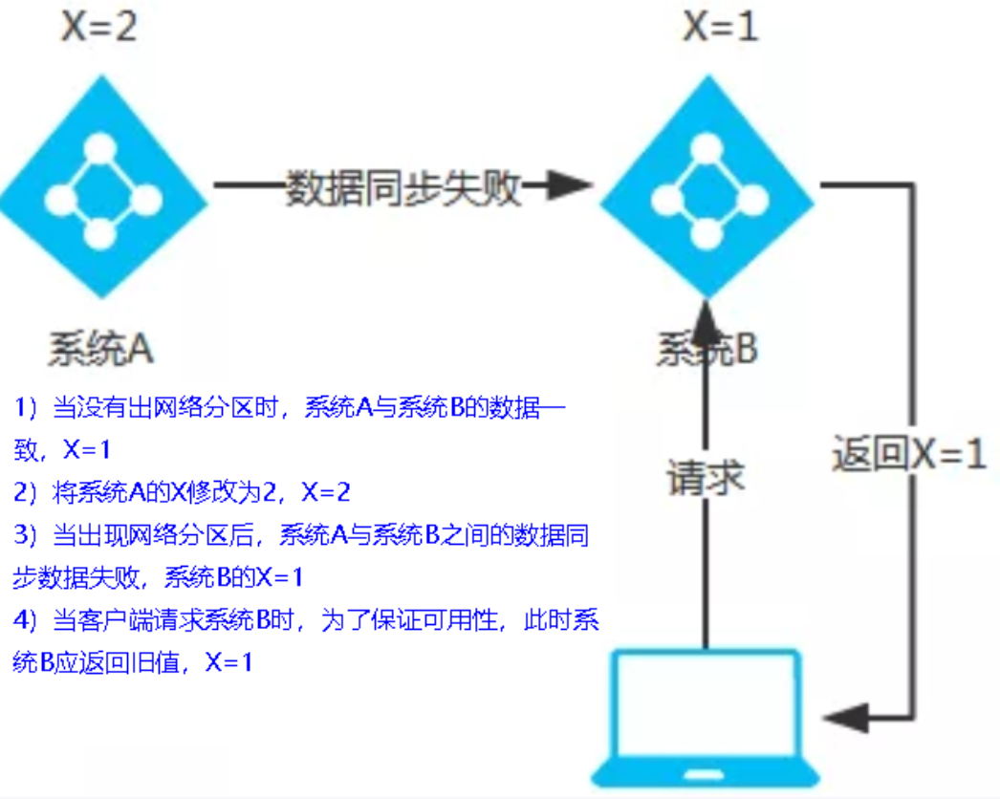
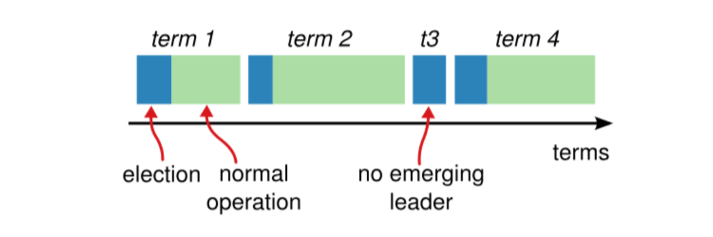
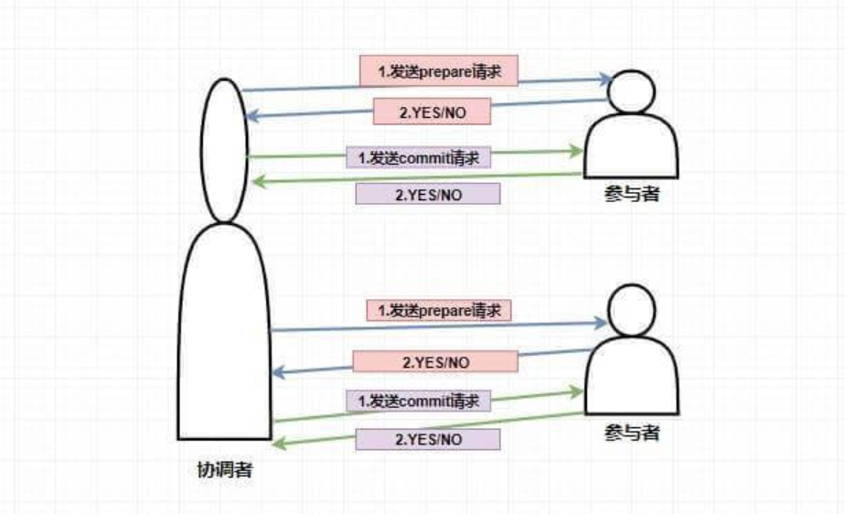
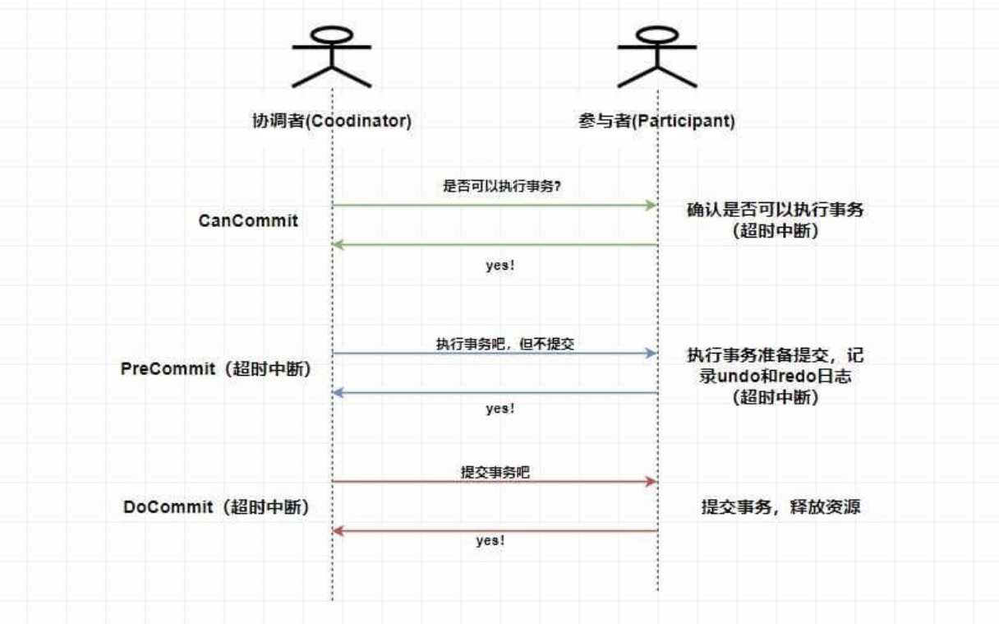
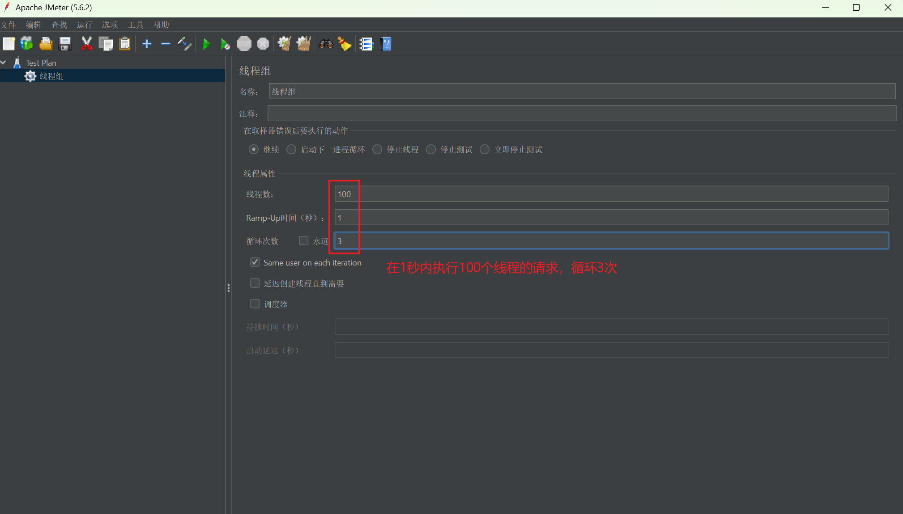
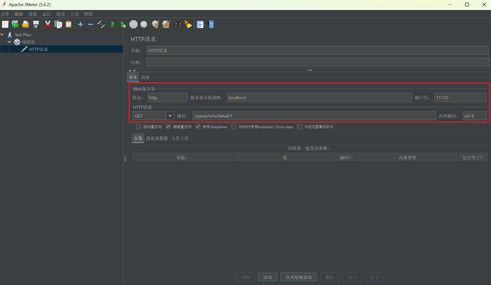
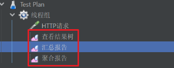
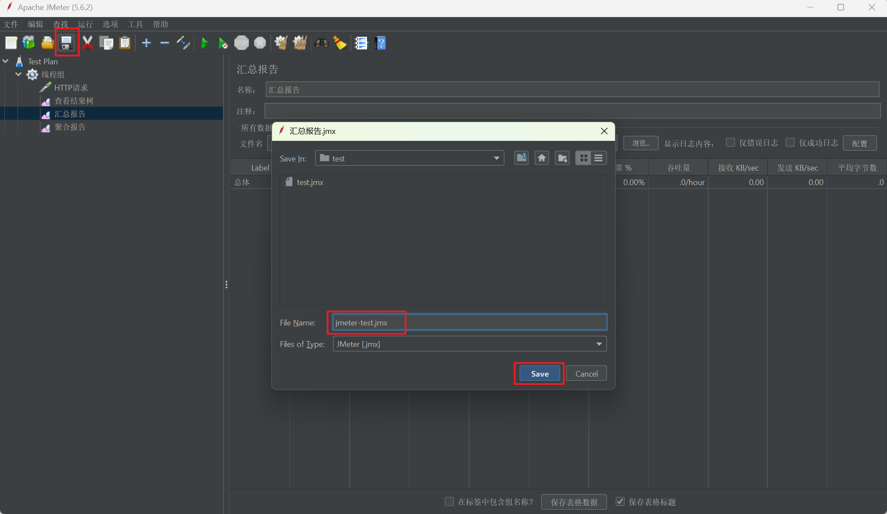
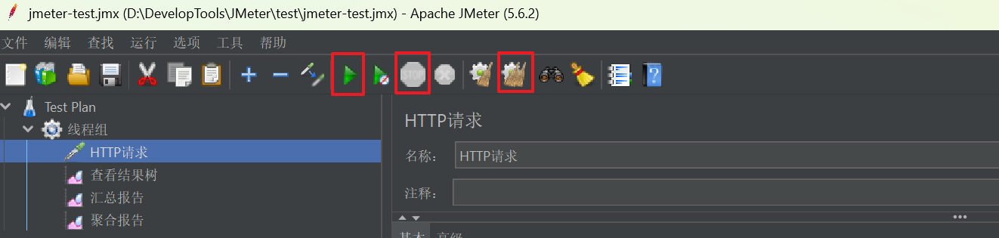

# 第01章_分布式基础理论

## 1. CAP理论

### 1.1 简介

CAP理论，又称为布鲁尔定理，它指出，对于一个分布式系统来说，当设计读写操作时，只能**同时满足以下三点中的两个**：

- Consistency(一致性)：所有节点访问同一份**最新的**数据副本
- Availability(可用性)：非故障的节点在合理的时间内**返回合理的响应**（不是错误或者超时的响应）
- Partition Tolerance(分区容错性)：分布式系统出现**网络分区**的时候，仍然能够对外提供服务

> **网络分区**：分布式系统中，多个节点之间的网络本来是连通的，但是因为某些故障（比如部分节点网络出了问题）某些节点之间不连通了，整个网络就分成了几块区域，这就叫**网络分区**。

事实上，在分布式系统中**分区容错性P是必须要满足的**，在此基础上，一致性C和可用性A只能二选一。而选择CP架构还是AP架构的关键在于当前的业务场景，没有定论，比如对于需要确保强一致性的场景（如银行）一般会选择CP架构。常见的服务注册中心选用的架构为：

- Eureka使用AP
- ZooKeeper使用CP
- Consul使用CP
- Nacos默认使用AP，但也支持切换为CP

### 1.2 AP架构

当网络分区出现后，为了保证可用性，系统B可以返回旧值。它违背了一致性C的要求，只满足可用性和分区容错性，即AP。

### 1.3 CP架构

当网络分区出现后，为了保证一致性，就必须拒接请求。它违背了可用性A的要求，只满足一致性和分区容错性，即CP。

## 2. BASE理论

BASE是以下三个短语的缩写：

- Basically Available（基本可用）
- Soft-state（软状态）
- Eventually Consistent（最终一致性）

BASE理论指的是，即使无法做到强一致性，但每个应用都可以根据自身业务特点，采用适当的方式来使系统达到最终一致性。BASE理论本质上是对CAP的延伸和补充，更具体地说，是对CAP中AP方案的一个补充，也就是牺牲数据的强一致性来满足系统的高可用性，但要采取适当的方式来保证最终一致性。

> 说明：AP方案只是在系统发生分区的时候放弃一致性，而不应该永远放弃一致性。在分区故障恢复后，系统应该达到最终一致性，这一点其实就是BASE理论延伸的地方。

### 2.1 基本可用

基本可用是指分布式系统在出现不可预知故障的时候，允许损失部分可用性。但是，这绝不等价于系统不可用。允许损失部分可用性，主要指：

- **响应时间上的损失**：正常情况下，处理用户请求需要 0.5s 返回结果，但是由于系统出现故障，处理用户请求的时间变为 3s
- **系统功能上的损失**：正常情况下，用户可以使用系统的全部功能，但是由于系统访问量突然剧增，系统的部分非核心功能无法使用

### 2.2 软状态

软状态指允许系统中的数据存在中间状态（**CAP理论中的数据不一致**），并认为该中间状态的存在不会影响系统的整体可用性，即允许系统在不同节点的数据副本之间进行数据同步的过程存在延时。

### 2.3 最终一致性

最终一致性强调的是系统中所有的数据副本，在经过一段时间的同步后，最终能够达到一个一致的状态。因此，最终一致性的本质是需要系统保证最终数据能够达到一致，而不需要实时保证系统数据的强一致性。

分布式一致性的3种级别为：

1. **强一致性**：系统写入了什么，读出来的就是什么。
2. **弱一致性**：不一定可以读取到最新写入的值，也不保证多少时间之后读取到的数据是最新的，只是会尽量保证某个时刻达到数据一致的状态。
3. **最终一致性**：弱一致性的升级版，系统会保证在一定时间内达到数据一致的状态。

> 业界比较推崇是**最终一致性**级别，但是某些对数据一致要求十分严格的场景比如银行转账还是要保证强一致性。

一般来说，实现最终一致性，主要有以下几种方式：

- **读时修复**: 在读取数据时，检测数据的不一致，进行修复。
- **写时修复**: 在写入数据时，检测数据的不一致，进行修复。
- **异步修复**: 这个是最常用的方式，通过定时对账检测副本数据的一致性，并修复。

# 第02章_分布式一致性算法

## 1. Paxos算法

### 1.1 简介

Paxos算法是兰伯特提出的一种**分布式系统共识算法**，也是第一个被证明完备的共识算法（前提是**不存在拜占庭将军问题，也就是没有恶意节点**）。共识算法的作用是让分布式系统中的多个节点之间对某个提案（Proposal）达成一致的看法。

> **拜占庭将军问题**是由兰伯特提出的点对点通信中的基本问题，其含义是**在存在消息丢失的不可靠信道上试图通过消息传递的方式达到一致性是不可能的**。

Paxos中存在3个重要的角色：

1. **提议者（Proposer）**：负责接受客户端的请求并发起提案，提案信息通常包括提案编号和提议的值。
2. **表决者（Acceptor）**：负责对提议者的提案进行投票，同时需要记住自己的投票历史。
3. **学习者（Learner）**：如果有超过半数的表决者就某个提议达成了共识，那么学习者就需要接受这个提议，并就该提议作出运算，然后将运算结果返回给客户端。

> 说明：
>
> - 一个节点可以身兼多个角色。
> - 必须要有半数以上的Acceptor投票，一个提案才能被选定。

事实上，Paxos算法在国际上被公认为非常难以理解和实现，因此不断有人尝试简化这一算法：

- 针对没有恶意节点的情况，当前最常用的一些共识算法比如**Raft算法**、**ZAB协议**、**Fast Paxos**算法都是基于Paxos算法改进的。
- 针对存在恶意节点的情况，一般使用的是**工作量证明（POW，Proof-of-Work）**、**权益证明（PoS，Proof-of-Stake）**等共识算法。这类共识算法最典型的应用就是区块链，区块链系统使用的共识算法需要解决的核心问题就是**拜占庭将军问题**，这和我们日常接触到的ZooKeeper等分布式中间件不太一样。

### 1.2 核心流程

Paxos算法分为两个阶段：Prepare和Accept

#### Prepare阶段

1. Proposer：负责提出proposal，并赋予其一个**全局唯一且递增**的提案编号`N`，然后将该**提案编号**发送给所有表决者。
2. Acceptor：每个表决者会在自己本地保存已经accept过的最大提案编号`maxN`。当收到一个新的提案编号`N`时，只有当`N > maxN`表决者才会accept这个提案，然后将历史最大提案编号`maxN`响应给Proposer，并在自己本地保存提案编号`N`。

#### Accept阶段

1. 如果Proposer收到了超过半数Acceptor对提案编号的批准，接下来就会给所有Acceptor发送**提案编号`N`及提案内容**。
2. 表决者收到提案请求后，会再次比较`N`和`maxN`，只有当`N >= maxN`表决者才会accept这个提案，然后执行提案内容（但并未提交），并响应ACK给Proposer。
3. 如果Proposer没有收到超过半数的accept，那么它会递增该Proposal的编号，然后重新进入Prepare阶段。
4. 如果Proposer收到了超过半数的accept，那么它会给所有Acceptor发送**提案的commit消息**。Acceptor收到commit消息后就提交该提案事务。

### 1.3 Paxos算法的死循环问题

Paxos算法会产生以下死循环问题：

1. 提议者P1发起提案M1，表决者A在Prepare阶段批准了M1
2. 提议者P2发起提案M2，表决者A在Prepare阶段批准了M2
3. 此时，表决者A已经无法在Accept阶段accept M1了（因为M2的提案编号更大）。于是P1会递增M1的编号，将其变为M3，并重新发起提案。
4. 表决者A在Prepare阶段批准了M3
5. 此时，表决者A已经无法在Accept阶段accept M2了
6. 以此类推...

想解决Paxos算法的死循环问题，只需要**要求集群中只能有一个Proposer**即可，像ZAB协议就是采用这种方式来改进Paxos算法。

## 2. Raft算法

Raft算法的动画演示可以参考 https://thesecretlivesofdata.com/raft/

### 2.1 基本概念

#### 1、节点类型

我们以5台服务器构成的Raft集群为例。在任意时刻，每个服务器必然是以下三种角色之一：

1. **Leader**：负责发送心跳，响应客户端请求，创建日志，同步日志。
2. **Follower**：接收Leader的心跳和日志同步数据，投票给Candidate。
3. **Candidate**：Leader选举过程中的临时角色，作用是参加竞选并发起投票。

> 在正常的情况下，只有一个服务器是Leader，剩下的服务器是Follower。

#### 2、任期

Raft算法将时间划分为任意长度的任期（term），任期用连续的数字表示。每一个任期的开始都是一次选举。在选举开始时，一个或多个Candidate会尝试成为Leader；如果一个Candidate赢得了选举，它就会在该任期内担任Leader；如果没有选出Leader，将会开启下一个任期，并立刻开始下一次选举。

每个节点都会存储当前的term号，当服务器之间进行通信时会交换各自的term号，并遵循以下规则：

- 如果有服务器发现自己的term号比其他人小，那么它会更新到较大的term值。
- 如果一个Candidate或者Leader发现自己的term过期了，它会立即退化成Follower。
- 如果一台服务器收到的请求的term号是过期的，那么它会拒绝此次请求。

#### 3、日志

日志（log）是由事件（entry）构成的数组。只有Leader可以创建entry，entry的内容为`<index,term,cmd>`，其中index是该事件在log中的索引、term是任期、cmd是具体操作。

每个entry总是先被Leader添加到自己的log中，然后发起共识请求，获得同意之后才会被Leader提交执行。Follower只能从Leader获取新日志和当前的commitIndex，然后再把对应的entry提交执行。

### 2.2 核心流程：Leader选举

Raft算法使用心跳机制来触发Leader选举。Leader会向所有的Follower周期性发送心跳来保证自己的Leader地位：

- 如果一台服务器能够收到来自Leader或者Candidate的有效信息，那么它会一直保持为Follower状态，并刷新自己的electionElapsed（选举超时时间）。
- 如果一个Follower在一个周期内没有收到心跳信息，就叫做选举超时，然后它就会认为此时没有可用的Leader，并且开始进行一次选举以选出一个新的Leader。

为了开始新的选举，Follower会自增自己的term号并且转换状态为Candidate，然后他会向所有节点发起RequestVoteRPC请求（其他节点收到RequestVoteRPC请求后，如果在该term内没有投过票，则会将票投给该节点）。Candidate的状态会持续到以下情况发生：

- 赢得选举
- 其他节点赢得选举
- 一轮选举结束，无人胜出

> 赢得选举的条件是：一个Candidate在一个任期内收到了来自集群内的多数选票`（N/2+1）`，就可以成为 Leader。

在Candidate等待选票的时候，它可能收到其他节点声明自己是Leader的心跳，此时有两种情况：

- 该 Leader 的 term 号大于等于自己的 term 号，说明对方已经成为 Leader，则自己回退为 Follower。
- 该 Leader 的 term 号小于自己的 term 号，那么会拒绝该请求并让该节点更新 term。

由于可能同一时刻出现多个Candidate，导致没有Candidate获得大多数选票，如果没有其他手段来重新分配选票的话，那么可能会无限重复下去。Raft使用了随机的选举超时时间来避免上述情况：每一个 Candidate 在发起选举后，都会随机化一个新的选举超时时间。

### 2.3 核心流程：日志复制

在Leader选举期间，整个Raft集群对外是不可用的；而一旦选出了Leader，它就可以开始接受客户端的请求。

1. Leader收到客户端请求后会生成一个entry，再将这个entry添加到自己的日志末尾，然后向所有的节点广播该entry，要求其他服务器复制这条entry。
2. Follower会将该entry添加到自己的日志后面，同时返回给Leader同意。
3. 如果Leader收到了多数的成功响应，Leader就会将这个entry提交执行，然后响应给客户端。
4. 接下来Leader将提交的消息广播给所有Follower，Follower收到后也提交执行该entry。

Raft算法的核心就是要保证Leader和Follower日志的一致性。如果Leader崩溃，则可能导致Leader和Follower的日志不一致。为此，Raft算法中Leader通过强制Follower复制自己的日志来处理日志不一致的情况，也就是说，在Follower上的冲突日志会被Leader的日志覆盖。

## 3. ZAB协议

参考ZooKeeper笔记。

# 第03章_分布式事务

2PC和3PC是刚性事务，追求数据的强一致性；而其他分布式事务解决方案是柔性事务，追求数据的最终一致性。

## 1. 2PC

两阶段提交（2 phase commit）分为两个阶段：

第一阶段：当要执行一个分布式事务的时候，事务发起者首先向协调者发起事务请求，然后协调者会给所有参与者发送 `prepare` 请求（其中包括事务内容）；然后参与者收到 `prepare` 消息后，他们会开始执行事务（但不提交），并将`Undo`和`Redo`信息记入事务日志中，之后参与者就向协调者反馈是否准备好了。

第二阶段：协调者根据参与者反馈的情况来决定接下来是提交事务还是回滚事务

- 如果在第一阶段所有参与者都返回YES，那么协调者就会发送commit请求；参与者收到后就会提交前面执行的事务，然后响应给协调者。
- 否则，协调者就会发送rollback请求；参与者收到后就会回滚它在第一阶段所做的操作，然后响应给协调者。

缺点：

1. **阻塞问题**：当协调者发送 `prepare` 请求，参与者收到之后执行事务但并不提交，这个时候会一直占用着数据库资源不释放，如果此时协调者挂了，那么这些资源都不会再释放了。
2. **数据不一致问题**：如果第二阶段协调者只发送了一部分commit请求就挂了，那么收到commit消息的参与者就会提交事务，而未收到commit消息的参与者就不会提交事务。
3. **性能很差**：执行事务但不提交，会长时间占用数据库资源，这就意味着无法满足高并发场景。

## 2. 3PC

三阶段提交（3 phase commit）将阶段划分得更细，并且还引入了超时机制。三个阶段分别为：

**CanCommit阶段**：协调者向所有参与者发送 `CanCommit` 请求，参与者收到请求后会根据自身情况查看是否能执行事务，如果可以则返回YES响应并进入预备状态，否则返回NO。

**PreCommit阶段**：协调者根据参与者返回的响应来决定是否可以进行下面的 `PreCommit` 操作。如果上面参与者返回的都是 YES，那么协调者将向所有参与者发送 `PreCommit` 预提交请求，**参与者收到预提交请求后，会进行事务的执行操作，并将 `Undo` 和 `Redo` 信息写入事务日志中**，最后如果参与者顺利执行了事务则给协调者返回成功的响应。如果在第一阶段协调者收到了 **任何一个NO** 的信息，或者 **在一定时间内** 并没有收到全部的参与者的响应，那么就会中断事务，它会向所有参与者发送中断请求，参与者收到中断请求之后会立即中断事务，或者在一定时间内没有收到协调者的请求，它也会中断事务。

**DoCommit阶段**：这个阶段与 `2PC` 的第二阶段类似。如果协调者收到了所有参与者在 `PreCommit` 阶段的 YES 响应，那么协调者将会给所有参与者发送 `DoCommit` 请求，**参与者收到 `DoCommit` 请求后则会进行事务的提交工作**，完成后则会给协调者返回响应，协调者收到所有参与者返回的事务提交成功的响应之后则完成事务。若协调者在 `PreCommit` 阶段 **收到了任何一个 NO 或者在一定时间内没有收到所有参与者的响应** ，那么就会进行中断请求的发送，参与者收到中断请求后则会 **通过上面记录的回滚日志** 来进行事务的回滚操作，并向协调者反馈回滚状况，协调者收到参与者返回的消息后，中断事务。

## 3. TCC

TCC(Try Confirm/Cancel)是一种事务补偿型方案，它基于2PC模型，但是支持自定义的事务处理逻辑，这样就可以不使用数据库事务的锁机制，提高性能：

- 一阶段 prepare 行为：调用自定义的 prepare 逻辑。
- 二阶段 commit 行为：调用自定义的 commit 逻辑。
- 二阶段 rollback 行为：调用自定义的 rollback 逻辑。

## 4. 最大努力通知方案

结合消息队列实现，设置最大通知次数，不保证一定能通知成功，但会提供可查询操作接口进行核对。

## 5. 异步通知方案

业务处理服务在事务提交之前，向实时消息服务请求发送消息，实时消息服务只记录消息数据，而不是真正地发送。业务处理服务在业务事务提交之后，向实时消息服务确认发送。只有在得到确认发送指令后，实时消息服务才会真正发送。

# 第04章_压力测试

## 1. 简介

压力测试用于考察当前软硬件环境下系统所能承受的最大负荷并帮助找出系统瓶颈所在。压测是为了系统在线上的处理能力和稳定性维持在一个标准范围内。

使用压力测试，我们有希望找到一些很难发现的错误，典型的错误就是：**内存泄漏**、**并发与同步**。

## 2. 性能指标

- 响应时间RT（Response Time）：从用户客户端发起一个请求开始，到客户端接收到从服务器端返回的响应结束，整个过程所耗费的时间。
- 最大响应时间：RT的最大值
- 最少响应时间：RT的最小值
- 90%响应时间：指的是对所有用户的响应时间进行排序后，第90%的响应时间
- HPS（Hits Per Second）：每秒点击次数
- TPS（Transaction Per Second）：系统每秒处理交易数
- QPS（Query Per Second）：系统每秒处理查询次数

> 说明：一般用TPS来衡量整个业务流程，用QPS来衡量接口查询次数

性能测试主要关注以下指标：

1. 吞吐量：每秒钟系统能够处理的请求数
2. 响应时间
3. 错误率：一批请求中结果出错的请求所占比例

## 3. JMeter的使用

下载`apache-jmeter-5.6.2.zip`后解压，运行bin目录下的jmeter.bat就启动了JMeter。

首先在测试计划中创建线程组：

在线程组下创建HTTP请求：

在线程组下添加监听器，便于查看测试报告：

保存测试计划：

启动测试/停止测试/清除以前的测试报告：

