# 第01章_Kafka简介

## 1. 简介

Kafka是一个**分布式流式处理平台**，具有三个关键功能：

1. **消息队列**：发布和订阅消息流，这个功能类似于消息队列，这也是Kafka也被归类为消息队列的原因
2. **容错的持久方式存储记录消息流**：Kafka会把消息持久化到磁盘，有效避免了消息丢失的风险
3. **流式处理平台**：在消息发布的时候进行处理，Kafka提供了一个完整的流式处理类库

Kafka主要有两大应用场景：

1. **消息队列**：建立实时流数据管道，以可靠地在系统或应用程序之间获取数据
2. **数据处理**：构建实时的流数据处理程序来转换或处理数据流

Kafka相比其他消息队列主要的优势如下：

1. **极致性能**：Kafka基于Scala和Java语言开发，设计中大量使用了批量处理和异步的思想，每秒可以处理百万级别的消息
2. **生态系统兼容性好**：Kafka与周边生态系统的兼容性是最好的，尤其在大数据和流计算领域

> 说明：早期Kafka主要用于专门处理海量日志，而并不是作消息队列，所以会有消息不可靠的问题。但随着逐步完善，Kafka已将这一问题解决，现在已经是一个非常优秀的消息队列。

## 2. JMS规范

JMS（Java Message Service）是Java平台的消息中间件通用规范，主要定义了消息中间件的标准接口。JMS规范中定义了以下用于通信的组件：


- JMS Provider：JMS消息提供者，其实就是实现JMS规范的消息中间件
- JMS Message：JMS消息，包含消息头、消息属性、消息主体内容
- JMS Producer：JMS消息生产者
- JMS Consumer：JMS消息消费者

JMS支持两种消息发送和接收模型：

1. 点对点模型（Peer-to-Peer）：也称为队列模型，它使用**队列**作为消息通信载体，规定一条消息只能被一个消费者消费，未被消费的消息在队列中保留直到被消费或超时。
2. 发布/订阅模型（Publish/Subscribe）：使用**主题（Topic）**作为消息通信载体，类似于广播模式。发布者发布一条消息，该消息通过主题传递给所有的订阅者。

**说明**：

- ActiveMQ完全遵循了JMS规范
- RabbitMQ遵循了类似并兼容JMS规范的跨平台的AMQP协议（AMQP是一个通用的规范，而JMS是专为Java语言设计的规范）
- Kafka和RocketMQ借鉴了JMS规范的思想，但并没有完全遵循JMS规范。**Kafka和RocketMQ的消息模型采用的是发布/订阅模型**。

> 事实上，RocketMQ的消息模型和Kafka基本是完全一样的。唯一的区别是Kafka中没有队列这个概念，与之对应的是Partition（分区）。

## 3. Kafka的核心概念

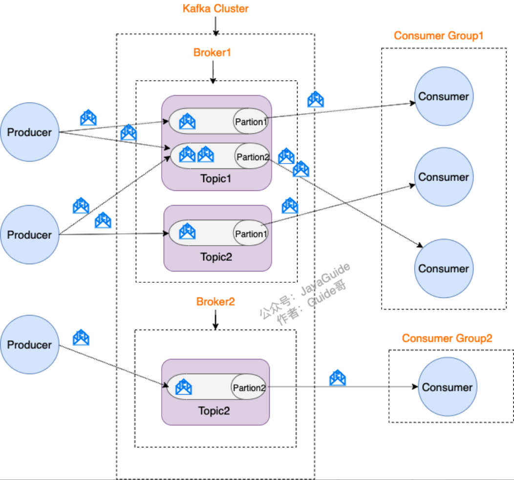

1. **Producer（生产者）**：生产消息的一方
2. **Consumer（消费者）**：消费消息的一方
3. **Broker（代理）**：一个独立的Kafka实例，多个Kafka Broker可以组成Kafka Cluster。
4. **Topic（主题）**：Producer将消息发送到特定的主题，Consumer通过订阅特定的主题来消费消息。
5. **Partition（分区）**：Partition属于Topic的一部分，一个Topic可以有多个Partition，并且这些Partition通常是分布在不同Broker上的。当生产者给某一Topic发送一条消息时，这条消息只会发送到这个Topic的其中一个Partition中。

## 4. ZooKeeper和Kafka的关系

在Kafka 2.8之前，必须依赖ZooKeeper才能使用Kafka。ZooKeeper是一个分布式协调服务，它主要为Kafka提供元数据的管理功能，包括：

1. **Broker注册**：在ZooKeeper上会有一个专门**用来记录Broker服务器列表**的节点。每个Broker在启动时，都会到ZooKeeper上进行注册，即到`/kafka/brokers/ids`下创建属于自己的节点，每个Broker就会将自己的IP地址和端口等信息记录到该节点中去。
2. **Topic注册**：在Kafka中，同一个**Topic的消息会被分成多个分区**并将其分布在多个Broker上，**这些分区信息及与Broker的对应关系**也都是由ZooKeeper维护。
3. **负载均衡**：对于同一个Topic的不同Partition，Kafka会尽力将这些Partition分布到不同的Broker服务器上，这样便能提供比较好的并发能力。当生产者产生消息后也会尽量投递到不同Broker的Partition里面；当Consumer消费时，ZooKeeper可以根据当前的Partition数量以及Consumer数量来实现动态负载均衡。

在Kafka 2.8之前，Kafka最被大家诟病的就是其重度依赖于ZooKeeper。在Kafka 2.8之后，引入了基于Raft协议的KRaft模式，可以不再依赖ZooKeeper，大大简化了Kafka的架构，让我们以一种轻量级的方式来使用Kafka（但KRaft模式目前还在实验阶段，尚不成熟）。


# 第02章_Kafka的基本使用

## 1. Docker安装Kafka

**1、首先创建一个网络**

```sh
docker network create kafka-net --driver bridge
```

**2、安装ZooKeeper**

```sh
docker run -d --name zookeeper-server \
-p 2181:2181 \
--restart=always \
--network kafka-net \
-e ALLOW_ANONYMOUS_LOGIN=yes \
bitnami/zookeeper:latest
```

**3、安装Kafka**

```sh
docker run -d --name kafka-server \
-p 9092:9092 \
--restart=always \
--network kafka-net \
-e ALLOW_PLAINTEXT_LISTENER=yes \
-e KAFKA_CFG_ZOOKEEPER_CONNECT=zookeeper-server:2181 \
-e KAFKA_CFG_ADVERTISED_LISTENERS=PLAINTEXT://192.168.231.101:9092 \
bitnami/kafka:latest
```

**4、安装kafka-map图形化管理工具**

```sh
docker run -d --name kafka-map \
-p 9001:8080 \
--restart=always \
--network kafka-net \
-v /opt/kafka-map/data:/usr/local/kafka-map/data \
-e DEFAULT_USERNAME=admin \
-e DEFAULT_PASSWORD=admin \
dushixiang/kafka-map:latest
```

> 说明：访问地址为`http://192.168.231.101:9001`，默认账号密码均为admin

## 2. Kafka Map图形化管理工具的使用

详细文档参考https://github.com/dushixiang/kafka-map/blob/master/README-zh_CN.md

### 2.1 添加集群

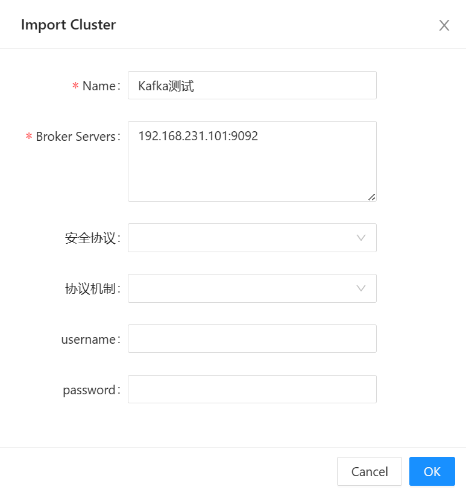

### 2.2 创建Topic

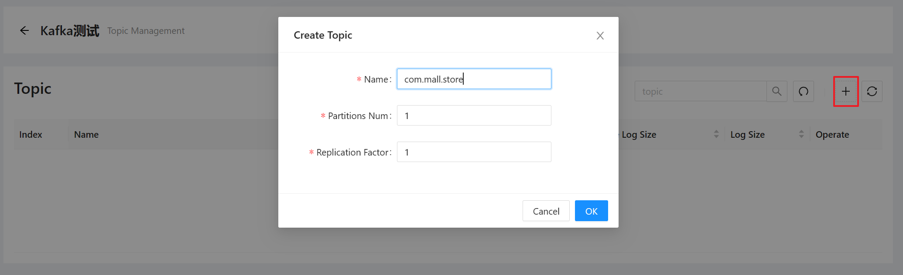

### 2.3 生产消息

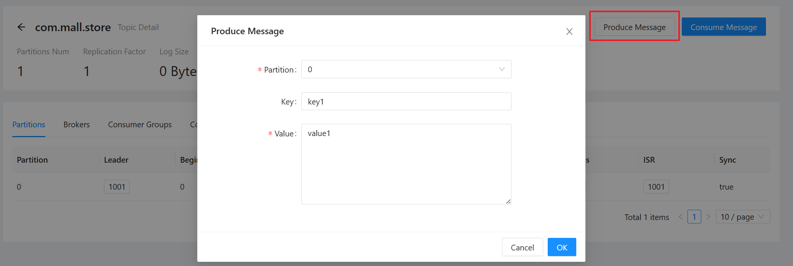

### 2.4 消费消息

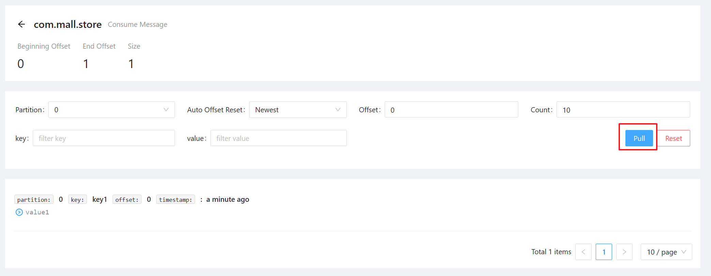

## 3. SpringBoot整合Kafka

### 3.1 引入依赖

```xml
<dependency>  
    <groupId>org.springframework.kafka</groupId>  
    <artifactId>spring-kafka</artifactId>  
</dependency>
<dependency>  
    <groupId>org.springframework.kafka</groupId>  
    <artifactId>spring-kafka-test</artifactId>  
    <scope>test</scope>  
</dependency>
```

自动配置类KafkaAutoConfiguration提供了以下功能：

1. `KafkaProperties`：绑定Kafka的所有配置，以`spring.kafka`为前缀
   - bootstrap-servers：Kafka集群的所有服务器地址
   - properties：参数设置
   - producer：生产者
   - consumer：消费者
2. `@EnableKafka`：开启Kafka的注解驱动
3. 组件`KafkaTemplate`：用于发送消息
4. 组件`KafkaAdmin`：用于管理Kafka，比如创建Topic等

### 3.2 配置文件

```yaml
spring:
  kafka:
    # Kafka服务器地址和端口号，配置集群时只需以逗号分隔
    bootstrap-servers: 192.168.231.101:9092
    # 生产消息时的序列化器，默认key和value都是StringSerializer
    producer:
      key-serializer: org.apache.kafka.common.serialization.StringSerializer
      value-serializer: org.apache.kafka.common.serialization.StringSerializer
    # 消费消息时的序列化器，默认key和value都是StringDeserializer
    consumer:
      key-deserializer: org.apache.kafka.common.serialization.StringDeserializer
      value-deserializer: org.apache.kafka.common.serialization.StringDeserializer
```

### 3.3 主启动类

在主启动类上标注`@EnableKafka`，表示开启Kafka的注解驱动：

```java
@EnableKafka
@SpringBootApplication
public class KafkaDemoApplication {
    public static void main(String[] args) {
        SpringApplication.run(KafkaDemoApplication.class, args);
    }
}
```

### 3.4 创建Topic

除了在图形化管理界面创建Topic，我们也可以在程序中创建Topic。只需在配置类中添加Topic即可：

```java
@Configuration
public class KafkaConfig {
    @Bean // 添加Topic
    public NewTopic orderTopic() {
        return TopicBuilder.name("com.mall.order")
                .partitions(1)
                .replicas(1)
                .build();
    }
}
```

### 3.5 发送消息

我们只需注入KafkaTemplate，就可以用它来发送消息：

```java
@RestController
public class MallOrderController {
    @Autowired
    private KafkaTemplate<String, String> kafkaTemplate;

    @GetMapping("/send/{id}")
    public String sendMessage(@PathVariable("id") Integer id) {
        String topic = "com.mall.order";
        String key = "订单消息" + UUID.randomUUID();
        String value = JSONObject.toJSONString(
                new MallOrder(id, "张三", "《算法导论》订单")
        );
        
        CompletableFuture future = kafkaTemplate.send(topic, key, value);
        future.join();
        return "消息发送成功===>" + key;
    }
}
```

### 3.6 消费消息

使用`@KafkaListener`注解可以监听消息。注意，消费者消费消息，必须要指定groupId（消费者组）：

```java
@Component
@Slf4j
public class MallOrderListener {
    // 默认从end offset开始监听，所以只能监听新的消息
    @KafkaListener(groupId = "com.mall.order.listener1", topics = "com.mall.order")
    public void listenNewMallOrderMessage(ConsumerRecord<String, String> record) {
        // 获取消息的各种详细信息
        String topic = record.topic();
        String key = record.key();
        String value = record.value();
        log.info("listener1===>topic:{},key:{},value:{}", topic, key, value);
    }

    // 设置监听分区和偏移量，可以获得到以前的消息
    // 注意两个监听器的groupId要设置成不一样的：
    // 因为如果相同，它们就是竞争关系，只能监听不同分区的消息
    @KafkaListener(groupId = "com.mall.order.listener2", topicPartitions = {
            @TopicPartition(topic = "com.mall.order", partitionOffsets = {
                    @PartitionOffset(partition = "0", initialOffset = "0")
            })
    })
    public void listenAllMallOrderMessage(ConsumerRecord<String, String> record) {
        String topic = record.topic();
        String key = record.key();
        String value = record.value();
        log.info("listener2===>topic:{},key:{},value:{}", topic, key, value);
    }
}
```


# 第03章_Kafka集群

## 1. Kafka集群架构

### 1.1 整体架构

Kafka具有极高吞吐量的核心就在于Kafka Cluster。下面是一个具有三台Kafka Broker的集群，以下的Topic采用经典的3分区3副本：

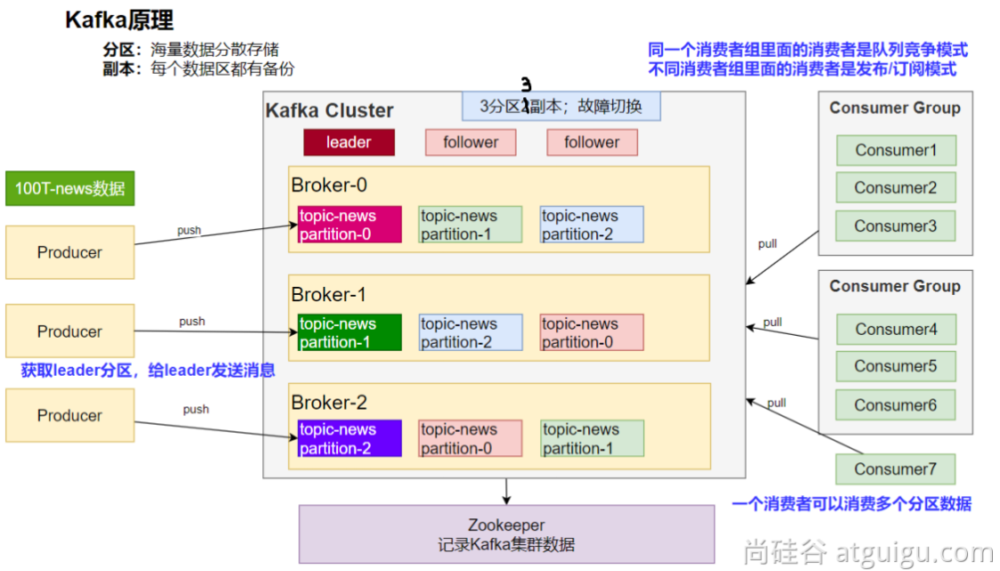

Kafka的集群架构采用的是分布式系统中常见的**主从架构**，也就是在多个Broker中需要选举出一个用于管理整个Kafka集群的Master节点，这个节点我们称之为**集群控制器Controller**。Controller的主要作用就是在ZooKeeper的帮助下管理和协调控制整个Kafka集群，如果在运行过程中Controller节点出现了故障，那么会**依靠ZooKeeper选举其他节点作为新的Controller**。

说明：这种分布式主从集群架构可能产生**脑裂**问题，也就是Controller因为网络分区原因被误判为已经下线，而ZooKeeper此时选举出了一个新的Controller，于是当原先的Controller网络恢复后就产生了两个Controller。Kafka中采用epoch（纪元，任期）的概念来解决脑裂问题，选举Controller时会指定任期，这样就能知道这个Broker是第几任Controller，而每次进行选举时epoch就会自增1，这样发生脑裂时，epoch值较小的那个Controller就会自动退化为一个普通的Broker。

### 1.2 多副本机制

Kafka为分区（Partition）引入了**多副本（Replica）机制**。同一Partition的多个副本中有一个称为leader，其他副本称为follower。

1. **只有leader副本具有读写能力**，也就是说生产者和消费者只与leader副本交互，而其他follower副本只起到备份的作用。
2. 当生产者将消息发送到leader副本后，其他follower副本才能从leader副本中拉取消息进行同步。
3. 当leader副本发生故障时，会从其他follower副本中选举出一个新leader。注意，如果follower与leader的同步程度没有达到要求，则该follower无法参加新leader的竞选。

Kafka集群中采用多分区和多副本的**好处**是：

- 通过给特定Topic指定多个Partition，而各个Partition可以分布在不同的Broker上，这样就能提供**更好的并发能力**
- Partition可以指定对应的副本数（Replica），每个Partition的不同副本必然是存储在不同Broker上的（**因此副本数不能超过Broker数**），所以极大地提高了消息存储的安全性、**提高了容灾能力**

### 1.3 消费者组

Kafka的架构中，消费者是**主动pull消息**进行消费的，为了提高消费能力，引入了消费者组的概念。对于同一Topic来说，不同的消费者组之间是发布订阅模式，而在同一消费者组中的消费者是**分区竞争模式：即同一Partition中的消息只能被某一个消费者消费**（但要注意，一个消费者是可以消费多个Partition的）。

> 所以，消费者组中的消费者数量最好不要超过主题分区的数量，否则就必然会有消费者处于空闲状态无法消费分区数据，造成了浪费。

### 1.4 Broker内部结构

Kafka Broker的内部结构其实非常复杂，其中有很多服务对象，用于实现内部管理和外部通信：

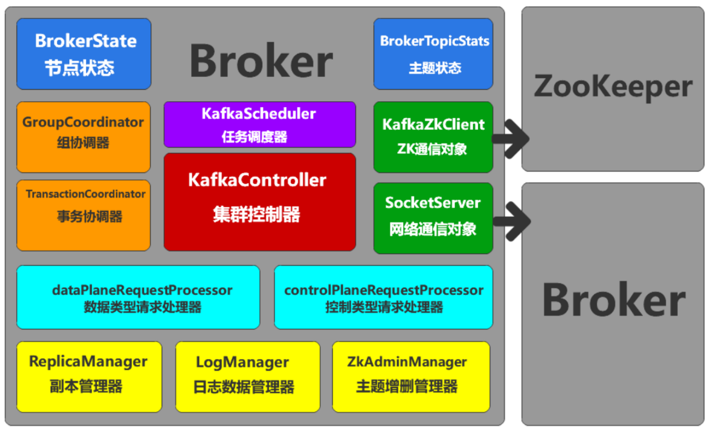

### 1.5 文件存储

Kafka中Topic是逻辑上的概念，而Partition则是物理上的概念，每个Partition对应于一个log文件。该log文件中存储的就是Producer生产的数据，Producer生产的数据会被不断追加到该log文件末尾。为防止log文件过大导致数据定位效率低下，Kafka采取了**分片**和**索引**机制，将每个log分为多个segment。

Kafka中**默认的日志保存时间为7天**，一旦超时就会进行清理，主要有以下两种策略：

- delete（默认）：删除，也就是将过期数据直接删除
- compact：压缩，对于相同key的消息，只保留最后一个版本

## 2. Docker搭建Kafka集群

使用Docker创建网络、安装ZooKeeper、安装图形化管理工具的步骤与之前安装单机Kafka时相同。我们首先移除之前创建的Kafka容器实例kafka-server，然后我们搭建一个具有三台Broker的Kafka集群，步骤如下：

**（1）启动三个Kafka Broker**

```sh
docker run -d --name kafka-0 \
-p 9093:9093 \
--restart=always \
--network kafka-net \
-e ALLOW_PLAINTEXT_LISTENER=yes \
-e KAFKA_CFG_ZOOKEEPER_CONNECT=zookeeper-server:2181 \
-e KAFKA_CFG_ADVERTISED_LISTENERS=PLAINTEXT://192.168.231.101:9093 \
-e KAFKA_CFG_LISTENERS=PLAINTEXT://:9093 \
-e KAFKA_BROKER_ID=0 \
bitnami/kafka:latest
```

```sh
docker run -d --name kafka-1 \
-p 9094:9094 \
--restart=always \
--network kafka-net \
-e ALLOW_PLAINTEXT_LISTENER=yes \
-e KAFKA_CFG_ZOOKEEPER_CONNECT=zookeeper-server:2181 \
-e KAFKA_CFG_ADVERTISED_LISTENERS=PLAINTEXT://192.168.231.101:9094 \
-e KAFKA_CFG_LISTENERS=PLAINTEXT://:9094 \
-e KAFKA_BROKER_ID=1 \
bitnami/kafka:latest
```

```sh
docker run -d --name kafka-2 \
-p 9095:9095 \
--restart=always \
--network kafka-net \
-e ALLOW_PLAINTEXT_LISTENER=yes \
-e KAFKA_CFG_ZOOKEEPER_CONNECT=zookeeper-server:2181 \
-e KAFKA_CFG_ADVERTISED_LISTENERS=PLAINTEXT://192.168.231.101:9095 \
-e KAFKA_CFG_LISTENERS=PLAINTEXT://:9095 \
-e KAFKA_BROKER_ID=2 \
bitnami/kafka:latest
```

**（2）使用图形化管理工具添加集群**

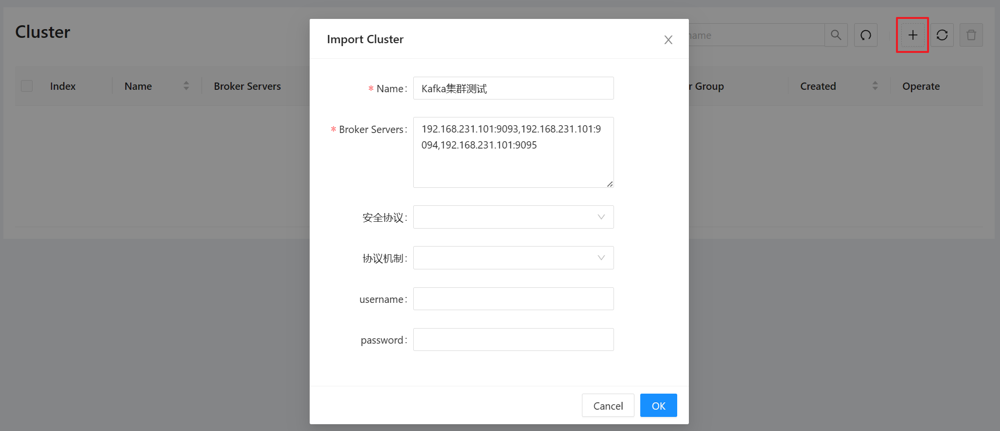

**（3）创建一个3分区3副本的Topic**

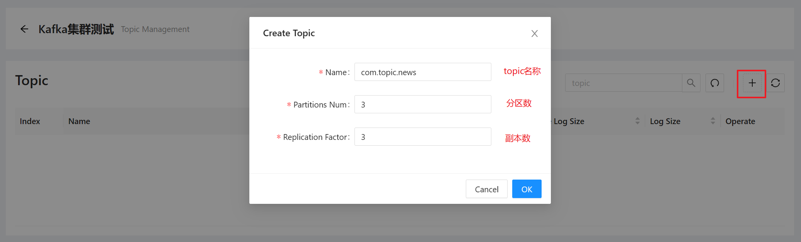

可以看到，效果与我们之前的架构图一致：

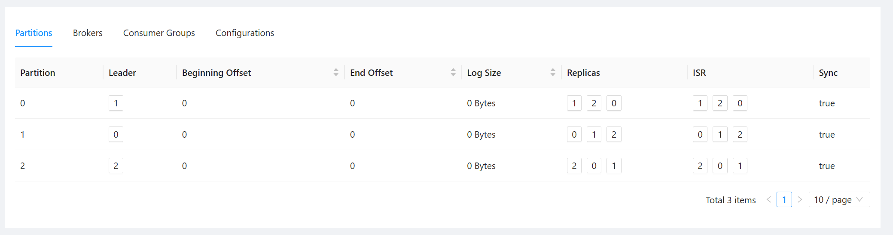


# 第04章_Kafka生产者

## 1. 生产消息的整体流程

### 1.1 整体流程

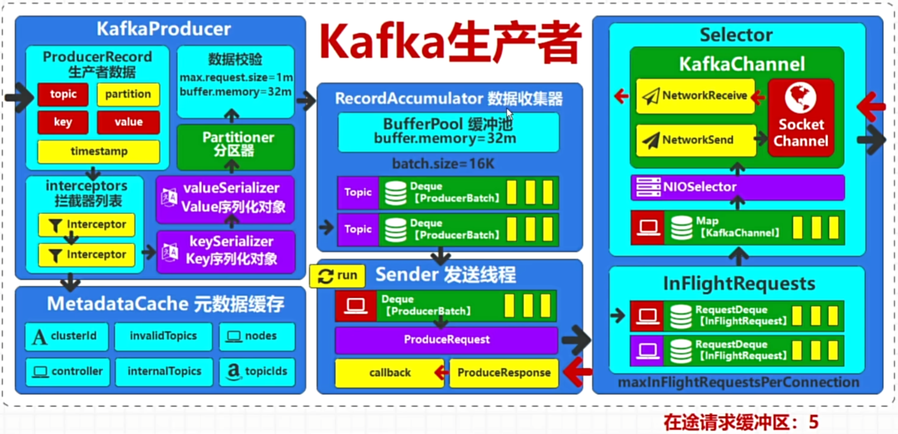

1. Kafka中发送的消息称为ProducerRecord，其中topic和value必须指定，而key主要用于数据的分区定位（可以不指定）
2. 拦截器可以对要发送的数据进行拦截和处理，不过拦截器中出现异常并不会影响后续的拦截器处理
3. 然后序列化器会对key和value分别进行序列化处理
4. 分区器用于计算数据所发送的partition：
   - 如果发送数据时已经指定了partition，则就发送给这个partition。例如`kafkaTemplate.send(topic, 0, key, value)`
   - 如果我们自定义了分区器，则使用我们自定义的分区器计算partition
   - 否则，就使用默认的分区器计算partition，它主要是根据MetadataCache（元数据缓存）中的元数据信息、以及key的hashCode来得到partition（如果未指定key，则会使用优化后的粘性分区策略来计算partition）
5. 接下来对数据进行校验，然后将数据追加到数据收集器中。数据收集器就类似于一个缓冲区，一个发送批次的数据容量默认为16K，这种批量发送的方式能够大大提高吞吐量（但是**消息的默认等待时间为0ms，所以不会攒到16K再发送，而是会立即发送**；如果我们想提高吞吐量，可以将消息的等待时间调整为5ms到100ms，这样只要未超过等待时间，消息就会积攒到16K后再将这个批次发送）。
6. Sender是**发送线程对象**，用于从数据收集器中获取数据，向服务节点发送。

### 1.2 自定义拦截器

我们可以自定义拦截器来对发送数据进行处理：

```java
// 自定义生产者拦截器，需要实现ProducerInterceptor<K, V>接口
public class MyKafkaInterceptor implements ProducerInterceptor<String, String> {
    @Override // 数据发送前执行，进行数据发送前的预处理
    public ProducerRecord<String, String> onSend(ProducerRecord<String, String> record) {
        // 对value进行了复制
        String newValue = record.value() + record.value();
        return new ProducerRecord<>(record.topic(), record.key(), newValue);
    }

    @Override // 数据发送后，获取应答时会执行此方法
    public void onAcknowledgement(RecordMetadata metadata, Exception exception) {

    }

    @Override // 生产者关闭时执行，用于完成一些资源回收操作
    public void close() {

    }

    @Override // 创建生产者对象时执行，用于对一些配置进行统一修改
    public void configure(Map<String, ?> configs) {

    }
}
```

然后需要配置该拦截器：

```yaml
spring:
  kafka:
    producer:
      properties:
        # 生产者拦截器配置，多个拦截器用逗号分隔，执行先后顺序取决于配置顺序
        interceptor:
          classes: com.thuwsy.interceptor.MyKafkaInterceptor
```

### 1.3 自定义分区器

我们可以自定义分区器：

```java
// 自定义分区器，需要实现Partitioner接口
public class MyPartitioner implements Partitioner {
    @Override // 该方法的返回值就是分区编号（分区编号从0开始）
    public int partition(String topic, Object key, byte[] keyBytes, Object value, byte[] valueBytes, Cluster cluster) {
        return 0; // 为了简单我们直接返回0，意味着消息始终发送到0号分区
    }

    @Override
    public void close() {

    }

    @Override
    public void configure(Map<String, ?> configs) {

    }
}
```

然后需要配置该分区器：

```yaml
spring:
  kafka:
    producer:
      properties:
        # 分区器配置
        partitioner:
          class: com.thuwsy.util.MyPartitioner
```

## 2. 消息异步发送

Kafka发送消息时，是使用Sender线程对象**异步**发送的，`kafkaTemplate.send()`方法的返回值是一个CompletableFuture，所以我们可以通过回调方法来对消息的发送结果进行处理：

```java
@RestController
public class KafkaTestController {
    @Autowired
    private KafkaTemplate<String, String> kafkaTemplate;

    @GetMapping("/future")
    public String futureTest() {
        String topic = "com.topic.news";
        for (int i = 0; i < 10; i++) {
            // kafkaTemplate.send()返回一个CompletableFuture
            CompletableFuture<SendResult<String, String>> future =
                    kafkaTemplate.send(topic, "key" + i, "value" + i);
            // 指定回调方法
            future.whenComplete((result, exception) -> {
                // 1. 可以获取消息的元数据信息
                RecordMetadata recordMetadata = result.getRecordMetadata();
                // 2. 可以获取消息的信息
                ProducerRecord<String, String> producerRecord = result.getProducerRecord();
                System.out.println("消息发送成功，内容为" + producerRecord.value());
            });
            // 主线程中打印测试
            System.out.println(i + "号消息已创建");
        }
        return "ok";
    }
}
```

控制台打印：

```
0号消息已创建
1号消息已创建
2号消息已创建
3号消息已创建
4号消息已创建
5号消息已创建
6号消息已创建
7号消息已创建
8号消息已创建
9号消息已创建
消息发送成功，内容为value4
消息发送成功，内容为value6
消息发送成功，内容为value7
消息发送成功，内容为value0
消息发送成功，内容为value3
消息发送成功，内容为value5
消息发送成功，内容为value8
消息发送成功，内容为value1
消息发送成功，内容为value2
消息发送成功，内容为value9
```

有时候我们希望消息是**按顺序同步发送**的，那么就可以使用CompletableFuture的`join()`方法阻塞等待：

```java
@RestController
public class KafkaTestController {
    @Autowired
    private KafkaTemplate<String, String> kafkaTemplate;

    @GetMapping("/future")
    public String futureTest() {
        String topic = "com.topic.news";
        for (int i = 0; i < 10; i++) {
            CompletableFuture<SendResult<String, String>> future =
                    kafkaTemplate.send(topic, "key" + i, "value" + i);
            future.whenComplete((result, exception) -> {
                System.out.println("消息发送成功，内容为" + result.getProducerRecord().value());
            });
            // 调用join方法阻塞等待
            future.join();
            System.out.println(i + "号消息已发送");
        }
        return "ok";
    }
}
```

控制台打印：

```
消息发送成功，内容为value0
0号消息已发送
消息发送成功，内容为value1
1号消息已发送
消息发送成功，内容为value2
2号消息已发送
消息发送成功，内容为value3
3号消息已发送
消息发送成功，内容为value4
4号消息已发送
消息发送成功，内容为value5
5号消息已发送
消息发送成功，内容为value6
6号消息已发送
消息发送成功，内容为value7
7号消息已发送
消息发送成功，内容为value8
8号消息已发送
消息发送成功，内容为value9
9号消息已发送
```

## 3. 生产者ACK机制

```yaml
spring:
  kafka:
    producer:
      acks: -1
```

通过以上参数可以配置Kafka响应确认结果的时机，有以下三个值：

- `-1`：默认值（也可以写成`acks=all`），当生产者发送消息后，必须等到消息已经写入partition的**同步副本列表ISR**中的所有副本的数据日志文件后，才会进行确认应答（ACK）
- `1`：当生产者发送消息后，必须等到消息已经写入partition的leader副本的数据日志文件后，才会进行确认应答（ACK）
- `0`：当生产者将消息发送到网络数据流后，就会进行确认应答（ACK）

> 说明：ISR（In Sync Replicas）是由leader动态维护的同步副本列表，也就是和该leader保持同步（心跳）的副本集合。注意，ISR中的第一个副本必然是leader副本。

## 4. 生产者重试机制

如果发送某条消息后，在一定时间内Kafka生产者没有收到ACK，就会触发重试机制，对超时的数据进行重试（retry）操作，默认的最大重试次数为`Integer.MAX_VALUE`。表面上看，重试机制可能会引发以下两个问题：

- 数据重复：一条消息已经发送到Kafka Broker了，但响应ACK时出现网络问题，此时生产者收不到ACK，所以通过重试机制又发送了该数据，造成数据重复
- 数据乱序：第一条消息发送失败，第二第三条消息均发送成功，此时通过重试机制将第一条消息又发送给了Kafka Broker，就造成了数据乱序

但实际上，Kafka底层已经通过幂等性操作和事务机制防止了上述情况的发生。

- **幂等性操作**：Kafka对每条消息使用**生产者id**和**连续序列号**进行唯一标识，从而解决了数据重复和数据乱序的问题
- **事务机制**：通过事务机制，可以保证同一生产者在机器重启后，也能获取相同的生产者id


# 第05章_Kafka消费者

## 1. 消费消息的整体流程

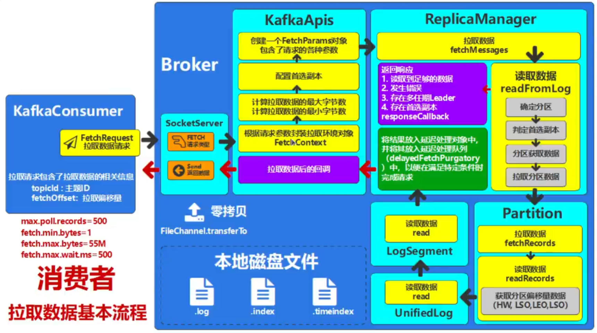

## 2. 偏移量

偏移量offset是消费者消费数据的一个重要属性。

### 2.1 起始偏移量

默认情况下，起始偏移量为end offset，所以消费者只能消费新的消息。如果我们想从最开始消费数据，可以在配置文件中指定：

```yaml
spring:
  kafka:
    consumer:
      # 对于一个新的消费者组，会从头开始消费数据
      auto-offset-reset: earliest
```

当然我们也可以使用`@KafkaListener`注解中的属性来指定消费某个分区，以及指定起始偏移量，详细的使用之前已经演示过。

### 2.2 手动提交偏移量

一旦消费者提交偏移量后，如果该消费者宕机后重启，则会从提交的偏移量处开始消费，而不是从上述起始偏移量处开始消费。

Kafka默认开启**消费者偏移量的自动提交**，周期性地每隔5秒将消费的偏移量提交到Kafka。但这种方式就会造成以下两个问题：

- **漏消费**：当消费者拉取到消息后，刚好达到周期并自动提交了偏移量，然而消费处理消息的过程中突然宕机，这就导致了消息的漏消费（因为偏移量已经提交，所以重启后再也不会消费这条消息了）
- **重复消费**：当消费者拉取到消息并成功消费完毕后宕机，且此时还没到达提交偏移量的周期，于是在重启之后就会重复消费这条消息

因此，我们推荐消费者使用**手动提交偏移量**的方式，步骤如下：

（1）在配置文件中关闭自动提交：

```yaml
spring:
  kafka:
    consumer:
      enable-auto-commit: false
```

（2）在消费者代码中手动提交offset：

```java
@Component
@Slf4j
public class MallOrderListener {
    @KafkaListener(groupId = "com.mall.order.listener1", topics = "com.mall.order")
    public void listen(ConsumerRecord<String, String> record, Acknowledgment ack) {
        try {
            log.info("收到消息内容：{}", record.value());
            // 手动提交offset
            ack.acknowledge();
        } catch (Exception e) {
            log.error("出现异常", e);
        }
    }
}
```

> 注意：为了更高的安全性，通常需要**将消费者端的数据消费过程和偏移量提交过程进行原子性绑定**，也就是消费成功则保证offset正确提交、消费失败则回滚，这一般需要**结合MySQL的事务来实现**（将offset保存到MySQL中）。

## 3. 分区分配策略

同一消费者组中的每个消费者到底消费哪个主题分区，这个分区分配策略其实是由消费者组中的Leader决定的（第一个加入该组的消费者称为Leader，其余的称为Follower）。当新的消费者加入组时，会发送一个JoinGroup请求，Leader就负责给每一个消费者分配分区。每个Follower只知道自己的分配信息，只有Leader知道组内所有消费者的分配信息。

Kafka提供的分区分配策略常用的有以下四种：

1. RoundRobin
2. Range
3. Sticky
4. CooperativeSticky

Kafka**默认使用的分区分配策略是Range+CooperativeSticky**，也就是在首次启动时采用Range，而当新增或移除消费者成员需要进行分区重分配时采用CooperativeSticky。

### 3.1 RoundRobin

RoundRobin是轮询分配策略，这种策略会给消费者组中的每个消费者自动生成一个memberId，然后将消费者按memberId进行排序、将消费的Topic也进行排序，然后**将主题分区轮询分配给对应的订阅消费者**（注意，未订阅当前轮询主题的消费者将跳过）。

例如，在消费者组中，aaa订阅了主题test1和test2，bbb订阅了主题test2，ccc订阅了主题test1，则轮询分配策略的过程如下所示：

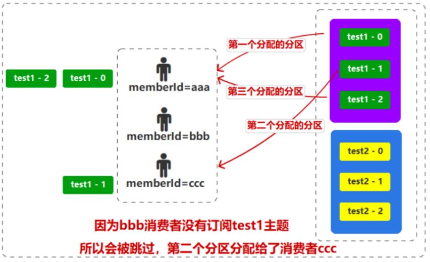

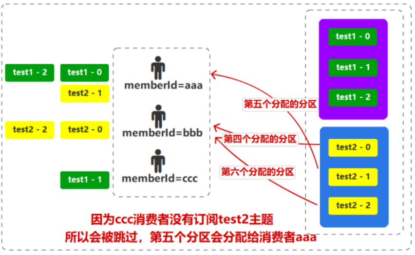

> 可见，轮询分配策略并不是那么均衡，如上图所示，如果能将test1-2分区分配给消费者ccc，才更加均衡。

### 3.2 Range

Range是范围分配策略，它按照每个Topic的分区数计算出每个消费者应该分配的分区数量，分配的原则就是一个Topic的分区尽可能平均分，如果无法均分，那么就按顺序向前补齐。

例如，0到4号分区要分配给2个消费者，那么第一个消费者分配到0、1、2分区，第二个消费者分配到3、4分区；如果0到4号分区要分配给3个消费者，那么第一个消费者分配到0、1分区，第二个消费者分配到2、3分区，第三个消费者分配到4号分区。

> Range策略在针对单个Topic时比较均衡，但如果Topic很多，那么靠前的消费者可能会被分配到更多的分区，产生**数据倾斜**。除此之外，当新增或移除消费者成员时，需要对每个消费者重新分配分区，效率很低。

### 3.3 Sticky

Sticky是粘性分配策略，在第一次分区分配后，每个组成员都保留自己的分区信息，如果新增或移除消费者成员，那么在进行分区重分配时，粘性分配策略会尽可能保证消费者原有的分区不变，重新对加入或退出的消费者的分区进行分配。

例如，初始的分区分配是消费者aaa消费0、1、2、3号分区，消费者bbb消费4、5、6号分区，此时新增了一个消费者ccc，那么粘性分配策略就会让ccc消费2、3号分区，让aaa消费0、1号分区，而bbb保持不变。

> 可见，粘性分配策略能在分区重新分配时更高效。

### 3.4 CooperativeSticky

前面三种分配策略进行分区重分配时使用的是EAGER协议，会让当前的所有消费者放弃当前分区、关闭连接、清理资源、重新分配分区。而CooperativeSticky策略是在Sticky策略的基础上，优化了重分配的过程，采用COOPERATIVE协议，提高效率。

## 4. 消费者重试机制

Kafka消费者也有重试机制，在默认配置下，当消费异常时会进行重试，至多进行10次重试（每次重试的时间间隔为0，即立即进行重试），如果仍没有成功消费消息，则会跳过当前消息，继续进行后续消息的消费。

> 说明：对于重试10次后仍未成功消费的消息，我们建议将其发送到死信队列中，而不是直接跳过。在死信队列中，可以进一步分析、处理这些无法正常消费的消息，以便定位问题、修复错误。


# 第06章_Kafka经典问题

## 1. Kafka如何保证消息顺序消费

Kafka生产者在给某个Topic发送消息时，具体该消息会在哪个Partition中是不确定的，因此，**Kafka只能为我们保证在同一分区中的消息是有序的（通过幂等性操作和事务机制）**。所以，如果想保证消息的消费顺序，就需要让生产者将消息发送到同一分区中，比如可以在发送消息时指定Partition、或者指定相同的key（因为key相同就会发送到同一Partition）。

## 2. Kafka如何防止消息丢失

生产者保证消息可靠性：

- ACK机制：采用默认值，当生产者发送消息后，必须等到消息已经写入partition的同步副本列表ISR中的所有副本的数据日志文件后，才会进行确认应答（ACK）
- 重试机制：如果发送某条消息后，在一定时间内Kafka生产者没有收到ACK，就会触发重试机制，对超时的数据进行重试（retry）操作。
- 除此之外，我们还可以通过回调方法来对消息的发送结果进行处理

消费者保证消息可靠性：

- 采用手动提交偏移量，并结合MySQL事务之类的方式，将消费者端的数据消费过程和偏移量提交过程进行原子性绑定

## 3. Kafka如何防止消息重复消费

Kafka出现消息重复消费的最根本原因就是**消费者已经消费的数据没有成功提交offset**。通常采取以下措施来防止消息重复消费：

1. 采用手动提交偏移量，并结合MySQL事务之类的方式，将消费者端的数据消费过程和偏移量提交过程进行原子性绑定
2. 消费者的业务消费接口设计为**幂等性**的

##  4. Kafka如何防止消息积压

产生消息积压的主要原因有：

- 生产者的发送消息流量太大
- 消费者消费能力不足，或者消费者宕机

为此，我们可以采取的措施有：

- 增加Topic的分区数，并同时提升消费组的消费者数量（尽量使消费者数与分区数相等）
- 对于实时性要求不高的业务场景，我们可以创建一个专门的消息消费服务，其功能是将消息先批量取出来，并保存到数据库中，之后再离线慢慢处理这些数据

## 5. Kafka为何性能极高

1. Kafka集群采用分区的策略，提高并行度
2. 读数据采用稀疏索引，可以快速定位要消费的数据
3. Producer生产数据是追加到log文件末尾，这种顺序写磁盘的方式速度很快
4. 采用页缓存和零拷贝技术


