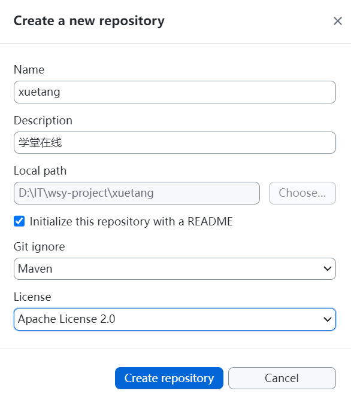

## 2. 环境搭建

### 2.1 基本软件安装

Linux虚拟机上：

- 安装docker，版本24.0.7
- 使用docker安装mysql:8.0.27
- 使用docker安装redis:7.2.0

### 2.2 项目结构创建

#### 1、创建父工程

创建一个新的Maven项目作为父工程，然后删除src目录。父工程pom文件如下：

```xml
<?xml version="1.0" encoding="UTF-8"?>
<project xmlns="http://maven.apache.org/POM/4.0.0"
         xmlns:xsi="http://www.w3.org/2001/XMLSchema-instance"
         xsi:schemaLocation="http://maven.apache.org/POM/4.0.0 http://maven.apache.org/xsd/maven-4.0.0.xsd">
    <modelVersion>4.0.0</modelVersion>

    <groupId>com.thuwsy.xuetang</groupId>
    <artifactId>xuetang</artifactId>
    <version>1.0-SNAPSHOT</version>

    <!--管理版本号-->
    <properties>
        <maven.compiler.source>17</maven.compiler.source>
        <maven.compiler.target>17</maven.compiler.target>
        <project.build.sourceEncoding>UTF-8</project.build.sourceEncoding>
        <mybatis.spring.boot.version>3.0.2</mybatis.spring.boot.version>
        <spring.boot.version>3.0.2</spring.boot.version>
        <spring.cloud.version>2022.0.0</spring.cloud.version>
        <spring.cloud.alibaba.version>2022.0.0.0</spring.cloud.alibaba.version>
    </properties>

    <!-- 依赖版本管理 -->
    <dependencyManagement>
        <dependencies>
            <!-- SpringBoot -->
            <dependency>
                <groupId>org.springframework.boot</groupId>
                <artifactId>spring-boot-dependencies</artifactId>
                <version>${spring.boot.version}</version>
                <type>pom</type>
                <scope>import</scope>
            </dependency>
            <!-- SpringCloud -->
            <dependency>
                <groupId>org.springframework.cloud</groupId>
                <artifactId>spring-cloud-dependencies</artifactId>
                <version>${spring.cloud.version}</version>
                <type>pom</type>
                <scope>import</scope>
            </dependency>
            <!-- SpringCloud Alibaba -->
            <dependency>
                <groupId>com.alibaba.cloud</groupId>
                <artifactId>spring-cloud-alibaba-dependencies</artifactId>
                <version>${spring.cloud.alibaba.version}</version>
                <type>pom</type>
                <scope>import</scope>
            </dependency>
            <!-- mybatis-->
            <dependency>
                <groupId>org.mybatis.spring.boot</groupId>
                <artifactId>mybatis-spring-boot-starter</artifactId>
                <version>${mybatis.spring.boot.version}</version>
            </dependency>
        </dependencies>
    </dependencyManagement>

    <build>
        <plugins>
            <plugin>
                <groupId>org.springframework.boot</groupId>
                <artifactId>spring-boot-maven-plugin</artifactId>
                <version>${spring.boot.version}</version>
            </plugin>
        </plugins>
    </build>
</project>
```

#### 2、创建base模块

我们创建一个`xuetang-base`模块，主要用于添加公共的依赖。添加如下依赖：

```xml
<!-- web -->
<dependency>
    <groupId>org.springframework.boot</groupId>
    <artifactId>spring-boot-starter-web</artifactId>
</dependency>
<!-- mybatis -->
<dependency>
    <groupId>org.mybatis.spring.boot</groupId>
    <artifactId>mybatis-spring-boot-starter</artifactId>
</dependency>
<!-- mysql -->
<dependency>
    <groupId>com.mysql</groupId>
    <artifactId>mysql-connector-j</artifactId>
    <scope>runtime</scope>
</dependency>
<!-- druid -->
<dependency>
    <groupId>com.alibaba</groupId>
    <artifactId>druid-spring-boot-3-starter</artifactId>
</dependency>
<!-- nacos-discovery -->
<dependency>
    <groupId>com.alibaba.cloud</groupId>
    <artifactId>spring-cloud-starter-alibaba-nacos-discovery</artifactId>
</dependency>
<!-- nacos-config -->
<dependency>
    <groupId>com.alibaba.cloud</groupId>
    <artifactId>spring-cloud-starter-alibaba-nacos-config</artifactId>
</dependency>
<!-- 支持bootstrap配置文件 -->
<dependency>
    <groupId>org.springframework.cloud</groupId>
    <artifactId>spring-cloud-starter-bootstrap</artifactId>
</dependency>
<!-- openfeign -->
<dependency>
    <groupId>org.springframework.cloud</groupId>
    <artifactId>spring-cloud-starter-openfeign</artifactId>
</dependency>
<!-- loadbalancer -->
<dependency>
    <groupId>org.springframework.cloud</groupId>
    <artifactId>spring-cloud-starter-loadbalancer</artifactId>
</dependency>
```

#### 3、创建子模块


```java
// 创建以下5个模块：

// - thumall-product(商品服务)
// - thumall-ware(仓储服务)
// - thumall-order(订单服务)
// - thumall-coupon(优惠券服务)
// - thumall-member(用户服务)

// （1）添加依赖

// ```xml
// <dependency>
//     <groupId>com.thuwsy.thumall</groupId>
//     <artifactId>thumall-common</artifactId>
//     <version>1.0-SNAPSHOT</version>
// </dependency>
// <dependency>
//     <groupId>org.springframework.boot</groupId>
//     <artifactId>spring-boot-starter-test</artifactId>
//     <scope>test</scope>
// </dependency>
// ```

// （2）主启动类

// ```java
// @SpringBootApplication
// public class ThumallProductApplication {
//     public static void main(String[] args) {
//         SpringApplication.run(ThumallProductApplication.class, args);
//     }
// }
// ```
```


#### 4、将该项目发布到github



在`.gitignore`中添加以下内容，来忽略一些文件：

```
### STS ###
.apt_generated
.factorypath
.settings
.springBeans
.sts4-cache

### IntelliJ IDEA ###
.idea
*.iws
*.iml
*.ipr
**/mvnw
**/mvnw.cmd
**/.mvn
**/target/
**/.gitignore

### NetBeans ###
/nbproject/private/
/nbbuild/
/dist/
/nbdist/
/.nb-gradle/
build/
logs/

### VS Code ###
.vscode/
```

然后发布到github

### 2.3 数据库初始化

连接到MySQL后，分别执行sql脚本：

```sql
CREATE DATABASE `xuetang_content` DEFAULT CHARACTER SET utf8mb4;
USE `xuetang_content`;
# 然后执行脚本xuetang_content.sql

```


