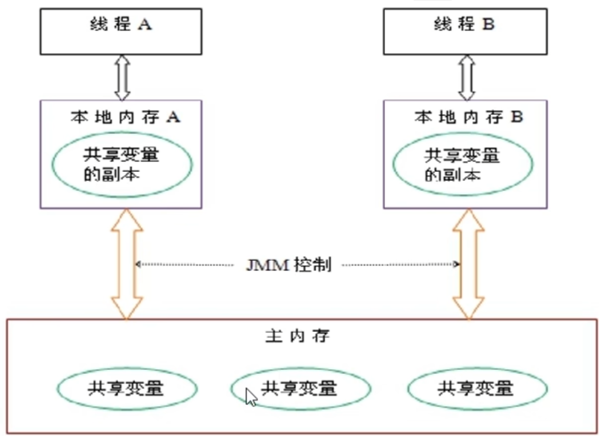

# 第01章_JUC基础

> JUC就是`java.util.concurrent`工具包的简称

## 1. Lock

### 1.1 Lock接口

Lock能提供比同步代码块和同步方法更广泛的锁操作，它提供的常用API如下：

- `void lock()`：获取该锁对象，如果锁已被其他线程获取，则阻塞等待。
- `void unlock()`：释放该锁对象
- `boolean tryLock()`：获取该锁对象，成功则返回true，失败则立即返回false，不会阻塞等待。
- `boolean tryLock(long time, TimeUnit unit)`：获取该锁对象，至多等待时长为time，单位由unit指定
- `Condition newCondition()`：创建一个新的Condition实例，该实例绑定该锁对象

**注意**：使用Lock必须手动释放锁对象，发生异常时不会自动释放锁，因此建议将`unlock()`的调用写在finally块中。

### 1.2 Condition接口

通过Lock对象的`newCondition()`方法返回的`Condition`对象，也可以用来实现**等待唤醒机制**，从而进行线程间通信。Condition最大的作用是可以选择性地唤醒线程，常用API如下：

- `void await()`：使当前线程阻塞，进入该Condition对象的等待队列，并释放锁
- `void signal()`：从当前Condition对象的等待队列中唤醒一个线程

> 注意：被`signal()`唤醒的线程会首先获取锁对象。如果能获取锁对象，则变为RUNNABLE状态；否则，就变为BLOCKED状态（这种情况也称为虚假唤醒）。

### 1.3 Lock和Condition实现线程间通信

需求：A线程打印2次`a`，B线程打印3次`b`，C线程打印5次`c`，按照此顺序循环5轮。

任务类：

```java
public class PrintTask {
    // 该标志表示当前应该执行打印的线程，0表示打印a，1表示打印b，2表示打印c
    private int flag = 0;
    // 锁
    private final Lock LOCK = new ReentrantLock();
    // 三个条件变量
    private Condition[] cond = new Condition[3];
    {
        cond[0] = LOCK.newCondition();
        cond[1] = LOCK.newCondition();
        cond[2] = LOCK.newCondition();
    }

    public void print(int mode) {
        // mode表示当前准备打印的线程
        int num = 0; // 打印次数
        String str = null; // 打印字符
        switch (mode) {
            case 0 : str = "a"; num = 2; break;
            case 1 : str = "b"; num = 3; break;
            case 2 : str = "c"; num = 5; break;
        }
        try {
            // 1. 加锁
            LOCK.lock();
            // 2. 如果mode与flag不同，说明当前mode线程不应该打印，所以阻塞等待
            // 注意：必须使用while循环，避免虚假唤醒
            while (flag != mode) {
                cond[mode].await();
            }
            // 3. 此时轮到mode线程打印
            String name = Thread.currentThread().getName();
            for (int i = 0; i < num; i++) {
                System.out.println(name + "打印了" + str);
            }
            // 4. 打印完成，唤醒下一个进行打印的线程
            flag = (flag + 1) % 3;
            cond[flag].signal();
        } catch (Exception e) {
            e.printStackTrace();
        } finally {
            // 5. 释放锁
            LOCK.unlock();
        }
    }
}
```

主线程：

```java
public class PrintMain {
    public static void main(String[] args) {
        PrintTask task = new PrintTask();
        // 启动3个线程
        new Thread(() -> {
            for (int i = 0; i < 5; i++) {
                task.print(0);
            }
        }, "A线程").start();

        new Thread(() -> {
            for (int i = 0; i < 5; i++) {
                task.print(1);
            }
        }, "B线程").start();

        new Thread(() -> {
            for (int i = 0; i < 5; i++) {
                task.print(2);
            }
        }, "C线程").start();
    }
}
```

## 2. LockSupport

LockSupport是用来创建锁和其他同步类的基本线程阻塞原语，它的所有方法都是静态的。LockSupport类使用了一种名为Permit（许可）的概念来做到阻塞和唤醒线程的功能，**每个线程的初始许可证数量为0，数量上限为1**。它的常用API为：

- `static void park()`：如果当前线程有一个许可证，则直接消耗掉这个许可证，然后继续执行后面的代码。如果当前线程没有许可证，则阻塞等待，直到有许可证可用。
- `static void unpark(Thread thread)`：为指定线程增加一个许可证（注意一个线程的许可证上限为1，所以如果指定线程已经有许可证了，就不会再增加）

举例：

```java
public static void main(String[] args) {
    Thread thread1 = new Thread(() -> {
        try {Thread.sleep(3000);} catch (Exception e) {}
        System.out.println("t1开始执行");
        LockSupport.park();
        System.out.println("t1被唤醒");
    });
    thread1.start();

    new Thread(() -> {
        LockSupport.unpark(thread1);
        System.out.println("t2发出唤醒通知");
    }).start();
}
```

## 3. 等待唤醒机制

等待唤醒机制有三种实现方式：

- 使用Object中的`wait()`方法让当前线程等待，使用`notify()`唤醒锁对象的等待队列中的一个线程。这种方式必须结合synchronized使用。
- 使用Condition中的`await()`方法让当前线程等待，使用`signal()`方法唤醒Condition对象的等待队列中的一个线程。这种方式必须结合Lock使用。
- 使用LockSupport类的`park()`方法让当前线程等待，使用`unpark()`方法唤醒指定线程。

## 4. 集合的线程安全

### 4.1 集合的线程安全问题

像ArrayList之类的大多数集合，都是线程不安全的。测试如下：

```java
public static void main(String[] args) {
    // 多个线程同时对ArrayList集合进行修改，会产生线程安全问题
    List<String> list = new ArrayList<>();
    for (int i = 0; i < 100; i++) {
        new Thread(() -> {
            list.add("haha");
            System.out.println(list);
        }).start();
    }
}
```

运行后，很容易出现ConcurrentModificationException。

我们有以下三种方式来解决集合的线程不安全问题：

#### 方式一：使用Vector

我们可以使用线程安全的集合Vector来代替ArrayList，例如Vector底层的`add()`方法就被synchronized修饰。但我们并不推荐这么做，因为Vector的效率太低了。

#### 方式二：使用Collections工具类

使用Collections工具类提供的`synchronizedXxx()`方法，可以根据指定集合得到一个新的线程同步的集合，从而解决线程安全问题。以下代码就不会发生线程安全问题：

```java
public static void main(String[] args) {
    List<String> list = Collections.synchronizedList(new ArrayList<String>());
    for (int i = 0; i < 100; i++) {
        new Thread(() -> {
            list.add("haha");
            System.out.println(list);
        }).start();
    }
}
```

> 不过一般开发中也很少使用这种方式

#### 方式三：使用CopyOnWriteArrayList

它就相当于线程安全的ArrayList，我们推荐使用这种方式。

```java
public static void main(String[] args) {
    List<String> list = new CopyOnWriteArrayList<>();
    for (int i = 0; i < 100; i++) {
        new Thread(() -> {
            list.add("haha");
            System.out.println(list);
        }).start();
    }
}
```

### 4.2 CopyOnWriteArrayList详解

CopyOnWriteArrayList就相当于线程安全的ArrayList，它也是个可变数组，具有以下特性：

- 适用于以下场景：集合大小较小，只读操作远多于可读操作
- 可变操作（`add`，`set`，`remove`等）开销很大，因为需要复制整个基础数组
- 迭代器支持`hasNext()、next()`等不可变操作，但不支持`remove()`等可变操作
- 使用迭代器进行遍历的速度很快，并且不会与其他线程发生冲突。注意在创建迭代器时，迭代器依赖于不变的数组快照。

**底层原理**：

CopyOnWriteArrayList内部维护了一个`volatile数组`来存储数据，在进行`增删改`数据时，都会拷贝创建一个新数组，然后在新数组中更新数据，最后再将该数组赋值给`volatile数组`，这就是**写时复制**。可见其`增删改`的效率很低，但读操作效率很高。

**线程安全机制**：通过**锁和volatile**实现

- 当进行`增删改`操作时，会首先获取锁，然后进行复制、修改、赋值，最后再释放锁
- 当进行`读`操作时，通过volatile机制，可以保证总能读取到其他线程对该volatile变量的最后写入，所以能保证读到最新的数据。

### 4.3 线程安全的集合

- ArrayList对应的线程安全集合是CopyOnWriteArrayList
- HashSet对应的线程安全集合是CopyOnWriteArraySet
- HashMap对应的线程安全集合是ConcurrentHashMap

## 5. JUC常用辅助类

JUC中提供了三种常用的辅助类，通过这些辅助类可以很好地解决线程数量过多时Lock锁的频繁操作。

### 5.1 CountDownLatch

CountDownLatch类可以设置一个计数器，然后通过`countDown()`方法来进行减1的操作，减到0后唤醒所有因`await()`而等待的线程，继续执行它们`await()`之后的语句。常用API如下：

- `CountDownLatch(int count)`：有参构造器，设置一个计数器
- `void countDown()`：如果计数值为0，则无事发生。如果计数值大于0，则将其减1，如果减1之后计数值变为0了，则唤醒所有因`await()`而阻塞等待的线程。
- `void await()`：如果计数值大于0，则阻塞等待
- `long getCount()`：获取计数值

案例演示：6个同学都离开教室后，班长再关门

```java
public static void main(String[] args) throws InterruptedException {
    // 1. 创建一个计数值为6的计数器
    CountDownLatch latch = new CountDownLatch(6);

    for (int i = 0; i < 6; i++) {
        new Thread(() -> {
            try {
                Thread.sleep(1000);
            } catch (InterruptedException e) {
                throw new RuntimeException(e);
            }
            String name = Thread.currentThread().getName();
            System.out.println(name + "已经离开教室");
            // 2. 任务完成后，计数器减一
            latch.countDown();
        }, i + "号同学").start();
    }

    // 3. 主线程等待计数器变为0
    latch.await();
    System.out.println("所有同学已离开，计数器的值为" + latch.getCount());
}
```

### 5.2 CyclicBarrier

CyclicBarrier是循环栅栏，可以设置一个栅栏数，当阻塞等待的线程数达到这个栅栏数后，触发指定任务。

- `CyclicBarrier(int parties, Runnable barrierAction)`：第一个参数是栅栏数，当因`await()`而阻塞等待的线程数达到栅栏数后，则会执行barrierAction任务（由最后一个进入栅栏的线程执行）
- `int await()`：阻塞等待。当阻塞等待的线程数达到设置的栅栏数后，才会解除阻塞，执行后面的语句。

案例演示：集齐七龙珠后，召唤神龙

```java
public static void main(String[] args) {
    // 1. 定义循环栅栏
    CyclicBarrier barrier = new CyclicBarrier(7, () -> {
        System.out.println("召唤神龙!");
    });

    for (int i = 0; i < 7; i++) {
        new Thread(() -> {
            try {
                Thread.sleep(1000);
                String name = Thread.currentThread().getName();
                System.out.println("收集到了" + name);
                // 2. 等待线程数+1
                barrier.await();
            } catch (Exception e) {
                throw new RuntimeException(e);
            }
        }, i + "号龙珠").start();
    }
}
```

### 5.3 Semaphore

Semaphore代表信号量，可以使用有参构造器设置信号量的初始值。

- `Semaphore(int permits)`：设置信号量的初始值（许可证数量）
- `void acquire()`：从信号量中获取一个许可证。如果没有则阻塞等待；如果获取成功，则许可证数量减一。
- `void release()`：释放一个许可证，令信号量的许可证数量加一。从而可以唤醒某个阻塞等待许可证的线程。

案例演示：七辆汽车抢三个停车位

```java
public static void main(String[] args) {
    // 1. 定义三个停车位
    Semaphore semaphore = new Semaphore(3);

    for (int i = 0; i < 7; i++) {
        new Thread(() -> {
            String name = Thread.currentThread().getName();
            try {
                // 2. 等待停车位
                semaphore.acquire();
                // 3. 得到了车位，开始停车
                System.out.println(name + "开始停车");
                Thread.sleep(1000);
            } catch (Exception e) {
                throw new RuntimeException(e);
            } finally {
                // 4. 停车完毕，释放车位
                System.out.println(name + "已离开");
                semaphore.release();
            }
        }, i + "号车").start();
    }
}
```

## 6. 阻塞队列

### 6.1 BlockingQueue接口

阻塞队列很好地解决了多线程中高效安全传输数据的问题。通过这些高效并且线程安全的阻塞队列类，为我们快速搭建高质量的多线程程序带来了极大的便利。

阻塞队列，就是一个共享的队列。当队列为空，从队列中提取元素的操作将被阻塞；当队列满了，从队列中添加元素的操作将被阻塞。

> BlockingQueue的优点，就是自动帮我们解决了何时阻塞线程、何时唤醒线程。

BlockingQueue接口继承了Queue接口，其核心API如下：

#### 1、添加元素

- `boolean add(E e)`：队尾插入元素，队满则抛出异常
- `boolean offer(E e)`：队尾插入元素，队满则返回false
- `void put(E e)`：队尾插入元素，队满则阻塞等待
- `boolean offer(E e, long timeout, TimeUnit unit)`：队尾插入元素，队满则阻塞等待，至多等待timeout的时间，超时后返回false

#### 2、删除元素

- `boolean remove(Object o)`：删除队首元素，队空则抛出异常
- `E poll()`：删除队首元素，队空则返回null
- `E take()`：删除队首元素，队空则阻塞等待
- `E poll(long timeout, TimeUnit unit)`：删除队首元素，队空则阻塞等待，至多等待timeout的时间，超时后返回null

#### 3、返回队首元素

- `E element()`：返回队首元素，队空则抛出异常
- `E peek()`：返回队首元素，队空则返回null

### 6.2 BlockingQueue的实现类

#### 1、ArrayBlockingQueue

ArrayBlockingQueue是基于数组实现的有界阻塞队列，其构造器为：

- `ArrayBlockingQueue(int capacity)`：参数用于指定阻塞队列的长度

#### 2、LinkedBlockingQueue

LinkedBlockingQueue是基于链表实现的有界阻塞队列，其长度默认为`Integer.MAX_VALUE`

#### 3、DelayQueue

DelayQueue是基于优先级队列实现的无界延迟阻塞队列，其中的元素只有当延迟时间到了才能获取。注意，由于它是无界的，所以添加操作不会被阻塞。

#### 4、PriorityBlockingQueue

PriorityBlockingQueue是基于优先级队列实现的无界阻塞队列。注意，由于它是无界的，所以添加操作不会被阻塞。

#### 5、SynchronousQueue

SynchronousQueue是一个只具有单个元素的阻塞队列。

#### 6、LinkedTransferQueue

LinkedTransferQueue是基于链表实现的无界阻塞队列。

#### 7、LinkedBlockingDeque

LinkedBlockingDeque是基于链表实现的有界双向阻塞队列。

## 7. Fork/Join框架

### 7.1 简介

Fork/Join框架可以将一个大的任务拆分成多个子任务进行并发处理，最后将子任务结果合并成最后的计算结果进行输出。主要用到两个类：ForkJoinTask和ForkJoinPool

**ForkJoinTask**类是一个抽象类，它实现了Future接口。这个类提供了在任务中执行fork和join的机制，一般我们会使用它的子类：

- RecursiveAction：用于没有返回值的任务
- RecursiveTask：用于有返回值的任务

**ForkJoinPool**：用于执行ForkJoinTask任务。其底层维护了一个ForkJoinTask数组和一个ForkJoinWorkerThread数组。前者用于存放任务以及将任务提交给ForkJoinPool，后者负责执行这些任务。

### 7.2 相关API

ForkJoinTask的核心API：

- `ForkJoinTask<V> fork()`：会将任务放在工作队列中，异步地执行任务
- `V join()`：阻塞等待该任务的结果

ForkJoinPool的核心API：

- `ForkJoinTask<T> submit(ForkJoinTask<T> task)`：提交并执行这个任务

### 7.3 案例演示

需求：计算1到100的和，要求每个子任务至多执行10个数的相加，对于更多数的求和任务需要进行拆分。

```java
public class TaskExample extends RecursiveTask<Long> {
    private int beg; // 起始值
    private int end; // 结束值
    private long sum; // 总和
    public TaskExample(int beg, int end) {
        this.beg = beg;
        this.end = end;
    }
    @Override
    protected Long compute() {
        if (end - beg <= 10) {
            // 不超过10个数的求和，直接计算
            for (int i = beg; i <= end; i++) {
                sum += i;
            }
        } else {
            // 否则，拆分为两个子任务
            int mi = (beg + end) / 2;
            TaskExample task1 = new TaskExample(beg, mi);
            TaskExample task2 = new TaskExample(mi + 1, end);
            // 异步执行任务
            task1.fork();
            task2.fork();
            // 同步阻塞获取执行结果
            sum = task1.join() + task2.join();
        }
        // 返回结果
        return sum;
    }
}
```

```java
public class TaskTest {
    public static void main(String[] args) throws Exception {
        // 定义任务对象
        TaskExample task = new TaskExample(1, 100);
        // 定义执行对象
        ForkJoinPool pool = new ForkJoinPool();
        // 执行任务
        ForkJoinTask<Long> result = pool.submit(task);
        // 输出结果
        System.out.println(result.get());
    }
}
```

## 8. 线程中断机制

### 8.1 简介

一个线程不应该由其他线程来强制中断或停止，而是应该由线程自己自行停止，所以，`Thread.stop()`, `Thread.suspend()`, `Thread.resume()`都已经被废弃了。

在Java中没有办法立即停止一条线程，然而停止线程却显得尤为重要，如取消一个耗时操作。因此，Java提供了一种用于停止线程的协商机制，即**中断标识协商机制**。

中断只是一种协商机制，Java没有给中断增加任何语法，中断的过程完全需要程序员自行实现。若要中断一个线程，你需要手动调用该线程`interrupt()`方法，该方法也仅仅是将该线程对象的中断标识设置为true，接着你需要自己写代码不断检测当前线程的中断标识位，如果为true，表示别的线程请求这条线程中断，此时究竟应该做什么需要你自己写代码实现。

每个线程对象都有一个**中断标识位**，用于表示线程是否被要求中断，该标识位为true表示中断，为false表示未中断。通过调用线程对象的`interrupt()`方法可以将该线程的中断标识位设置为true，可以在别的线程中调用，也可以在自己的线程中调用。

**Thread类**中提供了以下三个有关中断的API：

- `void interrupt()`
- `boolean isInterrupted()`
- `static boolean interrupted()`

### 8.2 interrupt

`void interrupt()`是一个实例方法，其作用是通知目标线程中断，分为以下三种情况：

- 如果目标线程处于**正常运行状态**，那么会将该线程的**中断标志位设置为true**，仅此而已。被设置中断标志的线程将继续正常运行，不受影响。所以该方法并不能真正中断线程，只是设置中断标志位而已。
- 如果目标线程已经**执行结束**，则调用该方法将什么都不做，已经结束的目标线程的中断标志位仍为false
- 如果目标线程处于**阻塞状态**（例如因sleep、wait、join等进入阻塞），那么调用该方法会让目标线程立即退出阻塞状态，清除中断标志位（即设置为false），并**抛出一个InterruptedException异常**

### 8.3 isInterrupted

`boolean isInterrupted()`是一个实例方法，其作用是返回线程的中断标志位的值。

### 8.4 interrupted

`static boolean interrupted()`是一个静态方法，调用它后会产生以下作用：

1. 返回当前线程的中断标志位的值
2. 然后清除当前线程的中断标志位（即设置为false）

因此，连续调用两次该方法，返回值可能不同。例如：

```java
public static void main(String[] args) {
    System.out.println(Thread.interrupted()); // false
    Thread.currentThread().interrupt();
    System.out.println(Thread.interrupted()); // true
    System.out.println(Thread.interrupted()); // false
}
```

### 8.5 中断运行中线程的方式

#### 方式1：使用volatile变量

```java
public class InterruptTest {
    public static volatile boolean isStop = false; // volatile变量具有可见性
    public static void main(String[] args) {
        new Thread(() -> {
            while (!isStop) {
                System.out.println("hello");
            }
            System.out.println("被中断");
        }).start();

        try {Thread.sleep(100);} catch (Exception e) {}
        new Thread(() -> isStop = true).start();
    }
}
```

#### 方式2：使用AutomicBoolean

```java
public class InterruptTest {
    public static AtomicBoolean isStop = new AtomicBoolean(false);
    public static void main(String[] args) {
        new Thread(() -> {
            while (!isStop.get()) {
                System.out.println("hello");
            }
            System.out.println("被中断");
        }).start();

        try {Thread.sleep(100);} catch (Exception e) {}
        new Thread(() -> isStop.set(true)).start();
    }
}
```

#### 方式3：使用interrupt()

```java
public class InterruptTest {
    public static void main(String[] args) {
        Thread thread1 = new Thread(() -> {
            while (!Thread.currentThread().isInterrupted()) {
                System.out.println("hello");
            }
            System.out.println("被中断");
        });
        thread1.start();

        try {Thread.sleep(100);} catch (Exception e) {}
        new Thread(() -> thread1.interrupt()).start();
    }
}
```

# 第02章_CompletableFuture

## 1. Future接口

`Future<V>`接口定义了操作异步任务执行一些方法，如获取异步任务的执行结果、取消异步任务的执行、判断任务是否被取消、判断任务执行是否完毕等。

对于一些比较耗时的子线程任务，主线程可以在启动子线程之后去做执行别的业务逻辑，等子线程完成之后再从Future中获取其返回结果，这就是**异步任务**。

因此，使用Future和线程池执行多线程异步任务，能显著提高程序的运行效率。但是，它有如下缺点：

- 用于获取结果的`get()`方法是阻塞的，影响效率
- 我们也可以在while循环中使用`isDone()`方法判断任务是否已完成，但这种轮询的方式同样会浪费CPU资源

> 总结：Future对于结果的获取不是很友好，只能通过**阻塞或轮询**的方式得到任务的结果。

因此，我们要使用CompletableFuture类，它是对Future接口的改进。

## 2. CompletableFuture类

### 2.1 简介

Future接口只能通过阻塞或轮询的方式得到任务结果，但对于真正的异步处理，我们希望可以通过传入回调函数，在任务结束时自动调用该回调函数，这样我们就不用等待结果。

JDK8设计出CompletableFuture，它提供了一种观察者模式类似的机制，可以让任务执行完成后通知监听的一方。CompletableFuture类实现了两个接口：

- **Future接口**
- **CompletionStage接口**：该接口代表异步计算过程中的某一个阶段，一个阶段完成以后可能会触发另外一个阶段。一个阶段的执行可能是被单个阶段的完成触发，也可能是由多个阶段一起触发。

CompletableFuture类提供了非常强大的Future的扩展功能，可以帮助我们简化异步编程的复杂性，并且提供了函数式编程的能力，可以通过回调的方式处理计算结果，也提供了转换和组合CompletableFuture的方法。它可能代表一个明确完成的Future，也可能代表一个完成阶段（CompletionStage），它支持在计算完成以后触发一些函数或执行某些动作。

### 2.2 创建CompletableFuture对象的方式

推荐使用以下四个静态方法来创建CompletableFuture对象：

```java
static CompletableFuture<Void> runAsync(Runnable runnable)
static CompletableFuture<Void> runAsync(Runnable runnable, Executor executor)
static <U> CompletableFuture<U> supplyAsync(Supplier<U> supplier)
static <U> CompletableFuture<U> supplyAsync(Supplier<U> supplier, Executor executor)
```

- 其中`runAsync()`用于创建无返回值的任务，`supplyAsync()`用于创建有返回值的任务
- 参数executor指定线程池来处理异步任务。如果不使用线程池参数，则默认使用ForkJoinPool的`commonPool()`方法的返回值作为线程池来执行异步任务。

> 注意：ForkJoinPool使用的是守护线程，所以一旦我们主线程结束，即使ForkJoinPool尚未执行完任务，也会立即终止。但如果使用我们自定义的线程池，就不会出现这种问题。

### 2.3 异步回调API

CompletableFuture中可以传入回调对象，当异步任务完成或者发生异常时，自动调用回调对象的回调方法：

- `CompletableFuture<T> whenComplete(BiConsumer action)`：当任务完成或出现异常时，触发参数action的回调，其中BiConsumer的第一个形参接收正常完成的结果、第二个形参接收异常信息
- `CompletableFuture<T> exceptionally(Function fn)`：当任务出现异常时，触发参数fn的回调，其中Function的形参接收异常信息

举例：

```java
public static void main(String[] args) {
    ExecutorService pool = Executors.newFixedThreadPool(3);
    CompletableFuture<Integer> future = CompletableFuture.supplyAsync(() -> {
        System.out.println(Thread.currentThread().getName() + "启动");
        int res = new Random().nextInt(10);
        try {
            Thread.sleep(2000);
        } catch (InterruptedException e) {
            throw new RuntimeException(e);
        }
        if (res > 5) {
            int i = 10 / 0; // 模拟异常
        }
        return res;
    }, pool).whenComplete((v, e) -> {
        if (e == null) {
            System.out.println("获得结果" + v);
        }
    }).exceptionally(e -> {
        System.out.println("出现异常" + e.getMessage());
        return null;
    });
    System.out.println(Thread.currentThread().getName() + "先去做其他事");
    pool.shutdown();
}
```

优点：

- 异步任务结束或者出现异常时，会自动回调某个对象的方法
- 主线程设置好回调后，不用关心异步任务的执行

## 3. 异步编程案例实战

### 3.1 案例需求

搜索同一款产品，在各大电商平台的售价，返回一个`List<String>`，例如：

```
《MySQL》 in jd is 88.05
《MySQL》 in taobao is 90.43
```

电商平台信息如下：

```java
@Data
@NoArgsConstructor
@AllArgsConstructor
public class NetMall {
    private String netMallName;
    public double calcPrice(String productName) {
        try {
            TimeUnit.SECONDS.sleep(1);
        } catch (InterruptedException e) {
            throw new RuntimeException(e);
        }
        // 模拟随机生成商品价格
        return ThreadLocalRandom.current().nextDouble() * 2 + 100;
    }
}

public class MallList {
    public static List<NetMall> list;
    static {
        list = Arrays.asList(
                new NetMall("taobao"),
                new NetMall("jd"),
                new NetMall("dangdang"),
                new NetMall("pdd"),
                new NetMall("dy")
        );
    }
}
```

### 3.2 传统的解决方案

传统的解决方案，就是一个个查询各平台的商品价格，很显然，这种方式所花费的时间将与电商平台的数量成正比。

```java
public class TestOld {
    public static List<String> getPrice(List<NetMall> list) {
        return list.stream()
                .map(netmall -> String.format("《MySQL》 in %s is %.2f",
                        netmall.getNetMallName(),
                        netmall.calcPrice("《MySQL》")))
                .collect(Collectors.toList());
    }
    public static void main(String[] args) {
        long beg = System.currentTimeMillis();
        getPrice(MallList.list).forEach(System.out::println);
        long end = System.currentTimeMillis();
        System.out.println("花费时间：" + (end - beg)); // 5065毫秒
    }
}
```

### 3.3 异步的解决方案

利用CompletableFuture进行异步编程，同时对多个电商平台进行查询，能大大减少所花费的时间。

```java
public class TestNew {
    public static List<String> getPrice(List<NetMall> list) {
        return list.stream()
                .map(netmall -> CompletableFuture.supplyAsync(() ->
                        String.format("《MySQL》 in %s is %.2f",
                                netmall.getNetMallName(),
                                netmall.calcPrice("《MySQL》"))))
                .collect(Collectors.toList()) // 得到 List<CompletableFuture<String>>
                .stream()
                .map(s -> s.join())
                .collect(Collectors.toList()); // 得到 List<String>
    }
    public static void main(String[] args) {
        long beg = System.currentTimeMillis();
        getPrice(MallList.list).forEach(System.out::println);
        long end = System.currentTimeMillis();
        System.out.println("花费时间：" + (end - beg)); // 1029毫秒
    }
}
```

## 4. CompletableFuture的常用API

### 4.1 获取结果

- `T get()`
- `T get(long timeout, TimeUnit unit)`
- `T join()`：与`get()`作用相同，只不过它并不会抛出编译时异常
- `T getNow(T valueIfAbsent)`：获取任务的计算结果，如果任务尚未完成，则返回valueIfAbsent。该方法不会阻塞。
- `boolean complete(T value)`：如果任务已经完成，则返回false。否则，直接完成该任务，其完成的计算结果设置为value，此时该方法返回true。

举例：

```java
CompletableFuture<Integer> task = CompletableFuture.supplyAsync(() -> {
    try {Thread.sleep(3000);} catch (Exception e) {}
    return 666;
});
boolean flag = task.complete(888);
System.out.println(flag + "---" + task.join()); // true---888
```

### 4.2 处理计算结果

- `CompletableFuture thenApply(Function fn)`：当前任务完成之后，将结果传递给fn的参数进行处理。因为这个处理具有依赖关系，所以是串行的，且出现异常就会终止。
- `CompletableFuture handle(BiFunction fn)`：与thenApply()作用相同。只不过fn的第一个参数是任务的结果、第二个参数是异常信息，所以出现异常也会往下走。

举例：

```java
CompletableFuture<Integer> task = CompletableFuture.supplyAsync(() -> {
    try {Thread.sleep(1000);} catch (Exception e) {}
    return 666;
}).thenApply(r -> {
    try {Thread.sleep(1000);} catch (Exception e) {}
    return r + 2;
}).handle((r, ex) -> {
    try {Thread.sleep(1000);} catch (Exception e) {}
    return r + 3;
});
System.out.println(task.join()); // 671
```

### 4.3 三个常见的then方法

- `CompletableFuture<Void> thenAccept(Consumer action)`：action参数接收任务的计算结果，进行消费，无返回值
- `CompletableFuture thenApply(Function fn)`：fn参数接收任务的计算结果，进行处理，有返回值（前面已经介绍过这个方法）
- `CompletableFuture<Void> thenRun(Runnable action)`：action无参数无返回值，但同样也是串行的，需要等任务计算完成后再执行action中的语句

举例：

```java
CompletableFuture<Void> task = CompletableFuture.supplyAsync(() -> {
    System.out.println("任务1开始");
    try {Thread.sleep(1000);} catch (Exception e) {}
    return 1;
}).thenApply(r -> {
    System.out.println("任务2开始");
    try {Thread.sleep(1000);} catch (Exception e) {}
    return r + 2;
}).thenAccept(r -> {
    System.out.println("任务3开始，r=" + r);
    try {Thread.sleep(1000);} catch (Exception e) {}
}).thenRun(() -> {
    System.out.println("任务4开始");
    try {Thread.sleep(1000);} catch (Exception e) {}
});
System.out.println(task.join()); // null
```

### 4.4 Async结尾的方法

很多API都有对应的Async结尾的方法，例如：

- `CompletableFuture<Void> thenRun(Runnable action)`
- `CompletableFuture<Void> thenRunAsync(Runnable action)`
- `CompletableFuture<Void> thenRunAsync(Runnable action, Executor executor)`

区别在于：

- 不以Async结尾的方法，执行action中的新任务时，使用的是和之前任务相同的线程池
- 以Async结尾的方法，执行action中的新任务时，使用的是默认的线程池(ForkJoinPool)，如果形参传递了executor，则使用executor线程池。

> 注意：如果任务处理时间很短，底层可能会进行优化直接使用main线程执行新任务。

举例：

```java
ExecutorService pool = Executors.newFixedThreadPool(5);
CompletableFuture<Void> task = CompletableFuture.runAsync(() -> {
    // pool-1-thread-1
    System.out.println(Thread.currentThread().getName());
    try {Thread.sleep(1000);} catch (Exception e) {}
}, pool).thenRun(() -> {
    // pool-1-thread-1
    System.out.println(Thread.currentThread().getName());
    try {Thread.sleep(1000);} catch (Exception e) {}
}).thenRunAsync(() -> {
    // ForkJoinPool.commonPool-worker-1
    System.out.println(Thread.currentThread().getName());
    try {Thread.sleep(1000);} catch (Exception e) {}
});
```

### 4.5 获取计算较快的结果

- `CompletableFuture applyToEither(CompletionStage other, Function fn)`：将当前任务或者other任务中较快完成的结果传递给fn的参数进行处理

举例：

```java
CompletableFuture<String> taskA = CompletableFuture.supplyAsync(() -> {
    try {Thread.sleep(3000);} catch (Exception e) {}
    return "playerA win!";
});
CompletableFuture<String> taskB = CompletableFuture.supplyAsync(() -> {
    try {Thread.sleep(2000);} catch (Exception e) {}
    return "playerB win!";
});
CompletableFuture<String> result = taskA.applyToEither(taskB, r -> r);
System.out.println(result.join()); // playerB win!
```

### 4.6 合并计算结果

- `CompletableFuture thenCombine(CompletionStage other, BiFunction fn)`：等当前任务和other任务都正常结束了，将计算结果分别传递给fn的第一个参数和第二个参数进行处理

> 注意：这两个任务并不是串行执行的。

举例：

```java
CompletableFuture<Integer> taskA = CompletableFuture.supplyAsync(() -> {
    try {Thread.sleep(3000);} catch (Exception e) {}
    return 123;
});
CompletableFuture<Integer> taskB = CompletableFuture.supplyAsync(() -> {
    try {Thread.sleep(3000);} catch (Exception e) {}
    return 456;
});
CompletableFuture<String> result = taskA.thenCombine(taskB, (a, b) -> {
    return a + "<===>" + b;
});
System.out.println(result.join()); // 123<===>456 (花费时间约3秒)
```

# 第03章_锁

## 1. 悲观锁和乐观锁

### 1.1 悲观锁

认为自己在使用数据的时候一定会有别的线程也来修改数据，因此在获取数据的时候会先加锁，确保数据不会被别的线程修改。

悲观锁适合**写操作多**的场景，先加锁可以保证写操作时数据正确，显式的锁定之后再操作同步资源。

注意：synchronized和Lock的实现类都是悲观锁

### 1.2 乐观锁

认为自己在使用数据的时候不会有别的线程来修改数据，所以不会添加锁，只会在更新的时候再去判断这段时间内有没有别的线程已经更新了这个数据。如果这个数据没有被更新，当前线程就将自己修改的数据成功写入；如果这个数据已经被其他线程更新，则根据不同的实现方式执行不同的操作，例如放弃修改、重试抢锁等等。

判断数据是否被其他线程更新主要有两种方法：

1. 版本号机制Version
2. 最常采用的是CAS算法，Java原子类中的递增操作就通过CAS自旋实现的。

乐观锁适合**读操作多**的场景，不加锁的特性能够使其读操作的性能大幅提升。乐观锁操作同步资源，是一种无锁算法。

## 2. 公平锁

### 2.1 公平锁与非公平锁

- 公平锁：多个线程按照申请锁的顺序来获取锁，即按照先来先服务的原则。一个线程获取公平锁时会首先查看锁维护的等待队列，如果队列为空，或者当前线程是等待队列的第一个，就占有锁，否则加入等待队列，按照FIFO等待获取锁。
- 非公平锁：多个线程获取锁的方式不是按照申请锁的顺序，后申请锁的线程也有可能比先申请锁的线程先获得锁。非公平锁有可能造成某个线程饥饿。

ReentrantLock的空参构造器，**默认创建一个非公平锁**。如果想创建公平锁，可以使用其有参构造器：

```java
new ReentrantLock(true)
```

> 注意：synchronized也是一种**非公平锁**。

### 2.2 非公平锁的优势

恢复挂起的线程到真正锁的获取还是有时间差的，从CPU的角度来看，这个时间差还是很明显的。所以**非公平锁能更充分地利用CPU的时间片，尽量减少CPU空闲状态时间，并且降低线程切换的开销**。因此，默认使用非公平锁。

> 说明：为了更高的吞吐量，一般都建议使用非公平锁。除非是在某些严格要求公平的场景，才会考虑使用公平锁。

## 3. 可重入锁

可重入锁：如果**同一个线程**已经获取该锁对象，那么它可以再次获取该锁对象，不会因为之前已经获取过该锁但没释放而产生阻塞。所以可重入锁在一定程度上能避免死锁。可重入锁也称为递归锁（因为递归调用某个synchronized方法时不会产生死锁）。

**synchronized和ReentrantLock都是可重入锁**。举例：

```java
public static void main(String[] args) {
    Object o = new Object();
    new Thread(() -> {
        synchronized (o) {
            System.out.println("外层");
            synchronized (o) {
                System.out.println("中层");
                synchronized (o) {
                    System.out.println("内层");
                }
            }
        }
    }).start();
}
```

```java
public static void main(String[] args) {
    ReentrantLock lock = new ReentrantLock();
    new Thread(() -> {
        lock.lock();
        System.out.println("外层");
        lock.lock();
        System.out.println("中层");
        lock.lock();
        System.out.println("内层");
        lock.unlock();
        lock.unlock();
        lock.unlock();
    }).start();
}
```

> 注意：ReentrantLock需要手动释放锁，并且**加锁次数要和释放次数一样**。因为锁对象拥有一个锁计数器，如果计数器的值不为0，则其他线程无法获取该锁。

## 4. 读写锁

### 4.1 读写锁简介

Java中ReadWriteLock接口有一个实现类ReentrantReadWriteLock，表示可重入的读写锁。其内部维护了一个读锁（是一个共享锁）和一个写锁（是一个独占锁）。

- 共享锁：多个线程可以共享同一把锁
- 独占锁：多个线程不能共享同一把锁

ReentrantReadWriteLock类有以下特点：

- 读锁和写锁默认是非公平锁，当然也可以设置为公平锁
- 读锁和写锁都是可重入锁：**同一线程在获取了读锁之后，能够再次获取读锁；同一线程在获取了写锁之后，能够再次获取写锁，同时也可以获取读锁**
- 支持锁降级，但不支持锁升级

因此，读写锁允许多个线程同时读，但是`读写`和`写写`操作是互斥的，所以它适用于读操作较多的场景下。读写锁的一个明显缺点是写线程容易被饿死。

### 4.2 读写锁的使用

ReentrantReadWriteLock的**常用API**：

- `ReentrantReadWriteLock()`：无参构造器，默认非公平锁
- `ReentrantReadWriteLock(boolean fair)`：有参构造器，传入true表示公平锁
- `ReentrantReadWriteLock.ReadLock readLock()`：返回读锁
- `ReentrantReadWriteLock.WriteLock writeLock()`：返回写锁

案例演示：多个线程对同一个HashMap进行读和写

```java
public class MyCache {
    // volatile关键字保证线程能读到该变量最新的值
    private volatile Map<String, String> map = new HashMap<>();
    // 创建读写锁对象
    private ReadWriteLock rwLock = new ReentrantReadWriteLock();

    // 添加数据
    public void put(String key, String value) {
        try {
            // 1. 添加写锁
            rwLock.writeLock().lock();

            // 2. 写数据
            String name = Thread.currentThread().getName();
            System.out.println(name + "正在写数据" + key);
            map.put(key, value);
            Thread.sleep(300);
            System.out.println(name + "写完了");
        } catch (Exception e) {
            e.printStackTrace();
        } finally {
            // 3. 释放写锁
            rwLock.writeLock().unlock();
        }
    }

    // 读取数据
    public String get(String key) {
        String ans = null;
        try {
            // 1. 添加读锁
            rwLock.readLock().lock();

            // 2. 读数据
            String name = Thread.currentThread().getName();
            System.out.println(name + "正在读数据" + key);
            ans = map.get(key);
            Thread.sleep(300);
            System.out.println(name + "读完了");
        } catch (Exception e) {
            e.printStackTrace();
        } finally {
            // 3. 释放读锁
            rwLock.readLock().unlock();
        }
        return ans;
    }
}
```

```java
public class MainTest {
    public static void main(String[] args) throws InterruptedException {
        MyCache cache = new MyCache();

        for (int i = 0; i < 5; i++) {
            final int num = i;
            new Thread(() -> {
                cache.put(num + "", num + "");
            }, i + "号写线程").start();
        }

        for (int i = 0; i < 5; i++) {
            final int num = i;
            new Thread(() -> {
                cache.get(num + "");
            }, i + "号读线程").start();
        }
    }
}
```

### 4.3 锁降级

ReentrantReadWriteLock的**锁降级**，指的是写锁可以降级为读锁。同一线程获取写锁后，可以继续获得读锁，然后再释放写锁（此时就意味着写锁已经降级成了读锁），最后再释放读锁。

> 说明：锁降级的目的是**让线程读到本次修改完的最新数据**。如果获取写锁并修改好数据后，先释放写锁，再获取读锁，那么在不持有锁的这段时间内，极有可能被别的线程又修改了数据，那么本次自己修改的数据就读不到了。

注意，ReentrantReadWriteLock并**不支持锁升级**，即读锁不能升级为写锁。同一线程获取读锁后，继续尝试获得写锁会直接阻塞，无法获取成功。

> **支持锁降级但不支持锁升级**的原因是：
>
> 当线程获取读锁后，可能有其他线程也持有读锁，所以不允许它再获得写锁（否则还需判断是否有其他线程持有读锁），即不允许它`升级`为写锁。而当线程已经获取写锁后，就说明读锁不可能被其他线程占有，因此允许它继续获得读锁，这样当它先释放了写锁后，就`降级`成了读锁。

## 5. 邮戳锁

### 5.1 邮戳锁简介

StampedLock是JDK1.8中新增的一个读写锁，也是对ReentrantReadWriteLock的优化。它主要是为了解决ReentrantReadWriteLock的写线程饥饿问题，所以提供了**乐观读模式**，即当前线程进行乐观读时，其他线程尝试获取写锁时并不会阻塞，但是在代码中我们需要对读线程的结果进行校验。

邮戳锁使用stamp表示锁的状态，特点如下：

- 所有获取锁的方法，都返回一个长整型邮戳stamp，为零表示获取锁失败，其余都表示成功
- 所有释放锁的方法，都需要一个长整型邮戳stamp，这个stamp必须是和成功获取锁时得到的stamp一致

常用API：

- `long writeLock()`：获取写锁
- `long readLock()`：获取读锁（此时就跟以前的ReentrantReadWriteLock一样，并没有开启乐观读模式）
- `void unlockWrite(long stamp)`：释放写锁
- `void unlockRead(long stamp)`：释放读锁
- `long tryOptimisticRead()`：尝试进行乐观读模式，是一种无锁机制，支持读写并发
- `boolean validate(long stamp)`：校验数据，如果没有其他线程获取写锁，则返回true；否则返回false

### 5.2 案例演示

```java
public class StampedLockDemo {
    private static volatile int num = 50;
    private static StampedLock stampedLock = new StampedLock();

    public void write() {
        long stamp = 0;
        try {
            stamp = stampedLock.writeLock();
            num = 100;
            System.out.println("写线程进行了修改");
        } finally {
            stampedLock.unlockWrite(stamp);
        }
    }

    public void read() {
        // 乐观读模式
        long stamp = stampedLock.tryOptimisticRead();
        for (int i = 0; i < 4; i++) {
            try {Thread.sleep(1000);} catch (Exception e) {}
            System.out.println("num=" + num + " 是否有效：" + stampedLock.validate(stamp));
        }

        if (!stampedLock.validate(stamp)) {
            // 其他线程修改了数据，此时进行加锁读，读取最终正确结果
            try {
                stamp = stampedLock.readLock();
                System.out.println("最终结果num=" + num);
            } finally {
                stampedLock.unlockRead(stamp);
            }
        }
    }

    public static void main(String[] args) {
        StampedLockDemo demo = new StampedLockDemo();
        new Thread(() -> demo.read()).start();
        try {Thread.sleep(3000);} catch (Exception e) {}
        new Thread(() -> demo.write()).start();
    }
}
```

### 5.3 邮戳锁的缺点

- StampedLock是不可重入的
- StampedLock的读锁和写锁都不支持条件变量
- 使用StampedLock一定不要调用中断操作，即不要调用`interrupt()`方法


# 第04章_JMM与volatile

## 1. Java内存模型(JMM)

### 1.1 简介

CPU的运行并不是直接操作内存，而是先把内存里面的数据读到缓存，所以内存的读和写操作的时候会造成不一致的问题。JVM规范中试图**定义一种Java内存模型(JMM)来屏蔽掉各种硬件和操作系统的内存访问差异**，以实现让Java程序在各种平台下都能达到一致性的内存访问效果。

JMM（Java Memory Model，Java内存模型）是一个抽象的概念，它仅仅描述的是一组约定或规范，通过这组规范定义了程序中（尤其是多线程）各个变量的读写访问方式，关键技术点都是围绕多线程的**原子性**、**可见性**和**有序性**展开的。

### 1.2 原子性问题

原子性：指一个操作是不可被打断的，即多线程环境下，操作不能被其他线程干扰。

### 1.3 可见性问题

可见性：是指当一个线程修改了某一个共享变量的值，其他线程能够立即知道该变更。



JMM规定了所有的共享变量都存储在主内存中。系统中主内存共享变量数据修改被写入的**时机是不确定的**，多线程并发下很可能出现脏读。每个线程都有自己的工作内存，**线程自己的工作内存中保存了该线程使用到的共享变量的主内存副本**，线程对变量的所有操作（读取、修改等）都必须在线程自己的工作内存中进行，而不能够直接写入主内存中的变量，不同线程之间也无法直接访问对方工作内存中的变量，线程间变量值的传递均需要通过主内存来完成。

多线程脏读的例子：

1. 主内存中有变量X，初始值为0
2. 线程A要将X加1，先将X=0拷贝到自己的工作内存中，然后更新X的值
3. 线程A将更新后的X值刷新到主内存的时间是不固定的
4. 刚好在线程A没有刷新X到主内存时，线程B同样从主内存中读取X，此时值为0

> 注意：JMM是一个抽象的概念，主内存和工作内存也只是概念上的定义。如果一定要与实现对应，可以将主内存理解成JVM堆空间的一部分，将工作内存（本地内存）理解成JVM栈空间的一部分。

### 1.4 有序性问题

有序性：指的是程序执行顺序按照代码先后顺序执行。

事实上，为了提升性能，编译器和处理器通常会对指令序列进行重新排序，Java规范规定JVM线程内部维持顺序化语义，即只要程序的最终结果与它顺序执行的结果相等，那么指令的执行顺序可以与代码顺序不一致，此过程叫**指令的重排序**。

指令重排的优点：

- JVM能根据处理器特性适当对机器指令进行重排序，使机器指令更符合CPU的执行特性，最大限度发挥机器性能。
- 单线程环境里确实能够保证程序最终执行结果和代码顺序执行的结果一致。

指令重排的缺点：

- 多线程环境中线程交替执行，由于编译器优化重排的存在，可能出现乱序现象，两个线程使用的变量能否保证一致性是无法确定的，结果无法预测。
- 处理器在进行重排序时必须考虑到指令之间的数据依赖性。

## 2. happens-before原则

### 2.1 简介

JMM中的有序性并没有仅靠volatile和synchronized来完成，除此之外，还有happens-before原则。

JVM的设计分为两部分：一部分是面向我们程序员提供的，也就是happens-before规则，它通俗易懂地向我们程序员阐述了一个强内存模型，我们只要理解happens-before规则，就可以编写并发安全的程序了；另一部分是针对JVM实现的，为了尽可能少的对编译器和处理器做约束从而提升性能，JMM在不影响程序执行结果的前提下对其不做要求，即允许优化重排序。

happens-before原则的**核心思想**如下：

- 如果一个操作happens-before另一个操作，那么第一个操作的执行结果将对第二个操作可见，而且第一个操作的执行顺序排在第二个操作之前。
- 如果两个操作之间存在happens-before关系，并不意味着一定要按照happens-before原则制定的顺序来执行。如果重排之后的执行结果与按照happens-before关系来执行的结果一致，那么这种重排序并不非法。

### 2.2 happens-before原则的具体内容

从JDK 5开始，Java使用新的JSR-133内存模型，提供了happens-before原则来辅助保证程序执行的原子性、可见性以及有序性的问题，它是判断数据是否存在竞争、线程是否安全的依据，happens-before原则内容如下：

1. 次序规则：**同一个线程内**，按照代码的顺序，写在前面的操作先行发生于写在后面的操作，也就是说前一个操作的结果可以被后续的操作获取（保证语义串行性，按照代码顺序执行）。
2. 锁定规则：一个unLock操作先行发生于后面对同一个锁的lock操作（后面指时间上的先后）。
3. volatile变量规则：对一个volatile变量的写操作先行发生于后面对这个变量的读操作，即**前面的写对后面的读是可见的**（后面指时间上的先后）。
4. 传递规则：如果操作A先行发生于操作B，而操作B又先行发生于操作C，则可以得出操作A先行发生于操作C。
5. 线程启动规则：Thread对象的`start()`方法先行发生于此线程的每一个动作
6. 线程中断规则：对线程`interrupt()`方法的调用先行发生于被中断线程的代码检测到中断事件的发生
7. 线程终止规则：线程中的所有操作都优先发生于对此线程的终止检测，我们可以通过`isAlive()`等手段检测线程是否已经终止执行。
8. 对象终结规则：一个对象的初始化完成（构造器执行结束）先行发生于它的`finalize()`方法的开始，即对象没有完成初始化之前，是不能调用`finalize()`方法的

## 3. volatile

### 3.1 volatile简介

volatile修饰的变量能保证**可见性**和**有序性(禁重排)**，但不能保证原子性。

volatile的可见性是由以下规则保证的：

- 当写一个volatile变量时，JMM会把该线程对应的本地内存中修改的新值**立即刷新回主内存**中
- 当读一个volatile变量时，JMM会把该线程对应的本地内存中的值设置为无效，重新**回到主内存中读取最新共享变量的值**

而volatile的有序性是依靠底层的**内存屏障**(Memory Barrier)来实现的。

### 3.2 内存屏障简介

内存屏障是一类同步屏障指令，是CPU或编译器在对内存随机访问的操作中的一个同步点，可以避免指令重排序。内存屏障实际上就是一种JVM指令，Java内存模型会要求Java编译器在生成对volatile操作的JVM指令时插入特定的内存屏障指令，通过这些内存屏障指令，volatile实现了Java内存模型中的有序性（禁重排）。

JMM中将内存屏障分为四类：

- LoadLoad：例如`Load1; LoadLoad; Load2;`能确保Load1的读操作一定先于Load2及后续的读操作
- StoreStore：例如`Store1; StoreStore; Store2;`能确保Store1的写操作一定先于Store2及后续的写操作
- LoadStore：例如`Load1; LoadStore; Store2;`能确保Load1的读操作一定先于Store2及后续的写操作
- StoreLoad：例如`Store1; StoreLoad; Load2;`能确保Store1的写操作一定先于Load2及后续的读操作

### 3.3 内存屏障的插入策略

（1）在volatile读指令之后，会插入LoadLoad屏障和LoadStore屏障。即

```java
volatile读;
LoadLoad;
LoadStore;
```

（2）在volatile写指令之前，会插入LoadStore屏障和StoreStore屏障；在volatile写指令之后，会插入StoreLoad屏障。即

```java
LoadStore;
StoreStore;
volatile写;
StoreLoad;
```

因此，**volatile禁重排的规则**如下：

- 当第一个操作是`volatile读`时，不管第二个操作是什么，都不能重排序。这个规则确保volatile读之后的操作不会被编译器重排序到volatile读之前。
- 当第二个操作是`volatile写`时，不管第一个操作是什么，都不能重排序。这个规则确保volatile写之前的操作不会被编译器重排序到volatile写之后。
- 当第一个操作是`volatile写`，第二个操作是`读`时，不能重排序。

## 4. volatile的特性

### 4.1 volatile的可见性

volatile的可见性指的是，它能保证不同线程对该变量完成操作后结果及时可见，即该共享变量一旦改变，所有线程立即可见。

举例：

```java
public class VolatileTest {
    // volatile保证可见性
    private static volatile boolean flag = true;

    public static void main(String[] args) {
        new Thread(() -> {
            System.out.println("测试线程启动");
            while (flag) ;
            System.out.println("测试线程结束");
        }).start();
        try {Thread.sleep(2000);} catch (Exception e) {}

        flag = false; // 更新flag值
        System.out.println("已将flag更新为" + flag);
    }
}
```

如上，用volatile修饰flag，就能保证测试线程读到flag的最新值，然后及时退出。如果不使用volatile修饰flag，则测试线程就会一直while循环，读不到flag被修改为false的信息，原因可能如下：

- 主线程修改了flag后可能并没有将其刷新到主内存，所以测试线程看不到
- 主线程即使已经将flag刷新到主内存，但测试线程可能一直读取的是自己工作内存中flag副本的值，而不是主内存中的最新值

### 4.2 volatile的有序性

利用内存屏障，就产生了volatile禁重排的规则，从而保证了有序性。

### 4.3 volatile没有原子性

对volatile变量的操作不具备原子性，例如：

```java
public class VolatileTest {
    // volatile并不能保证原子性
    private static volatile int count = 0;

    public static void main(String[] args) throws InterruptedException {
        CountDownLatch latch = new CountDownLatch(50);
        for (int i = 0; i < 50; i++) {
            new Thread(() -> {
                for (int j = 0; j < 1000; j++) {
                    count++;
                }
                latch.countDown();
            }).start();
        }
        latch.await();
        System.out.println("count=" + count); // count=49602
    }
}
```

原因是：对于voaltile变量，JVM只保证它从主内存加载到线程的工作内存的值是最新的（从而保证可见性），也仅仅是**数据加载时是最新的**。但如同上面的`count++`操作，线程还需要进行`数据计算`和`数据赋值`操作，由于voaltile不保证原子性，此时就容易出现线程安全问题。

例如，两个线程都将voaltile变量的最新值（如`count=5`）加载到各自的工作内存后，然后各自对其进行自增操作，最终刷新回主内存，此时主内存中`count`的值就是6，即由于线程安全问题导致count的值少加了1

因此，volatile变量通常用来保存某个状态的boolean值或者int值，而并不适合参与到依赖当前值的运算，如`i++`之类，如果一定要这么做，必须使用加锁等方法防止线程安全问题。

## 5. volatile的适用场景

### 5.1 作为状态标志

可以用volatile修饰一个布尔状态标志变量，用于指示发生了一个重要的一次性事件，例如完成初始化或任务结束。

注意：volatile适用于这种单一赋值的场景，但不适用于复合运算赋值(如`i++`)，因为它不具有原子性。

### 5.2 读操作较多的场景

当读操作较多时，使用volatile保证读操作的可见性，而对于写操作需要使用锁来保证原子性。

```java
public class Counter {
    private volatile int value;
    public int getValue() {
        return value; // 利用volatile保证读操作的可见性
    }
    public synchronized int increment() {
        return ++value; // 利用锁保证写操作的原子性
    }
}
```

### 5.3 双重检查锁

利用volatile禁重排的特性，能保证基于双重检查锁(DCL, Double Checked Locking)实现的线程安全单例模式的正确性。

```java
public class Singleton {
    // 通过volatile声明，实现线程安全的懒汉式单例
    private volatile static Singleton singleton;
    private Singleton() {}

    public static Singleton getInstance() {
        if (singleton == null) {
            // 多线程并发创建对象时，通过加锁保证只有一个线程能创建对象
            synchronized (Singleton.class) {
                // 双重检查锁，确保单例
                if (singleton == null) {
                    // 使用volatile声明变量后，就保证了不会发生指令重排
                    singleton = new Singleton();
                }
            }
        }
        return singleton;
    }
}
```

**注意**：如果不使用volatile声明，则`singleton = new Singleton();`可能产生指令重排的问题，实际上该语句分为以下三步：

1. 给将要创建Singleton对象分配内存
2. 调用Singleton的构造器来初始化成员变量
3. 设置singleton指向分配的内存空间（此时singleton才不为null）

如果产生指令重排，例如第一个线程进行完第1步操作后，再进行第3步操作，这时候singleton已经不为null了，但对象却尚未初始化完成。此时，第二个线程调用`getInstance()`方法判断发现singleton不为null，就直接将未完全初始化的Singleton对象返回了。

因此，必须使用volatile来禁止指令重排。


# 第05章_CAS与原子类

## 1. CAS

### 1.1 简介

CAS(compare and swap，比较并交换)是实现并发算法时常用的一种技术，用于保证共享变量的原子性更新，它主要包含三个操作数：**内存位置、预期原值与更新值**。如下，是Unsafe类中的本地方法compareAndSetInt：

```java
/**
 * o表示要操作的对象
 * offset表示要修改的属性的地址偏移量，即在内存中的位置
 * expected表示数据的预期原值
 * x表示要修改成的新值
 */
native boolean compareAndSetInt(Object o, long offset, int expected, int x);
```

执行CAS操作时，会将内存位置的值与预期原值进行比较：

- 如果相同，那么处理器会自动将该位置更新为新值，并返回true
- 如果不同，那么处理器不做任何操作，并返回false

举例：

```java
AtomicInteger i = new AtomicInteger(5);
System.out.println(i.compareAndSet(5, 2000)); // true
System.out.println(i.get()); // 2000
System.out.println(i.compareAndSet(5, 3000)); // false
System.out.println(i.get()); // 2000
```

> 说明：AtomicInteger的`compareAndSet(expected, x)`方法本质上底层调用了Unsafe类的`compareAndSetInt()`方法

### 1.2 Unsafe类

Unsafe类是CAS的核心类，由于Java方法无法直接访问底层系统，需要通过native方法来访问，所以Unsafe相当于一个后门，基于该类可以直接操作特定内存的数据。

Unsafe类存在于sun.misc包中，其内部方法都是native修饰的，可以像C的指针一样直接操作内存和OS的底层资源，因此**Java中CAS操作的执行都依赖于Unsafe类的方法**。

CAS是JDK提供的**非阻塞原子性**操作，它通过**硬件**保证了比较并交换的原子性。本质上，Unsafe类的CAS方法的底层实现，就是依靠一条**CPU的原子指令**cmpxchg。

CPU执行cmpxchg指令时，会判断当前系统是否多核，如果是就**给总线加锁**，只有一个线程会对总线加锁成功，加锁成功后在执行CAS操作。也就是说CAS的原子性实际上是CPU实现独占的，虽然同样是加锁，但性能比synchronized这些重量级锁要好得多。

> **总结：CAS是靠硬件实现并保证原子性的，其实现思想就是乐观锁的思想**。

### 1.3 原子类实现线程安全的自增操作

在多线程环境中，如果不使用原子类，那么想保证`i++`的线程安全性，就必须要使用volatile和锁：

```java
public class MyTest {
    private volatile int i = 0;
    public synchronized void increment() {
        i++;
    }
    public int getI() {
        return i;
    }
}
```

使用原子类的CAS机制，无需volatile和锁，就能保证线程安全的`i++`：

```java
public class MyTest {
    private AtomicInteger i = new AtomicInteger();
    public void increment() {
        i.getAndIncrement();
    }
    public int getI() {
        return i.get();
    }
}
```

### 1.4 getAndIncrement底层源码

AtomicInteger类主要利用**CAS**和**volatile**（其内部维护的数据值value使用volatile修饰的，从而保证可见性）来保证原子操作，从而避免synchronized的高开销，执行效率大为提升。

我们查看`getAndIncrement()`方法的底层源码，实际上它就是调用Unsafe类的以下方法：

```java
public final int getAndAddInt(Object o, long offset, int delta) {
    int v;
    do {
        v = getIntVolatile(o, offset);
    } while (!weakCompareAndSetInt(o, offset, v, v + delta));
    return v;
}
```

如上源码写的很清晰，会首先根据内存地址获取当前数据值v，然后进行CAS。如果返回false，说明在此期间有其他线程修改了值，那么就循环重试；如果返回true，则修改成功，返回原始值（与`i++`的语义相同）。

> 可见，如果CAS失败就会一直循环重试，如果CAS长时间一直不成功，就会给CPU带来很大的开销。


### 1.5 CAS实现自旋锁

自旋锁，是指尝试获取锁的线程不会立即阻塞，而是**采用循环的方式去尝试获取锁**，即当线程发现锁被占用时，会不断循环判断锁的状态，直到获取。CAS是实现自旋锁的基础，因为CAS利用CPU指令保证了操作的原子性，以达到锁的效果。

自旋锁的优点是线程始终处于Runnable状态，节省了线程状态切换带来的开销；缺点是不断循环尝试获取锁会消耗CPU资源。

自旋锁的实现：

```java
public class SpinLock {
    private AtomicReference<Thread> ref = new AtomicReference<>();
    public void lock() {
        Thread thread = Thread.currentThread();
        // 不断自旋获取锁
        while (!ref.compareAndSet(null, thread)) ;
        System.out.println(thread.getName() + "成功获取锁");
    }
    public void unlock() {
        Thread thread = Thread.currentThread();
        // 释放锁
        ref.compareAndSet(thread, null);
    }

    // 测试
    public static void main(String[] args) {
        SpinLock spinLock = new SpinLock();
        new Thread(() -> {
            spinLock.lock();
            try {Thread.sleep(4000);} catch (Exception e) {}
            spinLock.unlock();
        }).start();
        new Thread(() -> {
            try {Thread.sleep(500);} catch (Exception e) {}
            spinLock.lock();
            spinLock.unlock();
        }).start();
    }
}
```

### 1.6 CAS的缺点

CAS的一个缺点我们已经十分清楚，即`getAndIncrement()`方法底层是使用while循环自旋，如果CAS失败就会一直循环重试，如果CAS长时间一直不成功，就会给CPU带来很大的开销。

CAS的另一个缺点是会产生**ABA问题**：比如线程1从内存位置V中取出数据A，这时另一个线程2也从内存中取出数据A，并且线程2进行了一些操作将值变成了B，然后线程2又将该位置的数据改回了A，这时候线程1进行CAS操作发现内存中的值仍然是A，与预期值相同，于是线程1的CAS操作成功。

尽管线程1的CAS成功了，但并不代表整个过程是没问题的，因为期间其他线程对该数据的变动，并没有被线程1感知。我们可以使用带**版本号的原子引用类AtomicStampedReference**来解决ABA问题，简单而言，就是每次对数据修改后，就让其版本号加1：

```java
public class ABADemo {
    private static AtomicStampedReference<Integer> ref;
    static {
        // 第一个参数表示数据值，第二个参数表示初始版本号
        ref = new AtomicStampedReference<>(100, 1);
    }

    public static void main(String[] args) {
        new Thread(() -> {
            String name = Thread.currentThread().getName();
            int stamp = ref.getStamp(); // 此时版本号为1
            System.out.println(name + "的数据版本号为" + stamp);
            try {Thread.sleep(1000);} catch (Exception e) {}

            if (ref.compareAndSet(100, 200, stamp, stamp + 1)) {
                // 如果预期值是100且版本号为1，则CAS成功，将数据值改为200，版本号加1
                System.out.println("CAS成功");
            } else {
                System.out.println("数据已被其他线程修改，此时数据值为：" + ref.getReference()
                        + "，版本号为：" + ref.getStamp());
            }
        }, "线程1").start();

        new Thread(() -> {
            try {Thread.sleep(300);} catch (Exception e) {}
            String name = Thread.currentThread().getName();
            int stamp = ref.getStamp(); // 此时版本号为1
            System.out.println(name + "的数据版本号为" + stamp);

            ref.compareAndSet(100, 101, stamp, stamp + 1);
            ref.compareAndSet(101, 100, stamp + 1, stamp + 2);
        }, "线程2").start();
    }
}
```

控制台打印如下：

```
线程1的数据版本号为1
线程2的数据版本号为1
数据已被其他线程修改，此时数据值为：100，版本号为：3
```

## 2. 基本类型原子类

### 2.1 简介

基本类型原子类有：

- `AtomicInteger`：整型原子类
- `AtomicBoolean`：布尔型原子类
- `AtomicLong`：长整型原子类

以AtomicInteger为例，**常用API**有：

- `AtomicInteger()`：默认初始值为0
- `AtomicInteger(int initialValue)`：默认初始值为initialValue
- `int get()`：返回当前值
- `int getAndSet(int newValue)`：返回当前值，并设置新的值
- `int getAndIncrement()`：返回当前值，并自增
- `int getAndDecrement()`：返回当前值，并自减
- `int getAndAdd(int delta)`：返回当前值，并加上delta
- `boolean compareAndSet(int expect, int newValue)`：如果当前值等于expect，则将值改为newValue，并返回true；否则，什么都不做，并返回false
- `void lazySet(int newValue)`：最终一定会把值设置为newValue，注意调用该方法后，其他线程在之后的一小段时间内还是可能读到旧的值

### 2.2 案例演示

> 案例：一共50个线程，每个线程给一个数自增1000次，输出最终结果

```java
public class AtomicTest {
    private static AtomicInteger i = new AtomicInteger();

    public static void main(String[] args) throws InterruptedException {
        CountDownLatch latch = new CountDownLatch(50);
        for (int j = 0; j < 50; j++) {
            new Thread(() -> {
                for (int k = 0; k < 1000; k++) {
                    i.getAndIncrement();
                }
                latch.countDown();
            }).start();
        }
        // 注意，必须使用CountDownLatch来等待50个线程全部结束，再打印输出
        latch.await();
        System.out.println(i.get());
    }
}
```

## 3. 数组类型原子类

数组类型原子类有：

- `AtomicIntegerArray`：整型数组原子类
- `AtomicLongArray`：长整型数组原子类
- `AtomicReferenceArray<V>`：引用类型数组原子类

以AtomicIntegerArray为例，**常用API**有：

- `AtomicIntegerArray(int length)`：底层创建一个长度为length的数组
- `AtomicIntegerArray(int[] array)`：底层根据array复制得到一个数组
- `int get(int i)`：返回索引i处的元素值
- `int getAndSet(int i, int newValue)`：返回索引i处的元素值，并将其设置为新值newValue
- `int getAndIncrement(int i)`：返回索引i处的元素值，并让其自增
- `int getAndDecrement(int i)`：返回索引i处的元素值，并让其自减
- `int getAndAdd(int i, int delta)`：返回索引i处的元素值，并让其增加delta
- `boolean compareAndSet(int i, int expectedValue, int newValue)`：对索引i处的元素CAS
- `void lazySet(int i, int newValue)`：对索引i处的元素进行lazySet

## 4. 引用类型原子类

### 4.1 AtomicReference

除了基本数据类型有对应的原子类，引用数据类型也有对应的原子引用类`AtomicReference<V>`

举例：

```java
@Data
@AllArgsConstructor
class User {
    private String name;
    private int age;
}
public class AtomicReferenceDemo {
    public static void main(String[] args) {
        AtomicReference<User> ref = new AtomicReference<>();
        User u1 = new User("u1", 22);
        User u2 = new User("u2", 23);
        ref.set(u1);

        System.out.println(ref.compareAndSet(u2, u2)); // false
        System.out.println(ref.get()); // User(name=u1, age=22)
        System.out.println(ref.compareAndSet(u1, u2)); // true
        System.out.println(ref.get()); // User(name=u2, age=23)
    }
}
```

### 4.2 AtomicStampedReference

`AtomicStampedReference<V>`是带版本号的原子引用类，可以解决使用CAS进行原子更新时可能出现的ABA问题，即用于**解决修改过几次的问题**。

常用API：

- `AtomicStampedReference(V initialRef, int initialStamp)`：第一个参数表示数据值，第二个参数表示初始版本号
- `V getReference()`：获取数据值
- `int getStamp()`：获取当前版本号
- `boolean compareAndSet(V expectedRef, V newRef, int expectedStamp, int newStamp)`：若当前数据值是expectedRef且版本号是expectedStamp，则将数据值设置为newRef，版本号设置为newStamp，并返回true；否则，什么都不做，返回false

### 4.3 AtomicMarkableReference

`AtomicMarkableReference<V>`是带标记的原子引用类，该类将boolean标记与引用关联起来，用于**解决是否修改过的问题**。

常用API：

- `AtomicMarkableReference(V initialRef, boolean initialMark)`：第一个参数是数据值，第二个参数是初始标记
- `V getReference()`：获取数据值
- `boolean isMarked()`：获取当前标记值
- `boolean compareAndSet(V expectedRef, V newRef, boolean expectedMark, boolean newMark)`：若当前数据值是expectedRef且标记是expectedMark，则将数据值设置为newRef，标记设置为newMark，并返回true；否则，什么都不做，返回false

```java
public class AtomicTest {
    private static AtomicMarkableReference<Integer> ref;
    static {
        // 第一个参数是数据值，第二个参数是初始标记
        ref = new AtomicMarkableReference<>(100, false);
    }
    public static void main(String[] args) {
        new Thread(() -> {
            String name = Thread.currentThread().getName();
            boolean marked = ref.isMarked(); // 此时标记为false
            System.out.println(name + "的标记为" + marked);
            try {Thread.sleep(1000);} catch (Exception e) {}

            if (ref.compareAndSet(100, 200, marked, !marked)) {
                // 如果预期值是100且标记为false，则CAS成功，将数据值改为200，标记改为true
                System.out.println("CAS成功");
            } else {
                System.out.println("数据已被其他线程修改，此时数据值为：" + ref.getReference()
                        + "，标记为：" + ref.isMarked());
            }
        }, "线程1").start();

        new Thread(() -> {
            try {Thread.sleep(300);} catch (Exception e) {}
            String name = Thread.currentThread().getName();
            boolean marked = ref.isMarked(); // 此时标记为false
            System.out.println(name + "的标记为" + marked);

            ref.compareAndSet(100, 100, marked, !marked);
        }, "线程2").start();
    }
}
```

控制台打印如下：

```
线程1的标记为false
线程2的标记为false
数据已被其他线程修改，此时数据值为：100，标记为：true
```

## 5. 属性修改原子类

### 5.1 简介

属性修改原子类有：

- `AtomicIntegerFieldUpdater<V>`：原子更新对象中int类型字段的值
- `AtomicLongFieldUpdater<V>`：原子更新对象中long类型字段的值
- `AtomicReferenceFieldUpdater<T,V>`：原子更新对象中引用类型字段的值

属性修改原子类的作用就是以一种线程安全的方式操作非线程安全对象内的某些字段。使用时要注意：

- 更新的对象属性必须使用volatile修饰
- 属性修改原子类都是抽象类，所以每次使用都必须使用静态方法`newUpdater()`创建一个更新器，并且需要设置想要更新的类和属性

### 5.2 案例演示一

> 案例：50个线程各自给账户转账1000

```java
@Data
class Account {
    private volatile int money = 0;
    AtomicIntegerFieldUpdater<Account> updater =
            AtomicIntegerFieldUpdater.newUpdater(Account.class, "money");

    public void add() {
        updater.getAndIncrement(this);
    }
}
public class AtomicTest {
    public static void main(String[] args) throws InterruptedException {
        Account account = new Account();
        CountDownLatch latch = new CountDownLatch(50);
        for (int i = 0; i < 50; i++) {
            new Thread(() -> {
                for (int j = 0; j < 1000; j++) {
                    account.add();
                }
                latch.countDown();
            }).start();
        }
        latch.await();
        System.out.println(account.getMoney());
    }
}
```

### 5.3 案例演示二

> 案例：多线程同时调用一个方法，要求只有一个线程能成功

```java
class Account {
    private volatile Boolean flag = false;
    AtomicReferenceFieldUpdater<Account, Boolean> updater =
            AtomicReferenceFieldUpdater.newUpdater(Account.class, Boolean.class, "flag");
    public void unique() {
        if (updater.compareAndSet(this, false, true)) {
            System.out.println(Thread.currentThread().getName() + "调用成功");
        } else {
            System.out.println(Thread.currentThread().getName() + "调用失败");
        }
    }
}
public class AtomicTest {
    public static void main(String[] args) {
        Account account = new Account();
        for (int i = 0; i < 10; i++) {
            new Thread(() -> {
                account.unique();
            }).start();
        }
    }
}
```

## 6. 增强原子类

### 6.1 简介

JDK8新增的增强原子类有：

- `DoubleAccumulator`：根据自定义的累积计算规则，对double进行累积计算
- `DoubleAdder`：对double进行累加，初始值为0
- `LongAccumulator`：根据自定义的累积计算规则，对long进行累积计算
- `LongAdder`：对long进行累加，初始值为0

以LongAdder为例，**常用API**有：

- `void add(long x)`：将当前的value加x
- `void increment()`：将当前的value加1
- `void decrement()`：将当前的value减1
- `long sum()`：返回当前值。注意，在高并发下，该方法返回的未必是实时精确的值。
- `void reset()`：将value重置为0。注意，该方法必须在没有并发更新的时候调用。
- `long sumThenReset()`：等价于先调用`sum()`再调用`reset()`

举例：

```java
// LongAdder只有无参构造器，初始累加值为0
LongAdder longAdder = new LongAdder();
longAdder.increment();
longAdder.increment();
longAdder.increment();
System.out.println(longAdder.sum()); // 3

// LongAccumulator只有有参构造器，第一个参数是LongBinaryOperator，第二个参数是初始值
LongAccumulator accumulator = new LongAccumulator((x, y) -> x * y, 1);
accumulator.accumulate(4);
accumulator.accumulate(8);
System.out.println(accumulator.get()); // 32
```

### 6.2 案例演示

> **在高并发情况下，LongAdder的性能高于AtomicLong（更远远高于synchronized）**。我们以点赞计数器的案例来演示LongAdder的使用。

```java
public class LongAdderTest {
    private static LongAdder longAdder = new LongAdder();

    public static void main(String[] args) throws InterruptedException {
        CountDownLatch latch = new CountDownLatch(50);
        for (int i = 0; i < 50; i++) {
            new Thread(() -> {
                for (int j = 0; j < 1000000; j++) {
                    longAdder.increment();
                }
                latch.countDown();
            }).start();
        }
        latch.await();
        System.out.println(longAdder.sum());
    }
}
```

### 6.3 LongAdder底层原理

#### 1、整体结构

LongAdder继承了Striped64类，而Striped64类中有以下重要属性：

- `int NCPU`：CPU核数
- `Cell[] cells`：Cell数组，长度始终是2的幂次，最大长度不能超过NCPU
- `long base`：基础value值，并发较低时只会累加该值（通过CAS）
- `int cellsBusy`：初始化或者扩容cells数组时需要获取锁，0表示无锁状态，1表示其他线程已经持有了锁
- `static final class Cell`：Striped64的一个静态内部类

#### 2、核心思想

LongAdder比AtomicLong性能更好，因为它减少了乐观锁的重试次数，而AtomicLong在高并发下自旋会成为性能瓶颈。LongAdder的核心思想是**分散热点**，即**将value值分散到一个cells数组中**，不同线程会根据其线程哈希值命中到数组的不同槽中，各个线程只对自己槽中的那个值进行CAS操作，这样热点就被分散了，冲突的概率就小很多。如果想获取真正的value值，只要将各个槽中的数据值累加返回即可，因此`sum()`的返回值就是

$$
value = base + \sum_{i=0}^n cells[i]
$$

#### 3、具体流程

根据LongAdder类`add()`方法的源码，主要做了以下操作：

- 若cells数组为null，则直接尝试用CAS更新base值，成功就返回，即在无竞争的情况下只会操作base
- 若cells数组为null，但CAS更新base值失败，即出现了竞争，此时调用`longAccumulate()`创建cells数组
- 若cells数组不为空，则根据当前线程id的哈希值映射到数组下标，如果对应的槽为空，则调用`longAccumulate()`进行初始化
- 若cells数组不为空，则根据当前线程id的哈希值映射到数组下标，如果对应的槽非空，则CAS更新`cells[i]`的值，成功则返回，失败则调用`longAccumulate()`进行cells数组的扩容

其中`longAccumulate()`方法主要是用于创建和扩容cells数组，其首次创建的cells数组长度为2，每次扩容长度加倍，长度至多不能超过CPU核数。

`sum()`方法会将数组cells中的所有值和base累加作为返回值。注意该方法执行时，并没有限制其他线程对base和cells的更新，所以LongAdder不是强一致性的，它是最终一致性的。

**总结**：LongAdder在无竞争的情况下，跟AtomicLong一样，对同一个base进行操作；当出现竞争关系时则是采用**分散热点**的做法，用空间换时间，创建一个数组cells，将一个value值拆分进这个数组。多个线程需要同时对value进行操作的时候，可以对线程id进行hash得到hash值，再根据hash值映射到这个数组cells的某个下标，再对该下标所对应的值进行自增操作。如果要获取value值，只需将数组cells的所有值和base都加起来即可。


# 第06章_ThreadLocal

## 1. ThreadLocal简介

### 1.1 简介

ThreadLocal是线程局部变量，每一个线程在访问ThreadLocal实例的时候（通过其get或set方法）**都有自己独立的变量副本**，从而避免了线程安全问题。ThreadLocal实例通常是类中的私有静态字段，使用它的目的是希望将状态（例如用户ID或事物ID）与线程关联起来。

常用API：

- `T get()`：返回当前线程的此线程局部变量的副本中的值
- `void set(T value)`：将当前线程的此线程局部变量的副本设置为指定的值
- `void remove()`：删除此线程局部变量的当前线程的值
- `T initialValue()`：一般用于指定初始值，但该方法始终返回null，需要使用匿名内部类重写该方法。更推荐使用下面的`withInitial()`方法来设置初始值
- `static ThreadLocal<S> withInitial(Supplier<? extends S> supplier)`：创建线程局部变量，其初始值即为参数supplier的方法返回值

### 1.2 案例演示

> 案例：每个线程保存自己的房产数量

```java
@Data
class House {
    private ThreadLocal<Integer> num = ThreadLocal.withInitial(() -> 0);
    public void addHouse() {
        num.set(num.get() + 1);
    }
}
public class ThreadLocalTest {
    public static void main(String[] args) {
        House house = new House();
        for (int i = 0; i < 10; i++) {
            new Thread(() -> {
                int size = new Random().nextInt(5) + 1;
                String name = Thread.currentThread().getName();
                try {
                    for (int j = 0; j < size; j++) {
                        house.addHouse();
                    }
                    System.out.println(name + "房产数量为" + house.getNum().get());
                } finally {
                    house.getNum().remove();
                }
            }).start();
        }
    }
}
```

### 1.3 注意事项

必须回收自定义的ThreadLocal变量，尤其在线程池场景下，线程经常会被复用，如果不清理自定义的ThreadLocal变量，可能会影响后续业务逻辑和造成内存泄漏等问题。尽量在代码中使用try-finally块进行回收（在finally中调用线程局部变量的`remove()`方法）

举例：以下代码没有回收ThreadLocal变量，导致后续线程刚进入时的初始值就发生了变化，不再是0

```java
class Task {
    public ThreadLocal<Integer> num = ThreadLocal.withInitial(() -> 0);
    public void add() {
        num.set(num.get() + 1);
    }
}
public class ThreadLocalTest {
    public static void main(String[] args) {
        ExecutorService pool = Executors.newFixedThreadPool(3);
        Task task = new Task();
        for (int i = 0; i < 8; i++) {
            pool.execute(() -> {
                String name = Thread.currentThread().getName();
                System.out.println(name + "初始值为" + task.num.get());
                task.add();
                System.out.println(name + "更新后为" + task.num.get());
            });
        }
    }
}
```

控制台打印如下：

```
pool-1-thread-1初始值为0
pool-1-thread-3初始值为0
pool-1-thread-2初始值为0
pool-1-thread-1更新后为1
pool-1-thread-3更新后为1
pool-1-thread-1初始值为1
pool-1-thread-3初始值为1
pool-1-thread-3更新后为2
pool-1-thread-2更新后为1
pool-1-thread-3初始值为2
pool-1-thread-1更新后为2
pool-1-thread-3更新后为3
pool-1-thread-2初始值为1
pool-1-thread-1初始值为2
pool-1-thread-1更新后为3
pool-1-thread-2更新后为2
```

## 2. ThreadLocal底层原理

### 2.1 ThreadLocalMap

ThreadLocal类中有一个静态内部类ThreadLocalMap：

```java
static class ThreadLocalMap {

    static class Entry extends WeakReference<ThreadLocal<?>> {
        Object value;

        Entry(ThreadLocal<?> k, Object v) {
            super(k);
            value = v;
        }
    }

    private static final int INITIAL_CAPACITY = 16;
    private Entry[] table;
    private int size = 0;
    ...
}
```

可见ThreadLocalMap类似于一个HashMap，底层存储一个个的Entry。如上，Entry继承了`WeakReference<ThreadLocal<?>>`，意味着键值对的key是**弱引用**。

我们知道，每个Thread类的对象代表一个线程，而在Thread类中有一个属性：

```java
ThreadLocal.ThreadLocalMap threadLocals;
```

**这个属性就用于保存各种线程局部变量的值**。

### 2.2 set()方法的底层源码

对于我们自定义的一个ThreadLocal变量，当我们调用其`set()`方法保存数据时，其源码如下：

```java
public void set(T value) {
    // 1. 获取当前线程对象
    Thread t = Thread.currentThread();
    // 2. 获取t中的threadLocals属性
    ThreadLocalMap map = getMap(t);
    if (map != null) {
        // 3. 向threadLocals这个map中保存数据
        map.set(this, value);
    } else {
        createMap(t, value);
    }
}
```

由上可见，每一个我们自定义的ThreadLocal对象所保存的值，实际上都保存到了当前线程对象(Thread对象)的threadLocals属性中，并且**以该ThreadLocal对象作为key，以具体保存的数据值作为value**。

### 2.3 总结

ThreadLocal对象只是一个壳子，本身并不存储数据值，它只是作为一个key来让线程从线程对象的threadLocals属性中来获取value。

- 当调用ThreadLocal对象的`set()`方法时，实际上就是往当前线程对象(Thread对象)的threadLocals属性中保存数据，其中key是该ThreadLocal对象，value是保存的数据值
- 当调用ThreadLocal对象的`get()`方法时，实际上就是从当前线程对象(Thread对象)的threadLocals属性中根据key获取值，其中key是该ThreadLocal对象

所以，ThreadLocal能做到数据隔离，因为其操作的数据都保存在当前线程对象Thread中。

## 3. 弱引用

我们知道Entry的key是一个**弱引用**，这么设计的目的就是为了及时回收无用的ThreadLocal对象。例如，

```java
public void func() {
    ThreadLocal<String> t = ThreadLocal.withInitial(() -> "000");
    t.set("666");
}
```

在该方法中创建了一个ThreadLocal对象，并使用强引用t指向该ThreadLocal对象。当调用`set()`后会新建一个Entry，且这个Entry的key是一个指向该ThreadLocal对象的**弱引用**。因此，当该栈帧销毁后，不再有强引用指向该ThreadLocal对象，GC时就能及时回收该ThreadLocal对象；所以，如果Entry的key设计成强引用，就会造成**内存泄漏**。

注意，如果ThreadLocal对象被正确回收了，此时Entry的key就变为了null，这样就无法访问其对应的value，因此如果线程迟迟不结束的话（例如线程池中的线程），**这些value对象的存在就造成了内存泄漏**。

因此，弱引用的设计并不能保证内存不泄露，它仅仅保证ThreadLocal对象能被及时回收。所以，当我们不再使用某个ThreadLocal对象后，应该手动调用其`remove()`方法，从Thread对象的threadLocals属性中删除该Entry，从而保证value也不会发生内存泄漏。

> 说明：实际上在底层，每次调用`set()`、`get()`、`remove()`方法后，都会清除当前线程的所有key为null的对应value。但是仅仅依靠`set()`和`get()`的这种安全加固机制同样无法保证内存不泄露，例如上述代码`set()`之后才弹出栈帧、然后才将key置为null，此时就无法清除该value。因此，仍然**必须在使用完ThreadLocal对象后手动`remove()`清除**。

# 第07章_synchronized锁升级

## 1. 简介

### 1.1 synchronized的性能

在Java5及之前，synchronized使用的是操作系统级别的**重量级锁**，在高并发情况下性能很差。因为synchronized使用的monitor是依赖于底层操作系统的互斥量Mutex Lock实现的，所以阻塞或唤醒一个线程都需要操作系统介入，因此需要在用户态和内核态之间切换，开销极大。

从Java6开始，为了减少获得锁和释放锁所带来的性能消耗，引入了**轻量级锁**和**偏向锁**。所以拥有了`无锁->偏向锁->轻量级锁->重量级锁`的**升级**过程，而不是无论什么情况都使用重量级锁。

### 1.2 synchronized锁种类

synchronized修饰方法和代码块在字节码上实现方式有很大差异，但是内部实现都是**基于对象头的Mark Word**。

synchronized使用的锁种类的信息保存在锁对象的对象头中的Mark Word中，锁升级功能主要依赖Mark Word中锁标志位和偏向锁标志位。


- 偏向锁：主要存储偏向的线程ID
- 轻量级锁：主要存储指向栈中Lock Record的指针
- 重量级锁：主要存储指向堆中monitor对象的指针（系统互斥量指针）

## 2. 无锁

一个对象被实例化后，如果还没有被任何线程竞争锁，那么它就是无锁状态。

## 3. 偏向锁

### 3.1 偏向锁简介

当synchronized代码块第一次被某个线程执行时，JVM会将锁对象变为**偏向锁**（通过CAS修改Mark Word，并记录偏向线程ID为当前线程ID）。该线程获取锁，并执行完同步代码块后，**不会主动释放偏向锁**。

当该线程第二次执行该同步代码块时，发现Mark Word中的偏向线程ID就是自己，由于之前没有释放锁，此时也就无需重新获取锁。因此，**当没有其他线程竞争锁时，偏向锁就一直偏向当前线程**，显然偏向锁几乎没有额外开销，无需操作系统介入，性能极高。

> 说明：Java15以后已经逐步废弃偏向锁，因为维护成本高

### 3.2 理论支持

HotSpot的作者经过研究发现，在多线程时，大多数情况下，锁不仅不存在多线程竞争，还存在由同一个线程多次获得的情况，偏向锁就是在这种情况下出现的，它的出现是为了**让只有一个线程执行同步代码块时提高性能**。

> 例如，在三个线程售票的案例中，进行售票的往往总是同一个线程，此时偏向锁就能大幅提高性能。

### 3.3 偏向锁的撤销

偏向锁采用的机制是**等到竞争出现才释放锁**，只有当其他线程竞争锁时，持有偏向锁的原线程才会进行撤销。偏向锁的撤销需要等待全局安全点（该时间点上没有正在执行的字节码），然后：

- 如果原持有偏向锁的线程**正在执行同步代码块**中的代码，此时该偏向锁会直接**升级为轻量级锁**（同样由原线程持有），然后原线程继续执行同步代码。而正在竞争锁的线程会自旋等待获取该轻量级锁。
- 如果原持有偏向锁的线程**已经执行完同步代码块**，则会将锁对象的对象头设置为**无锁状态**，然后重新偏向（重新决定偏向哪个线程，即又变成**偏向锁**，并让那个线程获取该锁）

## 4. 轻量级锁

### 4.1 轻量级锁简介

轻量级锁是为了在线程**近乎交替**执行同步代码块时提高性能，即适用于锁竞争不太激烈的情况。线程**采用CAS的方式**获取轻量级锁，如果获取失败则**自旋等待**，因此不会像重量级锁那样产生巨大的状态切换的性能损耗。

> 注意：当因竞争轻量级锁而**自旋到了一定次数后，会升级为重量级锁**。（自旋次数的上限是不固定的，会自适应调整）

### 4.2 轻量级锁的获取

JVM会为每个线程在当前线程的栈帧中创建用于存储锁记录（Lock Record）的空间，官方称为Displaced Mark Word。

获取轻量级锁时，会先将锁对象的Mark Word（即无锁状态时的hashCode、分代年龄等信息）复制到自己的Displaced Mark Word中。然后该线程尝试用CAS将锁的Mark Word的内容替换为指向自己的锁记录的指针：

- 如果成功，则当前线程获取锁
- 如果失败，说明Mark Word中已经被替换成了其他线程的锁记录指针，即其他线程抢先竞争到了锁，此时当前线程就自旋等待

### 4.3 轻量级锁的释放

当释放轻量级锁时，当前线程会使用CAS操作将Displaced Mark Word的内容复制回锁对象的Mark Word中。如果没有发生激烈竞争，这个复制操作肯定会成功。

但如果其他线程因为自旋过多导致轻量级锁已经升级成了重量级锁，那么该CAS操作会失败，此时就释放重量级锁，并唤醒阻塞线程。

### 4.4 轻量级锁和偏向锁的区别

- 获取偏向锁失败，则会升级为轻量级锁；而获取轻量级锁失败，会自旋等待
- 轻量级锁每次退出同步代码块都需要释放；而偏向锁是在发生锁竞争时才释放

## 5. 重量级锁

重量级锁适用于有大量线程参与竞争的场景。它是基于进入和退出monitor对象实现的，在编译时会将同步代码块的开始位置插入monitor enter指令，在结束位置插入monitor exit指令。

当线程执行到monitor enter指令时，会尝试获取锁对象对应的monitor所有权，如果获取到了，即获取到了锁，就会在monitor的owner中存放当前线程的id。这样它就处于锁定状态，除非退出同步代码块，否则其他线程无法获取到这个monitor。

注意：当synchronized修饰方法时，并没有使用上述这两个指令，而是在常量池中添加了ACC_SYNCHRONIZED标识符，JVM根据该标识符来实现方法同步（本质上还是使用monitor对象的所有权来决定锁的归属）。

> 重量级锁是基于底层操作系统实现的，所以内核态与用户态的切换会耗费大量性能。

## 6. 其他知识

### 6.1 hashCode的存储

在Java中一个对象如果计算过哈希值，就应该一直保持该值不变，所以在无锁状态下都是存储在对象头的Mark Word中，从而就能保证哈希值始终不变。

但是在偏向锁状态下，其Mark Word不存储hashCode。因此，当一个对象已经计算过哈希值后，就无法进入偏向锁状态，如果需要它进行锁升级，则会直接升级成轻量级锁；如果该对象正处在偏向锁状态，此时收到需要计算哈希值的请求，就会直接升级为重量级锁。

而轻量级锁和重量级锁，都是能保存哈希值信息的：

- 在轻量级锁中，JVM会在当前线程的栈帧中创建一个锁记录空间，用于存储锁对象的Mark Word拷贝，该拷贝中就包含了原来的哈希值。锁释放后，也会将信息写回对象头。
- 在重量级锁中，对象头指向了重量级锁的位置，代表重量级锁的ObjectMonitor类里有字段可以记录无锁状态下的Mark Word，其中自然可以存储原来的哈希值。锁释放后，也会将信息写回对象头。

### 6.2 锁消除

```java
public void func() {
    Object o = new Object();
    synchronized (o) {
        System.out.println("hello");
    }
}
```

如上代码，加锁与不加锁没有任何区别，所以JIT编译器会进行**锁消除**，即无视这个锁。

### 6.3 锁粗化

假如前后相邻的同步代码块都是同一个锁对象，那么JIT编译器会把这几个synchronized块合并为一个大块，这称为**锁粗化**，即加大范围，一次申请锁使用即可，避免次次的申请和释放锁，提高了性能。

```java
public void func() {
    synchronized (this) {
        System.out.println("hello");
    }
    synchronized (this) {
        System.out.println("world");
    }
}
```

如上代码，经过锁粗化后，实际上等同于如下代码：

```java
public void func() {
    synchronized (this) {
        System.out.println("hello");
        System.out.println("world");
    }
}
```

# 第08章_AQS

## 1. AQS简介

AQS指的是抽象类AbstractQueuedSynchronizer，即抽象队列同步器。它为实现锁和其他同步器组件提供一个框架，其核心是**依赖一个FIFO的等待队列，以及一个int类型的变量state来表示持有锁的状态**。

> 说明：还有一个与AQS类似的类是AbstractQueuedLongSynchronizer，它和AQS都继承了AbstractOwnableSynchronizer

AQS是JUC的基石，ReentrantLock、ReentrantReadWriteLock、CountDownLatch、Semaphore中都有一个抽象的静态内部类Sync（它继承了AQS）。

**锁**和**同步器**的区别：

- 锁：它定义了很多API，是给程序员使用的
- 同步器：**是用来实现锁的**，它统一规范并简化了锁的实现，屏蔽了底层同步状态管理、同步队列管理、阻塞线程排队、唤醒机制等细节。

## 2. AQS内部结构

AQS内部的核心结构有：

```java
public abstract class AbstractQueuedSynchronizer
    extends AbstractOwnableSynchronizer
    implements java.io.Serializable {

    abstract static class Node {
        ...
    }

    private transient volatile Node head;
    private transient volatile Node tail;

    private volatile int state;
    ...
}
```

由于加锁会导致阻塞，有阻塞就需要排队，所以需要用到等待队列。AQS中的FIFO等待队列是一个虚拟双向链表，是CLH队列的变体（CLH队列是一个单向链表，其中CLH是三个人名），暂时获取不到锁的线程就会加入队尾。

- Node代表队列中的节点对象，它封装了每条要抢占资源的线程
- volatile int类型的变量state表示同步状态，在整个过程中会通过CAS修改其值

静态内部类Node的核心结构如下：

```java
abstract static class Node {
    volatile Node prev;  // 前驱节点
    volatile Node next;  // 后继节点
    Thread waiter;       // 等待的线程
    volatile int status; // 当前节点在队列中的状态
    ...
}
```

## 3. AQS源码分析

我们以ReentrantLock为例，分析竞争锁的过程。公平锁和非公平锁的核心流程是类似的，只不过对于公平锁，其等待队列中的线程试图获取锁时，会首先判断它是否前面还有线程节点在等待，如果有的话就不可能成功获取锁，从而保证了公平性。

核心步骤如下：

1. 线程首先会尝试获取锁，如果成功获取，就会将同步状态变量state从0改为1（通过CAS）
2. 如果获取锁失败，就会将当前线程封装成Node对象，并加入等待队列的队尾。注意，等待队列的第一个head节点是一个哨兵节点，不存储任何数据，仅是为了方便操作。
3. 线程加入等待队列后，就会调用LockSupport的`park()`方法进入阻塞状态。等锁被释放后，将来会被`unpark()`唤醒。
