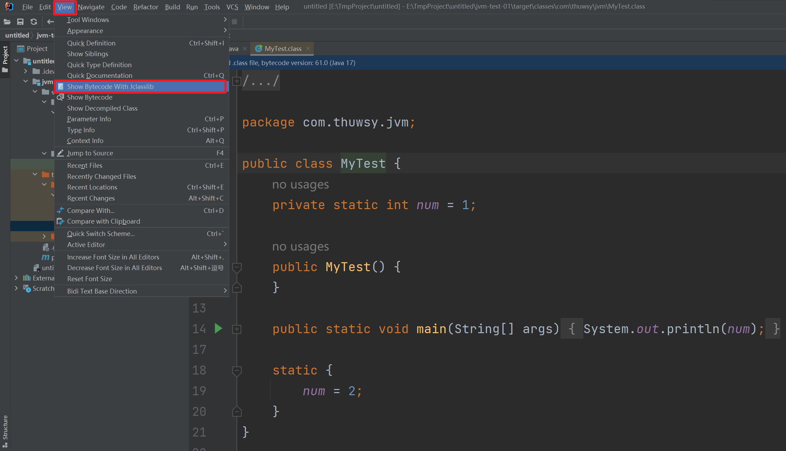
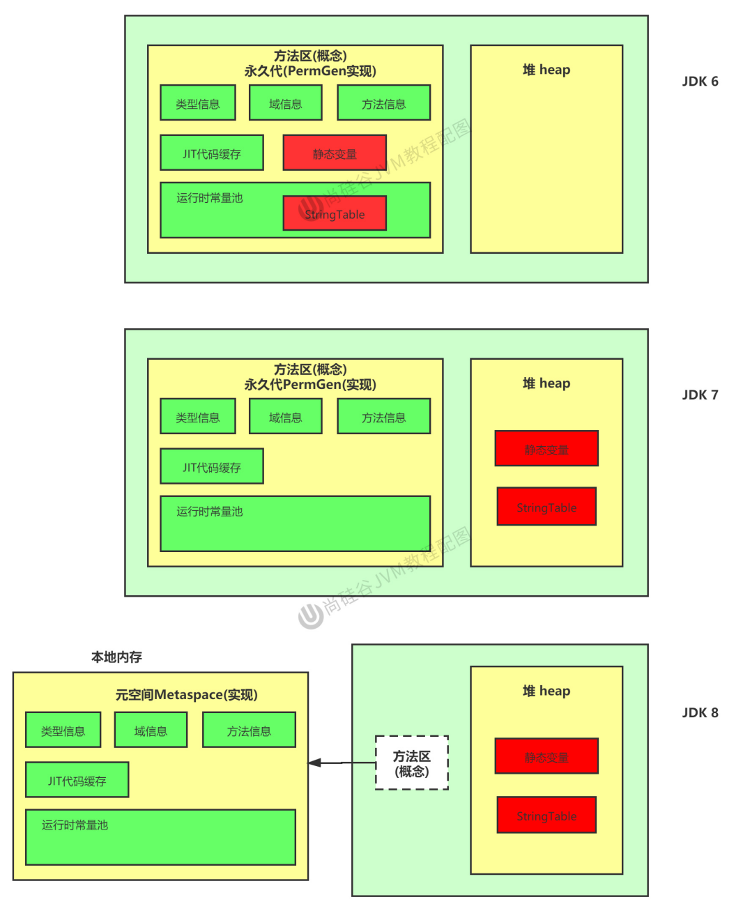

# 第01章_JVM简介

## 1. 简介

### 1.1 虚拟机

虚拟机（Virtual Machine），就是一台虚拟的计算机。它是一款软件，用来执行一系列虚拟计算机指令。虚拟机可以分为系统虚拟机和程序虚拟机：

- Virtual Box，VMware就属于系统虚拟机，它们完全是对物理计算机的仿真，提供了一个可运行完整操作系统的软件平台。
- 程序虚拟机的典型代表就是Java虚拟机，它专门为执行单个计算机程序而设计，在Java虚拟机中执行的指令我们称为Java字节码指令。

### 1.2 Java虚拟机

Java虚拟机（JVM，Java Virtual Machine）是一台执行JVM字节码的虚拟计算机。它就是二进制字节码的运行环境，负责装载字节码到其内部，解释/编译为对应平台上的机器指令执行。

JVM平台的各种语言可以共享Java虚拟机带来的跨平台性、优秀的垃圾回收器、以及可靠的即时编译器。

特点：

- 一次编译，到处运行
- 自动内存管理
- 自动垃圾回收功能

### 1.3 字节码

我们平时说的Java字节码，指的是用Java语言编译成的字节码。准确的说任何能在JVM平台上执行的字节码格式都是一样的，所以应该统称为**JVM字节码**。

不同的编译器，可以编译出相同的字节码文件，字节码文件也可以在不同的JVM上运行。


Java虚拟机根本不关心运行在其内部的程序到底是使用何种编程语言编写的，它只关心**字节码文件**。只要编程语言的编译结果满足并包含Java虚拟机的内部指令集、符号表以及其他的辅助信息，它就是一个有效的字节码文件，就能够被Java虚拟机所识别并装载运行。

> 所以，JVM与Java语言并没有必然的联系，它只与特定的二进制文件格式(Class文件格式)所关联。


### 1.4 字节码文件的查看

我们可以通过安装IDEA的插件，来查看class文件


安装完成后，我们编译完程序得到class文件后，点击View即可显示我们安装的插件来查看字节码文件了



## 2. JVM结构

### 2.1 JVM的位置

JVM是运行在操作系统之上的，它与硬件没有直接的交互


### 2.2 JVM整体架构

HotSpot VM是目前市面上高性能虚拟机的代表作之一，它采用解释器与即时编译器并存的架构。


完整结构如下：


> 执行引擎包含三部分：解释器，即时编译器，垃圾回收器

### 2.3 Java代码执行流程


### 2.4 Java编译器的指令集架构

#### 2.4.1 两种指令集架构

基于栈的指令集架构：

- 设计和实现更简单，适用于资源受限的系统
- 不需要硬件支持，可移植性更好，更好实现跨平台
- 指令集更小，编译器容易实现，但完成一项操作所需要的指令就更多
- 指令流中的指令大部分是零地址指令，其执行过程依赖于操作栈。

基于寄存器的指令集架构：

- 典型的应用是x86的二进制指令集
- 完全依赖硬件，性能优秀，但可移植性差
- 花费更少的指令去完成一项操作
- 在大部分情况下，基于寄存器架构的指令集往往都以一地址指令、二地址指令和三地址指令为主

#### 2.4.2 两种指令集架构举例

同样执行2+3这种逻辑操作，其指令分别如下：

基于栈的计算流程：

```bash
iconst_2 //常量2入栈
istore_1
iconst_3 // 常量3入栈
istore_2
iload_1
iload_2
iadd //常量2/3出栈，执行相加
istore_0 // 结果5入栈
```

基于寄存器的计算流程：

```bash
mov eax,2 //将eax寄存器的值设为1
add eax,3 //使eax寄存器的值加3
```

#### 2.4.3 Java的指令集架构

由于跨平台性的设计，**Java的指令都是根据栈来设计的**。不同平台CPU架构不同，所以不能设计为基于寄存器的。优点是跨平台，指令集小，编译器容易实现，缺点是性能下降，实现同样的功能需要更多的指令。

## 3. JVM生命周期

### 3.1 JVM的启动

Java虚拟机的启动是通过引导类加载器（bootstrap class loader）创建一个初始类（initial class）来完成的，这个类是由虚拟机的具体实现指定的。

### 3.2 JVM的执行

- 一个运行中的Java虚拟机有着一个清晰的任务：执行Java程序
- 程序开始执行时JVM才运行，程序结束时JVM就停止
- 执行一个Java程序时，实际上执行的是一个叫做Java虚拟机的进程

### 3.3 JVM的退出

JVM在以下情况下会退出：

- 程序正常执行结束
- 程序在执行过程中遇到了异常或错误而异常终止
- 由于操作系统出现错误而导致Java虚拟机进程终止
- 某线程调用Runtime类或System类的exit方法，或Runtime类的halt方法，并且Java安全管理器也允许这次exit或halt操作
- 除此之外，JNI（Java Native Interface）规范描述了用JNI Invocation API来加载或卸载Java虚拟机时，Java虚拟机的退出情况

## 4. 三大JVM

### 4.1 HotSpot

**HotSpot是默认的虚拟机**，占有绝对的市场地位。在服务器、桌面到移动端、嵌入式都有应用。名称中的HotSpot指的就是它的热点代码探测技术：

- 通过计数器找到最具编译价值代码，触发即时编译或栈上替换
- 通过编译器与解释器协同工作，在最优化的程序响应时间与最佳执行性能中取得平衡

### 4.2 JRockit

JRockit专注于服务器端应用，它不太关注程序启动的速度，因此JRockit内部不包含解释器实现，全部代码都靠即时编译器编译后执行。JRockit是世界上最快的JVM。

### 4.3 J9

J9是IBM开发的虚拟机，市场定位与HotSpot接近，主要广泛应用于IBM的各种Java产品。

# 第02章_类加载器子系统

## 1. 类加载器子系统的作用

1. 类加载器子系统负责从文件系统或者网络中加载class文件，**class文件在文件开头有特定的文件标识**。
2. **ClassLoader只负责class文件的加载**，至于它是否可以运行，则由Execution Engine决定。
3. 加载的类信息存放于一块称为**方法区**的内存空间。除了类的信息外，方法区中还会存放运行时**常量池信息**，可能还包括字符串字面量和数字常量（这部分常量信息是class文件中常量池部分的内存映射）


- class file存在于本地硬盘上，相当于一个模板，而最终这个模板在执行的时候会加载到JVM中，然后根据这个模板实例化出对象。
- class file加载到JVM中，就被称为DNA元数据模板，存放在方法区。
- 将class file加载到JVM中成为DNA元数据模板，此过程就需要一个运输工具，就是类加载器ClassLoader

## 2. 类的加载过程

### 2.1 加载阶段

1. 通过一个类的全限定名获取定义此类的二进制字节流
2. 将这个字节流所代表的静态存储结构转化为方法区的运行时数据结构
3. **在内存中生成一个代表这个类的java.lang.Class对象**，作为方法区这个类的各种数据的访问入口

**class文件的来源**有以下几种：

- 从本地系统中直接加载
- 通过网络获取，典型场景：Web Applet
- 从zip压缩包中读取，成为日后jar、war格式的基础
- 运行时计算生成，使用最多的是：动态代理技术
- 由其他文件生成，典型场景：JSP应用
- 从专有数据库中提取.class文件，比较少见
- 从加密文件中获取，典型的防Class文件被反编译的保护措施

### 2.2 链接阶段

#### 1、验证(Verify)

- 目的在于确保Class文件的字节流中包含信息符合当前虚拟机要求，保证被加载类的正确性，不会危害虚拟机自身安全。
- 主要包括四种验证，文件格式验证，元数据验证，字节码验证，符号引用验证。
- 如果出现不合法的字节码文件，那么将会验证不通过。

例如：能被JVM识别的字节码文件一定要以CAFEBABE开头(这个数也称为魔数)


#### 2、准备(Prepare)

- 对于非final修饰的静态变量，会为其分配内存并且设置该静态变量的默认初始值，即零值(准备阶段不会对其显式初始化)。
- 对于final修饰的static常量，它的值在编译时就确定了，所以准备阶段会对其显式初始化。
- 对于实例变量，准备阶段并不会为其分配内存和初始化，直到new对象时才会把实例变量随着对象一起分配到堆中。


#### 3、解析(Resolve)

解析就是将常量池内的符号引用转换为直接引用的过程。

- 符号引用就是一组符号来描述所引用的目标。符号引用的字面量形式明确定义在《java虚拟机规范》的class文件格式中。
- 直接引用就是直接指向目标的指针、相对偏移量或一个间接定位到目标的句柄。

解析动作主要针对类或接口、字段、类方法、接口方法、方法类型等。对应常量池中的CONSTANT Class info、CONSTANT Fieldref info、CONSTANT Methodref info等

> 事实上，解析操作往往会伴随着JVM在执行完初始化之后再执行

### 2.3 初始化阶段

初始化阶段就是**执行类构造器方法`<clinit>`的过程**。

- 此方法不需定义，是javac编译器自动收集类中的所有**类变量的赋值**动作和**静态代码块中的语句**合并而来
- 所以当我们类中包含static变量的时候，就会有clinit方法；否则就不会有clinit方法
- **构造器方法中指令按语句在源文件中出现的顺序执行**
- 若该类具有父类，JVM会保证子类的`<clinit>`执行前，父类的`<clinit>`已经执行完毕。因为子类在被加载之前，会先保证父类已经加载完毕。
- 虚拟机必须保证一个类的`<clinit>`方法在多线程下被同步加锁，因为要保证同一个类只能被加载一次。


**注意**：`<clinit>`称为类构造器方法，它和类的构造器并不是一个概念。类的构造器对应到字节码文件中的名称是`<init>`


**例1**：以下代码将输出num的值为2，number的值为10

```java
public class MyTest {
    private static int num = 1;
    static {
        num = 2;
        number = 20;
    }
    private static int number = 10;
    public static void main(String[] args) {
        System.out.println(MyTest.num);
        System.out.println(MyTest.number);
    }
}
```

**原因**：在prepare阶段number被默认初始化为0，而在初始化阶段，由于源文件中的顺序是静态代码块先将number赋值为20，然后静态变量再将number显式赋值为10，所以构造器方法clinit也会按这个顺序执行，最终number的值就是10，我们可以查看字节码文件验证：


**例2**：以下代码将输出2

```java
public class MyTest {
    static class Father {
        public static int a = 1;
        static {
            a = 2;
        }
    }
    static class Son extends Father {
        public static int b = a;
    }
    public static void main(String[] args) {
        System.out.println(Son.b);
    }
}
```

## 3. 类加载器的分类

### 3.1 简介

JVM支持两种类型的类加载器，分别为**引导类加载器**（Bootstrap ClassLoader）和**自定义类加载器**（User-Defined ClassLoader）。

> Java虚拟机规范中定义，所有派生于抽象类ClassLoader的类加载器都属于自定义类加载器。

在程序中我们最常见的类加载器有如下3个：


- 其中Bootstrap ClassLoader是引导类加载器，由C/C++语言实现
- 而其余的都属于自定义类加载器，由Java语言实现

我们在代码中获取类加载器进行测试：

```java
public class MyTest {
    public static void main(String[] args) {
        // 获取系统类加载器
        ClassLoader systemClassLoader = ClassLoader.getSystemClassLoader();
        System.out.println(systemClassLoader); // ...AppClassLoader@63947c6b

        // 获取其上层：扩展类加载器
        ClassLoader extClassLoader = systemClassLoader.getParent();
        System.out.println(extClassLoader); // ...ExtClassLoader@4eec7777

        // 获取其上层：获取不到引导类加载器
        ClassLoader bootstrapClassLoader = extClassLoader.getParent();
        System.out.println(bootstrapClassLoader); // null

        // 获取我们自己的类的类加载器(默认使用系统类加载器进行加载)
        ClassLoader classLoader = MyTest.class.getClassLoader();
        System.out.println(classLoader); // ...AppClassLoader@63947c6b

        // 获取String的类加载器(Java的核心类库中的类是由引导类加载器进行加载的)
        ClassLoader classLoader1 = String.class.getClassLoader();
        System.out.println(classLoader1); // null
    }
}
```

### 3.2 引导类加载器(Bootstrap ClassLoader)

这个类加载器是**使用C/C++语言实现**的，嵌套在JVM内部，也称为启动类加载器。它用来**加载Java的核心库**(即`JAVA_HOME/jre/lib/rt.jar`、`resources.jar`或`sun.boot.class.path`路径下的内容)，用于提供JVM自身需要的类，并且也**用于加载扩展类加载器和系统类加载器**。

- 引导类加载器并不继承自java.lang.ClassLoader，它没有父加载器。
- 出于安全考虑，Bootstrap引导类加载器只加载包名为java、javax、sun等开头的类

### 3.3 扩展类加载器(Extension ClassLoader)

这个类加载器由Java语言编写，由ExtClassLoader类实现，继承于ClassLoader类，其父加载器是引导类加载器。它从`java.ext.dirs系统属性所指定的目录`中加载类库，或从JDK的安装目录的`jre/lib/ext子目录`下加载类库。**如果用户创建的jar放在此目录下，也会自动由扩展类加载器加载**。

### 3.4 系统类加载器(System ClassLoader)

这个类加载器也称为应用程序类加载器，由Java语言编写，由AppClassLoader类实现，继承于ClassLoader类，其父加载器是扩展类加载器。它负责加载环境变量classpath或系统属性java.class.path指定路径下的类库

- 该类加载器是程序中**默认的类加载器**，一般来说，自定义的Java类都是由它来完成加载
- 通过`ClassLoader.getSystemClassLoader()`方法可以获取到该类加载器

### 3.5 用户自定义的类加载器

使用自定义的类加载器的场景：

- 用于隔离加载类
- 用于修改类加载的方式
- 用于扩展加载源
- 防止源码泄漏

用户自定义类加载器实现步骤：

1. 继承抽象类java.lang.ClassLoader，重写其findClass()方法
2. 在编写自定义的类加载器时，如果没有太过复杂的需求，可以直接继承URLClassLoader类，这样就可以避免自己去编写findClass()方法及其获取字节码流的方式，使自定义类加载器编写更加简洁。

### 3.6 ClassLoader补充说明

ClassLoader是一个抽象类，所有的类加载器都继承自ClassLoader（不包括启动类加载器）

**获取ClassLoader的途径**

- 获取当前类的ClassLoader：`clazz.getClassLoader()`
- 获取当前线程上下文的ClassLoader：`Thread.currentThread().getContextClassLoader()`
- 获取系统ClassLoader：`ClassLoader.getSystemClassLoader()`

## 4. 双亲委派机制

### 4.1 工作原理

Java虚拟机对class文件采用的是**按需加载**的方式，也就是说当需要使用该类时才会将它的class文件加载到内存生成Class对象。而且加载某个类的class文件时，Java虚拟机采用的是**双亲委派机制**。

**双亲委派机制的工作原理**：

1. 如果一个类加载器收到了类加载请求，它并不会自己先去加载，而是把这个请求委托给其父加载器去处理；
2. 如果其父加载器还存在父加载器，则进一步向上委托，依次递归，请求最终将到达顶层的启动类加载器；
3. 如果父加载器可以完成类加载的任务，就成功加载并返回；否则，就将加载请求交还给子加载器去处理。


### 4.2 双亲委派机制举例

假如我们在当前包下创建一个java.lang包，并自定义一个名为String类，则当我们在程序中使用java.lang.String时，实际上使用的仍是Java核心类库中的String类，而并不是我们自己定义的String类，这正是因为双亲委派机制：

- 当我们在程序中使用java.lang.String时，系统类加载器就会收到加载请求，根据双亲委派机制，会将请求委托给扩展类加载器，然后扩展类加载器又进一步将请求委托给启动类加载器
- 此时，由于启动类加载器能够加载核心类库，所以它能够加载java.lang.String，于是直接完成类加载任务
- 因此，最终加载的类仍是Java核心类库中的String类

### 4.3 双亲委派机制的优势

（1）避免类的重复加载

（2）保护程序安全，防止核心API被随意篡改

- 自定义类java.lang.String永远不会被加载
- 自定义类java.lang.WsyStart被加载的话会报错，因为启动类加载器会加载java.lang包，而该包下并没有WsyStart类

（3）沙箱安全机制

如上我们自定义的String类，如果给它添加main方法并运行，则会报错，这是因为双亲委派机制会加载核心类库中的String，而核心类库中的String并没有main方法。因此，就保证了对Java核心源代码的保护，这就是沙箱安全机制。

## 5. 其它知识

### 5.1 如何判断两个Class对象是否相同

在JVM中，如果两个Class对象满足以下两个条件：

- 类的完整类名相同(包括包名)
- 加载这个类的ClassLoader相同

则认为这两个Class对象相同，也就是同一个类。

### 5.2 对类加载器的引用

JVM必须知道一个类型是由启动类加载器加载的还是由非启动类加载器加载的。如果一个类是由非启动类加载器加载的，那么JVM会将这个类加载器的一个引用作为类信息的一部分保存在方法区中。当解析一个类到另一个类的引用的时候，JVM需要保证这两个类的类加载器是相同的。

### 5.3 类的使用方式

Java程序对类的使用方式分为：主动使用和被动使用。如果被动使用某个类，则不会导致该类的初始化。

主动使用，分为七种情况：

- 创建类的实例
- 访问某个类或接口的静态变量，或者对该静态变量赋值
- 调用类的静态方法I
- 反射（比如：`Class.forName("com.thuwsy.MyTest")`）
- 初始化一个类的子类
- Java虚拟机启动时被标明为启动类的类
- java.lang.invoke.MethodHandle实例的解析结果REF_getStatic、REF_putStatic、REF_invokeStatic句柄对应的类没有初始化，则初始化

除了以上七种情况，其他使用Java类的方式都被看作是对类的被动使用，都不会导致类的初始化。

# 第03章_运行时数据区概述

## 1. 运行时数据区

JVM内存布局规定了Java在运行过程中内存申请、分配、管理的策略，保证了JVM的高效稳定运行。不同的JVM对于内存的划分方式和管理机制存在着部分差异。通常HotSpot虚拟机的运行时数据区完整图如下：


其中，**堆和堆外内存(永久代/元空间、代码缓存)是多个线程共享的**，即一个进程(对应一个JVM)只有一份，它们随着虚拟机的启动而创建，随着虚拟机的退出而销毁。而**程序计数器、本地方法栈、虚拟机栈是每个线程独有的**，它们随着线程的开始而创建，随着线程的结束而销毁。


> 注意：每个JVM只有一个java.lang.Runtime实例，即运行时环境，相当于内存结构中的运行时数据区。

| 运行时数据区 | 是否存在OOM | 是否存在GC |
| ------------| -----------| ---------- |
| 程序计数器   | 否         | 否         |
| 虚拟机栈     | 是         | 否         |
| 本地方法栈   | 是         | 否         |
| 方法区       | 是         | 是         |
| 堆          | 是         | 是         |


## 2. 线程

JVM允许一个应用有多个线程并行地执行。在Hotspot JVM里，每个线程都与操作系统的本地线程直接映射。当一个Java线程准备好后，此时一个操作系统的本地线程也同时创建；Java线程执行终止后，本地线程也会回收。

操作系统负责将所有线程的安排调度到任何一个可用的CPU上，一旦本地线程初始化成功，它就会调用Java线程中的run()方法。

JVM运行后，后台可以看到很多线程在运行(不包括main线程及这个main线程自己创建的线程)，这些后台运行的JVM系统线程主要有以下几个：

- 虚拟机线程：这种线程的操作是需要JVM达到安全点才会出现。这些操作必须在不同的线程中发生的原因是他们都需要JVM达到安全点，这样堆才不会变化。这种线程的执行类型包括"stop-the-world"的垃圾收集，线程栈收集，线程挂起以及偏向锁撤销。
- 周期任务线程：这种线程是时间周期事件的体现（比如中断），它们一般用于周期性操作的调度执行。
- GC线程：这种线程对在JVM里不同种类的垃圾收集行为提供了支持。
- 编译线程：这种线程在运行时会将字节码编译成本地代码。
- 信号调度线程：这种线程接收信号并发送给JVM，在它内部通过调用适当的方法进行处理。


# 第04章_程序计数器

JVM中的程序计数器（Program Counter Register）中，Register的命名源于CPU的寄存器。但它并非是广义上所指的物理寄存器，JVM中的PC寄存器是对物理PC寄存器的一种**抽象模拟**。

**作用**：PC寄存器用于存储下一条指令的地址。执行引擎会根据该地址去读取下一条指令。

**特点**：

- 程序计数器是一块很小的内存空间，也是运行速度最快的存储区域。
- 每个线程都有它自己的程序计数器，所以程序计数器是线程私有的，生命周期与线程的生命周期保持一致。
- 任何时间一个线程都只有一个方法在执行，也就是所谓的当前方法。程序计数器会存储当前线程正在执行的Java方法的JVM指令地址；如果是在执行native方法，则是未指定值（undefined）。
- 它是程序控制流的指示器，分支、循环、跳转、异常处理、线程恢复等基础功能都需要依赖程序计数器完成。
- 字节码解释器工作时就是通过改变程序计数器的值来选取下一条需要执行的字节码指令。

> 注意：**程序计数器不存在垃圾回收问题，也不存在OOM问题(OutOfMemoryError)**，即不会发生内存溢出。


**PC寄存器被设定为线程私有的原因**：一个CPU会不停地做不同线程的调度和切换，为了准确记录各个线程正在执行的当前字节码指令地址，最好的办法就是为每个线程都分配一个PC寄存器，这样就不会出现相互干扰的情况。


# 第05章_虚拟机栈

## 1. 虚拟机栈概述

### 1.1 JVM中栈和堆的区别

由于跨平台性的设计，Java的指令都是根据栈来设计的。不同平台CPU架构不同，所以不能设计为基于寄存器的。

JVM中栈与堆的区别：**栈是运行时的单位，而堆是存储的单位**

- 栈解决的是程序的运行问题，即程序如何执行、如何处理数据
- 堆解决的是数据存储的问题，即数据怎么放、放在哪里

### 1.2 虚拟机栈的作用和特点

Java虚拟机栈（Java Virtual Machine Stack），早期也叫Java栈。每个线程在创建时都会创建一个虚拟机栈，其内部保存一个个的栈帧（Stack Frame），对应着一次次的Java方法调用。虚拟机栈的生命周期和线程一致，也就是线程结束了，该虚拟机栈也销毁了。

**作用**：主管Java程序的运行，它保存方法的局部变量和部分结果，并参与方法的调用和返回。

**特点**：栈是一种快速有效的分配存储方式，访问速度仅次于程序计数器。JVM直接对Java栈的操作只有两个：

- 方法开始执行时入栈
- 方法执行结束后出栈

> 注意：对于栈来说**不存在垃圾回收问题，但是栈存在OOM的问题**

### 1.3 虚拟机栈中可能出现的异常

Java虚拟机规范允许Java栈的大小是动态的或者是固定不变的。

如果采用固定大小的Java虚拟机栈，那每一个线程的Java虚拟机栈容量可以在线程创建的时候独立选定。如果线程请求分配的栈容量超过Java虚拟机栈允许的最大容量，Java虚拟机将会抛出一个**StackOverflowError异常**。

如果Java虚拟机栈可以动态扩展，并且在尝试扩展的时候无法申请到足够的内存，或者在创建新的线程时没有足够的内存去创建对应的虚拟机栈，那Java虚拟机将会抛出一个 **OutOfMemoryError异常**。

**补充**：我们可以使用参数`-Xss`选项来设置线程的最大栈空间，栈的大小直接决定了函数调用的最大可达深度。如下，将虚拟机栈大小设置为1024KB

```shell
-Xss1024k
```

## 2. 栈的存储单位-栈帧

### 2.1 栈帧

每个线程都有自己的栈，栈中的数据都是以**栈帧（Stack Frame）的格式**存在。在这个线程上**正在执行的每个方法都各自对应一个栈帧**。栈帧是一个内存区块，是一个数据集，维系着方法执行过程中的各种数据信息。

在一条活动线程中，一个时间点上，只会有一个活动的栈帧。即只有当前正在执行的方法的栈帧（栈顶栈帧）是有效的，这个栈帧被称为当前栈帧（Current Frame），与当前栈帧相对应的方法就是当前方法（Current Method），定义这个方法的类就是当前类（Current Class）。

执行引擎运行的所有字节码指令**只针对当前栈帧进行操作**。如果在该方法中调用了其他方法，对应的新的栈帧会被创建出来，放在栈的顶端，成为新的当前帧。

### 2.2 栈运行原理

不同线程中所包含的栈帧是不能相互引用的。

如果当前方法A调用了另一个方法B，则当方法B返回时，对应的当前栈帧会传回此方法的执行结果给前一个栈帧，接着虚拟机就会丢弃当前栈帧，使得前一个栈帧重新成为当前栈帧。

Java方法有两种方法返回的方式，一种是正常的方法返回，即使用return指令；另外一种是抛出异常。不管使用哪种方式，都会导致栈帧被弹出。

### 2.3 栈帧的内部结构

每个栈帧中存储着：

- 局部变量表（Local Variables）
- 操作数栈（Operand Stack），也称为表达式栈
- 动态链接（Dynamic Linking），也称为指向运行时常量池的方法引用
- 方法返回地址（Return Address），也称为方法正常退出或者异常退出的定义
- 一些附加信息

> 栈帧的大小主要由**局部变量表**和**操作数栈**决定。动态链接、方法返回地址、一些附加信息通常也合称为**帧数据区**。

## 3. 局部变量表

### 3.1 简介

局部变量表，也称为局部变量数组或本地变量表。它是一个**数字数组**，**主要用于存储方法参数和定义在方法体内的局部变量**。这些数据类型包括各类基本数据类型、对象引用（reference），以及ReturnAddress类型。

由于局部变量表是建立在线程的栈上，是线程的私有数据，因此**不存在数据安全问题**。

局部变量表所需的容量大小是**在编译期确定下来的**，并保存在方法的Code属性的maximum local variables数据项中。**在方法运行期间是不会改变局部变量表的大小的**。

局部变量表中的变量只在当前方法调用中有效。当方法调用结束后，随着方法栈帧的销毁，局部变量表也会随之销毁。

### 3.2 Slot

局部变量表，最基本的存储单元是Slot（变量槽），参数值都是存放在Slot中，起始索引为0。

局部变量表中存放编译期可知的各种基本数据类型（8种），引用类型（reference），以及ReturnAddress类型的变量。

其中，32位及以内的类型只占用一个slot（包括ReturnAddress类型），64位的类型（1ong和double）占用两个slot。

> byte、short、char在存储前被转换为int
> 
> boolean也被转换为int，0表示false，非0表示true

JVM会为局部变量表中的每一个Slot都分配一个访问索引，通过这个索引即可成功访问到局部变量表中指定的局部变量值。

当一个实例方法被调用的时候，它的方法参数和方法体内部定义的局部变量将会按照**声明的顺序**被复制到局部变量表中的Slot上。

注意：如果当前帧是由构造器或者实例方法创建的，那么**该对象引用this将会存放在index为0的slot处**，其余的参数按照参数表顺序继续排列。

举例：

```java
public void test01(Date date, String name) {
    double weight = 110;
    char gender = '男';
}
```


> 如图，double类型的变量占有2个槽位

**Slot的重复利用**

栈帧中的局部变量表中的槽位是可以重用的，如果一个局部变量过了其作用域，那么在其作用域之后声明的新的局部变就很有可能会复用过期局部变量的槽位，从而达到节省资源的目的。

举例：

```java
public void test02() {
    int a = 0;
    {
        int b = 0;
        a += b;
    }
    int c = 0;
}
```


### 3.3 局部变量与成员变量的对比

**变量的分类**

（1）按数据类型分：基本数据类型、引用数据类型

（2）按类中声明的位置分：成员变量（类变量，实例变量）、局部变量

- 类变量：在linking的prepare阶段，会给类变量赋默认值；在初始化阶段会给类变量显式赋值
- 实例变量：随着对象创建，会在堆空间中分配实例变量空间，并进行默认赋值
- 局部变量：在使用前必须人为进行显式赋值，不然编译不通过

### 3.4 补充

在栈帧中，与**性能调优**关系最为密切的部分就是局部变量表。在方法执行时，虚拟机使用局部变量表完成方法的传递。

局部变量表中的变量也是重要的**垃圾回收根节点**，只要被**局部变量表中直接或间接引用的对象都不会被回收**。

## 4. 操作数栈

### 4.1 简介

操作数栈，主要用于**保存计算过程的中间结果**，同时作为计算过程中变量临时的存储空间。

在方法执行过程中，会根据字节码指令往**操作数栈**中写入数据或提取数据，即入栈（push）和 出栈（pop）。例如，一些字节码指令将值压入操作数栈，一些字节码指令将操作数取出栈、使用后再把结果压入栈。

- 操作数栈就是JVM执行引擎的一个**工作区**，当一个方法刚开始执行的时候，一个新的栈帧也会随之被创建出来，此时这个方法的操作数栈是空的。
- 每一个操作数栈都会拥有一个明确的栈深度用于存储数值，其所需的**最大深度在编译期就定义好了**，保存在方法的Code属性中，为max_stack的值。
- 操作数栈中的元素可以是任意的Java数据类型：32bit的类型占用一个栈单位深度，64bit的类型占用两个栈单位深度

**注意**：

1. 如果被调用的方法带有返回值的话，**其返回值将会被压入当前栈帧的操作数栈中**，并更新PC寄存器中下一条需要执行的字节码指令的地址。
2. 操作数栈中元素的数据类型必须与字节码指令的序列严格匹配，这由编译器在编译期间进行验证，同时在类加载过程中的类检验阶段的数据流分析阶段要再次验证。

> 我们说Java虚拟机的**解释引擎是基于栈的执行引擎**，其中的栈指的就是**操作数栈**

### 4.2 栈顶缓存技术

基于栈式架构的虚拟机使用零地址指令更加紧凑，但完成一项操作的时候必然需要使用更多的入栈和出栈指令，这同时也就意味着需要更多的指令分派次数和内存读/写次数。

由于操作数是存储在内存中的，因此频繁地执行内存读/写操作必然会影响执行速度。为了解决这个问题，HotSpot JVM的设计者们提出了**栈顶缓存技术**（ToS，Top-of-Stack Cashing），将栈顶元素全部**缓存在物理CPU的寄存器中**，以此降低对内存的读/写次数，提升执行引擎的执行效率。

## 5. 动态链接

### 5.1 简介

动态链接，也称为指向运行时常量池的方法引用。每一个栈帧内部都包含一个指向**运行时常量池**中**该栈帧所属方法的引用**，包含这个引用的目的就是为了支持当前方法的代码能够实现**动态链接**（Dynamic Linking）。

在Java源文件被编译到字节码文件中时，所有的变量和方法引用都作为符号引用（Symbolic Reference）保存在class文件的常量池里。比如，描述一个方法调用了另外的其他方法时，就是通过常量池中指向方法的符号引用来表示的，那么**动态链接的作用就是为了将这些符号引用转换为调用方法的直接引用**。

> 说明：因为在不同的方法，都可能调用常量或者方法，所以只需要在运行时常量池中存储一份即可，节省了空间。这就是运行时常量池存在的意义。

### 5.2 方法调用的原理

在JVM中，将符号引用转换为调用方法的直接引用与方法的绑定机制相关。

#### 5.2.1 静态链接与动态链接

当一个字节码文件被装载进JVM内部时，如果被调用的**目标方法在编译期可知，且运行期保持不变**时，这种情况下将调用方法的符号引用转换为直接引用的过程称之为**静态链接**。

如果**被调用的方法在编译期无法被确定下来**，也就是说，只能够在程序运行期将调用的方法的符号转换为直接引用，由于这种引用转换过程具备动态性，因此被称之为**动态链接**。

#### 5.2.2 早期绑定与晚期绑定

静态链接与动态链接，对应的方法的绑定机制分别为早期绑定（Early Binding）和晚期绑定（Late Binding）。**绑定是一个字段、方法或者类在符号引用被替换为直接引用的过程，这仅仅发生一次**。

**早期绑定**就是指被调用的目标方法如果在编译期可知，且运行期保持不变时，即可将这个方法与所属的类型进行绑定，这样一来，由于明确了被调用的目标方法究竟是哪一个，因此也就可以使用静态链接的方式将符号引用转换为直接引用。

如果被调用的方法在编译期无法被确定下来，只能够在程序运行期根据实际的类型绑定相关的方法，这种绑定方式也就被称之为**晚期绑定**。

#### 5.2.3 虚方法和非虚方法

Java中任何一个普通的方法其实都具备虚方法的特征，它们相当于C++语言中的虚函数（C++中则需要使用关键字virtual来显式定义）。如果在Java程序中不希望某个方法拥有虚函数的特征时，则可以使用关键字final来标记这个方法。

如果方法在编译期就确定了具体的调用版本，且这个版本在运行时是不可变的，这样的方法称为**非虚方法**。

**静态方法、私有方法、final方法、实例构造器、父类方法都是非虚方法。其他方法称为虚方法**。

#### 5.2.4 虚拟机中的方法调用指令

**普通调用指令**：

- invokestatic：调用静态方法，解析阶段确定唯一方法版本
- invokespecial：调用`<init>`方法、私有及父类方法，解析阶段确定唯一方法版本
- invokevirtual：调用虚方法(实际调用的方法未必真的是虚方法，如被final修饰就是非虚方法)
- invokeinterface：调用接口方法

> 其中invokestatic指令和invokespecial指令调用的方法都是非虚方法，而剩下两个指令调用的方法**如果被final修饰**，就是非虚方法，否则就是虚方法。
>
> 这四条指令固化在虚拟机内部，方法的调用执行不可人为干预，而下面的invokedynamic指令则支持由用户确定方法版本。

**动态调用指令**：

- invokedynamic：动态解析出需要调用的方法然后执行

该指令是Java7中才增加的，这是Java为了实现动态类型语言支持而做的一种改进。但是在Java7中并没有提供直接生成invokedynamic指令的方法，需要借助ASM这种底层字节码工具来产生invokedynamic指令。直到Java8有了Lambda表达式，就可以**由Lambda表达式直接生成invokedynamic指令**。

> 补充：动态类型语言和静态类型语言两者的区别就在于对类型的检查是在编译期还是在运行期，满足前者就是静态类型语言，反之是动态类型语言。即静态类型语言是判断变量自身的类型信息；动态类型语言是判断变量值的类型信息，变量没有类型信息，变量值才有类型信息。
>
> **Java是一个静态类型语言**，但随着invokedynamic指令的出现，它也有了动态类型语言的特征(因为Lambda表达式生成的对象类型需要在运行期确定)。

#### 5.2.5 方法重写的本质

1. 找到操作数栈顶的第一个元素所执行的对象的实际类型，记作C
2. 如果在类型C中找到与常量中的描述符和简单名称都相符的方法，则进行访问权限校验，如果通过则返回这个方法的直接引用，查找过程结束；如果权限校验不通过，则返回java.lang.IllegalAccessError异常。
3. 否则，按照继承关系从下往上依次对C的各个父类进行第2步的搜索和验证过程
4. 如果始终没有找到合适的方法，则抛出java.lang.AbstractMethodError异常。

#### 5.2.6 虚方法表

在面向对象的编程中，会很频繁的使用到动态分派，如果在每次动态分派的过程中都要重新在类的方法元数据中搜索合适的目标的话就可能影响到执行效率。因此，为了提高性能，JVM采用**在类的方法区建立一个虚方法表**（virtual method table）来代替查找。

> 非虚方法不会出现在虚方法表中

每个类中都有一个虚方法表，表中存放着各个方法的实际入口。虚方法表会在类加载的**链接阶段**被创建并开始初始化，类的变量初始值准备完成之后，JVM会把该类的方法表也初始化完毕。


如上图所示，如果类中重写了方法，那么调用的时候，就会直接在虚方法表中查找，否则将会直接连接到Object的方法中。

## 6. 方法返回地址

方法返回地址，用于存放**调用该方法的PC寄存器的值**。

一个方法的结束，有两种方式：

**（1）正常执行完成**

执行引擎遇到任意一个方法返回的字节码指令（return），会有返回值传递给上层的方法调用者，简称**正常完成出口**。

具体的字节码返回指令需要根据方法返回值的实际数据类型而定：

- ireturn：当返回值是boolean，byte，char，short，int类型时使用
- lreturn：当返回值是long类型时使用
- freturn：当返回值是float类型时使用
- dreturn：当返回值是double类型时使用
- areturn：当返回值是引用类型时使用
- return：对于返回值是void的方法、实例初始化方法、类和接口的初始化方法，会使用该字节码指令返回

**（2）出现未处理的异常，非正常退出**

在方法执行过程中遇到异常，并且这个异常没有在方法内进行处理，也就是只要在本方法的异常表中没有搜索到匹配的异常处理器，就会导致方法退出，简称**异常完成出口**。

> 方法执行过程中，抛出异常时的异常处理，存储在一个异常处理表，方便在发生异常的时候找到处理异常的代码。

**总结**

本质上，方法的退出就是当前栈帧出栈的过程。此时，需要恢复上层方法的局部变量表、操作数栈、将返回值压入调用者栈帧的操作数栈、设置PC寄存器值等，让调用者方法继续执行下去。

无论通过哪种方式退出，在方法退出后都返回到该方法被调用的位置。方法正常退出时，**返回地址就是当初调用该方法的PC寄存器的值**，即调用该方法的指令的下一条指令的地址。而通过异常退出的，**返回地址是要通过异常表来确定**，栈帧中一般不会保存这部分信息。

> 正常完成出口和异常完成出口的区别在于：通过异常完成出口退出的不会给它的上层调用者产生任何的返回值。

## 7. 一些附加信息

栈帧中还允许携带与Java虚拟机实现相关的一些附加信息。例如：对程序调试提供支持的信息。

# 第06章_本地方法栈

## 1. 本地方法接口

一个native method是这样一个Java方法：**该方法的实现由非Java语言实现**，比如C。在定义一个native method时，并不提供实现体，因为其实现体是由非java语言在外面实现的。

本地方法接口的作用是融合不同的编程语言为Java所用，它的初衷是融合C/C++程序。

> 注意：标识符native可以与其它java标识符连用，但是abstract除外

**使用native method的原因**

- 有时Java应用需要与Java外面的环境交互，这是本地方法存在的主要原因
- 通过使用本地方法，我们得以用Java与实现了jre的与底层操作系统交互，甚至JVM的一些部分就是用c写的
- Sun公司的解释器就是用C实现，所以通过native method可以像C一样与外部交互，性能更高

> 目前我们自定义使用native method的情况越来越少了，除非是与硬件有关的应用。

## 2. 本地方法栈

Java虚拟机栈于管理Java方法的调用，而**本地方法栈用于管理本地方法的调用**。

本地方法栈，也是线程私有的，同样允许被实现成固定长度或者可动态扩展的长度，所以同样可能产生StackOverflowError和OutOfMemoryError。

如果要调用native method，就会在在本地方法栈中登记native方法，然后在Execution Engine执行时加载本地方法库。

**当某个线程调用一个本地方法时，它就进入了一个全新的并且不再受虚拟机限制的世界，它和虚拟机拥有同样的权限**：

- 本地方法可以通过本地方法接口来访问虚拟机内部的运行时数据区
- 本地方法可以直接使用本地处理器中的寄存器
- 本地方法可以直接从本地内存的堆中分配任意数量的内存

> 注意：并不是所有的JVM都支持本地方法。如果JVM产品不打算支持native方法，也可以无需实现本地方法栈。

# 第07章_堆

## 1. 概述

### 1.1 堆

一个JVM实例只存在一个堆内存，堆也是Java内存管理的核心区域。Java堆区在JVM启动的时候即被创建，其空间大小也就确定了，是JVM管理的最大一块内存空间。注意堆内存的大小是可以调节的。

《Java虚拟机规范》规定：堆可以处于物理上不连续的内存空间中，但在逻辑上它应该被视为连续的。

> 注意：所有的线程共享Java堆，但在堆中也存在一部分线程私有的缓冲区，称之为TLAB(Thread Local Allocation Buffer)。

几乎所有的对象实例以及数组都在运行时分配在堆上，而在栈帧中保存引用，这个引用指向对象或数组在堆中的位置。

> 注意：在少部分情况下，一些对象可能会被分配在栈上，而不是堆上。

在方法结束、弹出栈帧后，堆中的对象不会马上被移除，而是会在在垃圾收集的时候再判断是否移除。

**注意**：堆是GC（Garbage Collection，垃圾收集器）执行垃圾回收的重点区域。

### 1.2 堆和方法区的内存划分

Java 7及之前逻辑上分为三部分：新生区+养老区+永久区

- 新生区(Young Generation Space)，它又被划分为Eden区和Survivor区
- 养老区(Tenure generation space)
- 永久区(Permanent Space)

Java 8及之后逻辑上分为三部分：新生区+养老区+元空间
- 新生区
- 养老区
- 元空间(Meta Space)

> 其他称呼：
> - 新生区=新生代=年轻代
> - 养老区=老年区=老年代
> - 永久区=永久代

**注意**：新生区和养老区属于堆空间，而永久区、元空间属于方法区。


### 1.3 设置堆空间大小

Java堆区用于存储Java对象实例，堆的大小在JVM启动时就已经设定好了，可以通过选项`-Xmx`和`-Xms`来进行设置

- `-Xms`用于表示堆区的起始内存，等价于`-XX:InitialHeapSize`
- `-Xmx`则用于表示堆区的最大内存，等价于`-XX:MaxHeapSize`

一旦堆区中的内存大小超过`-Xmx`所指定的最大内存时，将会抛出OutOfMemoryError异常(OOM)。

> 注意：通常会将-Xms和-Xmx两个参数配置相同的值，其目的是**为了能够在Java垃圾回收机制清理完堆区后不需要重新分隔计算堆区的大小，从而提高性能**。

默认情况下：

- 初始内存大小是电脑物理内存大小/64
- 最大内存大小是电脑物理内存大小/4

### 1.4 年轻代与老年代

存储在JVM中的Java对象可以被划分为两类：

- 一类是生命周期较短的瞬时对象，这类对象的创建和消亡都非常迅速。这类对象会被放入年轻代。
- 另外一类对象的生命周期却非常长，在某些极端的情况下还能够与JVM的生命周期保持一致。这类对象会被放入老年代。

其中年轻代又可以划分为Eden空间、Survivor0空间和Survivor1空间（有时也叫做from区、to区）。

> 默认情况下，新生代与老年代的大小比例是1:2，而新生代中Eden与Survivor0、Survivor1的大小比例是8:1:1


几乎所有的Java对象都是在Eden区被new出来的（有些大的对象在Eden区无法存储时候，将直接进入老年代）。绝大部分的Java对象的销毁都在新生代进行了。


## 2. 对象分配过程

### 2.1 对象分配的整体流程

为新对象分配内存是一件非常严谨和复杂的任务，JVM的设计者们不仅需要考虑内存如何分配、在哪里分配等问题，并且由于内存分配算法与内存回收算法密切相关，所以还需要考虑GC执行完内存回收后是否会在内存空间中产生内存碎片。

对象分配的整体流程如下：


1. new的对象一般都先存放在Eden区
2. 如果Eden区满了后再创建对象，就会触发Minor GC，将**新生代**(包括Eden区和Survivor区)中不再被其他对象所引用的对象进行销毁。然后将**新生代**中剩余的存活对象都放到空的那个Survivor区(一般称之为Survivor To区)，并让这些对象的年龄计数器加1。而新创建的对象会被继续放到Eden区。
3. 当对象的年龄计数器达到阈值15时，再次加1就会触发Promotion晋升，即将其从新生代转移存放到老年代中。
4. 当老年代空间不足时，将触发Full GC。如果执行了Full GC之后，发现依然无法进行对象的保存，就会产生OOM异常。

**注意**：在Eden区满了的时候，才会触发Minor GC；而幸存者区满了后，不会触发Minor GC，而是会触发一些特殊的规则，即可能直接晋升到老年代。

**所有可能的特殊情况**：


> 总结：
> - 针对幸存者s0、s1区：复制之后有交换，谁空谁是to
> - 关于垃圾回收：频繁在新生区收集，很少在老年代收集，几乎不在永久代/元空间进行收集
> - 新生代采用复制算法的目的是为了减少内存碎片

### 2.2 Minor GC、Major GC、Full GC

JVM在进行GC时，并非每次都对上面三个内存区域(新生代、老年代、方法区)一起回收，大部分时候回收的都是新生代。针对Hotspot VM的实现，它里面的GC按照回收区域又分为两大种类型：一种是部分收集，一种是整堆收集。

**部分收集(Partial GC)**：不是完整收集整个Java堆的垃圾收集。其中又分为：

- 新生代收集（Minor GC/Young GC）：只是新生代的垃圾收集
- 老年代收集（Major GC/Old GC）：只是老年代的垃圾收集
  - 目前，只有CMS GC会有单独收集老年代的行为。
  - 注意，在老年代空间不足时将触发Full GC，即对新生代、老年代、方法区一起进行垃圾回收，其中专门针对老年代的垃圾收集称为Major GC
- 混合收集（Mixed GC）：收集整个新生代以及部分老年代的垃圾收集
  - 目前，只有G1 GC会有这种行为

**整堆收集(Full GC)**：收集整个java堆和方法区的垃圾收集。

#### 1、Minor GC

当Eden空间不足时，就会触发Minor GC，每次Minor GC会清理年轻代的内存。

因为Java对象大多都具备**朝生夕灭**的特性，所以Minor GC非常频繁，一般回收速度也比较快。

Minor GC会引发STW(stop the world)，暂停其它用户的线程，等垃圾回收结束，用户线程才恢复运行。

#### 2、Major GC

出现了Major GC，经常会伴随至少一次的Minor GC（但非绝对的，在Parallel Scavenge收集器的收集策略里就有直接进行Major GC的策略选择过程）

也就是在老年代空间不足时，会先尝试触发Minor GC。如果之后空间还不足，则触发Major GC。如果Major GC后内存还不足，就产生了OOM。

Major GC的速度一般会比Minor GC慢10倍以上，STW的时间更长。

#### 3、Full GC

触发Full GC执行的情况有如下五种：

- 调用`System.gc()`时，会建议系统执行Full GC，但不是必然执行的
- 老年代空间不足
- 方法区空间不足
- 通过Minor GC后进入老年代的平均大小大于老年代的可用内存
- 由Eden区和Survivor From区向Survivor To区复制时，对象大小大于Survivor To区的可用内存，就会把这些对象转存到老年代。如果此时老年代的可用内存小于这些对象的大小，也会触发Full GC

> Full GC是开发或调优中尽量要避免的，因为其STW时间很长

### 2.3 堆空间分代思想

分代的唯一理由就是**优化GC性能**。如果没有分代，那所有的对象都在一块，GC的时候要找到哪些对象没用，这样就会对堆的所有区域进行扫描。而事实上很多对象都是`朝生夕死`的，如果分代的话，把新创建的对象放到某一地方，当GC的时候先把这块存储`朝生夕死`对象的区域进行回收，这样就会腾出很大的空间出来。

### 2.4 对象分配策略补充

#### 1、动态对象年龄判断

如果Survivor区中相同年龄的所有对象大小的总和大于Survivor空间的一半，那么年龄大于或等于该年龄的对象可以直接进入老年代，无须等到阈值中要求的年龄。

#### 2、空间分配担保

在发生Minor GC之前，虚拟机会检查**老年代最大可用的连续空间是否大于新生代所有对象占用的总空间**。

- 如果大于，则此次Minor GC是安全的，就会进行Minor GC
- 如果小于，则虚拟机会继续检查**老年代最大可用连续空间是否大于历次晋升到老年代的对象的平均大小**。
  - 如果大于，则会进行Minor GC，即使这次Minor GC是有风险的
  - 如果小于，就直接进行Full GC。


## 3. TLAB

### 3.1 简介

堆空间并不全是线程共享的，因为它会划分出一块TLAB区域。TLAB：Thread Local Allocation Buffer，即**为每个线程单独分配的一个缓冲区**，所以是线程私有的，注意**TLAB包含在Eden区之内**，一般仅占用整个Eden空间的百分之一。

由于对象实例的创建在JVM中非常频繁，因此在并发环境下从线程共享的堆区中划分内存空间来分配对象是线程不安全的。为了避免多个线程在共享堆区中操作同一地址，就需要使用加锁等机制，进而会影响内存分配的速度。

所以，**多线程同时分配内存时，使用TLAB可以避免线程安全问题，同时还能够提升内存分配的吞吐量**，我们将这种内存分配方式称之为**快速分配策略**。

### 3.2 TLAB分配过程

尽管不是所有的对象实例都能够在TLAB中成功分配内存，但JVM确实是**将TLAB作为内存分配的首选**。一旦对象在TLAB空间分配内存失败时，JVM就会尝试着通过**使用加锁机制**确保数据操作的原子性，从而在Eden空间中分配内存。


## 4. 堆空间的参数设置

- `-XX:+PrintFlagsInitial`：查看所有参数的默认初始值
- `-XX:+PrintFlagsFinal`：查看所有参数的最终值（可能会存在修改，不再是初始值）
- `-Xms`：初始堆空间内存（默认为物理内存的1/64）
- `-Xmx`：最大堆空间内存（默认为物理内存的1/4）
- `-Xmn`：设置新生代的大小（初始值及最大值）
- `-XX:NewRatio`：配置新生代与老年代在堆结构的占比
- `-XX:SurvivorRatio`：设置新生代中Eden和S0/S1空间的比例
- `-XX:MaxTenuringThreshold`：设置新生代垃圾的最大年龄
- `-XX:+PrintGCDetails`：输出详细的GC处理日志

## 5. 逃逸分析

问题：堆是分配对象存储的唯一选择吗？

随着JIT编译器的发展与**逃逸分析**技术逐渐成熟，栈上分配、标量替换优化技术将会导致一些微妙的变化，所以对象未必是全分配在堆上的。

如果经过逃逸分析（Escape Analysis）后发现，一个对象并**没有逃逸出方法**的话，那么就可能被优化成栈上分配或者标量替换。这样就无需在堆上分配内存，也无须进行垃圾回收了。这也是最常见的堆外存储技术。

**逃逸分析**是一种可以有效减少Java程序中同步负载和内存堆分配压力的跨函数全局数据流分析算法。通过逃逸分析，Java Hotspot编译器能够分析出一个新的对象的引用的使用范围从而决定是否要将这个对象分配到堆上。逃逸分析的基本行为就是**分析对象动态作用域**：

- 当一个对象在方法中被定义后，对象只在方法内部使用，则认为没有发生逃逸。
- 当一个对象在方法中被定义后，它被外部方法所引用，则认为发生逃逸。

> 常见的发生逃逸的情况：给成员变量赋值、作为方法返回值、实例引用传递等。

**举例**：以下代码中sb发生了逃逸

```java
public static StringBuffer createStringBuffer(String s1, String s2) {
    StringBuffer sb = new StringBuffer();
    sb.append(s1);
    sb.append(s2);
    return sb;
}
```

如果想要sb不发生逃逸，可以修改为

```java
public static String createStringBuffer(String s1, String s2) {
    StringBuffer sb = new StringBuffer();
    sb.append(s1);
    sb.append(s2);
    return sb.toString();
}
```

> 注意：JDK 1.7之后，HotSpot就默认开启了逃逸分析。因此，在开发中如果我们能使用局部变量，就尽量不要在方法外定义。

## 6. 基于逃逸分析的代码优化

使用逃逸分析，编译器可以对代码做如下优化：

- 栈上分配
- 同步省略
- 标量替换

### 6.1 栈上分配

JIT编译器根据逃逸分析的结果，发现如果一个对象并没有逃逸出方法的话，就可能被优化成栈上分配。分配完成后，继续在调用栈内执行，最后线程结束，栈空间被回收，局部变量对象也被回收。这样就无须进行垃圾回收了。

**注意**：HotSpot虚拟机**不支持栈上分配**，即不会把对象存储在栈上。对于没有逃逸的对象，HotSpot会采用**标量替换**，然后再存储在栈上。

### 6.2 同步省略

在动态编译同步块的时候，JIT编译器可以借助逃逸分析来判断同步块所使用的锁对象是否只能够被一个线程访问而没有被发布到其他线程。如果没有，那么JIT编译器在编译这个同步块的时候就会取消对这部分代码的同步，这样就能大大提高并发性和性能。这个取消同步的过程就叫**同步省略**，也叫**锁消除**。

例如下面的代码

```java
public void f() {
    Object hellis = new Object();
    synchronized(hellis) {
        System.out.println(hellis);
    }
}
```

代码中对hellis这个对象加锁，但是hellis对象的生命周期只在f()方法中，并不会被其他线程所访问到，所以在JIT编译阶段就会被优化掉，优化成：

```java
public void f() {
    Object hellis = new Object();
	System.out.println(hellis);
}
```

### 6.3 标量替换

**标量**（Scalar）是指一个无法再分解成更小数据的数据，Java中的基本数据类型就是标量。相对地，那些还可以分解的数据叫做**聚合量**（Aggregate），Java中的对象就是聚合量。

在JIT阶段，如果经过逃逸分析，发现一个对象不会被外界访问的话，那么经过JIT优化，就会把这个对象拆解成若干个它的成员变量来代替，这个过程就是**标量替换**。然后就可以将这些标量保存在栈中。

## 7. 对象的实例化

### 7.1 创建对象的方式

- new：直接new、单例类中调用getInstance的静态方法、XxxFactory的静态方法
- Class的newInstance方法(反射)：在JDK9里面被标记为过时，因为只能调用public的空参构造器
- Constructor的newInstance方法(反射)：可以调用空参的或者有参的构造器，且权限没有要求
- 使用clone()：不调用任何的构造器，要求当前的类需要实现Cloneable接口中的clone()方法
- 使用反序列化：从文件中、网络中获取一个对象的二进制流
- 第三方库Objenesis

### 7.2 创建对象的步骤

#### 1、判断对象对应的类是否加载、链接、初始化

虚拟机遇到一条new指令，首先去检查这个指令的参数能否在Metaspace的常量池中定位到一个类的符号引用，并且检查这个符号引用代表的类是否已经被加载、链接、初始化（即判断类元信息是否存在）。如果没有，那么在双亲委派模式下，使用当前类加载器以ClassLoader + 包名 + 类名为key查找对应的.class文件。如果没有找到文件，则抛出ClassNotFoundException异常，如果找到，则进行类加载，并生成对应的Class对象。

#### 2、为对象分配内存

首先计算对象占用空间的大小，接着在堆中划分一块内存给新对象。如果实例成员变量是引用变量，仅分配引用变量空间即可，即4个或8个字节大小。

- 如果内存规整，则采用**指针碰撞法**分配内存
- 如果内存不规整，则采用**空闲列表**分配内存

如果内存是规整的，那么虚拟机将采用的是指针碰撞法（Bump The Point）来为对象分配内存。意思是所有用过的内存在一边，空闲的内存放另外一边，中间放着一个指针作为分界点的指示器，分配内存就仅仅是把指针指向空闲那边挪动一段与对象大小相等的距离罢了。如果垃圾收集器具有压缩整理功能，虚拟机就会采用指针碰撞法这种分配方式。

如果内存不是规整的，已使用的内存和未使用的内存相互交错，那么虚拟机将采用的是空闲列表来为对象分配内存。意思是虚拟机维护了一个列表，记录哪些内存块是可用的，在分配的时候从列表中找到一块足够大的空间划分给对象实例，并更新列表上的内容。这种分配方式称为空闲列表（Free List）。

> 总结：选择哪种分配方式由Java堆是否规整所决定，而Java堆是否规整又由所采用的垃圾收集器是否带有**压缩整理功能**决定。

#### 3、处理并发问题

- 采用CAS失败重试、区域加锁保证更新的原子性
- 每个线程预先分配TLAB

#### 4、初始化分配到的空间

给所有属性设置默认值(默认初始化)，保证对象实例变量在不赋值可以直接使用。

#### 5、设置对象的对象头

将对象的所属类（即类的元数据信息）、对象的HashCode和对象的GC信息、锁信息等数据存储在对象的对象头中。这个过程的具体设置方式取决于JVM实现。

#### 6、执行init方法进行初始化

在Java程序的视角看来，初始化才正式开始。init方法中进行初始化的顺序如下：

- 首先是属性的显式初始化和代码块中的初始化：这两个初始化属于同一级别，按代码中声明的顺序依次执行
- 然后是构造器中的初始化

### 7.3 对象内存布局

对象存储在堆中，主要有以下三部分结构


#### 1、对象头(Header)

非数组对象的对象头包含两部分，分别是**标记字**(Mark Word)和**类型指针**(Class Pointer)。

数组对象的对象头包含三部分，分别是**标记字**、**类型指针**和**数组长度**(Length)。

**标记字**包括：

- `hash`：对象的哈希值
- `age`：对象的分代年龄
- `lock`：锁状态标识位
- `biased_lock`：偏向锁标识位
- `JavaThread*`：持有偏向锁的线程ID
- `epoch`：偏向时间戳


> 注1：标记字会根据对象的状态复用自己的存储空间，也就是说在运行期间Mark Word里存储的数据会随着锁标志位的变化而变化。
>
> 注2：由上图可见，对象的分代年龄占4比特，所以范围只能是0到15，所以一旦对象年龄超过15就进入老年代。

**类型指针**：指向方法区中存放的类元数据InstanceKlass，用于确定该对象所属的类型。

> 说明：在64位系统中，标记字占8个字节，类型指针占4个字节（实际上类型指针原本占8字节，但**默认开启了压缩指针**，使得它只占用4字节）

#### 2、实例数据(Instance Data)

它是对象真正存储的有效信息，包括定义的各种类型的属性(包括从父类继承下来的和本身拥有的属性)。

规则：

- 相同宽度的属性总是被分配在一起
- 父类中定义的属性会出现在子类之前
- 如果CompactFields参数为true(默认为true)，子类的窄变量可能插入到父类变量的空隙

#### 3、对齐填充(Padding)

仅仅起到占位符的作用，保证对象大小是8个字节的倍数，因为虚拟机要求对象起始地址必须是8字节的整数倍。

例题：下面两个对象在堆空间中分别占用多大内存？

```java
class User {
    private int age;
    private boolean married;
}
public class ObjectTest {
    public static void main(String[] args) {
        Object o = new Object(); // 16字节
        User user = new User();  // 24字节
    }
}
```

解释：

- Object对象：标记字8B+类型指针4B+实例数据0B+对齐填充4B，等于16字节
- User对象：标记字8B+类型指针4B+实例数据5B(int占4字节，boolean占1字节)+对齐填充7B，等于24字节


### 7.4 对象的访问定位

JVM通过栈帧中的对象引用访问到其指向的对象实例，对象访问方式有以下两种，HotSpot采用的方式是**直接指针**。

#### 1、句柄访问


对于这种访问方式，会在堆空间中开辟一块空间(句柄池)，句柄池中有到对象实例数据的指针和到对象类型数据的指针，真实的对象实例存储在实例池中。而栈帧中的局部变量表中只存储指向句柄池中的引用。

**优点**：reference中存储稳定句柄地址，对象被移动（垃圾收集时移动对象很普遍）时只会改变句柄中实例数据指针，reference本身不需要被修改。

#### 2、直接指针


局部变量表中的引用，直接指向堆中的实例，在对象实例中有类型指针，指向的是方法区中的对象类型数据。

**优点**：节省空间，也节省时间


# 第08章_方法区

## 1. 方法区概述

### 1.1 简介

**栈、堆、方法区的交互关系**：


Java虚拟机规范中认为方法区在逻辑上属于堆的一部分。但对于具体的虚拟机HotSpot的实现，它将方法区作为一块独立于Java堆的内存空间。

- 方法区（Method Area）与Java堆一样，是各个线程共享的内存区域。
- 方法区在JVM启动的时候被创建，并且它的实际的物理内存空间中和Java堆区一样都可以是不连续的。
- 方法区的大小，跟堆空间一样，可以选择固定大小或者可扩展。
- 方法区的大小决定了系统可以保存多少个类，如果系统定义了太多的类，导致方法区溢出，虚拟机同样会抛出内存溢出错误`java.lang.OutOfMemoryError: Metaspace`，例如
  - 加载大量的第三方的jar包
  - Tomcat部署的工程过多
  - 大量动态的生成反射类
- 关闭JVM就会释放方法区的内存

### 1.2 HotSpot中方法区的演进

方法区是《Java虚拟机规范》中规定的名称，而永久代和元空间是对方法区的具体落地实现。

在jdk7及以前，使用永久代来实现方法区，它占用的是虚拟机中的内存。而jdk8开始，使用**元空间**取代了永久代，它不再使用虚拟机中的内存，而是**直接使用本地的物理内存**，除此之外，其内部结构也进行了优化调整。

### 1.3 设置方法区大小

元空间大小可以使用参数`-XX:MetaspaceSize`和`-XX:MaxMetaspaceSize`指定。其默认值依赖于平台，在windows下：
- `-XX:MetaspaceSize`默认是21M
- `-XX:MaxMetaspaceSize`默认是-1，即没有限制。

`-XX:MetaspaceSize`用于设置初始的元空间大小。一旦触及这个高水位线，FullGC将会被触发并卸载没用的类，然后这个高水位线将会重置。新的高水位线的值取决于GC后释放了多少元空间：如果释放的空间不足，那么在不超过MaxMetaspaceSize时，适当提高该值；如果释放空间过多，则适当降低该值。

> 如果初始化的高水位线设置过低，上述高水位线调整情况会发生很多次，从而频繁进行FullGC，所以建议将`-XX:MetaspaceSize`设置为一个相对较高的值。而`-XX:MaxMetaspaceSize`则不建议进行修改，使用没有限制的默认值即可。


## 2. 方法区的内部结构

方法区用于存储已被虚拟机加载的类型信息、域信息、方法信息、静态变量、运行时常量池、JIT代码缓存等。

> 注意：以上是经典的方法区内部结构，但从JDK1.7开始，**静态变量**和**字符串常量池**，被存储在堆空间中，而不是方法区。

### 2.1 类型信息

对每个加载的类型（类class、接口interface、枚举enum、注解annotation），JVM必须在方法区中存储以下类型信息：

- 这个类型的完整有效名称（`全类名=包名.类名`）
- 这个类型直接父类的完整有效名（对于interface或是java.lang.Object，都没有父类）
- 这个类型的修饰符（public，abstract，final的某个子集）
- 这个类型实现的直接接口的一个有序列表

### 2.2 域信息

JVM必须在方法区中保存类型的所有域的相关信息以及域的声明顺序。域的相关信息包括：域名称、域类型、域修饰符（public，private，protected，static，final，volatile，transient的某个子集）

### 2.3 方法信息

JVM必须保存所有方法的声明顺序以及以下信息：

- 方法名称
- 方法的返回类型（或void）
- 方法参数的数量和类型（按顺序）
- 方法的修饰符（public，private，protected，static，final，synchronized，native，abstract的某个子集）
- 方法的字节码、操作数栈、局部变量表及大小（abstract和native方法除外）
- 异常表（abstract和native方法除外）：每个异常处理的开始位置、结束位置、代码处理在程序计数器中的偏移地址、被捕获的异常类的常量池索引

### 2.4 静态变量

静态变量指的是被static修饰，但不被final修饰的成员变量(如果还被final修饰，则称为常量)。静态变量和类关联在一起，随着类的加载而加载。静态变量被类的所有实例共享，**即使没有类实例时，也可以访问它**。

**注意**：没有final修饰的静态变量，在编译成字节码文件时还没有初始化；而有final修饰的全局常量，在编译成字节码文件时它就已经被赋值了，常量被存放在运行时常量池中。

### 2.5 运行时常量池

在字节码文件中有一部分称为常量池，这部分内容将在类加载后存放到方法区的运行时常量池中。

#### 1、常量池

一个有效的字节码文件中除了包含类的版本信息、字段、方法以及接口等描述符信息外，还包含一项信息就是常量池表（Constant Pool Table），它用于存放**各种字面量和对类型、域、方法的符号引用**。

常量池，可以看做是一张表，虚拟机指令根据这张常量表找到要执行的类名、方法名、属性名、字面量等。因为一个程序中要用到的类和方法都很多，所以使用常量池，可以**大大节省空间**。

#### 2、运行时常量池

运行时常量池（Runtime Constant Pool）是方法区的一部分。**JVM为每个已加载的类型（类或接口）都维护一个运行时常量池**，池中的数据项像数组项一样，是通过索引访问的。

运行时常量池中包含多种不同的常量，包括编译期就已经明确的数值字面量，也包括到运行期解析后才能够获得的方法或者字段引用，此时不再是常量池中的符号地址了，而是替换为真实地址。

所以，运行时常量池相对于Class文件常量池的重要特征是：具备**动态性**。

## 3. 方法区的演进细节

### 3.1 方法区的核心变化

> 首先明确：只有Hotspot才有永久代。JRockit、J9是不存在永久代的概念的。

Hotspot中方法区的变化：

- JDK1.6及之前：有永久代，静态变量、字符串常量池都存储在永久代中
- JDK1.7：有永久代，但已经逐步"去永久代"，静态变量、字符串常量池被保存在堆中
- JDK1.8：无永久代，静态变量、字符串常量池被保存在堆中



### 3.2 为什么永久代要被元空间替代？

**原因一：为永久代设置空间大小是很难确定的**

如果给永久代设置的空间过小，一旦动态加载类过多，就容易产生OOM。而元空间并不存在这一问题，因为它直接使用本地内存。

**原因二：对永久代进行调优是很困难的**

而元空间直接使用本地内存，就会大大降低Full GC的频率。

### 3.3 StringTable调整位置

jdk7中将StringTable放到了堆空间中，这是因为我们开发中会有大量的字符串被创建，如果放在方法区，**需要等Full GC时才能被回收、且效率很低**；而放在堆空间中，就能及时回收内存。

### 3.4 静态变量调整位置

注意，如果是引用类型的静态变量，其引用的对象实体，不管哪个jdk版本都始终存放在堆空间中。我们前面所说的静态变量被调整存储到堆空间，指的是该静态变量自身，而并不是指它所引用的对象实体。

## 4. 方法区的垃圾回收

《Java虚拟机规范》并没有明确规定虚拟机需要在方法区中实现垃圾收集。但HotSpot是在方法区实现了垃圾回收的。

一般来说方法区的回收效果比较难令人满意，尤其是**类型的卸载，条件相当苛刻**。但是这部分区域的回收有时又**确实是必要的**。

方法区的垃圾收集主要回收两部分内容：**常量池中废弃的常量**和**不再使用的类型**。

### 4.1 常量池中废弃的常量

方法区的运行时常量池中主要存放两大类常量：**字面量和符号引用**。字面量比较接近Java语言层次的常量概念，如文本字符串、被声明为final的常量值等。而符号引用则属于编译原理方面的概念，包括下面三类常量：

- 类和接口的全限定名
- 字段的名称和描述符
- 方法的名称和描述符

HotSpot虚拟机对常量池的回收策略是很明确的，只要常量池中的常量没有被任何地方引用，就可以被回收。所以废弃常量的回收相对比较简单。

### 4.2 不再使用的类型

要判定一个类型属于不再被使用的类型就比较苛刻了，需要同时满足下面三个条件：

- 该类所有的实例都已经被回收，也就是Java堆中不存在该类及其任何派生子类的实例。
- 加载该类的类加载器已经被回收，这个条件除非是经过精心设计的可替换类加载器的场景，如JSP的重加载，否则通常是很难达成的。
- 该类对应的java.lang.Class对象没有在任何地方被引用，且无法在任何地方通过反射访问该类的方法。

满足这三个条件，也仅仅是允许Java虚拟机将其回收，但不是必然会回收。

> 在大量使用反射、动态代理、CGLib等字节码框架，动态生成JSP这类频繁自定义类加载器的场景中，通常都需要Java虚拟机具备类型卸载的能力，以保证不会对方法区造成过大的内存压力。

## 5. 直接内存

元空间使用的就是直接内存(本地内存)。直接内存是在Java堆外的、直接向系统申请的内存区间。它来源于NIO，通过存在堆中的DirectByteBuffer操作Native内存。通常，访问直接内存的速度会优于Java堆，即读写性能高。

- 因此出于性能考虑，读写频繁的场合可能会考虑使用直接内存。
- Java的NIO库允许Java程序使用直接内存，用于数据缓冲区

使用下列代码，就可以直接分配本地内存空间

```java
int BUFFER = 1024*1024*1024; // 1GB
ByteBuffer byteBuffer = ByteBuffer.allocateDirect(BUFFER);
```

注意，直接内存大小可以通过MaxDirectMemorySize设置，如果不指定，默认与堆的最大值-Xmx参数值一致，所以也可能导致OOM。

直接内存的**缺点**：

- 分配回收成本较高
- 不受JVM内存回收管理

> **总结**：Java进程所占用的内存，主要取决于设置的堆内存和直接内存的大小。


# 第09章_执行引擎

## 1. 执行引擎概述

执行引擎中包括解释器、即时编译器、垃圾回收器。执行引擎（Execution Engine）是Java虚拟机核心的组成部分之一。虚拟机是一个相对于物理机的概念，这两种机器都有代码执行能力，其区别是物理机的执行引擎是直接建立在处理器、缓存、指令集和操作系统层面上的，而**虚拟机的执行引擎则是由软件自行实现的**，因此可以不受物理条件制约地定制指令集与执行引擎的结构体系，**能够执行那些不被硬件直接支持的指令集格式**。

JVM的主要任务是**负责装载字节码到其内部**，但字节码并不能够直接运行在操作系统之上，因为字节码指令并非等价于本地机器指令，它内部包含的仅仅只是一些**能够被JVM所识别**的字节码指令、符号表、以及其他辅助信息。

所以，执行引擎的任务就是**将字节码指令解释/编译为对应平台上的本地机器指令**。

**执行引擎的工作流程**：

- 根据PC寄存器中的指令地址，执行引擎在执行的过程中就可以知道需要执行什么样的字节码指令。
- 每当执行一项指令操作后，PC寄存器中就会更新下一条需要被执行的指令地址。
- 方法在执行的过程中，执行引擎也会通过存储在局部变量表中的对象引用准确定位到存储在Java堆区中的对象实例信息，以及通过对象头中的元数据指针定位到目标对象的类型信息。

> 总结：执行引擎的输入是字节码二进制流，处理过程就是字节码解析执行的等效过程，输出的就是执行结果。

## 2. 解释器和JIT编译器概述

### 2.1 简介

Java源代码由Java源码编译器进行编译得到字节码文件(这一过程也称为**前端编译**)，字节码文件加载到JVM后，由JVM执行引擎来执行：主要有解释器和即时编译器两种方式。


**解释器**(Interpreter)：当Java虚拟机启动时会根据预定义的规范对字节码采用**逐行解释的方式执行**，也就是将每条字节码文件中的内容翻译为对应平台的本地机器指令逐行执行。

**JIT编译器**(Just In Time Compiler)：虚拟机将字节码直接编译成和本地机器平台相关的机器语言(这一过程也称为**后端编译**)，然后再执行。注意，编译成本地机器指令后，就可以做一个缓存操作，存储在方法区中(**JIT代码缓存**)。

> 因此，Java是半编译半解释型语言，它通常都会将解释执行与编译执行二者结合起来进行。

### 2.2 机器语言、汇编语言、高级语言

各种用二进制编码方式表示的指令，叫做机器指令码。最初，人们就用它来编写程序，这就是**机器语言**。机器指令与CPU紧密相关，所以不同种类的CPU所对应的机器指令也就不同，例如

- x86指令集，对应的是x86架构的平台
- ARM指令集，对应的是ARM架构的平台

由于机器语言可读性极差，人们又发明了汇编语言。在**汇编语言**中，用助记符代替机器指令的操作码，用地址符号代替指令或操作数的地址。在不同的硬件平台，汇编语言对应着不同的机器语言指令集，通过汇编过程转换成机器指令。

高级语言比机器语言、汇编语言更易于程序员编程。当一个高级语言(例如C语言)源程序需要执行时，首先通过编译器将其编译得到汇编代码，然后再通过汇编器将其汇编得到目标代码(机器指令)，此时才能被计算机识别和执行。

### 2.3 字节码

字节码是一种中间状态的二进制文件，其作用主要是为了实现跨平台性。字节码的实现方式是通过编译器和虚拟机器，**编译器将源码编译成字节码，特定平台上的虚拟机器将字节码转译为可以直接执行的机器指令**。

## 3. 解释器

解释器就是一个运行时翻译者，将字节码文件中的内容逐行翻译为对应平台的本地机器指令并执行。

在Java的发展历史里，一共有两套解释器，即古老的字节码解释器，和现在普遍使用的模板解释器：

- 字节码解释器在执行时通过纯软件代码模拟字节码的执行，效率非常低下
- 模板解释器将每一条字节码和一个模板函数相关联，模板函数中直接产生这条字节码执行时的机器码，从而很大程度上提高了解释器的性能

在HotSpot JVM中，解释器主要由Interpreter模块和Code模块构成：

- Interpreter模块：实现了解释器的核心功能
- Code模块：用于管理HotSpot JVM在运行时生成的本地机器指令

## 4. JIT编译器

### 4.1 编译器的概念

Java语言的编译期其实是一段不确定的操作过程，因为它：

- 可能指**前端编译**，即把.java源文件编译成.class字节码文件的过程
- 也可能指**后端编译**，即使用JIT编译器将字节码编译成机器码的过程
- 还可能指使用**静态提前编译器**（AOT编译器，Ahead of Time Compiler）直接把.java源文件编译成本地机器代码的过程

### 4.2 JIT编译器简介

解释器在设计和实现上非常简单，但效率却十分低下。所以JVM平台支持一种叫作即时编译的技术。**即时编译的目的是避免函数被解释执行，而是将整个函数体编译成为机器码，每次函数执行时，只执行编译后的机器码即可，这种方式可以使执行效率大幅度提升**。

HotSpot JVM是目前市面上高性能虚拟机的代表作之一，它采用**解释器与即时编译器并存的架构**。在Java虚拟机运行时，解释器和即时编译器能够相互协作，各自取长补短，尽力去选择最合适的方式来权衡编译本地代码的时间和直接解释执行代码的时间。

### 4.3 为什么要使用解释器和JIT编译器并存的架构？

**原因**：

当虚拟机启动的时候，解释器可以**首先马上发挥作用**，而不必等待即时编译器全部编译完成再执行，这样就能保证刚启动时程序的运行效率。而随着程序运行时间的推移，即时编译器逐渐发挥作用，根据热点探测功能，**将有价值的字节码编译为本地机器指令，以换取更高的程序执行效率**。除此之外，解释执行还可以在编译器进行激进优化不成立的时候，作为一种**后备方案**。

**注意**：

HotSpot中采用上述解释器和JIT编译器并存的架构，但JRockit内部就不包含解释器，其字节码全部依靠即时编译器编译后执行。所以JRockit中程序在启动时需要花费很长的时间来进行编译，但编译完成后程序的执行性能极其高效。我们知道JRockit侧重于服务端应用，所以启动时间并非关注重点。

### 4.4 热点探测技术

JIT编译器将字节码直接编译成机器指令，是需要根据代码被调用执行的频率而定的。一个被多次调用的方法，或者是一个方法体内部循环次数较多的循环体都可以被称之为**热点代码**。JIT会对热点代码做出深度优化，将其编译成本地机器指令，以此提升Java程序的执行性能。由于这种编译方式发生在方法的执行过程中，因此被称之为**栈上替换**，或简称为**OSR**（On Stack Replacement）编译。

目前HotSpot VM所采用的热点探测方式是**基于计数器的热点探测**。HotSpot VM会为每一个方法都建立2个不同类型的计数器，分别为**方法调用计数器**（Invocation Counter）和**回边计数器**（Back Edge Counter）：

- 方法调用计数器用于统计方法的调用次数。
- 回边计数器则用于统计一个方法中循环体代码执行的次数。在字节码中遇到控制流向后跳转的指令就称为`回边`。

**核心流程**：

1. 当一个方法被调用时，会先检查该方法是否存在被JIT编译过的版本，如果存在，则直接使用编译后的本地代码来执行。
2. 如果不存在，则方法调用计数器加1，并设置回边计数器的值(方法体中的循环次数)。
3. 然后判断方法调用计数器与回边计数器值之和是否超过方法调用计数器的阀值。方法调用计数器的默认阀值在Client模式下是1500次，在Server模式下是10000次。
4. 如果没超过阈值，则使用解释器执行。
5. 如果超过阈值，就会向JIT编译器提交编译请求，JIT编译器执行编译后将机器码缓存到方法区的Code Cache，最终执行该机器码。

**热点衰减**

实际上，方法调用计数器统计的并不是方法被调用的绝对次数。当超过一定的时间限度，如果该方法仍没有交给即时编译器编译，那么该方法的方法调用计数器就会被减少一半，这个过程称为**方法调用计数器热度的衰减**（Counter Decay），而这段时间就称为此方法统计的**半衰周期**（Counter Half Life Time）

> 进行热度衰减的动作是在虚拟机进行垃圾收集时顺便进行的

### 4.5 两类JIT编译器

在HotSpot VM中有两个JIT编译器，分别为Client Compiler和Server Compiler，但大多数情况下我们分别简称为`C1编译器`和`C2编译器`。

- C1编译器默认在Client模式使用，它会对字节码进行简单和可靠的优化，编译速度快、耗时短
- C2编译器默认在Server模式使用，它编译耗时更长，会采用激进优化，代码的执行效率更高

> 只要是64位操作系统，Java虚拟机都采用Server模式

C1编译器的优化策略主要有：

- 方法内联：将引用的函数代码编译到引用点处，这样可以减少栈帧的生成，减少参数传递以及跳转过程
- 去虚拟化：对唯一的实现类进行内联
- 冗余消除：在运行期间把一些不会执行的代码折叠掉

C2编译器的优化主要是在全局层面，基于逃逸分析：

- 标量替换
- 同步消除
- 栈上分配(HotSpot不支持)

**分层编译策略**：在Server模式会默认开启分层编译策略，由C1编译器和C2编译器相互协作共同来执行编译任务。

## 5. AOT编译器

jdk9引入了AOT编译器（静态提前编译器，Ahead of Time Compiler），它借助了Graal编译器，将所输入的Java类文件转换为机器码，并存放至生成的动态共享库之中。

> 使用提前编译，会将.java文件转换为.class文件，再转化为.so文件，然后保存到动态共享库

AOT编译，是与即时编译相对立的一个概念。即时编译指的是**在程序的运行过程中**，将字节码转换为可在硬件上直接运行的机器码。而AOT编译指的则是**在程序运行之前**，便将字节码转换为机器码的过程。

优点：Java虚拟机加载已经预编译的二进制库，可以直接执行，不必等待即时编译器的预热，减少Java应用给人带来第一次运行慢的不良体验。

缺点：破坏了Java`一次编译，到处运行`的优点，它必须为每个不同的硬件、操作系统都编译对应的发行包；除此之外，还降低了Java链接过程的动态性，加载的代码在编译期就必须全部已知。


# 第10章_StringTable

## 1. String的基本特性

### 1.1 String的基本性质

String表示字符串，使用一对双引号引起来表示。所有Java的字符串字面值，也都是字符串对象。有以下两种定义方式：

- `String s1 = "wsy";`
- `String s2 = new String("wsy");`

（1）String类是final修饰的，所以**不可以被继承**

（2）String类实现了Serializable接口，表示字符串时支持序列化的

（3）String类实现了Comparable接口，表示字符串可以比较大小

### 1.2 String内部存储结构

JDK8时String对象的字符内容是存储在一个字符数组中的：`private final char[] value;`

- private意味着外面无法直接获取字符数组，而且String没有提供value的get和set方法。
- String没有提供方法来修改value数组某个元素值
- final意味着字符数组的引用不可改变
- 因此，String代表着不可变的字符序列。即，一旦对字符串进行修改，就会产生新对象。

String在jdk8及以前内部使用`private final char[] value;`来存储字符串数据。在jdk9时，改为使用`private final byte[] value;`来存储字符串数据。**原因如下**：

数据表明字符串在堆中占了主要部分，而大多数字符串中只包含占用1个字节的拉丁字符，所以使用char数组(一个char占用2个字节)过于浪费。因此将String的内部存储结构改成了使用byte数组的方式，并且额外增加一个属性`coder`作为编码标志，编码标志就代表编码的方式：

- 如果该字符串中全部都是拉丁字符，则编码标志就会指示byte数组中一个字节就代表一个字符
- 如果该字符串中有的字符需要2个字节来存储，则编码标志就会指示byte数组中每两个字节代表一个字符

> 除此之外，基于String的数据结构，例如StringBuffer和StringBuilder的内部存储结构也同样使用byte数组了。

### 1.3 String的不可变性

String代表不可变的字符序列：

- 当对字符串重新赋值时，需要重写指定内存区域赋值，不能使用原有的value进行赋值
- 当对现有的字符串进行连接操作时，也需要重新指定内存区域赋值，不能使用原有的value进行赋值
- 当调用String的replace()方法修改指定字符或字符串时，也需要重新指定内存区域赋值，不能使用原有的value进行赋值
- 调用字符串的`concat(xxx)`进行拼接。不管是常量调用此方法，还是变量调用，同样不管参数是常量还是变量，总之，调用完`concat()`方法都返回一个新new的对象。

注意：通过字面量的方式（区别于new）给一个字符串赋值，此时的字符串值声明在**字符串常量池**中。

**字符串常量池是不会存储相同内容的字符串的**

字符串常量池是一个固定大小的Hashtable，默认大小长度是60013。如果放进字符串常量池的String非常多，就会造成Hash冲突严重，从而导致链表会很长，导致调用`String.intern()`时性能会大幅下降。

### 1.4 String的内存分配

在Java语言中有8种基本数据类型和一种比较特殊的类型String。这些类型在程序中都会频繁用到，所以为了使它们在运行过程中速度更快、更节省内存，都提供了一种常量池的概念。

常量池就类似一个Java系统级别提供的缓存。8种基本数据类型的常量池都是系统协调的，String类型的常量池比较特殊，它的主要使用方法有两种：

- 直接使用双引号声明出来的String对象会直接存储在常量池中
- 通过String对象调用intern()方法，返回的就是常量池中字符串的地址

> 从Java7开始，字符串常量池的位置调整到堆中

## 2. 字符串拼接

### 2.1 核心原理

- 常量与常量的拼接结果会放在字符串常量池，其原理是编译期优化。注意，字符串字面量和被final修饰的String都属于常量。
- 字符串常量池中不会存在相同内容的字符串
- 字符串拼接时，只要其中有一个是变量，就相当于会在堆空间中创建一个String对象，其字符串内容是对应拼接的结果。注意，变量拼接的底层原理是StringBuilder。

举例：

```java
public static void test1() {
    String s1 = "a" + "b" + "c";
    String s2 = "abc";
    /**
     * 最终.java编译成.class时会被优化为：
     * String s1 = "abc";
     * String s2 = "abc";
     */
    System.out.println(s1 == s2); // true，因为存放在字符串常量池
}

public static void test2() {
    String s1 = "javaEE";
    String s2 = "hadoop";
    String s3 = "javaEEhadoop";
    String s4 = "javaEE" + "hadoop";    
    String s5 = s1 + "hadoop";
    String s6 = "javaEE" + s2;
    String s7 = s1 + s2;

    System.out.println(s3 == s4); // true
    System.out.println(s3 == s5); // false
    System.out.println(s3 == s6); // false
    System.out.println(s3 == s7); // false
    System.out.println(s5 == s6); // false
    System.out.println(s5 == s7); // false
    System.out.println(s6 == s7); // false

    String s8 = s6.intern();
    System.out.println(s3 == s8); // true
}
```

### 2.2 底层原理

字符串拼接时，只要其中有一个是变量，底层就会使用StringBuilder进行拼接。如下代码

```java
String s1 = "a";
String s2 = "b";
String s3 = s1 + s2;
```

实际上底层在拼接s1和s2时，采用如下过程：

```java
StringBuilder s = new StringBuilder();
s.append("a");
s.append("b");
String s3 = s.toString();
```

### 2.3 字符串拼接性能对比

```java
public static void method1(int highLevel) {
    String src = "";
    for (int i = 0; i < highLevel; i++) {
        src += "a"; // 每次循环都会创建一个StringBuilder对象
    }
}

public static void method2(int highLevel) {
    StringBuilder sb = new StringBuilder();
    for (int i = 0; i < highLevel; i++) {
        sb.append("a");
    }
}
```

方法2中使用StringBuilder的append()方法进行字符串拼接，效率远远高于String的字符串拼接。原因如下：

- 采用StringBuilder的append()方式进行拼接，自始至终只会创建一个StringBuilder的对象
- 而对于字符串拼接的方式，每次拼接都需要new一个StringBuilder对象，然后再调用toString()创建一个String对象
- 所以对于String的拼接，内存中会创建很多StringBuilder和String对象，内存占用过大，如果进行GC那么将会耗费更多的时间

**改进**：我们上述使用StringBuilder的空参构造器，默认底层的byte数组长度是16，所以在拼接时触发扩容，也会消耗一定时间，因此可以使用有参构造器直接指定底层byte数组的大小，例如`StringBuilder sb = new StringBuilder(highLevel);`

## 3. intern()的使用

### 3.1 核心原理

当调用一个String对象的intern()方法时，如果字符串常量池中已经存在与该字符串内容相同的字符串，则会返回常量池中该字符串的地址；否则，

- 在JDK6中，就会在常量池中**创建一个新的相同字符串内容的String对象**，并返回常量池中这个新创建String对象的地址
- 在JDK7及以后，就会在常量池中**创建并保存一个地址值**(这个地址值就是该String对象的地址)，然后返回这个地址值

> 说明：因为JDK7及之后已经将字符串常量池转移到堆空间中了，所以这样做可以节省堆空间的内存。

### 3.2 面试题

#### 例1-1

```java
String str = new String("ab");
```

以上代码会创建2个对象：

- 字符串常量池中创建一个内容为"ab"的字符串对象
- new在堆空间中创建一个内容为"ab"的字符串对象

#### 例1-2

```java
String str = new String("a") + new String("b");
```

以上代码会创建6个对象：

- 对象1：堆空间new的"a"对象
- 对象2：常量池的"a"对象
- 对象3：堆空间new的"b"对象
- 对象4：常量池的"b"对象
- 对象5：new StringBuilder()
- 对象6：toString会在堆空间中创建一个内容为"ab"的String对象

> **注意：调用StringBuilder的toString()方法，只会在堆空间中创建一个内容为"ab"的String对象，并不会在常量池中生成"ab"**

#### 例2-1

```java
public static void main(String[] args) {
    String s = new String("1");
    s.intern();
    String s2 = "1";
    System.out.println(s == s2); // false
}
```

- 第1行：在常量池、堆中都创建了String对象，内容为"1"，变量s保存堆中String对象的地址
- 第2行：常量池中已经有字符串内容"1"，所以该方法的执行没有任何作用
- 第3行：s2保存常量池中String对象"1"的地址

#### 例2-2

```java
public static void main(String[] args) {
    String s3 = new String("1") + new String("1");
    s3.intern();
    String s4 = "11";
    System.out.println(s3 == s4); // jdk6:false, jdk7及以后:true
}
```

- 第1行：在堆中创建了内容为"11"的String对象(通过StringBuilder的toString()方法创建的)，变量s3保存了该对象的地址。注意，在常量池中并没有生成"11"
- 第2行：常量池中并没有"11"，所以
  - 在jdk6中会在常量池中创建一个新的内容为"11"的String对象
  - 在jdk7及以后会在常量池中保存一个有关"11"的地址信息，该地址就是变量s3中保存的地址
- 第3行：jdk6中，s4保存常量池中"11"对象的地址；jdk7及以后，s4保存常量池中有关"11"的地址信息，即s3中保存的地址

#### 例2-3

```java
public static void main(String[] args) {
    String s3 = new String("1") + new String("1");
    String s4 = "11";
    s3.intern();
    System.out.println(s3 == s4); // false
}
```

- 第1行：在堆中创建了内容为"11"的String对象(通过StringBuilder的toString()方法创建的)，变量s3保存了该对象的地址。注意，在常量池中并没有生成"11"
- 第2行：在常量池中创建一个内容为"11"的String对象，s4保存其地址
- 第3行：由于常量池中已有字符串内容"11"，所以这行代码无事发生

#### 例2-4

```java
public static void main(String[] args) {
    String s = new String("a") + new String("b");
    String s2 = s.intern();
    System.out.println(s2 == "ab"); // true
    System.out.println(s == "ab"); // jdk6:false, jdk7及以后:true
}
```

- 第1行：在堆中创建了内容为"ab"的String对象，变量s保存了该对象的地址。注意，在常量池中并没有生成"ab"
- 第2行：常量池中并没有"ab"，所以
  - 在jdk6中会在常量池中创建一个新的内容为"ab"的String对象，变量s2就保存该对象的地址
  - 在jdk7及以后会在常量池中保存一个有关"ab"的地址信息，该地址就是变量s中保存的地址，所以变量s2中保存的地址也就是变量s中保存的地址


### 3.3 使用intern()节省空间

对于程序中大量使用存在的字符串时，尤其是存在很多已经重复的字符串时，使用intern()方法能够节省内存空间。

例如循环`arr[i] = new String("1");`那么在常量池中只有一个"1"，但在堆空间中会有很多String对象，其地址都被保存到arr数组中。

而如果我们使用`arr[i] = new String("1").intern();`那么数组中保存的地址都是常量池中对象"1"的地址，而在堆空间中new的这些对象"1"都没有被引用，所以只要Eden区满触发YGC，它们就会被回收掉，大大节省内存空间。

## 4. G1中的String去重操作

研究表明：堆中长期存活的数据中，String对象占了25%，而其中字符串内容重复的String又占了13.5%，且String对象的平均长度是45。

堆上存在重复的String对象必然是一种内存的浪费。而G1垃圾收集器中可以实现自动持续对重复的String对象进行去重，这样就能避免浪费内存。

G1的String去重工作机制：

- 当垃圾收集器工作的时候，会访问堆上存活的对象。对每一个访问的对象都会检查是否是**候选的要去重的String对象**。
- 如果是，就把这个对象的一个引用插入到队列中等待后续的处理。一个去重的线程在后台运行，用于处理这个队列。处理队列中的一个元素意味着从队列删除这个元素，然后尝试去重它引用的String对象。
- 使用一个Hashtable来记录所有的被String对象使用的不重复的char数组。当去重的时候，会查这个Hashtable，来看堆上是否已经存在一个一模一样的char数组。
- 如果存在，String对象会被调整引用那个数组，释放对原来数组的引用，最终会被垃圾收集器回收掉。
- 如果查找失败，char数组会被插入到Hashtable，这样以后就可以共享这个数组了。

> 说明：String去重默认是不开启的，需要手动设置命令行参数才能开启。


# 第11章_垃圾回收算法

## 1. 垃圾回收简介

### 1.1 概述

Java和C/C++的一个很重要的区别就在于垃圾收集技术：

- C/C++没有垃圾收集技术，程序员通过new申请内存后，需要手动使用delete进行内存释放。不仅给程序员带来频繁申请和释放内存的管理负担，而且一旦忘记delete释放内存，就容易造成**内存泄漏**。
- 而垃圾收集机制是Java的招牌能力，极大地**提高了开发效率**。

如今，垃圾收集几乎成为现代语言的标配(还有Python、C#等都使用了自动垃圾回收的思想)，即使经过如此长时间的发展，Java的垃圾收集机制仍然在不断的演进中，不同特征的应用场景，对垃圾收集提出了新的挑战。

> 垃圾是指在**运行程序中没有任何指针指向的对象**。

### 1.2 为什么需要GC

如果不及时对内存中的垃圾进行清理，那么，这些垃圾对象所占的内存空间会一直保留到应用程序的结束，**被保留的空间无法被其它对象使用**，甚至可能导致内存溢出。

除了释放没用的对象，垃圾回收也可以清除内存里的记录碎片。**碎片整理**将所占用的堆内存移到堆的一端，以便JVM将整理出的内存分配给新的对象。

随着应用程序所应付的业务越来越庞大、复杂，用户越来越多，**没有GC就不能保证应用程序的正常进行**。而经常造成STW的GC又跟不上实际的需求，所以才会不断地尝试对GC进行优化。

### 1.3 垃圾回收机制的优缺点

**优点**：

- 自动内存管理，无需开发人员手动参与内存的分配与回收，这样**降低内存泄漏和内存溢出的风险**
- 将程序员从繁重的内存管理中释放出来，可以**更专心地专注于业务开发**

**缺点**：

- 如果程序员过度依赖于`自动`，就会弱化程序员在程序出现内存溢出时定位问题和解决问题的能力。因此，我们必须要了解JVM的自动内存分配和内存回收原理。
- 当垃圾收集成为系统达到更高并发量的瓶颈时，我们还必须对这些自动化的技术**实施必要的监控和调节**。

### 1.4 GC主要关注的区域

GC主要关注于**堆**和**方法区**中的垃圾收集，从次数上来讲：

- 频繁收集Young区
- 较少收集Old区
- 基本不收集方法区

### 1.5 垃圾回收的两个阶段

#### 1、标记阶段

在堆里存放着几乎所有的Java对象实例，在GC执行垃圾回收之前，首先需要区分出内存中哪些是存活对象，哪些是垃圾对象，这个过程我们称为**标记阶段**，有以下两种算法：

- 引用计数算法
- 可达性分析算法

#### 2、清除阶段

当成功区分出内存中的存活对象和垃圾对象后，GC接下来的任务就是执行垃圾回收，释放掉无用对象所占用的内存空间，这个过程我们称为**清除阶段**。目前在JVM中比较常见的三种垃圾收集算法是

- 标记-清除算法（Mark-Sweep）
- 复制算法（Copying）
- 标记-压缩算法（Mark-Compact）

## 2. 标记阶段：引用计数算法

引用计数算法（Reference Counting）对每个对象**保存一个整型的引用计数器属性**，用于记录对象被引用的情况。

对于一个对象A，只要有任何一个对象引用了A，则A的引用计数器就加1；当引用失效时，引用计数器就减1。只要对象A的引用计数器的值为0，就表示对象A不可能再被使用，即可以进行回收。

**优点**：实现简单，判定效率高。

**缺点**：

- 它需要单独的字段存储计数器，从而增加了少量存储空间的开销。
- 每次赋值都需要更新计数器，伴随着加法和减法操作，增加了少量的时间开销。
- 最严重的问题：它无法处理**循环引用**的情况，例如堆空间中的一个循环链表，当它不再被栈空间的变量引用时，每个节点的引用计数器也不会是0。**因此Java的垃圾回收器中没有使用引用计数算法**。

> 补充：而在Python中支持了引用计数算法，Python中解决循环引用有如下两种方式：
> - 手动解除：即在合适的时机，手动解除引用关系。
> - 使用弱引用weakref：weakref是Python提供的标准库，旨在解决循环引用。

## 3. 标记阶段：可达性分析算法

### 3.1 简介

可达性分析算法，也称为根搜索算法、追踪性垃圾收集。相对于引用计数算法而言，可达性分析算法不仅同样具备实现简单和执行高效等特点，更重要的是该算法可以有效地**解决循环引用的问题，防止内存泄漏的发生**。

> 可达性分析算法是Java、C#等选择使用的算法

**基本思路**：

- 可达性分析算法是以根对象集合（GC Roots）为起始点，按照从上至下的方式**搜索被根对象集合所连接的目标对象**。
- 使用可达性分析算法后，内存中的存活对象都会被根对象集合直接或间接连接着，搜索所走过的路径称为**引用链**（Reference Chain）
- 如果某个对象没有任何引用链相连，则是不可达的
- 如果某个对象有引用链相连，就直接标记为存活对象

> 所谓根对象集合(GC Roots)就是一组必须活跃的引用

### 3.2 GC Roots

在Java中，GC Roots主要包括以下几类元素：

1. 虚拟机栈中引用的对象
2. 本地方法栈中引用的对象
3. 类的静态属性引用的对象
4. 常量池中引用的对象
5. 所有被同步锁synchronized持有的对象
6. Java虚拟机内部的引用，例如基本数据类型对应的Class对象，一些常驻的异常对象(NullPointerException、OutOfMemoryError等)，系统类加载器等。
7. 反映Java虚拟机内部情况的JMXBean、JVMTI中注册的回调、本地代码缓存等。

除了这些固定的GC Roots集合以外，根据用户所选用的垃圾收集器以及当前回收的内存区域不同，还可以有其他对象临时性地加入，共同构成完整GC Roots集合。比如：分代收集和局部回收（PartialGC）：

如果只针对Java堆中的某一块区域进行垃圾回收（比如只针对新生代），这时候如果老年代中有指针引用了新生代中的对象，就也需要将其加入GC Roots集合中进行考虑，这样才能保证可达性分析的准确性。

### 3.3 STW

如果要使用可达性分析算法来判断内存是否可回收，那么分析工作必须在一个能保障一致性的快照中进行。这点不满足的话分析结果的准确性就无法保证。

所以这也是导致GC进行时必须`Stop the World`的一个重要原因。即使是号称几乎不会发生停顿的CMS收集器中，**枚举根节点时也是必须要停顿的**。

### 3.4 对象的finalization机制

Java语言提供了finalization机制来允许开发人员提供**对象被销毁之前的自定义处理逻辑**。当垃圾回收器回收此对象之前，总会先调用这个对象的`finalize()`方法。

finalize()方法是Object类提供的方法，允许在子类中被重写，用于在对象被回收时进行资源释放。通常在这个方法中进行一些资源释放和清理的工作，比如关闭文件、套接字和数据库连接等。

**注意**：永远不要主动调用某个对象的finalize()方法，应该交给垃圾回收机制调用。理由包括下面几点：

- 在finalize()时可能会导致对象复活。
- finalize()方法什么时候执行是没有保障的，它完全由Finalizer线程决定(该线程的优先级很低，所以即使我们主动调用该方法，也不会立即执行)。极端情况下，若不发生GC，则finalize()方法将没有执行机会。
- 一个糟糕的finalize()会严重影响GC的性能。
- 一个对象的finalize()方法自始至终**只能被调用一次**。

> 从功能上来说，finalize()方法与C++中的析构函数比较相似，但本质上并不相同。

### 3.5 对象的三种状态

由于finalize()方法的存在，虚拟机中的对象一般处于三种可能的状态：

- 可触及的：从GC Roots开始，可以到达这个对象。
- 可复活的：对象的所有引用都已经被释放，但是对象尚未调用过finalize()方法，这种状态称为可复活的，因为该对象有可能在finalize()中复活。
- 不可触及的：如果对象没有复活的可能，那么就是不可触及的。

> 只有对象的状态是不可触及的，才可以被回收。

### 3.6 可达性分析算法的详细过程

判断一个对象的存活状态，一般要经历**两次标记过程**。

**第一次标记过程**：从GC Roots开始根搜索，所有可触及的对象都**标记为存活对象**。而对于剩下的不可达对象，将判断它是否有必要执行`finalize()`方法：

- 如果它没有重写`finalize()`方法，或者`finalize()`方法已经被虚拟机调用过，则该对象就是不可触及的
- 否则，就将该对象插入F-Queue队列中。这个队列中的对象，会由一个虚拟机自动创建的、低优先级的Finalizer线程来调用其`finalize()`方法并执行。

**第二次标记过程**：对于F-Queue队列中的对象obj：

- 如果在`finalize()`方法中obj与引用链上的任何一个对象建立了联系(例如将`this`赋值给了一个静态变量)，就将obj**标记为存活对象**。但之后如果obj又不再被GC Roots引用了，就会直接变为不可触及的，**因为`finalize()`方法只能被调用一次**。
- 否则，该F-Queue队列中的对象obj就是不可触及的。

## 4. 清除阶段：标记-清除算法

标记-清除算法（Mark-Sweep）是一种常见的垃圾收集算法。当触发GC并STW后，进行两项工作：

- 标记：使用可达性分析算法，**标记所有存活对象**(即被GC Roots直接或间接引用的对象)，一般是在对象的Header中记录为可达对象。
- 清除：垃圾收集器对堆内存**从头到尾进行线性遍历**，如果发现某个对象在其Header中没有标记为可达对象，就将其回收。

> 注意：这里的清除并不是真正置空，而是把需要清除的对象地址保存到空闲列表中。


**缺点**：

- 标记-清除算法的效率不算很高
- 这种方式清理出来的空闲内存是不连续的，容易产生内存碎片，而且还需要额外维护一个空闲列表

## 5. 清除阶段：复制算法

复制（Copying）算法的核心思想是：将活着的内存空间分为两块，每次只使用其中一块，**在垃圾回收时将正在使用的内存中的存活对象复制到未被使用的内存块中**，之后清除正在使用的内存块中的所有对象。


**优点**：

- 实现简单，运行高效
- 复制过去以后保证空间的连续性，不会出现碎片问题

**缺点**：

- 需要两倍的内存空间
- 对于G1这种分拆成为大量region的GC，复制而不是移动，意味着GC需要维护region之间对象引用关系，不管是内存占用或者时间开销都不小

**注意**：如果垃圾对象很多，复制算法所需复制的存活对象就会很少，该算法的效率就会很高。所以在新生代中就使用了两个survivor区实现复制算法，正是因为新生代中的对象大多是朝生夕死的。

## 6. 清除阶段：标记-压缩算法

复制算法的高效性是建立在存活对象少、垃圾对象多的前提下的，因此不适用于老年代的垃圾回收。标记-压缩（Mark-Compact）算法是在标记-清除算法之上的改进，使得垃圾回收完后不再产生内存碎片。

标记阶段同样是用可达性分析算法来标记存活对象。而在清除阶段，则会将所有的存活对象压缩到内存的一端，按顺序排列，然后再清理剩余的空间。


> 标记-压缩算法的最终结果，等同于标记-清除算法执行完成后，再进行一次内存碎片整理。

**优点**：

- 消除了标记-清除算法中可用内存区域分散的缺点。给新对象分配内存时，JVM只需维护一个内存的起始地址即可，无需维护空闲列表。
- 消除了复制算法中内存减半的高额代价

**缺点**：

- 从效率上来说，该算法比标记-清除算法还要慢
- 移动对象时，如果该对象被其他对象引用，还需要调整引用的地址

## 7. 分代收集算法

### 7.1 三种清除阶段的算法对比

- 标记-清除算法：效率中等，空间占用少，不移动对象，但会产生内存碎片
- 复制算法：效率最快，空间占用大(需要2倍空间)，会移动对象，不会产生内存碎片
- 标记-压缩算法：效率最慢，空间占用少，会移动对象，不会产生内存碎片

### 7.2 分代收集算法

可以看到前面这些算法各有优劣，所以目前几乎所有的GC都采用**分代收集算法**进行垃圾回收。分代收集算法，指的就是对不同生命周期的对象采用不同的收集方式，从而提高回收效率。在HotSpot中：

- 新生代：采用复制算法，因为新生代的对象大多是朝生夕死的。而复制算法内存利用率不高的问题，通过设计两个较小的survivor区得以缓解。
- 老年代：采用标记-清除算法和标记-压缩算法混合实现。例如CMS回收器是基于Mark-Sweep实现的，而对于碎片问题，它采用基于Mark-Compact算法的Serial Old回收器作为补偿措施：当内存碎片过多，将采用Serial Old执行Full GC以达到对老年代内存的整理。

## 8. 增量收集算法

前面的算法在垃圾回收过程中，应用软件都将处于一种Stop the World的状态，即应用程序所有的线程都会挂起，暂停一切正常的工作，等待垃圾回收的完成。如果垃圾回收时间过长，将严重影响用户体验。增量收集（Incremental Collecting）算法就是为了解决这一问题。

核心思想：让垃圾收集线程和应用程序线程交替执行，每次垃圾收集线程只收集一小片区域的内存空间，接着切换到应用程序线程，依次反复，直到垃圾收集完成。

总的来说，增量收集算法的基础仍是传统的标记-清除和复制算法。**增量收集算法通过对线程间冲突的妥善处理，允许垃圾收集线程以分阶段的方式完成标记、清理或复制工作**。

**优点**：减少系统的停顿时间

**缺点**：线程切换产生的消耗，使得垃圾回收的总体成本上升，造成系统吞吐量下降

## 9. 分区算法

堆空间越大，一次GC所需要的时间就越长，STW产生的停顿也越长。为了更好地控制GC产生的停顿时间，分区算法会将一块大的内存区域分割成多个小块，每次合理地回收若干个小区间，而不是整个堆空间，从而减少一次GC所产生的停顿。

> 注意：分代收集算法是将对象按照生命周期长短划分成两个部分；而分区算法则是将整个堆空间划分成连续的不同小区间，每一个小区间都独立使用、独立回收。

## 10. 垃圾回收相关概念

### 10.1 System.gc()

在默认情况下，调用`System.gc()`或者`Runtime.getRuntime().gc()`会显式触发Full GC。但需要注意，该方法的调用不能保证立即生效。

例题：

```java
// 不会回收byte数组，因为buffer还存放在局部变量表索引为1的槽中
public void localvarGC1() {
    {
        byte[] buffer = new byte[10*1024*1024];
    }
    System.gc();
}

// 会回收byte数组，因为后面定义的value占用了索引为1的槽，所以此时byte数组没有被任何变量引用
public void localvarGC2() {
    {
        byte[] buffer = new byte[10*1024*1024];
    }
    int value = 10;
    System.gc();
}
```

### 10.2 内存溢出

内存溢出(Out Of Memory)，指的是没有空闲内存，并且垃圾收集器也无法提供更多内存。内存溢出的原因可能有：

- Java虚拟机设置的堆内存不够
- 代码中创建了大量大对象，并且长时间不能被垃圾收集器收集

### 10.3 内存泄露

内存泄露(Memory Leak)，指的是某些对象不会再被程序用到了，但是GC又无法回收它们的情况。


如上图，一部分对象将不再使用了，但有一个引用忘记断开，就产生了内存泄露。常见的内存泄露有：

- 单例对象的生命周期和应用程序是一样长的，如果单例对象中持有外部对象的引用，那么这个外部对象时不能被回收的，所以很可能导致内存泄露。
- 一些资源忘记使用`close()`关闭就会导致内存泄露，例如数据库连接、socket连接、IO等。

### 10.4 STW

Stop-the-World，简称STW，指的是GC事件发生过程中，会产生应用程序的停顿。停顿产生时整个应用程序线程都会被暂停，没有任何响应，这个停顿就称为STW。STW是JVM在后台自动发起和自动完成的。

可达性分析算法中枚举根节点（GC Roots）会导致所有Java执行线程停顿。因为分析工作必须在一个能确保一致性的快照中进行，如果出现分析过程中对象引用关系还在不断变化，则分析结果的准确性无法保证。

被STW中断的应用程序线程会在完成GC之后恢复，频繁中断会让用户体验感下降，所以我们需要减少STW的发生。所有的垃圾回收器都会发生STW，我们只能改进缩短暂停时间。

### 10.5 垃圾回收的并行与并发

- 并行收集器：多条垃圾收集线程并行工作，用户线程处于等待状态。如ParNew、Parallel Scavenge、Parallel Old
- 串行收集器：只有一条垃圾收集线程工作，用户线程同样处于等待状态。
- 并发收集器：多条垃圾收集线程与用户线程同时进行（可能并行，可能并发）。如CMS、G1

> 可见，并发收集器在执行垃圾回收线程时不会停顿用户线程的执行

### 10.6 安全点与安全区域

程序执行时并非在所有地方都能停顿下来开始GC，只有在特定的位置才能停顿下来开始GC，这些位置称为**安全点**（SafePoint）。

SafePoint的选择很重要，如果太少可能导致GC等待的时间太长，如果太多可能导致运行时的性能问题。通常会选择一些执行时间较长的指令作为SafePoint，如方法调用、循环跳转和异常跳转等。

在GC发生时，需要确保所有线程都跑到最近的安全点停顿下来，一般有以下方法：

- 抢先式中断：（目前没有虚拟机采用了）首先中断所有线程。如果还有线程不在安全点，就恢复线程，让线程跑到安全点。
- **主动式中断**：设置一个中断标志（在GC发生时将中断标志设为true），各个线程运行到SafePoint的时候都主动轮询这个标志，如果中断标志为true，则将自己进行中断挂起。

SafePoint机制保证了线程执行时，如果GC发生，就能很快跑到安全点停下。但是，如果线程处于sleep或阻塞状态，在发生GC时，它就无法跑到安全点去中断挂起。此时就需要使用**安全区域**（SafeRegion），安全区域指的是一段满足以下条件的代码片段：在这段代码中对象的引用关系不会发生变化。从而就能保证，在安全区域的任何位置开始GC都是安全的。执行流程如下：

- 当线程运行到SafeRegion的代码时，首先标识已经进入了SafeRegion，如果这段时间内发生GC，JVM会忽略标识为SafeRegion状态的线程
- 当线程即将离开SafeRegion时，会检查JVM是否已经完成GC，如果完成了就继续运行，否则线程必须等待，直到收到可以安全离开SafeRegion的信号为止

### 10.7 引用

Java将引用分为：

- 强引用（Strong Reference）
- 软引用（SoftReference）
- 弱引用（WeakReference）
- 虚引用（PhantomReference）

这4种引用强度依次逐渐减弱。除强引用外，其他3种引用均可以在java.lang.ref包中找到（该包中还有一个类FinalReference，称为终结器引用）

#### 1、强引用

在Java程序中，最常见的引用类型是强引用（普通系统99%以上都是强引用），也就是我们最常见的普通对象引用，即默认的引用类型。

当在Java语言中使用new操作符创建一个新的对象，并将其赋值给一个变量的时候，这个变量就成为指向该对象的一个强引用。**强引用的对象是可触及的，垃圾收集器就永远不会回收掉被引用的对象**。所以，强引用是造成内存泄漏的主要原因之一。

#### 2、软引用

软引用是用来描述一些还有用，但非必需的对象。只被软引用关联着的对象，在系统将要发生内存溢出异常前，会把这些对象列进回收范围之中进行第二次回收（第一次回收是回收不可触及对象），如果这次回收还没有足够的内存，才会抛出内存溢出异常。

软引用通常用来实现内存敏感的缓存。比如高速缓存就有用到软引用。如果还有空闲内存，就可以暂时保留缓存，当内存不足时清理掉，这样就保证了使用缓存的同时，不会耗尽内存。

> 总结：**当内存足够时，不会回收软引用的对象。内存不够时，才会回收软引用的对象**。

#### 3、弱引用

弱引用也是用来描述那些非必需对象，被弱引用关联的对象只能生存到下一次垃圾收集发生为止。在系统GC时，**只要发现弱引用，不管系统堆空间使用是否充足，都会回收掉只被弱引用关联的对象**。软引用、弱引用都非常适合来保存那些可有可无的缓存数据。

弱引用对象与软引用对象的最大不同就在于，当GC在进行回收时，需要通过算法检查是否回收软引用对象，而对于弱引用对象，GC总是进行回收。因此弱引用对象更容易、更快被GC回收。

#### 4、虚引用

一个对象是否有虚引用的存在，完全不会影响对象的生命周期。**如果一个对象仅持有虚引用，那么它和没有引用几乎是一样的，随时都可能被垃圾回收器回收**。

它不能单独使用，也无法通过虚引用来获取被引用的对象。当试图通过虚引用的`get()`方法取得对象时，总是返回null。

为一个对象设置虚引用关联的唯一目的在于跟踪垃圾回收过程。比如，能在这个对象被收集器回收时收到一个系统通知。

虚引用必须和引用队列（ReferenceQueue）一起使用，即虚引用在创建时必须提供一个引用队列作为参数。当垃圾回收器准备回收一个对象时，如果发现它还有虚引用，就会在回收对象后，将这个虚引用加入引用队列，以通知应用程序对象的回收情况。

#### 5、终结器引用

它用于实现对象的`finalize()`方法。无需手动编码，其内部配合引用队列使用。在GC时，终结器引用入队，由Finalizer线程通过终结器引用找到被引用对象调用它的`finalize()`方法，第二次GC时才回收被引用的对象。


# 第12章_垃圾回收器

## 1. 垃圾回收器简介

### 1.1 垃圾回收器分类

垃圾回收机制称为Garbage Collection，对应使用的垃圾回收器称为Garbage Collector。垃圾收集器在JVM规范中没有进行过多的规定，可以由不同的厂商、不同版本的JVM来实现。由于JDK的版本处于高速迭代过程中，因此Java发展至今已经衍生了众多的GC版本。

按**线程数**，可以分为串行垃圾回收器和并行垃圾回收器：

- 并行垃圾回收器：多条垃圾收集线程并行工作，用户线程处于等待状态。
- 串行垃圾回收器：只有一条垃圾收集线程工作，用户线程同样处于等待状态。


按**工作模式**，可以分为并发式垃圾回收器和独占式垃圾回收器：

- 并发式垃圾回收器：多条垃圾收集线程与用户线程同时进行（可能并行，可能并发）
- 独占式垃圾回收器：垃圾回收时会STW，停止应用程序中的所有用户线程，直到垃圾回收过程完全结束。


按**碎片处理方式**，可以分为压缩式垃圾回收器和非压缩式垃圾回收器：

- 压缩式垃圾回收器会在回收完成后，对存活对象进行压缩整理，消除回收后的碎片。
- 非压缩式垃圾回收器不会进行压缩整理

按**工作的内存区间**，可以分为年轻代垃圾回收器和老年代垃圾回收器。

### 1.2 评估GC的性能指标

- **吞吐量**：运行用户代码的时间占总运行时间的比例（总运行时间 = 用户代码的运行时间 + 垃圾回收的时间）
- 垃圾收集开销：垃圾回收时间占总运行时间的比例。
- **暂停时间**：执行垃圾收集时，程序的工作线程被暂停的时间。
- 收集频率：相对于应用程序的执行，收集操作发生的频率。
- **内存占用**：Java堆区所占的内存大小。
- 快速：一个对象从诞生到被回收所经历的时间。

吞吐量、暂停时间、内存占用，这三者共同构成一个不可能三角，再优秀的垃圾收集器通常也最多只能同时满足其中的两项。而这三项中，最需要关心的就是吞吐量和暂停时间。


吞吐量越高，表示程序运行的越快、效率越高。而暂停时间越短（延迟越低），意味着每次中断的时间越短，就会让用户的体验更好。而高吞吐量和低延迟是一对相互矛盾的目标：

- 如果追求高吞吐量，那么必然要降低垃圾回收的频率，这样就导致GC需要更长的暂停时间来回收大量的垃圾
- 如果追求低延迟，那就必然要频繁进行垃圾回收（每次回收的垃圾量较少），而在总体时间上，由于线程调度切换也有很大消耗，就会导致总的吞吐量下降。

所以现在一般的标准是：**在最大吞吐量优先的情况下，降低停顿时间**。

### 1.3 经典的垃圾回收器

- 串行回收器：Serial、Serial Old
- 并行回收器：ParNew、Parallel Scavenge、Parallel Old
- 并发回收器：CMS、G1

其中，Serial、ParNew、Parallel Scavenge是新生代的垃圾收集器，Serial Old、CMS、Parallel Old是老年代的垃圾收集器，而G1是整堆收集器。


### 1.4 垃圾收集器的组合关系


- 两个不同代的收集器间有连线，表明它们可以搭配使用
- 其中CMS与Serial Old之间的连线，表示当CMS出现"Concurrent Mode Failure"失败时，可以使用Serial Old作为后备预案。
- （红色虚线）在JDK9之前可以使用这些组合，但到JDK9就弃用了
- （绿色虚线）JDK14弃用该组合
- （青色虚线）JDK14删除了CMS垃圾回收器

## 2. Serial和Serial Old

Serial收集器是第一款垃圾收集器，也是HotSpot中Client模式下的默认新生代垃圾收集器。Serial是**新生代的串行垃圾回收器**，采用**复制算法**、**STW机制**的方式执行内存回收。

Serial Old收集器是Client模式下的默认老年代垃圾收集器。它是**老年代的串行垃圾回收器**，采用**标记-压缩算法**、**STW机制**。除此之外，它在Server模式下还有一个用途：作为老年代CMS收集器的后备垃圾收集方案。

这两个收集器都是串行收集器，即单线程的收集器。进行垃圾收集时，不仅会暂停其他所有的工作线程（STW），而且执行垃圾收集的线程也只有一条。

> 说明：这种串行垃圾收集器现在已经不使用了

## 3. ParNew

Serial GC是年轻代中的单线程垃圾收集器，而ParNew收集器就是Serial GC的多线程版本。其中Par是Parallel的缩写，New表示只能处理新生代。所以ParNew是**新生代的并行垃圾回收器**，采用**复制算法**、**STW机制**。

## 4. Parallel Scavenge和Parallel Old

Parallel Scavenge收集器是**新生代的并行垃圾回收器**，采用**复制算法**、**STW机制**。

- 和ParNew收集器不同，Parallel Scavenge收集器的目标则是达到一个可控制的吞吐量，它也被称为**吞吐量优先**的垃圾收集器。因为吞吐量高，所以它更适合在后台运算、与用户交互性较少的应用。
- Parallel Scavenge还具有**自适应调节策略**

Parallel Old收集器是**老年代的并行垃圾回收器**，采用**标记-压缩算法**、**STW机制**。

> Java8中，默认使用这两个垃圾收集器。

## 5. CMS

### 5.1 简介

在JDK1.5时，Hotspot推出了一款在强交互应用中几乎可认为有划时代意义的垃圾收集器：CMS（Concurrent-Mark-Sweep）收集器，这款收集器是HotSpot虚拟机中第一款真正意义上的并发收集器，**它第一次实现了让垃圾收集线程与用户线程同时工作**。

CMS收集器的关注点是尽可能缩短垃圾收集时用户线程的停顿时间。停顿时间越短（低延迟）就越适合与用户交互的程序，良好的响应速度能提升用户体验。

CMS是**老年代的并发垃圾回收器**，采用**标记-清除算法**，它也会STW，但**STW的时间很短**。

### 5.2 CMS的底层原理


CMS整个过程比之前的收集器要复杂，整个过程分为4个主要阶段，即初始标记阶段、并发标记阶段、重新标记阶段和并发清除阶段。(涉及STW的阶段是：`初始标记`和`重新标记`)

- 初始标记阶段：在这个阶段中，程序中所有的工作线程都将会因为STW机制而出现短暂的暂停，这个阶段的主要任务仅仅只是**标记出GC Roots能直接关联到的对象**。一旦标记完成之后就会恢复之前被暂停的所有应用线程。由于直接关联对象比较少，所以这里的速度非常快。
- 并发标记阶段：从GC Roots的直接关联对象开始遍历整个引用链的过程，这个过程耗时较长但是不需要停顿用户线程。
- 重新标记阶段：由于在并发标记阶段中，程序的工作线程会和垃圾收集线程同时运行，因此需要修正标记产生变动的那一部分对象的标记记录，这个阶段的停顿时间通常会比初始标记阶段稍长一些，但也远比并发标记阶段的时间短。
- 并发清除阶段：此阶段清理删除掉标记阶段判断的已经死亡的对象，释放内存空间。由于不需要移动存活对象，所以这个阶段也是可以与用户线程同时执行的。

尽管CMS收集器采用的是并发回收，但是在其初始标记和重新标记这两个阶段中仍然需要执行STW机制暂停程序中的工作线程，不过暂停时间并不会太长。因此所有的垃圾收集器都做不到完全不需要STW，只能尽力缩短暂停时间。

### 5.3 注意事项

由于在垃圾收集阶段用户线程没有中断，所以在CMS回收过程中，还应该确保应用程序用户线程有足够的内存可用。因此，CMS收集器不能像其他收集器那样等到老年代几乎完全被填满了再进行收集，而是**当堆内存使用率达到某一阈值时，便开始进行回收**。要是CMS运行期间预留的内存无法满足程序需要，就会出现一次Concurrent Mode Failure，这时虚拟机将启动**后备预案**：临时启用Serial Old收集器来重新进行老年代的垃圾收集，这样停顿时间就很长了。

CMS收集器的垃圾收集算法采用的是**标记清除算法**，这意味着每次执行完内存回收后会产生一些内存碎片，所以只能使用空闲列表进行对象的内存分配。CMS很明显无法使用标记压缩算法，否则就做不到垃圾收集线程与用户线程同时执行。

**优点**：并发收集、低延迟

**缺点**：

- 会产生内存碎片
- 虽然降低了延迟，但总吞吐量也降低了
- CMS收集器无法处理浮动垃圾。在并发标记阶段由于程序的工作线程和垃圾收集线程是同时运行的，那么如果产生新的垃圾对象，CMS将无法及时回收这些新的垃圾，只能在下一次执行GC时进行回收。
- 可能出现Concurrent Mode Failure而导致启用Serial Old进行长时间STW的Full GC

## 6. G1

### 6.1 简介

官方给G1设定的目标是在**延迟可控**的情况下获得尽可能**高的吞吐量**，它担当起全功能收集器的重任与期望。

G1（Garbage First）把堆内存分割为很多不相关的区域（物理上不连续）。使用不同的Region来表示Eden、幸存者0区、幸存者1区、老年代等。

G1有计划地避免在整个Java堆中进行全区域的垃圾收集。它跟踪各个Region里面的垃圾堆积的价值大小（回收所获得的空间大小以及回收所需时间的经验值），在后台维护一个优先列表，**每次根据允许的收集时间，优先回收价值最大的Region**。

由于这种方式的侧重点在于回收垃圾最大量的区域（Region），所以我们称之为`垃圾优先`（Garbage First）。

> G1是JDK9及之后的默认垃圾回收器

#### 1、优点

与其他GC收集器相比，G1使用了全新的分区算法，其特点如下：

**（1）并行与并发**

- 并行性：G1在回收期间，可以有多个GC线程同时工作（此时用户线程STW）
- 并发性：G1的部分工作还可以和用户线程同时执行。所以一般来说，不会在整个回收阶段发生完全阻塞应用程序的情况。

**（2）分代收集**

- G1将堆空间分为若干个区域，这些区域包含了逻辑上的年轻代和老年代。因此从分代上看，G1依然属于分代型垃圾回收器，它会区分年轻代和老年代。
- 与之前的各类垃圾回收器不同，G1同时兼顾年轻代和老年代。
    

**（3）空间整合**

- G1的回收是以Region作为基本单位的。Region之间是复制算法，但整体上可看作是标记-压缩算法，这两种算法都可以避免内存碎片。这种特性有利于程序长时间运行，分配大对象时不会因为无法找到连续内存空间而提前触发下一次GC。尤其当Java堆非常大的时候，G1的优势更加明显。

**（4）可预测的停顿时间模型**

- G1除了追求低停顿外，还能建立可预测的停顿时间模型：能让使用者明确指定在一个长度为M毫秒的时间片段内，消耗在垃圾收集上的时间不得超过N毫秒。
- 由于分区的原因，G1可以只选取部分区域进行内存回收，这样缩小了回收的范围，因此对于全局停顿情况的发生也能得到较好的控制。

> 在最好情况下，G1的延迟停顿未必能比CMS少；但是在最差情况下，G1的延迟停顿比CMS好得多。

#### 2、缺点

相较于CMS，G1还不具备全方位的压倒性优势。比如在用户程序运行过程中，G1无论是垃圾收集产生的内存占用、还是程序运行时的额外执行负载，都要比CMS要高。

从经验上来说，在小内存应用上CMS的表现大概率会优于G1，而G1在大内存应用上则发挥其优势。平衡点在6-8GB之间。

#### 3、适用场景

G1适用于面向服务端的应用，针对具有大内存、多处理器的机器，它为需要低GC延迟、并具有大堆的应用程序提供了解决方案。

HotSpot垃圾收集器里，除了G1以外，其他的垃圾收集器使用内置的JVM线程执行GC的多线程操作。而G1可以采用应用线程承担后台运行的GC工作，即当JVM的GC线程处理速度慢时，系统会调用应用程序线程帮助加速垃圾回收过程。

### 6.2 分区Region

使用G1时，它将整个Java堆划分成约2048个大小相同的独立Region块，每个Region块大小是2幂次MB。虽然还保留有新生代和老年代的概念，但它们都是一部分Region（不需要连续）的集合。


一个Region可能是以上四种角色之一，G1新增了一种Humongous内存区域，主要用于存储大对象，如果一个对象大小超过0.5个region，就放到H区。**设置H区的原因**就是为了便于回收那些生命周期很短的大对象（如果像以前一样放在老年代，回收频率就很低）。注意，G1的大多数行为都把H区作为老年代的一部分来看待。

每个Region内部都是通过指针碰撞来给对象分配空间的，因此每个Region内部是规整的。

### 6.3 G1的回收过程

G1的垃圾回收过程主要包括如下三个环节：

- 年轻代GC（Young GC）
- 并发标记过程（Concurrent Marking）
- 混合回收（Mixed GC）
- 除此之外，还有Full GC作为一种后备的失败保护机制

**Remembered Set(记忆集)**：JVM通过记忆集来避免垃圾回收时的全局扫描。每个Region都有一个对应的记忆集，当对该Region中写入对象时，如果其对应的引用不在该Region中，就会把该引用的相关信息记录到记忆集中。所以在GC Roots的枚举范围中加入记忆集，就能避免全局扫描。

### 6.4 G1回收过程一：年轻代GC

JVM启动时，G1就会准备好Eden区。程序在运行过程中不断创建对象到Eden区，当Eden空间耗尽时，G1会启动一次年轻代GC（Young GC）。

YGC会进行并行独占的垃圾回收，首先G1会停止应用程序的执行（STW），然后准备回收所有Eden区和Survivor区，执行以下步骤：

1. 扫描GC Roots，包括Remembered Set中记录的外部引用
2. 确定存活对象
3. 使用复制算法来复制存活对象到Survivor区（年龄加1，达到阈值晋升老年代）

### 6.5 G1回收过程二：并发标记过程

当堆内存使用达到一定值（默认45%）时，就会进行老年代并发标记过程。步骤如下：

1. 初始标记阶段：标记从根节点直接可达的对象，这个阶段是STW的。
2. 根区域扫描：G1扫描survivor区直接可达的**老年代对象**，并标记被引用的对象。
3. 并发标记：在整个堆中进行并发标记（和应用程序并发执行）。
4. 再次标记：由于应用程序持续进行，需要修正上一次的标记结果，该过程会STW。注意，该阶段G1采用了比CMS更快的初始快照算法。
5. 独占清理：计算各个区域的存活对象和GC回收比例，并进行排序，识别可以混合回收的区域。这个阶段是STW的，但并不会做垃圾的收集。
6. 并发清理阶段：清理百分百都是垃圾的Region，而不全是垃圾的Region会在混合回收过程中清理。

### 6.6 G1回收过程三：混合回收

并发标记过程完成后就会马上开始混合回收。混合回收会回收整个年轻代，以及部分老年代（并不是全部老年代）。

注意，在并发标记过程结束后，老年代中全部为垃圾的Region已经被回收了，而部分为垃圾的Region也已经被计算出来了，混合回收时就会对这些Region进行回收（默认只回收垃圾比例超过65%的Region）。混合回收的算法与年轻代GC的算法完全一样。

### 6.7 G1的备选回收过程：Full GC

G1的初衷就是要避免Full GC的出现。但是如果前面的方式不能正常工作，G1就会停止应用程序的执行（STW），使用单线程的Full GC进行垃圾回收，性能非常差，应用程序停顿时间会很长。

## 7. 垃圾回收器的新发展

G1一直是默认的垃圾回收器，并且也在不断改进。除此之外，JDK11引入了新的垃圾回收器ZGC，Open JDK12引入了新的垃圾回收器Shenandoash GC。

### 7.1 Shenandoash GC

Shenandoah垃圾回收器最初由RedHat研发，旨在针对JVM上的内存回收实现低停顿的需求，号称其暂停时间与堆大小无关。但是其吞吐量方面出现了明显的下降。

### 7.2 ZGC

ZGC是可伸缩的低延迟垃圾回收器，目前还处于实验阶段。它是一款基于Region内存布局的，（暂时）不设分代的，使用了读屏障、染色指针和内存多重映射等技术来实现可并发的标记-压缩算法的，以低延迟为首要目标的一款垃圾收集器。

ZGC的工作过程可以分为4个阶段：

1. 并发标记
2. 并发预备重分配
3. 并发重分配
4. 并发重映射

ZGC几乎在所有地方都是并发执行的，除了初始标记是STW的。所以停顿时间几乎就耗费在初始标记上，这部分的实际时间是非常少的。

虽然ZGC还在实验状态，没有完成所有特性，但此时性能已经相当亮眼。未来一定会成为在服务端、大内存、低延迟应用的首选垃圾收集器。


